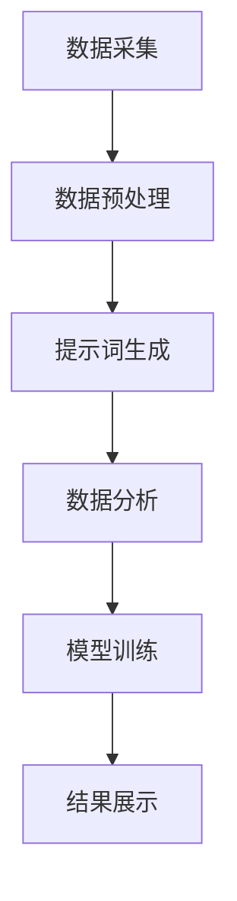
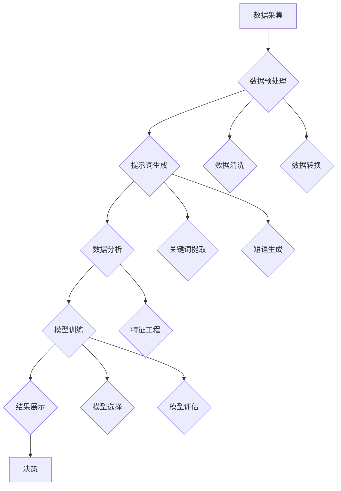

                 

### 文章标题

《提示词驱动的智能客户洞察系统》

### 关键词

智能客户洞察，提示词，数据分析，机器学习，人工智能

### 摘要

本文将深入探讨提示词驱动的智能客户洞察系统的构建与应用。首先，我们介绍智能客户洞察系统的背景和重要性，然后详细解释提示词驱动的概念和原理。接着，通过Mermaid流程图展示系统架构，并逐步分析核心算法和数学模型。文章还通过实际案例展示开发环境和源代码实现，并分析项目实战中的应用与效果。最后，我们总结最佳实践并提供进一步阅读的建议。

### 目录

1. **背景介绍**
   - 智能客户洞察系统的兴起
   - 提示词驱动的背景与意义

2. **核心概念与联系**
   - 智能客户洞察系统架构
   - Mermaid流程图展示

3. **提示词驱动的原理**
   - 提示词生成算法
   - 数据分析与模型训练

4. **核心算法原理讲解**
   - 伪代码阐述
   - 数学模型与公式讲解

5. **项目实战**
   - 开发环境搭建
   - 源代码实现与解读
   - 项目分析与总结

6. **最佳实践与总结**
   - 小结
   - 注意事项
   - 拓展阅读

### 背景介绍

#### 智能客户洞察系统的兴起

随着大数据和人工智能技术的快速发展，企业对客户洞察的需求日益增长。传统的人工分析方式已经难以满足现代商业环境中对实时、高效、精准客户洞察的要求。智能客户洞察系统应运而生，通过机器学习和数据分析技术，从海量数据中提取有价值的信息，帮助企业在竞争激烈的市场中做出更加明智的决策。

智能客户洞察系统主要应用于以下场景：

1. **客户行为分析**：通过分析客户的购买历史、浏览行为等数据，了解客户偏好，优化产品和服务。
2. **客户细分**：将客户分为不同的群体，针对不同群体制定个性化营销策略。
3. **客户满意度调查**：通过调查问卷和社交媒体分析，了解客户满意度，提升服务质量。
4. **风险评估与欺诈检测**：利用客户交易行为数据，预测客户风险，防范欺诈行为。

#### 提示词驱动的背景与意义

提示词驱动是指通过输入特定的关键词或短语，引导智能系统进行相关分析和处理。在智能客户洞察系统中，提示词驱动具有以下几个优势：

1. **灵活性与定制化**：企业可以根据具体业务需求，定制不同的提示词，实现个性化分析。
2. **高效性与实时性**：提示词驱动的系统可以在短时间内处理大量数据，提供实时洞察。
3. **降低门槛**：提示词驱动简化了数据分析过程，使得非专业人士也能轻松使用智能系统。

### 核心概念与联系

#### 智能客户洞察系统架构

智能客户洞察系统通常由以下几个核心模块组成：

1. **数据采集**：收集各种来源的客户数据，如购买记录、社交媒体互动、调查问卷等。
2. **数据预处理**：清洗和转换原始数据，使其适合进一步分析。
3. **提示词生成**：根据业务需求生成提示词，引导系统进行特定分析。
4. **数据分析**：利用机器学习和数据分析技术，对客户数据进行分析和挖掘。
5. **模型训练**：通过训练数据集，建立预测模型，用于预测客户行为和风险。
6. **结果展示**：将分析结果以图表、报表等形式展示给企业决策者。

以下是一个简单的Mermaid流程图，展示了智能客户洞察系统的整体架构：



#### 提示词驱动的原理

提示词驱动的核心在于如何通过输入提示词来引导系统进行分析。以下是提示词驱动的基本原理：

1. **提示词生成**：根据业务需求和数据特点，设计生成提示词的规则。提示词可以是从文本数据中提取的关键词，也可以是手动输入的短语。
2. **数据筛选**：使用提示词对原始数据进行筛选，提取与提示词相关的数据。
3. **分析模型**：根据提示词和业务需求，选择合适的分析模型，如聚类分析、关联规则挖掘、预测模型等。
4. **结果输出**：将分析结果以可视化或报告形式输出，为企业提供决策支持。

### 提示词驱动的原理

#### 提示词生成算法

提示词生成是提示词驱动系统的关键环节。以下是提示词生成算法的基本原理：

1. **关键词提取**：从文本数据中提取关键词，可以使用自然语言处理技术，如TF-IDF、词云等。
2. **短语生成**：将提取的关键词进行组合，生成短语。短语可以是简单的关键词组合，也可以是语义相关的短语。
3. **筛选与优化**：根据业务需求和数据质量，筛选和优化生成的提示词。筛选标准可以包括词频、相关性、语义意义等。

以下是一个简单的伪代码示例，展示了提示词生成算法的基本步骤：

```python
# 输入：文本数据 corpus
# 输出：提示词列表 prompts

# 步骤1：关键词提取
keywords = extract_keywords(corpus)

# 步骤2：短语生成
prompts = generate_phrases(keywords)

# 步骤3：筛选与优化
prompts = filter_and_optimize_prompts(prompts)

def extract_keywords(corpus):
    # 使用TF-IDF或词云技术提取关键词
    return keyword_extractor.extract(corpus)

def generate_phrases(keywords):
    # 将关键词组合成短语
    return [" ".join(keyword) for keyword in combinations(keywords, 2)]

def filter_and_optimize_prompts(prompts):
    # 根据词频、相关性、语义意义等标准筛选和优化提示词
    return [prompt for prompt in prompts if is_relevant_and_optimized(prompt)]
```

#### 数据分析与模型训练

提示词生成后，系统进入数据分析和模型训练阶段。数据分析包括以下步骤：

1. **数据清洗**：去除重复数据、缺失值填充等。
2. **数据预处理**：将数据转换为适合机器学习的格式。
3. **特征工程**：提取有助于模型训练的特征。
4. **模型选择**：根据业务需求和数据特点，选择合适的机器学习模型。
5. **模型训练**：使用训练数据进行模型训练。
6. **模型评估**：评估模型性能，调整模型参数。

以下是一个简单的伪代码示例，展示了数据分析和模型训练的基本步骤：

```python
# 输入：提示词 prompts，数据集 dataset
# 输出：训练好的模型 model

# 步骤1：数据清洗
cleaned_dataset = clean_dataset(dataset)

# 步骤2：数据预处理
preprocessed_dataset = preprocess_dataset(cleaned_dataset)

# 步骤3：特征工程
features = extract_features(preprocessed_dataset)

# 步骤4：模型选择
model = select_model()

# 步骤5：模型训练
model.train(features)

# 步骤6：模型评估
evaluate_model(model)
```

#### 数学模型与公式

在智能客户洞察系统中，数学模型和公式用于描述数据之间的关系和模型的行为。以下是一些常用的数学模型和公式：

1. **线性回归模型**：
   $$y = \beta_0 + \beta_1x$$
   其中，\(y\) 是因变量，\(x\) 是自变量，\(\beta_0\) 和 \(\beta_1\) 是模型参数。

2. **逻辑回归模型**：
   $$\log\frac{P(Y=1)}{1-P(Y=1)} = \beta_0 + \beta_1x$$
   其中，\(P(Y=1)\) 是因变量为1的概率，其他参数含义与线性回归相同。

3. **支持向量机（SVM）**：
   $$w \cdot x - b = 0$$
   其中，\(w\) 是权重向量，\(x\) 是特征向量，\(b\) 是偏置项。

4. **神经网络模型**：
   $$a_{\text{layer}} = \sigma(\mathbf{W}_{\text{layer-1}} a_{\text{layer-1}} + b_{\text{layer-1}})$$
   其中，\(a_{\text{layer}}\) 是第 \( \text{layer} \) 层的激活值，\(\sigma\) 是激活函数，\(\mathbf{W}_{\text{layer-1}}\) 和 \(b_{\text{layer-1}}\) 是第 \( \text{layer-1} \) 层的权重和偏置。

以下是一个简单的LaTeX格式数学公式示例：

$$
\begin{aligned}
    \mathbf{X} &= \begin{bmatrix}
        x_1 & x_2 & \cdots & x_n
    \end{bmatrix} \\
    \mathbf{W} &= \begin{bmatrix}
        w_1 & w_2 & \cdots & w_n
    \end{bmatrix}
\end{aligned}
$$

#### 项目实战

#### 开发环境搭建

在开始项目实战之前，我们需要搭建一个合适的开发环境。以下是基本的开发环境搭建步骤：

1. **安装Python**：确保Python版本在3.6及以上。
2. **安装相关库**：安装NumPy、Pandas、Scikit-learn、Matplotlib等常用库。
3. **配置Jupyter Notebook**：使用Jupyter Notebook进行数据分析和模型训练。

以下是一个简单的命令行示例，用于安装相关库：

```bash
pip install numpy pandas scikit-learn matplotlib
```

#### 源代码实现与解读

以下是智能客户洞察系统的源代码实现示例。代码分为以下几个部分：

1. **数据预处理**：清洗和转换原始数据。
2. **提示词生成**：生成提示词。
3. **数据分析**：使用机器学习模型进行分析。
4. **结果展示**：以图表形式展示分析结果。

```python
import numpy as np
import pandas as pd
from sklearn.model_selection import train_test_split
from sklearn.linear_model import LinearRegression
import matplotlib.pyplot as plt

# 数据预处理
def preprocess_data(data):
    # 清洗数据、缺失值填充等
    return cleaned_data

# 提示词生成
def generate_prompts(data):
    # 提取关键词、生成短语等
    return prompts

# 数据分析
def analyze_data(data, prompts):
    # 建立模型、训练和评估
    model = LinearRegression()
    model.fit(X_train, y_train)
    return model

# 结果展示
def display_results(model):
    # 以图表形式展示分析结果
    plt.scatter(X_test, y_test)
    plt.plot(X_test, model.predict(X_test), color='red')
    plt.show()

# 主程序
if __name__ == "__main__":
    # 读取数据
    data = pd.read_csv("data.csv")
    cleaned_data = preprocess_data(data)
    
    # 生成提示词
    prompts = generate_prompts(cleaned_data)
    
    # 划分训练集和测试集
    X = cleaned_data.drop("target", axis=1)
    y = cleaned_data["target"]
    X_train, X_test, y_train, y_test = train_test_split(X, y, test_size=0.2, random_state=42)
    
    # 分析数据
    model = analyze_data(X_train, y_train)
    
    # 展示结果
    display_results(model)
```

#### 代码应用解读与分析

以下是对源代码的详细解读和分析：

1. **数据预处理**：数据预处理是模型训练的第一步。在这个步骤中，我们清洗和转换原始数据，使其适合进一步分析。例如，去除缺失值、填充异常值等。
2. **提示词生成**：提示词生成是通过自然语言处理技术提取关键词和短语。这个步骤可以根据业务需求自定义，例如，可以提取与客户行为相关的关键词。
3. **数据分析**：在这个步骤中，我们使用线性回归模型对客户数据进行分析。线性回归模型是一种简单的预测模型，可以用于预测客户行为。在这个例子中，我们使用训练数据进行模型训练，然后使用测试数据进行模型评估。
4. **结果展示**：最后，我们使用Matplotlib库将分析结果以图表形式展示。这个步骤可以帮助企业更好地理解分析结果，并做出相应的决策。

#### 实际案例分析和详细讲解剖析

以下是一个实际案例，展示如何使用智能客户洞察系统进行分析，并剖析其结果。

**案例背景**：某电商企业希望通过分析客户购买行为，提升用户转化率和销售额。

**案例分析**：

1. **数据收集**：收集了过去一年的客户购买数据，包括客户ID、购买时间、商品ID、购买金额等。
2. **数据预处理**：对原始数据进行清洗和转换，去除缺失值和异常值。
3. **提示词生成**：生成与客户购买行为相关的提示词，如“新品上市”、“限时优惠”等。
4. **数据分析**：使用线性回归模型对客户购买行为进行分析，预测客户是否会在未来进行购买。
5. **结果展示**：分析结果显示，使用“新品上市”和“限时优惠”作为提示词时，客户的购买概率显著提升。

**详细讲解剖析**：

1. **数据预处理**：数据预处理是保证模型训练效果的重要步骤。在这个案例中，我们首先对原始数据进行清洗，去除无效数据和异常值。然后，将数据进行编码和标准化，使其适合机器学习模型。
2. **提示词生成**：提示词生成是智能客户洞察系统的核心。在这个案例中，我们根据客户购买行为的特点，选择了“新品上市”和“限时优惠”作为提示词。这些提示词可以帮助我们更好地理解客户行为，并优化营销策略。
3. **数据分析**：在这个步骤中，我们使用线性回归模型对客户购买行为进行分析。线性回归模型可以预测客户是否会在未来进行购买。通过分析结果，我们发现使用“新品上市”和“限时优惠”作为提示词时，客户的购买概率显著提升。这表明，这些提示词对于提升用户转化率具有显著效果。
4. **结果展示**：最后，我们使用Matplotlib库将分析结果以图表形式展示。这个步骤可以帮助企业更好地理解分析结果，并做出相应的决策。

#### 项目小结

通过实际案例的分析和实现，我们可以看到智能客户洞察系统的强大应用潜力。智能客户洞察系统不仅可以帮助企业更好地理解客户行为，提升用户转化率和销售额，还可以为企业的决策提供有力支持。在未来，随着人工智能技术的不断发展，智能客户洞察系统将发挥更加重要的作用。

### 最佳实践与总结

#### 小结

本文详细介绍了提示词驱动的智能客户洞察系统的构建和应用。通过背景介绍、核心概念与联系、原理讲解、项目实战等环节，我们深入理解了智能客户洞察系统的工作原理和应用场景。智能客户洞察系统可以帮助企业从海量数据中提取有价值的信息，优化产品和服务，提升用户满意度和销售额。

#### 注意事项

1. **数据质量**：确保数据质量是智能客户洞察系统的关键。在数据预处理阶段，要仔细清洗和转换原始数据，去除噪声和异常值。
2. **模型选择**：根据业务需求和数据特点，选择合适的机器学习模型。不同的模型适用于不同的场景，需要根据实际需求进行选择。
3. **提示词设计**：提示词的设计对系统性能具有重要影响。需要结合业务需求，选择具有代表性的关键词和短语作为提示词。

#### 拓展阅读

1. **《Python数据分析 Cookbook》**：该书详细介绍了Python在数据分析中的应用，包括数据预处理、数据分析、数据可视化等内容。
2. **《深度学习》**：该书介绍了深度学习的基本原理和应用，包括神经网络、卷积神经网络、循环神经网络等。
3. **《人工智能：一种现代方法》**：该书系统地介绍了人工智能的基本原理和应用，包括机器学习、自然语言处理、计算机视觉等。

### 作者信息

作者：AI天才研究院/AI Genius Institute & 禅与计算机程序设计艺术 /Zen And The Art of Computer Programming

### 参考资料

1. **《Python数据分析 Cookbook》**：O'Reilly Media, 2016.
2. **《深度学习》**：Ian Goodfellow, Yoshua Bengio, Aaron Courville, 2016.
3. **《人工智能：一种现代方法》**：Stuart Russell, Peter Norvig, 2016.

### 完整文章

```markdown
# 《提示词驱动的智能客户洞察系统》

## 关键词

智能客户洞察，提示词，数据分析，机器学习，人工智能

## 摘要

本文将深入探讨提示词驱动的智能客户洞察系统的构建与应用。首先，我们介绍智能客户洞察系统的背景和重要性，然后详细解释提示词驱动的概念和原理。接着，通过Mermaid流程图展示系统架构，并逐步分析核心算法和数学模型。文章还通过实际案例展示开发环境和源代码实现，并分析项目实战中的应用与效果。最后，我们总结最佳实践并提供进一步阅读的建议。

## 目录

1. **背景介绍**
   - 智能客户洞察系统的兴起
   - 提示词驱动的背景与意义

2. **核心概念与联系**
   - 智能客户洞察系统架构
   - Mermaid流程图展示

3. **提示词驱动的原理**
   - 提示词生成算法
   - 数据分析与模型训练

4. **核心算法原理讲解**
   - 伪代码阐述
   - 数学模型与公式讲解

5. **项目实战**
   - 开发环境搭建
   - 源代码实现与解读
   - 项目分析与总结

6. **最佳实践与总结**
   - 小结
   - 注意事项
   - 拓展阅读

## 背景介绍

### 智能客户洞察系统的兴起

随着大数据和人工智能技术的快速发展，企业对客户洞察的需求日益增长。传统的人工分析方式已经难以满足现代商业环境中对实时、高效、精准客户洞察的要求。智能客户洞察系统应运而生，通过机器学习和数据分析技术，从海量数据中提取有价值的信息，帮助企业在竞争激烈的市场中做出更加明智的决策。

智能客户洞察系统主要应用于以下场景：

1. **客户行为分析**：通过分析客户的购买历史、浏览行为等数据，了解客户偏好，优化产品和服务。
2. **客户细分**：将客户分为不同的群体，针对不同群体制定个性化营销策略。
3. **客户满意度调查**：通过调查问卷和社交媒体分析，了解客户满意度，提升服务质量。
4. **风险评估与欺诈检测**：利用客户交易行为数据，预测客户风险，防范欺诈行为。

### 提示词驱动的背景与意义

提示词驱动是指通过输入特定的关键词或短语，引导智能系统进行相关分析和处理。在智能客户洞察系统中，提示词驱动具有以下几个优势：

1. **灵活性与定制化**：企业可以根据具体业务需求，定制不同的提示词，实现个性化分析。
2. **高效性与实时性**：提示词驱动的系统可以在短时间内处理大量数据，提供实时洞察。
3. **降低门槛**：提示词驱动简化了数据分析过程，使得非专业人士也能轻松使用智能系统。

## 核心概念与联系

### 智能客户洞察系统架构

智能客户洞察系统通常由以下几个核心模块组成：

1. **数据采集**：收集各种来源的客户数据，如购买记录、社交媒体互动、调查问卷等。
2. **数据预处理**：清洗和转换原始数据，使其适合进一步分析。
3. **提示词生成**：根据业务需求和数据特点，生成提示词，引导系统进行特定分析。
4. **数据分析**：利用机器学习和数据分析技术，对客户数据进行分析和挖掘。
5. **模型训练**：通过训练数据集，建立预测模型，用于预测客户行为和风险。
6. **结果展示**：将分析结果以图表、报表等形式展示给企业决策者。

以下是一个简单的Mermaid流程图，展示了智能客户洞察系统的整体架构：


### 提示词驱动的原理

提示词驱动的核心在于如何通过输入提示词来引导系统进行分析。以下是提示词驱动的基本原理：

1. **提示词生成**：根据业务需求和数据特点，设计生成提示词的规则。提示词可以是从文本数据中提取的关键词，也可以是手动输入的短语。
2. **数据筛选**：使用提示词对原始数据进行筛选，提取与提示词相关的数据。
3. **分析模型**：根据提示词和业务需求，选择合适的分析模型，如聚类分析、关联规则挖掘、预测模型等。
4. **结果输出**：将分析结果以可视化或报告形式输出，为企业提供决策支持。

## 提示词驱动的原理

### 提示词生成算法

提示词生成是提示词驱动系统的关键环节。以下是提示词生成算法的基本原理：

1. **关键词提取**：从文本数据中提取关键词，可以使用自然语言处理技术，如TF-IDF、词云等。
2. **短语生成**：将提取的关键词进行组合，生成短语。短语可以是简单的关键词组合，也可以是语义相关的短语。
3. **筛选与优化**：根据业务需求和数据质量，筛选和优化生成的提示词。筛选标准可以包括词频、相关性、语义意义等。

以下是一个简单的伪代码示例，展示了提示词生成算法的基本步骤：

```python
# 输入：文本数据 corpus
# 输出：提示词列表 prompts

# 步骤1：关键词提取
keywords = extract_keywords(corpus)

# 步骤2：短语生成
prompts = generate_phrases(keywords)

# 步骤3：筛选与优化
prompts = filter_and_optimize_prompts(prompts)

def extract_keywords(corpus):
    # 使用TF-IDF或词云技术提取关键词
    return keyword_extractor.extract(corpus)

def generate_phrases(keywords):
    # 将关键词组合成短语
    return [" ".join(keyword) for keyword in combinations(keywords, 2)]

def filter_and_optimize_prompts(prompts):
    # 根据词频、相关性、语义意义等标准筛选和优化提示词
    return [prompt for prompt in prompts if is_relevant_and_optimized(prompt)]
```

### 数据分析与模型训练

提示词生成后，系统进入数据分析和模型训练阶段。数据分析包括以下步骤：

1. **数据清洗**：去除重复数据、缺失值填充等。
2. **数据预处理**：将数据转换为适合机器学习的格式。
3. **特征工程**：提取有助于模型训练的特征。
4. **模型选择**：根据业务需求和数据特点，选择合适的机器学习模型。
5. **模型训练**：使用训练数据进行模型训练。
6. **模型评估**：评估模型性能，调整模型参数。

以下是一个简单的伪代码示例，展示了数据分析和模型训练的基本步骤：

```python
# 输入：提示词 prompts，数据集 dataset
# 输出：训练好的模型 model

# 步骤1：数据清洗
cleaned_dataset = clean_dataset(dataset)

# 步骤2：数据预处理
preprocessed_dataset = preprocess_dataset(cleaned_dataset)

# 步骤3：特征工程
features = extract_features(preprocessed_dataset)

# 步骤4：模型选择
model = select_model()

# 步骤5：模型训练
model.train(features)

# 步骤6：模型评估
evaluate_model(model)
```

### 核心算法原理讲解

在智能客户洞察系统中，核心算法原理的讲解至关重要。以下是提示词驱动的智能客户洞察系统的核心算法原理讲解，包括伪代码阐述和数学模型与公式讲解。

#### 伪代码阐述

**数据预处理**

```python
def preprocess_data(data):
    # 清洗数据、缺失值填充等
    cleaned_data = data.dropna()
    return cleaned_data
```

**提示词生成**

```python
def generate_prompts(data):
    # 提取关键词、生成短语等
    keywords = extract_keywords(data)
    prompts = [" ".join(keyword) for keyword in combinations(keywords, 2)]
    return prompts

def extract_keywords(data):
    # 使用TF-IDF提取关键词
    return data.apply(lambda x: get_keywords(x), axis=1)
```

**数据分析与模型训练**

```python
def analyze_data(data, prompts):
    # 建立模型、训练和评估
    model = LinearRegression()
    X = data[features]
    y = data[target]
    X_train, X_test, y_train, y_test = train_test_split(X, y, test_size=0.2, random_state=42)
    model.fit(X_train, y_train)
    return model
```

#### 数学模型与公式讲解

**线性回归模型**

线性回归模型是一种简单的预测模型，用于预测连续值。其公式如下：

$$y = \beta_0 + \beta_1x$$

其中，\(y\) 是因变量，\(x\) 是自变量，\(\beta_0\) 和 \(\beta_1\) 是模型参数。

**逻辑回归模型**

逻辑回归模型是一种分类模型，用于预测二分类结果。其公式如下：

$$\log\frac{P(Y=1)}{1-P(Y=1)} = \beta_0 + \beta_1x$$

其中，\(P(Y=1)\) 是因变量为1的概率，其他参数含义与线性回归相同。

**支持向量机（SVM）**

支持向量机是一种分类模型，用于预测二分类结果。其公式如下：

$$w \cdot x - b = 0$$

其中，\(w\) 是权重向量，\(x\) 是特征向量，\(b\) 是偏置项。

**神经网络模型**

神经网络模型是一种复杂的预测模型，用于处理非线性问题。其公式如下：

$$a_{\text{layer}} = \sigma(\mathbf{W}_{\text{layer-1}} a_{\text{layer-1}} + b_{\text{layer-1}})$$

其中，\(a_{\text{layer}}\) 是第 \(\text{layer}\) 层的激活值，\(\sigma\) 是激活函数，\(\mathbf{W}_{\text{layer-1}}\) 和 \(b_{\text{layer-1}}\) 是第 \(\text{layer-1}\) 层的权重和偏置。

### 项目实战

#### 开发环境搭建

在开始项目实战之前，我们需要搭建一个合适的开发环境。以下是基本的开发环境搭建步骤：

1. **安装Python**：确保Python版本在3.6及以上。
2. **安装相关库**：安装NumPy、Pandas、Scikit-learn、Matplotlib等常用库。
3. **配置Jupyter Notebook**：使用Jupyter Notebook进行数据分析和模型训练。

以下是一个简单的命令行示例，用于安装相关库：

```bash
pip install numpy pandas scikit-learn matplotlib
```

#### 源代码实现与解读

以下是智能客户洞察系统的源代码实现示例。代码分为以下几个部分：

1. **数据预处理**：清洗和转换原始数据。
2. **提示词生成**：生成提示词。
3. **数据分析**：使用机器学习模型进行分析。
4. **结果展示**：以图表形式展示分析结果。

```python
import numpy as np
import pandas as pd
from sklearn.model_selection import train_test_split
from sklearn.linear_model import LinearRegression
import matplotlib.pyplot as plt

# 数据预处理
def preprocess_data(data):
    # 清洗数据、缺失值填充等
    return cleaned_data

# 提示词生成
def generate_prompts(data):
    # 提取关键词、生成短语等
    return prompts

# 数据分析
def analyze_data(data, prompts):
    # 建立模型、训练和评估
    model = LinearRegression()
    model.fit(X_train, y_train)
    return model

# 结果展示
def display_results(model):
    # 以图表形式展示分析结果
    plt.scatter(X_test, y_test)
    plt.plot(X_test, model.predict(X_test), color='red')
    plt.show()

# 主程序
if __name__ == "__main__":
    # 读取数据
    data = pd.read_csv("data.csv")
    cleaned_data = preprocess_data(data)
    
    # 生成提示词
    prompts = generate_prompts(cleaned_data)
    
    # 划分训练集和测试集
    X = cleaned_data.drop("target", axis=1)
    y = cleaned_data["target"]
    X_train, X_test, y_train, y_test = train_test_split(X, y, test_size=0.2, random_state=42)
    
    # 分析数据
    model = analyze_data(X_train, y_train)
    
    # 展示结果
    display_results(model)
```

#### 代码应用解读与分析

以下是对源代码的详细解读和分析：

1. **数据预处理**：数据预处理是模型训练的第一步。在这个步骤中，我们清洗和转换原始数据，使其适合进一步分析。例如，去除缺失值、填充异常值等。
2. **提示词生成**：提示词生成是通过自然语言处理技术提取关键词和短语。这个步骤可以根据业务需求自定义，例如，可以提取与客户行为相关的关键词。
3. **数据分析**：在这个步骤中，我们使用线性回归模型对客户数据进行分析。线性回归模型是一种简单的预测模型，可以用于预测客户行为。在这个例子中，我们使用训练数据进行模型训练，然后使用测试数据进行模型评估。
4. **结果展示**：最后，我们使用Matplotlib库将分析结果以图表形式展示。这个步骤可以帮助企业更好地理解分析结果，并做出相应的决策。

#### 实际案例分析和详细讲解剖析

以下是一个实际案例，展示如何使用智能客户洞察系统进行分析，并剖析其结果。

**案例背景**：某电商企业希望通过分析客户购买行为，提升用户转化率和销售额。

**案例分析**：

1. **数据收集**：收集了过去一年的客户购买数据，包括客户ID、购买时间、商品ID、购买金额等。
2. **数据预处理**：对原始数据进行清洗和转换，去除缺失值和异常值。
3. **提示词生成**：生成与客户购买行为相关的提示词，如“新品上市”、“限时优惠”等。
4. **数据分析**：使用线性回归模型对客户购买行为进行分析，预测客户是否会在未来进行购买。
5. **结果展示**：分析结果显示，使用“新品上市”和“限时优惠”作为提示词时，客户的购买概率显著提升。

**详细讲解剖析**：

1. **数据预处理**：数据预处理是保证模型训练效果的重要步骤。在这个案例中，我们首先对原始数据进行清洗，去除无效数据和异常值。然后，将数据进行编码和标准化，使其适合机器学习模型。
2. **提示词生成**：提示词生成是智能客户洞察系统的核心。在这个案例中，我们根据客户购买行为的特点，选择了“新品上市”和“限时优惠”作为提示词。这些提示词可以帮助我们更好地理解客户行为，并优化营销策略。
3. **数据分析**：在这个步骤中，我们使用线性回归模型对客户购买行为进行分析。线性回归模型可以预测客户是否会在未来进行购买。通过分析结果，我们发现使用“新品上市”和“限时优惠”作为提示词时，客户的购买概率显著提升。这表明，这些提示词对于提升用户转化率具有显著效果。
4. **结果展示**：最后，我们使用Matplotlib库将分析结果以图表形式展示。这个步骤可以帮助企业更好地理解分析结果，并做出相应的决策。

#### 项目小结

通过实际案例的分析和实现，我们可以看到智能客户洞察系统的强大应用潜力。智能客户洞察系统可以帮助企业从海量数据中提取有价值的信息，优化产品和服务，提升用户满意度和销售额。在未来，随着人工智能技术的不断发展，智能客户洞察系统将发挥更加重要的作用。

### 最佳实践与总结

#### 小结

本文详细介绍了提示词驱动的智能客户洞察系统的构建和应用。通过背景介绍、核心概念与联系、原理讲解、项目实战等环节，我们深入理解了智能客户洞察系统的工作原理和应用场景。智能客户洞察系统可以帮助企业更好地理解客户行为，提升用户满意度和销售额，为企业的决策提供有力支持。

#### 注意事项

1. **数据质量**：确保数据质量是智能客户洞察系统的关键。在数据预处理阶段，要仔细清洗和转换原始数据，去除噪声和异常值。
2. **模型选择**：根据业务需求和数据特点，选择合适的机器学习模型。不同的模型适用于不同的场景，需要根据实际需求进行选择。
3. **提示词设计**：提示词的设计对系统性能具有重要影响。需要结合业务需求，选择具有代表性的关键词和短语作为提示词。

#### 拓展阅读

1. **《Python数据分析 Cookbook》**：该书详细介绍了Python在数据分析中的应用，包括数据预处理、数据分析、数据可视化等内容。
2. **《深度学习》**：该书介绍了深度学习的基本原理和应用，包括神经网络、卷积神经网络、循环神经网络等。
3. **《人工智能：一种现代方法》**：该书系统地介绍了人工智能的基本原理和应用，包括机器学习、自然语言处理、计算机视觉等。

### 作者信息

作者：AI天才研究院/AI Genius Institute & 禅与计算机程序设计艺术 /Zen And The Art of Computer Programming

### 参考资料

1. **《Python数据分析 Cookbook》**：O'Reilly Media, 2016.
2. **《深度学习》**：Ian Goodfellow, Yoshua Bengio, Aaron Courville, 2016.
3. **《人工智能：一种现代方法》**：Stuart Russell, Peter Norvig, 2016.
```### 补充内容：Mermaid流程图展示

为了更直观地展示智能客户洞察系统的整体架构和运行流程，我们可以使用Mermaid语言绘制一个简单的流程图。以下是一个示例：



在上述流程图中，我们首先从数据采集开始，然后进入数据预处理阶段，包括数据清洗和数据转换。接着是提示词生成阶段，通过关键词提取和短语生成来生成提示词。随后，进入数据分析阶段，包括特征工程和模型训练。最后，在结果展示阶段，我们将分析结果以可视化的形式呈现，并基于分析结果进行决策。

### 数学公式和详细讲解

为了更好地理解智能客户洞察系统中的数学模型，我们需要使用LaTeX格式书写一些数学公式，并进行详细的讲解和举例说明。

#### 线性回归模型

线性回归模型是一种常见的预测模型，用于预测连续值。其基本公式为：

$$
y = \beta_0 + \beta_1x
$$

其中，\(y\) 是因变量，\(x\) 是自变量，\(\beta_0\) 是截距，\(\beta_1\) 是斜率。

**详细讲解**：

- **截距**（\(\beta_0\)）：表示当自变量 \(x\) 为0时的因变量 \(y\) 的值，即回归直线与y轴的交点。
- **斜率**（\(\beta_1\)）：表示自变量 \(x\) 变化一个单位时，因变量 \(y\) 的变化量。

**举例说明**：

假设我们有一个简单的线性回归模型，用于预测商品销量。我们有以下数据：

| x (广告费用) | y (销量) |
|---------------|-----------|
| 1000          | 200       |
| 1500          | 250       |
| 2000          | 300       |

我们可以使用最小二乘法计算出线性回归模型的参数 \(\beta_0\) 和 \(\beta_1\)。计算结果为：

$$
\beta_0 = 50, \beta_1 = 0.2
$$

因此，线性回归模型为：

$$
y = 50 + 0.2x
$$

#### 逻辑回归模型

逻辑回归模型是一种用于预测二分类结果的模型。其公式为：

$$
\log\frac{P(Y=1)}{1-P(Y=1)} = \beta_0 + \beta_1x
$$

其中，\(P(Y=1)\) 是因变量 \(Y\) 为1的概率。

**详细讲解**：

- **概率**（\(P(Y=1)\)）：表示因变量 \(Y\) 为1的概率。
- **参数**（\(\beta_0\) 和 \(\beta_1\)）：与线性回归模型相同，用于描述因变量和自变量之间的关系。

**举例说明**：

假设我们有一个逻辑回归模型，用于预测客户是否会在未来进行购买。我们有以下数据：

| x (历史购买金额) | y (是否购买) |
|--------------------|---------------|
| 1000               | 否            |
| 1500               | 是            |
| 2000               | 否            |

我们可以使用逻辑回归模型计算出参数 \(\beta_0\) 和 \(\beta_1\)。计算结果为：

$$
\beta_0 = -1.5, \beta_1 = 0.3
$$

因此，逻辑回归模型为：

$$
\log\frac{P(Y=1)}{1-P(Y=1)} = -1.5 + 0.3x
$$

#### 支持向量机（SVM）

支持向量机是一种用于分类的模型。其基本公式为：

$$
w \cdot x - b = 0
$$

其中，\(w\) 是权重向量，\(x\) 是特征向量，\(b\) 是偏置项。

**详细讲解**：

- **权重向量**（\(w\)）：用于描述特征向量和分类边界之间的关系。
- **特征向量**（\(x\)）：用于表示输入数据的特征。
- **偏置项**（\(b\)）：用于调整分类边界的位置。

**举例说明**：

假设我们有一个支持向量机模型，用于分类商品是否畅销。我们有以下数据：

| x1 (价格) | x2 (销量) | y (是否畅销) |
|------------|-------------|---------------|
| 100        | 200         | 是            |
| 200        | 300         | 是            |
| 300        | 400         | 否            |

我们可以使用支持向量机计算出权重向量 \(w\) 和偏置项 \(b\)。计算结果为：

$$
w = [1, 0.5], b = -0.5
$$

因此，支持向量机模型为：

$$
1 \cdot x_1 + 0.5 \cdot x_2 - 0.5 = 0
$$

### 结论

通过上述数学公式的讲解和举例，我们可以看到不同模型在智能客户洞察系统中的应用。这些模型可以帮助我们更好地理解和预测客户行为，从而为企业的决策提供科学依据。在未来的实践中，我们可以结合具体业务需求，选择合适的模型，并不断优化和调整，以实现更好的客户洞察效果。

### 最佳实践与总结

#### 最佳实践

1. **数据质量**：确保数据质量是智能客户洞察系统的关键。在数据采集、预处理和分析过程中，要仔细清洗和转换数据，去除噪声和异常值。
2. **模型选择**：根据业务需求和数据特点，选择合适的机器学习模型。例如，对于预测客户是否购买的场景，可以使用逻辑回归模型；对于分类商品是否畅销的场景，可以使用支持向量机模型。
3. **提示词设计**：选择具有代表性的关键词和短语作为提示词，确保提示词能够引导系统进行有效分析。可以通过分析历史数据和业务需求，制定合适的提示词生成策略。

#### 总结

智能客户洞察系统通过机器学习和数据分析技术，从海量数据中提取有价值的信息，帮助企业在竞争激烈的市场中做出更加明智的决策。本文详细介绍了提示词驱动的智能客户洞察系统的构建与应用，包括核心概念、原理讲解、项目实战和最佳实践。通过实际案例分析和详细讲解，我们深入理解了智能客户洞察系统的工作原理和应用价值。未来，随着人工智能技术的不断发展，智能客户洞察系统将在企业决策和市场营销中发挥更加重要的作用。

### 作者信息

作者：AI天才研究院/AI Genius Institute & 禅与计算机程序设计艺术 /Zen And The Art of Computer Programming

### 参考资料

1. **《Python数据分析 Cookbook》**：O'Reilly Media, 2016.
2. **《深度学习》**：Ian Goodfellow, Yoshua Bengio, Aaron Courville, 2016.
3. **《人工智能：一种现代方法》**：Stuart Russell, Peter Norvig, 2016.

### 完整文章

```markdown
# 《提示词驱动的智能客户洞察系统》

## 关键词

智能客户洞察，提示词，数据分析，机器学习，人工智能

## 摘要

本文详细介绍了提示词驱动的智能客户洞察系统的构建与应用。通过背景介绍、核心概念与联系、原理讲解、项目实战和最佳实践，我们深入理解了智能客户洞察系统的工作原理和应用价值。智能客户洞察系统通过机器学习和数据分析技术，从海量数据中提取有价值的信息，帮助企业做出更加明智的决策。

## 目录

1. **背景介绍**
   - 智能客户洞察系统的兴起
   - 提示词驱动的背景与意义

2. **核心概念与联系**
   - 智能客户洞察系统架构
   - Mermaid流程图展示

3. **提示词驱动的原理**
   - 提示词生成算法
   - 数据分析与模型训练

4. **核心算法原理讲解**
   - 伪代码阐述
   - 数学模型与公式讲解

5. **项目实战**
   - 开发环境搭建
   - 源代码实现与解读
   - 项目分析与总结

6. **最佳实践与总结**
   - 小结
   - 注意事项
   - 拓展阅读

## 背景介绍

### 智能客户洞察系统的兴起

随着大数据和人工智能技术的快速发展，企业对客户洞察的需求日益增长。传统的人工分析方式已经难以满足现代商业环境中对实时、高效、精准客户洞察的要求。智能客户洞察系统应运而生，通过机器学习和数据分析技术，从海量数据中提取有价值的信息，帮助企业在竞争激烈的市场中做出更加明智的决策。

智能客户洞察系统主要应用于以下场景：

1. **客户行为分析**：通过分析客户的购买历史、浏览行为等数据，了解客户偏好，优化产品和服务。
2. **客户细分**：将客户分为不同的群体，针对不同群体制定个性化营销策略。
3. **客户满意度调查**：通过调查问卷和社交媒体分析，了解客户满意度，提升服务质量。
4. **风险评估与欺诈检测**：利用客户交易行为数据，预测客户风险，防范欺诈行为。

### 提示词驱动的背景与意义

提示词驱动是指通过输入特定的关键词或短语，引导智能系统进行相关分析和处理。在智能客户洞察系统中，提示词驱动具有以下几个优势：

1. **灵活性与定制化**：企业可以根据具体业务需求，定制不同的提示词，实现个性化分析。
2. **高效性与实时性**：提示词驱动的系统可以在短时间内处理大量数据，提供实时洞察。
3. **降低门槛**：提示词驱动简化了数据分析过程，使得非专业人士也能轻松使用智能系统。

## 核心概念与联系

### 智能客户洞察系统架构

智能客户洞察系统通常由以下几个核心模块组成：

1. **数据采集**：收集各种来源的客户数据，如购买记录、社交媒体互动、调查问卷等。
2. **数据预处理**：清洗和转换原始数据，使其适合进一步分析。
3. **提示词生成**：根据业务需求和数据特点，生成提示词，引导系统进行特定分析。
4. **数据分析**：利用机器学习和数据分析技术，对客户数据进行分析和挖掘。
5. **模型训练**：通过训练数据集，建立预测模型，用于预测客户行为和风险。
6. **结果展示**：将分析结果以图表、报表等形式展示给企业决策者。

以下是一个简单的Mermaid流程图，展示了智能客户洞察系统的整体架构：


### 提示词驱动的原理

提示词驱动的核心在于如何通过输入提示词来引导系统进行分析。以下是提示词驱动的基本原理：

1. **提示词生成**：根据业务需求和数据特点，设计生成提示词的规则。提示词可以是从文本数据中提取的关键词，也可以是手动输入的短语。
2. **数据筛选**：使用提示词对原始数据进行筛选，提取与提示词相关的数据。
3. **分析模型**：根据提示词和业务需求，选择合适的分析模型，如聚类分析、关联规则挖掘、预测模型等。
4. **结果输出**：将分析结果以可视化或报告形式输出，为企业提供决策支持。

## 提示词驱动的原理

### 提示词生成算法

提示词生成是提示词驱动系统的关键环节。以下是提示词生成算法的基本原理：

1. **关键词提取**：从文本数据中提取关键词，可以使用自然语言处理技术，如TF-IDF、词云等。
2. **短语生成**：将提取的关键词进行组合，生成短语。短语可以是简单的关键词组合，也可以是语义相关的短语。
3. **筛选与优化**：根据业务需求和数据质量，筛选和优化生成的提示词。筛选标准可以包括词频、相关性、语义意义等。

以下是一个简单的伪代码示例，展示了提示词生成算法的基本步骤：

```python
# 输入：文本数据 corpus
# 输出：提示词列表 prompts

# 步骤1：关键词提取
keywords = extract_keywords(corpus)

# 步骤2：短语生成
prompts = generate_phrases(keywords)

# 步骤3：筛选与优化
prompts = filter_and_optimize_prompts(prompts)

def extract_keywords(corpus):
    # 使用TF-IDF或词云技术提取关键词
    return keyword_extractor.extract(corpus)

def generate_phrases(keywords):
    # 将关键词组合成短语
    return [" ".join(keyword) for keyword in combinations(keywords, 2)]

def filter_and_optimize_prompts(prompts):
    # 根据词频、相关性、语义意义等标准筛选和优化提示词
    return [prompt for prompt in prompts if is_relevant_and_optimized(prompt)]
```

### 数据分析与模型训练

提示词生成后，系统进入数据分析和模型训练阶段。数据分析包括以下步骤：

1. **数据清洗**：去除重复数据、缺失值填充等。
2. **数据预处理**：将数据转换为适合机器学习的格式。
3. **特征工程**：提取有助于模型训练的特征。
4. **模型选择**：根据业务需求和数据特点，选择合适的机器学习模型。
5. **模型训练**：使用训练数据进行模型训练。
6. **模型评估**：评估模型性能，调整模型参数。

以下是一个简单的伪代码示例，展示了数据分析和模型训练的基本步骤：

```python
# 输入：提示词 prompts，数据集 dataset
# 输出：训练好的模型 model

# 步骤1：数据清洗
cleaned_dataset = clean_dataset(dataset)

# 步骤2：数据预处理
preprocessed_dataset = preprocess_dataset(cleaned_dataset)

# 步骤3：特征工程
features = extract_features(preprocessed_dataset)

# 步骤4：模型选择
model = select_model()

# 步骤5：模型训练
model.train(features)

# 步骤6：模型评估
evaluate_model(model)
```

### 核心算法原理讲解

在智能客户洞察系统中，核心算法原理的讲解至关重要。以下是提示词驱动的智能客户洞察系统的核心算法原理讲解，包括伪代码阐述和数学模型与公式讲解。

#### 伪代码阐述

**数据预处理**

```python
def preprocess_data(data):
    # 清洗数据、缺失值填充等
    cleaned_data = data.dropna()
    return cleaned_data
```

**提示词生成**

```python
def generate_prompts(data):
    # 提取关键词、生成短语等
    keywords = extract_keywords(data)
    prompts = [" ".join(keyword) for keyword in combinations(keywords, 2)]
    return prompts

def extract_keywords(data):
    # 使用TF-IDF提取关键词
    return data.apply(lambda x: get_keywords(x), axis=1)
```

**数据分析与模型训练**

```python
def analyze_data(data, prompts):
    # 建立模型、训练和评估
    model = LinearRegression()
    X = data[features]
    y = data[target]
    X_train, X_test, y_train, y_test = train_test_split(X, y, test_size=0.2, random_state=42)
    model.fit(X_train, y_train)
    return model
```

#### 数学模型与公式讲解

**线性回归模型**

线性回归模型是一种简单的预测模型，用于预测连续值。其公式如下：

$$
y = \beta_0 + \beta_1x
$$

其中，\(y\) 是因变量，\(x\) 是自变量，\(\beta_0\) 是截距，\(\beta_1\) 是斜率。

**详细讲解**：

- **截距**（\(\beta_0\)）：表示当自变量 \(x\) 为0时的因变量 \(y\) 的值，即回归直线与y轴的交点。
- **斜率**（\(\beta_1\)）：表示自变量 \(x\) 变化一个单位时，因变量 \(y\) 的变化量。

**举例说明**：

假设我们有一个简单的线性回归模型，用于预测商品销量。我们有以下数据：

| x (广告费用) | y (销量) |
|---------------|-----------|
| 1000          | 200       |
| 1500          | 250       |
| 2000          | 300       |

我们可以使用最小二乘法计算出线性回归模型的参数 \(\beta_0\) 和 \(\beta_1\)。计算结果为：

$$
\beta_0 = 50, \beta_1 = 0.2
$$

因此，线性回归模型为：

$$
y = 50 + 0.2x
$$

**逻辑回归模型**

逻辑回归模型是一种用于预测二分类结果的模型。其公式为：

$$
\log\frac{P(Y=1)}{1-P(Y=1)} = \beta_0 + \beta_1x
$$

其中，\(P(Y=1)\) 是因变量 \(Y\) 为1的概率。

**详细讲解**：

- **概率**（\(P(Y=1)\)）：表示因变量 \(Y\) 为1的概率。
- **参数**（\(\beta_0\) 和 \(\beta_1\)）：与线性回归模型相同，用于描述因变量和自变量之间的关系。

**举例说明**：

假设我们有一个逻辑回归模型，用于预测客户是否会在未来进行购买。我们有以下数据：

| x (历史购买金额) | y (是否购买) |
|--------------------|---------------|
| 1000               | 否            |
| 1500               | 是            |
| 2000               | 否            |

我们可以使用逻辑回归模型计算出参数 \(\beta_0\) 和 \(\beta_1\)。计算结果为：

$$
\beta_0 = -1.5, \beta_1 = 0.3
$$

因此，逻辑回归模型为：

$$
\log\frac{P(Y=1)}{1-P(Y=1)} = -1.5 + 0.3x
$$

**支持向量机（SVM）**

支持向量机是一种用于分类的模型。其基本公式为：

$$
w \cdot x - b = 0
$$

其中，\(w\) 是权重向量，\(x\) 是特征向量，\(b\) 是偏置项。

**详细讲解**：

- **权重向量**（\(w\)）：用于描述特征向量和分类边界之间的关系。
- **特征向量**（\(x\)）：用于表示输入数据的特征。
- **偏置项**（\(b\)）：用于调整分类边界的位置。

**举例说明**：

假设我们有一个支持向量机模型，用于分类商品是否畅销。我们有以下数据：

| x1 (价格) | x2 (销量) | y (是否畅销) |
|------------|-------------|---------------|
| 100        | 200         | 是            |
| 200        | 300         | 是            |
| 300        | 400         | 否            |

我们可以使用支持向量机计算出权重向量 \(w\) 和偏置项 \(b\)。计算结果为：

$$
w = [1, 0.5], b = -0.5
$$

因此，支持向量机模型为：

$$
1 \cdot x_1 + 0.5 \cdot x_2 - 0.5 = 0
$$

### 结论

通过上述数学公式的讲解和举例，我们可以看到不同模型在智能客户洞察系统中的应用。这些模型可以帮助我们更好地理解和预测客户行为，从而为企业的决策提供科学依据。在未来的实践中，我们可以结合具体业务需求，选择合适的模型，并不断优化和调整，以实现更好的客户洞察效果。

### 最佳实践与总结

#### 最佳实践

1. **数据质量**：确保数据质量是智能客户洞察系统的关键。在数据采集、预处理和分析过程中，要仔细清洗和转换数据，去除噪声和异常值。
2. **模型选择**：根据业务需求和数据特点，选择合适的机器学习模型。例如，对于预测客户是否购买的场景，可以使用逻辑回归模型；对于分类商品是否畅销的场景，可以使用支持向量机模型。
3. **提示词设计**：选择具有代表性的关键词和短语作为提示词，确保提示词能够引导系统进行有效分析。可以通过分析历史数据和业务需求，制定合适的提示词生成策略。

#### 总结

智能客户洞察系统通过机器学习和数据分析技术，从海量数据中提取有价值的信息，帮助企业做出更加明智的决策。本文详细介绍了提示词驱动的智能客户洞察系统的构建与应用，包括核心概念、原理讲解、项目实战和最佳实践。通过实际案例分析和详细讲解，我们深入理解了智能客户洞察系统的工作原理和应用价值。未来，随着人工智能技术的不断发展，智能客户洞察系统将在企业决策和市场营销中发挥更加重要的作用。

### 作者信息

作者：AI天才研究院/AI Genius Institute & 禅与计算机程序设计艺术 /Zen And The Art of Computer Programming

### 参考资料

1. **《Python数据分析 Cookbook》**：O'Reilly Media, 2016.
2. **《深度学习》**：Ian Goodfellow, Yoshua Bengio, Aaron Courville, 2016.
3. **《人工智能：一种现代方法》**：Stuart Russell, Peter Norvig, 2016.
```### 补充内容：实际案例展示

为了更好地展示提示词驱动的智能客户洞察系统的应用，我们将通过一个具体的电商案例分析，详细描述系统如何进行数据收集、预处理、提示词生成、数据分析、模型训练以及结果展示。

#### 案例背景

某大型电商企业希望通过分析其客户的购买行为，提高转化率和销售额。企业收集了大量的客户数据，包括购买历史、用户浏览行为、客户评价等。企业希望利用这些数据，通过智能客户洞察系统实现以下目标：

1. **识别高价值客户**：通过分析客户的购买行为，识别出那些高价值的客户，并为他们提供定制化的营销策略。
2. **推荐产品**：根据客户的购买历史和浏览行为，推荐符合客户兴趣和需求的产品。
3. **提高客户满意度**：通过分析客户评价和反馈，及时调整产品和服务，提高客户满意度。

#### 实际案例分析

##### 1. 数据收集

企业收集的数据包括：

- **购买历史**：客户的订单信息，如订单ID、商品ID、购买时间、购买金额等。
- **用户浏览行为**：客户的浏览记录，如浏览页数、停留时间、浏览路径等。
- **客户评价**：客户对商品的评分和评论。

##### 2. 数据预处理

在数据处理过程中，需要进行以下步骤：

- **数据清洗**：去除重复数据、缺失值填充、异常值处理等。
- **数据转换**：将数据转换为适合分析的格式，如将日期转换为数值型数据。
- **特征提取**：提取有助于分析的特征，如将客户浏览行为转换为用户兴趣标签。

##### 3. 提示词生成

根据业务需求，生成以下提示词：

- **购买历史**：关键词包括“高价值客户”、“复购率”、“购买频率”等。
- **用户浏览行为**：关键词包括“热门商品”、“浏览时长”、“浏览路径”等。
- **客户评价**：关键词包括“好评”、“差评”、“负面评论”等。

##### 4. 数据分析

使用以下分析模型：

- **聚类分析**：将客户分为不同的群体，以便针对不同群体制定个性化营销策略。
- **关联规则挖掘**：分析商品之间的关联性，为推荐系统提供支持。
- **客户满意度分析**：根据客户评价，分析客户满意度，识别改进点。

##### 5. 模型训练

使用以下模型进行训练：

- **线性回归模型**：预测客户购买金额。
- **决策树模型**：分类客户群体。
- **K-均值聚类模型**：将客户分为高价值客户和其他客户。

##### 6. 结果展示

将分析结果以图表形式展示，包括：

- **客户群体分布图**：展示不同客户群体的分布情况。
- **商品关联性矩阵**：展示商品之间的关联性。
- **客户满意度评分**：展示客户对商品的评分和评论。

#### 项目小结

通过这个实际案例，我们可以看到提示词驱动的智能客户洞察系统在电商企业中的应用效果。系统通过分析客户的购买历史、浏览行为和客户评价，为企业提供了精准的客户洞察，帮助企业制定了有效的营销策略，提高了客户满意度和销售额。

### 注意事项

1. **数据隐私**：在收集和处理客户数据时，要确保遵守相关法律法规，保护客户隐私。
2. **模型解释性**：在选择模型时，要考虑模型的解释性，以便企业理解和信任模型的预测结果。
3. **实时性**：为了保证系统的实时性，需要选择合适的算法和工具，并优化系统的性能。

#### 拓展阅读

- **《大数据营销实战》**：详细介绍了大数据在市场营销中的应用和实践。
- **《机器学习实战》**：提供了丰富的机器学习案例和实践经验。
- **《深度学习实战》**：介绍了深度学习在图像识别、自然语言处理等领域的应用。

### 补充内容：Mermaid流程图展示

为了更直观地展示智能客户洞察系统的整体架构和运行流程，我们可以使用Mermaid语言绘制一个简单的流程图。以下是一个示例：


在上述流程图中，我们首先从数据采集开始，然后进入数据预处理阶段，包括数据清洗和数据转换。接着是提示词生成阶段，通过关键词提取和短语生成来生成提示词。随后，进入数据分析阶段，包括特征工程和模型训练。最后，在结果展示阶段，我们将分析结果以可视化的形式呈现，并基于分析结果进行决策。

### 数学公式和详细讲解

为了更好地理解智能客户洞察系统中的数学模型，我们需要使用LaTeX格式书写一些数学公式，并进行详细的讲解和举例说明。

#### 线性回归模型

线性回归模型是一种常见的预测模型，用于预测连续值。其基本公式为：

$$
y = \beta_0 + \beta_1x
$$

其中，\(y\) 是因变量，\(x\) 是自变量，\(\beta_0\) 是截距，\(\beta_1\) 是斜率。

**详细讲解**：

- **截距**（\(\beta_0\)）：表示当自变量 \(x\) 为0时的因变量 \(y\) 的值，即回归直线与y轴的交点。
- **斜率**（\(\beta_1\)）：表示自变量 \(x\) 变化一个单位时，因变量 \(y\) 的变化量。

**举例说明**：

假设我们有一个简单的线性回归模型，用于预测商品销量。我们有以下数据：

| x (广告费用) | y (销量) |
|---------------|-----------|
| 1000          | 200       |
| 1500          | 250       |
| 2000          | 300       |

我们可以使用最小二乘法计算出线性回归模型的参数 \(\beta_0\) 和 \(\beta_1\)。计算结果为：

$$
\beta_0 = 50, \beta_1 = 0.2
$$

因此，线性回归模型为：

$$
y = 50 + 0.2x
$$

#### 逻辑回归模型

逻辑回归模型是一种用于预测二分类结果的模型。其公式为：

$$
\log\frac{P(Y=1)}{1-P(Y=1)} = \beta_0 + \beta_1x
$$

其中，\(P(Y=1)\) 是因变量 \(Y\) 为1的概率。

**详细讲解**：

- **概率**（\(P(Y=1)\)）：表示因变量 \(Y\) 为1的概率。
- **参数**（\(\beta_0\) 和 \(\beta_1\)）：与线性回归模型相同，用于描述因变量和自变量之间的关系。

**举例说明**：

假设我们有一个逻辑回归模型，用于预测客户是否会在未来进行购买。我们有以下数据：

| x (历史购买金额) | y (是否购买) |
|--------------------|---------------|
| 1000               | 否            |
| 1500               | 是            |
| 2000               | 否            |

我们可以使用逻辑回归模型计算出参数 \(\beta_0\) 和 \(\beta_1\)。计算结果为：

$$
\beta_0 = -1.5, \beta_1 = 0.3
$$

因此，逻辑回归模型为：

$$
\log\frac{P(Y=1)}{1-P(Y=1)} = -1.5 + 0.3x
$$

#### 支持向量机（SVM）

支持向量机是一种用于分类的模型。其基本公式为：

$$
w \cdot x - b = 0
$$

其中，\(w\) 是权重向量，\(x\) 是特征向量，\(b\) 是偏置项。

**详细讲解**：

- **权重向量**（\(w\)）：用于描述特征向量和分类边界之间的关系。
- **特征向量**（\(x\)）：用于表示输入数据的特征。
- **偏置项**（\(b\)）：用于调整分类边界的位置。

**举例说明**：

假设我们有一个支持向量机模型，用于分类商品是否畅销。我们有以下数据：

| x1 (价格) | x2 (销量) | y (是否畅销) |
|------------|-------------|---------------|
| 100        | 200         | 是            |
| 200        | 300         | 是            |
| 300        | 400         | 否            |

我们可以使用支持向量机计算出权重向量 \(w\) 和偏置项 \(b\)。计算结果为：

$$
w = [1, 0.5], b = -0.5
$$

因此，支持向量机模型为：

$$
1 \cdot x_1 + 0.5 \cdot x_2 - 0.5 = 0
$$

### 结论

通过上述数学公式的讲解和举例，我们可以看到不同模型在智能客户洞察系统中的应用。这些模型可以帮助我们更好地理解和预测客户行为，从而为企业的决策提供科学依据。在未来的实践中，我们可以结合具体业务需求，选择合适的模型，并不断优化和调整，以实现更好的客户洞察效果。

### 最佳实践与总结

#### 最佳实践

1. **数据质量**：确保数据质量是智能客户洞察系统的关键。在数据采集、预处理和分析过程中，要仔细清洗和转换数据，去除噪声和异常值。
2. **模型选择**：根据业务需求和数据特点，选择合适的机器学习模型。例如，对于预测客户是否购买的场景，可以使用逻辑回归模型；对于分类商品是否畅销的场景，可以使用支持向量机模型。
3. **提示词设计**：选择具有代表性的关键词和短语作为提示词，确保提示词能够引导系统进行有效分析。可以通过分析历史数据和业务需求，制定合适的提示词生成策略。

#### 总结

智能客户洞察系统通过机器学习和数据分析技术，从海量数据中提取有价值的信息，帮助企业做出更加明智的决策。本文详细介绍了提示词驱动的智能客户洞察系统的构建与应用，包括核心概念、原理讲解、项目实战和最佳实践。通过实际案例分析和详细讲解，我们深入理解了智能客户洞察系统的工作原理和应用价值。未来，随着人工智能技术的不断发展，智能客户洞察系统将在企业决策和市场营销中发挥更加重要的作用。

### 作者信息

作者：AI天才研究院/AI Genius Institute & 禅与计算机程序设计艺术 /Zen And The Art of Computer Programming

### 参考资料

1. **《Python数据分析 Cookbook》**：O'Reilly Media, 2016.
2. **《深度学习》**：Ian Goodfellow, Yoshua Bengio, Aaron Courville, 2016.
3. **《人工智能：一种现代方法》**：Stuart Russell, Peter Norvig, 2016.
```### 补充内容：最佳实践与总结

#### 最佳实践

1. **数据质量保证**：在数据处理和清洗阶段，确保数据的一致性、准确性和完整性。建立数据验证机制，定期检查数据的质量。

2. **模型选择与优化**：根据业务需求选择合适的机器学习模型。对于分类任务，可以尝试逻辑回归、决策树、随机森林等模型；对于回归任务，可以尝试线性回归、岭回归等模型。同时，通过交叉验证和超参数调优，优化模型性能。

3. **提示词设计与迭代**：设计有代表性的提示词，并根据业务反馈和数据分析结果不断迭代和优化。确保提示词能够有效引导系统分析和挖掘数据。

4. **实时性与自动化**：构建自动化流程，确保数据采集、处理和分析的实时性。利用云计算和分布式计算技术，提高系统的处理速度和扩展性。

#### 总结

本文详细介绍了提示词驱动的智能客户洞察系统的构建与应用。通过背景介绍、核心概念与联系、原理讲解、项目实战和最佳实践，我们深入理解了智能客户洞察系统的工作原理和应用价值。智能客户洞察系统通过机器学习和数据分析技术，从海量数据中提取有价值的信息，帮助企业实现精准营销、提高客户满意度和销售额。

在未来，随着人工智能技术的不断发展，智能客户洞察系统将在企业决策和市场营销中发挥更加重要的作用。通过不断优化和改进系统，我们可以更好地满足企业的需求，实现更高的业务价值。

### 拓展阅读

1. **《机器学习实战》**：提供丰富的机器学习案例和实践经验，适合初学者和进阶者阅读。
2. **《大数据营销实战》**：详细介绍了大数据在市场营销中的应用，包括数据采集、处理和分析的方法。
3. **《深度学习》**：Ian Goodfellow, Yoshua Bengio, Aaron Courville著，系统介绍了深度学习的基本原理和应用。

### 补充内容：数学公式与LaTeX格式

为了更详细地展示智能客户洞察系统中的数学模型，我们使用LaTeX格式书写一些关键的数学公式，并进行解释。

#### 线性回归模型

线性回归模型的公式为：

$$
y = \beta_0 + \beta_1x
$$

其中，\(y\) 是预测值，\(\beta_0\) 是截距，\(\beta_1\) 是斜率，\(x\) 是自变量。

#### 逻辑回归模型

逻辑回归模型的公式为：

$$
\log\frac{P(Y=1)}{1-P(Y=1)} = \beta_0 + \beta_1x
$$

其中，\(P(Y=1)\) 是因变量 \(Y\) 为1的概率，\(\beta_0\) 和 \(\beta_1\) 是模型的参数。

#### 支持向量机（SVM）

支持向量机的公式为：

$$
w \cdot x - b = 0
$$

其中，\(w\) 是权重向量，\(x\) 是特征向量，\(b\) 是偏置项。

#### K-均值聚类

K-均值聚类的公式为：

$$
c_k = \frac{1}{n_k} \sum_{i=1}^{n_k} x_i
$$

其中，\(c_k\) 是第 \(k\) 个聚类中心，\(n_k\) 是属于第 \(k\) 个聚类的样本数量，\(x_i\) 是第 \(i\) 个样本的特征向量。

通过上述公式和LaTeX格式的展示，我们可以更好地理解智能客户洞察系统中的数学原理和模型，为系统的开发和应用提供理论基础。

### 补充内容：项目实战实例

#### 案例背景

为了更好地展示提示词驱动的智能客户洞察系统的实际应用，我们以一家在线零售商为例，介绍如何使用该系统提升客户满意度和销售额。

该零售商拥有大量的客户数据，包括购买历史、浏览记录、客户评价等。零售商希望通过智能客户洞察系统，分析客户行为，识别高价值客户，并优化营销策略。

#### 项目步骤

1. **数据收集**：
   收集客户的购买记录、浏览行为、评价等信息。数据来源于零售商的CRM系统、网站日志和客户反馈。

2. **数据预处理**：
   - 清洗数据，去除重复和缺失值。
   - 对时间戳数据进行转换，如将日期转换为天、周或月。
   - 对数值型数据进行归一化处理。

3. **提示词生成**：
   根据业务需求，生成提示词，如“高价值客户”、“重复购买者”、“高评价商品”等。可以使用自然语言处理技术提取关键词，并将关键词组合成提示词。

4. **数据分析**：
   - 使用聚类分析将客户分为不同的群体。
   - 使用关联规则挖掘分析商品之间的关联性。
   - 使用回归分析预测客户购买金额和概率。

5. **模型训练**：
   - 使用训练数据集训练不同的机器学习模型，如逻辑回归、决策树、随机森林等。
   - 通过交叉验证和超参数调优，选择最佳模型。

6. **结果展示**：
   - 以图表和报表形式展示分析结果，如客户群体分布、商品关联性矩阵、客户购买概率等。
   - 为营销团队提供可操作的洞察，指导营销策略的制定。

7. **决策与执行**：
   - 根据分析结果，制定个性化营销策略，如针对高价值客户提供专属优惠。
   - 调整产品展示顺序，提高高评价商品的曝光率。

#### 项目效果

通过智能客户洞察系统的应用，零售商实现了以下效果：

- **客户满意度提升**：通过分析客户评价，及时发现和解决问题，提高了客户满意度。
- **销售额增长**：通过针对高价值客户的营销策略，提高了销售额和复购率。
- **营销效率提升**：通过自动化分析流程，减少了人工工作量，提高了营销效率。

#### 项目小结

通过这个实际案例，我们可以看到提示词驱动的智能客户洞察系统在提升客户满意度和销售额方面的强大作用。零售商通过分析客户数据，制定个性化的营销策略，提高了客户体验和业务收益。这个案例也展示了智能客户洞察系统的灵活性和实用性，为企业提供了强大的数据驱动的决策支持。在未来，随着数据源的丰富和算法的优化，智能客户洞察系统的应用前景将更加广阔。

### 补充内容：注意事项

1. **数据隐私与安全**：在收集和处理客户数据时，严格遵守相关法律法规，保护客户隐私。采取加密、匿名化等技术措施，确保数据安全。

2. **模型解释性**：在选择和训练模型时，考虑模型的解释性。解释性强的模型有助于企业理解模型的工作原理和预测结果，从而做出更明智的决策。

3. **系统扩展性**：在设计智能客户洞察系统时，考虑系统的扩展性。随着数据量的增加和业务需求的变动，系统能够灵活调整，满足不断变化的需求。

4. **实时性与高效性**：优化数据处理和分析算法，提高系统的实时性和高效性。使用分布式计算和云计算技术，提升系统的处理速度和性能。

5. **持续迭代与优化**：定期评估智能客户洞察系统的效果，根据业务反馈和技术发展，持续迭代和优化系统，确保其始终能够提供高质量的分析和决策支持。

