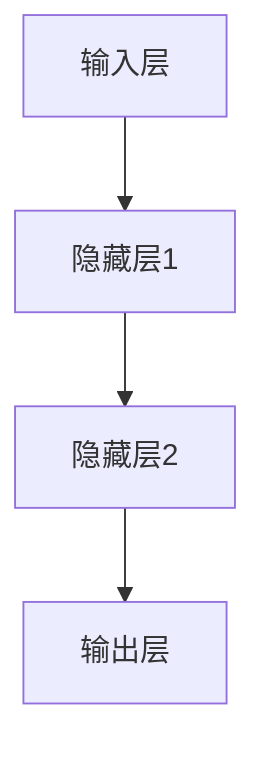
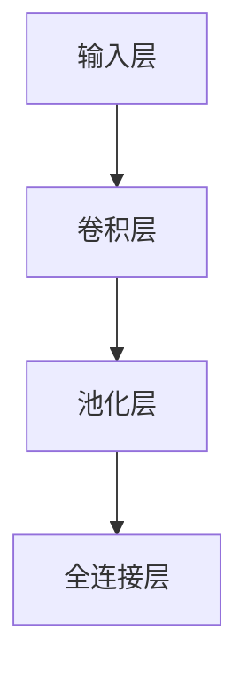
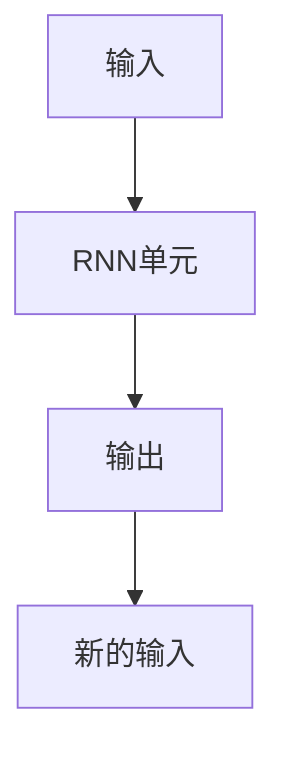
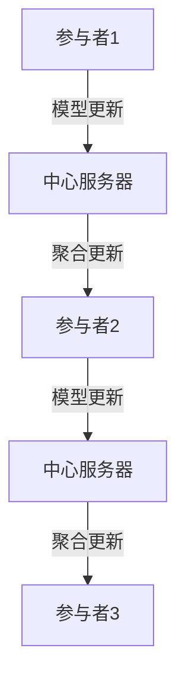

                 


### 文章标题

《AI编程的新原语与新方法》

### 关键词

AI编程，深度学习，强化学习，新原语，新方法，迁移学习，联邦学习

### 摘要

本文旨在探讨AI编程领域的新原语和新方法，包括深度学习、强化学习等新原语的原理和应用，以及迁移学习和联邦学习等新方法的实现和应用。通过分析这些新原语和新方法，读者可以更好地理解AI编程的本质，掌握AI编程的核心技能，从而在实际项目中发挥更大的作用。

### 《AI编程的新原语与新方法》目录大纲

#### 第一部分：AI编程基础知识

##### 第1章：AI编程概述

###### 1.1 AI编程的兴起与发展

- AI编程的背景
- AI编程的重要性

###### 1.2 AI编程的核心概念

- 机器学习
- 深度学习
- 强化学习

###### 1.3 AI编程的基本原理

- 数据预处理
- 特征工程
- 模型选择与训练

##### 第2章：AI编程语言与工具

###### 2.1 Python在AI编程中的应用

- Python的特点
- Python在AI编程中的优势

###### 2.2 常用AI编程库和框架

- TensorFlow
- PyTorch
- Keras

###### 2.3 AI编程开发环境搭建

- 环境配置
- 常用工具与插件安装

#### 第二部分：AI编程新原语

##### 第3章：深度学习新原语

###### 3.1 深度学习基础

- 神经网络结构
- 损失函数与优化算法

###### 3.2 卷积神经网络（CNN）

- CNN的基本原理
- CNN在图像处理中的应用

###### 3.3 循环神经网络（RNN）

- RNN的基本原理
- LSTM与GRU

##### 第4章：强化学习新原语

###### 4.1 强化学习基础

- 强化学习的基本概念
- 强化学习的常见算法

###### 4.2 深度强化学习

- 深度Q网络（DQN）
- 策略梯度方法（PG）

###### 4.3 对抗性生成网络（GAN）

- GAN的基本原理
- GAN的应用场景

#### 第三部分：AI编程新方法

##### 第5章：迁移学习与新方法

###### 5.1 迁移学习基础

- 迁移学习的概念
- 迁移学习的优势

###### 5.2 迁移学习方法

- 少样本学习
- 无监督迁移学习

##### 第6章：联邦学习与新方法

###### 6.1 联邦学习基础

- 联邦学习的概念
- 联邦学习的优势

###### 6.2 联邦学习方法

- 中央化方法
- 联邦平均方法

##### 第7章：AI编程实践与新方法

###### 7.1 AI编程项目实战

- 实战一：手写数字识别
- 实战二：图像分类

###### 7.2 AI编程最佳实践

- 代码风格与规范
- 性能优化与调试

#### 附录

##### 附录A：AI编程资源与工具

- 资源推荐
- 工具介绍

##### 附录B：AI编程常见问题与解答

- 问题一：如何选择合适的算法？
- 问题二：如何进行模型优化？

---

### 第1章：AI编程概述

#### 1.1 AI编程的兴起与发展

AI编程，也称为机器学习编程，是计算机科学的一个分支，它涉及到开发能够从数据中学习并做出决策的算法和系统。AI编程的兴起可以追溯到20世纪50年代，当时人工智能的概念首次被提出。然而，直到最近几年，随着计算能力的提升和海量数据的可用性，AI编程才真正成为了一门热门的技术。

**AI编程的背景**

人工智能（AI）的背景可以追溯到更早的计算机科学时代。从最初的逻辑推理和符号计算，到20世纪80年代的专家系统，再到21世纪初的机器学习和深度学习，人工智能经历了多次重要的技术变革。这些变革为AI编程的发展奠定了基础。

**AI编程的重要性**

AI编程的重要性在于它使得计算机能够自动地从数据中学习，并利用这些学习来做出决策或预测。这种能力在各个领域都有广泛的应用，包括医疗、金融、零售、制造等。AI编程不仅提高了效率，还带来了创新和变革。

**AI编程的核心概念**

AI编程的核心概念包括机器学习、深度学习和强化学习。这些概念构成了AI编程的基础，下面将逐一介绍。

1. **机器学习**：机器学习是AI编程的基础，它通过算法从数据中学习并做出预测或决策。机器学习可以分为监督学习、无监督学习和强化学习。

2. **深度学习**：深度学习是一种基于多层神经网络的机器学习方法。它通过学习数据的层次结构来提高模型的性能。深度学习在图像识别、语音识别和自然语言处理等领域表现出色。

3. **强化学习**：强化学习是一种通过试错来学习最优策略的机器学习方法。它通常应用于需要决策的复杂环境中，如游戏、自动驾驶和机器人控制。

**AI编程的基本原理**

AI编程的基本原理包括数据预处理、特征工程、模型选择与训练。这些原理是构建有效AI模型的关键步骤。

1. **数据预处理**：数据预处理是确保数据质量的过程，包括清洗、归一化和转换等步骤。良好的数据预处理可以提高模型的性能和可靠性。

2. **特征工程**：特征工程是选择和构造能够提高模型性能的特征的过程。特征的选择和构造对模型的性能有重要影响。

3. **模型选择与训练**：模型选择是选择最适合特定问题的模型，而模型训练是通过调整模型参数来提高其性能的过程。常见的模型包括线性模型、决策树、支持向量机和神经网络等。

#### 1.2 AI编程的核心概念

**机器学习**

机器学习是AI编程的核心概念之一。它通过算法使计算机从数据中学习，并利用这些学习来做出预测或决策。机器学习可以分为以下几类：

1. **监督学习**：监督学习是一种通过已知输入和输出数据来训练模型的方法。常见的监督学习算法包括线性回归、决策树和神经网络等。

2. **无监督学习**：无监督学习是一种在没有已知输出数据的情况下训练模型的方法。常见的无监督学习算法包括聚类和降维等。

3. **强化学习**：强化学习是一种通过试错来学习最优策略的机器学习方法。它通常应用于需要决策的复杂环境中。

**深度学习**

深度学习是机器学习的一个分支，它通过多层神经网络来学习数据的层次结构。深度学习在图像识别、语音识别和自然语言处理等领域表现出色。深度学习的关键概念包括：

1. **神经网络**：神经网络是一种由多个层组成的计算模型，包括输入层、隐藏层和输出层。每一层都由多个神经元组成。

2. **卷积神经网络（CNN）**：卷积神经网络是一种专门用于处理图像数据的神经网络，它通过卷积操作来提取图像的特征。

3. **循环神经网络（RNN）**：循环神经网络是一种用于处理序列数据的神经网络，它通过循环结构来处理序列中的上下文信息。

4. **生成对抗网络（GAN）**：生成对抗网络是一种由生成器和判别器组成的神经网络，它通过对抗性训练来生成新的数据。

**强化学习**

强化学习是一种通过试错来学习最优策略的机器学习方法。它通常应用于需要决策的复杂环境中。强化学习的关键概念包括：

1. **环境**：环境是一个包含状态和动作的抽象系统，它提供了一个与智能体交互的平台。

2. **状态**：状态是环境在某一时刻的描述，它包含了一系列的特征。

3. **动作**：动作是智能体在某一时刻可以执行的行为。

4. **奖励**：奖励是环境对智能体的动作给予的反馈，它用于指导智能体的学习。

5. **策略**：策略是智能体根据当前状态选择动作的规则。

**机器学习、深度学习和强化学习之间的关系架构（Mermaid 流程图）**

```mermaid
graph TD
A[机器学习] -->|核心概念|
B[监督学习]
C[无监督学习]
D[强化学习]
B --> E[线性回归]
F[决策树]
G[神经网络]
C --> H[聚类]
I[降维]
D --> J[Q学习]
K[策略梯度方法]
L[深度Q网络（DQN）]
M[对抗性生成网络（GAN）]
G -->|子领域|
N[卷积神经网络（CNN）]
O[循环神经网络（RNN）]
P[生成对抗网络（GAN）]
N --> Q[图像识别]
R[语音识别]
S[自然语言处理]
```

**核心算法原理讲解（伪代码）**

```python
# 线性回归
def linear_regression(X, y):
    # 计算权重
    w = (X.T @ X).inv() @ X.T @ y
    # 预测
    y_pred = X @ w
    return y_pred

# 决策树
def decision_tree(X, y, depth=0):
    # 判断是否为叶节点
    if is_leaf_node(X, y):
        return y.mean()
    # 找到最佳分裂
    best_split = find_best_split(X, y)
    # 切分数据
    X_left, y_left = X[best_split == 0], y[best_split == 0]
    X_right, y_right = X[best_split == 1], y[best_split == 1]
    # 递归构建树
    left_child = decision_tree(X_left, y_left, depth+1)
    right_child = decision_tree(X_right, y_right, depth+1)
    return TreeNode(best_split, left_child, right_child)

# 卷积神经网络（CNN）
def conv_neural_network(X, y):
    # 前向传播
    z = X @ W + b
    a = activation(z)
    # 反向传播
    dz = (1 - activation_derivative(a)) * (y - a)
    dW = X.T @ dz
    db = dz.sum(axis=0)
    # 更新权重和偏置
    W -= learning_rate * dW
    b -= learning_rate * db
    return a
```

**数学模型和公式 & 详细讲解 & 举例说明**

1. **线性回归**

   线性回归模型可以表示为：

   $$ y = \beta_0 + \beta_1x + \epsilon $$

   其中，\( y \) 是输出变量，\( x \) 是输入变量，\( \beta_0 \) 和 \( \beta_1 \) 是模型的参数，\( \epsilon \) 是误差项。

   举例说明：

   假设我们有一个简单的线性回归模型，用来预测房价。输入变量是房屋面积，输出变量是房价。我们收集了100个数据点，并使用这些数据点来训练模型。

   通过最小二乘法，我们得到模型的参数为：

   $$ \beta_0 = 100, \beta_1 = 10 $$

   那么，对于一个新的房屋面积 \( x = 1500 \) 平方英尺，我们可以预测房价为：

   $$ y = 100 + 10 \times 1500 = 16000 $$

2. **决策树**

   决策树模型可以表示为：

   $$ y = g(\theta_0 + \theta_1x_1 + \theta_2x_2 + \ldots + \theta_nx_n) $$

   其中，\( y \) 是输出变量，\( x_1, x_2, \ldots, x_n \) 是输入变量，\( g \) 是激活函数，\( \theta_0, \theta_1, \theta_2, \ldots, \theta_n \) 是模型的参数。

   举例说明：

   假设我们有一个简单的决策树模型，用来分类邮件是垃圾邮件还是正常邮件。输入变量包括邮件的主题、正文和发送时间。我们收集了1000个数据点，并使用这些数据点来训练模型。

   通过决策树算法，我们得到以下决策树：

   ```
   如果 主题 包含 “免费”
       那么  是垃圾邮件
   否则
       如果  发送时间 在 晚上10点之后
           那么  是垃圾邮件
       否则
           如果  正文 包含 “促销”
               那么  是垃圾邮件
           否则
               是正常邮件
   ```

3. **卷积神经网络（CNN）**

   卷积神经网络（CNN）可以表示为：

   $$ a^{(L)} = \sigma(W^{(L)}a^{(L-1)} + b^{(L)}) $$

   其中，\( a^{(L)} \) 是第 \( L \) 层的输出，\( \sigma \) 是激活函数，\( W^{(L)} \) 和 \( b^{(L)} \) 是第 \( L \) 层的权重和偏置。

   举例说明：

   假设我们有一个简单的卷积神经网络，用来识别猫的图片。输入是一个 \( 32 \times 32 \) 的图像，我们使用两个卷积层和一个全连接层。

   第一个卷积层使用 \( 3 \times 3 \) 的卷积核，输出一个 \( 28 \times 28 \) 的特征图。第二个卷积层使用 \( 3 \times 3 \) 的卷积核，输出一个 \( 24 \times 24 \) 的特征图。全连接层使用 \( 10 \) 个神经元，用来进行分类。

   $$ a^{(1)} = \sigma(W^{(1)}a^{(0)} + b^{(1)}) $$
   $$ a^{(2)} = \sigma(W^{(2)}a^{(1)} + b^{(2)}) $$
   $$ a^{(3)} = \sigma(W^{(3)}a^{(2)} + b^{(3)}) $$

---

### 第2章：AI编程语言与工具

#### 2.1 Python在AI编程中的应用

Python因其简洁易读的语法和强大的库支持，成为了AI编程的主要语言之一。Python的特点包括：

- **易学易用**：Python语法简单，适合初学者快速上手。
- **丰富的库支持**：Python拥有丰富的库，如NumPy、Pandas、Scikit-learn、TensorFlow和PyTorch等，这些库为AI编程提供了强大的功能。
- **社区支持**：Python拥有庞大的开发者社区，提供了大量的学习资源和实践案例。

在AI编程中，Python的优势体现在以下几个方面：

- **数据处理**：Python的Pandas库提供了强大的数据操作功能，使得数据处理变得更加高效。
- **模型训练**：Python的Scikit-learn库提供了丰富的机器学习算法，方便进行模型训练和评估。
- **深度学习**：Python的TensorFlow和PyTorch库为深度学习提供了强大的支持，使得深度学习模型的实现变得更加简单。

#### 2.2 常用AI编程库和框架

在AI编程中，常用的库和框架包括：

- **TensorFlow**：TensorFlow是由Google开发的开源深度学习框架，它提供了丰富的API和工具，支持多种深度学习模型的构建和训练。
- **PyTorch**：PyTorch是由Facebook开发的开源深度学习框架，它具有灵活的动态计算图，使得模型的构建和调试更加方便。
- **Keras**：Keras是一个高层次的神经网络API，它支持TensorFlow和Theano，提供了简化的深度学习模型构建流程。

这些库和框架各有特点，选择合适的库和框架取决于具体的应用场景和需求。

#### 2.3 AI编程开发环境搭建

搭建AI编程的开发环境主要包括以下步骤：

- **安装Python**：从Python官网下载并安装Python，推荐使用Python 3.x版本。
- **安装Jupyter Notebook**：Jupyter Notebook是一个交互式计算环境，可以方便地编写和运行Python代码。
- **安装AI编程库和框架**：使用pip工具安装TensorFlow、PyTorch、Keras等AI编程库和框架。

例如：

```bash
pip install tensorflow
pip install torch
pip install keras
```

通过以上步骤，我们可以搭建一个完整的AI编程开发环境，为后续的AI编程实践打下基础。

---

### 第3章：深度学习新原语

#### 3.1 深度学习基础

深度学习是机器学习的一个分支，通过多层神经网络对数据进行建模和学习。深度学习的基本原理包括神经网络结构、损失函数和优化算法。

**神经网络结构**

神经网络由多个层组成，包括输入层、隐藏层和输出层。每个层由多个神经元组成，神经元之间通过权重连接。神经网络的输入经过层层传递和变换，最终得到输出。

**损失函数**

损失函数是评估模型预测结果与真实值之间差异的函数。常用的损失函数包括均方误差（MSE）、交叉熵（CE）等。损失函数的值越小，表示模型预测越准确。

**优化算法**

优化算法用于调整模型参数，以最小化损失函数。常用的优化算法包括梯度下降（GD）、随机梯度下降（SGD）和Adam等。优化算法通过迭代更新模型参数，逐步减小损失函数的值。

**神经网络结构**

神经网络的基本结构包括输入层、隐藏层和输出层。每个层由多个神经元组成，神经元之间通过权重连接。神经网络的输入经过层层传递和变换，最终得到输出。



**损失函数**

损失函数用于评估模型预测结果与真实值之间的差异。常见的损失函数包括均方误差（MSE）和交叉熵（CE）。

均方误差（MSE）定义为：

$$
MSE = \frac{1}{n}\sum_{i=1}^{n}(y_i - \hat{y}_i)^2
$$

其中，\( y_i \) 是真实值，\( \hat{y}_i \) 是预测值，\( n \) 是样本数量。

交叉熵（CE）定义为：

$$
CE = -\frac{1}{n}\sum_{i=1}^{n}y_i\log(\hat{y}_i)
$$

其中，\( y_i \) 是真实值，\( \hat{y}_i \) 是预测值，\( n \) 是样本数量。

**优化算法**

优化算法用于调整模型参数，以最小化损失函数。常用的优化算法包括梯度下降（GD）、随机梯度下降（SGD）和Adam等。

梯度下降（GD）是最简单的优化算法，它通过计算损失函数的梯度来更新模型参数。

$$
\theta = \theta - \alpha \frac{\partial J(\theta)}{\partial \theta}
$$

其中，\( \theta \) 是模型参数，\( \alpha \) 是学习率，\( J(\theta) \) 是损失函数。

随机梯度下降（SGD）是对GD的改进，它每次更新模型参数时只随机选择一部分样本，从而减少了计算量。

$$
\theta = \theta - \alpha \frac{\partial J(\theta)}{\partial \theta}
$$

Adam是一种结合了SGD和动量方法的优化算法，它通过计算一阶矩估计和二阶矩估计来更新模型参数。

$$
m_t = \beta_1m_{t-1} + (1-\beta_1)\frac{\partial J(\theta)}{\partial \theta}
$$

$$
v_t = \beta_2v_{t-1} + (1-\beta_2)(\frac{\partial J(\theta)}{\partial \theta})^2
$$

$$
\theta = \theta - \alpha \frac{m_t}{\sqrt{v_t} + \epsilon}
$$

其中，\( m_t \) 是一阶矩估计，\( v_t \) 是二阶矩估计，\( \beta_1 \) 和 \( \beta_2 \) 是超参数。

---

#### 3.2 卷积神经网络（CNN）

卷积神经网络（CNN）是一种专门用于处理图像数据的神经网络，它在图像识别、图像分类和图像生成等领域具有广泛应用。CNN的核心思想是通过卷积操作和池化操作来提取图像的特征。

**CNN的基本原理**

CNN由多个卷积层、池化层和全连接层组成。卷积层通过卷积操作提取图像的特征，池化层通过池化操作降低特征图的维度，全连接层通过线性变换和激活函数进行分类。

**CNN在图像处理中的应用**

CNN在图像处理中的应用包括图像分类、目标检测、图像分割等。

- **图像分类**：CNN可以通过训练学习图像的特征，并将其分类到预定义的类别中。例如，在ImageNet竞赛中，CNN成功地将数百万张图像分类到1000个类别中。
- **目标检测**：CNN可以检测图像中的目标位置和类别。例如，YOLO（You Only Look Once）是一种基于CNN的目标检测算法，它在实时目标检测中表现出色。
- **图像分割**：CNN可以用于将图像分割成不同的区域，例如，将图像中的车辆分割出来。FCN（Fully Convolutional Network）是一种常用的图像分割算法。

**CNN的架构**

CNN的架构包括卷积层、池化层和全连接层。

- **卷积层**：卷积层通过卷积操作提取图像的特征。卷积核是一个小的过滤器，它在图像上滑动并计算局部特征。卷积层的输出是一个特征图，它包含了图像的不同特征。
- **池化层**：池化层通过池化操作降低特征图的维度，同时保留重要的特征信息。常用的池化操作包括最大池化和平均池化。
- **全连接层**：全连接层将卷积层的输出映射到一个线性空间，并进行分类。全连接层通过线性变换和激活函数进行分类。

**CNN的工作流程**

CNN的工作流程如下：

1. **输入层**：输入层接收原始图像数据。
2. **卷积层**：卷积层通过卷积操作提取图像的特征，生成特征图。
3. **池化层**：池化层通过池化操作降低特征图的维度。
4. **全连接层**：全连接层将卷积层的输出映射到一个线性空间，并进行分类。

**CNN的示例**

假设我们有一个简单的CNN模型，用于分类图像。

1. **输入层**：输入层接收一个 \( 32 \times 32 \) 的图像。
2. **卷积层**：卷积层使用一个 \( 3 \times 3 \) 的卷积核，提取图像的特征，生成一个 \( 28 \times 28 \) 的特征图。
3. **池化层**：池化层使用最大池化，将特征图的维度降低到 \( 14 \times 14 \)。
4. **全连接层**：全连接层使用 \( 10 \) 个神经元，将特征图映射到一个线性空间，并进行分类。



**CNN的代码示例**

下面是一个简单的CNN模型的代码示例，使用TensorFlow和Keras框架。

```python
import tensorflow as tf
from tensorflow.keras import layers

model = tf.keras.Sequential([
    layers.Conv2D(32, (3, 3), activation='relu', input_shape=(32, 32, 3)),
    layers.MaxPooling2D((2, 2)),
    layers.Flatten(),
    layers.Dense(10, activation='softmax')
])

model.compile(optimizer='adam', loss='categorical_crossentropy', metrics=['accuracy'])
model.fit(x_train, y_train, epochs=10, batch_size=32)
```

在这个示例中，我们使用了一个卷积层、一个池化层和一个全连接层来构建CNN模型。我们使用`Conv2D`层来提取图像的特征，使用`MaxPooling2D`层来降低特征图的维度，使用`Flatten`层将特征图展平为1维向量，最后使用`Dense`层进行分类。

---

#### 3.3 循环神经网络（RNN）

循环神经网络（RNN）是一种用于处理序列数据的神经网络，它在自然语言处理、语音识别和时间序列预测等领域表现出色。RNN的核心思想是通过循环结构来处理序列中的上下文信息。

**RNN的基本原理**

RNN由一个循环结构和一个神经元组成。每个时间步，RNN都会接收一个新的输入并产生一个输出，同时更新其内部状态。



**RNN的内部状态**

RNN的内部状态（也称为隐藏状态）记录了当前时刻的信息，包括上一个时间步的隐藏状态和当前输入。隐藏状态通过一个递归函数进行更新。

$$
h_t = \sigma(W_h \cdot [h_{t-1}, x_t] + b_h)
$$

其中，\( h_t \) 是当前时间步的隐藏状态，\( x_t \) 是当前输入，\( \sigma \) 是激活函数，\( W_h \) 是权重矩阵，\( b_h \) 是偏置项。

**RNN的输出**

RNN的输出通过隐藏状态和当前输入进行线性变换，并加上一个偏置项。

$$
y_t = W_o \cdot h_t + b_o
$$

其中，\( y_t \) 是当前时间步的输出，\( W_o \) 是权重矩阵，\( b_o \) 是偏置项。

**LSTM与GRU**

LSTM（Long Short-Term Memory）和GRU（Gated Recurrent Unit）是RNN的改进版本，它们通过引入门控机制来解决RNN的长短期依赖问题。

**LSTM**

LSTM由三个门控单元组成：输入门、遗忘门和输出门。每个门控单元由一个sigmoid函数和一个线性变换组成。

- **输入门**：决定哪些信息被更新到隐藏状态。
- **遗忘门**：决定哪些信息被从隐藏状态中遗忘。
- **输出门**：决定隐藏状态的输出。

**GRU**

GRU由两个门控单元组成：重置门和更新门。GRU通过合并遗忘门和输入门，简化了模型的复杂性。

**LSTM与GRU的比较**

- **门控机制**：LSTM使用三个门控单元，GRU使用两个门控单元。
- **参数数量**：GRU的参数数量少于LSTM，因此训练速度更快。
- **内存消耗**：LSTM的内存消耗大于GRU。

**RNN的代码示例**

下面是一个简单的RNN模型的代码示例，使用TensorFlow和Keras框架。

```python
import tensorflow as tf
from tensorflow.keras.models import Sequential
from tensorflow.keras.layers import SimpleRNN, Dense

model = Sequential()
model.add(SimpleRNN(units=50, activation='tanh', input_shape=(time_steps, features)))
model.add(Dense(1))
model.compile(optimizer='adam', loss='mse')
model.fit(x, y, epochs=100, batch_size=16)
```

在这个示例中，我们使用了一个简单的RNN模型，包括一个RNN层和一个全连接层。我们使用`SimpleRNN`层来处理序列数据，并使用`Dense`层进行分类。我们使用均方误差（MSE）作为损失函数，并使用Adam优化器来优化模型参数。

---

### 第4章：强化学习新原语

强化学习是一种通过试错来学习最优策略的机器学习方法。它在需要决策的复杂环境中具有广泛应用，如游戏、自动驾驶和机器人控制。强化学习的关键概念包括环境、状态、动作、奖励和策略。

**4.1 强化学习基础**

**强化学习环境**

强化学习环境是一个抽象的模型，包括状态、动作和奖励。状态是环境的当前描述，动作是智能体可以执行的行为，奖励是环境对智能体动作的反馈。

**状态（State）**

状态是环境的当前描述，它通常由一组特征向量表示。状态决定了智能体可以采取的动作。例如，在围棋游戏中，状态可以表示为棋盘上的布局。

**动作（Action）**

动作是智能体可以执行的行为。在围棋游戏中，动作可以是落子。

**奖励（Reward）**

奖励是环境对智能体动作的反馈。奖励用于指导智能体的学习。如果智能体的动作导致状态向目标状态转变，则给予正奖励；否则，给予负奖励。

**策略（Policy）**

策略是智能体根据当前状态选择动作的规则。策略可以是明确的规则，也可以是概率分布。例如，在围棋游戏中，策略可以是选择最优落子位置的规则。

**强化学习算法**

强化学习算法通过试错来学习最优策略。常见的强化学习算法包括Q学习、策略梯度方法和深度Q网络（DQN）。

**Q学习**

Q学习是一种基于值函数的强化学习算法。Q学习的目标是学习状态-动作值函数，表示在给定状态下执行特定动作的预期奖励。

$$
Q(s, a) = \sum_{s'} p(s' | s, a) \cdot r(s', a) + \gamma \cdot \max_{a'} Q(s', a')
$$

其中，\( Q(s, a) \) 是状态-动作值函数，\( s \) 是状态，\( a \) 是动作，\( s' \) 是下一状态，\( r(s', a) \) 是奖励，\( \gamma \) 是折扣因子，\( p(s' | s, a) \) 是状态转移概率。

**策略梯度方法**

策略梯度方法通过直接优化策略来学习最优策略。策略梯度方法的公式为：

$$
\theta = \theta - \alpha \cdot \nabla_\theta J(\theta)
$$

其中，\( \theta \) 是策略参数，\( \alpha \) 是学习率，\( J(\theta) \) 是策略损失函数。

**深度Q网络（DQN）**

DQN是一种基于深度学习的强化学习算法。DQN使用神经网络来近似状态-动作值函数。DQN的工作流程如下：

1. **初始化**：初始化神经网络和经验回放记忆。
2. **训练**：使用经验回放记忆中的样本进行训练，更新神经网络参数。
3. **评估**：使用训练好的神经网络进行评估，选择最佳动作。
4. **更新**：根据奖励和状态变化更新神经网络参数。

**DQN的代码示例**

下面是一个简单的DQN模型的代码示例，使用TensorFlow和Keras框架。

```python
import tensorflow as tf
from tensorflow.keras.models import Sequential
from tensorflow.keras.layers import Dense
from collections import deque

# 初始化模型
model = Sequential()
model.add(Dense(64, activation='relu', input_shape=(state_size,)))
model.add(Dense(1))
model.compile(optimizer='adam', loss='mse')

# 初始化经验回放记忆
memory = deque(maxlen=2000)

# 训练模型
for episode in range(total_episodes):
    state = env.reset()
    done = False
    while not done:
        # 预测动作值
        action_values = model.predict(state)
        # 选择最佳动作
        action = np.argmax(action_values[0])
        # 执行动作
        next_state, reward, done, _ = env.step(action)
        # 更新经验回放记忆
        memory.append((state, action, reward, next_state, done))
        # 训练模型
        if len(memory) > batch_size:
            batch = random.sample(memory, batch_size)
            states, actions, rewards, next_states, dones = zip(*batch)
            model.fit(states, Q(next_states, dones), batch_size=batch_size, epochs=1)
        # 更新状态
        state = next_state
```

在这个示例中，我们使用了一个简单的DQN模型，包括一个全连接层。我们使用经验回放记忆来存储和利用历史数据，并使用梯度下降来优化模型参数。

---

### 第5章：迁移学习与新方法

迁移学习是一种利用已训练模型在新任务上的知识来提高模型性能的方法。它通过在现有模型的基础上进行微调，减少了对新数据的依赖，提高了模型的泛化能力。

**5.1 迁移学习的概念**

**迁移学习**：迁移学习是指将一个任务在学习过程中学到的知识应用于其他相关任务的学习中。具体来说，它将已有模型的权重或特征提取器应用于新任务，以加速新任务的学习过程。

**模型迁移**：模型迁移是指将一个预训练模型（在大型数据集上训练得到的模型）应用到新的任务中。预训练模型通常具有较好的特征提取能力，可以在新任务中快速适应。

**特征迁移**：特征迁移是指将一个模型的特征提取器（通常是卷积层）应用于新的任务中。特征提取器通过预训练模型学习到丰富的特征，可以在新任务中提供有用的信息。

**任务迁移**：任务迁移是指将一个任务的学习过程应用于其他相关任务中。例如，将图像分类任务的知识应用于目标检测任务中。

**迁移学习的优势**

- **减少训练数据需求**：迁移学习可以减少对新数据的依赖，因为预训练模型已经在大数据集上进行了训练，具有丰富的知识。
- **提高模型性能**：通过利用预训练模型的权重或特征提取器，新模型可以更快地收敛，并提高性能。
- **缩短训练时间**：由于预训练模型已经学习到了丰富的特征，新模型可以更快地训练。

**迁移学习的分类**

- **基于模型的迁移学习**：基于模型的迁移学习是指将一个预训练模型应用于新任务，并在新任务上进行微调。常见的迁移学习方法包括模型迁移和特征迁移。
- **基于特征的迁移学习**：基于特征的迁移学习是指将一个模型的特征提取器应用于新任务，并在新任务上进行微调。特征提取器通常通过预训练模型学习到丰富的特征。

**迁移学习方法**

- **零样本学习**：零样本学习是指在新任务中，模型不需要任何额外训练数据，仅依靠预训练模型的知识进行预测。零样本学习适用于新任务与预训练任务具有相似特征的情况。
- **少样本学习**：少样本学习是指在新任务中，模型仅使用少量训练数据，通过预训练模型的知识进行预测。少样本学习适用于新任务数据稀缺的情况。
- **无监督迁移学习**：无监督迁移学习是指在新任务中，模型仅使用未标记的数据进行训练，通过预训练模型的知识进行特征提取和分类。无监督迁移学习适用于新任务数据未标记的情况。

**迁移学习的实现**

迁移学习的实现主要包括以下步骤：

1. **选择预训练模型**：根据新任务的需求，选择一个合适的预训练模型。常用的预训练模型包括ImageNet上的分类模型、BERT等。
2. **特征提取**：将预训练模型的特征提取器应用于新数据，提取特征向量。
3. **微调**：在新数据上对预训练模型进行微调，调整模型参数，使其更好地适应新任务。
4. **评估**：在新任务上评估迁移学习模型的性能，并调整模型参数，优化性能。

**迁移学习的示例**

假设我们有一个新任务，需要对图像进行分类。我们可以使用一个预训练的卷积神经网络（如ResNet）作为特征提取器，将图像输入到预训练模型中，提取特征向量。然后，我们使用这些特征向量构建一个分类模型（如SVM或softmax），并在新数据上进行微调和评估。

```python
# 导入预训练模型
pretrained_model = ResNet50(weights='imagenet')

# 特征提取
features = pretrained_model.predict(image)

# 构建分类模型
classifier = SVC()

# 微调分类模型
classifier.fit(features, labels)

# 评估分类模型
accuracy = classifier.score(features, labels)
print(f'Accuracy: {accuracy}')
```

在这个示例中，我们使用了一个预训练的ResNet模型作为特征提取器，将图像输入到模型中提取特征向量。然后，我们使用这些特征向量构建了一个支持向量机（SVM）分类模型，并在新数据上进行微调和评估。

---

### 第6章：联邦学习与新方法

联邦学习（Federated Learning）是一种分布式机器学习方法，它通过多个参与者共同训练一个全局模型，而不需要共享数据。这种方法在保护隐私和数据安全方面具有显著优势。联邦学习的基本原理包括模型更新、通信效率和隐私保护。

**6.1 联邦学习基础**

**联邦学习的概念**

联邦学习是一种分布式学习范式，其中多个参与者（通常是移动设备或服务器）共同训练一个全局模型，而每个参与者只保留自己的本地数据。参与者之间通过加密通信共享模型更新，而不是直接交换数据。

**联邦学习的优势**

- **隐私保护**：联邦学习不需要参与者共享原始数据，从而保护了数据的隐私。
- **数据安全**：联邦学习通过加密和去中心化技术提高了数据的安全性。
- **低延迟**：参与者可以在本地训练模型，减少了数据传输的延迟。

**联邦学习的挑战**

- **通信效率**：由于参与者数量众多，联邦学习需要有效的方法来减少通信开销。
- **模型一致性**：确保所有参与者训练的模型具有一致性是一个挑战。
- **计算资源**：联邦学习需要大量的计算资源来处理大量的参与者和数据。

**联邦学习的实现**

联邦学习的实现主要包括以下步骤：

1. **初始化全局模型**：在联邦学习开始前，需要初始化一个全局模型，并将其分发到所有参与者。
2. **本地训练**：每个参与者使用本地数据对全局模型进行本地训练。
3. **模型更新**：参与者将本地训练的模型更新（梯度或参数）发送到中心服务器。
4. **聚合更新**：中心服务器接收参与者的模型更新，并对其进行聚合，生成一个新的全局模型。
5. **反馈与迭代**：新的全局模型被发送回参与者，参与者使用新模型进行下一轮的本地训练。

**联邦学习方法**

**中央化方法**

中央化方法是一种简单的联邦学习方法，其中所有参与者的模型更新都直接发送到中心服务器进行聚合。这种方法虽然简单，但可能会增加通信开销。



**联邦平均方法**

联邦平均方法是一种常用的联邦学习方法，它通过计算参与者模型更新的平均值来生成全局模型。这种方法可以减少通信开销，并提高模型的稳定性。

$$
\theta_{global} = \frac{1}{N} \sum_{i=1}^{N} \theta_{i}
$$

其中，\( \theta_{global} \) 是全局模型，\( \theta_{i} \) 是第 \( i \) 个参与者的本地模型，\( N \) 是参与者的数量。


**联邦学习的代码示例**

下面是一个简单的联邦学习代码示例，使用TensorFlow Federated（TFF）框架。

```python
import tensorflow as tf
import tensorflow_federated as tff

# 创建一个简单的线性回归模型
def create_model():
    model = tf.keras.Sequential([
        tf.keras.layers.Dense(units=1, input_shape=(1,))
    ])
    return model

# 训练本地模型
def local_train_loop(model, x, y, batch_size):
    for x_batch, y_batch in tf.data.Dataset.from_tensor_slices((x, y)).batch(batch_size):
        with tf.GradientTape() as tape:
            predictions = model(x_batch, training=True)
            loss = tf.reduce_mean(tf.square(y_batch - predictions))
        grads = tape.gradient(loss, model.trainable_variables)
        model.trainable_variables.assign_sub(grads)
    return model

# 联邦平均方法
def federated平均(model, federated_variable):
    federated_mean = tff.federated_mean(federated_variable)
    return federated_mean

# 运行联邦学习
def run_federated_learning(client_data, client_train_func, federated_train_func, num_clients, num_epochs):
    models = [create_model() for _ in range(num_clients)]
    for epoch in range(num_epochs):
        with tf.device('/CPU:0'):
            federated_variables = [tff.federated_avg(model.trainable_variables) for model in models]
            federated_train_func(client_data, federated_variables)
            federated_mean = federated平均(federated_variables)
            global_model = create_model()
            global_model.trainable_variables.assign(federated_mean)
            print(f'Epoch {epoch}: Global Loss = {global_model.evaluate(client_data.x, client_data.y)}')
    return global_model

# 示例数据
x_data = [1.0, 2.0, 3.0, 4.0, 5.0]
y_data = [2.0, 4.0, 6.0, 8.0, 10.0]

# 运行联邦学习
global_model = run_federated_learning(x_data, y_data, local_train_loop, federated_train_func, num_epochs=5)
```

在这个示例中，我们使用TensorFlow Federated（TFF）框架实现了一个简单的联邦学习流程。我们创建了一个线性回归模型，并使用本地训练循环进行本地训练。然后，我们使用联邦平均方法将本地模型更新聚合为全局模型，并评估全局模型的性能。

---

### 第7章：AI编程实践与新方法

#### 7.1 AI编程项目实战

**实战一：手写数字识别**

手写数字识别是一个经典的AI编程项目，通常用于训练神经网络识别手写数字。在这个项目中，我们使用MNIST数据集，这是一个包含70,000个灰度手写数字图像的数据集。

**项目步骤：**

1. **数据预处理**：读取MNIST数据集，并对图像进行归一化处理，将图像的像素值缩放到0到1之间。

2. **模型设计**：设计一个简单的卷积神经网络（CNN），包括多个卷积层、池化层和全连接层。

3. **模型训练**：使用MNIST数据集训练模型，通过反向传播算法调整模型参数，以最小化损失函数。

4. **模型评估**：使用验证集对训练好的模型进行评估，计算准确率。

**代码示例：**

```python
import tensorflow as tf
from tensorflow.keras.datasets import mnist
from tensorflow.keras.models import Sequential
from tensorflow.keras.layers import Conv2D, MaxPooling2D, Flatten, Dense

# 加载MNIST数据集
(x_train, y_train), (x_test, y_test) = mnist.load_data()

# 数据预处理
x_train = x_train / 255.0
x_test = x_test / 255.0

# 构建模型
model = Sequential()
model.add(Conv2D(32, (3, 3), activation='relu', input_shape=(28, 28, 1)))
model.add(MaxPooling2D((2, 2)))
model.add(Flatten())
model.add(Dense(128, activation='relu'))
model.add(Dense(10, activation='softmax'))

# 编译模型
model.compile(optimizer='adam', loss='sparse_categorical_crossentropy', metrics=['accuracy'])

# 训练模型
model.fit(x_train, y_train, epochs=5, batch_size=64)

# 评估模型
test_loss, test_acc = model.evaluate(x_test, y_test)
print(f'测试准确率：{test_acc}')
```

在这个项目中，我们使用了一个简单的卷积神经网络（CNN），包括两个卷积层、一个池化层和一个全连接层。我们使用Adam优化器和均方误差（MSE）作为损失函数，对模型进行训练和评估。

**实战二：图像分类**

图像分类是AI编程中的另一个重要项目，通常用于分类不同类型的图像。在这个项目中，我们使用ImageNet数据集，这是一个包含1000个类别的图像数据集。

**项目步骤：**

1. **数据预处理**：读取ImageNet数据集，对图像进行归一化处理，将图像的像素值缩放到0到1之间。

2. **模型设计**：设计一个深度卷积神经网络（CNN），包括多个卷积层、池化层和全连接层。

3. **模型训练**：使用ImageNet数据集训练模型，通过反向传播算法调整模型参数，以最小化损失函数。

4. **模型评估**：使用验证集对训练好的模型进行评估，计算准确率。

**代码示例：**

```python
import tensorflow as tf
from tensorflow.keras.applications import ResNet50
from tensorflow.keras.layers import GlobalAveragePooling2D, Dense
from tensorflow.keras.models import Model

# 加载ImageNet数据集
(x_train, y_train), (x_test, y_test) = tf.keras.datasets.image_net.load_data()

# 数据预处理
x_train = x_train / 255.0
x_test = x_test / 255.0

# 设计模型
base_model = ResNet50(weights='imagenet', include_top=False, input_shape=(224, 224, 3))
x = base_model.output
x = GlobalAveragePooling2D()(x)
x = Dense(1024, activation='relu')(x)
predictions = Dense(1000, activation='softmax')(x)
model = Model(inputs=base_model.input, outputs=predictions)

# 编译模型
model.compile(optimizer='adam', loss='categorical_crossentropy', metrics=['accuracy'])

# 训练模型
model.fit(x_train, y_train, epochs=10, batch_size=32)

# 评估模型
test_loss, test_acc = model.evaluate(x_test, y_test)
print(f'测试准确率：{test_acc}')
```

在这个项目中，我们使用了一个预训练的ResNet50模型作为特征提取器，并添加了一个全连接层进行分类。我们使用Adam优化器和交叉熵（CE）作为损失函数，对模型进行训练和评估。

---

#### 7.2 AI编程最佳实践

在进行AI编程时，遵循一些最佳实践可以提高代码的质量和可维护性。以下是一些AI编程的最佳实践：

**代码风格与规范**

- **使用PEP 8规范**：遵循Python的PEP 8编码规范，确保代码的格式一致、易读。
- **使用文档字符串（docstrings）**：为函数、类和方法编写清晰的文档字符串，描述其功能、参数和返回值。
- **代码注释**：在复杂的代码段添加注释，解释代码的逻辑和目的。

**性能优化与调试**

- **使用向量化和并行计算**：利用NumPy、TensorFlow等库的向量化和并行计算功能，提高代码的执行效率。
- **调试代码**：使用调试工具（如pdb）和日志记录（如logging模块）来跟踪代码的执行流程，查找和解决bug。
- **性能分析**：使用性能分析工具（如cProfile）来识别和优化代码的性能瓶颈。

**版本控制与代码审查**

- **使用版本控制**：使用版本控制系统（如Git）来管理代码的版本和变更历史。
- **代码审查**：定期进行代码审查，确保代码的规范性和质量。

**项目组织和文档**

- **项目结构**：为项目建立一个清晰的结构，包括模块、库和配置文件。
- **项目文档**：编写项目的README文件，描述项目的目的、功能和使用方法。

**注意事项**

- **数据安全**：确保数据的存储和传输安全，遵循相关的数据保护规范。
- **可维护性**：编写可维护的代码，考虑未来的扩展和维护。

**拓展阅读**

- **《Effective Python》**：由Brett Slatkin编写的关于Python最佳实践的书籍。
- **《深度学习》**：由Ian Goodfellow、Yoshua Bengio和Aaron Courville编写的关于深度学习理论和实践的书籍。
- **TensorFlow官方文档**：TensorFlow的官方文档，提供了丰富的API和使用案例。

---

### 附录A：AI编程资源与工具

**资源推荐**

- **TensorFlow官网**：[https://www.tensorflow.org/](https://www.tensorflow.org/)
- **PyTorch官网**：[https://pytorch.org/](https://pytorch.org/)
- **Keras官网**：[https://keras.io/](https://keras.io/)
- **GitHub**：[https://github.com/](https://github.com/)
- **ArXiv**：[https://arxiv.org/](https://arxiv.org/)

**工具介绍**

- **Jupyter Notebook**：[https://jupyter.org/](https://jupyter.org/)
- **Visual Studio Code**：[https://code.visualstudio.com/](https://code.visualstudio.com/)
- **Anaconda**：[https://www.anaconda.com/](https://www.anaconda.com/)
- **PyCharm**：[https://www.jetbrains.com/pycharm/](https://www.jetbrains.com/pycharm/)
- **TensorBoard**：[https://www.tensorflow.org/tools/tensorboard](https://www.tensorflow.org/tools/tensorboard)

---

### 附录B：AI编程常见问题与解答

**问题一：如何选择合适的算法？**

选择合适的算法取决于问题的性质和数据的特点。以下是一些指导原则：

- **数据量**：对于大规模数据集，可以考虑使用深度学习算法，如神经网络或决策树。对于小数据集，可以考虑使用线性模型或支持向量机。
- **问题类型**：对于分类问题，可以考虑使用分类算法，如决策树、支持向量机或神经网络。对于回归问题，可以考虑使用线性回归、决策树或神经网络。
- **数据特征**：对于具有高维特征的数据，可以考虑使用降维技术，如主成分分析（PCA）或t-SNE。对于低维特征的数据，可以考虑直接使用机器学习算法。
- **性能要求**：对于实时应用，可以考虑使用轻量级模型或优化算法。对于高精度要求，可以考虑使用深度学习算法。

**问题二：如何进行模型优化？**

进行模型优化可以提高模型的性能和准确率。以下是一些常见的优化方法：

- **超参数调优**：通过调整模型超参数（如学习率、正则化参数等）来优化模型性能。可以使用网格搜索、随机搜索或贝叶斯优化等方法进行超参数调优。
- **数据预处理**：通过数据预处理技术（如归一化、标准化、缺失值处理等）来提高模型的性能。良好的数据预处理可以提高模型的稳定性和泛化能力。
- **模型集成**：通过结合多个模型来提高预测性能。模型集成方法包括堆叠、 boosting和bagging等。
- **正则化**：通过添加正则化项（如L1、L2正则化）来防止模型过拟合。正则化可以限制模型参数的规模，从而提高模型的泛化能力。
- **学习率调整**：通过调整学习率来优化模型的收敛速度和性能。学习率过大会导致模型振荡，而学习率过小会导致模型收敛缓慢。

---

### 总结

本文系统地介绍了AI编程的新原语和新方法，包括深度学习、强化学习、迁移学习和联邦学习。通过对这些新原语和新方法的分析，读者可以更好地理解AI编程的本质和核心技能。在实际项目中，遵循最佳实践和注意事项，将有助于提高代码的质量和性能。通过本文的学习，读者可以掌握AI编程的核心知识，为未来的AI项目打下坚实的基础。

### 作者信息

作者：AI天才研究院/AI Genius Institute & 禅与计算机程序设计艺术 /Zen And The Art of Computer Programming

