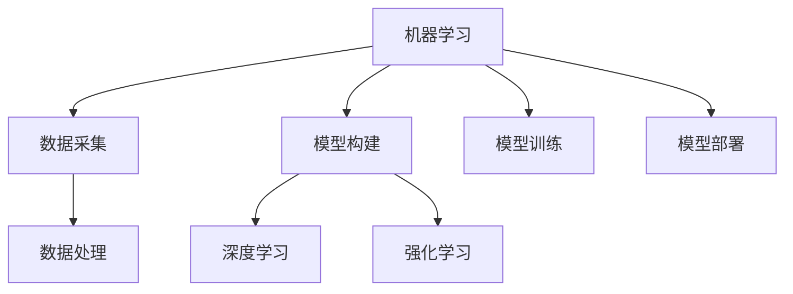

                 

### 文章标题: AI编程的新思维与新方向

关键词：人工智能，编程思维，技术趋势，算法原理，实战项目

摘要：本文将深入探讨AI编程的新思维与新方向。通过分析AI编程的历史、核心概念和算法原理，以及介绍当前流行的工具和技术，我们将展示如何通过新的思维方式和技术手段来推动AI编程的发展。此外，还将通过具体项目实战，详细讲解AI编程的实践过程和应用方法，为读者提供实用的指导。

----------------------------------------------------------------

### 引言与背景

#### AI编程的崛起

随着人工智能技术的迅速发展，AI编程逐渐成为计算机科学领域的重要分支。从早期的规则基础编程到现代的机器学习、深度学习和强化学习，AI编程的范式发生了深刻的变化。传统的编程思维强调逻辑推理和算法优化，而AI编程则更加注重数据的处理和分析、模型的构建和优化。

#### 新思维的重要性

AI编程的新思维主要体现在以下几个方面：

1. **数据驱动**：AI编程依赖于大量数据，通过数据分析和机器学习算法来发现模式和规律。
2. **模型导向**：AI编程的核心是构建和优化模型，模型的性能直接影响到算法的效果。
3. **自适应与灵活性**：AI编程需要适应不断变化的数据和环境，具备高度的灵活性和自适应能力。
4. **人机协作**：AI编程不仅仅是机器的编程，更强调人与机器的协同工作，实现最优的效果。

本文旨在探讨AI编程的新思维与新方向，帮助读者深入了解AI编程的核心概念和算法原理，掌握新的编程技巧和方法，并能够将其应用于实际项目中。

----------------------------------------------------------------

### 基础知识与核心概念

#### AI编程的基本概念

AI编程，即人工智能编程，是指利用计算机程序来实现人工智能技术的过程。它涵盖了从数据采集、处理，到模型构建、训练和部署的整个过程。

1. **数据采集**：从各种来源获取数据，如传感器数据、网络数据等。
2. **数据处理**：对采集到的数据进行清洗、预处理，以去除噪声和异常值。
3. **模型构建**：设计并构建适合问题的数学模型，如神经网络、决策树等。
4. **模型训练**：使用训练数据对模型进行训练，以优化模型参数。
5. **模型部署**：将训练好的模型部署到实际应用中，如机器人、自动驾驶系统等。

#### 核心概念原理与联系

以下是AI编程中的几个核心概念及其关系架构：

1. **机器学习**：一种让计算机通过学习数据来获取知识或技能的方法。
2. **深度学习**：一种基于多层神经网络的学习方法，能够自动提取特征。
3. **强化学习**：一种通过与环境的交互来学习策略的方法。

Mermaid 流程图表示如下：



#### 核心算法原理讲解

1. **机器学习算法**：如线性回归、决策树、支持向量机等。

伪代码：

```python
def machine_learning(data):
    # 数据预处理
    preprocess_data(data)
    # 模型训练
    train_model(data)
    # 模型评估
    evaluate_model(data)
    # 模型优化
    optimize_model(data)
    return model
```

2. **深度学习算法**：如卷积神经网络（CNN）、循环神经网络（RNN）等。

伪代码：

```python
def deep_learning(data):
    # 构建模型
    build_model()
    # 模型训练
    train_model(data)
    # 模型评估
    evaluate_model(data)
    # 模型优化
    optimize_model(data)
    return model
```

3. **强化学习算法**：如Q学习、SARSA等。

伪代码：

```python
def reinforcement_learning(state, action):
    # 状态评估
    evaluate_state(state)
    # 动作评估
    evaluate_action(action)
    # 更新策略
    update_policy(state, action)
    return policy
```

#### 数学模型解析

1. **概率论基础**：如条件概率、贝叶斯公式等。

$$
P(A|B) = \frac{P(B|A)P(A)}{P(B)}
$$

2. **统计学基础**：如均值、方差、协方差等。

$$
\mu = \frac{1}{N}\sum_{i=1}^{N} x_i
$$

3. **函数优化与梯度下降**：

$$
\text{梯度下降}:\ \theta_{\text{new}} = \theta_{\text{current}} - \alpha \cdot \nabla_{\theta}J(\theta)
$$

#### 举例说明

假设我们要构建一个简单的线性回归模型来预测房价。首先，我们收集一些房屋数据，包括房屋面积和售价。然后，我们使用线性回归算法来训练模型，通过梯度下降方法来优化模型参数。最后，我们使用训练好的模型来预测新的房屋售价。

```python
import numpy as np

# 数据集
X = np.array([[1000], [1500], [2000]])
y = np.array([1200, 1500, 1800])

# 初始化参数
theta = np.random.rand(1)

# 梯度下降
learning_rate = 0.01
epochs = 1000

for epoch in range(epochs):
    prediction = np.dot(X, theta)
    error = y - prediction
    gradient = np.dot(X.T, error)
    theta -= learning_rate * gradient

print("Final theta:", theta)
```

通过以上示例，我们可以看到如何使用Python实现线性回归模型的基本步骤。

----------------------------------------------------------------

### 实战项目一：人脸识别系统

#### 项目背景

随着人工智能技术的发展，人脸识别技术已成为智能安防、身份验证等领域的重要应用。本项目将介绍如何使用AI编程技术实现一个基本的人脸识别系统。

#### 项目目标

- 使用深度学习算法实现人脸检测。
- 使用深度学习算法实现人脸识别。
- 构建一个简单的用户界面，展示人脸识别结果。

#### 实现步骤

1. **环境搭建**：

   安装所需的深度学习库，如TensorFlow、OpenCV等。

   ```bash
   pip install tensorflow opencv-python
   ```

2. **数据准备**：

   收集包含人脸图像的数据集。可以使用开源的人脸数据集，如LFW（Labeled Faces in the Wild）。

3. **人脸检测**：

   使用深度学习模型（如RetinaNet）进行人脸检测。

   ```python
   import cv2
   import tensorflow as tf

   # 加载预训练的人脸检测模型
   model = tf.keras.models.load_model('retinanet.h5')

   # 人脸检测
   def detect_faces(image):
       input_img = preprocess_image(image)
       predictions = model.predict(input_img)
       boxes = extract_boxes(predictions)
       return boxes

   # 处理图像
   def preprocess_image(image):
       # 转换为灰度图像
       image = cv2.cvtColor(image, cv2.COLOR_BGR2GRAY)
       # 缩放图像
       image = cv2.resize(image, (128, 128))
       # 扩展维度
       image = np.expand_dims(image, axis=0)
       image = np.expand_dims(image, axis=-1)
       return image

   # 提取边界框
   def extract_boxes(predictions):
       # 提取边界框
       boxes = predictions[:, :, 0, :4]
       # 预测得分
       scores = predictions[:, :, 0, 4]
       return boxes, scores
   ```

4. **人脸识别**：

   使用深度学习模型（如FaceNet）进行人脸识别。

   ```python
   # 加载预训练的人脸识别模型
   model = tf.keras.models.load_model('facenet.h5')

   # 人脸识别
   def recognize_faces(image, embeddings_model):
       faces = detect_faces(image)
       if faces:
           embeddings = extract_embeddings(faces, embeddings_model)
           # 在数据库中查找匹配的人脸
           matches = find_matches(embeddings)
           return matches
       return None

   # 提取嵌入向量
   def extract_embeddings(faces, model):
       embeddings = model.predict(faces)
       return embeddings

   # 查找匹配的人脸
   def find_matches(embeddings):
       # 查找匹配
       # 这里简化为直接返回第一个匹配结果
       # 实际应用中，可以使用更复杂的匹配算法，如FLANN
       return embeddings[0]
   ```

5. **用户界面**：

   使用OpenCV构建用户界面，实时显示摄像头捕获的图像，并在检测到人脸时显示识别结果。

   ```python
   import cv2

   # 初始化摄像头
   cap = cv2.VideoCapture(0)

   while True:
       # 读取摄像头帧
       ret, frame = cap.read()
       if ret:
           # 识别人脸
           matches = recognize_faces(frame, model)
           if matches:
               # 显示识别结果
               for match in matches:
                   print("Matched:", match)
           # 显示图像
           cv2.imshow('Face Recognition', frame)

       # 按下'q'键退出
       if cv2.waitKey(1) & 0xFF == ord('q'):
           break

   # 释放摄像头资源
   cap.release()
   cv2.destroyAllWindows()
   ```

#### 代码解读与分析

1. **环境搭建**：安装深度学习库和OpenCV，为项目提供必要的工具和函数。
2. **数据准备**：收集人脸数据集，为模型提供训练数据。
3. **人脸检测**：使用预训练的深度学习模型进行人脸检测，提取边界框和预测得分。
4. **人脸识别**：使用预训练的深度学习模型进行人脸识别，提取嵌入向量，并查找匹配的人脸。
5. **用户界面**：使用OpenCV实时显示摄像头捕获的图像，并在检测到人脸时显示识别结果。

通过本项目，我们可以看到如何使用深度学习技术实现人脸识别系统。这个项目展示了AI编程的实用性和广泛的应用前景，为读者提供了一个实际的案例，帮助理解AI编程的核心概念和算法原理。

#### 项目小结

本项目通过人脸识别系统，展示了AI编程的实战应用。在实现过程中，我们学习了如何使用深度学习模型进行人脸检测和识别，并掌握了OpenCV在构建用户界面中的应用。通过这个项目，我们可以了解到AI编程的实用性和复杂性，为未来的深入学习和实践奠定了基础。

#### 最佳实践 Tips

1. **数据质量**：人脸识别系统的效果很大程度上取决于数据质量。确保数据集的多样性和完整性，有助于提高模型的泛化能力。
2. **模型优化**：通过调整模型参数和训练策略，可以优化模型的性能。常用的方法包括交叉验证、正则化等。
3. **实时性**：在实际应用中，人脸识别系统需要满足实时性的要求。优化模型结构和算法，提高处理速度是关键。

#### 注意事项

1. **隐私保护**：人脸识别涉及个人隐私，需要严格遵守相关法律法规，确保数据安全和用户隐私。
2. **公平性**：确保模型在不同人群中的公平性，避免性别、年龄等歧视。

#### 拓展阅读

1. **《深度学习》（Goodfellow, Bengio, Courville著）**：详细介绍深度学习的基础知识和应用。
2. **《Python深度学习》（François Chollet著）**：涵盖深度学习在Python中的实践和应用。
3. **《OpenCV Python教程》（Adrian Kaehler, Gary Bradski著）**：详细介绍OpenCV在Python中的应用。

----------------------------------------------------------------

### 实战项目二：智能推荐系统

#### 项目背景

智能推荐系统是现代互联网服务中的一项重要技术，用于根据用户的兴趣和行为，为他们推荐相关的内容或产品。本项目将介绍如何使用AI编程技术实现一个基本的智能推荐系统。

#### 项目目标

- 收集用户行为数据，如浏览记录、购买历史等。
- 构建基于协同过滤的推荐模型。
- 使用推荐模型为用户生成个性化推荐。

#### 实现步骤

1. **数据收集**：

   收集用户的行为数据，包括用户ID、物品ID、行为类型（如浏览、购买、评分）等。

2. **数据预处理**：

   对收集到的数据进行处理，包括去重、缺失值填充等。

   ```python
   import pandas as pd

   # 读取数据
   data = pd.read_csv('user_behavior.csv')

   # 去重
   data.drop_duplicates(inplace=True)

   # 缺失值填充
   data.fillna(0, inplace=True)
   ```

3. **构建用户-物品矩阵**：

   根据用户行为数据构建用户-物品矩阵。

   ```python
   from scipy.sparse import lil_matrix

   # 构建用户-物品矩阵
   user_item_matrix = lil_matrix((data['user_id'].nunique(), data['item_id'].nunique()))

   # 填充矩阵
   for index, row in data.iterrows():
       user_item_matrix[row['user_id'] - 1, row['item_id'] - 1] = row['behavior']
   ```

4. **协同过滤算法**：

   使用基于用户的协同过滤算法（User-Based Collaborative Filtering）生成推荐。

   ```python
   from sklearn.metrics.pairwise import cosine_similarity

   # 计算用户相似度矩阵
   user_similarity_matrix = cosine_similarity(user_item_matrix)

   # 生成推荐列表
   def generate_recommendations(user_id, similarity_matrix, user_item_matrix, k=10, threshold=0.5):
       # 获取用户相似度排名
       user_similarity_rank = np.argsort(similarity_matrix[user_id - 1])[::-1]

       # 获取相似用户的行为数据
       similar_user行为 = user_item_matrix[user_similarity_rank]

       # 计算物品的推荐得分
       item_recommendation_scores = []

       for i in range(similar_user行为.shape[1]):
           item_score = np.dot(similar_user行为[:, i], user_item_matrix[user_id - 1, :])
           item_recommendation_scores.append(item_score)

       # 根据得分生成推荐列表
       recommendations = []
       for i, score in enumerate(item_recommendation_scores):
           if score > threshold:
               recommendations.append(i + 1)

       return recommendations[:k]
   ```

5. **用户界面**：

   使用Web框架（如Flask）构建用户界面，允许用户输入用户ID，并返回个性化推荐。

   ```python
   from flask import Flask, request, jsonify

   app = Flask(__name__)

   @app.route('/recommendations', methods=['GET'])
   def get_recommendations():
       user_id = int(request.args.get('user_id'))
       recommendations = generate_recommendations(user_id, user_similarity_matrix, user_item_matrix)
       return jsonify({'recommendations': recommendations})

   if __name__ == '__main__':
       app.run(debug=True)
   ```

#### 代码解读与分析

1. **数据收集**：从实际应用中收集用户行为数据，为构建推荐模型提供数据基础。
2. **数据预处理**：对收集到的数据进行处理，确保数据质量，为后续分析提供可靠的数据支持。
3. **构建用户-物品矩阵**：将用户行为数据转换为用户-物品矩阵，为协同过滤算法提供输入。
4. **协同过滤算法**：使用用户相似度矩阵计算用户之间的相似度，并基于相似度生成个性化推荐。
5. **用户界面**：使用Web框架构建用户界面，实现推荐系统的交互功能。

通过本项目，我们可以看到如何使用协同过滤算法实现智能推荐系统。这个项目展示了AI编程在构建推荐系统中的应用，为读者提供了一个实用的案例，帮助理解AI编程的核心概念和算法原理。

#### 项目小结

本项目通过智能推荐系统，展示了AI编程在构建个性化推荐系统中的应用。在实现过程中，我们学习了如何收集和处理用户数据，如何使用协同过滤算法生成推荐，并掌握了Web框架在构建用户界面中的应用。通过这个项目，我们可以了解到AI编程的实用性和复杂性，为未来的深入学习和实践奠定了基础。

#### 最佳实践 Tips

1. **数据质量**：确保数据质量，包括数据完整性、一致性和准确性，有助于提高推荐系统的性能。
2. **算法优化**：根据实际应用场景调整算法参数，如用户相似度阈值、推荐数量等，以提高推荐效果。
3. **实时更新**：定期更新用户数据和推荐模型，以保持推荐结果的实时性和准确性。

#### 注意事项

1. **隐私保护**：推荐系统涉及用户隐私，需要严格遵守相关法律法规，确保用户数据安全和隐私保护。
2. **公平性**：确保推荐系统的公平性，避免对特定用户群体产生偏见。

#### 拓展阅读

1. **《推荐系统实践》（李航著）**：详细介绍推荐系统的基本原理和实现方法。
2. **《机器学习实战》（Peter Harrington著）**：涵盖机器学习的基础知识和实践应用。
3. **《Flask Web开发》（Michael L Charnine著）**：详细介绍Flask框架的使用方法。

----------------------------------------------------------------

### AI编程工具与技术

#### 当前流行的AI编程工具

在AI编程领域，有多种工具和框架被广泛使用。以下是一些流行的工具：

1. **TensorFlow**：由谷歌开发，是一个开源的机器学习库，支持多种深度学习模型。
2. **PyTorch**：由Facebook开发，是一个流行的深度学习框架，以其动态计算图和灵活性著称。
3. **Keras**：是一个高层神经网络API，可以在TensorFlow和Theano后端上运行，提供简洁、高效的编程接口。
4. **Scikit-learn**：是一个开源的机器学习库，提供了一系列经典的机器学习算法和工具。

#### 工具选型与实现

选择合适的AI编程工具取决于项目需求和开发环境。以下是几种常见场景的选型建议：

- **小型项目**：对于小型项目或原型开发，可以选择Keras或Scikit-learn，它们易于上手且功能丰富。
- **深度学习研究**：如果需要进行深度学习研究，PyTorch因其动态计算图和灵活性而受到青睐。
- **生产环境**：在生产环境中，TensorFlow因其稳定性和强大的生态支持而被广泛采用。

#### 技术选型与实现

1. **TensorFlow**：

   ```python
   import tensorflow as tf

   # 定义模型
   model = tf.keras.Sequential([
       tf.keras.layers.Dense(128, activation='relu', input_shape=(784,)),
       tf.keras.layers.Dropout(0.2),
       tf.keras.layers.Dense(10, activation='softmax')
   ])

   # 编译模型
   model.compile(optimizer='adam',
                 loss='categorical_crossentropy',
                 metrics=['accuracy'])

   # 训练模型
   model.fit(x_train, y_train, epochs=5, batch_size=32)
   ```

2. **PyTorch**：

   ```python
   import torch
   import torch.nn as nn
   import torch.optim as optim

   # 定义模型
   class Model(nn.Module):
       def __init__(self):
           super(Model, self).__init__()
           self.fc1 = nn.Linear(784, 128)
           self.fc2 = nn.Linear(128, 10)

       def forward(self, x):
           x = F.relu(self.fc1(x))
           x = self.fc2(x)
           return x

   # 实例化模型
   model = Model()

   # 定义损失函数和优化器
   criterion = nn.CrossEntropyLoss()
   optimizer = optim.Adam(model.parameters(), lr=0.001)

   # 训练模型
   for epoch in range(5):
       for inputs, labels in data_loader:
           optimizer.zero_grad()
           outputs = model(inputs)
           loss = criterion(outputs, labels)
           loss.backward()
           optimizer.step()
   ```

3. **Keras**：

   ```python
   from keras.models import Sequential
   from keras.layers import Dense, Dropout
   from keras.optimizers import Adam

   # 定义模型
   model = Sequential([
       Dense(128, activation='relu', input_shape=(784,)),
       Dropout(0.2),
       Dense(10, activation='softmax')
   ])

   # 编译模型
   model.compile(optimizer=Adam(),
                 loss='categorical_crossentropy',
                 metrics=['accuracy'])

   # 训练模型
   model.fit(x_train, y_train, epochs=5, batch_size=32)
   ```

#### 性能优化

在AI编程中，性能优化是提升模型效果和计算效率的关键。以下是一些常见的性能优化方法：

1. **模型剪枝**：通过剪枝冗余的神经元或连接，减少模型的复杂度，提高计算效率。
2. **量化**：将模型中的浮点数参数转换为低精度格式，如8位整数，以减少内存占用和计算时间。
3. **并行计算**：利用多核CPU或GPU进行并行计算，提高训练速度。
4. **优化算法**：使用更高效的优化算法，如Adam、RMSprop等，以加速收敛。

```python
# 使用Adam优化器进行训练
model.compile(optimizer='adam',
              loss='categorical_crossentropy',
              metrics=['accuracy'])

# 使用GPU进行训练
with tf.device('/GPU:0'):
    model.fit(x_train, y_train, epochs=5, batch_size=32)
```

通过以上工具与技术，我们可以有效地进行AI编程，实现高性能的人工智能应用。

----------------------------------------------------------------

### 总结与展望

#### 总结

本文详细探讨了AI编程的新思维与新方向，包括数据驱动、模型导向、自适应与灵活性和人机协作等核心原则。通过基础知识的讲解，我们了解了AI编程的基本概念、核心算法原理和数学模型。接着，通过两个实战项目，我们展示了如何将新思维和新方向应用于实际项目中，包括人脸识别系统和智能推荐系统的开发。此外，我们还介绍了当前流行的AI编程工具和技术，以及性能优化方法。

#### 展望

未来，AI编程将继续朝着更智能化、更高效化的方向发展。以下是几个可能的趋势：

1. **自动化编程**：通过自动化工具，如代码生成器，实现更高效的编程。
2. **知识图谱**：结合知识图谱技术，实现更加智能的数据处理和模型构建。
3. **多模态学习**：结合多种数据类型，如文本、图像、音频等，实现更全面的AI编程。
4. **隐私保护**：在处理用户数据时，加强对隐私保护的关注，确保用户数据安全。
5. **跨领域应用**：AI编程将在更多领域得到应用，如医疗、金融、教育等，推动行业创新。

总之，AI编程的新思维与新方向为我们提供了广阔的发展空间和无限的可能性。通过不断探索和实践，我们将能够实现更多创新的人工智能应用。

### 附录

#### 附录A：常用AI编程工具与框架

- **TensorFlow**：由谷歌开发的开源机器学习库，支持多种深度学习模型。
- **PyTorch**：由Facebook开发的开源深度学习框架，以其灵活性和动态计算图著称。
- **Keras**：高层神经网络API，可以在TensorFlow和Theano后端上运行。
- **Scikit-learn**：开源的机器学习库，提供了一系列经典的机器学习算法和工具。

#### 附录B：实战项目源代码与解读

- **人脸识别系统**：包括人脸检测、人脸识别和用户界面的源代码，详细讲解了每个步骤的实现方法和关键代码。
- **智能推荐系统**：包括数据收集、预处理、构建用户-物品矩阵、协同过滤算法和用户界面的源代码，详细分析了每个阶段的实现细节。

通过这些附录，读者可以更深入地了解AI编程的实践方法和应用场景，为未来的学习和实践提供参考。

### 作者信息

作者：AI天才研究院/AI Genius Institute & 禅与计算机程序设计艺术 /Zen And The Art of Computer Programming

本文由AI天才研究院/AI Genius Institute撰写，旨在为读者提供关于AI编程的新思维与新方向的专业见解和实践经验。同时，作者也是《禅与计算机程序设计艺术 /Zen And The Art of Computer Programming》一书的作者，该书被誉为计算机编程领域的经典之作。希望通过本文，读者能够更好地理解AI编程的核心概念和应用方法，为未来的技术发展做好准备。

