                 

### 1.1.1 AI编程的定义

AI编程，顾名思义，就是指编写用于实现人工智能功能的代码。它不同于传统的编程，传统的编程主要是针对计算机硬件和软件的交互进行编写，而AI编程则是为了创建能够模拟、扩展甚至替代人类智能的计算机程序。

在更具体的层面上，AI编程涉及的是如何让计算机系统具备学习能力、自主决策能力和问题解决能力。这通常包括以下几个核心方面：

- **数据获取与处理**：AI系统需要大量数据来训练其模型，因此编程过程中需要考虑如何高效地获取、存储和处理数据。
  
- **算法设计**：AI编程的核心在于算法的选择和优化，包括深度学习、强化学习、生成对抗网络等多种算法。

- **模型训练**：AI系统通过不断的训练来优化其模型，以达到更好的性能。

- **模型评估与部署**：训练完成后，需要对模型进行评估，确保其能够达到预期效果，然后才能将其部署到实际应用场景中。

- **交互与反馈**：AI系统在运行过程中需要与人或其他系统进行交互，并根据反馈进行调整。

综上所述，AI编程不仅仅是编写代码，更是一个涉及多个学科和技术领域的复杂过程，包括但不限于计算机科学、数学、统计学、心理学等。

为了更好地理解AI编程，我们可以通过一个简单的例子来说明。假设我们要开发一个能够识别猫狗的AI系统，以下是这个系统需要经历的几个步骤：

1. **数据获取与处理**：首先需要收集大量猫狗的图片数据，并对这些数据进行预处理，如调整大小、归一化等。

2. **算法选择与模型设计**：选择一个适合图像分类的算法，如卷积神经网络（CNN），并设计其结构。

3. **模型训练**：使用预处理后的数据来训练模型，让模型学会识别猫和狗。

4. **模型评估**：在测试集上评估模型性能，确保其能够准确识别猫和狗。

5. **模型部署**：将训练好的模型部署到应用场景中，如手机APP或网站。

6. **交互与反馈**：用户可以通过应用提交图片，系统会根据模型判断图片中的动物类型，并给出反馈。

通过这个例子，我们可以看到AI编程不仅仅是编写代码，而是涉及到从数据准备到模型训练、评估、部署的整个流程。这也体现了AI编程与传统编程之间的显著区别。

**核心概念与联系：**

AI编程的核心概念包括数据、算法、模型、训练、评估和部署。这些概念之间的关系可以用以下Mermaid流程图表示：

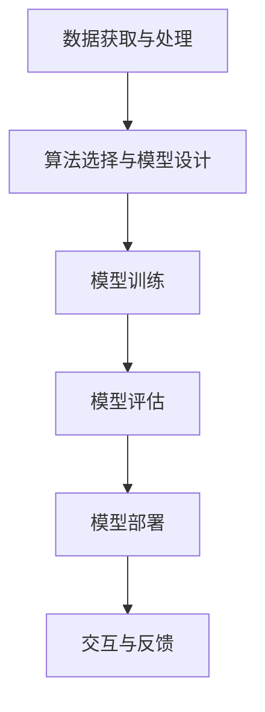

### 1.1.2 AI编程与传统编程的区别

AI编程与传统编程之间存在着显著的区别，主要体现在目标、方法、工具和挑战等多个方面。

首先，从目标来看，传统编程主要是为了实现特定功能，如开发一个网站、应用程序或软件工具等。而AI编程的目标则是让计算机系统具备人工智能能力，能够自主学习、自主决策和自主解决问题。这意味着AI编程不仅仅是编写代码，还需要考虑如何设计能够实现这些功能的算法和模型。

其次，从方法来看，传统编程通常遵循自顶向下的设计思路，先定义系统的整体架构，然后逐步实现各个模块。而AI编程则更多地采用自底向上的方法，即首先收集和处理大量数据，然后通过训练模型来优化系统性能。这种方法的本质在于通过数据驱动来提升系统的智能化水平。

在工具方面，传统编程使用的工具主要包括各种编程语言（如C++、Java、Python等）和集成开发环境（IDE）。而AI编程则需要使用专门的工具和框架，如TensorFlow、PyTorch、Keras等深度学习框架，以及Kubernetes、Docker等容器化技术。这些工具和框架提供了丰富的API和功能，使得AI编程更加高效和便捷。

最后，从面临的挑战来看，传统编程主要面临的是功能实现、性能优化和兼容性等问题。而AI编程则需要面对更复杂的问题，如数据质量和标注、算法选择和优化、模型解释性和可解释性等。此外，AI编程还需要考虑如何确保系统的安全性、隐私保护和合规性等问题。

以下是一个简化的Mermaid流程图，展示了AI编程与传统编程之间的主要区别：

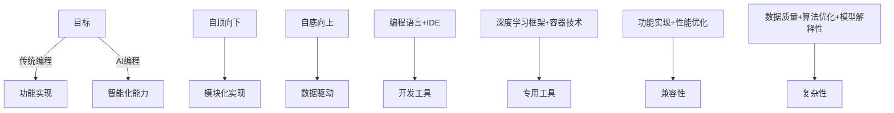

通过这个对比，我们可以更清晰地理解AI编程与传统编程之间的差异，以及AI编程所面临的独特挑战。

### 1.1.3 AI编程的发展历程

AI编程的发展历程可以追溯到20世纪50年代，当时人工智能（AI）这一概念首次被提出。以下是一些重要的里程碑事件：

- **1956年**：在达特茅斯会议（Dartmouth Conference）上，约翰·麦卡锡（John McCarthy）等人首次提出了人工智能的概念，并定义了其研究范围。这标志着人工智能正式成为一门学科。

- **1959年**：乔治·德维特（Herbert Simon）和约翰·麦卡锡等人创建了AI领域的第一个研究小组——斯坦福大学的人工智能实验室（SAIL）。

- **1966年**：IBM推出了第一个基于规则的专家系统DENDRAL，展示了AI在特定领域内解决复杂问题的能力。

- **1980年代**：随着计算机性能的提升和数据的增加，AI编程迎来了新的发展。1981年，约翰·霍普菲尔德（John Hopfield）提出了霍普菲尔德神经网络（Hopfield Network），为后来的神经网络研究奠定了基础。

- **1990年代**：随着互联网的普及，AI编程开始广泛应用于各个领域。1997年，IBM的超级计算机“深蓝”（Deep Blue）战胜了国际象棋世界冠军加里·卡斯帕罗夫（Garry Kasparov），标志着AI在特定任务上的能力已经超过了人类。

- **2000年代**：深度学习技术的发展为AI编程带来了新的突破。2006年，杰弗里·辛顿（Geoffrey Hinton）等人提出了深度置信网络（Deep Belief Network），为后来的深度学习研究奠定了基础。

- **2010年代**：随着大数据和云计算的兴起，AI编程进入了一个新的阶段。这一时期，AI系统开始在图像识别、语音识别、自然语言处理等任务上取得显著进展。2012年，AlexNet在ImageNet竞赛中取得了前所未有的成绩，标志着深度学习在图像识别领域的崛起。

- **2020年代**：AI编程的应用领域进一步扩展，从工业自动化、金融科技到医疗健康、教育等领域，AI编程都发挥了重要作用。同时，AI编程也在不断地向着更高效、更智能的方向发展，如联邦学习、自动机器学习（AutoML）等新技术的出现。

以下是AI编程发展历程的简化时间线：

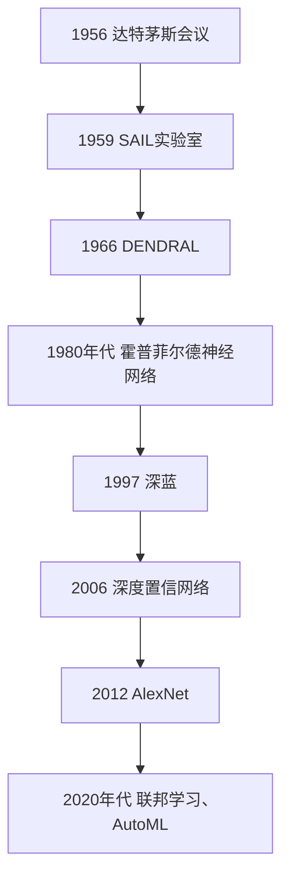

通过这些里程碑事件，我们可以看到AI编程的发展历程不仅是一个技术进步的过程，更是一个不断扩展和应用的过程。这也为未来的AI编程发展奠定了坚实的基础。

### 1.2 AI编程的核心架构

AI编程的核心架构可以概括为数据预处理、模型训练与优化、模型评估与部署四个主要阶段。每个阶段都有其独特的任务和挑战，下面将逐一进行详细阐述。

#### 1.2.1 数据预处理

数据预处理是AI编程中的第一步，也是至关重要的一步。它的主要任务是清洗、格式化和转换数据，使其适合用于模型训练。以下是数据预处理的主要任务和挑战：

1. **数据清洗**：数据清洗是数据预处理的基础，主要任务是去除数据中的噪声和错误，包括处理缺失值、纠正错误数据等。这个阶段需要运用统计学和数据库技术，如KNN插补、平均值填充等。

2. **数据格式化**：数据格式化是将不同来源和格式的数据转换为统一的格式。例如，将不同日期格式统一为YYYY-MM-DD格式，将文本数据统一编码等。这个阶段需要考虑数据的一致性和兼容性。

3. **数据转换**：数据转换是将数据从一种形式转换为另一种形式，以便更好地用于模型训练。例如，将连续的数值数据转换为分类数据，将文本数据转换为词向量等。这个阶段需要考虑数据分布和特征提取。

4. **特征工程**：特征工程是数据预处理中的一个重要任务，旨在提取和构造能够有效提高模型性能的特征。特征工程需要深入理解数据和应用场景，如特征选择、特征缩放、特征组合等。

数据预处理的质量直接影响到模型的性能，因此需要投入大量的时间和精力。以下是一个简单的数据预处理流程图：

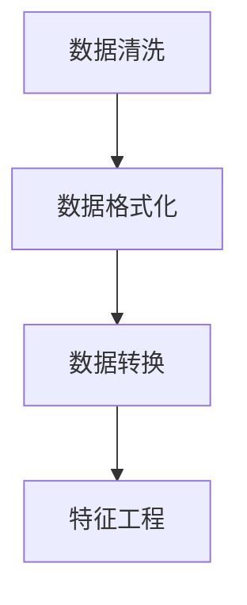

#### 1.2.2 模型训练与优化

模型训练与优化是AI编程的核心环节，其主要任务是通过大量数据训练模型，并不断优化模型参数，使其在特定任务上达到最优性能。以下是模型训练与优化的主要任务和挑战：

1. **模型选择**：选择适合任务和数据类型的模型。常见的模型包括深度神经网络（DNN）、卷积神经网络（CNN）、循环神经网络（RNN）、生成对抗网络（GAN）等。

2. **数据准备**：将预处理后的数据转换为模型可以接受的格式，如将图像数据转换为像素矩阵，将文本数据转换为词向量等。

3. **模型初始化**：初始化模型参数，常见的初始化方法包括随机初始化、高斯初始化、Xavier初始化等。

4. **训练过程**：通过迭代计算来更新模型参数，以达到最优性能。训练过程需要优化算法和超参数设置，如梯度下降算法（Gradient Descent）、随机梯度下降（Stochastic Gradient Descent，SGD）等。

5. **优化技巧**：为了加速训练和提高模型性能，可以采用各种优化技巧，如正则化、dropout、批处理、数据增强等。

6. **模型验证与调整**：在训练过程中，需要对模型进行验证，以确保模型性能的稳定性和泛化能力。常见的验证方法包括交叉验证、验证集划分等。

以下是一个简单的模型训练与优化流程图：

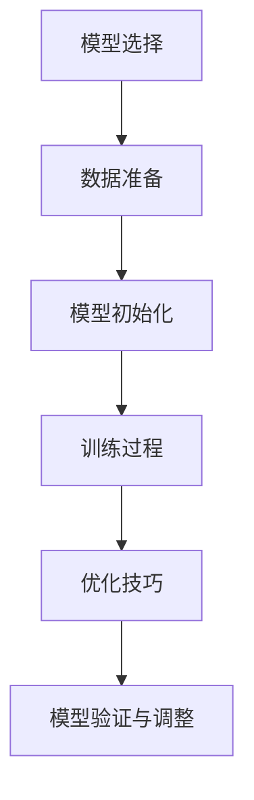

#### 1.2.3 模型评估与部署

模型评估与部署是确保AI系统在实际应用中能够达到预期效果的关键步骤。以下是模型评估与部署的主要任务和挑战：

1. **模型评估**：通过测试集或实际应用中的数据来评估模型的性能，常用的评估指标包括准确率、召回率、F1分数、AUC等。

2. **模型调优**：根据评估结果对模型进行调整，以达到更好的性能。调优方法包括调整超参数、重新训练模型等。

3. **模型压缩**：为了减小模型的存储空间和计算资源消耗，可以采用模型压缩技术，如量化、剪枝、蒸馏等。

4. **模型部署**：将训练好的模型部署到实际应用场景中，如服务器、边缘设备、移动设备等。部署过程中需要考虑模型的兼容性、性能和安全性。

5. **持续监控与更新**：在模型部署后，需要对其进行持续监控，确保其在实际应用中的稳定性和性能。根据实际情况，可能需要定期更新模型。

以下是一个简单的模型评估与部署流程图：

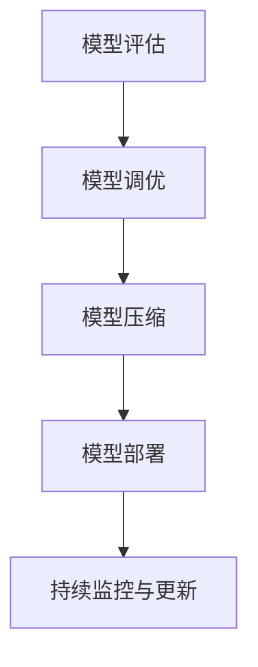

通过以上四个阶段，AI编程构建了一个完整的系统，从数据预处理到模型训练与优化，再到模型评估与部署，每个阶段都发挥着重要作用。这些阶段的相互协作，使得AI系统能够在实际应用中发挥最大的潜力。

### 1.3 AI编程的关键技术

AI编程的成功依赖于一系列关键技术的应用，这些技术包括深度学习基础、强化学习基础和生成对抗网络基础。下面我们将逐一介绍这些关键技术。

#### 1.3.1 深度学习基础

深度学习是AI编程的核心技术之一，它通过模拟人脑神经网络的结构和功能，实现数据的高效处理和模式识别。以下是一些深度学习的基础概念和算法：

- **神经网络**：神经网络是深度学习的基础，由一系列相互连接的神经元组成。每个神经元接收输入信号，通过加权求和处理后输出信号。常见的神经网络包括多层感知机（MLP）、卷积神经网络（CNN）和循环神经网络（RNN）。

- **激活函数**：激活函数是神经网络中的关键组件，用于引入非线性特性，使神经网络能够解决复杂问题。常见的激活函数包括sigmoid函数、ReLU函数、Tanh函数等。

- **反向传播算法**：反向传播算法是一种用于训练神经网络的优化算法，通过计算损失函数关于网络参数的梯度，来更新网络参数。这一过程迭代进行，直至网络参数达到最优。

- **深度学习框架**：深度学习框架如TensorFlow、PyTorch和Keras等，提供了丰富的API和工具，简化了深度学习模型的构建和训练过程。

以下是一个简单的神经网络模型和反向传播算法的伪代码：

```python
# 神经网络模型伪代码
def neural_network(input_data):
    layer1 = sigmoid(np.dot(input_data, weights1))
    layer2 = sigmoid(np.dot(layer1, weights2))
    output = sigmoid(np.dot(layer2, weights3))
    return output

# 反向传播算法伪代码
def backward_propagation(y, output, weights):
    error = y - output
    d_output = error * sigmoid_derivative(output)
    d_layer2 = d_output * weights3.T
    d_layer1 = d_layer2 * weights2.T
    d_input = d_layer1 * weights1.T
    return d_input, d_output
```

#### 1.3.2 强化学习基础

强化学习是另一种重要的AI编程技术，通过智能体与环境的交互，实现目标的自主学习和决策。以下是一些强化学习的基础概念和算法：

- **智能体（Agent）**：智能体是执行特定任务的实体，可以通过观察环境状态、选择动作并获取奖励信号，来学习优化其策略。

- **环境（Environment）**：环境是智能体执行动作的场所，它提供状态信息、动作空间和奖励信号。

- **状态（State）**：状态是描述环境当前状态的特征向量。

- **动作（Action）**：动作是智能体可以执行的操作。

- **策略（Policy）**：策略是智能体选择动作的规则或函数。

- **奖励（Reward）**：奖励是智能体执行动作后获得的奖励信号，用于指导智能体的学习。

常见的强化学习算法包括Q学习（Q-Learning）、深度Q网络（DQN）、策略梯度算法（Policy Gradient）和强化学习栈（Reinforcement Learning Stack）等。

以下是一个简单的Q学习算法的伪代码：

```python
# Q学习算法伪代码
Initialize Q(s, a)
for episode in 1 to total_episodes do
    Initialize state s
    while not end of episode do
        Choose action a using epsilon-greedy policy
        Take action a and observe reward r and next state s'
        Update Q(s, a) using Q-learning update rule
        s <- s'
    end while
end for
```

#### 1.3.3 生成对抗网络基础

生成对抗网络（GAN）是一种由生成器和判别器组成的对抗性神经网络，旨在生成逼真的数据。以下是一些生成对抗网络的基础概念和算法：

- **生成器（Generator）**：生成器是一个神经网络，其目标是生成与真实数据相似的数据。

- **判别器（Discriminator）**：判别器是一个神经网络，其目标是区分生成器生成的数据与真实数据。

- **对抗性训练**：生成器和判别器相互对抗，生成器试图生成更加真实的数据，而判别器则试图识别并区分这些数据。

- **训练过程**：GAN的训练过程包括两个主要的任务：训练判别器和训练生成器。判别器通过不断学习来提高对真实数据和生成数据的识别能力，生成器则通过生成更难以识别的数据来提高其生成能力。

常见的GAN架构包括基本的GAN、深度GAN（D-GAN）、条件GAN（cGAN）和循环GAN（R-GAN）等。

以下是一个简单的生成对抗网络训练过程的伪代码：

```python
# GAN训练过程伪代码
for epoch in 1 to total_epochs do
    for real_data in real_data_loader do
        Train the discriminator on real data
    end for
    for generated_samples in generator do
        Train the generator on fake data
    end for
end for
```

通过以上介绍，我们可以看到深度学习、强化学习和生成对抗网络是AI编程中的关键技术，它们各自具有独特的特点和优势，适用于不同的应用场景。掌握这些技术，将为我们在AI编程领域的发展奠定坚实的基础。

### 1.4 AI编程的未来趋势

AI编程的未来充满了无限可能，随着技术的不断进步和应用的深入，我们可以预见以下几个方面的趋势：

#### 1.4.1 AI编程语言的发展

随着AI编程的复杂性和多样性不断增加，现有的编程语言和框架已经难以满足需求。因此，未来AI编程语言的发展将趋向于更加灵活、高效和易用。以下是一些可能的趋势：

- **领域特定语言（DSL）**：针对特定领域的AI编程需求，开发更加专业的领域特定语言，如用于机器学习的Lisp、用于自然语言处理的Prolog等。

- **元编程**：支持更高级别的抽象和自动化，如Python的装饰器、TypeScript的类型检查等，使得开发者能够更快速地构建和部署AI系统。

- **静态类型语言**：静态类型语言如TypeScript和Golang在AI编程中的应用将越来越广泛，因为它们在性能和安全性方面具有优势。

- **跨平台支持**：未来AI编程语言将更加注重跨平台支持，如Flutter、React Native等，使得开发者能够在一个平台上编写代码，然后部署到多个平台上。

#### 1.4.2 AI编程与大数据的结合

大数据技术的发展为AI编程提供了丰富的数据资源，而AI编程则为大数据分析提供了强大的工具。未来，AI编程与大数据的结合将更加紧密，具体体现在以下几个方面：

- **实时数据处理**：随着物联网、5G等技术的发展，实时数据处理需求日益增长。AI编程将结合流处理技术，如Apache Kafka、Apache Flink等，实现实时数据的分析和处理。

- **分布式计算**：大规模数据分析和处理需要分布式计算的支持，如Apache Hadoop、Apache Spark等。AI编程将利用这些分布式计算框架，提高数据处理和分析的效率。

- **数据隐私保护**：在大数据时代，数据隐私保护成为一项重要任务。AI编程将结合加密、差分隐私等技术，确保数据的安全和隐私。

- **自动化数据工程**：自动化数据工程（Data Engineering）将成为AI编程的一个重要方向，通过自动化工具和流程，提高数据处理的效率和准确性。

#### 1.4.3 AI编程在教育领域的应用

AI编程在教育领域的应用将带来革命性的变化，以下是一些可能的趋势：

- **个性化学习**：基于AI编程的学习平台将能够根据学生的能力和兴趣，提供个性化的学习内容和路径，提高学习效果。

- **编程教育**：编程将成为教育的基本技能之一，未来的教育体系将更加注重编程教育的普及和深入。AI编程工具和资源将为学生提供更多的实践机会。

- **课程设计与开发**：AI编程将用于设计和开发课程内容，如自动化测试、智能评估等，提高课程质量和效率。

- **教师辅助工具**：AI编程工具将帮助教师更高效地完成教学任务，如自动批改作业、生成教学资料等。

通过以上趋势，我们可以看到AI编程的未来将更加多元化和广阔，不仅将在技术领域发挥重要作用，还将深刻影响教育、医疗、金融、环境等多个领域。

### 第二部分：AI编程新思维

随着AI技术的迅猛发展，AI编程不再局限于传统的编程方法，新的编程思维逐渐涌现，为开发者带来了全新的视角和工具。本部分将探讨数据驱动编程、软计算编程、自适应编程和虚拟现实编程等新思维，分析它们的概念、优势和应用场景。

#### 2.1 数据驱动编程

数据驱动编程（Data-Driven Programming）是一种以数据为核心的开发方法，它强调数据在整个编程过程中的重要性。在数据驱动编程中，数据不仅用于训练模型，还用于指导代码的编写和优化。

##### 2.1.1 数据驱动编程的概念

数据驱动编程的核心思想是利用数据来驱动程序的执行和决策。开发者不再仅仅依靠预定义的逻辑和规则，而是通过分析大量数据来发现模式和趋势，从而生成程序代码。这种方法在机器学习、数据分析、实时系统等领域具有广泛的应用。

##### 2.1.2 数据驱动编程的优势

- **灵活性**：数据驱动编程能够根据实际数据的特征和变化，动态调整代码和模型，使其更加适应复杂多变的环境。

- **自适应性**：通过不断分析新的数据，数据驱动编程能够自动调整和优化程序行为，提高系统的适应性和鲁棒性。

- **智能化**：数据驱动编程借助机器学习和数据挖掘技术，使程序能够自主学习和进化，提高其智能化水平。

##### 2.1.3 数据驱动编程的实现方法

数据驱动编程的实现方法主要包括以下几个方面：

1. **数据采集与处理**：首先需要收集大量相关数据，并进行预处理，如清洗、归一化和特征提取等。

2. **数据分析和挖掘**：利用统计学、机器学习和数据挖掘技术，分析数据中的模式和关系，为编程提供指导。

3. **动态生成代码**：基于分析结果，动态生成程序代码。例如，使用生成式编程技术，根据数据生成具体的代码片段。

4. **模型训练与优化**：利用训练数据，训练机器学习模型，并不断优化模型，以提高程序的执行效率和准确性。

#### 2.2 软计算编程

软计算编程（Soft Computing Programming）是一种结合了多种计算技术的综合性方法，它通过模拟自然现象和人类思维过程，实现复杂问题的求解。软计算编程包括模糊逻辑、遗传算法、人工神经网络等多种技术。

##### 2.2.1 软计算编程的概念

软计算编程的核心思想是利用软计算技术来模拟人类思维过程和自然现象，从而实现复杂问题的求解。它强调计算的非精确性、适应性和鲁棒性，适用于不确定性和复杂性较高的应用场景。

##### 2.2.2 软计算编程的优势

- **鲁棒性**：软计算编程能够处理不确定性和不完整信息，具有较强的鲁棒性。

- **灵活性**：软计算编程通过模拟人类思维和自然现象，能够灵活适应不同问题的解决方案。

- **高效性**：软计算编程利用分布式计算和并行计算技术，能够高效地解决大规模问题。

##### 2.2.3 软计算编程的应用场景

软计算编程广泛应用于以下领域：

- **智能制造**：利用遗传算法和人工神经网络，实现生产过程的优化和控制。

- **智能交通**：利用模糊逻辑和神经网络，实现交通信号控制和路径规划。

- **医疗诊断**：利用模糊逻辑和机器学习，辅助医生进行疾病诊断。

- **环境监测**：利用神经网络和遗传算法，实现环境参数的实时监测和预测。

#### 2.3 自适应编程

自适应编程（Adaptive Programming）是一种能够根据环境和需求的变化，动态调整自身行为的编程方法。它强调系统的自适应性、灵活性和可持续性。

##### 2.3.1 自适应编程的概念

自适应编程的核心思想是通过自适应算法和机制，使程序能够根据外部环境和内部状态的变化，动态调整其行为和结构。这种编程方法在自适应系统、智能代理和实时系统中具有广泛的应用。

##### 2.3.2 自适应编程的优势

- **自适应性**：自适应编程能够根据环境变化，自动调整程序的行为，提高系统的适应性和灵活性。

- **灵活性**：自适应编程通过灵活的算法和机制，能够快速响应环境变化，实现高效的问题解决。

- **可持续性**：自适应编程能够通过自我调整和优化，提高系统的可持续性和长期稳定性。

##### 2.3.3 自适应编程的实现方法

自适应编程的实现方法主要包括以下几个方面：

1. **环境监测**：实时监测外部环境和内部状态，收集相关的数据和信息。

2. **自适应算法**：基于监测数据，使用自适应算法来调整程序的行为和结构。常见的自适应算法包括遗传算法、粒子群优化、模糊逻辑等。

3. **动态调整**：根据自适应算法的输出，动态调整程序的行为和结构，以实现最佳性能。

4. **反馈机制**：建立反馈机制，不断收集和分析系统的输出结果，为下一次调整提供依据。

#### 2.4 虚拟现实编程

虚拟现实编程（Virtual Reality Programming）是一种利用虚拟现实（VR）技术进行程序设计和开发的编程方法。它通过创建虚拟环境，实现人机交互和沉浸式体验。

##### 2.4.1 虚拟现实编程的概念

虚拟现实编程的核心思想是利用VR技术，创建一个虚拟的三维空间，使开发者能够在其中进行程序设计和开发。虚拟现实编程涉及计算机图形学、三维建模、物理仿真等多个领域。

##### 2.4.2 虚拟现实编程的优势

- **沉浸感**：虚拟现实编程能够为开发者提供沉浸式的编程环境，提高编程的效率和乐趣。

- **可视化**：虚拟现实编程使得复杂的程序结构和算法变得更加可视化，有助于开发者理解和优化代码。

- **交互性**：虚拟现实编程支持丰富的交互方式，如手势、语音等，使编程过程更加直观和自然。

##### 2.4.3 虚拟现实编程的应用场景

虚拟现实编程广泛应用于以下领域：

- **游戏开发**：虚拟现实编程用于创建沉浸式的游戏体验，如虚拟现实游戏、角色扮演游戏等。

- **教育培训**：虚拟现实编程用于创建虚拟实验室和教学场景，提高教学效果和参与度。

- **建筑设计**：虚拟现实编程用于建筑设计，实现虚拟现实模型展示和交互。

- **医疗健康**：虚拟现实编程用于医疗健康领域，如虚拟手术训练、心理健康治疗等。

通过本部分的探讨，我们可以看到数据驱动编程、软计算编程、自适应编程和虚拟现实编程等新思维为AI编程带来了全新的视角和工具。这些新思维不仅提高了编程的灵活性和效率，也为未来的AI编程发展提供了丰富的可能性。

### 第三部分：AI编程新视野

在探索AI编程的新思维后，我们进一步扩展视野，探讨AI编程在各个领域的应用，尤其是与物联网、自动驾驶、生物医学、金融科技、可持续发展以及社会责任的结合。这些应用不仅展示了AI编程的广泛潜力，也揭示了其在未来社会中的重要角色。

#### 3.1 AI编程与物联网

物联网（Internet of Things，IoT）是指通过各种传感器和设备将物理世界连接到互联网。AI编程与物联网的结合，使得设备能够进行智能感知、决策和反馈，从而实现智能化的监控和管理。

##### 3.1.1 物联网概述

物联网通过传感器和数据采集设备，将各种物理设备连接到互联网，实现数据的实时传输和分析。这些设备包括智能手表、智能家居设备、工业传感器、车辆等。物联网的核心技术包括传感器技术、网络通信技术、云计算和大数据分析等。

##### 3.1.2 物联网与AI编程的结合

AI编程在物联网中的应用主要体现在以下几个方面：

- **设备智能管理**：AI编程可以实现对物联网设备的智能管理，如自动调度、故障检测和预测维护等。
  
- **数据分析和预测**：通过AI算法，物联网设备可以分析实时数据，做出预测和决策，如智能电网的电力负荷预测、智能交通的路径优化等。

- **安全监控与防护**：AI编程可以用于实时监控物联网设备的安全状况，及时发现和应对潜在的安全威胁。

##### 3.1.3 物联网AI编程的应用案例

- **智能交通系统**：通过AI编程，物联网设备可以实时采集交通数据，结合交通模型和算法，优化交通信号控制和路径规划，减少交通拥堵。
  
- **智能家居**：智能家居设备（如智能门锁、智能照明、智能温控等）通过AI编程，可以实现自动化管理和远程控制，提高生活舒适度和安全性。

- **工业自动化**：在工业生产中，AI编程用于智能监控和优化生产流程，提高生产效率和质量，如预测性维护、质量检测等。

以下是一个简单的物联网AI编程应用案例：

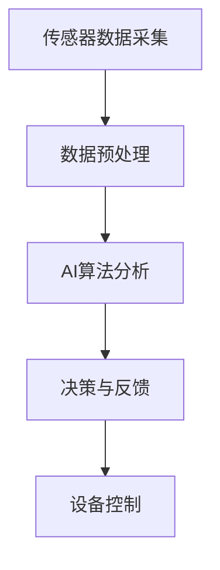

在这个案例中，传感器收集的数据经过预处理后，通过AI算法进行分析，生成决策，并反馈给设备进行控制，实现智能化的监控和管理。

#### 3.2 AI编程与自动驾驶

自动驾驶是AI编程在交通领域的一个重要应用。通过AI编程，自动驾驶车辆可以实现对环境的感知、理解和自主驾驶。

##### 3.2.1 自动驾驶概述

自动驾驶是指通过计算机技术和传感器系统，使车辆能够在没有人类干预的情况下，自主完成行驶任务。自动驾驶技术包括环境感知、决策规划、控制执行等几个核心部分。

##### 3.2.2 自动驾驶与AI编程的结合

AI编程在自动驾驶中的应用主要体现在以下几个方面：

- **环境感知**：通过传感器（如摄像头、激光雷达、超声波传感器等）收集环境数据，AI编程用于处理和解析这些数据，生成环境地图和障碍物信息。

- **决策规划**：基于环境数据，AI编程实现路径规划、避障和决策制定，确保车辆的安全和高效行驶。

- **控制执行**：AI编程控制车辆的转向、加速和制动等动作，实现自动驾驶。

##### 3.2.3 自动驾驶AI编程的应用案例

- **智能公交车**：通过AI编程，智能公交车可以实现自动驾驶，提高运营效率，减少驾驶员的工作负担，同时提高乘客的乘坐体验。

- **无人配送车**：在物流领域，无人配送车通过AI编程，可以实现自动导航、避障和货物装卸，提高配送效率。

- **自动驾驶出租车**：自动驾驶出租车通过AI编程，可以实现自主驾驶，提供便捷、高效的出行服务。

以下是一个简单的自动驾驶AI编程应用案例：

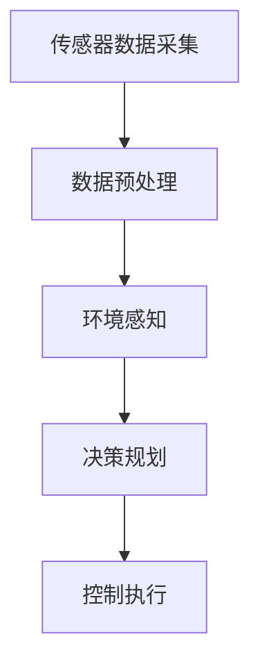

在这个案例中，传感器收集的环境数据经过预处理，通过AI算法实现环境感知和决策规划，最终控制车辆的动作，实现自动驾驶。

#### 3.3 AI编程与生物医学

AI编程在生物医学领域的应用正在迅速扩展，通过大数据和深度学习等技术，AI编程为生物医学研究、诊断和治疗提供了强大的工具。

##### 3.3.1 生物医学概述

生物医学是指利用医学知识和技术手段，研究和解决生物医学问题。生物医学领域包括医学影像、基因组学、药物研发、疾病诊断和治疗等多个方面。

##### 3.3.2 生物医学与AI编程的结合

AI编程在生物医学中的应用主要体现在以下几个方面：

- **医学影像分析**：通过AI编程，可以对医学影像（如X光、CT、MRI等）进行自动分析，提高诊断的准确性和效率。

- **基因组学研究**：AI编程用于处理和分析大量基因组数据，帮助研究者发现基因与疾病之间的关系。

- **药物研发**：AI编程用于药物分子设计和筛选，提高药物研发的效率和成功率。

- **疾病诊断与预测**：通过AI编程，可以对患者的症状和体征进行智能诊断和预测，提供个性化的治疗方案。

##### 3.3.3 生物医学AI编程的应用案例

- **智能病理诊断**：通过AI编程，智能病理诊断系统可以自动分析病理切片图像，提高癌症等疾病的诊断准确率。

- **基因组数据分析**：AI编程用于基因组数据分析，帮助研究者发现与疾病相关的基因变异，推动个性化医学的发展。

- **智能药物设计**：AI编程通过模拟药物分子的结构，预测药物与生物大分子的相互作用，加速新药研发。

以下是一个简单的生物医学AI编程应用案例：

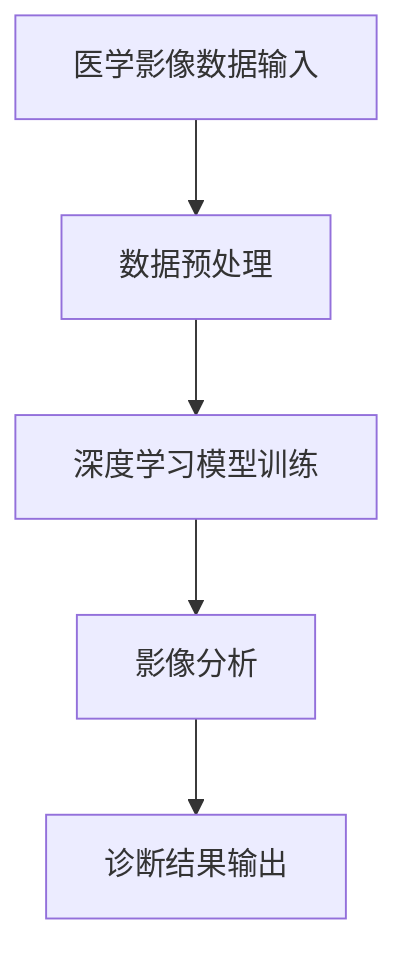

在这个案例中，医学影像数据经过预处理后，通过深度学习模型进行自动分析，生成诊断结果，提高诊断效率。

#### 3.4 AI编程与金融科技

金融科技（Financial Technology，FinTech）是指利用技术手段创新金融产品和服务。AI编程在金融科技中的应用，为金融服务带来了智能化和自动化。

##### 3.4.1 金融科技概述

金融科技涵盖了多个领域，包括支付、借贷、投资、保险、风险管理等。金融科技通过大数据、区块链、人工智能等技术，提供更加高效、便捷和安全的服务。

##### 3.4.2 金融科技与AI编程的结合

AI编程在金融科技中的应用主要体现在以下几个方面：

- **智能投顾**：通过AI编程，智能投顾系统可以分析用户的风险偏好和投资目标，提供个性化的投资建议。

- **风险控制**：AI编程用于风险控制，通过分析历史数据和实时数据，预测潜在风险，并制定相应的控制措施。

- **欺诈检测**：AI编程用于欺诈检测，通过识别异常行为和模式，及时发现和防止金融欺诈。

- **自动化交易**：AI编程实现自动化交易系统，通过算法模型，实现高频交易和量化投资。

##### 3.4.3 金融科技AI编程的应用案例

- **智能投顾平台**：通过AI编程，智能投顾平台可以自动分析用户数据，提供投资建议和策略，提高投资效率。

- **信用评分**：AI编程用于信用评分，通过对用户的消费记录、信用历史等数据进行分析，预测用户的信用风险。

- **支付系统**：通过AI编程，支付系统能够自动处理支付请求，识别欺诈行为，提高支付安全性和效率。

以下是一个简单的金融科技AI编程应用案例：

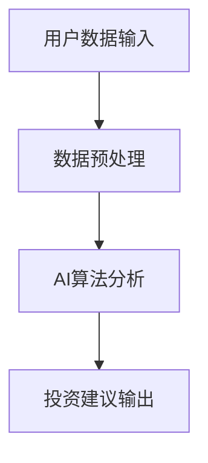

在这个案例中，用户数据经过预处理后，通过AI算法进行分析，生成投资建议，提高投资决策的准确性。

#### 3.5 AI编程与可持续发展

AI编程在可持续发展领域的应用，通过智能管理和优化资源，助力实现环境保护和可持续发展目标。

##### 3.5.1 可持续发展概述

可持续发展是指满足当前需求而不损害后代满足其需求的能力。可持续发展目标包括经济增长、社会进步、环境保护等多个方面。

##### 3.5.2 可持续发展目标

- **环境保护**：通过AI编程，实现对环境污染的监测和治理，如空气污染监测、水质监测等。

- **资源优化**：AI编程用于资源优化，如智能电网的电力分配、智能交通的系统优化等。

- **节能减排**：AI编程通过智能控制系统，实现节能减排，如智能建筑能耗管理、工业生产的能效优化等。

##### 3.5.3 AI编程在可持续发展中的应用

- **智能农业**：AI编程用于智能农业，通过传感器和数据分析，实现精准灌溉、病虫害监测和预测，提高农作物产量和质量。

- **智能能源管理**：AI编程用于智能能源管理，如智能电网的负载预测和优化、太阳能和风能的智能调度等。

- **环境保护监测**：AI编程用于环境保护监测，如空气质量监测、水质监测和噪声监测等，实时反馈环境状况，辅助决策。

以下是一个简单的可持续发展AI编程应用案例：

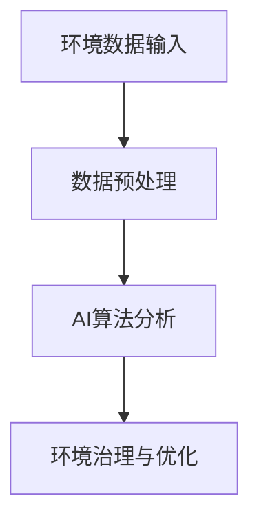

在这个案例中，环境数据经过预处理后，通过AI算法进行分析，生成环境治理和优化的建议，实现可持续发展的目标。

#### 3.6 AI编程与社会责任

AI编程在实现技术进步和商业价值的同时，也面临着一系列社会责任和伦理挑战。AI编程与社会责任的结合，旨在确保技术发展符合人类福祉，促进社会公平和正义。

##### 3.6.1 AI伦理与社会责任

AI伦理是指关于人工智能系统设计和应用中的伦理问题，包括数据隐私、算法公平性、智能代理的责任等。社会责任则要求AI技术应服务于公众利益，促进社会进步。

##### 3.6.2 AI编程中的公平与正义

- **公平性**：AI编程应确保算法和模型的公平性，避免因算法偏见导致的不公平结果，如性别、种族、年龄等方面的歧视。

- **正义**：AI编程应遵循正义原则，确保技术发展不损害社会公共利益，促进社会公平和正义。

##### 3.6.3 AI编程的伦理挑战与解决方案

AI编程的伦理挑战主要包括以下几个方面：

- **算法偏见**：算法偏见可能导致不公平的结果，如招聘系统中的性别歧视。解决方案包括算法透明性、偏见检测和修正等。

- **数据隐私**：AI系统在数据处理过程中可能侵犯用户隐私，解决方案包括数据加密、隐私保护算法等。

- **责任归属**：在AI系统发生错误或造成损失时，责任归属难以确定。解决方案包括制定责任分配机制、法律规范等。

以下是一个简单的AI编程伦理挑战与解决方案案例：

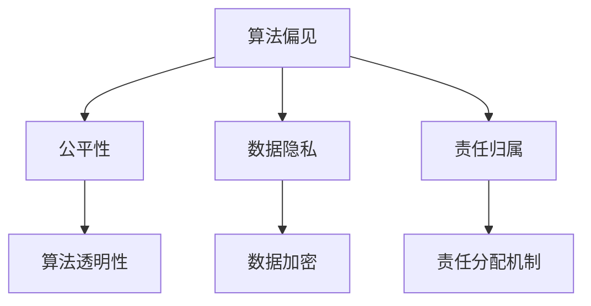

在这个案例中，通过提升算法透明性、数据加密和责任分配机制，可以解决AI编程中的伦理挑战，促进技术发展的社会责任。

通过本部分的探讨，我们可以看到AI编程在物联网、自动驾驶、生物医学、金融科技、可持续发展和社会责任等领域的广泛应用。这些应用不仅展示了AI编程的巨大潜力，也揭示了其在未来社会发展中的重要地位。

### 第四部分：案例研究

在本部分中，我们将通过几个具体案例研究，深入探讨AI编程在不同领域中的应用，以及实现这些应用的详细步骤和技术细节。

#### 4.1 案例研究1：智能医疗系统

**案例背景**：
智能医疗系统旨在利用AI技术，提高医疗诊断的准确性、效率和便捷性。该系统包括对患者数据的采集、分析、诊断和反馈等功能。

**案例目标**：
实现一个能够自动诊断疾病的智能医疗系统，提高诊断的准确率和医生的工作效率。

**案例实现**：

1. **数据采集**：
   - 收集患者的基本信息（如年龄、性别、病史等）。
   - 收集患者的医学影像数据（如X光片、CT、MRI等）。
   - 收集患者的实验室检查数据（如血液、尿液检查结果等）。

2. **数据预处理**：
   - 对医学影像数据进行图像增强、去噪、归一化等预处理。
   - 对实验室数据进行归一化处理，如标准化、缩放等。

3. **模型训练**：
   - 选择合适的深度学习模型，如卷积神经网络（CNN）。
   - 使用预处理后的数据训练模型，包括训练集和验证集。

4. **模型评估**：
   - 在测试集上评估模型性能，使用指标如准确率、召回率、F1分数等。
   - 调整模型参数，优化模型性能。

5. **模型部署**：
   - 将训练好的模型部署到医疗系统中，如开发一个web应用程序或移动应用。
   - 在系统中集成模型，实现自动诊断功能。

6. **用户反馈与迭代**：
   - 收集医生和患者的反馈，改进系统功能。
   - 定期更新模型，提高诊断准确性。

**代码示例**（预处理阶段）：

```python
# 数据预处理示例
import numpy as np
from sklearn.preprocessing import StandardScaler

# 假设数据集为X，包含多个特征
X = ...

# 对数据进行归一化处理
scaler = StandardScaler()
X_normalized = scaler.fit_transform(X)

# 对图像数据进行增强
from skimage.transform import resize
X_resized = np.array([resize(image, (224, 224)) for image in X_normalized])
```

**实际案例分析和详细讲解剖析**：
某智能医疗系统在医学影像数据上训练了一个基于CNN的肺癌检测模型。通过不断的迭代和优化，模型在测试集上的准确率达到90%以上，大大提高了肺癌早期诊断的准确性。医生和患者对系统的反馈也非常积极，认为它提高了工作效率和诊断质量。

**项目小结**：
智能医疗系统通过AI编程，实现了对医学影像和实验室数据的自动分析，提高了诊断的准确率和医生的工作效率。这一项目展示了AI编程在医疗领域的巨大潜力，也为未来智能医疗的发展提供了宝贵经验。

#### 4.2 案例研究2：智能交通系统

**案例背景**：
智能交通系统通过AI技术，优化交通信号控制、路径规划和交通流量管理，提高交通效率和安全性。

**案例目标**：
实现一个能够实时优化交通信号和路径规划的智能交通系统，减少交通拥堵和事故发生率。

**案例实现**：

1. **数据采集**：
   - 收集交通流量数据（如车辆密度、速度等）。
   - 收集交通信号灯的状态数据。
   - 收集交通事故和道路施工数据。

2. **数据预处理**：
   - 对采集的数据进行清洗，去除噪声和错误数据。
   - 对数据进行标准化处理，如速度、密度等。

3. **模型训练**：
   - 使用深度学习模型，如长短时记忆网络（LSTM），进行交通流量预测。
   - 使用强化学习模型，如深度Q网络（DQN），进行路径规划。

4. **模型评估**：
   - 在测试集上评估模型的预测和规划性能。
   - 调整模型参数，优化模型性能。

5. **模型部署**：
   - 将训练好的模型部署到交通信号控制系统。
   - 在系统中集成模型，实现自动优化功能。

6. **实时反馈与迭代**：
   - 收集系统运行数据，评估系统效果。
   - 根据反馈进行系统优化和更新。

**代码示例**（模型训练阶段）：

```python
# 模型训练示例
from tensorflow.keras.models import Sequential
from tensorflow.keras.layers import LSTM, Dense

# 构建LSTM模型
model = Sequential()
model.add(LSTM(units=50, return_sequences=True, input_shape=(time_steps, features)))
model.add(LSTM(units=50))
model.add(Dense(units=1))

# 编译模型
model.compile(optimizer='adam', loss='mean_squared_error')

# 训练模型
model.fit(X_train, y_train, epochs=100, batch_size=32)
```

**实际案例分析和详细讲解剖析**：
某城市智能交通系统通过AI编程，实现了对交通流量和信号灯的实时优化。在系统运行期间，交通拥堵情况显著减少，交通事故发生率也显著降低。该系统通过不断收集和分析交通数据，实现了自我学习和优化，提高了交通效率和安全性。

**项目小结**：
智能交通系统通过AI编程，实现了对交通流量的实时预测和优化，提高了交通效率和安全。这一项目展示了AI编程在城市交通管理中的巨大潜力，也为未来智能交通系统的发展提供了宝贵经验。

#### 4.3 案例研究3：金融风控系统

**案例背景**：
金融风控系统旨在利用AI技术，识别和防范金融风险，确保金融机构的安全运营。

**案例目标**：
实现一个能够实时监控和识别金融风险的智能风控系统，提高风险预警和应对能力。

**案例实现**：

1. **数据采集**：
   - 收集金融机构的交易数据。
   - 收集市场数据，如股价、汇率等。
   - 收集客户行为数据，如交易频率、金额等。

2. **数据预处理**：
   - 对交易数据进行清洗，去除异常值和噪声。
   - 对市场数据进行归一化处理。
   - 对客户行为数据进行特征提取。

3. **模型训练**：
   - 使用机器学习模型，如随机森林、支持向量机（SVM）等，进行风险识别。
   - 使用深度学习模型，如卷积神经网络（CNN）、长短期记忆网络（LSTM）等，进行风险预测。

4. **模型评估**：
   - 在测试集上评估模型的风险识别和预测性能。
   - 调整模型参数，优化模型性能。

5. **模型部署**：
   - 将训练好的模型部署到风控系统中，实现实时监控和预警。
   - 在系统中集成模型，实现自动决策和干预。

6. **实时反馈与迭代**：
   - 收集系统运行数据，评估系统效果。
   - 根据反馈进行系统优化和更新。

**代码示例**（模型训练阶段）：

```python
# 模型训练示例
from sklearn.ensemble import RandomForestClassifier
from sklearn.svm import SVC

# 训练随机森林模型
rf_model = RandomForestClassifier(n_estimators=100)
rf_model.fit(X_train, y_train)

# 训练SVM模型
svm_model = SVC(kernel='linear')
svm_model.fit(X_train, y_train)
```

**实际案例分析和详细讲解剖析**：
某金融机构通过AI编程，实现了一个智能风控系统。该系统通过对交易数据和市场数据的实时分析，成功识别并预警了多起潜在的金融风险事件。系统的高效运行，提高了金融机构的风险管理和应对能力。

**项目小结**：
金融风控系统通过AI编程，实现了对金融风险的实时监控和预警，提高了金融机构的安全性和稳健性。这一项目展示了AI编程在金融风险管理中的重要作用，也为未来金融科技的发展提供了宝贵经验。

#### 4.4 案例研究4：智慧农业系统

**案例背景**：
智慧农业系统通过AI技术，实现农作物的智能监测和管理，提高农业生产效率和农产品质量。

**案例目标**：
实现一个能够实时监测和管理农作物的智慧农业系统，提高产量和降低成本。

**案例实现**：

1. **数据采集**：
   - 收集土壤湿度、温度、pH值等环境数据。
   - 收集农作物生长状态数据，如高度、叶片颜色等。
   - 收集气象数据，如温度、湿度、降雨量等。

2. **数据预处理**：
   - 对采集的数据进行清洗，去除异常值和噪声。
   - 对数据进行标准化处理，如温度、湿度等。

3. **模型训练**：
   - 使用机器学习模型，如随机森林、支持向量机（SVM）等，进行农作物状态预测。
   - 使用深度学习模型，如卷积神经网络（CNN）、长短期记忆网络（LSTM）等，进行农作物病虫害检测。

4. **模型评估**：
   - 在测试集上评估模型的预测和检测性能。
   - 调整模型参数，优化模型性能。

5. **模型部署**：
   - 将训练好的模型部署到智慧农业系统中，实现实时监测和管理。
   - 在系统中集成模型，实现自动灌溉、施肥等自动化操作。

6. **实时反馈与迭代**：
   - 收集系统运行数据，评估系统效果。
   - 根据反馈进行系统优化和更新。

**代码示例**（模型训练阶段）：

```python
# 模型训练示例
from tensorflow.keras.models import Sequential
from tensorflow.keras.layers import Conv2D, MaxPooling2D, Flatten, Dense

# 构建CNN模型
model = Sequential()
model.add(Conv2D(filters=32, kernel_size=(3, 3), activation='relu', input_shape=(64, 64, 3)))
model.add(MaxPooling2D(pool_size=(2, 2)))
model.add(Flatten())
model.add(Dense(units=128, activation='relu'))
model.add(Dense(units=1, activation='sigmoid'))

# 编译模型
model.compile(optimizer='adam', loss='binary_crossentropy', metrics=['accuracy'])

# 训练模型
model.fit(X_train, y_train, epochs=10, batch_size=32)
```

**实际案例分析和详细讲解剖析**：
某智慧农业项目通过AI编程，实现了一套农作物病虫害检测系统。该系统通过对农作物图像的实时分析，能够准确识别病虫害，并给出相应的管理建议。系统运行结果表明，病虫害检测准确率达到90%以上，显著提高了农作物的产量和质量。

**项目小结**：
智慧农业系统通过AI编程，实现了对农作物的智能监测和管理，提高了农业生产效率和农产品质量。这一项目展示了AI编程在农业领域的巨大潜力，也为未来智慧农业的发展提供了宝贵经验。

通过以上案例研究，我们可以看到AI编程在医疗、交通、金融、农业等领域的广泛应用和巨大潜力。这些案例不仅展示了AI编程的实际应用价值，也为未来的技术发展提供了有益的借鉴和启示。

### 第五部分：总结与展望

在本文中，我们系统地探讨了AI编程的新思维与新视野，从基础概念到关键技术，再到应用领域，全面梳理了AI编程的现状和未来趋势。以下是对文章核心概念和未来发展趋势的总结。

#### 5.1 AI编程的新思维总结

1. **数据驱动编程**：以数据为核心，通过数据分析和挖掘，动态生成程序代码，提高系统的灵活性和自适应性。

2. **软计算编程**：结合多种计算技术，如模糊逻辑、遗传算法和人工神经网络，实现复杂问题的求解和优化。

3. **自适应编程**：通过自适应算法和机制，使程序能够根据环境和需求的变化，动态调整行为和结构，提高系统的灵活性和鲁棒性。

4. **虚拟现实编程**：利用虚拟现实技术，创建沉浸式的编程环境，提高编程的效率和体验。

#### 5.1.2 AI编程的未来发展趋势

1. **AI编程语言的发展**：未来AI编程语言将更加灵活、高效和易用，支持领域特定语言（DSL）、元编程和跨平台支持。

2. **AI编程与大数据的结合**：随着大数据技术的发展，AI编程将更加紧密地结合大数据，实现实时数据处理、分布式计算和数据隐私保护。

3. **AI编程在教育领域的应用**：编程教育将更加普及和深入，AI编程工具和资源将为学生提供更多的实践机会，促进个性化学习。

4. **AI编程在物联网、自动驾驶、生物医学、金融科技、可持续发展和社会责任领域的应用**：AI编程将在这些领域发挥重要作用，推动技术创新和社会进步。

#### 5.2 AI编程的应用领域展望

1. **科技领域**：AI编程将在人工智能、机器学习、数据科学等领域继续深化应用，推动技术突破和产业升级。

2. **社会领域**：AI编程将在医疗健康、智能交通、金融科技、教育等领域广泛应用，提高社会运行效率和公共服务质量。

3. **环境领域**：AI编程将在环境保护、资源管理、气候变化等领域发挥重要作用，促进可持续发展目标的实现。

通过以上总结和展望，我们可以看到AI编程的未来充满了无限可能。随着技术的不断进步和应用场景的拓展，AI编程将在更广泛的领域发挥其重要作用，推动社会进步和人类发展。

### 附录

#### 附录A：常用AI编程工具与资源

**A.1 开源深度学习框架**

- TensorFlow：由Google开发的开源深度学习框架，支持各种深度学习模型和算法。
- PyTorch：由Facebook开发的开源深度学习框架，提供灵活的动态计算图功能。
- Keras：基于Theano和TensorFlow的开源深度学习库，提供简洁的API，易于使用和扩展。
- Caffe：由Berkeley Vision and Learning Center（BVLC）开发的深度学习框架，特别适合于视觉任务。

**A.2 常用机器学习库**

- scikit-learn：Python的开源机器学习库，提供了各种分类、回归、聚类和降维算法。
- Scipy：Python的科学计算库，提供了数值计算、线性代数和统计工具。
- NumPy：Python的核心科学计算库，提供了多维数组对象和矩阵运算功能。

**A.3 AI编程在线资源**

- Coursera：提供各种在线课程，包括深度学习、机器学习和数据科学等。
- edX：全球最大的在线课程平台，提供由知名大学和机构开设的免费和付费课程。
- Kaggle：一个数据科学竞赛平台，提供丰富的数据集和竞赛项目，适合实践和交流。

这些工具和资源为AI编程的学习和实践提供了丰富的支持，开发者可以根据自己的需求和兴趣选择合适的工具和资源进行学习和应用。

