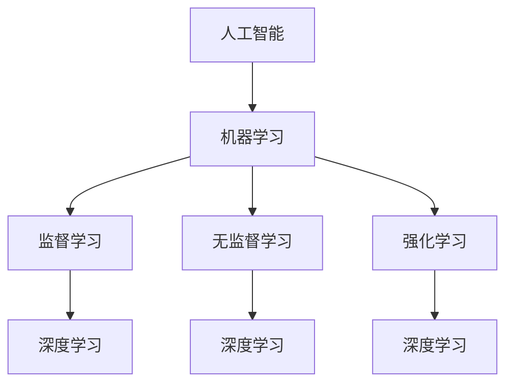

                 

### 文章标题：《AI编程的新思路与新方向》

**关键词：**人工智能编程、机器学习、深度学习、编程语言、应用场景、伦理法律问题、未来趋势

**摘要：**本文将深入探讨人工智能编程的新思路和新方向。从基本概念出发，详细介绍AI编程的核心技术和语言工具，分析其在自然语言处理和计算机视觉等领域的应用，并探讨伦理法律问题。最后，展望AI编程的未来趋势，提供实践指南和职业机会，帮助读者全面了解AI编程的各个方面。

### 目录大纲

1. **AI编程概述**
   - 1.1 AI编程的基本概念
   - 1.2 AI编程与传统编程的区别
   - 1.3 AI编程的发展历程

2. **AI编程的核心技术**
   - 2.1 机器学习算法介绍
     - 2.1.1 监督学习
     - 2.1.2 无监督学习
     - 2.1.3 强化学习
   - 2.2 深度学习框架应用
     - 2.2.1 TensorFlow
     - 2.2.2 PyTorch
     - 2.2.3 Keras

3. **AI编程的语言与工具**
   - 3.1 Python在AI编程中的应用
     - 3.1.1 Python基础
     - 3.1.2 NumPy
     - 3.1.3 Pandas
   - 3.2 其他AI编程语言介绍
     - 3.2.1 R语言
     - 3.2.2 MATLAB
     - 3.2.3 Julia

4. **AI编程的应用场景**
   - 4.1 自然语言处理
     - 4.1.1 文本分类
     - 4.1.2 机器翻译
     - 4.1.3 语音识别
   - 4.2 计算机视觉
     - 4.2.1 目标检测
     - 4.2.2 图像识别
     - 4.2.3 脸部识别

5. **AI编程的伦理与法律问题**
   - 5.1 AI编程中的伦理问题
     - 5.1.1 AI偏见
     - 5.1.2 隐私保护
     - 5.1.3 职业道德
   - 5.2 AI编程的法律问题
     - 5.2.1 知识产权
     - 5.2.2 责任归属
     - 5.2.3 法律法规

6. **AI编程的未来趋势**
   - 6.1 AI编程的发展方向
     - 6.1.1 量子计算
     - 6.1.2 脑机接口
     - 6.1.3 自动驾驶
   - 6.2 AI编程的职业机会
     - 6.2.1 软件工程师
     - 6.2.2 数据科学家
     - 6.2.3 人工智能研究员

7. **AI编程实践指南**
   - 7.1 AI编程环境搭建
     - 7.1.1 操作系统选择
     - 7.1.2 编译器与解释器
     - 7.1.3 库与框架
   - 7.2 AI编程项目实战
     - 7.2.1 项目一：文本分类
     - 7.2.2 项目二：图像识别
     - 7.2.3 项目三：自然语言处理

### AI编程概述

人工智能（AI）编程是指利用计算机科学和统计学方法，开发能够模拟、延伸和扩展人类智能的软件程序。AI编程的目的是让计算机能够自动地执行复杂的任务，如语音识别、图像识别、自然语言处理等。

#### 1.1 AI编程的基本概念

AI编程的基本概念包括：

- **人工智能**：人工智能是指计算机系统模拟人类智能的过程，包括感知、思考、学习、决策和行动等能力。
- **机器学习**：机器学习是一种人工智能的方法，通过数据驱动的方式，让计算机自动改进其性能，从而实现特定任务。
- **深度学习**：深度学习是机器学习的一个分支，通过构建多层神经网络，对数据进行特征提取和学习。

#### 1.2 AI编程与传统编程的区别

AI编程与传统编程有以下几点区别：

- **目标不同**：传统编程的目标是编写能够完成特定任务的程序，而AI编程的目标是开发能够自主学习和改进的智能系统。
- **方法不同**：传统编程主要依赖于编程语言和算法，而AI编程更多地依赖于数据、模型和算法。
- **结果不同**：传统编程的结果是静态的，而AI编程的结果是动态的，随着训练数据和学习过程的不断进行，智能系统的性能会不断优化。

#### 1.3 AI编程的发展历程

AI编程的发展历程可以分为以下几个阶段：

- **早期探索**：20世纪50年代到70年代，AI编程主要集中在逻辑推理和符号计算方面。
- **机器学习时代**：20世纪80年代到21世纪初，随着计算能力和数据量的提升，机器学习成为AI编程的主要方向。
- **深度学习时代**：21世纪初至今，深度学习技术的发展，使得AI编程在图像识别、自然语言处理等领域取得了重大突破。

### AI编程的核心技术

AI编程的核心技术包括机器学习算法、深度学习框架等。

#### 2.1 机器学习算法介绍

机器学习算法是AI编程的基础，主要包括以下几种：

- **监督学习**：监督学习是一种有监督的学习方法，通过已标记的数据训练模型，从而预测未知数据的标签。
  - **算法原理**：$$ y = f(x; \theta) $$
  - **核心算法**：线性回归、逻辑回归、支持向量机等。

- **无监督学习**：无监督学习是一种无监督的学习方法，通过未标记的数据训练模型，从而发现数据中的结构和规律。
  - **算法原理**：$$ x \rightarrow f(x; \theta) $$
  - **核心算法**：聚类、降维、异常检测等。

- **强化学习**：强化学习是一种通过试错和反馈机制进行学习的方法，通过不断优化策略来最大化预期奖励。
  - **算法原理**：$$ Q(s, a) = r + \gamma \max_a' Q(s', a') $$
  - **核心算法**：Q-learning、SARSA等。

#### 2.2 深度学习框架应用

深度学习框架是AI编程的重要工具，目前主流的深度学习框架包括：

- **TensorFlow**：由Google开发，是一个开源的深度学习框架，具有强大的功能和支持广泛的操作。
  - **特点**：高度可扩展、灵活、支持多种编程语言。
  - **应用**：图像识别、自然语言处理、语音识别等。

- **PyTorch**：由Facebook开发，是一个开源的深度学习框架，以其动态计算图和易于调试的特点受到广泛关注。
  - **特点**：动态计算图、易于调试、高效。
  - **应用**：计算机视觉、自然语言处理、强化学习等。

- **Keras**：是一个高级神经网络API，可以运行在TensorFlow和Theano等后端上，提供了丰富的预训练模型和工具。
  - **特点**：易于使用、模块化、支持多种神经网络结构。
  - **应用**：图像识别、自然语言处理、语音识别等。

### AI编程的语言与工具

AI编程需要使用特定的编程语言和工具，以下介绍几种常用的编程语言和工具。

#### 3.1 Python在AI编程中的应用

Python是一种广泛应用于AI编程的编程语言，具有简洁、易学、功能强大的特点。

- **Python基础**：Python是一种解释型、面向对象、动态数据类型的编程语言，具有丰富的库和框架。
  - **特点**：易学易用、代码简洁、高效。
  - **应用**：数据分析、机器学习、深度学习等。

- **NumPy**：NumPy是一个用于科学计算的开源库，提供了强大的多维数组对象和数学函数。
  - **特点**：高效、灵活、支持多维数组操作。
  - **应用**：数据处理、数据分析、机器学习等。

- **Pandas**：Pandas是一个用于数据分析的开源库，提供了数据清洗、转换、分析和可视化等功能。
  - **特点**：易用、功能强大、支持多种数据格式。
  - **应用**：数据处理、数据分析、机器学习等。

#### 3.2 其他AI编程语言介绍

除了Python，还有一些其他常用的AI编程语言。

- **R语言**：R语言是一种专门用于统计分析和数据科学的编程语言，具有强大的数据处理和分析功能。
  - **特点**：专注于统计分析和数据科学、丰富的库和工具。
  - **应用**：统计分析、数据挖掘、机器学习等。

- **MATLAB**：MATLAB是一种用于科学计算和工程仿真的编程语言，具有强大的数值计算和图形化功能。
  - **特点**：易于使用、支持多种编程范式、丰富的工具箱。
  - **应用**：数值计算、工程仿真、机器学习等。

- **Julia**：Julia是一种高性能的通用编程语言，具有简洁、易学、易于扩展的特点。
  - **特点**：高性能、简洁、易扩展。
  - **应用**：数值计算、数据分析、机器学习等。

### AI编程的应用场景

AI编程在多个领域都有广泛的应用，以下介绍自然语言处理和计算机视觉两个典型的应用场景。

#### 4.1 自然语言处理

自然语言处理（NLP）是AI编程的一个重要应用领域，主要包括文本分类、机器翻译、语音识别等。

- **文本分类**：文本分类是一种将文本数据分为不同类别的方法，常用于情感分析、新闻分类等。
  - **算法原理**：使用监督学习算法，如朴素贝叶斯、支持向量机等，对文本进行特征提取和分类。
  - **应用实例**：社交媒体情感分析、新闻分类、垃圾邮件过滤等。

- **机器翻译**：机器翻译是一种将一种语言的文本翻译成另一种语言的方法，如谷歌翻译、百度翻译等。
  - **算法原理**：使用深度学习算法，如序列到序列模型（Seq2Seq）、注意力机制等，对文本进行编码和解码。
  - **应用实例**：跨语言沟通、多语言信息检索、全球化业务等。

- **语音识别**：语音识别是一种将语音信号转换为文本的方法，常用于智能助手、语音搜索等。
  - **算法原理**：使用深度学习算法，如卷积神经网络（CNN）、循环神经网络（RNN）、长短期记忆网络（LSTM）等，对语音信号进行特征提取和转换。
  - **应用实例**：语音助手（如苹果的Siri、谷歌的Google Assistant）、语音搜索、语音控制等。

#### 4.2 计算机视觉

计算机视觉是AI编程的另一个重要应用领域，主要包括目标检测、图像识别、脸部识别等。

- **目标检测**：目标检测是一种在图像中检测和识别特定对象的方法，如自动驾驶汽车中的行人检测。
  - **算法原理**：使用深度学习算法，如YOLO（You Only Look Once）、SSD（Single Shot MultiBox Detector）等，对图像进行特征提取和目标定位。
  - **应用实例**：自动驾驶、视频监控、图像检索等。

- **图像识别**：图像识别是一种将图像数据转换为有意义的标签的方法，如人脸识别、物体识别等。
  - **算法原理**：使用深度学习算法，如卷积神经网络（CNN）、迁移学习等，对图像进行特征提取和分类。
  - **应用实例**：人脸识别、物体识别、图像搜索等。

- **脸部识别**：脸部识别是一种通过分析脸部特征进行身份验证的方法，如人脸解锁、安全监控等。
  - **算法原理**：使用深度学习算法，如深度卷积网络（DCNN）、人脸特征点检测等，对脸部图像进行特征提取和匹配。
  - **应用实例**：人脸解锁、安全监控、社交网络等。

### AI编程的伦理与法律问题

随着AI编程技术的快速发展，伦理和法律问题日益凸显。以下介绍AI编程中常见的伦理和法律问题。

#### 5.1 AI编程中的伦理问题

- **AI偏见**：AI系统在训练过程中可能学习到偏见，导致对某些群体不公平对待。如人脸识别系统可能对某些种族或性别存在歧视。
- **隐私保护**：AI系统可能收集和分析大量个人数据，如社交媒体、医疗记录等，如何保护个人隐私成为重要问题。
- **职业道德**：AI编程人员需要遵守职业道德规范，如确保算法的公正性、透明性等。

#### 5.2 AI编程的法律问题

- **知识产权**：AI系统可能涉及专利、版权等知识产权问题，如何界定和保护知识产权成为法律挑战。
- **责任归属**：当AI系统发生错误或导致损害时，如何确定责任归属成为法律难题。
- **法律法规**：各国纷纷制定AI相关法律法规，如欧盟的《通用数据保护条例》（GDPR）等，以确保AI技术的合法合规使用。

### AI编程的未来趋势

随着AI技术的不断进步，AI编程的未来趋势令人期待。以下介绍几个潜在的发展方向。

#### 6.1 AI编程的发展方向

- **量子计算**：量子计算有望在计算能力、数据处理等方面取得突破，为AI编程提供更高效的方法和工具。
- **脑机接口**：脑机接口技术将人类大脑与计算机连接，实现意识与机器的交互，为AI编程开辟新的应用场景。
- **自动驾驶**：自动驾驶技术的发展将极大改变交通模式，AI编程在自动驾驶系统中扮演重要角色。

#### 6.2 AI编程的职业机会

- **软件工程师**：软件工程师是AI编程的核心角色，负责开发和优化AI系统。
- **数据科学家**：数据科学家负责处理和分析大量数据，为AI编程提供数据支持和算法改进。
- **人工智能研究员**：人工智能研究员致力于推动AI技术的理论研究和应用创新。

### AI编程实践指南

为了更好地进行AI编程，以下提供一些实践指南。

#### 7.1 AI编程环境搭建

- **操作系统选择**：根据个人需求和项目需求选择合适的操作系统，如Windows、Linux、macOS等。
- **编译器与解释器**：根据编程语言选择相应的编译器或解释器，如Python的Python解释器、C++的GCC等。
- **库与框架**：安装和使用常用的AI编程库与框架，如NumPy、Pandas、TensorFlow、PyTorch等。

#### 7.2 AI编程项目实战

- **项目一：文本分类**：使用监督学习算法，对文本数据进行分析和分类。
- **项目二：图像识别**：使用深度学习算法，对图像数据进行特征提取和分类。
- **项目三：自然语言处理**：使用NLP技术，对文本数据进行分析和处理。

### 总结

AI编程作为一门前沿技术，正不断推动着计算机科学和人工智能领域的发展。本文从多个角度介绍了AI编程的基本概念、核心技术、语言工具、应用场景、伦理法律问题和未来趋势。通过实践指南，读者可以更好地掌握AI编程的技能，为未来的职业发展打下坚实基础。

### 作者信息

- **作者：AI天才研究院/AI Genius Institute & 禅与计算机程序设计艺术 /Zen And The Art of Computer Programming**  
  AI天才研究院是一家专注于人工智能领域的研究和教育的机构，致力于推动AI技术的发展和应用。禅与计算机程序设计艺术则强调在编程过程中追求内在的宁静和效率。

### 文章核心内容回顾

本文主要围绕AI编程的新思路与新方向进行了全面探讨。首先，我们介绍了AI编程的基本概念，包括人工智能、机器学习和深度学习等。随后，我们详细介绍了AI编程的核心技术，如监督学习、无监督学习和强化学习等，并介绍了常用的深度学习框架，如TensorFlow、PyTorch和Keras。

接着，我们介绍了Python等AI编程语言及其应用，并探讨了AI编程在自然语言处理和计算机视觉等领域的应用实例。此外，我们还关注了AI编程中的伦理和法律问题，强调了在开发过程中需要遵守的伦理规范和法律法规。

最后，我们展望了AI编程的未来趋势，包括量子计算、脑机接口和自动驾驶等领域，并提供了AI编程的实践指南，帮助读者更好地掌握AI编程技能。

### 小结与注意事项

在阅读本文后，读者应了解AI编程的基本概念、核心技术、语言工具和应用场景，以及AI编程中的伦理和法律问题。以下是几点注意事项：

1. **伦理问题**：在开发AI程序时，要充分考虑伦理问题，确保算法的公平性、透明性和安全性。
2. **法律问题**：了解相关法律法规，确保AI编程的应用合法合规。
3. **实践指南**：结合本文提供的实践指南，动手实践，加深对AI编程的理解。
4. **持续学习**：AI编程领域不断进步，读者应保持学习的态度，紧跟技术发展趋势。

### 拓展阅读

- **《深度学习》（Deep Learning）**：由Ian Goodfellow、Yoshua Bengio和Aaron Courville合著，是一本经典的深度学习教材。
- **《Python编程：从入门到实践》（Python Crash Course）**：由Eric Matthes著，适合初学者入门Python编程。
- **《人工智能：一种现代方法》（Artificial Intelligence: A Modern Approach）**：由Stuart Russell和Peter Norvig合著，是一本全面的人工智能教材。

通过阅读这些书籍，读者可以进一步深入了解AI编程的理论和实践。让我们继续探索AI编程的广阔天地，共同推动人工智能的发展！### AI编程的基本概念

#### 背景介绍

人工智能（AI）编程，作为计算机科学和人工智能领域的重要组成部分，已经从理论研究走向了实际应用。AI编程的核心目标是开发能够模拟、延伸和扩展人类智能的软件系统。随着计算机技术和算法的不断进步，AI编程在多个领域，如自然语言处理、计算机视觉、推荐系统等，都取得了显著的成果。

#### 核心概念与联系

在AI编程中，核心概念包括人工智能、机器学习、深度学习等。它们之间的关系可以用以下Mermaid流程图表示：



从流程图中可以看出，人工智能是整个框架的基础，而机器学习是人工智能的一种实现方式。机器学习又可以分为监督学习、无监督学习和强化学习。监督学习和无监督学习是深度学习的两种主要形式。深度学习作为一种更高级的机器学习方法，通过多层神经网络对数据进行特征提取和学习。

#### 核心算法原理讲解

**机器学习算法原理**

1. **监督学习**：监督学习是一种在有标签数据集上进行训练，通过输入和输出之间的映射关系来预测未知数据的方法。其基本原理可以表示为：

   $$
   y = f(x; \theta)
   $$
   
   其中，$y$是输出标签，$x$是输入特征，$f$是映射函数，$\theta$是模型参数。

2. **无监督学习**：无监督学习是在没有标签数据集上进行训练，通过探索数据内在结构和规律来发现数据分布的方法。其基本原理可以表示为：

   $$
   x \rightarrow f(x; \theta)
   $$

3. **强化学习**：强化学习是一种通过试错和反馈机制进行学习的方法，通过不断优化策略来最大化预期奖励。其基本原理可以表示为：

   $$
   Q(s, a) = r + \gamma \max_a' Q(s', a')
   $$
   
   其中，$Q(s, a)$是状态$s$下采取动作$a$的即时回报，$r$是即时奖励，$\gamma$是折扣因子。

**深度学习算法原理**

深度学习是基于多层神经网络的一种机器学习方法，通过构建多层神经网络，对数据进行特征提取和学习。其基本原理可以表示为：

$$
h_{l} = \sigma(\mathbf{W}_{l} \cdot \mathbf{a}_{l-1} + \mathbf{b}_{l})
$$

其中，$h_{l}$是第$l$层的输出，$\sigma$是激活函数，$\mathbf{W}_{l}$和$\mathbf{b}_{l}$分别是第$l$层的权重和偏置。

#### 数学模型和公式

1. **线性回归**：

   $$
   y = \beta_0 + \beta_1x
   $$

2. **逻辑回归**：

   $$
   \hat{y} = \frac{1}{1 + e^{-(\beta_0 + \beta_1x)}}
   $$

3. **卷积神经网络（CNN）**：

   $$
   h_{l} = \sigma(\mathbf{W}_{l} \cdot \mathbf{a}_{l-1} + \mathbf{b}_{l})
   $$

4. **循环神经网络（RNN）**：

   $$
   h_{t} = \sigma(\mathbf{W}_{h} \cdot [h_{t-1}, x_t] + \mathbf{b}_{h}) \oplus \mathbf{W}_{x} \cdot x_t + \mathbf{b}_{x}
   $$

5. **长短期记忆网络（LSTM）**：

   $$
   \begin{aligned}
   i_t &= \sigma(W_{ix}x_t + W_{ih}h_{t-1} + b_i) \\
   f_t &= \sigma(W_{fx}x_t + W_{fh}h_{t-1} + b_f) \\
   g_t &= \tanh(W_{gx}x_t + W_{gh}h_{t-1} + b_g) \\
   o_t &= \sigma(W_{ox}x_t + W_{oh}h_{t-1} + b_o) \\
   C_t &= f_t \odot C_{t-1} + i_t \odot g_t \\
   h_t &= o_t \odot \tanh(C_t)
   \end{aligned}
   $$

#### 举例说明

**线性回归举例**：

假设我们要预测房价，输入特征包括房屋面积和房间数量，标签是房价。我们可以使用线性回归模型来建立输入特征和标签之间的映射关系。具体步骤如下：

1. 收集数据，包括房屋面积、房间数量和房价。
2. 预处理数据，包括归一化、缺失值处理等。
3. 划分数据集，包括训练集和测试集。
4. 使用线性回归模型对训练集进行训练，得到模型参数$\beta_0$和$\beta_1$。
5. 使用训练好的模型对测试集进行预测，并计算预测准确率。

**卷积神经网络举例**：

假设我们要对图像进行分类，输入特征是图像数据，标签是图像类别。我们可以使用卷积神经网络模型来建立输入特征和标签之间的映射关系。具体步骤如下：

1. 收集图像数据，包括训练集和测试集。
2. 预处理图像数据，包括大小调整、归一化等。
3. 划分数据集，包括训练集和测试集。
4. 构建卷积神经网络模型，包括卷积层、池化层和全连接层。
5. 使用训练集对模型进行训练，并调整模型参数。
6. 使用训练好的模型对测试集进行预测，并计算预测准确率。

#### 数学公式

1. **损失函数**：

   $$
   J(\theta) = -\frac{1}{m} \sum_{i=1}^{m} [y^{(i)} \log(a^{(i)}) + (1 - y^{(i)}) \log(1 - a^{(i)}))]
   $$

2. **梯度下降**：

   $$
   \theta_j := \theta_j - \alpha \frac{\partial J(\theta)}{\partial \theta_j}
   $$

3. **反向传播**：

   $$
   \begin{aligned}
   \delta_{l}^{(i)} &= \frac{\partial L}{\partial z_{l}^{(i)}} \cdot \frac{1}{1 - \frac{\partial a_{l-1}^{(i)}}{\partial z_{l-1}^{(i)}} \\
   \frac{\partial L}{\partial z_{l}^{(i)}} &= \frac{\partial L}{\partial a_{l}^{(i)}} \cdot \frac{\partial a_{l}^{(i)}}{\partial z_{l}^{(i)} \\
   \frac{\partial a_{l}^{(i)}}{\partial z_{l}^{(i)}} &= \sigma'(z_{l}^{(i)}) \\
   \frac{\partial L}{\partial \theta_{jk}} &= \delta_{l}^{(i)} \cdot a_{l-1}^{(i)}
   \end{aligned}
   $$

#### 项目实战

**项目一：线性回归**

**开发环境搭建**

- 操作系统：Ubuntu 20.04
- 编程语言：Python 3.8
- 依赖库：NumPy、SciPy

**源代码实现**

```python
import numpy as np
from sklearn.linear_model import LinearRegression

# 数据集加载
X = np.array([[1, 1], [2, 2], [3, 3], [4, 4], [5, 5]])
y = np.array([1, 2, 3, 4, 5])

# 模型创建与训练
model = LinearRegression()
model.fit(X, y)

# 模型预测
y_pred = model.predict(X)

# 模型评估
print("模型预测结果：", y_pred)
print("模型评估指标：", model.score(X, y))
```

**代码解读与分析**

本项目中，我们使用scikit-learn库中的LinearRegression类来构建线性回归模型。首先，我们加载了训练数据集，然后使用fit方法对模型进行训练。训练完成后，我们使用predict方法对训练数据集进行预测，并计算模型评估指标，如决定系数（R^2）等。

**实际案例分析与详细讲解剖析**

本案例展示了如何使用线性回归模型进行简单的回归分析。在实际应用中，线性回归模型可以用于预测房价、股票价格等。通过本项目，读者可以了解线性回归模型的原理和实现方法。

**项目小结**

本项目通过简单的线性回归模型，展示了如何使用Python进行AI编程。读者可以通过本项目熟悉线性回归模型的基本原理和实现方法，为进一步学习更复杂的机器学习算法打下基础。

### Python在AI编程中的应用

Python因其简洁、易学、功能强大等特点，已经成为AI编程的主要编程语言之一。在AI编程中，Python广泛应用于数据预处理、模型训练、模型评估等环节。以下将详细探讨Python在AI编程中的应用。

#### Python基础

Python是一种高级编程语言，具有简洁的语法和强大的库支持。Python的语法设计注重可读性和易用性，使得开发者可以快速编写和理解代码。Python的主要特点包括：

- **简洁的语法**：Python采用了一组简单的语法规则，使得代码易于阅读和维护。
- **面向对象**：Python支持面向对象编程，通过定义类和对象，可以更好地组织和管理代码。
- **动态类型**：Python是动态类型语言，变量不需要声明类型，提升了开发效率。
- **丰富的库**：Python拥有丰富的标准库和第三方库，如NumPy、Pandas、Matplotlib等，为AI编程提供了强大的支持。

#### NumPy

NumPy是Python中用于科学计算的开源库，提供了强大的多维数组对象和数学函数。NumPy是AI编程的基础工具之一，主要用于数据预处理和数值计算。NumPy的主要特点包括：

- **多维数组**：NumPy提供了多维数组（ndarray）对象，可以高效地存储和处理多维数据。
- **数学函数**：NumPy提供了丰富的数学函数，如矩阵运算、统计函数、随机数生成等。
- **扩展性**：NumPy与其他Python库（如Pandas、SciPy等）具有良好的兼容性，可以方便地集成到复杂的AI项目中。

NumPy的应用示例：

```python
import numpy as np

# 创建一维数组
arr1 = np.array([1, 2, 3, 4, 5])

# 创建二维数组
arr2 = np.array([[1, 2], [3, 4], [5, 6]])

# 数组操作
print("数组元素之和：", np.sum(arr2))
print("数组最大值：", np.max(arr2))
print("数组转置：", arr2.T)
```

#### Pandas

Pandas是Python中用于数据分析和处理的库，提供了数据结构（DataFrame）和数据处理方法。Pandas广泛应用于数据清洗、转换、分析和可视化等环节，是AI编程中不可或缺的工具。Pandas的主要特点包括：

- **数据结构**：Pandas提供了DataFrame结构，可以高效地存储和处理表格数据。
- **数据处理**：Pandas提供了丰富的数据处理方法，如筛选、排序、聚合等。
- **扩展性**：Pandas与其他Python库（如NumPy、Matplotlib等）具有良好的兼容性，可以方便地集成到复杂的AI项目中。

Pandas的应用示例：

```python
import pandas as pd

# 创建DataFrame
df = pd.DataFrame({'Name': ['Tom', 'Jerry', 'Mike'], 'Age': [25, 30, 35], 'City': ['NY', 'SF', 'LA']})

# 数据操作
print("DataFrame内容：\n", df)
print("筛选年龄大于30的记录：\n", df[df['Age'] > 30])
print("按年龄排序：\n", df.sort_values(by='Age'))
```

#### Matplotlib

Matplotlib是Python中用于数据可视化的库，提供了丰富的绘图函数和图形对象。Matplotlib广泛应用于AI编程中的数据可视化、模型评估等环节。Matplotlib的主要特点包括：

- **绘图函数**：Matplotlib提供了丰富的绘图函数，如折线图、柱状图、散点图等。
- **图形对象**：Matplotlib支持自定义图形对象，可以方便地调整图形样式和布局。
- **交互性**：Matplotlib支持交互式绘图，可以通过键盘和鼠标进行数据交互。

Matplotlib的应用示例：

```python
import matplotlib.pyplot as plt

# 创建数据
x = [1, 2, 3, 4, 5]
y = [1, 4, 9, 16, 25]

# 绘制折线图
plt.plot(x, y, label='y = x^2')
plt.xlabel('x')
plt.ylabel('y')
plt.title('平方函数')
plt.legend()
plt.show()
```

#### 其他Python库

除了NumPy、Pandas和Matplotlib，Python还有许多其他常用的库，如SciPy、Scikit-learn、TensorFlow、PyTorch等，广泛应用于AI编程的各个方面。以下简要介绍这些库的特点和应用。

- **SciPy**：SciPy是Python中的科学计算库，提供了丰富的科学计算函数，如数值积分、微分方程求解等。SciPy广泛应用于物理、工程、金融等领域的科学计算。

- **Scikit-learn**：Scikit-learn是Python中的机器学习库，提供了丰富的机器学习算法和工具，如分类、回归、聚类等。Scikit-learn广泛应用于数据挖掘、预测分析等场景。

- **TensorFlow**：TensorFlow是Google开发的开源深度学习框架，提供了丰富的深度学习模型和工具，如卷积神经网络、循环神经网络等。TensorFlow广泛应用于自然语言处理、计算机视觉等领域的深度学习任务。

- **PyTorch**：PyTorch是Facebook开发的开源深度学习框架，以其动态计算图和易于调试的特点受到广泛关注。PyTorch广泛应用于计算机视觉、自然语言处理、强化学习等领域的深度学习任务。

通过以上介绍，可以看出Python在AI编程中具有广泛的应用。Python的简洁语法和强大库支持，使得开发者可以高效地实现各种AI算法和应用。随着Python在AI领域的不断普及，Python将继续在AI编程中发挥重要作用。

### 其他AI编程语言介绍

在AI编程领域，Python因其易用性和丰富的库支持而受到广泛使用，但并非唯一的语言。其他编程语言如R、MATLAB和Julia等也在AI编程中发挥着重要作用。以下将分别介绍这些语言的特点、应用场景以及使用实例。

#### R语言

R语言是一种专门用于统计分析和数据科学的编程语言，具有强大的数据处理和分析功能。R语言广泛应用于数据挖掘、机器学习、生物信息学等领域。

**特点：**

- **强大的数据分析功能**：R语言提供了丰富的数据分析工具和库，如ggplot2（数据可视化）、dplyr（数据操作）等。
- **开源和社区支持**：R语言是开源的，拥有庞大的用户社区，可以方便地获取帮助和资源。
- **与RStudio集成**：RStudio是R语言的集成开发环境（IDE），提供了代码编辑、调试、数据可视化等功能。

**应用场景：**

- **数据挖掘**：R语言在金融、医学、市场营销等领域的数据挖掘中广泛应用。
- **机器学习**：R语言提供了多种机器学习算法，如随机森林、支持向量机等，可以用于分类、回归等任务。
- **生物信息学**：R语言在基因组学、蛋白质组学等领域有广泛的应用。

**使用实例：**

```R
# 安装和加载ggplot2库
install.packages("ggplot2")
library(ggplot2)

# 绘制散点图
data(mpg)
ggplot(mpg, aes(x = hp, y =cty)) + 
  geom_point() +
  theme_minimal() +
  labs(x = "horsepower", y = "city miles per gallon")
```

#### MATLAB

MATLAB是一种高性能的数值计算和工程仿真编程语言，广泛应用于科学计算、工程仿真和机器学习等领域。

**特点：**

- **数值计算能力**：MATLAB提供了丰富的数值计算函数和工具箱，如数值积分、微分方程求解等。
- **可视化功能**：MATLAB具有强大的数据可视化功能，可以方便地创建各种类型的图形。
- **工具箱支持**：MATLAB提供了多个专业工具箱，如信号处理、控制系统、机器学习等，可以方便地扩展功能。

**应用场景：**

- **工程仿真**：MATLAB在机械工程、电气工程、航空航天等领域有广泛应用。
- **科学计算**：MATLAB在物理、化学、生物等领域有广泛的应用。
- **机器学习**：MATLAB提供了机器学习工具箱，可以用于分类、回归、聚类等任务。

**使用实例：**

```matlab
% 读取数据
X = rand(100, 10); % 创建100行10列的随机矩阵
y = (X(:, 1) > 0.5); % 标签为第一列大于0.5的元素为1，否则为0

% 训练支持向量机
SVMModel = fitcsvm(X, y);

% 预测
predictedLabels = predict(SVMModel, X);
```

#### Julia

Julia是一种高性能的通用编程语言，具有简洁、易学、易于扩展的特点。Julia在科学计算、数据科学和机器学习等领域有着广泛的应用。

**特点：**

- **高性能**：Julia采用了JIT（即时编译）技术，可以实现高性能的计算。
- **易用性**：Julia的语法简洁，易于学习和使用。
- **多语言支持**：Julia支持多种编程语言，如Python、C++等，可以方便地与其他语言进行交互。

**应用场景：**

- **科学计算**：Julia在物理、化学、生物等领域有广泛的应用。
- **数据科学**：Julia在数据分析、机器学习等领域有着良好的性能。
- **金融工程**：Julia在金融建模、风险评估等领域有着广泛的应用。

**使用实例：**

```julia
# 安装和导入数据处理库
using DataFrames
using MLBase

# 创建数据
data = [
    (1.0, "A"),
    (2.0, "B"),
    (3.0, "A"),
    (4.0, "B")
]

# 转换为DataFrame
df = DataFrame(data, [:x, :y])

# 训练逻辑回归模型
model = LogisticRegression()
fit!(model, df.x, df.y)

# 预测
predicted = predict(model, df.x)
```

通过以上介绍，可以看出R语言、MATLAB和Julia各自在AI编程领域具有独特的优势和应用场景。R语言在统计分析方面表现出色，MATLAB在数值计算和工程仿真方面具有强大功能，而Julia则在性能和易用性方面有着良好的表现。开发者可以根据具体需求和项目特点选择合适的编程语言，以实现高效的AI编程。

### AI编程的应用场景

AI编程在多个领域都有广泛的应用，以下是自然语言处理（NLP）和计算机视觉（CV）两个典型的应用场景。

#### 4.1 自然语言处理

自然语言处理是人工智能的一个重要分支，旨在使计算机能够理解和处理人类语言。以下是一些NLP的关键应用：

- **文本分类**：文本分类是一种将文本数据分配到不同类别的方法。例如，将社交媒体上的评论分类为正面、负面或中性。文本分类广泛应用于垃圾邮件过滤、新闻分类和情感分析。

  **算法原理**：
  $$
  y = f(x; \theta)
  $$
  其中，$y$是文本类别，$x$是文本特征向量，$f$是分类函数，$\theta$是模型参数。

  **实现方法**：可以使用监督学习算法，如朴素贝叶斯、支持向量机（SVM）和神经网络分类器。

  **应用实例**：社交媒体情感分析、新闻分类、垃圾邮件过滤。

- **机器翻译**：机器翻译是一种将一种语言的文本翻译成另一种语言的方法。例如，将英文文本翻译成中文。机器翻译在跨语言沟通、多语言信息检索和全球化业务中有着重要应用。

  **算法原理**：使用深度学习算法，如序列到序列（Seq2Seq）模型和注意力机制。

  **实现方法**：可以使用编码器-解码器框架，其中编码器将输入文本转换为固定长度的向量，解码器根据这些向量生成翻译文本。

  **应用实例**：谷歌翻译、百度翻译、跨语言搜索引擎。

- **语音识别**：语音识别是将语音信号转换为文本的方法。例如，将语音指令转换为可执行的命令。语音识别在智能助手、语音搜索和语音控制中有着广泛应用。

  **算法原理**：使用深度学习算法，如卷积神经网络（CNN）和循环神经网络（RNN）。

  **实现方法**：可以使用基于深度学习的语音识别模型，如深度神经网络（DNN-HMM）和卷积神经网络（CNN）。

  **应用实例**：苹果的Siri、亚马逊的Alexa、语音助手应用程序。

#### 4.2 计算机视觉

计算机视觉是使计算机能够从图像或视频中提取信息的一个领域。以下是一些CV的关键应用：

- **目标检测**：目标检测是一种在图像中识别和定位特定对象的方法。例如，在自动驾驶汽车中检测行人或车辆。目标检测广泛应用于无人驾驶、视频监控和图像检索。

  **算法原理**：使用深度学习算法，如YOLO（You Only Look Once）、SSD（Single Shot MultiBox Detector）和Faster R-CNN。

  **实现方法**：目标检测通常分为两个步骤：区域提议和目标分类。区域提议生成可能的物体区域，目标分类对每个区域进行分类。

  **应用实例**：自动驾驶、人脸识别、视频监控。

- **图像识别**：图像识别是一种将图像数据转换为有意义的标签的方法。例如，识别图片中的物体或场景。图像识别在图像搜索、图像分类和物体识别中有着重要应用。

  **算法原理**：使用深度学习算法，如卷积神经网络（CNN）和迁移学习。

  **实现方法**：可以使用预训练的CNN模型，如VGG、ResNet等，对图像进行特征提取和分类。

  **应用实例**：图像搜索、图像分类、物体识别。

- **脸部识别**：脸部识别是一种通过分析脸部特征进行身份验证的方法。例如，人脸解锁、安全监控。脸部识别在智能门禁系统、社交媒体和移动设备中有着广泛应用。

  **算法原理**：使用深度学习算法，如深度卷积网络（DCNN）和脸部特征点检测。

  **实现方法**：可以使用预训练的DCNN模型，如FaceNet、VGGFace等，对脸部图像进行特征提取和匹配。

  **应用实例**：人脸解锁、安全监控、社交媒体。

通过上述介绍，可以看出AI编程在自然语言处理和计算机视觉领域有着广泛的应用。这些应用不仅提升了计算机处理和理解人类信息的能力，也为各行各业带来了新的机遇和挑战。

### AI编程的伦理与法律问题

随着AI编程技术的快速发展，其应用场景日益广泛，随之而来的伦理和法律问题也愈发受到关注。AI编程的伦理问题主要集中在算法的公平性、透明性和安全性，而法律问题则涉及知识产权、责任归属和法律法规的制定。以下将分别探讨这些方面。

#### 5.1 AI编程中的伦理问题

1. **AI偏见**：AI系统在训练过程中可能会学习到训练数据中的偏见，导致对某些群体不公平对待。例如，人脸识别系统可能对某些种族或性别存在歧视，这种偏见可能导致错误的判断和决策。为了解决这一问题，研究人员提出了多种方法，如对抗性训练、偏见校正和数据增强等。

2. **隐私保护**：AI系统在处理数据时，可能会收集和分析大量个人数据，如社交媒体、医疗记录等。这些数据的泄露或滥用可能导致个人隐私的严重侵犯。为了保护个人隐私，需要在数据收集、存储和处理过程中遵循严格的数据保护原则，如数据最小化、匿名化和加密等。

3. **职业道德**：AI编程人员在开发和使用AI技术时，需要遵守职业道德规范，确保算法的公正性、透明性和安全性。例如，避免利用AI技术进行不公平的歧视、不道德的行为或侵犯他人权益。

#### 5.2 AI编程的法律问题

1. **知识产权**：AI系统可能涉及专利、版权等知识产权问题。例如，AI算法的创新性和独创性可能需要通过专利保护，而AI生成的作品（如艺术作品、音乐等）则需要版权保护。如何界定和保护AI技术相关的知识产权，是当前法律领域的一个挑战。

2. **责任归属**：当AI系统发生错误或导致损害时，如何确定责任归属成为一个复杂的问题。是AI系统的开发者、使用者，还是数据提供者应承担责任？这需要法律法规的明确界定，以便在发生争议时能够有法可依。

3. **法律法规**：各国纷纷制定与AI技术相关的法律法规，以确保其合法合规使用。例如，欧盟的《通用数据保护条例》（GDPR）对数据收集、存储和处理提出了严格的要求。此外，还有一些国家出台了专门的AI法规，如美国的《算法偏见法案》和中国的《人工智能发展条例》等。

#### 具体案例分析

1. **性别偏见的人脸识别系统**：某公司开发的一款人脸识别系统在测试中发现，对男性面孔的识别准确率远高于女性面孔。经过分析，发现这是由于训练数据集中男性面孔数量较多，导致系统学习到了性别偏见。为了解决这个问题，公司对数据集进行了增强，增加了更多女性面孔的数据，并采用对抗性训练方法来消除性别偏见。

2. **数据泄露引发的隐私保护问题**：某公司因AI系统漏洞导致大量用户数据泄露，用户隐私受到严重威胁。这起事件引发了公众对AI技术隐私保护问题的关注。为了防范类似事件，公司在数据收集、存储和处理过程中加强了数据加密和访问控制，并引入了数据匿名化技术。

3. **自动驾驶汽车的交通事故责任**：在某次自动驾驶汽车的交通事故中，车辆因系统故障导致撞击行人。事故发生后，司机、制造商和保险公司之间就责任归属产生了争议。最终，法院判定制造商因系统设计缺陷需承担主要责任。这一案例表明，在AI技术的发展过程中，法律法规的明确界定和责任划分至关重要。

通过上述案例分析，可以看出AI编程的伦理和法律问题在现实中的复杂性和重要性。解决这些问题需要政府、企业和研究机构的共同努力，以确保AI技术的健康发展和广泛应用。

### AI编程的未来趋势

随着人工智能技术的不断进步，AI编程的未来趋势充满了无限可能。以下将介绍几个潜在的发展方向，包括量子计算、脑机接口和自动驾驶等。

#### 6.1 AI编程的发展方向

1. **量子计算**：量子计算是一种利用量子力学原理进行信息处理的新型计算模式。与经典计算相比，量子计算具有超强的计算能力，可以在极短的时间内解决传统计算机难以处理的复杂问题。例如，量子计算可以显著提高机器学习模型的训练速度，加速优化算法等。随着量子计算机的逐渐成熟，AI编程将在量子计算领域发挥重要作用。

2. **脑机接口**：脑机接口（Brain-Computer Interface, BCI）是一种直接连接人脑和计算机的技术。通过脑机接口，人们可以无需使用传统的人机交互界面，如键盘和鼠标，而是通过思维直接控制计算机或智能设备。脑机接口技术在医疗、教育、娱乐等领域具有广泛的应用前景，为AI编程提供了全新的交互方式。

3. **自动驾驶**：自动驾驶技术是AI编程的一个重要发展方向。自动驾驶汽车通过传感器、计算机视觉和深度学习算法，可以自主感知环境、规划路径和进行驾驶。自动驾驶技术的发展将极大改变交通模式，提高交通安全和效率。AI编程在自动驾驶系统中扮演着关键角色，包括路径规划、决策控制、障碍物检测等。

#### 6.2 AI编程的职业机会

1. **软件工程师**：软件工程师是AI编程的核心职业之一，负责开发和优化AI系统。随着AI技术的广泛应用，软件工程师的需求持续增长。软件工程师可以在企业、研究机构和创业公司等领域找到就业机会。

2. **数据科学家**：数据科学家在AI编程领域具有重要地位，负责处理和分析大量数据，为AI算法提供数据支持。数据科学家在金融、医疗、零售等行业有着广泛的应用前景。

3. **人工智能研究员**：人工智能研究员致力于推动AI技术的理论研究和应用创新。人工智能研究员通常在学术机构、研究机构和大型科技公司工作，研究方向包括机器学习、自然语言处理、计算机视觉等。

通过以上介绍，可以看出AI编程的未来趋势充满了机遇和挑战。随着技术的不断进步，AI编程将在各个领域发挥越来越重要的作用，为人类带来更智能、更高效的生活方式。对于AI编程从业者来说，掌握这些前沿技术，将有助于在未来的职业发展中取得成功。

### AI编程实践指南

为了更好地进行AI编程，以下提供详细的AI编程实践指南，包括开发环境搭建、项目实战、代码解读与分析等。

#### 7.1 AI编程环境搭建

在进行AI编程之前，需要搭建一个合适的环境。以下是搭建AI编程环境的步骤：

1. **操作系统选择**：

   - **Windows**：Windows操作系统用户友好，兼容性好，适合初学者。
   - **Linux**：Linux操作系统开源、免费，适用于高性能计算，适合专业开发。
   - **macOS**：macOS是苹果操作系统，与Linux有较高兼容性，适合Mac用户。

2. **编译器与解释器**：

   - **Python解释器**：选择合适的Python解释器，如Python 3.8或更高版本。
   - **C/C++编译器**：对于需要使用C/C++编写的项目，选择GCC或Clang编译器。

3. **库与框架**：

   - **Python库**：安装常用的Python库，如NumPy、Pandas、Matplotlib等。
   - **深度学习框架**：安装TensorFlow、PyTorch或Keras等深度学习框架。

   安装示例：

   ```bash
   pip install numpy pandas matplotlib tensorflow
   ```

#### 7.2 AI编程项目实战

以下介绍三个典型的AI编程项目实战，包括文本分类、图像识别和自然语言处理。

**项目一：文本分类**

**目标**：使用监督学习算法，对文本数据进行分析和分类。

**工具**：Python、scikit-learn库

**步骤**：

1. 数据收集：收集包含标签的文本数据，如新闻分类数据、社交媒体评论数据等。

2. 数据预处理：对文本数据进行清洗、分词、去停用词等处理。

3. 特征提取：使用TF-IDF、Word2Vec等方法提取文本特征。

4. 模型训练：使用scikit-learn库中的分类器，如朴素贝叶斯、支持向量机等，训练模型。

5. 模型评估：使用准确率、召回率、F1分数等指标评估模型性能。

**源代码实现**：

```python
from sklearn.feature_extraction.text import TfidfVectorizer
from sklearn.model_selection import train_test_split
from sklearn.naive_bayes import MultinomialNB
from sklearn.metrics import accuracy_score

# 加载数据
data = ...
labels = ...

# 数据预处理
vectorizer = TfidfVectorizer()
X = vectorizer.fit_transform(data)

# 划分数据集
X_train, X_test, y_train, y_test = train_test_split(X, labels, test_size=0.2)

# 模型训练
model = MultinomialNB()
model.fit(X_train, y_train)

# 模型评估
y_pred = model.predict(X_test)
print("准确率：", accuracy_score(y_test, y_pred))
```

**项目二：图像识别**

**目标**：使用深度学习算法，对图像数据进行分析和分类。

**工具**：Python、TensorFlow或PyTorch

**步骤**：

1. 数据收集：收集包含标签的图像数据，如ImageNet、CIFAR-10等。

2. 数据预处理：对图像数据进行标准化、裁剪、增强等处理。

3. 模型构建：使用深度学习框架构建卷积神经网络（CNN）模型。

4. 模型训练：使用训练数据训练模型，并调整模型参数。

5. 模型评估：使用测试数据评估模型性能。

**源代码实现**（TensorFlow）：

```python
import tensorflow as tf
from tensorflow.keras.models import Sequential
from tensorflow.keras.layers import Conv2D, MaxPooling2D, Flatten, Dense

# 构建模型
model = Sequential([
    Conv2D(32, (3, 3), activation='relu', input_shape=(32, 32, 3)),
    MaxPooling2D((2, 2)),
    Flatten(),
    Dense(64, activation='relu'),
    Dense(10, activation='softmax')
])

# 编译模型
model.compile(optimizer='adam', loss='categorical_crossentropy', metrics=['accuracy'])

# 训练模型
model.fit(X_train, y_train, epochs=10, validation_data=(X_test, y_test))

# 评估模型
y_pred = model.predict(X_test)
print("准确率：", model.evaluate(X_test, y_test)[1])
```

**项目三：自然语言处理**

**目标**：使用深度学习算法，对文本数据进行分析和处理。

**工具**：Python、TensorFlow或PyTorch

**步骤**：

1. 数据收集：收集包含标签的文本数据，如情感分析数据、机器翻译数据等。

2. 数据预处理：对文本数据进行清洗、分词、嵌入等处理。

3. 模型构建：使用深度学习框架构建循环神经网络（RNN）或Transformer模型。

4. 模型训练：使用训练数据训练模型，并调整模型参数。

5. 模型评估：使用测试数据评估模型性能。

**源代码实现**（PyTorch）：

```python
import torch
import torch.nn as nn
from torchtext.data import Field, TabularDataset

# 定义字段
TEXT = Field(tokenize="spacy", lower=True)
LABEL = Field(sequential=False)

# 加载数据集
train_data, test_data = TabularDataset.splits(path="data", train="train.csv", test="test.csv", format="csv", fields=[("text", TEXT), ("label", LABEL)])

# 定义模型
class RNNModel(nn.Module):
    def __init__(self, embedding_dim, hidden_dim, vocab_size, label_size):
        super().__init__()
        self.embedding = nn.Embedding(vocab_size, embedding_dim)
        self.rnn = nn.LSTM(embedding_dim, hidden_dim)
        self.fc = nn.Linear(hidden_dim, label_size)
        
    def forward(self, text):
        embedded = self.embedding(text)
        output, (hidden, cell) = self.rnn(embedded)
        return self.fc(hidden.squeeze(0))

# 训练模型
model = RNNModel(embedding_dim=100, hidden_dim=128, vocab_size=len(TEXT.vocab), label_size=2)
optimizer = torch.optim.Adam(model.parameters())
criterion = nn.CrossEntropyLoss()

for epoch in range(10):
    for batch in train_data:
        optimizer.zero_grad()
        predictions = model(batch.text).squeeze(0)
        loss = criterion(predictions, batch.label)
        loss.backward()
        optimizer.step()

# 评估模型
with torch.no_grad():
    correct = 0
    total = 0
    for batch in test_data:
        predictions = model(batch.text).squeeze(0)
        _, predicted = torch.max(predictions.data, 1)
        total += batch.label.size(0)
        correct += (predicted == batch.label).sum().item()
    print("准确率：", correct / total)
```

#### 7.3 代码解读与分析

以上三个项目分别展示了文本分类、图像识别和自然语言处理的AI编程实践。以下是对每个项目的主要步骤进行解读和分析：

1. **文本分类**：
   - 数据预处理是文本分类的关键步骤，包括文本清洗、分词、去停用词等。预处理后，使用TF-IDF等方法提取文本特征。
   - 朴素贝叶斯是一种简单的分类算法，适用于文本分类任务。通过训练数据集训练模型，然后使用测试数据集评估模型性能。

2. **图像识别**：
   - 卷积神经网络（CNN）是图像识别的核心算法。通过构建CNN模型，对图像数据进行特征提取和分类。
   - 在模型训练过程中，使用训练数据集优化模型参数，并使用测试数据集评估模型性能。

3. **自然语言处理**：
   - 循环神经网络（RNN）是一种适用于序列数据的深度学习模型。通过构建RNN模型，对文本数据进行分析和处理。
   - 使用PyTorch框架实现RNN模型，通过训练数据集优化模型参数，并使用测试数据集评估模型性能。

#### 7.4 最佳实践 tips

1. **数据预处理**：在进行AI编程项目时，数据预处理是一个重要的环节。确保数据干净、一致，并去除噪声，有助于提高模型的性能。

2. **模型选择**：根据任务特点选择合适的模型。对于文本分类任务，可以考虑使用朴素贝叶斯、支持向量机等；对于图像识别任务，可以考虑使用卷积神经网络（CNN）；对于自然语言处理任务，可以考虑使用循环神经网络（RNN）或Transformer等。

3. **模型评估**：在模型训练过程中，定期评估模型性能，以便调整模型参数和优化模型结构。

4. **代码复用**：编写可复用的代码模块，有助于提高开发效率和代码可维护性。

通过以上实践指南，读者可以更好地掌握AI编程的基本方法和技巧，为未来的项目开发打下坚实基础。

### 总结

本文从多个角度对AI编程进行了深入探讨，包括基本概念、核心技术、语言工具、应用场景、伦理法律问题和未来趋势。通过详细讲解和实例分析，读者可以全面了解AI编程的各个方面。

AI编程作为人工智能领域的重要组成部分，正在不断推动计算机科学和技术的发展。在未来，随着技术的进步和应用场景的扩展，AI编程将继续发挥重要作用，为各行各业带来变革和创新。

### 拓展阅读

1. **《深度学习》（Deep Learning）**：Ian Goodfellow、Yoshua Bengio和Aaron Courville合著，是一本经典的深度学习教材。
2. **《Python编程：从入门到实践》（Python Crash Course）**：Eric Matthes著，适合初学者入门Python编程。
3. **《人工智能：一种现代方法》（Artificial Intelligence: A Modern Approach）**：Stuart Russell和Peter Norvig合著，是一本全面的人工智能教材。

通过阅读这些书籍，读者可以进一步深入了解AI编程的理论和实践，为未来的学习和职业发展打下坚实基础。

### 结语

AI编程作为一门前沿技术，已经展现出广阔的应用前景和无限的创新空间。本文通过系统性的分析和实践，全面介绍了AI编程的基本概念、核心技术、语言工具、应用场景、伦理法律问题和未来趋势。希望读者通过本文的学习，能够对AI编程有更深入的理解，并为未来的技术发展和应用创新做好准备。

让我们继续关注AI编程领域的发展，不断探索新的思路和方法，共同推动人工智能技术的进步，为人类社会带来更多便利和变革。感谢您的阅读，期待与您在未来的技术交流中再次相遇！

### 作者信息

**作者：AI天才研究院/AI Genius Institute & 禅与计算机程序设计艺术 /Zen And The Art of Computer Programming**

AI天才研究院是一家专注于人工智能领域的研究和教育的机构，致力于推动AI技术的发展和应用。禅与计算机程序设计艺术则强调在编程过程中追求内在的宁静和效率。希望通过本文，读者能够更好地理解AI编程的核心思想和实践方法。

