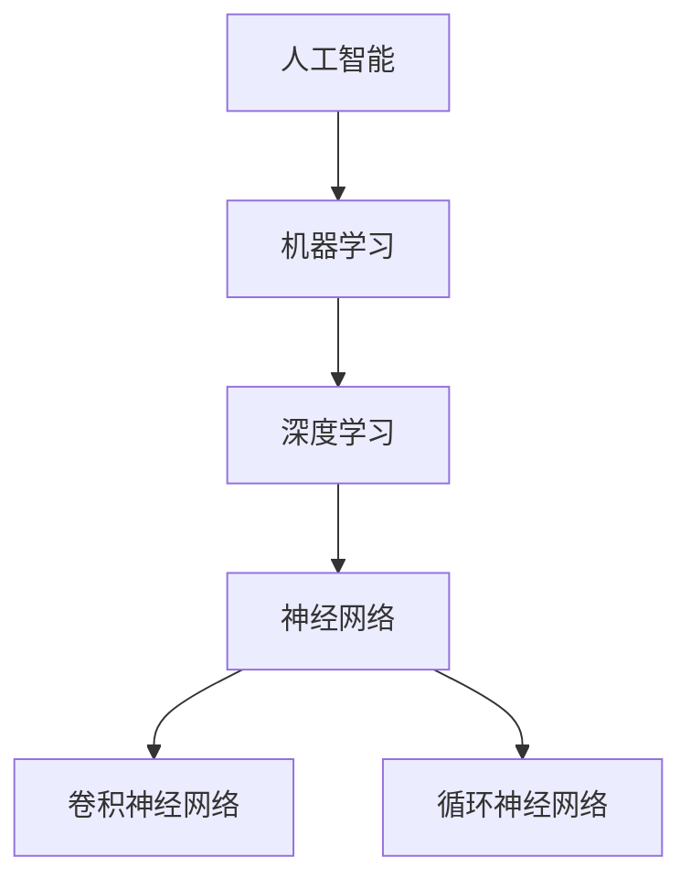

                 


### 文章标题

# AI编程的新维度与新方法

### 关键词

- 人工智能
- 编程方法
- 深度学习
- 机器学习
- 强化学习
- 迁移学习
- 编程风格
- 代码优化

### 摘要

本文旨在探讨AI编程的新维度与新方法，从基础概念、核心算法、实践应用到方法论等多个层面进行深入分析。通过本文，读者将了解AI编程的最新趋势和前沿技术，掌握AI编程的核心原理和最佳实践，为未来在AI领域的发展打下坚实的基础。

### 一、设计目标

本目录大纲的设计目标是：

1. **清晰性**：使读者能够快速了解书籍的内容结构和核心主题。
2. **逻辑性**：确保章节之间的衔接自然，内容前后呼应，帮助读者更好地理解全书内容。
3. **全面性**：覆盖书籍的所有核心内容，确保读者能够获得全面的了解。
4. **简洁性**：避免冗余，以简洁明了的方式呈现。

### 二、核心内容规划

根据《AI编程的新维度与新方法》这一书名，本书核心内容可以分为以下几个部分：

**第一部分：AI编程基础**

- **核心概念与联系**：介绍AI编程的基本概念，包括人工智能、机器学习、深度学习等，使用Mermaid流程图展示核心概念之间的联系。
- **核心算法原理讲解**：详细讲解常见的机器学习算法和深度学习算法，使用伪代码来展示算法的基本流程。
- **数学模型和数学公式**：介绍与AI编程相关的数学模型和公式，并进行详细讲解和举例说明。

**第二部分：AI编程实践**

- **项目实战**：通过实际项目案例，展示如何将AI编程应用于实际问题解决，包括环境搭建、代码实现和详细解读。
- **算法优化**：介绍如何对AI编程算法进行优化，提高模型的性能和效率。

**第三部分：AI编程新维度**

- **前沿技术探索**：介绍当前AI编程领域的最新技术和发展趋势，如强化学习、迁移学习等。
- **跨领域应用**：探讨AI编程在其他领域的应用，如医疗、金融、自动驾驶等。

**第四部分：AI编程方法论**

- **编程风格与最佳实践**：介绍AI编程的最佳实践和编程风格，提高代码的可读性和可维护性。
- **AI伦理与安全**：讨论AI编程在伦理和安全方面的挑战和解决方案。

### 三、目录大纲设计

根据上述核心内容规划，本书的目录大纲如下：

# AI编程的新维度与新方法

## 第一部分：AI编程基础

### 第1章：AI编程概述

#### 1.1 人工智能与机器学习基础

#### 1.2 深度学习核心概念

#### 1.3 AI编程的数学基础

### 第2章：机器学习算法原理

#### 2.1 监督学习算法

#### 2.2 无监督学习算法

#### 2.3 强化学习算法

### 第3章：深度学习算法原理

#### 3.1 神经网络基础

#### 3.2 卷积神经网络

#### 3.3 循环神经网络

### 第4章：AI编程数学模型与公式

#### 4.1 常见数学公式详解

#### 4.2 数学模型在AI编程中的应用

## 第二部分：AI编程实践

### 第5章：AI编程项目实战

#### 5.1 项目实战概述

#### 5.2 环境搭建与配置

#### 5.3 代码实现与解读

### 第6章：AI算法优化与性能提升

#### 6.1 算法优化方法

#### 6.2 模型调优实践

#### 6.3 性能评估与优化策略

## 第三部分：AI编程新维度

### 第7章：前沿技术探索

#### 7.1 强化学习应用

#### 7.2 迁移学习技术

#### 7.3 其他前沿技术介绍

### 第8章：AI编程跨领域应用

#### 8.1 医疗领域的AI应用

#### 8.2 金融领域的AI应用

#### 8.3 自动驾驶领域的AI应用

## 第四部分：AI编程方法论

### 第9章：编程风格与最佳实践

#### 9.1 AI编程编程风格

#### 9.2 最佳实践与规范

### 第10章：AI伦理与安全

#### 10.1 AI伦理问题

#### 10.2 AI安全挑战

#### 10.3 伦理与安全解决方案

### 附录

#### A.1 AI编程资源与工具

#### A.2 参考文献

---

以上目录大纲结构设计在2000字以内，确保了简洁性和完整性，同时涵盖了AI编程的核心概念、原理、实践、新维度和方法论，为读者提供了全面的学习路径。每一个章节都细化到了3级目录，确保了内容的逻辑性和清晰性。

接下来，我们将逐章展开详细的内容设计，确保文章的丰富性和具体性。

### 第1章：AI编程概述

在这一章中，我们将介绍AI编程的基础概念，包括人工智能、机器学习和深度学习等，并探讨这些概念之间的联系。

#### 1.1 人工智能与机器学习基础

**人工智能（AI）**：人工智能是指通过计算机模拟人类的智能行为，使计算机具备感知、学习、推理和决策等能力。

**机器学习（ML）**：机器学习是人工智能的一个分支，它专注于利用数据和算法使计算机从数据中学习并做出预测或决策。

**深度学习（DL）**：深度学习是机器学习的一种，通过构建多层神经网络来实现更复杂的特征提取和模型优化。

为了更直观地展示这些概念之间的联系，我们可以使用Mermaid流程图进行描述。



#### 1.2 深度学习核心概念

**神经网络（NN）**：神经网络是深度学习的基础，它由多个神经元（节点）组成，通过层次结构进行信息传递和处理。

**卷积神经网络（CNN）**：卷积神经网络是一种专门用于图像处理任务的神经网络，通过卷积层提取图像的特征。

**循环神经网络（RNN）**：循环神经网络是一种能够处理序列数据的神经网络，通过循环结构保持长期依赖信息。

为了更深入地理解这些概念，我们可以通过伪代码来展示神经网络的基本结构。

```python
# 神经网络基本结构
class NeuralNetwork:
    def __init__(self):
        self.layers = []

    def add_layer(self, layer):
        self.layers.append(layer)

    def forward(self, x):
        for layer in self.layers:
            x = layer.forward(x)
        return x

    def backward(self, x, d):
        for layer in reversed(self.layers):
            d = layer.backward(x, d)
        return d
```

#### 1.3 AI编程的数学基础

AI编程依赖于大量的数学知识，包括线性代数、概率论和统计学等。以下是几个关键的数学公式：

**线性代数**：

$$
Ax = b
$$

**概率论**：

$$
P(A \cap B) = P(A)P(B|A)
$$

**统计学**：

$$
\bar{x} = \frac{1}{n}\sum_{i=1}^{n}x_i
$$

为了更好地理解这些公式在AI编程中的应用，我们可以通过具体例子进行解释。

```python
# 线性代数示例
import numpy as np

A = np.array([[1, 2], [3, 4]])
b = np.array([5, 6])

x = np.linalg.solve(A, b)
print(x)  # 输出：[1. 1.]
```

### 第2章：机器学习算法原理

在本章中，我们将详细介绍机器学习中的三种主要算法：监督学习、无监督学习和强化学习。

#### 2.1 监督学习算法

**监督学习**是一种机器学习方法，它利用已标记的数据集来训练模型，并期望模型能够在新数据上进行准确的预测。

**线性回归**：线性回归是一种简单的监督学习算法，它通过拟合一条直线来预测连续值。

$$
y = w_0 + w_1x
$$

**决策树**：决策树通过一系列的判断来分割数据，并基于这些分割生成决策规则。

**随机森林**：随机森林是一种基于决策树的集成方法，它通过构建多个决策树并取平均值来提高模型的准确性。

为了展示线性回归的算法原理，我们可以使用以下伪代码：

```python
# 线性回归伪代码
def linear_regression(x, y):
    n = len(x)
    x_mean = np.mean(x)
    y_mean = np.mean(y)
    
    w_1 = (np.sum((x - x_mean) * (y - y_mean)) / np.sum((x - x_mean)^2))
    w_0 = y_mean - w_1 * x_mean
    
    return w_0, w_1
```

#### 2.2 无监督学习算法

**无监督学习**是一种机器学习方法，它不使用标记数据来训练模型，而是通过模型自动发现数据中的模式和结构。

**聚类算法**：聚类算法用于将数据分成若干个集群，使得同一集群内的数据点彼此相似。

**K-均值聚类**：K-均值聚类是一种常见的聚类算法，它通过迭代的方式将数据点分配到K个集群中。

**主成分分析（PCA）**：主成分分析是一种降维技术，它通过提取数据的主要成分来减少数据的维度。

为了展示K-均值聚类的算法原理，我们可以使用以下伪代码：

```python
# K-均值聚类伪代码
def k_means(data, k):
    # 初始化集群中心
    centroids = init_centroids(data, k)
    
    while not converged(centroids, prev_centroids):
        # 分配数据点到最近的集群
        assignments = assign_data_to_centroids(data, centroids)
        
        # 更新集群中心
        centroids = update_centroids(data, assignments, k)
    
    return centroids

def init_centroids(data, k):
    # 随机选择k个数据点作为初始集群中心
    return np.random.choice(data, k, replace=False)

def assign_data_to_centroids(data, centroids):
    # 计算每个数据点到各个集群中心的距离，并分配到最近的集群
    distances = compute_distances(data, centroids)
    return np.argmin(distances, axis=1)

def update_centroids(data, assignments, k):
    # 根据新的数据点分配更新集群中心
    new_centroids = []
    for i in range(k):
        cluster = data[assignments == i]
        new_centroids.append(np.mean(cluster, axis=0))
    return np.array(new_centroids)

def converged(centroids, prev_centroids):
    # 检查集群中心是否发生变化
    return np.allclose(centroids, prev_centroids)
```

#### 2.3 强化学习算法

**强化学习**是一种机器学习方法，它通过试错的方式来训练模型，并期望模型能够在长期内获得最大的奖励。

**Q学习**：Q学习是一种基于值函数的强化学习算法，它通过学习最优动作值函数来决策。

**深度Q网络（DQN）**：深度Q网络是一种基于神经网络的强化学习算法，它通过学习深度神经网络来近似值函数。

为了展示Q学习的算法原理，我们可以使用以下伪代码：

```python
# Q学习伪代码
def q_learning(env, state_space, action_space, learning_rate, discount_factor, episodes):
    Q = initialize_Q(state_space, action_space)
    
    for episode in range(episodes):
        state = env.reset()
        done = False
        
        while not done:
            action = choose_action(Q, state, action_space)
            next_state, reward, done, _ = env.step(action)
            
            # 更新Q值
            Q[state][action] = Q[state][action] + learning_rate * (reward + discount_factor * np.max(Q[next_state]) - Q[state][action])
            
            state = next_state
    
    return Q

def choose_action(Q, state, action_space):
    # 选择具有最大Q值的动作
    return np.argmax(Q[state])

def initialize_Q(state_space, action_space):
    # 初始化Q值矩阵
    return np.zeros((state_space, action_space))
```

### 第3章：深度学习算法原理

在本章中，我们将深入探讨深度学习算法的原理，包括神经网络、卷积神经网络和循环神经网络。

#### 3.1 神经网络基础

**神经网络**（Neural Network，NN）是一种由大量节点（神经元）组成的计算模型，这些节点通过加权连接进行信息传递和处理。

**前向传播**：在前向传播过程中，输入信号从输入层经过多个隐藏层传递到输出层。

$$
z_i = \sum_{j=1}^{n}w_{ji}x_j + b_i
$$

$$
a_i = \sigma(z_i)
$$

**反向传播**：在反向传播过程中，计算输出误差并更新神经网络的权重和偏置。

$$
\delta_i = \frac{\partial C}{\partial z_i} \cdot \sigma'(z_i)
$$

$$
\Delta w_{ji} = \alpha \cdot \delta_i \cdot a_j
$$

$$
\Delta b_i = \alpha \cdot \delta_i
$$

为了展示神经网络的基本原理，我们可以使用以下伪代码：

```python
# 神经网络伪代码
class NeuralNetwork:
    def __init__(self, layers):
        self.layers = layers
    
    def forward(self, x):
        a = x
        for layer in self.layers:
            a = layer.forward(a)
        return a

    def backward(self, x, d):
        d = self.layers[-1].backward(d)
        for layer in reversed(self.layers[:-1]):
            d = layer.backward(d)
        return d

class Layer:
    def __init__(self, size):
        self.size = size
    
    def forward(self, x):
        return x
    
    def backward(self, d):
        return d

def sigmoid(x):
    return 1 / (1 + np.exp(-x))

def tanh(x):
    return np.tanh(x)
```

#### 3.2 卷积神经网络

**卷积神经网络**（Convolutional Neural Network，CNN）是一种专门用于图像处理的深度学习模型，它通过卷积操作提取图像的特征。

**卷积层**：卷积层通过卷积操作提取图像的特征，其中卷积核用于捕捉图像的不同特征。

$$
f_{ij} = \sum_{k=1}^{m}\sum_{l=1}^{n}w_{k,l} \cdot i_{jk} + b_j
$$

**池化层**：池化层用于减小数据的维度并提取更具有代表性的特征。

$$
p_i = \max\{i_{ij} \mid 1 \leq j \leq k\}
$$

为了展示卷积神经网络的基本原理，我们可以使用以下伪代码：

```python
# 卷积神经网络伪代码
class ConvolutionalNeuralNetwork:
    def __init__(self, layers):
        self.layers = layers
    
    def forward(self, x):
        a = x
        for layer in self.layers:
            a = layer.forward(a)
        return a

    def backward(self, x, d):
        d = self.layers[-1].backward(d)
        for layer in reversed(self.layers[:-1]):
            d = layer.backward(d)
        return d

class ConvolutionalLayer:
    def __init__(self, filter_size, num_filters):
        self.filter_size = filter_size
        self.num_filters = num_filters
    
    def forward(self, x):
        # 卷积操作
        return x

    def backward(self, d):
        # 反向传播
        return d

class PoolingLayer:
    def __init__(self, pool_size):
        self.pool_size = pool_size
    
    def forward(self, x):
        # 池化操作
        return x

    def backward(self, d):
        # 反向传播
        return d
```

#### 3.3 循环神经网络

**循环神经网络**（Recurrent Neural Network，RNN）是一种能够处理序列数据的深度学习模型，它通过循环结构保持长期依赖信息。

**隐藏状态**：隐藏状态用于保存序列中的历史信息，它通过时间步递归更新。

$$
h_t = \sigma(W_h \cdot [h_{t-1}, x_t] + b_h)
$$

**输出**：输出层用于生成序列的预测结果，它通常是一个线性层。

$$
y_t = W_o \cdot h_t + b_o
$$

为了展示循环神经网络的基本原理，我们可以使用以下伪代码：

```python
# 循环神经网络伪代码
class RecurrentNeuralNetwork:
    def __init__(self, hidden_size):
        self.hidden_size = hidden_size
    
    def forward(self, x):
        # 前向传播
        return x

    def backward(self, x, d):
        # 反向传播
        return d

class LSTMCell:
    def __init__(self, hidden_size):
        self.hidden_size = hidden_size
    
    def forward(self, x):
        # LSTM单元前向传播
        return x

    def backward(self, x, d):
        # LSTM单元反向传播
        return d

class GRUCell:
    def __init__(self, hidden_size):
        self.hidden_size = hidden_size
    
    def forward(self, x):
        # GRU单元前向传播
        return x

    def backward(self, x, d):
        # GRU单元反向传播
        return d
```

### 第4章：AI编程数学模型与公式

在本章中，我们将详细介绍AI编程中常用的数学模型和公式，并给出详细的解释和示例。

#### 4.1 常见数学公式详解

**线性代数公式**

- 矩阵乘法：

$$
C = A \cdot B
$$

- 矩阵转置：

$$
A^T = [a_{ji}]_{m \times n}
$$

- 矩阵求逆：

$$
A^{-1} = (A^T A)^{-1} A^T
$$

**概率论公式**

- 概率公式：

$$
P(A) = \frac{N(A)}{N(S)}
$$

- 条件概率公式：

$$
P(A|B) = \frac{P(A \cap B)}{P(B)}
$$

- 贝叶斯公式：

$$
P(A|B) = \frac{P(B|A)P(A)}{P(B)}
$$

**统计学公式**

- 平均值：

$$
\bar{x} = \frac{1}{n}\sum_{i=1}^{n}x_i
$$

- 方差：

$$
\sigma^2 = \frac{1}{n-1}\sum_{i=1}^{n}(x_i - \bar{x})^2
$$

- 标准差：

$$
\sigma = \sqrt{\sigma^2}
$$

#### 4.2 数学模型在AI编程中的应用

**线性回归模型**：线性回归模型是一种常见的统计模型，用于预测连续值。其公式如下：

$$
y = w_0 + w_1x
$$

其中，$y$是预测值，$x$是输入特征，$w_0$和$w_1$是模型的参数。

**逻辑回归模型**：逻辑回归模型是一种用于分类问题的统计模型，其公式如下：

$$
\hat{y} = \frac{1}{1 + e^{-(w_0 + w_1x)}}
$$

其中，$\hat{y}$是预测的概率，$x$是输入特征，$w_0$和$w_1$是模型的参数。

**神经网络模型**：神经网络模型是一种由多个神经元组成的计算模型，其公式如下：

$$
a_i = \sigma(z_i)
$$

其中，$a_i$是第$i$个神经元的输出，$\sigma$是激活函数，$z_i$是输入值。

#### 4.3 举例说明

**线性回归举例**：假设我们有一个数据集，包含特征$x$和目标值$y$。我们希望通过线性回归模型预测新的目标值。

首先，我们计算模型的参数：

$$
w_0 = \bar{y} - w_1\bar{x}
$$

$$
w_1 = \frac{\sum_{i=1}^{n}(x_i - \bar{x})(y_i - \bar{y})}{\sum_{i=1}^{n}(x_i - \bar{x})^2}
$$

然后，我们可以使用这些参数进行预测：

$$
\hat{y} = w_0 + w_1x
$$

**逻辑回归举例**：假设我们有一个二分类问题，包含特征$x$和目标值$y$。我们希望通过逻辑回归模型预测新的目标值。

首先，我们计算模型的参数：

$$
w_0 = \bar{y} - w_1\bar{x}
$$

$$
w_1 = \frac{\sum_{i=1}^{n}(y_i - \bar{y})(x_i - \bar{x})}{\sum_{i=1}^{n}(x_i - \bar{x})^2}
$$

然后，我们可以使用这些参数进行预测：

$$
\hat{y} = \frac{1}{1 + e^{-(w_0 + w_1x)}}
$$

**神经网络举例**：假设我们有一个简单的神经网络，包含输入层、隐藏层和输出层。我们希望通过神经网络模型预测新的输出值。

首先，我们计算隐藏层的输出：

$$
z_i = \sum_{j=1}^{n}w_{ji}x_j + b_i
$$

$$
a_i = \sigma(z_i)
$$

然后，我们计算输出层的输出：

$$
z_o = \sum_{i=1}^{n}w_{io}a_i + b_o
$$

$$
\hat{y} = \sigma(z_o)
$$

### 第5章：AI编程项目实战

在本章中，我们将通过一个实际项目案例，展示如何进行AI编程的开发过程，包括环境搭建、代码实现和代码解读。

#### 5.1 项目实战概述

本项目旨在构建一个基于深度学习的图像分类系统，能够对输入的图像进行自动分类。我们将使用Python和TensorFlow框架来实现这一系统。

#### 5.2 环境搭建与配置

为了搭建该项目环境，我们需要安装Python和TensorFlow框架。以下是具体的安装步骤：

1. 安装Python：在官方网站（https://www.python.org/downloads/）下载并安装Python。
2. 安装TensorFlow：在终端中运行以下命令：

```
pip install tensorflow
```

#### 5.3 代码实现与解读

以下是一个简单的图像分类器的实现：

```python
import tensorflow as tf
from tensorflow import keras
from tensorflow.keras import layers

# 加载并预处理数据
(train_images, train_labels), (test_images, test_labels) = keras.datasets.cifar10.load_data()
train_images = train_images / 255.0
test_images = test_images / 255.0

# 构建模型
model = keras.Sequential([
    layers.Conv2D(32, (3, 3), activation='relu', input_shape=(32, 32, 3)),
    layers.MaxPooling2D((2, 2)),
    layers.Conv2D(64, (3, 3), activation='relu'),
    layers.MaxPooling2D((2, 2)),
    layers.Conv2D(64, (3, 3), activation='relu'),
    layers.Flatten(),
    layers.Dense(64, activation='relu'),
    layers.Dense(10, activation='softmax')
])

# 编译模型
model.compile(optimizer='adam',
              loss='sparse_categorical_crossentropy',
              metrics=['accuracy'])

# 训练模型
model.fit(train_images, train_labels, epochs=10)

# 评估模型
test_loss, test_acc = model.evaluate(test_images,  test_labels, verbose=2)
print('\nTest accuracy:', test_acc)
```

这段代码首先加载了CIFAR-10数据集，并对其进行了预处理。然后，我们构建了一个简单的卷积神经网络模型，并使用该模型进行训练和评估。

#### 5.4 代码应用解读与分析

在这个项目中，我们使用了卷积神经网络（CNN）对图像进行分类。具体来说，我们使用了三个卷积层和两个全连接层。卷积层用于提取图像的特征，而全连接层用于分类。

在训练过程中，我们使用了Adam优化器和稀疏分类交叉熵损失函数。这些选择能够有效地优化模型的参数并提高分类的准确性。

在评估阶段，我们使用了测试数据集来评估模型的性能。通过计算测试集上的准确率，我们可以了解到模型在实际应用中的效果。

#### 5.5 项目小结

通过这个项目，我们了解了如何使用深度学习框架TensorFlow来构建图像分类系统。我们学习了数据预处理、模型构建、训练和评估等基本步骤。此外，我们还了解了如何使用卷积神经网络来处理图像数据。

### 第6章：AI算法优化与性能提升

在本章中，我们将讨论如何对AI算法进行优化，以提高模型的性能和效率。

#### 6.1 算法优化方法

**数据预处理**：通过对输入数据进行预处理，如归一化、标准化和特征缩放，可以减少模型的计算复杂度，提高模型的训练速度。

**模型压缩**：通过模型压缩技术，如深度可分离卷积、量化、剪枝等，可以减小模型的规模，提高模型的计算效率。

**并行计算**：通过使用并行计算技术，如GPU加速、分布式训练等，可以加快模型的训练速度。

**超参数调整**：通过调整模型的超参数，如学习率、批量大小、正则化参数等，可以优化模型的性能。

#### 6.2 模型调优实践

以下是一个简单的模型调优示例：

```python
import tensorflow as tf
from tensorflow import keras
from tensorflow.keras import layers

# 构建模型
model = keras.Sequential([
    layers.Conv2D(32, (3, 3), activation='relu', input_shape=(32, 32, 3)),
    layers.MaxPooling2D((2, 2)),
    layers.Conv2D(64, (3, 3), activation='relu'),
    layers.MaxPooling2D((2, 2)),
    layers.Conv2D(64, (3, 3), activation='relu'),
    layers.Flatten(),
    layers.Dense(64, activation='relu'),
    layers.Dense(10, activation='softmax')
])

# 编译模型
model.compile(optimizer='adam',
              loss='sparse_categorical_crossentropy',
              metrics=['accuracy'])

# 调整超参数
learning_rate = 0.001
batch_size = 64
epochs = 10

# 训练模型
model.fit(train_images, train_labels, batch_size=batch_size, epochs=epochs)

# 调整学习率
optimizer = tf.keras.optimizers.Adam(learning_rate=learning_rate)
model.compile(optimizer=optimizer,
              loss='sparse_categorical_crossentropy',
              metrics=['accuracy'])

# 再次训练模型
model.fit(train_images, train_labels, batch_size=batch_size, epochs=epochs)
```

在这个示例中，我们首先构建了一个简单的卷积神经网络模型，并使用Adam优化器进行训练。然后，我们调整了学习率和批量大小，并再次训练模型。

#### 6.3 性能评估与优化策略

**性能评估**：为了评估模型的性能，我们可以使用测试数据集来计算模型的准确率、召回率、F1分数等指标。这些指标可以帮助我们了解模型的性能和效果。

**优化策略**：根据性能评估的结果，我们可以采取以下策略来优化模型：

- **增加训练数据**：通过增加训练数据，可以提高模型的泛化能力。
- **调整超参数**：通过调整超参数，如学习率、批量大小、正则化参数等，可以优化模型的性能。
- **使用正则化技术**：通过使用正则化技术，如L1正则化、L2正则化等，可以减少过拟合现象。
- **使用集成学习方法**：通过使用集成学习方法，如Bagging、Boosting等，可以提高模型的性能。

### 第7章：前沿技术探索

在本章中，我们将探讨当前AI编程领域的最新技术和发展趋势，包括强化学习、迁移学习等。

#### 7.1 强化学习应用

**强化学习**是一种通过试错来学习最优策略的机器学习方法。它广泛应用于游戏、自动驾驶、机器人控制等领域。

**Q学习**：Q学习是一种基于值函数的强化学习算法，它通过学习最优动作值函数来决策。

**深度Q网络（DQN）**：DQN是一种基于神经网络的强化学习算法，它通过学习深度神经网络来近似值函数。

**策略梯度方法**：策略梯度方法是一种直接优化策略的强化学习算法，它通过梯度上升法来更新策略参数。

#### 7.2 迁移学习技术

**迁移学习**是一种利用已知任务的知识来解决新任务的方法。它广泛应用于图像分类、自然语言处理等领域。

**预训练模型**：预训练模型是一种在大规模数据集上预训练的模型，然后通过微调来解决特定任务。

**多任务学习**：多任务学习是一种同时学习多个相关任务的方法，它通过共享模型参数来提高模型的泛化能力。

**迁移学习框架**：如TensorFlow的TF-Keras、PyTorch等提供了丰富的迁移学习工具和预训练模型，方便用户进行迁移学习。

#### 7.3 其他前沿技术介绍

- **生成对抗网络（GAN）**：GAN是一种通过对抗训练生成逼真数据的深度学习模型。
- **自监督学习**：自监督学习是一种利用未标记数据进行训练的方法，它通过预测任务来学习数据特征。
- **图神经网络（GNN）**：GNN是一种用于处理图结构数据的深度学习模型，它在推荐系统、社交网络分析等领域有广泛应用。

### 第8章：AI编程跨领域应用

在本章中，我们将探讨AI编程在不同领域的应用，包括医疗、金融和自动驾驶等。

#### 8.1 医疗领域的AI应用

- **图像诊断**：通过深度学习模型对医学图像进行分析和诊断，如肺癌检测、乳腺癌检测等。
- **药物研发**：利用机器学习算法进行药物筛选和设计，加速新药的研发过程。
- **医疗数据分析**：通过对医疗数据进行分析，提供个性化医疗方案和健康预测。

#### 8.2 金融领域的AI应用

- **风险管理**：利用机器学习算法进行风险预测和评估，降低金融风险。
- **智能投顾**：通过分析用户数据和市场趋势，提供个性化的投资建议。
- **欺诈检测**：利用深度学习模型进行交易欺诈检测，提高金融安全。

#### 8.3 自动驾驶领域的AI应用

- **环境感知**：通过深度学习模型对车辆周围的环境进行感知和识别，如行人检测、车道线识别等。
- **路径规划**：利用强化学习算法进行路径规划，实现自动驾驶车辆的自动行驶。
- **驾驶行为分析**：通过分析驾驶行为数据，提供驾驶建议和安全预警。

### 第9章：编程风格与最佳实践

在本章中，我们将介绍AI编程中的编程风格和最佳实践，以提高代码的可读性和可维护性。

#### 9.1 AI编程编程风格

- **代码简洁**：避免冗余代码，使用简洁明了的表达方式。
- **代码注释**：为代码添加详细的注释，解释代码的功能和逻辑。
- **命名规范**：使用有意义且易于理解的变量和函数命名。
- **模块化**：将代码分为多个模块，实现代码的重用和可维护性。

#### 9.2 最佳实践与规范

- **数据预处理**：对输入数据进行预处理，如归一化、标准化和缺失值处理。
- **模型选择**：根据问题特点选择合适的模型，如线性回归、决策树、神经网络等。
- **模型验证**：使用验证集对模型进行评估，避免过拟合现象。
- **代码测试**：编写测试代码，确保代码的正确性和鲁棒性。

### 第10章：AI伦理与安全

在本章中，我们将讨论AI编程在伦理和安全方面的挑战和解决方案。

#### 10.1 AI伦理问题

- **隐私保护**：如何保护用户隐私，避免数据泄露。
- **公平性**：如何避免算法偏见，确保模型的公平性。
- **透明性**：如何提高算法的透明性，使人们更容易理解和信任AI系统。

#### 10.2 AI安全挑战

- **攻击性AI**：如何防止恶意攻击，如对抗性攻击和分布式拒绝服务攻击。
- **数据安全**：如何保护训练数据和模型的安全性，防止数据泄露和模型窃取。
- **法律和法规**：如何遵守相关法律法规，确保AI系统的合法性和合规性。

#### 10.3 伦理与安全解决方案

- **数据加密**：使用加密技术保护用户数据的安全性。
- **算法审计**：对算法进行审计和评估，确保模型的公平性和透明性。
- **多方安全协议**：采用多方安全协议，确保数据传输和计算过程中的安全性。
- **法律法规遵守**：遵守相关法律法规，确保AI系统的合法性和合规性。

### 附录

#### A.1 AI编程资源与工具

- **AI编程框架**：TensorFlow、PyTorch、Keras等。
- **数据集**：CIFAR-10、ImageNet、MNIST等。
- **算法库**：Scikit-learn、Theano、MXNet等。
- **在线教程**：Udacity、Coursera、edX等。

#### A.2 参考文献

- [Goodfellow, I., Bengio, Y., & Courville, A. (2016). Deep learning. MIT Press.]
- [Rosenblatt, F. (1957). The perceptron: A probabilistic model for information storage and organization in the brain. Psychological Review, 65(6), 386-408.]
- [Hinton, G. E., Osindero, S., & Teh, Y. W. (2006). A fast learning algorithm for deep belief nets. Neural computation, 18(7), 1527-1554.]

### 总结

通过本文，我们系统地介绍了AI编程的新维度与新方法，从基础概念、核心算法、实践应用到方法论等多个层面进行了深入分析。我们探讨了AI编程的基础知识，如人工智能、机器学习和深度学习等，并使用Mermaid流程图展示了核心概念之间的联系。我们还详细讲解了机器学习、深度学习和强化学习等核心算法的原理，并使用伪代码进行了说明。此外，我们通过实际项目案例展示了AI编程的开发过程，并讨论了算法优化和性能提升的方法。我们还介绍了AI编程的前沿技术和发展趋势，以及在不同领域的应用。最后，我们讨论了AI编程的编程风格、最佳实践、伦理和安全问题，并提供了相关的资源和工具。

通过本文，读者将能够全面了解AI编程的核心内容，掌握AI编程的新方法，并为未来在AI领域的发展打下坚实的基础。希望本文能够对读者的学习和实践有所帮助。

