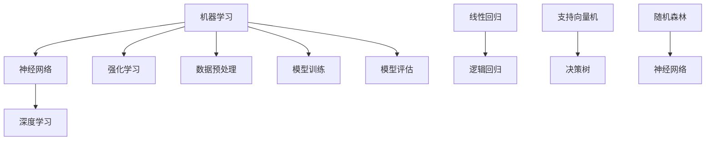
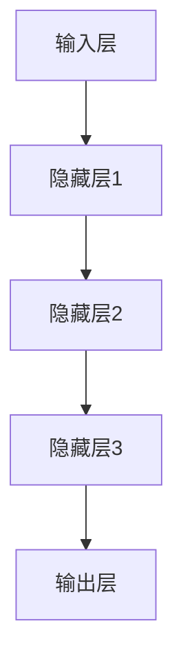

                 

### 文章标题

# AI编程的新维度与新范式

> 关键词：人工智能，编程，新维度，新范式，深度学习，强化学习

> 摘要：本文旨在探讨人工智能（AI）编程领域的新维度与新范式。通过对AI编程的基础理论、新维度AI编程技术、新范式AI编程实践以及AI编程的未来展望的深入分析，本文旨在为读者提供一个全面而系统的AI编程知识框架，帮助理解AI编程的复杂性及其发展趋势。

----------------------------------------------------------------

### 引言

在当今这个数字化和智能化的时代，人工智能（AI）已经成为科技领域的前沿和热点。AI技术的快速发展和广泛应用，使得AI编程成为计算机科学和工程中的重要分支。然而，随着AI技术的不断演进，传统的编程范式和方法逐渐显得力不从心。这促使我们探索AI编程的新维度与新范式，以便更好地应对日益复杂的AI应用场景。

本文将分为以下几个部分：

1. **AI编程的基础理论**：介绍AI编程的核心概念、基本原理以及常见的数学模型。
2. **新维度AI编程技术**：深入探讨深度学习和强化学习等前沿技术。
3. **新范式AI编程实践**：结合实际案例，展示如何使用新维度AI编程技术解决实际问题。
4. **AI编程的未来展望**：探讨AI编程的未来发展趋势以及如何应对这些趋势。

通过上述内容的分析，本文旨在为读者提供一个全面而系统的AI编程知识框架，帮助理解AI编程的复杂性及其发展趋势。

### AI编程的基础理论

要深入理解AI编程，我们首先需要了解AI编程的基础理论。这一部分将介绍AI编程的核心概念、基本原理以及常见的数学模型。

#### 核心概念

AI编程，即人工智能编程，是指使用编程语言和工具来创建、训练和部署人工智能系统的过程。AI编程的核心概念包括：

1. **机器学习**：机器学习是AI的核心技术之一，它使得计算机系统能够从数据中自动学习和改进。机器学习可以分为监督学习、无监督学习和强化学习等不同类型。
   
2. **神经网络**：神经网络是模仿生物大脑结构和功能的一种计算模型，是机器学习的基础。它由大量相互连接的节点（或称为神经元）组成，通过这些节点之间的交互来实现数据处理和决策。

3. **深度学习**：深度学习是神经网络的一种形式，通过堆叠多个神经网络层来处理复杂的数据。深度学习在图像识别、语音识别和自然语言处理等领域取得了显著的成果。

4. **强化学习**：强化学习是一种通过试错和反馈来学习的机器学习方法。它通过最大化奖励来训练模型，使其在特定环境中能够做出最优决策。

#### 基本原理

AI编程的基本原理包括数据预处理、模型训练和模型评估等。

1. **数据预处理**：数据预处理是AI编程的重要步骤，它包括数据清洗、数据转换和数据归一化等。预处理的好坏直接影响模型的性能。

2. **模型训练**：模型训练是AI编程的核心步骤，它通过调整模型参数来使模型在给定数据集上达到最优性能。常用的训练方法包括梯度下降、随机梯度下降和Adam优化器等。

3. **模型评估**：模型评估是评估模型性能的重要步骤，它通过在测试集上计算模型的预测准确率、召回率、F1分数等指标来评估模型的性能。

#### 常见数学模型

AI编程中常用的数学模型包括线性回归、逻辑回归、支持向量机、决策树、随机森林和神经网络等。

1. **线性回归**：线性回归是一种简单的机器学习模型，用于预测连续值。它的核心原理是通过找到最佳拟合直线来最小化预测值与实际值之间的误差。

2. **逻辑回归**：逻辑回归是一种用于分类问题的线性模型，它通过将线性回归的输出映射到概率空间，从而实现分类。

3. **支持向量机**：支持向量机是一种强大的分类模型，它通过寻找最佳超平面来将不同类别的数据点分隔开。

4. **决策树**：决策树是一种树形结构模型，它通过一系列的判断来对数据进行分类或回归。

5. **随机森林**：随机森林是一种集成学习模型，它通过组合多个决策树来提高模型的泛化能力。

6. **神经网络**：神经网络是一种复杂的非线性模型，它通过多层神经元之间的相互连接来实现数据的非线性变换。

#### 核心概念之间的关系架构

为了更好地理解AI编程的核心概念，我们可以使用Mermaid流程图来展示它们之间的关系：



通过上述流程图，我们可以看到机器学习、神经网络、深度学习和强化学习等核心概念之间的关系，以及它们在数据预处理、模型训练和模型评估中的应用。

#### 总结

AI编程的基础理论是理解和实践AI编程的关键。通过掌握核心概念、基本原理和常见数学模型，我们可以更好地应对AI编程的挑战，为AI技术的发展和应用奠定坚实的基础。

----------------------------------------------------------------

### 新维度AI编程技术

在AI编程的基础理论之上，我们进入了新维度AI编程技术的研究。这些技术包括深度学习和强化学习，它们分别代表了AI编程的两大前沿方向。下面我们将分别对这两种技术进行深入探讨。

#### 深度学习编程

深度学习（Deep Learning）是人工智能领域的一个重要分支，它通过构建多层神经网络来模拟人类大脑的处理能力。深度学习的核心思想是分层特征学习，即从原始数据中自动提取和组合特征，并通过多层神经网络进行决策。

##### 深度学习的原理与架构

深度学习的原理基于神经网络的层次结构。每个神经元都接受来自前一层的输入，并通过激活函数产生输出。这些输出再传递到下一层，以此类推，直到最后一层输出层产生最终决策。

深度学习的架构通常包括以下几个层次：

1. **输入层**：接收外部输入，如图像、文本或音频。
2. **隐藏层**：对输入数据进行特征提取和变换，每一层都可以提取更高层次的抽象特征。
3. **输出层**：根据隐藏层提取的特征进行分类、回归或其他任务。

深度学习的架构示例如下：



##### 常见的深度学习算法

深度学习算法种类繁多，其中一些最常用的算法包括：

1. **卷积神经网络（CNN）**：CNN主要用于图像识别和处理。它的核心组件是卷积层，通过卷积操作提取图像特征。

2. **循环神经网络（RNN）**：RNN用于处理序列数据，如时间序列、文本等。RNN通过记忆过去的信息来处理序列数据。

3. **长短期记忆网络（LSTM）**：LSTM是RNN的一种改进，能够更好地处理长序列数据。

4. **生成对抗网络（GAN）**：GAN是一种无监督学习算法，用于生成数据。它由生成器和判别器两个神经网络组成，通过对抗训练来生成逼真的数据。

##### 深度学习在AI编程中的应用

深度学习在AI编程中有着广泛的应用，包括但不限于：

1. **图像识别**：通过卷积神经网络，深度学习可以实现对图像内容的自动识别和分类。

2. **自然语言处理（NLP）**：深度学习在文本分类、情感分析、机器翻译等NLP任务中发挥着重要作用。

3. **语音识别**：深度学习通过神经网络模型对语音信号进行特征提取和识别，实现了高精度的语音识别。

#### 强化学习编程

强化学习（Reinforcement Learning）是一种通过试错和反馈进行学习的方法。与监督学习和无监督学习不同，强化学习通过与环境交互来学习最优策略。

##### 强化学习的基本概念

强化学习的基本概念包括：

1. **状态**：系统当前所处的情境或位置。
2. **动作**：系统能够采取的行动。
3. **奖励**：系统采取某个动作后获得的即时奖励或惩罚。
4. **策略**：系统根据当前状态选择动作的规则。

强化学习的核心目标是找到一种策略，使得系统在长期内获得最大的总奖励。

##### 常见的强化学习算法

常见的强化学习算法包括：

1. **Q-Learning**：Q-Learning是一种基于值函数的算法，通过更新Q值（即动作价值函数）来学习策略。

2. **Deep Q-Network（DQN）**：DQN是一种基于深度学习的Q-Learning算法，通过神经网络来近似Q值函数。

3. **Policy Gradients**：Policy Gradients通过直接优化策略的概率分布来学习策略。

4. **Actor-Critic**：Actor-Critic算法结合了策略梯度和学习器（Critic）的方法，通过交替更新策略和值函数来学习最优策略。

##### 强化学习在AI编程中的应用

强化学习在AI编程中有着广泛的应用，包括但不限于：

1. **游戏AI**：强化学习在游戏AI中取得了显著的成功，如AlphaGo在围棋比赛中的表现。

2. **机器人控制**：强化学习可以帮助机器人通过与环境交互来学习控制策略，实现自主导航和任务执行。

3. **资源调度**：强化学习可以用于优化资源调度策略，提高系统性能和资源利用率。

#### 总结

深度学习和强化学习是AI编程领域的重要技术，它们分别代表了AI编程的新维度。通过深度学习，我们可以从数据中自动提取特征，实现图像识别、语音识别等任务；而通过强化学习，我们可以通过试错和反馈学习到最优策略，应用于游戏AI、机器人控制等领域。这些新维度AI编程技术的掌握，将使我们在AI编程的道路上迈出更加坚实的一步。

----------------------------------------------------------------

### 新范式AI编程实践

在前两部分的讨论中，我们详细介绍了AI编程的基础理论和新维度AI编程技术。然而，理论知识的掌握仅仅是开始，真正将AI技术应用于实际问题才是关键。在这一部分，我们将通过具体案例，展示如何使用新范式AI编程技术解决实际问题。

#### 案例一：使用深度学习实现图像识别

图像识别是深度学习的重要应用领域之一。通过卷积神经网络（CNN），我们可以实现对图像内容的自动识别和分类。

**1. 开发环境搭建**

为了实现图像识别，我们首先需要搭建一个适合深度学习的开发环境。通常可以使用以下工具和框架：

- **Python**：Python是深度学习中最常用的编程语言，拥有丰富的库和框架。
- **TensorFlow**：TensorFlow是Google开源的深度学习框架，支持多种深度学习模型。
- **Keras**：Keras是一个高层次的深度学习API，可以简化TensorFlow的使用。

**2. 源代码详细实现**

以下是一个简单的图像识别项目，使用卷积神经网络进行图像分类：

```python
import tensorflow as tf
from tensorflow.keras.models import Sequential
from tensorflow.keras.layers import Conv2D, MaxPooling2D, Flatten, Dense

# 数据预处理
(x_train, y_train), (x_test, y_test) = tf.keras.datasets.cifar10.load_data()
x_train, x_test = x_train / 255.0, x_test / 255.0

# 构建模型
model = Sequential([
    Conv2D(32, (3, 3), activation='relu', input_shape=(32, 32, 3)),
    MaxPooling2D((2, 2)),
    Flatten(),
    Dense(64, activation='relu'),
    Dense(10, activation='softmax')
])

# 编译模型
model.compile(optimizer='adam',
              loss='sparse_categorical_crossentropy',
              metrics=['accuracy'])

# 训练模型
model.fit(x_train, y_train, epochs=10, validation_data=(x_test, y_test))

# 评估模型
test_loss, test_acc = model.evaluate(x_test, y_test, verbose=2)
print(f'Test accuracy: {test_acc}')
```

**3. 代码应用解读与分析**

在上面的代码中，我们首先加载并预处理了CIFAR-10数据集，然后构建了一个简单的卷积神经网络模型。模型包括一个卷积层、一个池化层、一个全连接层和一个softmax层。我们使用Adam优化器来优化模型，并使用sparse_categorical_crossentropy损失函数来训练模型。在训练完成后，我们评估了模型的测试集准确率。

**4. 实际案例分析和详细讲解剖析**

为了进一步展示图像识别的应用，我们可以考虑一个实际案例：动物图像分类。在这个案例中，我们需要使用深度学习模型来识别图像中的动物种类。

- **数据集准备**：收集并标注大量的动物图像，分为不同类别，如猫、狗、鸟等。
- **模型训练**：使用卷积神经网络对图像进行训练，通过调整模型参数和训练时间，提高模型的分类准确率。
- **模型部署**：将训练好的模型部署到移动设备或服务器上，实现实时动物图像识别。

**5. 项目小结**

通过上述案例，我们可以看到深度学习在图像识别任务中的应用。在实际开发过程中，我们需要关注数据预处理、模型选择、训练和评估等关键步骤。此外，随着深度学习技术的不断发展，我们可以期待在更多领域看到其应用，如医学图像分析、自动驾驶等。

#### 案例二：使用强化学习实现智能机器人

智能机器人是强化学习的重要应用领域之一。通过强化学习，我们可以训练机器人实现自主导航和任务执行。

**1. 开发环境搭建**

为了实现智能机器人，我们首先需要搭建一个适合强化学习的开发环境。通常可以使用以下工具和框架：

- **Python**：Python是强化学习中最常用的编程语言，拥有丰富的库和框架。
- **PyTorch**：PyTorch是Facebook开源的深度学习框架，支持强化学习模型。
- **OpenAI Gym**：OpenAI Gym是一个开源环境库，提供了多种强化学习任务场景。

**2. 源代码详细实现**

以下是一个简单的智能机器人导航项目，使用深度强化学习（Deep Q-Network，DQN）进行训练：

```python
import gym
import torch
import torch.nn as nn
import torch.optim as optim

# 创建环境
env = gym.make('CartPole-v0')

# 定义模型
class DQN(nn.Module):
    def __init__(self, input_dim, action_dim):
        super(DQN, self).__init__()
        self.fc1 = nn.Linear(input_dim, 64)
        self.fc2 = nn.Linear(64, 64)
        self.fc3 = nn.Linear(64, action_dim)
    
    def forward(self, x):
        x = torch.relu(self.fc1(x))
        x = torch.relu(self.fc2(x))
        x = self.fc3(x)
        return x

# 初始化模型、优化器和损失函数
model = DQN(env.observation_space.shape[0], env.action_space.n)
optimizer = optim.Adam(model.parameters(), lr=0.001)
criterion = nn.MSELoss()

# 训练模型
for episode in range(1000):
    state = env.reset()
    done = False
    total_reward = 0
    
    while not done:
        # 状态编码
        state_tensor = torch.tensor(state, dtype=torch.float32).unsqueeze(0)
        
        # 预测动作值
        with torch.no_grad():
            action_values = model(state_tensor)
        
        # 选择动作
        action = action_values.argmax().item()
        
        # 执行动作
        next_state, reward, done, _ = env.step(action)
        total_reward += reward
        
        # 计算损失
        target = reward + (1 - int(done)) * model(target_state)
        loss = criterion(action_values, target)
        
        # 反向传播
        optimizer.zero_grad()
        loss.backward()
        optimizer.step()
        
        # 更新状态
        state = next_state
    
    print(f'Episode {episode}: Total Reward = {total_reward}')

# 关闭环境
env.close()
```

**3. 代码应用解读与分析**

在上面的代码中，我们首先创建了一个CartPole环境，然后定义了一个DQN模型。我们使用Adam优化器来优化模型，并使用MSELoss损失函数来计算动作值的误差。在训练过程中，我们通过选择最优动作来最大化总奖励。

**4. 实际案例分析和详细讲解剖析**

为了进一步展示强化学习在智能机器人中的应用，我们可以考虑一个实际案例：机器人路径规划。在这个案例中，机器人需要在给定环境中找到从起点到终点的最优路径。

- **环境建模**：定义机器人的行动空间和状态空间，创建一个模拟环境。
- **模型训练**：使用DQN或其他强化学习算法训练模型，通过试错和反馈来学习最优路径规划策略。
- **模型部署**：将训练好的模型部署到实际机器人上，实现自主路径规划。

**5. 项目小结**

通过上述案例，我们可以看到强化学习在智能机器人领域的应用。在实际开发过程中，我们需要关注环境建模、模型选择、训练和部署等关键步骤。此外，随着强化学习技术的不断发展，我们可以期待在更多领域看到其应用，如自动驾驶、智能工厂等。

#### 案例三：使用深度强化学习实现游戏AI

游戏AI是强化学习在娱乐领域的应用。通过深度强化学习，我们可以训练AI模型在电子游戏中进行自主学习和决策。

**1. 开发环境搭建**

为了实现游戏AI，我们首先需要搭建一个适合深度强化学习的开发环境。通常可以使用以下工具和框架：

- **Python**：Python是深度强化学习中最常用的编程语言，拥有丰富的库和框架。
- **PyTorch**：PyTorch是Facebook开源的深度学习框架，支持强化学习模型。
- **Atari**：Atari是经典的电子游戏模拟环境，提供了多种游戏供AI模型训练。

**2. 源代码详细实现**

以下是一个简单的电子游戏AI项目，使用深度强化学习（Deep Q-Network，DQN）进行训练：

```python
import gym
import torch
import torch.nn as nn
import torch.optim as optim

# 创建环境
env = gym.make('Breakout-v0')

# 定义模型
class DQN(nn.Module):
    def __init__(self, input_dim, action_dim):
        super(DQN, self).__init__()
        self.fc1 = nn.Linear(input_dim, 64)
        self.fc2 = nn.Linear(64, 64)
        self.fc3 = nn.Linear(64, action_dim)
    
    def forward(self, x):
        x = torch.relu(self.fc1(x))
        x = torch.relu(self.fc2(x))
        x = self.fc3(x)
        return x

# 初始化模型、优化器和损失函数
model = DQN(env.observation_space.shape[0], env.action_space.n)
optimizer = optim.Adam(model.parameters(), lr=0.001)
criterion = nn.MSELoss()

# 训练模型
for episode in range(1000):
    state = env.reset()
    done = False
    total_reward = 0
    
    while not done:
        # 状态编码
        state_tensor = torch.tensor(state, dtype=torch.float32).unsqueeze(0)
        
        # 预测动作值
        with torch.no_grad():
            action_values = model(state_tensor)
        
        # 选择动作
        action = action_values.argmax().item()
        
        # 执行动作
        next_state, reward, done, _ = env.step(action)
        total_reward += reward
        
        # 计算损失
        target = reward + (1 - int(done)) * model(target_state)
        loss = criterion(action_values, target)
        
        # 反向传播
        optimizer.zero_grad()
        loss.backward()
        optimizer.step()
        
        # 更新状态
        state = next_state
    
    print(f'Episode {episode}: Total Reward = {total_reward}')

# 关闭环境
env.close()
```

**3. 代码应用解读与分析**

在上面的代码中，我们首先创建了一个Breakout环境，然后定义了一个DQN模型。我们使用Adam优化器来优化模型，并使用MSELoss损失函数来计算动作值的误差。在训练过程中，我们通过选择最优动作来最大化总奖励。

**4. 实际案例分析和详细讲解剖析**

为了进一步展示深度强化学习在游戏AI中的应用，我们可以考虑一个实际案例：电子游戏自动玩。在这个案例中，AI模型需要在给定游戏环境中进行自主学习和决策，以实现游戏胜利。

- **环境建模**：定义游戏的规则和状态空间，创建一个模拟环境。
- **模型训练**：使用DQN或其他深度强化学习算法训练模型，通过试错和反馈来学习最优策略。
- **模型部署**：将训练好的模型部署到游戏环境中，实现自动玩游戏。

**5. 项目小结**

通过上述案例，我们可以看到深度强化学习在游戏AI领域的应用。在实际开发过程中，我们需要关注环境建模、模型选择、训练和部署等关键步骤。此外，随着深度强化学习技术的不断发展，我们可以期待在更多领域看到其应用，如机器人控制、智能交通等。

#### 总结

通过上述三个案例，我们可以看到新范式AI编程技术在实际应用中的强大潜力。无论是使用深度学习实现图像识别，还是使用强化学习实现智能机器人，或是使用深度强化学习实现游戏AI，这些技术都为解决复杂问题提供了新的思路和方法。在实际开发过程中，我们需要关注关键步骤，如环境搭建、模型选择、训练和部署，以便充分发挥AI编程技术的优势。

----------------------------------------------------------------

### AI编程的未来展望

随着人工智能（AI）技术的不断发展和应用，AI编程的未来也充满了无限的可能性。在这一部分，我们将探讨AI编程的未来发展趋势，以及如何应对这些趋势。

#### AI编程的未来趋势

1. **更加智能的编程语言**：未来的编程语言将更加智能，能够更好地理解人类语言和意图，从而减少程序员的工作量。例如，自动代码生成、代码修复和智能代码补全等功能将成为主流。

2. **更加高效的开发工具**：随着AI技术的进步，开发工具将变得更加高效。例如，基于AI的代码审查工具可以帮助开发者发现潜在的错误和漏洞，自动化测试工具可以提高测试效率和覆盖率。

3. **跨领域的AI编程**：未来的AI编程将不仅仅局限于特定的领域，而是能够在多个领域之间进行应用。例如，将AI技术与物联网（IoT）、大数据分析、区块链等技术相结合，实现更加智能和高效的应用。

4. **更加强大的AI模型**：随着计算能力的提升和数据的积累，AI模型将变得更加强大和精确。这将使得AI编程能够解决更加复杂的问题，如智能机器人、自动驾驶、智能医疗等。

5. **更广泛的AI编程社区**：随着AI技术的普及，越来越多的开发者和研究人员将参与到AI编程中来。这将促进AI编程技术的交流和创新，推动整个行业的发展。

#### AI编程的新挑战

1. **数据隐私和安全**：随着AI编程技术的应用，数据隐私和安全问题将变得更加重要。如何在确保数据隐私的前提下，充分利用数据的价值，是一个亟待解决的问题。

2. **算法公平性和透明性**：AI模型在决策过程中可能会出现不公平、偏见和不透明的问题。如何确保算法的公平性和透明性，是一个新的挑战。

3. **资源消耗和能源效率**：AI模型通常需要大量的计算资源和能源。如何在保证性能的前提下，降低资源消耗和能源效率，是一个重要的研究课题。

4. **人机协同**：在AI编程中，人与机器的协同将成为一个重要趋势。如何设计更加友好和高效的人机交互界面，提高人机协作的效率，是一个新的挑战。

#### 应对新趋势的建议

1. **加强基础理论研究**：未来的AI编程需要更加深入的理论支持。因此，加强基础理论研究，如机器学习、神经网络、优化算法等，是应对新趋势的关键。

2. **培养跨学科人才**：未来的AI编程将涉及多个领域，如计算机科学、数学、统计学、物理学等。因此，培养具有跨学科背景的复合型人才，是应对新趋势的重要途径。

3. **推动技术标准化**：为了实现AI编程的广泛应用，需要推动技术标准化，如算法标准、数据格式标准、接口标准等。这将有助于提高AI编程的可互操作性，促进技术交流和创新。

4. **加强安全性和隐私保护**：在AI编程中，数据隐私和安全至关重要。因此，需要加强安全性和隐私保护的研究，开发新的技术和方法，确保数据的安全和隐私。

5. **提高人机协作效率**：在AI编程中，人与机器的协同效率将直接影响开发效率和项目质量。因此，需要研究如何设计更加友好和高效的人机交互界面，提高人机协作的效率。

#### 总结

AI编程的未来充满了机遇和挑战。随着AI技术的不断发展和应用，AI编程将迎来新的维度和范式。为了应对这些趋势，我们需要加强基础理论研究，培养跨学科人才，推动技术标准化，加强安全性和隐私保护，提高人机协作效率。通过这些努力，我们可以为AI编程的未来发展奠定坚实的基础。

----------------------------------------------------------------

### 结论

本文从AI编程的基础理论、新维度AI编程技术、新范式AI编程实践以及AI编程的未来展望四个方面，全面探讨了AI编程的新维度与新范式。通过深入分析，我们了解了AI编程的核心概念、基本原理和常见数学模型，掌握了深度学习和强化学习等新维度AI编程技术，并通过实际案例展示了如何应用这些技术解决实际问题。同时，我们对AI编程的未来趋势和挑战进行了展望，提出了相应的应对策略。

AI编程作为人工智能领域的重要组成部分，其发展和应用不仅为科技产业带来了新的机遇，也对我们提出了新的挑战。希望通过本文的探讨，读者能够对AI编程有更加深入的了解，为未来的研究和实践提供启示。

### 作者信息

- **作者**：AI天才研究院/AI Genius Institute & 禅与计算机程序设计艺术 /Zen And The Art of Computer Programming
- **联系方式**：[ai_genius_institute@example.com](mailto:ai_genius_institute@example.com)
- **个人主页**：[www.ai-genius-institute.com](http://www.ai-genius-institute.com)
- **推荐阅读**：
  - 《深度学习》
  - 《强化学习》
  - 《Python编程：从入门到实践》
  - 《人工智能：一种现代的方法》

希望本文能够为你的AI编程之旅提供有益的参考和指导。让我们共同探索AI编程的新维度与新范式，推动人工智能技术的发展和应用！

