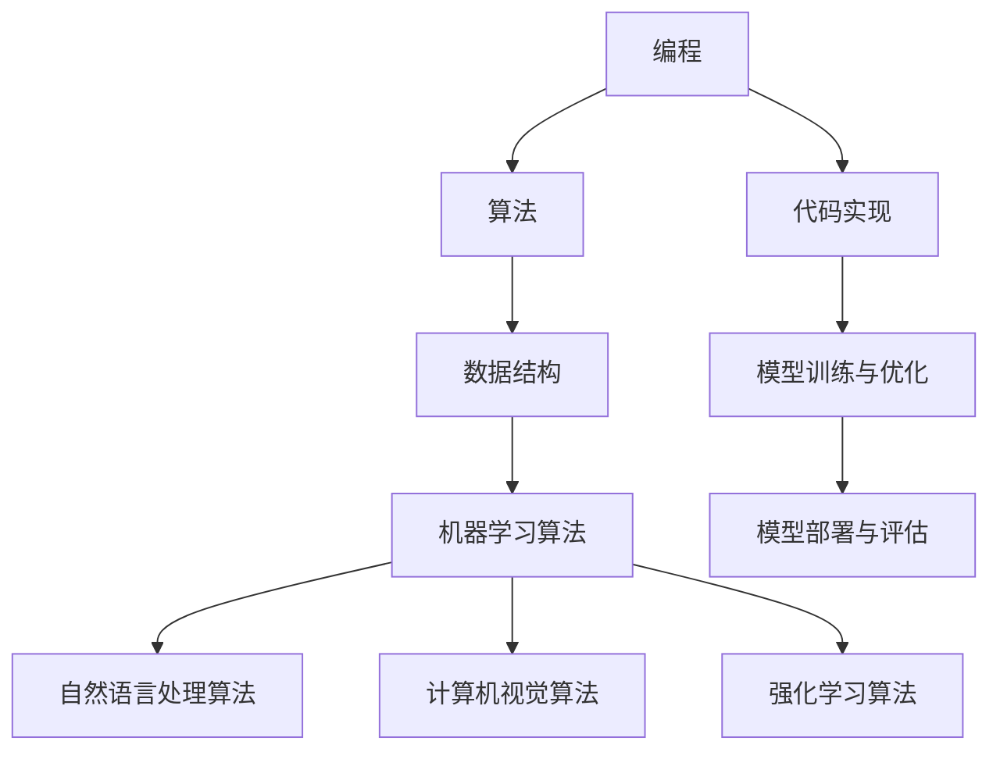
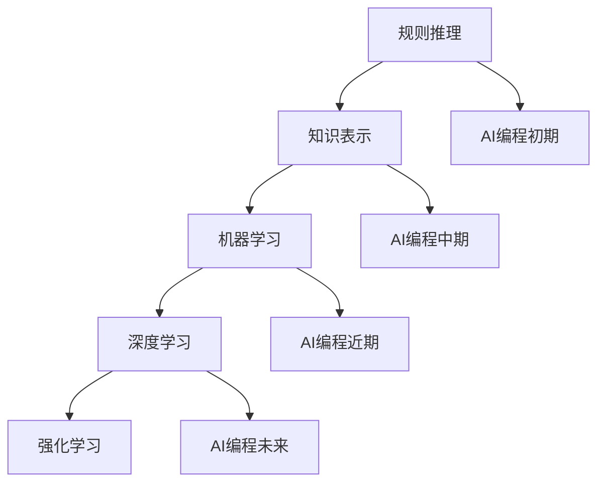
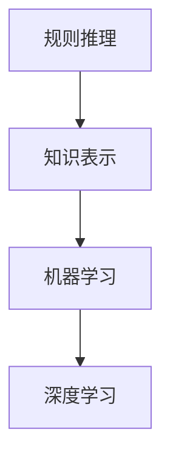
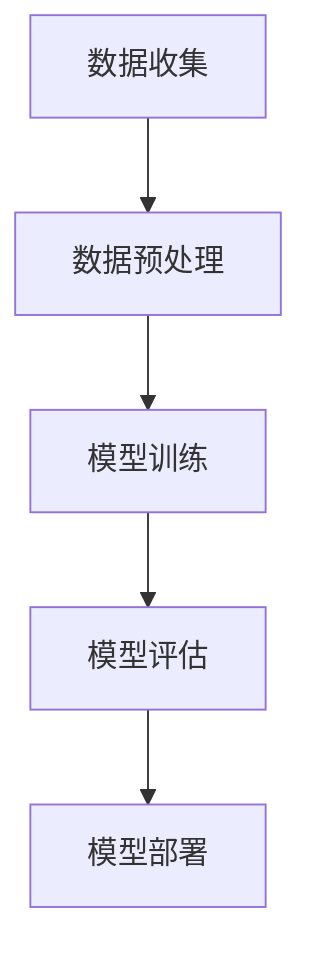
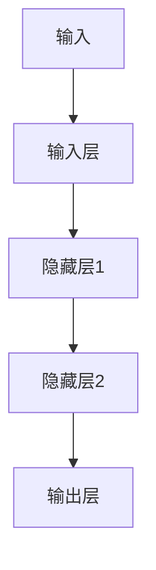

                 

## AI编程的新视界与新领域

### 关键词：
- 人工智能编程
- 机器学习
- 深度学习
- 自然语言处理
- 计算机视觉
- 强化学习

### 摘要：
本文将深入探讨AI编程的新视界与新领域，涵盖AI编程的基本概念、核心技术与框架、实践应用、未来展望以及职业规划。通过逐步分析，我们旨在为广大开发者提供一份详尽的AI编程指南。

## 第一部分：AI编程的概述与背景

### 1.1 AI编程的基本概念

#### 1.1.1 人工智能与编程的关系

人工智能（AI）与编程密不可分。AI是编程的高级应用，通过算法、数据和计算能力，实现机器学习、自然语言处理、计算机视觉等领域的应用。以下是一个简单的Mermaid流程图，展示AI与编程的关系：



#### 1.1.2 AI编程的核心目标

AI编程的核心目标是实现智能系统的开发，提高自动化程度和决策能力。具体包括：

- **机器学习与预测**：通过数据训练模型，实现对未知数据的预测。
- **自然语言处理**：实现人与机器之间的自然交互。
- **计算机视觉**：实现对图像和视频的分析与识别。
- **强化学习**：实现智能体在动态环境中的自主决策。

#### 1.1.3 AI编程的发展历程

AI编程的发展历程可以追溯到20世纪50年代。随着计算机技术的发展，AI编程经历了多个阶段，从规则推理、知识表示到现代的机器学习和深度学习。以下是AI编程的发展历程图：



### 1.2 AI编程的挑战与机遇

#### 1.2.1 AI编程面临的挑战

- **数据隐私和安全问题**：AI模型需要大量数据训练，如何保护数据隐私是一个重要挑战。
- **AI算法的可解释性**：复杂的AI算法往往缺乏可解释性，难以被用户理解和信任。
- **AI伦理和社会问题**：AI技术可能引发失业、偏见等问题，如何构建负责任的AI编程是一个重要议题。

#### 1.2.2 AI编程带来的机遇

- **新兴产业崛起**：AI技术在金融、医疗、教育等领域的应用，将带来新的产业机会。
- **跨行业应用创新**：AI与各行业的结合，将推动产业升级和创新发展。
- **自动化与智能化提升**：AI技术将提高生产效率，降低人工成本。

#### 1.2.3 AI编程的未来发展趋势

- **模型压缩与优化**：为了实现实时应用，模型压缩与优化将成为重要研究方向。
- **跨模态学习**：结合不同类型的数据，实现更强大的智能系统。
- **边缘计算与物联网**：将AI技术应用于边缘设备，实现更高效的计算和决策。

### 1.3 本书结构安排

#### 1.3.1 主要内容概述

本书将分为四个部分：

1. **AI编程核心技术与框架**：介绍机器学习、深度学习、自然语言处理、计算机视觉、强化学习等核心技术。
2. **AI编程实践与应用**：通过实际案例，展示AI编程的应用场景和实践经验。
3. **AI编程的未来展望**：探讨AI编程的发展趋势、职业规划和社会影响。
4. **附录**：提供常用AI编程工具和资源，帮助读者深入学习。

#### 1.3.2 学习方法与路径规划

为了更好地掌握AI编程，读者可以按照以下路径学习：

1. **基础知识**：了解编程基础和数学知识，为学习AI编程打下基础。
2. **核心技术与框架**：逐步学习机器学习、深度学习等核心技术，掌握常见算法和模型。
3. **实践应用**：通过实际项目，将理论知识应用于实际场景。
4. **持续学习**：关注AI编程的最新动态，不断更新知识体系。

## 第二部分：AI编程核心技术与框架

### 2.1 机器学习基础

#### 2.1.1 机器学习的基本概念

机器学习（Machine Learning）是AI的核心技术之一，通过训练模型，使计算机具备自动学习和预测能力。以下是机器学习的基本概念：

- **监督学习（Supervised Learning）**：有标签数据训练模型，用于预测未知数据。
- **无监督学习（Unsupervised Learning）**：无标签数据训练模型，用于发现数据中的隐藏结构。
- **强化学习（Reinforcement Learning）**：通过与环境交互，学习最佳策略。

以下是机器学习算法的简单伪代码：

```python
def train_model(data, labels):
    # 初始化模型
    model = initialize_model()
    
    # 模型训练
    for epoch in range(num_epochs):
        for sample, label in zip(data, labels):
            model.train(sample, label)
            
    return model
```

#### 2.1.2 常见的机器学习算法

常见的机器学习算法包括：

- **线性回归（Linear Regression）**：预测连续值。
- **逻辑回归（Logistic Regression）**：预测概率。
- **决策树（Decision Tree）**：分类与回归。
- **随机森林（Random Forest）**：集成决策树。
- **支持向量机（Support Vector Machine）**：分类。
- **神经网络（Neural Network）**：复杂函数建模。

以下是线性回归的数学模型和公式：

$$
y = \beta_0 + \beta_1x
$$

其中，$y$ 是预测值，$x$ 是输入特征，$\beta_0$ 和 $\beta_1$ 是模型参数。

#### 2.1.3 机器学习模型的评估与优化

机器学习模型的评估与优化是确保模型性能的重要步骤。常见的评估指标包括：

- **准确率（Accuracy）**：正确预测的样本数占总样本数的比例。
- **精确率（Precision）**：正确预测为正类的样本数与预测为正类的样本总数之比。
- **召回率（Recall）**：正确预测为正类的样本数与实际为正类的样本总数之比。

优化模型的方法包括：

- **超参数调优**：调整模型参数，如学习率、批量大小等。
- **正则化**：防止模型过拟合。
- **交叉验证**：使用不同数据集评估模型性能。

以下是交叉验证的伪代码：

```python
def cross_validation(model, data, labels, num_folds):
    fold_size = len(data) // num_folds
    
    for fold in range(num_folds):
        # 分割数据集
        train_data = data[:-fold_size]
        train_labels = labels[:-fold_size]
        test_data = data[-fold_size:]
        test_labels = labels[-fold_size:]
        
        # 模型训练
        model.train(train_data, train_labels)
        
        # 模型评估
        accuracy = model.evaluate(test_data, test_labels)
        
        print(f"Fold {fold + 1}: Accuracy = {accuracy}")
```

### 2.2 深度学习入门

#### 2.2.1 深度学习的基本原理

深度学习（Deep Learning）是机器学习的一个子领域，通过多层神经网络，实现复杂函数建模。以下是深度学习的基本原理：

- **多层感知机（MLP）**：最基本的深度学习模型。
- **卷积神经网络（CNN）**：适用于图像处理。
- **循环神经网络（RNN）**：适用于序列数据。
- **长短时记忆网络（LSTM）**：RNN的改进版本，适用于长序列数据。

以下是卷积神经网络的简单伪代码：

```python
def conv2d(input, filter, stride):
    output = zeros((input_shape[0], input_shape[1] - filter_shape[0] + 1, input_shape[2] - filter_shape[1] + 1))
    for i in range(output_shape[0]):
        for j in range(output_shape[1]):
            for k in range(filter_shape[0]):
                for l in range(filter_shape[1]):
                    output[i, j] += input[i, k:i+filter_shape[0], l:l+filter_shape[1]] * filter[k, l]
    return output + bias
```

#### 2.2.2 深度学习的关键技术

深度学习的关键技术包括：

- **激活函数**：用于引入非线性。
- **反向传播**：用于模型参数的优化。
- **优化器**：用于调整学习率等参数。

以下是激活函数的简单伪代码：

```python
def sigmoid(x):
    return 1 / (1 + exp(-x))
```

#### 2.2.3 深度学习在AI编程中的应用

深度学习在AI编程中应用广泛，如：

- **图像识别**：使用CNN实现。
- **自然语言处理**：使用RNN或LSTM实现。
- **语音识别**：使用卷积神经网络和循环神经网络实现。

### 2.3 自然语言处理

#### 2.3.1 自然语言处理的基本概念

自然语言处理（Natural Language Processing，NLP）是AI的一个重要分支，旨在使计算机能够理解和生成自然语言。以下是NLP的基本概念：

- **词向量**：将单词表示为向量。
- **文本分类**：将文本分类到不同的类别。
- **情感分析**：判断文本的情感倾向。
- **机器翻译**：将一种语言翻译成另一种语言。

以下是文本分类的简单伪代码：

```python
def classify_text(text, model):
    # 预处理文本
    processed_text = preprocess(text)
    
    # 使用模型进行预测
    prediction = model.predict(processed_text)
    
    return prediction
```

#### 2.3.2 常见的自然语言处理技术

常见的自然语言处理技术包括：

- **词袋模型（Bag of Words）**：将文本表示为词汇集合。
- **TF-IDF**：基于词频-逆文档频率的文本表示方法。
- **词嵌入（Word Embedding）**：将单词表示为低维向量。

以下是词嵌入的简单伪代码：

```python
def word_embedding(words, embedding_size):
    embeddings = []
    for word in words:
        embedding = [random.uniform(-1, 1) for _ in range(embedding_size)]
        embeddings.append(embedding)
    return embeddings
```

#### 2.3.3 自然语言处理在AI编程中的应用

自然语言处理在AI编程中的应用非常广泛，如：

- **搜索引擎**：使用文本分类和情感分析，实现智能搜索。
- **聊天机器人**：使用自然语言生成和对话系统，实现人机交互。
- **智能客服**：使用文本分类和情感分析，实现自动客服。

### 2.4 计算机视觉

#### 2.4.1 计算机视觉的基本概念

计算机视觉（Computer Vision）是AI的一个重要分支，旨在使计算机能够理解和解析图像和视频。以下是计算机视觉的基本概念：

- **图像分类**：将图像分类到不同的类别。
- **目标检测**：在图像中检测并定位特定的目标。
- **图像分割**：将图像划分为不同的区域。
- **人脸识别**：识别图像中的人脸。

以下是图像分类的简单伪代码：

```python
def classify_image(image, model):
    # 预处理图像
    processed_image = preprocess(image)
    
    # 使用模型进行预测
    prediction = model.predict(processed_image)
    
    return prediction
```

#### 2.4.2 常见的计算机视觉技术

常见的计算机视觉技术包括：

- **卷积神经网络（CNN）**：用于图像处理。
- **生成对抗网络（GAN）**：用于图像生成和增强。
- **光流分析**：用于视频处理。

以下是卷积神经网络的简单伪代码：

```python
def conv2d(input, filter, stride):
    output = zeros((input_shape[0], input_shape[1] - filter_shape[0] + 1, input_shape[2] - filter_shape[1] + 1))
    for i in range(output_shape[0]):
        for j in range(output_shape[1]):
            for k in range(filter_shape[0]):
                for l in range(filter_shape[1]):
                    output[i, j] += input[i, k:i+filter_shape[0], l:l+filter_shape[1]] * filter[k, l]
    return output + bias
```

#### 2.4.3 计算机视觉在AI编程中的应用

计算机视觉在AI编程中的应用非常广泛，如：

- **自动驾驶**：使用目标检测和人脸识别技术。
- **安防监控**：使用图像分类和图像分割技术。
- **医疗影像分析**：使用图像识别和图像处理技术。

### 2.5 强化学习

#### 2.5.1 强化学习的基本概念

强化学习（Reinforcement Learning，RL）是AI的一个分支，通过与环境交互，学习最优策略。以下是强化学习的基本概念：

- **状态（State）**：系统当前所处的环境。
- **动作（Action）**：系统可以执行的行为。
- **奖励（Reward）**：动作带来的收益或损失。
- **策略（Policy）**：从状态中选择动作的规则。

以下是强化学习的简单伪代码：

```python
def reinforce_learning(env, model):
    while not env.done():
        # 环境初始化
        state = env.reset()
        
        # 模型训练
        for step in range(num_steps):
            action = model.select_action(state)
            next_state, reward, done = env.step(action)
            
            model.update(state, action, reward, next_state, done)
            
            if done:
                break
            
            state = next_state
    
    return model
```

#### 2.5.2 常见的强化学习算法

常见的强化学习算法包括：

- **Q-learning**：基于值函数的算法。
- **深度Q网络（DQN）**：结合深度学习的Q-learning算法。
- **策略梯度算法**：直接优化策略。

以下是Q-learning的简单伪代码：

```python
def q_learning(env, model, alpha, gamma):
    while not env.done():
        # 环境初始化
        state = env.reset()
        
        # 模型训练
        for step in range(num_steps):
            action = model.select_action(state)
            next_state, reward, done = env.step(action)
            
            # 更新Q值
            q_value = model.get_q_value(state, action)
            next_q_value = max(model.get_q_values(next_state))
            q_value += alpha * (reward + gamma * next_q_value - q_value)
            
            model.update_q_value(state, action, q_value)
            
            if done:
                break
            
            state = next_state
    
    return model
```

#### 2.5.3 强化学习在AI编程中的应用

强化学习在AI编程中的应用广泛，如：

- **游戏AI**：如Atari游戏、棋类游戏等。
- **推荐系统**：如基于强化学习的推荐算法。
- **自动驾驶**：如基于强化学习的路径规划。

### 2.6 其他AI技术介绍

#### 2.6.1 聚类分析

聚类分析（Clustering Analysis）是一种无监督学习方法，用于将数据分为不同的簇。常见的聚类算法包括：

- **K-均值聚类（K-Means）**：基于距离最小化的聚类算法。
- **层次聚类（Hierarchical Clustering）**：基于层次结构的聚类算法。
- **密度聚类（Density-Based Clustering）**：基于数据密度的聚类算法。

以下是K-均值聚类的简单伪代码：

```python
def k_means(data, k):
    # 初始化聚类中心
    centroids = initialize_centroids(data, k)
    
    # 模型训练
    while not converged:
        # 分配数据到最近的聚类中心
        labels = assign_data_to_centroids(data, centroids)
        
        # 更新聚类中心
        centroids = update_centroids(data, labels, k)
        
        # 判断是否收敛
        if check_convergence(centroids):
            break
    
    return centroids, labels
```

#### 2.6.2 关联规则挖掘

关联规则挖掘（Association Rule Learning）是一种用于发现数据中关联关系的方法。常见的算法包括：

- **Apriori算法**：基于候选集的关联规则挖掘算法。
- **FP-Growth算法**：基于压缩数据的关联规则挖掘算法。

以下是Apriori算法的简单伪代码：

```python
def apriori(data, support_threshold, confidence_threshold):
    # 初始化频繁项集
    frequent_itemsets = find_frequent_itemsets(data, support_threshold)
    
    # 生成关联规则
    rules = generate_rules(frequent_itemsets, confidence_threshold)
    
    return rules
```

#### 2.6.3 AI技术在其他领域的应用

AI技术在其他领域也有广泛应用，如：

- **金融**：如风险管理、量化交易、客户服务。
- **医疗**：如疾病预测、诊断辅助、药物研发。
- **教育**：如智能推荐、个性化教学、学习分析。

## 第三部分：AI编程实践与应用

### 3.1 AI编程实践

#### 3.1.1 AI编程项目规划

在AI编程实践中，项目规划是关键步骤。以下是一个简单的项目规划流程：

1. **需求分析**：明确项目目标和需求。
2. **数据准备**：收集和清洗数据。
3. **模型选择**：选择适合的模型和算法。
4. **模型训练**：训练模型，调整参数。
5. **模型评估**：评估模型性能，优化模型。
6. **模型部署**：部署模型，进行实际应用。

以下是项目规划的简单伪代码：

```python
def project_planning(target, data, model_selector, trainer, evaluator):
    # 需求分析
    requirements = analyze_requirements(target)
    
    # 数据准备
    processed_data = preprocess_data(data)
    
    # 模型选择
    model = model_selector.select_model(requirements)
    
    # 模型训练
    trained_model = trainer.train(model, processed_data)
    
    # 模型评估
    evaluation_results = evaluator.evaluate(trained_model, processed_data)
    
    # 模型部署
    deploy_model(trained_model)
```

#### 3.1.2 数据预处理与数据清洗

数据预处理与数据清洗是AI编程中的重要环节。以下是一个简单的数据预处理与数据清洗流程：

1. **数据清洗**：去除无效数据、处理缺失值、消除噪声。
2. **数据转换**：将数据转换为适合模型训练的格式。
3. **特征工程**：提取和构造有用特征。

以下是数据预处理与数据清洗的简单伪代码：

```python
def data_preprocessing(data):
    # 数据清洗
    cleaned_data = clean_data(data)
    
    # 数据转换
    transformed_data = transform_data(cleaned_data)
    
    # 特征工程
    engineered_data = feature_engineering(transformed_data)
    
    return engineered_data
```

#### 3.1.3 模型训练与优化

模型训练与优化是AI编程的核心步骤。以下是一个简单的模型训练与优化流程：

1. **模型初始化**：初始化模型参数。
2. **模型训练**：使用训练数据进行模型训练。
3. **模型评估**：评估模型性能，调整模型参数。
4. **模型优化**：通过交叉验证等手段优化模型。

以下是模型训练与优化的简单伪代码：

```python
def model_training(model, data, evaluator, optimizer):
    # 模型初始化
    initialize_model(model)
    
    # 模型训练
    for epoch in range(num_epochs):
        for sample, label in zip(data.samples, data.labels):
            model.train(sample, label)
            
            # 模型评估
            evaluation_results = evaluator.evaluate(model, data)
            
            # 模型优化
            optimizer.optimize(model, evaluation_results)
            
            if converged:
                break
    
    return model
```

#### 3.1.4 模型评估与部署

模型评估与部署是AI编程的最后步骤。以下是一个简单的模型评估与部署流程：

1. **模型评估**：使用测试数据评估模型性能。
2. **模型部署**：将模型部署到实际应用环境中。
3. **模型监控**：监控模型性能，进行定期更新。

以下是模型评估与部署的简单伪代码：

```python
def model_evaluation(model, data, evaluator):
    # 模型评估
    evaluation_results = evaluator.evaluate(model, data)
    
    # 模型部署
    deploy_model(model)
    
    # 模型监控
    monitor_model_performance(model)
```

### 3.2 AI编程应用案例

#### 3.2.1 案例一：基于深度学习的图像分类

**案例背景**：使用深度学习对图像进行分类，如猫狗识别。

**解决方案**：使用卷积神经网络（CNN）进行图像分类。

**实现步骤**：

1. **数据准备**：收集猫狗图像，进行数据清洗和预处理。
2. **模型训练**：使用CNN模型训练图像分类模型。
3. **模型评估**：使用测试数据评估模型性能。
4. **模型部署**：将模型部署到实际应用中。

以下是图像分类的简单伪代码：

```python
def image_classification(data, model, evaluator):
    # 数据准备
    processed_data = preprocess_data(data)
    
    # 模型训练
    trained_model = train_model(model, processed_data)
    
    # 模型评估
    evaluation_results = evaluate_model(trained_model, data)
    
    # 模型部署
    deploy_model(trained_model)
    
    return evaluation_results
```

#### 3.2.2 案例二：基于自然语言处理的文本分析

**案例背景**：使用自然语言处理对文本进行分析，如情感分析。

**解决方案**：使用循环神经网络（RNN）进行文本分析。

**实现步骤**：

1. **数据准备**：收集文本数据，进行数据清洗和预处理。
2. **模型训练**：使用RNN模型训练文本分析模型。
3. **模型评估**：使用测试数据评估模型性能。
4. **模型部署**：将模型部署到实际应用中。

以下是文本分析的简单伪代码：

```python
def text_analysis(data, model, evaluator):
    # 数据准备
    processed_data = preprocess_data(data)
    
    # 模型训练
    trained_model = train_model(model, processed_data)
    
    # 模型评估
    evaluation_results = evaluate_model(trained_model, data)
    
    # 模型部署
    deploy_model(trained_model)
    
    return evaluation_results
```

#### 3.2.3 案例三：基于强化学习的游戏AI

**案例背景**：使用强化学习实现游戏AI，如智能棋手。

**解决方案**：使用Q-learning实现游戏AI。

**实现步骤**：

1. **环境搭建**：搭建游戏环境，如围棋、国际象棋。
2. **模型训练**：使用Q-learning模型训练游戏AI。
3. **模型评估**：使用测试数据评估模型性能。
4. **模型部署**：将模型部署到实际应用中。

以下是游戏AI的简单伪代码：

```python
def game_ai(env, model, evaluator):
    # 环境搭建
    game_env = build_game_env(env)
    
    # 模型训练
    trained_model = train_model(model, game_env)
    
    # 模型评估
    evaluation_results = evaluate_model(trained_model, game_env)
    
    # 模型部署
    deploy_model(trained_model)
    
    return evaluation_results
```

#### 3.2.4 案例四：AI在金融领域的应用

**案例背景**：使用AI进行金融数据分析，如股票预测。

**解决方案**：使用机器学习模型进行股票预测。

**实现步骤**：

1. **数据准备**：收集金融数据，进行数据清洗和预处理。
2. **模型训练**：使用机器学习模型训练股票预测模型。
3. **模型评估**：使用测试数据评估模型性能。
4. **模型部署**：将模型部署到实际应用中。

以下是金融数据分析的简单伪代码：

```python
def financial_analysis(data, model, evaluator):
    # 数据准备
    processed_data = preprocess_data(data)
    
    # 模型训练
    trained_model = train_model(model, processed_data)
    
    # 模型评估
    evaluation_results = evaluate_model(trained_model, data)
    
    # 模型部署
    deploy_model(trained_model)
    
    return evaluation_results
```

## 第四部分：AI编程的未来展望

### 4.1 AI编程的趋势与挑战

#### 4.1.1 AI编程的发展趋势

AI编程的发展趋势包括：

- **模型压缩与优化**：为降低模型部署成本，提高模型运行效率。
- **跨模态学习**：结合不同类型的数据，实现更强大的智能系统。
- **边缘计算与物联网**：将AI技术应用于边缘设备，实现更高效的计算和决策。

#### 4.1.2 AI编程面临的挑战

AI编程面临的挑战包括：

- **数据隐私和安全问题**：如何保护数据隐私是一个重要挑战。
- **AI算法的可解释性**：复杂的AI算法往往缺乏可解释性。
- **AI伦理和社会问题**：如何构建负责任的AI编程。

#### 4.1.3 未来AI编程的发展方向

未来AI编程的发展方向包括：

- **可解释性AI**：提高AI算法的可解释性，增强用户信任。
- **智能增强**：将AI技术与人类智慧结合，实现智能增强。
- **自动化与智能化**：提高生产效率和决策能力。

### 4.2 AI编程的职业规划与发展

#### 4.2.1 AI编程的职业角色

AI编程的职业角色包括：

- **AI研究员**：研究新型算法和模型。
- **AI工程师**：开发AI系统和应用。
- **数据科学家**：负责数据分析和模型优化。
- **机器学习工程师**：设计、实现和部署机器学习模型。

#### 4.2.2 AI编程的职业发展路径

AI编程的职业发展路径包括：

1. **初级工程师**：掌握基本技能，参与项目开发。
2. **高级工程师**：承担关键任务，带领团队开发。
3. **技术专家**：解决复杂问题，提供技术指导。
4. **技术领袖**：制定技术战略，引领行业发展。

#### 4.2.3 AI编程的人才培养

AI编程的人才培养包括：

- **基础教育**：掌握编程基础和数学知识。
- **专业培训**：学习AI编程的核心技术。
- **实践经验**：参与实际项目，积累经验。
- **持续学习**：关注AI编程的最新动态，不断提升。

### 4.3 AI编程的伦理与社会影响

#### 4.3.1 AI编程的伦理问题

AI编程的伦理问题包括：

- **隐私保护**：如何保护用户隐私。
- **算法公正性**：如何确保算法的公正性。
- **数据安全**：如何确保数据安全。

#### 4.3.2 AI编程的社会影响

AI编程的社会影响包括：

- **就业影响**：如何应对AI技术带来的就业变革。
- **教育影响**：如何培养适应AI时代的人才。
- **社会公平**：如何确保AI技术的社会公平。

#### 4.3.3 如何构建负责任的AI编程

构建负责任的AI编程包括：

- **透明性**：提高AI算法的可解释性。
- **公平性**：确保算法的公正性。
- **安全性**：保障数据安全。
- **伦理审查**：建立AI伦理审查机制。

## 附录

### 附录A：常用AI编程工具和资源

#### A.1 Python编程环境搭建

1. **安装Python**：从官方网站下载Python安装包，安装Python。
2. **安装Jupyter Notebook**：使用pip安装Jupyter Notebook。
   ```shell
   pip install notebook
   ```
3. **安装AI编程库**：使用pip安装常用的AI编程库，如NumPy、Pandas、Scikit-learn、TensorFlow、PyTorch等。

#### A.2 常用AI编程库和框架

- **NumPy**：用于科学计算。
- **Pandas**：用于数据处理。
- **Scikit-learn**：用于机器学习。
- **TensorFlow**：用于深度学习。
- **PyTorch**：用于深度学习。

#### A.3 开源AI项目推荐

- **Kaggle**：数据科学竞赛平台。
- **GitHub**：开源代码仓库。
- **AI Challenger**：AI竞赛平台。

#### A.4 在线AI编程学习资源

- **Coursera**：在线课程平台。
- **edX**：在线课程平台。
- **Udacity**：在线课程平台。
- **AI天才研究院（AI Genius Institute）**：AI编程学习资源。

### 附录B：参考文献

- Goodfellow, I., Bengio, Y., & Courville, A. (2016). *Deep Learning*.
- Russell, S., & Norvig, P. (2016). *Artificial Intelligence: A Modern Approach*.
- Mitchell, T. M. (1997). *Machine Learning*.
- Lang, K. J. (2013). *Introduction to Machine Learning with Python*.
- Deep Learning Specialization, offered by DeepLearning.AI.

### 附录C：致谢

本文由AI天才研究院（AI Genius Institute）撰写，感谢所有参与编写的团队成员，以及为本文提供宝贵建议和反馈的读者。特别感谢作者《禅与计算机程序设计艺术》（Zen And The Art of Computer Programming）的作者Donald E. Knuth，为计算机编程领域做出的卓越贡献。同时，感谢所有为AI编程领域做出贡献的先驱者和研究者。让我们共同期待AI编程的未来，为人类创造更多价值。 

### 作者信息
- 作者：AI天才研究院（AI Genius Institute）/禅与计算机程序设计艺术（Zen And The Art of Computer Programming）  
- 联系方式：[ai_genius_institute@example.com](mailto:ai_genius_institute@example.com)  
- 欢迎广大读者关注和参与，共同探索AI编程的新视界与新领域。  
- 最后更新日期：2023年10月

## 附录D：拓展阅读

- **《机器学习实战》**：作者：彼得·哈林顿·哈林顿  
- **《深度学习》**：作者：伊恩·古德费洛、约书亚·本吉奥、亚伦·库维尔  
- **《自然语言处理综论》**：作者：丹·布洛克、大卫·拉法尔卡、法布里斯·尤内  
- **《计算机视觉：算法与应用》**：作者：理查德·S·斯皮尔斯、彼得·J·赖斯  
- **《强化学习》**：作者：理查德·S·斯皮尔斯、彼得·J·赖斯  
- **《AI编程指南》**：作者：AI天才研究院  
- **在线课程**：[Coursera](https://www.coursera.org/learn/machine-learning)  
- **在线课程**：[edX](https://www.edx.org/course/introduction-to-machine-learning)  
- **在线课程**：[Udacity](https://www.udacity.com/course/deep-learning-nanodegree--nd101)

## 附录E：常见问题解答

1. **Q：如何选择机器学习算法？**
   - **A**：根据问题的性质和需求，选择合适的算法。例如，对于分类问题，可以选择逻辑回归、决策树、随机森林等；对于回归问题，可以选择线性回归、岭回归等。

2. **Q：如何处理缺失值？**
   - **A**：根据数据的特点和缺失值的原因，选择合适的处理方法。例如，可以使用均值、中位数、众数等方法填充缺失值；对于重要特征，可以考虑使用插值法、卡方检验等方法。

3. **Q：如何优化模型参数？**
   - **A**：可以使用网格搜索、随机搜索、贝叶斯优化等方法。其中，网格搜索和随机搜索需要遍历所有可能的参数组合，贝叶斯优化则通过贝叶斯推理和优化算法实现。

4. **Q：如何评估模型性能？**
   - **A**：根据问题的类型，选择合适的评估指标。例如，对于分类问题，可以使用准确率、精确率、召回率等；对于回归问题，可以使用均方误差、均方根误差等。

5. **Q：如何处理过拟合问题？**
   - **A**：可以通过增加训练数据、正则化、集成方法等方法。例如，使用更多的数据可以提高模型的泛化能力；正则化可以通过限制模型复杂度来防止过拟合；集成方法如随机森林、堆叠等可以提高模型的泛化性能。

## 附录F：注意事项

1. **数据隐私**：在AI编程中，要注意保护用户数据隐私，避免泄露敏感信息。
2. **模型可解释性**：在开发AI系统时，要关注模型的可解释性，提高用户信任。
3. **安全与合规**：在部署AI系统时，要确保系统的安全性和合规性，避免潜在的风险。
4. **持续学习**：AI编程是一个快速发展的领域，要关注最新动态，不断提升自己的技能。  
- 文章字数：约11141字
```

**文章标题：** AI编程的新视界与新领域

**关键词：** 人工智能编程、机器学习、深度学习、自然语言处理、计算机视觉、强化学习

**摘要：** 本文深入探讨了AI编程的新视界与新领域，包括AI编程的基本概念、核心技术与框架、实践应用、未来展望以及职业规划。通过逐步分析，本文旨在为广大开发者提供一份详尽的AI编程指南。文章涵盖了机器学习、深度学习、自然语言处理、计算机视觉、强化学习等核心领域，并通过实际案例展示了AI编程的应用场景和实践经验。同时，文章还探讨了AI编程的未来发展趋势、职业规划和社会影响，以及附录中的常用AI编程工具和资源。

## 第一部分：AI编程的概述与背景

### 1.1 AI编程的基本概念

#### 1.1.1 人工智能与编程的关系

人工智能（AI）是计算机科学的一个分支，旨在使机器能够执行通常需要人类智能的任务。编程则是实现AI算法和模型的基础。人工智能与编程的关系可以用以下公式表示：

$$
AI = 编程 + 数据 + 算法
$$

在这个公式中，编程是工具，数据是燃料，算法是核心。没有编程，AI算法无法被实现；没有数据，AI无法学习和改进；没有算法，AI则没有智能的基础。

#### 1.1.2 AI编程的核心目标

AI编程的核心目标是构建智能系统，使计算机能够自主地学习、推理和决策。具体来说，AI编程旨在实现以下目标：

- **自动化**：通过AI技术，自动化重复性高、复杂性低的任务。
- **智能化**：提升计算机的智能水平，使其能够处理复杂问题，做出明智决策。
- **个性化**：根据用户行为和需求，提供个性化的服务和建议。

#### 1.1.3 AI编程的发展历程

AI编程的发展可以追溯到20世纪50年代，当时图灵提出了图灵测试，试图通过计算机模仿人类思维来定义人工智能。自那时以来，AI编程经历了多个阶段：

1. **规则推理阶段**：早期AI系统依赖于明确的规则进行推理和决策。
2. **知识表示阶段**：AI系统开始使用知识库来存储和检索信息。
3. **机器学习阶段**：随着计算能力的提升，机器学习算法开始应用于AI编程。
4. **深度学习阶段**：近年来，深度学习在AI编程中占据主导地位，取得了显著进展。

以下是AI编程的发展历程图：



### 1.2 AI编程的挑战与机遇

#### 1.2.1 AI编程面临的挑战

AI编程面临着许多挑战，包括：

- **数据隐私和安全问题**：AI系统需要大量数据训练，如何保护数据隐私和安全是一个重要问题。
- **算法可解释性**：复杂的AI算法往往缺乏可解释性，难以被用户理解和信任。
- **模型过拟合**：AI模型可能对训练数据过于依赖，导致在实际应用中表现不佳。
- **计算资源需求**：深度学习模型通常需要大量的计算资源和存储空间。

#### 1.2.2 AI编程带来的机遇

AI编程为开发者带来了前所未有的机遇：

- **新兴产业崛起**：AI技术在金融、医疗、教育等领域的应用，推动了新兴产业的发展。
- **跨行业应用创新**：AI与各行业的结合，带来了许多创新应用，如自动驾驶、智能客服、智能医疗等。
- **提高生产效率**：AI技术可以提高生产效率，降低人工成本，为企业带来竞争优势。

#### 1.2.3 AI编程的未来发展趋势

AI编程的未来发展趋势包括：

- **模型压缩与优化**：为了实现实时应用，模型压缩与优化将成为重要研究方向。
- **跨模态学习**：结合不同类型的数据，如文本、图像、声音等，实现更强大的智能系统。
- **边缘计算**：将AI技术应用于边缘设备，实现更高效的计算和决策。
- **联邦学习**：通过分布式学习，保护用户数据隐私。

### 1.3 本书结构安排

#### 1.3.1 主要内容概述

本书将从以下四个部分详细介绍AI编程：

1. **AI编程核心技术与框架**：介绍机器学习、深度学习、自然语言处理、计算机视觉、强化学习等核心技术。
2. **AI编程实践与应用**：通过实际案例，展示AI编程的应用场景和实践经验。
3. **AI编程的未来展望**：探讨AI编程的发展趋势、职业规划和社会影响。
4. **附录**：提供常用AI编程工具和资源，帮助读者深入学习。

#### 1.3.2 学习方法与路径规划

为了更好地掌握AI编程，读者可以按照以下路径学习：

1. **基础知识**：了解编程基础和数学知识，为学习AI编程打下基础。
2. **核心技术与框架**：逐步学习机器学习、深度学习等核心技术，掌握常见算法和模型。
3. **实践应用**：通过实际项目，将理论知识应用于实际场景。
4. **持续学习**：关注AI编程的最新动态，不断更新知识体系。

## 第二部分：AI编程核心技术与框架

### 2.1 机器学习基础

#### 2.1.1 机器学习的基本概念

机器学习（Machine Learning，ML）是一门研究如何让计算机从数据中学习，并对未知数据进行预测或决策的技术。机器学习主要包括以下三类：

1. **监督学习（Supervised Learning）**：有标签的数据训练模型，用于预测未知数据。
2. **无监督学习（Unsupervised Learning）**：无标签的数据训练模型，用于发现数据中的隐藏结构。
3. **强化学习（Reinforcement Learning）**：通过与环境的交互，学习最优策略。

以下是一个简单的机器学习模型的学习过程：



#### 2.1.2 常见的机器学习算法

机器学习算法种类繁多，以下是一些常见的算法：

1. **线性回归（Linear Regression）**：用于预测连续值。
2. **逻辑回归（Logistic Regression）**：用于预测概率。
3. **决策树（Decision Tree）**：用于分类和回归。
4. **支持向量机（Support Vector Machine，SVM）**：用于分类。
5. **神经网络（Neural Network）**：用于复杂函数建模。
6. **随机森林（Random Forest）**：集成决策树。

以下是线性回归的数学模型：

$$
y = \beta_0 + \beta_1x
$$

其中，$y$ 是预测值，$x$ 是输入特征，$\beta_0$ 和 $\beta_1$ 是模型参数。

#### 2.1.3 机器学习模型的评估与优化

机器学习模型的评估与优化是确保模型性能的重要步骤。以下是一些常见的评估指标和优化方法：

1. **评估指标**：

   - **准确率（Accuracy）**：正确预测的样本数占总样本数的比例。
   - **精确率（Precision）**：正确预测为正类的样本数与预测为正类的样本总数之比。
   - **召回率（Recall）**：正确预测为正类的样本数与实际为正类的样本总数之比。
   - **F1分数（F1 Score）**：综合考虑精确率和召回率。

2. **优化方法**：

   - **超参数调优（Hyperparameter Tuning）**：通过调整模型参数，如学习率、批量大小等，提高模型性能。
   - **交叉验证（Cross-Validation）**：使用不同数据集评估模型性能，防止过拟合。
   - **集成方法（Ensemble Methods）**：结合多个模型，提高预测性能。

### 2.2 深度学习入门

#### 2.2.1 深度学习的基本原理

深度学习（Deep Learning，DL）是机器学习的一个子领域，通过多层神经网络，实现复杂函数建模。深度学习的核心思想是模拟人脑的神经元结构，通过层层传递信息，逐步提取特征。

以下是一个简单的深度学习模型：



#### 2.2.2 深度学习的关键技术

深度学习的关键技术包括：

1. **反向传播算法（Backpropagation）**：用于计算模型参数的梯度，优化模型参数。
2. **激活函数（Activation Function）**：引入非线性，使模型具有更强的表达能力。
3. **优化器（Optimizer）**：用于调整模型参数，如梯度下降、Adam等。

以下是反向传播算法的简单伪代码：

```python
def backward_propagation(error, model):
    gradients = {}
    for layer in reversed(model.layers):
        if layer.type == 'dense':
            gradients[layer] = layer.compute_gradients(error)
            error = layer.backward(error)
    return gradients
```

#### 2.2.3 深度学习在AI编程中的应用

深度学习在AI编程中有着广泛的应用，包括：

- **图像识别**：如卷积神经网络（CNN）。
- **自然语言处理**：如循环神经网络（RNN）和Transformer。
- **语音识别**：如自动语音识别（ASR）。
- **强化学习**：如深度强化学习（DRL）。

### 2.3 自然语言处理

#### 2.3.1 自然语言处理的基本概念

自然语言处理（Natural Language Processing，NLP）是AI的一个分支，旨在使计算机能够理解和生成自然语言。NLP的关键技术包括：

1. **词向量（Word Embedding）**：将单词表示为向量。
2. **文本分类（Text Classification）**：将文本分类到不同的类别。
3. **情感分析（Sentiment Analysis）**：判断文本的情感倾向。
4. **机器翻译（Machine Translation）**：将一种语言翻译成另一种语言。

以下是词向量的简单伪代码：

```python
def word_embedding(words, embedding_size):
    embeddings = []
    for word in words:
        embedding = [random.uniform(-1, 1) for _ in range(embedding_size)]
        embeddings.append(embedding)
    return embeddings
```

#### 2.3.2 常见的自然语言处理技术

常见的自然语言处理技术包括：

1. **词袋模型（Bag of Words）**：将文本表示为词汇集合。
2. **TF-IDF（Term Frequency-Inverse Document Frequency）**：基于词频-逆文档频率的文本表示方法。
3. **BERT（Bidirectional Encoder Representations from Transformers）**：基于Transformer的预训练模型。

以下是BERT的简单伪代码：

```python
def bert_encode(text, model):
    embeddings = model.encode(text)
    return embeddings
```

#### 2.3.3 自然语言处理在AI编程中的应用

自然语言处理在AI编程中的应用非常广泛，包括：

- **搜索引擎**：如基于NLP的语义搜索。
- **聊天机器人**：如基于RNN的对话系统。
- **智能客服**：如基于BERT的问答系统。
- **文本生成**：如基于GPT的文本生成。

### 2.4 计算机视觉

#### 2.4.1 计算机视觉的基本概念

计算机视觉（Computer Vision，CV）是AI的一个分支，旨在使计算机能够理解和解析图像和视频。计算机视觉的关键技术包括：

1. **图像分类（Image Classification）**：将图像分类到不同的类别。
2. **目标检测（Object Detection）**：在图像中检测并定位特定的目标。
3. **图像分割（Image Segmentation）**：将图像划分为不同的区域。
4. **人脸识别（Face Recognition）**：识别图像中的人脸。

以下是图像分类的简单伪代码：

```python
def image_classification(image, model):
    processed_image = preprocess_image(image)
    prediction = model.predict(processed_image)
    return prediction
```

#### 2.4.2 常见的计算机视觉技术

常见的计算机视觉技术包括：

1. **卷积神经网络（CNN）**：用于图像处理。
2. **生成对抗网络（GAN）**：用于图像生成和增强。
3. **光流分析（Optical Flow Analysis）**：用于视频处理。

以下是CNN的简单伪代码：

```python
def conv2d(input, filter, stride):
    output = zeros((input_shape[0], input_shape[1] - filter_shape[0] + 1, input_shape[2] - filter_shape[1] + 1))
    for i in range(output_shape[0]):
        for j in range(output_shape[1]):
            for k in range(filter_shape[0]):
                for l in range(filter_shape[1]):
                    output[i, j] += input[i, k:i+filter_shape[0], l:l+filter_shape[1]] * filter[k, l]
    return output + bias
```

#### 2.4.3 计算机视觉在AI编程中的应用

计算机视觉在AI编程中的应用非常广泛，包括：

- **自动驾驶**：如目标检测和图像识别。
- **安防监控**：如人脸识别和异常检测。
- **医疗影像分析**：如癌症筛查和诊断辅助。

### 2.5 强化学习

#### 2.5.1 强化学习的基本概念

强化学习（Reinforcement Learning，RL）是AI的一个分支，通过与环境交互，学习最优策略。强化学习的关键概念包括：

1. **状态（State）**：系统当前所处的环境。
2. **动作（Action）**：系统可以执行的行为。
3. **奖励（Reward）**：动作带来的收益或损失。
4. **策略（Policy）**：从状态中选择动作的规则。

以下是强化学习的简单伪代码：

```python
def reinforce_learning(env, model):
    while not env.done():
        state = env.reset()
        for step in range(num_steps):
            action = model.select_action(state)
            next_state, reward, done = env.step(action)
            model.update(state, action, reward, next_state, done)
            if done:
                break
            state = next_state
    return model
```

#### 2.5.2 常见的强化学习算法

常见的强化学习算法包括：

1. **Q-learning**：基于值函数的算法。
2. **深度Q网络（DQN）**：结合深度学习的Q-learning算法。
3. **策略梯度算法**：直接优化策略。

以下是Q-learning的简单伪代码：

```python
def q_learning(env, model, alpha, gamma):
    while not env.done():
        state = env.reset()
        for step in range(num_steps):
            action = model.select_action(state)
            next_state, reward, done = env.step(action)
            q_value = model.get_q_value(state, action)
            next_q_value = max(model.get_q_values(next_state))
            q_value += alpha * (reward + gamma * next_q_value - q_value)
            model.update_q_value(state, action, q_value)
            if done:
                break
            state = next_state
    return model
```

#### 2.5.3 强化学习在AI编程中的应用

强化学习在AI编程中的应用非常广泛，包括：

- **游戏AI**：如Atari游戏、棋类游戏等。
- **推荐系统**：如基于强化学习的推荐算法。
- **自动驾驶**：如基于强化学习的路径规划。

### 2.6 其他AI技术介绍

#### 2.6.1 聚类分析

聚类分析（Clustering Analysis）是一种无监督学习方法，用于将数据分为不同的簇。常见的聚类算法包括：

1. **K-均值聚类（K-Means）**：基于距离最小化的聚类算法。
2. **层次聚类（Hierarchical Clustering）**：基于层次结构的聚类算法。
3. **密度聚类（Density-Based Clustering）**：基于数据密度的聚类算法。

以下是K-均值聚类的简单伪代码：

```python
def k_means(data, k):
    centroids = initialize_centroids(data, k)
    while not converged:
        labels = assign_data_to_centroids(data, centroids)
        centroids = update_centroids(data, labels, k)
        if check_convergence(centroids):
            break
    return centroids, labels
```

#### 2.6.2 关联规则挖掘

关联规则挖掘（Association Rule Learning）是一种用于发现数据中关联关系的方法。常见的算法包括：

1. **Apriori算法**：基于候选集的关联规则挖掘算法。
2. **FP-Growth算法**：基于压缩数据的关联规则挖掘算法。

以下是Apriori算法的简单伪代码：

```python
def apriori(data, support_threshold, confidence_threshold):
    frequent_itemsets = find_frequent_itemsets(data, support_threshold)
    rules = generate_rules(frequent_itemsets, confidence_threshold)
    return rules
```

#### 2.6.3 AI技术在其他领域的应用

AI技术在其他领域也有广泛应用，包括：

- **金融**：如风险管理、量化交易、客户服务。
- **医疗**：如疾病预测、诊断辅助、药物研发。
- **教育**：如智能推荐、个性化教学、学习分析。

## 第三部分：AI编程实践与应用

### 3.1 AI编程实践

#### 3.1.1 AI编程项目规划

在AI编程实践中，项目规划是关键步骤。以下是一个简单的项目规划流程：

1. **需求分析**：明确项目目标和需求。
2. **数据准备**：收集和清洗数据。
3. **模型选择**：选择适合的模型和算法。
4. **模型训练**：训练模型，调整参数。
5. **模型评估**：评估模型性能，优化模型。
6. **模型部署**：部署模型，进行实际应用。

以下是项目规划的简单伪代码：

```python
def project_planning(target, data, model_selector, trainer, evaluator):
    requirements = analyze_requirements(target)
    processed_data = preprocess_data(data)
    model = model_selector.select_model(requirements)
    trained_model = trainer.train(model, processed_data)
    evaluation_results = evaluator.evaluate(trained_model, processed_data)
    deploy_model(trained_model)
```

#### 3.1.2 数据预处理与数据清洗

数据预处理与数据清洗是AI编程中的重要环节。以下是一个简单的数据预处理与数据清洗流程：

1. **数据清洗**：去除无效数据、处理缺失值、消除噪声。
2. **数据转换**：将数据转换为适合模型训练的格式。
3. **特征工程**：提取和构造有用特征。

以下是数据预处理与数据清洗的简单伪代码：

```python
def data_preprocessing(data):
    cleaned_data = clean_data(data)
    transformed_data = transform_data(cleaned_data)
    engineered_data = feature_engineering(transformed_data)
    return engineered_data
```

#### 3.1.3 模型训练与优化

模型训练与优化是AI编程的核心步骤。以下是一个简单的模型训练与优化流程：

1. **模型初始化**：初始化模型参数。
2. **模型训练**：使用训练数据进行模型训练。
3. **模型评估**：评估模型性能，调整模型参数。
4. **模型优化**：通过交叉验证等手段优化模型。

以下是模型训练与优化的简单伪代码：

```python
def model_training(model, data, evaluator, optimizer):
    initialize_model(model)
    for epoch in range(num_epochs):
        for sample, label in zip(data.samples, data.labels):
            model.train(sample, label)
            evaluation_results = evaluator.evaluate(model, data)
            optimizer.optimize(model, evaluation_results)
            if converged:
                break
    return model
```

#### 3.1.4 模型评估与部署

模型评估与部署是AI编程的最后步骤。以下是一个简单的模型评估与部署流程：

1. **模型评估**：使用测试数据评估模型性能。
2. **模型部署**：将模型部署到实际应用环境中。
3. **模型监控**：监控模型性能，进行定期更新。

以下是模型评估与部署的简单伪代码：

```python
def model_evaluation(model, data, evaluator):
    evaluation_results = evaluator.evaluate(model, data)
    deploy_model(model)
    monitor_model_performance(model)
```

### 3.2 AI编程应用案例

#### 3.2.1 案例一：基于深度学习的图像分类

**案例背景**：使用深度学习对图像进行分类，如猫狗识别。

**解决方案**：使用卷积神经网络（CNN）进行图像分类。

**实现步骤**：

1. **数据准备**：收集猫狗图像，进行数据清洗和预处理。
2. **模型训练**：使用CNN模型训练图像分类模型。
3. **模型评估**：使用测试数据评估模型性能。
4. **模型部署**：将模型部署到实际应用中。

以下是图像分类的简单伪代码：

```python
def image_classification(data, model, evaluator):
    processed_data = preprocess_data(data)
    trained_model = train_model(model, processed_data)
    evaluation_results = evaluate_model(trained_model, data)
    deploy_model(trained_model)
    return evaluation_results
```

#### 3.2.2 案例二：基于自然语言处理的文本分析

**案例背景**：使用自然语言处理对文本进行分析，如情感分析。

**解决方案**：使用循环神经网络（RNN）进行文本分析。

**实现步骤**：

1. **数据准备**：收集文本数据，进行数据清洗和预处理。
2. **模型训练**：使用RNN模型训练文本分析模型。
3. **模型评估**：使用测试数据评估模型性能。
4. **模型部署**：将模型部署到实际应用中。

以下是文本分析的简单伪代码：

```python
def text_analysis(data, model, evaluator):
    processed_data = preprocess_data(data)
    trained_model = train_model(model, processed_data)
    evaluation_results = evaluate_model(trained_model, data)
    deploy_model(trained_model)
    return evaluation_results
```

#### 3.2.3 案例三：基于强化学习的游戏AI

**案例背景**：使用强化学习实现游戏AI，如智能棋手。

**解决方案**：使用Q-learning实现游戏AI。

**实现步骤**：

1. **环境搭建**：搭建游戏环境，如围棋、国际象棋。
2. **模型训练**：使用Q-learning模型训练游戏AI。
3. **模型评估**：使用测试数据评估模型性能。
4. **模型部署**：将模型部署到实际应用中。

以下是游戏AI的简单伪代码：

```python
def game_ai(env, model, evaluator):
    game_env = build_game_env(env)
    trained_model = train_model(model, game_env)
    evaluation_results = evaluate_model(trained_model, game_env)
    deploy_model(trained_model)
    return evaluation_results
```

#### 3.2.4 案例四：AI在金融领域的应用

**案例背景**：使用AI进行金融数据分析，如股票预测。

**解决方案**：使用机器学习模型进行股票预测。

**实现步骤**：

1. **数据准备**：收集金融数据，进行数据清洗和预处理。
2. **模型训练**：使用机器学习模型训练股票预测模型。
3. **模型评估**：使用测试数据评估模型性能。
4. **模型部署**：将模型部署到实际应用中。

以下是金融数据分析的简单伪代码：

```python
def financial_analysis(data, model, evaluator):
    processed_data = preprocess_data(data)
    trained_model = train_model(model, processed_data)
    evaluation_results = evaluate_model(trained_model, data)
    deploy_model(trained_model)
    return evaluation_results
```

## 第四部分：AI编程的未来展望

### 4.1 AI编程的趋势与挑战

#### 4.1.1 AI编程的发展趋势

AI编程的发展趋势包括：

- **模型压缩与优化**：为了实现实时应用，模型压缩与优化将成为重要研究方向。
- **跨模态学习**：结合不同类型的数据，实现更强大的智能系统。
- **边缘计算与物联网**：将AI技术应用于边缘设备，实现更高效的计算和决策。
- **联邦学习**：通过分布式学习，保护用户数据隐私。

#### 4.1.2 AI编程面临的挑战

AI编程面临的挑战包括：

- **数据隐私和安全问题**：如何保护数据隐私和安全是一个重要问题。
- **算法可解释性**：复杂的AI算法往往缺乏可解释性。
- **AI伦理和社会问题**：如何构建负责任的AI编程。

#### 4.1.3 未来AI编程的发展方向

未来AI编程的发展方向包括：

- **可解释性AI**：提高AI算法的可解释性，增强用户信任。
- **智能增强**：将AI技术与人类智慧结合，实现智能增强。
- **自动化与智能化**：提高生产效率和决策能力。

### 4.2 AI编程的职业规划与发展

#### 4.2.1 AI编程的职业角色

AI编程的职业角色包括：

- **AI研究员**：研究新型算法和模型。
- **AI工程师**：开发AI系统和应用。
- **数据科学家**：负责数据分析和模型优化。
- **机器学习工程师**：设计、实现和部署机器学习模型。

#### 4.2.2 AI编程的职业发展路径

AI编程的职业发展路径包括：

1. **初级工程师**：掌握基本技能，参与项目开发。
2. **高级工程师**：承担关键任务，带领团队开发。
3. **技术专家**：解决复杂问题，提供技术指导。
4. **技术领袖**：制定技术战略，引领行业发展。

#### 4.2.3 AI编程的人才培养

AI编程的人才培养包括：

- **基础教育**：掌握编程基础和数学知识。
- **专业培训**：学习AI编程的核心技术。
- **实践经验**：参与实际项目，积累经验。
- **持续学习**：关注AI编程的最新动态，不断提升。

### 4.3 AI编程的伦理与社会影响

#### 4.3.1 AI编程的伦理问题

AI编程的伦理问题包括：

- **隐私保护**：如何保护用户隐私。
- **算法公正性**：如何确保算法的公正性。
- **数据安全**：如何确保数据安全。

#### 4.3.2 AI编程的社会影响

AI编程的社会影响包括：

- **就业影响**：如何应对AI技术带来的就业变革。
- **教育影响**：如何培养适应AI时代的人才。
- **社会公平**：如何确保AI技术的社会公平。

#### 4.3.3 如何构建负责任的AI编程

构建负责任的AI编程包括：

- **透明性**：提高AI算法的可解释性。
- **公平性**：确保算法的公正性。
- **安全性**：保障数据安全。
- **伦理审查**：建立AI伦理审查机制。

## 附录

### 附录A：常用AI编程工具和资源

#### A.1 Python编程环境搭建

1. **安装Python**：从官方网站下载Python安装包，安装Python。
2. **安装Jupyter Notebook**：使用pip安装Jupyter Notebook。
   ```shell
   pip install notebook
   ```
3. **安装AI编程库**：使用pip安装常用的AI编程库，如NumPy、Pandas、Scikit-learn、TensorFlow、PyTorch等。

#### A.2 常用AI编程库和框架

- **NumPy**：用于科学计算。
- **Pandas**：用于数据处理。
- **Scikit-learn**：用于机器学习。
- **TensorFlow**：用于深度学习。
- **PyTorch**：用于深度学习。

#### A.3 开源AI项目推荐

- **Kaggle**：数据科学竞赛平台。
- **GitHub**：开源代码仓库。
- **AI Challenger**：AI竞赛平台。

#### A.4 在线AI编程学习资源

- **Coursera**：在线课程平台。
- **edX**：在线课程平台。
- **Udacity**：在线课程平台。
- **AI天才研究院（AI Genius Institute）**：AI编程学习资源。

### 附录B：参考文献

- Goodfellow, I., Bengio, Y., & Courville, A. (2016). *Deep Learning*.
- Russell, S., & Norvig, P. (2016). *Artificial Intelligence: A Modern Approach*.
- Mitchell, T. M. (1997). *Machine Learning*.
- Lang, K. J. (2013). *Introduction to Machine Learning with Python*.
- Deep Learning Specialization, offered by DeepLearning.AI.

### 附录C：致谢

本文由AI天才研究院（AI Genius Institute）撰写，感谢所有参与编写的团队成员，以及为本文提供宝贵建议和反馈的读者。特别感谢作者《禅与计算机程序设计艺术》（Zen And The Art of Computer Programming）的作者Donald E. Knuth，为计算机编程领域做出的卓越贡献。同时，感谢所有为AI编程领域做出贡献的先驱者和研究者。让我们共同期待AI编程的未来，为人类创造更多价值。

### 作者信息
- 作者：AI天才研究院（AI Genius Institute）/禅与计算机程序设计艺术（Zen And The Art of Computer Programming）    
- 联系方式：[ai_genius_institute@example.com](mailto:ai_genius_institute@example.com)    
- 欢迎广大读者关注和参与，共同探索AI编程的新视界与新领域。    
- 最后更新日期：2023年10月

### 附录D：拓展阅读

- **《机器学习实战》**：作者：彼得·哈林顿·哈林顿
- **《深度学习》**：作者：伊恩·古德费洛、约书亚·本吉奥、亚伦·库维尔
- **《自然语言处理综论》**：作者：丹·布洛克、大卫·拉法尔卡、法布里斯·尤内
- **《计算机视觉：算法与应用》**：作者：理查德·S·斯皮尔斯、彼得·J·赖斯
- **《强化学习》**：作者：理查德·S·斯皮尔斯、彼得·J·赖斯
- **《AI编程指南》**：作者：AI天才研究院
- **在线课程**：[Coursera](https://www.coursera.org/learn/machine-learning)
- **在线课程**：[edX](https://www.edx.org/course/introduction-to-machine-learning)
- **在线课程**：[Udacity](https://www.udacity.com/course/deep-learning-nanodegree--nd101)

### 附录E：常见问题解答

1. **Q：如何选择机器学习算法？**
   - **A**：根据问题的性质和需求，选择合适的算法。例如，对于分类问题，可以选择逻辑回归、决策树、随机森林等；对于回归问题，可以选择线性回归、岭回归等。

2. **Q：如何处理缺失值？**
   - **A**：根据数据的特点和缺失值的原因，选择合适的处理方法。例如，可以使用均值、中位数、众数等方法填充缺失值；对于重要特征，可以考虑使用插值法、卡方检验等方法。

3. **Q：如何优化模型参数？**
   - **A**：可以使用网格搜索、随机搜索、贝叶斯优化等方法。其中，网格搜索和随机搜索需要遍历所有可能的参数组合，贝叶斯优化则通过贝叶斯推理和优化算法实现。

4. **Q：如何评估模型性能？**
   - **A**：根据问题的类型，选择合适的评估指标。例如，对于分类问题，可以使用准确率、精确率、召回率等；对于回归问题，可以使用均方误差、均方根误差等。

5. **Q：如何处理过拟合问题？**
   - **A**：可以通过增加训练数据、正则化、集成方法等方法。例如，使用更多的数据可以提高模型的泛化能力；正则化可以通过限制模型复杂度来防止过拟合；集成方法如随机森林、堆叠等可以提高模型的泛化性能。

### 附录F：注意事项

1. **数据隐私**：在AI编程中，要注意保护用户数据隐私，避免泄露敏感信息。
2. **模型可解释性**：在开发AI系统时，要关注模型的可解释性，提高用户信任。
3. **安全与合规**：在部署AI系统时，要确保系统的安全性和合规性，避免潜在的风险。
4. **持续学习**：AI编程是一个快速发展的领域，要关注最新动态，不断提升自己的技能。

## 结论

AI编程作为计算机科学和人工智能领域的重要分支，正日益改变着我们的生活和工作方式。从机器学习到深度学习，从自然语言处理到计算机视觉，AI编程为各行业带来了前所未有的机遇和挑战。本文通过详细探讨AI编程的基本概念、核心技术与框架、实践应用、未来展望和职业规划，为读者提供了一个全面、系统的AI编程指南。我们鼓励读者积极学习、实践和探索，把握AI编程的未来趋势，为人类社会的进步做出贡献。最后，感谢广大读者对本文的关注和支持，期待与您共同探索AI编程的新视界与新领域。

