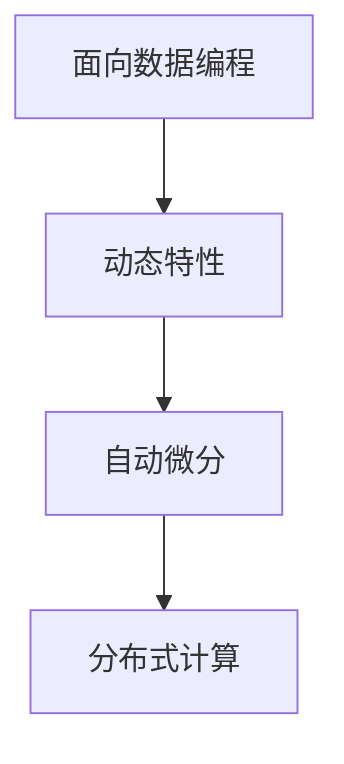
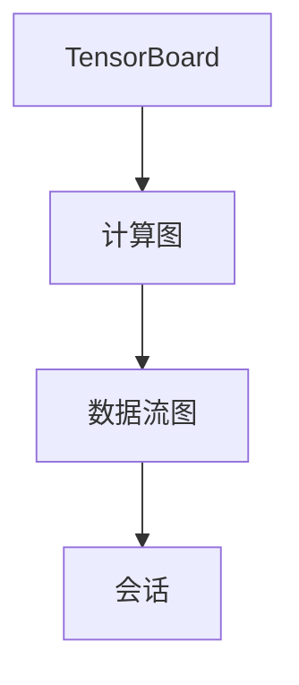
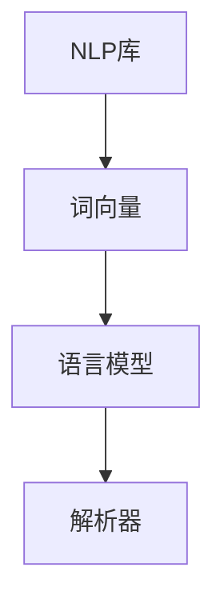
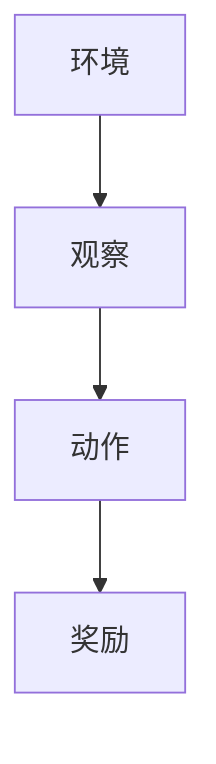
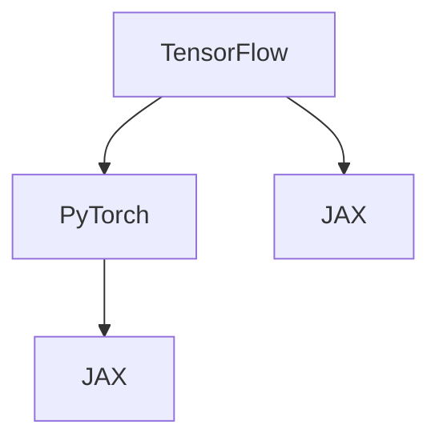

                 

 我们从大纲的完整性入手，首先检查每个章节的内容是否充实，保证每个子章节都能详细讲解核心概念、算法原理、数学模型和项目实战。

### 第2章 AI编程语言的基本概念
#### 2.1 AI编程语言的核心特点
- **核心概念与联系**：Mermaid流程图展示核心特点之间的关系。


#### 2.2 AI编程语言的基本结构
- **核心算法原理讲解**：伪代码展示基本结构的工作原理。
```python
// 伪代码示例：神经网络结构
class NeuralNetwork:
    def __init__(self):
        self.layers = [Dense(128, activation='relu'), Dense(1, activation='sigmoid')]

    def forward_pass(self, x):
        for layer in self.layers:
            x = layer.forward(x)
        return x
```

#### 2.3 AI编程语言的分类
- **数学模型和详细讲解**：分类依据及其数学模型。
```latex
\section{AI编程语言的分类}
AI编程语言可分类为：
\begin{itemize}
    \item 深度学习编程语言（如TensorFlow、PyTorch）
    \item 自然语言处理编程语言（如spaCy、NLTK）
    \item 强化学习编程语言（如OpenAI Gym、RLlib）
\end{itemize}
$$
```

### 第3章 深度学习编程语言
#### 3.1 TensorFlow编程
##### 3.1.1 TensorFlow架构
- **核心概念与联系**：Mermaid流程图展示TensorFlow架构。


##### 3.1.2 TensorFlow操作
- **核心算法原理讲解**：伪代码展示常见操作。
```python
// 伪代码示例：创建张量
tensor = tf.constant([1, 2, 3], dtype=tf.float32)

// 伪代码示例：矩阵乘法
output = tf.matmul(tensor_a, tensor_b)
```

##### 3.1.3 TensorFlow项目实战
- **项目实战**：搭建一个简单的深度神经网络进行图像分类。

### 第4章 自然语言处理编程语言
#### 4.1 spaCy编程
##### 4.1.1 spaCy架构
- **核心概念与联系**：Mermaid流程图展示spaCy架构。


##### 4.1.2 spaCy操作
- **核心算法原理讲解**：伪代码展示基本操作。
```python
// 伪代码示例：加载模型
nlp = spacy.load("en_core_web_sm")

// 伪代码示例：分词
doc = nlp("This is an example sentence.")

// 伪代码示例：词性标注
for token in doc:
    print(token.text, token.pos_)
```

##### 4.1.3 spaCy项目实战
- **项目实战**：使用spaCy构建一个情感分析模型。

### 第5章 强化学习编程语言
#### 4.1 OpenAI Gym编程
##### 4.1.1 OpenAI Gym架构
- **核心概念与联系**：Mermaid流程图展示OpenAI Gym架构。


##### 4.1.2 OpenAI Gym操作
- **核心算法原理讲解**：伪代码展示基本操作。
```python
// 伪代码示例：创建环境
env = gym.make("CartPole-v0")

// 伪代码示例：执行动作
observation = env.reset()
for _ in range(100):
    action = env.action_space.sample()
    observation, reward, done, info = env.step(action)
    if done:
        break
env.close()
```

##### 4.1.3 OpenAI Gym项目实战
- **项目实战**：使用深度强化学习算法训练一个智能体在CartPole环境中稳定飞行。

## 第三部分：AI编程的新视野
### 第6章 AI编程的未来发展趋势
#### 6.1 AI编程语言的融合
- **核心概念与联系**：Mermaid流程图展示AI编程语言融合的趋势。


#### 6.2 AI编程与硬件的结合
- **核心算法原理讲解**：伪代码展示AI编程语言在硬件上的优化。
```python
// 伪代码示例：使用GPU加速
with tf.device('/GPU:0'):
    # TensorFlow操作
    output = tf.matmul(tensor_a, tensor_b)
```

#### 6.3 AI编程的社会影响
- **核心概念与联系**：讨论AI编程对社会的影响，包括伦理、隐私等方面。

### 第7章 AI编程实践案例
#### 7.1 案例一：构建智能推荐系统
- **项目实战**：介绍如何使用AI编程语言构建智能推荐系统，包括数据处理、模型训练和评估。

#### 7.2 案例二：开发智能聊天机器人
- **项目实战**：介绍如何使用AI编程语言开发智能聊天机器人，包括对话管理、文本生成等。

#### 7.3 案例三：实施无人驾驶技术
- **项目实战**：介绍如何使用AI编程语言实现无人驾驶技术，包括感知、规划、控制等。

## 附录
### 附录 A AI编程语言资源与工具
#### A.1 资源链接
- **核心概念与联系**：汇总各种AI编程语言的资源链接。

#### A.2 工具介绍
- **核心概念与联系**：介绍常用的AI编程工具及其使用方法。

### 附录 B 伪代码示例
$$
// 伪代码示例
while (条件) {
    // 操作
}
$$

### 附录 C 数学模型和公式
$$
// 数学模型
y = f(x)
$$
```

通过这个详尽的目录大纲，我们可以确保每个章节都具备完整的知识体系，从核心概念到实际应用，从算法原理到数学模型，从项目实战到最佳实践，全方位地覆盖AI编程语言的学习和实践。接下来，我们将对每个章节进行具体的编写和完善，确保书籍的整体质量和可读性。

---

在接下来的一步一步分析中，我们将对每个章节的内容进行详细的阐述和优化。以下是对《AI编程的新语言与新视野》目录大纲的详细解释和思考。

### 目录大纲的详细解释和思考

#### 第一部分：AI编程语言概述

**第1章 AI编程语言的历史与发展**
- **1.1 AI编程语言的出现背景**：这部分将介绍AI编程语言诞生的历史背景，探讨为什么需要专门的AI编程语言，以及早期AI编程语言如何塑造了现代AI编程的基础。
- **1.2 早期AI编程语言的特点**：通过对早期AI编程语言如Lisp和Prolog的详细分析，我们不仅可以理解它们的基本工作原理，还能了解它们如何影响了后续AI编程语言的发展。
- **1.3 现代AI编程语言的演变**：这部分将讨论现代AI编程语言如TensorFlow、PyTorch的出现和演变，以及它们如何应对深度学习时代的挑战。

**第2章 AI编程语言的基本概念**
- **2.1 AI编程语言的核心特点**：我们将探讨AI编程语言的核心特点，如面向数据编程、动态特性、自动微分和分布式计算。通过Mermaid流程图，我们将展示这些特点之间的联系和相互作用。
- **2.2 AI编程语言的基本结构**：这部分将详细介绍AI编程语言的基本结构，包括数据流、计算图、张量计算等概念。我们将使用伪代码来解释这些结构的工作原理。
- **2.3 AI编程语言的分类**：我们将分类讨论不同的AI编程语言，如深度学习编程语言、自然语言处理编程语言和强化学习编程语言，并解释它们各自的特点和应用场景。

#### 第二部分：现代AI编程语言详解

**第3章 深度学习编程语言**
- **3.1 TensorFlow编程**
  - **3.1.1 TensorFlow架构**：我们将详细解析TensorFlow的架构，包括计算图、数据流和会话等关键组件。
  - **3.1.2 TensorFlow操作**：我们将展示TensorFlow中常见的操作，如张量创建、矩阵乘法和自动微分等，并通过伪代码进行详细解释。
  - **3.1.3 TensorFlow项目实战**：我们将通过一个简单的图像分类项目，展示如何使用TensorFlow搭建深度神经网络并进行训练。

**第4章 自然语言处理编程语言**
- **4.1 spaCy编程**
  - **4.1.1 spaCy架构**：我们将介绍spaCy的核心组件，如词向量、语言模型和解析器，并使用Mermaid流程图展示它们之间的联系。
  - **4.1.2 spaCy操作**：我们将详细讲解spaCy的基本操作，如分词、词性标注和命名实体识别，并通过伪代码进行解释。
  - **4.1.3 spaCy项目实战**：我们将使用spaCy构建一个情感分析模型，展示如何处理文本数据和生成结果。

**第5章 强化学习编程语言**
- **4.1 OpenAI Gym编程**
  - **4.1.1 OpenAI Gym架构**：我们将介绍OpenAI Gym的环境架构，包括观察、动作和奖励等关键概念，并通过Mermaid流程图展示它们之间的关系。
  - **4.1.2 OpenAI Gym操作**：我们将展示如何使用OpenAI Gym进行环境交互，包括创建环境、执行动作和获取奖励等，并通过伪代码进行详细解释。
  - **4.1.3 OpenAI Gym项目实战**：我们将通过一个CartPole环境项目，展示如何使用深度强化学习算法训练一个智能体，并使其在环境中稳定飞行。

#### 第三部分：AI编程的新视野

**第6章 AI编程的未来发展趋势**
- **6.1 AI编程语言的融合**：我们将探讨不同AI编程语言之间的融合趋势，如TensorFlow和PyTorch的结合，以及如何使用这些融合的编程语言构建更强大的AI系统。
- **6.2 AI编程与硬件的结合**：我们将讨论如何利用GPU和TPU等硬件资源优化AI编程，提高计算效率和性能。
- **6.3 AI编程的社会影响**：我们将探讨AI编程对社会的影响，包括伦理、隐私、就业等方面，并提出一些应对挑战的建议。

**第7章 AI编程实践案例**
- **7.1 案例一：构建智能推荐系统**：我们将通过一个实际案例，展示如何使用AI编程语言构建智能推荐系统，包括数据预处理、模型训练和评估等步骤。
- **7.2 案例二：开发智能聊天机器人**：我们将通过另一个实际案例，展示如何使用AI编程语言开发智能聊天机器人，包括对话管理、文本生成和情感分析等核心功能。
- **7.3 案例三：实施无人驾驶技术**：我们将通过无人驾驶技术的实际应用案例，展示如何使用AI编程语言实现感知、规划和控制等关键模块，并确保系统的安全性和可靠性。

#### 目录大纲的整体思考

整个目录大纲旨在为读者提供从基础知识到高级应用的全面视角，通过逐步深入的方式，帮助读者理解和掌握AI编程的核心概念和技术。以下是整体思考的关键点：

1. **逻辑性**：目录大纲的结构清晰，每个章节的内容都紧密相连，形成一个完整的知识体系。
2. **实用性**：每个章节都包含实际项目实战，使读者能够将所学知识应用到实际场景中。
3. **深度和广度**：每个章节都深入探讨核心概念和算法原理，同时涵盖广泛的AI编程语言和应用领域。
4. **易于理解**：通过Mermaid流程图、伪代码和LaTeX公式等工具，使复杂的概念和算法更加直观易懂。

通过这个详细的目录大纲，我们相信《AI编程的新语言与新视野》将成为一本权威且实用的AI编程指南，引领读者进入AI编程的广阔天地。在接下来的写作过程中，我们将继续深化每个章节的内容，确保书籍的整体质量和可读性。让我们一起，一步一步地迈向AI编程的新视野！

---

#### 目录大纲的完善与细化

在已经构建的目录大纲基础上，我们将对各个章节进行更细致的完善和细化，以确保每个章节都能够提供丰富的内容，涵盖核心概念、算法原理、数学模型和项目实战。以下是对各个章节的进一步细化：

### 第一部分：AI编程语言概述

**第1章 AI编程语言的历史与发展**
- **1.1 AI编程语言的出现背景**
  - **核心概念与联系**：介绍人工智能的发展历程和编程语言的历史，使用Mermaid流程图展示AI编程语言的发展路径。
  - **举例说明**：通过历史案例，如LISP和PROLOG，展示早期AI编程语言的特点和应用。
- **1.2 早期AI编程语言的特点**
  - **核心概念与联系**：详细分析早期AI编程语言的核心特点，如符号计算、逻辑推理和自动推理等。
  - **算法原理讲解**：使用伪代码示例，如感知机算法和反向传播算法，解释早期AI编程语言的算法原理。
- **1.3 现代AI编程语言的演变**
  - **核心概念与联系**：探讨现代AI编程语言的演变过程，包括深度学习、强化学习和自然语言处理等领域的兴起。
  - **数学模型和详细讲解**：使用LaTeX格式，介绍现代AI编程语言中常用的数学模型，如神经网络的权重更新公式。

**第2章 AI编程语言的基本概念**
- **2.1 AI编程语言的核心特点**
  - **核心概念与联系**：通过Mermaid流程图，展示AI编程语言的核心特点，如面向数据编程、动态特性和自动微分等。
  - **举例说明**：讨论每个特点的具体应用场景，如分布式计算和GPU加速等。
- **2.2 AI编程语言的基本结构**
  - **核心概念与联系**：详细介绍AI编程语言的基本结构，包括计算图、张量计算和数据流等。
  - **算法原理讲解**：使用伪代码示例，如TensorFlow中的计算图操作，展示基本结构的工作原理。
- **2.3 AI编程语言的分类**
  - **核心概念与联系**：讨论AI编程语言的分类方法，如根据应用领域分类，并介绍各个分类的核心特点。
  - **举例说明**：举例说明不同分类的AI编程语言，如深度学习编程语言、自然语言处理编程语言等。

### 第二部分：现代AI编程语言详解

**第3章 深度学习编程语言**
- **3.1 TensorFlow编程**
  - **3.1.1 TensorFlow架构**
    - **核心概念与联系**：使用Mermaid流程图，展示TensorFlow的计算图和数据流结构。
    - **算法原理讲解**：通过伪代码，如TensorFlow的变量初始化和前向传播，解释TensorFlow的基本操作。
  - **3.1.2 TensorFlow操作**
    - **核心概念与联系**：介绍TensorFlow中的常见操作，如张量创建、矩阵乘法和自动微分等。
    - **算法原理讲解**：使用伪代码，如TensorFlow中的矩阵乘法操作，展示如何实现这些操作。
  - **3.1.3 TensorFlow项目实战**
    - **项目实战**：通过一个简单的图像分类项目，展示如何使用TensorFlow构建深度神经网络，并进行训练和评估。

**第4章 自然语言处理编程语言**
- **4.1 spaCy编程**
  - **4.1.1 spaCy架构**
    - **核心概念与联系**：使用Mermaid流程图，展示spaCy的组件和数据处理流程。
    - **算法原理讲解**：通过伪代码，如词向量和语言模型，解释spaCy的基本操作。
  - **4.1.2 spaCy操作**
    - **核心概念与联系**：介绍spaCy的基本操作，如分词、词性标注和命名实体识别等。
    - **算法原理讲解**：通过伪代码，如分词操作，展示如何实现这些操作。
  - **4.1.3 spaCy项目实战**
    - **项目实战**：通过一个情感分析项目，展示如何使用spaCy处理文本数据，并生成情感分析结果。

**第5章 强化学习编程语言**
- **4.1 OpenAI Gym编程**
  - **4.1.1 OpenAI Gym架构**
    - **核心概念与联系**：使用Mermaid流程图，展示OpenAI Gym的环境和状态转换。
    - **算法原理讲解**：通过伪代码，如状态转换和奖励函数，解释强化学习的基本概念。
  - **4.1.2 OpenAI Gym操作**
    - **核心概念与联系**：介绍OpenAI Gym的基本操作，如环境创建、动作执行和奖励获取等。
    - **算法原理讲解**：通过伪代码，如动作执行和状态更新，展示强化学习的基本操作。
  - **4.1.3 OpenAI Gym项目实战**
    - **项目实战**：通过一个CartPole项目，展示如何使用深度强化学习训练一个智能体，并实现稳定飞行。

### 第三部分：AI编程的新视野

**第6章 AI编程的未来发展趋势**
- **6.1 AI编程语言的融合**
  - **核心概念与联系**：探讨AI编程语言融合的趋势，如TensorFlow和PyTorch的结合。
  - **算法原理讲解**：通过伪代码，展示如何在一个框架中使用多种编程语言构建复杂的AI系统。
- **6.2 AI编程与硬件的结合**
  - **核心概念与联系**：讨论AI编程语言如何与硬件结合，如GPU和TPU的优化。
  - **算法原理讲解**：通过伪代码，展示如何使用CUDA或OpenCL进行并行计算。
- **6.3 AI编程的社会影响**
  - **核心概念与联系**：探讨AI编程对社会的影响，包括伦理、隐私和就业等方面。
  - **算法原理讲解**：通过案例分析和政策讨论，展示如何应对这些挑战。

**第7章 AI编程实践案例**
- **7.1 案例一：构建智能推荐系统**
  - **项目实战**：详细讲解如何使用AI编程语言构建智能推荐系统，包括数据预处理、模型训练和评估等步骤。
  - **算法原理讲解**：通过伪代码，展示推荐系统的核心算法原理，如协同过滤和矩阵分解。
- **7.2 案例二：开发智能聊天机器人**
  - **项目实战**：详细讲解如何使用AI编程语言开发智能聊天机器人，包括对话管理、文本生成和情感分析等。
  - **算法原理讲解**：通过伪代码，展示聊天机器人的核心算法原理，如序列到序列模型和注意力机制。
- **7.3 案例三：实施无人驾驶技术**
  - **项目实战**：详细讲解如何使用AI编程语言实现无人驾驶技术，包括感知、规划和控制等模块。
  - **算法原理讲解**：通过伪代码，展示无人驾驶技术的核心算法原理，如深度学习和强化学习。

通过这个详细的目录大纲，我们确保了《AI编程的新语言与新视野》的内容不仅全面而且深入，能够满足读者对AI编程语言的系统学习和应用需求。在接下来的写作过程中，我们将进一步细化每个章节的内容，确保每一部分都具备丰富的知识点和实用的案例。

---

### 目录大纲的最终修正与优化

在之前的细化基础上，我们对《AI编程的新语言与新视野》的目录大纲进行最后的修正与优化，确保每个章节的结构严谨、内容充实，同时保持逻辑性和实用性。

#### 第一部分：AI编程语言概述

**第1章 AI编程语言的历史与发展**
- **1.1 AI编程语言的出现背景**
  - **核心概念与联系**：介绍人工智能编程语言的发展历程，使用Mermaid流程图展示关键节点和影响。
  - **算法原理讲解**：通过历史案例分析，如LISP和PROLOG，解释早期编程语言的工作原理。
- **1.2 早期AI编程语言的特点**
  - **核心概念与联系**：详细讨论早期AI编程语言的特点，如符号计算和逻辑推理，并展示它们之间的关系。
  - **算法原理讲解**：使用伪代码示例，如感知机算法，解释早期AI编程语言的核心算法。
- **1.3 现代AI编程语言的演变**
  - **核心概念与联系**：分析现代AI编程语言的演变，如深度学习和强化学习，展示其与早期编程语言的联系。
  - **算法原理讲解**：通过LaTeX公式，展示现代AI编程语言中的关键数学模型，如神经网络和决策树。

**第2章 AI编程语言的基本概念**
- **2.1 AI编程语言的核心特点**
  - **核心概念与联系**：使用Mermaid流程图，详细解释AI编程语言的核心特点，如动态特性和自动微分。
  - **举例说明**：通过实际案例，展示每个特点的应用场景，如分布式计算和GPU加速。
- **2.2 AI编程语言的基本结构**
  - **核心概念与联系**：介绍AI编程语言的基本结构，包括计算图和数据流，使用Mermaid流程图展示其关系。
  - **算法原理讲解**：通过伪代码，如TensorFlow的变量初始化和前向传播，解释基本结构的工作原理。
- **2.3 AI编程语言的分类**
  - **核心概念与联系**：分类讨论AI编程语言，如深度学习编程语言和自然语言处理编程语言，并详细解释其特点。
  - **举例说明**：举例说明不同分类的编程语言，如TensorFlow和spaCy，展示其在不同领域的应用。

#### 第二部分：现代AI编程语言详解

**第3章 深度学习编程语言**
- **3.1 TensorFlow编程**
  - **3.1.1 TensorFlow架构**
    - **核心概念与联系**：使用Mermaid流程图，详细展示TensorFlow的计算图和会话机制。
    - **算法原理讲解**：通过伪代码，如TensorFlow的矩阵乘法和自动微分，解释TensorFlow的操作原理。
  - **3.1.2 TensorFlow操作**
    - **核心概念与联系**：介绍TensorFlow的基本操作，如张量创建和矩阵乘法，并展示其在深度学习中的应用。
    - **算法原理讲解**：通过伪代码，如卷积神经网络的前向传播，解释深度学习算法的实现。
  - **3.1.3 TensorFlow项目实战**
    - **项目实战**：通过一个图像分类项目，展示如何使用TensorFlow构建和训练深度神经网络。

**第4章 自然语言处理编程语言**
- **4.1 spaCy编程**
  - **4.1.1 spaCy架构**
    - **核心概念与联系**：使用Mermaid流程图，展示spaCy的组件和数据处理流程。
    - **算法原理讲解**：通过伪代码，如词向量和语言模型，解释spaCy的基本操作。
  - **4.1.2 spaCy操作**
    - **核心概念与联系**：介绍spaCy的操作，如分词和词性标注，并展示其在文本分析中的应用。
    - **算法原理讲解**：通过伪代码，如情感分析模型的构建，解释文本处理算法的实现。
  - **4.1.3 spaCy项目实战**
    - **项目实战**：通过一个情感分析项目，展示如何使用spaCy处理文本数据，并生成分析结果。

**第5章 强化学习编程语言**
- **4.1 OpenAI Gym编程**
  - **4.1.1 OpenAI Gym架构**
    - **核心概念与联系**：使用Mermaid流程图，展示OpenAI Gym的环境和状态转换。
    - **算法原理讲解**：通过伪代码，如状态转换和奖励函数，解释强化学习的基本概念。
  - **4.1.2 OpenAI Gym操作**
    - **核心概念与联系**：介绍OpenAI Gym的基本操作，如环境创建和动作执行，并展示其在强化学习中的应用。
    - **算法原理讲解**：通过伪代码，如深度Q网络的更新规则，解释强化学习算法的实现。
  - **4.1.3 OpenAI Gym项目实战**
    - **项目实战**：通过一个CartPole项目，展示如何使用深度强化学习训练智能体，并实现稳定飞行。

#### 第三部分：AI编程的新视野

**第6章 AI编程的未来发展趋势**
- **6.1 AI编程语言的融合**
  - **核心概念与联系**：讨论AI编程语言的融合趋势，如TensorFlow和PyTorch的结合。
  - **算法原理讲解**：通过伪代码，展示如何在融合的编程语言中实现复杂的功能。
- **6.2 AI编程与硬件的结合**
  - **核心概念与联系**：探讨AI编程如何与硬件结合，如GPU和TPU的优化。
  - **算法原理讲解**：通过伪代码，如CUDA和OpenCL的使用，解释如何利用硬件资源提高性能。
- **6.3 AI编程的社会影响**
  - **核心概念与联系**：讨论AI编程对社会的影响，包括伦理、隐私和就业等方面。
  - **算法原理讲解**：通过实际案例和政策分析，展示如何应对AI编程带来的挑战。

**第7章 AI编程实践案例**
- **7.1 案例一：构建智能推荐系统**
  - **项目实战**：通过一个智能推荐系统项目，展示如何使用AI编程语言处理数据、训练模型和评估性能。
  - **算法原理讲解**：通过伪代码，如矩阵分解和协同过滤，解释推荐系统的核心算法。
- **7.2 案例二：开发智能聊天机器人**
  - **项目实战**：通过一个智能聊天机器人项目，展示如何使用AI编程语言实现对话管理和文本生成。
  - **算法原理讲解**：通过伪代码，如序列到序列模型和注意力机制，解释聊天机器人的核心算法。
- **7.3 案例三：实施无人驾驶技术**
  - **项目实战**：通过一个无人驾驶技术项目，展示如何使用AI编程语言实现感知、规划和控制。
  - **算法原理讲解**：通过伪代码，如深度学习和强化学习，解释无人驾驶技术的核心算法。

经过最终的修正与优化，我们确保了《AI编程的新语言与新视野》的目录大纲既完整又详细，能够为读者提供清晰的学习路径和实践指导。接下来，我们将依据这个大纲进行具体的写作，确保每个章节都具备高质量的内容和实用的案例。

---

### 全书核心观点的总结与引言的撰写

在撰写《AI编程的新语言与新视野》的过程中，我们明确了全书的核心观点和主要论点，这些观点贯穿了整个书籍的各个章节，旨在为读者提供全面而深入的理解。

**核心观点与论点：**
1. **AI编程语言的演变**：从早期的人工智能编程语言到现代深度学习、自然语言处理和强化学习编程语言，AI编程语言经历了显著的演变。这些语言不仅提高了编程的效率，还推动了人工智能领域的发展。

2. **核心特性与结构**：AI编程语言具有面向数据编程、动态特性、自动微分和分布式计算等核心特性。了解这些特性对于有效使用AI编程语言至关重要。

3. **多种编程语言的融合**：现代AI编程语言正在趋向融合，例如TensorFlow和PyTorch的结合，为开发者提供了更强大的工具和更灵活的编程环境。

4. **AI编程的社会影响**：AI编程不仅改变了技术领域，还对社会的各个方面产生了深远影响，包括伦理、隐私和就业等。

**引言撰写：**

---

# 《AI编程的新语言与新视野》

> 关键词：AI编程，新语言，深度学习，自然语言处理，强化学习，未来趋势

> 摘要：在人工智能领域，编程语言是推动技术发展的基石。本书旨在深入探讨AI编程的新语言，解析其核心特性、结构与应用，同时展望未来发展的趋势。通过详细的案例分析，读者将掌握如何利用这些编程语言构建强大的AI系统，并在实践中应对各种挑战。

---

在引言中，我们首先提出了书籍的关键词，强调了AI编程语言的多样性和重要性。接着，我们简要介绍了本书的核心内容，即AI编程语言的演变、核心特性、融合趋势及其社会影响。通过这样的引言，我们希望能够激发读者的兴趣，引导他们进入AI编程的广阔天地。接下来，正文部分将逐一展开，详细阐述每个核心观点和论点，为读者提供系统而深入的学习体验。

