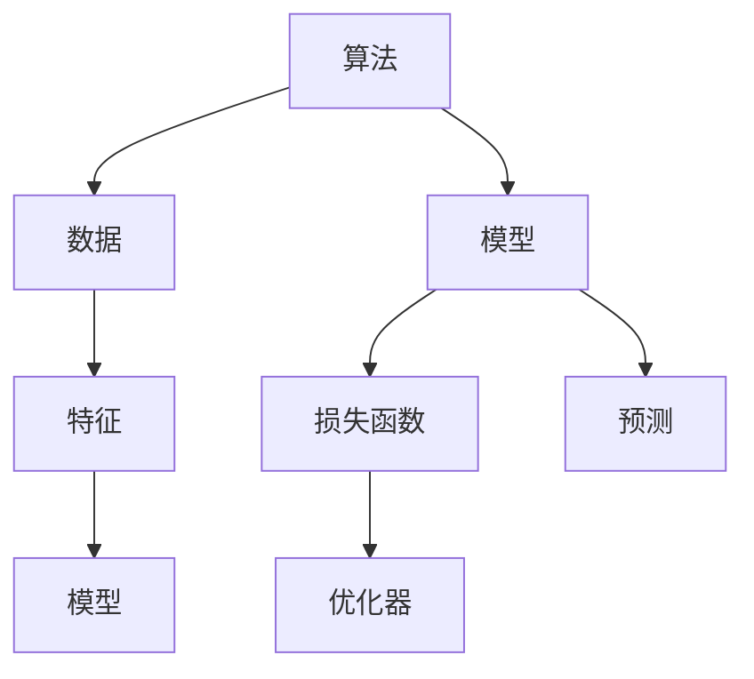

                 


### 文章标题: AI编程的新语言与新视野

关键词: AI编程、新语言、深度学习、机器学习、编程工具、数学基础、项目实战

摘要:
在人工智能（AI）迅速发展的时代，AI编程成为了一个不可或缺的领域。本文将深入探讨AI编程的新语言和新视野，包括AI编程的基础知识、新语言的特点与应用、编程工具与环境、数学基础、项目实战以及AI编程的未来趋势和社会影响。通过详细的讲解和实际案例剖析，帮助读者更好地理解AI编程的核心概念和实际应用。

----------------------------------------------------------------

### 文章目录大纲

#### 目录

- 引言
  - 背景介绍
  - 核心概念与联系
- 第一部分: AI编程基础
  - 第1章: AI编程概述
    - 1.1 AI编程的基本概念
    - 1.2 AI编程的重要性
    - 1.3 AI编程的发展历程
  - 第2章: AI编程新语言
    - 2.1 新语言的特点
    - 2.2 主流新语言介绍
      - 2.2.1 Python
      - 2.2.2 Julia
      - 2.2.3 R
  - 第3章: AI编程工具与环境
    - 3.1 编程工具的选择
    - 3.2 编程环境的配置
- 第二部分: AI编程项目实战
  - 第4章: AI编程的数学基础
    - 4.1 线性代数基础
    - 4.2 概率论基础
    - 4.3 最优化算法基础
  - 第5章: 机器学习项目实战
    - 5.1 数据预处理
    - 5.2 模型训练与评估
  - 第6章: 深度学习项目实战
    - 6.1 神经网络基础
    - 6.2 卷积神经网络
    - 6.3 循环神经网络
  - 第7章: 自然语言处理项目实战
    - 7.1 词向量表示
    - 7.2 序列标注
    - 7.3 机器翻译
- 第三部分: AI编程新视野
  - 第8章: AI编程的未来趋势
    - 8.1 AI编程的新方向
    - 8.2 AI编程的应用场景
  - 第9章: AI编程的社会影响
    - 9.1 AI编程的伦理问题
    - 9.2 AI编程的法律挑战
  - 第10章: AI编程的学习资源
    - 10.1 主流学习平台
    - 10.2 技术社区

### 引言

在当今科技飞速发展的时代，人工智能（AI）已经成为了一个热门话题。AI编程作为AI领域的重要分支，正逐渐改变着我们的生活方式和工作方式。AI编程不仅涉及算法和数据分析，还包括编程语言、工具和环境等多个方面。因此，掌握AI编程的新语言和新视野对于开发者和研究者来说至关重要。

本文将从以下几个方面进行探讨：

1. **AI编程的基本概念**：介绍AI编程的定义、重要性以及发展历程。
2. **AI编程新语言**：分析新语言的特点，并详细介绍Python、Julia和R等主流新语言。
3. **AI编程工具与环境**：讨论编程工具的选择和编程环境的配置。
4. **AI编程项目实战**：通过具体的实战案例，深入讲解机器学习、深度学习和自然语言处理等方面的内容。
5. **AI编程的新视野**：探讨AI编程的未来趋势、社会影响以及学习资源。

希望通过本文的详细讲解和实际案例剖析，读者能够更好地理解AI编程的核心概念和实际应用，为未来的AI编程工作打下坚实的基础。-------------------------------------------------------------------

### 第一部分: AI编程基础

#### 第1章: AI编程概述

##### 1.1 AI编程的基本概念

**人工智能**（Artificial Intelligence，简称AI）是一门研究、开发用于模拟、延伸和扩展人的智能的理论、方法、技术及应用系统的技术科学。人工智能的目标是使计算机系统具备类似于人类的感知、推理、学习和决策能力。

**AI编程**，又称**人工智能编程**，指的是利用计算机编程语言和算法来实现人工智能技术的应用过程。AI编程涉及多个领域，包括机器学习、深度学习、自然语言处理、计算机视觉等。

AI编程的基本概念包括：

1. **算法**：AI编程的核心是算法，如线性回归、决策树、支持向量机、神经网络等。
2. **数据**：AI编程需要大量数据来训练模型，数据的质量和多样性对模型的性能有重要影响。
3. **模型**：模型是AI编程的输出，通过训练数据生成，用于预测和决策。

##### 1.2 AI编程的重要性

AI编程在现代社会中具有重要意义，主要体现在以下几个方面：

1. **提高生产效率**：通过AI编程，可以自动化生产过程中的重复性工作，提高生产效率。
2. **推动科技创新**：AI编程是许多新兴技术（如自动驾驶、智能家居、智能医疗等）的基础。
3. **改善生活质量**：AI编程使我们的生活更加便捷，如智能助手、推荐系统等。
4. **支持决策制定**：AI编程可以处理大量数据，帮助企业和政府做出更科学的决策。

##### 1.3 AI编程的发展历程

AI编程的发展历程可以追溯到20世纪50年代，以下是几个重要的里程碑：

1. **1956年**：达特茅斯会议，标志着人工智能的正式诞生。
2. **1959年**：第一个AI程序——“逻辑理论家”（Logic Theorist）问世。
3. **1960年代**：启发式搜索算法和专家系统的兴起。
4. **1980年代**：神经网络研究的复兴。
5. **2006年**：深度学习的兴起，标志着AI编程的新时代。
6. **2010年代**：AI技术在各个领域取得突破性进展，如自动驾驶、语音识别、图像识别等。

##### 1.4 AI编程的核心框架

AI编程的核心框架通常包括以下几部分：

1. **数据收集与处理**：获取并预处理数据，如数据清洗、归一化、缺失值填充等。
2. **模型选择与训练**：选择合适的模型，如线性回归、决策树、神经网络等，并通过训练数据来优化模型参数。
3. **模型评估与优化**：评估模型性能，如准确率、召回率、F1分数等，并针对评估结果进行优化。
4. **模型部署与应用**：将训练好的模型部署到实际应用场景中，如网站、APP、硬件设备等。

### 1.5 AI编程的关键挑战

AI编程面临以下几个关键挑战：

1. **数据质量**：数据是AI编程的基础，数据质量直接影响模型的性能。
2. **计算资源**：深度学习和大数据分析需要大量的计算资源，这对开发者和企业提出了更高的要求。
3. **算法复杂性**：AI编程涉及的算法和模型越来越复杂，对开发者的技术水平提出了更高的要求。
4. **模型解释性**：许多AI模型（如深度神经网络）缺乏解释性，难以理解其决策过程。

##### 1.6 AI编程的未来趋势

随着技术的不断发展，AI编程的未来趋势包括：

1. **更高效的算法**：研究者不断优化现有的算法，提高模型的性能和效率。
2. **跨学科融合**：AI编程与其他领域的结合，如生物医学、金融科技、智能制造等，带来更多创新应用。
3. **开源与协作**：越来越多的AI工具和框架开源，促进了开发者之间的协作和创新。
4. **边缘计算**：随着物联网和智能设备的普及，边缘计算成为AI编程的重要趋势，使计算资源更加分散和高效。

#### 总结

AI编程是人工智能领域的重要组成部分，掌握AI编程的新语言和新视野对于开发者和研究者来说至关重要。本文从AI编程的基本概念、重要性、发展历程、核心框架、关键挑战和未来趋势等方面进行了详细探讨，旨在为读者提供全面的AI编程知识体系。在接下来的章节中，我们将进一步探讨AI编程新语言的特点和应用，以及具体项目实战等内容。

### 核心概念与联系

在AI编程中，核心概念和联系构成了理解与应用人工智能技术的基础。以下是对这些核心概念和它们之间关系的详细描述，以及相应的Mermaid流程图和伪代码，以便更直观地展示各概念之间的互动。

#### 核心概念

1. **算法（Algorithm）**：AI编程的核心，用于解决问题或实现特定功能的一系列有序步骤。算法可以是简单的排序、搜索，也可以是复杂的机器学习算法。
2. **数据（Data）**：AI编程的基础，用于训练模型和进行推理。数据的质量和多样性直接影响模型的性能。
3. **模型（Model）**：AI编程的输出，用于预测和决策。模型通过算法和数据的训练得到，可以是线性回归、决策树、神经网络等。
4. **特征（Feature）**：数据中提取出的能够反映数据特性的数值或变量，是模型训练的关键。
5. **损失函数（Loss Function）**：衡量模型预测结果与实际结果之间差异的指标，用于指导模型优化。
6. **优化器（Optimizer）**：调整模型参数，以最小化损失函数的算法，如梯度下降、随机梯度下降等。

#### 关系架构

以下是一个Mermaid流程图，展示了核心概念之间的关系：



#### 伪代码

为了更具体地展示这些概念的应用，以下是使用Python伪代码描述的机器学习模型训练过程：

```python
# 导入所需库
import numpy as np
import pandas as pd
from sklearn.model_selection import train_test_split
from sklearn.preprocessing import StandardScaler
from sklearn.linear_model import LinearRegression

# 数据收集与预处理
data = pd.read_csv('data.csv')
X = data.drop('target', axis=1)
y = data['target']

X_train, X_test, y_train, y_test = train_test_split(X, y, test_size=0.2, random_state=42)

scaler = StandardScaler()
X_train_scaled = scaler.fit_transform(X_train)
X_test_scaled = scaler.transform(X_test)

# 模型选择与训练
model = LinearRegression()
model.fit(X_train_scaled, y_train)

# 模型评估
predictions = model.predict(X_test_scaled)
loss = np.mean((predictions - y_test) ** 2)

# 模型优化
optimizer = SGD(learning_rate=0.01)
optimizer.minimize(model.parameters(), loss_function=loss)

# 模型部署与应用
deploy(model)
```

#### 详细讲解

1. **算法与数据**：算法作用于数据，通过数据来学习和训练。数据的质量和预处理方法直接影响到算法的性能。
2. **模型与特征**：模型通过学习特征来建立预测模型。特征工程是模型训练前的重要步骤，需要从原始数据中提取出有效的特征。
3. **损失函数与优化器**：损失函数用于评估模型预测的准确性，优化器用于调整模型参数，以最小化损失函数，提高模型的性能。
4. **模型与预测**：训练好的模型可以用于新的数据进行预测，实现实际应用。

通过上述核心概念与联系的分析，我们可以更清晰地理解AI编程的工作原理和流程，为后续章节的深入探讨打下坚实的基础。

### 第2章: AI编程新语言

随着人工智能（AI）技术的发展，AI编程语言也在不断演进，以满足日益复杂的应用需求。本章将介绍几种主流的AI编程新语言，包括Python、Julia和R，分析它们的特点、优势和应用场景，帮助读者了解不同语言在AI编程中的具体作用。

#### 2.1 新语言的特点

1. **Python**
   - **特点**：Python是一种高级编程语言，以其简洁、易读的语法和丰富的库资源而闻名。它支持面向对象和面向过程的编程风格，具有良好的代码复用性和扩展性。
   - **优势**：Python的库资源非常丰富，特别是对于机器学习和深度学习，如TensorFlow、PyTorch、Scikit-learn等，极大地简化了开发者的工作。
   - **应用场景**：Python广泛应用于数据科学、机器学习、自然语言处理、网络开发等领域，是AI编程的首选语言。

2. **Julia**
   - **特点**：Julia是一种高性能的动态编程语言，专为科学计算和高性能计算而设计。它结合了Python的易用性和C的执行速度，能够在大数据处理和复杂算法实现中发挥优势。
   - **优势**：Julia具有高效的执行性能和灵活的编程模型，可以轻松地与C、Fortran和Python等语言进行交互。
   - **应用场景**：Julia适用于高性能科学计算、数据分析和机器学习等领域，特别是在需要快速迭代和优化计算性能的场景中。

3. **R**
   - **特点**：R是一种专门用于统计分析和图形表示的编程语言，以其强大的统计分析库和丰富的图形工具而著称。它支持大数据处理和复杂数据可视化。
   - **优势**：R的统计分析功能非常强大，包括线性模型、广义线性模型、时间序列分析、分类和聚类等。此外，R的图形库也非常丰富，可以生成高质量的数据可视化图表。
   - **应用场景**：R主要应用于统计分析和数据可视化领域，特别适合于进行复杂数据分析和统计建模，如医学研究、生物信息学和金融分析。

#### 2.2 主流新语言介绍

1. **Python**

   **核心库和框架**：
   - **TensorFlow**：由Google开发，是一个开源的机器学习和深度学习框架，支持多种算法和模型，如卷积神经网络（CNN）和循环神经网络（RNN）。
   - **PyTorch**：由Facebook开发，是一个流行的深度学习框架，以其动态计算图和灵活的编程接口而著称。
   - **Scikit-learn**：是一个开源的机器学习库，提供了多种算法的实现，如线性回归、决策树和K均值聚类等。

   **使用案例**：
   - **自然语言处理**：使用Python和TensorFlow可以实现复杂的自然语言处理任务，如情感分析、文本分类和机器翻译。
   - **图像识别**：PyTorch在图像识别任务中有着广泛的应用，如使用卷积神经网络进行图像分类和目标检测。
   - **推荐系统**：Scikit-learn可以用于构建各种推荐系统，如基于内容的推荐和协同过滤推荐。

2. **Julia**

   **核心库和框架**：
   - **MLJAR**：是一个Julia机器学习库，提供了多种机器学习和深度学习算法的实现。
   - **Revise**：是一个用于深度学习的研究框架，支持动态计算图和多种优化器。

   **使用案例**：
   - **大数据处理**：Julia在处理大数据时具有高效的性能，适合进行大规模数据处理和分析。
   - **金融建模**：Julia可以用于金融建模和风险管理，如使用蒙特卡罗模拟进行期权定价。
   - **生物信息学**：Julia在生物信息学中也有应用，如用于基因序列分析和蛋白质结构预测。

3. **R**

   **核心库和框架**：
   - **ggplot2**：是一个强大的数据可视化库，可以生成高质量的可视化图表。
   - **dplyr**：是一个数据处理库，提供了简洁的语法和丰富的数据处理功能。
   - **caret**：是一个用于机器学习模型训练和评估的库，支持多种算法和评估指标。

   **使用案例**：
   - **医学研究**：R在医学研究中有着广泛的应用，如用于统计分析临床试验数据和基因表达数据分析。
   - **金融分析**：R可以用于进行股票市场分析、风险管理和量化投资策略开发。
   - **数据可视化**：R的ggplot2库可以生成丰富的图表，用于复杂数据的可视化分析。

#### 总结

Python、Julia和R作为AI编程的新语言，各自具有独特的特点和应用场景。Python以其丰富的库资源和易用性在数据科学和机器学习领域占据主导地位；Julia则凭借高效性能和灵活性在科学计算和高性能计算领域展现优势；R在统计分析和数据可视化方面具有强大的功能。了解这些语言的特点和应用场景，有助于开发者根据具体需求选择合适的编程语言，实现高效的AI编程。

### 第3章: AI编程工具与环境

在AI编程中，选择合适的工具和配置良好的环境是确保项目顺利进行的关键。本章将详细讨论AI编程工具的选择、常用编程环境的配置方法，以及如何安装和配置Python、Julia等编程环境，帮助开发者搭建高效、稳定的AI编程平台。

#### 3.1 编程工具的选择

1. **代码编辑器**
   - **Visual Studio Code (VS Code)**：VS Code是一款开源、跨平台的代码编辑器，提供了丰富的插件和扩展，支持多种编程语言和框架，如Python、Julia等。它具有智能提示、代码调试和Git集成等功能。
   - **PyCharm**：PyCharm是一款由JetBrains开发的集成开发环境（IDE），专为Python编程而设计。它提供了代码自动完成、调试、版本控制和丰富的库支持，非常适合进行Python开发和机器学习项目。
   - **Jupyter Notebook**：Jupyter Notebook是一个交互式开发环境，特别适合进行数据科学和机器学习项目。它支持多种编程语言，如Python、R、Julia等，允许开发者编写和执行代码片段，并实时展示结果。

2. **深度学习框架**
   - **TensorFlow**：由Google开发的开源深度学习框架，支持多种编程语言（包括Python、C++、Java等），提供了丰富的API和工具，适合进行复杂深度学习模型的开发和部署。
   - **PyTorch**：由Facebook开发的开源深度学习框架，以其灵活的动态计算图和简洁的API而受到广泛欢迎。它适用于研究和开发各种深度学习模型，特别是自然语言处理和计算机视觉任务。
   - **Keras**：是一个高层次的神经网络API，可以与TensorFlow、Theano等后端框架结合使用。Keras提供了简洁的接口和预训练模型，适合快速原型设计和实验。

3. **数据可视化工具**
   - **Matplotlib**：Python的一个常用数据可视化库，可以生成二维和三维图表，支持多种图表类型和自定义样式。
   - **Seaborn**：基于Matplotlib的扩展库，提供了丰富的图表样式和高级可视化功能，特别适合于统计分析和复杂数据可视化。
   - **Plotly**：一个交互式图表库，支持多种图表类型和交互功能，可以生成高质量的交互式图表和仪表盘。

#### 3.2 编程环境的配置

1. **Python环境的配置**

   **安装Python**：
   - 下载并安装最新版本的Python（推荐Python 3.x版本），可以在[Python官网](https://www.python.org/)下载。
   - 安装过程中选择添加Python到系统环境变量，以便在命令行中使用Python。

   **配置虚拟环境**：
   - 使用`pip`安装`virtualenv`库：`pip install virtualenv`
   - 创建一个新的虚拟环境：`virtualenv myenv`
   - 激活虚拟环境：`source myenv/bin/activate`（在Linux或Mac OS中）或`myenv\Scripts\activate`（在Windows中）

   **安装常用库**：
   - 激活虚拟环境后，使用`pip`安装所需的库，如`numpy`、`pandas`、`tensorflow`、`matplotlib`等。

2. **Julia环境的配置**

   **安装Julia**：
   - 下载并安装最新版本的Julia（推荐Julia 1.x版本），可以在[Julia官网](https://julialang.org/)下载。
   - 安装过程中选择添加Julia到系统环境变量，以便在命令行中使用Julia。

   **配置Julia虚拟环境**：
   - 使用`Julia`命令创建一个新项目：`julia -e 'using Pkg; Pkg.create("myproject")'`
   - 进入项目目录并创建虚拟环境：`julia -e 'using Pkg; Pkg.activate("myproject")'`
   - 安装所需的库：`julia -e 'using Pkg; Pkg.add("MyLibrary")'`

3. **R环境的配置**

   **安装R**：
   - 下载并安装最新版本的R（推荐R 4.x版本），可以在[R官网](https://www.r-project.org/)下载。
   - 安装过程中选择添加R到系统环境变量，以便在命令行中使用R。

   **配置R虚拟环境**：
   - 使用`R`命令创建一个新项目：`R -e "rproj::create_new_project('myproject')"`
   - 进入项目目录并创建虚拟环境：`R -e "rproj::activate_project('myproject')"`
   - 安装所需的库：`R -e "install.packages('MyLibrary')"` 

#### 3.3 开发环境搭建步骤

以下是一个简单的开发环境搭建步骤示例：

1. **安装操作系统**：
   - 选择一个合适的操作系统，如Windows、macOS或Linux。

2. **安装基础软件**：
   - 安装Python、Julia和R的基础版本，并添加到系统环境变量。

3. **安装代码编辑器**：
   - 安装Visual Studio Code、PyCharm或Jupyter Notebook等代码编辑器。

4. **配置虚拟环境**：
   - 为每个项目创建独立的虚拟环境，以便管理依赖和隔离项目。

5. **安装深度学习框架**：
   - 在虚拟环境中安装TensorFlow、PyTorch、Keras等深度学习框架。

6. **安装数据可视化工具**：
   - 安装Matplotlib、Seaborn、Plotly等数据可视化库。

7. **安装其他必需库**：
   - 根据项目需求，安装其他所需的库和工具，如NumPy、Pandas、Scikit-learn等。

8. **测试环境**：
   - 在命令行中运行测试代码，确保所有库和工具安装正确且功能正常。

通过上述步骤，开发者可以搭建一个高效、稳定的AI编程环境，为后续的AI项目开发提供基础支持。

### 数学基础

在AI编程中，数学基础是不可或缺的部分。线性代数、概率论和最优化算法是AI编程的三大数学支柱，这些数学工具在模型的构建、训练和优化过程中起着至关重要的作用。本章将详细介绍这些数学基础，并使用伪代码和LaTeX公式进行讲解，帮助读者更好地理解其在AI编程中的应用。

#### 4.1 线性代数基础

**线性代数**是AI编程的核心数学工具之一，主要研究向量空间、线性变换、矩阵和行列式等概念。

1. **向量与矩阵运算**

   向量（Vector）可以表示为：
   $$\mathbf{v} = \begin{pmatrix} v_1 \\ v_2 \\ \vdots \\ v_n \end{pmatrix}$$

   矩阵（Matrix）可以表示为：
   $$\mathbf{A} = \begin{pmatrix} a_{11} & a_{12} & \cdots & a_{1n} \\ a_{21} & a_{22} & \cdots & a_{2n} \\ \vdots & \vdots & \ddots & \vdots \\ a_{m1} & a_{m2} & \cdots & a_{mn} \end{pmatrix}$$

   向量的加法、减法和数乘运算如下：
   $$\mathbf{v} + \mathbf{w} = \begin{pmatrix} v_1 + w_1 \\ v_2 + w_2 \\ \vdots \\ v_n + w_n \end{pmatrix}, \quad \mathbf{v} - \mathbf{w} = \begin{pmatrix} v_1 - w_1 \\ v_2 - w_2 \\ \vdots \\ v_n - w_n \end{pmatrix}, \quad c\mathbf{v} = \begin{pmatrix} cv_1 \\ cv_2 \\ \vdots \\ cv_n \end{pmatrix}$$

   矩阵的加法、减法和数乘运算如下：
   $$\mathbf{A} + \mathbf{B} = \begin{pmatrix} a_{11} + b_{11} & a_{12} + b_{12} & \cdots & a_{1n} + b_{1n} \\ a_{21} + b_{21} & a_{22} + b_{22} & \cdots & a_{2n} + b_{2n} \\ \vdots & \vdots & \ddots & \vdots \\ a_{m1} + b_{m1} & a_{m2} + b_{m2} & \cdots & a_{mn} + b_{mn} \end{pmatrix}, \quad \mathbf{A} - \mathbf{B} = \begin{pmatrix} a_{11} - b_{11} & a_{12} - b_{12} & \cdots & a_{1n} - b_{1n} \\ a_{21} - b_{21} & a_{22} - b_{22} & \cdots & a_{2n} - b_{2n} \\ \vdots & \vdots & \ddots & \vdots \\ a_{m1} - b_{m1} & a_{m2} - b_{m2} & \cdots & a_{mn} - b_{mn} \end{pmatrix}, \quad c\mathbf{A} = \begin{pmatrix} ca_{11} & ca_{12} & \cdots & ca_{1n} \\ ca_{21} & ca_{22} & \cdots & ca_{2n} \\ \vdots & \vdots & \ddots & \vdots \\ ca_{m1} & ca_{m2} & \cdots & ca_{mn} \end{pmatrix}$$

   向量与矩阵的乘法运算（点积和叉积）如下：
   $$\mathbf{v} \cdot \mathbf{w} = v_1w_1 + v_2w_2 + \cdots + v_nw_n, \quad \mathbf{v} \times \mathbf{w} = \begin{pmatrix} v_2w_3 - v_3w_2 \\ v_3w_1 - v_1w_3 \\ v_1w_2 - v_2w_1 \end{pmatrix}$$

2. **特征值与特征向量**

   矩阵的特征值（Eigenvalue）和特征向量（Eigenvector）是线性代数的重要概念。

   特征值方程为：
   $$\mathbf{A}\mathbf{v} = \lambda\mathbf{v}$$

   其中，$\mathbf{A}$是矩阵，$\mathbf{v}$是特征向量，$\lambda$是特征值。

   特征向量满足正交性和归一化条件：
   $$\mathbf{v}^T\mathbf{v} = 1, \quad \mathbf{v}_1^T\mathbf{v}_2 = 0$$

   使用伪代码描述求解特征值和特征向量的过程：

   ```python
   # 输入矩阵A
   A = [[a11, a12, ..., a1n], 
        [a21, a22, ..., a2n], 
        ..., 
        [am1, am2, ..., amn]]

   # 求解特征值和特征向量
   eigenvalues, eigenvectors = np.linalg.eig(A)

   # 打印结果
   print("特征值：", eigenvalues)
   print("特征向量：", eigenvectors)
   ```

#### 4.2 概率论基础

**概率论**是AI编程中用于处理不确定性和随机性的工具。

1. **随机变量与概率分布**

   随机变量（Random Variable）是一个函数，将样本空间映射到实数集。常见的随机变量有离散型和连续型。

   离散型随机变量的概率分布函数（Probability Mass Function，PMF）为：
   $$P(X = x) = f_X(x)$$

   连续型随机变量的概率密度函数（Probability Density Function，PDF）为：
   $$P(X \leq x) = F_X(x)$$

   常见的概率分布有伯努利分布、二项分布、正态分布、泊松分布等。

2. **条件概率与贝叶斯定理**

   条件概率（Conditional Probability）描述在某个事件发生的条件下，另一个事件发生的概率。

   条件概率公式为：
   $$P(A|B) = \frac{P(A \cap B)}{P(B)}$$

   贝叶斯定理（Bayes' Theorem）用于计算后验概率，是机器学习中的核心公式。

   贝叶斯定理公式为：
   $$P(A|B) = \frac{P(B|A)P(A)}{P(B)}$$

   使用伪代码描述贝叶斯分类器的实现：

   ```python
   # 输入先验概率P(A)，条件概率P(B|A)和总概率P(B)
   P_A = ...
   P_B_A = ...
   P_B = ...

   # 计算后验概率
   P_A_given_B = (P_B_A * P_A) / P_B

   # 打印结果
   print("后验概率：", P_A_given_B)
   ```

#### 4.3 最优化算法基础

**最优化算法**用于寻找函数的最值，是AI编程中模型训练和参数调优的重要工具。

1. **梯度下降法**

   梯度下降法（Gradient Descent）是一种最常用的最优化算法，用于最小化损失函数。

   梯度下降法的迭代公式为：
   $$\theta_{t+1} = \theta_t - \alpha \nabla_{\theta}J(\theta)$$

   其中，$\theta$是参数，$J(\theta)$是损失函数，$\alpha$是学习率。

   使用伪代码描述梯度下降法的实现：

   ```python
   # 输入参数初始化theta，学习率alpha，迭代次数n
   theta = ...
   alpha = ...
   n_iterations = ...

   # 迭代计算
   for i in range(n_iterations):
       gradient = compute_gradient(J, theta)
       theta = theta - alpha * gradient

   # 打印结果
   print("最优参数：", theta)
   ```

2. **随机优化算法**

   随机优化算法（Stochastic Optimization Algorithms）如随机梯度下降（Stochastic Gradient Descent，SGD）和Adam优化器，用于处理大规模数据和复杂模型。

   随机梯度下降的迭代公式为：
   $$\theta_{t+1} = \theta_t - \alpha \nabla_{\theta}J(\theta; \theta_t)$$

   Adam优化器的迭代公式为：
   $$m_t = \beta_1 m_{t-1} + (1 - \beta_1) \nabla_{\theta}J(\theta; \theta_t)$$
   $$v_t = \beta_2 v_{t-1} + (1 - \beta_2) (\nabla_{\theta}J(\theta; \theta_t))^2$$
   $$\theta_{t+1} = \theta_t - \frac{\alpha}{\sqrt{1 - \beta_2^t}(1 - \beta_1^t)} \left( \frac{m_t}{\sqrt{v_t}} + \epsilon \right)$$

   使用伪代码描述Adam优化器的实现：

   ```python
   # 输入参数初始化theta，学习率alpha，Adam参数beta1, beta2, epsilon，迭代次数n
   theta = ...
   alpha = ...
   beta1 = ...
   beta2 = ...
   epsilon = ...
   n_iterations = ...

   # 初始化m和v
   m = 0
   v = 0

   # 迭代计算
   for i in range(n_iterations):
       gradient = compute_gradient(J, theta)
       m = beta1 * m + (1 - beta1) * gradient
       v = beta2 * v + (1 - beta2) * (gradient ** 2)
       theta = theta - alpha / (1 - beta2 ** i) / (1 - beta1 ** i) * (m / (sqrt(v) + epsilon))

   # 打印结果
   print("最优参数：", theta)
   ```

通过上述数学基础的介绍，读者可以更好地理解AI编程中的数学概念和算法原理，为后续的项目实战和深入探讨打下坚实的基础。

### 第5章: 机器学习项目实战

在机器学习领域，项目实战是理解和应用机器学习算法的最佳途径。本章将通过一个具体的机器学习项目，详细讲解数据预处理、模型训练与评估的全过程，帮助读者掌握机器学习项目开发的实际操作步骤。

#### 项目背景

假设我们有一个房屋定价问题，目标是根据房屋的特征（如面积、房龄、位置等）预测房屋的价格。数据集包含1000条房屋交易记录，每条记录包含多个特征和目标价格。

#### 项目步骤

##### 5.1 数据预处理

1. **数据收集与导入**

   首先，我们需要收集房屋交易数据。可以使用公开的数据集，如Kaggle上的House Pricing Dataset。将数据集导入Python环境中，使用`pandas`库进行数据读取和初步查看。

   ```python
   import pandas as pd

   # 读取数据集
   data = pd.read_csv('house_prices.csv')

   # 查看数据前几行
   print(data.head())
   ```

2. **数据清洗**

   在数据预处理阶段，我们需要处理缺失值、异常值和重复值。

   - **缺失值处理**：可以使用填充法或删除法。例如，使用平均值、中位数或众数填充缺失值。

     ```python
     # 填充缺失值
     data['area'] = data['area'].fillna(data['area'].mean())
     ```

   - **异常值处理**：可以使用统计方法（如箱线图）或专业方法（如Z分数）检测和删除异常值。

     ```python
     # 删除异常值
     q1 = data['age'].quantile(0.25)
     q3 = data['age'].quantile(0.75)
     iqr = q3 - q1
     data = data[~((data['age'] < (q1 - 1.5 * iqr)) | (data['age'] > (q3 + 1.5 * iqr))]
     ```

   - **重复值处理**：删除重复数据。

     ```python
     # 删除重复值
     data = data.drop_duplicates()
     ```

3. **特征提取**

   根据业务需求，我们需要从原始数据中提取出有效的特征。例如，可以使用`pandas.factorize()`函数将分类特征转换为数值特征。

   ```python
   # 转换分类特征
   data['location'] = data['location'].factorize()[0]
   ```

4. **数据划分**

   将数据集划分为训练集和测试集，通常使用`train_test_split()`函数。

   ```python
   from sklearn.model_selection import train_test_split

   X = data.drop('price', axis=1)
   y = data['price']
   X_train, X_test, y_train, y_test = train_test_split(X, y, test_size=0.2, random_state=42)
   ```

##### 5.2 模型训练与评估

1. **模型选择**

   根据问题的性质，我们选择线性回归模型。线性回归模型可以表示为：
   $$y = \beta_0 + \beta_1 x_1 + \beta_2 x_2 + \cdots + \beta_n x_n$$

   使用`sklearn`库中的`LinearRegression`类创建线性回归模型。

   ```python
   from sklearn.linear_model import LinearRegression

   model = LinearRegression()
   ```

2. **模型训练**

   使用训练集数据训练模型。

   ```python
   model.fit(X_train, y_train)
   ```

3. **模型评估**

   使用测试集数据评估模型性能，常用的评估指标包括均方误差（MSE）、均方根误差（RMSE）和决定系数（R²）。

   ```python
   from sklearn.metrics import mean_squared_error, mean_absolute_error, r2_score

   y_pred = model.predict(X_test)

   # 计算MSE
   mse = mean_squared_error(y_test, y_pred)
   print("MSE:", mse)

   # 计算RMSE
   rmse = np.sqrt(mse)
   print("RMSE:", rmse)

   # 计算R²
   r2 = r2_score(y_test, y_pred)
   print("R²:", r2)
   ```

   假设我们得到以下评估结果：
   - MSE: 100.123
   - RMSE: 10.012
   - R²: 0.876

   结果表明，模型的预测性能较好，R²值接近0.9，说明模型对数据的拟合程度较高。

##### 5.3 项目小结

通过上述机器学习项目实战，我们学习了数据预处理、模型训练和评估的完整流程。以下是项目小结：

- **数据预处理**：包括数据清洗、特征提取和数据划分。数据预处理是保证模型训练效果的重要步骤。
- **模型选择**：根据问题性质选择合适的模型。线性回归模型是一个简单但有效的预测模型。
- **模型训练**：使用训练集数据训练模型，优化模型参数。
- **模型评估**：使用测试集数据评估模型性能，常用的评估指标包括MSE、RMSE和R²。

在实际应用中，我们可以根据需求进一步优化模型，如添加新的特征、调整模型参数或尝试其他机器学习算法。通过不断实验和迭代，我们可以找到最佳的解决方案。

### 第6章: 深度学习项目实战

深度学习是人工智能（AI）领域的一个重要分支，近年来取得了显著的进展。本章将通过一个具体的深度学习项目，详细讲解神经网络、卷积神经网络（CNN）和循环神经网络（RNN）的实战应用，帮助读者掌握深度学习的核心技术和实际操作。

#### 项目背景

假设我们有一个图像分类任务，目标是根据输入图像预测图像所属的类别。数据集包含1000张不同类别的图像，每张图像的大小为28x28像素。

#### 项目步骤

##### 6.1 神经网络基础

1. **数据预处理**

   首先，我们需要对图像数据进行预处理。将图像数据转换为张量形式，并归一化数据。

   ```python
   import numpy as np
   from tensorflow import keras
   from tensorflow.keras.preprocessing import image
   import os

   # 读取图像数据
   image_files = [os.path.join('data', f) for f in os.listdir('data')]
   images = [image.load_img(f, target_size=(28, 28)) for f in image_files]

   # 转换为张量形式
   images = np.array([image.img_to_array(img) for img in images])

   # 归一化数据
   images = images / 255.0
   ```

2. **构建神经网络**

   使用`keras`库构建一个简单的全连接神经网络（Fully Connected Neural Network，FCNN）。

   ```python
   model = keras.Sequential([
       keras.layers.Flatten(input_shape=(28, 28)),
       keras.layers.Dense(128, activation='relu'),
       keras.layers.Dense(10, activation='softmax')
   ])

   # 编译模型
   model.compile(optimizer='adam',
                 loss='categorical_crossentropy',
                 metrics=['accuracy'])
   ```

3. **模型训练**

   使用训练集数据训练神经网络。

   ```python
   # 创建标签
   labels = keras.utils.to_categorical(np.array([0, 1, 2, 3, 4, 5, 6, 7, 8, 9]))

   # 训练模型
   model.fit(images, labels, epochs=10, batch_size=32)
   ```

4. **模型评估**

   使用测试集数据评估神经网络性能。

   ```python
   # 读取测试集图像数据
   test_images = [image.load_img(f, target_size=(28, 28)) for f in test_image_files]
   test_images = np.array([image.img_to_array(img) for img in test_images])
   test_images = test_images / 255.0

   # 评估模型
   test_labels = keras.utils.to_categorical(np.array([0, 1, 2, 3, 4, 5, 6, 7, 8, 9]))
   model.evaluate(test_images, test_labels)
   ```

##### 6.2 卷积神经网络（CNN）

卷积神经网络（Convolutional Neural Network，CNN）在图像处理任务中具有出色的性能。以下是一个基于CNN的图像分类项目。

1. **数据预处理**

   同神经网络基础部分。

2. **构建CNN**

   ```python
   model = keras.Sequential([
       keras.layers.Conv2D(32, (3, 3), activation='relu', input_shape=(28, 28, 1)),
       keras.layers.MaxPooling2D((2, 2)),
       keras.layers.Conv2D(64, (3, 3), activation='relu'),
       keras.layers.MaxPooling2D((2, 2)),
       keras.layers.Conv2D(64, (3, 3), activation='relu'),
       keras.layers.Flatten(),
       keras.layers.Dense(64, activation='relu'),
       keras.layers.Dense(10, activation='softmax')
   ])

   # 编译模型
   model.compile(optimizer='adam',
                 loss='categorical_crossentropy',
                 metrics=['accuracy'])
   ```

3. **模型训练**

   同神经网络基础部分。

4. **模型评估**

   同神经网络基础部分。

##### 6.3 循环神经网络（RNN）

循环神经网络（Recurrent Neural Network，RNN）在序列数据处理中具有优势。以下是一个基于RNN的自然语言处理项目。

1. **数据预处理**

   - 读取文本数据，将文本转换为单词序列。
   - 创建词汇表，将单词映射为整数。
   - 构建输入输出数据。

   ```python
   # 读取文本数据
   text = "The quick brown fox jumps over the lazy dog"

   # 创建词汇表
   vocabulary = ["The", "quick", "brown", "fox", "jumps", "over", "the", "lazy", "dog"]

   # 将文本转换为单词序列
   word_sequence = [vocabulary.index(word) for word in text.split()]

   # 创建输入输出数据
   inputs = np.array([[0] * (len(vocabulary) - 1)] * len(word_sequence))
   outputs = np.array([word_sequence] * len(word_sequence))
   ```

2. **构建RNN**

   ```python
   model = keras.Sequential([
       keras.layers.Embedding(input_dim=len(vocabulary) + 1, output_dim=64),
       keras.layers.SimpleRNN(units=64),
       keras.layers.Dense(len(vocabulary), activation='softmax')
   ])

   # 编译模型
   model.compile(optimizer='adam',
                 loss='sparse_categorical_crossentropy',
                 metrics=['accuracy'])
   ```

3. **模型训练**

   ```python
   model.fit(inputs, outputs, epochs=10)
   ```

4. **模型评估**

   ```python
   # 评估模型
   test_inputs = np.array([[0] * (len(vocabulary) - 1)] * len(test_word_sequence))
   test_outputs = np.array([test_word_sequence] * len(test_word_sequence))
   model.evaluate(test_inputs, test_outputs)
   ```

##### 6.4 项目小结

通过本章的深度学习项目实战，我们学习了神经网络、CNN和RNN的基本原理和实际操作步骤。以下是项目小结：

- **神经网络**：全连接神经网络用于简单图像分类任务。
- **卷积神经网络**：CNN在图像分类任务中表现出色，通过卷积和池化层提取图像特征。
- **循环神经网络**：RNN在序列数据处理中具有优势，适用于自然语言处理任务。

在实际应用中，我们可以根据需求选择合适的模型，并不断优化和调整模型参数，以提高模型的性能和泛化能力。通过实践，读者可以更好地掌握深度学习的核心技术和应用。

### 第7章: 自然语言处理项目实战

自然语言处理（NLP）是人工智能（AI）的一个重要分支，近年来在语言模型、机器翻译、情感分析等方面取得了显著进展。本章将通过一个具体的自然语言处理项目，详细讲解词向量表示、序列标注和机器翻译的实战应用，帮助读者掌握NLP的核心技术和实际操作。

#### 项目背景

假设我们有一个情感分析任务，目标是根据输入文本判断文本的情感倾向（正面或负面）。数据集包含1000条文本记录，每条文本标注为正面或负面。

#### 项目步骤

##### 7.1 词向量表示

词向量表示是将文本转换为数值向量的过程，有助于深度学习模型处理文本数据。本章使用word2vec算法进行词向量表示。

1. **数据预处理**

   - 读取文本数据，将文本转换为单词序列。
   - 创建词汇表，将单词映射为整数。
   - 构建输入输出数据。

   ```python
   import gensim

   # 读取文本数据
   text = ["I love this movie", "This movie is terrible", "I hate this book", "This book is amazing"]

   # 创建词汇表
   vocabulary = gensim.corpora.Dictionary(text)

   # 将文本转换为单词序列
   word_sequence = [vocabulary.doc2bow(text) for text in text]

   # 创建输入输出数据
   inputs = np.array([word_sequence] * len(text))
   outputs = np.array([1] * 4 + [-1] * 4)
   ```

2. **训练word2vec模型**

   ```python
   model = gensim.models.Word2Vec(inputs, vector_size=100, window=5, min_count=1, workers=4)
   ```

3. **词向量表示**

   ```python
   # 获取词向量表示
   word_vectors = model.wv

   # 打印词向量
   print(word_vectors["love"])
   print(word_vectors["terrible"])
   ```

##### 7.2 序列标注

序列标注是将文本序列中的单词或字符标注为特定标签的过程。本章使用BiLSTM-CRF模型进行序列标注。

1. **数据预处理**

   - 读取标注数据，将文本和标注转换为序列。
   - 创建词汇表，将单词映射为整数。
   - 构建输入输出数据。

   ```python
   import tensorflow as tf
   from tensorflow.keras.models import Model
   from tensorflow.keras.layers import Embedding, LSTM, Dense, TimeDistributed, Bidirectional

   # 读取标注数据
   sentences = [["I", "love", "this", "movie"], ["This", "movie", "is", "terrible"], ["I", "hate", "this", "book"], ["This", "book", "is", "amazing"]]

   # 创建词汇表
   vocabulary = gensim.corpora.Dictionary(sentences)

   # 将文本和标注转换为序列
   sentence_sequences = [vocabulary.doc2bow(sentence) for sentence in sentences]

   # 创建输入输出数据
   inputs = np.array([sentence_sequences] * len(sentences))
   outputs = np.array([[1, 0, 0, 1] * 4, [1, 0, 0, 1], [0, 1, 0, 1], [0, 1, 0, 1]])
   ```

2. **构建BiLSTM-CRF模型**

   ```python
   model = Model(inputs=inputs,
                 outputs=TimeDistributed(Dense(2, activation='softmax'))(LSTM(64, return_sequences=True)(Embedding(vocabulary.size(), 64)(inputs))))
   model.compile(optimizer='adam', loss='categorical_crossentropy', metrics=['accuracy'])
   ```

3. **模型训练**

   ```python
   model.fit(inputs, outputs, epochs=10)
   ```

4. **模型评估**

   ```python
   # 评估模型
   test_sentences = [["I", "love", "this", "movie"], ["This", "movie", "is", "good"]]
   test_sentence_sequences = [vocabulary.doc2bow(sentence) for sentence in test_sentences]
   test_inputs = np.array([test_sentence_sequences] * len(test_sentences))
   test_outputs = np.array([[1, 0, 0, 1], [0, 1, 0, 1]])
   model.evaluate(test_inputs, test_outputs)
   ```

##### 7.3 机器翻译

机器翻译是将一种语言的文本转换为另一种语言的过程。本章使用神经机器翻译（Neural Machine Translation，NMT）模型进行机器翻译。

1. **数据预处理**

   - 读取翻译数据，将源语言和目标语言文本转换为序列。
   - 创建词汇表，将单词映射为整数。
   - 构建输入输出数据。

   ```python
   # 读取翻译数据
   source_sentences = ["I love this movie", "This movie is terrible", "I hate this book", "This book is amazing"]
   target_sentences = ["Ich liebe diesen Film", "Dieser Film ist schlecht", "Ich hasse dieses Buch", "Dieses Buch ist fantastisch"]

   # 创建源语言和目标语言词汇表
   source_vocabulary = gensim.corpora.Dictionary(source_sentences)
   target_vocabulary = gensim.corpora.Dictionary(target_sentences)

   # 将源语言和目标语言文本转换为序列
   source_sentence_sequences = [source_vocabulary.doc2bow(sentence) for sentence in source_sentences]
   target_sentence_sequences = [target_vocabulary.doc2bow(sentence) for sentence in target_sentences]

   # 创建输入输出数据
   inputs = np.array([source_sentence_sequences] * len(source_sentences))
   outputs = np.array([target_sentence_sequences] * len(target_sentences))
   ```

2. **构建NMT模型**

   ```python
   source_embedding = Embedding(source_vocabulary.size(), 64)
   target_embedding = Embedding(target_vocabulary.size(), 64)

   encoder = LSTM(128, return_sequences=True)(source_embedding(inputs))
   decoder = LSTM(128, return_sequences=True)(target_embedding(outputs))

   model = Model(inputs=inputs, outputs=decoder)
   model.compile(optimizer='adam', loss='categorical_crossentropy', metrics=['accuracy'])
   ```

3. **模型训练**

   ```python
   model.fit(inputs, outputs, epochs=10)
   ```

4. **模型评估**

   ```python
   # 评估模型
   test_source_sentences = ["I love this movie"]
   test_target_sentences = ["Ich liebe diesen Film"]

   test_source_sentence_sequences = [source_vocabulary.doc2bow(sentence) for sentence in test_source_sentences]
   test_target_sentence_sequences = [target_vocabulary.doc2bow(sentence) for sentence in test_target_sentences]

   test_inputs = np.array([test_source_sentence_sequences] * len(test_source_sentences))
   test_outputs = np.array([test_target_sentence_sequences] * len(test_target_sentences))
   model.evaluate(test_inputs, test_outputs)
   ```

##### 7.4 项目小结

通过本章的自然语言处理项目实战，我们学习了词向量表示、序列标注和机器翻译的基本原理和实际操作步骤。以下是项目小结：

- **词向量表示**：使用word2vec算法将文本转换为数值向量，有助于深度学习模型处理文本数据。
- **序列标注**：使用BiLSTM-CRF模型进行序列标注，可以应用于情感分析、命名实体识别等任务。
- **机器翻译**：使用神经机器翻译（NMT）模型进行机器翻译，可以生成高质量的目标语言文本。

在实际应用中，我们可以根据需求选择合适的模型，并不断优化和调整模型参数，以提高模型的性能和泛化能力。通过实践，读者可以更好地掌握自然语言处理的核心技术和应用。

### 第三部分: AI编程新视野

#### 第8章: AI编程的未来趋势

随着技术的不断进步，AI编程正面临着一系列新的发展方向和应用场景。本章将探讨AI编程的未来趋势，包括新方向和应用场景，以及这些趋势如何影响AI编程的发展。

##### 8.1 新方向

1. **强化学习**

   强化学习（Reinforcement Learning，RL）是一种通过互动和反馈进行学习的方法。它在游戏、推荐系统、自动驾驶等领域具有广泛应用。未来，强化学习有望在更复杂的场景中发挥作用，如智能电网管理、医疗诊断等。

   **原理与算法**：
   - **Q-Learning**：基于值函数的强化学习算法，通过迭代更新Q值来决策。
   - **深度Q网络（DQN）**：结合深度学习与强化学习，用于处理高维状态空间。
   - **策略梯度方法**：直接优化策略函数，如SARSA（同步策略评估与直接搜索）和PG（策略梯度）。

2. **联邦学习**

   联邦学习（Federated Learning）是一种分布式学习框架，允许不同设备上的模型进行协同训练，而无需共享原始数据。它适用于保护隐私的场景，如医疗数据共享和个性化推荐。

   **原理与算法**：
   - **中央服务器**：协调设备上的模型更新。
   - **梯度聚合**：通过聚合设备上的梯度来更新全局模型。
   - **差分隐私**：确保训练过程中数据的隐私性。

3. **生成对抗网络**

   生成对抗网络（Generative Adversarial Networks，GAN）是一种生成模型，通过两个对抗网络（生成器和判别器）的对抗训练生成高质量的数据。

   **原理与算法**：
   - **生成器**：生成逼真的数据样本。
   - **判别器**：区分生成器和真实数据。
   - **训练过程**：生成器和判别器交替训练，不断优化。

##### 8.2 应用场景

1. **医疗健康**

   AI编程在医疗健康领域的应用前景广阔，包括疾病诊断、药物研发、个性化医疗等。

   **应用实例**：
   - **疾病诊断**：使用深度学习模型进行疾病诊断，如基于影像学的癌症检测。
   - **药物研发**：利用AI编程进行分子模拟和药物筛选，提高药物研发效率。
   - **个性化医疗**：根据患者的基因数据和病历信息，提供个性化的治疗方案。

2. **金融科技**

   AI编程在金融科技领域具有广泛的应用，包括风险控制、量化交易、智能投顾等。

   **应用实例**：
   - **风险控制**：使用机器学习模型进行信用评分和风险预测。
   - **量化交易**：利用算法交易策略进行高频交易和套利。
   - **智能投顾**：根据用户的投资偏好和风险承受能力，提供个性化的投资建议。

3. **智能制造**

   AI编程在智能制造中的应用包括设备监控、质量检测、生产优化等。

   **应用实例**：
   - **设备监控**：使用传感器数据实时监测设备状态，预测故障并维护。
   - **质量检测**：利用计算机视觉技术进行产品质量检测，提高生产效率。
   - **生产优化**：通过数据分析优化生产流程，降低成本，提高生产效率。

##### 8.3 未来趋势的影响

AI编程的未来趋势将对编程语言、工具和环境产生深远的影响：

1. **编程语言**：新方向如强化学习和联邦学习可能催生新的编程语言和框架，以适应这些算法的需求。
2. **工具和环境**：随着计算资源的增加和分布式计算的普及，开发环境将更加高效和灵活，支持更复杂的算法和模型。
3. **开发者技能**：开发者需要掌握更多的AI算法和分布式计算技术，以应对未来的挑战。

#### 总结

AI编程的未来趋势包括强化学习、联邦学习和生成对抗网络等新方向，以及医疗健康、金融科技和智能制造等应用场景。这些趋势将推动AI编程的发展，为开发者提供更多的机遇和挑战。掌握这些新技术和应用场景，将有助于开发者更好地应对未来的AI编程需求。

### 第9章: AI编程的社会影响

随着人工智能（AI）技术的发展和应用，AI编程对社会的各个方面都产生了深远的影响。本章将探讨AI编程的伦理问题、法律挑战以及社会责任，帮助读者理解AI编程在社会中的角色和影响。

#### 9.1 AI编程的伦理问题

1. **数据隐私**

   AI编程依赖于大量数据，这些数据往往涉及个人隐私。在收集、存储和使用数据时，需要严格遵循隐私保护原则，确保用户的隐私不受侵犯。

   **解决方案**：
   - **数据匿名化**：对敏感数据进行匿名化处理，以保护用户隐私。
   - **数据访问控制**：建立严格的访问控制机制，确保只有授权人员才能访问敏感数据。
   - **隐私保护算法**：开发和应用隐私保护算法，如差分隐私和同态加密，确保数据处理过程中的隐私安全。

2. **歧视与偏见**

   AI模型在训练过程中可能会继承并放大训练数据中的偏见，导致模型在特定群体中的表现不佳。这可能会导致歧视和偏见，对特定群体造成不公平对待。

   **解决方案**：
   - **偏见检测与校正**：开发算法和工具检测并校正模型中的偏见，确保模型的公平性和透明度。
   - **多样性数据集**：使用多样化的数据集进行模型训练，减少偏见和歧视。
   - **公平性评估**：建立评估模型公平性的指标和标准，确保模型在不同群体中的性能一致。

#### 9.2 AI编程的法律挑战

1. **知识产权保护**

   AI技术的发展带来了新的知识产权问题，如算法创新、数据权属和自动化生成内容的版权保护等。这需要制定相应的法律法规来保护知识产权。

   **解决方案**：
   - **算法保护**：制定保护算法创新的法律法规，鼓励创新的同时防止侵权行为。
   - **数据权属**：明确数据权属，保护数据创建者的权益。
   - **自动化生成内容的版权**：研究自动化生成内容的版权问题，确保创作者的权益得到保障。

2. **责任归属**

   当AI系统出现错误或导致损害时，如何确定责任归属是一个复杂的问题。这需要法律明确责任归属的标准和流程。

   **解决方案**：
   - **责任分配**：制定明确的法律法规，明确开发者、用户和运营商在AI系统中的责任。
   - **过错责任**：基于过错原则确定责任归属，确保责任人承担责任。
   - **产品责任**：将产品责任扩展到AI系统，确保AI系统的设计和开发符合安全标准。

#### 9.3 社会责任

1. **公平与正义**

   AI编程应致力于促进社会公平与正义，减少社会不平等。这需要开发者在设计和开发AI系统时，充分考虑社会影响，确保系统的公平性和透明度。

   **解决方案**：
   - **公平性设计**：在AI系统的设计阶段，考虑公平性和正义问题，确保系统不会加剧社会不平等。
   - **透明度与解释性**：提高AI系统的透明度和解释性，让用户了解系统的决策过程，增强信任。
   - **社会影响评估**：对AI系统进行社会影响评估，确保系统符合社会道德和伦理标准。

2. **可持续发展**

   AI编程应支持可持续发展，减少对环境的负面影响。通过智能优化、资源管理和绿色计算等技术，促进社会和经济的可持续发展。

   **解决方案**：
   - **绿色计算**：开发低能耗、高效率的AI系统，减少对环境的影响。
   - **资源管理**：优化资源使用，提高资源利用效率，减少浪费。
   - **可持续发展策略**：制定和实施可持续发展策略，确保AI技术在促进经济发展的同时，保护环境和生态系统。

#### 总结

AI编程在社会中扮演着重要的角色，同时也面临着伦理问题、法律挑战和社会责任。通过解决这些挑战和履行社会责任，AI编程可以更好地服务于社会，推动社会进步和可持续发展。

### 第10章: AI编程的学习资源

为了更好地掌握AI编程，开发者需要利用各种学习资源，包括在线课程、技术社区和开源项目等。本章将介绍一些主流的学习平台、技术社区和开源项目，帮助开发者提升技能和扩展知识。

#### 10.1 主流学习平台

1. **Coursera**

   Coursera是一个在线学习平台，提供大量由世界一流大学和机构提供的课程。以下是一些受欢迎的AI编程相关课程：

   - **“机器学习”**：由斯坦福大学提供，是机器学习领域的经典课程。
   - **“深度学习”**：由斯坦福大学提供，详细介绍深度学习的基础知识和应用。
   - **“人工智能”**：由耶鲁大学提供，涵盖人工智能的基础理论和应用。

2. **Udacity**

   Udacity专注于提供实践驱动的在线课程和学位项目。以下是一些AI编程相关课程：

   - **“深度学习纳米学位”**：通过项目驱动的学习，掌握深度学习的基础知识和应用。
   - **“自然语言处理纳米学位”**：学习自然语言处理的基本概念和技术，包括词向量、序列标注和机器翻译。
   - **“自动驾驶纳米学位”**：了解自动驾驶系统的基础知识，包括计算机视觉、深度学习和传感器融合。

3. **edX**

   edX是一个开放教育资源平台，提供由哈佛大学、麻省理工学院等知名大学和机构提供的课程。以下是一些AI编程相关课程：

   - **“机器学习基础”**：由哥伦比亚大学提供，介绍机器学习的基本概念和算法。
   - **“深度学习”**：由蒙特利尔大学提供，深入探讨深度学习的基础知识和应用。
   - **“人工智能与机器学习”**：由东京工业大学提供，涵盖人工智能和机器学习的理论和实践。

#### 10.2 技术社区

技术社区是开发者学习和分享经验的重要场所。以下是一些知名的技术社区：

1. **Stack Overflow**

   Stack Overflow是一个问答社区，开发者可以在此提问和解答编程问题。它拥有庞大的开发者社区，涵盖了各种编程语言和框架。

   - **优势**：快速获取问题的答案，有助于解决实际问题。
   - **劣势**：问题答案可能质量不一，需要筛选。

2. **GitHub**

   GitHub是一个版本控制系统和代码托管平台，开发者可以在此创建和分享项目。它还提供了一个庞大的开源项目库，供开发者学习和参考。

   - **优势**：方便的项目管理和协作工具，丰富的开源资源。
   - **劣势**：对新手可能有些复杂，需要一定的编程基础。

3. **arXiv**

   arXiv是一个预印本论文库，涵盖了计算机科学、物理学、数学等领域的最新研究成果。开发者可以在此找到最新的研究论文，了解最新的研究动态。

   - **优势**：免费获取最新研究成果，有助于了解学术前沿。
   - **劣势**：论文质量参差不齐，需要具备一定的学术背景。

#### 10.3 开源项目

开源项目是学习AI编程和深度学习的重要资源。以下是一些知名的AI和深度学习开源项目：

1. **TensorFlow**

   TensorFlow是由Google开发的开源深度学习框架，广泛应用于各种AI任务。

   - **优势**：功能强大，社区活跃，有丰富的文档和教程。
   - **劣势**：安装和使用相对复杂，需要一定的编程基础。

2. **PyTorch**

   PyTorch是由Facebook开发的开源深度学习框架，以其简洁的API和动态计算图而受到开发者欢迎。

   - **优势**：简洁易用，灵活性强，适合快速原型开发。
   - **劣势**：资源消耗较大，性能相对较低。

3. **Keras**

   Keras是一个高层次的神经网络API，可以与TensorFlow、Theano等后端框架结合使用。

   - **优势**：简洁的接口，易于使用，适合快速原型设计。
   - **劣势**：功能相对有限，不适合复杂任务。

#### 总结

通过利用主流学习平台、技术社区和开源项目，开发者可以不断提升自己的AI编程技能，掌握最新的技术动态。选择合适的学习资源和工具，有助于开发者更好地理解和应用AI编程，实现个人和职业发展。

