                 

# 《连接人类创造力与机器智能》

## 关键词

- 人类创造力
- 机器智能
- 创新思维
- 数据分析
- 深度学习
- 人工智能应用

## 摘要

在科技飞速发展的时代，人类创造力与机器智能的结合成为了推动社会进步的关键力量。本书旨在探讨如何通过整合人类独特的创造力和机器智能的优势，实现创新思维方法的应用，以及在不同领域的实践和未来发展趋势。通过详细的分析和案例研究，本书为读者提供了连接人类创造力与机器智能的实用路径和策略。

---

## 第1章：引言

### 1.1 书籍背景与目的

在过去的几十年中，人工智能（AI）和机器智能（MI）技术取得了飞速发展，从简单的规则系统到复杂的深度学习算法，机器智能已经能够在多个领域表现出超越人类的能力。与此同时，人类创造力在艺术、科学、技术和商业等方面始终扮演着不可或缺的角色。如何有效地将这两者结合起来，不仅是一个技术问题，更是一个哲学和社会问题。

本书的目的是探索人类创造力和机器智能之间的关系，分析它们如何相互补充和促进，并提出具体的策略和方法，以实现两者的有机结合。通过深入研究，我们希望能够帮助读者更好地理解这一领域的最新进展，掌握创新思维的方法，并在实际应用中取得更好的效果。

### 1.2 书籍结构

本书共分为七个章节，结构如下：

1. **引言**：介绍书籍的背景和目的，概述全书的内容和结构。
2. **人类创造力概述**：讨论创造力的定义、特性、影响因素以及提升方法。
3. **机器智能概述**：介绍机器智能的定义、类型、发展历程和应用领域。
4. **人类创造力与机器智能的结合**：探讨创造力与机器智能融合的概念、优势、挑战和策略。
5. **创新思维方法**：介绍思维导图、设计思维和创造力训练等创新思维方法。
6. **机器智能助力创新**：详细讲解数据分析、模式识别和机器学习等技术在创新中的应用。
7. **未来展望**：分析创造力与机器智能的发展趋势，探讨其对个人、企业和社会的影响。

本书结构紧凑，每个章节都紧密联系，旨在为读者提供一个系统而深入的了解。

### 1.3 阅读建议

为了更好地理解本书的内容，我们建议读者：

1. **结合实例学习**：通过阅读案例和实践经验，加深对理论知识的理解。
2. **积极参与实践**：尝试使用本书提供的方法和工具，解决实际问题。
3. **思考与讨论**：与同行或团队分享阅读心得，讨论如何在实际工作中应用这些理念。

---

## 第2章：人类创造力概述

### 2.1 创造力的定义与特性

创造力是人类思维活动中一种独特的、高度复杂的心理过程，它涉及新想法的产生、新概念的构建和新方法的发明。创造力不仅仅是产生新颖的想法，更重要的是这些想法的实际应用和价值的实现。

**核心概念与联系**：

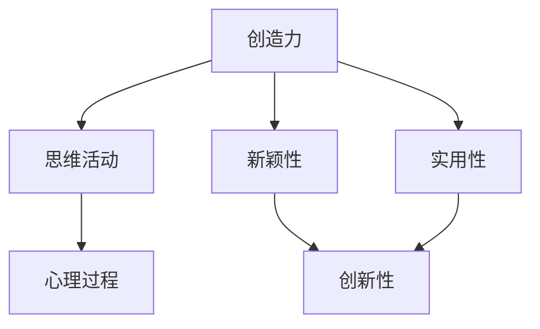

**核心概念解释**：

- **思维活动**：创造力是一种心理过程，它涉及思维的高级功能，如联想、想象、推理和判断。
- **新颖性**：创新的想法或解决方案必须具有新颖性，即不同于现有的知识和方法。
- **实用性**：尽管新颖性是创造力的核心特征，但一个有创造力的想法或解决方案还必须具备实用性，能够解决实际问题或带来实际价值。

### 2.2 创造力的影响因素

创造力不是孤立的现象，它受到多种因素的影响。这些因素可以分为个人因素和环境因素。

**个人因素**：

- **认知能力**：包括记忆力、观察力、思维敏捷性和逻辑推理能力等。
- **情绪状态**：积极的情绪状态，如好奇心、乐观和激情，通常有助于创造力的发挥。
- **价值观**：个体的价值观和信念会影响其对创新活动的态度和投入程度。

**环境因素**：

- **社会文化**：社会文化背景对创造力有着深远的影响，不同的文化对创新有不同的接受度和鼓励方式。
- **教育背景**：良好的教育背景能够培养个体的创造性思维和解决问题的能力。
- **工作环境**：一个支持性和开放性的工作环境有助于激发创造力和创新思维。

**核心概念与联系**：

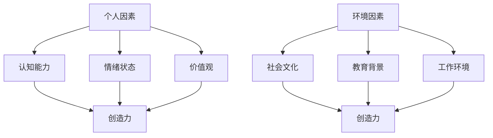

**核心概念解释**：

- **认知能力**：高水平的认知能力是创造力的基础，它帮助个体快速理解和处理复杂的信息。
- **情绪状态**：情绪状态可以显著影响创造力的发挥。例如，焦虑和压力可能会抑制创造力，而放松和愉悦的氛围有助于激发创造力。
- **价值观**：个体的价值观和信念会影响其对创新活动的态度和投入程度。一个拥有积极价值观的个体更可能投入时间和精力去追求创新。
- **社会文化**：社会文化背景对创造力有着深远的影响。在一些文化中，创新和发明被视为非常重要的社会价值，这有助于激发人们的创造力。
- **教育背景**：良好的教育背景能够培养个体的创造性思维和解决问题的能力。通过教育，个体能够学习到如何思考、如何提出问题以及如何解决问题。
- **工作环境**：一个支持性和开放性的工作环境有助于激发创造力和创新思维。在这种环境中，个体能够自由地表达自己的想法，与他人合作，从而实现更多的创新。

### 2.3 创造力的提升方法

为了提升创造力，可以采取多种方法和策略。以下是一些有效的方法：

- **教育**：通过系统的教育和培训，个体可以学习到各种创造力和创新思维的方法和技巧。
- **心理调适**：通过调整情绪状态，如减少焦虑和压力，可以提高创造力。
- **跨学科学习**：跨学科学习可以帮助个体从不同的角度看待问题，从而激发更多的创新思维。
- **团队合作**：与他人合作可以带来不同的视角和想法，有助于提升创造力。
- **实践和应用**：将创造力应用于实际问题解决中，可以不断提高和巩固创造力。

**核心概念与联系**：

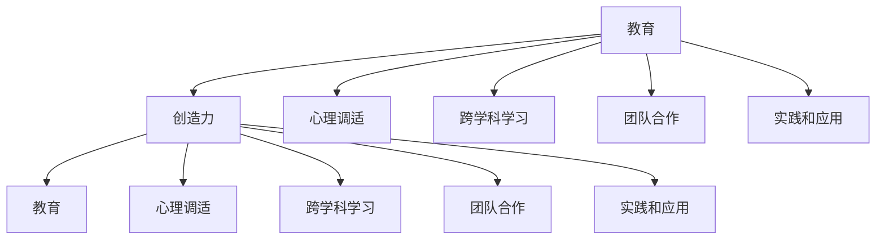

**核心概念解释**：

- **教育**：教育是提升创造力的基础。通过学习不同的学科和领域，个体可以拓宽知识面，提高思维深度，从而增强创造力。
- **心理调适**：心理调适是提高创造力的重要手段。通过学习如何管理情绪、如何应对压力，个体可以创造一个更加有利于创造力的心理状态。
- **跨学科学习**：跨学科学习可以带来新的视角和思维模式，有助于激发创造力。例如，一个工程师通过学习心理学，可以更好地理解用户需求，从而设计出更加人性化的产品。
- **团队合作**：团队合作可以带来不同的思维视角和技能，有助于集思广益，提高创造力。
- **实践和应用**：将创造力应用于实际问题解决中，可以不断提高和巩固创造力。通过实践，个体可以验证自己的想法，发现其中的问题和不足，进而进行改进。

---

## 第3章：机器智能概述

### 3.1 机器智能的定义与类型

机器智能（Machine Intelligence，简称MI）是指机器通过模拟人类智能行为，实现自主学习、推理和解决问题的能力。机器智能与人工智能（Artificial Intelligence，简称AI）密切相关，但两者有所区别。人工智能更侧重于模拟人类智能的思维方式，而机器智能则更强调机器的自我学习和适应能力。

**核心概念与联系**：

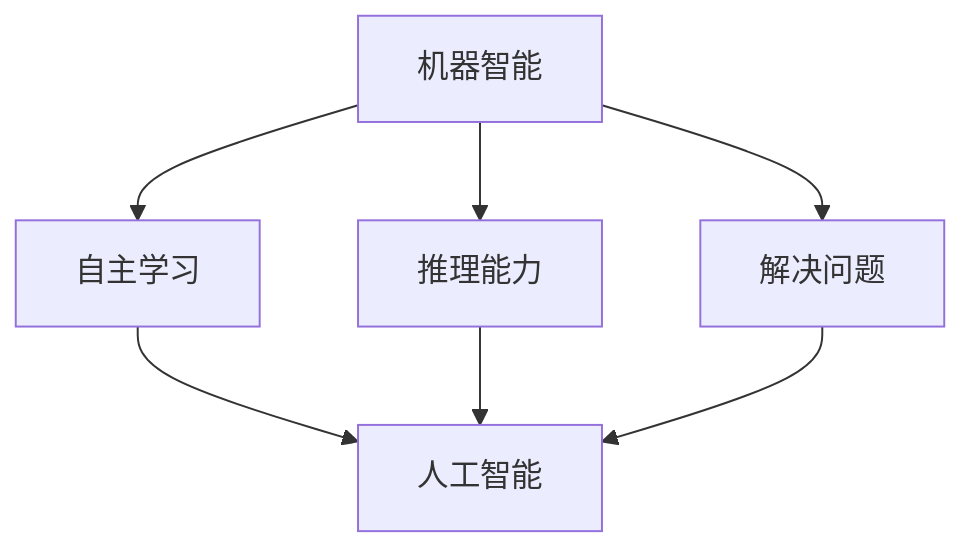

**核心概念解释**：

- **自主学习**：机器智能的一个重要特征是能够通过数据和学习算法，自主地改进性能和提高效率。
- **推理能力**：机器智能系统能够根据已有信息和规则，进行逻辑推理和决策。
- **解决问题**：机器智能系统能够处理复杂问题，并在多种情况下找到合适的解决方案。

### 3.2 机器智能的发展历程

机器智能的发展历程可以追溯到20世纪50年代，当时人工智能的概念被首次提出。早期的研究主要集中在规则系统和符号推理上。随着计算机性能的提高和大数据技术的发展，机器学习、深度学习等新型算法被提出，机器智能开始进入一个快速发展的阶段。

**核心概念与联系**：

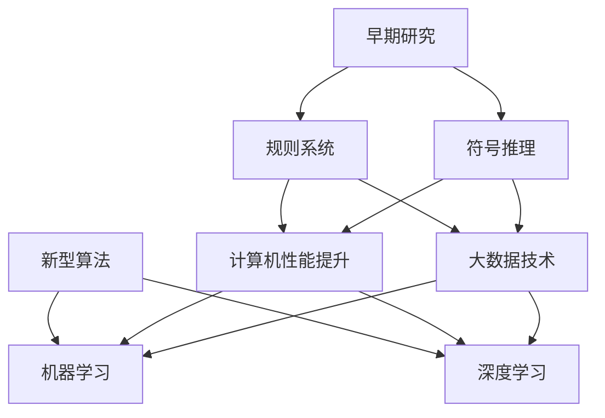

**核心概念解释**：

- **早期研究**：机器智能的早期研究主要集中在开发基于规则的系统和符号推理算法。这些系统可以通过定义一系列规则，实现对特定问题的求解。
- **计算机性能提升**：随着计算机性能的显著提升，机器智能系统开始能够处理更大规模的数据，这为新型算法的应用提供了基础。
- **大数据技术**：大数据技术的发展为机器智能提供了丰富的数据资源，使得机器智能系统能够从数据中学习，提高其性能和准确性。
- **新型算法**：机器学习、深度学习等新型算法的提出，使得机器智能系统能够在无需显式编程的情况下，从数据中自动学习模式和知识。这些算法在图像识别、自然语言处理、自动驾驶等领域取得了重大突破。

### 3.3 机器智能的应用领域

机器智能的应用领域非常广泛，涵盖了从日常生活到专业领域的各个方面。

**核心概念与联系**：

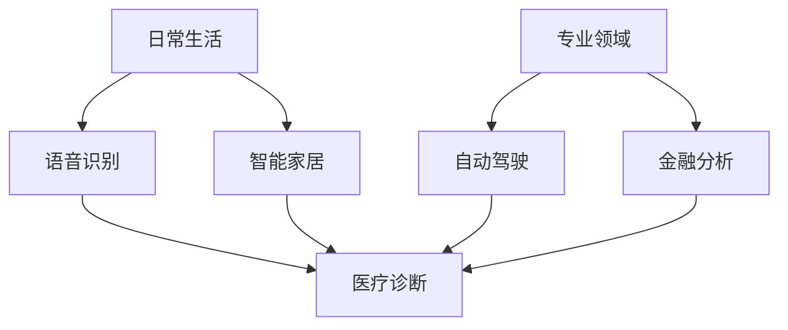

**核心概念解释**：

- **日常生活**：在日常生活中，机器智能已经融入了我们的生活中。例如，语音识别技术使得智能助手能够理解并执行我们的指令，智能家居系统能够通过传感器和智能算法，自动调整家庭环境。
- **专业领域**：在专业领域，机器智能的应用更加深入和广泛。例如，自动驾驶技术利用机器智能，能够实现车辆在复杂环境中的自主导航和安全行驶；在医疗领域，机器智能系统能够通过分析医学影像，提高疾病的诊断准确率；在金融领域，机器智能能够帮助分析市场趋势，提供投资决策支持。

---

## 第4章：人类创造力与机器智能的结合

### 4.1 融合的概念与优势

人类创造力与机器智能的结合（Human-Centered Machine Intelligence，简称HCMI）是指将人类的创造力与机器智能的强大计算能力和数据处理能力相结合，以实现更高效、更创新的解决方案。这种融合不仅能够弥补人类和机器各自的不足，还能够发挥两者的优势，达到1+1>2的效果。

**核心概念与联系**：

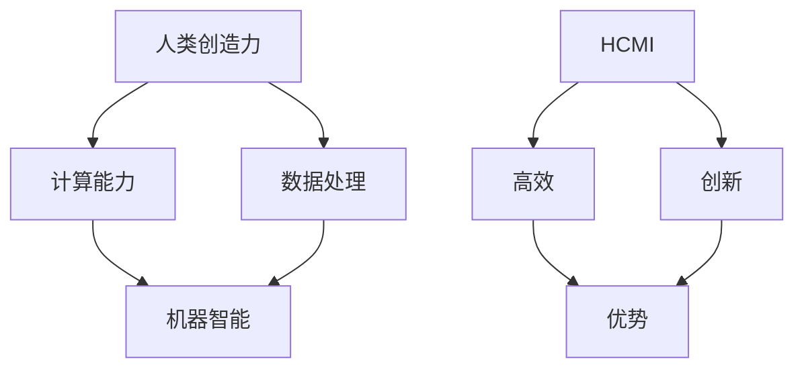

**核心概念解释**：

- **人类创造力**：人类创造力是人类独特的心理能力，能够产生新颖、有价值的想法和解决方案。
- **计算能力**：机器智能的强大计算能力可以处理大量的数据，并在短时间内完成复杂的计算任务。
- **数据处理**：机器智能能够高效地收集、存储、分析和利用数据，为创新提供数据支持。
- **HCMI**：人类创造力与机器智能的结合，旨在通过两者的优势互补，实现更高效、更创新的解决方案。

### 4.2 融合的挑战与应对策略

尽管人类创造力与机器智能的结合具有巨大的潜力，但在实际应用中仍然面临着一系列挑战。

**核心概念与联系**：

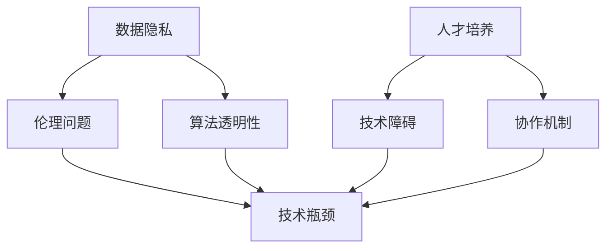

**核心概念解释**：

- **数据隐私**：机器智能系统在处理大量数据时，可能会涉及用户隐私信息。保护数据隐私是融合过程中需要考虑的重要问题。
- **伦理问题**：机器智能的决策过程可能涉及伦理问题，如道德责任和公平性。如何确保机器智能的决策符合伦理标准是一个重要的挑战。
- **算法透明性**：机器智能系统的决策过程通常是非透明的，难以解释。提高算法的透明性，使人类能够理解机器智能的决策过程，是应对这一挑战的关键。
- **技术瓶颈**：机器智能在某些领域仍然存在技术瓶颈，如认知能力、自我意识等。克服这些技术瓶颈是实现人类创造力与机器智能深度融合的关键。
- **人才培养**：机器智能与人类创造力的融合需要跨学科的人才，包括计算机科学、心理学、哲学等。培养这样的复合型人才是融合过程中的一大挑战。
- **协作机制**：人类和机器之间的协作需要有效的机制，如沟通工具、协作平台等。建立有效的协作机制，促进人类和机器之间的互动和合作，是实现融合的重要手段。

### 4.3 融合的实践案例

为了更好地理解人类创造力与机器智能的融合，下面我们来看一些实践案例。

**案例一：智能医疗**

在智能医疗领域，机器智能与人类创造力的结合已经取得了显著成果。例如，谷歌旗下的DeepMind开发的AI系统AlphaGo在围棋比赛中战胜了人类冠军。AlphaGo的成功得益于其强大的计算能力和深度学习算法，但更重要的是，它背后有着人类围棋专家的创造力和指导。这些专家通过分析围棋对局，提供了对算法的改进建议，使得AlphaGo能够在比赛中取得胜利。

**核心概念与联系**：

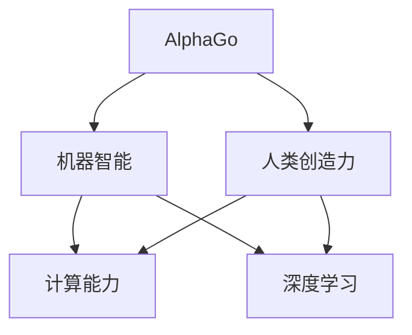

**核心概念解释**：

- **AlphaGo**：AlphaGo是一个基于机器智能的围棋AI系统，它通过深度学习和自我对弈，不断提高自己的棋艺。
- **机器智能**：AlphaGo的成功依赖于其强大的计算能力和深度学习算法，这使得它能够在围棋对局中迅速分析棋局，做出最佳决策。
- **人类创造力**：AlphaGo的成功不仅仅是因为其机器智能，更重要的是背后的人类创造力。这些人类专家通过分析围棋对局，提供了对算法的改进建议，使得AlphaGo能够在比赛中战胜人类冠军。

**案例二：自动驾驶**

在自动驾驶领域，机器智能与人类创造力的结合也是实现自动驾驶技术的关键。例如，特斯拉的自动驾驶系统通过深度学习和计算机视觉技术，实现了车辆的自动驾驶。然而，这些技术的开发离不开人类创造力的支持。特斯拉的工程师们通过不断实验和优化，开发了高效的算法和系统，使得自动驾驶系统能够在复杂环境中稳定运行。

**核心概念与联系**：

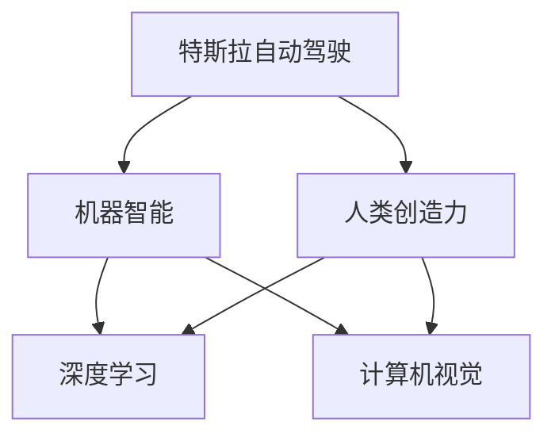

**核心概念解释**：

- **特斯拉自动驾驶**：特斯拉的自动驾驶系统是一个基于机器智能的自动驾驶系统，它通过深度学习和计算机视觉技术，实现了车辆的自动驾驶。
- **机器智能**：特斯拉自动驾驶系统的成功依赖于其强大的计算能力和深度学习算法，这使得系统能够实时分析道路情况和车辆状态，做出安全驾驶决策。
- **人类创造力**：特斯拉自动驾驶系统的开发离不开人类创造力的支持。工程师们通过不断的实验和优化，开发了高效的算法和系统，使得自动驾驶系统能够在复杂环境中稳定运行。

**案例三：智能设计**

在智能设计领域，机器智能与人类创造力的结合已经改变了设计行业。例如，Adobe公司的Adobe Sensei是一个基于机器智能的设计工具，它能够自动生成设计模板、调整颜色和布局等。然而，这些设计工具的成功离不开人类设计师的创造力。设计师们通过使用这些工具，可以更快地完成设计任务，同时也能够借助机器智能的辅助，创造出更创新的设计方案。

**核心概念与联系**：

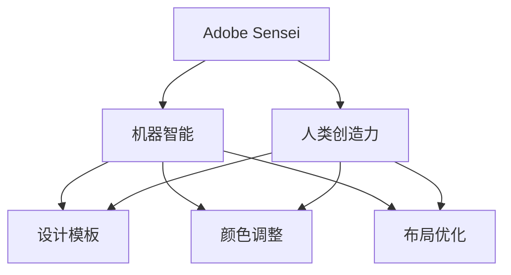

**核心概念解释**：

- **Adobe Sensei**：Adobe Sensei是Adobe公司开发的基于机器智能的设计工具，它能够自动生成设计模板、调整颜色和布局等。
- **机器智能**：Adobe Sensei的成功依赖于其强大的计算能力和机器学习算法，这使得系统能够快速地分析和处理设计数据，提供自动化的设计建议。
- **人类创造力**：设计师们通过使用Adobe Sensei，可以更快地完成设计任务，同时也能够借助机器智能的辅助，创造出更创新的设计方案。

---

## 第5章：创新思维方法

创新思维方法是指一系列用于激发创造力和产生新想法的技术和策略。这些方法可以帮助个体和团队在面临挑战和机遇时，更加有效地思考和解决问题。以下是一些常见的创新思维方法。

### 5.1 思维导图

思维导图是一种用于组织和表达思维的图形工具，它可以帮助个体或团队将复杂的想法和概念可视化，从而更好地理解和记忆。思维导图的制作过程通常包括以下几个步骤：

1. **确定中心主题**：首先，确定思维导图的中心主题，这通常是问题或目标的描述。
2. **绘制分支**：从中心主题向外绘制分支，每个分支代表一个相关的概念或想法。
3. **添加细节**：在每个分支上，可以进一步添加细节和子分支，以扩展和深化思考。
4. **使用颜色和图像**：使用不同的颜色和图像可以增强思维导图的视觉吸引力，帮助记忆和理解。

**核心概念与联系**：

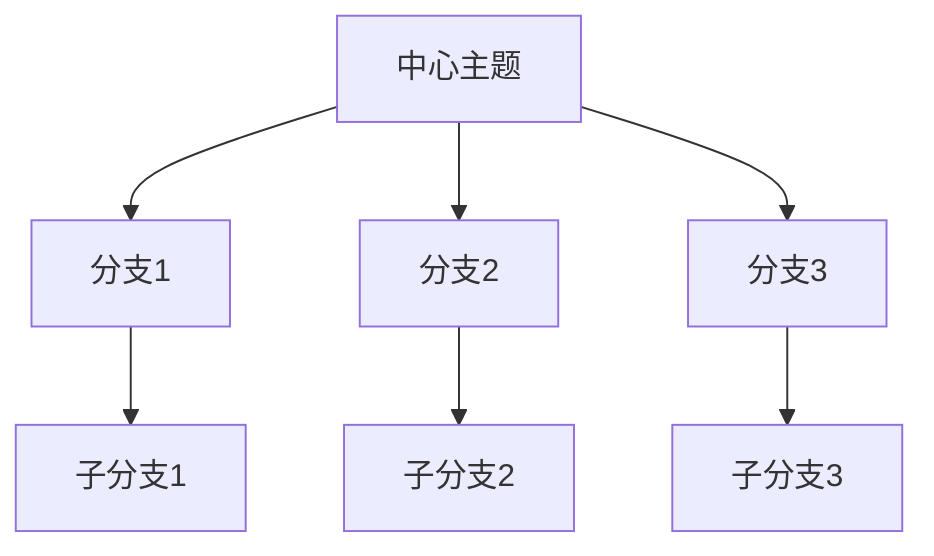

**核心概念解释**：

- **中心主题**：思维导图的中心主题是整个导图的焦点，它代表了要解决的问题或要达成的目标。
- **分支**：从中心主题向外延伸的分支代表了与主题相关的不同概念或想法。
- **子分支**：在每个分支上，可以进一步添加子分支，以扩展和深化思考。

### 5.2 设计思维

设计思维是一种以人为本的创造性思考方法，它强调理解用户需求、探索多种解决方案，并通过迭代和测试来优化产品和服务。设计思维的实践步骤通常包括以下几个阶段：

1. **发现**：通过观察、访谈和用户研究，了解用户的需求和痛点。
2. **定义**：明确问题陈述，将用户需求转化为具体的解决方案目标。
3. **发散**：提出多种可能的解决方案，尽量多地思考，不限制创意。
4. **筛选**：评估和筛选最佳解决方案，确定下一步的实践方向。
5. **原型制作**：制作解决方案的原型，通过用户测试和反馈来验证和改进。
6. **测试**：在真实环境中测试原型，收集数据并进行分析，进一步优化解决方案。

**核心概念与联系**：

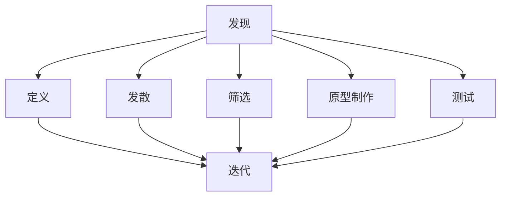

**核心概念解释**：

- **发现**：通过深入理解用户需求，发现问题的本质和可能的解决方案。
- **定义**：明确问题陈述，将用户需求转化为具体的解决方案目标。
- **发散**：提出多种可能的解决方案，通过头脑风暴和创意思维，探索更多可能性。
- **筛选**：评估和筛选最佳解决方案，根据用户反馈和实际需求，确定最佳方案。
- **原型制作**：制作解决方案的原型，通过用户测试和反馈，验证和改进解决方案。
- **测试**：在真实环境中测试原型，收集数据并进行分析，进一步优化解决方案。

### 5.3 创新思维训练

创新思维是一种可以通过训练和实践得到提升的能力。以下是一些提高创新思维的方法：

1. **多学科交叉学习**：通过学习不同领域的知识，拓宽思维视野，提高跨领域的创新能力。
2. **定期头脑风暴**：定期进行头脑风暴练习，培养快速思考和产生创意的能力。
3. **挑战自我**：设置具有挑战性的目标，通过解决问题来提升创新思维。
4. **阅读和研究**：阅读创新相关的书籍和研究论文，学习他人的创新经验和技巧。
5. **实践应用**：将创新思维应用于实际问题解决中，通过实践来巩固和提高创新能力。

**核心概念与联系**：

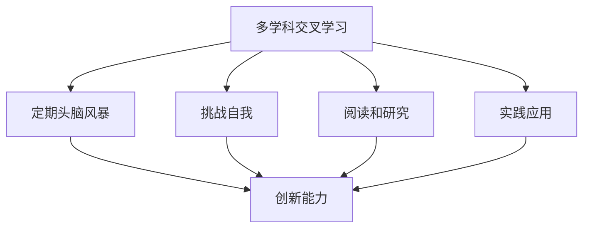

**核心概念解释**：

- **多学科交叉学习**：通过学习不同领域的知识，拓宽思维视野，提高跨领域的创新能力。
- **定期头脑风暴**：定期进行头脑风暴练习，培养快速思考和产生创意的能力。
- **挑战自我**：设置具有挑战性的目标，通过解决问题来提升创新思维。
- **阅读和研究**：阅读创新相关的书籍和研究论文，学习他人的创新经验和技巧。
- **实践应用**：将创新思维应用于实际问题解决中，通过实践来巩固和提高创新能力。

---

## 第6章：机器智能助力创新

机器智能在创新中扮演着重要的角色，通过提供强大的计算能力和数据处理能力，机器智能能够辅助人类更好地发现新机会、解决问题和创造新价值。以下将详细探讨机器智能在数据分析、模式识别和机器学习等领域的应用。

### 6.1 数据分析

数据分析是机器智能的核心应用领域之一，它通过使用统计方法和算法，从大量数据中提取有价值的信息和洞察。数据分析在商业、科学、医疗等多个领域都有广泛应用。

**核心概念与联系**：

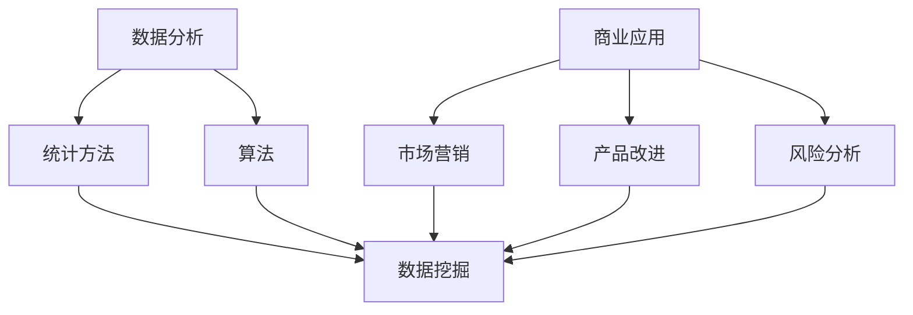

**核心概念解释**：

- **数据分析**：数据分析是一种从数据中提取有用信息和知识的方法，它包括数据收集、数据清洗、数据探索、数据建模和数据解释等多个步骤。
- **统计方法**：统计分析是数据分析的基础，它使用各种统计方法来描述数据的特征、关系和趋势。
- **算法**：数据分析中常用的算法包括回归分析、聚类分析、关联规则挖掘等，这些算法能够自动发现数据中的模式和规律。
- **数据挖掘**：数据挖掘是数据分析的高级阶段，它通过复杂的算法和模型，从大量数据中发现隐藏的、有价值的模式和关系。
- **商业应用**：数据分析在商业领域有着广泛的应用，如市场营销、产品改进和风险分析等，通过数据分析，企业可以更好地了解客户需求、优化产品和服务、降低风险。

### 6.2 模式识别

模式识别是机器智能的另一个重要应用领域，它涉及使用算法和模型来识别和分类数据中的模式。模式识别在图像识别、语音识别、自然语言处理等领域有广泛应用。

**核心概念与联系**：

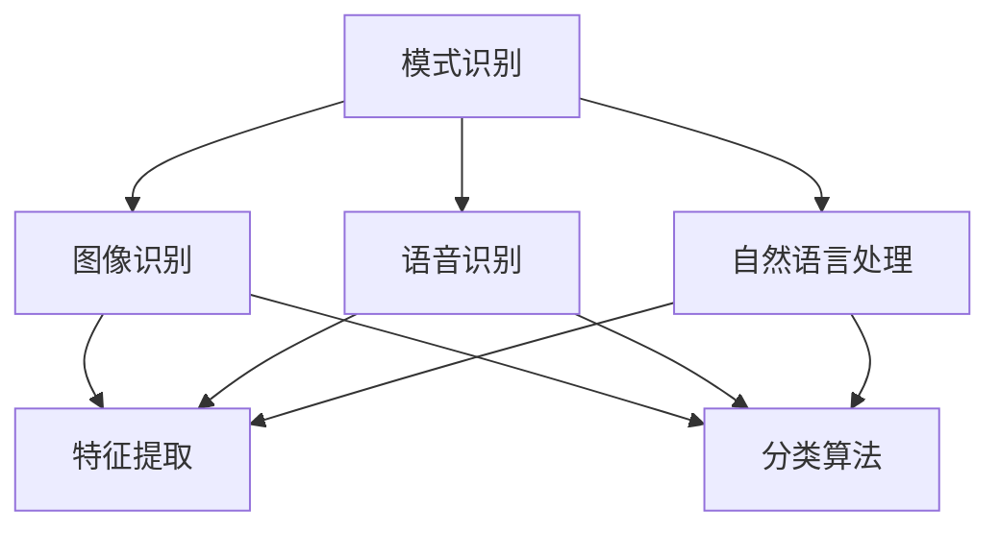

**核心概念解释**：

- **模式识别**：模式识别是机器智能用于识别和分类数据中模式的技术，它包括特征提取、模式分类和模型训练等多个步骤。
- **图像识别**：图像识别是模式识别在视觉领域的应用，它通过分析图像的特征，识别和分类图像中的对象。
- **语音识别**：语音识别是模式识别在听觉领域的应用，它通过分析声音的信号特征，将语音转换为文字。
- **自然语言处理**：自然语言处理是模式识别在文本领域的应用，它通过分析文本的语法和语义特征，理解和生成语言。

### 6.3 机器学习与深度学习

机器学习和深度学习是机器智能的两大核心技术，它们通过学习数据中的模式和规律，实现自动化的决策和预测。

**核心概念与联系**：

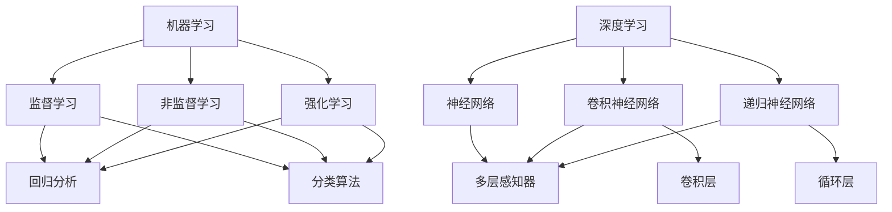

**核心概念解释**：

- **机器学习**：机器学习是机器智能的核心技术，它通过训练模型，使机器能够从数据中学习并做出预测和决策。机器学习包括监督学习、非监督学习和强化学习等多种类型。
- **监督学习**：监督学习是机器学习的一种类型，它通过训练有标签的数据集，使模型能够预测新的数据。
- **非监督学习**：非监督学习是机器学习的另一种类型，它通过分析无标签的数据集，发现数据中的模式和结构。
- **强化学习**：强化学习是机器学习的第三种类型，它通过模拟智能体与环境的交互，使模型能够通过试错学习最优策略。
- **深度学习**：深度学习是机器学习的一种延伸，它通过多层神经网络，实现更复杂的特征学习和模式识别。
- **神经网络**：神经网络是深度学习的基础，它通过模拟人脑的神经元连接结构，实现数据的自动学习和分类。
- **卷积神经网络**：卷积神经网络是深度学习的一种类型，它通过卷积层，实现图像的特征提取和分类。
- **递归神经网络**：递归神经网络是深度学习的一种类型，它通过循环层，实现序列数据的特征提取和分类。
- **多层感知器**：多层感知器是神经网络的基本单元，它通过多层连接，实现数据的非线性变换和分类。

### 6.4 机器智能在创新中的应用案例

**案例一：智能医疗**

在智能医疗领域，机器智能通过数据分析、模式识别和机器学习等技术，实现了疾病预测、诊断和治疗优化。例如，IBM的Watson for Oncology系统通过分析大量的医学文献和病例数据，为医生提供个性化的治疗方案建议。这个系统不仅提高了诊断的准确性，还减少了医生的工作负担，提高了医疗效率。

**核心概念与联系**：

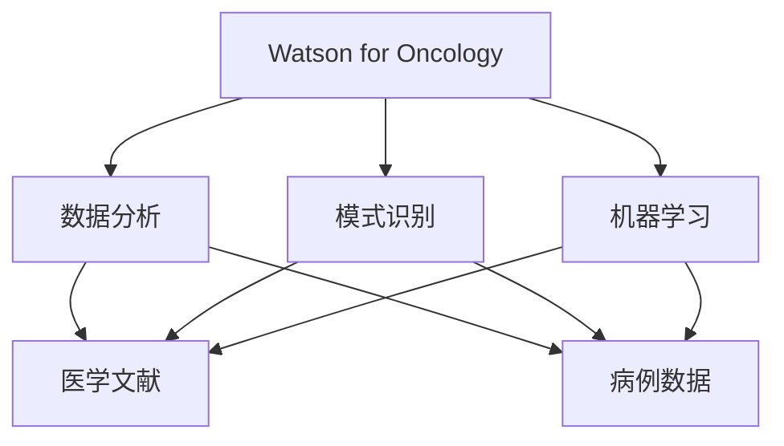

**核心概念解释**：

- **Watson for Oncology**：Watson for Oncology是IBM开发的一个智能医疗系统，它通过机器学习算法，分析大量的医学文献和病例数据，为医生提供个性化的治疗方案建议。
- **数据分析**：Watson for Oncology系统通过数据分析，从大量的医学文献和病例数据中提取有价值的信息和模式。
- **模式识别**：系统通过模式识别，发现不同病例之间的相似性和差异性，从而为医生提供更准确的诊断和治疗方案。
- **机器学习**：系统通过机器学习，不断优化和更新算法，提高诊断和治疗的准确性和效率。

**案例二：智能金融**

在智能金融领域，机器智能通过大数据分析和模式识别技术，实现了风险管理、投资决策和客户服务优化。例如，花旗银行的CitiGPS系统通过分析海量的市场数据和交易信息，为投资者提供实时的市场趋势和投资建议。这个系统不仅提高了投资决策的准确性，还帮助银行更好地管理风险，优化客户服务。

**核心概念与联系**：

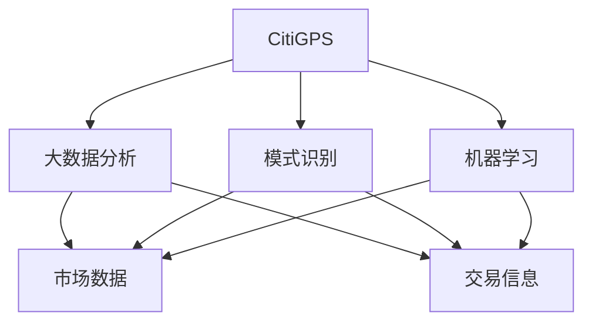

**核心概念解释**：

- **CitiGPS**：CitiGPS是花旗银行开发的一个智能金融系统，它通过大数据分析和模式识别技术，为投资者提供实时的市场趋势和投资建议。
- **大数据分析**：CitiGPS系统通过大数据分析，从海量的市场数据和交易信息中提取有价值的信息和模式。
- **模式识别**：系统通过模式识别，发现市场趋势和交易模式，从而为投资者提供更准确的投资建议。
- **机器学习**：系统通过机器学习，不断优化和更新算法，提高投资决策的准确性和效率。

**案例三：智能制造**

在智能制造领域，机器智能通过机器学习、深度学习和物联网技术，实现了生产过程的自动化、优化和智能化。例如，西门子的数字化双胞胎技术通过在虚拟环境中模拟实际生产过程，实现了对生产设备的远程监控和故障预测。这个技术不仅提高了生产效率，还减少了设备故障率和维护成本。

**核心概念与联系**：

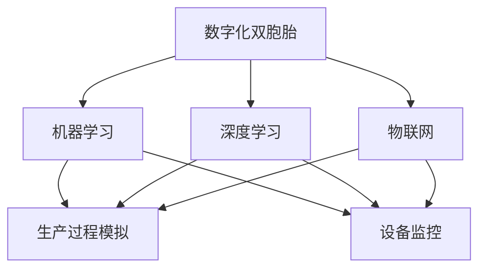

**核心概念解释**：

- **数字化双胞胎**：数字化双胞胎技术是西门子开发的一种智能制造技术，它通过在虚拟环境中模拟实际生产过程，实现生产过程的自动化和优化。
- **机器学习**：数字化双胞胎技术通过机器学习，从历史数据和实际生产过程中学习，提高生产过程的预测和优化能力。
- **深度学习**：数字化双胞胎技术通过深度学习，实现对生产过程的复杂模式识别和预测。
- **物联网**：数字化双胞胎技术通过物联网，实现对生产设备的实时监控和故障预测。

---

## 第7章：未来展望

### 7.1 创造力与机器智能的发展趋势

随着科技的不断进步，人类创造力与机器智能的结合正在向更深、更广的领域发展。以下是一些关键趋势：

1. **智能化水平的提升**：随着深度学习和神经网络技术的不断发展，机器智能的智能化水平将不断提高，能够在更复杂的任务中表现出超越人类的能力。
2. **跨界融合的加强**：不同领域的创新将更加紧密地融合，如生物科技、材料科学和人工智能等领域的交叉，将带来全新的技术突破和应用。
3. **人机协同的深化**：人类创造力和机器智能的协同将更加紧密，形成一种新型的人机交互模式，人类将通过机器智能更好地发挥自身的创造力。
4. **伦理和隐私问题的关注**：随着机器智能的广泛应用，伦理和隐私问题将受到越来越多的关注，如何确保机器智能的决策符合伦理标准，同时保护用户隐私，将成为重要课题。

### 7.2 影响与启示

创造力与机器智能的结合对个人、企业和社会都将产生深远的影响。

**对个人的影响**：

- **创新能力提升**：通过机器智能的辅助，个人可以更加高效地发现新想法和解决问题。
- **技能需求变化**：随着机器智能的发展，对人类创造力、跨学科知识和创新思维的需求将不断增加。
- **职业选择多样**：机器智能将为个人提供更多的职业机会，如数据科学家、机器学习工程师和创新咨询师等。

**对企业和组织的影响**：

- **竞争优势**：企业通过利用机器智能，可以提高生产效率、优化业务流程和创新产品服务，从而在激烈的市场竞争中脱颖而出。
- **组织文化**：企业需要培养一种鼓励创新和包容失败的文化，以激发员工的创造力。
- **战略调整**：企业需要根据机器智能的发展趋势，调整战略方向，抓住新的市场机会。

**对社会组织的影响**：

- **经济增长**：机器智能与人类创造力的结合将为社会带来巨大的经济价值，推动创新和经济增长。
- **社会结构**：随着机器智能的普及，社会结构和就业模式将发生变化，需要重新思考和规划。
- **教育改革**：教育体系需要适应机器智能时代的需求，培养具备创造力、批判思维和解决问题能力的人才。

### 7.3 我们的使命与责任

作为推动创造力与机器智能结合的关键力量，我们肩负着以下使命与责任：

1. **促进科技与人文的结合**：通过研究和实践，促进科技与人文的深度融合，实现创新思维和创造力的发展。
2. **培养创新人才**：通过教育、培训和跨学科合作，培养具备创造力、跨学科知识和创新思维的人才。
3. **推动社会进步**：将创造力与机器智能的应用拓展到各个领域，推动社会进步和可持续发展。
4. **关注伦理和隐私**：在推动机器智能和创造力结合的过程中，始终关注伦理和隐私问题，确保技术的发展符合社会价值观和道德标准。

---

## 附录

### A.1 相关资源与工具推荐

为了帮助读者更好地理解本书的内容，我们推荐以下资源与工具：

- **书籍**：
  - 《人工智能：一种现代的方法》（第二版），作者：Stuart J. Russell & Peter Norvig。
  - 《深度学习》（第1卷），作者：Ian Goodfellow、Yoshua Bengio和Aaron Courville。
  - 《创新与企业家精神》，作者：Peter Drucker。

- **在线课程**：
  - Coursera上的《机器学习》课程，由Andrew Ng教授主讲。
  - edX上的《深度学习专项课程》，由Yoshua Bengio教授主讲。

- **开源工具**：
  - TensorFlow：一款开源的机器学习框架，用于构建和训练深度学习模型。
  - PyTorch：一款开源的机器学习库，特别适用于深度学习应用。
  - Jupyter Notebook：一款交互式的计算环境，用于编写、运行和分享代码。

- **在线社区和论坛**：
  - Stack Overflow：一个针对程序员的技术问答社区。
  - GitHub：一个面向开源项目的托管平台，可以找到大量的机器学习和人工智能项目。

这些资源和工具将有助于读者深入学习和实践创造力与机器智能的相关知识。

---

## 作者信息

作者：AI天才研究院/AI Genius Institute & 禅与计算机程序设计艺术 /Zen And The Art of Computer Programming

在本书中，我们作为AI天才研究院的研究员，结合了人类创造力和机器智能的优势，旨在为读者提供一本深入浅出的创新指南。同时，我们也借鉴了《禅与计算机程序设计艺术》的哲学思想，强调在科技发展中保持人文关怀和道德责任。希望通过本书，能够激发读者在机器智能时代的创新潜力，共同推动社会的进步和发展。

