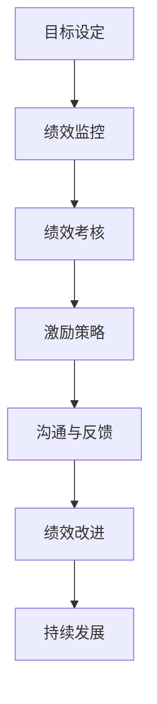
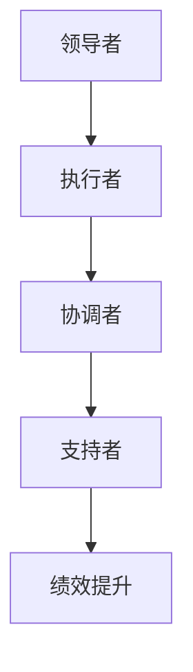
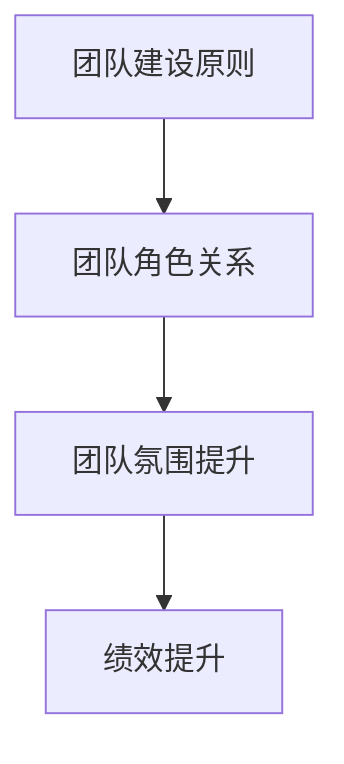
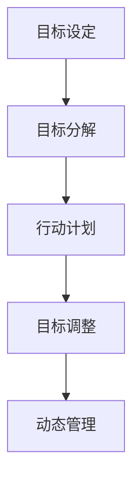
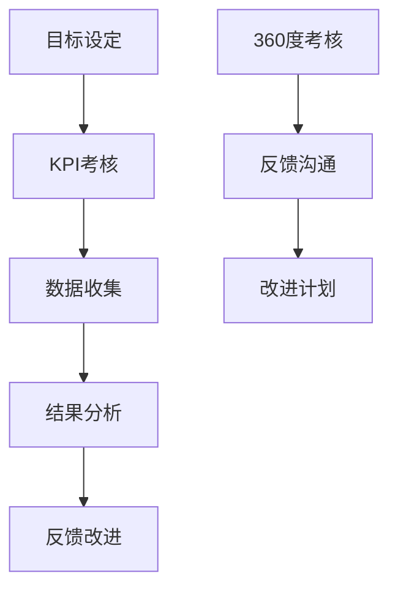
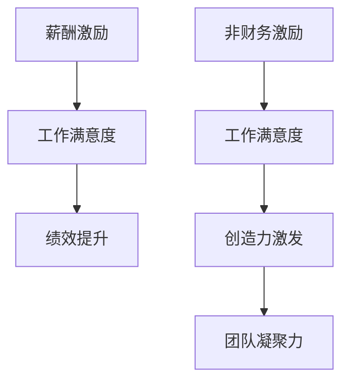
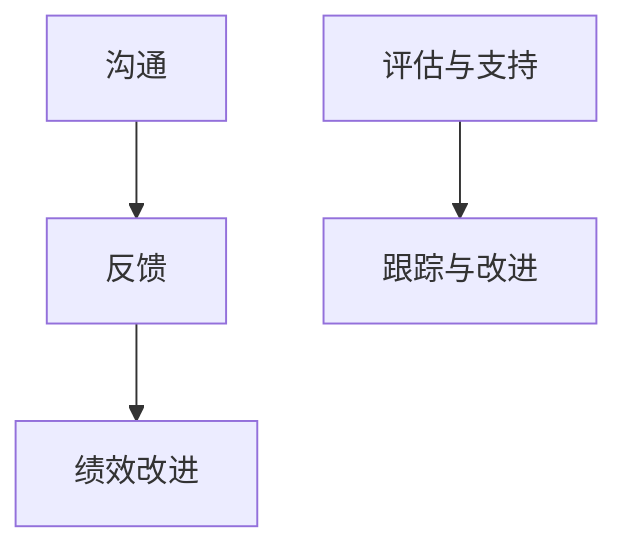
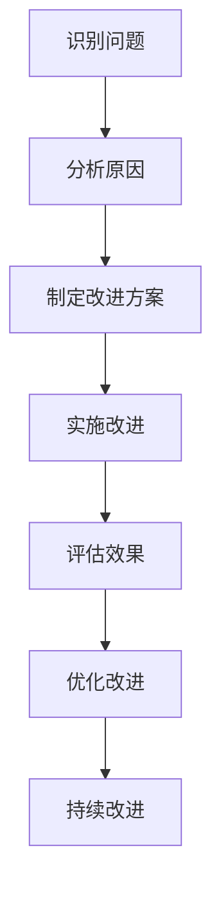

                 

### 文章标题：提高团队绩效的秘诀：绩效管理技巧

> 关键词：团队绩效、绩效管理、管理技巧、目标设定、绩效考核、沟通反馈

> 摘要：本文旨在探讨提高团队绩效的关键技巧，包括绩效管理基础理论、团队建设、目标设定、绩效考核方法、激励策略、沟通与反馈技巧以及绩效改进与持续发展。通过逻辑清晰、结构紧凑的分析，本文将帮助读者理解和应用这些技巧，以提升团队整体表现。

## 引言

在当今快速变化的商业环境中，团队绩效的优劣直接关系到组织的成功与失败。随着市场竞争的日益激烈，如何提高团队绩效成为企业管理者面临的重要挑战。有效的绩效管理不仅仅是设定目标、考核绩效那么简单，它涉及到团队建设、目标设定、激励策略等多个方面。本文将深入探讨提高团队绩效的秘诀，通过一系列绩效管理技巧，帮助团队实现更高的绩效水平。

## 绩效管理基础理论

### 绩效管理的定义与目标

绩效管理是一个系统性过程，它通过设定目标、监控进展、提供反馈和改进措施，来提升个人和团队的绩效。绩效管理的目标主要包括以下几个方面：

1. **提升个人和团队的工作效率**：通过明确的目标和持续改进，帮助团队成员提高工作质量和效率。
2. **激发员工的潜力**：通过合理的激励机制，激发员工的积极性和创造力，实现个人与团队共同成长。
3. **实现组织战略目标**：将个人目标与组织目标相结合，确保团队工作与组织战略的一致性。

### 绩效管理的历史与发展

绩效管理的发展经历了多个阶段，从早期的基于绩效的奖励制度，到现代的全面绩效管理系统。以下是一些关键的发展历程：

1. **绩效考核阶段**：主要关注个人绩效的评估和奖励。
2. **全面绩效管理阶段**：注重团队和个人的全面发展和成长，不仅关注绩效结果，还关注绩效过程和改进措施。
3. **战略绩效管理阶段**：将绩效管理纳入组织战略体系，确保绩效管理与组织目标的紧密关联。

### 绩效管理的关键要素

有效的绩效管理需要以下几个关键要素：

1. **目标设定**：明确团队和个人的目标，确保目标具有可衡量性和可实现性。
2. **考核方法**：选择合适的绩效考核方法，确保考核结果的公正性和有效性。
3. **激励策略**：通过激励措施激发员工的积极性和创造力。
4. **沟通与反馈**：建立良好的沟通机制，及时给予反馈，帮助员工了解自己的绩效状况和改进方向。
5. **改进与持续发展**：通过持续改进和培训，不断提升团队和个人的绩效水平。

### 核心概念与联系

为了更好地理解绩效管理，我们可以通过一个Mermaid流程图来展示绩效管理的主要环节和相互关系：

## 第1章 绩效管理基础理论

### 1.1 绩效管理的概念与目标

#### 绩效管理的概念

绩效管理是指通过设定目标、监控进展、提供反馈和改进措施，来提升个人和团队的绩效的过程。它不仅仅是对员工工作结果的考核，更是一个全面的绩效管理系统，包括目标设定、绩效监控、绩效考核、激励策略、沟通与反馈以及绩效改进等多个环节。

#### 绩效管理的目标

绩效管理的目标主要包括以下几个方面：

1. **提升个人和团队的工作效率**：通过明确的目标和持续改进，帮助团队成员提高工作质量和效率。
2. **激发员工的潜力**：通过合理的激励机制，激发员工的积极性和创造力，实现个人与团队共同成长。
3. **实现组织战略目标**：将个人目标与组织目标相结合，确保团队工作与组织战略的一致性。

### 1.2 绩效管理的历史与发展

#### 绩效管理的历史

绩效管理的发展历程可以追溯到20世纪初期。早期的绩效管理主要关注个人绩效的评估和奖励，随着管理理论的发展，绩效管理的概念逐渐丰富，形成了现代的全面绩效管理系统。

1. **绩效考核阶段**：20世纪初期，企业开始引入绩效考核制度，通过定期评估员工的绩效来决定薪酬和晋升。
2. **全面绩效管理阶段**：20世纪80年代，随着管理理论的进步，绩效管理开始从单纯的绩效考核扩展到全面的管理系统，包括目标设定、绩效监控、激励策略等多个环节。
3. **战略绩效管理阶段**：21世纪初，绩效管理进一步与组织战略相结合，成为实现组织目标的重要工具。

#### 绩效管理的发展趋势

随着全球化和信息技术的发展，绩效管理也在不断演进：

1. **数字化绩效管理**：利用大数据和人工智能技术，实现更精准的绩效评估和反馈。
2. **员工参与度提升**：通过增强员工的参与度和自主性，提高绩效管理的有效性和可持续性。
3. **持续改进**：将绩效管理视为一个持续改进的过程，不断优化管理方法和策略。

### 1.3 绩效管理的关键要素

#### 目标设定

目标设定是绩效管理的第一步，也是至关重要的一步。有效的目标设定需要遵循SMART原则，即目标应该是具体的（Specific）、可衡量的（Measurable）、可实现的（Achievable）、相关的（Relevant）和有时限的（Time-bound）。

#### 绩效考核方法

绩效考核方法的选择直接影响绩效管理的有效性。常见的绩效考核方法包括KPI（关键绩效指标）、360度反馈、行为事件访谈等。每种方法都有其适用场景和优缺点，管理者需要根据实际情况进行选择。

#### 激励策略

激励策略是激发员工积极性和创造力的关键。激励策略包括薪酬激励、非财务激励、职业发展机会等。有效的激励策略不仅能够提高员工的工作满意度，还能提升团队的整体绩效。

#### 沟通与反馈

沟通与反馈是绩效管理中不可或缺的一环。通过及时的沟通，管理者可以了解员工的工作进展和困惑，给予针对性的反馈和支持。良好的沟通和反馈机制能够增强团队的凝聚力和协作效率。

#### 绩效改进与持续发展

绩效改进与持续发展是绩效管理的核心目标之一。通过定期的绩效评估和反馈，管理者可以发现问题和改进机会，采取相应的措施进行优化。同时，持续发展还包括员工培训和发展计划，帮助员工提升技能和职业素养。

### 核心概念与联系

为了更好地理解绩效管理，我们可以通过一个Mermaid流程图来展示绩效管理的主要环节和相互关系：

在这个流程图中，每个环节都是相互关联的，共同构成了一个完整的绩效管理体系。通过这个流程图，管理者可以清晰地了解绩效管理的各个环节，以及它们之间的逻辑关系。

### 总结

绩效管理是一个复杂但至关重要的过程，它不仅关系到员工的工作表现，更影响着整个团队和组织的成功。通过理解绩效管理的基础理论和关键要素，管理者可以更好地制定和实施绩效管理策略，从而提高团队绩效，实现组织目标。

### 最佳实践 tips

1. **明确目标**：确保目标设定时遵循SMART原则，明确具体、可衡量、可实现、相关和有时限的目标。
2. **选择合适的方法**：根据团队的实际情况，选择适合的绩效考核方法，如KPI、360度反馈等。
3. **建立良好的沟通机制**：定期召开绩效沟通会议，及时反馈员工的绩效状况，解决存在的问题。
4. **持续改进**：通过定期的绩效评估和反馈，不断优化绩效管理策略，提升团队绩效。

### 注意事项

1. **避免单一考核**：不要仅仅依赖单一的考核方法，结合多种方法进行综合评估，确保评估结果的公正性和全面性。
2. **关注团队氛围**：建立积极的团队氛围，鼓励团队成员之间的合作和沟通，提高团队的凝聚力。
3. **注重激励**：合理运用激励策略，既要关注薪酬激励，也要注重非财务激励，如职业发展机会、培训等。

### 拓展阅读

- 《绩效管理：策略、工具与最佳实践》
- 《团队绩效管理实战指南》
- 《关键绩效指标（KPI）实战应用》

## 第2章 团队建设与绩效

### 2.1 团队建设的原则与方法

#### 团队建设的原则

团队建设是一个系统性过程，涉及到团队成员的相互关系、沟通协作和共同目标的实现。为了建立一个高效的团队，管理者需要遵循以下原则：

1. **共同目标**：明确团队的目标，确保所有成员都朝同一个方向努力。
2. **信任与尊重**：建立信任和尊重的氛围，促进团队成员之间的合作和沟通。
3. **分工与协作**：合理分配工作任务，鼓励团队成员之间的协作，提高整体效率。
4. **持续发展**：关注团队成员的技能提升和职业发展，实现个人与团队的共同成长。

#### 团队建设的方法

1. **培训与发展**：通过培训和发展计划，提升团队成员的专业技能和综合素质。
2. **团队活动**：组织团队活动，增强团队成员之间的互动和沟通，提高团队的凝聚力。
3. **领导力培养**：培养团队领导者的领导力和管理能力，为团队提供有效的指导和支持。
4. **激励机制**：建立合理的激励机制，激发团队成员的积极性和创造力。

### 2.2 团队角色与绩效关系

#### 团队角色的重要性

在团队中，每个成员都扮演着特定的角色，这些角色相互作用，共同推动团队目标的实现。了解团队成员的角色及其相互关系，对于提升团队绩效具有重要意义。

1. **领导者**：负责团队的领导和管理，确保团队目标的实现。
2. **执行者**：负责具体任务的执行，实现团队的目标。
3. **协调者**：负责协调团队成员之间的工作，解决冲突和问题。
4. **支持者**：为团队成员提供支持和帮助，增强团队的凝聚力。

#### 团队角色与绩效关系

团队角色的有效配合是提升团队绩效的关键。以下是一个简单的Mermaid流程图，展示了团队角色与绩效之间的关系：

在这个流程图中，领导者的决策和指导对执行者、协调者和支持者都有直接影响，而这些角色的协作和配合最终推动了绩效的提升。

### 2.3 团队氛围与绩效提升

#### 团队氛围的重要性

团队氛围是影响团队绩效的重要因素之一。一个积极、开放、和谐的团队氛围能够激发团队成员的积极性和创造力，提升团队的整体绩效。

1. **积极氛围**：鼓励团队成员表达自己的想法和建议，促进创新和协作。
2. **开放氛围**：鼓励团队成员之间的沟通和交流，提高团队的信息透明度和信任感。
3. **和谐氛围**：建立相互尊重和信任的关系，减少冲突和矛盾，提高团队的凝聚力。

#### 提升团队氛围的方法

1. **团队活动**：通过团队活动，如团建活动、运动会等，增强团队成员之间的互动和沟通。
2. **反馈机制**：建立反馈机制，鼓励团队成员之间相互反馈，提高团队沟通的质量和效率。
3. **激励机制**：通过激励机制，如表扬和奖励，鼓励团队成员积极参与团队活动，提升团队氛围。

### 核心概念与联系

为了更好地理解团队建设与绩效的关系，我们可以通过一个Mermaid流程图来展示团队建设的主要环节和相互关系：

在这个流程图中，团队建设的原则、团队角色关系和团队氛围提升相互影响，共同推动了绩效的提升。

### 总结

团队建设是提升团队绩效的重要基础。通过遵循团队建设原则、明确团队角色和提升团队氛围，管理者可以建立一个高效、协作和充满活力的团队，从而实现更高的绩效水平。

### 最佳实践 tips

1. **制定明确的团队目标**：确保所有成员都了解并认同团队目标，提高团队的凝聚力。
2. **建立有效的沟通机制**：鼓励团队成员之间的沟通和交流，提高团队的信息透明度和信任感。
3. **定期评估团队绩效**：通过定期评估，及时发现团队存在的问题，采取相应的改进措施。

### 注意事项

1. **避免角色冲突**：确保团队成员的角色明确，避免角色重叠和冲突，提高团队效率。
2. **关注团队氛围**：建立一个积极、开放、和谐的团队氛围，提高团队的整体绩效。

### 拓展阅读

- 《团队建设：提升团队协作效率的实践指南》
- 《领导力与团队建设》
- 《团队管理实战手册》

## 第3章 目标设定与计划

### 3.1 目标设定的SMART原则

目标设定是绩效管理的重要环节，SMART原则是一种常用的目标设定方法，它将目标设定为具体（Specific）、可衡量（Measurable）、可实现（Achievable）、相关（Relevant）和有时限（Time-bound）。以下是对SMART原则的具体解释：

#### 具体化（Specific）

具体化意味着目标应该是明确的、具体的，而不是模糊的。例如，“提高销售额”这个目标过于宽泛，而“在下一季度将销售额提高10%”则更加具体。

#### 可衡量性（Measurable）

目标应该具有可衡量性，即可以量化评估目标是否实现。例如，通过销售额、客户满意度等指标来衡量目标是否达成。

#### 可实现性（Achievable）

目标应该是可实现的，即通过合理的努力可以达成。设定过高的目标可能会导致员工失去信心，过低的则无法激励员工。

#### 相关性（Relevant）

目标应该与团队和组织的目标保持一致，即相关且有价值。例如，如果一个团队的目标是提高产品质量，那么降低成本可能不是一个相关目标。

#### 有时限（Time-bound）

目标应该有时限，即设定一个明确的时间框架。例如，“在下一季度末实现目标”，而不是“尽快实现目标”。

### 3.2 目标分解与行动计划

#### 目标分解

目标分解是将大目标分解为小目标，以便更好地实施和管理。以下是一个目标分解的例子：

- 大目标：在下一季度将销售额提高10%
- 中级目标：每月增加销售额2%
- 小目标：每周增加销售额0.5%

通过这样的分解，团队成员可以清晰地了解自己的任务，并按计划逐步实现。

#### 行动计划

行动计划是将目标转化为具体的行动步骤，确保目标的实现。以下是一个简单的行动计划：

1. **资源准备**：收集并准备所需的资源，如营销材料、销售工具等。
2. **培训与指导**：为团队成员提供必要的培训和支持，确保他们具备实现目标的能力。
3. **定期检查**：每周对销售额进行监控，分析数据，调整策略。
4. **反馈与改进**：及时反馈团队成员的工作情况，提供改进建议，帮助他们不断提升。

### 3.3 目标调整与动态管理

#### 目标调整的重要性

市场环境的变化、组织战略的调整以及团队成员的能力变化，都可能导致目标需要调整。因此，动态管理目标是非常重要的。

#### 目标调整的方法

1. **定期评估**：定期评估目标达成情况，分析存在的问题，根据实际情况调整目标。
2. **及时反馈**：及时收集团队成员的反馈，了解他们的困难和需求，调整目标以更好地满足团队需求。
3. **灵活应变**：在面对外部环境变化时，保持灵活性，及时调整目标和行动计划。

### 核心概念与联系

为了更好地理解目标设定与计划，我们可以通过一个Mermaid流程图来展示目标设定、分解和调整的过程：

在这个流程图中，目标设定、分解、行动计划和目标调整相互关联，共同构成了一个动态的目标管理过程。

### 总结

目标设定与计划是绩效管理的重要环节。通过遵循SMART原则，明确目标、分解目标和制定行动计划，管理者可以确保团队目标的实现。同时，动态管理目标，及时调整和优化，能够更好地适应环境和团队需求，提高团队绩效。

### 最佳实践 tips

1. **明确目标**：使用SMART原则设定具体、可衡量、可实现、相关和有时限的目标。
2. **分解目标**：将大目标分解为小目标，便于实施和监控。
3. **制定行动计划**：确保行动计划的实施和监控，及时调整和优化。

### 注意事项

1. **避免目标过于宽泛**：确保目标具体、可衡量，避免模糊不清。
2. **关注团队成员的需求**：在制定目标和行动计划时，考虑团队成员的能力和需求。

### 拓展阅读

- 《目标管理：从设定到实现的完整指南》
- 《目标管理与团队绩效提升》
- 《SMART目标设定技巧》

## 第4章 绩效考核方法

### 4.1 KPI绩效考核法

#### KPI的定义与作用

KPI（关键绩效指标）是绩效管理中常用的一种考核方法，它通过设定一系列关键指标来衡量员工或团队的工作绩效。KPI具有以下作用：

1. **明确工作重点**：通过设定KPI，明确员工的工作重点和目标，确保工作方向与组织目标一致。
2. **量化绩效**：KPI通常是可以量化的指标，如销售额、客户满意度等，便于衡量和比较绩效。
3. **激励员工**：通过KPI考核结果，给予员工奖励或激励，激发其工作积极性。

#### KPI的选择与设定

选择和设定KPI需要遵循以下原则：

1. **关键性**：选择对组织目标实现有重要影响的指标，如销售额、生产效率等。
2. **可衡量性**：确保KPI可以量化，便于衡量绩效。
3. **可实现性**：设定合理的目标值，确保员工通过努力可以达成。
4. **相关性**：确保KPI与工作职责和目标相关，避免偏离工作方向。

#### KPI考核的流程

KPI考核的流程通常包括以下几个步骤：

1. **目标设定**：根据组织目标和部门职责，设定KPI目标值。
2. **数据收集**：定期收集与KPI相关的数据，如销售额、生产量等。
3. **数据分析**：对收集到的数据进行统计分析，评估绩效。
4. **反馈与改进**：根据考核结果，给予员工反馈，讨论存在的问题和改进措施。

### 4.2 360度绩效考核法

#### 360度绩效考核法的定义与作用

360度绩效考核法是一种多角度、全方位的考核方法，通过收集员工上级、同事、下属和客户的反馈，全面评估员工的绩效。这种方法具有以下作用：

1. **全面评估**：360度考核法可以从多个角度了解员工的绩效，避免单一评价的偏见。
2. **促进沟通**：通过收集不同角度的反馈，促进员工与上级、同事之间的沟通和交流。
3. **激励与发展**：通过全面的反馈，帮助员工了解自己的优势和不足，制定改进和发展计划。

#### 360度绩效考核的实施步骤

1. **确定考核对象**：确定需要参与考核的员工范围，通常包括中层管理者、关键岗位员工等。
2. **设计问卷**：设计涵盖工作表现、团队合作、客户满意度等方面的问卷，确保全面评估。
3. **收集反馈**：通过问卷调查、面谈等方式，收集上级、同事、下属和客户的反馈。
4. **数据分析**：对收集到的反馈进行统计和分析，形成综合评估报告。
5. **反馈与改进**：将评估结果反馈给员工，讨论存在的问题和改进措施，制定个人发展计划。

### 4.3 绩效考核的误区与解决

#### 误区1：过分依赖数字指标

误区1：过分依赖数字指标会导致员工只关注短期业绩，忽视长期发展。

解决方法：在设定KPI时，不仅要关注数字指标，还要包括质量指标和长期目标，如客户满意度、创新能力等。

#### 误区2：考核标准不一致

误区2：不同员工之间的考核标准不一致，可能导致不公平现象。

解决方法：建立统一的考核标准和流程，确保所有员工都按照相同的标准进行考核。

#### 误区3：缺乏反馈与沟通

误区3：考核结束后，缺乏与员工的反馈与沟通，导致员工无法了解自己的绩效状况和改进方向。

解决方法：在考核结束后，及时与员工进行一对一的反馈和沟通，讨论考核结果，制定改进计划。

### 核心概念与联系

为了更好地理解绩效考核方法，我们可以通过一个Mermaid流程图来展示KPI和360度绩效考核法的流程和联系：

在这个流程图中，KPI考核和360度绩效考核法相互关联，共同构成了一个全面的绩效考核体系。

### 总结

绩效考核是绩效管理的重要组成部分，通过选择合适的考核方法，如KPI和360度绩效考核法，可以有效地评估员工的绩效，激励员工提升工作表现。同时，避免考核误区，建立有效的反馈和沟通机制，有助于提升绩效考核的公正性和有效性。

### 最佳实践 tips

1. **设定明确的考核目标**：确保KPI和360度绩效考核的目标明确、可衡量。
2. **建立统一的考核标准**：确保不同员工之间的考核标准一致。
3. **及时反馈与沟通**：在考核结束后，及时与员工进行反馈和沟通，讨论改进措施。

### 注意事项

1. **避免过分依赖数字指标**：关注员工的全面表现，不仅限于数字指标。
2. **关注员工感受**：在考核过程中，尊重员工的感受，避免造成负面影响。

### 拓展阅读

- 《绩效考核：全面的方法与实践》
- 《KPI管理：提升企业绩效的利器》
- 《360度绩效考核实战指南》

## 第5章 绩效激励策略

### 5.1 激励理论概述

#### 激励的定义

激励是指通过某种方式激发和引导员工的行为，使其努力工作、追求卓越。激励理论是研究如何有效激发员工积极性的理论体系。

#### 激励的重要性

激励在绩效管理中扮演着关键角色，它不仅影响员工的工作表现，还影响着员工的工作满意度、忠诚度和职业发展。有效的激励策略可以激发员工的潜力，提高工作效率，实现组织目标。

#### 主要激励理论

1. **马斯洛需求层次理论**：马斯洛认为，人的需求分为生理需求、安全需求、社交需求、尊重需求和自我实现需求。不同层次的需求对员工的激励效果不同。
2. **赫茨伯格的双因素理论**：赫茨伯格提出，工作满意度来源于两类因素：激励因素和保健因素。激励因素能够直接提高员工的满意度，而保健因素只能防止员工不满意。
3. **目标设置理论**：洛克和拉森提出，明确的、有挑战性的目标能够显著提高员工的工作表现。

### 5.2 薪酬激励与绩效

#### 薪酬激励的定义

薪酬激励是通过给予员工合理的薪酬和福利，激发其工作积极性和创造力的激励方式。

#### 薪酬激励的作用

1. **满足基本需求**：薪酬是员工满足基本生活需求的重要保障，合理的薪酬能够提高员工的工作满意度。
2. **激励员工绩效**：通过设定合理的薪酬水平和激励机制，可以激发员工的工作动力，提高绩效。
3. **吸引和留住人才**：具有竞争力的薪酬水平能够吸引优秀人才加入组织，并留住核心员工。

#### 薪酬激励的设计原则

1. **公平性**：确保薪酬水平在行业内具有竞争力，避免内部不公平现象。
2. **激励性**：设计具有激励性的薪酬结构，包括基本工资、绩效奖金、股权激励等。
3. **灵活性**：根据市场变化和员工绩效调整薪酬水平，保持薪酬的竞争力。

### 5.3 非财务激励方法

#### 非财务激励的定义

非财务激励是指除了薪酬之外的激励方式，如表扬、晋升、培训等。

#### 非财务激励的作用

1. **提高工作满意度**：非财务激励能够满足员工的社交需求、尊重需求和自我实现需求，提高工作满意度。
2. **激发创造力**：非财务激励可以激发员工的创造力，鼓励创新思维和工作方法。
3. **增强团队凝聚力**：通过非财务激励，如团队建设活动和表彰仪式，可以增强团队的凝聚力。

#### 常见的非财务激励方法

1. **表扬与认可**：对员工的优秀工作表现给予表扬和认可，提高员工的自信心和归属感。
2. **晋升与发展机会**：为员工提供晋升和发展机会，鼓励其职业成长。
3. **培训与学习**：提供培训和学习机会，帮助员工提升技能和知识。
4. **工作环境与氛围**：营造良好的工作环境和文化氛围，提高员工的工作体验。

### 核心概念与联系

为了更好地理解激励策略，我们可以通过一个Mermaid流程图来展示薪酬激励和非财务激励的相互关系：

在这个流程图中，薪酬激励和非财务激励相互关联，共同作用于工作满意度、绩效提升、创造力激发和团队凝聚力。

### 总结

激励策略在绩效管理中起着至关重要的作用。通过合理的薪酬激励和非财务激励，可以激发员工的工作积极性，提高工作满意度和绩效，实现组织目标。管理者需要根据不同员工的激励需求和特点，设计具有针对性的激励策略，以提升团队的整体绩效。

### 最佳实践 tips

1. **设定合理的薪酬水平**：确保薪酬具有竞争力，满足员工的基本需求。
2. **提供多样化的非财务激励**：结合员工的职业发展和个人兴趣，提供多样化的非财务激励。
3. **建立反馈与沟通机制**：定期与员工沟通，了解其激励需求，调整激励策略。

### 注意事项

1. **避免过度依赖财务激励**：重视非财务激励，关注员工的全面发展。
2. **关注员工的心理需求**：了解员工的激励需求，个性化设计激励策略。

### 拓展阅读

- 《激励管理：提升员工积极性的策略与实践》
- 《薪酬管理：策略、工具与案例》
- 《非财务激励：提升工作满意度和绩效的方法》

## 第6章 沟通与反馈技巧

### 6.1 有效沟通的重要性

#### 有效沟通的定义

有效沟通是指能够准确、清晰、及时地传递信息，确保信息的接收者正确理解信息意图和内容。

#### 有效沟通的重要性

有效沟通在团队管理和绩效管理中具有至关重要的作用：

1. **提高工作效率**：通过有效沟通，确保团队成员之间信息畅通，减少误解和重复工作，提高工作效率。
2. **减少冲突和误解**：通过开放、坦诚的沟通，解决团队成员之间的矛盾和误解，建立和谐的团队氛围。
3. **激励和鼓舞团队**：有效的沟通可以传递正能量，激励团队成员克服困难，共同实现目标。

#### 有效沟通的关键要素

1. **明确目标**：在沟通前明确沟通目标，确保沟通内容具有针对性。
2. **倾听**：倾听是有效沟通的基础，通过倾听了解对方的观点和需求，建立互信关系。
3. **表达清晰**：使用简单、明确的语言表达自己的观点，避免使用模糊、歧义的词汇。
4. **非语言沟通**：注意肢体语言、面部表情和语气等非语言因素，以增强沟通效果。

### 6.2 沟通障碍与解决

#### 常见沟通障碍

1. **语言障碍**：使用专业术语或复杂词汇，导致接收者难以理解。
2. **心理障碍**：沟通者存在心理压力、恐惧或偏见，影响沟通效果。
3. **文化障碍**：团队成员来自不同文化背景，沟通风格和习惯不同，导致误解和冲突。
4. **信息过载**：信息传递过程中，信息过多或过快，导致接收者无法有效处理。

#### 解决方法

1. **使用简单语言**：尽量使用简单、易懂的语言，避免使用专业术语。
2. **建立信任**：通过建立信任关系，减少心理障碍，促进开放、坦诚的沟通。
3. **文化敏感**：了解团队成员的文化背景，尊重差异，避免文化冲突。
4. **分阶段传递信息**：将大量信息分解为若干阶段传递，确保接收者能够有效处理。

### 6.3 反馈技巧与绩效改进

#### 反馈的定义与作用

反馈是指对员工工作表现、行为或成果的评估和评价。有效的反馈能够帮助员工了解自己的优势和不足，指导其改进工作，提高绩效。

#### 反馈的作用

1. **指导与改进**：通过反馈，明确员工的改进方向，帮助其提升工作能力。
2. **激励与发展**：及时、有效的反馈能够激励员工，促进其职业发展。
3. **建立信任**：通过坦诚、积极的反馈，建立管理者与员工之间的信任关系。

#### 有效反馈的技巧

1. **具体明确**：反馈应具体明确，避免模糊、泛泛而谈的表述。
2. **及时反馈**：及时给予反馈，确保员工能够及时调整和改进。
3. **积极正面**：反馈应以积极、鼓励的方式呈现，关注员工的努力和进步。
4. **双向沟通**：鼓励员工提出问题和反馈，建立双向沟通机制。

#### 反馈与绩效改进的流程

1. **定期评估**：定期对员工的工作表现进行评估，确保及时了解其工作状况。
2. **反馈沟通**：与管理者进行一对一的反馈沟通，讨论评估结果和改进措施。
3. **制定改进计划**：根据反馈，制定具体的改进计划，明确改进目标和步骤。
4. **跟踪与支持**：在改进过程中，持续跟踪和支持员工，确保改进措施的落实和效果。

### 核心概念与联系

为了更好地理解沟通与反馈技巧，我们可以通过一个Mermaid流程图来展示沟通、反馈与绩效改进的相互关系：

在这个流程图中，沟通、反馈和绩效改进相互关联，共同构成了一个有效的沟通与反馈体系。

### 总结

沟通与反馈技巧在绩效管理中起着关键作用。通过有效沟通，确保团队成员之间信息畅通，减少冲突和误解；通过及时、具体的反馈，帮助员工了解自己的工作表现，指导其改进和提高绩效。管理者需要掌握有效的沟通和反馈技巧，建立积极的团队氛围，促进团队绩效的提升。

### 最佳实践 tips

1. **定期进行沟通**：确保团队成员之间信息畅通，减少误解和冲突。
2. **具体明确的反馈**：避免模糊和泛泛而谈的反馈，具体明确地指出员工的表现和改进方向。
3. **积极正面的反馈**：以鼓励和支持为主，关注员工的努力和进步。

### 注意事项

1. **避免语言障碍**：使用简单、易懂的语言，避免使用专业术语。
2. **尊重文化差异**：了解团队成员的文化背景，尊重差异，避免文化冲突。

### 拓展阅读

- 《沟通技巧：提升团队协作与绩效的实践指南》
- 《绩效反馈：如何给予有效和建设性的反馈》
- 《领导力与沟通》

## 第7章 绩效改进与持续发展

### 7.1 绩效改进的方法与工具

#### 绩效改进的概念

绩效改进是指通过系统的方法和工具，持续优化个人和团队的绩效，实现更高的工作效能和成果。

#### 绩效改进的方法

1. **目标设定法**：通过设定具体、明确的目标，引导团队成员朝着既定方向努力，确保绩效持续提升。
2. **问题解决法**：识别工作中的问题，分析原因，制定解决方案，并跟踪实施效果。
3. **持续改进法**：采用PDCA（计划、执行、检查、行动）循环模型，不断优化工作流程和方法。

#### 绩效改进的工具

1. **SWOT分析**：通过分析团队的优势、劣势、机会和威胁，制定有针对性的改进策略。
2. **鱼骨图**：用于分析问题的根本原因，帮助团队找到解决问题的方法。
3. **平衡计分卡**：通过财务、客户、内部流程、学习与成长四个维度，全面衡量团队的绩效，指导改进方向。

### 7.2 持续改进的流程与步骤

#### 持续改进的流程

持续改进是一个循环的过程，包括以下几个步骤：

1. **计划（Plan）**：设定改进目标和计划，明确改进方向和实施策略。
2. **执行（Do）**：按照计划实施改进措施，执行具体行动。
3. **检查（Check）**：对改进措施的实施效果进行评估，收集数据，分析结果。
4. **行动（Act）**：根据检查结果，调整和优化改进措施，确保持续改进。

#### 持续改进的步骤

1. **识别问题**：通过数据分析、员工反馈等方式，识别团队存在的问题。
2. **分析原因**：使用鱼骨图等工具，分析问题的根本原因。
3. **制定改进方案**：根据问题原因，制定具体的改进方案。
4. **实施改进**：按照改进方案，执行具体行动，实施改进措施。
5. **评估效果**：对改进措施的实施效果进行评估，收集数据，分析结果。
6. **优化改进**：根据评估结果，调整和优化改进措施，确保持续改进。

### 7.3 绩效管理的未来趋势

#### 数字化与人工智能

随着数字化和人工智能技术的发展，绩效管理将更加智能化和精准化。例如，利用大数据和人工智能技术，可以实时监控和评估员工的工作表现，提供个性化的反馈和改进建议。

#### 数据驱动

未来绩效管理将更加依赖于数据分析，通过大数据分析，发现员工和团队的工作模式、优势和不足，为绩效改进提供科学依据。

#### 个性化和灵活性

未来绩效管理将更加注重个性化和灵活性，根据员工的职业发展需求和个人兴趣，设计有针对性的激励和发展计划。

#### 持续学习与成长

随着知识经济的发展，持续学习和成长将成为绩效管理的重要内容。通过提供培训和学习机会，帮助员工不断提升技能和知识，实现个人和团队的持续发展。

### 核心概念与联系

为了更好地理解绩效改进与持续发展，我们可以通过一个Mermaid流程图来展示绩效改进的主要环节和相互关系：

在这个流程图中，识别问题、分析原因、制定改进方案、实施改进、评估效果和优化改进相互关联，共同构成了一个持续改进的循环体系。

### 总结

绩效改进与持续发展是绩效管理的重要组成部分。通过采用系统的方法和工具，持续优化个人和团队的绩效，实现更高的工作效能和成果。同时，随着数字化和人工智能技术的发展，未来绩效管理将更加智能化、数据驱动和个性
### 总结

《提高团队绩效的秘诀：绩效管理技巧》旨在为管理者提供一套全面、实用的绩效管理策略和方法，以提升团队的整体绩效。通过深入探讨绩效管理的基础理论、团队建设、目标设定、绩效考核、激励策略、沟通与反馈以及绩效改进与持续发展，本文为读者呈现了一个逻辑清晰、结构紧凑的绩效管理框架。

**核心概念与联系**：绩效管理是一个系统性的过程，涉及多个环节的协同作用。通过SMART原则设定目标，分解目标并制定行动计划，确保目标的实现。绩效考核方法如KPI和360度反馈，帮助管理者全面了解员工的绩效。激励策略中的薪酬激励和非财务激励，激发员工的工作积极性和创造力。沟通与反馈技巧则有助于建立和谐的团队氛围，提高工作效率。持续改进与绩效管理紧密结合，形成了一个不断优化的闭环。

**最佳实践 tips**：管理者应明确目标、合理设定KPI、建立有效的沟通机制、注重员工反馈与成长。同时，避免过分依赖财务激励，关注员工的全面发展。

**注意事项**：避免目标过于宽泛，确保考核标准统一，关注员工的心理需求，尊重文化差异。

**拓展阅读**：推荐阅读《目标管理：从设定到实现的完整指南》、《绩效考核：全面的方法与实践》和《沟通技巧：提升团队协作与绩效的实践指南》等书籍，以深入了解绩效管理的各个方面。

通过本文的深入分析和详细讲解，希望读者能够掌握绩效管理的核心技巧，将其应用到实际工作中，提升团队绩效，实现组织目标。

**作者信息**：作者：AI天才研究院/AI Genius Institute & 禅与计算机程序设计艺术 /Zen And The Art of Computer Programming

---

**结束语**：绩效管理是一个复杂但至关重要的过程。通过本文的探讨，我们希望能够帮助管理者更好地理解和应用绩效管理技巧，构建高效、协作、充满活力的团队，从而在激烈的市场竞争中脱颖而出。希望您在阅读本文后能够有所收获，并将其付诸实践。感谢您的阅读，期待与您在未来的交流中继续探讨更多有关绩效管理的话题。祝您工作顺利，团队绩效不断提升！

