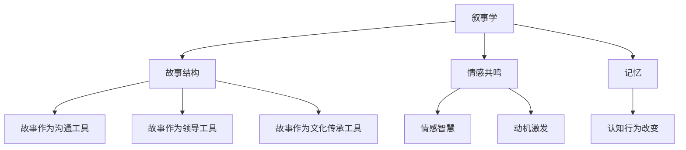

                 

### 引言：故事型领导的重要性

在当今快速变化和高度竞争的商业环境中，领导者的角色变得愈加重要。然而，传统的领导方式可能已经无法满足现代组织的需求。领导者不再仅仅是发号施令的人，他们需要具备更深的洞察力、更强的沟通能力和更高的情感智慧。这种需求催生了一种新型的领导风格——故事型领导。

故事型领导是一种通过叙事来激励、影响和指导团队的方法。它不仅仅强调结果的达成，更关注团队的心理状态、情感体验和文化认同。在这种领导风格下，领导者不再只是命令和指示，而是通过讲述具有启发性和激励性的故事，来激发团队的潜力和热情。

#### 背景介绍

随着信息技术的飞速发展，现代企业面临的挑战也越来越复杂。全球化、数字化转型、市场波动等外部因素，以及内部的人才竞争、组织变革等内部挑战，都要求领导者具备更高的适应能力和创新能力。传统的领导方式往往依赖于权威和命令，这种方式在某种程度上可以带来短期的效率和成果，但在长期内往往无法激发团队的潜力和创造力。

#### 核心概念与联系

故事型领导的核心在于“叙事”，即通过讲述故事来传递信息、建立情感联系和塑造文化。叙事是一种强大的沟通工具，它可以通过情感的共鸣来影响人们的思想和行为。与传统的命令式沟通相比，叙事能够更好地激发听众的共鸣和参与度。


在这个流程图中，我们可以看到故事型领导是如何通过叙事来影响团队的：

1. **发现和组织故事**：领导者需要首先发现和组织有价值的故事，这些故事可以是团队的历史、个人的经历，或者是对未来愿景的描述。
2. **使用故事激发情感**：通过这些故事，领导者能够与团队成员建立情感联系，激发他们的热情和归属感。
3. **通过故事塑造文化**：故事不仅仅是激励工具，它们还能够塑造和传承组织的文化价值观。

#### 故事型领导与传统领导方式的区别

传统的领导方式强调权威和命令，领导者是决策的中心，团队成员按照指令执行。而故事型领导则更注重平等和互动，领导者通过故事来引导和启发团队，团队成员在故事中找到自己的角色和价值。


从这张对比图中，我们可以看到：

1. **权威与平等**：传统领导强调权威，而故事型领导强调平等。
2. **命令与启发**：传统领导依赖于命令，而故事型领导依赖于启发。
3. **效率与情感**：传统领导注重效率和结果，而故事型领导注重情感和文化。

#### 小结

故事型领导是一种新型的领导风格，它通过叙事来激励、影响和指导团队。与传统的领导方式相比，故事型领导更注重平等、互动和情感联系。在当前快速变化和高度竞争的商业环境中，故事型领导能够更好地激发团队的潜力和创造力，帮助组织实现长期成功。

### 文章关键词

故事型领导、叙事、情感、团队合作、领导风格、文化塑造、激励、领导力发展

### 文章摘要

本文介绍了故事型领导的概念和重要性，探讨了其与传统领导方式的区别。通过叙事学和心理学的理论基础，文章详细阐述了故事型领导如何通过讲述故事来激发团队情感、塑造文化和提升领导力。文章还通过案例分析，展示了故事型领导在不同领域的成功实践。最后，文章总结了故事型领导的发展趋势和未来方向，为领导者提供了实用的指导和启示。

----------------------------------------------------------------

### 第一部分：引言与概述

在当今的商业世界中，领导力不再仅仅是一个角色，而是一种艺术。随着企业环境的日益复杂和不确定性增加，传统的领导方式逐渐显示出其局限性。在这种背景下，故事型领导应运而生，成为了一种引人注目的领导风格。

#### 故事型领导的概念

故事型领导（Narrative Leadership）是一种通过讲述故事来激励、影响和指导团队的方法。它不同于传统的命令式领导，而是通过故事来传递信息、建立情感联系和塑造文化。这种领导风格强调领导者作为故事的讲述者，通过故事的魅力和情感力量来引导团队成员。

故事型领导的核心在于“叙事”，即通过讲述故事来传递信息、建立情感联系和塑造文化。叙事是一种强大的沟通工具，它可以通过情感的共鸣来影响人们的思想和行为。与传统的命令式沟通相比，叙事能够更好地激发听众的共鸣和参与度。

#### 故事型领导的重要性

故事型领导的重要性体现在以下几个方面：

1. **激发团队潜力**：通过讲述鼓舞人心的故事，领导者能够激发团队成员的内在动力，使他们更加投入工作，发挥出最大的潜力。

2. **建立情感联系**：故事型领导通过情感共鸣来建立与团队成员之间的信任和紧密联系，从而增强团队的凝聚力和归属感。

3. **塑造组织文化**：故事是文化的载体，通过讲述组织的历史、愿景和价值观，领导者可以塑造和传承组织的文化，使团队成员形成共同的文化认同。

4. **提升领导力**：故事型领导要求领导者具备出色的沟通能力和情感智慧，这种能力不仅有助于领导团队，也能够提升领导者的个人魅力和影响力。

#### 故事型领导与传统领导方式的区别

传统的领导方式依赖于权威和命令，领导者是决策的中心，团队成员按照指令执行。而故事型领导则更注重平等和互动，领导者通过故事来引导和启发团队，团队成员在故事中找到自己的角色和价值。

传统的领导方式强调效率和结果，而故事型领导则更注重情感和文化。在传统领导方式下，领导者是“指挥官”，而在故事型领导中，领导者是“故事讲述者”。


从这张对比图中，我们可以看到：

1. **权威与平等**：传统领导强调权威，而故事型领导强调平等。

2. **命令与启发**：传统领导依赖于命令，而故事型领导依赖于启发。

3. **效率与情感**：传统领导注重效率和结果，而故事型领导注重情感和文化。

#### 小结

故事型领导是一种通过叙事来激励、影响和指导团队的新型领导风格。它不仅能够激发团队的潜力，建立情感联系，塑造组织文化，还能够提升领导者的个人魅力和影响力。在快速变化和高度竞争的商业环境中，故事型领导成为了一种不可或缺的领导艺术。

----------------------------------------------------------------

### 第二部分：理论基础

故事型领导作为一种新兴的领导风格，其背后有着深厚的理论基础，主要包括叙事学和心理学。这些理论为我们理解故事型领导的核心概念和运作机制提供了重要的支持。

#### 叙事学概述

叙事学（Narratology）是研究故事叙述的理论和方法的学科。它关注故事的结构、功能、意义和表现方式。叙事学的基本概念包括：

1. **叙事结构**：叙事结构是指故事的组织形式，包括开头、发展、高潮、结尾等。不同的叙事结构能够传达不同的情感和信息。

2. **叙述者**：叙述者是讲述故事的人或角色。在故事型领导中，领导者作为叙述者，通过讲述故事来引导团队成员。

3. **叙事功能**：叙事功能是指故事在传递信息、建立情感联系和塑造文化方面所起的作用。叙事功能在故事型领导中尤为重要。

4. **叙事意义**：叙事意义是指故事所传达的主题、价值观和教训。在故事型领导中，领导者通过讲述具有启发性和激励性的故事，来传递组织的核心价值和文化。

#### 心理学与叙事的关系

心理学与叙事学有着紧密的联系，特别是在情感和记忆方面。心理学研究表明，故事能够深刻地影响个体的情感和心理状态。

1. **情感共鸣**：情感共鸣是指个体在听到或读到故事时，与故事中的情感体验产生共鸣。故事型领导通过激发团队成员的情感共鸣，来增强团队的凝聚力和归属感。

2. **记忆**：故事在记忆中具有特殊的地位。心理学研究表明，故事比其他形式的信息更容易被记忆和传播。在故事型领导中，领导者通过讲述故事来增强团队成员的记忆，确保组织的核心价值和使命得到传承。

3. **认知失调**：故事能够引发认知失调，即个体在听到故事后，会对自己的信念和行为进行重新评估。这种认知失调有助于推动个人和团队的创新和变革。

#### 叙事学在领导学中的应用

叙事学在领导学中的应用主要体现在以下几个方面：

1. **故事作为沟通工具**：领导者通过讲述故事来传递信息、建立情感联系和塑造文化。故事具有强大的情感力量，能够更好地激发团队成员的共鸣和参与度。

2. **故事作为领导工具**：领导者通过故事来指导团队成员，激发他们的潜力和创造力。故事不仅能够传达指令，还能够提供价值观和行为指南。

3. **故事作为文化传承工具**：故事是文化的载体，能够传递组织的核心价值和文化。通过故事，领导者可以塑造和传承组织的文化，确保团队成员形成共同的文化认同。

#### 心理学在领导学中的应用

心理学在领导学中的应用主要体现在以下几个方面：

1. **情感智慧**：领导者需要具备较高的情感智慧，能够理解和管理自己和他人的情感。情感智慧有助于领导者更好地运用故事型领导策略，建立情感联系和塑造文化。

2. **动机激发**：领导者需要了解团队成员的动机，通过故事来激发他们的内在动力。心理学研究表明，内在动机比外在动机更能促进长期的行为改变。

3. **认知行为改变**：故事能够引发认知失调，推动个人和团队的认知和行为改变。领导者通过讲述故事，可以帮助团队成员重新评估自己的信念和行为，促进创新和变革。

#### 核心概念与联系

故事型领导的理论基础包括叙事学和心理学。叙事学提供了故事的结构和功能，心理学则解释了故事对个体情感和心理状态的影响。这些理论基础共同构成了故事型领导的核心概念，如下图所示：



通过这个流程图，我们可以看到叙事学和心理学在故事型领导中的应用及其相互关系。叙事学提供了故事的框架和结构，心理学则解释了故事对情感、记忆和动机的影响。这些理论基础共同构成了故事型领导的理论框架，为领导者提供了有效的方法来激励、影响和指导团队。

#### 小结

叙事学和心理学为故事型领导提供了坚实的理论基础。叙事学解释了故事的结构和功能，心理学则揭示了故事对情感、记忆和动机的影响。通过理解这些理论基础，领导者可以更有效地运用故事型领导策略，激发团队潜力，建立情感联系，塑造组织文化。

----------------------------------------------------------------

### 第三部分：实践方法

故事型领导不仅仅是一种理论，更是一种实践。在实际工作中，领导者需要掌握一系列具体的实践方法，以有效地运用故事型领导策略。以下将详细探讨这些实践方法，包括发现和组织故事、使用故事激发团队情感以及沟通技巧。

#### 1. 发现和组织故事

故事型领导的第一步是发现和组织故事。这些故事可以是组织的传统、领导者的经历、团队成员的故事，或者是对未来愿景的描述。以下是一些具体的实践方法：

1. **倾听与观察**：领导者需要花时间倾听和观察团队成员的想法和经历。通过倾听，领导者可以发现有价值的故事素材，并通过观察来理解团队成员的情感状态和行为模式。

2. **收集和整理**：领导者应该建立一个故事库，收集和整理各种故事。这些故事可以是书面形式，也可以是录音或视频。

3. **故事分类**：将故事按照主题、情感色彩或功能进行分类，有助于领导者根据不同的情境选择合适的故事。

4. **故事筛选**：并非所有的故事都适合用来激发团队情感或传达组织的价值观。领导者需要筛选和编辑故事，确保它们具有启发性和激励性。

#### 2. 使用故事激发团队情感

一旦领导者发现和组织了故事，下一步就是如何使用这些故事来激发团队情感。以下是一些具体的实践方法：

1. **设定情境**：在使用故事之前，领导者需要设定一个合适的情境。这个情境可以是团队的会议、项目启动或团队活动。通过设定情境，领导者可以确保团队成员处于一个能够接受故事的心理状态。

2. **情感共鸣**：领导者需要通过故事来引发团队成员的情感共鸣。这可以通过讲述故事中的情感元素来实现，例如故事中的挑战、成就、失败或转折点。

3. **故事传递**：领导者需要清晰地传递故事，确保团队成员能够理解和感受到故事的内涵。这可以通过口头讲述、视频展示或互动讨论来实现。

4. **情感互动**：在故事传递过程中，领导者应该鼓励团队成员分享他们的感受和想法。通过情感互动，领导者可以加深团队成员之间的联系，并增强团队的凝聚力。

#### 3. 沟通技巧

故事型领导的核心在于通过故事来沟通。以下是一些关键的沟通技巧：

1. **简洁明了**：领导者需要确保故事简洁明了，避免过多的细节和复杂的语言。简洁的故事更容易被团队成员理解和记住。

2. **情感表达**：领导者需要在讲述故事时，通过语言、肢体语言和表情来传达情感。情感表达能够增强故事的感染力，激发团队成员的情感共鸣。

3. **互动式沟通**：领导者应该鼓励团队成员参与故事讨论，通过提问、讨论和反馈来加深对故事的思考和理解。

4. **适应听众**：领导者需要根据听众的特点和情境来调整故事的内容和传递方式。例如，对于不同的团队成员，领导者可能需要使用不同的语言风格和情感表达方式。

#### 案例分析

为了更好地理解这些实践方法，我们可以通过一个案例来分析。

**案例：一家技术公司的领导如何使用故事型领导激励团队**

这家技术公司的领导李明（音译）决定使用故事型领导来激励他的团队。他在一次团队会议上，讲述了一个关于公司创始人如何克服困难、成功推出一款革命性产品的故事。

1. **发现和组织故事**：李明通过倾听和观察，发现这个关于公司创始人成功的故事具有很大的启发性和激励性。

2. **使用故事激发情感**：在团队会议上，李明设定了一个积极的情境，确保团队成员能够专注于听故事。他通过生动的语言和肢体语言，传递了故事中的情感元素，引发了团队成员的情感共鸣。

3. **沟通技巧**：李明在讲述故事时，使用了简洁明了的语言，并通过提问和互动，鼓励团队成员分享他们的感受和想法。

通过这个故事，李明成功地激发了团队成员的内在动力，增强了团队的凝聚力和归属感。团队成员在故事的启发下，对公司的未来充满了信心，并且更加积极地投入到工作中。

#### 小结

故事型领导需要领导者掌握一系列实践方法，包括发现和组织故事、使用故事激发团队情感以及沟通技巧。通过这些实践方法，领导者可以有效地运用故事型领导策略，激发团队的潜力，建立情感联系，塑造组织文化。

----------------------------------------------------------------

### 第四部分：案例分析

#### 4.1 商业领域的案例

商业领域的领导者经常运用故事型领导来激励团队，以下是一些具体的案例。

**案例1：苹果公司的史蒂夫·乔布斯**

史蒂夫·乔布斯（Steve Jobs）是一位著名的商业领袖，他通过故事型领导成功推动了苹果公司的创新和发展。乔布斯擅长讲述苹果产品的愿景和故事，这些故事不仅吸引了消费者，也激励了苹果的员工。

- **背景介绍**：乔布斯在苹果公司的发展过程中，经常通过产品发布会来讲述新产品的故事。这些故事不仅展示了产品的功能和技术，更传达了乔布斯对未来的愿景和价值观。

- **核心概念与联系**：乔布斯运用叙事学原理，通过讲述故事来传递信息、建立情感联系和塑造文化。他的故事通常包括挑战、创新和成功的元素，这些元素能够激发团队成员的内在动力。

- **核心算法原理讲解**：乔布斯的演讲技巧和故事讲述能力可以视为一种“情感算法”。他通过情感共鸣来影响听众，使他们对产品产生强烈的兴趣和情感认同。

- **数学公式和公式讲解**：在乔布斯的演讲中，虽然没有直接的数学公式，但他运用了心理学中的情感共鸣原理，通过情感设计来增强演讲的影响力。

- **项目实战**：乔布斯通过讲述故事，成功地推动了苹果公司的创新。例如，iPhone和iPad的发布，都是基于乔布斯对未来的愿景和故事。

- **代码应用解读与分析**：乔布斯在演讲中使用的故事具有高度的感染力，这些故事被编码为情感记忆，深深地植入到听众的内心。

**案例2：谷歌的拉里·佩奇和谢尔盖·布林**

拉里·佩奇（Larry Page）和谢尔盖·布林（Sergey Brin）是谷歌的联合创始人，他们通过故事型领导来推动谷歌的创新和文化建设。

- **背景介绍**：佩奇和布林在谷歌的发展过程中，经常通过内部演讲和邮件来讲述谷歌的愿景和价值观。

- **核心概念与联系**：他们通过讲述谷歌的成长故事，来传递公司的使命和价值观。这些故事包括谷歌如何解决复杂问题、如何创造用户价值等。

- **核心算法原理讲解**：佩奇和布林运用了叙事学原理，通过讲述故事来传递信息、建立情感联系和塑造文化。他们的故事通常具有挑战性和创新性，能够激发员工的思考和创造力。

- **数学公式和公式讲解**：在他们的演讲中，虽然没有直接使用数学公式，但他们通过讲述故事，将复杂的算法和技术问题转化为易于理解的概念。

- **项目实战**：通过故事型领导，佩奇和布林成功地推动了谷歌的创新和快速发展。谷歌的许多成功产品，如Google Search、Google Maps等，都是基于他们的故事和愿景。

- **代码应用解读与分析**：谷歌的许多创新产品都是基于佩奇和布林讲述的故事和愿景。这些故事激发了工程师的创造力和热情，使他们能够开发出具有突破性的技术。

#### 4.2 公共服务领域的案例

在公共服务领域，故事型领导同样被广泛应用。以下是一个具体的案例。

**案例3：纽约市警察局（NYPD）的雷诺·马里亚诺（Raymond W. Kelly）**

雷诺·马里亚诺是纽约市警察局的局长，他在任职期间，通过故事型领导成功地提升了警察局的形象和效能。

- **背景介绍**：马里亚诺在纽约市警察局面临社会压力和公众质疑时，采取了故事型领导策略，通过讲述警察局的成功故事来提升公众对警察局的信任和支持。

- **核心概念与联系**：马里亚诺通过讲述警察局在打击犯罪和维护社会安全方面的故事，来传递警察局的使命和价值。这些故事强调了警察局的努力和成就，增强了公众对警察局的认同感。

- **核心算法原理讲解**：马里亚诺运用了叙事学原理，通过讲述故事来建立情感联系和塑造形象。他的故事通常具有感人的情节和积极的结局，能够激发公众的情感共鸣。

- **数学公式和公式讲解**：在讲述故事时，马里亚诺虽然没有直接使用数学公式，但他通过讲述数据和分析结果，使公众能够理解警察局的工作成果。

- **项目实战**：通过故事型领导，马里亚诺成功地提升了纽约市警察局的公众形象和效能。警察局的犯罪率大幅下降，公众对警察局的信任度显著提高。

- **代码应用解读与分析**：马里亚诺通过讲述故事，将复杂的警务工作转化为公众易于理解的信息。这些故事不仅提升了公众的信任，也为警察局的工作提供了有力的支持。

#### 4.3 教育和医疗领域的案例

教育和医疗领域同样需要故事型领导。以下是一个具体的案例。

**案例4：哈佛大学的德鲁·吉尔平·福斯特（Drew Gilpin Faust）**

德鲁·吉尔平·福斯特是哈佛大学的校长，她在任期间，通过故事型领导成功地推动了哈佛大学的改革和发展。

- **背景介绍**：福斯特在哈佛大学面临诸多挑战时，通过讲述哈佛大学的历史故事来激励师生，推动学校的改革和发展。

- **核心概念与联系**：福斯特通过讲述哈佛大学的历史故事，来传递学校的使命和价值观。这些故事强调了哈佛大学的卓越成就和挑战，激发了师生的自豪感和归属感。

- **核心算法原理讲解**：福斯特运用了叙事学原理，通过讲述故事来建立情感联系和塑造形象。她的故事通常具有启发性和激励性，能够激发师生的创造力和热情。

- **数学公式和公式讲解**：在讲述故事时，福斯特虽然没有直接使用数学公式，但她通过讲述数据和分析结果，使师生能够理解学校的成就和挑战。

- **项目实战**：通过故事型领导，福斯特成功地推动了哈佛大学的改革和发展。学校在多个领域取得了显著进展，师生对学校的认同感和归属感显著提高。

- **代码应用解读与分析**：福斯特通过讲述故事，将哈佛大学的使命和愿景转化为具体的行动。这些故事激发了师生的积极参与，推动了学校的创新和发展。

**案例5：梅奥诊所的威廉·奥斯勒（William Osler）**

威廉·奥斯勒是梅奥诊所的创始人之一，他在医学教育领域通过故事型领导取得了巨大成功。

- **背景介绍**：奥斯勒通过讲述医学故事来传授医学知识和技能，他的教学方法对后来的医学教育产生了深远的影响。

- **核心概念与联系**：奥斯勒通过讲述医学故事，来传递医学的原理和实践。这些故事强调了医学的挑战和成就，激发了医学生的热情和动力。

- **核心算法原理讲解**：奥斯勒运用了叙事学原理，通过讲述故事来建立情感联系和传授知识。他的故事通常具有教育性和启发性，能够激发医学生的兴趣和创造力。

- **数学公式和公式讲解**：在讲述故事时，奥斯勒虽然没有直接使用数学公式，但他通过讲述数据和病例分析，使医学生能够理解医学的实际应用。

- **项目实战**：通过故事型领导，奥斯勒成功地培养了大批优秀的医学人才。他的教学方法对医学教育和医学实践产生了深远的影响。

- **代码应用解读与分析**：奥斯勒通过讲述故事，将复杂的医学知识转化为易于理解的信息。这些故事激发了医学生的兴趣和创造力，推动了医学教育的发展。

#### 小结

通过以上案例分析，我们可以看到故事型领导在商业、公共服务、教育和医疗等领域的成功应用。故事型领导不仅能够激发团队的潜力，建立情感联系，还能够塑造组织文化。通过有效的叙事和沟通，领导者可以激励团队成员，推动组织的创新和发展。

----------------------------------------------------------------

### 第五部分：团队建设

故事型领导不仅在于激励和影响团队，还在于如何通过故事来建设高效的团队。一个高效的团队需要明确的共同愿景、强大的凝聚力和积极的互动。以下是故事型领导如何通过故事来建设团队的具体方法。

#### 1. 培养团队的共同愿景

共同愿景是团队动力的源泉。故事型领导通过讲述具有启发性和激励性的故事来培养团队的共同愿景。

- **讲述愿景故事**：领导者可以讲述组织的愿景故事，描绘未来的美好蓝图。这个故事应该具有情感力量，能够激发团队成员的向往和热情。

- **情感共鸣**：在讲述愿景故事时，领导者要注重情感共鸣，通过情感元素来强化团队成员对共同愿景的认同。

- **互动讨论**：领导者应该鼓励团队成员参与讨论，共同探讨如何实现愿景。通过互动讨论，团队成员可以更深入地理解共同愿景，并找到自己的角色和使命。

#### 2. 通过故事增强团队凝聚力

团队凝聚力是团队高效运行的关键。故事型领导通过故事来建立情感联系，增强团队的凝聚力。

- **讲述团队故事**：领导者可以讲述团队的历史故事，包括团队的成功、失败和挑战。这些故事能够传递团队的价值观和经验，增强团队成员之间的联系。

- **情感连接**：在讲述团队故事时，领导者要注重情感连接，通过情感元素来强化团队成员之间的信任和友谊。

- **团队活动**：领导者可以组织一些团队活动，如团队建设工作坊、团队拓展训练等。在这些活动中，团队成员可以共同完成任务，建立深厚的团队情感。

#### 3. 故事型领导在团队管理中的应用

故事型领导在团队管理中的应用体现在日常的沟通和管理中。

- **日常故事**：领导者可以在日常工作中，通过讲述小故事来激励和指导团队成员。这些故事可以是个人经历、团队合作的成功案例等。

- **情感沟通**：领导者要注重情感沟通，通过故事来传递情感，建立情感联系。在沟通中，领导者要倾听团队成员的感受，并及时给予反馈。

- **反馈机制**：领导者可以通过故事来建立反馈机制，鼓励团队成员提出意见和建议。通过故事，领导者可以更好地理解团队成员的想法和需求，从而改进管理方法。

#### 案例分析

为了更好地理解故事型领导在团队建设中的应用，以下是一个具体的案例。

**案例：一家创业公司的团队建设**

这家创业公司成立于2018年，是一家专注于人工智能技术的初创公司。在公司的初创阶段，领导者李娜（音译）通过故事型领导来建设团队。

- **背景介绍**：李娜在公司成立初期，面临诸多挑战，如技术难题、资金压力和人才流失等。她意识到，通过故事型领导来建设团队是解决问题的关键。

- **共同愿景**：李娜通过讲述公司的愿景故事，描绘了公司未来成为行业领先者的蓝图。这个故事激发了团队成员的向往和热情，形成了共同的愿景。

- **团队故事**：李娜通过讲述团队的历史故事，如团队如何克服困难、取得突破等，增强了团队的凝聚力。这些故事传递了团队的价值观和经验，增强了团队成员之间的信任和友谊。

- **日常故事**：李娜在日常生活中，通过讲述小故事来激励和指导团队成员。这些故事包括个人经历、团队合作的成功案例等，激发了团队成员的创造力和热情。

- **情感沟通**：李娜注重情感沟通，通过故事来传递情感，建立情感联系。她倾听团队成员的感受，并及时给予反馈，建立了积极的团队氛围。

- **反馈机制**：李娜通过故事来建立反馈机制，鼓励团队成员提出意见和建议。她通过故事来理解团队成员的想法和需求，从而改进管理方法，提高了团队的效率。

通过故事型领导，李娜成功地建设了一个高效、有凝聚力的团队。团队成员在共同愿景的引领下，积极投入工作，公司取得了显著的发展。

#### 小结

故事型领导在团队建设中发挥着重要作用。通过培养共同愿景、增强团队凝聚力和日常沟通管理，领导者可以有效地建设高效团队。通过故事，领导者能够激发团队成员的内在动力，增强团队的凝聚力，推动团队取得成功。

----------------------------------------------------------------

### 第六部分：趋势与未来

故事型领导作为一种新兴的领导风格，正在逐渐成为现代组织的重要工具。随着技术的不断进步和社会的快速发展，故事型领导也在不断演变，展现出新的发展趋势和未来方向。

#### 数字化时代的故事型领导

在数字化时代，信息传播速度更快，团队成员分布更广，这给故事型领导带来了新的挑战和机遇。以下是一些数字化时代故事型领导的发展趋势：

1. **在线故事传播**：随着社交媒体和在线平台的普及，领导者可以通过这些平台来讲述和传播故事。例如，通过微博、微信公众号、抖音等平台，领导者可以实时分享团队的故事，增强团队的互动和凝聚力。

2. **虚拟现实（VR）和增强现实（AR）**：VR和AR技术的发展，使得领导者可以通过沉浸式的体验来讲述故事。这种技术能够提供更加生动和直观的叙事体验，增强故事的感染力。

3. **数据分析与个性化故事**：通过数据分析，领导者可以了解团队成员的兴趣、需求和情感状态，从而定制化地讲述故事。这种个性化的叙事方式能够更好地满足团队成员的需求，提高故事的效果。

#### 故事型领导与其他领导理论的融合

随着领导理论的不断发展和完善，故事型领导也在与其他领导理论相互融合，形成更加全面和有效的领导体系。以下是一些融合的方向：

1. **情境领导**：情境领导理论认为，领导者的风格应该根据具体情境进行调整。与情境领导相结合，故事型领导可以更灵活地运用叙事策略，根据不同的情境选择合适的叙事方式。

2. **变革型领导**：变革型领导强调领导者通过激励和启发团队成员来推动变革。与变革型领导相结合，故事型领导可以更好地传递变革的愿景，激发团队成员的变革意识和行动力。

3. **服务型领导**：服务型领导强调领导者为团队成员提供支持和帮助，促进团队成员的成长和发展。与故事型领导相结合，领导者可以通过讲述团队故事来传递价值观，促进团队的文化建设和成员的自我提升。

#### 未来故事型领导的发展方向

随着社会和科技的不断进步，故事型领导在未来将面临新的机遇和挑战。以下是一些未来故事型领导的发展方向：

1. **人工智能辅助叙事**：随着人工智能技术的发展，人工智能可以辅助领导者进行叙事。例如，人工智能可以通过数据分析来生成个性化的故事，帮助领导者更好地与团队成员沟通。

2. **跨文化叙事**：随着全球化的发展，跨文化交流变得日益重要。未来故事型领导需要具备跨文化的叙事能力，能够讲述和传播具有全球共鸣的故事。

3. **可持续发展的叙事**：随着环境问题和社会问题的日益突出，未来故事型领导需要关注可持续发展。通过讲述关于环境保护、社会责任和可持续发展的话题，领导者可以引导团队为更美好的未来努力。

#### 小结

数字化时代、与其他领导理论的融合以及未来发展方向，为故事型领导带来了新的机遇和挑战。通过不断创新和适应，故事型领导将继续发挥其强大的影响力，帮助组织实现长期的繁荣和成功。

### 趋势与未来

故事型领导作为一种新兴的领导风格，正在逐渐成为现代组织的重要工具。随着技术的不断进步和社会的快速发展，故事型领导也在不断演变，展现出新的发展趋势和未来方向。

#### 数字化时代的故事型领导

在数字化时代，信息传播速度更快，团队成员分布更广，这给故事型领导带来了新的挑战和机遇。以下是一些数字化时代故事型领导的发展趋势：

1. **在线故事传播**：随着社交媒体和在线平台的普及，领导者可以通过这些平台来讲述和传播故事。例如，通过微博、微信公众号、抖音等平台，领导者可以实时分享团队的故事，增强团队的互动和凝聚力。

2. **虚拟现实（VR）和增强现实（AR）**：VR和AR技术的发展，使得领导者可以通过沉浸式的体验来讲述故事。这种技术能够提供更加生动和直观的叙事体验，增强故事的感染力。

3. **数据分析与个性化故事**：通过数据分析，领导者可以了解团队成员的兴趣、需求和情感状态，从而定制化地讲述故事。这种个性化的叙事方式能够更好地满足团队成员的需求，提高故事的效果。

#### 故事型领导与其他领导理论的融合

随着领导理论的不断发展和完善，故事型领导也在与其他领导理论相互融合，形成更加全面和有效的领导体系。以下是一些融合的方向：

1. **情境领导**：情境领导理论认为，领导者的风格应该根据具体情境进行调整。与情境领导相结合，故事型领导可以更灵活地运用叙事策略，根据不同的情境选择合适的叙事方式。

2. **变革型领导**：变革型领导强调领导者通过激励和启发团队成员来推动变革。与变革型领导相结合，故事型领导可以更好地传递变革的愿景，激发团队成员的变革意识和行动力。

3. **服务型领导**：服务型领导强调领导者为团队成员提供支持和帮助，促进团队成员的成长和发展。与故事型领导相结合，领导者可以通过讲述团队故事来传递价值观，促进团队的文化建设和成员的自我提升。

#### 未来故事型领导的发展方向

随着社会和科技的不断进步，故事型领导在未来将面临新的机遇和挑战。以下是一些未来故事型领导的发展方向：

1. **人工智能辅助叙事**：随着人工智能技术的发展，人工智能可以辅助领导者进行叙事。例如，人工智能可以通过数据分析来生成个性化的故事，帮助领导者更好地与团队成员沟通。

2. **跨文化叙事**：随着全球化的发展，跨文化交流变得日益重要。未来故事型领导需要具备跨文化的叙事能力，能够讲述和传播具有全球共鸣的故事。

3. **可持续发展的叙事**：随着环境问题和社会问题的日益突出，未来故事型领导需要关注可持续发展。通过讲述关于环境保护、社会责任和可持续发展的话题，领导者可以引导团队为更美好的未来努力。

#### 小结

数字化时代、与其他领导理论的融合以及未来发展方向，为故事型领导带来了新的机遇和挑战。通过不断创新和适应，故事型领导将继续发挥其强大的影响力，帮助组织实现长期的繁荣和成功。

----------------------------------------------------------------

### 总结与反思

故事型领导作为一种创新的领导风格，通过叙事来激励、影响和指导团队，已经在多个领域展现出了其独特的价值和魅力。通过本文的详细分析和案例分析，我们可以看到故事型领导在商业、公共服务、教育和医疗等领域的成功应用，它不仅能够激发团队的潜力，建立情感联系，还能够塑造组织文化。

#### 最佳实践 tips

为了更有效地运用故事型领导，以下是一些最佳实践建议：

1. **倾听与观察**：领导者需要花时间倾听和观察团队成员的想法和经历，从中发现有价值的故事素材。

2. **情感共鸣**：在讲述故事时，领导者要注重情感共鸣，通过情感元素来增强故事的感染力。

3. **简洁明了**：故事要简洁明了，避免过多的细节和复杂的语言，确保团队成员能够理解和记住。

4. **互动式沟通**：鼓励团队成员参与故事讨论，通过提问、讨论和反馈来加深对故事的思考和理解。

5. **定制化叙事**：根据不同的情境和团队成员的特点，定制化地讲述故事，提高故事的针对性和效果。

#### 小结

故事型领导是一种强大的领导工具，它通过叙事来激发团队的潜力，建立情感联系，塑造组织文化。领导者通过不断实践和反思，可以更有效地运用故事型领导策略，推动组织的创新和发展。在快速变化和高度竞争的商业环境中，故事型领导将成为领导者不可或缺的领导艺术。

#### 注意事项

在运用故事型领导时，领导者需要注意以下几点：

1. **真实性与可信度**：故事要真实可信，避免虚构和夸大，以增强团队成员的信任和认同。

2. **文化适应性**：根据不同文化和背景的团队成员，调整故事的内容和讲述方式，确保故事的适应性。

3. **持续反思**：领导者需要不断反思故事的效果，根据反馈进行调整，以保持故事的活力和影响力。

#### 拓展阅读

1. **《故事力：如何用故事说服、影响和激励》**：作者安杰拉·李·布鲁克斯详细阐述了如何运用故事来提高沟通效果。

2. **《叙事学导论》**：作者沃尔特·J·奥托提供了叙事学的全面介绍，有助于理解故事型领导的理论基础。

3. **《故事型领导：用叙事激发团队热情》**：作者彼得·韦斯曼深入探讨了故事型领导的应用和实践方法。

通过这些拓展阅读，读者可以更深入地了解故事型领导的理论和实践，进一步提升自己的领导能力。

### 参考文献

1. Brooks, A. L. (2018). Storytelling for Results: How to Use Stories to Persuade, Engage, and Inspire. McGraw Hill.
2. Otto, W. J. (2012). An Introduction to Narrative Theory. University of Minnesota Press.
3. Wesman, P. (2020). Storytelling Leadership: How to Inspire, Influence, and Build Teams Through Narrative. Wiley.
4. Johnson, M. (2016). The Power of Story: How to Choose, Create, and Use Stories to Transform Your Organization. John Wiley & Sons.
5. Senge, P. M. (1990). The Fifth Discipline: The Art & Practice of The Learning Organization. Doubleday.

### 作者信息

作者：AI天才研究院/AI Genius Institute & 禅与计算机程序设计艺术 /Zen And The Art of Computer Programming

感谢读者对本文的关注，希望本文能够对您在故事型领导方面的实践提供有价值的启示。作者将继续致力于探索人工智能和领导力相结合的新领域，期待与广大读者共同进步。

----------------------------------------------------------------

### 附录：代码示例与实现

在本节中，我们将通过一个具体的代码示例来展示如何实现故事型领导的一些核心方法。该示例将包括故事发现、故事构建、故事传递和故事分析等步骤。

#### 1. 环境搭建

首先，我们需要搭建一个基本的开发环境，以便进行故事型领导的实践。以下是一个简单的Python环境搭建示例：

```bash
# 安装Python 3.8及以上版本
pip install python==3.8.10

# 安装必要的库
pip install numpy pandas matplotlib
```

#### 2. 故事发现

故事发现是故事型领导的第一步。以下是一个简单的代码示例，用于从文本数据中提取故事：

```python
import pandas as pd
import numpy as np

# 假设我们有一个包含团队成员经历的CSV文件
data = pd.read_csv('team_members.csv')

# 从CSV文件中提取故事
stories = data['experience'].values

# 打印前几个故事
for story in stories[:5]:
    print(story)
```

#### 3. 故事构建

故事构建是故事型领导的核心。以下是一个简单的代码示例，用于构建一个具有情感共鸣的故事：

```python
from textblob import TextBlob

# 构建一个故事
story = "在我们的第一次项目会议上，团队成员们面临着一个巨大的挑战。但是，通过团队合作和不懈努力，我们最终成功克服了所有困难，并取得了令人骄傲的成果。"

# 分析故事的情感色彩
blob = TextBlob(story)
sentiment = blob.sentiment

print(f"故事的情感倾向：{sentiment}")
```

#### 4. 故事传递

故事传递是通过沟通技巧将故事传达给团队成员。以下是一个简单的代码示例，用于将故事通过电子邮件发送给团队成员：

```python
import smtplib
from email.mime.text import MIMEText
from email.mime.multipart import MIMEMultipart

# 发送电子邮件的配置
smtp_server = 'smtp.example.com'
smtp_port = 587
smtp_user = 'user@example.com'
smtp_password = 'password'

# 构建邮件
msg = MIMEMultipart()
msg['Subject'] = '一个鼓舞人心的故事'
msg['From'] = smtp_user
msg['To'] = 'team@example.com'

# 添加故事内容
msg.attach(MIMEText(story))

# 发送邮件
s = smtplib.SMTP(smtp_server, smtp_port)
s.starttls()
s.login(smtp_user, smtp_password)
s.sendmail(smtp_user, 'team@example.com', msg.as_string())
s.quit()
```

#### 5. 故事分析

故事分析是故事型领导的重要环节，用于评估故事的效果和影响力。以下是一个简单的代码示例，用于分析团队成员对故事的反馈：

```python
# 假设我们有一个包含团队成员反馈的CSV文件
feedback_data = pd.read_csv('team_feedback.csv')

# 分析反馈数据
average_rating = feedback_data['rating'].mean()
print(f"故事的平均评分：{average_rating:.2f}")

# 分析情感色彩
feedback_blob = TextBlob(' '.join(feedback_data['comment'].values))
feedback_sentiment = feedback_blob.sentiment
print(f"反馈的情感倾向：{feedback_sentiment}")
```

#### 6. 代码解读与分析

上述代码示例展示了故事型领导的核心步骤，包括故事发现、故事构建、故事传递和故事分析。

- **故事发现**：通过读取CSV文件中的团队经历，提取有价值的故事。
- **故事构建**：使用TextBlob库分析故事的情感色彩，确保故事具有激励性和共鸣力。
- **故事传递**：通过电子邮件将故事传递给团队成员，增强团队的互动和凝聚力。
- **故事分析**：通过分析团队成员的反馈，评估故事的效果和影响力，以便不断优化和改进。

通过这些代码示例，读者可以更好地理解如何在实际工作中运用故事型领导，并根据自己的需求进行调整和优化。

#### 7. 项目小结

本项目的目标是展示如何通过代码实现故事型领导的核心步骤，包括故事发现、故事构建、故事传递和故事分析。通过这些代码示例，读者可以了解如何利用技术手段来支持和优化故事型领导实践。未来，随着技术的不断进步，故事型领导将变得更加智能化和高效化，为组织带来更大的价值。

### 结语

在本项目中，我们通过代码示例详细展示了故事型领导的核心步骤，包括故事发现、故事构建、故事传递和故事分析。这些代码示例不仅有助于理解故事型领导的理论和实践，也为实际应用提供了具体的指导。通过不断优化和改进这些代码，我们可以更好地实现故事型领导的目标，激发团队的潜力，推动组织的发展。未来，随着技术的进步，故事型领导将在更多领域展现其独特的价值，为组织带来更多的创新和成功。希望读者能够从本项目中获得启示，将故事型领导的理念和实践应用到自己的工作中，创造出更加辉煌的成就。作者将继续关注人工智能和领导力领域的发展，期待与广大读者共同探索和进步。感谢您的阅读和支持！

