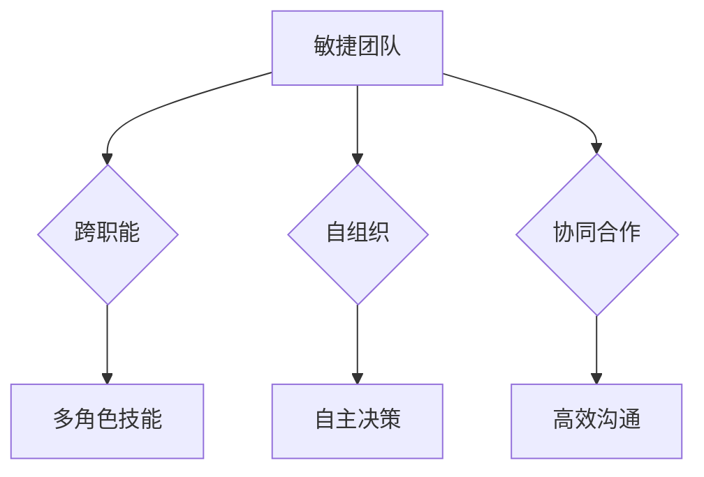
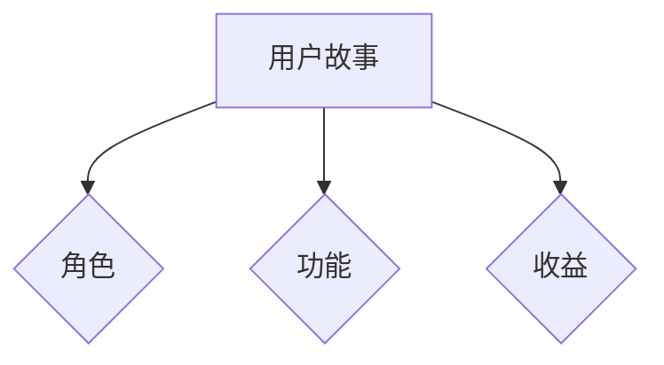
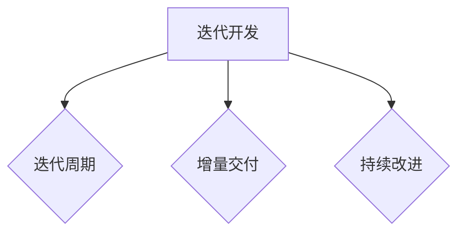
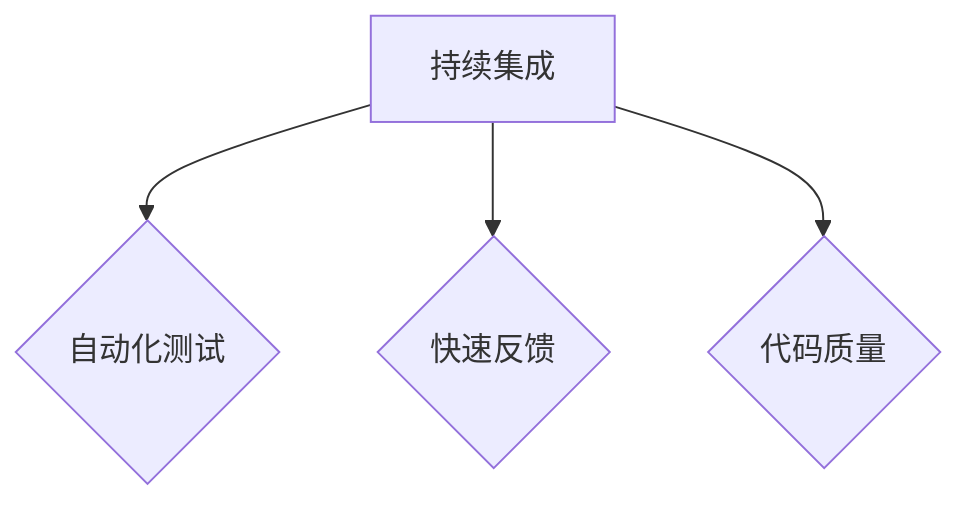
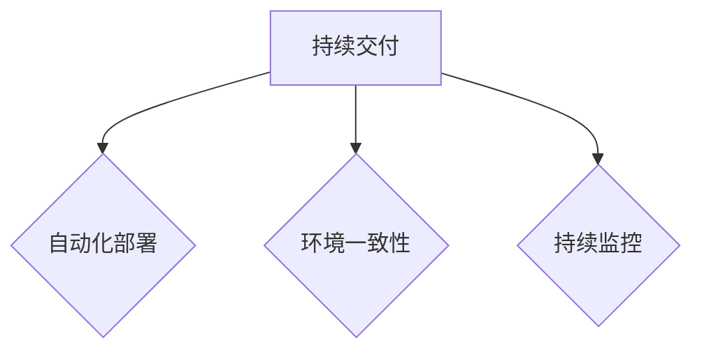

                 

### 引言

在当今快速变化和竞争激烈的技术领域中，敏捷团队已经成为许多企业成功的关键。敏捷团队以其高效、灵活和响应迅速的特点，帮助组织在复杂和不确定的环境中保持竞争力。然而，构建一个成功的敏捷团队并非易事，它需要深刻的理解、细致的规划和有效的执行。

本文旨在深入探讨敏捷团队的构建方法，帮助读者了解如何在不确定性中保持团队的灵活性。我们将从以下几个方面展开讨论：

1. **敏捷团队的基础概念**：解释敏捷团队的定义、与传统团队的区别，以及敏捷团队的价值观和原则。
2. **敏捷团队的构建与协作**：探讨敏捷团队的组织结构、角色与职责，以及协作工具与技术。
3. **敏捷团队在不确定性中的应对策略**：分析不确定性的来源，并介绍敏捷团队的适应策略。
4. **敏捷团队的领导力与沟通**：讨论敏捷团队的领导力模型、沟通技巧以及领导者如何支持敏捷团队。
5. **敏捷团队的工具与方法论**：介绍敏捷开发的方法论、敏捷团队中的敏捷工具，以及敏捷工具的选用与实施。
6. **敏捷团队的持续改进与成长**：探讨持续改进的原则与实践、敏捷团队的成长路径以及持续学习和个人成长。
7. **敏捷团队的实际案例研究**：通过实际案例研究，展示敏捷团队的成功实践、挑战与解决方案，以及敏捷团队的可持续性分析。

通过这一系列深入的分析和探讨，我们希望读者能够对敏捷团队的构建和运作有更深刻的理解，从而在实践中更好地运用敏捷方法，提升团队的整体效能。

### 背景介绍

在当今全球化的科技浪潮中，技术的变革速度前所未有。随着云计算、人工智能、物联网等新兴技术的迅猛发展，企业面临的市场环境和运营模式也在发生深刻的变化。传统的线性开发和运营模式已经难以适应这种快速变化的需求。在这种背景下，敏捷开发方法逐渐崭露头角，成为许多企业提升敏捷性和竞争力的有效手段。

敏捷开发最早起源于软件开发领域，它起源于1990年代末期对瀑布模型等传统开发方法的反思和改进。敏捷开发强调迭代、增量、协作和灵活性，其核心思想是通过不断的小步快跑和快速反馈，及时调整开发方向和策略，从而在不确定性和变化中找到最佳解决方案。敏捷开发方法的核心包括**用户故事**、**迭代开发**、**持续集成**和**持续交付**等实践。

敏捷团队作为一种灵活、高效的团队组织形式，与传统的职能型或项目型团队有显著不同。在敏捷团队中，成员通常具备多方面的技能，能够在短时间内快速响应变化，从而确保项目能够按时交付且满足用户需求。敏捷团队的构建不仅仅是为了提升开发效率，更是为了在整个团队中建立一种共享的目标感、责任感和协同合作的文化。

随着敏捷开发方法在企业中的应用越来越广泛，敏捷团队的重要性也越来越凸显。许多企业开始意识到，构建一个成功的敏捷团队是其在快速变化的市场环境中保持竞争优势的关键。敏捷团队不仅能够更快速地响应市场需求，还能够通过持续改进和迭代，不断提升产品的质量和用户满意度。

敏捷团队的成功离不开以下几个关键因素：

1. **透明度**：敏捷团队通常采用看板、站立会议等工具，以提高团队内部的透明度，确保每个成员都能清晰地了解项目进展和责任分工。
2. **自主性**：敏捷团队给予成员更多的自主权和决策权，鼓励成员主动思考和解决问题，从而提高团队的创造力和创新能力。
3. **协作**：敏捷团队强调跨职能协作，通过多角色、多技能的成员合作，快速响应复杂需求，提升整体团队的效能。
4. **灵活性**：敏捷团队能够快速适应变化，通过迭代和反馈机制，不断调整开发方向和策略，确保项目能够灵活应对市场变化。

总之，在快速变化的技术环境中，敏捷团队以其高效、灵活和响应迅速的特点，成为许多企业构建竞争优势的重要工具。本文将深入探讨敏捷团队的构建方法，帮助读者更好地理解如何在不确定性中保持敏捷性和灵活性。

### 核心概念与联系

在深入探讨敏捷团队的构建之前，我们需要明确几个核心概念，并理解它们之间的联系。以下是对敏捷团队中关键概念的详细解释和它们之间关系的流程图。

#### 敏捷团队

**定义**：敏捷团队是一种灵活的团队组织形式，它通过迭代和增量的方式，快速响应变化，持续交付高质量的产品。

**核心特点**：
- **跨职能**：敏捷团队成员通常具备多种技能，能够涵盖项目所需的各个领域。
- **自组织**：敏捷团队内部成员拥有一定的决策权，可以根据实际情况自主调整工作内容和优先级。
- **协同合作**：团队成员之间密切合作，通过高效的沟通和协作，共同推动项目进展。

**流程图**：

#### 用户故事

**定义**：用户故事是一种简短、明确的描述，用于定义产品的最小可交付单元，通常由三个部分组成：**As a [角色]，I want [功能]，so that [收益]**。

**核心要素**：
- **角色**：用户故事所描述的功能将服务于哪个用户角色。
- **功能**：用户故事所描述的具体功能需求。
- **收益**：用户故事实现后对用户或团队的收益。

**流程图**：

#### 迭代开发

**定义**：迭代开发是一种逐步完善产品的方法，通过将开发过程划分为多个短期迭代，每次迭代都生成一个可交付的产品版本。

**核心要素**：
- **迭代周期**：每个迭代通常持续几周，时间较短，有助于快速反馈和调整。
- **增量交付**：每次迭代都提供一部分完整的功能，逐步完善整个产品。
- **持续改进**：在每个迭代结束后，团队会进行反思和总结，以改进后续的迭代。

**流程图**：

#### 持续集成

**定义**：持续集成是一种软件开发实践，通过将代码定期集成到主干分支，确保开发中的代码质量。

**核心要素**：
- **自动化测试**：持续集成过程中会运行自动化测试，确保每次集成后的代码仍然符合质量标准。
- **快速反馈**：通过自动化测试和集成，能够快速发现问题并反馈，从而及时修复。
- **代码质量**：持续集成有助于发现和解决代码中的缺陷，提高整体代码质量。

**流程图**：

#### 持续交付

**定义**：持续交付是一种软件开发和部署的方法，确保产品可以随时发布，且在发布前经过充分的测试和验证。

**核心要素**：
- **自动化部署**：通过自动化工具，确保产品可以快速、安全地部署到生产环境。
- **环境一致性**：确保在不同环境中（如开发、测试、生产）的产品保持一致，减少因环境差异导致的问题。
- **持续监控**：在产品发布后，通过监控工具持续监测系统运行状态，及时发现并解决问题。

**流程图**：

通过上述流程图，我们可以清晰地看到敏捷团队中各个核心概念之间的联系。敏捷团队通过用户故事来定义产品需求，通过迭代开发和持续集成来逐步实现这些需求，并通过持续交付确保产品的持续改进和高质量交付。这些核心概念相互支持，共同构成了敏捷团队高效运作的基础。

### 敏捷团队的基础概念

要构建一个成功的敏捷团队，首先需要理解敏捷团队的基本概念，包括其与传统团队的区别、敏捷团队的价值观和原则。这些基础概念不仅是敏捷团队运作的基石，也是团队成员共同遵循的行为准则。

#### 敏捷团队与传统团队的比较

**定义与区别**：
敏捷团队与传统团队在定义和运作方式上有显著差异。传统团队通常按照职能划分，如开发、测试、设计等，每个团队独立运作。而敏捷团队则是跨职能的，成员拥有多种技能，可以同时参与项目的不同阶段，从而实现快速响应和高效协作。

**组织结构**：
传统团队的组织结构通常较为固定，层次分明，决策过程较为复杂。而敏捷团队则采用扁平化的组织结构，团队成员之间更加平等，决策更加快速和灵活。

**角色与职责**：
传统团队中，每个成员的角色和职责相对固定，而敏捷团队中的角色和职责则更加灵活。敏捷团队通常包括产品负责人（Product Owner）、开发人员、测试人员、设计师等，他们可以根据项目需求动态调整职责。

**沟通与协作**：
传统团队在沟通和协作方面通常存在障碍，因为不同的职能团队需要通过多级管理层进行信息传递。而敏捷团队强调频繁、开放的沟通和协作，通过站立会议、看板等工具，确保每个成员都能实时了解项目进展和需求变化。

#### 敏捷团队的价值观

**客户至上**：敏捷团队始终以客户需求为导向，确保产品的每个迭代都满足客户期望。

**协作**：敏捷团队强调团队合作，鼓励成员之间的相互支持和协作，共同推动项目成功。

**灵活应对变化**：敏捷团队能够灵活应对变化，通过迭代和反馈机制，及时调整计划和策略。

**持续交付**：敏捷团队追求持续交付高质量的产品，通过自动化测试和持续集成，确保每次交付都是可靠的。

**诚信与透明**：敏捷团队保持高度的透明度，通过公开会议、看板等工具，让每个成员都能清晰地了解项目进展和责任分工。

#### 敏捷原则

**个体和互动高于流程和工具**：敏捷团队重视团队成员的个性和互动，而不是过分依赖流程和工具。

**可工作的软件高于详尽的文档**：敏捷团队认为可工作的软件是首要目标，虽然文档也很重要，但应该简化。

**客户合作高于合同谈判**：敏捷团队注重与客户的合作，确保产品能够真正满足客户需求，而不是仅仅遵循合同条款。

**响应变化高于遵循计划**：敏捷团队灵活应对变化，通过迭代和反馈，不断优化产品，而不是盲目遵循初始计划。

**持续交付是重要的**：敏捷团队追求持续交付，确保产品始终处于可发布状态，随时可以交付给客户。

通过理解这些基础概念，我们可以更好地把握敏捷团队的核心精神和运作方式。敏捷团队不仅是一种团队组织形式，更是一种文化和价值观的体现，它鼓励团队成员在快速变化的环境中保持灵活性和创造性，从而实现更高的效率和效果。

### 敏捷团队的构建与协作

构建一个高效的敏捷团队是一个复杂的过程，它需要明确的组织结构、明确的角色与职责分工，以及高效的协作工具和技术。以下我们将详细探讨这些关键要素，以帮助读者更好地理解如何构建一个成功的敏捷团队。

#### 组织结构

敏捷团队的组织结构通常采用扁平化的形式，以减少层级和沟通障碍，促进团队成员之间的直接互动和协作。这种组织结构可以有效地提高团队的响应速度和决策效率。

**团队结构**：

1. **Scrum团队**：Scrum是敏捷开发中广泛采用的方法，其团队结构通常包括产品负责人（Product Owner）、Scrum Master和开发团队。产品负责人负责定义和优先级排序用户故事，Scrum Master负责确保团队遵循敏捷实践，开发团队则负责实现用户故事。

2. **Kanban团队**：Kanban团队采用看板（Kanban Board）来管理工作流程，团队成员可以自由地根据任务的状态在板上移动卡片，从而实时了解团队的进度和工作负载。

3. **LeSS团队**：LeSS（Large-Scale Scrum）适用于大型项目或组织，它通过扩展Scrum的原则，将多个Scrum团队整合成一个更大的团队，以实现跨团队协作。

**团队规模**：敏捷团队的规模通常较小，一般不超过10人，这样可以确保团队成员之间的沟通更加直接和有效。

#### 角色与职责

在敏捷团队中，每个角色都有明确的职责和目标，这些角色的协作是团队高效运作的关键。

**产品负责人（Product Owner）**：

- **职责**：定义产品的愿景和目标，制定产品需求，并与利益相关者沟通，确保团队的工作与客户需求一致。
- **目标**：最大化产品的价值，确保每个迭代都能交付具有商业价值的功能。

**Scrum Master**：

- **职责**：确保团队遵循敏捷实践，消除团队面临的障碍，提供敏捷培训和支持。
- **目标**：提高团队的敏捷性，确保团队能够持续改进和高效工作。

**开发团队**：

- **职责**：实现产品需求，编写代码，进行测试和部署。
- **目标**：交付高质量的可工作的软件，持续提升团队的技能和知识。

**其他角色**：除了上述核心角色外，敏捷团队还可以包括UI/UX设计师、测试工程师、运维人员等，根据项目的具体需求来配置。

#### 协作工具与技术

敏捷团队需要使用一系列工具和技术来支持团队协作和流程管理，以下是一些常用的工具：

**看板（Kanban Board）**：看板是一种可视化工具，用于展示团队的工作流程和工作项的状态。团队成员可以在看板上移动卡片，实时了解任务的状态和优先级。

**站立会议（Daily Stand-up）**：站立会议是每日进行的简短会议，团队成员分享当天的工作进展、遇到的问题和计划。这有助于团队保持同步和快速响应变化。

**迭代回顾（Sprint Retrospective）**：迭代回顾是在每个迭代结束时进行的会议，团队回顾过去的迭代，识别做得好的方面和需要改进的地方，从而持续改进团队的工作流程。

**用户故事地图**：用户故事地图是一种帮助团队理解产品愿景和用户需求的工具，它将用户故事组织成一条故事线，展示用户与产品交互的全过程。

**自动化测试**：自动化测试是确保代码质量的重要手段，通过自动化测试脚本，可以快速验证功能是否符合预期，减少手动测试的工作量。

**持续集成与持续交付**：持续集成和持续交付是敏捷开发的核心实践，通过自动化工具，确保每次代码提交都经过严格的测试和验证，从而快速交付高质量的产品。

**协作软件**：如Jira、Trello、Confluence等协作软件，可以帮助团队进行任务管理、文档共享和沟通协作，提高团队的整体效率。

通过明确的组织结构、明确的角色与职责分工，以及高效的协作工具和技术，敏捷团队可以实现快速响应变化、高效协作和持续交付高质量产品。这些要素相互支持，共同构成了敏捷团队高效运作的基础。

### 敏捷团队在不确定性中的应对策略

在快速变化的市场环境中，敏捷团队需要具备高度的灵活性和适应性，以便在不确定性中保持稳健运作。以下我们将深入探讨敏捷团队如何应对不确定性，并分析一些具体的方法和工具。

#### 不确定性的来源

不确定性在敏捷团队的运作中是一个常见且重要的考虑因素。不确定性的来源可能包括以下几个方面：

1. **市场需求变化**：客户需求可能随时变化，敏捷团队需要能够快速调整优先级和开发计划，以响应这些变化。
2. **技术演进**：新技术和工具的快速发展可能导致现有的解决方案变得过时，敏捷团队需要不断学习和适应新的技术趋势。
3. **资源限制**：项目资源（如人力、预算和时间）的限制可能影响团队的运作，敏捷团队需要通过有效管理资源来应对这些限制。
4. **外部因素**：如政策变化、市场波动等外部因素也可能对项目的进展产生重大影响。

#### 应对策略

1. **迭代和增量开发**：
   - **迭代开发**：将开发过程划分为多个短期迭代，每个迭代都有明确的交付目标和评估点。这种方法有助于团队在每次迭代中评估项目进展，并根据反馈进行调整。
   - **增量开发**：每次迭代交付一部分功能，逐步完善整个产品。这种方法可以降低项目风险，确保团队能够在不确定的环境中逐步实现产品。

2. **用户故事和优先级管理**：
   - **用户故事**：使用用户故事来定义和优先级排序功能需求。用户故事简单、明确，且容易调整，有助于团队快速响应变化。
   - **优先级管理**：根据价值和风险对用户故事进行优先级排序，确保团队首先实现最具价值和最低风险的特性。

3. **风险管理**：
   - **风险识别**：定期识别和评估项目中的潜在风险，确保团队能够提前准备和应对可能的问题。
   - **风险应对计划**：为每个风险制定应对策略，包括预防措施和应急方案，以降低风险对项目的影响。

4. **透明度和沟通**：
   - **透明度**：通过站立会议、看板、迭代回顾等工具，确保团队成员能够实时了解项目进展和需求变化，从而及时调整计划。
   - **沟通**：鼓励团队成员之间频繁、开放的沟通，确保信息在团队内部流畅传递，减少因信息不对称导致的误解和延误。

5. **持续学习和改进**：
   - **持续学习**：鼓励团队成员不断学习和掌握新的技能和知识，以应对不断变化的环境。
   - **持续改进**：通过迭代回顾和反思，团队可以识别和解决工作中的问题，不断提升团队效能。

#### 工具与技术

1. **看板（Kanban）**：
   - 看板是一种可视化工具，用于展示团队的工作流程和工作项的状态。通过看板，团队可以实时了解任务的状态和优先级，从而快速响应变化。

2. **敏捷规划工具**：
   - 如Jira、Trello等，这些工具可以帮助团队进行任务管理、优先级排序和迭代规划，提高团队的整体协调和效率。

3. **自动化测试**：
   - 自动化测试可以确保每次代码提交都经过严格的测试和验证，从而快速发现和解决问题，降低项目风险。

4. **持续集成与持续交付**：
   - 持续集成和持续交付是敏捷开发的核心实践，通过自动化工具，确保每次代码提交都经过测试和验证，从而快速交付高质量的产品。

通过上述方法和工具，敏捷团队可以在不确定性中保持灵活和稳健的运作。这些策略和工具相互支持，共同帮助团队在复杂和不确定的环境中实现持续交付和高效运作。

### 敏捷团队的领导力与沟通

敏捷团队的成功离不开有效的领导力和高效的沟通。领导者不仅是团队的引导者，更是团队成员的支持者和推动者。以下我们将深入探讨敏捷团队中的领导力模型、沟通技巧以及领导者如何支持敏捷团队，以确保团队在快速变化的环境中保持高效运作。

#### 领导力模型

敏捷团队通常采用** servant leadership（服务型领导）**模型，这种领导力强调领导者的职责是服务团队成员，帮助他们实现个人和团队的目标。服务型领导的主要特点包括：

1. **关注团队成员**：领导者关注团队成员的需求和成长，为成员提供必要的支持和资源，帮助他们克服困难。
2. **促进团队合作**：领导者鼓励团队成员之间的合作和沟通，确保团队目标的实现。
3. **授权与赋能**：领导者给予团队成员决策权和责任感，鼓励成员自主思考和解决问题，从而提高团队的创造力和创新能力。
4. **持续改进**：领导者鼓励团队成员不断学习和改进，通过反思和总结，提升团队的效能。

#### 沟通技巧

高效的沟通是敏捷团队成功的关键，以下是一些关键的沟通技巧：

1. **开放式沟通**：鼓励团队成员在团队中自由表达观点和意见，营造一个开放、包容的沟通氛围。
2. **主动倾听**：领导者需要具备良好的倾听能力，倾听团队成员的意见和需求，确保信息在团队内流畅传递。
3. **清晰传达**：领导者需要清晰、准确地传达信息，确保团队成员能够理解任务目标和期望。
4. **透明度**：保持团队内部的透明度，通过站立会议、看板等工具，让团队成员了解项目的进展和挑战。
5. **及时反馈**：领导者需要及时给予团队成员反馈，鼓励积极的行为，同时纠正不当的行为。

#### 领导者的支持角色

在敏捷团队中，领导者扮演着多重角色，包括：

1. **协调者**：领导者需要协调团队内外部的资源，确保团队能够获得所需的支持和资源，以实现项目目标。
2. **促进者**：领导者需要促进团队成员之间的协作和沟通，解决团队内部的冲突和问题。
3. **支持者**：领导者需要支持团队成员的成长和发展，提供培训和学习机会，帮助他们提升技能和知识。
4. **激励者**：领导者需要激励团队成员，激发他们的工作热情和创造力，确保团队能够在压力和挑战面前保持积极和高效。

#### 领导者如何支持敏捷团队

1. **建立信任**：建立信任是领导者支持敏捷团队的关键，通过开放、透明的沟通和真诚的态度，建立与团队成员之间的信任关系。
2. **鼓励自主性**：领导者应鼓励团队成员自主思考和决策，为团队成员提供必要的资源和指导，让他们能够在工作中发挥最大的潜力。
3. **提供反馈和指导**：领导者需要及时给予团队成员反馈和指导，帮助他们识别问题、改进工作，并不断成长。
4. **培养团队文化**：领导者需要培养一个积极、协作的团队文化，鼓励团队成员相互支持和帮助，共同实现团队目标。
5. **持续改进**：领导者应鼓励团队成员不断反思和总结，通过持续改进，提升团队的整体效能。

通过服务型领导力和高效的沟通技巧，领导者可以为敏捷团队提供有力的支持，帮助团队在快速变化的环境中保持高效运作和持续交付高质量的产品。

### 敏捷团队的工具与方法论

敏捷团队的成功不仅依赖于团队成员的协作和领导，还需要一系列工具和方法论的支持。这些工具和方法论帮助团队提高开发效率、确保代码质量、实现持续交付，并在不断变化的环境中保持敏捷性。以下我们将介绍敏捷团队中常用的工具、方法论以及它们的使用方法和优点。

#### 敏捷工具

1. **Jira**：
   - **用途**：Jira是一个流行的敏捷项目管理工具，用于任务管理、进度跟踪和团队协作。
   - **使用方法**：团队可以将用户故事和任务创建在Jira中，并使用看板视图进行任务管理。团队成员可以在Jira上进行任务分配、状态更新和进度跟踪。
   - **优点**：Jira提供了丰富的功能，如自动化工作流、集成插件等，可以帮助团队高效管理项目。

2. **Trello**：
   - **用途**：Trello是一个简单但功能强大的看板工具，用于任务管理和团队协作。
   - **使用方法**：团队可以将任务卡片创建在Trello的看板上，并根据任务的状态（如待办、进行中、已完成）在板上移动卡片。
   - **优点**：Trello界面直观，易于使用，适合小型团队快速上手。

3. **Confluence**：
   - **用途**：Confluence是一个协作平台，用于文档共享、知识管理和团队协作。
   - **使用方法**：团队可以在Confluence中创建、编辑和共享文档，确保团队成员能够随时访问和更新知识库。
   - **优点**：Confluence提供了丰富的编辑和协作功能，支持多种文件格式和插件，有助于团队知识管理。

4. **Git**：
   - **用途**：Git是一个版本控制工具，用于管理代码版本和协作开发。
   - **使用方法**：团队成员将代码提交到Git仓库，并进行分支管理、合并和冲突解决。
   - **优点**：Git提供了强大的版本控制和分支管理功能，支持分布式工作流程，有助于团队高效协作。

5. **Jenkins**：
   - **用途**：Jenkins是一个持续集成和持续交付工具，用于自动化构建、测试和部署。
   - **使用方法**：团队可以配置Jenkins管道，将代码提交触发构建、测试和部署过程。
   - **优点**：Jenkins支持多种集成工具和插件，可以自动化复杂的工作流程，提高开发效率。

6. **Selenium**：
   - **用途**：Selenium是一个自动化测试工具，用于测试Web应用的界面和功能。
   - **使用方法**：团队可以使用Selenium编写自动化测试脚本，执行回归测试和验收测试。
   - **优点**：Selenium支持多种编程语言和浏览器，可以跨平台执行自动化测试，确保代码质量。

#### 方法论

1. **Scrum**：
   - **用途**：Scrum是一种敏捷开发方法，用于项目管理和团队协作。
   - **使用方法**：团队将开发过程划分为多个短期的迭代（Sprint），每个迭代结束时进行回顾和总结。
   - **优点**：Scrum提供了清晰的迭代流程和角色分工，有助于团队高效协作和持续改进。

2. **Kanban**：
   - **用途**：Kanban是一种敏捷开发方法，用于工作流程管理和持续改进。
   - **使用方法**：团队在Kanban看板上管理任务，限制工作项的数量（WIP），确保工作流程的流畅性。
   - **优点**：Kanban可视化工作流程，帮助团队识别瓶颈和改进点，提高工作效率。

3. **LeSS**：
   - **用途**：LeSS（Large-Scale Scrum）是一种扩展Scrum的方法，用于大型项目和跨团队协作。
   - **使用方法**：团队将Scrum的原则应用于多个Scrum团队，通过统一的流程和会议，实现跨团队协作。
   - **优点**：LeSS提供了大规模敏捷开发的框架，有助于团队高效协作和资源优化。

4. **XP**：
   - **用途**：XP（eXtreme Programming）是一种敏捷开发方法，强调代码质量、团队合作和持续改进。
   - **使用方法**：团队采用XP实践，如测试驱动开发（TDD）、代码审查和重构等，确保代码质量和团队协作。
   - **优点**：XP提供了明确的开发实践，有助于团队提高开发效率和代码质量。

通过使用这些敏捷工具和方法论，敏捷团队可以在快速变化的环境中保持高效运作，持续交付高质量的产品。这些工具和方法论相互支持，共同构建了敏捷团队高效运作的基础。

### 敏捷团队的持续改进与成长

在敏捷团队中，持续改进和个人成长是推动团队发展、提高整体效能的关键。通过不断反思、学习和实践，团队可以不断提升自身的能力和效率，从而在复杂和不确定的环境中保持竞争优势。以下我们将探讨持续改进的原则和实践、敏捷团队的成长路径以及持续学习和个人成长的方法。

#### 持续改进的原则和实践

**迭代反思**：敏捷团队通过迭代反思（Retrospective）来总结每个迭代中的经验和教训。迭代反思通常在每个迭代结束时进行，团队成员共同讨论哪些做法有效，哪些需要改进。这种反思过程不仅有助于团队识别和解决问题，还能促进团队成员之间的沟通和理解。

**用户反馈**：用户的反馈是敏捷团队改进产品和服务的重要来源。通过定期收集用户的反馈和建议，团队可以及时调整产品的方向和功能，确保产品能够更好地满足用户需求。

**数据驱动**：敏捷团队通过收集和分析关键性能指标（KPI）来评估团队的绩效和改进点。数据驱动的决策可以帮助团队更客观地评估工作成果，从而制定更有效的改进策略。

**团队合作**：持续改进需要团队的共同努力。敏捷团队通过鼓励成员之间的协作和分享，促进知识共享和技能提升，从而提高整体效能。

**自动化**：敏捷团队通过自动化工具和流程来减少重复工作和提高效率。自动化测试、自动化部署等实践不仅提高了代码质量，还减少了人工错误，使团队能够更快地响应变化。

**实践原则**：

1. **透明度**：保持工作流程和改进计划的高度透明，确保每个团队成员都能了解进展和目标。
2. **敏捷性**：快速响应变化，灵活调整计划和策略，以适应不断变化的需求和情况。
3. **协作**：鼓励团队成员之间的合作和分享，建立一种积极的团队文化。
4. **持续**：持续改进不是一次性活动，而是一种持续的过程，需要团队持续投入和努力。

#### 敏捷团队的成长路径

**个人成长**：个人成长是团队持续改进的基础。团队成员需要不断学习新技能和知识，提高自身的专业能力和适应性。通过培训、研讨会和在线课程等途径，团队成员可以不断提升自己的技能水平。

**团队成长**：团队成长不仅包括个人成长，还涉及到团队的协作效率和整体效能的提升。团队可以通过以下方式实现成长：

1. **角色专业化**：团队成员在特定领域积累专业知识和经验，成为团队中的专家，为团队提供技术支持和指导。
2. **跨职能协作**：通过跨职能的协作和项目经验，团队成员可以拓宽自己的技能范围，提高跨领域协作能力。
3. **经验分享**：定期组织经验分享会，让团队成员交流工作中的心得和教训，促进知识共享和技能提升。
4. **持续学习**：鼓励团队成员参加外部培训和认证，获取最新的行业知识和最佳实践。

#### 持续学习和个人成长的方法

**在线学习平台**：利用像Coursera、Udemy等在线学习平台，团队成员可以随时学习最新的技术和知识。这些平台提供了丰富的课程资源，适合不同层次和需求的学员。

**内部培训**：组织内部培训课程，邀请外部专家或内部技术高手分享经验和知识。内部培训不仅提高了团队成员的技能水平，还加强了团队内部的凝聚力和信任感。

**技术社区**：加入技术社区和论坛，如Stack Overflow、GitHub等，与同行交流经验和解决问题。技术社区提供了一个互动学习的平台，帮助团队成员不断扩展知识和技能。

**实践项目**：通过参与实际项目，团队成员可以将所学知识应用于实际工作中，提高实践能力和解决问题的能力。实践是检验学习成果的最佳方式。

**反思和总结**：定期进行反思和总结，评估自身的成长和学习效果。通过反思，团队成员可以识别自己的优点和不足，制定改进计划，不断提升自己的能力和水平。

通过持续改进和个人成长，敏捷团队可以不断提升自身的能力和效能，从而在快速变化的市场环境中保持竞争优势。持续改进和个人成长是一个持续的过程，需要团队成员的共同努力和持续投入。

### 敏捷团队的实际案例研究

为了更好地理解敏捷团队的构建和实践，以下我们将通过三个具体案例来展示敏捷团队在实际项目中的应用，分析它们在项目中的成功实践、面临的挑战及解决方案，并探讨这些实践对敏捷团队的可持续性分析。

#### 案例一：敏捷团队的成功实践

**项目背景**：某互联网公司计划开发一款全新的社交媒体应用，这款应用需要高度的可定制性和快速响应用户需求。

**敏捷实践**：

1. **用户故事地图**：团队通过用户故事地图明确了产品的核心功能，并确定了用户故事之间的优先级。
2. **迭代开发**：团队将开发过程划分为多个短期的迭代，每次迭代持续两周。每个迭代结束时，团队进行回顾和总结，以便及时调整计划和策略。
3. **持续集成与持续交付**：团队使用Jenkins实现持续集成和持续交付，每次代码提交都经过自动化测试和部署，确保产品质量。
4. **站立会议**：每日站立会议确保团队成员及时了解项目进展和需求变化，快速响应问题。

**成功经验**：

1. **快速响应变化**：通过迭代开发和持续反馈，团队能够快速响应用户需求，持续优化产品功能。
2. **高效协作**：团队成员具备多种技能，能够在短时间内完成跨职能的任务，提高了团队的整体效率。
3. **持续改进**：团队通过迭代回顾不断改进工作流程和协作方式，提高了项目的质量和交付效率。

**挑战与解决方案**：

1. **资源限制**：团队在项目初期面临资源限制，包括人力和预算。团队通过优先级排序和合理分配资源，确保了关键功能的实现。
2. **沟通障碍**：由于团队成员分布在不同的地点，沟通和协作成为一大挑战。团队通过视频会议和在线协作工具，确保了团队成员之间的有效沟通。

#### 案例二：敏捷团队的挑战与解决方案

**项目背景**：某大型企业计划实施一项数字化改造项目，该项目涉及多个部门的协作和复杂的业务流程。

**敏捷实践**：

1. **Scrum**：团队采用Scrum方法进行项目管理和团队协作。产品负责人负责定义和优先级排序用户故事，Scrum Master负责确保团队遵循敏捷实践。
2. **LeSS**：由于项目规模较大，团队采用了LeSS方法，将多个Scrum团队整合为一个更大的团队，通过统一的流程和会议实现跨团队协作。
3. **风险管理**：团队定期进行风险评估，制定应对策略，以降低项目风险。
4. **用户参与**：团队邀请关键用户参与需求讨论和迭代回顾，确保产品满足用户需求。

**挑战与解决方案**：

1. **跨部门协作**：不同部门之间的协作和沟通是项目成功的关键挑战。团队通过定期跨部门会议和用户故事地图，确保各部门目标一致，提高协作效率。
2. **资源协调**：由于项目涉及多个部门，资源协调成为一大难题。团队通过优先级排序和合理的资源分配，确保了项目的顺利进行。

#### 案例三：敏捷团队的可持续性分析

**项目背景**：某初创公司开发一款智能家居控制系统，需要在短时间内实现市场推广。

**敏捷实践**：

1. **用户故事地图**：团队通过用户故事地图明确了产品的核心功能，并确定了用户故事之间的优先级。
2. **精益创业**：团队采用精益创业方法，通过MVP（最小可行产品）快速验证市场潜力，并根据用户反馈不断优化产品。
3. **持续集成与持续交付**：团队使用持续集成和持续交付，确保产品在每次迭代后都能快速交付和部署。
4. **用户反馈**：团队定期收集用户反馈，并根据用户建议进行产品改进。

**可持续性分析**：

1. **市场需求**：通过用户反馈和市场调研，团队确保产品始终满足市场需求，提高了产品的市场竞争力。
2. **创新能力**：团队通过持续学习和创新，不断提升产品的技术水平和用户体验，保持了在市场上的领先地位。
3. **团队成长**：团队成员在项目中不断学习和成长，提高了团队的整体技能水平和协作能力，为公司的长期发展奠定了基础。

这些案例展示了敏捷团队在实际项目中的应用，通过敏捷方法和工具，团队能够快速响应变化、高效协作，并实现持续改进。这些实践不仅提高了项目的成功概率，也为团队的可持续性发展提供了有力支持。

### 最佳实践、小结与注意事项

#### 最佳实践

1. **定期反思与总结**：敏捷团队应定期进行反思和总结，识别成功经验和改进点，确保团队持续改进和成长。
2. **用户故事地图**：使用用户故事地图明确产品功能和优先级，确保团队始终以用户需求为导向。
3. **跨职能协作**：鼓励团队成员具备多种技能，促进跨职能协作，提高团队整体效率。
4. **自动化测试**：采用自动化测试确保代码质量，减少手动测试的工作量，提高开发效率。
5. **持续集成与交付**：实现持续集成与持续交付，确保每次迭代都能交付高质量的产品。

#### 小结

本文通过详细的分析和具体案例，探讨了敏捷团队的构建方法、应对不确定性的策略、领导力与沟通技巧、工具与方法论以及持续改进与成长。敏捷团队以其高效、灵活和响应迅速的特点，在快速变化的市场环境中展现出巨大的优势。通过上述实践，敏捷团队能够快速响应需求、提高产品质量，并在不确定性中保持稳健运作。

#### 注意事项

1. **透明度**：保持团队内部的透明度，确保每个成员都能实时了解项目进展和需求变化。
2. **灵活性**：在快速变化的环境中，团队应具备高度灵活性，能够快速调整计划和策略。
3. **持续学习**：鼓励团队成员持续学习和掌握新技能，提高团队整体竞争力。
4. **有效沟通**：加强团队内部的沟通，确保信息流畅传递，减少误解和延误。
5. **风险管理**：定期识别和评估项目中的潜在风险，制定应对策略，降低项目风险。

通过遵循这些最佳实践和注意事项，敏捷团队能够在快速变化的市场环境中保持高效运作和持续交付高质量的产品。

### 拓展阅读

为了帮助读者更深入地了解敏捷团队构建和相关实践，以下推荐几本经典书籍、在线课程和优秀博客：

1. **《敏捷开发实践指南》（Agile Project Management with Scrum）》 - 大卫·J.安德森（David J. Anderson）
2. **《敏捷开发的艺术》（The Art of Agile Development）》 - James Shore与 Shane Warden
3. **《敏捷宣言》（The Agile Manifesto）》 - seventeen contributors
4. **《敏捷革命》（The Agile Revolution）》 - David J. Anderson
5. **在线课程**：
   - **Coursera**：由University of Colorado Boulder提供的“Scrum: Project Management for Software Development”
   - **Udemy**：由Agile Revolution Academy提供的“Scrum Master Certification Training”
6. **优秀博客**：
   - **Scrum.org**：Scrum.org的官方博客，提供了关于Scrum的最佳实践和最新动态。
   - **AgileManifesto.org**：敏捷宣言官方网站，提供了敏捷开发的核心理念和实践指南。
   - **InfoQ**：InfoQ博客，涵盖了敏捷开发、软件工程和科技行业的最新趋势和深度文章。

通过阅读这些书籍、参加在线课程和关注优秀博客，读者可以进一步深化对敏捷团队构建和敏捷开发方法的理解，提升自身的实践能力。

