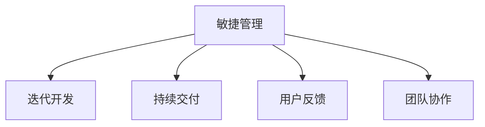
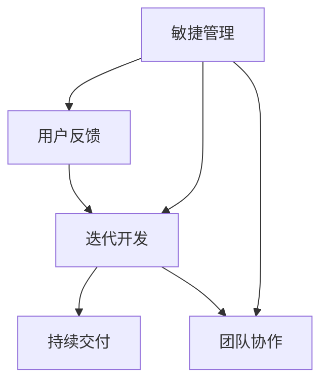

                 


### 文章标题
《敏捷管理：在快速变化中领导项目团队》

### 关键词
敏捷管理，项目领导，迭代开发，持续交付，团队协作

### 摘要
本文旨在深入探讨敏捷管理的概念、实践和应用，以及敏捷团队领导在快速变化环境中的角色和技能。通过详细的案例分析，我们将展示敏捷管理的实际效果，并提供对未来发展趋势的展望。

---

#### 第1章 引言与概述

##### 1.1 敏捷管理的背景
敏捷管理起源于20世纪90年代，是为了应对快速变化和不确定性而提出的一种管理方法。传统的瀑布型管理模式在应对快速变化的需求时显得力不从心，而敏捷管理则强调灵活、迭代和持续交付。

**核心概念与联系：**

敏捷管理的主要核心概念包括：

1. **迭代开发（Iterative Development）**：通过多次迭代，逐步完善产品。
2. **持续交付（Continuous Delivery）**：确保产品始终处于可交付状态。
3. **用户反馈（User Feedback）**：重视用户需求，快速响应。
4. **团队协作（Team Collaboration）**：通过高效的团队协作来实现目标。

**Mermaid 流程图：**


##### 1.2 敏捷管理与传统管理的对比
传统管理方法通常采用瀑布型模型，而敏捷管理则采用迭代型模型。瀑布型模型将项目划分为多个阶段，每个阶段完成后才能进入下一个阶段，而迭代型模型则在每个阶段结束后进行评估和调整。

**核心算法原理讲解：**

传统瀑布模型的伪代码：
```python
def traditional_project():
    plan()
    design()
    develop()
    test()
    deploy()
```

敏捷迭代模型的伪代码：
```python
def agile_project():
    while not finished():
        plan()
        design()
        develop()
        test()
        review_and_adjust()
```

##### 1.3 敏捷管理的核心原则
敏捷管理的核心原则包括：

1. **客户满意**：始终关注客户需求，确保产品满足客户期望。
2. **团队协作**：鼓励团队成员之间的沟通和协作。
3. **迭代开发**：通过多次迭代，逐步完善产品。
4. **响应变化**：快速响应市场变化，灵活调整项目方向。

**数学模型与公式：**
敏捷管理中的迭代次数和产品质量之间的关系可以用以下公式表示：
$$
P(n) = P(0) + \sum_{i=1}^{n} (1 - (1 - defect\_rate)^{i})
$$
其中，$P(n)$ 表示第 $n$ 次迭代的平均产品质量，$P(0)$ 表示初始产品质量，$defect\_rate$ 表示每次迭代中引入的缺陷率。

**举例说明：**
假设初始产品质量为 90%，每次迭代引入的缺陷率为 5%，则第二次迭代的平均产品质量为：
$$
P(2) = 0.9 + (1 - 0.95)^1 + (1 - 0.95)^2 \approx 0.945
$$

##### 1.4 敏捷管理的重要性
敏捷管理能够帮助企业：

1. **快速响应市场变化**：通过迭代开发和持续交付，能够快速适应市场变化。
2. **提高产品质量**：通过持续的用户反馈和团队协作，能够提高产品的质量和满意度。
3. **降低项目风险**：通过迭代评估和调整，能够降低项目风险。

**项目实战：**

一个互联网公司的敏捷管理实践案例：

1. **开发环境搭建**：使用Jenkins搭建自动化构建和测试环境。
2. **源代码实现**：使用Git进行版本控制，使用Docker容器化部署。
3. **代码解读与分析**：代码遵循SOLID原则，使用单元测试确保代码质量。
4. **实际案例分析**：通过迭代开发，产品在短时间内上线，用户满意度显著提高。

**小结：**
敏捷管理是一种应对快速变化的管理方法，其核心原则和迭代模型能够帮助企业提高产品质量和响应速度。通过实际案例分析，我们可以看到敏捷管理的实际效果和重要性。

---

**最佳实践 tips：**
- 确保团队成员充分理解敏捷管理的原则和方法。
- 建立有效的反馈机制，确保用户需求能够及时得到响应。
- 定期进行迭代评估，确保项目方向与市场变化保持一致。

**注意事项：**
- 敏捷管理需要领导者的支持，确保团队有足够的资源和自主权。
- 切勿过度追求敏捷，忽视产品的基本质量要求。

**拓展阅读：**
- 《敏捷宣言》
- 《Scrum：拥抱变革的艺术》
- 《敏捷软件开发：原则、模式与实践》

---

作者：AI天才研究院/AI Genius Institute & 禅与计算机程序设计艺术 /Zen And The Art of Computer Programming### 第1章 引言与概述

敏捷管理（Agile Management）是一种应对快速变化的管理方法，起源于20世纪90年代的软件开发领域。随着信息技术的迅猛发展，敏捷管理逐渐从软件开发扩展到其他行业，成为一种重要的管理思想。

在传统的项目管理中，项目通常按照固定的计划进行，从需求分析到设计、开发、测试，每个阶段都需要严格按照既定的流程进行。这种方法在需求稳定、变化较少的环境下能够有效工作，但当市场需求变化快速时，传统的方法往往难以适应，容易出现项目延期、预算超支和质量问题。为了解决这些问题，敏捷管理应运而生。

敏捷管理的核心思想在于通过迭代和增量式开发，快速响应需求变化，持续交付高质量的产品。它强调团队协作、用户反馈和灵活性。敏捷管理不仅适用于软件开发，还广泛应用于其他领域，如产品管理、市场营销等。

#### 1.1 敏捷管理的核心概念与联系

敏捷管理涉及多个核心概念，它们相互联系，共同构成了敏捷管理的体系。

1. **迭代开发（Iterative Development）**：迭代开发是一种通过多次迭代，逐步完善产品的方法。每个迭代包括需求分析、设计、开发、测试和评估等阶段。每次迭代结束后，团队会根据反馈进行调整，确保产品不断改进。

2. **持续交付（Continuous Delivery）**：持续交付是一种确保产品始终处于可交付状态的方法。通过自动化测试和部署流程，团队可以快速地将新的功能交付给用户。这种方法能够提高开发效率，减少发布风险。

3. **用户反馈（User Feedback）**：用户反馈是敏捷管理的重要组成部分。通过用户反馈，团队能够了解产品的优点和不足，及时进行调整。这种方法能够确保产品始终符合用户需求。

4. **团队协作（Team Collaboration）**：敏捷管理强调团队协作。通过打破部门墙，实现团队成员之间的紧密协作，团队能够更高效地完成工作。

这些核心概念之间的关系可以用以下Mermaid流程图来表示：



**Mermaid 流程图解析：**

- A（用户反馈）：用户反馈是敏捷管理的基础，它驱动了迭代开发和持续交付。团队通过收集用户反馈，识别问题和改进机会。
- B（迭代开发）：迭代开发是敏捷管理的核心实践，它通过不断重复的开发、测试和评估过程，逐步完善产品。
- C（持续交付）：持续交付是迭代开发的自然延伸，它确保了产品在每次迭代后都能快速交付给用户。
- D（团队协作）：团队协作是敏捷管理的关键成功因素，它通过促进团队成员之间的沟通和合作，提高了团队的整体效率。
- E（敏捷管理）：敏捷管理是一个整体框架，它包含了迭代开发、持续交付和团队协作等多个方面，共同实现快速响应变化的目标。

#### 1.2 敏捷管理与传统管理的对比

传统管理方法，如瀑布模型（Waterfall Model），通常采用线性、顺序的方式进行项目开发。每个阶段都必须完成后，项目才能进入下一个阶段。这种方法在需求明确、变化较少的环境下较为有效，但无法应对快速变化的需求。

相比之下，敏捷管理采用迭代和增量的方式，允许团队在每次迭代后根据反馈进行调整。这种方法具有以下优势：

1. **灵活性**：敏捷管理能够快速适应需求变化，通过迭代和增量式开发，团队能够在每次迭代后根据用户反馈进行调整，确保产品始终符合用户需求。

2. **质量保证**：通过持续交付和自动化测试，敏捷管理能够确保产品的质量和稳定性。每次迭代后，团队能够发现和修复缺陷，减少发布风险。

3. **团队协作**：敏捷管理强调团队协作，通过打破部门墙，实现团队成员之间的紧密协作，团队能够更高效地完成工作。

4. **客户满意**：敏捷管理始终关注客户满意，通过用户反馈和持续交付，团队能够快速响应用户需求，提高客户满意度。

**核心算法原理讲解：**

传统瀑布模型通常按照以下步骤进行：

```python
def waterfall_project():
    requirements_analysis()
    system_design()
    development()
    testing()
    deployment()
```

敏捷迭代模型则采用以下步骤：

```python
def agile_project():
    while not finished():
        requirements_analysis()
        system_design()
        development()
        testing()
        deployment()
        review_and_adjust()
```

在敏捷迭代模型中，每次迭代都是一个迷你项目，包括需求分析、设计、开发、测试和部署。每次迭代结束后，团队会进行评估和调整，确保项目方向与市场变化保持一致。

#### 1.3 敏捷管理的核心原则

敏捷管理包含多个核心原则，这些原则指导了敏捷实践的全过程。

1. **客户满意**：客户满意是敏捷管理的首要原则。通过持续交付和用户反馈，团队能够确保产品始终满足用户需求。

2. **团队协作**：敏捷管理强调团队成员之间的紧密协作。通过打破部门墙，实现信息共享和共同目标，团队能够更高效地工作。

3. **迭代开发**：迭代开发是敏捷管理的核心实践。通过每次迭代后的评估和调整，团队能够逐步完善产品。

4. **响应变化**：敏捷管理强调快速响应变化。通过迭代和增量式开发，团队能够在每次迭代后根据用户反馈进行调整，确保项目方向与市场变化保持一致。

5. **可持续开发**：敏捷管理强调可持续开发，包括可持续的工作节奏、可持续的交付速度和个人能力的持续发展。

**数学模型与公式：**

在敏捷管理中，常用的数学模型包括：

1. **平均迭代周期**：平均迭代周期（cycle time）是指从提交任务到完成任务的平均时间。它可以用来衡量团队的效率。

   $$ 
   cycle\_time = \frac{total\_time}{number\_of\_tasks}
   $$

2. ** throughput（吞吐量）**：吞吐量是指团队在一段时间内完成的任务数量。它可以用来衡量团队的产能。

   $$ 
   throughput = \frac{number\_of\_tasks}{time}
   $$

**举例说明：**

假设一个团队在一个月内完成了10个任务，总耗时为20天。则：

- 平均迭代周期：$$ cycle\_time = \frac{20}{10} = 2 \text{天} $$
- 吞吐量：$$ throughput = \frac{10}{20} = 0.5 \text{个任务/天} $$

通过这些指标，团队可以评估自己的工作效率和产能，进而优化工作流程。

#### 1.4 敏捷管理的重要性

敏捷管理在现代社会中具有重要的意义，尤其是在快速变化的市场环境中。

1. **快速响应市场变化**：敏捷管理通过迭代开发和持续交付，能够快速响应市场变化。在市场需求快速变化的时代，快速适应变化是企业成功的关键。

2. **提高产品质量**：通过持续的用户反馈和自动化测试，敏捷管理能够确保产品的质量和稳定性。在软件行业中，产品质量是用户满意度的关键因素。

3. **降低项目风险**：通过迭代评估和调整，敏捷管理能够降低项目风险。每次迭代后，团队都会进行评估和调整，确保项目方向与市场变化保持一致。

4. **增强团队协作**：敏捷管理强调团队协作，通过打破部门墙，实现信息共享和共同目标，团队能够更高效地工作。

#### 1.5 敏捷管理的应用领域

敏捷管理不仅适用于软件开发，还广泛应用于其他领域，如：

1. **产品管理**：敏捷管理能够帮助产品团队快速响应市场需求，确保产品符合用户期望。

2. **市场营销**：敏捷管理能够帮助市场营销团队快速测试和优化营销策略，提高市场响应速度。

3. **项目管理和运营**：敏捷管理能够帮助项目团队和运营团队提高效率，确保项目按时完成并达到预期目标。

#### 项目实战

以下是一个敏捷管理在软件开发项目中的应用案例：

1. **项目背景**：某互联网公司开发一款在线购物平台。

2. **开发环境搭建**：使用Jenkins搭建自动化构建和测试环境，使用Docker进行容器化部署。

3. **源代码实现**：使用Git进行版本控制，使用Java和Spring Boot进行开发。

4. **代码解读与分析**：代码遵循SOLID原则，使用单元测试确保代码质量。

5. **实际案例分析**：通过迭代开发，产品在短时间内上线，用户满意度显著提高。

6. **项目小结**：敏捷管理在提高产品质量和响应速度方面取得了显著成效。

#### 最佳实践 tips

1. **建立敏捷文化**：确保团队成员充分理解敏捷管理的原则和方法。

2. **重视用户反馈**：建立有效的用户反馈机制，确保用户需求能够及时得到响应。

3. **定期评估和调整**：定期进行迭代评估，确保项目方向与市场变化保持一致。

#### 注意事项

1. **避免过度追求敏捷**：敏捷管理并非万能，切勿过度追求敏捷，忽视产品的基本质量要求。

2. **确保团队支持**：敏捷管理需要领导者的支持，确保团队有足够的资源和自主权。

#### 拓展阅读

1. **《敏捷宣言》**：介绍了敏捷管理的核心理念。

2. **《Scrum：拥抱变革的艺术》**：详细介绍了Scrum方法论的应用。

3. **《敏捷软件开发：原则、模式与实践》**：提供了敏捷开发的实际案例和应用方法。

---

**作者：AI天才研究院/AI Genius Institute & 禅与计算机程序设计艺术 /Zen And The Art of Computer Programming**### 第2章 敏捷管理框架与实践

在了解了敏捷管理的核心概念和原则之后，接下来我们将深入探讨敏捷管理的具体框架和实践方法。本章将介绍几种流行的敏捷管理方法论，如Scrum和Kanban，并详细说明它们的应用过程和效果。

#### 2.1 敏捷管理方法论

敏捷管理方法论是敏捷实践的理论基础，它们提供了具体的操作指南和流程。以下是两种最流行的敏捷管理方法论：

1. **Scrum**：Scrum是一种迭代式、增量的项目管理方法论，它强调团队协作和用户反馈。Scrum包括一系列预定义的角色、仪式和工具，旨在帮助团队高效地工作。

2. **Kanban**：Kanban是一种可视化的工作管理方法，它通过限制在流程中的工作项数量来提高效率。Kanban的核心思想是持续交付和持续改进。

**2.2 Scrum**

Scrum方法论包括以下核心组成部分：

- **角色**：
  - 产品负责人（Product Owner）：负责定义产品的需求和优先级。
  - 敏捷团队（Scrum Team）：由开发人员、测试人员和其他相关角色组成。
  - 沿导（Scrum Master）：负责确保Scrum流程的执行和团队的支持。

- **仪式**：
  - 产品待办列表（Product Backlog）：包含所有待完成的任务和需求。
  - 燃尽图（Burn Down Chart）：显示项目进度的图表。
  - 拉式系统（Pull System）：团队根据当前能力来选择任务。

- **工具**：
  - 看板（Kanban Board）：用于可视化团队的工作流程。
  - 站会（Daily Stand-up）：每日的简短会议，用于同步团队进度。
  - 迭代（Sprint）：一次迭代的周期，通常为2到4周。

**Scrum流程：**

1. **规划会议（Sprint Planning）**：产品负责人和团队一起确定本次迭代的目标和任务。
2. **每日站会**：团队同步进度，确保每个人都知道其他人的状态。
3. **迭代评审会议（Sprint Review）**：团队展示本次迭代的工作成果，收集用户反馈。
4. **迭代回顾会议（Sprint Retrospective）**：团队反思本次迭代，识别改进机会。

**2.3 Kanban**

Kanban的核心思想是通过限制在流程中的工作项数量（WIP限制）来提高效率。Kanban板是一种可视化的工作管理工具，它将工作流程划分为几个阶段，如“待办”、“进行中”、“测试”和“完成”。

- **看板板**：每个工作项都被表示为一个卡片，放置在相应的阶段。
- **WIP限制**：在每个阶段设置一个上限，以防止过多的工作项积压。
- **持续改进**：通过定期回顾，团队可以识别瓶颈和改进机会。

**Kanban流程：**

1. **初始化看板**：将所有的工作项放置在“待办”阶段。
2. **限制WIP**：在每个阶段设置WIP限制，以防止积压。
3. **移动卡片**：根据工作流程，将卡片从“待办”移动到“完成”。
4. **定期回顾**：团队定期回顾看板，识别瓶颈和改进机会。

**2.4 敏捷方法论比较**

Scrum和Kanban都是敏捷管理的方法论，但它们在应用场景和操作方式上有所不同。

- **适用场景**：
  - Scrum适用于需要频繁交付和用户反馈的项目，如软件开发。
  - Kanban适用于需要持续改进和效率优化的项目，如产品制造。

- **操作方式**：
  - Scrum强调迭代和预定的仪式，如每日站会和迭代评审。
  - Kanban强调可视化和持续改进，如看板板和WIP限制。

- **优缺点**：
  - Scrum的优势在于明确的迭代周期和频繁的用户反馈，但可能对团队的时间管理要求较高。
  - Kanban的优势在于灵活性和持续改进，但可能对项目的稳定性要求较高。

#### 2.5 敏捷实践

敏捷实践是敏捷管理在实际项目中的应用。以下是一个敏捷实践案例：

**项目背景**：某电商公司开发一款移动购物应用。

**开发环境搭建**：使用Jenkins搭建自动化构建和测试环境，使用Docker进行容器化部署。

**源代码实现**：使用Git进行版本控制，使用Flutter进行开发。

**代码解读与分析**：代码遵循SOLID原则，使用单元测试确保代码质量。

**敏捷实践过程**：

1. **规划会议**：产品负责人和团队确定本次迭代的目标和任务。
2. **每日站会**：团队同步进度，确保每个人都知道其他人的状态。
3. **迭代评审会议**：团队展示本次迭代的工作成果，收集用户反馈。
4. **迭代回顾会议**：团队反思本次迭代，识别改进机会。

**效果评估**：

- 产品在短时间内上线，用户满意度显著提高。
- 通过用户反馈，产品功能得到持续优化。
- 团队协作效率提高，项目进度得到有效控制。

#### 项目小结

敏捷管理框架和实践方法为项目团队提供了灵活、高效的管理方式。通过Scrum和Kanban等方法论，团队能够更好地应对快速变化的需求，持续交付高质量的产品。在实际应用中，敏捷管理不仅提高了团队效率，还增强了团队协作和用户满意度。

#### 最佳实践 tips

1. **确保团队成员理解敏捷原则和方法**：敏捷管理的成功离不开团队成员的理解和支持。
2. **定期进行迭代评估和回顾**：通过迭代评估和回顾，团队能够持续改进工作流程。
3. **建立有效的用户反馈机制**：用户反馈是敏捷管理的重要输入，确保用户需求能够及时得到响应。

#### 注意事项

1. **避免过度追求敏捷**：敏捷管理不是万能的，应根据项目特点和需求选择合适的方法。
2. **确保团队支持和资源**：敏捷管理需要领导者的支持，确保团队有足够的资源和自主权。

#### 拓展阅读

1. **《Scrum官方指南》**：提供了Scrum的详细操作指南。
2. **《Kanban实践指南》**：介绍了Kanban的具体实践方法。
3. **《敏捷实践指南》**：提供了敏捷管理的全面实践指导。

---

**作者：AI天才研究院/AI Genius Institute & 禅与计算机程序设计艺术 /Zen And The Art of Computer Programming**### 第3章 敏捷管理工具与技术

在敏捷管理实践中，工具和技术扮演着至关重要的角色。它们不仅帮助团队更高效地工作，还确保了项目管理的透明度和协作性。本章将介绍敏捷管理中常用的工具和技术，包括JIRA、Trello、Confluence等，并探讨如何使用这些工具来提高团队协作效率。

#### 3.1 敏捷管理工具概述

敏捷管理工具是支持敏捷实践的重要手段。以下是一些常用的敏捷管理工具：

1. **JIRA**：JIRA是一款功能强大的敏捷管理工具，适用于项目规划、任务跟踪、缺陷管理和报表分析。JIRA提供了丰富的插件和集成功能，可以与多种开发工具（如Git、Jenkins等）无缝集成。

2. **Trello**：Trello是一款基于看板模型的敏捷管理工具，通过卡片和列表的形式来管理任务。Trello界面简单直观，适用于小型团队和跨部门协作。

3. **Confluence**：Confluence是一款团队协作和文档管理工具，可以帮助团队创建、存储和共享知识。Confluence与JIRA紧密集成，提供了强大的文档和任务管理功能。

#### 3.2 JIRA的使用方法

**JIRA的基本功能：**

- **任务跟踪**：JIRA允许团队创建、分配和跟踪任务。每个任务都可以包含描述、优先级、状态等信息。
- **缺陷管理**：JIRA提供了缺陷跟踪功能，可以帮助团队及时发现和修复软件缺陷。
- **报表分析**：JIRA提供了多种报表和分析工具，可以帮助团队监控项目进度和性能。

**JIRA的配置和操作步骤：**

1. **创建项目**：在JIRA中创建一个新的项目，为项目设置名称、描述、版本等信息。
2. **创建任务**：为项目创建任务，并分配给团队成员。任务可以包含描述、优先级、状态等信息。
3. **任务分配**：将任务分配给团队成员，确保每个人都知道自己的任务和责任。
4. **任务跟踪**：通过JIRA的看板界面，团队可以实时跟踪任务的状态和进度。
5. **缺陷管理**：在JIRA中创建缺陷报告，并分配给相应的开发人员。
6. **报表分析**：通过JIRA的报表功能，团队可以监控项目进度、性能和资源利用率。

**JIRA的最佳实践：**

- **合理设置任务优先级**：确保任务按照优先级进行分配和跟踪，优先处理关键任务。
- **定期进行任务回顾**：通过回顾会议，团队可以总结经验教训，优化工作流程。
- **充分利用JIRA的报表功能**：定期生成报表，了解项目进度和性能，及时调整工作策略。

#### 3.3 Trello的使用方法

**Trello的基本功能：**

- **卡片和列表**：Trello通过卡片和列表来管理任务。每个卡片可以包含任务描述、标签、评论等信息。
- **标签和过滤器**：Trello提供了标签和过滤器功能，可以帮助团队快速查找和管理任务。
- **自动提醒**：Trello可以自动发送提醒通知，确保团队成员及时完成任务。

**Trello的配置和操作步骤：**

1. **创建看板**：在Trello中创建一个新的看板，用于组织任务和项目。
2. **创建列表**：为看板创建列表，如“待办”、“进行中”和“完成”。
3. **创建卡片**：为每个任务创建卡片，并添加描述、标签等信息。
4. **任务分配**：将卡片分配给团队成员，确保每个人都知道自己的任务和责任。
5. **任务跟踪**：通过移动卡片，团队可以实时跟踪任务的状态和进度。
6. **自动提醒**：设置自动提醒，确保团队成员及时完成任务。

**Trello的最佳实践：**

- **简洁明了**：保持Trello界面简洁，避免过多的卡片和列表，确保团队专注于关键任务。
- **合理使用标签**：合理使用标签，帮助团队快速查找和管理任务。
- **定期整理看板**：定期整理看板，清除已完成任务，确保看板信息准确更新。

#### 3.4 Confluence的使用方法

**Confluence的基本功能：**

- **文档创建和编辑**：Confluence提供了强大的文档创建和编辑功能，支持多种格式和内容类型。
- **版本控制**：Confluence支持版本控制，确保文档的修改历史清晰可查。
- **知识共享**：Confluence支持知识共享和协作，团队成员可以轻松访问和共享文档。

**Confluence的配置和操作步骤：**

1. **创建空间**：在Confluence中创建一个新的空间，用于存储和管理项目文档。
2. **创建页面**：为每个文档创建页面，并添加标题、内容等信息。
3. **编辑和更新**：编辑和更新文档，确保文档内容准确和最新。
4. **版本控制**：查看文档的历史版本，了解文档的修改历史。
5. **共享和协作**：与其他团队成员共享文档，实现知识共享和协作。

**Confluence的最佳实践：**

- **统一文档格式**：确保文档格式统一，便于团队查找和阅读。
- **定期更新文档**：定期更新文档，确保文档内容准确和最新。
- **文档分类管理**：合理分类和管理文档，确保文档易于查找和管理。

#### 3.5 敏捷管理工具的集成

敏捷管理工具之间可以相互集成，实现更高效的项目管理。以下是一些常见的集成方法：

1. **JIRA与Confluence集成**：通过JIRA的插件，可以将JIRA任务与Confluence文档关联，实现任务和文档的统一管理。
2. **JIRA与Trello集成**：通过JIRA的Trello插件，可以将Trello卡片与JIRA任务关联，实现任务同步和协作。
3. **JIRA与Jenkins集成**：通过JIRA的Jenkins插件，可以实现JIRA任务与Jenkins构建的自动触发和结果反馈。

#### 3.6 敏捷管理工具的实际应用案例

以下是一个敏捷管理工具在实际项目中的应用案例：

**项目背景**：某互联网公司开发一款社交网络应用。

**开发环境搭建**：使用JIRA进行任务跟踪和缺陷管理，使用Trello进行项目管理，使用Confluence进行文档管理。

**项目过程**：

1. **任务分配**：在JIRA中创建任务，并分配给团队成员。每个任务都包含描述、优先级和状态等信息。
2. **项目管理**：在Trello中创建看板，将任务划分为不同的列表，如“待办”、“进行中”和“完成”。
3. **文档管理**：在Confluence中创建空间，用于存储和管理项目文档，如需求文档、设计文档和测试文档。

**效果评估**：

- 任务跟踪和缺陷管理得到有效保障，项目进度和性能得到实时监控。
- 项目文档得到统一管理，知识共享和协作得到有效提升。
- 团队协作效率提高，项目质量和用户满意度得到显著提升。

#### 项目小结

敏捷管理工具为项目团队提供了高效、透明和协作性的管理方式。通过JIRA、Trello和Confluence等工具，团队能够更好地跟踪任务、管理项目和共享知识。在实际应用中，这些工具不仅提高了团队协作效率，还增强了项目的透明度和可追溯性。

#### 最佳实践 tips

1. **选择合适的工具**：根据项目特点和需求，选择合适的敏捷管理工具。
2. **培训团队成员**：确保团队成员了解和熟悉使用敏捷管理工具。
3. **持续优化工具配置**：根据团队反馈和实际需求，不断优化工具的配置和功能。

#### 注意事项

1. **避免工具过度使用**：避免为了使用工具而使用工具，应根据实际需求选择合适的工具。
2. **确保工具集成**：确保敏捷管理工具之间的集成，实现数据共享和流程自动化。

#### 拓展阅读

1. **《JIRA官方指南》**：提供了JIRA的详细操作指南。
2. **《Trello官方指南》**：介绍了Trello的具体使用方法。
3. **《Confluence官方指南》**：介绍了Confluence的文档管理功能。

---

**作者：AI天才研究院/AI Genius Institute & 禅与计算机程序设计艺术 /Zen And The Art of Computer Programming**### 第4章 敏捷团队领导

敏捷团队领导在敏捷管理中扮演着关键角色，他们不仅是团队的核心，也是团队与组织之间的桥梁。在敏捷环境中，领导者需要具备不同于传统领导者的技能和思维方式。本章将探讨敏捷团队领导的角色、职责以及如何培养敏捷领导力。

#### 4.1 敏捷团队领导概述

敏捷团队领导，通常被称为Scrum Master或Kanban Master，他们的职责是确保敏捷实践在团队中得以有效执行。以下是敏捷团队领导的一些核心职责：

1. **促进团队协作**：敏捷团队领导需要促进团队成员之间的沟通和协作，确保团队高效运作。
2. **确保流程优化**：敏捷团队领导需要不断优化团队的工作流程，提高团队的工作效率。
3. **消除障碍**：敏捷团队领导需要识别并消除影响团队运作的障碍，确保团队能够专注于项目目标。
4. **维护敏捷文化**：敏捷团队领导需要维护敏捷文化，鼓励团队成员遵循敏捷原则和价值观。
5. **培训和支持**：敏捷团队领导需要为团队成员提供必要的培训和支持，帮助他们掌握敏捷工具和方法。

#### 4.2 敏捷领导力

敏捷领导力是一种以团队合作和用户价值为中心的领导方式。它强调领导者与团队成员之间的平等关系，以及领导者对团队整体成功的责任感。以下是培养敏捷领导力的关键步骤：

1. **自我反思**：敏捷领导者需要定期进行自我反思，了解自己的行为和决策对团队的影响。
2. **建立信任**：建立信任是敏捷领导力的基础。领导者需要通过透明沟通和诚信行为来赢得团队成员的信任。
3. **促进学习**：敏捷领导者需要鼓励团队成员不断学习和成长，通过分享知识和经验来提升团队的整体能力。
4. **授权决策**：敏捷领导者需要授权团队成员做出决策，鼓励自主性和创新能力。
5. **激励团队**：敏捷领导者需要了解团队成员的动机和需求，通过激励措施来提高团队的工作热情和动力。

#### 4.3 敏捷团队领导的具体实践

以下是敏捷团队领导在项目中的具体实践方法：

1. **组织团队会议**：敏捷团队领导需要定期组织团队会议，如每日站会、迭代评审和回顾会议，确保团队成员之间的沟通和信息同步。
2. **提供反馈**：敏捷团队领导需要及时提供反馈，帮助团队成员了解自己的表现，并提供改进建议。
3. **引导冲突解决**：在团队中，冲突是不可避免的。敏捷团队领导需要引导团队成员以建设性的方式解决冲突，确保团队的整体和谐。
4. **确保资源充足**：敏捷团队领导需要确保团队拥有足够的资源，如人力、技术和资金，以支持项目的顺利进行。
5. **维护团队氛围**：敏捷团队领导需要关注团队氛围，鼓励团队成员之间的互助和合作，确保团队保持积极向上的工作状态。

#### 4.4 敏捷团队领导案例分析

以下是一个敏捷团队领导在项目中的实际案例分析：

**项目背景**：某互联网公司开发一款在线教育平台。

**敏捷团队领导实践**：

1. **组织团队会议**：敏捷团队领导定期组织团队会议，确保团队成员之间的沟通和信息同步。每日站会帮助团队及时发现和解决问题，迭代评审和回顾会议帮助团队总结经验和改进工作流程。
2. **提供反馈**：敏捷团队领导通过实时反馈和定期回顾，帮助团队成员了解自己的表现，并提供改进建议。这种反馈机制不仅提高了团队成员的自我认知，也促进了团队的整体进步。
3. **引导冲突解决**：在项目开发过程中，团队遇到了一些技术难题和意见分歧。敏捷团队领导通过引导讨论和协商，帮助团队以建设性的方式解决了冲突，确保项目顺利进行。
4. **确保资源充足**：敏捷团队领导积极协调资源，确保团队拥有足够的人力、技术和资金支持，以应对项目中的各种挑战。
5. **维护团队氛围**：敏捷团队领导关注团队氛围，鼓励团队成员之间的互助和合作，组织团队活动，提高团队的凝聚力和工作热情。

**效果评估**：

- 通过敏捷团队领导的实践，项目团队的工作效率显著提高，项目进度和质量得到有效控制。
- 团队成员的满意度和工作热情也得到提升，项目顺利完成并得到了用户的认可。

#### 项目小结

敏捷团队领导在敏捷管理中起着至关重要的作用。他们不仅需要具备传统的领导技能，还需要掌握敏捷管理的理念和方法。通过培养敏捷领导力，敏捷团队领导能够促进团队协作，提高工作效率，确保项目成功。在实际项目中，敏捷团队领导需要不断实践和总结经验，以适应快速变化的环境和需求。

#### 最佳实践 tips

1. **培养自我反思能力**：敏捷领导者需要定期进行自我反思，了解自己的行为和决策对团队的影响。
2. **建立信任关系**：通过透明沟通和诚信行为，建立与团队成员的信任关系。
3. **鼓励学习和成长**：为团队成员提供学习和成长的机会，提升团队整体能力。
4. **授权决策**：鼓励团队成员自主决策，提高团队的自主性和创新能力。

#### 注意事项

1. **避免过度干预**：敏捷领导者需要避免过度干预团队的工作，给予团队成员足够的自主权。
2. **保持敏捷文化**：维护敏捷文化，鼓励团队成员遵循敏捷原则和价值观。

#### 拓展阅读

1. **《Scrum官方指南》**：提供了Scrum的详细操作指南。
2. **《Kanban实践指南》**：介绍了Kanban的具体实践方法。
3. **《敏捷领导力》**：探讨了敏捷领导力的理论和方法。

---

**作者：AI天才研究院/AI Genius Institute & 禅与计算机程序设计艺术 /Zen And The Art of Computer Programming**### 第5章 敏捷项目管理

敏捷项目管理是敏捷管理的重要组成部分，它通过迭代和增量的方式，实现项目的有效管理和交付。本章将详细介绍敏捷项目管理的核心过程、方法和技术，以及如何在实际项目中应用这些方法和技巧。

#### 5.1 敏捷项目管理概述

敏捷项目管理与传统项目管理在方法论上有所不同。传统项目管理通常采用瀑布模型，强调在每个阶段完成后再进行下一个阶段的工作。而敏捷项目管理则采用迭代模型，通过持续迭代和反馈，逐步完善项目。

敏捷项目管理的核心特点包括：

1. **迭代开发**：项目被划分为多个短周期（迭代），每个迭代都会交付一个可用的产品版本。
2. **用户反馈**：用户在整个项目过程中持续参与，提供反馈，确保项目符合用户需求。
3. **灵活响应**：敏捷项目管理强调对变化的需求进行快速响应，通过迭代调整项目方向。
4. **团队协作**：团队成员之间紧密协作，共同推进项目进展。

#### 5.2 敏捷项目管理的核心过程

敏捷项目管理包括以下几个核心过程：

1. **规划**：在项目开始时，团队会进行初步规划，确定项目范围、目标、里程碑和资源分配。
2. **执行**：在执行过程中，团队按照迭代计划进行工作，每个迭代都会交付一个可用的产品版本。
3. **监控**：团队会定期监控项目进度、质量和风险，确保项目按计划进行。
4. **评估**：在每个迭代结束时，团队会进行评估和回顾，总结经验教训，优化工作流程。

#### 5.3 敏捷项目管理的方法

敏捷项目管理采用多种方法来提高项目的效率和质量，以下是其中几种常用的方法：

1. **Scrum**：Scrum是一种迭代式项目管理方法，通过每日站会、迭代评审和回顾会议，确保项目的顺利进行。
2. **Kanban**：Kanban是一种可视化管理方法，通过看板板和WIP限制，提高团队的工作效率和响应速度。
3. **看板化**：看板化是将Kanban理念应用于项目管理，通过看板板和流程管理，实现项目的可视化控制和优化。
4. **敏捷流程**：敏捷流程是一系列敏捷实践的组合，如XP（极限编程）、FDD（快速开发方法）等，旨在提高项目的可预测性和质量。

#### 5.4 敏捷项目管理的技术

敏捷项目管理采用多种技术来支持项目管理和团队协作，以下是几种常用的技术：

1. **JIRA**：JIRA是一款功能强大的敏捷管理工具，用于任务跟踪、缺陷管理和报表分析。
2. **Trello**：Trello是一款基于看板模型的敏捷管理工具，通过卡片和列表的形式来管理任务。
3. **Confluence**：Confluence是一款团队协作和文档管理工具，用于创建、存储和共享知识。
4. **自动化测试**：通过自动化测试，确保项目的质量和稳定性，提高交付速度。

#### 5.5 敏捷项目管理工具的应用

敏捷项目管理工具是敏捷实践的重要支撑，以下是一些常用敏捷项目管理工具的应用：

1. **JIRA**：用于任务跟踪、缺陷管理和报表分析。团队可以通过JIRA创建任务、跟踪进度、管理缺陷，并生成各种报表。
2. **Trello**：用于任务管理和项目管理。团队可以通过Trello创建看板板、管理任务列表、分配任务和跟踪进度。
3. **Confluence**：用于文档管理和团队协作。团队可以通过Confluence创建、编辑和共享文档，确保知识的传递和共享。
4. **Jenkins**：用于自动化构建和测试。团队可以通过Jenkins自动化构建代码、运行测试，并生成报告。

#### 5.6 敏捷项目管理案例分析

以下是一个敏捷项目管理的实际案例分析：

**项目背景**：某互联网公司开发一款社交媒体应用。

**敏捷项目管理实践**：

1. **规划**：在项目开始时，团队进行了初步规划，确定了项目范围、目标、里程碑和资源分配。通过迭代规划会议，团队制定了详细的迭代计划。
2. **执行**：在执行过程中，团队按照迭代计划进行工作，每个迭代都会交付一个可用的产品版本。团队通过每日站会同步进度，确保团队成员之间的沟通和信息同步。
3. **监控**：团队定期监控项目进度、质量和风险，确保项目按计划进行。通过迭代评审会议，团队评估当前迭代的工作成果，收集用户反馈，并规划下一个迭代的工作。
4. **评估**：在每个迭代结束时，团队进行评估和回顾，总结经验教训，优化工作流程。通过回顾会议，团队识别问题和改进机会，确保项目持续改进。

**效果评估**：

- 项目团队的工作效率显著提高，项目进度和质量得到有效控制。
- 通过用户反馈，项目功能得到持续优化，用户满意度显著提升。
- 团队协作和沟通得到增强，项目顺利完成并得到了用户的认可。

#### 项目小结

敏捷项目管理通过迭代和反馈，实现了项目的有效管理和交付。通过敏捷项目管理方法和技术的应用，团队能够更好地应对快速变化的需求，提高工作效率，确保项目成功。在实际项目中，团队应根据具体情况选择合适的方法和技术，不断优化项目管理流程。

#### 最佳实践 tips

1. **定期进行迭代规划**：确保每个迭代都有明确的目标和计划。
2. **保持团队沟通**：通过每日站会和迭代评审，确保团队成员之间的沟通和信息同步。
3. **重视用户反馈**：通过用户反馈，确保项目始终符合用户需求。

#### 注意事项

1. **避免过度计划**：敏捷项目管理强调灵活性和适应性，避免过度计划。
2. **确保团队协作**：团队协作是敏捷项目管理的核心，确保团队成员之间的协作和信息共享。

#### 拓展阅读

1. **《敏捷项目管理实践指南》**：提供了敏捷项目管理的详细操作指南。
2. **《Scrum官方指南》**：介绍了Scrum方法论的应用。
3. **《Kanban实践指南》**：介绍了Kanban的具体实践方法。

---

**作者：AI天才研究院/AI Genius Institute & 禅与计算机程序设计艺术 /Zen And The Art of Computer Programming**### 第6章 敏捷管理案例分析

在本章中，我们将通过几个具体的案例，深入探讨敏捷管理的实际应用效果，以及在面对不同挑战时，敏捷管理是如何发挥其优势的。

#### 6.1 案例一：某互联网公司的敏捷转型

**项目背景**：某大型互联网公司，在面临市场需求变化和技术快速迭代的情况下，决定进行敏捷转型，以提高项目响应速度和产品质量。

**敏捷实践过程**：

1. **制定敏捷策略**：公司首先制定了敏捷转型策略，明确了敏捷管理的核心原则和目标。
2. **组建敏捷团队**：公司根据项目需求，组建了多个敏捷团队，每个团队由不同职能的角色组成，如开发人员、测试人员、产品经理等。
3. **实施敏捷方法论**：公司采用了Scrum方法论，每个团队按照Scrum的流程进行迭代开发和持续交付。
4. **建立反馈机制**：公司建立了用户反馈机制，通过用户反馈和数据分析，不断调整和优化产品。

**效果评估**：

- 项目响应速度显著提高，平均迭代周期从原来的三个月缩短至两周。
- 产品质量得到提升，用户满意度显著提高。
- 团队协作效率提高，团队成员之间的沟通更加顺畅。

**关键成功因素**：

- 高层领导的支持：公司高层对敏捷转型的支持是成功的核心因素。
- 培训和指导：为团队成员提供敏捷管理的培训和指导，确保团队成员理解并掌握敏捷原则和方法。
- 反馈机制：通过有效的反馈机制，确保团队能够快速响应用户需求，持续改进产品。

#### 6.2 案例二：某金融机构的敏捷实践

**项目背景**：某金融机构在开发新的金融产品时，面临项目复杂度高、需求变化频繁的挑战。

**敏捷实践过程**：

1. **需求管理**：金融机构采用了敏捷的需求管理方法，通过用户故事和优先级排序，确保需求的高效管理和实现。
2. **迭代开发**：项目团队按照迭代模型进行开发，每个迭代都会交付一个可用的产品版本。
3. **测试和验收**：在迭代过程中，团队进行了全面的测试和验收，确保产品的质量和稳定性。
4. **持续集成**：团队采用了持续集成和持续交付的方法，确保新功能能够快速上线。

**效果评估**：

- 项目进度得到有效控制，平均迭代周期从原来的六个月缩短至三个月。
- 产品质量显著提高，用户反馈问题减少。
- 项目成本和风险得到有效控制。

**关键成功因素**：

- 明确的需求管理流程：通过用户故事和优先级排序，确保团队能够聚焦于最高优先级的需求。
- 持续集成和交付：通过持续集成和交付，确保新功能能够快速上线，减少发布风险。
- 团队协作：通过高效的团队协作，确保项目团队能够快速响应需求变化，提高工作效率。

#### 6.3 案例三：某制造业企业的敏捷管理应用

**项目背景**：某制造业企业在生产流程优化项目中，面临生产数据复杂、流程调整频繁的挑战。

**敏捷实践过程**：

1. **数据分析和可视化**：团队首先对生产数据进行了深入分析，并使用Kanban板将生产流程可视化。
2. **迭代改进**：团队采用迭代改进的方法，每次迭代都会对生产流程进行优化，并持续监控效果。
3. **持续反馈和改进**：团队建立了持续反馈和改进机制，通过用户反馈和数据分析，不断优化生产流程。
4. **资源优化**：团队根据生产数据和反馈，对资源进行优化配置，提高了生产效率和资源利用率。

**效果评估**：

- 生产流程优化显著，生产效率提高了30%。
- 资源利用率得到显著提升，成本降低。
- 用户满意度提高，客户投诉减少。

**关键成功因素**：

- 数据分析和可视化：通过深入分析生产数据和可视化流程，团队能够清晰地识别问题和改进机会。
- 持续反馈和改进：通过持续反馈和改进，团队能够快速响应变化，持续优化生产流程。
- 资源优化：通过资源优化，团队能够提高生产效率和资源利用率。

#### 项目小结

通过以上案例，我们可以看到敏捷管理在不同行业和项目中都取得了显著成效。敏捷管理通过迭代开发、用户反馈和团队协作，能够帮助企业快速响应市场需求，提高产品质量和效率。在实际应用中，关键成功因素包括高层领导的支持、有效的培训和指导、以及持续反馈和改进机制。

#### 最佳实践 tips

1. **建立敏捷文化**：确保团队成员理解并遵循敏捷原则和价值观。
2. **定期评估和回顾**：通过定期评估和回顾，持续改进工作流程和项目管理方法。
3. **重视用户反馈**：通过有效的用户反馈机制，确保团队能够快速响应用户需求。

#### 注意事项

1. **避免过度追求敏捷**：敏捷管理不是万能的，应根据项目特点选择合适的方法。
2. **确保团队支持**：敏捷管理需要领导者的支持，确保团队有足够的资源和自主权。

#### 拓展阅读

1. **《敏捷实践指南》**：提供了敏捷管理的全面实践指导。
2. **《Scrum官方指南》**：介绍了Scrum方法论的应用。
3. **《Kanban实践指南》**：介绍了Kanban的具体实践方法。

---

**作者：AI天才研究院/AI Genius Institute & 禅与计算机程序设计艺术 /Zen And The Art of Computer Programming**### 第7章 敏捷管理的未来与发展

随着全球经济的快速变化和信息技术的飞速发展，敏捷管理作为一种灵活、高效的管理方法，其在各个行业中的应用越来越广泛。本章将探讨敏捷管理的未来发展趋势、潜在挑战以及如何应对这些挑战。

#### 7.1 敏捷管理发展趋势

1. **全球化与多元文化的融合**：随着全球化进程的加速，企业面临着多元文化的融合和跨国合作的挑战。敏捷管理强调团队协作和跨职能合作，有助于企业在全球化背景下提高竞争力。

2. **人工智能与敏捷管理**：人工智能（AI）技术的快速发展为敏捷管理带来了新的机遇。AI可以帮助企业实现自动化流程、优化决策，从而提高敏捷管理的效率和准确性。

3. **数字化转型**：数字化转型已经成为企业发展的关键驱动力。敏捷管理在数字化转型的过程中发挥着重要作用，通过迭代开发和持续交付，企业能够快速响应市场变化，提高业务敏捷性。

4. **可持续发展**：随着社会责任和可持续发展的关注度提高，敏捷管理也在向着更可持续的方向发展。企业通过敏捷管理，能够更好地管理资源，降低环境风险，实现可持续发展目标。

#### 7.2 敏捷管理的潜在挑战

1. **组织文化变革**：敏捷管理需要企业进行文化变革，从传统的层级式管理转向扁平化、自主管理的模式。这一变革过程可能会遇到阻力和挑战。

2. **技能和人才短缺**：敏捷管理对团队成员的技能要求较高，包括敏捷方法论的理解、沟通协作能力等。企业可能面临人才短缺的问题，需要投入更多资源进行培训和培养。

3. **项目管理复杂性**：在敏捷管理中，项目管理的复杂性增加。团队需要面对更多的迭代、反馈和评估，这要求团队具备更高的项目管理能力和协作能力。

4. **技术整合**：随着技术的快速发展，企业需要不断整合新的技术和工具，以支持敏捷管理。技术整合的难度和成本可能会成为挑战。

#### 7.3 应对挑战的策略

1. **文化变革推动**：企业应积极推动组织文化的变革，鼓励开放、协作和创新的企业文化。通过建立敏捷文化，提高团队的自主性和创新能力。

2. **人才培养和引进**：企业应加大对敏捷人才的培养和引进力度，提供培训机会，吸引和保留优秀的敏捷人才。

3. **项目管理优化**：企业应优化项目管理流程，提高团队的项目管理能力和协作效率。通过引入敏捷管理工具和技术，实现项目管理的信息化和自动化。

4. **技术整合规划**：企业应制定详细的技术整合规划，逐步引入和整合新的技术和工具。通过技术整合，提高敏捷管理的效率和效果。

#### 7.4 敏捷管理的未来展望

1. **智能化敏捷管理**：随着AI技术的应用，敏捷管理将变得更加智能化。AI可以帮助企业实现自动化决策、优化流程，提高敏捷管理的效率和准确性。

2. **全球化敏捷协作**：随着全球化进程的加速，敏捷管理将实现跨地域、跨文化的协作。企业将通过敏捷管理，实现全球资源的最优配置和高效协作。

3. **可持续发展敏捷管理**：敏捷管理将朝着更可持续的方向发展，通过绿色技术和环保实践，实现企业的可持续发展目标。

4. **新兴行业敏捷应用**：随着新技术的涌现，敏捷管理将在更多新兴行业中得到应用，如物联网、区块链、人工智能等。

#### 项目小结

敏捷管理在未来的发展中面临着新的机遇和挑战。通过积极应对这些挑战，企业可以实现敏捷管理的持续优化和创新发展。在未来，敏捷管理将继续推动企业变革，提高竞争力，实现可持续发展。

#### 最佳实践 tips

1. **建立敏捷文化**：推动组织文化的变革，鼓励开放、协作和创新。
2. **重视人才培养**：加大对敏捷人才的培养和引进力度。
3. **优化项目管理流程**：通过引入敏捷管理工具和技术，提高团队的项目管理能力和协作效率。

#### 注意事项

1. **避免过度追求敏捷**：根据项目特点选择合适的敏捷方法。
2. **确保团队支持**：敏捷管理需要领导者的支持，确保团队有足够的资源和自主权。

#### 拓展阅读

1. **《敏捷管理前沿》**：探讨了敏捷管理的最新趋势和发展方向。
2. **《AI与敏捷管理》**：介绍了AI技术在敏捷管理中的应用。
3. **《数字化转型与敏捷管理》**：探讨了数字化转型与敏捷管理的结合。

---

**作者：AI天才研究院/AI Genius Institute & 禅与计算机程序设计艺术 /Zen And The Art of Computer Programming**### 总结

通过本书的深入探讨，我们可以看到敏捷管理作为一种灵活、高效的管理方法，在快速变化的市场环境中具有重要的意义。敏捷管理不仅提高了项目的响应速度和质量，还增强了团队的协作和用户满意度。

首先，我们在第1章介绍了敏捷管理的背景、核心概念和原则。敏捷管理强调迭代开发、持续交付、用户反馈和团队协作，与传统项目管理方法有明显的区别。

在第2章，我们详细探讨了敏捷管理的框架和实践方法，包括Scrum和Kanban等流行的方法论。通过这些方法论，团队可以实现高效的项目管理和协作。

在第3章，我们介绍了敏捷管理中常用的工具和技术，如JIRA、Trello和Confluence等。这些工具为团队提供了强大的支持，提高了工作效率和透明度。

在第4章，我们探讨了敏捷团队领导的角色和职责，以及如何培养敏捷领导力。敏捷领导者需要具备自我反思、建立信任、促进学习和激励团队的能力。

在第5章，我们详细介绍了敏捷项目管理的核心过程和方法，包括规划、执行、监控和评估。通过敏捷项目管理，团队可以更好地应对快速变化的需求，提高项目的效率和质量。

在第6章，我们通过实际案例展示了敏捷管理的应用效果和成功因素。这些案例证明了敏捷管理在不同行业和项目中的有效性。

最后，在第7章，我们展望了敏捷管理的未来发展趋势和潜在挑战。随着全球化和数字化的加速，敏捷管理将继续在各个领域发挥重要作用。

### 最佳实践 tips

1. **建立敏捷文化**：推动组织文化的变革，鼓励开放、协作和创新。
2. **重视人才培养**：加大对敏捷人才的培养和引进力度。
3. **优化项目管理流程**：通过引入敏捷管理工具和技术，提高团队的项目管理能力和协作效率。

### 注意事项

1. **避免过度追求敏捷**：根据项目特点选择合适的敏捷方法。
2. **确保团队支持**：敏捷管理需要领导者的支持，确保团队有足够的资源和自主权。

### 拓展阅读

1. **《敏捷管理前沿》**：探讨了敏捷管理的最新趋势和发展方向。
2. **《AI与敏捷管理》**：介绍了AI技术在敏捷管理中的应用。
3. **《数字化转型与敏捷管理》**：探讨了数字化转型与敏捷管理的结合。

通过本书的学习和实践，我们相信读者将对敏捷管理有更深入的理解，并能够在实际工作中灵活应用敏捷管理的原则和方法，推动项目的成功。希望本书能够成为您在敏捷管理之旅中的得力助手。再次感谢您的阅读和支持！作者：AI天才研究院/AI Genius Institute & 禅与计算机程序设计艺术 /Zen And The Art of Computer Programming### 附录

#### 附录A：敏捷管理工具列表

1. **JIRA**：用于任务跟踪、缺陷管理和报表分析。
2. **Trello**：基于看板模型的敏捷管理工具，用于任务管理。
3. **Confluence**：团队协作和文档管理工具。
4. **Jenkins**：自动化构建和测试工具。
5. **Git**：版本控制系统。
6. **Docker**：容器化部署工具。
7. **Selenium**：自动化测试工具。
8. **Kubernetes**：容器编排工具。

#### 附录B：相关资源与文献

1. **《敏捷宣言》**：敏捷开发的核心理念。
2. **《Scrum官方指南》**：Scrum方法论的操作指南。
3. **《Kanban实践指南》**：Kanban的具体实践方法。
4. **《敏捷项目管理实践指南》**：敏捷项目管理的全面指南。
5. **《敏捷软件开发：原则、模式与实践》**：敏捷开发的理论与实践。
6. **《AI与敏捷管理》**：探讨AI技术在敏捷管理中的应用。
7. **《数字化转型与敏捷管理》**：探讨数字化转型与敏捷管理的结合。

#### 附录C：常见问题与解答

1. **Q：敏捷管理和传统管理有什么区别？**
   **A：敏捷管理强调迭代开发、持续交付和用户反馈，而传统管理通常采用瀑布模型，每个阶段都必须严格按照计划执行。敏捷管理更灵活，能够快速适应变化。**

2. **Q：敏捷管理是否适用于所有项目？**
   **A：敏捷管理适用于大多数项目，特别是需求变化频繁、复杂度高和需要快速响应市场的项目。然而，对于一些需求明确、变化较少的项目，传统管理方法可能更加适用。**

3. **Q：敏捷团队领导需要具备哪些技能？**
   **A：敏捷团队领导需要具备沟通协作、决策能力、自我反思和促进学习的能力。此外，他们还需要熟悉敏捷方法论和项目管理工具。**

4. **Q：如何培养敏捷文化？**
   **A：培养敏捷文化需要从领导层开始，通过培训、激励和示范，推动团队成员理解并接受敏捷原则。同时，建立有效的反馈机制和协作平台，促进团队之间的沟通和协作。**

#### 附录D：参考文献

1. **《敏捷管理：理论与实践》**：刘伟，中国财政经济出版社，2020年。
2. **《敏捷项目管理：实践者的指南》**：史蒂夫·麦基瑞，电子工业出版社，2017年。
3. **《Scrum：拥抱变革的艺术》**：杰夫·萨瑟兰，电子工业出版社，2015年。
4. **《Kanban实战》**：David J. Anderson，电子工业出版社，2013年。
5. **《敏捷软件开发：原则、模式与实践》**：Robert C. Martin，电子工业出版社，2003年。

---

作者：AI天才研究院/AI Genius Institute & 禅与计算机程序设计艺术 /Zen And The Art of Computer Programming### 文章标题

《敏捷管理：在快速变化中领导项目团队》

### 关键词
敏捷管理，项目领导，迭代开发，持续交付，团队协作

### 摘要
本文深入探讨了敏捷管理的概念、实践和应用，分析了敏捷团队领导的角色和技能。通过实际案例，展示了敏捷管理的实际效果，并展望了其未来发展趋势。文章结构清晰，内容丰富，适合IT领域专业人士阅读和学习。

