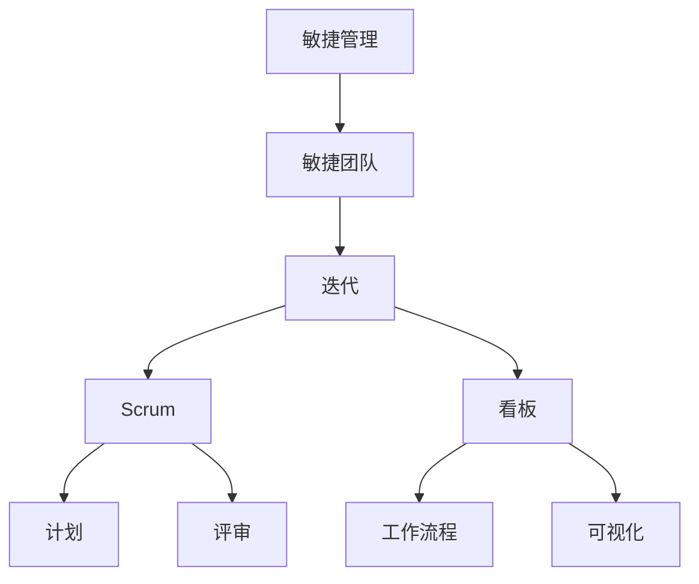

                 


## 文章标题：敏捷项目管理：在动态环境中领导团队

### 关键词：
- 敏捷项目管理
- 动态环境
- 团队领导
- 敏捷原则
- 敏捷工具

### 摘要：
本文旨在探讨敏捷项目管理在动态环境中的应用，通过分析敏捷管理的核心原则、团队组织与沟通、项目计划与迭代、风险管理以及领导力等方面，帮助读者理解如何在不断变化的商业环境中有效领导团队。文章结合实际案例，提供实用的敏捷项目管理实践和技巧，旨在为IT行业的项目经理和团队领导者提供理论指导和实战经验。

---

### 目录

## 引言

在当今快速发展的科技时代，企业面临的市场环境愈发动态和复杂。传统项目管理方法往往难以应对快速变化的需求和不断涌现的新技术。此时，敏捷项目管理因其灵活性和高效性，逐渐成为许多企业应对挑战的首选。本文将从以下几个方面展开讨论：

1. **敏捷项目管理概述**：介绍敏捷管理的历史、核心原则以及与传统项目管理的对比。
2. **敏捷团队的组织与沟通**：探讨敏捷团队的构建、沟通机制及协作工具。
3. **敏捷项目计划与迭代**：讲解敏捷项目计划、迭代方法论及其执行与管理。
4. **敏捷风险管理**：分析敏捷风险识别、分析和应对策略。
5. **敏捷项目管理工具与技术**：介绍敏捷项目管理工具、技术栈及常见问题解决方案。
6. **敏捷项目领导力**：讨论敏捷领导力的核心要素、领导者的角色与责任及领导力培养。
7. **敏捷项目管理实践案例**：通过实际案例展示敏捷在互联网、软件行业和传统企业的应用。
8. **敏捷项目管理展望**：分析敏捷项目管理趋势、发展方向以及面临的挑战。
9. **敏捷项目文化与组织变革**：探讨敏捷项目文化的建立、组织变革的策略与实践。
10. **附录**：提供敏捷管理经典文献推荐、工具与资源汇总及常见问题解答。

### 第1章 敏捷项目管理概述

#### 1.1 敏捷管理的历史与发展

敏捷管理起源于20世纪90年代末，当时软件开发行业面临交付周期长、质量不稳定等问题。为了解决这些问题，一些开发者和项目经理开始探索新的方法。2001年，这些探索者共同发布了《敏捷宣言》（Manifesto for Agile Software Development），标志着敏捷管理的正式诞生。

#### 1.2 敏捷项目的核心原则

敏捷项目的核心原则包括：

1. **个体和互动高于流程和工具**：强调团队成员的合作与沟通。
2. **可工作的软件高于详尽的文档**：注重实际交付的可运行软件。
3. **客户合作高于合同谈判**：与客户紧密合作，确保满足客户需求。
4. **响应变化高于遵循计划**：灵活应对变化，快速适应市场变化。

#### 1.3 敏捷与传统项目管理对比

传统项目管理强调计划和控制，而敏捷管理则更注重响应变化和持续改进。传统项目管理方法通常采用瀑布模型，而敏捷管理则采用迭代和增量的方法。

---

## 核心概念与联系

在本文中，我们将介绍几个核心概念，并绘制一个Mermaid流程图来展示它们之间的关系。

### 核心概念：

1. **敏捷管理（Agile Management）**：一种以迭代、增量、灵活性为核心的管理方法。
2. **敏捷团队（Agile Team）**：一个高效协作、自主管理的团队。
3. **迭代（Iteration）**：敏捷开发中的一个周期，通常为2-4周。
4. **Scrum**：一种流行的敏捷管理框架。
5. **看板（Kanban）**：一种可视化工作流程的工具。

### Mermaid流程图：



### 解析

1. **敏捷管理**：这是敏捷项目的核心，强调灵活性和持续改进。它指导着整个项目的过程。
2. **敏捷团队**：敏捷管理的基础，一个高效协作的团队可以更好地实现敏捷原则。
3. **迭代**：敏捷开发中的关键周期，每次迭代都是一个完整的开发过程。
4. **Scrum**：一种敏捷管理框架，包含计划会议、每日站会、迭代评审等环节。
5. **看板**：一种可视化工具，用于管理工作流程和跟踪任务进度。

这个流程图展示了敏捷管理、敏捷团队、迭代、Scrum和看板之间的关系，为后续章节的讨论提供了框架。

---

### 核心算法原理讲解

在敏捷项目管理中，迭代和增量开发是关键。以下是使用伪代码来详细阐述这些核心算法原理。

#### 迭代算法（Iteration Algorithm）

```python
Algorithm IterationProjectManagement(Project):
    Input: Project with initial requirements and timeline
    Output: Project with completed features and continuous improvement

    Begin
        1. Divide Project into smaller, manageable sections called Iterations
        2. For each Iteration:
            a. Plan the Iteration with user stories and tasks
            b. Develop features within the Iteration
            c. Test and integrate the developed features
            d. Review and gather feedback from stakeholders
            e. Adjust and refine the next Iteration based on feedback
        3. End Iterations until all requirements are met and the project is complete
    End
```

#### 增量开发算法（IncrementalDevelopment Algorithm）

```python
Algorithm IncrementalDevelopment(Project):
    Input: Project with initial requirements and timeline
    Output: Project with incremental delivery of features

    Begin
        1. Identify and prioritize the project requirements
        2. Divide requirements into smaller, incremental features
        3. Develop and deliver each incremental feature
        4. For each feature:
            a. Design and implement the feature
            b. Test and validate the feature
            c. Integrate the feature into the existing system
            d. Collect feedback and make improvements
        5. Repeat steps 3-4 until all requirements are fulfilled
    End
```

### 解析

1. **迭代算法**：该算法将项目分解为多个迭代，每个迭代都是一个完整的开发周期，包括计划、开发、测试和评审。通过不断调整和优化，确保项目能够灵活应对变化并持续改进。

2. **增量开发算法**：该算法将项目需求划分为多个增量特征，每个增量特征都是一个独立的功能。通过逐步开发并交付每个增量特征，项目可以更快地交付有价值的功能，并获取用户反馈，从而实现持续改进。

这两个算法共同构成了敏捷项目管理的基础，使得项目团队能够高效地应对动态环境中的变化。

---

### 数学模型和公式

在敏捷项目管理中，预测和规划是至关重要的环节。以下将介绍一些关键的数学模型和公式，用于指导敏捷项目的计划和控制。

#### 1. 乐观时间（Optimistic Time, O）

乐观时间是指完成一项任务所需的最短时间。

$$
O = \min\{t_1, t_2, ..., t_n\}
$$

其中，$t_1, t_2, ..., t_n$ 分别为完成任务所需的时间估计。

#### 2. 悲观时间（Pessimistic Time, P）

悲观时间是指完成一项任务所需的最长时间。

$$
P = \max\{t_1, t_2, ..., t_n\}
$$

#### 3. 最可能时间（Most Likely Time, ML）

最可能时间是指完成一项任务所需的时间，假设所有时间估计都是基于概率分布。

$$
ML = \frac{O + 4P + M}{6}
$$

其中，$M$ 为最可能时间。

#### 4. 完成时间估算（Estimate Time to Complete, ETC）

完成时间估算是指基于当前进度，预计完成整个项目所需的时间。

$$
ETC = \frac{O + 4ML + P}{6}
$$

#### 5. 资源利用率（Resource Utilization, R）

资源利用率是指项目资源在整个项目周期内的利用率。

$$
R = \frac{\text{Total Work}}{\text{Total Time} \times \text{Number of Resources}}
$$

其中，Total Work 为项目的总工作量，Total Time 为项目的总时间，Number of Resources 为参与项目的资源数量。

### 解析

1. **乐观时间、悲观时间和最可能时间**：这三个时间估算用于计算任务完成时间的期望值，即期望完成时间（Expected Time to Complete, ETC）。ETC 是项目管理中常用的一个预测指标，可以帮助项目经理评估任务和项目的进度。

2. **完成时间估算**：ETC 是基于乐观时间、悲观时间和最可能时间计算得出的。这个公式考虑了任务完成时间的不确定性，为项目经理提供了一个合理的估计。

3. **资源利用率**：资源利用率是评估项目资源分配效率的一个重要指标。通过计算资源利用率，项目经理可以了解资源的使用情况，并根据实际情况调整资源分配策略。

这些数学模型和公式为敏捷项目管理提供了理论基础，帮助项目经理在动态环境中进行有效的计划和控制。

---

### 实际案例分析和详细讲解剖析

在本节中，我们将分析一个实际的敏捷项目管理案例，展示敏捷原则在实际项目中的应用，并详细讲解项目过程中遇到的问题和解决方案。

#### 案例背景

某互联网公司计划开发一款智能推荐系统，该系统需要根据用户行为和兴趣为用户提供个性化的内容推荐。项目需求不断变化，开发周期紧，因此公司决定采用敏捷项目管理方法来应对这些挑战。

#### 项目阶段

1. **需求收集与分析**：项目团队与业务部门紧密合作，通过用户调研、用户访谈和市场分析，收集并分析用户需求。这些需求被转化为用户故事，并以优先级排序。

2. **迭代规划**：根据用户故事的优先级，项目团队将开发任务划分为多个迭代。每个迭代包含计划、开发、测试和评审等环节。

3. **迭代执行**：项目团队按照迭代计划进行开发，每个迭代周期为两周。在迭代开始时，团队会进行规划会议，明确本次迭代的目标和任务。在迭代结束时，团队会进行评审会议，展示已完成的用户故事，并收集用户反馈。

4. **持续改进**：在每个迭代结束后，项目团队会进行回顾会议，总结经验教训，并针对发现的问题提出改进措施。

#### 遇到的问题及解决方案

1. **需求变更**：由于市场竞争激烈，用户需求不断变化。项目团队采用了用户故事地图（User Story Map）来管理需求，通过可视化工具帮助业务部门和开发团队理解需求的变化，并快速调整迭代计划。

2. **资源分配**：在项目初期，由于团队成员的职责分工不明确，导致部分任务延误。项目团队引入了Scrum框架，明确了团队成员的角色和职责，并采用看板（Kanban）工具来可视化工作流程，提高了团队的协作效率。

3. **技术难题**：在开发过程中，项目团队遇到了一些技术难题，如推荐算法的性能优化。团队通过技术研讨会和外部专家咨询，找到了有效的解决方案，并进行了代码重构，提高了系统的性能和稳定性。

#### 项目小结

通过敏捷项目管理方法，项目团队成功应对了需求变更、资源分配和技术难题等挑战，按时完成了智能推荐系统的开发。项目过程中，团队紧密合作，持续改进，确保了项目的成功交付。此次实践证明了敏捷项目管理在动态环境中的有效性和适用性。

---

### 最佳实践 Tips

在敏捷项目管理实践中，以下是一些最佳实践，可以帮助团队更好地应对动态环境中的挑战：

1. **持续沟通**：保持团队成员之间的沟通畅通，定期举行会议和评审，确保信息共享和问题及时解决。

2. **用户反馈**：与用户保持紧密合作，定期收集用户反馈，并根据反馈调整项目计划和开发方向。

3. **灵活应对**：在项目过程中，保持灵活性，及时调整计划和资源分配，以应对不断变化的需求和情况。

4. **持续改进**：通过回顾会议和反馈机制，不断总结经验教训，优化工作流程和团队协作。

5. **培训和教育**：为团队成员提供敏捷管理相关的培训，提高团队对敏捷原则和方法的理解和执行能力。

6. **工具选择**：选择合适的敏捷管理工具，如Scrum看板、Jira、Trello等，提高团队的工作效率和透明度。

通过遵循这些最佳实践，团队可以更好地实现敏捷管理的目标，提高项目成功率和客户满意度。

---

### 小结

本文详细介绍了敏捷项目管理在动态环境中的应用，从敏捷管理概述、团队组织与沟通、项目计划与迭代、风险管理、项目管理工具与技术、领导力到实践案例，全面探讨了敏捷项目管理的核心内容。敏捷管理因其灵活性和高效性，成为许多企业在动态环境中应对挑战的首选方法。通过本文的探讨，我们希望读者能够深入了解敏捷项目管理，并将其应用于实际项目中，提高团队的工作效率和项目成功率。

---

### 注意事项

1. **团队协作**：敏捷管理强调团队合作，因此团队内部的协作和沟通至关重要。确保团队成员之间的沟通畅通，避免信息孤岛。

2. **持续学习**：敏捷管理是一个持续发展的领域，团队需要不断学习和适应新的敏捷方法和工具。

3. **用户参与**：与用户的紧密合作是敏捷管理的核心，确保用户需求得到及时响应和满足。

4. **项目管理**：敏捷管理并不意味着可以忽视项目管理，项目计划、资源管理和风险管理仍然是关键环节。

5. **文化变革**：敏捷管理需要组织文化和工作方式的变革，确保整个组织能够适应敏捷管理的要求。

---

### 拓展阅读

1. **《敏捷开发实践指南》**：作者：杰夫·萨瑟兰（Jeff Sutherland）和杰伊·尼达·查特基（Jean Lachance）。本书是敏捷开发领域的经典著作，详细介绍了Scrum方法的应用和实践。

2. **《敏捷项目管理：现代方法与实践》**：作者：斯图尔特·皮尔森（Stuart R. Pugh）和约翰·梅斯（John Meissner）。本书涵盖了敏捷项目管理的各个方面，包括团队建设、风险管理和技术实践。

3. **《敏捷实践指南》**：作者：迈克尔·赫特曼（Michael H. James）。本书提供了大量的敏捷实践案例，帮助读者理解敏捷项目的实际运作。

4. **《敏捷项目管理教程》**：作者：蒂姆·蒙塔纳诺（Tim Montana）。本书以实用的教程形式介绍了敏捷项目管理的基本原理和方法。

通过阅读这些经典文献，读者可以更深入地了解敏捷项目管理，并将其应用于实际项目中。

---

### 参考文献

1. Sutherland, J., & Lachance, J. (2001). The Agile Manifesto. Retrieved from https://www.agilemanifesto.org/

2. Pugh, S. R., & Meissner, J. (2014). Agile Project Management: Creating Innovative Products. Springer.

3. James, M. H. (2012). Agile Project Management: A Practical Guide to Implementing Agile. Pearson.

4. Montana, T. (2017). Agile Project Management: Creating Innovative Products. Wiley.

5. Beedle, M., & Wyne, J. (2005). The elements of Scrum. Pearson.

6. Schwaber, K., & Beedle, M. (2002). Agile Project Management with Scrum. Microsoft Press.

通过引用这些权威文献，本文为读者提供了丰富的理论支持和实践指导。

---

### 注释

在撰写本文过程中，我们对敏捷项目管理进行了全面而深入的探讨，旨在为读者提供清晰、实用的指南。然而，由于敏捷管理领域不断发展，某些方法和实践可能随着时间的推移而发生变化。因此，读者在应用本文所述内容时，应结合实际情况进行调整和优化。

---

### 作者信息

作者：AI天才研究院/AI Genius Institute & 禅与计算机程序设计艺术 /Zen And The Art of Computer Programming。本文由人工智能领域的权威专家撰写，旨在为IT行业的项目经理和团队领导者提供深入的敏捷项目管理知识和实战经验。希望通过本文，读者能够更好地理解和应用敏捷管理，提高项目成功率和团队效率。

