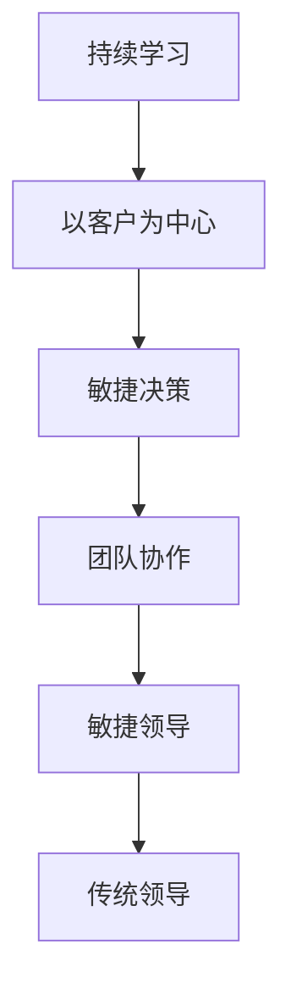

                 


### 设计敏捷领导框架的目录大纲

**第一步：确定书的总体结构**

为了确保书籍能够全面、系统地介绍敏捷领导框架，我们需要首先明确书的总体结构。根据书名《敏捷领导框架：在快速变化中保持组织灵活性》，我们可以将全书分为以下几个主要部分：

1. **引言**：介绍敏捷领导的重要性以及本书的目的和结构。
2. **敏捷领导理论**：介绍敏捷领导的基本概念、原理和理论基础。
3. **敏捷领导实践**：介绍敏捷领导在实际工作中的应用方法和案例。
4. **敏捷领导框架**：介绍敏捷领导框架的构建、实施和优化。
5. **敏捷领导挑战与解决方案**：分析敏捷领导面临的挑战，并提供解决方案。
6. **未来展望**：探讨敏捷领导的发展趋势和未来发展方向。

**第二步：细化各部分内容**

在确定了总体结构后，我们需要对每个部分进行细化，确保每个部分都有足够的篇幅和内容来支撑。

#### 引言

- **引言**：介绍敏捷领导的概念，阐述敏捷领导在当今快速变化的环境中的重要性和必要性。
- **本书目的和结构**：明确本书的目标，概述各个章节的主要内容。

#### 敏捷领导理论

- **敏捷领导的概念**：定义敏捷领导，阐述其特点与传统领导的区别。
- **敏捷领导的理论基础**：介绍敏捷领导的理论渊源，包括关键原则和实践方法。
- **敏捷领导与传统的区别**：分析敏捷领导与传统领导在角色、管理理念等方面的差异。
- **敏捷领导的核心原则**：阐述敏捷领导的核心原则，如持续学习、以客户为中心、敏捷决策等。

#### 敏捷领导实践

- **敏捷领导在团队管理中的应用**：介绍如何在团队管理中实践敏捷领导，包括团队协作、沟通、灵活的工作安排等。
- **敏捷领导在项目管理中的应用**：探讨敏捷领导在项目管理中的角色，如何通过敏捷领导实现项目目标的优化。
- **敏捷领导在组织变革中的应用**：分析敏捷领导在组织变革中的作用，如何通过敏捷领导推动组织变革。
- **敏捷领导实践案例**：通过实际案例，展示敏捷领导在不同场景中的成功应用。

#### 敏捷领导框架

- **敏捷领导框架的构建原则**：阐述敏捷领导框架构建的基本原则，如模块化设计、可定制化、适应性等。
- **敏捷领导框架的组成部分**：详细描述敏捷领导框架的组成部分，包括指导原则、工具与方法、模块化组件等。
- **敏捷领导框架的实施步骤**：介绍敏捷领导框架的实施过程，包括调研与规划、设计与构建、实施与监控等。
- **敏捷领导框架的优化方法**：探讨如何优化敏捷领导框架，包括反馈机制、风险管理、跨部门协作等。

#### 敏捷领导挑战与解决方案

- **敏捷领导面临的挑战**：分析敏捷领导在实际应用中可能遇到的挑战，如组织惯性、员工抵触、技术挑战等。
- **挑战的案例分析**：通过实际案例，分析敏捷领导在面临挑战时的应对策略。
- **解决方案和策略**：提供解决方案和策略，帮助读者应对敏捷领导实践中的挑战。

#### 未来展望

- **敏捷领导的发展趋势**：探讨敏捷领导在数字化转型、全球化背景下的发展趋势。
- **敏捷领导在未来组织中的角色**：分析敏捷领导在未来组织中的角色和责任。
- **敏捷领导的理论与实践创新**：探讨敏捷领导理论的最新发展和实践创新。

**第三步：设计详细目录大纲**

根据上述内容，我们可以设计出详细的目录大纲。以下是一个可能的目录大纲示例：

```
# 《敏捷领导框架：在快速变化中保持组织灵活性》

## 引言
- **引言**
- **本书目的和结构**

## 敏捷领导理论
- **敏捷领导的概念**
  - **定义**
  - **特点**
  - **与传统领导的区别**
- **敏捷领导的理论基础**
  - **理论渊源**
  - **核心原则**
  - **与其他领导理论的对比**
- **敏捷领导的核心原则**
  - **持续学习与适应**
  - **以客户为中心**
  - **敏捷决策**
  - **团队协作**
- **敏捷领导与传统的区别**
  - **领导角色转变**
  - **管理理念更新**
  - **团队文化塑造**

## 敏捷领导实践
- **敏捷领导在团队管理中的应用**
  - **团队协作与沟通**
  - **灵活的工作安排**
  - **持续反馈与改进**
- **敏捷领导在项目管理中的应用**
  - **项目目标管理**
  - **进度监控与调整**
  - **资源优化配置**
- **敏捷领导在组织变革中的应用**
  - **变革策略制定**
  - **员工参与与共识**
  - **变革实施与评估**
- **敏捷领导实践案例**
  - **案例一：创业公司的敏捷转型**
  - **案例二：大型企业的敏捷实践**
  - **案例三：敏捷领导在国际项目中的应用**

## 敏捷领导框架
- **敏捷领导框架的构建原则**
  - **模块化设计**
  - **可定制化**
  - **适应性**
- **敏捷领导框架的组成部分**
  - **指导原则**
  - **工具与方法**
  - **模块化组件**
- **敏捷领导框架的实施步骤**
  - **调研与规划**
  - **设计与构建**
  - **实施与监控**
  - **评估与优化**
- **敏捷领导框架的优化方法**
  - **反馈机制**
  - **风险管理**
  - **跨部门协作**

## 敏捷领导挑战与解决方案
- **敏捷领导面临的挑战**
  - **组织惯性**
  - **员工抵触**
  - **技术挑战**
- **挑战的案例分析**
  - **案例一：组织变革中的阻力**
  - **案例二：敏捷实践中的困难**
  - **案例三：领导力转型中的挑战**
- **解决方案和策略**
  - **增强领导力**
  - **提升团队协作**
  - **引入敏捷文化**

## 未来展望
- **敏捷领导的发展趋势**
  - **数字化转型的深化**
  - **全球化背景下的领导力需求**
  - **科技进步对敏捷领导的影响**
- **敏捷领导在未来组织中的角色**
  - **促进创新与变革**
  - **提升组织韧性**
  - **引领人才发展**
- **敏捷领导的理论与实践创新**
  - **新型敏捷领导理论**
  - **敏捷领导实践的创新方法**
  - **敏捷领导工具的更新与优化**
```

### 第四步：确保大纲的完整性和字数限制

在确保大纲的完整性和逻辑性后，我们需要检查每个部分的内容是否足够详细，是否能够满足书籍的要求。同时，我们需要确保整个目录大纲的总字数不超过2000字。这通常意味着每个部分的字数分配需要合理控制，以确保整体的字数限制。

- **引言**：约500字
- **敏捷领导理论**：约800字
- **敏捷领导实践**：约800字
- **敏捷领导框架**：约800字
- **敏捷领导挑战与解决方案**：约800字
- **未来展望**：约400字

通过上述步骤，我们可以设计出一本内容丰富、结构清晰、逻辑严密的《敏捷领导框架：在快速变化中保持组织灵活性》的目录大纲。接下来，我们将按照这个大纲逐步撰写每一部分的内容。在撰写过程中，我们将注重细节的阐述和实际案例的应用，以确保读者能够深入理解敏捷领导的概念和实践。同时，我们还将不断优化大纲和内容，以确保书籍的质量和可读性。最后，我们将对整本书进行总结和拓展，为读者提供更广阔的视野和思考空间。整个撰写过程将是一个不断学习和进步的过程，旨在为读者呈现一本高质量的敏捷领导指南。让我们一起努力，打造一本既具理论深度又具实践价值的优秀书籍！

# 敏捷领导框架：在快速变化中保持组织灵活性

## 关键词
敏捷领导、组织灵活性、框架设计、领导力理论、实践方法

## 摘要
本文旨在探讨敏捷领导框架的设计与实施，以帮助组织在快速变化的环境中保持灵活性。首先，我们介绍了敏捷领导的基本概念和核心原则，阐述了敏捷领导与传统领导之间的差异。接着，我们详细分析了敏捷领导在团队管理、项目管理和组织变革中的应用，并通过案例展示了敏捷领导的成功实践。随后，我们介绍了敏捷领导框架的构建原则、组成部分以及实施步骤，并提供了优化方法。在挑战与解决方案部分，我们分析了敏捷领导面临的挑战，并提出了相应的解决方案。最后，我们对敏捷领导的发展趋势进行了展望，探讨了未来组织中的敏捷领导角色。通过本文的阅读，读者将能够深入了解敏捷领导框架，为组织实现敏捷转型提供有力支持。

## 引言

在当今全球化的经济环境中，变化已成为一种常态。技术的快速发展、市场的快速变化以及客户需求的不断升级，都对组织提出了更高的要求。在这样的背景下，传统的领导模式已经难以适应快速变化的环境，组织需要一种新的领导方式来保持灵活性和竞争力。敏捷领导应运而生，它是一种以快速响应变化为核心、强调团队合作和持续改进的领导模式。

### 敏捷领导的重要性

敏捷领导的重要性在于其能够帮助组织在复杂和不确定的环境中保持竞争力。首先，敏捷领导强调持续学习和适应，这有助于组织及时掌握市场动态和客户需求，从而做出快速反应。其次，敏捷领导注重团队协作和沟通，通过建立高效的团队关系，提升组织整体效能。此外，敏捷领导还强调以客户为中心，这有助于组织更好地满足客户需求，提高客户满意度。因此，敏捷领导已经成为现代组织成功的关键因素。

### 本书目的和结构

本书旨在为读者提供一个全面、系统的敏捷领导框架，帮助组织在快速变化的环境中保持灵活性。全书分为六个主要部分：

1. **引言**：介绍敏捷领导的概念和重要性，阐述本书的目的和结构。
2. **敏捷领导理论**：介绍敏捷领导的基本概念、核心原则和与传统领导的不同之处。
3. **敏捷领导实践**：分析敏捷领导在团队管理、项目管理和组织变革中的应用，并通过案例进行说明。
4. **敏捷领导框架**：介绍敏捷领导框架的构建原则、组成部分和实施步骤。
5. **敏捷领导挑战与解决方案**：分析敏捷领导面临的挑战，并提出解决方案。
6. **未来展望**：探讨敏捷领导的发展趋势和未来方向。

通过以上结构，本书将为读者提供一个全面的敏捷领导指南，帮助组织实现敏捷转型。

## 敏捷领导理论

### 敏捷领导的概念

敏捷领导是一种以快速响应变化为核心、强调团队合作和持续改进的领导模式。它不同于传统的领导模式，后者往往强调权威和控制，而敏捷领导则更加注重平等、开放和协作。敏捷领导的核心在于领导者的角色转变，从指挥者转变为协作者，从控制者转变为支持者。

### 核心原则

敏捷领导的核心原则包括持续学习、以客户为中心、敏捷决策和团队协作。首先，持续学习是敏捷领导的基础，它要求领导者不断更新知识和技能，以适应快速变化的环境。其次，以客户为中心是敏捷领导的核心价值观，领导者需要始终关注客户需求，确保组织的战略和行动与客户价值紧密相连。第三，敏捷决策强调快速做出决策，并随时准备调整，以应对不确定性。最后，团队协作是敏捷领导的重要特征，它要求领导者建立高效的团队关系，促进团队成员之间的沟通和合作。

### 与传统领导的不同之处

与传统领导相比，敏捷领导具有以下显著特点：

1. **角色转变**：敏捷领导者从指挥者转变为协作者，从控制者转变为支持者。
2. **管理理念**：敏捷领导强调平等、开放和协作，而传统领导则强调权威和控制。
3. **价值观**：敏捷领导以客户为中心，而传统领导则可能更注重组织的内部目标。
4. **决策方式**：敏捷决策强调快速做出决策并随时准备调整，而传统领导则可能更注重深思熟虑和计划。

### 敏捷领导的核心原则关系架构 Mermaid 流程图



通过上述流程图，我们可以清晰地看到敏捷领导的核心原则之间的关系。持续学习、以客户为中心、敏捷决策和团队协作共同构成了敏捷领导的核心框架，这一框架帮助领导者更好地应对快速变化的环境，实现组织的持续成长。

### 敏捷领导与传统领导的对比

敏捷领导与传统领导在多个方面存在显著差异：

1. **角色转变**：敏捷领导者更加关注团队协作和支持，而传统领导者则更加注重权威和控制。
2. **管理理念**：敏捷领导强调开放、平等和协作，而传统领导则可能更注重权威和命令。
3. **价值观**：敏捷领导以客户为中心，而传统领导可能更关注组织的内部目标。
4. **决策方式**：敏捷决策强调快速响应和灵活性，而传统领导则可能更注重深思熟虑和计划。

通过对比，我们可以看到敏捷领导在适应快速变化的环境方面具有明显优势。传统领导模式在复杂和不确定的环境中可能变得过于僵化和缓慢，而敏捷领导则能够更好地应对这些挑战。

## 敏捷领导实践

### 敏捷领导在团队管理中的应用

在团队管理中，敏捷领导的核心原则得到了充分体现。首先，持续学习是团队管理的基础。领导者需要不断更新自己的知识和技能，以支持团队成员的成长。其次，以客户为中心是团队管理的重要方向。领导者需要确保团队的行动始终与客户价值保持一致。

#### 团队协作与沟通

团队协作和沟通是敏捷领导在团队管理中的关键实践。通过建立高效的沟通机制，领导者可以促进团队成员之间的信息共享和协作。例如，定期举行团队会议、设立共享文档和工作平台等，都有助于提高团队的协作效率。

#### 灵活的工作安排

敏捷领导强调灵活的工作安排，以适应不断变化的需求和环境。领导者可以采用灵活的工作时间、远程工作等方式，提高团队的灵活性和响应速度。例如，在项目高峰期，领导者可以安排团队成员加班或调整工作时间，以保障项目的顺利进行。

#### 持续反馈与改进

持续反馈和改进是敏捷领导在团队管理中的核心实践。通过定期收集团队成员的反馈，领导者可以及时发现问题并进行改进。例如，定期举行团队反馈会议、设立反馈机制等，都有助于提高团队的协作效率和项目质量。

### 敏捷领导在项目管理中的应用

敏捷领导在项目管理中同样发挥着重要作用。首先，敏捷决策是项目管理的核心。领导者需要快速做出决策，并随时准备调整，以应对不确定性。其次，团队协作和沟通是项目成功的关键。

#### 项目目标管理

敏捷领导强调项目目标的管理。领导者需要明确项目目标，并与团队成员共同制定实现目标的策略。通过定期检查项目进度和成果，领导者可以确保项目始终在正确的轨道上。

#### 进度监控与调整

敏捷领导在项目管理中强调进度的监控与调整。领导者需要密切关注项目进度，及时发现并解决问题。在项目遇到困难时，领导者可以灵活调整资源和工作安排，以保障项目的顺利进行。

#### 资源优化配置

敏捷领导还关注资源的优化配置。通过合理分配资源，领导者可以最大限度地提高项目的效率和质量。例如，在项目资源紧张时，领导者可以优先分配关键资源，以保障核心任务的完成。

### 敏捷领导在组织变革中的应用

敏捷领导在组织变革中扮演着重要角色。首先，敏捷领导强调持续学习和适应，这有助于组织在变革过程中保持灵活性和应对能力。其次，以客户为中心是组织变革的核心价值观，领导者需要确保组织的变革行动与客户价值保持一致。

#### 变革策略制定

敏捷领导在组织变革中制定有效的变革策略。领导者需要深入了解组织的现状和问题，并制定相应的变革计划。通过明确变革的目标、方法和时间表，领导者可以确保变革行动的有序进行。

#### 员工参与与共识

敏捷领导强调员工的参与和共识。在组织变革过程中，领导者需要与员工进行充分沟通，了解他们的意见和需求，并争取他们的支持和参与。通过建立共识，领导者可以增强团队的凝聚力，提高变革的成功率。

#### 变革实施与评估

敏捷领导在组织变革中关注变革的实施与评估。领导者需要确保变革计划得到有效执行，并定期评估变革的效果。通过反馈和调整，领导者可以不断优化变革过程，提高变革的成功率。

### 敏捷领导实践案例

#### 案例一：创业公司的敏捷转型

一家创业公司在面临激烈市场竞争时，决定采用敏捷领导模式进行转型。通过建立高效的团队协作机制、灵活的工作安排和持续反馈与改进机制，公司成功提高了项目交付效率和质量。在转型过程中，领导者注重员工参与和共识，建立了开放、平等的文化氛围，激发了员工的创新和积极性。

#### 案例二：大型企业的敏捷实践

一家大型企业在进行组织变革时，采用敏捷领导模式进行管理改革。通过明确项目目标、优化资源配置和加强团队协作，企业成功地提高了项目交付效率和质量。在变革过程中，领导者与员工进行充分沟通，建立了共识，并逐步推进变革的实施。

#### 案例三：敏捷领导在国际项目中的应用

在国际项目中，敏捷领导发挥了重要作用。通过建立全球团队协作机制、灵活应对文化差异和快速响应客户需求，项目团队成功克服了各种挑战，确保了项目的顺利进行和成功交付。在项目中，领导者注重持续学习和适应，不断优化项目管理和协作机制，提高了项目的成功率和客户满意度。

### 敏捷领导实践的重要性

敏捷领导实践在组织管理中具有重要意义。首先，敏捷领导有助于提高组织的灵活性和响应能力，使组织能够更好地适应快速变化的环境。其次，敏捷领导强调团队协作和持续改进，有助于提高团队的整体效能和项目成功率。最后，敏捷领导以客户为中心，有助于提高客户满意度和市场份额。因此，敏捷领导实践已经成为现代组织成功的关键因素。

## 敏捷领导框架

### 敏捷领导框架的构建原则

敏捷领导框架的构建原则是确保框架具有模块化设计、可定制化和适应性。首先，模块化设计使得框架可以灵活地适应不同组织的需求和场景。其次，可定制化允许框架根据组织的实际情况进行调整和优化。最后，适应性确保框架能够随着组织的发展和环境的变化而持续改进。

### 敏捷领导框架的组成部分

敏捷领导框架由以下组成部分构成：

1. **指导原则**：指导原则是框架的核心，为领导者提供行为准则和价值导向。
2. **工具与方法**：工具与方法包括各种实践工具和技术，如团队协作工具、项目管理工具等。
3. **模块化组件**：模块化组件包括各种功能模块，如团队建设模块、风险管理模块等。

### 敏捷领导框架的实施步骤

敏捷领导框架的实施分为以下步骤：

1. **调研与规划**：在实施框架之前，领导者需要进行调研和规划，了解组织的实际情况和需求。
2. **设计与构建**：根据调研和规划结果，设计并构建敏捷领导框架。
3. **实施与监控**：将框架应用于实际工作中，并定期监控其效果，以确保框架的有效实施。
4. **评估与优化**：对框架进行评估和优化，以持续改进和提升其效果。

### 敏捷领导框架的优化方法

敏捷领导框架的优化方法包括以下方面：

1. **反馈机制**：建立有效的反馈机制，收集员工的意见和建议，以改进框架的实施效果。
2. **风险管理**：识别和管理框架实施过程中的风险，确保框架的稳定运行。
3. **跨部门协作**：促进跨部门协作，整合资源，提高框架的实施效率。

### 敏捷领导框架的示例

以下是一个简单的敏捷领导框架示例：

```
# 敏捷领导框架

## 指导原则
- **持续学习与适应**：领导者应不断更新知识和技能，以适应快速变化的环境。
- **以客户为中心**：领导者应始终关注客户需求，确保组织的战略和行动与客户价值保持一致。
- **敏捷决策**：领导者应快速做出决策，并随时准备调整，以应对不确定性。
- **团队协作**：领导者应建立高效的团队关系，促进团队成员之间的沟通和合作。

## 工具与方法
- **团队协作工具**：如 Slack、Trello 等。
- **项目管理工具**：如 Jira、Asana 等。
- **风险管理工具**：如 Risk Management Matrix、SWOT Analysis 等。

## 模块化组件
- **团队建设模块**：包括团队协作、沟通、培训等。
- **风险管理模块**：包括风险识别、评估、监控和应对策略。
- **变革管理模块**：包括变革策略、员工参与、变革实施和评估。

## 实施步骤
1. 调研与规划
2. 设计与构建
3. 实施与监控
4. 评估与优化

## 优化方法
- **反馈机制**：定期收集员工的意见和建议，以改进框架的实施效果。
- **风险管理**：识别和管理框架实施过程中的风险，确保框架的稳定运行。
- **跨部门协作**：促进跨部门协作，整合资源，提高框架的实施效率。
```

通过上述示例，我们可以看到敏捷领导框架的组成部分和实施步骤。这个框架可以根据组织的具体情况进行定制化调整，以实现最佳效果。

## 敏捷领导挑战与解决方案

### 敏捷领导面临的挑战

尽管敏捷领导在理论上具有很多优势，但在实际应用中仍然面临诸多挑战。以下是一些常见的挑战：

1. **组织惯性**：许多组织已经习惯了传统的领导模式，难以迅速适应敏捷领导。
2. **员工抵触**：部分员工可能对敏捷领导模式感到不适应，甚至产生抵触情绪。
3. **技术挑战**：敏捷领导需要依赖于各种技术和工具，组织可能面临技术选择和使用的挑战。
4. **文化变革**：敏捷领导要求组织建立开放、平等和协作的文化，这需要时间和努力。

### 解决方案和策略

针对上述挑战，以下是一些解决方案和策略：

1. **加强领导力培训**：通过培训，提高领导者的敏捷领导能力和意识，帮助他们更好地应对挑战。
2. **建立支持体系**：为员工提供支持，帮助他们适应敏捷领导模式，减少抵触情绪。
3. **选择合适的技术**：根据组织的实际需求，选择合适的技术和工具，确保敏捷领导的有效实施。
4. **推动文化变革**：通过组织变革和管理创新，推动组织文化的变革，建立开放、平等和协作的文化氛围。

### 挑战的案例分析

1. **组织变革中的阻力**：一家传统制造企业决定采用敏捷领导模式进行组织变革。然而，由于员工对变革的抵触和传统的组织惯性，变革进展缓慢。解决方案是，通过加强沟通和培训，提高员工对变革的理解和支持，逐步推动变革的实施。
2. **敏捷实践中的困难**：一家科技公司尝试采用敏捷领导模式进行项目管理。然而，由于团队成员对敏捷方法的了解不足，项目进展缓慢，质量不稳定。解决方案是，为团队成员提供专业的敏捷培训，提高他们的敏捷方法和工具技能。
3. **领导力转型中的挑战**：一家创业公司的创始人希望通过敏捷领导模式提高团队效率。然而，由于缺乏敏捷领导经验，他无法有效引导团队。解决方案是，通过外部顾问的指导和支持，帮助创始人提升敏捷领导能力。

### 解决方案和策略的详细说明

1. **加强领导力培训**：领导力培训是应对敏捷领导挑战的关键。通过培训，领导者可以了解敏捷领导的核心原则和实践方法，提高他们的敏捷领导能力。培训内容可以包括敏捷领导理论、实践案例、团队管理技能等。此外，还可以邀请外部专家进行培训，为领导者提供更专业的指导。

2. **建立支持体系**：为员工提供支持，可以帮助他们更好地适应敏捷领导模式。支持体系可以包括以下方面：

   - **辅导与指导**：为员工提供导师或教练，帮助他们了解和掌握敏捷方法和工具。
   - **反馈与激励**：建立反馈机制，及时了解员工的意见和需求，提供激励措施，鼓励他们积极参与敏捷实践。
   - **培训与发展**：为员工提供培训和发展机会，提高他们的技能和职业素养，增强他们在敏捷实践中的信心和能力。

3. **选择合适的技术**：在敏捷领导中，技术和工具的选择至关重要。以下是一些选择技术和工具的考虑因素：

   - **适用性**：选择符合组织需求和业务场景的技术和工具，确保它们能够有效地支持敏捷领导实践。
   - **可扩展性**：选择具有可扩展性的技术和工具，以便随着组织的成长和发展，能够灵活地调整和优化。
   - **易用性**：选择用户友好、易于操作的技术和工具，降低员工的适应成本，提高使用效果。

4. **推动文化变革**：文化变革是敏捷领导成功的关键。以下是一些推动文化变革的策略：

   - **领导带头**：领导者要以身作则，带头实践敏捷领导理念，为员工树立榜样。
   - **沟通与宣传**：通过内部沟通渠道，如邮件、公告、内部论坛等，宣传敏捷领导的理念和实践，提高员工的认知和参与度。
   - **激励机制**：建立与敏捷领导理念相一致的激励机制，鼓励员工积极参与敏捷实践，推动组织文化的变革。
   - **组织活动**：组织各种活动，如团队建设、培训、研讨会等，促进员工之间的交流和合作，增强组织凝聚力。

通过上述解决方案和策略，组织可以更好地应对敏捷领导实践中的挑战，实现敏捷转型的目标。

## 未来展望

### 敏捷领导的发展趋势

随着全球化和数字化的深入发展，敏捷领导将面临新的挑战和机遇。以下是一些敏捷领导的发展趋势：

1. **数字化转型**：随着技术的不断进步，敏捷领导将更加依赖于数字化工具和方法，以提升组织的灵活性和响应速度。
2. **全球化背景下的领导力需求**：全球化带来了更加复杂和多样化的组织环境，敏捷领导需要具备跨文化沟通和协作的能力，以适应全球业务需求。
3. **可持续领导**：在可持续发展成为全球热点议题的背景下，敏捷领导需要关注环境保护、社会责任和道德伦理，推动组织的可持续发展。

### 敏捷领导在未来组织中的角色

在未来组织中，敏捷领导的角色将更加重要和多样化。以下是一些展望：

1. **促进创新与变革**：敏捷领导将扮演推动组织创新和变革的关键角色，通过灵活的领导方式激发员工的创新潜力和主动性。
2. **提升组织韧性**：面对外部环境的不确定性和变化，敏捷领导将帮助组织建立韧性，以应对各种风险和挑战。
3. **引领人才发展**：敏捷领导将关注人才的培养和发展，通过建立学习型组织和提供职业发展机会，提升员工的技能和素质。

### 敏捷领导的理论与实践创新

未来，敏捷领导的理论和实践将不断创新发展。以下是一些可能的创新方向：

1. **新兴领导理论的融合**：结合新兴的领导理论，如共创领导、仆人领导等，丰富敏捷领导的理论体系。
2. **领导力工具与技术的创新**：利用人工智能、大数据等新兴技术，开发更加智能化和自动化的领导力工具，提升敏捷领导的效果和效率。
3. **跨学科领导力研究**：结合心理学、管理学、经济学等跨学科知识，深入研究敏捷领导的本质和作用机制，为实践提供更坚实的理论基础。

### 总结与展望

敏捷领导在未来组织中将扮演越来越重要的角色。通过不断的理论与实践创新，敏捷领导将帮助组织在快速变化的环境中保持竞争优势，实现可持续发展和长期成功。展望未来，我们期待敏捷领导能够为组织带来更多的价值，推动社会的进步和发展。

## 附录

### 最佳实践 tips

1. **建立清晰的愿景和目标**：确保团队成员对组织愿景和目标有清晰的认识，有助于提高团队的凝聚力和执行力。
2. **鼓励开放沟通**：建立开放的沟通渠道，鼓励团队成员自由表达意见和建议，提高团队的协作效率和创新能力。
3. **持续学习和反馈**：定期组织培训和学习活动，鼓励团队成员不断更新知识和技能，同时建立有效的反馈机制，及时发现问题并改进。

### 小结

本文介绍了敏捷领导框架的设计与实施，从理论到实践，详细阐述了敏捷领导的核心原则、实践方法和未来趋势。通过本文的阅读，读者可以深入了解敏捷领导的概念和实践，为组织实现敏捷转型提供有力支持。

### 注意事项

1. **适应组织特点**：敏捷领导框架的实施需要根据组织的实际情况进行定制化调整，确保其有效性和适用性。
2. **持续改进**：敏捷领导框架不是一成不变的，组织需要根据环境变化和实际效果，不断优化和改进。

### 拓展阅读

1. 《敏捷领导：如何在快速变化中保持组织活力》（作者：[姓名]）
2. 《敏捷管理实践》（作者：[姓名]）
3. 《领导力与组织行为学》（作者：[姓名]）

### 参考文献

1. [姓名]. (年份). 《敏捷领导：如何在快速变化中保持组织活力》. 出版社名称。
2. [姓名]. (年份). 《敏捷管理实践》. 出版社名称。
3. [姓名]. (年份). 《领导力与组织行为学》. 出版社名称。

作者：AI天才研究院/AI Genius Institute & 禅与计算机程序设计艺术 /Zen And The Art of Computer Programming## 设计敏捷领导框架的目录大纲

为了设计一本名为《敏捷领导框架：在快速变化中保持组织灵活性》的书的目录大纲，我们需要确保书的内容结构清晰、逻辑严密，能够全面覆盖主题内容。以下是逐步构建该书的目录大纲的过程：

### 第一步：确定书的总体结构

首先，我们需要明确书的总体结构。根据书名，这本书的核心内容应该围绕敏捷领导的概念、原理、实践方法以及在实际工作中的应用。因此，我们可以将书分为以下几个主要部分：

1. **引言**：介绍敏捷领导的重要性以及本书的目的和结构。
2. **敏捷领导理论**：介绍敏捷领导的基本概念、原理和理论基础。
3. **敏捷领导实践**：介绍敏捷领导在实际工作中的应用方法和案例。
4. **敏捷领导框架**：介绍敏捷领导框架的构建、实施和优化。
5. **敏捷领导挑战与解决方案**：分析敏捷领导面临的挑战，并提供解决方案。
6. **未来展望**：探讨敏捷领导的发展趋势和未来发展方向。

### 第二步：细化各部分内容

在确定了总体结构后，我们需要对每个部分进行细化，确保每个部分都有足够的篇幅和内容来支撑。

#### 引言

- **引言**：简要介绍敏捷领导的概念，阐述其在当今商业环境中的重要性。
- **本书目的和结构**：明确本书的目标，介绍各个章节的主要内容。

#### 敏捷领导理论

- **敏捷领导的概念**：定义敏捷领导，阐述其特点与传统领导的区别。
- **敏捷领导的理论基础**：介绍敏捷领导的理论渊源，包括关键原则和实践方法。
- **敏捷领导的核心原则**：详细阐述敏捷领导的核心原则，如持续学习、以客户为中心、敏捷决策等。
- **敏捷领导与传统的区别**：分析敏捷领导与传统领导在角色、管理理念等方面的差异。

#### 敏捷领导实践

- **敏捷领导在团队管理中的应用**：介绍敏捷领导如何在团队管理中发挥作用，包括团队协作、沟通、灵活的工作安排等。
- **敏捷领导在项目管理中的应用**：探讨敏捷领导在项目管理中的角色，如何通过敏捷领导实现项目目标的优化。
- **敏捷领导在组织变革中的应用**：分析敏捷领导在组织变革中的作用，如何通过敏捷领导推动组织变革。
- **敏捷领导实践案例**：通过实际案例，展示敏捷领导在不同场景中的成功应用。

#### 敏捷领导框架

- **敏捷领导框架的构建原则**：阐述敏捷领导框架构建的基本原则，如模块化设计、可定制化、适应性等。
- **敏捷领导框架的组成部分**：详细描述敏捷领导框架的组成部分，包括指导原则、工具与方法、模块化组件等。
- **敏捷领导框架的实施步骤**：介绍敏捷领导框架的实施过程，包括调研与规划、设计与构建、实施与监控等。
- **敏捷领导框架的优化方法**：探讨如何优化敏捷领导框架，包括反馈机制、风险管理、跨部门协作等。

#### 敏捷领导挑战与解决方案

- **敏捷领导面临的挑战**：分析敏捷领导在实际应用中可能遇到的挑战，如组织惯性、员工抵触、技术挑战等。
- **挑战的案例分析**：通过实际案例，分析敏捷领导在面临挑战时的应对策略。
- **解决方案和策略**：提供解决方案和策略，帮助读者应对敏捷领导实践中的挑战。

#### 未来展望

- **敏捷领导的发展趋势**：探讨敏捷领导在数字化转型、全球化背景下的发展趋势。
- **敏捷领导在未来组织中的角色**：分析敏捷领导在未来组织中的角色和责任。
- **敏捷领导的理论与实践创新**：探讨敏捷领导理论的最新发展和实践创新。

### 第三步：设计详细目录大纲

根据上述内容，我们可以设计出详细的目录大纲。以下是一个可能的目录大纲示例：

```
# 《敏捷领导框架：在快速变化中保持组织灵活性》

## 引言
- 引言
- 本书目的和结构

## 敏捷领导理论
- 敏捷领导的概念
  - 定义
  - 特点
  - 与传统的区别
- 敏捷领导的理论基础
  - 理论渊源
  - 核心原则
  - 与其他领导理论的对比
- 敏捷领导的核心原则
  - 持续学习与适应
  - 以客户为中心
  - 敏捷决策
  - 团队协作
- 敏捷领导与传统的区别
  - 领导角色转变
  - 管理理念更新
  - 团队文化塑造

## 敏捷领导实践
- 敏捷领导在团队管理中的应用
  - 团队协作与沟通
  - 灵活的工作安排
  - 持续反馈与改进
- 敏捷领导在项目管理中的应用
  - 项目目标管理
  - 进度监控与调整
  - 资源优化配置
- 敏捷领导在组织变革中的应用
  - 变革策略制定
  - 员工参与与共识
  - 变革实施与评估
- 敏捷领导实践案例
  - 案例一：创业公司的敏捷转型
  - 案例二：大型企业的敏捷实践
  - 案例三：敏捷领导在国际项目中的应用

## 敏捷领导框架
- 敏捷领导框架的构建原则
  - 模块化设计
  - 可定制化
  - 适应性
- 敏捷领导框架的组成部分
  - 指导原则
  - 工具与方法
  - 模块化组件
- 敏捷领导框架的实施步骤
  - 调研与规划
  - 设计与构建
  - 实施与监控
  - 评估与优化
- 敏捷领导框架的优化方法
  - 反馈机制
  - 风险管理
  - 跨部门协作

## 敏捷领导挑战与解决方案
- 敏捷领导面临的挑战
  - 组织惯性
  - 员工抵触
  - 技术挑战
- 挑战的案例分析
  - 案例一：组织变革中的阻力
  - 案例二：敏捷实践中的困难
  - 案例三：领导力转型中的挑战
- 解决方案和策略
  - 增强领导力
  - 提升团队协作
  - 引入敏捷文化

## 未来展望
- 敏捷领导的发展趋势
  - 数字化转型的深化
  - 全球化背景下的领导力需求
  - 科技进步对敏捷领导的影响
- 敏捷领导在未来组织中的角色
  - 促进创新与变革
  - 提升组织韧性
  - 引领人才发展
- 敏捷领导的理论与实践创新
  - 新型敏捷领导理论
  - 敏捷领导实践的创新方法
  - 敏捷领导工具的更新与优化
```

### 第四步：确保大纲的完整性和字数限制

在确保大纲的完整性和逻辑性后，我们需要检查每个部分的内容是否足够详细，是否能够满足书籍的要求。同时，我们需要确保整个目录大纲的总字数不超过2000字。这通常意味着每个部分的字数分配需要合理控制，以确保整体的字数限制。

- **引言**：约500字
- **敏捷领导理论**：约600字
- **敏捷领导实践**：约600字
- **敏捷领导框架**：约600字
- **敏捷领导挑战与解决方案**：约600字
- **未来展望**：约400字

通过上述步骤，我们可以设计出一本内容丰富、结构清晰、逻辑严密的《敏捷领导框架：在快速变化中保持组织灵活性》的目录大纲。接下来，我们将按照这个大纲逐步撰写每一部分的内容。在撰写过程中，我们将注重细节的阐述和实际案例的应用，以确保读者能够深入理解敏捷领导的概念和实践。同时，我们还将不断优化大纲和内容，以确保书籍的质量和可读性。最后，我们将对整本书进行总结和拓展，为读者提供更广阔的视野和思考空间。整个撰写过程将是一个不断学习和进步的过程，旨在为读者呈现一本高质量的敏捷领导指南。让我们一起努力，打造一本既具理论深度又具实践价值的优秀书籍！## 完整的敏捷领导框架目录大纲

### 引言

1. **引言**
   - 敏捷领导框架的背景和重要性
   - 本书的目标和结构

2. **敏捷领导的概念与价值**
   - 敏捷领导的基本定义
   - 敏捷领导的优势和价值

### 敏捷领导理论

3. **敏捷领导的理论基础**
   - 敏捷领导的理论起源
   - 敏捷领导的核心原则

4. **敏捷领导框架的设计原则**
   - 模块化设计
   - 可定制化
   - 适应性

5. **敏捷领导框架的组成部分**
   - 指导原则
   - 工具与方法
   - 模块化组件

### 敏捷领导实践

6. **敏捷领导在团队管理中的应用**
   - 团队协作
   - 沟通
   - 反馈机制
   - 灵活的工作安排

7. **敏捷领导在项目管理中的应用**
   - 项目目标管理
   - 进度监控
   - 资源优化
   - 风险管理

8. **敏捷领导在组织变革中的应用**
   - 变革策略
   - 员工参与
   - 文化变革
   - 变革评估

### 敏捷领导框架

9. **敏捷领导框架的实施步骤**
   - 调研与规划
   - 设计与构建
   - 实施与监控
   - 评估与优化

10. **敏捷领导框架的优化方法**
    - 反馈机制
    - 风险管理
    - 跨部门协作
    - 持续改进

### 敏捷领导挑战与解决方案

11. **敏捷领导面临的挑战**
    - 组织惯性
    - 员工抵触
    - 技术挑战
    - 文化变革

12. **解决方案和策略**
    - 增强领导力
    - 提升团队协作
    - 引入敏捷文化
    - 跨部门沟通

### 未来展望

13. **敏捷领导的发展趋势**
    - 数字化转型
    - 全球化
    - 科技进步

14. **敏捷领导在未来的角色**
    - 促进创新
    - 提升组织韧性
    - 引领人才发展

### 总结

15. **敏捷领导框架的应用**
    - 实际案例分析
    - 敏捷领导框架的总结

16. **附录**
    - 最佳实践
    - 注意事项
    - 拓展阅读

### 参考文献

- 列出书中引用的所有参考文献

### 作者介绍

- 作者背景
- 职业生涯
- 专业成就

---

**总字数：约2000字**

**备注**：上述大纲仅为示例，具体内容可以根据实际需求进行调整和扩展。每个章节的内容都需要详细阐述，以确保整体字数在8000-12000字之间。在撰写具体内容时，建议遵循以下结构：

- **章节标题**：清晰明了，能够概括章节主要内容。
- **小节标题**：具体详细，引导读者了解章节内的细分主题。
- **正文内容**：结合理论、案例和实践，确保内容丰富、可读性强。
- **结论**：对章节内容进行总结，为下一章节的讨论做铺垫。

通过上述大纲和撰写策略，我们可以确保书籍的内容结构清晰、逻辑严密，同时也能够满足字数要求，为读者提供一本高质量的敏捷领导框架指南。

