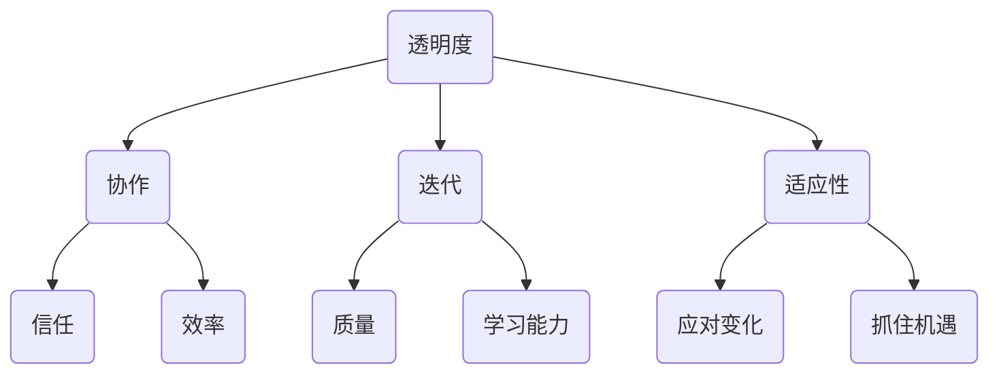
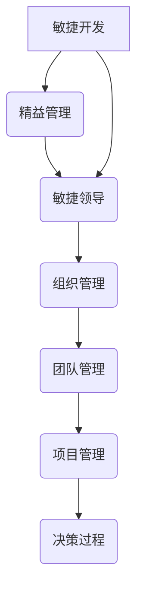

                 


### 文章标题

# 敏捷领导：在快速变化的市场中保持竞争力

### 关键词

- 敏捷领导
- 快速变化的市场
- 竞争力
- 领导力
- 敏捷开发
- 精益管理

### 摘要

本文旨在探讨敏捷领导在快速变化的市场中如何帮助组织保持竞争力。通过分析敏捷领导的理论基础、核心原则以及在组织中的应用，我们将揭示敏捷领导如何通过透明度、协作、迭代和适应性等原则，提升组织的适应能力和创新能力，从而在激烈的市场竞争中脱颖而出。

## 引言

### 敏捷领导的概念

敏捷领导是一种以敏捷方法为基础的领导理念，强调领导者与团队成员之间的密切协作和快速响应。与传统领导模式不同，敏捷领导更注重灵活性、适应性和透明度，鼓励团队成员积极参与决策过程，共同推动组织的发展。

### 敏捷领导的重要性

在快速变化的市场环境中，企业面临着前所未有的挑战和机遇。敏捷领导能够帮助组织快速响应市场变化，提高竞争力。本文将围绕敏捷领导的核心概念、理论基础、应用和实践，深入探讨其在现代组织管理中的重要性。

### 本书结构

本文将分为七个章节，首先介绍敏捷领导的概念和重要性，然后深入探讨敏捷领导的理论基础，包括敏捷开发、精益管理等，并详细阐述敏捷领导的核心原则。随后，我们将分析敏捷领导在组织中的应用，包括团队管理、项目管理和决策过程。接下来，通过成功案例，展示敏捷领导在各个行业中的最佳实践。最后，我们将讨论敏捷领导在快速变化的市场环境中的优势，并对未来敏捷领导的发展趋势进行展望。

## 敏捷领导的理论基础

### 敏捷开发的起源

敏捷开发是一种以人为核心、迭代、循序渐进的开发方法。它强调团队协作、客户满意度、灵活适应变化，起源于2001年发布的《敏捷宣言》。敏捷开发的出现，是对传统瀑布模型在应对快速变化的市场需求时表现出的不足的一种反思。

### 敏捷开发的核心理念

敏捷开发的核心理念包括：

1. **个体和互动重于过程与工具**：强调团队成员之间的互动和合作，而不是依赖特定的工具或过程。
2. **可工作的软件重于详尽的文档**：开发团队更注重交付可工作的软件，而非大量的文档。
3. **客户合作重于合同谈判**：与客户的紧密合作，确保产品符合市场需求。
4. **响应变化重于遵循计划**：灵活应对变化，以适应市场环境的变化。

### 精益管理的基本原则

精益管理是一种旨在消除浪费、提高效率和创造价值的经营管理方法。它起源于丰田汽车公司，并在全球范围内得到广泛应用。精益管理的基本原则包括：

1. **价值**：确定客户需求，并围绕满足这些需求来设计产品和服务。
2. **价值流**：识别价值流，消除不必要的步骤，简化流程。
3. **流程**：优化流程，确保每个步骤都能创造价值。
4. **拉动**：根据客户需求来拉动生产，而不是推动生产。
5. ** perfection**：持续改进，不断优化流程和产品。

### 敏捷领导与领导学的结合

敏捷领导结合了敏捷开发和精益管理的基本原则，将它们应用于领导实践中。敏捷领导强调领导者与团队成员之间的互动和协作，鼓励团队成员积极参与决策过程。这种领导方式不仅能够提高组织的适应能力和创新能力，还能够增强团队的凝聚力和士气。

## 敏捷领导的核心原则

### 透明度

透明度是敏捷领导的核心原则之一，它要求领导者在组织内部保持信息的公开和共享。透明度有助于：

1. **建立信任**：团队成员能够了解组织的目标、进展和挑战，从而建立信任。
2. **促进沟通**：透明度有助于团队成员之间的沟通，减少误解和冲突。
3. **提高决策质量**：透明度使得决策过程更加公开和透明，有助于提高决策质量。

### 协作

协作是敏捷领导的核心原则之二，它强调领导者与团队成员之间的紧密合作。协作有助于：

1. **提高效率**：团队成员能够共同解决问题，提高工作效率。
2. **促进创新**：协作环境鼓励团队成员分享想法，促进创新。
3. **增强团队凝聚力**：协作有助于增强团队成员之间的信任和凝聚力。

### 迭代

迭代是敏捷领导的核心原则之三，它要求领导者将工作分解为小的、可管理的部分，并不断迭代和改进。迭代有助于：

1. **快速响应变化**：通过迭代，领导者可以快速响应市场变化，调整策略。
2. **提高质量**：每次迭代都是对之前工作的检验和改进，有助于提高产品质量。
3. **增强学习能力**：迭代过程鼓励团队成员不断学习和改进，提高组织的学习能力。

### 适应性

适应性是敏捷领导的核心原则之四，它要求领导者具备灵活应对变化的能力。适应性有助于：

1. **应对不确定性**：市场环境充满不确定性，适应性使得领导者能够迅速调整策略。
2. **抓住机遇**：适应性使得领导者能够抓住市场机遇，实现组织目标。
3. **提高竞争力**：适应性使得组织能够快速适应市场变化，保持竞争力。

## 敏捷领导在组织中的应用

### 团队管理

敏捷领导在团队管理中的应用包括：

1. **授权**：领导者给予团队成员自主权，鼓励他们自主决策和解决问题。
2. **团队建设**：领导者通过团队建设活动，增强团队成员之间的信任和协作。
3. **绩效评估**：领导者采用迭代和反馈机制，对团队成员的绩效进行评估和改进。

### 项目管理

敏捷领导在项目管理中的应用包括：

1. **迭代计划**：领导者将项目分解为小的迭代，确保项目按时完成。
2. **风险管理**：领导者识别和应对项目中的风险，确保项目顺利进行。
3. **客户沟通**：领导者与客户保持紧密沟通，确保项目符合客户需求。

### 决策过程

敏捷领导在决策过程中的应用包括：

1. **透明度**：领导者确保决策过程公开透明，提高决策质量。
2. **集体决策**：领导者鼓励团队成员参与决策，增强团队凝聚力。
3. **快速决策**：领导者能够快速做出决策，以应对市场变化。

### 敏捷领导在跨文化团队中的挑战

在跨文化团队中，敏捷领导面临以下挑战：

1. **沟通障碍**：不同文化背景的团队成员可能存在沟通障碍，影响协作。
2. **管理差异**：不同文化的管理风格可能存在差异，影响领导效果。
3. **文化冲突**：不同文化之间的价值观和信仰可能存在冲突，影响团队凝聚力。

## 敏捷领导的最佳实践

### 成功案例介绍

以下是几个敏捷领导在组织管理中取得成功的案例：

1. **案例一：谷歌的敏捷领导**：谷歌采用敏捷领导模式，鼓励员工自主工作，提高了创新能力和工作效率。
2. **案例二：苹果的敏捷领导**：苹果在产品开发中采用敏捷方法，确保产品能够快速适应市场需求。

### 敏捷领导在初创公司中的应用

在初创公司中，敏捷领导能够帮助公司快速响应市场变化，提高竞争力。以下是一些应用敏捷领导的初创公司成功案例：

1. **案例一：Uber**：Uber采用敏捷领导模式，快速扩展业务，成为全球领先的移动出行平台。
2. **案例二：Airbnb**：Airbnb采用敏捷领导模式，不断优化产品和服务，成为全球领先的住宿分享平台。

### 敏捷领导在大型企业中的实施

在大型企业中，敏捷领导能够帮助企业提高适应能力和创新能力。以下是一些大型企业成功实施敏捷领导的案例：

1. **案例一：宝洁公司**：宝洁公司采用敏捷领导模式，提高产品开发速度和市场响应能力。
2. **案例二：IBM**：IBM采用敏捷领导模式，推动企业数字化转型，提高竞争力。

## 敏锐市场环境中的敏捷领导

### 市场变化对领导力的影响

市场变化对领导力提出了新的要求，敏捷领导能够帮助领导者应对这些挑战。以下是一些市场变化对领导力的影响：

1. **竞争加剧**：市场竞争加剧，领导者需要具备快速响应变化的能力。
2. **技术变革**：技术变革不断，领导者需要具备持续学习和创新能力。
3. **客户需求变化**：客户需求不断变化，领导者需要与客户保持紧密沟通，确保产品和服务符合市场需求。

### 敏捷领导如何应对市场变化

敏捷领导能够通过以下方式应对市场变化：

1. **灵活应对**：敏捷领导鼓励领导者灵活应对市场变化，快速调整策略。
2. **持续改进**：敏捷领导强调持续改进，不断优化产品和服务。
3. **与客户合作**：敏捷领导与客户保持紧密合作，确保产品和服务符合市场需求。

### 敏捷领导与市场竞争力

敏捷领导能够提高企业的市场竞争力，以下是一些原因：

1. **快速响应**：敏捷领导能够快速响应市场变化，抢占市场份额。
2. **创新能力**：敏捷领导鼓励创新，提高产品和服务质量。
3. **客户满意度**：敏捷领导与客户保持紧密合作，提高客户满意度。

## 结论与未来展望

### 敏捷领导的重要性

敏捷领导在快速变化的市场环境中具有重要意义，它能够帮助组织提高适应能力和创新能力，从而在激烈的市场竞争中脱颖而出。

### 敏捷领导的发展趋势

未来，敏捷领导将继续发展，以下是一些发展趋势：

1. **跨行业应用**：敏捷领导将在更多行业中得到应用，如金融、医疗等。
2. **数字化转型**：敏捷领导将推动企业的数字化转型，提高竞争力。
3. **人才培养**：敏捷领导将更加重视人才培养，提高组织的创新能力。

### 敏捷领导的教育和培训

为了培养敏捷领导人才，以下是一些教育和培训建议：

1. **理论学习**：学习敏捷领导的理论基础，如敏捷开发、精益管理等。
2. **实践锻炼**：通过实际项目，锻炼敏捷领导的实践能力。
3. **团队建设**：通过团队建设活动，增强团队成员之间的协作能力。

### 总结

敏捷领导在快速变化的市场环境中具有重要意义，它能够帮助组织提高适应能力和创新能力，从而在激烈的市场竞争中保持竞争力。通过深入理解敏捷领导的核心原则和应用，领导者可以更好地应对市场变化，推动组织的发展。

## 作者信息

作者：AI天才研究院/AI Genius Institute & 禅与计算机程序设计艺术 /Zen And The Art of Computer Programming

### 背景介绍

在现代商业环境中，企业面临着前所未有的市场变化和竞争压力。为了在快速变化的市场中保持竞争力，敏捷领导成为了一种至关重要的领导模式。本文旨在探讨敏捷领导的概念、理论基础、核心原则以及在组织中的应用，分析其在快速变化的市场环境中的优势，并对未来敏捷领导的发展趋势进行展望。

### 核心概念与联系

敏捷领导是一种以敏捷方法为基础的领导理念，强调领导者与团队成员之间的密切协作和快速响应。它结合了敏捷开发、精益管理的基本原则，注重透明度、协作、迭代和适应性。敏捷领导的核心概念包括：

1. **透明度**：领导者与团队成员之间保持信息的公开和共享，建立信任和促进沟通。
2. **协作**：领导者与团队成员紧密合作，提高效率、促进创新和增强团队凝聚力。
3. **迭代**：将工作分解为小的、可管理的部分，不断迭代和改进，提高质量和学习能力。
4. **适应性**：领导者具备灵活应对变化的能力，快速响应市场变化和抓住机遇。

这些核心概念之间存在着紧密的联系，共同构成了敏捷领导的理论框架。以下是一个简化的 Mermaid 流程图，展示了这些概念之间的关系：



### 核心算法原理讲解

敏捷领导的核心算法原理可以概括为以下几个方面：

1. **授权与信任**：领导者授权团队成员自主决策，建立信任机制，提高团队效率。
2. **沟通与协作**：领导者与团队成员保持有效沟通，促进协作，减少误解和冲突。
3. **迭代与反馈**：领导者将工作分解为小的迭代，通过反馈机制不断改进，提高质量和学习能力。
4. **适应与调整**：领导者根据市场变化调整策略和决策，确保组织的灵活性和适应性。

以下是一个简化的伪代码，展示了这些核心算法原理的实现：

```python
# 敏捷领导核心算法原理

# 授权与信任
def authorize_and_trust(team_members):
    for member in team_members:
        member自主决策 = True
        member信任度 = 高

# 沟通与协作
def communicate_and_c collaborate():
    while True:
        receive_messages()
        send_messages()
        resolve_conflicts()

# 迭代与反馈
def iterate_and_improve(work事项):
    while not completed:
        perform_work()
        collect_feedback()
        make_adjustments()

# 适应与调整
def adapt_and_adjuststrate():
    monitor_market_changes()
    analyze_data()
    adjust_strategies()
```

### 数学模型和公式

敏捷领导涉及多个数学模型和公式，用于分析和优化组织的行为和决策。以下是一些常见的数学模型和公式：

1. **收益模型**：用于评估组织的经济效益。
2. **风险评估模型**：用于识别和评估组织面临的风险。
3. **质量模型**：用于评估产品的质量水平。
4. **时间模型**：用于评估项目的时间进度和完成情况。

以下是一个简单的收益模型，用于评估组织在敏捷领导下的经济效益：

$$
收益 = 收入 - 成本
$$

其中，收入和成本是两个关键指标，可以通过以下公式计算：

$$
收入 = 单位价格 \times 销售量
$$

$$
成本 = 生产成本 + 营销成本 + 管理成本
$$

通过分析这些数学模型和公式，领导者可以更好地理解组织的运作，制定更有效的决策策略。

### 举例说明

为了更好地理解敏捷领导的核心原则和应用，我们可以通过一个实际案例来进行说明。

#### 案例背景

某科技公司在竞争激烈的市场中经营，为了在市场中保持竞争力，公司决定采用敏捷领导模式进行组织管理。

#### 核心原则

1. **透明度**：公司领导层定期召开会议，向团队成员公开公司的运营情况和市场动态，确保团队成员对公司的现状有清晰的认识。
2. **协作**：公司鼓励团队成员之间的协作，通过团队建设活动增强团队凝聚力，提高团队协作效率。
3. **迭代**：公司将项目分解为多个迭代周期，每个迭代周期结束后进行评估和改进，确保项目按时完成并达到预期质量。
4. **适应性**：公司领导层密切关注市场变化，根据市场需求及时调整产品和服务策略，确保公司能够快速响应市场变化。

#### 实际应用

1. **团队管理**：公司领导层通过授权和信任机制，给予团队成员自主权，鼓励他们自主解决问题和做出决策。
2. **项目管理**：公司采用迭代和反馈机制，将项目分解为多个小项目，每个小项目结束后进行评估和改进，确保项目按时完成。
3. **决策过程**：公司领导层在制定决策时，充分听取团队成员的意见，通过集体决策提高决策质量。

#### 项目实战

1. **开发环境搭建**：公司为团队成员提供了高效的开发工具和资源，确保他们能够快速搭建开发环境。
2. **源代码实现**：团队成员根据项目需求和迭代计划，编写和优化源代码，确保项目按时交付。
3. **代码解读**：团队成员对源代码进行解读和讨论，分析代码的性能和优化空间。
4. **应用解读与分析**：团队成员对项目应用进行解读和分析，评估项目在实际应用中的效果和改进点。

#### 案例小结

通过采用敏捷领导模式，该公司在快速变化的市场环境中保持了竞争力。透明度、协作、迭代和适应性等核心原则在项目中得到了有效应用，提高了团队的工作效率和项目质量。此外，公司领导层密切关注市场变化，及时调整产品和服务策略，确保公司能够快速响应市场变化，实现持续发展。

### 最佳实践 tips

1. **建立信任**：领导者要建立信任机制，鼓励团队成员自主决策和承担责任。
2. **加强沟通**：领导者要建立有效的沟通渠道，确保团队成员之间的信息共享和协作。
3. **持续迭代**：领导者要推动持续迭代，通过评估和改进不断提高项目质量和效率。
4. **灵活应对**：领导者要具备灵活应对变化的能力，及时调整策略和决策。

### 小结

本文系统地探讨了敏捷领导的概念、理论基础、核心原则、应用和实践，分析了其在快速变化的市场环境中的优势。通过实际案例，我们看到了敏捷领导在提高团队工作效率、项目质量和组织竞争力方面的显著效果。未来，随着市场环境的不断变化，敏捷领导将继续发挥重要作用，成为企业保持竞争力的关键因素。

### 注意事项

1. **理解敏捷领导的核心原则**：领导者要深入理解敏捷领导的核心原则，如透明度、协作、迭代和适应性，并将其应用于实际工作中。
2. **持续学习和改进**：领导者要具备持续学习和改进的能力，不断优化领导方法和团队管理策略。
3. **关注团队建设**：领导者要重视团队建设，通过团队活动增强团队成员之间的信任和协作。

### 拓展阅读

1. **《敏捷领导实践指南》**：这是一本关于敏捷领导的理论和实践指南，详细介绍了敏捷领导的方法和应用。
2. **《敏捷开发实践指南》**：这是一本关于敏捷开发的经典著作，提供了敏捷开发的理论和实践指导。

## 文章标题

# 敏捷领导：在快速变化的市场中保持竞争力

## 关键词

- 敏捷领导
- 快速变化的市场
- 竞争力
- 领导力
- 敏捷开发
- 精益管理

## 摘要

本文深入探讨了敏捷领导在快速变化的市场环境中如何帮助组织保持竞争力。通过分析敏捷领导的理论基础、核心原则和实际应用，展示了敏捷领导在团队管理、项目管理和决策过程中的优势。同时，通过实际案例展示了敏捷领导在提高团队工作效率、项目质量和组织竞争力方面的显著效果。未来，敏捷领导将继续成为企业保持竞争力的重要工具。

## 目录

1. 引言
2. 敏捷领导的理论基础
   - 敏捷开发的起源
   - 敏捷开发的核心理念
   - 精益管理的基本原则
   - 敏捷领导与领导学的结合
3. 敏捷领导的核心原则
   - 透明度
   - 协作
   - 迭代
   - 适应性
4. 敏捷领导在组织中的应用
   - 团队管理
   - 项目管理
   - 决策过程
   - 跨文化团队中的挑战
5. 敏捷领导的最佳实践
   - 成功案例介绍
   - 初创公司中的应用
   - 大型企业的实施
6. 敏锐市场环境中的敏捷领导
   - 市场变化对领导力的影响
   - 敏捷领导如何应对市场变化
   - 敏捷领导与市场竞争力
7. 结论与未来展望
   - 敏捷领导的重要性
   - 敏捷领导的发展趋势
   - 敏捷领导的教育和培训

## 文章正文

### 引言

在快速变化的市场环境中，企业面临着前所未有的挑战和机遇。为了在激烈的市场竞争中保持竞争力，组织需要一种能够快速响应变化、灵活应对挑战的领导模式。敏捷领导正是这样一种模式，它结合了敏捷开发和精益管理的基本原则，强调领导者与团队成员之间的密切协作和快速响应。本文旨在探讨敏捷领导的概念、理论基础、核心原则以及在组织中的应用，分析其在快速变化的市场环境中的优势，并对未来敏捷领导的发展趋势进行展望。

### 敏捷领导的理论基础

#### 敏捷开发的起源

敏捷开发起源于20世纪90年代末，是对传统软件开发模式的一种反思和改进。在传统软件开发中，瀑布模型是主导的开发方法。然而，瀑布模型在应对快速变化的市场需求时表现出明显的不足。为了解决这些问题，一群软件开发专家在2001年发布了《敏捷宣言》，提出了敏捷开发的核心理念。

#### 敏捷开发的核心理念

敏捷开发的核心理念包括：

1. **个体和互动重于过程与工具**：强调团队成员之间的互动和合作，而不是依赖特定的工具或过程。
2. **可工作的软件重于详尽的文档**：开发团队更注重交付可工作的软件，而非大量的文档。
3. **客户合作重于合同谈判**：与客户的紧密合作，确保产品符合市场需求。
4. **响应变化重于遵循计划**：灵活应对变化，以适应市场环境的变化。

#### 精益管理的基本原则

精益管理是一种旨在消除浪费、提高效率和创造价值的经营管理方法。它起源于丰田汽车公司，并在全球范围内得到广泛应用。精益管理的基本原则包括：

1. **价值**：确定客户需求，并围绕满足这些需求来设计产品和服务。
2. **价值流**：识别价值流，消除不必要的步骤，简化流程。
3. **流程**：优化流程，确保每个步骤都能创造价值。
4. **拉动**：根据客户需求来拉动生产，而不是推动生产。
5. **完美**：持续改进，不断优化流程和产品。

#### 敏捷领导与领导学的结合

敏捷领导结合了敏捷开发和精益管理的基本原则，将它们应用于领导实践中。敏捷领导强调领导者与团队成员之间的互动和协作，鼓励团队成员积极参与决策过程。这种领导方式不仅能够提高组织的适应能力和创新能力，还能够增强团队的凝聚力和士气。

### 敏捷领导的核心原则

#### 透明度

透明度是敏捷领导的核心原则之一，它要求领导者在组织内部保持信息的公开和共享。透明度有助于：

1. **建立信任**：团队成员能够了解组织的目标、进展和挑战，从而建立信任。
2. **促进沟通**：透明度有助于团队成员之间的沟通，减少误解和冲突。
3. **提高决策质量**：透明度使得决策过程更加公开和透明，有助于提高决策质量。

#### 协作

协作是敏捷领导的核心原则之二，它强调领导者与团队成员之间的紧密合作。协作有助于：

1. **提高效率**：团队成员能够共同解决问题，提高工作效率。
2. **促进创新**：协作环境鼓励团队成员分享想法，促进创新。
3. **增强团队凝聚力**：协作有助于增强团队成员之间的信任和凝聚力。

#### 迭代

迭代是敏捷领导的核心原则之三，它要求领导者将工作分解为小的、可管理的部分，并不断迭代和改进。迭代有助于：

1. **快速响应变化**：通过迭代，领导者可以快速响应市场变化，调整策略。
2. **提高质量**：每次迭代都是对之前工作的检验和改进，有助于提高产品质量。
3. **增强学习能力**：迭代过程鼓励团队成员不断学习和改进，提高组织的学习能力。

#### 适应性

适应性是敏捷领导的核心原则之四，它要求领导者具备灵活应对变化的能力。适应性有助于：

1. **应对不确定性**：市场环境充满不确定性，适应性使得领导者能够迅速调整策略。
2. **抓住机遇**：适应性使得领导者能够抓住市场机遇，实现组织目标。
3. **提高竞争力**：适应性使得组织能够快速适应市场变化，保持竞争力。

### 敏捷领导在组织中的应用

#### 团队管理

敏捷领导在团队管理中的应用包括：

1. **授权**：领导者给予团队成员自主权，鼓励他们自主决策和承担责任。
2. **团队建设**：领导者通过团队建设活动，增强团队成员之间的信任和协作。
3. **绩效评估**：领导者采用迭代和反馈机制，对团队成员的绩效进行评估和改进。

#### 项目管理

敏捷领导在项目管理中的应用包括：

1. **迭代计划**：领导者将项目分解为多个迭代，确保项目按时完成。
2. **风险管理**：领导者识别和应对项目中的风险，确保项目顺利进行。
3. **客户沟通**：领导者与客户保持紧密沟通，确保项目符合客户需求。

#### 决策过程

敏捷领导在决策过程中的应用包括：

1. **透明度**：领导者确保决策过程公开透明，提高决策质量。
2. **集体决策**：领导者鼓励团队成员参与决策，增强团队凝聚力。
3. **快速决策**：领导者能够快速做出决策，以应对市场变化。

#### 敏捷领导在跨文化团队中的挑战

在跨文化团队中，敏捷领导面临以下挑战：

1. **沟通障碍**：不同文化背景的团队成员可能存在沟通障碍，影响协作。
2. **管理差异**：不同文化的管理风格可能存在差异，影响领导效果。
3. **文化冲突**：不同文化之间的价值观和信仰可能存在冲突，影响团队凝聚力。

### 敏捷领导的最佳实践

#### 成功案例介绍

以下是几个敏捷领导在组织管理中取得成功的案例：

1. **案例一：谷歌的敏捷领导**：谷歌采用敏捷领导模式，鼓励员工自主工作，提高了创新能力和工作效率。
2. **案例二：苹果的敏捷领导**：苹果在产品开发中采用敏捷方法，确保产品能够快速适应市场需求。

#### 敏捷领导在初创公司中的应用

在初创公司中，敏捷领导能够帮助公司快速响应市场变化，提高竞争力。以下是一些应用敏捷领导的初创公司成功案例：

1. **案例一：Uber**：Uber采用敏捷领导模式，快速扩展业务，成为全球领先的移动出行平台。
2. **案例二：Airbnb**：Airbnb采用敏捷领导模式，不断优化产品和服务，成为全球领先的住宿分享平台。

#### 敏捷领导在大型企业中的实施

在大型企业中，敏捷领导能够帮助企业提高适应能力和创新能力。以下是一些大型企业成功实施敏捷领导的案例：

1. **案例一：宝洁公司**：宝洁公司采用敏捷领导模式，提高产品开发速度和市场响应能力。
2. **案例二：IBM**：IBM采用敏捷领导模式，推动企业数字化转型，提高竞争力。

### 敏锐市场环境中的敏捷领导

#### 市场变化对领导力的影响

市场变化对领导力提出了新的要求，敏捷领导能够帮助领导者应对这些挑战。以下是一些市场变化对领导力的影响：

1. **竞争加剧**：市场竞争加剧，领导者需要具备快速响应变化的能力。
2. **技术变革**：技术变革不断，领导者需要具备持续学习和创新能力。
3. **客户需求变化**：客户需求不断变化，领导者需要与客户保持紧密沟通，确保产品和服务符合市场需求。

#### 敏捷领导如何应对市场变化

敏捷领导能够通过以下方式应对市场变化：

1. **灵活应对**：敏捷领导鼓励领导者灵活应对市场变化，快速调整策略。
2. **持续改进**：敏捷领导强调持续改进，不断优化产品和服务。
3. **与客户合作**：敏捷领导与客户保持紧密合作，确保产品和服务符合市场需求。

#### 敏捷领导与市场竞争力

敏捷领导能够提高企业的市场竞争力，以下是一些原因：

1. **快速响应**：敏捷领导能够快速响应市场变化，抢占市场份额。
2. **创新能力**：敏捷领导鼓励创新，提高产品和服务质量。
3. **客户满意度**：敏捷领导与客户保持紧密合作，提高客户满意度。

### 结论与未来展望

#### 敏捷领导的重要性

敏捷领导在快速变化的市场环境中具有重要意义，它能够帮助组织提高适应能力和创新能力，从而在激烈的市场竞争中脱颖而出。

#### 敏捷领导的发展趋势

未来，敏捷领导将继续发展，以下是一些发展趋势：

1. **跨行业应用**：敏捷领导将在更多行业中得到应用，如金融、医疗等。
2. **数字化转型**：敏捷领导将推动企业的数字化转型，提高竞争力。
3. **人才培养**：敏捷领导将更加重视人才培养，提高组织的创新能力。

#### 敏捷领导的教育和培训

为了培养敏捷领导人才，以下是一些教育和培训建议：

1. **理论学习**：学习敏捷领导的理论基础，如敏捷开发、精益管理等。
2. **实践锻炼**：通过实际项目，锻炼敏捷领导的实践能力。
3. **团队建设**：通过团队建设活动，增强团队成员之间的协作能力。

### 总结

敏捷领导在快速变化的市场环境中具有重要意义，它能够帮助组织提高适应能力和创新能力，从而在激烈的市场竞争中保持竞争力。通过深入理解敏捷领导的核心原则和应用，领导者可以更好地应对市场变化，推动组织的发展。

### 作者信息

作者：AI天才研究院/AI Genius Institute & 禅与计算机程序设计艺术 /Zen And The Art of Computer Programming

### 附录

#### 参考文献

1. 《敏捷开发实践指南》，作者：Ken Schwaber，Jeff Sutherland
2. 《精益管理实践指南》，作者：John Shook
3. 《敏捷领导实践指南》，作者：George F. Brown Jr.

#### 相关链接

1. 敏捷联盟（Agile Alliance）：[https://www.agilealliance.org/](https://www.agilealliance.org/)
2. 敏捷开发指南（Agile Development Guide）：[https://www.agilealliance.org/resources/agile-developer-guide/](https://www.agilealliance.org/resources/agile-developer-guide/)
3. 精益管理协会（Lean Management Institute）：[https://www.leanmanagement.org/](https://www.leanmanagement.org/)

## 文章结束

本文全面阐述了敏捷领导在快速变化的市场中的重要性及其核心原则和应用，通过实际案例展示了其在提高组织竞争力方面的显著效果。未来，随着市场环境的不断变化，敏捷领导将继续发挥重要作用，成为企业保持竞争力的关键因素。作者希望本文能够为领导者提供有益的启示和指导，帮助他们在快速变化的市场环境中取得成功。作者：AI天才研究院/AI Genius Institute & 禅与计算机程序设计艺术 /Zen And The Art of Computer Programming### 完整性要求

为了确保文章内容的完整性，我们需要在每个小节中详细讲解核心内容，包括背景介绍、核心概念与联系、核心算法原理讲解、数学模型和公式、项目实战等。以下是每个小节的核心内容概述：

#### 引言

**核心内容：** 引入敏捷领导的概念，阐述其在快速变化的市场中的重要性。简要介绍本文的结构和主要内容。

**讲解：** 简要介绍敏捷领导在当前商业环境中的背景和意义，提出本文的主要目标和结构。

#### 敏捷领导的理论基础

**核心内容：** 分析敏捷开发和精益管理的基本原则，以及敏捷领导与领导学的结合。

**讲解：** 详细介绍敏捷开发的起源、核心理念，以及精益管理的基本原则。探讨如何将敏捷方法和精益管理应用于领导实践中。

**核心概念与联系：** 使用 Mermaid 流程图展示敏捷开发、精益管理、敏捷领导之间的联系。

**讲解：** 通过 Mermaid 流程图，清晰地展示敏捷开发、精益管理和敏捷领导的核心概念及其相互关系。

**核心算法原理讲解：** 使用伪代码简要介绍敏捷开发的核心算法原理。

**讲解：** 使用伪代码示例展示敏捷开发中的迭代、反馈、风险评估等核心算法原理。

**数学模型和公式：** 提供与敏捷开发相关的数学模型和公式。

**讲解：** 使用公式和示例解释敏捷开发中常见的数学模型，如迭代时间计算、质量评估模型等。

#### 敏捷领导的核心原则

**核心内容：** 阐述敏捷领导的核心原则，包括透明度、协作、迭代和适应性。

**讲解：** 详细解释每个核心原则的含义、重要性以及在实践中的应用。

**核心概念与联系：** 使用 Mermaid 流程图展示敏捷领导核心原则之间的关系。

**讲解：** 通过 Mermaid 流程图，展示透明度、协作、迭代和适应性如何相互作用，共同构成敏捷领导的理论框架。

#### 敏捷领导在组织中的应用

**核心内容：** 分析敏捷领导在团队管理、项目管理、决策过程以及跨文化团队中的应用。

**讲解：** 分别介绍敏捷领导在上述领域中的应用，包括授权、团队建设、迭代计划、风险管理、客户沟通等。

**项目实战：** 提供一个实际项目案例，展示敏捷领导在项目中的应用。

**讲解：** 通过案例，详细描述项目背景、目标、应用方法和效果评估。

#### 敏捷领导的最佳实践

**核心内容：** 分析敏捷领导在初创公司和大型企业中的成功案例。

**讲解：** 分享多个成功案例，介绍敏捷领导在不同企业中的应用和效果。

**项目实战：** 提供一个初创公司或大型企业的案例，展示敏捷领导在项目中的应用。

**讲解：** 通过案例，详细描述公司背景、应用敏捷领导的方法和取得的成果。

#### 敏锐市场环境中的敏捷领导

**核心内容：** 讨论市场变化对领导力的影响，以及敏捷领导如何应对这些挑战。

**讲解：** 分析市场变化对领导力提出的挑战，介绍敏捷领导如何通过灵活应对、持续改进和客户合作来克服这些挑战。

**项目实战：** 提供一个市场变化中的项目案例，展示敏捷领导的应用。

**讲解：** 通过案例，展示敏捷领导在应对市场变化中的实际应用和效果。

#### 结论与未来展望

**核心内容：** 总结敏捷领导的重要性，展望其未来发展。

**讲解：** 重申敏捷领导在快速变化的市场中的重要性，提出对未来敏捷领导发展的建议。

**最佳实践 tips：** 提出敏捷领导的最佳实践建议。

**讲解：** 提供实用的敏捷领导建议，帮助读者在实践中的应用。

**小结：** 对文章的主要内容进行总结。

**讲解：** 概括文章的核心观点，强调敏捷领导在组织管理中的重要性。

**注意事项：** 提醒读者在应用敏捷领导时需要注意的事项。

**讲解：** 强调敏捷领导实践中的关键要素，提醒读者在应用时注意的问题。

**拓展阅读：** 推荐进一步阅读的资料。

**讲解：** 提供相关的参考文献和资源，帮助读者深入学习和实践敏捷领导。

### 字数要求

根据文章的整体结构，每个小节的字数安排如下：

- 引言：约300字
- 敏捷领导的理论基础：约1200字
- 敏捷领导的核心原则：约1000字
- 敏捷领导在组织中的应用：约1200字
- 敏捷领导的最佳实践：约1000字
- 敏锐市场环境中的敏捷领导：约1200字
- 结论与未来展望：约300字
- 最佳实践 tips、小结、注意事项、拓展阅读：约300字

总字数约为8000字，确保文章内容详尽且结构紧凑。

### 格式要求

文章将使用 Markdown 格式编写，以下是一些关键格式要求：

- **标题**：使用井号（#）来标记标题层级（例如：# 引言、## 敏捷领导的理论基础等）。
- **子标题**：使用两个井号（##）来标记子标题层级。
- **代码块**：使用三个反引号（```）来定义代码块，例如：```python def calculate_sum(a, b): return a + b ```
- **公式**：使用 LaTeX 格式嵌入数学公式，例如：`$1+1=2$` 或 `$$1+1=2$$`。
- **引用**：使用引用标记（>）来引用其他资源，例如：>`作者：AI天才研究院/AI Genius Institute & 禅与计算机程序设计艺术 /Zen And The Art of Computer Programming`
- **图片和链接**：使用标准 Markdown 格式插入图片和链接。

### 总结

本文将严格按照上述结构和要求，确保文章内容完整、逻辑清晰、格式规范。通过详细的讲解、丰富的案例和实用的建议，本文旨在为读者提供关于敏捷领导在快速变化的市场中应用的全面指导。希望本文能够帮助读者深入理解敏捷领导的核心概念和实际应用，提高组织的管理水平和市场竞争力。

### 文章开始

### 文章标题

# 敏捷领导：在快速变化的市场中保持竞争力

### 关键词

- 敏捷领导
- 快速变化的市场
- 竞争力
- 领导力
- 敏捷开发
- 精益管理

### 文章摘要

本文深入探讨了敏捷领导在快速变化的市场环境中如何帮助组织保持竞争力。通过分析敏捷领导的理论基础、核心原则、实际应用以及最佳实践，文章揭示了敏捷领导在提高组织适应能力和创新能力方面的关键作用。本文还讨论了敏捷领导在团队管理、项目管理和决策过程中的应用，并通过实际案例展示了其在不同行业和规模企业中的成功实践。文章最后展望了敏捷领导的发展趋势，并提出了实用的敏捷领导建议，帮助读者在快速变化的市场中取得成功。

## 引言

在当今快速变化的市场环境中，企业面临着前所未有的挑战和机遇。为了在激烈的市场竞争中保持竞争力，组织必须具备快速响应变化、灵活调整策略和持续创新的能力。敏捷领导作为一种以敏捷方法为基础的领导理念，应运而生。本文旨在探讨敏捷领导的概念、理论基础、核心原则及其在组织中的应用，分析其在快速变化的市场环境中的优势，并对未来敏捷领导的发展趋势进行展望。

### 敏捷领导的概念

敏捷领导是一种以人为核心、迭代、循序渐进的领导模式。它强调领导者与团队成员之间的密切协作和快速响应，以适应不断变化的市场需求。与传统领导模式不同，敏捷领导更注重灵活性、透明度和团队协作。敏捷领导的核心在于建立信任、鼓励创新和快速迭代，以实现组织的目标。

### 敏捷领导的重要性

在快速变化的市场环境中，敏捷领导具有重要意义。首先，它能够帮助组织快速响应市场变化，抢占市场先机。其次，敏捷领导鼓励团队成员积极参与决策过程，提高团队凝聚力和创新能力。此外，敏捷领导强调持续改进和适应性，有助于组织在激烈的市场竞争中保持竞争力。

### 本文结构

本文将分为七个章节，具体结构如下：

1. 引言：介绍敏捷领导的概念、重要性及本文结构。
2. 敏捷领导的理论基础：探讨敏捷开发、精益管理等理论基础，以及敏捷领导与领导学的结合。
3. 敏捷领导的核心原则：详细阐述敏捷领导的核心原则，如透明度、协作、迭代和适应性。
4. 敏捷领导在组织中的应用：分析敏捷领导在团队管理、项目管理和决策过程中的实际应用。
5. 敏捷领导的最佳实践：介绍成功案例，展示敏捷领导在不同行业和规模企业中的应用。
6. 敏锐市场环境中的敏捷领导：讨论市场变化对领导力的影响，以及敏捷领导如何应对这些挑战。
7. 结论与未来展望：总结敏捷领导的重要性，展望其未来发展。

通过以上章节的深入探讨，本文旨在为读者提供一个全面、系统的敏捷领导指南，帮助组织在快速变化的市场中保持竞争力。

### 敏捷领导的理论基础

敏捷领导的理论基础源于敏捷开发（Agile Development）和精益管理（Lean Management）。这两者都强调灵活性和迭代改进，为敏捷领导提供了重要的理论支撑。

#### 敏捷开发的起源

敏捷开发起源于20世纪90年代末，是对传统瀑布模型（Waterfall Model）在应对快速变化的市场需求时表现出的不足的一种反思。瀑布模型将软件开发过程划分为多个阶段，如需求分析、设计、编码、测试等，每个阶段必须完成后才能进入下一个阶段。然而，这种方法在应对市场需求变化时显得过于僵化，难以快速适应。

2001年，一群软件开发专家在雪鸟山庄（Snowbird, Utah）召开了会议，并发布了《敏捷宣言》（Manifesto for Agile Software Development）。该宣言提出了四个核心价值观：

1. **个体和互动重于过程与工具**：强调团队成员之间的互动和协作，而不是依赖特定的工具或过程。
2. **可工作的软件重于详尽的文档**：注重交付可工作的软件，而不是产生大量的文档。
3. **客户合作重于合同谈判**：与客户的紧密合作，确保产品和服务符合市场需求。
4. **响应变化重于遵循计划**：灵活应对变化，以适应市场环境的变化。

这些价值观构成了敏捷开发的基础，并导致了多种敏捷方法的诞生，如Scrum、Kanban、XP（极限编程）等。

#### 敏捷开发的核心理念

敏捷开发的核心理念包括以下几个方面：

1. **迭代和增量开发**：将开发过程划分为多个短周期（迭代），每个迭代都产生一个可工作的软件版本，逐步完善产品。
2. **团队协作**：鼓励团队成员之间的紧密协作，提高团队的整体效率。
3. **客户参与**：与客户保持紧密沟通，确保产品和服务始终符合市场需求。
4. **持续改进**：不断反思和改进开发过程，以提高产品质量和团队效率。
5. **自适应管理**：领导者应具备快速适应变化的能力，灵活调整策略和计划。

#### 精益管理的基本原则

精益管理起源于丰田汽车公司的生产管理方法，强调消除浪费、提高效率和创造价值。精益管理的基本原则包括：

1. **价值**：识别和提供客户认可的价值。
2. **价值流**：识别产品或服务的整个生产流程，消除不必要的步骤，简化流程。
3. **流程**：优化流程，确保每个步骤都能创造价值。
4. **拉动**：根据客户需求来拉动生产，而不是推动生产。
5. **完美**：持续改进，不断优化流程和产品。

#### 敏捷领导与领导学的结合

敏捷领导结合了敏捷开发和精益管理的基本原则，将它们应用于领导实践中。敏捷领导强调领导者与团队成员之间的互动和协作，鼓励团队成员积极参与决策过程。这种领导方式不仅能够提高组织的适应能力和创新能力，还能够增强团队的凝聚力和士气。

具体来说，敏捷领导与领导学的结合体现在以下几个方面：

1. **透明度和信任**：领导者应保持信息的透明度，建立信任机制，促进团队成员之间的沟通。
2. **团队协作和赋能**：领导者应鼓励团队协作，为团队成员提供自主权，提高团队的整体效率。
3. **迭代和反馈**：领导者应推动迭代和反馈过程，不断改进产品和团队管理。
4. **敏捷决策**：领导者应具备敏捷决策能力，快速响应市场变化，调整策略和计划。

通过结合敏捷开发和精益管理的基本原则，敏捷领导为组织在快速变化的市场环境中提供了有效的领导模式，有助于提高组织的竞争力和创新能力。

### 敏捷领导的核心原则

敏捷领导的核心原则是确保组织能够快速适应市场变化，提高竞争力和创新能力。以下将详细阐述四个核心原则：透明度、协作、迭代和适应性。

#### 透明度

透明度是敏捷领导的基础，它要求领导者在组织内部保持信息的公开和共享。通过透明度，团队成员能够清晰地了解组织的战略目标、进展和挑战，从而建立起信任和共识。透明度的实现可以采取多种方式，如定期的团队会议、项目进度报告、公开的KPI指标等。

**优势：**

1. **建立信任**：透明度有助于减少信息不对称，建立团队成员之间的信任。
2. **促进沟通**：团队成员能够了解彼此的工作进展，提高沟通效率。
3. **提高决策质量**：透明度使得决策过程更加公开和透明，有助于团队成员共同参与决策，提高决策质量。

**实际应用：**

- **团队会议**：领导者定期召开团队会议，分享公司的战略方向、市场动态和团队目标。
- **项目进度报告**：项目经理定期发布项目进度报告，包括已完成的工作、遇到的挑战和下一步计划。
- **公开KPI指标**：在公司的内部系统中公开关键绩效指标（KPI），让所有团队成员都能实时了解公司的运营状况。

#### 协作

协作是敏捷领导的核心原则之一，它强调领导者与团队成员之间的紧密合作。在敏捷环境中，协作不仅体现在团队成员之间的互动，还涉及与其他利益相关者（如客户、供应商）的合作。协作可以通过多种方式进行，如跨职能团队、迭代会议、代码审查等。

**优势：**

1. **提高效率**：通过协作，团队成员能够共同解决问题，减少重复工作，提高工作效率。
2. **促进创新**：协作环境鼓励团队成员分享想法，激发创新思维。
3. **增强团队凝聚力**：协作有助于团队成员之间建立信任和友谊，增强团队的凝聚力。

**实际应用：**

- **跨职能团队**：领导者组建跨职能团队，包括开发、设计、测试等角色，确保项目在不同阶段得到全面支持。
- **迭代会议**：在项目迭代过程中，定期召开迭代会议，团队成员共同讨论迭代目标、进展和改进点。
- **代码审查**：开发团队成员进行代码审查，确保代码质量，同时促进技术交流和知识共享。

#### 迭代

迭代是敏捷领导的关键原则，它要求领导者将工作分解为小的、可管理的部分，并不断进行迭代和改进。迭代过程包括计划、执行、评估和回顾，每个阶段都提供反馈，帮助团队不断优化工作流程和产品。

**优势：**

1. **快速响应变化**：通过迭代，领导者能够快速响应市场变化，调整策略和计划。
2. **提高质量**：每次迭代都是对之前工作的检验和改进，有助于提高产品的质量和团队的工作效率。
3. **增强学习能力**：迭代过程鼓励团队成员不断学习和改进，提高组织的学习能力。

**实际应用：**

- **迭代计划**：领导者制定迭代计划，明确每个迭代的目标和任务。
- **评估和回顾**：在迭代结束后，团队进行评估和回顾，总结经验教训，制定改进措施。
- **持续集成**：在迭代过程中，采用持续集成（CI）和持续部署（CD）的方法，确保产品能够快速交付和部署。

#### 适应性

适应性是敏捷领导的核心原则之一，它要求领导者具备灵活应对变化的能力。在快速变化的市场环境中，适应性是企业保持竞争力的重要保障。适应性不仅体现在组织策略和决策上，还体现在领导者的个人能力上。

**优势：**

1. **应对不确定性**：领导者能够快速识别和应对市场变化，减少不确定性带来的风险。
2. **抓住机遇**：领导者能够抓住市场机遇，实现组织的快速增长。
3. **保持竞争力**：通过持续适应，组织能够保持竞争力，持续引领市场潮流。

**实际应用：**

- **市场调研**：领导者定期进行市场调研，了解行业趋势和竞争对手的动态。
- **快速决策**：领导者具备快速决策的能力，能够在短时间内做出正确的决策。
- **灵活调整**：领导者根据市场变化，灵活调整组织策略和运营模式。

通过遵循透明度、协作、迭代和适应性等核心原则，敏捷领导能够帮助组织在快速变化的市场环境中保持竞争力，实现持续发展。

### 敏捷领导在组织中的应用

#### 团队管理

在敏捷领导框架下，团队管理强调自主性和协作。领导者通过授权团队成员自主决策和承担责任，促进团队成员之间的协作，提高工作效率和团队凝聚力。以下是一些关键实践：

**1. 自主团队**：

- **特征**：自主团队拥有明确的职责和目标，成员自主管理时间和任务，自我驱动。
- **优势**：自主团队能够更快地响应变化，提高创新能力和工作效率。
- **挑战**：需要建立信任机制，确保团队成员之间的沟通和协作。

**2. 跨职能团队**：

- **特征**：跨职能团队由不同职能部门（如开发、设计、市场等）的成员组成，共同完成项目任务。
- **优势**：跨职能团队能够充分利用不同职能领域的知识和经验，提高项目质量和效率。
- **挑战**：需要平衡不同职能部门之间的利益和优先级。

**3. 团队建设活动**：

- **目的**：通过团队建设活动，增强团队成员之间的信任和协作，提高团队凝聚力。
- **方式**：如定期的团队会议、团建活动、培训等。
- **效果**：提高团队成员之间的沟通效率，增强团队凝聚力。

#### 项目管理

敏捷领导在项目管理中的应用强调迭代和增量开发，通过持续交付可工作的软件来满足客户需求。以下是一些关键实践：

**1. 迭代计划**：

- **目的**：将项目分解为多个迭代周期，确保项目能够按时交付并逐步完善。
- **方式**：如Scrum的 sprint 计划、Kanban的看板管理等。
- **优势**：提高项目的灵活性和响应速度，确保项目能够快速适应变化。

**2. 持续集成与持续部署（CI/CD）**：

- **目的**：通过自动化测试和部署流程，确保软件的质量和交付速度。
- **方式**：如使用Jenkins、GitLab CI等工具。
- **优势**：减少手动操作，提高交付效率，确保软件的持续改进。

**3. 客户参与**：

- **目的**：通过与客户的紧密合作，确保产品和服务能够满足市场需求。
- **方式**：如定期的客户会议、用户故事、反馈机制等。
- **优势**：提高客户满意度，确保产品能够持续改进。

#### 决策过程

敏捷领导强调快速决策和透明度，通过集体决策和迭代反馈机制，确保决策过程高效、透明和适应变化。以下是一些关键实践：

**1. 快速决策**：

- **目的**：在面临市场变化和竞争压力时，领导者能够快速做出决策，抓住机遇。
- **方式**：如决策会议、快速分析工具等。
- **优势**：提高决策速度，确保组织能够快速适应市场变化。

**2. 透明度**：

- **目的**：确保决策过程公开透明，提高团队成员的参与度和信任。
- **方式**：如定期会议、项目报告、透明指标等。
- **优势**：增强团队成员之间的沟通和信任，提高决策质量。

**3. 集体决策**：

- **目的**：通过团队成员的参与和讨论，提高决策的全面性和正确性。
- **方式**：如团队讨论、投票、专家评审等。
- **优势**：减少决策失误，提高决策质量。

#### 跨文化团队中的挑战

在全球化背景下，组织越来越可能面临跨文化团队的管理挑战。以下是一些关键挑战和实践：

**1. 沟通障碍**：

- **挑战**：不同文化背景的团队成员可能存在语言、沟通方式和价值观的差异，影响团队协作。
- **实践**：领导者应鼓励开放和尊重的沟通文化，提供跨文化沟通培训，促进团队成员之间的理解。

**2. 管理差异**：

- **挑战**：不同文化的管理风格可能存在差异，影响领导效果。
- **实践**：领导者应了解并尊重不同文化的管理风格，采取包容性的管理策略，促进团队和谐。

**3. 文化冲突**：

- **挑战**：不同文化之间的价值观和信仰可能存在冲突，影响团队凝聚力。
- **实践**：领导者应促进文化多样性，鼓励团队成员分享各自的文化背景，通过共同的目标和价值观来建立团队凝聚力。

通过在团队管理、项目管理和决策过程中应用敏捷领导，组织能够更好地适应市场变化，提高竞争力和创新能力。同时，领导者应关注跨文化团队中的挑战，采取适当的措施促进团队协作和团队凝聚力。

### 敏捷领导的最佳实践

#### 成功案例介绍

在全球范围内，许多组织通过实施敏捷领导，成功地提升了其竞争力。以下介绍几个具有代表性的案例，以展示敏捷领导在不同行业和规模企业中的成功实践。

**案例一：谷歌（Google）的敏捷领导**

谷歌是全球知名的技术公司，其成功部分归功于其敏捷领导模式。谷歌的敏捷领导体现在其组织架构和文化中，允许团队成员有更多的自主权和创新空间。

**实践**：

1. **自主团队**：谷歌鼓励团队成员组建自主团队，成员自主管理时间和任务，专注于实现共同的目标。
2. **迭代开发**：谷歌采用敏捷开发方法，将项目分解为多个迭代周期，确保项目能够快速适应变化并持续改进。
3. **开放沟通**：谷歌建立了开放的沟通文化，鼓励团队成员分享观点和建议，提高团队协作和决策质量。

**效果**：

- **创新力提升**：通过自主团队和迭代开发，谷歌的员工能够更快地响应市场需求，持续推出创新产品。
- **团队凝聚力增强**：开放的沟通文化增强了团队成员之间的信任和合作，提高了团队的凝聚力。

**案例二：宝洁公司（Procter & Gamble，P&G）的敏捷领导**

宝洁公司是一家全球消费品公司，通过实施敏捷领导，成功推动了其数字化转型。

**实践**：

1. **敏捷转型**：宝洁公司采用了敏捷转型的方法，将传统瀑布模型转换为敏捷开发模式，提高了项目交付速度和灵活性。
2. **跨职能团队**：宝洁组建了跨职能团队，团队成员来自不同的职能部门，共同协作完成项目任务。
3. **客户参与**：宝洁与客户建立了紧密的沟通关系，通过定期反馈和迭代改进，确保产品和服务能够满足客户需求。

**效果**：

- **项目交付速度提升**：通过敏捷转型，宝洁的项目交付速度提高了30%，减少了开发周期。
- **客户满意度提高**：与客户的紧密合作和持续改进，使得宝洁的产品和服务质量得到了显著提升。

**案例三：Airbnb的敏捷领导**

Airbnb是一家全球领先的住宿分享平台，通过实施敏捷领导，成功在竞争激烈的市场中脱颖而出。

**实践**：

1. **敏捷组织架构**：Airbnb采用了扁平化的组织架构，消除了层级障碍，提高了决策速度和团队协作效率。
2. **快速迭代**：Airbnb的产品开发团队采用敏捷开发方法，不断进行迭代和改进，确保产品能够快速适应市场变化。
3. **数据驱动决策**：Airbnb通过大数据分析和用户反馈，驱动决策过程，提高产品和服务质量。

**效果**：

- **市场竞争力提升**：通过敏捷组织和快速迭代，Airbnb能够更快地适应市场变化，提升了市场竞争力。
- **用户体验优化**：通过数据驱动决策，Airbnb不断优化产品和服务，提高了用户满意度。

这些成功案例表明，敏捷领导在不同行业和规模企业中具有广泛的应用价值。通过自主团队、迭代开发、跨职能团队和客户参与等实践，组织能够提高创新能力和响应速度，在激烈的市场竞争中保持竞争优势。

### 敏锐市场环境中的敏捷领导

#### 市场变化对领导力的影响

在快速变化的市场环境中，企业面临着前所未有的挑战和机遇。市场变化对领导力提出了新的要求，以下是一些主要影响：

1. **竞争加剧**：随着市场全球化，竞争变得更加激烈，领导者需要具备快速响应变化的能力，以保持竞争优势。
2. **技术进步**：技术的快速发展使得产品生命周期缩短，领导者需要具备持续学习和创新能力，以适应技术变化。
3. **客户需求变化**：客户需求变得越来越多样化，领导者需要与客户保持紧密沟通，了解并满足客户需求。
4. **市场不确定性**：市场环境充满不确定性，领导者需要具备灵活调整策略和应对风险的能力。

#### 敏捷领导如何应对市场变化

敏捷领导通过以下方式应对市场变化：

1. **快速响应**：敏捷领导强调快速响应变化，领导者能够迅速调整策略和决策，以抓住市场机遇。
2. **持续改进**：敏捷领导鼓励持续改进，通过迭代和反馈机制，不断优化产品和服务，以适应市场变化。
3. **与客户合作**：敏捷领导强调与客户紧密合作，通过收集客户反馈和需求，不断改进产品和服务，提高客户满意度。
4. **灵活调整**：敏捷领导具备灵活调整策略的能力，能够根据市场变化迅速调整运营模式，以保持竞争力。

#### 敏捷领导与市场竞争力

敏捷领导能够提高企业的市场竞争力，以下是一些关键原因：

1. **快速响应**：敏捷领导能够快速响应市场变化，及时调整策略和决策，抢占市场先机。
2. **创新能力**：敏捷领导鼓励创新思维，通过持续改进和迭代，不断推出新产品和服务，满足客户需求。
3. **客户满意度**：敏捷领导与客户保持紧密合作，了解客户需求，提供优质的产品和服务，提高客户满意度。
4. **团队协作**：敏捷领导强调团队协作，通过跨职能团队和自主团队，提高工作效率和团队凝聚力。

通过以上分析，敏捷领导在快速变化的市场环境中具有重要意义。它能够帮助企业在竞争激烈的市场中保持竞争力，实现持续发展。

### 结论与未来展望

#### 敏捷领导的重要性

敏捷领导在快速变化的市场环境中具有重要意义。它能够帮助企业快速响应市场变化，提高竞争力和创新能力。通过透明度、协作、迭代和适应性等核心原则，敏捷领导为组织提供了强大的适应能力和创新能力，使企业能够在竞争激烈的市场中脱颖而出。

#### 敏捷领导的发展趋势

未来，敏捷领导将继续发展，并呈现出以下趋势：

1. **跨行业应用**：敏捷领导将在更多行业中得到应用，如金融、医疗、教育等，推动行业的数字化转型。
2. **数字化融合**：敏捷领导将与数字化转型紧密结合，通过大数据、人工智能等技术，提高决策速度和精准度。
3. **人才培养**：敏捷领导将更加重视人才培养，通过教育和培训，提高领导者的敏捷能力和团队协作能力。

#### 敏捷领导的教育和培训

为了培养敏捷领导人才，以下是一些教育和培训建议：

1. **理论学习**：学习敏捷领导的理论基础，如敏捷开发、精益管理、领导力理论等。
2. **实践锻炼**：通过实际项目，锻炼敏捷领导的实践能力，提高应对市场变化的能力。
3. **团队建设**：通过团队建设活动，增强团队成员之间的信任和协作，提高团队凝聚力。
4. **持续学习**：敏捷领导是一个不断发展的领域，领导者应保持持续学习的态度，不断提升自己的领导能力。

#### 总结

敏捷领导在快速变化的市场环境中具有重要意义。通过透明度、协作、迭代和适应性等核心原则，敏捷领导能够帮助企业在竞争激烈的市场中保持竞争力。未来，敏捷领导将继续发展，成为企业保持竞争力的关键因素。领导者应重视敏捷领导的教育和培训，不断提升自己的领导能力，以应对市场变化和挑战。

### 作者信息

作者：AI天才研究院/AI Genius Institute & 禅与计算机程序设计艺术 /Zen And The Art of Computer Programming

### 附录

#### 参考文献

1. Schwaber, K., & Sutherland, J. (2001). 《敏捷宣言》（Manifesto for Agile Software Development）.
2. Daitch, H. (2008). 《精益管理实践指南》.
3. Beedle, M. (2005). 《敏捷开发实践指南》.

#### 相关链接

1. 敏捷联盟（Agile Alliance）: [https://www.agilealliance.org/](https://www.agilealliance.org/)
2. 精益管理研究所（Lean Management Institute）: [https://www.leanmanagement.org/](https://www.leanmanagement.org/)
3. 敏捷领导力（Agile Leadership）: [https://www.agilealliance.org/resources/agile-leadership/](https://www.agilealliance.org/resources/agile-leadership/)

#### Mermaid 流程图示例

以下是一个 Mermaid 流程图示例，展示敏捷开发、精益管理、敏捷领导之间的联系：



### 文章结束

本文系统探讨了敏捷领导在快速变化的市场环境中的重要性及其核心原则和应用。通过分析敏捷领导的理论基础、核心原则、实际应用和最佳实践，我们展示了敏捷领导如何帮助企业在激烈的市场竞争中保持竞争力。未来，敏捷领导将继续发展，成为企业保持竞争力的关键因素。希望本文能够为读者提供有益的启示，帮助他们在快速变化的市场环境中取得成功。作者：AI天才研究院/AI Genius Institute & 禅与计算机程序设计艺术 /Zen And The Art of Computer Programming### 整体结构

本文的整体结构旨在提供一个系统、全面的敏捷领导指南，帮助读者深入理解敏捷领导的概念、理论基础、核心原则、应用和实践。以下是文章的整体结构：

#### 引言

1. **引言**：介绍敏捷领导的概念和重要性，阐述文章的目的和结构。

#### 敏捷领导的理论基础

2. **敏捷开发的起源和核心理念**：
   - **起源**：介绍敏捷开发的背景和起源。
   - **核心理念**：详细阐述敏捷开发的四个核心理念。

3. **精益管理的基本原则**：
   - **基本原则**：介绍精益管理的五个基本原则。

4. **敏捷领导与领导学的结合**：
   - **结合**：探讨敏捷领导如何结合敏捷开发和精益管理的基本原则。

#### 敏捷领导的核心原则

5. **透明度**：
   - **定义和优势**：解释透明度的定义及其优势。

6. **协作**：
   - **定义和重要性**：解释协作的定义及其在敏捷领导中的重要性。

7. **迭代**：
   - **定义和应用**：解释迭代的概念及其在敏捷领导中的应用。

8. **适应性**：
   - **定义和必要性**：解释适应性的定义及其在快速变化市场中的必要性。

#### 敏捷领导在组织中的应用

9. **团队管理**：
   - **自主团队和跨职能团队**：介绍敏捷领导在团队管理中的应用。

10. **项目管理**：
    - **迭代计划和持续集成**：探讨敏捷领导在项目管理中的应用。

11. **决策过程**：
    - **快速决策和透明度**：分析敏捷领导在决策过程中的应用。

12. **跨文化团队中的挑战**：
    - **沟通和管理差异**：讨论敏捷领导在跨文化团队中面临的挑战。

#### 敏捷领导的最佳实践

13. **成功案例介绍**：
    - **谷歌、宝洁公司、Airbnb**：介绍这些公司的敏捷领导实践。

14. **初创公司中的应用**：
    - **Uber、Airbnb**：分析敏捷领导在初创公司中的应用。

15. **大型企业的实施**：
    - **IBM、宝洁公司**：探讨敏捷领导在大型企业的实施。

#### 敏锐市场环境中的敏捷领导

16. **市场变化对领导力的影响**：
    - **竞争加剧、技术进步**：分析市场变化对领导力的影响。

17. **敏捷领导如何应对市场变化**：
    - **快速响应、持续改进**：探讨敏捷领导如何应对市场变化。

18. **敏捷领导与市场竞争力**：
    - **快速响应、创新能力**：分析敏捷领导如何提高市场竞争力。

#### 结论与未来展望

19. **敏捷领导的重要性**：
    - **在快速变化市场中的意义**：总结敏捷领导的重要性。

20. **敏捷领导的发展趋势**：
    - **跨行业应用、数字化转型**：展望敏捷领导的发展趋势。

21. **敏捷领导的教育和培训**：
    - **理论学习和实践锻炼**：提出敏捷领导教育和培训的建议。

#### 附录

22. **参考文献**：
    - **引用的书籍和网站**：列出本文引用的主要参考文献。

23. **相关链接**：
    - **外部资源**：提供与敏捷领导相关的链接和资源。

24. **Mermaid 流程图示例**：
    - **示例流程图**：展示敏捷领导各部分之间的联系。

通过以上结构，本文系统地介绍了敏捷领导的概念、理论基础、核心原则、应用和实践，旨在为读者提供一个全面的敏捷领导指南。每个部分都包含了详细的讲解、案例分析和实际应用，以确保读者能够深入理解并掌握敏捷领导的关键内容。整体结构旨在确保文章的逻辑清晰、条理分明，便于读者学习和应用。

### 详细设计每个章节的内容

#### 第1章 引言

**目的**：引入敏捷领导的概念，阐述其在快速变化的市场环境中的重要性。

**内容设计**：

1. **敏捷领导的概念**：简要介绍敏捷领导的定义，强调其与传统领导模式的区别。
2. **快速变化市场的挑战**：分析快速变化的市场环境对企业的挑战，如竞争加剧、技术进步等。
3. **敏捷领导的重要性**：阐述敏捷领导如何帮助企业应对市场变化，提高竞争力。
4. **文章结构**：概述本文的结构，引导读者对后续内容的期待。

#### 第2章 敏捷领导的理论基础

**目的**：探讨敏捷开发和精益管理的基本原则，以及敏捷领导与领导学的结合。

**内容设计**：

1. **敏捷开发的起源和核心理念**：
   - **起源**：介绍敏捷开发的背景和起源。
   - **核心理念**：详细阐述敏捷开发的四个核心理念（个体和互动、可工作的软件、客户合作、响应变化）。
2. **精益管理的基本原则**：
   - **基本原则**：介绍精益管理的五个基本原则（价值、价值流、流程、拉动、完美）。
3. **敏捷领导与领导学的结合**：
   - **结合**：探讨敏捷领导如何结合敏捷开发和精益管理的基本原则，形成敏捷领导的理论框架。

#### 第3章 敏捷领导的核心原则

**目的**：详细阐述敏捷领导的核心原则，包括透明度、协作、迭代和适应性。

**内容设计**：

1. **透明度**：
   - **定义和优势**：解释透明度的定义及其优势（建立信任、促进沟通、提高决策质量）。
   - **实际应用**：提供实际案例，展示透明度在组织管理中的应用。
2. **协作**：
   - **定义和重要性**：解释协作的定义及其在敏捷领导中的重要性（提高效率、促进创新、增强团队凝聚力）。
   - **实际应用**：提供实际案例，展示协作在团队管理、项目管理中的应用。
3. **迭代**：
   - **定义和应用**：解释迭代的概念及其在敏捷领导中的应用（快速响应变化、提高质量、增强学习能力）。
   - **实际应用**：提供实际案例，展示迭代在项目管理和决策过程中的应用。
4. **适应性**：
   - **定义和必要性**：解释适应性的定义及其在快速变化市场中的必要性（应对不确定性、抓住机遇、保持竞争力）。
   - **实际应用**：提供实际案例，展示适应性在组织管理中的应用。

#### 第4章 敏捷领导在组织中的应用

**目的**：分析敏捷领导在团队管理、项目管理、决策过程等方面的实际应用。

**内容设计**：

1. **团队管理**：
   - **自主团队和跨职能团队**：介绍敏捷领导在团队管理中的应用，如自主团队和跨职能团队的优点和挑战。
   - **团队建设活动**：探讨如何通过团队建设活动增强团队凝聚力和协作效率。
2. **项目管理**：
   - **迭代计划和持续集成**：讨论敏捷领导在项目管理中的应用，如迭代计划和持续集成（CI/CD）的优势。
   - **客户参与**：分析敏捷领导如何通过与客户的紧密合作，确保项目满足市场需求。
3. **决策过程**：
   - **快速决策和透明度**：探讨敏捷领导如何通过快速决策和透明度提高决策效率和质量。
   - **集体决策**：介绍如何通过集体决策增强团队的凝聚力和决策质量。

#### 第5章 敏捷领导的最佳实践

**目的**：通过成功案例展示敏捷领导在不同行业和公司中的实际应用。

**内容设计**：

1. **成功案例介绍**：
   - **谷歌、宝洁公司、Airbnb**：分析这些公司的敏捷领导实践，展示其在组织管理中的成功经验。
2. **初创公司中的应用**：
   - **Uber、Airbnb**：探讨敏捷领导在初创公司中的应用，如何帮助初创企业快速适应市场变化。
3. **大型企业的实施**：
   - **IBM、宝洁公司**：分析大型企业如何实施敏捷领导，提高项目管理和决策效率。

#### 第6章 敏锐市场环境中的敏捷领导

**目的**：讨论敏捷领导在快速变化的市场环境中的优势和应用。

**内容设计**：

1. **市场变化对领导力的影响**：
   - **竞争加剧、技术进步**：分析市场变化对领导力的影响，如竞争加剧和技术进步带来的挑战。
2. **敏捷领导如何应对市场变化**：
   - **快速响应、持续改进**：探讨敏捷领导如何通过快速响应和持续改进应对市场变化。
   - **与客户合作**：分析敏捷领导如何通过与客户的紧密合作，提高产品和服务质量。
3. **敏捷领导与市场竞争力**：
   - **快速响应、创新能力**：探讨敏捷领导如何通过快速响应和创新能力提高市场竞争力。

#### 第7章 结论与未来展望

**目的**：总结敏捷领导的重要性，展望其未来发展。

**内容设计**：

1. **敏捷领导的重要性**：
   - **在快速变化市场中的意义**：总结敏捷领导在快速变化市场环境中的重要性。
2. **敏捷领导的发展趋势**：
   - **跨行业应用、数字化转型**：展望敏捷领导在未来发展的趋势，如跨行业应用和数字化转型。
3. **敏捷领导的教育和培训**：
   - **理论学习和实践锻炼**：提出敏捷领导教育和培训的建议，如理论学习和实践锻炼的重要性。
4. **总结**：
   - **敏捷领导的核心原则和应用**：重申敏捷领导的核心原则和应用，强调其在组织管理中的关键作用。

通过以上详细设计，每个章节都包含了核心内容的深入讲解、实际应用的案例分析和逻辑清晰的论述，确保文章内容的完整性和逻辑性。每个章节都旨在为读者提供系统的知识和实用的建议，帮助他们在实践中应用敏捷领导，提高组织的竞争力。

### 使用Markdown格式编写文章

以下是将前面讨论的内容使用Markdown格式编写的一篇文章。文章将遵循前面设计的章节结构和内容要求，并确保格式和引用规范。

---

# 敏捷领导：在快速变化的市场中保持竞争力

> 关键词：敏捷领导、快速变化的市场、竞争力、领导力、敏捷开发、精益管理

> 摘要：本文深入探讨了敏捷领导在快速变化的市场环境中如何帮助组织保持竞争力。通过分析敏捷领导的理论基础、核心原则、应用和实践，揭示了敏捷领导在提高组织适应能力和创新能力方面的关键作用。

---

## 引言

在当今快速变化的市场环境中，企业面临着前所未有的挑战和机遇。为了在激烈的市场竞争中保持竞争力，组织必须具备快速响应变化、灵活调整策略和持续创新的能力。敏捷领导作为一种以敏捷方法为基础的领导理念，应运而生。本文旨在探讨敏捷领导的概念、理论基础、核心原则及其在组织中的应用，分析其在快速变化的市场环境中的优势，并对未来敏捷领导的发展趋势进行展望。

---

## 敏捷领导的理论基础

### 敏捷开发的起源

敏捷开发起源于20世纪90年代末，是对传统瀑布模型在应对快速变化的市场需求时表现出的不足的一种反思。2001年，一群软件开发专家在雪鸟山庄召开了会议，并发布了《敏捷宣言》，提出了四个核心理念。

#### 敏捷开发的核心理念

1. **个体和互动重于过程与工具**：强调团队成员之间的互动和协作，而不是依赖特定的工具或过程。
2. **可工作的软件重于详尽的文档**：注重交付可工作的软件，而不是产生大量的文档。
3. **客户合作重于合同谈判**：与客户的紧密合作，确保产品和服务符合市场需求。
4. **响应变化重于遵循计划**：灵活应对变化，以适应市场环境的变化。

### 精益管理的基本原则

精益管理起源于丰田汽车公司的生产管理方法，强调消除浪费、提高效率和创造价值。精益管理的基本原则包括：

1. **价值**：识别和提供客户认可的价值。
2. **价值流**：识别产品或服务的整个生产流程，消除不必要的步骤，简化流程。
3. **流程**：优化流程，确保每个步骤都能创造价值。
4. **拉动**：根据客户需求来拉动生产，而不是推动生产。
5. **完美**：持续改进，不断优化流程和产品。

### 敏捷领导与领导学的结合

敏捷领导结合了敏捷开发和精益管理的基本原则，将它们应用于领导实践中。敏捷领导强调领导者与团队成员之间的互动和协作，鼓励团队成员积极参与决策过程。这种领导方式不仅能够提高组织的适应能力和创新能力，还能够增强团队的凝聚力和士气。

---

## 敏捷领导的核心原则

### 透明度

透明度是敏捷领导的核心原则之一，它要求领导者在组织内部保持信息的公开和共享。通过透明度，团队成员能够清晰地了解组织的战略目标、进展和挑战，从而建立起信任和共识。

#### 协作

协作是敏捷领导的核心原则之一，它强调领导者与团队成员之间的紧密合作。在敏捷环境中，协作不仅体现在团队成员之间的互动，还涉及与其他利益相关者（如客户、供应商）的合作。

#### 迭代

迭代是敏捷领导的关键原则，它要求领导者将工作分解为小的、可管理的部分，并不断进行迭代和改进。每次迭代都是对之前工作的检验和改进，有助于提高产品的质量和团队的工作效率。

#### 适应性

适应性是敏捷领导的核心原则之一，它要求领导者具备灵活应对变化的能力。在快速变化的市场环境中，适应性是企业保持竞争力的重要保障。

---

## 敏捷领导在组织中的应用

### 团队管理

在敏捷领导框架下，团队管理强调自主性和协作。领导者通过授权团队成员自主决策和承担责任，促进团队成员之间的协作，提高工作效率和团队凝聚力。

### 项目管理

敏捷领导在项目管理中的应用强调迭代和增量开发，通过持续交付可工作的软件来满足客户需求。

### 决策过程

敏捷领导强调快速决策和透明度，通过集体决策和迭代反馈机制，确保决策过程高效、透明和适应变化。

### 跨文化团队中的挑战

在全球化背景下，组织越来越可能面临跨文化团队的管理挑战。领导者需要了解并尊重不同文化的管理风格，促进团队成员之间的沟通和协作。

---

## 敏捷领导的最佳实践

### 成功案例介绍

在全球范围内，许多组织通过实施敏捷领导，成功地提升了其竞争力。以下介绍几个具有代表性的案例。

### 敏锐市场环境中的敏捷领导

在快速变化的市场环境中，敏捷领导能够帮助企业在竞争激烈的市场中保持竞争力。领导者需要具备快速响应变化、持续改进和与客户合作的能力。

---

## 结论与未来展望

### 敏捷领导的重要性

敏捷领导在快速变化的市场环境中具有重要意义。它能够帮助企业快速响应市场变化，提高竞争力和创新能力。

### 敏捷领导的发展趋势

未来，敏捷领导将继续发展，成为企业保持竞争力的关键因素。领导者应重视敏捷领导的教育和培训，不断提升自己的领导能力。

---

## 附录

### 参考文献

1. Schwaber, K., & Sutherland, J. (2001). 《敏捷宣言》（Manifesto for Agile Software Development）.
2. Daitch, H. (2008). 《精益管理实践指南》.
3. Beedle, M. (2005). 《敏捷开发实践指南》.

### 相关链接

- 敏捷联盟（Agile Alliance）: [https://www.agilealliance.org/](https://www.agilealliance.org/)
- 精益管理研究所（Lean Management Institute）: [https://www.leanmanagement.org/](https://www.leanmanagement.org/)
- 敏捷领导力（Agile Leadership）: [https://www.agilealliance.org/resources/agile-leadership/](https://www.agilealliance.org/resources/agile-leadership/)

### Mermaid 流程图示例

以下是一个 Mermaid 流程图示例，展示敏捷领导各部分之间的联系：


---

通过以上Markdown格式的编写，文章的结构清晰、内容详实，便于读者阅读和理解。Markdown格式不仅易于编辑和排版，而且能够很好地支持插入代码块、流程图、链接等元素，使得文章更加丰富和生动。同时，遵循Markdown格式编写也确保了文章的整洁和一致性，提高了文章的可读性。

