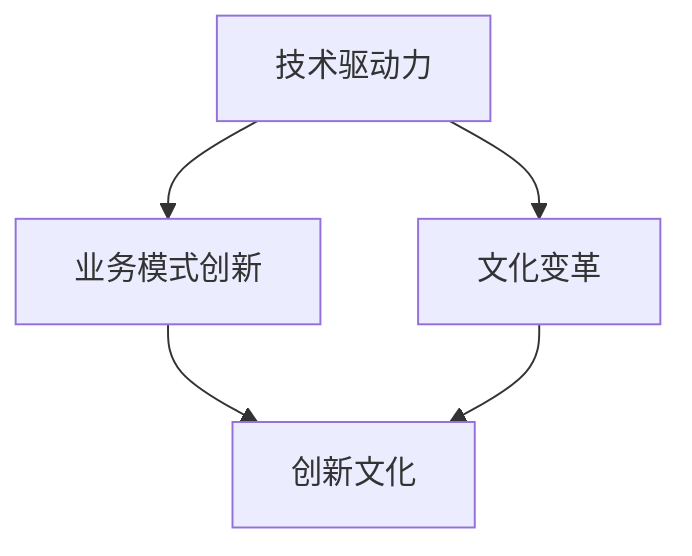

                 

### 文章标题

### 《数字化转型中的变革管理技巧》

### 关键词

- 数字化转型
- 变革管理
- 领导力
- 沟通技巧
- 案例研究

### 摘要

本文旨在探讨数字化转型过程中变革管理的技巧。随着技术的飞速发展，企业纷纷投身于数字化转型的浪潮中，但成功转型的企业却寥寥无几。本文通过详细分析数字化转型的定义、背景、核心要素，以及变革管理的理论基础和实践技巧，帮助读者理解变革管理在数字化转型中的关键作用。文章还通过案例研究和最佳实践，提供了实用的指导和建议，以期为企业在数字化转型中的变革管理提供有益的参考。

### 引言

#### 数字化转型：企业发展的必然趋势

数字化转型已成为全球企业竞争的重要战略。随着云计算、大数据、物联网、人工智能等新兴技术的迅猛发展，企业正面临着前所未有的机遇和挑战。数字化转型不仅是技术革新，更是业务模式、组织结构、文化变革的深层次整合。成功的企业在数字化转型中不仅关注技术的先进性，更注重变革管理的有效性。

#### 变革管理：数字化转型成功的关键

变革管理是确保企业成功转型的重要手段。变革管理不仅仅是实施新技术的过程，更涉及企业文化的转变、员工心态的调整、领导力的发展等多方面。有效的变革管理能够帮助企业应对转型过程中的各种挑战，确保变革的顺利进行，实现预期目标。

#### 本文结构

本文将从以下几个方面进行阐述：

1. 数字化转型的定义与背景
2. 数字化转型的核心要素
3. 变革管理的理论基础
4. 变革管理的实践技巧
5. 数字化转型中的变革管理技巧应用
6. 案例研究
7. 结论与建议

通过以上结构，本文旨在为读者提供一份系统、全面的数字化转型与变革管理指南。

### 第一部分：数字化转型的定义与背景

#### 数字化转型的定义

数字化转型（Digital Transformation）是指通过利用数字技术来改变企业的商业模式、运营流程、组织结构和客户体验，从而实现企业整体绩效的显著提升。数字化转型不仅仅是技术层面的变革，更涉及到企业战略、文化、组织等多个层面的深刻变革。

#### 数字化转型的背景

1. **技术进步**：随着互联网、大数据、云计算、人工智能等新兴技术的迅速发展，企业拥有更多的工具和资源来进行数字化转型。

2. **市场变化**：消费者行为和市场环境的变化迫使企业必须快速适应新的市场动态，通过数字化转型来提升竞争力。

3. **监管压力**：政府和企业对于数据安全、隐私保护等方面的监管日益严格，促使企业通过数字化转型来提高合规性和风险管理能力。

4. **竞争压力**：在数字化时代，市场竞争日益激烈，企业需要通过数字化转型来抓住市场机遇，保持竞争优势。

#### 数字化转型的目标

数字化转型的目标主要包括以下几个方面：

1. **提高运营效率**：通过自动化、智能化技术，减少人工操作，提高工作效率。

2. **提升客户体验**：通过个性化服务、实时互动等方式，提升客户满意度和忠诚度。

3. **创新业务模式**：通过新的商业模式，拓展市场空间，实现业务的快速增长。

4. **增强数据驱动能力**：通过数据分析和挖掘，为企业决策提供有力支持，提升决策的科学性。

#### 数字化转型的挑战

1. **技术复杂性**：数字化转型涉及到众多新技术，企业需要具备相应的技术能力。

2. **组织变革**：数字化转型要求企业进行深度的组织变革，包括流程优化、组织结构调整等。

3. **人才短缺**：数字化转型需要大量的技术人才和管理人才，但当前市场上这类人才较为稀缺。

4. **文化阻力**：企业内部的文化惯性可能会对数字化转型产生阻力，需要通过变革管理来逐步克服。

#### 数字化转型的关键成功因素

1. **领导力**：领导者的远见和决心是推动数字化转型成功的关键。

2. **战略规划**：明确数字化转型的目标和路径，制定详细的实施计划。

3. **资源投入**：确保有足够的资源和资金支持数字化转型。

4. **文化建设**：打造支持数字化转型的企业文化，提升员工的参与度和积极性。

5. **持续改进**：数字化转型是一个持续的过程，需要不断进行评估和优化。

通过上述对数字化转型的定义、背景、目标和挑战的详细分析，我们可以看到，数字化转型不仅是技术层面的革新，更涉及到企业战略、文化、组织等多个层面的变革。有效的变革管理是实现数字化转型成功的关键。接下来，我们将进一步探讨数字化转型的核心要素，以便更好地理解数字化转型的全貌。

### 第二部分：数字化转型的核心要素

#### 技术驱动力

技术驱动力是数字化转型的重要推动力，其中包括云计算、大数据、物联网、人工智能、区块链等新兴技术。这些技术不仅改变了企业的运营方式，也带来了全新的商业模式。

1. **云计算**：通过云计算，企业可以实现资源的弹性扩展和高效利用，降低IT成本，提升系统的可扩展性和灵活性。

2. **大数据**：大数据技术帮助企业从海量数据中提取有价值的信息，为决策提供数据支持，推动业务创新。

3. **物联网**：物联网技术将物理设备与互联网连接，实现设备之间的智能互联，提升生产效率和运营管理能力。

4. **人工智能**：人工智能技术通过机器学习、自然语言处理等技术，帮助企业实现自动化、智能化，提升用户体验。

5. **区块链**：区块链技术通过去中心化的数据管理方式，确保数据的安全性和透明性，为供应链管理、金融服务等领域带来革命性变革。

#### 业务模式创新

业务模式创新是数字化转型的重要目标之一。通过创新的业务模式，企业可以开拓新的市场空间，实现业务增长。

1. **平台化**：通过构建开放的平台，企业可以吸引第三方服务商和开发者，共同创造价值。

2. **订阅模式**：通过订阅模式，企业可以提供持续的服务和产品，实现长期的收益。

3. **共享经济**：共享经济模式通过共享资源和能力，实现资源的高效利用，创造新的商业模式。

4. **生态系统**：通过构建生态系统，企业可以与合作伙伴共同创造价值，提升整体竞争力。

#### 文化变革

文化变革是数字化转型中不可或缺的一环。数字化转型不仅仅是技术的变革，更是文化的变革。

1. **创新文化**：鼓励员工勇于尝试、勇于创新，形成积极向上的创新氛围。

2. **学习文化**：数字化转型要求员工不断学习新知识、新技能，提升自身能力。

3. **协作文化**：通过建立高效的协作机制，促进部门之间、员工之间的沟通与协作。

4. **透明文化**：通过信息透明，提升员工的参与感和责任感，增强企业的凝聚力。

#### 数字化转型的核心要素联系与整合

数字化转型的核心要素之间是相互联系、相互促进的。技术驱动力为数字化转型提供了技术基础和工具支持；业务模式创新为数字化转型带来了新的商业机会和增长点；文化变革为数字化转型提供了内在的动力和保障。这三者共同构成了数字化转型的有机整体。


在这个架构中，技术驱动力是基础，业务模式创新是目标，文化变革是动力。通过技术驱动力的支持，业务模式创新得以实现，文化变革得以深化，最终实现数字化转型的成功。

### 背景介绍

数字化转型是一种全方位的变革，它不仅仅是技术层面的革新，更是业务模式、组织结构和文化的深刻变革。随着技术的飞速发展，企业面临着前所未有的机遇和挑战。数字化转型已经成为企业保持竞争力、实现可持续发展的必经之路。

#### 核心概念与联系

在数字化转型中，有以下几个核心概念：

1. **技术驱动力**：云计算、大数据、人工智能等新兴技术。
2. **业务模式创新**：平台化、订阅模式、共享经济等创新模式。
3. **文化变革**：创新文化、学习文化、协作文化和透明文化。

这些核心概念之间的关系可以简化为以下架构：



技术驱动力是数字化转型的核心基础，它为业务模式创新和文化变革提供了技术支持。业务模式创新则是数字化转型的目标，通过创新业务模式，企业可以开拓新的市场空间，实现业务增长。文化变革则是数字化转型的重要保障，它通过培养创新文化、学习文化、协作文化和透明文化，为企业提供内在的动力和保障。

### 核心算法原理讲解

在数字化转型中，核心算法原理讲解是理解技术驱动力的关键。以下是一个简化的核心算法原理讲解，以及相关的伪代码和数学模型。

#### 数据分析算法

**算法原理**：数据分析算法主要用于处理和解析大规模数据集，提取有价值的信息。常见的分析方法包括回归分析、聚类分析、关联规则分析等。

**伪代码**：

```python
function data_analysis(data_set):
    # 数据预处理
    preprocessed_data = preprocess(data_set)
    
    # 选择分析方法
    analysis_type = choose_analysis_type(preprocessed_data)
    
    # 执行分析
    if analysis_type == "regression":
        result = regression_analysis(preprocessed_data)
    elif analysis_type == "clustering":
        result = clustering_analysis(preprocessed_data)
    elif analysis_type == "association_rules":
        result = association_rules_analysis(preprocessed_data)
    
    # 输出结果
    return result
```

#### 数学模型

**回归分析**：回归分析用于预测一个变量（因变量）与一个或多个自变量之间的关系。常用的回归模型包括线性回归、多项式回归等。

$$
y = \beta_0 + \beta_1 \cdot x_1 + \beta_2 \cdot x_2 + ... + \beta_n \cdot x_n
$$

**聚类分析**：聚类分析用于将数据集划分为多个类别，使得同类别内的数据点相似度较高，不同类别内的数据点相似度较低。常用的聚类算法包括K-means、DBSCAN等。

$$
d(x_i, x_j) = \sqrt{\sum_{k=1}^{n} (x_{ik} - x_{jk})^2}
$$

**关联规则分析**：关联规则分析用于发现数据集中的关联关系，常用的算法包括Apriori算法、FP-growth算法等。

$$
support(A \cup B) = \frac{count(A \cup B)}{count(D)}
$$

#### 举例说明

**例子**：假设我们要分析一家零售公司销售数据，以预测顾客购买行为。

1. **数据预处理**：对销售数据进行清洗，包括处理缺失值、异常值等。

2. **选择分析方法**：根据业务需求，选择合适的分析算法，例如K-means聚类分析。

3. **执行分析**：使用K-means算法将顾客分为若干类别，分析每个类别内的购买行为。

4. **输出结果**：生成聚类结果，为营销策略提供数据支持。

通过上述核心算法原理讲解，我们可以看到，数据分析算法在数字化转型中起着至关重要的作用。它不仅帮助我们从海量数据中提取有价值的信息，还为业务决策提供了科学依据。

### 实际案例分析和详细讲解剖析

#### 成功案例一：阿里巴巴的数字化转型

**案例背景**：阿里巴巴作为电子商务的龙头企业，其数字化转型历程极具代表性。面对互联网的快速发展，阿里巴巴决定从传统的电子商务平台向数字化商业生态系统转型。

**转型目标**：通过数字化转型，阿里巴巴旨在提升客户体验、优化供应链管理、拓展新业务模式。

**转型策略**：

1. **技术驱动**：阿里巴巴持续投资云计算、大数据、人工智能等新兴技术，建立强大的技术基础设施。

2. **业务模式创新**：推出“新零售”战略，通过线上线下融合，实现消费场景的数字化。

3. **文化变革**：倡导“客户第一、员工第二、股东第三”的企业文化，提升员工创新意识和协作能力。

**转型成果**：

1. **客户体验提升**：通过大数据分析，实现个性化推荐，提升用户体验。

2. **供应链优化**：借助云计算和大数据，实现供应链全流程的数字化管理，提高运营效率。

3. **新业务拓展**：通过数字化平台，成功拓展了金融、物流、文化娱乐等多个领域，实现业务多元化。

**案例启示**：阿里巴巴的数字化转型成功，主要得益于其清晰的转型策略和强大的执行力。企业应在数字化转型中注重技术驱动、业务模式创新和文化变革的协同发展。

#### 失败案例二：某传统制造企业的数字化转型

**案例背景**：某传统制造企业希望通过数字化转型提升竞争力，但由于管理不善，最终以失败告终。

**转型目标**：通过数字化转型，提升生产效率、降低成本、拓展新市场。

**转型策略**：

1. **技术驱动**：引入了先进的生产设备和自动化系统。

2. **业务模式创新**：试图通过电子商务平台开拓新市场。

3. **文化变革**：缺乏对员工文化素质的培训和提升。

**转型成果**：

1. **生产效率提升不明显**：由于技术和管理不匹配，生产效率提升不明显。

2. **新市场拓展受阻**：电子商务平台运营不善，新市场拓展受阻。

3. **企业内部矛盾加剧**：员工对转型缺乏认同感，内部矛盾加剧。

**案例启示**：企业在数字化转型中，需要重视技术与管理、业务模式与文化的协同发展。否则，技术引入可能成为“空中楼阁”，无法真正实现转型目标。

通过以上案例分析，我们可以看到，成功的数字化转型需要清晰的策略、强大的执行力以及文化变革的支持。而失败的案例则提醒我们，忽视任何一环都可能导致转型失败。企业应从中吸取教训，制定切实可行的数字化转型方案，确保成功转型。

### 第三部分：变革管理的理论基础

#### 变革管理的定义与重要性

变革管理是指通过系统的方法和工具，引导组织在面临外部环境变化或内部需求调整时，实现从现状到期望状态的转变过程。它不仅涉及技术的引入，还包括组织结构、业务流程、员工行为等多个方面的变革。

变革管理的重要性体现在以下几个方面：

1. **确保变革成功**：有效的变革管理能够确保变革目标的实现，减少变革过程中的阻力和风险。

2. **提升组织适应能力**：通过变革管理，企业能够更好地应对市场变化和竞争压力，提升组织的整体适应能力。

3. **增强员工参与度**：变革管理通过沟通和培训，增强员工对变革的理解和支持，提升员工的参与度和积极性。

4. **促进文化变革**：变革管理有助于培养企业的创新文化、学习文化和协作文化，推动组织文化的变革。

#### 变革管理的五大过程

1. **诊断与规划**：诊断组织当前的状态，明确变革的目标和路径。这一阶段包括现状分析、问题识别、目标设定和策略规划等。

2. **沟通与共识**：通过有效的沟通，让组织成员了解变革的必要性和目标，形成共识。这一阶段包括宣传、沟通、培训、反馈等。

3. **领导与支持**：变革领导者需要发挥关键作用，提供必要的资源和支持，确保变革的顺利进行。这一阶段包括领导力培养、资源分配、激励措施等。

4. **实施与执行**：将变革策略付诸实践，通过具体行动实现变革目标。这一阶段包括项目实施、过程监控、问题解决等。

5. **评估与优化**：对变革的效果进行评估，总结经验教训，为后续的变革提供参考。这一阶段包括效果评估、反馈改进、持续优化等。

#### 变革管理的障碍与解决策略

1. **组织惯性**：组织惯性和路径依赖是变革管理的主要障碍。解决策略包括：

   - **打破惯性思维**：通过宣传、培训和激励机制，引导员工接受新思维、新方法。
   - **优化组织结构**：通过调整组织结构，消除部门壁垒，提升组织整体的灵活性和适应性。

2. **员工抵触**：员工对变革的抵触情绪是变革管理的重要障碍。解决策略包括：

   - **加强沟通**：通过透明的沟通，让员工了解变革的背景、目的和预期效果。
   - **提供支持**：通过培训、指导和支持，帮助员工克服变革带来的挑战，提升员工的能力和信心。

3. **资源限制**：资源限制可能影响变革管理的顺利进行。解决策略包括：

   - **合理分配资源**：确保变革所需的资金、人力和技术资源得到充分保障。
   - **优先级排序**：确定关键变革项目，确保资源集中在最需要的地方。

4. **外部环境变化**：外部环境的变化可能对变革管理产生不利影响。解决策略包括：

   - **动态调整策略**：根据外部环境的变化，及时调整变革策略和路径。
   - **增强应变能力**：通过培养组织的应变能力和灵活性，提升组织对环境变化的适应能力。

通过上述对变革管理的理论基础、五大过程和障碍解决策略的详细分析，我们可以看到，变革管理在数字化转型中起着至关重要的作用。有效的变革管理不仅能够确保数字化转型目标的实现，还能够提升组织的整体竞争力。接下来，我们将进一步探讨变革领导力和变革沟通，以帮助读者更好地理解变革管理的核心要素。

### 变革领导力

#### 变革领导者的角色与技能

在数字化转型的过程中，变革领导者扮演着至关重要的角色。变革领导者不仅是变革的推动者，更是变革的引导者和支持者。以下是对变革领导者角色的详细探讨：

1. **变革的推动者**：变革领导者需要具备推动变革的远见和决心，能够制定清晰的变革目标和路径，引领组织迈向新的阶段。

2. **变革的引导者**：变革领导者需要具备良好的沟通和激励能力，能够引导员工理解变革的必要性和重要性，积极参与变革过程。

3. **变革的支持者**：变革领导者需要为变革提供必要的资源和支持，确保变革的顺利进行。他们需要关注员工的需求，提供培训和支持，帮助员工克服变革中的挑战。

#### 变革领导力的培养

要成为一位成功的变革领导者，需要通过以下几个方面来培养自己的领导力：

1. **自我反思**：通过自我反思，了解自己的优势和不足，不断提升自身的领导能力和管理素质。

2. **持续学习**：变革领导者需要具备持续学习的意识，不断学习新知识、新技能，以适应不断变化的环境。

3. **增强沟通能力**：良好的沟通能力是变革领导力的核心。变革领导者需要学会倾听员工的意见和需求，有效传达变革的目标和策略。

4. **提升决策能力**：变革领导者需要在变革过程中做出明智的决策。他们需要具备分析问题、评估风险和制定策略的能力。

5. **培养团队合作精神**：变革领导者需要鼓励团队合作，通过建立信任和合作机制，提升团队的协作效率。

#### 领导者如何推动变革

变革领导者需要采取一系列策略和措施，以有效推动变革：

1. **明确变革目标**：变革领导者需要明确变革的目标和愿景，使全体员工了解变革的方向和意义。

2. **制定详细计划**：变革领导者需要制定详细的变革计划，包括时间表、任务分配、资源需求等，以确保变革有序进行。

3. **加强沟通**：变革领导者需要通过多种渠道和方式，与员工进行有效沟通，确保员工理解变革的目标和策略。

4. **提供支持**：变革领导者需要为变革提供必要的资源和支持，包括资金、人力和技术等，确保变革的顺利进行。

5. **激励员工**：变革领导者需要通过激励措施，激发员工的积极性和创造力，使员工在变革中发挥出最佳水平。

6. **持续跟进**：变革领导者需要持续跟进变革的进展，及时解决变革过程中出现的问题和挑战。

通过以上对变革领导力角色的详细探讨，以及如何培养和推动变革的实践方法，我们可以看到，变革领导者在数字化转型中的重要性。他们不仅需要具备远见和决心，还需要具备卓越的沟通能力、决策能力和团队合作精神。只有通过有效的变革领导，企业才能在数字化转型的浪潮中立于不败之地。

### 变革沟通

#### 变革沟通的原则与方法

在数字化转型过程中，有效的变革沟通是确保变革成功的关键因素。变革沟通不仅仅是为了传达变革的信息，更是为了激发员工的参与和认同。以下是对变革沟通原则和方法的详细探讨：

1. **透明性**：透明性是变革沟通的首要原则。领导者需要向员工明确传达变革的原因、目标、步骤和预期成果，使员工了解变革的全貌。

2. **及时性**：变革信息需要及时传达，避免信息滞后导致误解和恐慌。领导者在变革初期、中期和后期都需要保持沟通的连续性和及时性。

3. **一致性**：变革沟通的信息需要一致，避免不同部门或层级的沟通产生矛盾和混乱。领导层和各部门需要保持信息的一致性和统一性。

4. **互动性**：变革沟通需要建立互动机制，鼓励员工提问、反馈和参与。通过互动，领导者可以了解员工的困惑和需求，及时调整沟通策略。

5. **多层次**：变革沟通需要涵盖不同层级和不同部门，确保信息的全面性和覆盖性。从高层领导到基层员工，每个层级和部门都需要得到相应的沟通。

6. **针对性**：变革沟通需要根据不同的受众特点进行个性化设计。对于不同背景、不同岗位的员工，沟通内容和方法需要有所区别，以确保信息的有效传达。

#### 沟通策略的选择

根据变革的不同阶段和员工的不同需求，领导者可以选择不同的沟通策略：

1. **正式沟通**：通过会议、公告、邮件等正式渠道，向员工传达变革的核心信息和决策。正式沟通具有权威性和正式性，但容易导致信息传递的滞后。

2. **非正式沟通**：通过团队会议、一对一交流、员工活动等非正式渠道，与员工建立良好的互动关系。非正式沟通有助于建立信任和理解，但需要控制信息的准确性和一致性。

3. **面对面沟通**：通过面对面会议、座谈会、访谈等方式，与员工进行深入交流。面对面沟通有助于建立信任，但成本较高且受时间和地点限制。

4. **书面沟通**：通过报告、手册、图表等书面材料，向员工传达变革的详细信息和背景。书面沟通具有持久性和可查阅性，但需要确保信息的简明易懂。

5. **多渠道沟通**：结合多种沟通策略，如在线平台、内部社交网络、即时通讯工具等，实现全方位的沟通。多渠道沟通能够提高信息的覆盖率和传递速度。

#### 避免沟通误解的策略

在变革沟通中，误解和误读是常见的挑战。以下是一些避免沟通误解的策略：

1. **提供解释和背景**：在传达变革信息时，提供详细的解释和背景，帮助员工理解变革的动机和目的。

2. **重复关键信息**：在多个场合重复关键信息，确保员工对变革的核心内容有清晰的认识。

3. **问答环节**：设立问答环节，鼓励员工提问，及时解答员工的疑问。

4. **反馈机制**：建立反馈机制，让员工有机会表达自己的看法和担忧，领导层可以据此调整沟通策略。

5. **跨部门沟通**：确保不同部门和层级的员工都能参与沟通，避免信息孤岛和误解。

6. **个性化沟通**：根据员工的不同需求和心理，提供个性化的沟通服务，提高沟通的有效性。

通过以上对变革沟通原则、方法、策略和避免误解策略的详细分析，我们可以看到，有效的变革沟通是确保数字化转型成功的关键。领导者在变革过程中需要灵活运用不同的沟通策略，建立良好的沟通机制，确保员工对变革的理解和支持。接下来，我们将进一步探讨变革管理的具体步骤和实践技巧。

### 变革管理的步骤与实践

#### 变革的规划与准备

**1. 确定变革目标**：首先，领导团队需要明确变革的目标，包括短期和长期目标。目标应具体、可衡量、可实现，并与企业的战略方向保持一致。

**2. 制定变革计划**：在确定目标后，制定详细的变革计划，包括变革的步骤、时间表、资源需求、责任分配等。变革计划应具备灵活性和适应性，以应对不确定因素。

**3. 评估变革影响**：对变革可能带来的影响进行评估，包括技术、业务、财务、人力资源等方面。评估有助于预见潜在的挑战和风险，制定相应的应对策略。

**4. 沟通与共识**：通过有效的沟通，确保所有相关方对变革目标、计划和影响有清晰的理解，形成共识。沟通应贯穿整个变革过程，确保信息的透明和及时性。

**5. 资源准备**：确保变革所需的资源得到充分准备，包括资金、人力、技术等。资源准备是变革成功的重要保障，应提前规划并落实。

**6. 风险管理**：识别变革过程中的潜在风险，制定风险应对策略，确保在出现问题时能够及时应对和调整。

**7. 培训与发展**：为员工提供必要的培训和发展机会，确保他们具备应对变革所需的技能和知识。培训应针对不同层级和岗位，具有针对性。

#### 变革的启动与执行

**1. 启动会议**：召开启动会议，正式宣布变革的启动，传达变革的目标、计划和期望。启动会议应具有仪式感，激发员工的参与和热情。

**2. 项目管理**：组建项目管理团队，负责变革的执行和监控。项目管理团队应具备项目管理的专业知识，确保变革按计划进行。

**3. 持续沟通**：保持与员工的持续沟通，了解他们的反馈和需求，及时解决问题和挑战。沟通应采用多种形式，确保信息的全面性和有效性。

**4. 监控进度**：建立监控机制，定期评估变革的进展情况，确保各阶段任务按时完成。监控结果应与项目团队和领导层共享，以便及时调整策略。

**5. 问题解决**：在变革过程中，难免会遇到各种问题和挑战。领导团队应具备快速响应和解决问题的能力，确保变革顺利进行。

**6. 激励与支持**：通过激励措施和支持，激发员工的积极性和参与度，确保他们在变革中发挥出最佳水平。

**7. 适应性调整**：根据变革的进展和反馈，及时调整变革计划，确保变革的灵活性和适应性。调整应基于数据分析和实际需求，避免盲目决策。

#### 变革的监控与调整

**1. 成效评估**：对变革的成效进行定期评估，包括目标达成情况、员工满意度、业务绩效等。评估结果应作为后续改进的依据。

**2. 反馈机制**：建立反馈机制，鼓励员工提供反馈和建议，了解他们的意见和建议，及时调整变革策略。

**3. 持续优化**：基于评估结果和反馈，对变革过程和结果进行持续优化，确保变革能够实现预期目标。

**4. 文档记录**：详细记录变革的每个阶段、每项任务和每个决策，为后续的变革管理提供参考。

**5. 学习与分享**：将变革过程中的经验和教训进行总结和分享，提升组织整体的变革管理能力。

通过以上对变革管理步骤和实践的详细分析，我们可以看到，变革管理是一个系统、持续的过程，需要从规划与准备、启动与执行到监控与调整，各个环节紧密衔接，确保变革的顺利进行。有效的变革管理不仅能够帮助企业实现数字化转型，还能提升组织的整体竞争力和适应能力。

### 变革中的组织发展与人才管理

#### 组织发展策略

在数字化转型过程中，组织发展策略至关重要。以下是一些关键的策略：

1. **组织架构调整**：根据数字化转型的需求，调整组织架构，优化部门职能和职责划分。例如，设立专门的数据部门、数字化营销团队等。

2. **流程优化**：通过数字化工具和流程优化技术，简化业务流程，提高工作效率。例如，使用自动化工具替代重复性手工任务，减少人为错误。

3. **跨部门协作**：促进跨部门协作，打破部门壁垒，提升整体协同效率。例如，建立跨部门项目组，实现信息共享和资源优化。

4. **人才发展计划**：制定人才发展计划，提升员工技能和知识水平，确保他们能够适应数字化转型需求。例如，提供培训课程、技术交流会议等。

#### 人才管理策略

人才管理策略是组织发展的核心，以下是一些重要的人才管理策略：

1. **招聘与选拔**：通过有效的招聘和选拔机制，吸引和选拔具备数字化转型所需技能的人才。例如，注重技术能力、创新意识和团队合作精神。

2. **培训与发展**：为员工提供持续的培训和发展机会，提升他们的专业技能和综合素质。例如，组织内部培训、外部学习交流等。

3. **绩效评估**：建立科学的绩效评估体系，激励员工在数字化转型中发挥出最佳水平。例如，通过绩效考核、奖金激励等手段。

4. **激励与留任**：通过激励措施，提高员工的工作积极性，确保他们愿意留在企业。例如，提供竞争性的薪酬、良好的职业发展机会等。

#### 员工参与与激励

1. **员工参与**：鼓励员工参与数字化转型过程，让他们在变革中发挥积极作用。例如，通过员工代表会议、问卷调查等方式，收集员工意见和建议。

2. **激励机制**：建立激励机制，激发员工的创新和创造力。例如，设立创新奖项、项目奖金等，奖励在数字化转型中表现突出的员工。

3. **文化塑造**：塑造支持数字化转型的企业文化，提升员工的认同感和归属感。例如，推广创新文化、学习文化等，营造积极向上的工作氛围。

通过上述对组织发展策略、人才管理策略和员工参与与激励的详细分析，我们可以看到，数字化转型中的组织发展和人才管理是确保变革成功的关键。企业需要通过优化组织架构、流程，提升员工技能和素质，激励员工积极参与，从而实现数字化转型的目标。

### 数字化转型中的案例研究

#### 成功案例一：某零售巨头的数字化转型

**案例背景**：某零售巨头在面对电商崛起和消费者需求变化的背景下，决定进行数字化转型，以提升客户体验和运营效率。

**转型目标**：通过数字化转型，实现以下目标：

1. 提升在线销售渠道的效率。
2. 优化库存管理，减少库存成本。
3. 改善客户服务，提高客户满意度。

**转型策略**：

1. **技术驱动**：引入云计算、大数据分析和人工智能技术，提升系统的数据处理能力和智能化水平。

2. **业务模式创新**：建立线上线下融合的新零售模式，通过移动应用和社交媒体与客户建立紧密联系。

3. **文化变革**：推动企业文化从以产品为中心向以客户为中心转变，提升员工的服务意识和创新能力。

**转型成果**：

1. **在线销售额显著增长**：通过优化在线购物体验，在线销售额增长了30%。

2. **库存周转率提高**：通过大数据分析和智能库存管理，库存周转率提高了20%，库存成本大幅降低。

3. **客户满意度提升**：通过个性化推荐和快速响应客户需求，客户满意度提高了15%。

**案例启示**：成功转型需要技术驱动、业务模式创新和文化变革的有机结合。企业应注重数据驱动决策，持续优化业务流程，同时重视员工培训和文化建设。

#### 失败案例二：某制造业企业的数字化转型

**案例背景**：某制造业企业为了提升竞争力，决定进行数字化转型，但由于规划不周和执行力不足，最终以失败告终。

**转型目标**：通过数字化转型，实现以下目标：

1. 提高生产自动化水平。
2. 优化供应链管理，减少生产成本。
3. 提升产品质量。

**转型策略**：

1. **技术驱动**：引入了自动化生产线和智能设备，提升生产效率。

2. **业务模式创新**：试图通过电子商务平台开拓新市场，但缺乏有效的营销策略。

3. **文化变革**：缺乏对员工文化素质的培训和提升。

**转型成果**：

1. **生产效率提升不明显**：由于自动化设备运行不稳定，生产效率提升不明显。

2. **电子商务平台运营失败**：电子商务平台因缺乏用户基础和营销策略，运营失败。

3. **企业内部矛盾加剧**：员工对转型缺乏认同感，内部矛盾加剧。

**案例启示**：数字化转型需要周密的规划和强大的执行力。企业应重视技术与管理、业务模式与文化的协同发展，否则技术引入可能成为“空中楼阁”，无法实现预期目标。

通过上述成功和失败案例的研究，我们可以看到，数字化转型中的变革管理至关重要。成功的案例表明，技术驱动、业务模式创新和文化变革的有机结合是实现数字化转型的关键。而失败的案例则提醒我们，忽视任何一环都可能导致转型失败。企业应从中吸取教训，制定切实可行的数字化转型方案，确保成功转型。

### 第四部分：数字化转型中的变革管理技巧应用

#### 跨部门协作与项目管理

在数字化转型过程中，跨部门协作和项目管理是确保变革成功的关键环节。以下是一些关键技巧：

1. **建立跨部门协作机制**：通过设立跨部门项目组或跨职能团队，确保不同部门之间的信息共享和协作。项目组应定期召开会议，讨论项目进展和问题，确保各部门的协调一致。

2. **明确角色和责任**：为每个团队成员明确角色和责任，确保每个人都知道自己在项目中的具体任务和目标。这有助于避免责任不清和任务重叠，提高工作效率。

3. **使用项目管理工具**：使用项目管理工具（如Jira、Trello等），实现项目进度的可视化和实时监控。项目工具可以帮助团队跟踪任务进度、分配任务、管理优先级，提高项目管理的效率。

4. **沟通与反馈**：保持持续的沟通和反馈机制，确保团队成员能够及时了解项目进展和变化。定期举行项目进度会议，讨论项目中的问题和挑战，并制定解决方案。

5. **风险管理**：识别项目中的潜在风险，并制定相应的应对策略。通过风险评估和监控，确保项目能够及时应对和解决风险，确保项目按计划进行。

#### 项目管理最佳实践

1. **制定详细的项目计划**：在项目启动前，制定详细的项目计划，包括时间表、任务分配、资源需求等。项目计划应具备灵活性和适应性，以应对不确定因素。

2. **建立项目组织**：建立高效的项目组织结构，明确项目经理、团队成员和其他相关方的角色和职责。项目经理应具备项目管理的专业知识和技能，能够有效管理项目团队。

3. **监控项目进度**：定期监控项目进度，确保任务按时完成。使用项目管理工具，实时跟踪任务进度，识别和解决潜在的问题和瓶颈。

4. **风险管理**：通过风险识别、评估和监控，确保项目能够及时应对和解决风险。制定风险管理计划，包括风险预防措施和应急响应计划。

5. **质量保证**：确保项目的质量和交付标准符合预期。通过定期的质量检查和评审，确保项目交付的产品或服务达到质量要求。

#### 团队合作的技巧

1. **建立团队信任**：通过团队建设活动和日常沟通，建立团队成员之间的信任和默契。信任是团队合作的基础，有助于提升团队协作效率。

2. **明确团队目标**：确保所有团队成员都清楚团队的目标和愿景。明确的目标有助于团队成员集中精力，共同努力实现目标。

3. **分工协作**：根据团队成员的技能和特长，合理分配任务，确保每个成员都能在项目中发挥自己的优势。分工协作有助于提高团队的整体效率。

4. **沟通与反馈**：保持开放的沟通渠道，鼓励团队成员分享意见和建议。通过定期的团队会议和反馈机制，确保团队成员能够及时了解项目进展和变化。

5. **激励与认可**：通过激励措施和认可，激发团队成员的积极性和创造力。奖励团队在项目中的优异表现，提升团队凝聚力和士气。

通过以上对跨部门协作与项目管理、项目管理最佳实践和团队合作技巧的详细分析，我们可以看到，数字化转型中的变革管理需要重视跨部门协作、项目管理和团队合作。通过建立有效的协作机制、实施最佳实践和提升团队合作能力，企业可以确保变革管理的顺利进行，实现数字化转型的目标。

### 数字化转型中的风险管理

#### 风险识别与评估

在数字化转型过程中，风险识别与评估是确保项目顺利进行的重要步骤。以下是一些关键步骤：

1. **风险识别**：通过访谈、问卷调查、专家咨询等方式，识别数字化转型过程中可能遇到的风险。风险可能包括技术风险、市场风险、运营风险、法律风险等。

2. **风险分类**：根据风险的影响程度和发生的可能性，对风险进行分类。常见的分类方法包括高、中、低风险。

3. **风险评估**：对识别出的风险进行评估，确定每个风险的发生概率和影响程度。可以使用定量或定性的方法，如风险矩阵、风险指数等。

4. **风险优先级排序**：根据评估结果，对风险进行优先级排序，确定哪些风险需要优先解决。通常，高影响、高概率的风险应优先处理。

5. **风险记录**：将识别和评估的结果记录在风险登记册中，为后续的风险管理和监控提供依据。

#### 风险应对策略

1. **风险预防**：制定预防措施，降低风险的发生概率。例如，通过技术测试和质量控制，减少技术风险；通过市场调研和分析，降低市场风险。

2. **风险缓解**：通过缓解措施，降低风险的影响程度。例如，通过备份和恢复计划，减少数据丢失的风险；通过应急预案，降低运营中断的风险。

3. **风险转移**：通过风险转移，将风险转移给第三方。例如，通过购买保险，将法律风险转移给保险公司；通过外包，将部分运营风险转移给外包服务商。

4. **风险接受**：对于无法预防或缓解的风险，可以考虑接受风险。但接受风险前，应确保已评估风险的影响和成本，并制定相应的应对措施。

5. **持续监控**：在项目实施过程中，持续监控风险的变化。通过定期的风险评估和监控，确保及时发现新风险和变化，及时调整应对策略。

#### 风险监控与控制

1. **建立监控机制**：建立风险监控机制，定期评估风险的状态和变化。可以使用风险管理软件或工具，实现风险监控的自动化。

2. **设置监控指标**：根据项目的具体情况，设置相应的监控指标，如风险发生次数、风险影响程度等。监控指标应具有可操作性和可量化性。

3. **预警机制**：建立预警机制，及时发现风险的发生和变化。通过实时监控和预警系统，确保在风险发生前能够采取及时应对措施。

4. **风险报告**：定期生成风险报告，向项目团队和相关方报告风险的状态和变化。风险报告应包含风险识别、评估、应对措施和监控结果等内容。

5. **持续改进**：根据风险监控的结果和反馈，不断改进风险管理策略和措施。通过持续学习和优化，提升风险管理的能力和水平。

通过以上对风险管理步骤、风险应对策略和风险监控与控制的详细分析，我们可以看到，数字化转型中的风险管理是确保项目顺利进行和成功转型的重要保障。企业应重视风险识别与评估、风险应对策略和风险监控与控制，建立完善的风险管理机制，确保数字化转型项目的顺利进行。

### 数字化转型的可持续发展

#### 可持续发展的重要性

数字化转型不仅是企业提升效率和竞争力的手段，更是推动可持续发展的重要途径。可持续发展强调在经济、社会和环境三个方面实现平衡和协调，以实现长期的繁荣和幸福。在数字化转型过程中，企业应关注以下几个方面：

1. **经济效益**：通过数字化转型，企业可以提高生产效率、降低运营成本，实现经济效益的最大化。

2. **社会效益**：数字化转型可以促进社会进步，提升公共服务水平，改善人们的生活质量。

3. **环境效益**：通过数字化转型，企业可以减少资源消耗、降低污染排放，实现绿色发展。

#### 变革管理在可持续发展中的应用

1. **创新驱动**：企业应通过数字化转型，推动技术创新和商业模式创新，实现可持续发展。例如，利用人工智能和大数据分析，优化产品设计和生产过程，提高资源利用效率。

2. **绿色办公**：企业可以通过数字化转型，推动绿色办公，减少纸质文档的使用，降低能源消耗和碳排放。例如，采用电子会议、远程办公等数字化工具，减少不必要的出行和能源消耗。

3. **社会责任**：企业应承担社会责任，通过数字化转型，提升社会公益活动的效率和质量。例如，利用大数据和人工智能技术，分析社会需求，优化公益资源的分配。

#### 社会责任与伦理

1. **数据安全与隐私保护**：在数字化转型过程中，企业应高度重视数据安全和隐私保护，遵守相关法律法规，确保用户数据的安全和隐私。

2. **公平竞争**：企业应遵守公平竞争的原则，通过数字化转型，提升自身的竞争力，而不是通过不正当手段损害其他企业的利益。

3. **尊重人权**：企业应尊重员工和合作伙伴的合法权益，保障他们的基本人权。例如，确保员工的工作环境安全和健康，提供合理的薪酬和福利。

4. **环境保护**：企业应积极参与环境保护活动，通过数字化转型，减少资源消耗和污染排放，为可持续发展做出贡献。

通过以上对数字化转型在可持续发展中的重要性的分析，以及变革管理在可持续发展中的应用和社会责任与伦理的探讨，我们可以看到，数字化转型不仅是企业提升效率和竞争力的手段，更是推动可持续发展的重要途径。企业应注重经济效益、社会效益和环境效益的协调发展，通过数字化转型，实现长期的繁荣和幸福。

### 结论与建议

#### 总体结论

数字化转型已成为企业发展的关键战略，但成功的数字化转型离不开有效的变革管理。本文通过详细分析数字化转型的定义、背景、核心要素，变革管理的理论基础、实践技巧以及应用案例，总结了以下核心结论：

1. **数字化转型需要全面的变革管理**：数字化转型不仅仅是技术的变革，更是业务模式、组织结构和文化的深刻变革。有效的变革管理能够确保数字化转型的成功。
2. **变革领导力和沟通技巧至关重要**：变革领导者的角色和技能、有效的沟通策略是推动变革的关键。领导者需要具备远见、决断力、沟通能力和团队协作精神。
3. **跨部门协作和项目管理是保障**：在数字化转型过程中，跨部门协作和高效的项目管理是确保变革顺利进行的重要保障。
4. **风险管理是确保成功的基石**：数字化转型过程中，识别、评估和应对风险是保障项目顺利进行的关键。

#### 建议

针对企业在数字化转型过程中可能遇到的挑战，以下是一些建议：

1. **明确变革目标**：制定清晰的变革目标，确保目标与企业的战略方向一致，并具备可操作性和可实现性。
2. **培养变革领导力**：通过培训和实践，提升领导者的变革领导力，确保他们具备推动变革所需的技能和素质。
3. **加强沟通与共识**：建立有效的沟通机制，确保变革信息透明、及时，并形成全员共识。
4. **注重跨部门协作**：建立跨部门协作机制，促进信息共享和资源优化，提升整体协作效率。
5. **制定详细的风险管理计划**：识别、评估和应对风险，确保项目在遇到问题时能够及时调整和应对。
6. **持续优化与改进**：数字化转型是一个持续的过程，企业应不断评估和优化变革策略，以适应不断变化的环境。

通过上述结论和建议，我们希望能够为企业提供实用的指导，助力其在数字化转型的道路上取得成功。

### 附录

#### 附录 A：变革管理工具与技术

**1. 变革管理工具**

- **ChangeGear**：一款全面的变革管理软件，提供项目计划、沟通管理、资源分配、风险管理等功能。

- **Prosci ADKAR Model**：Prosci提供的ADKAR模型，用于指导变革管理过程，包括意识、参与、承诺、能力和结果五个方面。

- **Kotter's 8-Step Model**：Kotter提出的变革管理模型，包括建立指导联盟、形成变革愿景、沟通愿景、授权行动、创造短期胜利、巩固改进、应用经验和加强管理系统。

**2. 变革管理技术**

- **SWOT分析**：用于评估企业内外部环境，识别变革的机遇和挑战。

- **5W2H分析**：用于详细规划变革策略，包括原因（Why）、目标（What）、谁（Who）、如何（How）、何时（When）、多少（How much）。

#### 附录 B：数字化转型案例资料

**1. 案例一：XX公司的数字化转型实践**

- **背景**：XX公司是一家传统制造业企业，面对市场竞争和消费者需求的变化，决定进行数字化转型。

- **目标**：通过数字化转型，提升生产效率、优化供应链管理、拓展新市场。

- **策略**：引入云计算、大数据和人工智能技术，优化生产流程和供应链管理；建立线上线下融合的新零售模式；推动企业文化变革，提升员工的创新意识和协作能力。

- **成果**：生产效率提升20%，供应链成本降低15%，在线销售额增长30%。

**2. 案例二：YY企业的变革管理策略**

- **背景**：YY企业是一家互联网公司，面临业务增长和市场竞争的挑战，决定通过变革管理提升企业竞争力。

- **目标**：通过变革管理，优化组织结构、提升员工能力、增强企业创新能力。

- **策略**：实施跨部门协作机制，建立跨职能团队，实现信息共享和资源优化；提供员工培训和职业发展机会，提升员工技能和素质；推动企业文化变革，建立创新和学习文化。

- **成果**：组织结构优化，员工满意度提升10%，创新能力显著增强，市场份额增加15%。

通过以上附录内容，我们提供了详细的变革管理工具和技术，以及两个典型的数字化转型案例，旨在为企业提供实践指导和参考。这些资料有助于企业在数字化转型过程中，更好地应用变革管理策略，实现成功转型。

