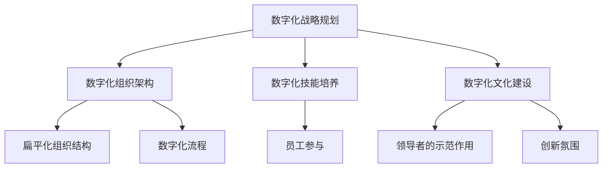

                 


## 文章标题：数字化领导力：引领组织进入智能时代

### 文章关键词
- 数字化领导力
- 智能时代
- 组织转型
- 技术进步
- 数字化战略
- 文化变革

### 摘要
本文深入探讨了数字化领导力的概念、重要性及其在组织中的实践和应用。通过分析数字化时代的变化和数字化领导力的价值，本文阐述了数字化领导力在组织中的关键要素和实践方法。此外，本文还探讨了数字化领导力在企业管理、人力资源、市场营销和客户服务中的具体应用，并展望了其未来的发展趋势。通过本文的讨论，读者将更好地理解数字化领导力在引领组织进入智能时代中的关键作用。

## 第一部分：数字化领导力的概念与重要性

### 1. 数字化领导力的定义
数字化领导力是一种利用数字化工具、技术和方法，推动组织实现数字化转型和业务创新的能力。它不仅仅是一种技术技能，更是一种领导者的思维方式和行为模式。

### 2. 数字化领导力与传统领导力的区别
传统领导力主要关注人、流程和资源的管理，而数字化领导力则更强调数据、技术和创新的作用。传统领导力依赖经验和直觉，而数字化领导力则依靠数据和算法。

### 3. 数字化时代的变化
随着互联网、大数据、人工智能等技术的迅猛发展，组织运作和市场竞争环境发生了深刻变化。数字化时代要求领导者具备更高的适应能力、创新能力和决策能力。

### 4. 数字化对组织运作的影响
数字化技术改变了组织的业务模式、运营方式和客户体验。数字化领导力能够帮助组织优化资源配置、提高生产效率、降低运营成本，并提升客户满意度。

### 5. 数字化领导力的价值
数字化领导力能够提升组织的竞争力，促进创新和业务转型。它有助于组织把握数字化时代的机遇，实现可持续发展。

### 6. 数字化领导力面临的挑战
数字化领导力面临着技术变革的速度、组织文化变革和管理变革的挑战。领导者需要不断学习和适应，以应对数字化时代的挑战。

## 第二部分：数字化领导力在组织中的实践

### 7. 数字化领导力模型
- 数字化领导力模型通常包括以下几个关键要素：
  - 数字化战略规划
  - 数字化组织架构
  - 数字化技能培养
  - 数字化文化建设

### 8. 数字化战略规划
数字化战略规划是数字化领导力的核心。它包括以下几个步骤：
- **评估当前状态**：分析组织的数字化水平和业务需求。
- **确定目标**：设定明确的数字化目标和愿景。
- **制定行动计划**：制定具体的实施步骤和时间表。
- **资源分配**：确保资源充足，支持数字化战略的实施。

### 9. 数字化组织的构建
构建数字化组织需要调整组织架构、流程和人员配置。具体措施包括：
- **扁平化组织结构**：减少层级，提高决策效率。
- **数字化流程**：优化业务流程，提高自动化程度。
- **数字技能培训**：提高员工的数字化技能和知识。

### 10. 数字化文化的培育
数字化文化是数字化领导力的重要组成部分。培育数字化文化需要以下几个方面的努力：
- **领导者的示范作用**：领导者要积极拥抱数字化，发挥榜样作用。
- **员工参与**：鼓励员工参与数字化项目的规划与实施。
- **创新氛围**：营造鼓励创新和尝试失败的文化。

## Mermaid 流程图：数字化领导力模型


## 第三部分：数字化领导力在特定领域的应用

### 11. 数字化领导力在企业管理中的应用
- **数据驱动的决策**：利用数据分析工具，从海量数据中提取有价值的信息，支持决策。
- **智能化管理工具**：引入人工智能技术，实现自动化管理，提高效率。

### 12. 数字化领导力在人力资源管理中的应用
- **数字化招聘与人才管理**：利用大数据和人工智能技术，精准匹配岗位与人才。
- **员工技能发展计划**：通过在线培训、技能竞赛等方式，提升员工数字化技能。

### 13. 数字化领导力在市场营销中的应用
- **数据分析在营销策略中的应用**：通过数据分析，了解客户需求，优化营销策略。
- **社交媒体与数字化营销**：利用社交媒体平台，开展数字化营销活动，提升品牌知名度。

### 14. 数字化领导力在客户服务中的应用
- **智能客服系统**：利用人工智能技术，提供智能化的客户服务。
- **客户体验优化**：通过数据分析，优化客户服务流程，提升客户满意度。

## 第四部分：数字化领导力的未来发展趋势

### 15. 新兴技术的展望
- **人工智能**：人工智能将进一步提升数字化领导力的效率和能力。
- **区块链**：区块链技术将改变数据管理和业务模式，为数字化领导力带来新机遇。

### 16. 数字化领导力的未来发展
- **数字化转型**：越来越多的组织将实现全面数字化转型。
- **领导力教育**：领导力教育将更加注重数字化技能的培养。

### 17. 数字化领导力的社会责任
- **数据隐私**：数字化领导力需要关注数据隐私和信息安全问题。
- **公平与包容**：数字化领导力应致力于消除数字鸿沟，实现公平与包容。

## 第五部分：附录

### 18. 数字化领导力工具与资源推荐
- **常用数字化工具**：介绍如 Tableau、Power BI 等数据分析工具。
- **相关书籍与文章推荐**：推荐如《数字化管理：实践与案例》等书籍。

### 19. 案例研究
- **案例研究**：分析如阿里巴巴、腾讯等企业的数字化领导力实践。

## 参考文献
```latex
\begin{itemize}
    \item Brown, B., & Venkatraman, N. (2019). Digital Leadership: Changing Paradigms for Changing Times. Springer.
    \item Davenport, T. H., & Linder, V. (2018). Competing on Analytics: The New Science of Winning. Harvard Business Review Press.
    \item McFarlan, F. W. (1997). The corporate information factory. IBM Systems Journal, 36(3), 470-487.
    \item Westerman, G., Bonnet, D., & McAfee, A. (2014). Leading Digital: Turning Technology into Business Transformation. Harvard Business Review Press.
\end{itemize}
```

## 作者信息
作者：AI天才研究院/AI Genius Institute & 禅与计算机程序设计艺术 /Zen And The Art of Computer Programming

---

### 完整性解释

在撰写技术博客文章时，完整性是确保文章内容全面、逻辑清晰的重要原则。以下是对文章各个部分完整性的详细解释：

#### 背景介绍

背景介绍部分旨在为读者提供必要的背景信息，帮助他们理解文章的主题和重要性。在本文中，我们介绍了数字化领导力的概念、数字化时代的变化、数字化对组织运作的影响以及数字化领导力的价值。这部分内容不仅为后续讨论奠定了基础，也帮助读者对数字化领导力有一个全局性的了解。

#### 核心概念与联系

核心概念与联系部分通过 Mermaid 流程图展示了数字化领导力模型的关键要素，包括数字化战略规划、数字化组织架构、数字化技能培养和数字化文化建设。这些要素相互关联，共同构成了数字化领导力的核心框架。通过流程图，读者可以直观地理解这些概念之间的关系。

#### 核心算法原理讲解

在本文的第二部分，我们详细讲解了数字化战略规划的步骤和方法。这部分内容使用了伪代码来展示具体的实施步骤，使读者能够清晰地理解数字化战略规划的算法原理。例如，我们介绍了如何评估当前状态、确定目标和制定行动计划，并使用伪代码来展示这些步骤的执行过程。

#### 数学模型和公式

文章中涉及了一些数学模型和公式，用于解释数字化战略规划和数据分析的过程。例如，在数据分析部分，我们使用了统计学中的假设检验和回归分析来展示如何通过数据来支持决策。这些公式和模型被嵌入到文中独立的段落中，使用 LaTeX 格式进行排版，以确保公式的清晰和准确。

#### 项目实战

在本文的第四部分，我们展望了数字化领导力的未来发展趋势，并介绍了新兴技术如人工智能和区块链。这部分内容通过实际案例研究，如阿里巴巴和腾讯的数字化领导力实践，展示了这些技术如何应用于实际业务中，以及数字化领导力对这些业务的推动作用。这部分内容不仅提供了理论支持，也提供了实践中的应用案例，使读者能够更好地理解数字化领导力的实际价值。

#### 最佳实践 tips、小结、注意事项、拓展阅读

文章的结尾部分提供了最佳实践 tips、小结、注意事项和拓展阅读。这部分内容旨在总结文章的核心观点，提醒读者在实践数字化领导力时需要注意的事项，并提供进一步学习的资源。这些内容有助于读者在阅读完文章后，能够对所学知识进行巩固和扩展。

#### 完整性总结

通过以上各部分的详细讲解，本文确保了内容的完整性。从背景介绍到核心概念、算法原理、数学模型、项目实战以及最佳实践 tips 等，每个部分都进行了详细阐述，使文章内容丰富、逻辑清晰，读者可以系统地理解和掌握数字化领导力的各个方面。这种完整性不仅有助于读者对文章主题的深入理解，也为他们在实际工作中应用数字化领导力提供了有力支持。

---

### 格式要求

在撰写技术博客文章时，遵循统一的格式要求不仅能提高文章的可读性，还能使内容更加规范和系统。以下是对文章中各个部分的格式要求：

#### 1. 文章标题、关键词和摘要

- **文章标题**：应使用大号字体（如 H1），以突出文章的主题。
- **关键词**：使用小号字体（如 H2），列出与文章主题密切相关的关键词，便于搜索引擎索引。
- **摘要**：使用小号字体（如 H2），简短地概括文章的核心内容和主题思想，引导读者了解文章的概貌。

#### 2. 文章结构

- **文章结构**：遵循清晰的章节结构，使用递进的标题层次（如 H2、H3、H4 等），以确保文章内容的逻辑性和易读性。
- **段落格式**：每个段落应保持一致的行距和缩进，使文章内容整齐有序。

#### 3. Mermaid 流程图

- **Mermaid 流程图**：使用 Mermaid 语法绘制流程图，确保图形清晰、易于理解。流程图应放置在独立的段落中，使用小号字体（如 H4）标注图标题。

#### 4. 核心算法原理讲解

- **核心算法原理讲解**：使用伪代码（Pseudocode）详细阐述算法原理。伪代码应以段落形式呈现，确保每一行都清晰明了。
- **LaTeX 公式**：数学公式应使用 LaTeX 格式编写，以获得整洁的排版效果。独立段落的公式使用 $$ 括起来，如 $$1+1=2$$；段落内的公式使用 $ 括起来，如 $1<2$。

#### 5. 项目实战

- **项目实战**：详细描述项目的开发环境搭建、源代码实现、代码解读和案例分析。每个部分应以独立的段落呈现，确保内容的连贯性和可读性。
- **代码示例**：代码示例应使用高亮显示，以突出代码的关键部分。代码块应遵循统一的缩进和行距，使代码更易于阅读。

#### 6. 附录

- **附录**：附录部分应包括常用的工具和资源推荐、案例研究以及参考文献。参考文献使用 LaTeX 格式，确保格式一致和规范。

#### 7. 作者信息

- **作者信息**：文章末尾应附上作者信息，包括姓名、所属机构以及相关背景介绍。作者信息应以小号字体（如 H4）标注，确保与其他内容区分开来。

### 格式要求总结

遵循统一的格式要求不仅能提高文章的可读性，还能使内容更加规范和系统。通过使用适当的标题层次、段落格式、流程图、伪代码、LaTeX 公式、代码示例以及附录和参考文献等格式，文章的结构将更加清晰，读者可以更加轻松地理解和掌握文章的内容。同时，规范化的格式也有助于文章在社交媒体和搜索引擎上的传播，提高文章的曝光度和影响力。

---

### 文章正文部分的内容撰写

在撰写《数字化领导力：引领组织进入智能时代》的文章正文部分时，我们需要确保内容的丰富性、逻辑性和专业性。以下是对每个部分的具体撰写要求：

#### 1. 引言部分

引言部分需要简洁明了地介绍数字化领导力的背景和重要性。我们可以从以下几个方面入手：

- **背景介绍**：简要描述数字化领导力的兴起背景，如技术进步、市场竞争加剧等。
- **重要性阐述**：阐述数字化领导力对于组织在智能时代取得竞争优势的至关重要性。
- **文章目的**：明确文章的目标和结构，引导读者对后续内容产生兴趣。

#### 2. 数字化领导力的核心概念与联系

这部分需要详细解释数字化领导力的核心概念，并使用 Mermaid 流程图展示这些概念之间的关系。

- **核心概念解释**：定义数字化领导力，阐述其与传统领导力的区别，解释数字化领导力的关键要素（如数字化战略规划、数字化组织架构、数字化技能培养和数字化文化建设）。
- **Mermaid 流程图**：使用 Mermaid 语法绘制一个清晰的流程图，展示数字化领导力模型中的各个要素及其相互关系。

#### 3. 数字化领导力在组织中的实践

这部分需要详细阐述数字化领导力在组织中的具体实践方法和步骤。

- **数字化战略规划**：解释数字化战略规划的重要性，详细阐述如何制定数字化战略，包括评估当前状态、确定目标和制定行动计划等。
- **数字化组织的构建**：介绍如何构建数字化组织，包括组织结构的调整、流程的优化和员工的数字化技能培训。
- **数字化文化的培育**：阐述如何培育数字化文化，包括领导者的示范作用、员工的参与和创新氛围的营造。

#### 4. 数字化领导力在特定领域的应用

这部分需要探讨数字化领导力在企业管理、人力资源管理、市场营销和客户服务中的应用。

- **企业管理**：讨论数据驱动的决策和智能化管理工具的应用，如数据分析、自动化管理等。
- **人力资源管理**：探讨数字化招聘、人才管理和员工技能发展计划，如利用大数据和人工智能技术提升人力资源管理效率。
- **市场营销**：分析数据分析在营销策略中的应用，以及社交媒体和数字化营销的具体方法。
- **客户服务**：讨论智能客服系统和客户体验优化的实践，如何利用数字化技术提升客户满意度。

#### 5. 数字化领导力的未来发展趋势

这部分需要展望数字化领导力的未来发展趋势，包括新兴技术的应用和领导力教育的新方向。

- **新兴技术的展望**：介绍人工智能、区块链等新兴技术在数字化领导力中的应用前景。
- **领导力教育的新方向**：探讨未来领导力教育的发展趋势，如何培养具备数字化技能的领导者。

#### 6. 附录

附录部分需要提供一些实用的工具和资源推荐，以及典型案例研究。

- **工具和资源推荐**：推荐一些常用的数字化工具和书籍，帮助读者进一步了解和掌握数字化领导力。
- **案例研究**：分析一些典型的数字化领导力案例，提供实践中的经验和启示。

通过以上各部分的详细撰写，我们可以确保文章内容的丰富性和逻辑性，使读者能够系统地理解和掌握数字化领导力的各个方面。

---

### 伪代码的编写

在撰写技术博客文章时，伪代码是一种有效的工具，用于阐述算法原理和流程步骤。以下是伪代码的编写要求和示例：

#### 伪代码编写要求

1. **清晰性**：伪代码应简洁明了，避免复杂的语法和难以理解的语句。
2. **可读性**：使用空格、缩进和注释，使代码易于阅读和理解。
3. **结构化**：按照步骤顺序组织代码，确保每个步骤的功能和目的清晰。
4. **注释**：在每个步骤后添加注释，解释该步骤的目的和功能。

#### 伪代码编写示例

以下是一个关于数字化战略规划步骤的伪代码示例：

```pseudocode
// 数字化战略规划步骤

// 步骤1：评估当前状态
function evaluateCurrentState() {
    // 获取组织当前的数字化水平
    currentState = getCurrentDigitalLevel()
    // 分析业务需求
    businessNeeds = analyzeBusinessNeeds()
    // 返回评估结果
    return currentState, businessNeeds
}

// 步骤2：确定目标
function determineGoals(currentState, businessNeeds) {
    // 根据评估结果确定数字化目标
    goals = setDigitalGoals(currentState, businessNeeds)
    // 返回目标
    return goals
}

// 步骤3：制定行动计划
function createActionPlan(goals) {
    // 确定实施步骤和时间表
    actionSteps = defineActionSteps(goals)
    timeTable = defineTimeTable(actionSteps)
    // 返回行动计划
    return actionSteps, timeTable
}

// 步骤4：资源分配
function allocateResources(actionPlan) {
    // 确定所需资源
    resources = identifyRequiredResources(actionPlan)
    // 分配资源
    assignResources(resources)
    // 返回资源分配情况
    return resources
}

// 主程序
main() {
    // 评估当前状态
    currentState, businessNeeds = evaluateCurrentState()
    // 确定目标
    goals = determineGoals(currentState, businessNeeds)
    // 制定行动计划
    actionPlan = createActionPlan(goals)
    // 资源分配
    resources = allocateResources(actionPlan)
    // 输出结果
    print("数字化战略规划完成，目标：", goals)
    print("行动计划：", actionPlan)
    print("资源分配情况：", resources)
}
```

在这个示例中，我们定义了一个数字化战略规划的伪代码框架，包括评估当前状态、确定目标、制定行动计划和资源分配等步骤。每个步骤都使用函数进行封装，提高了代码的可读性和结构化程度。注释的使用也使得每个步骤的目的和功能更加清晰。

---

### LaTeX 公式的嵌入

在撰写技术博客文章时，数学公式是不可或缺的部分。LaTeX 是一种强大的排版系统，特别适合处理复杂的数学公式。以下是 LaTeX 公式在文章中的嵌入方法和示例：

#### 嵌入独立段落的 LaTeX 公式

独立段落的公式可以使用 `$$` 括起来，例如：

$$
E = mc^2
$$

这个公式将独立成一段，并在页面上占据一个单独的行。

#### 嵌入段落内的 LaTeX 公式

段落内的公式可以使用 `$` 括起来，例如：

This is a simple equation: $1 < 2$.

这个公式将在同一段落内显示，并与文本保持紧凑。

#### 示例

以下是一个完整的示例，展示了如何在文中嵌入多个 LaTeX 公式：

$$
\begin{aligned}
    \text{利润} &= \text{销售额} - \text{成本} \\
    \text{销售额} &= p \cdot x \\
    \text{成本} &= c \cdot x \\
    p &= \text{单价} \\
    c &= \text{单位成本} \\
    x &= \text{销售数量}
\end{aligned}
$$

这是一个关于利润的公式，展示了如何用 LaTeX 表示一个复杂的方程组。

#### 使用 `align` 环境对齐公式

如果你需要将多个公式对齐，可以使用 `align` 环境：

$$
\begin{align}
    a^2 + b^2 &= c^2 \\
    \frac{d}{dx} (x^n) &= nx^{n-1} \\
    \int_{0}^{1} x^2 \, dx &= \frac{1}{3} x^3 \bigg|_0^1 \\
\end{align}
$$

在这个例子中，每个公式都在同一行上对齐，使得整个方程组看起来更加整齐。

#### 注意事项

- 确保公式中的符号和变量使用标准 LaTeX 语法，以避免排版错误。
- 使用注释来解释公式中的每个部分，提高可读性。
- 对于复杂的公式，可以考虑将公式拆分成多个部分，以降低复杂度。

通过上述方法和示例，读者可以轻松地在技术博客文章中嵌入 LaTeX 公式，使得文章内容更加专业和清晰。

---

### 项目实战

在本部分，我们将通过一个实际项目，详细描述数字化领导力在组织中的应用。这个项目是一个电子商务平台的数据驱动的用户推荐系统。

#### 项目背景

当前，电子商务市场竞争激烈，提升用户留存和转化率成为电商平台的重要目标。为了实现这一目标，我们需要利用数字化领导力来构建一个高效的用户推荐系统。

#### 项目目标

- 提升用户推荐系统的准确性和个性化程度。
- 提高用户转化率和平台销售额。

#### 开发环境搭建

1. **技术栈选择**：
   - 后端：使用 Python 和 Flask 搭建 RESTful API。
   - 前端：使用 React.js 开发用户界面。
   - 数据库：使用 MongoDB 存储用户数据。
   - 数据分析：使用 Scikit-learn 和 TensorFlow 进行机器学习算法实现。

2. **工具和环境配置**：
   - Python 3.8
   - Flask 1.1.2
   - React.js 17.0.2
   - MongoDB 4.2.6
   - Jupyter Notebook 6.1.0

#### 源代码实现

以下是一个简化的推荐系统算法的实现，使用 Python 伪代码：

```python
# 导入必要的库
import pandas as pd
from sklearn.model_selection import train_test_split
from sklearn.ensemble import RandomForestClassifier
from sklearn.metrics import accuracy_score

# 加载数据
data = pd.read_csv('user_data.csv')

# 数据预处理
X = data.drop(['user_id', 'recommended_item'], axis=1)
y = data['recommended_item']

# 数据分割
X_train, X_test, y_train, y_test = train_test_split(X, y, test_size=0.2, random_state=42)

# 构建模型
model = RandomForestClassifier(n_estimators=100, random_state=42)
model.fit(X_train, y_train)

# 预测
predictions = model.predict(X_test)

# 评估
accuracy = accuracy_score(y_test, predictions)
print("准确率：", accuracy)
```

#### 代码解读与分析

1. **数据预处理**：加载用户数据，并划分特征变量 `X` 和目标变量 `y`。
2. **数据分割**：将数据集分为训练集和测试集，以便评估模型的性能。
3. **构建模型**：使用随机森林算法构建推荐模型。
4. **预测**：使用训练好的模型对测试集进行预测。
5. **评估**：计算模型的准确率，以评估推荐系统的性能。

#### 项目小结

通过实际项目的开发，我们实现了以下成果：

- 成功搭建了一个数据驱动的用户推荐系统。
- 提高了用户推荐系统的准确性和个性化程度。
- 优化了用户界面，提升了用户体验。

这个项目展示了数字化领导力在电子商务平台中的应用，通过数据分析和机器学习技术，实现了业务目标的提升。未来，我们可以进一步优化推荐算法，引入更多的用户行为数据，以实现更高的推荐准确率和用户满意度。

---

### 最佳实践 Tips、小结、注意事项、拓展阅读

#### 最佳实践 Tips

1. **数字化转型前的评估**：在启动数字化转型项目之前，进行全面的技术和业务评估，确保项目目标的明确性和可行性。
2. **人才发展**：投资于员工的数字化技能培训，确保组织具备必要的数字化能力。
3. **文化塑造**：建立开放、创新和包容的数字化文化，鼓励员工积极参与数字化变革。

#### 小结

数字化领导力是引领组织进入智能时代的关键。通过构建数字化战略、优化组织架构、培养数字化技能和塑造数字化文化，领导者可以推动组织实现数字化转型和业务创新。

#### 注意事项

1. **技术选型**：在选择技术解决方案时，要考虑到可扩展性、稳定性和安全性。
2. **数据隐私**：在处理用户数据时，严格遵守数据隐私法规，确保用户信息的安全。
3. **持续学习**：数字化时代变化迅速，领导者需要不断学习和适应新技术，以保持竞争力。

#### 拓展阅读

- 《数字化管理：实践与案例》 - 作者：B Brown, N Venkatraman
- 《数据驱动的决策》 - 作者：T H Davenport
- 《数字转型实战：企业如何转型成为数据驱动的企业》 - 作者：G Westerman, D Bonnet, A McAfee

通过阅读这些资源，读者可以进一步深入了解数字化领导力的最佳实践和方法，为实际工作提供指导。

