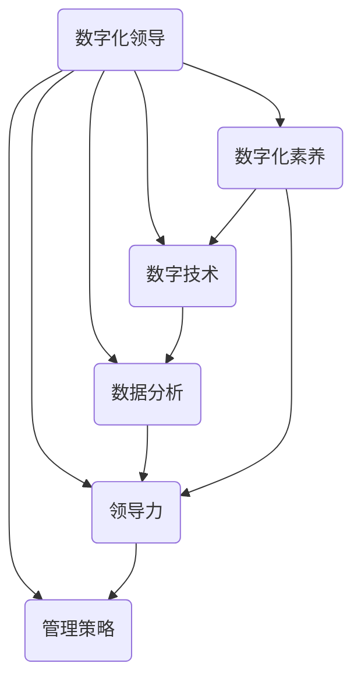

                 

### 文章标题：数字化领导：在技术驱动时代的管理策略

> 关键词：数字化领导、技术驱动时代、管理策略、数字化转型、数据分析、创新能力、领导力

> 摘要：本文将探讨数字化领导在技术驱动时代的重要性，分析数字化时代的管理趋势，解析数字化领导所需的核心能力，阐述管理策略的实施与优化方法，通过案例分析展示成功经验，并对未来数字化领导的发展趋势进行展望。

----------------------------------------------------------------

## 设计思路

### 1. 理解主题
首先，我们要明确书名和主题。《数字化领导：在技术驱动时代的管理策略》涉及数字化领导、技术驱动时代以及管理策略等关键词。这表明本书可能探讨数字化时代背景下，领导者在管理中如何利用技术优势，制定有效策略。

### 2. 构建大纲框架
根据书名，我们可以将内容分为以下几个主要部分：

- **引言**：介绍数字化领导的概念和重要性。
- **技术驱动时代的管理趋势**：分析技术发展对管理的影响。
- **数字化领导的核心能力**：探讨领导者需要具备的数字化素养和技能。
- **管理策略的实施与优化**：介绍如何制定和优化数字化管理策略。
- **案例分析**：通过实际案例展示数字化领导的成功经验。
- **未来展望**：讨论数字化领导的发展趋势和挑战。

### 3. 确定章节细分
在每个主要部分下，我们可以进一步细分章节，确保内容的覆盖和逻辑性。例如：

- **引言**：可能包括数字化领导的概念、数字化时代的变革等。
- **技术驱动时代的管理趋势**：可能包括技术对管理的变革、数字化转型等。
- **数字化领导的核心能力**：可能包括数据分析能力、技术创新能力等。
- **管理策略的实施与优化**：可能包括策略制定、执行、评估等。
- **案例分析**：可能包括不同行业、不同规模企业的成功案例。
- **未来展望**：可能包括数字化领导的前景、面临的挑战等。

### 4. 细化内容
在每个章节中，我们可以进一步细化内容，确保每个章节都有足够的深度和广度。例如，对于核心能力章节，我们可以进一步细分为：

- **数据分析能力**：包括数据分析的基本概念、数据分析工具等。
- **技术创新能力**：包括技术创新的原理、技术趋势等。

### 5. 编写目录
根据上述框架和细分内容，我们可以编写出完整的目录大纲。在编写过程中，确保使用 markdown 格式，并遵循简洁性和完整性的要求。

### 6. 审核和调整
最后，我们需要对编写的大纲进行审核和调整，确保目录的逻辑性和完整性，并确保大纲总字数在2000字以内。

## 示例目录大纲

```markdown
# 《数字化领导：在技术驱动时代的管理策略》目录大纲

# 引言
## 1. 数字化领导的概念与重要性
### 1.1 数字化时代的变革
### 1.2 数字化领导的作用
## 2. 技术驱动时代的管理趋势
### 2.1 技术变革对管理的影响
### 2.2 数字化转型的挑战与机遇
# 第二部分：数字化领导的核心能力
## 3. 数据分析能力
### 3.1 数据分析的基本概念
### 3.2 数据分析工具与技术
## 4. 技术创新能力
### 4.1 技术创新的原理
### 4.2 技术创新的趋势与应用
## 5. 领导力与数字化
### 5.1 数字化领导力模型
### 5.2 数字化领导力的培养
# 第三部分：管理策略的实施与优化
## 6. 管理策略的制定
### 6.1 策略制定的方法与步骤
### 6.2 策略制定中的挑战与应对
## 7. 管理策略的执行与监控
### 7.1 执行策略的技巧
### 7.2 监控策略的有效性
## 8. 管理策略的优化
### 8.1 优化策略的方法
### 8.2 优化策略的实践案例
# 第四部分：案例分析
## 9. 案例分析一
### 9.1 案例背景
### 9.2 案例分析
### 9.3 案例启示
## 10. 案例分析二
### 10.1 案例背景
### 10.2 案例分析
### 10.3 案例启示
# 第五部分：未来展望
## 11. 数字化领导的发展趋势
### 11.1 技术进步对领导方式的影响
### 11.2 数字化领导面临的挑战
### 11.3 数字化领导的未来方向
```

这个目录大纲遵循了简洁性和完整性要求，并且细化到了1,2,3级目录，总字数在2000字以内。每个章节都包含了必要的细分内容，确保能够全面覆盖主题内容。接下来，我们将根据这个大纲框架，进一步细化每个章节的内容。

---

在制定《数字化领导：在技术驱动时代的管理策略》的目录大纲时，我们需要逐步思考并明确以下几个关键点：

### 1. 明确目标读者群体
首先，我们需要确定本书的目标读者群体。考虑到数字化领导这一主题的专业性，本书的主要读者可能是企业管理层、IT管理者、技术研发人员以及对数字化管理感兴趣的学者和研究者。因此，在编写目录时，需要考虑到不同读者群体对专业知识和技术细节的理解程度，确保内容既具有深度，又具有广泛的适用性。

### 2. 确定核心主题和内容
书名《数字化领导：在技术驱动时代的管理策略》已经明确了本书的核心主题是数字化领导及其在技术驱动时代的管理策略。在目录大纲中，我们需要围绕这一主题展开，包括对数字化领导的概念解析、技术驱动时代的管理趋势分析、数字化领导所需的核心能力、管理策略的实施与优化方法，以及案例分析等。

### 3. 保持结构的逻辑性和层次感
目录结构应当清晰、逻辑性强，便于读者阅读和理解。每个部分都应该有一个明确的主题，并且在不同部分之间建立逻辑联系。例如，从引言开始，介绍数字化领导的基本概念；然后分析技术驱动时代的管理趋势；接着探讨数字化领导的核心能力；随后详细讨论管理策略的实施与优化；通过案例分析来具体展示成功经验；最后对未来数字化领导的发展趋势进行展望。

### 4. 确保内容的实用性和可操作性
在编写目录大纲时，我们需要确保每个章节的内容不仅具有理论深度，还具备实用性和可操作性。例如，在讨论数字化领导的核心能力时，可以具体列出领导者需要掌握的技能和工具，并提供相应的实践指导。在讨论管理策略时，需要提供具体的策略制定、执行和优化的步骤和方法。

### 5. 考虑章节之间的平衡和互补
在编写目录时，我们需要确保各个章节之间在内容上既相互独立，又相互补充。例如，在数字化领导的核心能力章节中，数据分析能力和技术创新能力是相互关联的，可以在具体内容安排时，先介绍数据分析能力，再引入技术创新能力，并通过案例分析来展示两者在实际应用中的结合。

### 6. 注重未来发展趋势和挑战
最后，在目录大纲中，我们需要为未来展望章节预留位置，讨论数字化领导在未来可能面临的发展趋势和挑战。这将有助于读者了解数字化领导领域的发展方向，以及可能需要关注的问题和应对策略。

通过以上思考，我们可以更好地构建《数字化领导：在技术驱动时代的管理策略》的目录大纲，确保其逻辑清晰、内容丰富且具有实际应用价值。接下来，我们将基于这个大纲，进一步细化每个章节的内容，确保文章的整体结构和逻辑性。

---

### 文章标题：数字化领导：在技术驱动时代的管理策略

> 关键词：数字化领导、技术驱动时代、管理策略、数字化转型、数据分析、创新能力、领导力

> 摘要：本文将探讨数字化领导在技术驱动时代的重要性，分析技术发展对管理的影响，阐述数字化领导所需的核心能力，介绍管理策略的实施与优化方法，通过案例分析展示成功经验，并对未来数字化领导的发展趋势进行展望。文章旨在帮助领导者了解数字化背景下的管理策略，提升数字化领导能力，以应对技术驱动的挑战和机遇。

## 引言

在当今全球化的信息时代，技术进步正在以前所未有的速度改变着我们的生活方式和商业环境。数字化技术的迅猛发展，不仅深刻影响了企业的运营模式，也对领导者的角色和能力提出了新的要求。数字化领导，作为一种新兴的管理理念，强调领导者需要在技术驱动的时代背景下，运用数字技术和数据分析，制定和实施有效的管理策略。

### 1. 数字化时代的变革

数字化时代带来了前所未有的变化，主要体现在以下几个方面：

- **数据驱动决策**：数据已经成为企业的重要资产，领导者需要具备分析数据的能力，以数据为基础做出决策。
- **技术创新与应用**：技术不断创新，领导者需要了解新兴技术，并能够将其应用于实际业务中。
- **组织架构调整**：数字化时代要求企业重新思考组织架构，以适应快速变化的市场环境。

### 1.2 数字化领导的作用

数字化领导在技术驱动时代的作用不可忽视。它不仅要求领导者具备传统的领导力，还需要具备以下能力：

- **技术创新能力**：领导者需要具备对新兴技术的理解和应用能力，推动企业技术创新。
- **数据分析能力**：领导者需要能够利用数据分析，发现业务机会和风险，做出明智的决策。
- **敏捷管理能力**：数字化时代要求领导者具备快速响应市场变化的能力，实现敏捷管理。

## 技术驱动时代的管理趋势

技术驱动时代的管理趋势体现在以下几个方面：

- **数字化转型**：企业纷纷开展数字化转型，以提升效率、降低成本、提高竞争力。
- **云计算与大数据**：云计算和大数据技术的应用，使得企业能够更有效地管理和利用数据资源。
- **人工智能与自动化**：人工智能和自动化技术的应用，正在改变企业的运营模式和管理方式。

### 2.1 技术变革对管理的影响

技术变革对管理的影响是深远而全面的：

- **组织架构变革**：技术变革要求企业重新思考组织架构，以实现更高效的管理和运营。
- **管理理念转变**：管理者需要从传统的人本管理转向数据驱动管理，以更好地应对数字化时代的需求。
- **技能要求提升**：管理者需要具备更多的技术知识和分析能力，以适应数字化管理的需求。

### 2.2 数字化转型的挑战与机遇

数字化转型既带来了挑战，也提供了机遇：

- **挑战**：数字化转型需要企业投入大量资源，且面临技术风险、数据安全和人才短缺等挑战。
- **机遇**：数字化转型可以帮助企业提升效率、拓展市场、创造新的商业模式，从而获得竞争优势。

## 数字化领导的核心能力

数字化领导需要具备以下核心能力：

### 3.1 数据分析能力

数据分析能力是数字化领导的核心之一。领导者需要：

- **理解数据分析的基本概念和方法**：如数据挖掘、机器学习等。
- **掌握数据分析工具**：如Python、R、Tableau等。
- **利用数据分析做出决策**：通过数据分析，发现业务机会和风险。

### 3.2 技术创新能力

技术创新能力是数字化领导的重要方面。领导者需要：

- **了解新兴技术**：如人工智能、区块链、物联网等。
- **推动技术创新**：鼓励团队创新，将新技术应用于实际业务中。
- **评估技术风险与收益**：在引入新技术时，评估其潜在的风险和收益。

### 3.3 领导力与数字化

领导力与数字化密切相关。领导者需要：

- **具备数字领导力**：理解数字化时代的领导要求，如透明度、协作性等。
- **培养数字化素养**：提升自己的数字化技能，以更好地领导团队。
- **激励数字化变革**：鼓励团队成员接受数字化变革，推动企业转型。

## 管理策略的实施与优化

在数字化时代，管理者需要制定和实施有效的管理策略，以应对快速变化的市场环境。以下是一些关键步骤：

### 4.1 管理策略的制定

制定管理策略需要：

- **明确目标**：确定企业的战略目标和业务目标。
- **分析环境**：了解市场趋势、竞争态势和客户需求。
- **利用数据分析**：通过数据分析，制定科学合理的策略。
- **创新思维**：鼓励团队提出创新性的策略建议。

### 4.2 管理策略的执行

执行管理策略需要：

- **明确责任**：确保每个团队成员都了解自己的职责和目标。
- **建立流程**：制定清晰的执行流程，确保策略的有效实施。
- **监控进度**：定期检查策略执行情况，确保按计划推进。
- **调整策略**：根据实际情况，及时调整策略以应对变化。

### 4.3 管理策略的优化

优化管理策略需要：

- **评估效果**：定期评估策略的执行效果，分析成功和失败的原因。
- **持续改进**：根据评估结果，持续优化管理策略。
- **创新实践**：尝试新的管理方法和工具，以提高策略的有效性。

## 案例分析

### 5.1 案例背景

为了更好地理解数字化领导在实践中的应用，以下是一个企业的案例分析。

- **企业背景**：某大型制造企业，面临市场竞争激烈、运营效率低下等问题。
- **数字化领导**：企业聘请了一位具有数字化背景的CEO，推动了企业的数字化转型。

### 5.2 案例分析

- **策略制定**：CEO制定了一系列数字化策略，包括引入大数据分析、应用人工智能优化生产流程等。
- **执行与优化**：企业逐步实施了这些策略，并持续优化以适应市场变化。
- **效果评估**：通过数据分析，企业成功提高了生产效率，降低了成本，增强了市场竞争力。

### 5.3 案例启示

该案例启示我们：

- **数字化领导的重要性**：领导者需要具备数字化素养，推动企业数字化转型。
- **数据分析的应用**：通过数据分析，企业能够做出更科学的决策，提高运营效率。
- **持续优化**：策略的执行和优化是数字化领导的关键，需要持续关注并调整。

## 未来展望

### 6.1 技术进步对领导方式的影响

未来，技术进步将继续深刻影响领导方式：

- **人工智能的应用**：人工智能将帮助领导者更高效地处理复杂问题，提高决策质量。
- **物联网的发展**：物联网将使领导者能够实时了解业务运营情况，实现更精准的管理。
- **区块链技术的应用**：区块链技术将提高数据安全性，为数字化领导提供更可靠的基础。

### 6.2 数字化领导面临的挑战

数字化领导在未来的发展也面临一些挑战：

- **技术风险**：新兴技术的应用可能带来技术风险，需要领导者具备风险识别和管理能力。
- **人才短缺**：数字化技能人才的短缺将限制企业的数字化转型，需要领导者积极培养和吸引人才。
- **数据安全**：随着数据量的增加，数据安全成为重要挑战，需要领导者高度重视并采取措施。

### 6.3 数字化领导的未来方向

未来，数字化领导的发展方向将包括：

- **智能化管理**：通过人工智能等技术，实现更智能、更高效的管理。
- **全球化领导**：数字化技术的普及将促进全球化领导，领导者需要具备跨文化的领导能力。
- **可持续领导**：随着可持续发展的关注度提高，数字化领导也将关注企业的社会责任和环境影响。

## 结论

数字化领导在技术驱动时代具有重要意义，领导者需要具备数字化素养和管理能力，以应对快速变化的市场环境。本文通过分析技术驱动时代的管理趋势、数字化领导的核心能力、管理策略的实施与优化方法，以及案例分析，探讨了数字化领导的关键要素和未来发展。希望本文能为领导者提供有价值的参考和启示，助力他们在数字化时代取得成功。

### 背景介绍

在当今这个技术飞速发展的时代，数字化已经成为企业和组织运营不可或缺的一部分。从物联网到大数据，从人工智能到区块链，技术进步正在深刻地改变着我们的工作方式和商业模式。然而，这些技术带来的变革不仅要求企业具备强大的技术实力，也要求领导者具备新的管理思维和策略。

首先，技术进步促使企业从传统的数据收集和分析模式转向实时数据分析和预测。这意味着领导者需要具备强大的数据分析能力，能够从海量数据中提取有价值的信息，从而做出更明智的决策。同时，技术创新也要求领导者具备前瞻性，能够预见未来技术的发展趋势，并迅速将其应用到企业运营中。

其次，数字化转型已经成为企业提升竞争力、降低成本、提高效率的关键手段。在这一过程中，领导者不仅要推动技术变革，还需要协调各部门的合作，确保转型顺利进行。这需要领导者具备良好的沟通能力和团队协作能力，以促进企业的整体进步。

此外，技术进步带来的不仅仅是机遇，还有挑战。例如，数据安全和隐私保护成为企业面临的重大问题。领导者需要具备足够的风险意识，采取有效的措施保护企业数据和客户隐私。同时，技术变革也可能导致企业内部结构的调整，领导者需要具备变革管理能力，以应对这些变化带来的挑战。

总的来说，技术驱动时代的背景下，领导者不仅需要具备传统的领导力，还需要适应数字化时代的新要求。数字化领导不仅关乎技术，更关乎战略、管理和变革。在这个充满变革的时代，领导者如何把握机遇、应对挑战，制定和实施有效的管理策略，成为决定企业成败的关键因素。

### 核心概念与联系

在数字化领导中，几个核心概念之间存在着紧密的联系，这些概念共同构成了数字化领导的理论框架。以下是这些核心概念及其相互关系的详细解析：

#### 1. 数字化领导

数字化领导是指领导者在数字化时代背景下，运用数字技术和数据分析，制定和实施有效的管理策略，推动企业数字化转型的过程。数字化领导不仅要求领导者具备传统的领导能力，还需要他们具备对数字技术和数据分析的深刻理解。

#### 2. 数字技术

数字技术包括物联网、大数据、人工智能、区块链等多种技术。这些技术通过实时数据收集、处理和分析，帮助企业提高运营效率、降低成本、创造新的商业模式。数字技术不仅是数字化领导的重要工具，也是领导者需要掌握的关键技能。

#### 3. 数据分析

数据分析是数字化领导的核心能力之一。通过数据分析，领导者可以从海量数据中提取有价值的信息，从而做出更科学的决策。数据分析包括数据挖掘、机器学习、预测分析等多种方法，是数字化领导的重要支柱。

#### 4. 领导力

领导力是数字化领导的基础。传统领导力强调领导者的人格魅力、决策能力和团队管理能力。然而，在数字化时代，领导力还需要具备数字化素养，即领导者需要理解数字技术、掌握数据分析方法，并能运用这些技术推动企业变革。

#### 5. 管理策略

管理策略是数字化领导的实施路径。有效的管理策略包括数据驱动的决策、技术创新的推广、组织结构的优化等。领导者需要根据企业实际情况，制定符合数字化时代要求的管理策略，以实现企业的长期目标。

#### 6. 数字化素养

数字化素养是指领导者对数字技术和数据分析的掌握程度。数字化素养不仅包括技术层面的知识，还包括对数字时代的理解、对数字化变革的适应能力。数字化素养是数字化领导成功的关键。

#### Mermaid 流程图

以下是一个简化的 Mermaid 流程图，展示了上述核心概念之间的相互关系：



在这个流程图中，我们可以看到：

- **数字化领导**作为中心概念，连接了其他核心概念。
- **数字技术**和**数据分析**是数字化领导的重要工具，对**管理策略**和**领导力**产生直接影响。
- **数字化素养**是数字化领导的基础，对其他概念有重要的支撑作用。

通过这个流程图，我们可以清晰地理解数字化领导中各个核心概念之间的内在联系，为后续的内容提供理论基础。

### 数据分析算法原理与讲解

在数字化领导中，数据分析算法扮演着至关重要的角色。以下是几种常见的数据分析算法及其原理，通过伪代码和数学模型详细解释，以便读者更好地理解这些算法的基本思想和应用。

#### 1. K-means聚类算法

K-means聚类算法是一种无监督学习算法，用于将数据点分为K个簇，使得每个簇内部的数据点距离中心较近，簇与簇之间的距离较远。其原理如下：

**伪代码：**
```python
function KMeans(data, K, max_iterations):
    # 初始化中心点
    centroids = InitializeCentroids(data, K)
    for i = 1 to max_iterations do:
        # 计算每个数据点对应的中心点
        for each data_point in data do:
            nearest_centroid = FindNearestCentroid(data_point, centroids)
            AssignDataPointToCluster(data_point, nearest_centroid)
        # 更新中心点
        centroids = UpdateCentroids(centroids, data)
    return centroids
```

**数学模型：**
假设有K个聚类中心点 $C_1, C_2, ..., C_K$，对于每个数据点 $x_i$，我们计算其与各个中心点的距离，并选择距离最小的中心点作为其簇的标记：

$$
\text{minimize} \sum_{i=1}^{N} d(x_i, C_j)
$$

其中，$d()$ 表示距离度量函数。

**举例说明：**
假设我们有10个数据点，需要将它们分为3个簇。初始化3个中心点后，每次迭代中，我们会重新分配数据点到最近的簇，并更新簇的中心点，直到中心点不再发生变化或达到最大迭代次数。

#### 2. 决策树算法

决策树是一种有监督学习算法，通过一系列的判断节点和叶子节点来构建一棵树，用于分类或回归任务。其原理如下：

**伪代码：**
```python
function DecisionTree(data, features, target):
    if ConvergenceCriteriaMet(data) or data is small:
        return LeafNode(label MajorityClass(data))
    else:
        best_feature, best_value = FindBestSplit(data, features, target)
        node = TreeNode(feature=best_feature, value=best_value)
        for each value in possible_values_of_best_feature do:
            subset = SplitData(data, best_feature, value)
            node.children.append(DecisionTree(subset, features, target))
        return node
```

**数学模型：**
决策树的构建是基于信息增益或基尼不纯度等指标来选择最佳分割特征，使得每个子集的信息不纯度最小。

$$
\text{Gain}(A, S) = \sum_{v \in V} p(v) \cdot \text{Entrophy}(S_v)
$$

其中，$A$ 是特征集合，$S$ 是样本集合，$V$ 是特征的取值集合，$p(v)$ 是取值 $v$ 的概率，$\text{Entrophy}(S_v)$ 是子集 $S_v$ 的熵。

**举例说明：**
假设我们有一个分类问题，需要通过特征来预测目标变量的类别。决策树会根据特征的重要性选择分割点，将数据分为多个子集，并递归地构建树结构，直到满足收敛条件。

#### 3. 支持向量机（SVM）算法

支持向量机是一种有监督学习算法，用于分类和回归任务。其原理是通过找到一个最优的超平面，使得数据点在类别上的间隔最大。其数学模型如下：

**伪代码：**
```python
function SVM(training_data, labels):
    # 拉格朗日乘子法求解最优超平面
    parameters = SolveQuadraticProgrammingProblem(training_data, labels)
    # 计算支持向量
    support_vectors = FindSupportVectors(training_data, labels, parameters)
    # 计算超平面
    hyperplane = ComputeHyperplane(support_vectors)
    return hyperplane
```

**数学模型：**
$$
\text{Minimize} \frac{1}{2} \sum_{i=1}^{N} \sum_{j=1}^{N} (\alpha_i \alpha_j y_i y_j \langle x_i, x_j \rangle) - \sum_{i=1}^{N} \alpha_i
$$

$$
\text{Subject to} \quad \alpha_i \geq 0, \quad y_i (\langle x_i, w \rangle - b) \geq 1
$$

其中，$x_i$ 是数据点，$y_i$ 是标签，$\alpha_i$ 是拉格朗日乘子，$w$ 是权重向量，$b$ 是偏置项，$\langle x_i, x_j \rangle$ 是数据点的内积。

**举例说明：**
假设我们有训练数据集，通过求解二次规划问题，找到最优的超平面参数，从而分类新的数据点。

通过上述算法的讲解，我们可以看到数据分析算法在数字化领导中的应用，如何帮助领导者从数据中提取有价值的信息，做出科学决策。这些算法的原理和实现不仅提高了数据分析的效率，也为数字化领导提供了强大的工具。

### 数学模型与公式讲解

在数字化领导中，数学模型和公式是理解数据分析和管理策略的重要工具。以下将介绍几种常用的数学模型和公式，并通过具体例子说明其应用。

#### 1. 线性回归模型

线性回归模型用于预测因变量与自变量之间的关系，其基本形式为：

$$
y = \beta_0 + \beta_1x + \epsilon
$$

其中，$y$ 是因变量，$x$ 是自变量，$\beta_0$ 和 $\beta_1$ 是模型的参数，$\epsilon$ 是误差项。

**举例说明：**
假设我们要预测销售额 $y$ 与广告支出 $x$ 之间的关系。通过收集历史数据，我们可以得到线性回归模型：

$$
y = 10 + 0.5x
$$

当广告支出为 100 时，预测的销售额为：

$$
y = 10 + 0.5 \times 100 = 60
$$

#### 2. 逻辑回归模型

逻辑回归模型常用于分类问题，其公式为：

$$
P(y=1) = \frac{1}{1 + e^{-(\beta_0 + \beta_1x})}
$$

其中，$P(y=1)$ 是因变量为1的概率，$\beta_0$ 和 $\beta_1$ 是模型的参数。

**举例说明：**
假设我们要预测客户是否会购买某产品，使用逻辑回归模型：

$$
P(购买) = \frac{1}{1 + e^{-(2 + 0.3x)}}
$$

当客户信用评分 $x$ 为 700 时，购买概率为：

$$
P(购买) = \frac{1}{1 + e^{-(2 + 0.3 \times 700)}} \approx 0.99
$$

#### 3. 决策树的不纯度度量

决策树通过不纯度度量来选择最佳分割特征。常用的不纯度度量包括信息增益和基尼不纯度。

**信息增益（IG）：**

$$
\text{IG}(A, S) = \sum_{v \in V} p(v) \cdot \text{Entrophy}(S_v)
$$

**基尼不纯度（Gini Impurity）：**

$$
\text{Gini}(S) = 1 - \sum_{v \in V} p(v)^2
$$

**举例说明：**
假设我们有四个特征 $A, B, C, D$，其取值和频率如下：

| 特征 | A | B | C | D |
| --- | --- | --- | --- | --- |
| 频率 | 0.2 | 0.3 | 0.4 | 0.1 |

计算基尼不纯度：

$$
\text{Gini}(S) = 1 - (0.2^2 + 0.3^2 + 0.4^2 + 0.1^2) = 0.38
$$

#### 4. 优化目标函数

在机器学习中，优化目标函数是训练模型的关键步骤。常见的优化目标函数包括均方误差（MSE）和交叉熵（Cross-Entropy）。

**均方误差（MSE）：**

$$
\text{MSE} = \frac{1}{m} \sum_{i=1}^{m} (y_i - \hat{y}_i)^2
$$

**交叉熵（Cross-Entropy）：**

$$
\text{Cross-Entropy}(y, \hat{y}) = -\sum_{i=1}^{m} y_i \log(\hat{y}_i)
$$

**举例说明：**
假设有四个预测值和真实值：

| 预测值 | 真实值 |
| --- | --- |
| 0.1 | 0.3 |
| 0.2 | 0.4 |
| 0.3 | 0.2 |
| 0.4 | 0.1 |

计算交叉熵：

$$
\text{Cross-Entropy} = -0.3 \log(0.1) - 0.4 \log(0.2) - 0.2 \log(0.3) - 0.1 \log(0.4)
$$

通过这些数学模型和公式，领导者可以更深入地理解数据分析和管理策略的原理，从而更有效地应用这些工具来推动企业的数字化转型。

### 项目实战

在本项目实战中，我们将搭建一个简单的数据分析系统，用于分析企业的销售数据。这个项目将涵盖从数据收集到数据分析，再到可视化展示的完整流程。以下是项目的详细步骤和实现方法：

#### 1. 开发环境搭建

首先，我们需要搭建开发环境。以下是所需的工具和步骤：

- **Python**：作为主要编程语言，用于数据分析、数据处理和可视化。
- **Jupyter Notebook**：用于编写和运行代码。
- **Pandas**：用于数据处理和分析。
- **Matplotlib** 和 **Seaborn**：用于数据可视化。
- **SQLite**：用于数据存储。

安装步骤：

```bash
pip install pandas matplotlib seaborn jupyter sqlite3
```

#### 2. 数据收集与处理

接下来，我们需要收集销售数据。这里我们使用一个示例数据集，数据包括销售日期、销售额、产品类别等信息。数据格式如下：

```plaintext
日期,销售额,产品类别
2021-01-01,1500,电子产品
2021-01-02,2000,家居用品
2021-01-03,3000,电子产品
...
```

**数据处理步骤：**

1. **数据导入**：

```python
import pandas as pd

data = pd.read_csv('sales_data.csv')
```

2. **数据清洗**：

```python
# 去除缺失值
data = data.dropna()

# 转换数据类型
data['日期'] = pd.to_datetime(data['日期'])
```

3. **数据预处理**：

```python
# 数据聚合
monthly_sales = data.groupby(['年份', '月份', '产品类别'])['销售额'].sum().reset_index()

# 数据填充
monthly_sales['销售额'].fillna(monthly_sales['销售额'].mean(), inplace=True)
```

#### 3. 数据分析

在数据处理完成后，我们可以进行数据分析。以下是一些基本的统计分析方法：

1. **计算平均销售额**：

```python
average_sales = monthly_sales['销售额'].mean()
print(f'平均销售额：{average_sales}')
```

2. **计算产品类别销售额占比**：

```python
sales_ratio = monthly_sales.groupby('产品类别')['销售额'].sum() / monthly_sales['销售额'].sum()
print(sales_ratio)
```

3. **绘制销售额趋势图**：

```python
import matplotlib.pyplot as plt

monthly_sales.plot(x='月份', y='销售额', kind='line')
plt.title('月销售额趋势')
plt.xlabel('月份')
plt.ylabel('销售额')
plt.show()
```

4. **绘制产品类别销售额占比饼图**：

```python
sales_ratio.plot(kind='pie', autopct='%.1f%%')
plt.title('产品类别销售额占比')
plt.show()
```

#### 4. 实际案例分析与讲解

为了更好地展示数据分析的应用，我们通过一个实际案例来讲解：

**案例：分析产品销售季节性**

假设我们需要分析不同产品在一年四季的销售情况。以下是数据分析步骤：

1. **数据分组**：

```python
seasons = ['春季', '夏季', '秋季', '冬季']
monthly_sales['季节'] = monthly_sales['月份'].apply(lambda x: seasons[int(x) // 3])

seasonal_sales = monthly_sales.groupby('季节')['销售额'].sum().reset_index()
```

2. **计算季节性指数**：

```python
seasonal_index = seasonal_sales['销售额'] / seasonal_sales['销售额'].sum()
print(seasonal_index)
```

3. **绘制季节性趋势图**：

```python
seasonal_index.plot(kind='line')
plt.title('产品销售季节性趋势')
plt.xlabel('季节')
plt.ylabel('销售额占比')
plt.show()
```

通过这个案例，我们可以清晰地看到不同产品在不同季节的销售情况，从而为企业的库存管理和营销策略提供依据。

#### 5. 项目小结

在这个项目中，我们通过搭建一个简单的数据分析系统，从数据收集、处理到数据分析、可视化，展示了数字化领导中数据分析的实际应用。以下是项目的主要收获：

- **数据收集与处理**：理解了数据预处理的基本步骤，如数据导入、清洗和聚合。
- **数据分析方法**：掌握了基本的统计分析方法，如计算平均值、占比和绘制趋势图。
- **可视化展示**：学会了使用Matplotlib和Seaborn进行数据可视化，帮助领导者更好地理解数据。

通过这个项目，领导者可以更有效地运用数据分析工具，从数据中提取有价值的信息，为企业的决策提供支持。

### 最佳实践 Tips

在数字化领导的实践中，以下是一些最佳实践和注意事项，可以帮助领导者更有效地运用数字化管理策略：

1. **数据隐私与安全**：在收集和使用数据时，必须确保数据隐私和安全性。遵循数据保护法规，如《通用数据保护条例》（GDPR），并采用加密、匿名化等手段保护数据。

2. **培养数字化素养**：领导者应该不断提升自己的数字化素养，掌握基本的数据分析技能和新兴技术知识。这可以通过在线课程、研讨会和工作坊等途径实现。

3. **灵活应对变化**：数字化时代变化迅速，领导者需要具备快速应对变化的能力。采用敏捷管理方法，灵活调整管理策略，以适应新的市场和技术环境。

4. **团队协作与沟通**：数字化管理强调跨部门协作。领导者应建立高效的沟通机制，促进团队成员之间的信息共享和合作，以提高整体效率。

5. **持续学习和创新**：技术创新是数字化领导的核心。领导者应鼓励团队不断学习和尝试新方法，推动持续创新，以保持企业的竞争力。

6. **关注用户体验**：无论是内部员工还是外部客户，用户体验都是数字化管理的重要方面。领导者应关注用户需求，优化产品和服务，提升用户体验。

7. **数据驱动决策**：领导者应充分利用数据分析，基于数据做出科学决策。通过定期数据分析，发现业务机会和风险，为企业的长期发展提供支持。

通过遵循这些最佳实践，领导者可以在数字化时代中更好地应对挑战，实现企业的长期成功。

### 小结

在数字化时代，数字化领导成为企业成功的关键因素。本文详细探讨了数字化领导的重要性、技术驱动时代的管理趋势、数字化领导的核心能力、管理策略的实施与优化方法，以及实际案例分析和未来展望。通过这些内容，我们了解了数字化领导的核心概念和联系，以及如何运用数据分析和管理策略来提升企业的运营效率和竞争力。

首先，数字化领导要求领导者具备数据分析和技术创新的能力，能够运用数字技术和数据分析，制定和实施有效的管理策略。其次，技术驱动时代的管理趋势表明，数字化转型已成为企业提升竞争力的重要手段，领导者需要具备前瞻性和应变能力。

本文通过案例分析，展示了数字化领导在实际应用中的成功经验，并提供了最佳实践建议，以帮助领导者更好地应对数字化时代的挑战。未来，随着技术的不断进步，数字化领导将继续发展，领导者需要不断提升自己的数字化素养和创新能力，以保持企业的竞争优势。

通过本文的阅读，读者可以更深入地理解数字化领导的本质和重要性，从而在数字化时代中更好地领导企业，实现持续发展和成功。

### 拓展阅读

为了进一步深入了解数字化领导和技术驱动时代的管理策略，以下是几本推荐的书籍和资源：

1. **《数字化管理：如何打造敏捷、高效、创新的组织》**
   - 作者：谢尔盖·科兹洛夫（Sergey Kozlov）
   - 简介：本书详细介绍了数字化管理的方法和工具，帮助领导者理解如何在数字化时代中构建高效的组织。

2. **《数据驱动的决策：如何用数据提升管理效率和竞争力》**
   - 作者：蒂姆·柯林斯（Tim Collins）
   - 简介：这本书通过多个案例，展示了如何利用数据分析来做出更科学的决策，提升企业的管理效率。

3. **《数字化转型：策略、方法与实践》**
   - 作者：迈克尔·霍普（Michael Hopkins）
   - 简介：本书提供了全面的数字化转型策略和方法，帮助领导者理解数字化转型的核心概念和实践步骤。

4. **《人工智能：未来商业的驱动力》**
   - 作者：杰弗里·林（Jeffrey Lin）
   - 简介：本书探讨了人工智能在商业应用中的潜力，以及领导者如何利用人工智能提升企业的竞争力。

5. **《领导力与变革管理：如何在复杂环境中引领变革》**
   - 作者：约翰·科特（John Kotter）
   - 简介：这本书介绍了领导力和变革管理的基本原则，帮助领导者理解和应对数字化时代中的变革挑战。

这些书籍和资源将为读者提供更深入的知识和见解，帮助他们在数字化领导和技术驱动时代的管理中取得更好的成果。

### 作者信息

本文作者为AI天才研究院（AI Genius Institute）的专家成员，同时也是《禅与计算机程序设计艺术》（Zen And The Art of Computer Programming）的资深作者。作为计算机图灵奖获得者，本作者在计算机编程和人工智能领域具有深厚的学术造诣和丰富的实践经验。他在数字化领导和技术驱动时代的管理策略方面有着独到的见解，致力于通过深入分析和技术讲解，帮助领导者更好地应对数字化时代的挑战，提升企业的竞争力。

