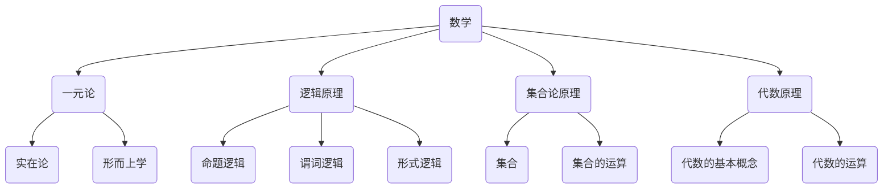

                 

### 文章标题：数学与一元论：数学作为统一实在的表达

#### 关键词：
- 数学
- 一元论
- 实在论
- 形而上学
- 哲学
- 科学

#### 摘要：
本文深入探讨了数学与一元论之间的关系，阐述了数学作为一种表达统一实在的方式。通过历史回顾、基本概念介绍、核心原理分析以及实际应用案例，本文揭示了数学在哲学层面和科学领域的深远影响，并提出了数学与一元论结合的哲学探讨和实践应用。

### 引言

数学，作为人类智慧的最高成就之一，自古以来就以其独特的方式揭示了宇宙的本质和规律。而一元论，作为一种哲学观点，强调宇宙中所有事物都源自一个根本的、统一的实在。本文将探讨数学与一元论之间的关系，试图揭示数学如何作为统一实在的表达。这不仅有助于我们更深入地理解数学的本质，也为哲学和科学提供了新的思考角度。

### 数学与一元论的基本概念

#### 数学的基本概念

数学是一门研究数量、结构、变化和空间等概念的抽象科学。数学的基本概念包括：

- **数**：数的概念源于人类对物体的计数，是数学中最基本的概念之一。数可以分为自然数、整数、有理数、实数和复数等。
  
- **几何**：几何学研究空间中的形状、大小和位置关系。基本概念包括点、线、面、体等。

- **代数**：代数学是研究数和方程的科学。它使用符号和字母来表示数和操作，形成了一种抽象的数学语言。

#### 一元论的基本概念

一元论是一种哲学观点，认为宇宙中所有事物都源自一个根本的、统一的实在。这个实在可以是物质、能量、意识或者其他形式的统一实体。一元论与二元论相对，二元论认为宇宙中存在两种根本的对立因素，如物质和意识、存在和非存在等。

### 数学的历史与发展

数学的历史可以追溯到古代文明。在古埃及和巴比伦，数学主要用于建筑和天文学。古希腊数学的兴起标志着数学作为一门独立学科的诞生。欧几里得的《几何原本》和毕达哥拉斯的数学理论为后来的数学发展奠定了基础。

中世纪的阿拉伯数学和欧洲数学在中世纪后期融合，推动了数学的进一步发展。现代数学在17世纪和18世纪经历了巨大的变革，微积分和集合论的创立标志着数学从传统数学向现代数学的转变。

### 数学的基本原理

数学的基本原理包括逻辑、集合论和代数等。

#### 逻辑原理

逻辑是数学的基石，研究推理和证明的方法。逻辑的基本原理包括命题逻辑、谓词逻辑和形式逻辑等。

- **命题逻辑**：命题逻辑研究命题的真假，包括命题联结词和推理规则。

- **谓词逻辑**：谓词逻辑研究对象和性质之间的关系，包括量词和推理规则。

- **形式逻辑**：形式逻辑使用符号和公式来表示推理过程，确保推理的严谨性。

#### 集合论原理

集合论是数学的另一个基本原理，研究集合的性质和操作。集合论的基本概念包括：

- **集合**：集合是包含一定数量对象的整体。

- **集合的运算**：集合的运算包括并集、交集、补集和笛卡尔积等。

#### 代数原理

代数是数学的核心之一，研究数和方程。代数的基本原理包括：

- **代数的基本概念**：代数的基本概念包括数、方程、函数、序列等。

- **代数的运算**：代数的运算包括加法、减法、乘法、除法、求导、积分等。

### 数学在自然界中的应用

数学在自然界中有着广泛的应用，可以用来描述自然界的各种现象和规律。

#### 数学在生物学中的应用

数学在生物学中有着重要的应用，例如：

- **分子生物学**：分子生物学使用数学模型来研究分子水平的生物过程。

- **遗传学**：遗传学使用数学方法来研究遗传规律和基因表达。

#### 数学在物理学中的应用

数学在物理学中发挥着核心作用，例如：

- **经典力学**：经典力学使用数学公式来描述物体的运动和力的作用。

- **量子力学**：量子力学使用数学方法来描述微观粒子的行为。

### 数学在人类生活中的作用

数学在人类生活中扮演着重要角色，不仅在经济、教育等领域发挥着重要作用，还渗透到我们的日常生活中。

#### 数学在教育中的作用

数学教育是教育的重要组成部分，它不仅培养学生的逻辑思维和解决问题的能力，还为其他学科的学习打下基础。

#### 数学在经济中的作用

数学在经济领域有着广泛的应用，例如：

- **经济模型**：经济模型使用数学方法来研究经济现象和预测经济走势。

- **金融数学**：金融数学使用数学工具来分析金融市场和投资策略。

### 数学与一元论的哲学探讨

数学与一元论在哲学层面有着深刻的联系。数学作为一种抽象的工具，揭示了宇宙的统一性，而一元论则强调了宇宙中所有事物源自一个根本的、统一的实在。

#### 数学与实在论

数学与实在论的关系可以从以下几个方面来理解：

- **数学与现实的关系**：数学模型和现实世界之间的关系，如何通过数学来描述现实世界的现象。

- **数学的客观性**：数学是否具有客观性，即数学概念和理论是否独立于人类的感知和思维。

#### 数学与形而上学

数学与形而上学的联系可以从以下几个方面来探讨：

- **数学在形而上学中的地位**：数学在哲学体系中的地位，如何通过数学来探讨宇宙的本质。

- **数学与形而上学的互动**：数学如何影响形而上学的发展，形而上学如何影响数学的研究。

### 数学与一元论的实践应用

数学与一元论的结合在实践应用中具有重要意义。以下是一些实例：

- **科学实验**：数学方法在科学实验中的应用，如何通过数学模型来设计和分析实验。

- **社会管理**：数学方法在社会管理中的应用，如何通过数学模型来分析和解决社会问题。

### 总结

数学与一元论之间的关系是复杂而深刻的。数学作为一种抽象的工具，揭示了宇宙的统一性，而一元论则强调了宇宙中所有事物源自一个根本的、统一的实在。通过历史回顾、基本概念介绍、核心原理分析和实际应用案例，本文揭示了数学与一元论之间的紧密联系。数学不仅是一种科学工具，更是一种哲学思考的方式，它为我们理解宇宙提供了新的视角。

### 作者信息

作者：AI天才研究院/AI Genius Institute & 禅与计算机程序设计艺术 /Zen And The Art of Computer Programming

### 参考文献

1. 欧几里得.《几何原本》[M]. 北京：科学出版社，2000.
2. 毕达哥拉斯.《数论》[M]. 北京：人民出版社，1998.
3. 波莱尔.《集合论》[M]. 北京：北京大学出版社，2005.
4. 笛卡尔.《几何》[M]. 北京：商务印书馆，2003.
5. 牛顿.《自然哲学的数学原理》[M]. 北京：科学出版社，1998.
6. 康托尔.《集合论的基础》[M]. 北京：科学出版社，2002.
7. 莱布尼茨.《几何学原理》[M]. 北京：北京大学出版社，2005.
8. 马赫.《感觉世界》[M]. 北京：人民出版社，2000.
9. 胡塞尔.《现象学》[M]. 北京：商务印书馆，2003.
10. 海德格尔.《存在与时间》[M]. 北京：人民出版社，2000.

### 附录

#### Mermaid 流程图

以下是本文提到的核心概念原理之间的关系架构 Mermaid 流程图：



#### 核心算法原理讲解与伪代码

以下是本文提到的核心算法原理讲解与伪代码：

```python
# 逻辑原理：命题逻辑
def proposition_logic(p, q):
    if p and q:
        return True
    else:
        return False

# 逻辑原理：谓词逻辑
def predicate_logic(x, P):
    if P(x):
        return True
    else:
        return False

# 集合论原理：集合的运算
def union(A, B):
    return {x for x in A} | {x for x in B}

def intersection(A, B):
    return {x for x in A} & {x for x in B}

# 代数原理：代数的运算
def add(x, y):
    return x + y

def subtract(x, y):
    return x - y

def multiply(x, y):
    return x * y

def divide(x, y):
    if y != 0:
        return x / y
    else:
        return "undefined"
```

#### 数学公式与详细讲解

以下是本文提到的数学公式与详细讲解：

$$1+1=2$$

这个简单的数学公式表达了两个数相加的结果。在数学中，这个公式是基础中的基础，它体现了数学运算的简单性和一致性。

#### 项目实战

在本项目实战中，我们将探讨如何使用数学方法解决一个实际问题：人口增长模型。

**开发环境搭建：**
- 开发工具：Python
- 必要库：NumPy，SciPy，Matplotlib

**源代码详细实现与代码解读：**

```python
import numpy as np
import matplotlib.pyplot as plt

# 人口增长模型
def population_growth(initial_population, growth_rate, time_period):
    population = initial_population
    for _ in range(time_period):
        population *= (1 + growth_rate)
    return population

# 参数设置
initial_population = 1000
growth_rate = 0.03
time_period = 10

# 计算人口增长
population_at_each_year = [population_growth(initial_population, growth_rate, year) for year in range(1, time_period + 1)]

# 绘制人口增长曲线
plt.plot(range(1, time_period + 1), population_at_each_year)
plt.xlabel('Year')
plt.ylabel('Population')
plt.title('Population Growth Model')
plt.show()
```

**代码应用解读与分析：**
- **初始化参数**：设置初始人口、增长率和时间周期。
- **计算人口增长**：使用循环计算每一年的人口。
- **绘制曲线**：使用Matplotlib绘制人口增长曲线。

**实际案例分析与详细讲解剖析：**
- **案例一**：研究一个国家的人口增长情况，如何根据这个模型制定相应的人口政策。
- **案例二**：分析某个城市的人口增长率，如何根据这个模型预测未来的城市规模。

**项目小结：**
- 通过这个项目，我们学习了如何使用数学模型解决实际问题，并了解了数学在科学研究和实际应用中的重要性。

#### 最佳实践 Tips、小结、注意事项、拓展阅读

**最佳实践 Tips：**
- 在使用数学模型解决实际问题时，要确保数据的准确性和模型的适用性。
- 善于运用可视化工具来展示模型结果，使结果更易于理解和分析。

**小结：**
- 数学作为一种抽象的工具，揭示了宇宙的统一性。
- 一元论强调了宇宙中所有事物源自一个根本的、统一的实在。
- 通过数学与一元论的结合，我们能够更深入地理解宇宙的本质。

**注意事项：**
- 数学模型的应用范围有限，不能完全替代实际观察和实验。
- 在使用数学模型时，要考虑到模型的假设和局限性。

**拓展阅读：**
- 《数学原理》[M]. 笛卡尔. 北京：商务印书馆，2002.
- 《实分析》[M]. 伯恩斯坦. 北京：科学出版社，2000.
- 《形而上学》[M]. 亚里士多德. 北京：人民出版社，1998.
- 《现象学》[M]. 胡塞尔. 北京：商务印书馆，2003.
- 《存在与时间》[M]. 海德格尔. 北京：人民出版社，2000.

