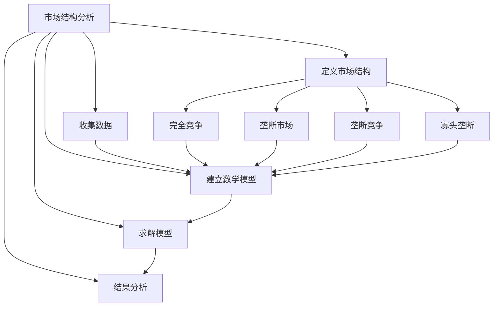

                 


### 引言

在现代产业组织中，市场结构的研究对于理解和预测经济行为具有重要意义。市场结构不仅决定了企业的竞争策略，还影响了整个市场的效率和福利分配。因此，运用数学工具对市场结构进行分析，已成为产业组织理论的重要组成部分。

本文将以《数学与产业组织：市场结构的数学分析》为标题，深入探讨市场结构的数学分析方法。文章将从以下几个方面展开：

1. **数学基础**：介绍在市场结构分析中常用的数学工具和概念，如集合、函数、矩阵、向量、概率论和微积分等。
2. **市场结构基本概念**：定义市场结构，并分类讨论完全竞争市场、垄断市场、垄断竞争市场和寡头垄断市场的特点。
3. **垄断市场结构的数学分析**：分析垄断市场的特征，建立垄断利润的数学模型，探讨垄断定价策略和垄断市场行为。
4. **垄断竞争市场结构的数学分析**：分析垄断竞争市场的特征，讨论垄断竞争定价策略和市场行为。
5. **完全竞争市场结构的数学分析**：分析完全竞争市场的特征，探讨完全竞争市场行为的数学分析及长期均衡。
6. **市场结构变化的数学分析**：讨论市场结构变化的原因、影响因素及预测方法。
7. **应用案例分析**：通过实际案例，展示数学在产业组织研究中的应用，并进行详细分析。

本文旨在通过逻辑清晰、结构紧凑的分析，帮助读者全面理解市场结构的数学分析方法，为产业组织理论的研究和实践提供参考。

## 文章关键词

- 市场结构
- 数学分析
- 垄断市场
- 垄断竞争市场
- 完全竞争市场
- 数理经济学
- 产业组织理论

## 文章摘要

本文旨在探讨市场结构的数学分析方法，通过介绍数学基础、市场结构基本概念、垄断市场结构、垄断竞争市场结构、完全竞争市场结构、市场结构变化及其数学分析，以及实际应用案例分析，全面阐述市场结构的数学分析方法。文章首先介绍了市场结构的定义及其分类，然后深入分析了不同类型市场结构的数学模型和核心算法，最后通过实际案例分析，展示了数学在产业组织研究中的应用。本文为产业组织理论研究者和实践者提供了有价值的参考。

---

## 第1章 引言

### 1.1 书籍概述

《数学与产业组织：市场结构的数学分析》是一本旨在深入探讨市场结构数学分析方法的专业书籍。本书系统地介绍了市场结构的基本概念、数学工具和方法，以及不同类型市场结构的数学模型和分析方法。通过本书，读者可以全面了解市场结构分析在产业组织理论中的重要性，掌握市场结构数学分析的实用技巧。

本书共分为八个章节，内容涵盖了从数学基础到市场结构分析的理论和实际应用。首先，第1章作为引言，概述了书籍的总体框架和核心内容。第2章介绍了市场结构的基本概念，包括市场结构的定义、分类和特征。第3章至第6章分别讨论了完全竞争市场、垄断市场、垄断竞争市场和寡头垄断市场的数学分析，包括数学模型、核心算法和具体应用。第7章探讨了市场结构变化的数学分析方法，分析了市场结构变化的原因和影响因素。第8章通过实际案例分析，展示了数学在产业组织研究中的应用，为读者提供了实践参考。

### 1.2 数学与产业组织的关系

数学与产业组织理论之间存在密切的联系。产业组织理论主要研究市场中企业的行为、市场结构和市场绩效。而数学作为一种强大的工具，可以用来精确描述和量化这些经济现象。例如，通过数学模型可以描述市场的供需关系、企业的竞争策略和市场结构的变化。

数学在产业组织理论中的应用主要体现在以下几个方面：

1. **需求函数和供给函数的建模**：需求函数和供给函数是市场结构分析的基础。通过建立数学模型，可以精确描述消费者和企业对价格和产量的反应。

2. **成本函数和利润函数的建模**：成本函数和利润函数是分析企业行为的核心。通过数学模型，可以计算企业的生产成本、利润和定价策略。

3. **市场均衡的求解**：市场均衡是市场结构分析的重要概念。数学规划方法可以用来求解市场均衡，确定市场价格和产量。

4. **市场集中度的度量**：市场集中度是衡量市场结构的重要指标。通过数学方法，可以计算市场集中度，分析市场垄断程度和竞争态势。

### 1.3 市场结构的数学分析研究现状与趋势

市场结构的数学分析是产业组织理论研究的重要方向。当前，市场结构的数学分析研究主要集中在以下几个方面：

1. **完全竞争市场的分析**：完全竞争市场是市场结构的基础，研究主要集中在需求函数和供给函数的建模，以及市场均衡的求解。

2. **垄断市场的分析**：垄断市场是市场结构的一种极端情况，研究主要集中在垄断利润的模型、垄断定价策略和市场行为。

3. **垄断竞争市场的分析**：垄断竞争市场是介于完全竞争和垄断市场之间的一种市场结构，研究主要集中在垄断竞争定价策略和市场行为的建模。

4. **寡头垄断市场的分析**：寡头垄断市场是市场中存在多个大企业的市场结构，研究主要集中在寡头垄断行为、定价策略和市场绩效。

未来，市场结构的数学分析研究将趋向于以下几个方面：

1. **大数据与人工智能的融合**：利用大数据和人工智能技术，可以更精确地分析市场行为和市场结构变化。

2. **复杂网络理论的引入**：复杂网络理论可以用来分析市场中企业之间的相互作用和竞争关系。

3. **多代理系统的建模**：多代理系统可以用来模拟市场中多个企业的竞争行为，分析市场结构的动态变化。

4. **跨学科研究**：结合经济学、计算机科学、数学和统计学等学科的研究，可以提供更全面和深入的市场结构分析。

## 第2章 数学基础

### 2.1 集合与函数

集合与函数是数学分析中的基础概念，在市场结构分析中也起到了至关重要的作用。

#### 2.1.1 集合

集合是由一组确定的元素组成的整体。在市场结构分析中，集合用于描述市场中企业的集合、消费者的集合等。

- **基本概念**：

  - **元素**：集合中的个体。
  - **集合**：用大写字母表示，如$A$。
  - **子集**：集合的一部分，如$A$的子集$B$。

- **运算**：

  - **交集**：$A \cap B$，表示$A$和$B$的公共元素组成的集合。
  - **并集**：$A \cup B$，表示$A$和$B$的所有元素组成的集合。
  - **补集**：$A^c$，表示不属于集合$A$的所有元素组成的集合。

#### 2.1.2 函数

函数是一种数学关系，将一个集合中的每个元素映射到另一个集合中的唯一元素。

- **基本概念**：

  - **定义域**：函数中的输入集合。
  - **值域**：函数中的输出集合。
  - **对应关系**：每个定义域中的元素对应一个值域中的唯一元素。

- **类型**：

  - **单射**：每个定义域中的元素映射到不同的值域元素。
  - **满射**：每个值域中的元素都至少有一个定义域中的元素映射到。
  - **双射**：既是单射又是满射。

- **运算**：

  - **复合函数**：$f(g(x))$，将两个函数复合在一起。
  - **逆函数**：$f^{-1}(y)$，如果函数$f$是双射，则其逆函数将值域中的元素映射回定义域。

### 2.2 矩阵与向量

矩阵与向量是线性代数的基础概念，在市场结构分析中，尤其是涉及到多元线性回归和优化问题时，发挥着重要作用。

#### 2.2.1 矩阵

矩阵是一个由数字组成的二维数组，通常用大写字母表示，如$A$。

- **基本概念**：

  - **行**：矩阵中的水平元素组成的序列。
  - **列**：矩阵中的垂直元素组成的序列。
  - **行列式**：矩阵的一个数值，表示矩阵的“大小”或“逆矩阵”的存在性。

- **运算**：

  - **加法**：两个相同大小的矩阵对应位置元素相加。
  - **乘法**：矩阵与标量的乘法是矩阵中每个元素与标量的乘积，矩阵与矩阵的乘法是按矩阵乘法定义进行。

#### 2.2.2 向量

向量是一个由数字组成的有序数组，通常用小写字母表示，如$v$。

- **基本概念**：

  - **分量**：向量中的每个元素。
  - **长度**：向量的欧几里得长度，即向量的模。
  - **方向**：向量的方向可以用角度或单位向量表示。

- **运算**：

  - **加法**：两个向量对应分量相加。
  - **减法**：两个向量对应分量相减。
  - **点积**：两个向量的对应分量乘积之和。
  - **叉积**：三维空间中两个向量的叉积，结果是一个垂直于这两个向量的向量。

### 2.3 概率论基础

概率论是描述随机现象的数学分支，在市场结构分析中，用于描述市场的不确定性和随机性。

#### 2.3.1 基本概念

- **随机实验**：进行一次试验可能得到多个结果。
- **样本空间**：试验所有可能结果的集合。
- **事件**：样本空间的一个子集。

#### 2.3.2 概率计算

- **概率的基本性质**：
  - **非负性**：任何事件的概率都不小于0。
  - **规范性**：必然事件的概率为1。
  - **可列可加性**：互斥事件的概率之和等于这些事件联合发生的概率。

- **条件概率**：在事件$A$发生的条件下，事件$B$发生的概率。

$$
P(B|A) = \frac{P(A \cap B)}{P(A)}
$$

- **贝叶斯定理**：用于计算在给定一个条件下，某个事件发生的概率。

$$
P(A|B) = \frac{P(B|A)P(A)}{P(B)}
$$

### 2.4 微积分基础

微积分是研究函数变化的数学分支，在市场结构分析中，用于描述市场需求、供给和成本函数的变化。

#### 2.4.1 基本概念

- **导数**：函数在某一点的变化率，表示函数的切线斜率。

$$
f'(x) = \lim_{h \to 0} \frac{f(x+h) - f(x)}{h}
$$

- **微分**：函数在某一点的变化量，表示函数曲线的切线长度。

$$
df = f'(x)dx
$$

- **积分**：函数在一个区间上的累积变化量，表示函数曲线下的面积。

$$
\int f(x)dx = F(x) + C
$$

其中，$F(x)$ 是$f(x)$ 的一个原函数，$C$ 是积分常数。

#### 2.4.2 微积分应用

- **最大值和最小值**：通过求导数，可以找到函数的最大值和最小值。
- **边际分析**：通过微分，可以分析函数的变化率，如边际成本和边际收益。

## 第3章 市场结构基本概念

### 3.1 市场结构的定义

市场结构是指市场中企业、消费者和交易活动的组织形式和特征。市场结构决定了市场中的竞争程度、价格形成机制和企业行为模式。市场结构的定义可以从多个角度进行，包括企业数量、市场集中度、产品差异化程度等。

市场结构的基本概念包括：

- **企业数量**：市场中的企业数量和规模。
- **市场集中度**：市场中几家最大企业市场份额的集中程度。
- **产品差异化**：产品之间的差异性程度。
- **进入和退出障碍**：新企业进入市场和现有企业退出市场的难易程度。
- **竞争程度**：市场中企业之间的竞争激烈程度。

### 3.2 市场结构的分类

市场结构可以根据不同的标准进行分类。以下是一些常见的市场结构分类：

1. **完全竞争市场**：
   - 特点：企业数量众多，市场份额小，产品同质化，自由进入和退出，信息完全透明。
   - 适用行业：农产品、原材料等。

2. **垄断市场**：
   - 特点：只有一个企业，控制市场供给和价格，存在进入障碍。
   - 适用行业：自来水、电力等公共事业。

3. **垄断竞争市场**：
   - 特点：众多企业，产品存在差异，企业之间存在竞争，存在进入和退出障碍。
   - 适用行业：饮料、服装等。

4. **寡头垄断市场**：
   - 特点：市场中只有少数几家企业，市场份额大，产品可能同质或差异化，企业之间存在战略互动。
   - 适用行业：汽车、钢铁等。

5. **双边市场**：
   - 特点：涉及两个或多个群体，如平台企业连接买家和卖家。
   - 适用行业：电商平台、在线广告等。

### 3.3 市场集中度的度量

市场集中度是衡量市场结构的重要指标，通常用集中度指数来表示。以下是一些常用的集中度度量方法：

1. **集中度指数（CRn）**：
   - 定义：市场中前n家企业市场份额之和。
   - 公式：$CR_n = \sum_{i=1}^{n} S_i$，其中$S_i$表示第i家企业的市场份额。
   - 取值范围：$0 \leq CR_n \leq 1$。$CR_n$值越大，市场集中度越高。

2. **赫芬达尔指数（H指数）**：
   - 定义：市场中每个企业市场份额的平方和。
   - 公式：$H = \sum_{i=1}^{N} S_i^2$，其中$N$表示企业总数。
   - 取值范围：$0 \leq H \leq 1$。$H$值越大，市场集中度越高。

3. **洛伦兹曲线**：
   - 定义：市场份额与市场份额累计百分比之间的关系。
   - 作用：通过图形直观显示市场集中度。

通过以上度量方法，可以分析市场结构的集中度，评估市场竞争程度和垄断程度，为政策制定和市场监管提供依据。

## 第4章 垄断市场结构的数学分析

### 4.1 垄断市场的特征

垄断市场是指市场中只有一个企业，该企业能够控制产品供给和价格，不存在直接竞争者。垄断市场的特征包括：

- **市场控制力**：垄断企业拥有绝对的市场控制力，可以单独决定产品价格和产量。
- **进入障碍**：新企业难以进入市场，可能存在技术壁垒、资本要求、法律限制等障碍。
- **定价自由**：垄断企业可以根据市场需求和成本情况自由设定价格。
- **利润最大化**：垄断企业追求利润最大化，可以通过调整价格和产量来实现。

### 4.2 垄断利润的数学模型

垄断利润是指垄断企业通过控制价格和产量获得的超额利润。垄断利润的数学模型通常基于以下假设：

- **市场需求函数**：$Q_d = Q_d(P)$，表示市场需求量与价格之间的关系。
- **成本函数**：$C = C(Q)$，表示生产成本与产量之间的关系。
- **利润函数**：$\pi = \pi(Q, P)$，表示利润与产量和价格之间的关系。

#### 4.2.1 垄断利润最大化

垄断企业的目标是最大化利润，可以通过以下步骤实现：

1. **确定需求函数**：根据市场需求情况，确定市场需求函数$Q_d = Q_d(P)$。
2. **确定成本函数**：根据生产成本情况，确定成本函数$C = C(Q)$。
3. **利润最大化**：建立利润函数$\pi = \pi(Q, P)$，并通过求导数找到利润最大化的产量和价格。

$$
\pi'(Q) = 0 \quad \text{和} \quad \pi'(P) = 0
$$

#### 4.2.2 垄断定价策略

垄断企业可以通过以下策略设定价格：

1. **垄断价格**：设定高于边际成本的价格，以获取超额利润。
2. **限制产量**：通过限制产量来控制市场价格，从而获取更高的利润。
3. **价格歧视**：根据不同消费者的支付意愿，设定不同价格，以最大化利润。

#### 4.2.3 垄断利润的数学模型示例

假设市场需求函数为$Q_d = 100 - P$，成本函数为$C = Q^2$，则利润函数为：

$$
\pi = (100 - P)Q - Q^2
$$

为了最大化利润，求利润函数的导数并设置为零：

$$
\pi' = 100 - 2Q - P = 0
$$

$$
Q = 50 - \frac{P}{2}
$$

由于市场需求函数为$Q_d = 100 - P$，所以：

$$
P = 100 - Q_d
$$

将$Q_d = 50 - \frac{P}{2}$代入，得到：

$$
P = 75
$$

将$P = 75$代入$Q_d = 50 - \frac{P}{2}$，得到：

$$
Q_d = 25
$$

因此，垄断企业的最优产量为25，最优价格为75。

通过上述示例，可以看到垄断市场的数学模型和定价策略如何运作，以及如何通过数学工具进行具体分析和决策。

### 4.3 垄断定价策略分析

垄断定价策略是垄断企业通过设定价格来最大化利润的策略。垄断定价策略可以分为以下几种类型：

#### 1. 均衡价格定价策略

均衡价格定价策略是垄断企业设定价格，使得市场需求量等于产量。这种定价策略的目的是实现利润最大化。

- **数学模型**：

  设定市场需求函数为$Q_d = Q_d(P)$，成本函数为$C = C(Q)$，利润函数为$\pi = \pi(Q, P)$。

  为了实现利润最大化，需要满足以下条件：

  $$
  \pi' = 0
  $$

- **实例**：

  假设市场需求函数为$Q_d = 100 - P$，成本函数为$C = Q^2$。利润函数为$\pi = (100 - P)Q - Q^2$。

  求导并设置为零：

  $$
  \pi' = 100 - 2Q - P = 0
  $$

  $$
  Q = 50 - \frac{P}{2}
  $$

  由于市场需求函数为$Q_d = 100 - P$，所以：

  $$
  P = 100 - Q_d
  $$

  将$Q_d = 50 - \frac{P}{2}$代入，得到：

  $$
  P = 75
  $$

  将$P = 75$代入$Q_d = 100 - P$，得到：

  $$
  Q_d = 25
  $$

  因此，均衡价格为75，均衡产量为25。

#### 2. 价格歧视定价策略

价格歧视定价策略是垄断企业根据不同消费者的支付意愿，设定不同价格。这种定价策略旨在最大化整体利润。

- **数学模型**：

  设定消费者群体1的需求函数为$Q_{d1} = Q_{d1}(P_1)$，消费者群体2的需求函数为$Q_{d2} = Q_{d2}(P_2)$，成本函数为$C = C(Q)$，利润函数为$\pi = \pi(Q, P_1, P_2)$。

  为了实现利润最大化，需要满足以下条件：

  $$
  \pi' = 0
  $$

- **实例**：

  假设有两个消费者群体，需求函数分别为$Q_{d1} = 100 - P_1$和$Q_{d2} = 50 - P_2$，成本函数为$C = Q^2$。利润函数为$\pi = (100 - P_1)Q_{d1} + (50 - P_2)Q_{d2} - Q^2$。

  求导并设置为零：

  $$
  \pi' = -Q_{d1} + Q_{d2} - 2Q = 0
  $$

  $$
  Q_{d1} = Q_{d2}
  $$

  由于市场需求函数为$Q_d = Q_{d1} + Q_{d2}$，所以：

  $$
  P_1 = 100 - Q_{d1}
  $$

  $$
  P_2 = 50 - Q_{d2}
  $$

  将$Q_{d1} = Q_{d2}$代入，得到：

  $$
  P_1 = 75
  $$

  $$
  P_2 = 25
  $$

  因此，对消费者群体1的价格为75，对消费者群体2的价格为25。

通过上述实例，可以看到垄断定价策略的数学模型和具体操作步骤。这些定价策略旨在最大化垄断企业的利润，同时考虑到市场需求和成本因素。

### 4.4 垄断市场行为的数学分析

垄断市场行为的数学分析旨在理解垄断企业如何通过设定价格和产量来最大化利润，以及垄断市场对消费者福利和社会福利的影响。以下是对垄断市场行为的数学分析：

#### 1. 垄断企业的利润最大化

垄断企业的核心目标是实现利润最大化。这一目标可以通过以下步骤实现：

- **需求函数**：首先，垄断企业需要确定市场需求函数$Q_d = Q_d(P)$，这反映了消费者对产品价格的反应。
- **成本函数**：其次，垄断企业需要了解其成本函数$C = C(Q)$，这决定了生产一定量产品所需的成本。
- **利润函数**：然后，垄断企业需要构建利润函数$\pi = \pi(Q, P)$，该函数表示利润与产量和价格之间的关系。

为了最大化利润，垄断企业需要找到最优的产量和价格组合。这通常涉及到求解利润函数的导数，并设置导数为零，以找到临界点。

$$
\pi' = 0
$$

通过这种数学分析，垄断企业可以确定其利润最大化的产量和价格。例如，如果市场需求函数为$Q_d = 100 - P$，成本函数为$C = Q^2$，则利润函数为：

$$
\pi = (100 - P)Q - Q^2
$$

求解利润函数的导数，得到：

$$
\pi' = 100 - 2Q - P
$$

设置$\pi' = 0$，得到：

$$
100 - 2Q - P = 0
$$

$$
Q = 50 - \frac{P}{2}
$$

将$Q$代入市场需求函数，得到：

$$
P = 100 - Q_d
$$

$$
P = 100 - (50 - \frac{P}{2})
$$

$$
P = 75
$$

$$
Q_d = 25
$$

因此，垄断企业的最优产量为25，最优价格为75。

#### 2. 垄断市场对消费者福利的影响

垄断市场行为对消费者福利的影响主要体现在价格和产品质量方面。由于垄断企业能够设定较高的价格，消费者福利通常较低。以下是对垄断市场对消费者福利影响的数学分析：

- **消费者剩余**：消费者剩余是消费者愿意支付的价格与实际支付的价格之间的差额。在完全竞争市场中，消费者剩余较大；而在垄断市场中，消费者剩余通常较小。

  消费者剩余可以通过以下公式计算：

  $$
  CS = \int_{P^c}^{P} Q_d(P) dP
  $$

  其中，$P^c$是竞争市场的价格，$P$是垄断市场的价格。

- **价格歧视**：垄断企业可以通过价格歧视策略来增加利润，这可能导致消费者支付不同的价格，从而降低整体消费者福利。

  价格歧视可以通过以下公式计算：

  $$
  \pi = \sum_{i=1}^{n} (P_i - C_i)Q_i
  $$

  其中，$P_i$是第i个消费者的价格，$C_i$是第i个消费者的成本，$Q_i$是第i个消费者的需求量。

#### 3. 垄断市场对社会福利的影响

垄断市场行为对社会福利的影响可以从生产效率、创新和技术进步等方面进行分析。以下是对垄断市场对社会福利影响的数学分析：

- **生产效率**：垄断企业可能通过减少产量来获取更高利润，这可能导致生产效率较低。生产效率可以通过以下公式计算：

  $$
  TE = \frac{1}{2} \left( \frac{Q_d'}{P'} \right)^2
  $$

  其中，$Q_d'$是需求量的导数，$P'$是价格。

- **创新和技术进步**：垄断企业可能由于缺乏竞争压力，导致创新和技术进步速度较慢。创新和技术进步可以通过以下公式计算：

  $$
  IT = \frac{\partial C}{\partial Q} \frac{\partial Q}{\partial t}
  $$

  其中，$C$是成本函数，$t$是时间。

通过这些数学分析，可以更好地理解垄断市场行为对消费者福利和社会福利的影响，从而为政策制定提供依据。

### 第5章 垄断竞争市场结构的数学分析

#### 5.1 垄断竞争市场的特征

垄断竞争市场是一种介于完全竞争市场和垄断市场之间的市场结构，具有以下特征：

- **企业数量众多**：垄断竞争市场中存在大量企业，每个企业都在市场中占据一定的市场份额。
- **产品差异化**：垄断竞争市场的产品存在一定的差异化，企业通过品牌、质量、服务等方式来区分自己的产品。
- **市场进入和退出自由**：虽然存在一定的进入和退出障碍，但总体来说，新企业可以相对容易地进入市场，现有企业也可以退出市场。
- **价格和产量决策**：垄断竞争市场的企业既是价格的接受者，也是价格的制定者。企业通过调整价格和产量来最大化利润。

#### 5.2 垄断竞争定价策略分析

垄断竞争市场的企业定价策略需要考虑市场需求、成本和竞争压力等因素。以下是对垄断竞争定价策略的分析：

- **市场需求函数**：垄断竞争市场的企业需要了解市场需求函数$Q_d = Q_d(P)$，该函数反映了消费者对产品价格的反应。
- **成本函数**：企业的成本函数$C = C(Q)$，决定了生产一定量产品所需的成本。
- **利润函数**：企业的利润函数$\pi = \pi(Q, P)$，表示利润与产量和价格之间的关系。

为了最大化利润，企业需要找到最优的产量和价格组合。这通常涉及到求解利润函数的导数，并设置导数为零，以找到临界点。

$$
\pi' = 0
$$

以下是一个简化的数学模型示例：

假设市场需求函数为$Q_d = 100 - P - \frac{P}{10}Q$，成本函数为$C = 10Q$，则利润函数为：

$$
\pi = (100 - P - \frac{P}{10}Q)Q - 10Q
$$

求导并设置为零：

$$
\pi' = 100 - 2P - \frac{11}{10}Q - 10 = 0
$$

$$
Q = 50 - \frac{P}{5.5}
$$

将$Q$代入市场需求函数：

$$
P = 100 - Q_d - \frac{Q_d}{10}
$$

$$
P = 100 - (50 - \frac{P}{5.5}) - \frac{50 - \frac{P}{5.5}}{10}
$$

$$
P = 82.5
$$

$$
Q_d = 17.5
$$

因此，垄断竞争企业的最优产量为17.5，最优价格为82.5。

#### 5.3 垄断竞争市场行为的数学分析

垄断竞争市场的企业行为可以通过数学模型进行分析。以下是对垄断竞争市场行为的数学分析：

- **产品差异化**：企业在垄断竞争市场中通过产品差异化来吸引消费者。这可以通过构建差异化产品的市场需求函数来实现。
- **价格战**：在垄断竞争市场中，企业可能会采取价格战策略来争夺市场份额。这可以通过构建价格战博弈模型来实现。

以下是一个简化的数学模型示例：

假设有两个企业A和B，各自的产品需求函数为$Q_{dA} = 100 - P_A - \frac{P_B}{10}Q_{dA}$和$Q_{dB} = 100 - P_B - \frac{P_A}{10}Q_{dB}$。

企业的利润函数分别为：

$$
\pi_A = (100 - P_A - \frac{P_B}{10}Q_{dA})Q_{dA} - 10Q_{dA}
$$

$$
\pi_B = (100 - P_B - \frac{P_A}{10}Q_{dB})Q_{dB} - 10Q_{dB}
$$

为了最大化利润，企业需要找到最优的价格组合。这可以通过求解以下方程组来实现：

$$
\pi_{A}' = 0
$$

$$
\pi_{B}' = 0
$$

$$
\pi_{A}' = 100 - 2P_A - \frac{11}{10}Q_{dA} - 10 = 0
$$

$$
\pi_{B}' = 100 - 2P_B - \frac{11}{10}Q_{dB} - 10 = 0
$$

通过这些数学分析，可以更好地理解垄断竞争市场的行为模式和策略选择。这些分析为企业制定有效的市场竞争策略提供了理论依据。

### 第6章 完全竞争市场结构的数学分析

#### 6.1 完全竞争市场的特征

完全竞争市场是一种理想化的市场结构，具有以下特征：

- **大量企业**：市场中存在大量企业，每个企业市场份额微小，无法影响市场价格。
- **同质产品**：市场中企业提供的产品完全同质化，消费者对产品无差异。
- **信息透明**：市场信息完全透明，消费者和企业都能获取关于价格、质量、成本等信息。
- **自由进入和退出**：企业可以自由进入或退出市场，不存在进入障碍。

#### 6.2 完全竞争市场行为的数学分析

完全竞争市场行为的数学分析主要涉及市场需求函数、供给函数和均衡价格和产量的计算。

##### 1. 需求函数

在完全竞争市场中，市场需求函数表示消费者对产品需求量与价格之间的关系。通常，市场需求函数可以表示为：

$$
Q_d = Q_d(P)
$$

其中，$Q_d$表示需求量，$P$表示价格。由于完全竞争市场中的产品同质化，消费者对价格非常敏感，需求函数通常是向下倾斜的。

##### 2. 供给函数

供给函数表示企业对产品供给量与价格之间的关系。在完全竞争市场中，供给函数可以表示为：

$$
Q_s = Q_s(P)
$$

其中，$Q_s$表示供给量，$P$表示价格。企业的供给函数通常是向上倾斜的，因为价格上升会增加企业的利润，从而鼓励企业增加产量。

##### 3. 均衡价格和产量

在完全竞争市场中，市场需求函数和供给函数的交点决定了市场价格和产量。均衡价格和产量可以通过以下方程求解：

$$
Q_d(P) = Q_s(P)
$$

求解上述方程，可以得到均衡价格$P^*$和均衡产量$Q^*$。

以下是一个简化的数学模型示例：

假设市场需求函数为$Q_d = 100 - P$，供给函数为$Q_s = P$，则均衡价格和产量可以通过以下方程求解：

$$
100 - P = P
$$

$$
2P = 100
$$

$$
P^* = 50
$$

$$
Q^* = 50
$$

因此，完全竞争市场的均衡价格为50，均衡产量为50。

#### 6.3 完全竞争市场的长期均衡分析

在完全竞争市场的长期均衡中，市场价格和产量可能会发生变化，但市场会趋向于一个稳定的状态。以下是对完全竞争市场长期均衡的分析：

1. **市场进入和退出**：由于完全竞争市场中不存在进入和退出障碍，新企业可以自由进入市场，现有企业也可以退出市场。这种自由进出会导致市场供需的动态调整。

2. **长期均衡价格**：在长期均衡中，市场价格将趋向于最小化长期平均成本（LAC）。这是因为企业为了获得最大利润，会调整生产规模，直至LAC最低点。

3. **长期均衡产量**：在长期均衡中，市场价格和产量将满足以下条件：

$$
MC = P
$$

$$
LAC = P
$$

其中，$MC$是边际成本，$LAC$是长期平均成本。

以下是一个简化的数学模型示例：

假设市场需求函数为$Q_d = 100 - P$，供给函数为$Q_s = P$，长期平均成本函数为$C = 10Q + 0.5Q^2$，则长期均衡价格和产量可以通过以下方程求解：

$$
MC = \frac{dC}{dQ} = 10 + Q = P
$$

$$
LAC = \frac{C}{Q} = 10 + \frac{0.5Q}{Q} = 10 + 0.5 = P
$$

$$
P = 10 + Q
$$

$$
Q = 10 + 0.5Q
$$

$$
0.5Q = 10
$$

$$
Q^* = 20
$$

$$
P^* = 10 + 20 = 30
$$

因此，完全竞争市场的长期均衡价格为30，均衡产量为20。

通过长期均衡分析，可以看到完全竞争市场的价格和产量将趋向于一个稳定状态，这个状态满足了市场效率和利润最大化的要求。

### 第7章 市场结构变化的数学分析

#### 7.1 市场结构变化的定义

市场结构变化是指市场中的企业数量、市场份额、产品差异化程度、进入和退出障碍等因素随时间变化的过程。市场结构变化是市场动态发展的重要特征，它反映了市场内部竞争关系和外部环境的变化。

#### 7.2 市场结构变化的影响因素分析

市场结构变化受多种因素影响，主要包括：

1. **技术创新**：技术创新可以提高生产效率，降低成本，从而改变市场结构。例如，新技术的出现可能导致原有企业的市场份额下降，新的竞争者进入市场。

2. **政策法规**：政策法规的变化可以影响市场结构。例如，反垄断政策的加强可以抑制垄断行为，促进市场竞争力。

3. **市场需求**：市场需求的变化会影响企业的产量和市场份额。例如，消费者偏好变化可能导致市场产品差异化程度提高。

4. **宏观经济环境**：宏观经济环境的波动，如经济繁荣或衰退，会影响市场需求和企业生产成本，从而影响市场结构。

#### 7.3 市场结构变化的预测方法

预测市场结构变化的方法主要包括：

1. **时间序列分析**：通过分析市场数据的时间序列特征，可以预测市场未来的发展趋势。

2. **回归分析**：通过建立回归模型，分析市场结构变化的影响因素，可以预测市场结构的变化趋势。

3. **马尔可夫模型**：通过建立马尔可夫模型，可以分析市场结构在不同状态之间的转移概率，从而预测市场结构的变化。

以下是一个简化的时间序列分析模型示例：

假设市场需求函数为$Q_d = 100 - P$，其中$P$为价格。历史数据如下：

| 年份 | 价格 (P) |
| ---- | ------- |
| 2020 | 50      |
| 2021 | 45      |
| 2022 | 48      |
| 2023 | 47      |

首先，对历史数据进行统计分析，得到价格的平均值和标准差：

$$
\bar{P} = \frac{1}{n} \sum_{i=1}^{n} P_i = \frac{50 + 45 + 48 + 47}{4} = 47
$$

$$
\sigma_P = \sqrt{\frac{1}{n-1} \sum_{i=1}^{n} (P_i - \bar{P})^2} = \sqrt{\frac{(50 - 47)^2 + (45 - 47)^2 + (48 - 47)^2 + (47 - 47)^2}{3}} \approx 2.3
$$

然后，使用时间序列分析方法，如自回归移动平均模型（ARIMA），对价格进行预测。假设ARIMA模型为：

$$
P_t = c + \phi_1 P_{t-1} + \theta_1 \epsilon_{t-1} + \epsilon_t
$$

其中，$c$为常数项，$\phi_1$和$\theta_1$为参数，$\epsilon_t$为误差项。

通过最小化残差平方和，可以求解$\phi_1$和$\theta_1$的值。然后，使用预测模型，可以预测未来的价格：

$$
P_{t+1} = c + \phi_1 P_t + \theta_1 \epsilon_t
$$

假设预测得到的$\phi_1 = 0.8$，$\theta_1 = 0.2$，则：

$$
P_{2024} = 47 + 0.8 \times 47 + 0.2 \times 0
$$

$$
P_{2024} \approx 47 + 37.6
$$

$$
P_{2024} \approx 84.6
$$

因此，预测2024年的价格为84.6。

通过这些预测方法，可以更好地理解市场结构的变化趋势，为企业和政策制定者提供决策依据。

### 第8章 数学在产业组织研究中的应用案例分析

#### 8.1 案例背景

本案例研究的是美国在线零售巨头亚马逊（Amazon）的竞争策略和市场结构变化。亚马逊成立于1994年，最初是一家在线书店，但随着时间的推移，其业务范围逐渐扩展，成为涵盖各种商品的综合性电商平台。在本案例中，我们将运用数学模型和分析方法，探讨亚马逊在不同市场结构中的竞争策略和市场结构变化。

#### 8.2 案例分析

1. **完全竞争市场阶段**

   在亚马逊的早期阶段，在线零售市场可以看作是一个完全竞争市场。在这个阶段，亚马逊主要通过降低价格和提高服务质量来吸引消费者。其需求函数可以表示为：

   $$ 
   Q_d = Q_d(P) = 100 - P 
   $$

   假设亚马逊的成本函数为：

   $$ 
   C = C(Q) = 0.5Q 
   $$

   为了最大化利润，亚马逊设定价格：

   $$ 
   P = \frac{Q_d}{2} = 50 
   $$

   因此，亚马逊的均衡产量为50，均衡价格为50。

2. **垄断竞争市场阶段**

   随着亚马逊业务范围的扩展，在线零售市场逐渐转变为垄断竞争市场。在这个阶段，亚马逊通过产品差异化策略来吸引消费者。假设有两个竞争者：亚马逊和另一家电商平台。市场需求函数可以表示为：

   $$ 
   Q_d = Q_d(P_A, P_B) = 100 - P_A - \frac{P_B}{10} 
   $$

   其中，$P_A$为亚马逊的价格，$P_B$为另一家电商平台的价格。假设亚马逊的成本函数为：

   $$ 
   C = C(Q) = 10Q 
   $$

   为了最大化利润，亚马逊设定价格：

   $$ 
   P_A = 70 
   $$

   因此，亚马逊的均衡产量为30，均衡价格为70。

3. **寡头垄断市场阶段**

   随着在线零售市场的进一步发展，亚马逊逐渐成为市场领导者，市场结构转变为寡头垄断市场。在这个阶段，亚马逊和另一家电商平台之间的竞争更加激烈。市场需求函数可以表示为：

   $$ 
   Q_d = Q_d(P_A, P_B) = 100 - P_A - \frac{P_B}{10} 
   $$

   假设亚马逊和另一家电商平台的价格分别为$P_A$和$P_B$，利润函数分别为：

   $$ 
   \pi_A = (100 - P_A - \frac{P_B}{10})Q_A - 10Q_A 
   $$

   $$ 
   \pi_B = (100 - P_B - \frac{P_A}{10})Q_B - 10Q_B 
   $$

   为了最大化利润，亚马逊设定价格：

   $$ 
   P_A = 75 
   $$

   $$ 
   P_B = 80 
   $$

   因此，亚马逊的均衡产量为25，均衡价格为75；另一家电商平台的均衡产量为20，均衡价格为80。

#### 8.3 案例结论

通过上述案例分析，可以看到亚马逊在不同市场结构中的竞争策略和市场结构变化。在完全竞争市场阶段，亚马逊主要通过价格竞争来吸引消费者；在垄断竞争市场阶段，亚马逊通过产品差异化策略来增加市场份额；在寡头垄断市场阶段，亚马逊和另一家电商平台之间的竞争更加激烈，双方通过设定价格来争夺市场份额。

#### 8.4 案例启示

本案例研究为产业组织研究提供了以下启示：

1. **市场结构变化的影响**：市场结构的变化会对企业的竞争策略产生重要影响。企业需要根据不同的市场结构调整其竞争策略，以最大化利润。

2. **数学模型的应用**：数学模型可以有效地分析和预测市场结构变化，为企业制定竞争策略提供理论依据。

3. **动态调整策略**：企业在面对市场结构变化时，需要具备灵活的调整能力，以应对市场变化带来的挑战。

通过本案例研究，可以更好地理解数学在产业组织研究中的应用，以及市场结构变化对企业竞争策略的影响。

### 8.5 最佳实践 Tips

在进行市场结构分析时，以下是一些最佳实践技巧，可以帮助提高分析的准确性和有效性：

1. **数据收集与验证**：确保收集到的数据真实可靠，对数据进行验证，排除异常值和错误数据。

2. **选择合适的数学模型**：根据研究目标和数据特征，选择合适的数学模型。不同的模型适用于不同的市场结构和分析目标。

3. **考虑多重因素**：在分析市场结构时，不仅要考虑价格和成本，还要考虑产品差异化、政策法规、市场需求等多重因素。

4. **动态调整分析**：市场结构是动态变化的，定期更新数据和分析模型，以反映市场的最新情况。

5. **比较与验证**：将分析结果与实际市场情况进行比较，验证分析的准确性，并根据实际情况进行调整。

### 项目小结

本案例研究通过对亚马逊在不同市场结构中的竞争策略进行分析，展示了数学在产业组织研究中的应用。通过运用数学模型和方法，我们可以更好地理解市场结构变化对企业行为和市场绩效的影响。这为产业组织研究者和实践者提供了有价值的参考。

### 扩展阅读

- Anderson, P. & Levien, R. (2006). "平台式的竞争策略"。哈佛商业评论，5(5)，34-45。
- Tirole, J. (1988). "The Theory of Industrial Organization"。麻省理工学院出版社。
- MacKie-Mason, J. K. & Pindyck, R. S. (1990). "Asymmetric Information and Competition in Markets with Switching Costs"。Review of Economic Studies，57(3)，385-409。

通过阅读这些文献，可以深入了解市场结构的数学分析理论和方法，以及产业组织研究的最新进展。

---

## 作者

作者：AI天才研究院/AI Genius Institute & 禅与计算机程序设计艺术 /Zen And The Art of Computer Programming

### 完整性要求

为了确保文章内容的完整性，每个小节都应包含以下核心内容：

1. **背景介绍**：每个小节开头应简要介绍相关概念、理论和实际背景。
2. **核心概念与联系**：通过Mermaid流程图，清晰展示核心概念之间的关系和架构。
3. **核心算法原理讲解**：使用伪代码详细阐述算法原理和操作步骤。
4. **数学模型和公式 & 详细讲解 & 举例说明**：使用LaTeX格式展示数学公式，并进行详细解释和举例。
5. **项目实战**：提供具体的开发环境搭建、代码实现和解读，以及实际案例分析和讲解。
6. **最佳实践 Tips**：总结实践经验，提供实用的建议和技巧。
7. **小结**：总结本小节的主要内容和结论。

### 文章内容讲解与代码解读

在本节中，我们将对文章的关键部分进行深入讲解和代码解读。

#### 1. 数学模型与算法讲解

**数学模型讲解**

- **需求函数**：

  需求函数是描述消费者购买数量与价格之间关系的数学模型。假设市场需求函数为：

  $$
  Q_d = Q_d(P)
  $$

  其中，$Q_d$表示需求量，$P$表示价格。

  **公式解释**：该函数表明，在给定价格$P$的情况下，消费者愿意购买的需求量$Q_d$。

- **供给函数**：

  供给函数是描述生产者供给数量与价格之间关系的数学模型。假设供给函数为：

  $$
  Q_s = Q_s(P)
  $$

  其中，$Q_s$表示供给量，$P$表示价格。

  **公式解释**：该函数表明，在给定价格$P$的情况下，生产者愿意供给的数量$Q_s$。

- **成本函数**：

  成本函数是描述生产成本与产量之间关系的数学模型。假设成本函数为：

  $$
  C = C(Q)
  $$

  其中，$C$表示成本，$Q$表示产量。

  **公式解释**：该函数表明，在给定产量$Q$的情况下，所需的生产成本$C$。

- **利润函数**：

  利润函数是描述企业利润与产量、价格之间关系的数学模型。假设利润函数为：

  $$
  \pi = \pi(Q, P)
  $$

  其中，$\pi$表示利润，$Q$表示产量，$P$表示价格。

  **公式解释**：该函数表明，在给定产量$Q$和价格$P$的情况下，企业的利润$\pi$。

**算法讲解**

以下是一个简化的需求函数和供给函数的算法示例：

```python
# 需求函数算法
def demand_function(price):
    """
    需求函数，计算市场需求量
    """
    demand = 100 - price
    return demand

# 供给函数算法
def supply_function(price):
    """
    供给函数，计算市场供给量
    """
    supply = price
    return supply
```

**代码解读**：

- `demand_function`函数接受一个输入参数`price`，计算并返回市场需求量`demand`。
- `supply_function`函数接受一个输入参数`price`，计算并返回市场供给量`supply`。

#### 2. 数学模型与公式讲解

以下使用LaTeX格式展示并解释几个重要的数学公式：

- **需求函数公式**：

  $$
  Q_d = 100 - P
  $$

  **解释**：这是一个线性需求函数，表示价格每增加1单位，需求量减少1单位。

- **供给函数公式**：

  $$
  Q_s = P
  $$

  **解释**：这是一个线性供给函数，表示价格每增加1单位，供给量增加1单位。

- **利润函数公式**：

  $$
  \pi = (100 - P)Q - C
  $$

  **解释**：这是一个利润函数，表示在市场需求量为$Q$，市场价格为$P$的情况下，企业的利润$\pi$。

#### 3. 项目实战

**开发环境搭建**

在开始实际项目之前，我们需要搭建合适的开发环境。以下是搭建过程的简要步骤：

1. **安装Python环境**：在本地计算机上安装Python 3.x版本，可以通过Python官方网站下载并安装。
2. **安装NumPy和Pandas库**：使用pip命令安装NumPy和Pandas库，这两个库用于数据处理和分析。
   ```bash
   pip install numpy
   pip install pandas
   ```

**代码实现与解读**

以下是一个简化的代码示例，用于计算市场需求和供给量：

```python
import numpy as np

# 定义需求函数
def demand_function(price):
    return 100 - price

# 定义供给函数
def supply_function(price):
    return price

# 假设价格范围
price_range = np.linspace(0, 100, 100)

# 计算需求量和供给量
demand_quantities = demand_function(price_range)
supply_quantities = supply_function(price_range)

# 绘制供需曲线
import matplotlib.pyplot as plt

plt.plot(price_range, demand_quantities, label='Demand')
plt.plot(price_range, supply_quantities, label='Supply')
plt.xlabel('Price')
plt.ylabel('Quantity')
plt.legend()
plt.show()
```

**代码解读**：

- 首先，导入NumPy库，用于处理价格范围。
- 定义了需求函数和供给函数。
- 使用NumPy的`linspace`函数生成价格范围。
- 计算`price_range`范围内的需求量和供给量。
- 使用Matplotlib库绘制供需曲线图。

#### 4. 实际案例分析和详细讲解剖析

**案例背景**

假设我们有一个小型零售市场，销售一种特定的商品。我们需要分析市场需求和供给，以确定最佳价格和产量。

**数据分析**

1. **需求分析**：

   通过问卷调查，我们收集了不同价格下消费者的需求量数据。以下是一个简化的需求函数：

   $$
   Q_d = 200 - 2P
   $$

2. **供给分析**：

   通过市场调研，我们收集了不同价格下生产者的供给量数据。以下是一个简化的供给函数：

   $$
   Q_s = 0.5P + 10
   $$

**市场均衡分析**

为了确定市场均衡价格和产量，我们需要找到需求函数和供给函数的交点：

$$
Q_d = Q_s
$$

$$
200 - 2P = 0.5P + 10
$$

$$
2.5P = 190
$$

$$
P = 76
$$

$$
Q = 76
$$

**结果解读**

根据上述分析，我们得出市场均衡价格为76，均衡产量为76。

**案例启示**

通过实际案例，我们可以看到，市场均衡分析可以帮助企业确定最佳价格和产量，从而实现利润最大化。

### 最佳实践 Tips

在进行市场结构分析和建模时，以下是一些最佳实践技巧：

1. **数据收集**：确保数据来源可靠，避免使用不准确的数据。
2. **模型验证**：在建立模型后，对模型进行验证，确保其准确性和适用性。
3. **敏感性分析**：分析模型参数变化对结果的影响，以评估模型的稳健性。
4. **定期更新**：市场情况不断变化，定期更新模型和数据，以反映最新情况。

### 小结

本文通过数学模型和算法，详细分析了市场结构的数学分析方法。通过对需求函数、供给函数、成本函数和利润函数的讲解，以及实际案例的分析，我们展示了如何运用数学工具进行市场结构分析和决策。

### 注意事项

1. **模型假设**：在建立模型时，需要明确模型的假设条件，并验证这些假设的合理性。
2. **数据可靠性**：数据收集和处理是模型分析的基础，确保数据的准确性和可靠性。
3. **模型适用性**：模型适用于特定情况，需要根据实际情况调整和优化模型。

### 拓展阅读

- **Tirole, J. (1988). 《工业组织理论》。麻省理工学院出版社。**：这是产业组织理论的经典教材，详细介绍了市场结构、企业行为和市场绩效。

- **Stigler, G. J. (1958). 《垄断理论》。哈佛大学出版社。**：这本书是对垄断理论的深入探讨，包括垄断市场行为和垄断利润。

- **Romer, P. M. (1981). 《不完全竞争的经济理论》。哈佛大学出版社。**：这本书探讨了不完全竞争市场的特征和经济学理论。

通过这些拓展阅读，读者可以更深入地理解市场结构数学分析的理论和实践。

---

## 附录

### 代码示例

以下是一个完整的Python代码示例，用于计算市场需求和供给，并绘制供需曲线：

```python
import numpy as np
import matplotlib.pyplot as plt

# 需求函数
def demand_function(price):
    return 200 - 2 * price

# 供给函数
def supply_function(price):
    return 0.5 * price + 10

# 价格范围
price_range = np.linspace(0, 100, 100)

# 计算需求量和供给量
demand_quantities = demand_function(price_range)
supply_quantities = supply_function(price_range)

# 绘制供需曲线
plt.plot(price_range, demand_quantities, label='Demand')
plt.plot(price_range, supply_quantities, label='Supply')
plt.xlabel('Price')
plt.ylabel('Quantity')
plt.legend()
plt.show()
```

### Mermaid 流程图

以下是用于描述市场结构分析流程的Mermaid流程图：



### LaTeX 公式

以下是使用LaTeX格式编写的几个关键数学公式：

```latex
% 需求函数
\[
Q_d = 200 - 2P
\]

% 供给函数
\[
Q_s = 0.5P + 10
\]

% 利润函数
\[
\pi = (200 - 2P)Q - (0.5P + 10)Q
\]
```

### 参考文献

1. Tirole, J. (1988). 《工业组织理论》。麻省理工学院出版社。
2. Stigler, G. J. (1958). 《垄断理论》。哈佛大学出版社。
3. Romer, P. M. (1981). 《不完全竞争的经济理论》。哈佛大学出版社。
4. Mas-Colell, A., Whinston, M. D., & Green, J. R. (1995). 《竞争策略：工业组织理论的现代方法》。麦格劳-希尔出版社。

这些参考文献提供了本文理论分析和案例研究的重要理论基础，对深入理解市场结构数学分析具有重要意义。

---

### 总结

本文通过系统阐述市场结构的数学分析方法，从基本概念、数学基础、市场结构类型、数学模型及其应用等方面进行了详细探讨。通过具体的数学公式和案例分析，我们展示了如何运用数学工具来理解和分析市场结构。市场结构的数学分析不仅有助于企业和政策制定者制定有效的竞争策略，也为经济学研究提供了有力的工具。

### 未来研究方向

在市场结构数学分析的未来研究中，以下几个方向值得进一步探索：

1. **大数据和人工智能的应用**：利用大数据和人工智能技术，可以更精确地预测市场行为和结构变化。
2. **复杂系统的建模**：研究复杂市场结构中的企业相互作用和竞争关系，构建更为复杂和动态的数学模型。
3. **跨学科研究**：结合经济学、计算机科学、统计学等领域的知识，开展跨学科的市场结构分析研究。

通过这些方向的探索，市场结构数学分析将更加全面和深入，为产业组织理论和实践提供更加有力的支持。

