                 

## 数学与产品设计：用户体验的数学量化

### 关键词：数学、产品设计、用户体验、量化、数据分析、用户行为建模

> 摘要：本文深入探讨数学在产品设计中的应用，特别是如何量化用户体验。通过数学模型、数据分析与用户行为建模，本文旨在揭示数学如何帮助产品设计师更好地理解用户需求，优化产品设计，提升用户体验。文章将依次介绍数学基础、用户体验量化的方法论、数据分析与用户行为建模，并通过项目实战和案例分析，展示数学在实际产品设计中的应用效果。

---

### 1. 引言

#### 1.1 背景

在数字化的今天，用户体验（User Experience, UX）已成为产品设计成败的关键因素。随着互联网和移动设备的普及，用户对产品的期望越来越高，他们希望产品不仅功能强大，而且操作简便、界面美观、体验流畅。因此，如何提升用户体验，成为产品设计师面临的一大挑战。

传统的用户体验设计主要依赖于设计师的主观感受和用户反馈，但这种方法往往具有主观性和局限性。为了更科学、系统地提升用户体验，越来越多的设计师开始尝试将数学和数据分析引入产品设计过程。数学不仅为用户体验提供了量化的方法，而且通过数据分析，可以帮助设计师深入了解用户行为，从而进行更精准的设计优化。

#### 1.2 目的

本文的主要目的是探讨数学在产品设计中的应用，特别是如何量化用户体验。文章将从数学基础入手，介绍数学在产品设计中的关键角色；然后讨论用户体验量化的方法论，阐述如何通过数据分析与用户行为建模，实现用户体验的量化；最后通过项目实战和案例分析，展示数学在实际产品设计中的应用效果。

### 2. 数学在产品设计中的应用

#### 2.1 数学基础

数学作为一门研究数量、结构、变化和空间的科学，在产品设计中有广泛的应用。以下是几个在产品设计中常见的数学基础概念：

##### 2.1.1 函数与微积分

函数是数学中的核心概念，用于描述变量之间的关系。微积分则研究函数的变化率，这对于优化设计过程和提升用户体验至关重要。例如，通过微分可以了解用户行为的变化趋势，从而进行及时的调整。

```latex
f'(x) = \frac{df(x)}{dx}
```

##### 2.1.2 线性代数基础

线性代数研究向量空间和线性变换，这在设计交互界面和数据处理中非常有用。例如，矩阵可以用于描述用户界面的布局和交互逻辑，向量可以表示用户行为的变化。

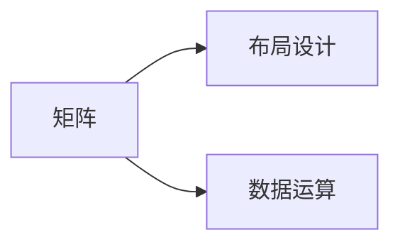

##### 2.1.3 概率论与统计学

概率论与统计学是数据分析的基础。通过概率分布和统计模型，设计师可以量化用户行为的不确定性，并预测用户行为模式。这对于优化产品设计和提升用户体验至关重要。

```latex
P(X \leq x) = \int_{-\infty}^{x} f_X(t) dt
```

#### 2.2 数学模型在产品设计中的应用

##### 2.2.1 用户体验度量模型

用户体验度量模型用于量化用户的体验感受。常见的度量模型包括用户满意度模型（User Satisfaction Model）和净推荐值（Net Promoter Score, NPS）。这些模型可以帮助设计师了解用户对产品的整体满意度，并识别需要改进的方面。

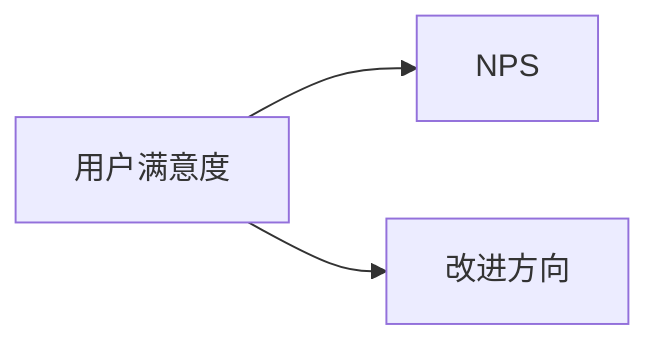

##### 2.2.2 交互设计中的数学工具

交互设计中的数学工具包括算法和模型，用于优化用户界面的设计和交互逻辑。例如，路径优化算法可以用于设计更直观的导航流程，决策树模型可以用于分析用户行为和设计优化策略。

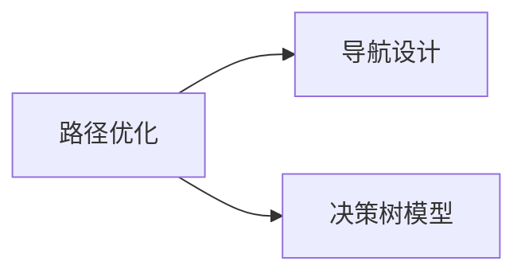

##### 2.2.3 数据可视化与数学表达

数据可视化是将数据分析结果以图形化的方式呈现，帮助设计师直观地理解用户行为和设计效果。数学表达则用于描述数据之间的关系和变化趋势，为设计师提供更深入的分析视角。

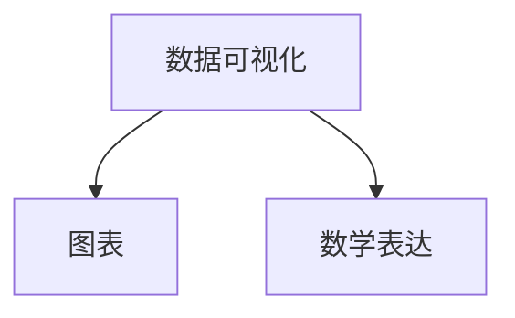

#### 2.3 数学模型设计实践

##### 2.3.1 基于用户反馈的优化设计

基于用户反馈的优化设计是一种通过数学模型分析用户行为数据，以指导产品设计的方法。这种方法包括以下步骤：

1. 数据收集与处理：收集用户反馈数据，包括满意度评分、使用时长、点击率等。
2. 用户满意度模型构建：使用概率论和统计学方法，构建用户满意度模型。
3. 优化策略：根据用户满意度模型，制定优化策略，如调整界面布局、优化交互逻辑。

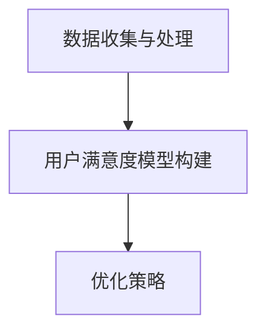

##### 2.3.2 设计流程中的数学工具应用

设计流程中的数学工具应用是指在设计过程中，使用数学方法优化设计决策和流程。具体方法包括：

1. 设计决策模型构建：使用决策树、线性规划等方法，构建设计决策模型。
2. 设计流程优化：使用路径优化算法，优化设计流程。
3. 数学工具在创意设计中的应用：如使用混沌理论生成创意设计方案。

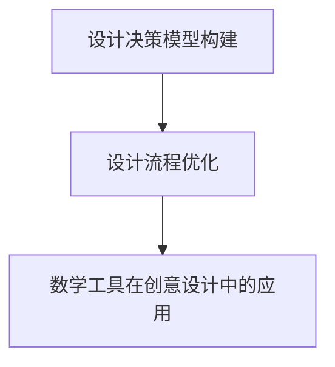

##### 2.3.3 数学模型在交互设计中的应用

数学模型在交互设计中的应用包括：

1. 交互设计中的数学度量方法：如使用熵度量用户界面的复杂性。
2. 基于数学模型的交互设计案例：如使用贝叶斯网络设计自适应用户界面。
3. 交互设计中的数学模型应用前景：如使用机器学习模型进行用户行为预测。

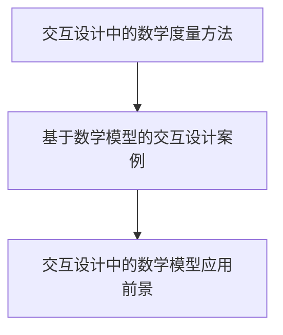

### 3. 用户体验量化的方法论

#### 3.1 用户体验量化的重要性

用户体验量化是提升产品设计的科学性和系统性的关键。通过量化用户体验，设计师可以：

1. 减少主观判断，提高设计决策的科学性。
2. 指标化用户体验，方便比较和优化。
3. 提高设计效率和效果，缩短产品迭代周期。

#### 3.2 用户体验量化方法

用户体验量化方法包括以下步骤：

1. 用户行为数据采集：通过日志、调查问卷等方法，收集用户行为数据。
2. 数据清洗与预处理：处理数据噪声，格式化数据。
3. 用户行为模型构建：使用统计学和机器学习方法，构建用户行为模型。
4. 用户体验评估：根据用户行为模型，评估用户体验，提出优化建议。

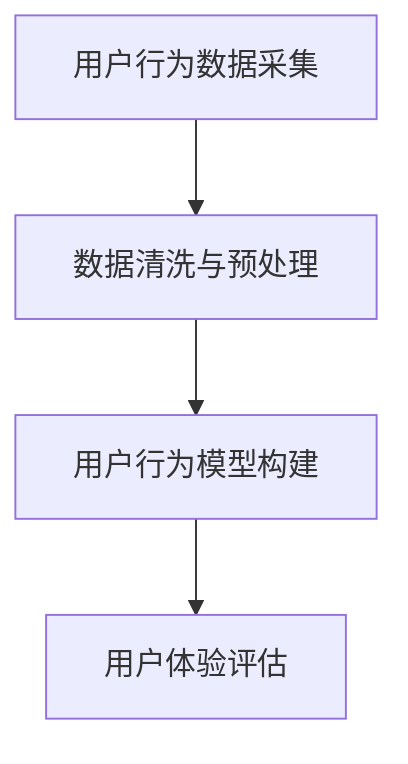

#### 3.3 量化用户体验的应用案例

1. 基于用户行为的界面优化：通过分析用户点击行为，优化界面布局。
2. 产品迭代中的用户体验量化：通过用户体验量化，指导产品迭代方向。
3. 产品评估中的应用：使用量化用户体验指标，评估产品整体表现。

### 4. 数据分析与用户行为建模

#### 4.1 数据分析基础

数据分析是用户体验量化的核心。以下是数据分析的基本步骤：

1. 数据采集：收集用户行为数据。
2. 数据清洗：处理数据噪声，格式化数据。
3. 数据探索：使用统计学方法，探索数据分布和趋势。
4. 数据可视化：使用图表和图形，直观展示数据分析结果。

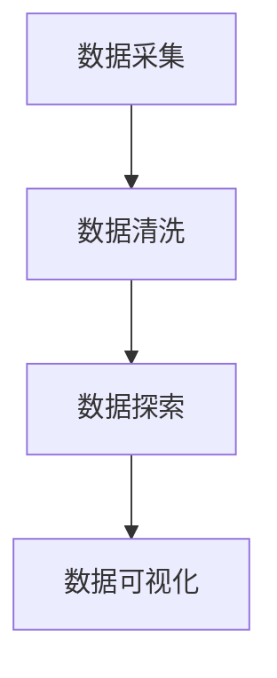

#### 4.2 用户行为建模

用户行为建模是通过建立数学模型，描述用户行为特征。以下是用户行为建模的常见方法：

1. 用户行为特征提取：提取用户行为的特征变量。
2. 用户行为模型构建：使用统计学和机器学习方法，构建用户行为模型。
3. 用户行为预测：根据用户行为模型，预测用户未来行为。

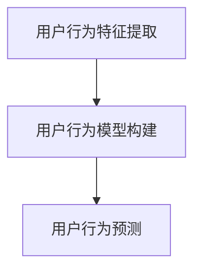

#### 4.3 用户行为分析应用

用户行为分析在产品设计中的应用包括：

1. 用户行为模式识别：识别用户行为中的共性特征。
2. 用户行为预测：预测用户未来行为，为产品设计提供指导。
3. 用户行为优化：通过优化用户行为，提升用户体验。

### 5. 项目实战与案例分析

#### 5.1 项目实战准备

1. 项目背景介绍：介绍项目的目标和背景。
2. 数据集与工具准备：准备所需的数据集和工具。
3. 实践目标设定：明确项目的实践目标。

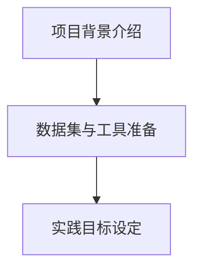

#### 5.2 实际案例分析

1. 案例一：用户体验量化在移动应用设计中的应用。
2. 案例二：基于数据分析的网站用户体验优化。
3. 案例三：用户行为建模在电子商务中的应用。

### 6. 最佳实践与小结

#### 6.1 最佳实践

1. 充分利用数学模型和数据分析，提高设计效率。
2. 结合用户反馈和数据分析，优化产品设计。
3. 定期进行用户体验评估，确保产品持续改进。

#### 6.2 小结

本文通过数学与数据分析的方法，探讨了用户体验量化的方法论。通过用户行为建模和数据分析，设计师可以更精准地了解用户需求，优化产品设计，提升用户体验。未来的研究可以进一步探讨如何将人工智能和机器学习引入用户体验量化，以实现更智能、更高效的设计。

### 7. 拓展阅读

1. 《用户体验要素》—— 有关用户体验设计的经典著作。
2. 《数据挖掘：概念与技术》—— 介绍数据分析方法和技术。
3. 《深度学习》—— 介绍机器学习在数据分析中的应用。

### 作者

**作者：AI天才研究院/AI Genius Institute & 禅与计算机程序设计艺术 /Zen And The Art of Computer Programming**

