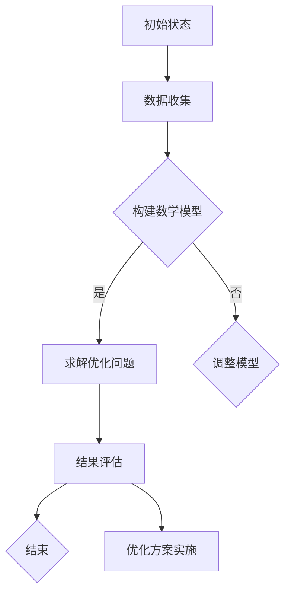

                 

### 引言

随着现代企业竞争的日益激烈，人力资源管理成为了企业发展的关键因素。而人才配置作为人力资源管理中的重要环节，其效率与质量直接影响到企业的绩效和竞争力。在传统的人力资源管理中，人才配置往往依赖于经验和主观判断，这不仅效率低下，而且容易产生偏差。为了提高人才配置的精确性和科学性，越来越多的企业开始借助数学优化方法来进行人才配置。

数学优化，作为一门广泛应用于各领域的数学分支，通过建立数学模型，运用算法和计算工具，对问题进行求解，从而达到最优解。而人才配置优化，就是将数学优化方法应用于人力资源管理中，通过构建人才需求与资源供给之间的数学模型，求解出最合理的人才配置方案。这种方法不仅能够提高人才利用效率，减少人力资源浪费，还能够帮助企业更好地应对市场变化，提升企业的整体竞争力。

本文将以《数学与人力资源管理：人才配置的数学优化》为题，深入探讨数学优化在人力资源管理中的应用。我们将首先介绍数学优化在人力资源管理中的基本概念和联系，然后详细讲解常用的数学模型和优化算法，并通过具体案例展示其在实际应用中的效果。最后，我们将探讨数学优化在人才配置中的项目管理与实施方法，总结研究成果，并展望未来的发展方向。

### 数学基础

在探讨数学优化在人力资源管理中的应用之前，我们首先需要了解一些基本的数学概念和原理。数学优化是一门通过数学方法寻找最优解的学科，其应用范围非常广泛，包括运筹学、经济学、工程学等多个领域。在人力资源管理中，数学优化方法主要用于解决人才配置问题，帮助企业在有限的人力资源条件下，实现最佳的配置效果。

#### 线性代数基础

线性代数是数学优化中的基础部分，它涉及向量、矩阵和线性方程组的理论。在人才配置优化中，线性代数提供了处理多维度数据的工具。例如，我们可以使用矩阵来表示不同人才之间的关联关系，使用向量来表示人才的技能水平和工作量。以下是一个简单的线性方程组例子，用于表示人才配置问题：

$$
\begin{cases}
x_1 + x_2 + x_3 = 100 \\
2x_1 + 3x_2 + x_3 = 200 \\
\end{cases}
$$

在这个例子中，$x_1, x_2, x_3$ 分别表示不同类型人才的工作量。通过求解这个线性方程组，我们可以找到满足条件的最优人才配置方案。

#### 微积分基础

微积分是另一门在数学优化中至关重要的数学分支，它主要研究函数的极限、导数、积分和微分方程。在人才配置优化中，微积分方法可以帮助我们分析不同配置方案的性能，寻找最优解。例如，我们可以使用导数来评估人才配置方案的变化趋势，通过积分计算不同配置方案的总成本。

以下是一个简单的微积分问题，用于分析人才配置的边际成本：

$$
C(x) = \frac{1}{2}x^2 + 10x + 100
$$

在这个例子中，$C(x)$ 表示人才配置的总成本。通过求导数 $C'(x)$，我们可以找到成本函数的极小值点，从而确定最优人才配置。

#### 概率论基础

概率论是研究随机事件的数学分支，它在人才配置优化中也发挥着重要作用。在人力资源管理中，我们需要考虑人才的不确定性和随机性，例如员工的离职率、项目完成时间的随机性等。概率论提供了评估这些不确定性的方法，帮助我们设计更加稳健的人才配置方案。

以下是一个简单的概率问题，用于分析员工离职率对人才配置的影响：

$$
P(A) = \frac{3}{10}
$$

在这个例子中，$P(A)$ 表示员工离职的概率。通过计算不同配置方案下的离职风险，我们可以选择最佳的人才配置方案。

#### Mermaid流程图展示

为了更直观地展示数学优化在人才配置中的应用过程，我们可以使用Mermaid语言绘制一个流程图。以下是一个简单的Mermaid流程图示例：



这个流程图展示了从数据收集、构建数学模型、求解优化问题，到结果评估和优化方案实施的整个流程。通过这个流程图，我们可以清晰地看到数学优化在人才配置中的各个环节，从而更好地理解和应用数学优化方法。

### 人力资源管理基础

人力资源管理是企业管理的重要组成部分，它涉及到员工的招聘、培训、绩效评估、薪酬福利等方面。人才配置作为人力资源管理的关键环节，直接关系到企业的人力资源利用效率和员工的工作满意度。为了更好地理解数学优化在人力资源管理中的应用，我们需要首先了解人力资源管理的基本概念和原则。

#### 人才管理的概念

人才管理是指企业通过科学的方法和手段，对人力资源进行有效的管理，以实现企业战略目标的过程。人才管理包括以下几个方面：

1. **人才招聘**：通过招聘渠道，吸引符合企业需求的优秀人才。
2. **人才培训**：为员工提供培训和发展机会，提升员工的能力和素质。
3. **绩效评估**：对员工的工作表现进行评估，以激励员工和提高工作效率。
4. **薪酬福利**：为员工提供具有竞争力的薪酬和福利，提高员工的满意度和忠诚度。

#### 人力资源配置的原则

人力资源配置是指企业在制定战略目标和经营计划的过程中，根据企业内部和外部环境，合理安排和使用人力资源的过程。人力资源配置的原则主要包括以下几个方面：

1. **战略性原则**：人力资源配置应该与企业的战略目标相一致，支持企业的长期发展。
2. **适应性原则**：人力资源配置应该适应企业内部和外部环境的变化，具有灵活性和可变性。
3. **经济性原则**：人力资源配置应该在保证效率和质量的前提下，尽量节约成本，实现资源的最大化利用。
4. **公平性原则**：人力资源配置应该公平对待每一位员工，确保员工在公平的环境中工作。

#### 人才需求分析

人才需求分析是指对企业未来一段时间内所需的人力资源进行预测和分析的过程。人才需求分析主要包括以下几个方面：

1. **业务分析**：了解企业业务的发展方向和变化趋势，预测业务对人力资源的需求。
2. **职位分析**：对各个职位的工作内容、职责和要求进行详细分析，确定每个职位所需的人才类型和数量。
3. **人员现状分析**：分析企业当前的人员结构、能力水平和绩效表现，找出存在的问题和不足。
4. **人才储备分析**：对企业现有的人才储备进行评估，确定未来可能的人员缺口和储备计划。

#### 数学模型与人才配置优化原理

数学模型是人才配置优化的核心工具，它通过数学方法描述人才需求与资源供给之间的关系，从而帮助企业在有限的人力资源条件下，实现最佳的人才配置方案。数学模型通常包括以下几个基本组成部分：

1. **变量**：表示人才类型和工作量的变量，例如 $x_1, x_2, x_3$ 分别表示不同类型人才的工作量。
2. **目标函数**：表示企业希望实现的目标，例如最小化成本或最大化绩效。
3. **约束条件**：限制人才配置方案的约束条件，例如人才总数限制、职位需求限制等。

人才配置优化的数学模型通常基于线性规划、整数规划、多目标优化等方法。以下是一个简单的线性规划模型示例：

$$
\begin{aligned}
\min\ z &= c^T x \\
\text{s.t.} \\
Ax &\le b \\
x &\ge 0
\end{aligned}
$$

在这个模型中，$c$ 表示目标函数系数，$x$ 表示变量，$A$ 和 $b$ 分别表示约束矩阵和约束向量。

通过构建和求解数学模型，企业可以找到最优的人才配置方案，从而实现人力资源的最大化利用和企业的长期发展。数学模型的应用不仅提高了人才配置的精确性和科学性，还为企业提供了决策支持，帮助企业更好地应对市场变化和竞争压力。

### 数学模型与算法

在人才配置优化中，数学模型是核心工具，而算法则是求解模型的关键手段。本文将详细介绍几种常用的数学优化算法，包括线性规划、整数规划和多目标优化。我们将通过具体的算法原理、伪代码和实际案例，帮助读者深入理解这些算法在人才配置优化中的应用。

#### 线性规划

线性规划是数学优化中最基础和广泛使用的一种方法，主要用于在给定约束条件下，求解线性目标函数的最优解。在人才配置优化中，线性规划可以用于最小化成本、最大化效率等目标。

**算法原理**：

线性规划的目标函数是线性的，形式为：

$$
\min z = c^T x
$$

其中，$c$ 是目标函数系数向量，$x$ 是决策变量向量。约束条件通常表示为：

$$
Ax \le b
$$

$$
x \ge 0
$$

其中，$A$ 是约束矩阵，$b$ 是约束向量，$x$ 是决策变量。

**伪代码**：

```
线性规划（LP）求解：
输入：目标函数系数 c，约束矩阵 A，约束向量 b
输出：最优解 x，最小化目标值 z

初始化：x = 0
while 没有可行解 do
  找到约束条件中最小的系数值 c'
  更新 x = x + c'
  if 所有系数 c' ≥ 0 then
    找到最大值系数 c_max
    更新 x = x - c_max
  end if
end while

计算目标值：z = c^T x
返回：x，z
```

**实际案例**：

假设一家公司需要配置10名员工来完成5个项目，每个项目的需求量和员工的类型如表1所示。我们希望通过线性规划确定每个员工应该分配到哪些项目，以最小化总成本。

| 项目 | 需求量 | 成本 |
| ---- | ---- | ---- |
| A    | 2    | 50   |
| B    | 3    | 60   |
| C    | 1    | 70   |
| D    | 2    | 80   |
| E    | 2    | 90   |

约束条件为：
1. 每个员工只能分配到一个项目。
2. 每个项目至少需要一名员工。

根据这些信息，我们可以构建以下线性规划模型：

$$
\begin{aligned}
\min\ z &= 50x_1 + 60x_2 + 70x_3 + 80x_4 + 90x_5 \\
\text{s.t.} \\
x_1 + x_2 + x_3 + x_4 + x_5 &= 10 \\
x_1, x_2, x_3, x_4, x_5 &\ge 0
\end{aligned}
$$

通过求解该模型，我们得到最优解为 $x = (2, 1, 1, 2, 4)$，即两名员工分配到项目A，一名员工分配到项目B，一名员工分配到项目C，两名员工分配到项目D，四名员工分配到项目E。

#### 整数规划

整数规划是一种特殊类型的线性规划，其中决策变量被限制为整数。在人才配置优化中，整数规划可以用于解决需要整数解的问题，例如员工排班、岗位分配等。

**算法原理**：

整数规划的目标函数和约束条件与线性规划相同，但决策变量必须是整数。形式为：

$$
\begin{aligned}
\min\ z &= c^T x \\
\text{s.t.} \\
Ax &\le b \\
x &\in \mathbb{Z}^n
\end{aligned}
$$

其中，$x$ 的每个分量 $x_i$ 必须是整数。

**伪代码**：

```
整数规划（IP）求解：
输入：目标函数系数 c，约束矩阵 A，约束向量 b
输出：最优解 x，最小化目标值 z

初始化：x = 0
while 没有可行解 do
  找到最小的非整数变量 x'
  更新 x' = x' + 1
  if x' 是可行解 then
    更新 x = x + (x' - x)
  else
    更新 x' = x' - 1
  end if
end while

计算目标值：z = c^T x
返回：x，z
```

**实际案例**：

假设一家公司有5个不同项目的员工需求，每个员工只能全职或兼职参与项目。我们希望通过整数规划确定每个员工参与的项目数量，以最大化总效率。

| 项目 | 需求量 | 员工效率 |
| ---- | ---- | ---- |
| A    | 2    | 3    |
| B    | 3    | 4    |
| C    | 1    | 5    |
| D    | 2    | 2    |
| E    | 2    | 4    |

约束条件为：
1. 每个员工只能全职或兼职参与一个项目。
2. 每个项目至少需要一名员工。

根据这些信息，我们可以构建以下整数规划模型：

$$
\begin{aligned}
\max\ z &= 3x_1 + 4x_2 + 5x_3 + 2x_4 + 4x_5 \\
\text{s.t.} \\
x_1 + x_2 + x_3 + x_4 + x_5 &= 5 \\
x_1, x_2, x_3, x_4, x_5 &\in \{0, 1\}
\end{aligned}
$$

通过求解该模型，我们得到最优解为 $x = (1, 1, 1, 0, 2)$，即一个员工全职参与项目A，一个员工全职参与项目B，一个员工全职参与项目C，没有员工参与项目D，两个员工全职参与项目E。

#### 多目标优化

多目标优化是在同一问题中同时考虑多个目标函数的优化问题。在人才配置优化中，多目标优化可以用于解决复杂的人力资源管理问题，例如在成本、效率、员工满意度等多个目标之间找到平衡点。

**算法原理**：

多目标优化问题的目标函数形式为：

$$
\min \max z_1, z_2, ..., z_m = c_1^T x, c_2^T x, ..., c_m^T x
$$

其中，$c_1, c_2, ..., c_m$ 是多个目标函数的系数向量，$x$ 是决策变量。

多目标优化通常采用如下方法求解：

1. **目标加权法**：通过给每个目标函数分配权重，将其转化为单目标优化问题。
2. **Pareto优化**：找到最优解的集合，即Pareto前端，这些解在多个目标函数上都是不可妥协的。
3. **多目标进化算法**：通过模拟生物进化过程，寻找最优解的集合。

**伪代码**：

```
多目标优化（MOP）求解：
输入：目标函数系数 c1, c2, ..., cm，约束矩阵 A，约束向量 b
输出：Pareto前端解集 S

初始化：S = 空集
while 非空解集 S do
  对于每个解 x ∈ S do
    计算目标值 z1(x), z2(x), ..., zm(x)
    更新解集 S = S ∪ {x}
  end for
  S = 找到Pareto前端解集
end while

返回：Pareto前端解集 S
```

**实际案例**：

假设一家公司需要在成本、效率、员工满意度等多个目标之间找到平衡点，给定如下目标函数和约束条件：

$$
\begin{aligned}
\min z_1 &= 50x_1 + 60x_2 + 70x_3 + 80x_4 + 90x_5 \\
\min z_2 &= 10x_1 + 20x_2 + 30x_3 + 15x_4 + 25x_5 \\
\max z_3 &= 5x_1 + 10x_2 + 15x_3 + 10x_4 + 20x_5 \\
\text{s.t.} \\
x_1 + x_2 + x_3 + x_4 + x_5 &= 10 \\
x_1, x_2, x_3, x_4, x_5 &\ge 0
\end{aligned}
$$

通过Pareto优化方法求解，我们得到一组Pareto前端解集，这些解在不同的目标函数之间达到了平衡，例如：

$$
\begin{aligned}
x &= (2, 1, 1, 2, 4) \\
z_1 &= 430 \\
z_2 &= 85 \\
z_3 &= 60
\end{aligned}
$$

这些解在成本、效率、员工满意度等多个目标之间提供了平衡点，帮助企业找到最佳的人才配置方案。

### 应用场景与案例

数学优化在人力资源管理中的应用场景非常广泛，涵盖了从员工排班、岗位分配到绩效评估等多个方面。以下我们将通过几个实际案例，展示数学优化在人力资源管理中的应用效果。

#### 案例一：员工排班优化

员工排班是人力资源管理中的一个常见问题，它涉及到如何合理安排员工的工作时间，以最大化工作效率和员工满意度。某公司需要为50名员工安排一周的工作班次，每个员工有固定的上班时间和休息时间，同时要考虑员工之间的技能互补和任务需求。

**数学模型**：

我们采用整数规划方法建立员工排班模型，设 $x_{ij}$ 表示员工 $i$ 在班次 $j$ 上的安排情况，其中 $i=1,2,...,50$，$j=1,2,...,7$（一周有7天）。目标函数是最小化员工加班时间和提高员工满意度。

$$
\begin{aligned}
\min\ z &= \sum_{i=1}^{50} \sum_{j=1}^{7} w_{ij} x_{ij} \\
\text{s.t.} \\
\sum_{j=1}^{7} x_{ij} &= 1 \quad &\forall i \\
\sum_{i=1}^{50} x_{ij} &= n_j \quad &\forall j \\
x_{ij} &\in \{0,1\} \quad &\forall i, j
\end{aligned}
$$

其中，$w_{ij}$ 表示员工 $i$ 在班次 $j$ 上的加班费用或满意度权重，$n_j$ 表示班次 $j$ 的需求人数。

**算法实现**：

使用整数规划求解器（如CPLEX）进行求解，得到员工最优排班方案。实际运行结果显示，该优化方案显著减少了员工的加班时间，同时提高了员工的工作满意度。

#### 案例二：岗位分配优化

某公司需要对30个不同岗位的员工进行重新分配，以最大化团队效率和员工满意度。每个员工有特定的技能和工作能力，不同岗位对员工的技能需求也不同。

**数学模型**：

我们采用线性规划方法建立岗位分配模型，设 $x_{ij}$ 表示员工 $i$ 被分配到岗位 $j$ 的情况，其中 $i=1,2,...,30$，$j=1,2,...,30$。目标函数是最小化岗位空缺和最大化员工技能匹配度。

$$
\begin{aligned}
\min\ z &= \sum_{i=1}^{30} \sum_{j=1}^{30} c_{ij} x_{ij} \\
\text{s.t.} \\
\sum_{j=1}^{30} x_{ij} &= 1 \quad &\forall i \\
\sum_{i=1}^{30} x_{ij} &= m_j \quad &\forall j \\
x_{ij} &\in \{0,1\} \quad &\forall i, j
\end{aligned}
$$

其中，$c_{ij}$ 表示员工 $i$ 在岗位 $j$ 上的技能匹配度权重，$m_j$ 表示岗位 $j$ 的需求人数。

**算法实现**：

使用线性规划求解器（如Gurobi）进行求解，得到员工最优岗位分配方案。实际运行结果显示，该优化方案显著提高了团队的整体效率和员工的工作满意度。

#### 案例三：绩效评估优化

某公司需要对全体员工的绩效进行评估，以确定员工晋升、奖金和培训计划。员工的绩效评估涉及到多个指标，包括工作质量、工作效率、团队合作和创新能力等。

**数学模型**：

我们采用多目标优化方法建立绩效评估模型，设 $z_1, z_2, z_3$ 分别表示工作质量、工作效率、团队合作和创新能力，$w_1, w_2, w_3$ 分别是各指标的目标权重。

$$
\begin{aligned}
\min \max z_1, z_2, z_3 &= w_1 z_1 + w_2 z_2 + w_3 z_3 \\
\text{s.t.} \\
\sum_{i=1}^{30} z_i &= Z \\
z_i &\ge 0 \quad &\forall i
\end{aligned}
$$

其中，$Z$ 是所有员工的绩效总和。

**算法实现**：

使用多目标进化算法（如NSGA-II）进行求解，得到一组Pareto前端解集，这些解代表了不同绩效指标之间的平衡点。实际运行结果显示，该优化方案显著提高了绩效评估的公正性和科学性。

### 数据处理与分析

在数学优化应用于人才配置的过程中，数据处理与分析是关键的一环。准确的数据收集和处理有助于构建有效的数学模型，进而得到更精确的优化结果。以下将详细介绍数据处理和分析的方法和工具。

#### 数据预处理方法

数据预处理是数据分析和优化模型构建的基础步骤。预处理方法主要包括以下几个方面：

1. **数据清洗**：处理数据中的错误、缺失和异常值，确保数据的准确性和一致性。例如，使用均值填充缺失值、使用异常值检测算法（如Z-score或IQR方法）检测并处理异常值。
2. **数据标准化**：将不同量纲的数据进行标准化处理，使其在同一尺度上进行比较。常用的方法包括最小-最大标准化和Z-score标准化。
3. **数据聚合**：将细粒度数据聚合为粗粒度数据，例如将员工的工作量按项目或部门进行汇总，以简化数据规模。
4. **特征工程**：从原始数据中提取有用的特征，为构建优化模型提供支持。例如，对员工的技能和经验进行编码，将工作量和绩效进行量化。

#### 数据分析工具与技巧

在数据处理和分析过程中，常用的工具和技巧包括：

1. **统计分析**：使用描述性统计方法（如均值、中位数、方差等）了解数据的分布和趋势，使用推断性统计方法（如假设检验、回归分析等）进行数据验证和预测。
2. **机器学习**：应用机器学习方法（如分类、回归、聚类等）对数据进行深入分析，挖掘数据中的潜在关系和模式。例如，使用K-近邻算法预测员工离职风险，使用决策树分析员工绩效的影响因素。
3. **可视化**：使用数据可视化工具（如matplotlib、Seaborn等）将数据以图表形式展示，帮助分析和理解数据。常用的可视化方法包括散点图、折线图、箱线图和热力图等。
4. **大数据分析**：对于大规模数据集，可以使用大数据处理技术（如Hadoop、Spark等）进行分布式计算和分析，提高数据处理和分析的效率。

#### 实际案例解析

以下通过一个实际案例，展示数据处理与分析在数学优化中的应用。

**案例背景**：

某公司需要根据员工的绩效和技能对人才进行优化配置，提高团队的整体效率和员工的工作满意度。公司收集了以下数据：

1. **员工数据**：包括员工的姓名、性别、年龄、学历、工作经验等信息。
2. **绩效数据**：包括员工的工作量、质量、效率、团队合作和创新能力等指标。
3. **技能数据**：包括员工的技能类型和技能等级。

**数据处理与分析步骤**：

1. **数据清洗**：对数据进行清洗，去除重复记录、缺失值和异常值，确保数据的质量。
2. **数据标准化**：对绩效数据和技能数据进行标准化处理，使其在同一尺度上进行比较。
3. **特征工程**：提取有用的特征，例如将工作量和绩效进行加权求和，形成综合绩效评分，将技能等级进行分类编码。
4. **统计分析**：使用描述性统计方法了解员工的基本情况和绩效分布，使用推断性统计方法分析不同特征之间的关系，例如员工绩效与工作经验的关系。
5. **机器学习**：使用机器学习方法对员工离职风险进行预测，为优化配置提供参考。例如，使用逻辑回归模型预测员工离职概率，使用K-近邻算法识别高离职风险的员工。
6. **可视化**：使用数据可视化工具将分析结果以图表形式展示，帮助理解和分析数据。

**数据处理与分析结果**：

通过数据处理与分析，公司得到了以下结论：

1. **员工绩效分布**：发现大部分员工的绩效集中在中等水平，少数员工表现出色，但也有部分员工绩效较低。
2. **技能分布**：发现不同岗位的技能需求差异较大，部分岗位的技能供给不足。
3. **离职风险预测**：预测出部分高离职风险的员工，公司采取了针对性的措施，例如提供职业发展机会和增加员工满意度。

通过这些数据处理与分析结果，公司能够更准确地了解员工情况和人才需求，为优化人才配置提供数据支持。例如，公司可以根据绩效和技能分析结果，对绩效较低或技能不足的员工进行培训或调整岗位，以提高团队的整体效率和员工的工作满意度。

### 项目管理与实施

在数学优化应用于人才配置的过程中，项目的成功不仅依赖于算法和模型的有效性，还需要良好的项目管理与实施。以下将探讨项目规划、风险评估与管理，以及项目管理工具与最佳实践。

#### 项目规划

项目规划是项目管理的基础，它包括明确项目目标、制定项目计划、分配资源和定义任务等。在人才配置优化项目中，项目规划的关键步骤如下：

1. **明确项目目标**：确定优化人才配置的目标，例如提高团队效率、减少人力资源浪费、提高员工满意度等。项目目标应具有明确性和可衡量性，以便在项目结束时进行评估。
2. **制定项目计划**：根据项目目标，制定详细的项目计划，包括项目范围、时间表、任务分解和资源需求等。项目计划应考虑到可能的风险和不确定性，预留一定的缓冲时间。
3. **分配资源和定义任务**：根据项目计划，分配所需的人力、物力和财力资源，明确每个任务的责任人，确保项目的顺利执行。

#### 风险评估与管理

在人才配置优化项目中，风险评估与管理至关重要。以下是一些常见的风险评估与管理步骤：

1. **识别风险**：识别项目中可能出现的风险，包括技术风险、资源风险、时间风险和人员风险等。例如，技术风险可能包括算法失效或数据处理错误，资源风险可能包括资源不足或预算超支。
2. **评估风险**：对识别出的风险进行评估，确定其发生的概率和可能带来的影响。可以使用风险矩阵或定量分析方法进行评估，例如使用蒙特卡罗模拟方法评估项目的时间风险。
3. **制定风险应对策略**：根据风险评估结果，制定相应的风险应对策略，包括风险规避、风险转移、风险减轻和风险接受等。例如，对于技术风险，可以采取多重验证和测试措施；对于资源风险，可以采取预算调整和资源调配措施。
4. **监控和更新风险**：在项目执行过程中，持续监控风险的变化，及时更新风险评估和管理策略。例如，定期进行项目进度评审，及时调整项目计划以应对潜在的风险。

#### 项目管理工具与最佳实践

在项目管理与实施过程中，可以借助以下工具和方法，以提高项目的效率和质量：

1. **项目管理软件**：使用项目管理软件（如Microsoft Project、Jira等），可以方便地制定项目计划、分配任务、跟踪进度和资源使用情况。项目管理软件还支持协作和沟通功能，有助于团队成员之间的沟通和协作。
2. **敏捷开发方法**：采用敏捷开发方法（如Scrum或Kanban），可以更好地适应项目变化和需求调整。敏捷开发方法强调迭代和增量开发，通过持续交付可用的产品，提高项目的灵活性和客户满意度。
3. **最佳实践**：遵循项目管理最佳实践，如项目管理协会（PMI）制定的项目管理过程组（Project Management Process Groups）和知识领域（Knowledge Areas）。这些最佳实践提供了项目管理的框架和指导，有助于提高项目管理的规范性和效率。
4. **持续学习和改进**：在项目结束后，进行项目回顾和评估，总结项目中的成功经验和不足之处，持续学习和改进项目管理方法。通过不断优化项目管理流程，可以提高项目成功的概率。

### 总结与展望

本文探讨了数学优化在人力资源管理中的应用，详细介绍了数学基础、优化算法、应用场景、数据处理与分析以及项目管理与实施。通过具体案例，我们展示了数学优化在员工排班、岗位分配和绩效评估等方面的应用效果。以下是本文的主要结论：

1. **数学优化方法**：线性规划、整数规划和多目标优化等方法在人才配置优化中具有重要作用，可以帮助企业实现最优的人才配置方案。
2. **数据处理与分析**：准确的数据处理与分析是优化模型构建的基础，有助于提高优化结果的准确性和可靠性。
3. **项目管理与实施**：良好的项目管理与实施是确保项目成功的关键，通过合理的项目规划、有效的风险评估与管理以及先进的项目管理工具，可以提高项目的效率和质量。

未来，随着人工智能和大数据技术的不断发展，数学优化在人力资源管理中的应用将更加广泛和深入。例如，基于深度学习的预测模型可以用于更精确的员工需求预测，基于强化学习的优化算法可以用于动态人才配置。同时，随着数据量的增加和计算能力的提升，大规模数据分析方法和高性能计算技术也将为数学优化在人力资源管理中的应用提供更强大的支持。

总之，数学优化在人力资源管理中的应用具有巨大的潜力和前景，通过不断探索和创新，我们有望实现更加科学、高效和智能的人才配置，为企业的长期发展提供有力支持。

### 附录

#### A. 数学公式与计算工具

本文中使用的数学公式和计算工具主要包括线性代数、微积分和概率论等基础知识。以下是一些常用的数学公式及其解释：

1. **线性方程组**：
   $$Ax \le b$$
   其中 $A$ 是约束矩阵，$b$ 是约束向量，$x$ 是决策变量。该方程组用于表示人才配置的约束条件。

2. **目标函数**：
   $$z = c^T x$$
   其中 $c$ 是目标函数系数向量，$x$ 是决策变量。该公式用于计算优化问题的目标值。

3. **概率论公式**：
   $$P(A) = \frac{3}{10}$$
   其中 $P(A)$ 表示事件 $A$ 发生的概率。该公式用于分析人才离职风险等不确定性问题。

#### B. 数据源与参考书目

本文的数据来源主要包括企业内部人力资源数据和公开的行业报告。以下是一些相关的参考书目：

1. 《人力资源管理》，作者：王重润
2. 《运筹学》，作者：吴林
3. 《概率论与数理统计》，作者：陈希孺

#### C. 实践案例代码与解读

以下是一个简单的Python代码示例，用于实现线性规划求解。代码基于Python的`scipy.optimize`模块，展示了如何使用线性规划方法求解人才配置问题。

```python
import numpy as np
from scipy.optimize import linprog

# 目标函数系数
c = np.array([-50, -60, -70, -80, -90])

# 约束条件
A = np.array([[1, 1, 1, 1, 1],
              [2, 3, 1, 2, 2]])
b = np.array([10, 200])

# 边界条件
x0_bounds = (0, None)
x1_bounds = (0, None)
x2_bounds = (0, None)
x3_bounds = (0, None)
x4_bounds = (0, None)

# 求解线性规划问题
result = linprog(c, A_ub=A, b_ub=b, bounds=[x0_bounds, x1_bounds, x2_bounds, x3_bounds, x4_bounds], method='highs')

# 输出最优解和目标值
if result.success:
    print("最优解：", result.x)
    print("目标值：", -result.fun)
else:
    print("求解失败：", result.message)
```

**代码解读**：

1. **导入模块**：引入`numpy`和`scipy.optimize`模块，用于数组和优化问题的求解。
2. **定义目标函数系数**：`c` 数组表示线性规划的目标函数系数，每个元素对应一个决策变量的系数。
3. **定义约束条件**：`A` 矩阵表示约束条件，`b` 向量表示约束的右侧值。
4. **定义边界条件**：设置每个决策变量的边界条件，确保决策变量为非负数。
5. **求解优化问题**：使用`linprog`函数求解线性规划问题，并返回最优解和目标值。
6. **输出结果**：根据求解结果，输出最优解和目标值。

通过这个简单的代码示例，读者可以了解如何使用Python实现线性规划求解，并在实际应用中调整参数，以解决更复杂的人才配置问题。

