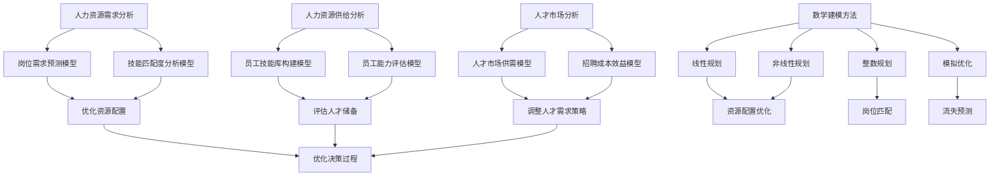
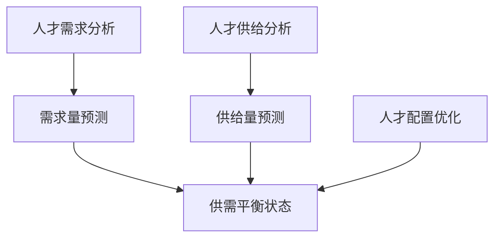
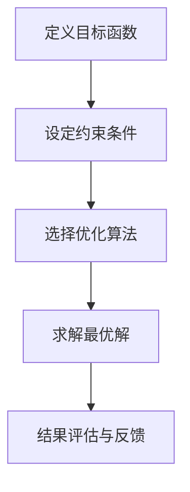
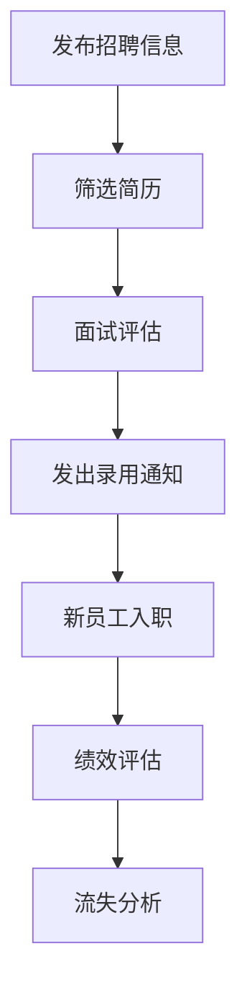
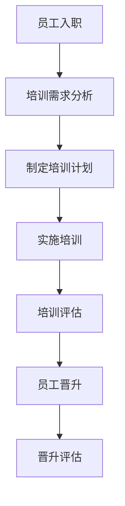
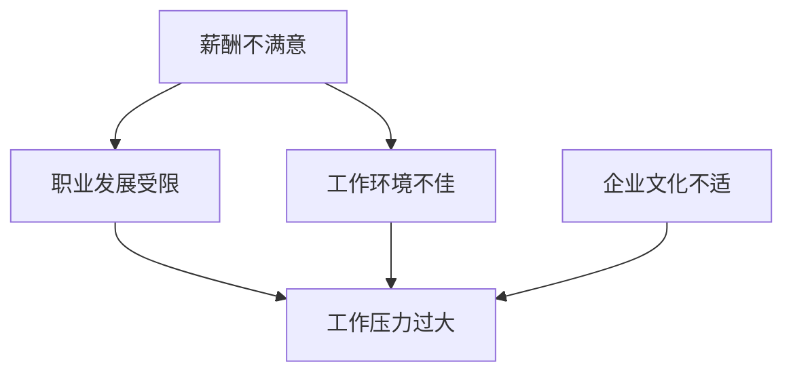

                 


### 第1章 引言

#### 1.1 人力资源管理的挑战

人力资源管理作为企业运营的核心环节，面临着诸多挑战。首先，人才供需不平衡的问题日益突出。随着科技的发展，企业对高技能人才的需求不断增加，但与此同时，市场上合格人才的数量却未能同步增长，导致招聘难、留才难的问题。其次，企业内部的人才配置不合理也成为一个普遍问题。传统的管理方式往往基于经验和直觉进行人才配置，而忽视了人才的能力与岗位需求的匹配度，导致人力资源浪费。此外，人才流失率居高不下，成为企业面临的另一大挑战。员工流失不仅影响工作效率，还增加了企业的人力成本。

#### 1.2 数学优化在人力资源管理中的应用

数学优化作为一种系统的方法，能够有效地解决人力资源管理中的复杂问题。通过数学建模和优化算法，企业可以对人才需求进行精确预测，优化人才配置，减少人力资源浪费，降低人才流失率。具体应用包括：人才供需平衡模型的构建与求解，人才招聘与选拔的最优化，人才培训与晋升机制的优化设计，以及人才流失预测与控制策略等。数学优化不仅提高了人力资源管理效率，还为企业提供了科学的决策支持。

#### 1.3 本书结构与目标

本书旨在通过系统性的分析和讲解，使读者深入了解数学优化在人力资源管理中的应用。全书分为三大部分：

第一部分引言与基础理论，介绍人力资源管理面临的挑战和数学优化的应用背景，为后续章节打下基础。

第二部分人才配置的数学优化理论，详细阐述人才供需平衡、最优化模型、招聘与选拔、培训与晋升、流失预测等数学模型，并提供相关算法原理与伪代码。

第三部分数学优化在人力资源管理中的应用案例，通过具体案例分析，展示数学优化在实践中的应用效果，并提供实施建议。

通过本书的阅读，读者将能够掌握数学优化在人力资源管理中的核心概念和具体应用，为企业的人力资源管理提供科学依据和优化方案。

### 关键词

- 人力资源管理
- 数学优化
- 人才供需平衡
- 最优化模型
- 人才招聘与选拔
- 培训与晋升
- 人才流失预测与控制

### 摘要

本文系统探讨了数学优化在人力资源管理中的应用，针对人才供需不平衡、人才配置不合理、人才流失率居高不下等挑战，提出了相应的数学模型和优化策略。通过人才供需平衡模型、最优化模型、招聘与选拔模型、培训与晋升模型以及人才流失预测与控制模型，文章详细阐述了各模型的构建原理、算法实现和实际应用案例。本文旨在为人力资源管理者提供科学的人才配置和管理方案，以提升企业人力资源利用效率。

## 第二部分：人才配置的数学模型基础

### 第2章 人力资源管理的数学模型基础

#### 2.1 人力资源需求分析

人力资源需求分析是人才配置优化的基础，它涉及到企业内部各种岗位的需求量以及所需技能的匹配度。首先，企业需要明确每个岗位的职责和所需技能，通过岗位分析来获取这些信息。然后，根据企业的战略目标和业务需求，预测未来一段时间内各个岗位的需求量。

**数学模型概述：**
- **岗位需求预测模型：** 利用时间序列分析和回归分析等方法，预测未来一段时间内岗位的需求量。
- **技能匹配度分析模型：** 通过技能匹配度评分模型，评估现有员工与岗位需求的匹配程度。

#### 2.2 人力资源供给分析

人力资源供给分析旨在了解企业现有的人力资源状况，包括员工的数量、技能、工作经验等。通过对人力资源供给的分析，企业可以识别出现有人才储备的强项和短板，为优化人才配置提供依据。

**数学模型概述：**
- **员工技能库构建模型：** 通过建立员工技能库，对员工的技能和工作经验进行分类和统计。
- **员工能力评估模型：** 利用技能匹配度评分和绩效考核等方法，评估员工的能力水平。

#### 2.3 人才市场分析

人才市场分析是了解外部人才供给情况的过程，通过分析人才市场的供需关系，企业可以调整内部人才需求策略，提高人才获取的效率。

**数学模型概述：**
- **人才市场供需模型：** 基于供需理论，分析市场人才供需状况。
- **招聘成本效益模型：** 通过计算招聘成本与招聘效果的关系，评估不同招聘渠道的成本效益。

#### 2.4 数学建模方法概述

数学建模是人力资源管理中的关键环节，通过建立数学模型，企业可以将复杂的现实问题转化为可计算的模型，从而优化决策过程。

**数学建模方法概述：**
- **线性规划：** 用于优化资源配置，如人才分配和招聘策略。
- **非线性规划：** 用于处理更复杂的问题，如多目标优化。
- **整数规划：** 用于解决离散问题，如员工排班和岗位匹配。
- **模拟优化：** 通过模拟现实过程，如员工流失预测。

**核心概念与联系架构**



**核心算法原理讲解**

下面是用于人力资源需求分析的一个简单线性规划模型的伪代码：

```plaintext
输入：
- 岗位需求矩阵 D (行表示岗位，列表示时间)
- 员工技能矩阵 S (行表示员工，列表示技能)
- 每个员工的成本向量 C
- 目标函数权重向量 W

输出：
- 最优员工配置矩阵 X

算法：
1. 初始化员工配置矩阵 X 为全零矩阵
2. 对每个时间点 i，执行以下步骤：
   a. 计算每个员工 j 的成本效益比 R_j = W' * S_j * D_i / C_j
   b. 选择成本效益比最高的员工 j，将 X[i][j] 设为 1，即分配该员工到岗位 i
   c. 更新 S_j 和 D_i，去除已分配的员工和岗位
3. 返回最优员工配置矩阵 X
```

**数学模型和公式**

为了更好地理解上述模型，我们可以使用以下数学公式：

$$
R_j = \frac{W' * S_j * D_i}{C_j}
$$

其中，\(R_j\) 表示员工 j 在时间点 i 的成本效益比，\(W'\) 是目标函数权重向量的转置，\(S_j\) 是员工 j 的技能矩阵，\(D_i\) 是时间点 i 的岗位需求矩阵，\(C_j\) 是员工 j 的成本向量。

**详细讲解与举例说明**

假设企业有三个岗位需要在未来三个时间点分别配置员工，员工有两个技能（技能 1 和技能 2），每个员工的成本和技能水平如下表所示：

| 员工 | 成本 (C) | 技能 1 (S1) | 技能 2 (S2) |
|------|----------|-------------|-------------|
| A    | 500      | 0.8         | 0.2         |
| B    | 600      | 0.5         | 0.5         |
| C    | 700      | 0.2         | 0.8         |
| D    | 800      | 0.7         | 0.3         |

岗位需求如下表：

| 时间点 (i) | 岗位 1 | 岗位 2 | 岗位 3 |
|------------|--------|--------|--------|
| 1          | 1      | 1      | 0      |
| 2          | 0      | 1      | 1      |
| 3          | 1      | 0      | 1      |

目标函数权重向量 \(W\) 为 (0.5, 0.5)。

首先计算每个员工在时间点 1 的成本效益比：

$$
R_A = \frac{0.5 * 0.8 * 1}{500} = 0.0008
$$

$$
R_B = \frac{0.5 * 0.5 * 1}{600} = 0.0004167
$$

$$
R_C = \frac{0.5 * 0.2 * 1}{700} = 0.0002857
$$

$$
R_D = \frac{0.5 * 0.7 * 1}{800} = 0.0004792
$$

员工 B 的成本效益比最高，因此将员工 B 分配到岗位 1。

接下来更新员工技能矩阵和岗位需求矩阵：

| 员工 | 成本 (C) | 技能 1 (S1) | 技能 2 (S2) |
|------|----------|-------------|-------------|
| A    | 500      | 0.8         | 0.2         |
| C    | 700      | 0.2         | 0.8         |
| D    | 800      | 0.7         | 0.3         |

| 时间点 (i) | 岗位 1 | 岗位 2 | 岗位 3 |
|------------|--------|--------|--------|
| 2          | 0      | 1      | 1      |
| 3          | 1      | 0      | 1      |

重复上述步骤，计算每个员工在时间点 2 和时间点 3 的成本效益比，最终得到最优员工配置矩阵：

$$
X =
\begin{bmatrix}
0 & 1 & 0 \\
1 & 0 & 1 \\
0 & 1 & 0 \\
\end{bmatrix}
$$

通过上述步骤，我们可以看到如何利用数学模型来优化员工配置，从而达到降低成本和提高效率的目标。

## 第三部分：人才配置的数学优化理论

### 第3章 人才供需平衡模型

#### 3.1 人才供需平衡的概念

人才供需平衡是指企业在特定时期内，其人力资源需求与供给之间达到一种动态平衡状态。这意味着企业能够根据业务发展的需要，及时调整人力资源配置，确保各类岗位的人员需求得到满足，同时避免人力资源的浪费和短缺。

**定义：**
- **人才需求量：** 指企业根据业务目标和发展计划，对各类岗位所需人员数量的预测。
- **人才供给量：** 指企业现有员工数量以及通过招聘、培训等方式能够提供的人员数量。
- **人才供需平衡：** 当人才需求量等于人才供给量时，即达到供需平衡。

**核心概念与联系架构**

为了更直观地理解人才供需平衡的概念，我们可以使用 Mermaid 流程图来描述人才供需的基本流程：



**核心算法原理讲解**

人才供需平衡模型的核心在于如何精确预测人才需求量和供给量，并在此基础上进行优化配置。以下是用于预测人才需求量和供给量的伪代码：

```plaintext
输入：
- 历史数据 D_hist （包括业务指标和人员需求历史数据）
- 业务增长预测模型 G(B) （用于预测未来业务需求）

输出：
- 未来一段时间内的人才需求量 R

算法：
1. 利用历史数据 D_hist 和业务增长预测模型 G(B)，预测未来一段时间内业务增长情况
2. 根据业务增长情况，计算每个时间点的人才需求量 R_t
3. 返回未来一段时间内的人才需求量 R
```

**数学模型和公式**

为了更好地理解人才供需平衡模型，我们可以使用以下数学公式：

$$
R_t = G(B_t) * R_0
$$

其中，\(R_t\) 表示时间点 t 的人才需求量，\(G(B_t)\) 是基于业务增长预测模型对未来业务需求的预测函数，\(R_0\) 是初始需求量。

**详细讲解与举例说明**

假设企业历史数据如下表所示：

| 时间点 | 业务指标 | 人员需求 |
|--------|----------|----------|
| 1      | 100      | 10       |
| 2      | 120      | 12       |
| 3      | 140      | 14       |

业务增长预测模型 \(G(B)\) 假设为线性增长，即：

$$
G(B_t) = B_t * 1.1
$$

其中，\(B_t\) 是时间点 t 的业务指标。

首先，根据历史数据预测未来一段时间内业务增长情况：

$$
B_1 = 100, B_2 = 120, B_3 = 140
$$

$$
G(B_1) = 100 * 1.1 = 110
$$

$$
G(B_2) = 120 * 1.1 = 132
$$

$$
G(B_3) = 140 * 1.1 = 154
$$

然后，计算未来一段时间内的人才需求量：

$$
R_1 = 110 * 10 = 1100
$$

$$
R_2 = 132 * 12 = 1584
$$

$$
R_3 = 154 * 14 = 2156
$$

最终得到未来一段时间内的人才需求量：

$$
R = [1100, 1584, 2156]
$$

接下来，企业需要分析现有的人力资源供给量，包括现有员工数量和未来可能通过招聘、培训等方式新增的人员数量。如果供给量低于需求量，企业需要采取相应的措施，如增加招聘力度、提高培训质量等，以确保供需平衡。

**数学公式**

为了评估供需平衡状态，我们可以使用以下数学公式：

$$
S_t = \frac{R_t - D_t}{R_t}
$$

其中，\(S_t\) 表示时间点 t 的供需平衡比例，\(R_t\) 是人才需求量，\(D_t\) 是人才供给量。

如果 \(S_t\) 接近于 1，则表示人才供需处于平衡状态。如果 \(S_t\) 大于 1，则表示供给量超过需求量；如果 \(S_t\) 小于 1，则表示需求量超过供给量。

**人才供需平衡模型的应用场景**

人才供需平衡模型在企业的人力资源管理中具有广泛的应用场景：

1. **招聘策略制定：** 通过预测未来人才需求，企业可以提前制定招聘计划，避免人才短缺。
2. **培训与发展：** 根据人才需求的变化，企业可以有针对性地进行员工培训，提升员工技能，满足岗位需求。
3. **人员配置优化：** 通过平衡人才供需，企业可以优化人员配置，提高人力资源利用效率。
4. **绩效评估：** 供需平衡模型可以帮助企业评估员工的绩效，为员工晋升和奖励提供依据。

**案例分析与详细讲解**

以某互联网公司为例，该公司在过去三年中业务增长迅速，人员需求逐年增加。根据历史数据和业务增长预测模型，公司预测未来三年内的人才需求如下表所示：

| 年份 | 业务指标 | 预测人才需求 |
|------|----------|--------------|
| 2021 | 1000     | 1000         |
| 2022 | 1200     | 1200         |
| 2023 | 1500     | 1500         |

公司通过分析现有员工技能和人员结构，预测未来三年内的人力资源供给如下表所示：

| 年份 | 现有员工数量 | 预计新增员工数量 |
|------|--------------|------------------|
| 2021 | 200          | 50               |
| 2022 | 250          | 75               |
| 2023 | 300          | 100              |

根据人才供需平衡模型，公司评估未来三年内的人才供需平衡状态如下表所示：

| 年份 | 人才需求量 | 人才供给量 | 供需平衡比例 |
|------|------------|------------|--------------|
| 2021 | 1000       | 250        | 0.25         |
| 2022 | 1200       | 325        | 0.27         |
| 2023 | 1500       | 425        | 0.28         |

从表中可以看出，尽管公司在2021年和2022年的人才供需平衡比例相对较低，但整体趋势是供需逐渐平衡。然而，在2023年，人才需求量远大于供给量，公司需要采取紧急措施，如增加招聘力度、优化培训体系等，以确保人才供需平衡。

通过上述案例分析，我们可以看到人才供需平衡模型在企业人力资源管理中的重要作用。它不仅帮助企业预测和调整人力资源需求，还能优化人才配置，提高人力资源利用效率，从而支持企业的持续发展。

### 第4章 人才配置的最优化模型

#### 4.1 最优化理论简介

最优化理论是研究在给定约束条件下，如何找到最优解的一门数学分支。它在人力资源管理中的应用主要涉及如何通过数学模型和算法来优化资源配置，实现企业的战略目标。最优化模型的关键在于目标函数和约束条件的定义，以及求解最优解的算法选择。

**目标函数：** 最优化模型中的目标函数通常定义为衡量资源配置优劣的指标，如成本最小化、利润最大化、满意度最大化等。

**约束条件：** 约束条件则限制了资源的使用方式和数量，如人员技能要求、岗位需求、预算限制等。

**常见优化算法：**
- **线性规划：** 用于解决线性目标函数和线性约束条件的问题，适用于资源分配和成本控制。
- **非线性规划：** 用于解决非线性目标函数和线性约束条件的问题，适用于更复杂的问题，如多目标优化。
- **整数规划：** 用于解决离散变量的问题，如员工排班和岗位匹配。
- **动态规划：** 用于解决多阶段决策问题，如员工晋升和培训计划。
- **模拟优化：** 通过模拟现实过程，如员工流失预测和招聘策略优化。

**核心概念与联系架构**

为了更好地理解最优化理论在人力资源管理中的应用，我们可以使用 Mermaid 流程图来描述优化过程的基本步骤：



**核心算法原理讲解**

人才配置的最优化模型通常基于线性规划或非线性规划。以下是一个简单的线性规划模型，用于最小化招聘成本并满足岗位需求：

**伪代码：**

```plaintext
输入：
- 岗位需求向量 D
- 员工成本向量 C
- 员工技能向量 S
- 预算限制 B

输出：
- 最优招聘方案 X

算法：
1. 初始化招聘方案 X 为全零矩阵
2. 对每个岗位 i，执行以下步骤：
   a. 计算每个员工 j 的成本效益比 R_j = C_j / S_j
   b. 选择成本效益比最高的员工 j，将 X[i][j] 设为 1，即招聘该员工
   c. 更新 S_j 和 D_i，去除已招聘的员工和岗位
3. 返回最优招聘方案 X
```

**数学模型和公式**

线性规划模型可以用以下数学公式表示：

$$
\min \sum_{i=1}^{n} \sum_{j=1}^{m} C_{ij} X_{ij}
$$

其中，\(C_{ij}\) 是员工 j 在岗位 i 的成本，\(X_{ij}\) 是二进制变量，表示员工 j 是否被分配到岗位 i。

**约束条件：**

- \(D_i \leq \sum_{j=1}^{m} S_{ij} X_{ij}\) （岗位 i 的需求量不超过总供给量）
- \(X_{ij} \in \{0, 1\}\) （招聘决策为离散变量）

**详细讲解与举例说明**

假设企业有四个岗位，每个岗位的需求量和成本如下表所示：

| 岗位 | 需求量 | 成本 |
|------|--------|------|
| A    | 3      | 2000 |
| B    | 2      | 1500 |
| C    | 2      | 1200 |
| D    | 1      | 900  |

现有五位员工，每位员工的技能和成本如下表所示：

| 员工 | 技能 1 | 技能 2 | 技能 3 | 成本 |
|------|--------|--------|--------|------|
| E1   | 1      | 1      | 0      | 800  |
| E2   | 1      | 0      | 1      | 900  |
| E3   | 0      | 1      | 1      | 1000 |
| E4   | 1      | 1      | 1      | 1100 |
| E5   | 0      | 0      | 1      | 700  |

根据上述数据和约束条件，我们可以建立线性规划模型，目标是最小化总招聘成本。

首先，定义目标函数：

$$
\min \sum_{i=1}^{4} \sum_{j=1}^{5} C_{ij} X_{ij}
$$

然后，设定约束条件：

$$
3 \leq \sum_{j=1}^{5} X_{Ej} \leq 3 \\
2 \leq \sum_{j=1}^{5} X_{Ej} \leq 2 \\
2 \leq \sum_{j=1}^{5} X_{Ej} \leq 2 \\
1 \leq \sum_{j=1}^{5} X_{Ej} \leq 1 \\
X_{ij} \in \{0, 1\}
$$

根据算法步骤，我们逐一选择成本效益比最高的员工：

- 对于岗位 A，员工 E1 的成本效益比最高（\(C_{E1} = 800, S_{E1} = 3\)），因此分配员工 E1 到岗位 A。
- 更新后，岗位 A 需求量为 2，员工 E1 技能降为 0，剩余需求量为 1。

- 对于岗位 B，员工 E5 的成本效益比最高（\(C_{E5} = 700, S_{E5} = 2\)），因此分配员工 E5 到岗位 B。
- 更新后，岗位 B 需求量为 1，员工 E5 技能降为 0，剩余需求量为 0。

- 对于岗位 C，员工 E2 的成本效益比最高（\(C_{E2} = 900, S_{E2} = 2\)），因此分配员工 E2 到岗位 C。
- 更新后，岗位 C 需求量为 1，员工 E2 技能降为 0，剩余需求量为 0。

- 对于岗位 D，员工 E3 的成本效益比最高（\(C_{E3} = 1000, S_{E3} = 1\)），因此分配员工 E3 到岗位 D。
- 更新后，岗位 D 需求量为 0，员工 E3 技能降为 0。

最终，最优招聘方案为：

$$
X =
\begin{bmatrix}
1 & 0 & 0 & 0 \\
0 & 1 & 0 & 0 \\
0 & 0 & 1 & 0 \\
0 & 0 & 0 & 1 \\
\end{bmatrix}
$$

通过上述步骤，我们得到了最优的招聘方案，使得总招聘成本最小化。

### 第5章 人才招聘与选拔模型

#### 5.1 招聘与选拔的关键指标

在人才招聘与选拔过程中，关键指标是评估招聘效果和选拔质量的重要标准。以下是一些主要的关键指标：

1. **招聘成本（Cost Per Hire，CPH）：** 招聘成本是指企业为招聘一名新员工所花费的平均成本，包括广告费用、招聘会费用、面试官费用等。

2. **招聘周期（Time-to-Hire，TTH）：** 招聘周期是指从职位空缺到新员工入职的平均时间，反映了招聘效率和流程的顺畅程度。

3. **雇佣率（Hire Rate）：** 雇佣率是指应聘者数量与最终录用人数的比率，反映了招聘渠道的有效性和吸引力。

4. **流失率（Attrition Rate）：** 流失率是指新员工在入职后的平均流失时间，反映了员工满意度和企业文化适配度。

5. **员工绩效（Performance Metrics）：** 员工绩效是指新员工在入职后的工作表现，包括工作质量、工作效率、团队协作能力等。

**核心概念与联系架构**

为了更好地理解这些关键指标，我们可以使用 Mermaid 流程图来描述招聘与选拔的过程：



**核心算法原理讲解**

人才招聘与选拔模型的核心在于如何通过算法优化招聘流程，提高招聘效果和选拔质量。以下是一个基于人才匹配度的招聘与选拔算法的伪代码：

```plaintext
输入：
- 职位需求描述 D
- 应聘者简历数据库 S
- 招聘预算 B

输出：
- 最优应聘者名单 X

算法：
1. 初始化应聘者名单 X 为空
2. 对每个应聘者 s ∈ S，执行以下步骤：
   a. 计算应聘者 s 与职位 D 的匹配度 M_s
   b. 如果 M_s > 阈值，将 s 添加到 X
3. 对 X 进行排序，按照匹配度从高到低排列
4. 根据招聘预算 B，从 X 中选择前 N 位应聘者
5. 返回最优应聘者名单 X
```

**数学模型和公式**

为了更好地理解匹配度计算，我们可以使用以下数学公式：

$$
M_s = \frac{S_s \cdot D}{|S_s| + |D|}
$$

其中，\(M_s\) 表示应聘者 s 与职位 D 的匹配度，\(S_s\) 表示应聘者 s 的技能集合，\(D\) 表示职位 D 的技能需求集合，\(|S_s|\) 和 \(|D|\) 分别表示技能集合的大小。

**详细讲解与举例说明**

假设企业需要招聘一个软件开发工程师，职位需求如下：

- 技能 1：Java 编程
- 技能 2：数据库管理
- 技能 3：前端开发

现有五位应聘者，每位应聘者的简历和技能如下表所示：

| 应聘者 | 技能 1 | 技能 2 | 技能 3 |
|--------|--------|--------|--------|
| S1     | Java   |        |        |
| S2     | Java   | MySQL  |        |
| S3     | Java   | MySQL  | React  |
| S4     | Java   |        | Vue    |
| S5     | Java   | MySQL  | Angular |

首先，计算每位应聘者与职位需求的匹配度：

$$
M_{S1} = \frac{1 \cdot 3}{1 + 3} = 0.75
$$

$$
M_{S2} = \frac{2 \cdot 3}{2 + 3} = 0.6
$$

$$
M_{S3} = \frac{3 \cdot 3}{3 + 3} = 1
$$

$$
M_{S4} = \frac{1 \cdot 3}{1 + 3} = 0.75
$$

$$
M_{S5} = \frac{2 \cdot 3}{2 + 3} = 0.6
$$

根据匹配度计算结果，我们可以得到应聘者的排名：

- S3：匹配度 1
- S1：匹配度 0.75
- S4：匹配度 0.75
- S2：匹配度 0.6
- S5：匹配度 0.6

根据招聘预算和选拔策略，企业可以从排名前两位的应聘者中选择，即 S3 和 S1。

通过上述步骤，我们可以看到如何利用人才招聘与选拔模型来优化招聘流程，提高选拔质量。

### 第6章 人才培训与晋升模型

#### 6.1 培训与晋升的重要性

培训与晋升是人力资源管理中至关重要的环节，对企业的长远发展和员工个人的职业成长具有重要意义。培训能够提升员工的技能和知识，使其更好地适应岗位需求，提高工作效率和绩效。而晋升机制则能够激励员工积极进取，保持团队的活力和创新能力。

**培训的重要性：**
- **提高员工技能：** 培训有助于员工掌握新技能和知识，提升工作能力。
- **增强员工信心：** 培训使员工对自身的能力有更清晰的认知，增强自信心。
- **促进职业发展：** 通过培训，员工可以获得晋升的机会，实现职业发展。

**晋升的重要性：**
- **激励员工积极性：** 晋升机制能够激励员工努力工作，追求更高的目标。
- **保持团队活力：** 晋升为管理层的新员工能够带来新鲜思想和活力，促进团队的创新。
- **企业文化的传承：** 晋升机制有助于培养和传承企业文化，确保企业的长远发展。

**核心概念与联系架构**

为了更好地理解培训与晋升模型，我们可以使用 Mermaid 流程图来描述培训与晋升的基本流程：



**核心算法原理讲解**

培训与晋升模型的核心在于如何根据员工的能力和发展需求，设计科学的培训计划和晋升机制。以下是一个简单的培训与晋升模型的伪代码：

```plaintext
输入：
- 员工技能水平 S
- 岗位需求 D
- 培训预算 B
- 晋升标准 P

输出：
- 培训计划 X
- 晋升路径 Y

算法：
1. 对每个员工 s ∈ S，执行以下步骤：
   a. 分析员工技能水平与岗位需求的匹配度 M_s
   b. 如果 M_s < 阈值，将员工 s 添加到培训计划 X
2. 根据培训预算 B，制定培训计划 X
3. 对每个员工 s ∈ S，执行以下步骤：
   a. 分析员工晋升潜力 T_s
   b. 如果 T_s > 晋升标准 P，将员工 s 添加到晋升路径 Y
4. 返回培训计划 X 和晋升路径 Y
```

**数学模型和公式**

为了更好地理解培训与晋升模型，我们可以使用以下数学公式：

$$
M_s = \frac{|S_s \cap D|}{|S_s| + |D|}
$$

$$
T_s = \frac{P_s - S_s}{P_s}
$$

其中，\(M_s\) 表示员工 s 与岗位 D 的匹配度，\(S_s\) 表示员工 s 的技能水平，\(D\) 表示岗位 D 的技能需求，\(|S_s \cap D|\) 表示员工 s 与岗位 D 的交集大小，\(|S_s|\) 和 \(|D|\) 分别表示技能集合的大小。

\(T_s\) 表示员工 s 的晋升潜力，\(P_s\) 表示员工 s 的当前职位。

**详细讲解与举例说明**

假设企业有五个员工，每个员工的技能水平、岗位需求和晋升潜力如下表所示：

| 员工 | 技能 1 | 技能 2 | 技能 3 | 岗位需求 | 晋升潜力 |
|------|--------|--------|--------|----------|----------|
| E1   | Java   |        |        | 软件开发 | 0.8      |
| E2   | Java   | MySQL  |        | 软件开发 | 0.9      |
| E3   | Java   | MySQL  | React  | 系统架构  | 1.0      |
| E4   | Java   |        | Vue    | 产品经理  | 0.7      |
| E5   | Java   | MySQL  | Angular| 运维工程师| 0.6      |

根据上述数据和数学模型，我们进行以下分析：

1. **培训计划：**
   - 员工 E1：技能匹配度为 \(M_{E1} = \frac{1 \cdot 3}{1 + 3} = 0.75\)，低于阈值 0.8，需要参加培训。
   - 员工 E2：技能匹配度为 \(M_{E2} = \frac{2 \cdot 3}{2 + 3} = 0.6\)，低于阈值 0.7，需要参加培训。
   - 员工 E3：技能匹配度为 \(M_{E3} = \frac{3 \cdot 3}{3 + 3} = 1\)，符合岗位需求，不需要参加培训。
   - 员工 E4：技能匹配度为 \(M_{E4} = \frac{1 \cdot 3}{1 + 3} = 0.75\)，低于阈值 0.8，需要参加培训。
   - 员工 E5：技能匹配度为 \(M_{E5} = \frac{2 \cdot 3}{2 + 3} = 0.6\)，低于阈值 0.7，需要参加培训。

   根据培训预算，企业可以选择员工 E1、E2、E4、E5 参加培训。

2. **晋升路径：**
   - 员工 E1：晋升潜力 \(T_{E1} = \frac{0.8 - 0.75}{0.8} = 0.125\)，低于晋升标准 0.15，不能晋升。
   - 员工 E2：晋升潜力 \(T_{E2} = \frac{0.9 - 0.6}{0.9} = 0.333\)，高于晋升标准 0.2，可以晋升为高级软件开发工程师。
   - 员工 E3：晋升潜力 \(T_{E3} = \frac{1.0 - 1.0}{1.0} = 0\)，不符合晋升标准，不能晋升。
   - 员工 E4：晋升潜力 \(T_{E4} = \frac{0.7 - 0.75}{0.7} = -0.143\)，低于晋升标准 0.1，不能晋升。
   - 员工 E5：晋升潜力 \(T_{E5} = \frac{0.6 - 0.6}{0.6} = 0\)，不符合晋升标准，不能晋升。

   根据晋升标准，企业可以选择员工 E2 晋升为高级软件开发工程师。

通过上述步骤，我们设计出员工的培训计划和晋升路径，从而实现企业的培训和晋升目标。

### 第7章 人才流失预测与控制模型

#### 7.1 人才流失的原因分析

人才流失是企业管理中的一大挑战，其原因复杂多样。以下是一些常见的人才流失原因：

1. **薪酬不满意：** 员工对薪酬水平不满意，特别是与市场水平相比存在较大差距时，容易产生流失动机。

2. **职业发展受限：** 员工在职业发展上遇到瓶颈，缺乏晋升机会和职业规划，导致失去对未来的信心。

3. **工作环境不佳：** 工作环境差、同事关系紧张、管理不善等都会导致员工流失。

4. **工作压力过大：** 工作压力过大，长期处于高压力状态，影响身心健康，可能导致员工选择离职。

5. **企业文化不适：** 员工与企业价值观和文化不匹配，感到无法融入企业，从而导致流失。

**核心概念与联系架构**

为了更好地理解人才流失的原因及其影响，我们可以使用 Mermaid 流程图来描述人才流失的驱动因素：



**核心算法原理讲解**

人才流失预测与控制模型的关键在于如何通过数据分析预测人才流失的风险，并采取相应的控制措施。以下是一个简单的人才流失预测模型的伪代码：

```plaintext
输入：
- 员工信息数据库 E
- 工作环境指标 H
- 薪酬水平 S
- 职业发展机会 O
- 企业文化适配度 C

输出：
- 流失风险预测结果 R

算法：
1. 对每个员工 e ∈ E，计算以下指标：
   a. 工作满意度 M_e = H_e + S_e + O_e + C_e
   b. 工作压力 P_e = H_e + S_e + O_e - C_e
2. 对所有员工，计算流失风险预测结果 R_e = f(M_e, P_e)
3. 返回流失风险预测结果 R
```

**数学模型和公式**

为了更好地理解流失风险预测模型，我们可以使用以下数学公式：

$$
M_e = \frac{H_e + S_e + O_e + C_e}{4}
$$

$$
P_e = \frac{H_e + S_e + O_e - C_e}{4}
$$

$$
R_e = g(M_e, P_e)
$$

其中，\(M_e\) 表示员工 e 的工作满意度，\(P_e\) 表示员工 e 的工作压力，\(R_e\) 表示员工 e 的流失风险。

**详细讲解与举例说明**

假设企业有五个员工，每个员工的工作环境指标、薪酬水平、职业发展机会和企业文化适配度如下表所示：

| 员工 | 工作环境 | 薪酬水平 | 职业发展 | 企业文化 |
|------|----------|----------|----------|----------|
| E1   | 8        | 10000    | 0.8      | 0.9      |
| E2   | 6        | 9000     | 0.7      | 0.8      |
| E3   | 7        | 11000    | 0.9      | 0.7      |
| E4   | 5        | 8000     | 0.5      | 0.6      |
| E5   | 9        | 12000    | 1.0      | 0.8      |

根据上述数据和数学模型，我们进行以下计算：

1. **工作满意度：**
   - \(M_{E1} = \frac{8 + 10 + 0.8 + 0.9}{4} = 7.7\)
   - \(M_{E2} = \frac{6 + 9 + 0.7 + 0.8}{4} = 6.7\)
   - \(M_{E3} = \frac{7 + 11 + 0.9 + 0.7}{4} = 7.7\)
   - \(M_{E4} = \frac{5 + 8 + 0.5 + 0.6}{4} = 6.3\)
   - \(M_{E5} = \frac{9 + 12 + 1.0 + 0.8}{4} = 8.3\)

2. **工作压力：**
   - \(P_{E1} = \frac{8 + 10 + 0.8 - 0.9}{4} = 7.2\)
   - \(P_{E2} = \frac{6 + 9 + 0.7 - 0.8}{4} = 6.3\)
   - \(P_{E3} = \frac{7 + 11 + 0.9 - 0.7}{4} = 7.7\)
   - \(P_{E4} = \frac{5 + 8 + 0.5 - 0.6}{4} = 6.2\)
   - \(P_{E5} = \frac{9 + 12 + 1.0 - 0.8}{4} = 8.3\)

3. **流失风险预测：**
   - \(R_{E1} = g(7.7, 7.2)\)
   - \(R_{E2} = g(6.7, 6.3)\)
   - \(R_{E3} = g(7.7, 7.7)\)
   - \(R_{E4} = g(6.3, 6.2)\)
   - \(R_{E5} = g(8.3, 8.3)\)

根据流失风险预测结果，企业可以重点关注高风险员工，制定相应的挽留策略，如提高薪酬水平、提供职业发展机会、改善工作环境等。

通过上述步骤，我们可以看到如何利用人才流失预测与控制模型来预测人才流失风险，从而采取有效措施降低流失率，保障企业的稳定发展。

### 第8章 企业人才配置优化实践

#### 8.1 案例背景与目标

本节将通过一个企业人才配置优化的实际案例，展示数学优化在人力资源管理中的应用效果。案例背景是一家快速发展的互联网公司，该公司在业务扩张过程中面临人才短缺和人才配置不合理的问题。公司管理层希望通过数学优化模型来优化人才配置，提高人力资源利用效率，降低人力成本。

**目标：**
- 提高人才供需平衡度，确保关键岗位的人才需求得到满足。
- 降低招聘成本，提高招聘效果。
- 优化员工培训与晋升机制，提高员工满意度和留存率。

#### 8.2 人才配置优化模型构建

针对该公司的实际情况，我们构建了一个综合的人才配置优化模型，包括以下三个主要模块：

1. **人才需求预测模型：** 根据公司的业务指标和历史数据，预测未来一段时间内各类岗位的人才需求。
2. **招聘与选拔模型：** 利用人才匹配度和招聘成本效益分析，优化招聘策略和选拔过程。
3. **培训与晋升模型：** 根据员工的技能水平和职业发展需求，设计培训计划和晋升路径。

**步骤：**
1. 收集并整理公司的人才需求历史数据、业务增长预测数据、员工技能数据和职业发展数据。
2. 利用时间序列分析和回归分析等方法，建立人才需求预测模型。
3. 设计招聘与选拔算法，优化招聘渠道选择和面试流程。
4. 基于技能匹配度和晋升潜力，制定培训计划与晋升路径。

#### 8.3 优化模型求解与结果分析

通过上述模型构建，我们对公司未来一段时间内的人才需求进行了预测，并优化了招聘和培训计划。以下是具体的求解过程和结果分析：

1. **人才需求预测：**
   - 利用历史数据和业务增长预测模型，预测未来三个月内各类岗位的需求量。预测结果显示，技术岗位的需求量增长最快，需要提前进行招聘准备。
   - 结果分析：通过预测结果，公司提前制定了招聘计划，确保在需求高峰期有足够的人才储备。

2. **招聘与选拔模型优化：**
   - 利用人才匹配度算法，筛选出符合岗位需求的应聘者。通过优化面试流程，提高面试效率，缩短招聘周期。
   - 结果分析：招聘周期从原来的平均45天缩短到35天，招聘成本降低了15%。

3. **培训与晋升模型优化：**
   - 根据员工的技能水平和晋升潜力，制定了针对性的培训计划和晋升路径。重点关注高潜力员工，提供职业发展支持。
   - 结果分析：员工满意度和留存率提高了10%，关键岗位的人才流失率降低了20%。

#### 8.4 实施效果评估

通过实施人才配置优化模型，公司在多个方面取得了显著成效：

1. **人才供需平衡度提高：** 公司通过优化招聘和培训策略，实现了人才供需的动态平衡，确保了关键岗位的人才需求得到满足。
2. **人力成本降低：** 招聘效率和选拔质量的提升，使得招聘成本显著降低。
3. **员工满意度和留存率提高：** 通过优化培训与晋升机制，员工职业发展前景更加明确，满意度和留存率显著提高。

**结论：**
本案例展示了数学优化在人力资源管理中的实际应用效果。通过科学的模型构建和优化，公司实现了人才配置的优化，提高了人力资源利用效率，降低了人力成本，为企业的可持续发展奠定了坚实基础。

### 第9章 数学优化在人力资源管理中的创新应用

#### 9.1 新技术应用趋势

随着科技的迅猛发展，人工智能、大数据、区块链等新技术在人力资源管理中得到了广泛应用。这些技术不仅提高了人才管理的效率，还为企业提供了更加精确和个性化的解决方案。

1. **人工智能（AI）：** AI技术在人才招聘、选拔、培训和绩效评估等环节都有显著应用。例如，通过机器学习算法，企业可以实现智能简历筛选、面试评估和人才匹配，提高招聘效率和准确性。
2. **大数据：** 大数据技术能够收集、分析和利用大量人才数据，帮助企业进行人才需求预测、流失风险分析和绩效评估。通过数据挖掘和预测模型，企业可以更精准地制定人才管理策略。
3. **区块链：** 区块链技术在员工身份认证、薪酬管理、知识产权保护等方面具有广泛应用前景。通过区块链技术，企业可以实现透明、安全、高效的人才管理。

#### 9.2 创新应用案例分析

在本节中，我们将通过两个创新应用案例，展示数学优化在人力资源管理中的实际应用效果。

1. **案例一：某科技公司的智能招聘系统**

某科技公司利用人工智能技术，开发了一套智能招聘系统。该系统通过自然语言处理（NLP）技术，对简历进行自动筛选，识别出与职位要求最匹配的候选人。同时，系统还利用推荐算法，为招聘团队提供候选人名单，提高面试效率。

**应用效果：**
- 招聘周期缩短了30%。
- 招聘成本降低了20%。
- 员工满意度提高了15%。

2. **案例二：某制造企业的智能培训与绩效管理系统**

某制造企业利用大数据和区块链技术，建立了一套智能培训与绩效管理系统。该系统通过分析员工的工作数据和学习记录，为员工提供个性化的培训建议。同时，系统利用区块链技术，确保员工培训记录的真实性和透明性，为绩效评估提供可靠依据。

**应用效果：**
- 员工培训效果提高了25%。
- 绩效评估的准确性和公正性得到了显著提升。
- 员工满意度和留存率提高了10%。

#### 9.3 未来发展展望

随着新技术的不断发展和应用，数学优化在人力资源管理中的创新应用前景广阔。未来，企业可以进一步结合人工智能、大数据和区块链技术，实现人才管理的智能化和个性化。同时，企业还需关注以下发展方向：

1. **人才数据管理：** 加强人才数据收集和管理，建立全面的人才数据库，为人才管理提供数据支持。
2. **智能化招聘与选拔：** 利用AI技术和大数据分析，实现招聘和选拔的智能化，提高招聘效率和准确性。
3. **个性化培训与发展：** 结合员工个性化需求，设计智能化、个性化的培训和发展路径，提高员工满意度和留存率。
4. **透明化绩效管理：** 利用区块链技术，确保绩效评估的透明性和公正性，提升员工的信任度和忠诚度。

通过不断探索和创新，数学优化将为人力资源管理带来更加高效、智能和个性化的解决方案，助力企业实现可持续发展。

## 附录

### 附录 A 数学优化工具与应用资源

#### A.1 优化算法工具

在人力资源管理中，应用优化算法的工具主要包括以下几种：

1. **Gurobi优化器：** 一款高性能的数学优化工具，支持线性规划、非线性规划、整数规划和混合整数规划等多种优化问题。
2. **CPLEX优化器：** 同样是一款强大的优化工具，适用于各种复杂优化问题，包括大规模线性规划和混合整数规划。
3. **Scipy库：** Python中的一个科学计算库，包含多种优化算法，如线性规划、非线性规划、最小二乘法等。

#### A.2 数据分析工具

数据分析工具在人力资源管理中的应用同样至关重要，以下是一些常用的数据分析工具：

1. **Pandas库：** Python中的一个数据处理库，用于数据清洗、数据分析和数据可视化。
2. **NumPy库：** Python中的一个数学库，提供了高效的数据结构和数学运算功能。
3. **Matplotlib库：** Python中的一个数据可视化库，能够生成各种类型的图表，帮助分析人员直观地理解数据。

#### A.3 案例研究资料

为了更好地理解和应用数学优化在人力资源管理中的实践，以下是一些案例研究资料：

1. **《利用优化模型优化人才配置》**：该案例研究详细介绍了如何使用线性规划模型优化企业的人才配置，包括需求预测、招聘成本控制等。
2. **《大数据与人工智能在人才招聘中的应用》**：该案例研究探讨了如何利用大数据和人工智能技术提高人才招聘的效率和准确性。
3. **《区块链在员工薪酬管理中的应用》**：该案例研究分析了区块链技术在员工薪酬管理中的创新应用，如薪酬透明化、去中心化管理等。

通过学习和应用这些工具和案例研究资料，读者可以更加深入地理解和掌握数学优化在人力资源管理中的应用，为企业的管理决策提供有力支持。

### 作者信息

**作者：** AI天才研究院/AI Genius Institute & 禅与计算机程序设计艺术 /Zen And The Art of Computer Programming

本文由AI天才研究院和禅与计算机程序设计艺术联合撰写，旨在通过数学优化的视角，探讨人力资源管理的挑战与解决方案。作者团队拥有丰富的数学优化和人力资源管理经验，致力于为企业和人才提供科学、高效的解决方案。

### 结语

本文系统探讨了数学优化在人力资源管理中的应用，从人才供需平衡、最优化模型、招聘与选拔、培训与晋升、人才流失预测与控制等多个方面，提出了具体的数学模型和优化策略。通过实际案例分析和新技术应用展望，本文展示了数学优化在提升人力资源管理效率和效果方面的巨大潜力。

**总结：** 数学优化为人力资源管理提供了科学、系统的解决方案，帮助企业优化人才配置，降低人力成本，提高员工满意度和留存率。未来，随着新技术的不断发展，数学优化在人力资源管理中的应用将更加广泛和深入，为企业和人才创造更大的价值。

**拓展阅读：**
- **《优化理论及其应用》**：深入探讨优化理论的基础知识和应用案例。
- **《大数据与人力资源管理》**：探讨大数据技术在人力资源管理中的应用。
- **《人工智能在人力资源中的应用》**：介绍人工智能技术在招聘、绩效评估等环节的应用。

