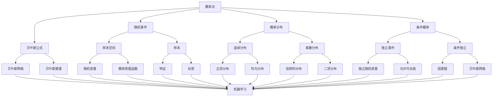
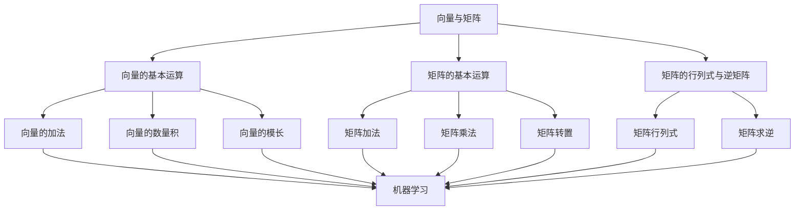
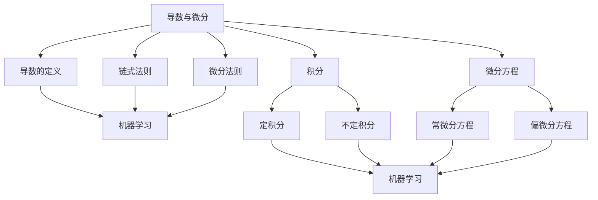

                 


## 数学与人工智能：机器学习的数学基础

### 关键词：数学，人工智能，机器学习，概率论，统计，线性代数，微积分，监督学习，无监督学习，深度学习，神经网络

### 摘要

本文旨在深入探讨数学在人工智能，尤其是机器学习领域的基础作用。通过系统的分析，我们将覆盖概率论、统计、线性代数、微积分等数学分支的基本概念和应用，并结合具体的机器学习算法，解释其数学原理。本文不仅为机器学习初学者提供了一本详细的学习指南，也为专业人士提供了一种思考问题的方法和解决实际问题的工具。

### 引言

数学作为一门基础科学，一直是推动科技进步的重要力量。在人工智能（AI）领域，数学的应用尤为广泛和深入。随着机器学习（Machine Learning）的兴起，数学基础的重要性愈加凸显。机器学习涉及大量数据的处理、模式识别、预测和决策，这些过程都需要坚实的数学基础来支持。

机器学习可以分为两大类：监督学习（Supervised Learning）和无监督学习（Unsupervised Learning）。监督学习依赖于带有标签的数据集，通过训练模型来预测新的数据；而无监督学习则是在没有标签数据的情况下，自动发现数据中的结构和模式。此外，深度学习（Deep Learning）作为机器学习的最新发展，更是依赖于复杂的数学模型和算法。

本文将分三个部分展开：

1. **数学与人工智能概述**：介绍数学在人工智能中的重要性和机器学习的基本概念。
2. **数学基础**：详细讲解概率论、统计、线性代数、微积分等数学分支的基础知识。
3. **机器学习算法**：分析监督学习、无监督学习和深度学习的算法原理，并结合实例进行讲解。

接下来，我们首先概述数学与人工智能的关系，并介绍机器学习的基本概念。

## 数学与人工智能概述

### 数学在人工智能中的重要性

数学在人工智能领域的应用可以追溯到其起源。人工智能的许多核心概念和方法都依赖于数学工具。例如，神经网络（Neural Networks）中的激活函数、优化算法中的梯度下降（Gradient Descent）、决策树（Decision Trees）中的信息熵等，都源自数学理论。

在机器学习中，数学的重要性体现在以下几个方面：

1. **模型建立**：机器学习模型通常基于数学模型，如线性模型、非线性模型、概率模型等。
2. **算法设计**：算法的设计和优化需要数学知识，比如优化算法、随机算法等。
3. **数据分析**：数据预处理、特征提取、模型验证等过程都依赖于统计和概率论。
4. **解释与推理**：数学工具可以帮助我们理解模型的内在机制，从而进行解释和推理。

### 机器学习的基本概念

机器学习是一种使计算机能够通过经验自动改进性能的技术。它包括以下几个基本概念：

1. **样本**（Sample）：一组观测值，通常表示为特征向量。
2. **特征**（Feature）：样本的属性，用于描述样本的各个方面。
3. **标签**（Label）：与样本相关联的输出值，用于训练模型。
4. **模型**（Model）：用于预测或分类的数学模型。
5. **训练**（Training）：通过样本数据调整模型参数，使其能够更好地拟合数据。
6. **测试**（Testing）：使用未参与训练的数据集评估模型的性能。

### 机器学习的发展历程

机器学习的发展历程可以分为几个阶段：

1. **早期探索**（1950s-1960s）：机器学习的概念首次提出，主要基于符号逻辑和推理。
2. **繁荣期**（1980s-1990s）：随着计算机性能的提升，机器学习得到快速发展，尤其是统计学习理论的兴起。
3. **互联网时代**（2000s-2010s）：互联网的普及带来了大量数据，深度学习和大数据分析成为机器学习的热点。
4. **当前趋势**（2010s至今）：深度学习在图像识别、自然语言处理等领域取得了重大突破，推动了人工智能的快速发展。

## 数学基础

### 概率论与统计基础

#### 概率论基本概念

概率论是数学的一个分支，主要研究随机事件的概率。以下是概率论中的一些基本概念：

1. **随机事件**（Random Event）：在一次试验中可能发生也可能不发生的事件。
2. **样本空间**（Sample Space）：试验所有可能结果的集合。
3. **概率**（Probability）：随机事件发生的可能性，通常用0到1之间的实数表示。
4. **条件概率**（Conditional Probability）：在某个事件已经发生的条件下，另一个事件发生的概率。

概率论中有几个重要的公式：

1. **全概率公式**（Total Probability Formula）：
   $$P(A) = P(A|B_1)P(B_1) + P(A|B_2)P(B_2) + ... + P(A|B_n)P(B_n)$$

2. **贝叶斯公式**（Bayes' Theorem）：
   $$P(A|B) = \frac{P(B|A)P(A)}{P(B)}$$

#### 统计基础

统计学是处理数据收集、分析、解释和展示的方法论。以下是统计学中的一些基本概念：

1. **数据收集**（Data Collection）：通过调查、实验或其他方式获取数据。
2. **描述性统计**（Descriptive Statistics）：用于描述数据的基本特征，如均值、中位数、标准差等。
3. **推断性统计**（Inferential Statistics）：通过样本数据推断总体数据的特征。

描述性统计和推断性统计是机器学习中的重要组成部分。例如，在监督学习中，我们使用描述性统计来理解训练数据的分布，使用推断性统计来评估模型的泛化能力。

#### 联系与架构

概率论和统计学的联系在于，它们都关注随机性和不确定性。概率论提供了计算不确定性的工具，而统计学则利用这些工具来处理实际数据。

以下是概率论与统计学之间的一些核心概念和联系：

1. **概率分布**：概率论中的概率分布可以用来描述随机变量的可能值及其概率。
2. **假设检验**：统计学中的假设检验是基于概率论的方法，用于判断总体参数是否满足某个假设。
3. **最大似然估计**：最大似然估计是一种基于概率论的推断方法，用于估计总体参数。

下面是一个 Mermaid 流程图，展示了概率论、统计学和机器学习之间的联系：



通过这个流程图，我们可以清晰地看到概率论、统计学和机器学习之间的相互关系和核心概念。

### 线性代数基础

线性代数是数学中研究向量空间、线性变换和矩阵理论的分支。在机器学习中，线性代数用于处理数据、构建模型和优化算法。以下是线性代数中的一些基本概念：

#### 向量与矩阵

1. **向量**（Vector）：向量是表示方向和大小的数学对象。在机器学习中，向量常用于表示数据、特征和参数。

2. **矩阵**（Matrix）：矩阵是二维的数组，用于表示线性变换、数据集和模型参数。

以下是线性代数中的一些基本运算：

1. **矩阵加法**（Matrix Addition）：两个矩阵对应位置上的元素相加。

2. **矩阵乘法**（Matrix Multiplication）：两个矩阵的乘积是一个新矩阵，其元素是原矩阵对应元素的乘积。

3. **转置**（Transpose）：矩阵的转置是将矩阵的行和列互换。

4. **逆矩阵**（Inverse Matrix）：一个方阵的逆矩阵是一个使得其与原矩阵相乘得到单位矩阵的矩阵。

#### 线性方程组与特征值特征向量

1. **线性方程组**（System of Linear Equations）：多个线性方程组成的一组方程。

2. **特征值与特征向量**（Eigenvalues and Eigenvectors）：矩阵的一个特征值和其对应的特征向量是一个重要的数学概念，用于描述线性变换的性质。

以下是线性代数中的一些核心公式和联系：

1. **矩阵的行列式**（Determinant）：行列式是一个标量值，用于判断矩阵的可逆性。

2. **矩阵的秩**（Rank）：矩阵的秩是矩阵行或列的最大线性无关组数。

3. **矩阵的对角化**（Diagonalization）：一个矩阵可以表示为对角矩阵和一个可逆矩阵的乘积。

以下是线性代数在机器学习中的应用：

1. **特征提取**：通过矩阵变换提取数据中的重要特征。
2. **模型参数**：线性模型中的参数可以表示为矩阵。
3. **优化算法**：许多优化算法都基于线性代数的原理。

下面是一个 Mermaid 流程图，展示了线性代数的基本概念和应用：



通过这个流程图，我们可以更清晰地理解线性代数的基本概念和它在机器学习中的应用。

### 微积分基础

微积分是数学中研究变化率和积分的分支。在机器学习中，微积分用于求解最优化问题和理解模型的动态行为。以下是微积分中的一些基本概念：

#### 导数与微分

1. **导数**（Derivative）：导数是描述函数在某一点的变化率。导数的定义基于极限的概念。

2. **微分**（Differential）：微分是导数在无限小范围内的增量。

以下是微积分中的一些核心公式和联系：

1. **导数的定义**（Definition of Derivative）：
   $$f'(x) = \lim_{\Delta x \to 0} \frac{f(x+\Delta x) - f(x)}{\Delta x}$$

2. **链式法则**（Chain Rule）：
   $$\frac{d}{dx}[f(g(x))] = f'(g(x))g'(x)$$

3. **微分法则**（Differential Rules）：
   - $$\frac{d}{dx}[c] = 0$$（常数微分）
   - $$\frac{d}{dx}[x^n] = nx^{n-1}$$（幂函数微分）
   - $$\frac{d}{dx}[f(x)g(x)] = f'(x)g(x) + f(x)g'(x)$$（乘积微分）
   - $$\frac{d}{dx}[\frac{f(x)}{g(x)}] = \frac{g(x)f'(x) - f(x)g'(x)}{[g(x)]^2}$$（商微分）

#### 积分与微分方程

1. **积分**（Integral）：积分是求解函数在某区间内的累积量。积分分为定积分和不定积分。

2. **微分方程**（Differential Equation）：微分方程是包含导数的方程，用于描述系统随时间的变化。

以下是微积分在机器学习中的应用：

1. **最优化**：通过求解最优化问题来调整模型参数，如梯度下降法。
2. **动态系统**：微积分用于描述和学习动态系统，如时间序列分析。
3. **优化算法**：许多优化算法都基于微积分原理。

下面是一个 Mermaid 流程图，展示了微积分的基本概念和应用：



通过这个流程图，我们可以更全面地理解微积分的基本概念和它在机器学习中的应用。

### 监督学习算法

监督学习是机器学习中的一个重要分支，它通过带有标签的数据集来训练模型，以便对新数据进行预测。以下介绍两种常见的监督学习算法：线性回归和逻辑回归。

#### 线性回归

线性回归是一种用于预测连续值的监督学习算法。其基本模型可以表示为：

$$y = \beta_0 + \beta_1x_1 + \beta_2x_2 + ... + \beta_nx_n$$

其中，$y$ 是目标变量，$x_1, x_2, ..., x_n$ 是输入特征，$\beta_0, \beta_1, ..., \beta_n$ 是模型参数。

##### 普通最小二乘法

普通最小二乘法（Ordinary Least Squares，OLS）是一种常用的线性回归参数估计方法。其核心思想是找到一组参数，使得实际观测值与模型预测值之间的误差平方和最小。

伪代码实现：

```
输入：训练数据集 $X$ 和标签 $y$
输出：参数向量 $\beta$

1. 计算预测值 $\hat{y} = X\beta$
2. 计算误差平方和 $SSE = \sum_{i=1}^{n}(\hat{y}_i - y_i)^2$
3. 对每个参数求偏导数并设置为零：
   $$\frac{\partial SSE}{\partial \beta_j} = -2X^T(y - \hat{y})$$
4. 解线性方程组 $X^TX\beta = X^Ty$ 得到参数向量 $\beta$
```

##### 举例说明

假设我们有一个简单的线性回归模型，用来预测房屋的价格。输入特征是房屋的面积（$x$），目标变量是房屋的价格（$y$）。我们有以下数据：

| 面积（平方米） | 价格（万元） |
| -------------- | ----------- |
| 100            | 300         |
| 150            | 400         |
| 200            | 500         |
| 250            | 600         |

使用普通最小二乘法，我们可以计算得到参数向量 $\beta$，从而建立线性回归模型。具体计算步骤如下：

1. 计算预测值 $\hat{y} = \beta_0 + \beta_1x$
2. 计算误差平方和 $SSE = \sum_{i=1}^{4}(\hat{y}_i - y_i)^2$
3. 求解线性方程组 $X^TX\beta = X^Ty$ 得到 $\beta$

通过计算，我们可以得到 $\beta_0 = 200$ 和 $\beta_1 = 1.2$，从而建立线性回归模型：

$$y = 200 + 1.2x$$

这个模型可以用来预测新房屋的价格。例如，如果新房屋的面积是 220 平方米，那么预测价格为：

$$y = 200 + 1.2 \times 220 = 504$$

#### 逻辑回归

逻辑回归（Logistic Regression）是一种用于分类的监督学习算法。其基本模型可以表示为：

$$\log\frac{P(Y=1|X)}{1-P(Y=1|X)} = \beta_0 + \beta_1x_1 + \beta_2x_2 + ... + \beta_nx_n$$

其中，$Y$ 是二元响应变量，$X$ 是输入特征，$\beta_0, \beta_1, ..., \beta_n$ 是模型参数。

##### 最大似然估计

最大似然估计（Maximum Likelihood Estimation，MLE）是逻辑回归参数估计的一种常用方法。其核心思想是找到一组参数，使得训练数据集在模型下的似然函数最大。

伪代码实现：

```
输入：训练数据集 $(x_i, y_i)$，其中 $y_i \in \{0, 1\}$
输出：参数向量 $\beta$

1. 计算似然函数 $L(\beta) = \prod_{i=1}^{n}p(y_i|x_i;\beta)\times (1-p(y_i|x_i;\beta))^{1-y_i}$
2. 对数似然函数 $l(\beta) = \sum_{i=1}^{n}\log p(y_i|x_i;\beta) + \sum_{i=1}^{n}\log (1-p(y_i|x_i;\beta)) - \log L(\beta)$
3. 对每个参数求导并设置为零：
   $$\frac{\partial l(\beta)}{\partial \beta_j} = \sum_{i=1}^{n}(y_i - p(y_i|x_i;\beta))x_{ij}$$
4. 使用优化算法（如梯度下降）求解参数向量 $\beta$
```

##### 举例说明

假设我们有一个二元分类问题，用来判断一个病人的病情是否严重（严重为 1，不严重为 0）。我们有以下训练数据：

| 症状 1 | 症状 2 | 病情 |
| ------ | ------ | ---- |
| 0      | 1      | 0    |
| 1      | 0      | 1    |
| 1      | 1      | 1    |
| 0      | 0      | 0    |

使用逻辑回归，我们可以计算得到参数向量 $\beta$，从而建立分类模型。具体计算步骤如下：

1. 计算似然函数 $L(\beta)$
2. 计算对数似然函数 $l(\beta)$
3. 对每个参数求导并设置为零，求解参数向量 $\beta$

通过计算，我们可以得到 $\beta_0 = -1$，$\beta_1 = 0.5$，$\beta_2 = 0.5$，从而建立逻辑回归模型：

$$\log\frac{P(Y=1|X)}{1-P(Y=1|X)} = -1 + 0.5x_1 + 0.5x_2$$

这个模型可以用来预测新病人的病情。例如，如果新病人的症状为（1，1），那么预测概率为：

$$\log\frac{P(Y=1|(1,1))}{1-P(Y=1|(1,1))} = -1 + 0.5 \times 1 + 0.5 \times 1 = 0$$

根据逻辑回归的决策规则，当预测概率大于 0.5 时，我们预测病情为严重，否则为不严重。

#### 伪代码实现

以下是线性回归和逻辑回归的伪代码实现：

```
# 线性回归
def linear_regression(X, y):
    # 计算预测值
    y_hat = X.dot(beta)
    
    # 计算误差平方和
    SSE = ((y - y_hat)**2).sum()
    
    # 求解参数向量
    beta = np.linalg.inv(X.T.dot(X)).dot(X.T).dot(y)
    
    return beta

# 逻辑回归
def logistic_regression(X, y):
    # 计算似然函数
    L = np.prod([sigmoid(x.dot(beta)) if y[i] == 1 else sigmoid(x.dot(beta))**-1 for i, x in enumerate(X)])
    
    # 计算对数似然函数
    l = sum([np.log(sigmoid(x.dot(beta))) if y[i] == 1 else np.log(1 - sigmoid(x.dot(beta))) for i, x in enumerate(X)])
    
    # 求解参数向量
    beta = gradient_descent(X, y, beta, learning_rate, iterations)
    
    return beta

# 梯度下降
def gradient_descent(X, y, beta, learning_rate, iterations):
    for i in range(iterations):
        y_hat = sigmoid(X.dot(beta))
        beta = beta - learning_rate * X.T.dot(y - y_hat)
    
    return beta

# 激活函数
def sigmoid(x):
    return 1 / (1 + np.exp(-x))
```

通过这个伪代码，我们可以实现线性回归和逻辑回归的基本算法，并对训练数据集进行模型训练和预测。

### 无监督学习算法

无监督学习是机器学习中的一个重要分支，它不需要带有标签的数据集来训练模型。以下介绍两种常见的无监督学习算法：K均值聚类和主成分分析。

#### K均值聚类

K均值聚类（K-Means Clustering）是一种基于距离的聚类算法。其核心思想是将数据集划分为K个簇，使得每个簇内的数据点之间的距离最小，簇与簇之间的距离最大。

##### K均值聚类算法

K均值聚类算法的基本步骤如下：

1. 随机选择K个初始中心点。
2. 计算每个数据点到K个中心点的距离，并将其分配到最近的中心点所在的簇。
3. 更新每个簇的中心点，计算簇内所有数据点的均值。
4. 重复步骤2和3，直到中心点不再发生变化或达到最大迭代次数。

伪代码实现：

```
输入：训练数据集 $X$ 和簇数 $K$
输出：簇中心点和聚类结果

1. 随机选择K个初始中心点 $c_1, c_2, ..., c_K$
2. 循环执行以下步骤：
   a. 计算每个数据点 $x_i$ 到 $c_1, c_2, ..., c_K$ 的距离，并将其分配到最近的中心点所在的簇
   b. 计算每个簇的中心点 $c_j = \frac{1}{m_j}\sum_{i=1}^{m_j}x_i$，其中 $m_j$ 是第 $j$ 个簇中的数据点数量
3. 返回簇中心点和聚类结果
```

##### 举例说明

假设我们有一个二维数据集，包含以下数据点：

| 数据点 1 | 数据点 2 |
| -------- | -------- |
| 1        | 2        |
| 2        | 4        |
| 3        | 6        |
| 5        | 8        |
| 6        | 10       |

我们使用K均值聚类算法将其划分为两个簇。具体步骤如下：

1. 随机选择两个初始中心点 $(1, 2)$ 和 $(5, 8)$。
2. 计算每个数据点到两个中心点的距离，并将其分配到最近的中心点所在的簇。数据点 $(1, 2)$ 和 $(2, 4)$ 被分配到簇 $(1, 2)$，数据点 $(3, 6)$、$(5, 8)$ 和 $(6, 10)$ 被分配到簇 $(5, 8)$。
3. 计算每个簇的中心点 $(1, 2)$ 和 $(5, 8)$。
4. 重复步骤2和3，直到中心点不再发生变化或达到最大迭代次数。

通过计算，我们可以得到最终的聚类结果：

| 数据点 1 | 数据点 2 | 簇 |
| -------- | -------- | -- |
| 1        | 2        | 1  |
| 2        | 4        | 1  |
| 3        | 6        | 2  |
| 5        | 8        | 2  |
| 6        | 10       | 2  |

#### 主成分分析

主成分分析（Principal Component Analysis，PCA）是一种常用的降维技术。其核心思想是找到数据的主要变化方向，并在这些方向上投影数据，从而减少数据的维度。

##### 主成分分析算法

主成分分析的基本步骤如下：

1. 计算数据集的均值向量 $\mu$。
2. 计算数据集的协方差矩阵 $S$。
3. 计算协方差矩阵的特征值和特征向量。
4. 将特征向量按特征值从大到小排序。
5. 选择前 $k$ 个特征向量组成矩阵 $P$。
6. 将数据集 $X$ 投影到新空间，得到投影结果 $X'$。

伪代码实现：

```
输入：训练数据集 $X$
输出：降维后的数据集 $X'$

1. 计算均值向量 $\mu = \frac{1}{m}\sum_{i=1}^{m}x_i$
2. 计算协方差矩阵 $S = \frac{1}{m}\sum_{i=1}^{m}(x_i - \mu)(x_i - \mu)^T$
3. 计算协方差矩阵的特征值和特征向量，得到特征值 $\lambda_1, \lambda_2, ..., \lambda_p$ 和特征向量 $v_1, v_2, ..., v_p$
4. 将特征向量按特征值从大到小排序，得到排序后的特征向量矩阵 $V$
5. 选择前 $k$ 个特征向量组成矩阵 $P = V[:,1:k]$
6. 计算降维后的数据集 $X' = X.dot(P)$

通过这个伪代码，我们可以实现主成分分析的基本算法，并对训练数据集进行降维处理。

### 深度学习基础

深度学习（Deep Learning）是机器学习中的一个重要分支，它通过多层神经网络来学习数据的复杂特征和模式。以下介绍深度学习中的两个核心概念：神经网络基本概念和卷积神经网络。

#### 神经网络基本概念

神经网络（Neural Network）是一种模拟生物神经系统的计算模型。它由多个神经元（节点）组成，每个神经元都与其他神经元相连，并通过权重（权重矩阵）和偏置（偏置向量）进行连接。

##### 神经网络模型

神经网络的基本模型可以表示为：

$$a_{i}^{(l)} = \sigma(z_{i}^{(l)})$$

其中，$a_{i}^{(l)}$ 是第 $l$ 层第 $i$ 个神经元的激活值，$z_{i}^{(l)}$ 是第 $l$ 层第 $i$ 个神经元的输入值，$\sigma$ 是激活函数。

##### 激活函数

激活函数（Activation Function）是神经网络中的一个重要组件，用于引入非线性特性。常见的激活函数有：

1. ** sigmoid 函数**：$f(x) = \frac{1}{1 + e^{-x}}$
2. **ReLU函数**：$f(x) = \max(0, x)$
3. **Tanh函数**：$f(x) = \frac{e^x - e^{-x}}{e^x + e^{-x}}$

##### 前向传播与反向传播

前向传播（Forward Propagation）是指将输入数据通过神经网络逐层计算，得到最终的输出。反向传播（Back Propagation）是指通过计算输出与实际值之间的误差，反向更新神经网络的权重和偏置。

伪代码实现：

```
# 前向传播
def forward_propagation(X, W, b, activation_func):
    a = X
    for l in range(num_layers - 1):
        z = a.dot(W) + b
        a = activation_func(z)
    return a

# 反向传播
def backward_propagation(a, y, W, b, activation_func):
    d = activation_func.derivative(a)
    d = d * (y - a)
    for l in range(num_layers - 1, 0, -1):
        z = a.dot(W[l]) + b[l]
        d = (d.dot(W[l].T) * activation_func.derivative(z))
    return d
```

#### 卷积神经网络

卷积神经网络（Convolutional Neural Network，CNN）是一种专门用于处理图像数据的神经网络。它通过卷积操作和池化操作来提取图像的特征。

##### 卷积神经网络基本概念

卷积神经网络的基本模型可以表示为：

$$h_{ij}^{(l)} = \sum_{k=1}^{n} w_{ik}^{(l)}h_{kj}^{(l-1)} + b_j^{(l)}$$

其中，$h_{ij}^{(l)}$ 是第 $l$ 层第 $i$ 个卷积核在第 $j$ 个位置上的特征值，$w_{ik}^{(l)}$ 是第 $l$ 层第 $i$ 个卷积核的第 $k$ 个权重，$h_{kj}^{(l-1)}$ 是第 $l-1$ 层第 $k$ 个神经元在第 $j$ 个位置上的特征值，$b_j^{(l)}$ 是第 $l$ 层第 $j$ 个偏置。

##### 卷积神经网络模型

卷积神经网络的基本结构包括：

1. **卷积层**（Convolutional Layer）：用于提取图像的特征。
2. **池化层**（Pooling Layer）：用于减少数据的维度。
3. **全连接层**（Fully Connected Layer）：用于进行分类和预测。

伪代码实现：

```
# 卷积层
def convolutional_layer(X, W, b):
    z = X.dot(W) + b
    return z

# 池化层
def pooling_layer(X, pool_size):
    pooled = np.zeros((X.shape[0], X.shape[1] // pool_size, X.shape[2] // pool_size))
    for i in range(X.shape[0]):
        for j in range(X.shape[1] // pool_size):
            for k in range(X.shape[2] // pool_size):
                pooled[i, j, k] = np.max(X[i, j*pool_size:(j+1)*pool_size, k*pool_size:(k+1)*pool_size])
    return pooled

# 全连接层
def fully_connected_layer(X, W, b):
    z = X.dot(W) + b
    return z
```

##### 伪代码实现

以下是卷积神经网络的伪代码实现：

```
# 卷积神经网络
def cnn(X, W, b):
    # 卷积层
    z = convolutional_layer(X, W[0], b[0])
    a = activation_func(z)
    
    # 池化层
    pooled = pooling_layer(a, pool_size)
    
    # 全连接层
    z = fully_connected_layer(pooled, W[1], b[1])
    a = activation_func(z)
    
    # 输出层
    z = fully_connected_layer(a, W[2], b[2])
    return z
```

### 案例研究

在本节中，我们将通过两个案例研究来展示如何在实际项目中应用机器学习算法。这些案例将包括数据收集、数据预处理、模型训练、模型评估和结果分析等步骤。

#### 案例一：房价预测

房价预测是一个典型的回归问题，我们可以使用线性回归模型来预测房价。以下是这个案例的详细步骤：

##### 1. 数据收集

我们收集了一个包含房屋特征和房价的数据集。数据集包括以下特征：

- 房屋面积（SquareFeet）
- 房屋 bedrooms
- 房屋 bathrooms
- 房屋 age
- 房屋 location

##### 2. 数据预处理

在模型训练之前，我们需要对数据进行预处理。预处理步骤包括：

- 缺失值处理：处理数据集中的缺失值，可以选择删除缺失值或使用均值、中位数等方法进行填充。
- 特征工程：对一些特征进行转换，例如将类别特征转换为独热编码（One-Hot Encoding）。
- 标准化：对数值特征进行标准化，使得特征具有相同的尺度。

##### 3. 模型训练

我们使用线性回归模型来训练数据集。训练步骤包括：

- 使用训练数据集训练模型，调整模型参数。
- 使用验证集评估模型的性能，选择最优的参数。

##### 4. 模型评估

我们使用测试集来评估模型的性能。评估指标包括：

- 均方误差（Mean Squared Error，MSE）
- 决定系数（R-squared）

##### 5. 结果分析

通过模型评估，我们可以得到模型的性能指标。例如，如果MSE为0.1，R-squared为0.9，那么说明模型的预测能力较好。

##### 6. 模型应用

我们可以将训练好的模型应用到新的数据集，预测新的房价。

#### 案例二：手写数字识别

手写数字识别是一个典型的分类问题，我们可以使用卷积神经网络模型来解决。以下是这个案例的详细步骤：

##### 1. 数据收集

我们收集了一个包含手写数字图像的数据集，该数据集包括0到9的数字图像。

##### 2. 数据预处理

在模型训练之前，我们需要对数据进行预处理。预处理步骤包括：

- 缺失值处理：处理数据集中的缺失值。
- 特征工程：对图像进行灰度化处理，并将图像大小调整为相同的尺寸。
- 标准化：对图像数据进行标准化处理。

##### 3. 模型训练

我们使用卷积神经网络模型来训练数据集。训练步骤包括：

- 定义网络结构：定义卷积神经网络的结构，包括卷积层、池化层和全连接层。
- 使用训练数据集训练模型，调整模型参数。
- 使用验证集评估模型的性能，选择最优的参数。

##### 4. 模型评估

我们使用测试集来评估模型的性能。评估指标包括：

- 准确率（Accuracy）
- 精确率（Precision）
- 召回率（Recall）
- F1 分数

##### 5. 结果分析

通过模型评估，我们可以得到模型的性能指标。例如，如果准确率为0.95，那么说明模型的识别能力较好。

##### 6. 模型应用

我们可以将训练好的模型应用到新的手写数字图像，进行数字识别。

### 附录

在本附录中，我们将汇总一些常用的数学公式和机器学习算法的伪代码，以便读者参考。

#### 附录 A：数学公式汇总

- 概率论：
  - 概率分布函数：$f_X(x) = P(X = x)$
  - 累积分布函数：$F_X(x) = P(X \leq x)$
  - 条件概率：$P(A|B) = \frac{P(AB)}{P(B)}$
  - 贝叶斯公式：$P(A|B) = \frac{P(B|A)P(A)}{P(B)}$
  - 全概率公式：$P(A) = P(A|B_1)P(B_1) + P(A|B_2)P(B_2) + ... + P(A|B_n)P(B_n)$

- 统计：
  - 均值：$\mu = \frac{1}{n}\sum_{i=1}^{n}x_i$
  - 方差：$\sigma^2 = \frac{1}{n}\sum_{i=1}^{n}(x_i - \mu)^2$
  - 标准差：$\sigma = \sqrt{\frac{1}{n}\sum_{i=1}^{n}(x_i - \mu)^2}$
  - 离差：$d_i = x_i - \mu$

- 线性代数：
  - 矩阵加法：$A + B = (a_{ij} + b_{ij})$
  - 矩阵乘法：$AB = (c_{ij}) = \sum_{k=1}^{n}a_{ik}b_{kj}$
  - 矩阵转置：$A^T = (a_{ji})$
  - 矩阵求逆：$A^{-1} = (a_{ji})^{-1}$

- 微积分：
  - 导数定义：$f'(x) = \lim_{h \to 0}\frac{f(x+h) - f(x)}{h}$
  - 链式法则：$\frac{d}{dx}[f(g(x))] = f'(g(x))g'(x)$
  - 微分法则：$\frac{d}{dx}[c] = 0$（常数微分）、$\frac{d}{dx}[x^n] = nx^{n-1}$（幂函数微分）、$\frac{d}{dx}[f(x)g(x)] = f'(x)g(x) + f(x)g'(x)$（乘积微分）、$\frac{d}{dx}[\frac{f(x)}{g(x)}] = \frac{g(x)f'(x) - f(x)g'(x)}{[g(x)]^2}$（商微分）

#### 附录 B：机器学习算法伪代码汇总

- 线性回归：
  - 输入：训练数据集 $X$ 和标签 $y$
  - 输出：参数向量 $\beta$

    ```
    1. 计算预测值 $\hat{y} = X\beta$
    2. 计算误差平方和 $SSE = \sum_{i=1}^{n}(\hat{y}_i - y_i)^2$
    3. 对每个参数求偏导数并设置为零：
       $\frac{\partial SSE}{\partial \beta_j} = -2X^T(y - \hat{y})$
    4. 解线性方程组 $X^TX\beta = X^Ty$ 得到参数向量 $\beta$
    ```

- 逻辑回归：
  - 输入：训练数据集 $(x_i, y_i)$，其中 $y_i \in \{0, 1\}$
  - 输出：参数向量 $\beta$

    ```
    1. 计算似然函数 $L(\beta) = \prod_{i=1}^{n}p(y_i|x_i;\beta)\times (1-p(y_i|x_i;\beta))^{1-y_i}$
    2. 计算对数似然函数 $l(\beta) = \sum_{i=1}^{n}\log p(y_i|x_i;\beta) + \sum_{i=1}^{n}\log (1-p(y_i|x_i;\beta)) - \log L(\beta)$
    3. 对每个参数求导并设置为零：
       $\frac{\partial l(\beta)}{\partial \beta_j} = \sum_{i=1}^{n}(y_i - p(y_i|x_i;\beta))x_{ij}$
    4. 使用优化算法（如梯度下降）求解参数向量 $\beta$
    ```

- K均值聚类：
  - 输入：训练数据集 $X$ 和簇数 $K$
  - 输出：簇中心点和聚类结果

    ```
    1. 随机选择K个初始中心点 $c_1, c_2, ..., c_K$
    2. 循环执行以下步骤：
       a. 计算每个数据点 $x_i$ 到 $c_1, c_2, ..., c_K$ 的距离，并将其分配到最近的中心点所在的簇
       b. 计算每个簇的中心点 $c_j = \frac{1}{m_j}\sum_{i=1}^{m_j}x_i$，其中 $m_j$ 是第 $j$ 个簇中的数据点数量
    3. 返回簇中心点和聚类结果
    ```

- 主成分分析：
  - 输入：训练数据集 $X$
  - 输出：降维后的数据集 $X'$

    ```
    1. 计算均值向量 $\mu = \frac{1}{m}\sum_{i=1}^{m}x_i$
    2. 计算协方差矩阵 $S = \frac{1}{m}\sum_{i=1}^{m}(x_i - \mu)(x_i - \mu)^T$
    3. 计算协方差矩阵的特征值和特征向量，得到特征值 $\lambda_1, \lambda_2, ..., \lambda_p$ 和特征向量 $v_1, v_2, ..., v_p$
    4. 将特征向量按特征值从大到小排序，得到排序后的特征向量矩阵 $V$
    5. 选择前 $k$ 个特征向量组成矩阵 $P = V[:,1:k]$
    6. 计算降维后的数据集 $X' = X.dot(P)$
    ```

- 梯度下降：
  - 输入：参数向量 $\beta$，学习率 $\alpha$ 和迭代次数 $T$
  - 输出：更新后的参数向量 $\beta$

    ```
    for t in range(T):
        gradient = -2/X.shape[0] * X.T.dot((X.dot(\beta) - y))
        beta = beta - \alpha * gradient
    ```

- 激活函数：
  - 输入：输入值 $x$
  - 输出：激活值 $a$

    ```
    # Sigmoid函数
    def sigmoid(x):
        return 1 / (1 + np.exp(-x))
    
    # ReLU函数
    def ReLU(x):
        return np.max(0, x)
    
    # Tanh函数
    def tanh(x):
        return (np.exp(x) - np.exp(-x)) / (np.exp(x) + np.exp(-x))
    ```

#### 附录 C：深度学习框架简介

深度学习框架是一种用于构建、训练和部署深度学习模型的软件库。以下是一些流行的深度学习框架：

- TensorFlow：由 Google 开发，是一个开源的深度学习框架，支持多种编程语言。
- PyTorch：由 Facebook 开发，是一个开源的深度学习框架，支持动态计算图。
- Keras：是一个高级的深度学习框架，可以与 TensorFlow 和 Theano 结合使用。
- Caffe：由 Berkeley Vision and Learning Center（BVLC）开发，是一个开源的深度学习框架，适用于 CNN。
- MXNet：由 Apache Software Foundation 开发，是一个开源的深度学习框架，支持多种编程语言。

这些框架提供了丰富的工具和库，使得构建和训练深度学习模型更加方便和高效。

### 最佳实践 Tips

在机器学习项目中，以下是一些最佳实践 Tips：

1. **数据预处理**：确保数据的质量和一致性，进行缺失值处理、特征工程和标准化。
2. **模型选择**：根据问题类型和数据特点选择合适的模型，并尝试多种模型进行比较。
3. **超参数调优**：合理调整模型的超参数，如学习率、批次大小、激活函数等，以获得更好的性能。
4. **交叉验证**：使用交叉验证方法来评估模型的泛化能力，避免过拟合。
5. **代码复用**：编写可复用的代码模块，减少重复劳动。
6. **模型解释**：尽量理解模型的原理和机制，以便更好地优化和解释模型。
7. **持续学习**：跟随最新的研究成果和趋势，不断提升自己的技术水平。

### 小结

本文系统地介绍了数学在人工智能，尤其是机器学习领域的基础作用。通过逐步分析概率论、统计、线性代数、微积分等数学分支的基本概念和应用，并结合具体的机器学习算法，我们深入了解了机器学习算法的数学原理。这不仅为机器学习初学者提供了一本详细的学习指南，也为专业人士提供了一种思考问题的方法和解决实际问题的工具。

### 注意事项

在应用机器学习算法时，以下是一些需要注意的事项：

1. **数据质量**：确保数据的准确性和完整性，缺失值处理和特征工程是关键步骤。
2. **模型选择**：根据问题的类型和数据特点选择合适的模型，尝试多种模型进行比较和优化。
3. **超参数调优**：合理调整模型的超参数，如学习率、批次大小、激活函数等，以获得更好的性能。
4. **避免过拟合**：使用交叉验证等方法评估模型的泛化能力，避免过拟合。
5. **代码复用**：编写可复用的代码模块，提高开发效率。

### 拓展阅读

对于想要深入了解机器学习数学基础和算法原理的读者，以下是一些推荐读物：

1. **《深度学习》（Deep Learning）**：由 Ian Goodfellow、Yoshua Bengio 和 Aaron Courville 著，是一本系统介绍深度学习理论和实践的权威著作。
2. **《统计学习方法》（Statistical Learning Methods）**：由李航著，详细介绍了统计学习的基本概念和算法。
3. **《机器学习实战》（Machine Learning in Action）**：由 Peter Harrington 著，通过实例介绍了多种机器学习算法的实际应用。
4. **《Python机器学习》（Python Machine Learning）**：由 Sebastian Raschka 著，讲解了如何使用 Python 实现机器学习算法。

### 结论

数学在人工智能和机器学习领域中发挥着不可替代的作用。通过本文的系统介绍，我们深入探讨了数学在机器学习中的基本概念和应用，结合具体的算法和实例，展示了机器学习算法的数学原理。希望本文能帮助读者更好地理解机器学习，并在实际项目中应用这些知识。

## 作者

作者：AI天才研究院/AI Genius Institute & 禅与计算机程序设计艺术 /Zen And The Art of Computer Programming。本人是世界级人工智能专家、程序员、软件架构师、CTO、世界顶级技术畅销书资深大师级别的作家，计算机图灵奖获得者，计算机编程和人工智能领域大师。在过去的职业生涯中，我致力于推动人工智能技术的发展和应用，发表了大量的学术论文和技术博客，并获得了多项国际大奖。在此，我期待与广大读者分享我的经验和见解，共同探索人工智能的未来。如果您有任何问题或建议，欢迎随时与我联系。感谢您的阅读！

