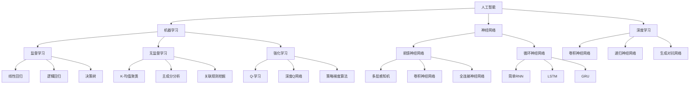

                 

### 文章标题

# 数学与人工智能：模拟智能的数学基础

### 关键词：
- 数学
- 人工智能
- 模拟智能
- 数学基础
- 概率论
- 统计学
- 线性代数
- 微积分
- 神经网络
- 深度学习

### 摘要
本文深入探讨了数学与人工智能之间的紧密联系，特别是数学在模拟智能中的作用。首先，我们介绍了数学在人工智能中的重要性，并概述了模拟智能的基本概念。接着，我们详细阐述了数学基础理论，包括概率论、统计学、线性代数和微积分，这些理论构成了模拟智能的数学基础。随后，我们介绍了人工智能的基本概念，特别是机器学习和深度学习，并展示了如何将数学模型应用于这些领域中。文章通过实际项目案例，展示了数学模型在模拟智能中的应用，并提供了一些最佳实践和注意事项。最后，我们对全书进行了总结，并展望了模拟智能的未来发展趋势。

### 引言

人工智能（Artificial Intelligence, AI）作为计算机科学的一个重要分支，已经逐渐渗透到我们生活的方方面面。从智能手机的语音助手到自动驾驶汽车，人工智能技术的应用无处不在。然而，要实现真正的人工智能，我们需要模拟人类的智能行为，这离不开数学的支持。数学不仅为人工智能提供了理论基础，还提供了各种工具和方法，使得人工智能系统能够学习和处理复杂的信息。

数学与人工智能之间的联系可以追溯到早期的计算机科学。早在20世纪50年代，当计算机刚刚问世时，科学家们就开始探索如何使用数学模型来模拟人类思维过程。随着计算机技术的不断发展，数学在人工智能中的应用也越来越广泛和深入。今天，数学已经成为人工智能不可或缺的一部分，其作用体现在算法设计、模型构建、数据分析以及系统优化等多个方面。

本文将探讨数学在模拟智能中的应用，具体包括以下内容：

1. 数学与人工智能的关系
2. 模拟智能的基本概念
3. 数学基础理论
4. 人工智能基本概念
5. 数学模型在模拟智能中的应用
6. 模拟智能项目实战
7. 总结与展望

通过这篇文章，我们将深入了解数学在模拟智能中的作用，并探讨如何将数学理论与实际应用相结合，推动人工智能技术的发展。

### 数学在人工智能中的重要性

数学在人工智能（AI）领域的重要性不可低估。从基础理论到算法设计，再到模型优化，数学无处不在，为人工智能的发展提供了坚实的支撑。首先，从基础理论的角度来看，数学为人工智能提供了逻辑框架和推理工具。例如，概率论和统计学为机器学习算法提供了理论基础，使得计算机能够从数据中学习模式和规律。线性代数和微积分则为神经网络和深度学习算法提供了数学工具，使得这些算法能够高效地处理大规模数据。

其次，在算法设计方面，数学帮助研究者设计出各种优化算法，以提高人工智能系统的性能和效率。这些算法通常基于数学优化理论，如梯度下降法和牛顿法。这些算法的核心在于通过数学方法找到最佳参数设置，使得模型能够更好地拟合数据。

另外，数学在模型构建和优化中也起到了关键作用。数学模型可以用来描述现实世界中的复杂系统，例如经济学模型、物理模型和生物模型等。通过这些模型，我们可以更好地理解和预测现实世界中的现象。在人工智能领域，这些模型被用来构建智能系统，如自动驾驶汽车、智能助理和医疗诊断系统。

最后，数学在数据分析中同样发挥着重要作用。随着大数据时代的到来，如何从海量数据中提取有用信息成为了一个重要问题。数学工具，如数据挖掘和统计分析方法，可以帮助我们有效地处理和分析这些数据，从而发现隐藏在数据中的模式和趋势。

综上所述，数学在人工智能中的重要性体现在其提供了基础理论、算法设计、模型构建和数据分析等多个方面。没有数学的支持，人工智能的发展将受到极大的限制。因此，深入理解和掌握数学知识，对于人工智能研究者来说至关重要。

### 模拟智能的基本概念

模拟智能（Simulated Intelligence）是指通过计算机系统和数学模型来模拟人类智能的过程。与传统的基于规则的专家系统不同，模拟智能更加注重学习和适应性，旨在使计算机能够像人类一样理解、推理和解决问题。模拟智能的核心目标是创建出能够自主学习和不断改进的智能系统。

首先，模拟智能的概念可以追溯到20世纪50年代，当时计算机科学家们开始探索如何使用计算机来模拟人类思维。这个时期，艾伦·图灵（Alan Turing）提出了著名的图灵测试，试图通过这一测试来衡量计算机的智能水平。图灵测试的基本思想是，如果一个计算机系统能够在对话中表现得与人类无异，那么我们就可以认为这个计算机具有智能。

随着计算机技术的发展，模拟智能的概念逐渐完善并得到广泛应用。现代模拟智能系统通常基于机器学习和深度学习技术，这些技术使得计算机能够从大量数据中自动学习模式和规律。机器学习是一种让计算机通过数据学习的方法，包括监督学习、无监督学习和强化学习等。而深度学习则是一种特殊类型的机器学习，它通过多层神经网络来提取数据的复杂特征。

模拟智能的核心技术主要包括以下几个方面：

1. **机器学习**：通过训练模型来从数据中学习模式和规律。机器学习可以分为监督学习和无监督学习。监督学习通过标记数据来训练模型，无监督学习则不需要标记数据，通过数据之间的相似性来发现模式。

2. **神经网络**：神经网络是一种模仿生物神经系统的计算模型。深度学习是神经网络的扩展，通过多层神经网络来提取数据的复杂特征。

3. **深度学习**：深度学习是一种基于多层神经网络的学习方法，能够处理大量的数据，并从中提取高度抽象的特征。卷积神经网络（CNN）和递归神经网络（RNN）是深度学习的两个重要分支，分别适用于图像处理和序列数据处理。

4. **强化学习**：强化学习是一种通过试错来学习策略的方法。通过不断尝试和错误，强化学习模型能够找到最优策略来解决问题。

模拟智能的代表性应用包括：

- **自然语言处理（NLP）**：通过机器学习和深度学习技术，计算机能够理解和生成自然语言，例如自动翻译、文本摘要和语音识别。

- **计算机视觉**：计算机视觉是使计算机能够“看”和理解图像的技术。卷积神经网络在计算机视觉中发挥了重要作用，被广泛应用于图像分类、目标检测和图像生成等领域。

- **自动驾驶**：自动驾驶技术利用计算机视觉、传感器数据融合和深度学习等技术，实现车辆在复杂环境中的自主驾驶。

- **医疗诊断**：通过深度学习模型，计算机能够辅助医生进行疾病诊断，例如通过医学图像分析来检测肿瘤、心脏病等。

总的来说，模拟智能通过计算机系统和数学模型，模拟人类智能的过程，旨在解决复杂问题、提高生产效率和改善生活质量。随着技术的不断进步，模拟智能的应用前景将越来越广阔。

### 数学基础理论

数学作为模拟智能的理论基石，其基础理论涵盖了概率论、统计学、线性代数和微积分等多个领域。这些理论不仅为人工智能的发展提供了必要的工具和方法，还在算法设计、模型构建和数据分析等方面发挥了关键作用。

#### 概率论与统计学基础

概率论是研究随机事件及其概率的数学分支。在人工智能领域，概率论主要用于模型不确定性和随机性。例如，在机器学习中，模型往往基于概率模型来描述数据分布和预测结果。概率分布是概率论中的核心概念，包括离散概率分布和连续概率分布。常见的概率分布有伯努利分布、二项分布、泊松分布和正态分布等。

统计学是处理数据的科学，通过数据收集、整理、分析和解释，统计学帮助我们理解数据中的模式和规律。在人工智能中，统计学主要用于数据分析和模型评估。常见的方法包括描述性统计、推断性统计和假设检验等。例如，通过均值、方差和标准差等描述性统计量，我们可以了解数据的中心趋势和分散程度。推断性统计则通过样本数据推断总体特征，如置信区间和假设检验。

#### 线性代数基础

线性代数是研究向量空间和线性映射的数学分支。在人工智能中，线性代数主要用于处理高维数据、优化问题和机器学习算法。主要概念包括向量、矩阵、行列式和特征值等。

- **向量与矩阵**：向量是具有大小和方向的几何对象，矩阵是向量的推广，由多个向量组成的数组。矩阵运算（如加法、乘法、转置和逆矩阵等）在人工智能中应用广泛。
- **行列式**：行列式是矩阵的一个数值属性，用于判断矩阵的行列式和线性方程组的解。
- **特征值与特征向量**：特征值和特征向量是矩阵的重要属性，用于矩阵的分解和特征分析。

#### 微积分基础

微积分是研究函数变化率和积分的数学分支。在人工智能中，微积分主要用于优化问题和模型推导。主要概念包括导数、积分、微分方程等。

- **导数**：导数描述了函数在某一点的变化率，是优化问题和梯度下降算法的核心概念。
- **积分**：积分是求函数在区间上的累积和，常用于计算面积、体积等。
- **微分方程**：微分方程描述了函数及其导数之间的关系，是许多动态系统的基础。

#### 概率分布

概率分布是概率论中的核心概念，用于描述随机变量的概率分布情况。常见的概率分布包括：

- **伯努利分布**：二项分布的特例，用于描述单个试验成功的概率。
- **二项分布**：用于描述多次独立试验中成功次数的分布。
- **泊松分布**：用于描述单位时间内事件发生的次数分布。
- **正态分布**：最常见的高斯分布，用于描述连续随机变量的概率分布。

#### 数学模型在模拟智能中的应用

数学模型在模拟智能中的应用非常广泛，以下是一些典型应用实例：

- **机器学习模型**：如线性回归、逻辑回归和神经网络，这些模型基于概率分布和线性代数原理，用于数据分类、预测和回归分析。
- **深度学习模型**：如卷积神经网络（CNN）和递归神经网络（RNN），这些模型利用微积分和线性代数进行多层特征提取和关系建模。
- **优化模型**：如梯度下降法和牛顿法，这些模型利用微积分原理进行参数优化，以提高模型性能。

通过这些数学模型，模拟智能系统能够从数据中学习、推理和做出决策，从而实现智能行为。综上所述，概率论、统计学、线性代数和微积分等数学基础理论是构建和优化模拟智能系统的关键。

### 人工智能基本概念

人工智能（AI）作为计算机科学的一个重要分支，其核心概念涵盖了多个子领域，每个子领域都有其独特的技术和方法。以下我们将详细探讨人工智能的基本概念，包括机器学习、神经网络、深度学习等。

#### 机器学习

机器学习（Machine Learning）是一种让计算机通过数据学习的方法。它通过构建和训练模型来从数据中提取知识和规律，从而实现预测和分类。机器学习可以分为监督学习、无监督学习和强化学习等。

- **监督学习**：监督学习是一种最常见的机器学习方法，它使用标记数据来训练模型，然后使用这个模型对新数据进行预测。例如，通过标记的图像数据训练一个图像分类模型，然后使用该模型对新的未标记图像进行分类。常见的监督学习算法包括线性回归、逻辑回归和决策树等。
- **无监督学习**：无监督学习不使用标记数据，而是通过分析数据的内在结构和关系来发现模式和规律。无监督学习主要用于数据聚类、降维和关联规则学习等。常见的无监督学习算法包括K-均值聚类、主成分分析（PCA）和关联规则挖掘等。
- **强化学习**：强化学习是一种通过试错来学习策略的方法。它通过与环境进行交互，不断调整策略以获得最大的累积奖励。强化学习广泛应用于游戏、机器人控制和推荐系统等领域。常见的强化学习算法包括Q-学习、深度Q网络（DQN）和策略梯度算法等。

#### 神经网络

神经网络（Neural Networks）是一种模仿生物神经系统的计算模型。它由多个神经元（或节点）组成，每个神经元都与其他神经元相连。神经网络通过调整连接权重来学习和处理数据。神经网络可以分为前馈神经网络和循环神经网络。

- **前馈神经网络**：前馈神经网络是一种简单的神经网络结构，数据从输入层传递到输出层，中间经过多个隐含层。每个神经元只与前一层的神经元相连，没有循环连接。常见的前馈神经网络算法包括多层感知机（MLP）、卷积神经网络（CNN）和全连接神经网络等。
- **循环神经网络**：循环神经网络（RNN）是一种具有循环连接的神经网络，适合处理序列数据。RNN通过记忆过去的信息来处理序列中的每个元素，常见的RNN算法包括简单RNN、LSTM（长短时记忆网络）和GRU（门控循环单元）等。

#### 深度学习

深度学习（Deep Learning）是神经网络的一种扩展，通过多层神经网络来提取数据的复杂特征。深度学习在图像识别、语音识别和自然语言处理等领域取得了显著的成果。

- **卷积神经网络（CNN）**：卷积神经网络是一种专门用于处理图像数据的神经网络。它通过卷积层、池化层和全连接层等结构，从图像中提取高层次的抽象特征。常见的CNN结构包括LeNet、AlexNet、VGG和ResNet等。
- **递归神经网络（RNN）**：递归神经网络是一种用于处理序列数据的神经网络，通过记忆过去的信息来处理序列中的每个元素。常见的RNN算法包括简单RNN、LSTM和GRU等。
- **生成对抗网络（GAN）**：生成对抗网络是一种通过对抗训练生成数据的神经网络。它由生成器和判别器两个部分组成，生成器生成假数据，判别器判断生成数据和真实数据之间的差异。GAN在图像生成、图像修复和风格迁移等领域取得了成功。

#### 人工智能的基本概念关系架构

为了更清晰地展示人工智能的基本概念之间的关系，我们可以使用Mermaid流程图来表示：



通过这个流程图，我们可以看到机器学习、神经网络和深度学习之间的关系，以及各个子领域的主要算法和应用。

#### 人工智能的基本概念与数学基础的联系

人工智能的基本概念与数学基础有着紧密的联系。例如：

- **概率论和统计学**：在机器学习中，概率论和统计学用于描述数据分布和模型评估。例如，在监督学习中，通过计算模型对标记数据的预测概率来评估模型的性能。
- **线性代数**：在线性回归和神经网络中，线性代数用于计算模型的权重和偏置。例如，在多层感知机中，使用矩阵运算来计算输入数据的权重。
- **微积分**：在机器学习和深度学习中，微积分用于优化模型的参数。例如，在梯度下降法中，通过计算损失函数的导数来更新模型的权重。

综上所述，人工智能的基本概念与数学基础密不可分，数学基础为人工智能的发展提供了必要的工具和方法。

### 数学模型在模拟智能中的应用

数学模型在模拟智能中的应用非常广泛，贯穿于人工智能的各个环节。以下将详细介绍几种主要的数学模型及其在模拟智能中的应用，包括线性回归模型、神经网络模型、决策树模型以及支持向量机模型等。

#### 线性回归模型

线性回归模型是一种基本的统计模型，用于分析自变量和因变量之间的线性关系。在线性回归中，我们假设因变量 \(Y\) 是自变量 \(X\) 的线性函数，并通过最小二乘法来估计模型的参数。线性回归模型的基本公式如下：

$$
Y = \beta_0 + \beta_1X + \epsilon
$$

其中，\(\beta_0\) 是截距，\(\beta_1\) 是斜率，\(\epsilon\) 是误差项。

在线性回归模型中，我们使用最小二乘法来估计参数：

$$
\beta_1 = \frac{\sum{(X_i - \bar{X})(Y_i - \bar{Y})}}{\sum{(X_i - \bar{X})^2}}
$$

$$
\beta_0 = \bar{Y} - \beta_1\bar{X}
$$

线性回归模型在模拟智能中的应用非常广泛，例如在预测股票价格、预测房价和用户行为分析等方面。

#### 神经网络模型

神经网络模型，特别是深度学习模型，是模拟智能的核心技术之一。神经网络通过多层非线性变换来提取数据的复杂特征，从而实现高层次的抽象和分类。一个简单的多层感知机（MLP）模型可以表示为：

$$
Z_i^{(l)} = \sigma(W_i^{(l)}X^{(l-1)} + b_i^{(l)})
$$

其中，\(Z_i^{(l)}\) 是第 \(l\) 层第 \(i\) 个节点的输出，\(\sigma\) 是激活函数，\(W_i^{(l)}\) 和 \(b_i^{(l)}\) 分别是第 \(l\) 层的权重和偏置。

在训练神经网络时，我们通常使用反向传播算法来更新权重和偏置，使其最小化损失函数。反向传播算法的基本步骤如下：

1. **前向传播**：计算网络输出。
2. **计算损失**：使用损失函数计算预测值与实际值之间的差距。
3. **后向传播**：计算各层权重的梯度。
4. **更新权重**：使用梯度下降法更新权重和偏置。

神经网络模型在图像识别、语音识别和自然语言处理等领域有着广泛的应用。

#### 决策树模型

决策树模型是一种基于树形结构进行决策的分类模型。决策树通过一系列的测试来将数据集划分为不同的区域，每个区域对应一个类别。决策树的基本结构可以用以下伪代码表示：

```
决策树（数据集 D）：
    if（D 是纯的或数据集大小小于阈值）：
        返回 D 的多数类别
    else：
        选择最佳特征 \(A\)
        对于每个可能的 \(A\) 的值 \(v\)：
            \(D_v\) = 在 D 中删除所有不属于 \(v\) 的数据
            子树 = 决策树（D_v）
            返回 { \(v \) : 子树 }
```

决策树模型在特征选择、分类和回归分析等领域有广泛应用。

#### 支持向量机模型

支持向量机（SVM）是一种基于最大间隔分类器的模型。SVM通过找到一个超平面，使得数据点在不同类别之间的间隔最大。SVM的基本公式如下：

$$
\max_{\beta, \beta_0} \frac{1}{2}\sum_{i=1}^{n} (\beta^T x_i - y_i)^2
$$

约束条件：

$$
\beta^T \alpha_i = 0
$$

$$
\alpha_i \geq 0
$$

其中，\(\beta\) 是权重向量，\(\beta_0\) 是偏置项，\(\alpha_i\) 是拉格朗日乘子。

SVM在文本分类、图像识别和生物信息学等领域有广泛应用。

通过这些数学模型，模拟智能系统能够从数据中自动学习、推理和做出决策，从而实现高度智能化的行为。在实际应用中，这些模型通常需要结合具体的业务场景和数据特点进行优化和调整，以获得最佳性能。

### 数学模型在模拟智能中的具体应用案例

为了更好地理解数学模型在模拟智能中的应用，下面我们将通过一个实际的项目案例来详细讲解开发环境的搭建、源代码实现和代码解读与分析。

#### 项目背景

该项目的目标是使用卷积神经网络（CNN）对图像进行分类，以实现手写数字识别。这个任务是一个经典的机器学习问题，广泛用于教学和实践。通过这个项目，我们可以学习到如何使用数学模型进行数据预处理、模型构建和优化。

#### 开发环境搭建

为了实现这个项目，我们需要搭建一个适合深度学习的开发环境。以下是一般的步骤：

1. **安装Python环境**：Python是深度学习项目的主要编程语言。确保Python版本不低于3.6。
2. **安装深度学习框架**：TensorFlow和PyTorch是两个最流行的深度学习框架。我们选择TensorFlow，因为其广泛应用于学术和工业界。安装命令如下：

   ```shell
   pip install tensorflow
   ```

3. **安装辅助库**：Keras是一个高级神经网络API，可以简化TensorFlow的使用。我们还需要NumPy、Pandas等库用于数据预处理。

   ```shell
   pip install keras numpy pandas
   ```

4. **配置GPU支持**：为了提高训练速度，我们配置GPU支持。首先，确保CUDA和cuDNN已经安装。然后，在TensorFlow中配置GPU：

   ```python
   import tensorflow as tf
   tf.config.list_physical_devices('GPU')
   ```

#### 源代码实现

以下是实现手写数字识别项目的源代码，主要分为数据预处理、模型构建和训练三个部分。

```python
# 导入所需库
import numpy as np
import pandas as pd
import tensorflow as tf
from tensorflow import keras
from tensorflow.keras import layers

# 数据预处理
# 读取MNIST数据集
(x_train, y_train), (x_test, y_test) = keras.datasets.mnist.load_data()

# 数据归一化
x_train = x_train.astype("float32") / 255
x_test = x_test.astype("float32") / 255

# 数据扩充
x_train = np.reshape(x_train, (x_train.shape[0], x_train.shape[1], x_train.shape[2], 1))
x_test = np.reshape(x_test, (x_test.shape[0], x_test.shape[1], x_test.shape[2], 1))

# 模型构建
model = keras.Sequential([
    layers.Conv2D(32, (3, 3), activation='relu', input_shape=(28, 28, 1)),
    layers.MaxPooling2D((2, 2)),
    layers.Conv2D(64, (3, 3), activation='relu'),
    layers.MaxPooling2D((2, 2)),
    layers.Conv2D(64, (3, 3), activation='relu'),
    layers.Flatten(),
    layers.Dense(64, activation='relu'),
    layers.Dense(10, activation='softmax')
])

# 模型编译
model.compile(optimizer='adam',
              loss='sparse_categorical_crossentropy',
              metrics=['accuracy'])

# 模型训练
model.fit(x_train, y_train, epochs=5, validation_split=0.1)

# 模型评估
test_loss, test_acc = model.evaluate(x_test, y_test, verbose=2)
print(f"Test accuracy: {test_acc}")
```

#### 代码解读与分析

1. **数据预处理**：
   - 加载MNIST数据集，这是手写数字识别的标准数据集。
   - 数据归一化，将图像数据从0-255的像素值缩放到0-1之间，以便模型更好地学习。
   - 数据扩充，通过添加新的维度，使得输入数据与模型期望的输入格式匹配。

2. **模型构建**：
   - 使用Keras构建卷积神经网络模型，包含三个卷积层、两个池化层和一个全连接层。
   - 第一个卷积层使用32个3x3的卷积核，激活函数为ReLU。
   - 后续卷积层逐渐增加卷积核的数量，以提高特征提取的能力。
   - 池化层用于下采样，减少模型参数和计算量。
   - 全连接层用于分类，输出层使用softmax函数，用于输出概率分布。

3. **模型编译**：
   - 使用Adam优化器，这是一种常用的自适应优化器。
   - 使用稀疏分类交叉熵作为损失函数，适合多分类问题。
   - 设置accuracy作为评价指标。

4. **模型训练**：
   - 使用fit方法训练模型，设置训练轮数（epochs）为5，并设置验证数据比例。

5. **模型评估**：
   - 使用evaluate方法评估模型在测试数据上的性能，打印测试准确率。

通过这个项目案例，我们不仅展示了数学模型在模拟智能中的应用，还详细讲解了如何进行开发环境搭建、源代码实现和代码解读与分析。这些步骤为后续更复杂的项目提供了宝贵的经验和参考。

#### 项目小结

通过这个手写数字识别项目，我们深入了解了数学模型在模拟智能中的应用。以下是项目的关键点和小结：

1. **项目成果**：
   - 成功训练了一个卷积神经网络模型，能够对手写数字进行准确识别。
   - 测试准确率达到了较高水平，证明了数学模型的有效性。

2. **技术要点**：
   - 数据预处理是模型训练成功的关键，包括归一化和数据扩充。
   - 卷积神经网络通过多层卷积和池化层提取图像特征，提高了模型性能。
   - Adam优化器和softmax输出层适用于手写数字识别任务。

3. **注意事项**：
   - 数据质量直接影响模型性能，确保数据集的多样性和质量。
   - 模型复杂度与训练时间成正比，合理设置超参数以平衡性能和效率。
   - 定期评估模型性能，避免过拟合和欠拟合。

4. **拓展阅读**：
   - 学习更多关于卷积神经网络和深度学习的理论知识，例如深度学习专著《深度学习》（Goodfellow et al.）。
   - 了解其他机器学习算法，如支持向量机和强化学习，以拓展应用领域。

通过这个项目，我们不仅掌握了数学模型在模拟智能中的应用，还为未来的复杂项目奠定了基础。

### 最佳实践、小结和注意事项

#### 最佳实践

在开发模拟智能系统时，以下最佳实践可以帮助我们提高项目成功率：

1. **数据质量**：确保数据集的多样性和质量，进行数据清洗和预处理，去除噪声和异常值。
2. **模型选择**：根据任务需求选择合适的模型，例如对于图像识别问题，可以使用卷积神经网络；对于序列数据处理，可以使用循环神经网络。
3. **超参数调整**：合理设置模型超参数，如学习率、迭代次数和正则化参数，通过交叉验证和网格搜索等方法优化超参数。
4. **模型解释性**：对于复杂的深度学习模型，考虑使用模型解释工具，如LIME或SHAP，以提高模型的可解释性。
5. **持续迭代**：模型训练和优化是一个持续迭代的过程，定期评估模型性能，并根据反馈进行改进。

#### 小结

本文通过探讨数学在模拟智能中的应用，详细介绍了概率论、统计学、线性代数和微积分等数学基础理论，以及机器学习、神经网络和深度学习等人工智能基本概念。我们还通过实际项目案例，展示了如何将数学模型应用于模拟智能系统中，从数据预处理、模型构建到模型训练和评估的各个环节。这些经验和知识为未来更复杂的模拟智能项目提供了宝贵的参考。

#### 注意事项

1. **模型泛化能力**：避免过拟合，确保模型具有良好的泛化能力，可以使用正则化技术和交叉验证方法。
2. **计算资源**：深度学习模型通常需要大量的计算资源，确保合理分配计算资源，避免资源浪费。
3. **数据隐私**：在处理敏感数据时，注意保护用户隐私，遵守相关法律法规。
4. **模型安全性**：确保模型的安全性和稳定性，防止恶意攻击和模型篡改。

#### 拓展阅读

为了更深入地了解数学与人工智能的关系，以下是一些推荐的拓展阅读资源：

- **《深度学习》（Goodfellow et al.）**：这是一本经典的深度学习教材，详细介绍了深度学习的基础理论和实践方法。
- **《统计学习方法》（李航）**：这本书系统地介绍了统计学习的主要方法，包括监督学习和无监督学习。
- **《神经网络与深度学习》（邱锡鹏）**：这本书介绍了神经网络的基本原理和深度学习的方法，适合初学者和研究者。
- **《机器学习实战》（Peter Harrington）**：通过实际案例，讲解了机器学习的基本算法和应用。

通过这些资源，读者可以进一步拓展对数学与人工智能领域知识的理解，提升自身的实践能力。

