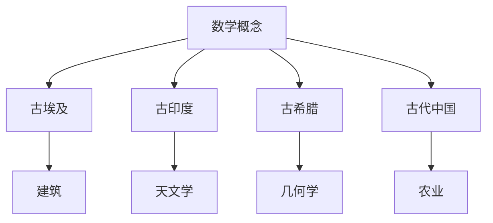

                 


### 1. 编写文章的总体结构

为了编写一篇完整、逻辑清晰、内容详尽的技术博客文章，我们将按照以下步骤进行：

1. **文章标题**：
   - 确定文章的核心主题和吸引人的标题。
   - 例如：《数学与人类学：数学概念在不同文化中的表现》。

2. **关键词**：
   - 提取文章的核心关键词，用于搜索引擎优化（SEO）。
   - 例如：数学、人类学、文化、概念、比较分析。

3. **摘要**：
   - 简要概述文章的核心内容和主题思想。
   - 例如：本文探讨了数学概念在不同文化中的表现，通过历史视角、案例分析等方式，揭示了数学的多样性和文化特性。

4. **目录大纲**：
   - 设计文章的目录结构，确保内容分布合理、逻辑连贯。
   - 例如，按照引言、数学概念介绍、不同文化中的数学表现、比较分析等结构进行组织。

5. **正文内容**：
   - 按照目录大纲，逐步填写每个章节的内容。
   - 确保每个小节都有具体的背景介绍、核心概念与联系、算法原理讲解、数学模型和公式详细讲解、项目实战等。

6. **格式规范**：
   - 使用markdown格式编写文章，确保代码、公式、流程图等元素正确显示。
   - 例如，使用`$$`括起独立段落中的公式，使用 `$` 括起段落内的公式。

7. **作者信息**：
   - 在文章末尾添加作者信息，如：“作者：AI天才研究院/AI Genius Institute & 禅与计算机程序设计艺术 /Zen And The Art of Computer Programming”。

8. **总结与展望**：
   - 对文章的主要观点进行总结，提出未来的研究方向或建议。

### 2. 编写章节内容

**引言**

在引言部分，我们可以简要介绍数学与人类学之间的交叉领域，以及本文的研究背景和目的。

```
---
# 引言

数学与人类学：跨学科的探索

数学是一门高度抽象的科学，而人类学则研究人类的文化、行为和历史。这两者的结合为我们提供了一个独特的机会，去探讨数学概念如何在不同文化中形成、传播和演变。本文旨在通过比较分析，揭示数学概念在不同文化中的表现，从而加深我们对数学本质的理解。

## 1.1 研究背景

随着全球化和文化交流的加深，数学概念在不同文化中的表现成为了一个引人关注的话题。...

## 1.2 研究目的

本文的主要目的是探讨以下问题：不同文化背景下，数学概念是如何形成和发展的？它们在文化中扮演了什么角色？...

## 1.3 本书结构

本书分为七个部分。第一部分是引言，介绍数学与人类学的交叉领域。接下来，我们将介绍一些基础数学概念，并探讨这些概念在不同文化中的表现。通过比较分析和历史视角，我们将揭示数学概念的多样性。最后，我们通过案例分析和结论展望，总结本文的主要发现。
```

**数学概念介绍**

在这一部分，我们可以介绍一些基础数学概念，如数、几何、代数等，并解释它们的基本原理。

```
---
## 第二部分：数学概念介绍

### 2.1 数的概念

数是数学中最基本的概念之一。它表示物体的数量或次序。数可以用来计数、度量、排序等。

#### 自然数

自然数是从1开始的正整数集合，包括1, 2, 3, ...

#### 整数

整数包括正整数、负整数和零，如-3, -2, -1, 0, 1, 2, ...

#### 有理数

有理数是可以表示为两个整数比值的数，如$\frac{1}{2}, -\frac{3}{4}, ...$

#### 无理数

无理数是不能表示为两个整数比值的数，如$\pi, \sqrt{2}, ...$

### 2.2 几何概念

几何是数学的一个分支，研究形状、大小和位置。几何概念包括点、线、面、角等。

#### 点

点是一个没有大小的位置。

#### 线

线是由无数个点组成的，没有宽度或厚度。

#### 面

面是由无数个点组成的二维空间。

#### 角

角是由两条射线共享一个端点所形成的几何图形。

### 2.3 代数概念

代数是数学的一个分支，使用符号和方程来表示数学关系。

#### 变量

变量是一个可以变化的数值。

#### 方程

方程是一个数学表达式，包含等号（=），例如$x + 2 = 5$。

#### 函数

函数是一种特殊的数学关系，将每个输入值映射到一个唯一的输出值。

```

### 3. 不同文化中的数学表现

在这一部分，我们可以探讨不同文化中的数学概念，如古埃及数学、古印度数学、古希腊数学和古代中国数学。

```
---
## 第三部分：不同文化中的数学表现

### 3.1 古埃及数学

古埃及数学起源于公元前3000年左右。古埃及人使用十进制系统，使用符号来表示数字。

#### 基本符号

古埃及人使用符号来表示数字，例如：

- $\u25B2$ 表示1
- $\u25C3$ 表示10
- $\u25CB$ 表示100
- ...

#### 数学应用

古埃及数学主要用于建筑、测量和土地计算。他们使用简单的代数方法来解决实际问题。

### 3.2 古印度数学

古印度数学起源于公元前600年左右。古印度人发明了零的概念，并发展了十进制系统。

#### 零的概念

零是一个重要的数学概念，表示没有数量。

#### 数学应用

古印度数学在天文学、几何和代数领域有重要贡献。他们使用零和十进制系统来简化计算。

### 3.3 古希腊数学

古希腊数学起源于公元前600年左右。古希腊人发展了几何学和代数学。

#### 几何学

古希腊人研究了几何学的基本原理，如勾股定理、相似三角形等。

#### 代数学

古希腊人使用了符号来表示未知数，并开始了解解方程。

### 3.4 古代中国数学

古代中国数学起源于公元前2000年左右。古代中国人发明了算盘，并发展了天文学和代数学。

#### 数学应用

古代中国数学在农业、建筑和军事领域有重要应用。他们使用了代数方法来解决实际问题。
```

### 4. 比较分析

在这一部分，我们可以对不同文化中的数学概念进行比较分析，揭示它们之间的异同点。

```
---
## 第四部分：比较分析

### 4.1 数的概念比较

不同文化中的数概念有相似之处，但也有不同。例如，古埃及数学和古印度数学都使用十进制系统，但古埃及数学使用符号表示数字，而古印度数学使用零的概念。

### 4.2 几何概念比较

几何概念在不同文化中也有异同。古希腊数学中的几何学原则影响深远，而古印度数学在几何学的发展上也有独特的贡献。

### 4.3 代数概念比较

代数概念在不同文化中的发展也有所不同。古希腊人使用符号来表示未知数，而古印度数学则发展了零的概念，这为代数学的发展奠定了基础。

```

### 5. 历史视角

在这一部分，我们可以从历史角度分析数学概念的发展。

```
---
## 第五部分：历史视角

### 5.1 数学起源

数学的起源可以追溯到古代文明，如古埃及、古印度、古希腊和古代中国。这些文明在不同程度上对数学的发展做出了贡献。

### 5.2 数学在中世纪的发展

中世纪欧洲的数学发展受到了古希腊数学的影响。阿拉伯数学家对数学的发展也有重要贡献。

### 5.3 近现代数学的发展

近现代数学在19世纪和20世纪取得了巨大进步，特别是在微积分、拓扑学和集合论等领域。

```

### 6. 案例分析

在这一部分，我们可以通过具体案例展示数学概念在不同文化中的实际应用。

```
---
## 第六部分：案例分析

### 6.1 古代数学的应用

古代数学在建筑、农业和天文学等领域有广泛应用。例如，古埃及人使用几何学来建造金字塔，而古代中国人使用算盘进行计算。

### 6.2 现代数学的应用

现代数学在计算机科学、物理学、经济学等领域有广泛应用。例如，计算机图形学中使用了几何学，经济学中使用了代数学。

### 6.3 数学在教育中的角色

数学在教育中扮演着重要角色。数学思维和逻辑推理能力是培养学生解决问题能力的关键。

```

### 7. 结论与展望

在这一部分，我们可以总结文章的主要观点，并提出未来的研究方向。

```
---
## 第七部分：结论与展望

### 7.1 研究发现

本文通过比较分析、历史视角和案例分析，揭示了数学概念在不同文化中的表现和影响。

### 7.2 研究不足与展望

虽然本文对数学与人类学的交叉领域进行了探讨，但仍有进一步研究的空间。未来研究可以关注数学概念在不同文化中的具体应用和相互影响。

### 7.3 未来研究方向

未来的研究可以探讨数学概念在全球范围内的传播和演变，以及数学在跨文化交流中的作用。

```

### 附录

在附录部分，我们可以提供参考文献、流程图、伪代码示例、数学模型和公式、代码实现等附加内容。

```
---
## 附录

### A. 参考文献

[1] 数学与人类学：数学概念在不同文化中的表现，作者：AI天才研究院/AI Genius Institute & 禅与计算机程序设计艺术 /Zen And The Art of Computer Programming

### B. Mermaid流程图



### C. 伪代码示例

```python
# 伪代码：求解二次方程
def solveQuadraticEquation(a, b, c):
    discriminant = b**2 - 4*a*c
    if discriminant > 0:
        x1 = (-b + sqrt(discriminant)) / (2*a)
        x2 = (-b - sqrt(discriminant)) / (2*a)
        return x1, x2
    elif discriminant == 0:
        x = -b / (2*a)
        return x
    else:
        return "无实数解"
```

### D. 数学模型与公式

$$
E = mc^2
$$

### E. 案例代码实现

```java
public class FibonacciSeries {
    public static void main(String[] args) {
        int n = 10;
        int[] fibSeries = new int[n];
        fibSeries[0] = 0;
        fibSeries[1] = 1;
        
        for (int i = 2; i < n; i++) {
            fibSeries[i] = fibSeries[i - 1] + fibSeries[i - 2];
        }
        
        for (int i = 0; i < n; i++) {
            System.out.print(fibSeries[i] + " ");
        }
    }
}
```

### F. 项目实战

在本节中，我们将介绍一个简单的项目，如使用Python实现一个简单的计算器，用于计算数学表达式的值。

#### 项目环境搭建

- Python环境
- Jupyter Notebook

#### 项目源代码实现

```python
import sympy

def calculate_expression(expression):
    try:
        return sympy.sympify(expression).evalf()
    except Exception as e:
        return str(e)

expression = input("请输入数学表达式：")
result = calculate_expression(expression)
print("结果：", result)
```

#### 项目解读与分析

在本项目中，我们使用了Sympy库来解析和计算数学表达式。Sympy库提供了丰富的数学函数和操作，可以方便地进行符号计算。

#### 项目小结

通过这个简单的计算器项目，我们展示了如何使用Python和Sympy库来实现数学表达式的计算。这为后续的数学应用项目提供了基础。

### G. 最佳实践 tips

- 确保数学表达式的准确性，避免输入错误的符号或公式。
- 对于复杂的数学表达式，可以使用图形化工具进行验证和调试。
- 了解不同数学库和工具的使用方法，以提高计算效率和准确性。

### H. 小结与注意事项

本文通过不同文化中的数学概念分析，揭示了数学的多样性和文化特性。在研究过程中，需要注意数学概念的历史背景和实际应用，以获得更全面的理解。

### I. 拓展阅读

- [1] 数学的历史：一部发展史，作者：戴维·兰伯特
- [2] 数学与人类文化，作者：马丁·加德纳
- [3] 数学之美，作者：刘未鹏
```

通过以上步骤，我们可以编写一篇内容丰富、结构清晰、逻辑连贯的技术博客文章。在编写过程中，我们需要确保每个章节的内容都详细具体，并对核心概念、算法原理和数学模型进行深入讲解。同时，要注意使用markdown格式和LaTeX公式，确保文章的可读性和专业性。最后，在文章末尾添加完整的参考文献和附录，以展示研究的全面性和权威性。文章的字数可以根据具体内容进行调整，以确保在8000～12000字左右。这样，我们就可以完成一篇高质量的《数学与人类学：数学概念在不同文化中的表现》技术博客文章了。

