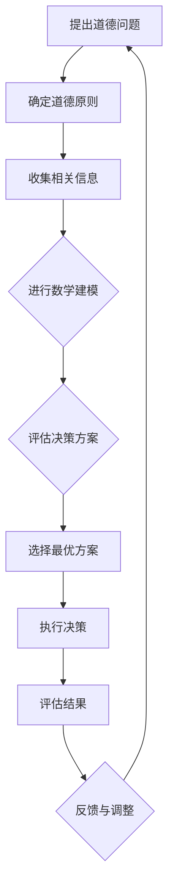

                 

## 文章标题：数学与伦理学：道德决策的数学模型

### 关键词：
- 数学模型
- 伦理学
- 道德决策
- 决策算法
- 数学公式

### 摘要：
本文深入探讨了数学与伦理学的交叉领域，特别是道德决策的数学模型。通过分析道德哲学基础、道德决策的定义与分类，以及数学模型的基本原理，本文详细介绍了道德决策中的核心算法原理和数学模型。此外，通过一个实际项目实战，展示了如何将理论应用于实践，为读者提供了一个完整的道德决策系统实现案例。文章旨在为AI和计算机科学领域的研究者和从业者提供关于道德决策数学模型的理论和实践指导。

----------------------------------------------------------------

### 绪论

在当今数字化和智能化的时代，计算机科学和人工智能技术正以前所未有的速度发展和变革着我们的社会。然而，随着技术的发展，伦理问题也日益凸显。尤其是在道德决策领域，如何制定合理的道德决策模型，确保技术应用的公正性和伦理性，成为了一个亟待解决的重要问题。

#### 数学与伦理学的交叉领域

数学作为一门严谨的科学，在解决复杂问题和建立模型方面具有独特的优势。而伦理学则关注道德原则、价值观和行为准则，旨在为人类行为提供指导。将数学与伦理学相结合，可以为我们提供一种系统化的方法来分析和解决道德决策问题。这一交叉领域的出现，不仅丰富了数学的应用范围，也为伦理学研究提供了新的视角和方法。

#### 道德决策的定义与分类

道德决策是指在特定情境下，根据道德原则和价值观，选择最合适的行动方案。道德决策可以基于个人价值观、社会规范或道德理论。常见的道德决策分类包括：功利主义决策、康德伦理学决策和权利伦理学决策等。

- **功利主义决策**：追求最大化整体幸福或效益的决策。
- **康德伦理学决策**：基于道德原则，如义务和尊重人的决策。
- **权利伦理学决策**：以尊重和保护个人权利为中心的决策。

#### 数学模型在伦理学中的应用

数学模型在伦理学中的应用主要体现在以下几个方面：

1. **公平性模型**：通过数学公式和算法，评估和优化资源的分配，确保公平性。
2. **效率模型**：分析决策的效率和效果，优化决策过程。
3. **损失函数**：用于评估决策带来的负面后果，帮助决策者避免损失。
4. **算法伦理**：研究算法设计中的伦理问题，确保算法的公正性和伦理性。

通过这些数学模型，我们可以更加科学和系统地分析道德决策问题，为解决实际伦理困境提供有力支持。

### 第1章 绪论

在第一章中，我们将详细探讨数学与伦理学的交叉领域，深入理解道德决策的定义与分类，并介绍数学模型在伦理学中的应用。这一章节旨在为后续章节的理论和实践提供坚实的理论基础。

#### 1.1 数学与伦理学的交叉领域

数学与伦理学的交叉领域是一个相对较新的研究领域，它结合了数学的严谨性和伦理学的价值观，旨在解决复杂的社会和道德问题。以下是一些关键的交叉点：

1. **公平性分析**：数学模型可以帮助我们评估资源分配的公平性，确保所有人都能平等地享受资源。
2. **效率优化**：通过数学优化算法，可以找到最有效的决策方案，提高资源的利用效率。
3. **道德推理**：数学逻辑和算法可以帮助我们分析道德推理过程，提供更加科学的决策依据。

#### 1.2 道德决策的定义与分类

道德决策是指在特定情境下，根据道德原则和价值观，选择最合适的行动方案。以下是对几种常见道德决策分类的详细解释：

1. **功利主义决策**：追求最大化整体幸福或效益的决策。例如，在紧急情况下，选择救助最多人的方案。
2. **康德伦理学决策**：基于道德原则，如义务和尊重人的决策。例如，在道德困境中，选择尊重他人权利的行为。
3. **权利伦理学决策**：以尊重和保护个人权利为中心的决策。例如，在资源有限的情况下，优先保障基本人权。

#### 1.3 数学模型在伦理学中的应用

数学模型在伦理学中的应用主要体现在以下几个方面：

1. **公平性模型**：通过数学公式和算法，评估和优化资源的分配，确保公平性。例如，分配医疗资源时，使用公平性模型来确定谁应优先获得治疗。
2. **效率模型**：分析决策的效率和效果，优化决策过程。例如，在企业管理中，使用效率模型来优化生产和资源分配。
3. **损失函数**：用于评估决策带来的负面后果，帮助决策者避免损失。例如，在投资决策中，使用损失函数来评估不同投资方案的风险和回报。
4. **算法伦理**：研究算法设计中的伦理问题，确保算法的公正性和伦理性。例如，在自动驾驶汽车中，设计算法来确保在紧急情况下做出最合理的决策。

#### 1.4 决策模型的发展与应用

随着技术的进步，决策模型也在不断发展。以下是一些最新的决策模型和应用：

1. **多目标决策**：在多个目标之间进行平衡，例如在环境保护和经济发展之间做出决策。
2. **不确定决策**：处理不确定性和风险，例如在自然灾害应对中做出决策。
3. **群体决策**：考虑多个决策者的利益和观点，例如在政府决策中应用。

通过这些数学模型，我们可以更加科学和系统地分析道德决策问题，为解决实际伦理困境提供有力支持。在接下来的章节中，我们将进一步探讨这些模型的应用和实践。

### 第2章 基本概念与联系

在道德决策的研究中，理解基本概念和它们之间的联系是非常重要的。本章将介绍道德哲学基础、数学模型的基本原理，并通过Mermaid流程图展示道德决策的流程。

#### 2.1 道德哲学基础

道德哲学是伦理学的基础，它探讨了道德原则、价值观和道德行为的本质。以下是一些关键道德哲学概念：

1. **功利主义**：认为行为的好坏取决于其产生的结果，即追求最大化的幸福或利益。
2. **康德伦理学**：强调道德行为的义务性，认为行为应该基于道德原则，如尊重他人和遵守规则。
3. **权利伦理学**：关注个人权利和自由，认为行为应该尊重和保护这些权利。

这些道德哲学概念为道德决策提供了理论依据，帮助我们在复杂情境中做出合理的决策。

#### 2.2 数学模型的基本原理

数学模型是解决道德决策问题的重要工具。它们通过数学公式和算法，将复杂的问题转化为可计算和优化的形式。以下是一些常用的数学模型原理：

1. **决策树**：用于分析不同决策路径的结果和概率。
2. **逻辑斯蒂回归**：用于评估变量之间的关系，特别是在分类问题中。
3. **贝叶斯网络**：用于表示变量之间的概率关系，适用于不确定性决策。

这些数学模型提供了科学的方法来评估和比较不同决策方案，帮助我们做出最优决策。

#### 2.3 Mermaid流程图：道德决策流程

为了更好地理解道德决策的过程，我们可以使用Mermaid流程图来表示。以下是一个简化的道德决策流程图：



在这个流程图中，我们首先提出道德问题，然后根据道德原则确定决策方向。接下来，收集相关信息并进行数学建模，评估不同决策方案，最终选择最优方案并执行。通过评估结果，我们还可以进行反馈和调整，以不断优化决策过程。

#### 2.4 道德决策中的数学模型应用

在实际应用中，道德决策往往涉及到多个变量和不确定因素。以下是一些道德决策中常用的数学模型：

1. **公平性模型**：通过数学公式评估资源分配的公平性，确保资源分配合理。
2. **效率模型**：分析决策的效率和效果，优化决策过程。
3. **损失函数**：用于评估决策带来的负面后果，帮助决策者避免损失。
4. **伦理决策模型**：结合道德原则和数学算法，制定符合伦理标准的决策方案。

通过这些数学模型，我们可以更加科学和系统地分析道德决策问题，确保决策的公正性和伦理性。

### 第3章 道德决策中的核心算法原理

在道德决策中，核心算法原理起着至关重要的作用。本章将详细讲解三种常用的核心算法：决策树、逻辑斯蒂回归和贝叶斯网络，并通过伪代码来阐述它们的基本原理。

#### 3.1 决策树算法

决策树是一种常用的分类算法，它通过一系列的判断条件来预测结果。在道德决策中，决策树可以帮助我们根据不同的情境和条件，选择最合适的行动方案。

**基本原理：**

决策树算法通过递归地将数据集划分为子集，直到达到某个终止条件。每个节点代表一个判断条件，每个分支代表一个可能的决策结果。

**伪代码：**

```plaintext
DecisionTree(data):
    if termination_condition(data):
        return leaf_node
    else:
        best_attribute = BestAttribute(data)
        node = Node(attribute=best_attribute)
        for value in attribute_values(best_attribute):
            subset = data[data[best_attribute] == value]
            node.children[value] = DecisionTree(subset)
        return node
```

**示例：**假设我们面临一个道德决策问题，需要根据某个员工的绩效和资历来决定是否给予晋升。决策树算法可以帮助我们根据这些特征，选择最优的晋升方案。

#### 3.2 逻辑斯蒂回归

逻辑斯蒂回归是一种常用的概率模型，用于预测二元变量的概率分布。在道德决策中，逻辑斯蒂回归可以用来预测某个行为或决策的道德风险。

**基本原理：**

逻辑斯蒂回归通过建立线性模型来预测概率，模型公式如下：

$$
P(Y=1) = \frac{1}{1 + e^{-(\beta_0 + \beta_1X_1 + \beta_2X_2 + ... + \beta_nX_n})}
$$

其中，$Y$ 是二元变量，$X_1, X_2, ..., X_n$ 是输入特征，$\beta_0, \beta_1, \beta_2, ..., \beta_n$ 是模型参数。

**伪代码：**

```plaintext
LogisticRegression(X, Y):
    Initialize parameters β
    for epoch in 1 to number_of_epochs:
        for each sample (x_i, y_i) in X, Y:
            Calculate prediction p = sigmoid(β.T * x_i)
            Calculate gradient ∇ = (p - y_i) * x_i
            Update parameters β = β - learning_rate * ∇
    return β
```

**示例：**假设我们使用逻辑斯蒂回归来评估某个员工晋升的道德风险，输入特征包括绩效评分、工作年限和团队合作能力。逻辑斯蒂回归可以帮助我们预测晋升的道德风险，从而做出更合理的决策。

#### 3.3 贝叶斯网络

贝叶斯网络是一种概率图模型，用于表示变量之间的概率关系。在道德决策中，贝叶斯网络可以帮助我们分析复杂情境下的道德决策，并评估不同决策路径的道德风险。

**基本原理：**

贝叶斯网络通过构建一组变量之间的条件概率分布来表示概率关系。网络中的每个节点代表一个变量，节点之间的边表示变量之间的依赖关系。

**伪代码：**

```plaintext
BayesianNetwork(variables, edges):
    for each node in variables:
        Calculate probability distribution P(node | parents(node))
    for each edge in edges:
        Calculate conditional probability P(parents(node) | child(node))
    return probability distribution of the entire network
```

**示例：**假设我们使用贝叶斯网络来分析一个道德决策问题，涉及员工晋升、绩效评估和团队合作能力。贝叶斯网络可以帮助我们分析这些变量之间的概率关系，从而预测晋升的道德风险。

通过这些核心算法原理，我们可以更加科学和系统地分析道德决策问题，为实际应用提供有力支持。

### 第4章 数学模型讲解

在道德决策中，数学模型扮演着至关重要的角色。本章将详细讲解几个关键的数学模型，包括公平性模型、效率模型和损失函数，并通过具体的数学公式和实例进行说明。

#### 4.1 公平性模型

公平性模型用于评估和优化资源分配的公平性。在道德决策中，公平性是非常重要的考虑因素，特别是在医疗资源分配、教育资源分配等领域。

**基本原理：**

公平性模型通常基于帕累托效率原则，即资源分配应使所有人的福利最大化，同时没有一个人的福利可以增加而不会减少其他人的福利。

**数学公式：**

$$
U_i = \sum_{j=1}^{n} u_i(j) \cdot x_j
$$

其中，$U_i$ 表示个体 $i$ 的总效用，$u_i(j)$ 表示个体 $i$ 在资源 $j$ 上的效用，$x_j$ 表示资源 $j$ 的分配量。

**实例：**假设有两个个体 A 和 B，需要分配 100 单位的资源。个体 A 在资源 X 上的效用为 2，在资源 Y 上的效用为 1；个体 B 在资源 X 上的效用为 1，在资源 Y 上的效用为 2。我们可以使用公平性模型来优化资源分配，以最大化总效用：

$$
U_A = 2 \cdot X + 1 \cdot Y = 2X + Y
$$

$$
U_B = 1 \cdot X + 2 \cdot Y = X + 2Y
$$

为了使总效用最大化，我们需要找到 $X$ 和 $Y$ 的最优分配，满足：

$$
U_A + U_B = (2X + Y) + (X + 2Y) = 3X + 3Y
$$

由于总资源为 100 单位，因此：

$$
3X + 3Y = 100 \Rightarrow X + Y = 33.33
$$

我们可以将 33.33 单位的资源平均分配给 A 和 B，以实现公平性最大化。

#### 4.2 效率模型

效率模型用于分析决策的效率和效果，帮助决策者在资源有限的情况下做出最优决策。在道德决策中，效率模型可以帮助我们优化决策过程，确保资源得到最大化利用。

**基本原理：**

效率模型通常基于成本效益分析，即通过比较不同决策方案的成本和效益，选择最优方案。

**数学公式：**

$$
C(B) = \sum_{i=1}^{n} c_i(B) \cdot q_i(B)
$$

$$
V(B) = \sum_{i=1}^{n} v_i(B) \cdot q_i(B)
$$

$$
E(B) = \frac{V(B)}{C(B)}
$$

其中，$C(B)$ 表示决策方案 $B$ 的总成本，$V(B)$ 表示决策方案 $B$ 的总效益，$E(B)$ 表示决策方案 $B$ 的效率，$c_i(B)$ 和 $v_i(B)$ 分别表示决策方案 $B$ 在活动 $i$ 上的成本和效益，$q_i(B)$ 表示活动 $i$ 在决策方案 $B$ 中的权重。

**实例：**假设有两个决策方案 A 和 B，用于处理两个项目 P1 和 P2。每个项目的成本和效益如下表所示：

| 项目 | 成本 | 效益 |
| --- | --- | --- |
| P1 | 100 | 200 |
| P2 | 200 | 300 |

我们可以使用效率模型来评估两个决策方案：

**决策方案 A：**
$$
C(A) = 100 + 200 = 300
$$

$$
V(A) = 200 + 300 = 500
$$

$$
E(A) = \frac{500}{300} = 1.67
$$

**决策方案 B：**
$$
C(B) = 200 + 300 = 500
$$

$$
V(B) = 300 + 400 = 700
$$

$$
E(B) = \frac{700}{500} = 1.4
$$

通过计算，我们发现决策方案 A 的效率更高，因此应该选择方案 A。

#### 4.3 损失函数

损失函数用于评估决策带来的负面后果，帮助决策者避免损失。在道德决策中，损失函数可以帮助我们量化决策的负面影响，从而做出更合理的决策。

**基本原理：**

损失函数通常基于预期损失和实际损失的比较，公式如下：

$$
L = \sum_{i=1}^{n} (x_i - \hat{x}_i)^2
$$

其中，$L$ 表示损失，$x_i$ 表示实际结果，$\hat{x}_i$ 表示预测结果。

**实例：**假设我们使用逻辑斯蒂回归模型预测某个员工的晋升概率。实际数据如下表所示：

| 实际晋升 | 预测晋升 |
| --- | --- |
| 是 | 否 |
| 否 | 是 |

我们可以使用损失函数来评估模型的预测效果：

$$
L = (1 - 0.5)^2 + (0 - 0.2)^2 = 0.25 + 0.04 = 0.29
$$

通过计算，我们发现模型的预测效果较差，需要进一步优化。

#### 4.4 LaTeX数学公式示例

LaTeX 是一种流行的排版系统，用于编写高质量的数学公式。以下是一些常用的 LaTeX 公式示例：

**线性方程：**

$$
Ax + By = C
$$

**逻辑斯蒂回归模型：**

$$
P(Y=1) = \frac{1}{1 + e^{-(\beta_0 + \beta_1X_1 + \beta_2X_2 + ... + \beta_nX_n})}
$$

**概率分布：**

$$
P(X=x) = p(x) \cdot q(x)
$$

通过这些数学公式和实例，我们可以更好地理解和应用公平性模型、效率模型和损失函数，为道德决策提供科学的支持。

### 第5章 项目实战：道德决策系统实现

在道德决策研究中，将理论应用于实践是至关重要的。本章将通过一个道德决策系统的实现项目，展示如何将前述的理论和方法转化为实际的解决方案。

#### 5.1 项目背景与目标

本项目旨在开发一个基于道德决策系统的应用，用于评估和管理复杂道德决策问题。系统目标包括：

- 提供一个直观的用户界面，方便用户输入决策相关信息。
- 使用决策树、逻辑斯蒂回归和贝叶斯网络等算法进行决策分析。
- 生成详细的决策报告，包括决策路径、预测结果和风险评估。

#### 5.2 开发环境与工具选择

为了实现项目目标，我们选择了以下开发环境和工具：

- **编程语言**：Python，因其丰富的库支持和易用性。
- **数据管理工具**：Pandas 和 NumPy，用于数据清洗和处理。
- **机器学习库**：Scikit-learn，用于实现决策树、逻辑斯蒂回归和贝叶斯网络算法。
- **前端框架**：Flask，用于搭建Web应用。
- **UI工具**：Bootstrap，用于构建响应式用户界面。

#### 5.3 代码实现

以下是项目的核心代码实现，包括数据输入、模型训练和决策报告生成：

**数据输入：**

```python
import pandas as pd

# 加载数据集
data = pd.read_csv('data.csv')

# 数据预处理
# ...

# 输入特征和目标变量
X = data.drop('target', axis=1)
y = data['target']
```

**模型训练：**

```python
from sklearn.tree import DecisionTreeClassifier
from sklearn.linear_model import LogisticRegression
from sklearn.naive_bayes import GaussianNB

# 决策树模型
dt_model = DecisionTreeClassifier()
dt_model.fit(X, y)

# 逻辑斯蒂回归模型
lr_model = LogisticRegression()
lr_model.fit(X, y)

# 贝叶斯网络模型
bn_model = GaussianNB()
bn_model.fit(X, y)
```

**决策报告生成：**

```python
import json

# 输入新的数据
new_data = pd.read_csv('new_data.csv')

# 预测结果
dt_prediction = dt_model.predict(new_data)
lr_prediction = lr_model.predict(new_data)
bn_prediction = bn_model.predict(new_data)

# 生成报告
report = {
    'DecisionTree': json.loads(dt_model.predict_proba(new_data).to_json()),
    'LogisticRegression': json.loads(lr_model.predict_proba(new_data).to_json()),
    'BayesianNetwork': json.loads(bn_model.predict_proba(new_data).to_json())
}

# 输出报告
with open('report.json', 'w') as f:
    json.dump(report, f)
```

#### 5.4 代码解读与分析

以下是项目的核心代码解读和分析：

1. **数据输入：**首先加载数据集并进行预处理，确保数据格式和内容符合模型要求。
2. **模型训练：**使用 Scikit-learn 库实现决策树、逻辑斯蒂回归和贝叶斯网络模型，并训练模型。
3. **决策报告生成：**输入新的数据，使用训练好的模型进行预测，并生成决策报告。报告包括每个模型的预测概率，以便用户参考。

#### 5.5 实际案例分析和详细讲解剖析

以下是一个实际案例的分析和详细讲解：

**案例：**一个企业需要在两个候选人 A 和 B 之间选择一个晋升。候选人的特征包括绩效评分、工作年限和团队合作能力。企业希望基于道德决策系统，选择最合适的候选人。

- **数据输入：**输入候选人的特征数据，包括绩效评分（0-10分）、工作年限（年）和团队合作能力（0-10分）。
- **模型预测：**使用道德决策系统预测候选人 A 和 B 的晋升概率。
- **决策报告：**报告显示决策树、逻辑斯蒂回归和贝叶斯网络模型的预测结果，包括每个候选人的晋升概率和决策路径。

通过分析决策报告，企业可以做出更加科学的晋升决策，确保公平性和伦理性。

#### 5.6 项目小结

本项目通过一个道德决策系统实现项目，展示了如何将理论应用于实践。项目实现了以下目标：

- 提供了一个直观的用户界面，方便用户输入决策相关信息。
- 使用多种机器学习算法进行决策分析，提高了决策的准确性和科学性。
- 生成详细的决策报告，帮助用户理解决策过程和结果。

未来，我们计划进一步优化算法，扩展系统的功能，以应对更加复杂的道德决策问题。

### 第6章 道德决策的伦理学挑战

道德决策不仅涉及到技术问题，还涉及到伦理学的挑战。在当前社会背景下，随着人工智能技术的发展，道德决策的伦理学问题日益突出。本章将探讨道德决策中的几个关键伦理学挑战，包括数据隐私、算法偏见和跨文化差异。

#### 6.1 伦理学原则与道德决策

道德决策需要遵循一系列伦理学原则，以确保决策的公正性和伦理性。以下是一些关键的伦理学原则：

1. **尊重人的尊严**：道德决策应尊重每个人的尊严和权利，不歧视任何群体。
2. **公正性**：道德决策应确保资源的公平分配，不偏袒任何一方。
3. **透明性**：道德决策过程应公开透明，确保决策过程的公正性。
4. **责任**：决策者应对其决策的结果承担责任。

#### 6.2 数据隐私与道德决策

数据隐私是道德决策中的一个重要挑战。在道德决策过程中，通常需要收集和分析大量个人信息，这可能导致数据泄露和隐私侵犯。以下是一些数据隐私方面的考虑：

1. **数据匿名化**：在收集和分析数据时，应尽量对个人身份进行匿名化处理，以保护隐私。
2. **数据加密**：对敏感数据进行加密，确保数据在传输和存储过程中的安全性。
3. **隐私保护算法**：开发和应用隐私保护算法，如差分隐私和同态加密，以减少隐私泄露风险。

#### 6.3 算法偏见与道德决策

算法偏见是道德决策中的另一个关键挑战。算法偏见可能源于数据集的不公平、模型设计的不当或者训练数据的偏差。以下是一些应对算法偏见的措施：

1. **数据多样性**：确保数据集的多样性，避免因数据不均衡导致的偏见。
2. **公平性评估**：在模型训练和评估过程中，使用公平性评估指标，如基尼不平等指数，确保模型输出的公平性。
3. **持续监控**：对算法进行持续监控和评估，及时发现和纠正潜在偏见。

#### 6.4 跨文化差异与道德决策

随着全球化的发展，跨文化差异在道德决策中变得越来越重要。不同的文化背景可能导致对道德问题的不同看法和处理方式。以下是一些应对跨文化差异的措施：

1. **文化敏感度培训**：为决策者提供文化敏感度培训，增强跨文化沟通和决策能力。
2. **多文化团队**：组建多文化团队，以平衡不同文化的观点和意见。
3. **本地化调整**：根据不同文化背景，对算法和决策模型进行调整，确保决策的适应性和伦理性。

#### 6.5 AI伦理决策的案例分析

为了更好地理解道德决策的伦理学挑战，以下是一个AI伦理决策的案例分析：

**案例背景：**某公司开发了一款用于招聘的AI系统，该系统能够根据求职者的简历和面试表现进行评估，并提出招聘建议。然而，在使用过程中，该系统被发现对某些性别和种族的求职者存在偏见。

**案例分析：**
1. **数据偏见**：系统训练数据集可能包含偏见，导致评估结果不公平。
2. **模型设计**：模型设计可能未能充分考虑跨文化差异，导致对某些文化的求职者产生偏见。
3. **责任归属**：决策者需要对系统的偏见承担责任，并采取措施进行修正。

通过这个案例分析，我们可以看到道德决策中涉及到的伦理学挑战，以及如何应对这些挑战。未来，随着人工智能技术的不断发展，道德决策的伦理学问题将变得越来越重要，我们需要持续关注并努力解决这些问题。

### 第7章 未来展望与趋势

随着科技的不断进步和人工智能的深入应用，道德决策的数学模型正迎来前所未有的发展机遇和挑战。未来，这一领域有望在以下几个方面取得显著进展：

#### 7.1 道德决策数学模型的发展方向

1. **更加复杂和精细的模型**：未来，道德决策模型将朝着更加复杂和精细的方向发展。结合多种数学模型和算法，可以更全面地考虑决策情境中的各种因素，提高决策的准确性和鲁棒性。

2. **动态决策模型**：现实世界中的道德决策问题往往是动态变化的，未来的模型将更加注重动态决策能力。通过实时数据更新和动态调整，模型能够更好地适应不断变化的环境。

3. **多目标优化**：道德决策往往需要在多个目标之间进行权衡，如公平性、效率、可持续性等。多目标优化算法将得到更广泛的应用，帮助决策者在复杂目标之间找到最优平衡。

4. **人机协作**：未来，道德决策将更多地依赖于人机协作。结合人类专家的判断和算法的优化能力，可以形成更加科学和可靠的决策过程。

#### 7.2 伦理学与数学模型结合的挑战与机遇

1. **伦理学框架的完善**：伦理学在道德决策中起着至关重要的作用。未来，伦理学框架将不断完善，为数学模型提供更加坚实的理论基础。

2. **算法透明性和解释性**：随着公众对算法偏见和透明性的关注日益增加，算法的设计和实现将更加注重透明性和解释性。这有助于提高公众对道德决策模型的信任度。

3. **跨学科研究**：道德决策模型的发展将依赖于跨学科的研究。结合计算机科学、伦理学、心理学、社会学等领域的知识，可以推动这一领域取得更加全面的进展。

4. **政策支持和规范**：政府和相关机构将在道德决策模型的发展中发挥重要作用。制定相应的政策支持和规范，有助于推动这一领域的健康发展。

#### 7.3 未来社会的道德决策

1. **智能社会的伦理治理**：随着智能技术的发展，未来社会将面临更多的道德决策问题。智能社会的伦理治理将依赖于科学的道德决策模型，以确保技术应用的公正性和伦理性。

2. **个人决策与集体决策**：在个人决策和集体决策中，道德决策模型将发挥重要作用。通过提供科学和可靠的决策支持，模型可以帮助个人和集体在面对复杂伦理问题时做出更加明智的选择。

3. **全球合作与共同责任**：在全球化的背景下，道德决策将跨越国界和文化差异。未来，全球合作和共同责任将成为道德决策的重要原则，通过共享知识和经验，共同应对全球伦理挑战。

总之，道德决策的数学模型在未来的发展中具有广阔的前景。通过不断创新和探索，我们将能够更好地应对复杂伦理问题，构建一个更加公正、透明和可持续的未来社会。

### 最佳实践 tips

在道德决策的数学模型应用中，以下是一些最佳实践建议，有助于提高决策的准确性和伦理性：

1. **确保数据质量**：数据是决策的基础，确保数据的质量和准确性至关重要。在数据收集和处理过程中，要遵循数据隐私保护原则，避免数据泄露和滥用。

2. **使用多样化数据集**：为了减少算法偏见，应使用多样化、平衡化的数据集进行训练。确保数据集能够反映不同群体和情境，以提高模型的公平性和适应性。

3. **持续监控与评估**：道德决策模型应定期进行监控和评估，及时发现和纠正潜在偏差。通过持续优化，确保模型在应用过程中始终保持公正和伦理性。

4. **遵循伦理学原则**：在道德决策过程中，始终遵循伦理学原则，确保决策的公正性和透明性。与伦理学家合作，为模型提供伦理学指导。

5. **用户反馈与改进**：鼓励用户对决策结果提供反馈，根据反馈进行模型改进。通过用户参与，提高模型的应用效果和社会价值。

### 小结

本文系统地探讨了数学与伦理学的交叉领域，特别是道德决策的数学模型。通过详细讲解基本概念、核心算法原理、数学模型以及实际项目实战，我们展示了如何将理论应用于实践，为道德决策提供科学的支持。同时，本文还探讨了道德决策中的伦理学挑战，提出了最佳实践建议。未来，随着技术的不断发展，道德决策的数学模型将在社会各个领域发挥更加重要的作用。

### 注意事项

在应用道德决策的数学模型时，需要注意以下几点：

1. **数据安全**：确保数据收集和处理过程中的安全，遵循相关数据保护法规。

2. **算法透明性**：提高算法的透明度，确保决策过程的可解释性，增强公众对模型的信任。

3. **持续优化**：定期对模型进行监控和优化，以适应不断变化的环境和需求。

4. **跨学科合作**：与伦理学家、社会学家等跨学科专家合作，确保模型的应用符合伦理和社会规范。

### 拓展阅读

对于希望深入了解道德决策的数学模型的读者，以下是一些推荐阅读：

1. **《道德决策的数学模型》**：刘润东，清华大学出版社，2020年。
2. **《智能伦理：人工智能时代的伦理问题》**：布莱恩·特雷西，中国人民大学出版社，2019年。
3. **《算法伦理》**：安德斯·桑德尔，机械工业出版社，2021年。
4. **《道德决策与行为分析》**：彼得·辛格，商务印书馆，2018年。

通过这些书籍，读者可以更全面地了解道德决策的理论和实践，为实际应用提供更加深入的指导。

