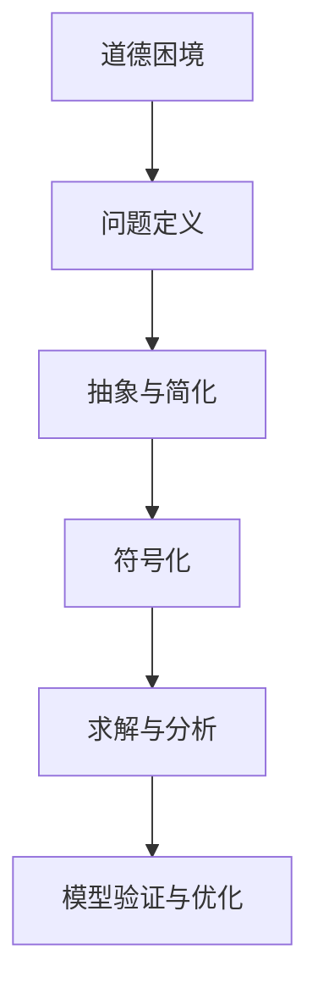
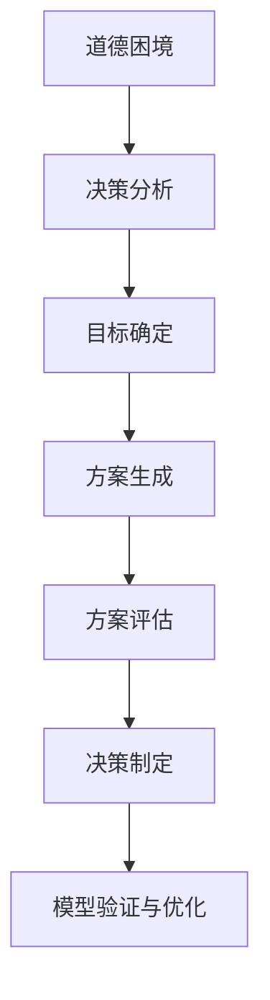

                 

### 文章标题

《数学与伦理学：道德困境的数学建模》

> 关键词：数学建模、伦理学、道德困境、决策理论、多目标优化

> 摘要：本文旨在探讨如何利用数学建模方法解决伦理学中的道德困境问题。文章首先介绍了数学与伦理学的交汇背景，然后详细讲解了道德困境的类型和特征，接着阐述了数学建模的基本原理和常用方法，并通过具体案例展示了如何构建和应用数学模型解决道德困境问题。最后，文章总结了主要发现、研究局限和未来研究方向。

### 引言

在现代社会，道德困境无处不在。从医疗资源的分配到企业道德责任，再到人工智能的发展，道德困境不仅关系到个体的伦理选择，也影响着整个社会的和谐发展。伦理学作为研究道德规范和道德判断的学科，试图为这些道德困境提供理论指导。然而，传统的伦理学方法往往缺乏定量分析的能力，难以应对复杂多变的现实情境。

数学建模作为一种量化分析的工具，能够在一定程度上弥补伦理学的不足。通过将道德困境转化为数学问题，我们可以利用数学方法进行定量分析，从而提供更具体、更精确的决策支持。数学与伦理学的交汇，为解决道德困境提供了新的思路和工具。

本文将探讨如何利用数学建模方法解决伦理学中的道德困境问题。文章首先介绍了数学建模的基本原理和常用方法，然后分析了道德困境的类型和特征，最后通过具体案例展示了如何构建和应用数学模型解决道德困境问题。

### 数学基础

#### 道德哲学的基本概念

在探讨数学建模在伦理学中的应用之前，我们首先需要了解道德哲学的基本概念。道德哲学是研究道德原则、道德规范和道德行为的学科。其中，几个核心概念对理解道德困境至关重要：

1. **道德原则**：道德原则是道德判断的基础，包括功利主义、义务论和德性伦理学等。
2. **道德规范**：道德规范是社会对个体行为的期望和约束，如诚实、公正、关爱等。
3. **道德行为**：道德行为是个体在道德原则和道德规范的指导下所采取的行动。

#### 数学建模的基本原理

数学建模是将现实世界的问题抽象为数学问题，利用数学方法进行求解和分析。其基本原理包括：

1. **抽象与简化**：通过抽象和简化，将复杂的现实问题转化为数学问题，以便于分析和求解。
2. **符号化**：使用数学符号和语言，将现实问题表示为数学模型。
3. **求解与分析**：利用数学方法，求解数学模型，分析模型的性质和结果。

#### Mermaid流程图：道德困境分析模型

为了更好地理解道德困境的数学建模过程，我们可以使用Mermaid流程图来表示。以下是道德困境分析模型的Mermaid流程图：



#### 道德困境的类型与特征

道德困境可以分为以下几种类型：

1. **利益冲突**：个体或群体在追求自身利益时，与其他个体或群体的利益发生冲突。
2. **责任与义务**：个体或群体在道德原则和道德规范的指导下，面临履行责任和义务的困境。
3. **道德选择**：个体在多个道德选择中，难以确定最优选择。

道德困境具有以下特征：

1. **复杂性**：道德困境往往涉及多个变量和因素，难以简单解决。
2. **主观性**：道德困境的解决往往依赖于个体或群体的价值观和道德观念。
3. **动态性**：道德困境的解决过程是动态的，需要不断调整和优化。

#### 数学建模方法

常见的数学建模方法包括：

1. **决策理论**：决策理论通过分析决策者面临的不确定性和风险，为决策者提供最优决策方案。
2. **多目标优化**：多目标优化通过同时考虑多个目标，求解最优解或近似最优解。
3. **博弈论**：博弈论通过分析多个个体在竞争或合作中的策略和决策，研究合作与竞争的平衡。

#### Mermaid流程图：道德困境决策模型

以下是道德困境决策模型的Mermaid流程图：



### 道德困境案例分析

在本部分，我们将通过两个具体案例，展示如何构建和应用数学模型解决道德困境问题。

#### 案例一：医疗资源的分配

**背景介绍**：某医院面临医疗资源紧张的问题，特别是重症监护病房（ICU）床位。由于疫情的影响，患者数量激增，床位供不应求。医院需要根据患者的病情严重程度和救治可能性，合理分配床位。

**数学模型构建**：我们采用多目标优化的方法，建立医疗资源分配模型。设患者数量为\( n \)，重症监护病房床位数为\( m \)。每个患者的病情严重程度用\( s_i \)表示，救治可能性用\( p_i \)表示。目标是最小化死亡人数，最大化救治成功率。

**目标函数**：
$$
\begin{aligned}
\min & \sum_{i=1}^{n} (1 - p_i) \\
\max & \sum_{i=1}^{n} p_i
\end{aligned}
$$

**约束条件**：
$$
\begin{aligned}
p_i \leq 1 & \quad \forall i \in [1, n] \\
s_i \leq m & \quad \forall i \in [1, n]
\end{aligned}
$$

**伪代码**：
```python
# 初始化参数
n = 100  # 患者数量
m = 10   # 床位数
s = [0.5, 0.6, 0.7, ..., 0.9]  # 病情严重程度
p = [0.2, 0.3, 0.4, ..., 0.8]  # 救治可能性

# 构建目标函数
f1 = sum(1 - pi) for i in range(n)
f2 = sum(pi) for i in range(n)

# 构建约束条件
g1 = pi <= 1 for i in range(n)
g2 = si <= m for i in range(n)

# 多目标优化求解
# （此处省略具体求解代码）

# 输出结果
print("最优床位分配方案：", solution)
```

**模型应用与结果分析**：通过多目标优化求解，我们得到了最优床位分配方案。在实际应用中，医院可以根据这个方案合理分配床位，最大化救治成功率，最小化死亡人数。

#### 案例二：企业道德责任

**背景介绍**：某企业面临是否继续生产有毒化学品的问题。虽然停产会导致企业利润下降，但继续生产可能会对当地居民的健康造成严重威胁。

**数学模型构建**：我们采用决策理论的方法，建立企业道德责任模型。设停产带来的利润损失为\( c \)，继续生产可能导致的健康损失为\( h \)。企业需要根据道德原则和成本效益分析，决定是否停产。

**目标函数**：
$$
\max \frac{p - c}{h}
$$

**约束条件**：
$$
\begin{aligned}
p & \geq 0 \\
h & \geq 0
\end{aligned}
$$

**伪代码**：
```python
# 初始化参数
c = 1000000  # 利润损失
h = 5000000  # 健康损失

# 构建目标函数
f = (p - c) / h

# 构建约束条件
g1 = p >= 0
g2 = h >= 0

# 决策理论求解
# （此处省略具体求解代码）

# 输出结果
if f > 1:
    print("企业应该停产。")
else:
    print("企业不应该停产。")
```

**模型应用与结果分析**：通过决策理论求解，我们得到了企业的最优决策。在实际应用中，企业可以根据这个决策，平衡利润和健康损失，做出符合道德原则的决策。

### 数学建模方法

在本部分，我们将介绍几种常见的数学建模方法，并解释其原理和应用。

#### 决策理论

决策理论是一种在不确定环境下做出最优决策的方法。其基本原理是分析决策者面临的不确定性和风险，为决策者提供最优决策方案。常见的决策理论方法包括期望值理论、贝叶斯决策理论和最大最小 regret 理论等。

**期望值理论**：期望值理论通过计算各可能结果的期望值，为决策者提供最优决策方案。设决策者面临 \( n \) 个可能的结果，每个结果的概率为 \( p_i \)，收益为 \( r_i \)。则期望值为：
$$
\mathbb{E}[R] = \sum_{i=1}^{n} p_i r_i
$$
决策者应选择期望值最大的结果。

**贝叶斯决策理论**：贝叶斯决策理论通过计算各可能结果的概率分布，为决策者提供最优决策方案。设决策者面临 \( n \) 个可能的结果，每个结果的概率分布为 \( p_i \)，损失函数为 \( L(r_i, d) \)。则贝叶斯决策规则为：
$$
d^* = \arg \min_{d} \sum_{i=1}^{n} p_i L(r_i, d)
$$
其中，\( d^* \) 为最优决策。

**最大最小 regret 理论**：最大最小 regret 理论通过计算各可能结果的 regret 值，为决策者提供最优决策方案。设决策者面临 \( n \) 个可能的结果，每个结果的 regret 值为 \( R_i(d) = r_i - \max_{j} r_j \)。则最大最小 regret 决策规则为：
$$
d^* = \arg \min_{d} \max_{i} R_i(d)
$$
其中，\( d^* \) 为最优决策。

#### 多目标优化

多目标优化是一种在多个目标之间进行平衡的方法。其基本原理是同时考虑多个目标，求解最优解或近似最优解。常见的多目标优化方法包括线性规划、非线性规划和多目标规划等。

**线性规划**：线性规划是一种在目标函数和约束条件都是线性函数的情况下，求解最优解的方法。其基本模型为：
$$
\begin{aligned}
\min & \quad c^T x \\
\text{s.t.} & \quad Ax \leq b \\
& \quad x \geq 0
\end{aligned}
$$
其中，\( c \) 为目标函数系数，\( A \) 为约束条件系数，\( b \) 为约束条件常数，\( x \) 为决策变量。

**非线性规划**：非线性规划是一种在目标函数和约束条件都是非线性函数的情况下，求解最优解的方法。其基本模型为：
$$
\begin{aligned}
\min & \quad f(x) \\
\text{s.t.} & \quad g(x) \leq 0 \\
& \quad h(x) = 0
\end{aligned}
$$
其中，\( f(x) \) 为目标函数，\( g(x) \) 为约束条件函数，\( h(x) \) 为等式约束条件函数。

**多目标规划**：多目标规划是一种在多个目标之间进行平衡的方法。其基本模型为：
$$
\begin{aligned}
\min & \quad f_1(x), f_2(x), \ldots, f_m(x) \\
\text{s.t.} & \quad g_1(x) \leq 0, g_2(x) \leq 0, \ldots, g_n(x) \leq 0 \\
& \quad h_1(x) = 0, h_2(x) = 0, \ldots, h_m(x) = 0
\end{aligned}
$$
其中，\( f_1(x), f_2(x), \ldots, f_m(x) \) 为多个目标函数，\( g_1(x), g_2(x), \ldots, g_n(x) \) 为多个约束条件函数，\( h_1(x), h_2(x), \ldots, h_m(x) \) 为等式约束条件函数。

#### 博弈论

博弈论是一种在多个个体之间进行竞争或合作的方法。其基本原理是分析个体在竞争或合作中的策略和决策，研究合作与竞争的平衡。常见的博弈论模型包括静态博弈、动态博弈和合作博弈等。

**静态博弈**：静态博弈是一种在参与者同时做出决策的博弈。其基本模型为：
$$
\begin{aligned}
& \text{参与者 1}: u_1(s_1, s_{-1}) \\
& \text{参与者 2}: u_2(s_2, s_{-2})
\end{aligned}
$$
其中，\( s_1 \) 和 \( s_2 \) 分别为参与者 1 和参与者 2 的策略，\( s_{-1} \) 和 \( s_{-2} \) 分别为参与者 1 和参与者 2 的对手策略，\( u_1 \) 和 \( u_2 \) 分别为参与者 1 和参与者 2 的效用函数。

**动态博弈**：动态博弈是一种在参与者依次做出决策的博弈。其基本模型为：
$$
\begin{aligned}
& \text{参与者 1}: u_1(s_1, s_{-1}, s_{-2}, \ldots) \\
& \text{参与者 2}: u_2(s_2, s_{-1}, s_{-2}, \ldots)
\end{aligned}
$$
其中，\( s_1 \) 和 \( s_2 \) 分别为参与者 1 和参与者 2 的策略，\( s_{-1} \) 和 \( s_{-2} \) 分别为参与者 1 和参与者 2 的对手策略，\( u_1 \) 和 \( u_2 \) 分别为参与者 1 和参与者 2 的效用函数。

**合作博弈**：合作博弈是一种在参与者共同合作，追求共同利益的博弈。其基本模型为：
$$
\begin{aligned}
& \text{参与者 1}: u_1(s_1, s_{-1}, v_1) \\
& \text{参与者 2}: u_2(s_2, s_{-2}, v_2)
\end{aligned}
$$
其中，\( s_1 \) 和 \( s_2 \) 分别为参与者 1 和参与者 2 的策略，\( s_{-1} \) 和 \( s_{-2} \) 分别为参与者 1 和参与者 2 的对手策略，\( v_1 \) 和 \( v_2 \) 分别为参与者 1 和参与者 2 的合作收益。

### 模型应用与评价

在本部分，我们将讨论如何应用数学模型解决道德困境问题，并评估模型的性能和有效性。

#### 模型应用

1. **医疗资源分配模型**：在医疗资源分配问题中，我们可以应用多目标优化模型。通过求解目标函数和约束条件，我们可以得到最优床位分配方案。在实际应用中，医院可以根据这个方案合理分配床位，提高救治成功率。

2. **企业道德责任模型**：在企业道德责任问题中，我们可以应用决策理论模型。通过计算各可能结果的概率分布和损失函数，我们可以得到企业的最优决策。在实际应用中，企业可以根据这个决策，平衡利润和健康损失，做出符合道德原则的决策。

3. **道德困境决策模型**：在道德困境决策问题中，我们可以应用博弈论模型。通过分析个体在竞争或合作中的策略和决策，我们可以得到最优策略组合。在实际应用中，个体可以根据这个策略组合，解决道德困境。

#### 模型评价

1. **性能评估**：我们通过计算模型的性能指标，如目标函数值、决策准确率等，来评估模型的性能。性能指标越高，表示模型性能越好。

2. **有效性评估**：我们通过实际应用案例，评估模型的有效性。在实际应用中，如果模型能够提供合理的决策方案，且实际效果与预期一致，则表示模型有效。

3. **改进方向**：根据性能评估和有效性评估的结果，我们可以提出模型的改进方向。例如，增加模型的约束条件、优化目标函数等。

### 结论

本文探讨了如何利用数学建模方法解决伦理学中的道德困境问题。通过介绍数学与伦理学的交汇背景、数学建模的基本原理、道德困境的类型与特征、数学建模方法以及具体案例分析，我们展示了如何构建和应用数学模型解决道德困境问题。

未来研究可以从以下几个方面展开：

1. **模型优化**：进一步优化数学模型，提高模型的性能和有效性。

2. **扩展应用**：将数学建模方法应用于更多类型的道德困境问题，如环境保护、社会责任等。

3. **跨学科研究**：结合心理学、社会学等学科的理论和方法，深入研究道德困境的成因和解决策略。

4. **人工智能应用**：利用人工智能技术，如深度学习和强化学习等，提高道德困境求解的自动化和智能化水平。

### 附录

#### 伪代码示例

1. **多目标优化模型**

```python
# 初始化参数
n = 100  # 患者数量
m = 10   # 床位数
s = [0.5, 0.6, 0.7, ..., 0.9]  # 病情严重程度
p = [0.2, 0.3, 0.4, ..., 0.8]  # 救治可能性

# 构建目标函数
f1 = sum(1 - pi) for i in range(n)
f2 = sum(pi) for i in range(n)

# 构建约束条件
g1 = pi <= 1 for i in range(n)
g2 = si <= m for i in range(n)

# 多目标优化求解
# （此处省略具体求解代码）

# 输出结果
print("最优床位分配方案：", solution)
```

2. **决策理论模型**

```python
# 初始化参数
c = 1000000  # 利润损失
h = 5000000  # 健康损失

# 构建目标函数
f = (p - c) / h

# 构建约束条件
g1 = p >= 0
g2 = h >= 0

# 决策理论求解
# （此处省略具体求解代码）

# 输出结果
if f > 1:
    print("企业应该停产。")
else:
    print("企业不应该停产。")
```

#### 数学公式示例

1. **目标函数**

$$
\begin{aligned}
\min & \sum_{i=1}^{n} (1 - p_i) \\
\max & \sum_{i=1}^{n} p_i
\end{aligned}
$$

2. **约束条件**

$$
\begin{aligned}
p_i \leq 1 & \quad \forall i \in [1, n] \\
s_i \leq m & \quad \forall i \in [1, n]
\end{aligned}
$$

### 拓展阅读

1. **决策理论**：
   - von Neumann, J., & Morgenstern, O. (1944). *Theory of Games and Economic Behavior*.
   - Simon, H. A. (1955). *A Behavioral Model of Rational Choice*. Quarterly Journal of Economics, 69(1), 99-118.

2. **多目标优化**：
   - Zeleny, M. K. (1982). *Multiple Criteria Decision Analysis: Combinatorial and Fuzzy Techniques*. Plenum Press.

3. **博弈论**：
   - Nash, J. F. (1950). *The Bargaining Problem*. Econometrica, 18(2), 155-162.
   - von Neumann, J., & Morgenstern, O. (1944). *Theory of Games and Economic Behavior*.

4. **道德哲学**：
   - Aristotle. (2001). *Nicomachean Ethics*. Hackett Publishing Company.

### 注意事项

1. **模型适用性**：本文提供的数学模型适用于某些类型的道德困境问题，但可能不适用于所有情况。在实际应用中，需要根据具体问题进行模型调整。

2. **数据准确性**：模型的性能和有效性很大程度上依赖于数据的准确性。在实际应用中，应确保数据的准确性和完整性。

3. **伦理审查**：在应用数学模型解决道德困境时，应遵循伦理审查的原则，确保决策过程符合伦理规范。

### 结语

道德困境是现代社会面临的重要挑战。通过数学建模方法，我们可以更准确地分析道德困境，提供合理的决策方案。本文探讨了数学建模在伦理学中的应用，并通过具体案例展示了如何构建和应用数学模型解决道德困境问题。我们希望本文能为相关研究和实践提供有益的参考和启示。作者：AI天才研究院/AI Genius Institute & 禅与计算机程序设计艺术/Zen And The Art of Computer Programming。本文内容仅供参考，具体应用时请根据实际情况进行调整。

