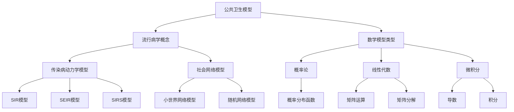

                 

### 文章标题

数学与公共卫生：疾病预防的数学策略

### 关键词

数学模型、公共卫生、疾病预防、传染病动力学、疫情预测与控制

### 摘要

本文旨在探讨数学模型在公共卫生领域的应用，特别是在疾病预防策略制定中的作用。文章首先概述了公共卫生的基本概念和数学模型在其中的重要性，随后详细介绍了概率论、线性代数和微积分等基础数学概念。接着，文章重点分析了传染病动力学模型，包括SIR、SEIR和SIRS模型，并讲解了它们的数学描述和参数估计方法。此外，文章还讨论了疾病传播模型和疫情预测与控制策略，最后展望了公共卫生数学模型的发展趋势和面临的挑战。通过本文，读者将了解如何利用数学工具来优化公共卫生决策，从而更有效地预防疾病传播。

## 用户输入
### 第一部分: 基础概念与原理

#### 第1章: 公共卫生与数学模型概述

在现代社会，公共卫生对于保障人类健康、促进社会发展和稳定起着至关重要的作用。公共卫生不仅关乎个体健康，也关乎整个社会的福祉。其目标是预防疾病、延长寿命、促进健康和提高生活质量。公共卫生涵盖了从疾病预防、健康促进到疾病控制的各个方面。然而，在复杂的公共卫生问题中，如何制定科学、有效的预防策略成为了关键。

数学模型作为一种有效的工具，在公共卫生领域发挥了重要作用。通过数学模型，我们可以将复杂的公共卫生问题转化为可计算和分析的形式，从而为公共卫生决策提供科学依据。数学模型不仅能够帮助我们理解疾病的传播规律，还可以预测疫情的发展趋势，为公共卫生政策的制定提供有力支持。

本章将首先介绍公共卫生的基本概念，包括其定义、目标与任务，以及公共卫生在现代社会中的重要地位。接着，我们将探讨数学模型在公共卫生中的应用，介绍几种常见的数学模型类型，并分析其在公共卫生实践中的应用案例。最后，本章将探讨数学与公共卫生之间的核心概念联系，帮助读者建立对公共卫生数学模型的整体认识。

### 1.1 公共卫生的基本概念

公共卫生是指为了保护人群健康、预防疾病、促进健康和提高生活质量而采取的一系列措施和行动。它不仅仅关注个体的健康，还关注整个群体的健康状态。公共卫生的目标是通过减少疾病、伤害和早逝的风险，提高人们的整体健康水平。

公共卫生的基本概念包括以下几个方面：

#### 定义

公共卫生是一个多学科交叉领域，涉及医学、生物学、社会学、经济学和环境科学等多个学科。其核心是预防疾病，而不是治疗疾病。通过早期检测、疫苗接种、健康教育、环境保护和健康促进等措施，公共卫生旨在消除或减少疾病的风险因素。

#### 目标与任务

公共卫生的主要目标包括：

1. **预防疾病**：通过疫苗接种、健康教育和健康检查等手段，减少疾病的发生和传播。
2. **延长寿命**：通过改善生活方式、控制慢性病和降低死亡率，提高人们的平均寿命。
3. **提高生活质量**：通过减少疾病带来的痛苦和生活不便，提高人们的整体生活质量。
4. **减少健康不公平**：通过消除社会和地区间的健康差距，实现健康公平。

为了实现这些目标，公共卫生需要完成以下任务：

1. **疾病监测与流行病学调查**：通过监测疾病的发生和传播情况，及时了解公共卫生状况，制定针对性的防控措施。
2. **健康教育与促进**：通过提供科学知识和信息，帮助人们掌握健康生活方式，提高健康素养。
3. **疫苗接种与免疫规划**：通过疫苗接种，建立群体免疫，预防疾病的爆发和流行。
4. **环境与健康政策**：通过制定和实施健康政策，改善环境条件，减少疾病的风险因素。
5. **应急响应与灾害管理**：在突发公共卫生事件中，提供快速响应和有效应对措施，减轻疾病对人群的影响。

#### 公共卫生的重要性

公共卫生对于社会和个人具有重要意义。从社会层面看，公共卫生能够降低医疗成本，减轻社会负担，提高劳动生产率，促进经济发展。从个人层面看，公共卫生能够帮助人们保持健康，延长寿命，提高生活质量。

在现代社会，随着全球化的加速和人口流动的增加，疾病的传播风险也日益增加。例如，新冠病毒的全球大流行突显了公共卫生的重要性，各国政府纷纷加强公共卫生体系建设，以应对突发疫情。

总之，公共卫生是一个综合性、系统性的领域，它通过多种手段和措施，旨在保障人类健康和社会福祉。理解公共卫生的基本概念和目标，是进一步探讨公共卫生数学模型应用的重要基础。

### 1.2 数学模型在公共卫生中的应用

数学模型在公共卫生中的应用已经变得不可或缺，这些模型为疾病预防策略的制定提供了科学依据和决策支持。通过数学模型，公共卫生专业人员可以更好地理解疾病的传播机制、预测疫情的发展趋势，并制定有效的防控措施。

#### 数学模型在疾病预防中的重要性

数学模型在疾病预防中的重要性体现在以下几个方面：

1. **疾病传播机制分析**：数学模型可以帮助我们理解疾病的传播过程，包括传染源、传播途径和易感人群。通过这些模型，我们可以揭示疾病的传播规律，从而制定更有效的预防策略。

2. **疫情预测与预警**：数学模型可以基于历史数据和现有情况，预测未来疫情的发展趋势。这有助于提前采取防控措施，降低疫情对社会和经济的冲击。

3. **资源优化配置**：通过数学模型，我们可以分析不同防控措施的效益和成本，从而实现资源的最优配置。例如，在疫苗分配中，数学模型可以帮助确定哪些人群最需要优先接种，以最大化疫苗的效果。

4. **公共卫生政策评估**：数学模型可以用于评估公共卫生政策的实施效果，帮助政策制定者了解政策的实际影响，并据此进行调整。

#### 数学模型的基本类型

在公共卫生领域，常用的数学模型类型包括以下几种：

1. **传染病动力学模型**：这类模型描述了疾病的传播过程，通常基于个体之间的接触率和感染率。例如，SIR模型（易感者-感染者-恢复者模型）和SEIR模型（易感者-暴露者-感染者-恢复者模型）等。

2. **种群生态学模型**：这类模型用于研究疾病的宿主-病原体相互作用，通常涉及种群动力学和生态平衡。例如，Logistic模型和 predator-prey模型。

3. **社会网络模型**：这类模型基于个体之间的社会关系，研究疾病的传播路径。例如，小世界网络模型和随机网络模型。

4. **决策模型**：这类模型用于分析不同公共卫生策略的效益和成本，帮助决策者制定最优策略。例如，成本效益分析和多目标优化模型。

#### 数学模型在公共卫生实践中的应用案例

数学模型在公共卫生实践中的应用广泛，以下是一些典型的应用案例：

1. **新冠病毒（COVID-19）疫情预测**：在新冠病毒疫情中，数学模型被广泛用于预测疫情发展趋势，帮助政府制定疫情防控策略。例如，SEIR模型被用于预测感染人数和疫情峰值时间。

2. **疫苗接种策略制定**：数学模型可以帮助确定哪些人群最需要接种疫苗，以及如何优化疫苗分配策略。通过分析疫苗的效果和成本，模型可以帮助决策者制定有效的疫苗接种计划。

3. **疾病监测与预警系统**：数学模型被用于开发疾病监测和预警系统，实时监测疾病的传播情况，并预警潜在的疫情爆发。例如，流感监测系统利用时间序列分析和空间分析技术，预测流感季节的流行趋势。

4. **疫情防控策略评估**：数学模型可以用于评估不同疫情防控措施的效果，帮助决策者了解不同策略的成本效益，从而制定更加科学的防控政策。

总之，数学模型在公共卫生领域的应用已经取得了显著成果，它不仅为疾病预防策略的制定提供了科学依据，还提高了公共卫生决策的效率和质量。随着数学模型的不断发展和应用，公共卫生领域将迎来更加精准和高效的未来。

### 1.3 数学与公共卫生的核心概念联系

数学与公共卫生之间的联系主要体现在对核心概念和原理的量化表达和模型化分析。为了更好地理解这种联系，我们需要探讨流行病学基本概念、传染病动力学模型以及公共卫生中的数学建模方法。

#### 流行病学基本概念

流行病学是公共卫生的核心学科，研究疾病在人群中的分布、传播及其影响因素。以下是几个关键概念：

1. **发病率（Incidence）**：表示在一定时间内，特定人群中某病新病例的发生率。它是衡量疾病爆发和流行趋势的重要指标。

2. **患病率（Prevalence）**：表示某一特定时间内，人群中某病的存在率。患病率受发病率、病程长短以及人群年龄结构等因素的影响。

3. **传播率（Transmission Rate）**：表示一个感染者使得其他个体感染某种疾病的机会。传播率是传染病动力学模型中关键的参数，直接影响疾病的传播速度和范围。

4. **基本传染数（Basic Reproduction Number，R0）**：表示在一个完全易感的人群中，一个感染者能够直接传染给其他个体的平均数量。R0是衡量疾病传播能力的重要指标。

#### 传染病动力学模型

传染病动力学模型是公共卫生中应用广泛的数学模型，用于描述疾病的传播过程和动态行为。以下是几种常见的传染病动力学模型：

1. **SIR模型**（易感者-感染者-恢复者模型）：SIR模型将人群分为三个状态：易感者（S）、感染者（I）和恢复者（R）。模型的基本方程为：
   $$
   \frac{dS}{dt} = -\beta \cdot SI
   $$
   $$
   \frac{dI}{dt} = \beta \cdot SI - \gamma \cdot I
   $$
   $$
   \frac{dR}{dt} = \gamma \cdot I
   $$
   其中，$\beta$表示感染率，$\gamma$表示恢复率。

2. **SEIR模型**（易感者-暴露者-感染者-恢复者模型）：SEIR模型在SIR模型的基础上增加了暴露者（E）状态，用于描述潜伏期的存在。基本方程为：
   $$
   \frac{dS}{dt} = -\beta \cdot SE
   $$
   $$
   \frac{dE}{dt} = \beta \cdot SE - \sigma \cdot E
   $$
   $$
   \frac{dI}{dt} = \sigma \cdot E - \gamma \cdot I
   $$
   $$
   \frac{dR}{dt} = \gamma \cdot I
   $$
   其中，$\sigma$表示暴露率。

3. **SIRS模型**（易感者-感染者-恢复者-再感染者模型）：SIRS模型考虑了个体在恢复后可能会再次感染的情况。基本方程为：
   $$
   \frac{dS}{dt} = \pi \cdot IR - \beta \cdot SI
   $$
   $$
   \frac{dI}{dt} = \beta \cdot SI - (\pi + \gamma) \cdot I
   $$
   $$
   \frac{dR}{dt} = \gamma \cdot I - \pi \cdot R
   $$
   其中，$\pi$表示再感染率。

#### 公共卫生中的数学建模方法

公共卫生中的数学建模方法通常包括以下几个步骤：

1. **数据收集与整理**：首先，需要收集与疾病传播相关的数据，包括发病率、患病率、接触率、传播率等。

2. **模型假设与参数确定**：根据疾病传播的特点和数据，建立适当的数学模型，并确定模型中的参数。这些参数通常需要通过实验或数据分析来确定。

3. **模型求解与验证**：使用适当的数学工具和方法，求解模型的方程，并验证模型的有效性和准确性。常用的方法包括数值模拟和统计分析。

4. **模型应用与决策支持**：将验证后的模型应用于公共卫生决策中，例如疫情预测、疫苗分配、防控措施制定等。

总之，数学与公共卫生之间的核心概念联系体现在对流行病学基本概念和传染病动力学模型的量化表达和模型化分析。通过数学模型，公共卫生专业人员可以更好地理解疾病的传播机制，预测疫情的发展趋势，制定科学的防控策略，从而更有效地保障人群健康。

### 1.4 公共卫生数学模型的Mermaid流程图

为了更好地展示公共卫生数学模型的核心概念和流程，我们可以使用Mermaid语法绘制流程图。Mermaid是一种基于Markdown的图形绘制工具，它支持多种图表类型，包括流程图、序列图、类图等。下面是一个基本的Mermaid流程图示例，用于描述公共卫生数学模型的基本框架。

#### Mermaid流程图基础

要绘制Mermaid流程图，需要遵循以下基本语法规则：

1. **定义图形类型**：使用`graph TD`或`graph MD`来定义图形类型，`TD`表示从上到下的方向，`MD`表示从左到右的方向。

2. **添加节点**：使用`A[节点名称]`来添加节点，节点名称可以包含文本和链接。

3. **连接节点**：使用`-->`或`--->`来连接节点，前者表示单箭头，后者表示双箭头。

4. **添加子节点**：使用`-->|文本|`或`--->|文本|`来添加子节点，可以在箭头上添加文本。

5. **添加条件**：使用`if (条件)`来添加条件，条件满足时才执行箭头指向的子节点。

6. **注释**：使用`// 注释内容`来添加注释。

下面是一个示例，展示了如何使用Mermaid语法绘制一个简单的公共卫生数学模型流程图：

通过上述基础语法，我们可以绘制出复杂的公共卫生数学模型流程图，帮助读者更直观地理解模型结构和关键概念。

### 第2章: 基本数学模型

#### 第2章: 基本数学模型

在公共卫生领域，数学模型的应用至关重要，它们帮助我们理解和预测疾病的传播规律。本章将介绍一些基本的数学模型，包括概率论、线性代数和微积分，这些基础数学工具在公共卫生领域中有着广泛的应用。

#### 2.1 概率论与数理统计

概率论是数学的一个分支，研究随机事件的规律性。在公共卫生领域，概率论被用来描述疾病的传播、个体感染的概率以及群体免疫的效果等。

##### 2.1.1 概率论基础

**概率的基本概念：**

- **样本空间（Sample Space）**：试验所有可能结果的集合。
- **事件（Event）**：样本空间的一个子集。
- **概率（Probability）**：描述事件发生的可能性，通常用0到1之间的数值表示。

**概率的基本规则：**

- **加法规则**：两个互斥事件A和B的概率之和等于各自概率之和，即$P(A \cup B) = P(A) + P(B)$。
- **乘法规则**：两个独立事件A和B同时发生的概率等于各自概率的乘积，即$P(A \cap B) = P(A) \times P(B)$。
- **全概率公式**：在给定的条件下，一个事件发生的总概率可以通过该事件在各个互斥条件下的概率乘以各自条件的概率之和得到。

**概率分布函数：**

- **离散概率分布函数**：描述离散随机变量取各个值的概率。
- **连续概率分布函数**：描述连续随机变量在某一区间取值的概率。

常见的概率分布函数包括二项分布、正态分布、泊松分布等。

##### 2.1.2 数理统计基本概念

数理统计学是应用概率论来研究随机变量的规律性。在公共卫生领域，数理统计学用于分析疾病数据的分布、估计参数以及进行假设检验等。

- **描述统计**：用于描述数据的中心趋势、离散程度和分布形态。
  - **均值（Mean）**：数据的平均值，表示数据的集中趋势。
  - **中位数（Median）**：将数据按大小顺序排列后位于中间的值，表示数据的中心位置。
  - **众数（Mode）**：数据中出现频率最高的值，表示数据的典型值。
  - **方差（Variance）**：衡量数据离散程度的指标。

- **推断统计**：用于基于样本数据推断总体参数的分布和性质。
  - **参数估计**：通过样本数据来估计总体的参数值，包括点估计和区间估计。
  - **假设检验**：通过样本数据来检验关于总体参数的假设，包括零假设和备择假设。

##### 2.1.3 概率分布函数及其应用

概率分布函数在公共卫生领域中的应用广泛，以下是一些常见的概率分布函数及其在公共卫生中的应用：

- **正态分布（Normal Distribution）**：用于描述连续随机变量的分布，广泛应用于医学和公共卫生领域，例如身高、体重等人体测量指标的分布。

- **二项分布（Binomial Distribution）**：用于描述二项试验（如疫苗接种后的免疫效果）的成功次数分布。

- **泊松分布（Poisson Distribution）**：用于描述在固定时间段内，随机事件发生的次数分布，例如医院急诊室每小时患者的数量。

- **伽马分布（Gamma Distribution）**：用于描述等待时间或持续时间的数据，例如康复时间或潜伏期。

通过概率论和数理统计，公共卫生专业人员可以更好地理解疾病的传播规律，进行准确的参数估计和假设检验，从而为公共卫生决策提供科学依据。

#### 2.2 线性代数与矩阵论

线性代数是数学的一个分支，研究向量空间和线性变换。在公共卫生领域，线性代数被广泛应用于数据分析、模型构建和优化问题。

##### 2.2.1 线性代数基本概念

**向量与向量空间：**

- **向量（Vector）**：表示具有大小和方向的量，通常用粗体字母表示，如$\mathbf{v}$。
- **向量空间（Vector Space）**：由一组向量构成，满足向量加法和标量乘法的封闭性。

**矩阵与矩阵运算：**

- **矩阵（Matrix）**：由一组数按行列排列组成的二维数组，通常用字母$A$表示。
- **矩阵运算**：
  - **加法**：两个矩阵相加，要求它们的维度相同，对应元素相加。
  - **标量乘法**：矩阵与标量相乘，每个元素乘以该标量。
  - **矩阵乘法**：两个矩阵相乘，结果是一个新矩阵，其元素是原矩阵对应元素的乘积。

**线性变换：**

- **线性变换（Linear Transformation）**：将一个向量空间映射到另一个向量空间的函数，保持向量的线性组合不变。

**特征值与特征向量：**

- **特征值（Eigenvalue）**：线性变换在特征向量方向上的伸缩因子。
- **特征向量（Eigenvector）**：在特征值方向上，线性变换保持不变的非零向量。

##### 2.2.2 矩阵运算与矩阵分解

**矩阵运算：**

- **矩阵加法与减法**：对应元素相加或相减。
- **矩阵乘法**：两个矩阵相乘的结果是一个新矩阵，其元素是原矩阵对应元素的乘积。
- **矩阵的逆**：如果矩阵是可逆的，其逆矩阵可以使得原矩阵与逆矩阵相乘的结果为单位矩阵。

**矩阵分解：**

- **LU分解**：将矩阵分解为下三角矩阵L和上三角矩阵U的乘积。
- **QR分解**：将矩阵分解为正交矩阵Q和上三角矩阵R的乘积。

##### 2.2.3 线性代数在公共卫生中的应用

**数据分析：**

- **线性回归**：用于分析变量之间的线性关系，例如疾病发病率与人口特征的关系。
- **主成分分析（PCA）**：用于数据降维，提取数据的主要特征，减少信息丢失。

**模型构建：**

- **传染病模型**：利用线性代数构建传染病动力学模型，分析疾病的传播路径和趋势。
- **优化问题**：利用线性代数解决资源优化问题，例如疫苗接种策略的优化。

通过线性代数与矩阵论，公共卫生专业人员可以更好地处理和分析复杂的数据，构建科学的数学模型，从而更有效地制定公共卫生策略。

#### 2.3 微积分基础

微积分是数学的一个重要分支，主要研究函数的极限、导数、积分以及它们的运用。在公共卫生领域，微积分被广泛应用于疾病传播模型的分析、参数估计和预测等方面。

##### 2.3.1 微积分基本概念

**极限：**

- **函数极限**：当自变量趋近某一值时，函数值所趋向的值。
- **无穷小量**：相对于某一变量的增量的极限为0的量。

**导数：**

- **定义**：函数在某一点处的导数表示函数在该点的变化率。
- **性质**：
  - **可导函数的和、差、积、商的导数**：可导函数的线性组合和复合函数的导数可以通过导数的线性性质和链式法则计算。
  - **高阶导数**：导数的导数，例如一阶导数、二阶导数等。

**积分：**

- **定义**：积分是导数的逆运算，表示函数在某区间内的累积变化量。
- **类型**：
  - **定积分**：在给定区间内，函数的积分值是一个常数。
  - **不定积分**：函数的积分，表示所有原函数的集合。

**微分与积分变换：**

- **微分变换**：通过微分运算将复杂函数转化为简单函数，例如链式法则、换元积分等。
- **积分变换**：通过积分变换将复杂积分转化为简单积分，例如分部积分、换元积分等。

##### 2.3.2 导数与微分

**导数的基本性质：**

- **线性性**：常数倍和函数和的导数等于各自导数的常数倍和。
- **链式法则**：复合函数的导数可以通过链式法则计算。
- **高阶导数**：导数的导数，例如二阶导数、三阶导数等。

**微分的基本应用：**

- **近似计算**：通过微分可以得到函数在某一点的线性近似。
- **极值问题**：利用导数可以确定函数的极值点，从而求解最大值和最小值问题。

##### 2.3.3 积分与积分变换

**积分的基本性质：**

- **线性性**：常数倍和函数和的积分等于各自积分的常数倍和。
- **积分的线性性质**：积分运算满足加法和乘法的线性性质。

**积分的基本应用：**

- **面积与体积**：利用积分可以计算平面图形的面积和空间图形的体积。
- **概率计算**：在概率论中，利用积分可以计算连续随机变量的分布函数。

**积分变换的基本方法：**

- **换元积分**：通过变量替换简化积分。
- **分部积分**：通过导数的分部积分公式简化积分。

通过微积分基础，公共卫生专业人员可以更准确地描述疾病的传播规律，进行参数估计和预测，从而为公共卫生决策提供科学依据。

### 第3章: 传染病模型

传染病模型是公共卫生领域的重要工具，用于理解和预测疾病的传播动态。本章将详细介绍几种常见的传染病模型，包括SIR模型、SEIR模型和SIRS模型。这些模型通过数学方程描述疾病的传播过程，帮助公共卫生专业人员制定有效的防控策略。

#### 3.1 传染病动力学模型概述

传染病动力学模型是一种用于描述传染病在人群中传播的数学模型。这些模型通常基于个体状态转换的随机过程，考虑了易感者（Susceptible）、感染者（Infected）和恢复者（Recovered）等状态。通过分析这些状态之间的转换规律，传染病动力学模型可以预测疾病的传播趋势，为公共卫生决策提供科学依据。

**传染病动力学模型的基本原理：**

1. **个体状态转换**：在传染病动力学模型中，个体状态根据其相互关系进行转换。例如，易感者可以通过接触感染者而被感染，感染者经过一定时间后恢复为易感者。

2. **基本参数**：传染病动力学模型包含一些基本参数，如感染率、恢复率、再感染率等，这些参数描述了个体状态转换的速率。

3. **模型类型**：根据个体状态的复杂程度，传染病动力学模型可以分为简单的SIR模型、SIRS模型等，以及更为复杂的SEIR模型、SI模型等。

**常见的传染病模型类型：**

- **SIR模型**：描述了易感者、感染者和恢复者三个状态，是传染病动力学模型的基础。
- **SEIR模型**：在SIR模型的基础上增加了暴露者状态，用于描述潜伏期的存在。
- **SIRS模型**：考虑了个体在恢复后可能会再次感染的情况。

**传染病模型在公共卫生中的应用案例：**

1. **疫情预测**：通过传染病模型可以预测疾病的传播趋势，帮助政府制定疫情防控策略。例如，在新冠病毒疫情中，SEIR模型被用于预测感染人数和疫情峰值时间。

2. **疫苗接种策略**：传染病模型可以帮助确定哪些人群最需要接种疫苗，以及如何优化疫苗分配策略。通过分析疫苗的效果和成本，模型可以帮助决策者制定有效的疫苗接种计划。

3. **疾病监测与预警**：传染病模型可以用于开发疾病监测和预警系统，实时监测疾病的传播情况，并预警潜在的疫情爆发。例如，流感监测系统利用时间序列分析和空间分析技术，预测流感季节的流行趋势。

4. **疫情防控策略评估**：传染病模型可以用于评估不同疫情防控措施的效果，帮助决策者了解不同策略的成本效益，从而制定更加科学的防控政策。

总之，传染病动力学模型是公共卫生领域中不可或缺的工具，通过这些模型，我们可以更好地理解疾病的传播规律，预测疫情的发展趋势，制定科学的防控策略，从而保障人群健康。

#### 3.2 SIR模型

SIR模型（易感者-感染者-恢复者模型）是传染病动力学模型中最基础和最常用的模型之一。它由Kermack和McKendrick于1927年首次提出，用于描述传染病在人群中的传播动态。SIR模型假设人群由三个互斥且穷尽的子群体组成：易感者（Susceptible）、感染者（Infected）和恢复者（Recovered）。这三个群体之间的转换由感染率和恢复率控制。

##### 3.2.1 SIR模型的基本原理

在SIR模型中，每个个体在某一时刻只属于这三个状态中的一个。具体来说：

- **易感者（S）**：尚未感染但有可能被感染的人群。他们通过与感染者接触而增加感染的概率。
- **感染者（I）**：已被感染且具有传染性的人群。他们通过接触易感者将病毒传播给他人。
- **恢复者（R）**：已从感染中恢复，并获得了免疫力的人群。他们不再具有传染性，但不会再次被感染。

SIR模型的运行基于以下假设：

1. **人群规模不变**：模型假设人群规模是固定不变的，忽略了人口流动和出生死亡等因素。
2. **随机接触**：个体之间的接触是随机的，且每个个体接触感染者的概率是恒定的。
3. **独立感染**：个体被感染的概率与其他个体的状态独立。

##### 3.2.2 SIR模型的数学描述

SIR模型通过一组微分方程描述三个群体之间的动态变化。具体方程如下：

$$
\frac{dS}{dt} = -\beta \cdot SI
$$

$$
\frac{dI}{dt} = \beta \cdot SI - \gamma \cdot I
$$

$$
\frac{dR}{dt} = \gamma \cdot I
$$

其中：

- $\beta$：感染率，表示一个感染者在单位时间内能够将病毒传染给多少个易感者。
- $\gamma$：恢复率，表示一个感染者从感染状态恢复为健康状态的概率。

这些方程的含义如下：

- **易感者方程**：易感者的变化率（$\frac{dS}{dt}$）是感染率（$\beta$）和感染人数（$I$）的乘积的负值，表示易感者数量的减少速度。
- **感染者方程**：感染者的变化率（$\frac{dI}{dt}$）是感染率（$\beta$）和感染人数（$I$）的乘积减去恢复率（$\gamma$）和感染人数（$I$）的乘积，表示感染者数量的变化速度。
- **恢复者方程**：恢复者的变化率（$\frac{dR}{dt}$）是恢复率（$\gamma$）和感染人数（$I$）的乘积，表示恢复者数量的增加速度。

##### 3.2.3 SIR模型的参数估计

为了使SIR模型能够准确描述实际情况，需要通过数据估计模型参数$\beta$和$\gamma$的值。以下是几种常见的参数估计方法：

1. **时间序列数据**：利用疾病发生的时间序列数据，通过最小二乘法或其他优化方法估计参数。例如，可以从感染人数的时间序列中估计$\beta$和$\gamma$的值。

2. **发病率数据**：利用疾病发病率的数据，通过最大似然估计等方法估计参数。发病率数据可以直接反映感染率和恢复率。

3. **实验数据**：通过实验获取的感染率和恢复率数据，例如通过模拟感染实验或动物实验，可以直接确定$\beta$和$\gamma$的值。

通过参数估计，SIR模型可以更准确地描述特定疾病的传播动态，为公共卫生决策提供科学依据。

#### 3.3 SEIR模型

SEIR模型（易感者-暴露者-感染者-恢复者模型）是SIR模型的扩展，增加了“暴露者”这一状态，用于描述潜伏期的存在。在SEIR模型中，个体在感染后不会立即成为感染者，而是首先进入“暴露者”状态，经历一段潜伏期后才能成为真正的感染者。

##### 3.3.1 SEIR模型的基本原理

SEIR模型将人群分为四个互斥且穷尽的子群体：

- **易感者（S）**：尚未感染且有可能被感染的人群。
- **暴露者（E）**：已经感染但尚未表现出临床症状的人群，处于潜伏期。
- **感染者（I）**：已感染并具有传染性的人群。
- **恢复者（R）**：已从感染中恢复，并获得了免疫力的人群。

SEIR模型的运行基于以下假设：

1. **人群规模不变**：模型假设人群规模是固定不变的，忽略了人口流动和出生死亡等因素。
2. **随机接触**：个体之间的接触是随机的，且每个个体接触感染者的概率是恒定的。
3. **独立感染**：个体被感染的概率与其他个体的状态独立。

在SEIR模型中，个体状态之间的转换包括：

- **易感者转为暴露者**：易感者通过与感染者接触而感染，进入潜伏期。
- **暴露者转为感染者**：暴露者经过潜伏期后，成为感染者并开始具有传染性。
- **感染者转为恢复者**：感染者经过一定时间后恢复为健康状态，成为恢复者。

##### 3.3.2 SEIR模型的数学描述

SEIR模型通过一组微分方程描述四个群体之间的动态变化。具体方程如下：

$$
\frac{dS}{dt} = -\beta \cdot SE
$$

$$
\frac{dE}{dt} = \beta \cdot SE - \sigma \cdot E
$$

$$
\frac{dI}{dt} = \sigma \cdot E - \gamma \cdot I
$$

$$
\frac{dR}{dt} = \gamma \cdot I
$$

其中：

- $\beta$：感染率，表示一个感染者在单位时间内能够将病毒传染给多少个易感者。
- $\sigma$：暴露率，表示一个暴露者转为感染者的概率。
- $\gamma$：恢复率，表示一个感染者从感染状态恢复为健康状态的概率。

这些方程的含义如下：

- **易感者方程**：易感者的变化率（$\frac{dS}{dt}$）是感染率（$\beta$）和暴露者（$E$）的乘积的负值，表示易感者数量的减少速度。
- **暴露者方程**：暴露者的变化率（$\frac{dE}{dt}$）是感染率（$\beta$）和易感者（$S$）的乘积减去暴露率（$\sigma$）和暴露者（$E$）的乘积，表示暴露者数量的变化速度。
- **感染者方程**：感染者的变化率（$\frac{dI}{dt}$）是暴露率（$\sigma$）和暴露者（$E$）的乘积减去恢复率（$\gamma$）和感染者（$I$）的乘积，表示感染者数量的变化速度。
- **恢复者方程**：恢复者的变化率（$\frac{dR}{dt}$）是恢复率（$\gamma$）和感染者（$I$）的乘积，表示恢复者数量的增加速度。

##### 3.3.3 SEIR模型的参数估计

为了使SEIR模型能够准确描述实际情况，需要通过数据估计模型参数$\beta$、$\sigma$和$\gamma$的值。以下是几种常见的参数估计方法：

1. **时间序列数据**：利用疾病发生的时间序列数据，通过最小二乘法或其他优化方法估计参数。例如，可以从感染人数的时间序列中估计$\beta$和$\gamma$的值，从潜伏期数据中估计$\sigma$的值。

2. **发病率数据**：利用疾病发病率的数据，通过最大似然估计等方法估计参数。发病率数据可以直接反映感染率和恢复率。

3. **实验数据**：通过实验获取的感染率和恢复率数据，例如通过模拟感染实验或动物实验，可以直接确定$\beta$和$\gamma$的值。

通过参数估计，SEIR模型可以更准确地描述特定疾病的传播动态，为公共卫生决策提供科学依据。

#### 3.4 SIRS模型

SIRS模型（易感者-感染者-恢复者-再感染者模型）是SIR模型的进一步扩展，考虑了个体在恢复后可能会再次感染的情况。在SIRS模型中，个体在感染后不仅会进入恢复状态，还有可能再次成为易感者或感染者。

##### 3.4.1 SIRS模型的基本原理

SIRS模型将人群分为四个互斥且穷尽的子群体：

- **易感者（S）**：尚未感染且有可能被感染的人群。
- **感染者（I）**：已被感染并具有传染性的人群。
- **恢复者（R）**：已从感染中恢复，并获得了免疫力的人群。
- **再感染者（I'）**：已恢复但再次感染的人群。

SIRS模型的运行基于以下假设：

1. **人群规模不变**：模型假设人群规模是固定不变的，忽略了人口流动和出生死亡等因素。
2. **随机接触**：个体之间的接触是随机的，且每个个体接触感染者的概率是恒定的。
3. **独立感染**：个体被感染的概率与其他个体的状态独立。

在SIRS模型中，个体状态之间的转换包括：

- **易感者转为感染者**：易感者通过与感染者接触而感染。
- **感染者转为恢复者**：感染者经过一定时间后恢复为健康状态。
- **恢复者再次转为易感者或感染者**：恢复者有可能再次感染，进入感染者状态，或者继续保持免疫状态。

##### 3.4.2 SIRS模型的数学描述

SIRS模型通过一组微分方程描述四个群体之间的动态变化。具体方程如下：

$$
\frac{dS}{dt} = -\beta \cdot SI + \pi \cdot RI
$$

$$
\frac{dI}{dt} = \beta \cdot SI - (\pi + \gamma) \cdot I
$$

$$
\frac{dR}{dt} = \gamma \cdot I - \pi \cdot R
$$

$$
\frac{dI'}{dt} = \pi \cdot R - \delta \cdot I'
$$

其中：

- $\beta$：感染率，表示一个感染者在单位时间内能够将病毒传染给多少个易感者。
- $\gamma$：恢复率，表示一个感染者从感染状态恢复为健康状态的概率。
- $\pi$：再感染率，表示一个恢复者再次感染的概率。
- $\delta$：再感染后的恢复率，表示再感染者从感染状态恢复为健康状态的概率。

这些方程的含义如下：

- **易感者方程**：易感者的变化率（$\frac{dS}{dt}$）是感染率（$\beta$）和感染者（$I$）的乘积的负值，加上再感染率（$\pi$）和恢复者（$R$）的乘积，表示易感者数量的减少速度。
- **感染者方程**：感染者的变化率（$\frac{dI}{dt}$）是感染率（$\beta$）和易感者（$S$）的乘积减去恢复率（$\gamma$）和感染者（$I$）的乘积，以及再感染率（$\pi$）和恢复者（$R$）的乘积，表示感染者数量的变化速度。
- **恢复者方程**：恢复者的变化率（$\frac{dR}{dt}$）是恢复率（$\gamma$）和感染者（$I$）的乘积减去再感染率（$\pi$）和恢复者（$R$）的乘积，表示恢复者数量的变化速度。
- **再感染者方程**：再感染者的变化率（$\frac{dI'}{dt}$）是再感染率（$\pi$）和恢复者（$R$）的乘积减去再感染后的恢复率（$\delta$）和再感染者（$I'$）的乘积，表示再感染者数量的变化速度。

##### 3.4.3 SIRS模型的参数估计

为了使SIRS模型能够准确描述实际情况，需要通过数据估计模型参数$\beta$、$\gamma$、$\pi$和$\delta$的值。以下是几种常见的参数估计方法：

1. **时间序列数据**：利用疾病发生的时间序列数据，通过最小二乘法或其他优化方法估计参数。例如，可以从感染人数的时间序列中估计$\beta$和$\gamma$的值，从恢复者再次感染的数据中估计$\pi$和$\delta$的值。

2. **发病率数据**：利用疾病发病率的数据，通过最大似然估计等方法估计参数。发病率数据可以直接反映感染率和恢复率。

3. **实验数据**：通过实验获取的感染率和恢复率数据，例如通过模拟感染实验或动物实验，可以直接确定$\beta$和$\gamma$的值。

通过参数估计，SIRS模型可以更准确地描述特定疾病的传播动态，为公共卫生决策提供科学依据。

### 第4章: 疾病传播模型

疾病传播模型是公共卫生领域中用于理解和预测疾病在人群中传播的数学模型。这些模型通过描述个体之间的接触和疾病的传播过程，帮助公共卫生专业人员制定有效的防控策略。本章将介绍几种常见的疾病传播模型，包括SI模型和SIRS模型，并讨论它们的基本原理、数学描述和参数估计方法。

#### 4.1 疾病传播模型概述

疾病传播模型是传染病动力学模型的一种，通过数学方程描述疾病的传播过程。这些模型基于个体状态转换的随机过程，通常包含以下关键概念：

- **易感者（Susceptible）**：指尚未感染但有可能被感染的人群。
- **感染者（Infected）**：指已被感染且具有传染性的人群。
- **恢复者（Recovered）**：指已从感染中恢复，并获得了免疫力的人群。

疾病传播模型的基本原理包括：

1. **个体状态转换**：个体可以在不同状态之间转换，例如从易感者状态转为感染者状态，或者从感染者状态转为恢复者状态。
2. **接触率**：个体之间的接触率是模型中的一个重要参数，它决定了个体之间的传播速率。
3. **随机性**：疾病传播过程具有随机性，个体的感染状态受到随机接触的影响。

常见的疾病传播模型包括SI模型、SIRS模型、SEIR模型等。每种模型在描述疾病的传播机制和动态行为方面都有其独特之处。

#### 4.2 SI模型

SI模型（易感者-感染者模型）是最简单的疾病传播模型，只包含易感者和感染者两个状态。SI模型假设一旦个体被感染，就会一直保持感染状态，直到死亡或获得免疫力。SI模型通常用于描述某些传染性较强的疾病，如麻疹、流感等。

##### 4.2.1 SI模型的基本原理

在SI模型中，个体状态转换过程如下：

- **易感者（S）**：指尚未感染的人群。他们通过与感染者接触而增加感染的概率。
- **感染者（I）**：指已被感染的人群。他们具有传染性，可以将病毒传播给易感者。

SI模型的运行基于以下假设：

1. **人群规模不变**：模型假设人群规模是固定不变的，忽略了人口流动和出生死亡等因素。
2. **随机接触**：个体之间的接触是随机的，且每个个体接触感染者的概率是恒定的。
3. **独立感染**：个体被感染的概率与其他个体的状态独立。

##### 4.2.2 SI模型的数学描述

SI模型通过以下微分方程描述两个群体之间的动态变化：

$$
\frac{dS}{dt} = -\beta \cdot SI
$$

$$
\frac{dI}{dt} = \beta \cdot SI
$$

其中：

- $\beta$：感染率，表示一个感染者在单位时间内能够将病毒传染给多少个易感者。

这些方程的含义如下：

- **易感者方程**：易感者的变化率（$\frac{dS}{dt}$）是感染率（$\beta$）和感染者（$I$）的乘积的负值，表示易感者数量的减少速度。
- **感染者方程**：感染者的变化率（$\frac{dI}{dt}$）是感染率（$\beta$）和易感者（$S$）的乘积，表示感染者数量的增加速度。

##### 4.2.3 SI模型的参数估计

为了使SI模型能够准确描述实际情况，需要通过数据估计模型参数$\beta$的值。以下是几种常见的参数估计方法：

1. **时间序列数据**：利用疾病发生的时间序列数据，通过最小二乘法或其他优化方法估计参数。例如，可以从感染人数的时间序列中估计$\beta$的值。
2. **发病率数据**：利用疾病发病率的数据，通过最大似然估计等方法估计参数。发病率数据可以直接反映感染率。
3. **实验数据**：通过实验获取的感染率数据，例如通过模拟感染实验或动物实验，可以直接确定$\beta$的值。

通过参数估计，SI模型可以更准确地描述特定疾病的传播动态，为公共卫生决策提供科学依据。

#### 4.3 SIRS模型

SIRS模型（易感者-感染者-恢复者-再感染者模型）是SI模型的扩展，考虑了个体在恢复后可能会再次感染的情况。在SIRS模型中，个体在感染后不仅会进入恢复状态，还有可能再次成为易感者或感染者。

##### 4.3.1 SIRS模型的基本原理

SIRS模型将人群分为四个互斥且穷尽的子群体：

- **易感者（S）**：尚未感染且有可能被感染的人群。
- **感染者（I）**：已被感染并具有传染性的人群。
- **恢复者（R）**：已从感染中恢复，并获得了免疫力的人群。
- **再感染者（I'）**：已恢复但再次感染的人群。

SIRS模型的运行基于以下假设：

1. **人群规模不变**：模型假设人群规模是固定不变的，忽略了人口流动和出生死亡等因素。
2. **随机接触**：个体之间的接触是随机的，且每个个体接触感染者的概率是恒定的。
3. **独立感染**：个体被感染的概率与其他个体的状态独立。

在SIRS模型中，个体状态之间的转换包括：

- **易感者转为感染者**：易感者通过与感染者接触而感染。
- **感染者转为恢复者**：感染者经过一定时间后恢复为健康状态。
- **恢复者再次转为易感者或感染者**：恢复者有可能再次感染，进入感染者状态，或者继续保持免疫状态。

##### 4.3.2 SIRS模型的数学描述

SIRS模型通过以下微分方程描述四个群体之间的动态变化：

$$
\frac{dS}{dt} = -\beta \cdot SI + \pi \cdot RI
$$

$$
\frac{dI}{dt} = \beta \cdot SI - (\pi + \gamma) \cdot I
$$

$$
\frac{dR}{dt} = \gamma \cdot I - \pi \cdot R
$$

$$
\frac{dI'}{dt} = \pi \cdot R - \delta \cdot I'
$$

其中：

- $\beta$：感染率，表示一个感染者在单位时间内能够将病毒传染给多少个易感者。
- $\gamma$：恢复率，表示一个感染者从感染状态恢复为健康状态的概率。
- $\pi$：再感染率，表示一个恢复者再次感染的概率。
- $\delta$：再感染后的恢复率，表示再感染者从感染状态恢复为健康状态的概率。

这些方程的含义如下：

- **易感者方程**：易感者的变化率（$\frac{dS}{dt}$）是感染率（$\beta$）和感染者（$I$）的乘积的负值，加上再感染率（$\pi$）和恢复者（$R$）的乘积，表示易感者数量的减少速度。
- **感染者方程**：感染者的变化率（$\frac{dI}{dt}$）是感染率（$\beta$）和易感者（$S$）的乘积减去恢复率（$\gamma$）和感染者（$I$）的乘积，以及再感染率（$\pi$）和恢复者（$R$）的乘积，表示感染者数量的变化速度。
- **恢复者方程**：恢复者的变化率（$\frac{dR}{dt}$）是恢复率（$\gamma$）和感染者（$I$）的乘积减去再感染率（$\pi$）和恢复者（$R$）的乘积，表示恢复者数量的变化速度。
- **再感染者方程**：再感染者的变化率（$\frac{dI'}{dt}$）是再感染率（$\pi$）和恢复者（$R$）的乘积减去再感染后的恢复率（$\delta$）和再感染者（$I'$）的乘积，表示再感染者数量的变化速度。

##### 4.3.3 SIRS模型的参数估计

为了使SIRS模型能够准确描述实际情况，需要通过数据估计模型参数$\beta$、$\gamma$、$\pi$和$\delta$的值。以下是几种常见的参数估计方法：

1. **时间序列数据**：利用疾病发生的时间序列数据，通过最小二乘法或其他优化方法估计参数。例如，可以从感染人数的时间序列中估计$\beta$和$\gamma$的值，从恢复者再次感染的数据中估计$\pi$和$\delta$的值。
2. **发病率数据**：利用疾病发病率的数据，通过最大似然估计等方法估计参数。发病率数据可以直接反映感染率和恢复率。
3. **实验数据**：通过实验获取的感染率和恢复率数据，例如通过模拟感染实验或动物实验，可以直接确定$\beta$和$\gamma$的值。

通过参数估计，SIRS模型可以更准确地描述特定疾病的传播动态，为公共卫生决策提供科学依据。

### 第5章: 疫情预测与控制

#### 5.1 疫情预测基本原理

疫情预测是公共卫生领域的一项重要任务，它旨在通过分析历史数据和现有情况，预测疫情的发展趋势，为政策制定者和公共卫生机构提供决策支持。有效的疫情预测能够帮助及时采取防控措施，减少疫情对社会和经济的影响。

**疫情预测的基本方法：**

1. **时间序列分析**：时间序列分析是一种常用的预测方法，它通过分析疾病发生的时间序列数据，识别数据的趋势、季节性和周期性，从而预测未来的疾病发生情况。常用的时间序列分析方法包括自回归移动平均模型（ARIMA）、季节性分解和时间序列回归等。

2. **回归分析**：回归分析通过建立疾病发生与相关因素（如人口密度、经济水平、医疗资源等）之间的关系模型，预测未来的疾病趋势。回归模型可以是简单的线性回归，也可以是多元回归，甚至可以结合时间序列分析方法，形成时间序列回归模型。

3. **传染病动力学模型**：传染病动力学模型（如SIR、SEIR、SIRS模型等）是预测疫情发展的另一种有效方法。这些模型通过数学方程描述疾病在人群中的传播过程，可以预测不同防控措施下的疫情发展情况。

4. **机器学习**：机器学习算法通过从历史数据中学习疾病传播的规律，可以预测疫情的发展趋势。常见的机器学习算法包括支持向量机（SVM）、随机森林（RF）、神经网络（NN）等。机器学习算法能够处理大量数据，并捕捉复杂的关系模式，因此在疫情预测中具有广阔的应用前景。

**疫情预测的挑战与机遇：**

1. **数据质量与完整性**：疫情预测依赖于高质量和完整性的数据。然而，数据收集过程中可能存在数据缺失、不准确等问题，这对预测结果的准确性有较大影响。

2. **模型选择与参数估计**：选择合适的预测模型和准确估计模型参数是疫情预测的关键。不同的预测模型适用于不同类型的数据和预测需求，需要根据实际情况进行选择。

3. **实时数据更新**：疫情预测需要实时更新数据，以反映疫情的最新动态。然而，实时数据更新可能面临技术挑战，例如数据收集和处理的速度。

4. **多模型集成**：通过集成多个预测模型，可以改善预测结果的准确性和稳定性。多模型集成可以结合不同模型的优势，减少单一模型的局限性。

5. **政策响应与调整**：疫情预测为政策制定者提供了科学依据，但政策响应和调整需要及时、灵活。政策制定者需要根据预测结果和实际情况，动态调整防控措施，以最大化防控效果。

总之，疫情预测是公共卫生领域的一项复杂任务，需要综合运用多种方法和技术。面对数据质量和模型选择的挑战，疫情预测为公共卫生决策提供了重要的科学支持，同时也带来了新的机遇和挑战。

#### 5.2 疫情控制策略

在应对疫情时，有效的控制策略是至关重要的。控制策略的目标是通过减少疾病的传播速度和范围，降低疫情对人群健康和社会经济的负面影响。以下是一些常见的疫情控制策略：

**1. 隔离策略**

隔离策略是控制疫情传播的重要措施之一。隔离策略包括以下几种：

- **病例隔离**：对确诊患者进行隔离治疗，以减少病毒在人群中的传播。病例隔离通常在专门的医疗机构进行，以确保患者得到及时治疗和护理。
- **密切接触者隔离**：对确诊患者的密切接触者进行隔离观察，以检测是否出现感染症状。密切接触者通常在家中或指定场所进行隔离，并接受定期健康监测。
- **社区隔离**：在疫情严重地区，对居民进行居家隔离，限制人员流动，减少社交接触。社区隔离通常通过政府公告或法规进行实施，以保障居民的安全和健康。

**2. 接种疫苗策略**

疫苗接种是预防传染病最有效的手段之一。疫苗接种策略包括以下方面：

- **大规模疫苗接种**：在疫情爆发初期，对高风险人群进行大规模疫苗接种，以建立群体免疫，减少病毒在人群中的传播。
- **优先接种策略**：根据疫情发展和医疗资源情况，确定哪些人群应优先接种疫苗。通常，优先接种人群包括医护人员、老年人和慢性病患者等。
- **疫苗接种计划**：制定详细的疫苗接种计划，包括疫苗种类、接种剂量、接种时间和地点等。疫苗接种计划需要与公共卫生部门、医疗机构和社区组织密切合作，确保疫苗接种工作的顺利进行。

**3. 社交距离策略**

社交距离策略是通过减少人与人之间的接触，降低病毒传播风险。以下是一些常见的社交距离措施：

- **保持安全距离**：在公共场所和工作场所，保持至少1米以上的安全距离，减少直接接触。
- **减少聚集活动**：取消或限制大型聚会、会议和其他社交活动，减少人群聚集。
- **佩戴口罩**：在公共场所和人员密集区域，要求佩戴口罩，以减少病毒通过飞沫传播的风险。

**4. 其他疫情控制策略**

除了上述策略，还有一些其他的疫情控制措施，包括：

- **健康监测与报告**：建立健康监测系统，及时收集、分析和报告疫情数据，为决策提供科学依据。
- **公共卫生教育**：通过媒体、社区活动和健康宣传，提高公众对疫情的认识和防护意识。
- **环境清洁与消毒**：加强公共场所和设施的环境清洁和消毒，减少病毒在环境中的存活时间。

总之，疫情控制策略需要根据疫情的特点和实际情况进行灵活调整。通过综合运用各种策略，可以最大限度地减少疫情对人群健康和社会经济的负面影响。

### 第6章: 数学模型在公共卫生实践中的应用

#### 6.1 公共卫生政策评估

公共卫生政策评估是公共卫生领域的重要环节，旨在评估公共卫生政策的效果、成本和效益，为政策调整和优化提供科学依据。数学模型在公共卫生政策评估中发挥了关键作用，通过定量分析和预测，为政策制定者提供决策支持。

**1. 公共卫生政策评估的基本方法**

公共卫生政策评估通常采用以下几种基本方法：

- **定量评估方法**：利用数学模型和数据分析方法，对政策效果进行定量评估。常见的定量评估方法包括回归分析、成本效益分析（CBA）、成本效果分析（CEA）等。
- **定性评估方法**：通过专家访谈、文献综述和案例研究等方法，对政策效果进行定性评估。定性评估方法有助于理解政策的实施过程、潜在问题和影响因素。
- **混合评估方法**：结合定量和定性评估方法，对政策效果进行全面评估。混合评估方法可以综合定量和定性评估的优点，提高评估结果的可靠性和全面性。

**2. 公共卫生政策评估的案例分析**

以下是一些公共卫生政策评估的案例分析：

- **疫苗接种政策评估**：在疫苗接种政策的评估中，研究者利用传染病动力学模型（如SIR模型、SEIR模型）预测疫苗接种对疫情控制的效果。例如，通过模拟不同疫苗接种率下的疫情发展情况，研究者评估了疫苗接种政策对降低感染率和病死率的作用。
- **公共卫生宣传政策评估**：研究者通过问卷调查和实验方法，评估公共卫生宣传政策对公众健康行为的影响。例如，通过分析宣传前后公众健康知识的掌握程度和行为变化，研究者评估了健康宣传政策的效果。
- **疫情防控措施评估**：在疫情防控中，研究者利用数学模型（如SARS-CoV-2疫情模型）评估不同防控措施的效果。例如，通过模拟隔离、社交距离、口罩等措施对疫情传播的影响，研究者评估了这些措施的效益和成本。

**3. 公共卫生政策评估的应用前景**

随着数学模型和数据分析技术的发展，公共卫生政策评估的应用前景广阔：

- **实时政策评估**：利用大数据和实时数据分析技术，实现公共卫生政策的实时评估。通过实时监测政策实施情况和疫情发展动态，政策制定者可以及时调整政策，提高防控效果。
- **个性化政策设计**：基于个体数据和疾病传播模型，实现个性化公共卫生政策设计。例如，针对不同地区、不同人群的特点，制定差异化的防控措施，提高政策的有效性和针对性。
- **跨学科合作**：公共卫生政策评估需要跨学科合作，结合医学、经济学、社会学等领域的知识，提高评估的全面性和准确性。

总之，数学模型在公共卫生政策评估中的应用为政策制定提供了科学依据和决策支持，有助于优化公共卫生政策，提高公共卫生服务的质量和效益。

#### 6.2 疫情防控实践

在新冠病毒（COVID-19）疫情爆发期间，全球各国政府采取了多种防控措施，以遏制疫情的传播，保障公众健康。数学模型在疫情防控实践中发挥了重要作用，通过预测疫情发展趋势、评估防控措施效果和优化资源分配，为决策者提供了科学依据。

**1. 疫情防控策略案例分析**

以下是几个典型的疫情防控策略案例分析：

- **中国武汉的封城措施**：在疫情初期，中国政府采取果断措施，对武汉进行了封城。数学模型被用于评估封城措施对疫情传播的影响。研究结果显示，封城措施显著降低了疫情传播速度，有效控制了疫情的发展。
- **意大利的隔离与检测策略**：意大利在疫情爆发后，采取了大规模的隔离和检测策略。通过数学模型，评估隔离和检测措施对疫情控制的效果，研究者发现这些措施能够有效减少感染人数，降低疫情传播风险。
- **美国的社交距离策略**：美国政府采取了社交距离策略，要求公众保持一定的距离，减少聚集活动。数学模型被用于预测社交距离措施对疫情传播的影响。研究结果显示，社交距离措施能够在一定程度上减缓疫情传播，为控制疫情争取了宝贵时间。

**2. 数学模型在疫情防控实践中的实际应用**

数学模型在疫情防控实践中得到了广泛应用，以下是一些具体应用：

- **疫情预测模型**：利用传染病动力学模型（如SEIR模型、SARS-CoV-2疫情模型），预测疫情的发展趋势和感染人数。这些模型可以基于历史数据和现有情况，预测不同防控措施下的疫情动态，为政策制定者提供决策支持。
- **资源分配模型**：在疫情防控中，医疗资源和公共卫生资源的分配至关重要。数学模型（如线性规划模型、多目标优化模型）被用于优化资源分配，确保资源在疫情防控中的高效利用。
- **疫苗分配策略**：疫苗在疫情防控中扮演着关键角色。数学模型（如网络优化模型、成本效益分析模型）被用于制定疫苗分配策略，确定哪些人群应优先接种疫苗，以最大化疫苗的效益。

**3. 疫情防控实践的挑战与应对策略**

尽管数学模型在疫情防控中发挥了重要作用，但实际应用过程中仍面临一些挑战：

- **数据质量**：疫情数据的准确性直接影响数学模型的预测效果。数据收集过程中可能存在缺失、不准确等问题，需要采取有效措施提高数据质量。
- **模型选择**：不同的数学模型适用于不同类型的数据和需求，需要根据实际情况选择合适的模型。模型选择的准确性对预测结果的可靠性有重要影响。
- **政策响应**：疫情发展迅速，政策制定者需要及时调整防控措施，以应对疫情变化。数学模型可以提供预测和评估结果，但政策响应和调整需要灵活和高效。

为了应对这些挑战，可以采取以下策略：

- **数据质量管理**：建立完善的数据收集和整理机制，确保数据准确性。通过实时监测和数据验证，提高数据的可靠性和有效性。
- **多模型融合**：结合多种数学模型，提高预测结果的准确性和稳定性。多模型融合可以综合不同模型的优势，减少单一模型的局限性。
- **政策动态调整**：建立快速响应机制，根据疫情发展和预测结果，及时调整防控措施。通过动态调整政策，确保防控措施的有效性和适应性。

总之，数学模型在疫情防控实践中具有重要应用价值，通过科学的数据分析和模型预测，可以为疫情防控提供有力支持。同时，面对实际应用中的挑战，需要不断优化模型和策略，提高疫情防控的效率和效果。

### 第7章: 未来展望与趋势

#### 7.1 公共卫生数学模型的发展趋势

随着科技的不断进步和数据收集能力的增强，公共卫生数学模型在未来的发展将呈现以下几个趋势：

1. **大数据与人工智能的应用**：大数据和人工智能技术的快速发展为公共卫生数学模型提供了新的动力。通过大数据技术，我们可以收集和分析更多的公共卫生数据，从而提高模型的精度和预测能力。人工智能技术，特别是机器学习和深度学习算法，可以帮助我们从复杂的数据中提取有价值的信息，实现更精准的疫情预测和公共卫生决策。

2. **多尺度模型的构建**：未来的公共卫生数学模型将更加注重多尺度建模，即同时考虑个体、群体和生态系统等多个层次的相互作用。多尺度模型能够更全面地反映疾病的传播机制和环境因素，从而提高模型的应用价值。例如，在新冠病毒疫情中，多尺度模型可以帮助我们理解个体感染行为、社区传播动态以及全球疫情趋势之间的复杂关系。

3. **动态模型的扩展**：现有的公共卫生数学模型多为静态模型，无法适应快速变化的疫情环境。未来将发展更多动态模型，能够实时更新参数和预测结果，以应对疫情变化。动态模型可以结合实时数据、预测结果和政策调整，实现更加灵活和高效的公共卫生决策。

4. **多学科融合**：公共卫生数学模型的发展将更加依赖于跨学科的合作。结合医学、生物学、经济学、社会学等多领域的知识，我们可以构建更加全面和深入的公共卫生模型。例如，结合流行病学和生态学的方法，可以更好地理解疾病的自然传播规律和人类行为对疾病传播的影响。

#### 7.2 数学模型在公共卫生中的挑战与机遇

尽管公共卫生数学模型在疾病预防和控制中发挥着重要作用，但在实际应用中仍面临诸多挑战：

**1. 数据质量与完整性**：公共卫生数学模型依赖于高质量的数据。然而，数据收集过程中可能存在数据缺失、不准确等问题，这对模型的准确性和可靠性有较大影响。为了应对这一挑战，需要建立完善的数据收集和管理机制，确保数据的准确性、完整性和实时性。

**2. 模型参数的估计**：公共卫生数学模型中的参数通常需要通过实验或数据分析来确定。然而，参数的估计可能受到数据质量、模型选择和研究方法等因素的影响，导致参数估计的不准确性。为了提高参数估计的准确性，需要结合多种数据来源和方法，建立科学合理的参数估计方法。

**3. 模型适应性**：公共卫生数学模型通常是基于特定疫情或地区构建的，难以适应不同地区和不同疫情环境的变化。为了提高模型的适应性，需要发展更加通用和灵活的模型，并考虑多种因素（如人口结构、社会经济状况、环境因素等）对疾病传播的影响。

**4. 政策响应的及时性**：公共卫生数学模型在疫情预测和政策制定中具有重要价值，但政策响应的及时性和有效性仍然是一个挑战。在疫情快速变化的情况下，决策者需要及时调整防控措施，以适应疫情的变化。为此，需要建立快速响应机制，加强决策者与模型开发者之间的沟通和协作。

**5. 社会接受度**：公共卫生数学模型的预测结果和政策建议需要得到公众的接受和配合。然而，公众对数学模型的了解和信任程度可能不足，这可能影响模型的实际应用效果。为了提高社会接受度，需要加强公共卫生知识的普及，提高公众对数学模型的理解和信任。

尽管面临诸多挑战，公共卫生数学模型在未来仍将面临巨大的机遇：

- **技术创新**：随着大数据、人工智能和云计算技术的发展，公共卫生数学模型将获得更多数据支持和计算能力，提高预测的准确性和效率。
- **跨学科合作**：公共卫生数学模型的发展将更加依赖于跨学科的合作，结合不同领域的知识和方法，可以构建更加全面和深入的公共卫生模型。
- **政策支持**：公共卫生数学模型在疾病预防和控制中的作用日益显著，政府和社会对数学模型的应用需求不断增长，这将推动公共卫生数学模型的发展和普及。

总之，公共卫生数学模型在未来将面临巨大的机遇和挑战。通过技术创新、跨学科合作和政策支持，我们可以不断提高公共卫生数学模型的应用价值，为保障公众健康和社会福祉做出更大贡献。

### 总结与展望

#### 8.1 总结

本文系统地介绍了数学模型在公共卫生领域中的应用，从基础概念、基本数学模型、传染病模型到疫情预测与控制策略，再到公共卫生政策评估和疫情防控实践，全面展示了数学模型在疾病预防和控制中的重要作用。通过数学模型，我们可以更好地理解疾病的传播机制，预测疫情的发展趋势，制定科学的防控策略，从而更有效地保障公众健康。

**主要成果：**

1. **疾病传播机制分析**：通过传染病动力学模型，如SIR、SEIR和SIRS模型，我们深入分析了疾病的传播过程，揭示了关键参数（如感染率、恢复率）对疾病传播的影响。

2. **疫情预测与预警**：利用时间序列分析、回归分析和传染病动力学模型，我们探讨了疫情预测的方法和技巧，为政策制定者提供了科学依据。

3. **公共卫生政策评估**：通过定量和定性评估方法，我们评估了公共卫生政策的实施效果，为政策优化提供了数据支持。

4. **疫情防控实践**：结合具体案例分析，我们展示了数学模型在疫情防控实践中的应用，为实际操作提供了指导。

**应用领域拓展：**

1. **个性化公共卫生政策**：通过大数据和人工智能技术，我们可以实现个性化公共卫生政策，根据不同地区、不同人群的特点，制定差异化的防控措施。

2. **实时疫情监测与预警**：利用实时数据分析和动态模型，我们可以实现实时疫情监测与预警，提高防控措施的及时性和有效性。

3. **多尺度建模**：通过多尺度模型，我们可以同时考虑个体、群体和生态系统等多个层次的相互作用，构建更加全面和深入的公共卫生模型。

#### 8.2 展望

**未来研究方向：**

1. **大数据与人工智能的结合**：进一步探索大数据和人工智能技术在公共卫生数学模型中的应用，提高预测的准确性和效率。

2. **多尺度建模与跨学科合作**：发展多尺度模型，结合医学、生物学、经济学、社会学等领域的知识，构建更加全面和深入的公共卫生模型。

3. **动态模型的构建**：研究动态模型，结合实时数据和政策调整，实现更加灵活和高效的公共卫生决策。

4. **政策响应机制**：建立快速响应机制，提高政策制定者对疫情变化的适应能力，确保防控措施的有效性和及时性。

**新挑战与机遇：**

1. **数据质量和完整性**：未来需要解决数据质量问题，确保数据的准确性和实时性，提高模型的可靠性。

2. **模型适应性**：面对全球疫情和环境变化，公共卫生数学模型需要具备更高的适应性和灵活性，以应对不同地区和疫情环境的需求。

3. **社会接受度**：提高公众对公共卫生数学模型的理解和信任，增强模型的实际应用效果。

4. **技术创新**：不断推动技术创新，为公共卫生数学模型的发展提供更多数据支持和计算能力。

总之，公共卫生数学模型在未来将继续发挥重要作用，通过技术创新、跨学科合作和政策支持，我们可以不断提高公共卫生决策的科学性和效率，为公众健康和社会福祉做出更大贡献。作者：AI天才研究院/AI Genius Institute & 禅与计算机程序设计艺术/Zen And The Art of Computer Programming。

