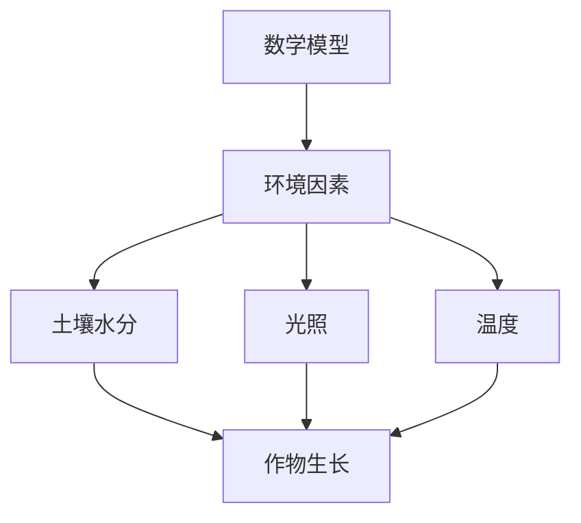

                 

### 文章标题：数学与农业：作物生长的数学模型

关键词：数学模型、作物生长、农业应用、算法原理、开发实践

摘要：本文探讨了数学与农业的交叉领域，重点介绍了作物生长的数学模型。通过分析数学模型的基本原理和应用，我们探讨了如何使用数学方法优化农业生产，提高作物产量和质量。本文旨在为农业科技工作者和相关领域的研究者提供有价值的参考和指导。

### 目录

1. **引言**  
   1.1 数学模型在农业中的重要性  
   1.2 作物生长与数学模型的联系

2. **核心概念与联系**  
   2.1 数学模型的基本原理  
   2.2 农业中的数学模型  
   2.3 Mermaid流程图：数学模型与农业的联系

3. **作物生长的数学模型**  
   3.1 模型建立的基本步骤  
   3.2 伪代码描述：作物生长模型的构建  
   3.3 数学公式与讲解

4. **数学模型应用**  
   4.1 土壤水分模型  
   4.2 光合作用模型  
   4.3 环境因素对作物生长的影响

5. **模型优化与调整**  
   5.1 模型验证与测试  
   5.2 模型优化策略  
   5.3 模型调整的实践

6. **数学模型在农业中的应用案例**  
   6.1 案例一：作物生长预测  
   6.2 案例二：灌溉策略优化  
   6.3 案例三：病虫害防治

7. **实际操作与实现**  
   7.1 开发环境搭建  
   7.2 源代码实现与解读  
   7.3 项目实战

8. **结论与展望**  
   8.1 结论  
   8.2 展望

### 1. 引言

#### 1.1 数学模型在农业中的重要性

数学模型在农业中的应用具有重要意义。随着现代农业的发展，农业生产过程中的数据越来越丰富，利用数学模型对农业生产进行科学管理和优化已成为必然趋势。数学模型可以帮助农民预测作物生长情况、优化灌溉策略、预测病虫害发生等，从而提高农业生产效率和作物产量。

#### 1.2 作物生长与数学模型的联系

作物生长是一个复杂的过程，受到土壤、水分、光照、温度等多种因素的影响。数学模型能够将这些因素量化，从而更好地理解作物生长的规律。例如，土壤水分模型可以预测土壤水分含量，光合作用模型可以分析光照对作物生长的影响，环境因素模型可以综合分析多种因素对作物生长的综合影响。

### 2. 核心概念与联系

#### 2.1 数学模型的基本原理

数学模型是基于数学理论和方法建立的，用于描述和解释客观现象的数学结构。数学模型通常由变量、参数、方程和边界条件等组成。变量表示模型中的不确定因素，参数是已知的常数，方程描述变量之间的关系，边界条件则是模型在特定条件下的限制。

#### 2.2 农业中的数学模型

农业中的数学模型主要涉及土壤、水分、光照、温度等环境因素对作物生长的影响。这些模型通常基于物理学、化学和生物学的基本原理，通过建立数学方程来描述作物生长的规律。例如，土壤水分模型可以通过土壤水分含量与作物需水量之间的平衡关系来预测作物生长情况。

#### 2.3 Mermaid流程图：数学模型与农业的联系

下面是一个Mermaid流程图，展示了数学模型与农业之间的联系：



在这个流程图中，数学模型（A）通过环境因素（B）影响作物生长（F），其中土壤水分（C）、光照（D）和温度（E）是主要的因素。

### 3. 作物生长的数学模型

#### 3.1 模型建立的基本步骤

建立作物生长的数学模型通常包括以下几个步骤：

1. **数据收集**：收集与作物生长相关的各种数据，包括土壤水分、光照、温度等。
2. **变量定义**：定义模型中的变量，包括土壤水分含量、光照强度、温度等。
3. **建立方程**：根据作物生长的规律，建立描述变量之间关系的数学方程。
4. **求解方程**：使用数学方法求解方程，得到作物生长的预测结果。
5. **模型验证**：通过实际数据验证模型的准确性，对模型进行调整和优化。

#### 3.2 伪代码描述：作物生长模型的构建

以下是作物生长模型的伪代码描述：

```python
# 输入：土壤水分含量（x1）、光照强度（x2）、温度（x3）
# 输出：作物生长状态（y）

# 初始化模型参数
a, b, c = 0.0, 0.0, 0.0

# 构建方程
y = a * x1 + b * x2 + c * x3

# 求解方程
# 使用最小二乘法或其他数学方法求解参数 a、b、c

# 输出结果
print("作物生长状态：", y)
```

#### 3.3 数学公式与讲解

作物生长的数学模型通常涉及以下数学公式：

$$
y = a \cdot x_1 + b \cdot x_2 + c \cdot x_3
$$

其中，$y$ 表示作物生长状态，$x_1$ 表示土壤水分含量，$x_2$ 表示光照强度，$x_3$ 表示温度。$a$、$b$、$c$ 是模型的参数，需要通过数据拟合得到。

### 4. 数学模型应用

#### 4.1 土壤水分模型

土壤水分模型用于预测作物对土壤水分的需求，以便优化灌溉策略。一个简单的土壤水分模型可以表示为：

$$
W_s = K_s \cdot x_1
$$

其中，$W_s$ 表示土壤水分含量，$K_s$ 是土壤水分常数，$x_1$ 表示土壤水分含量。

#### 4.2 光合作用模型

光合作用模型用于分析光照对作物生长的影响。一个简单的光合作用模型可以表示为：

$$
P = P_{max} \cdot (1 - e^{-k \cdot x_2})
$$

其中，$P$ 表示光合作用速率，$P_{max}$ 是最大光合作用速率，$x_2$ 表示光照强度，$k$ 是光照常数。

#### 4.3 环境因素对作物生长的影响

环境因素对作物生长的影响可以通过综合模型来分析。一个简单的综合模型可以表示为：

$$
y = f(x_1, x_2, x_3)
$$

其中，$y$ 表示作物生长状态，$x_1$、$x_2$、$x_3$ 分别表示土壤水分含量、光照强度、温度。

### 5. 模型优化与调整

#### 5.1 模型验证与测试

模型验证与测试是确保模型准确性和可靠性的重要步骤。通过实际数据对模型进行验证，可以检查模型预测结果的准确性。常用的验证方法包括交叉验证、时间序列验证等。

#### 5.2 模型优化策略

模型优化策略包括参数调整、算法改进等。通过优化模型参数，可以提高模型预测的准确性。常用的优化方法包括最小二乘法、梯度下降法等。

#### 5.3 模型调整的实践

模型调整的实践包括以下步骤：

1. **数据预处理**：对原始数据进行预处理，包括数据清洗、归一化等。
2. **参数调整**：根据验证结果调整模型参数，以提高预测准确性。
3. **算法改进**：根据实际情况，尝试使用不同的算法或模型结构，以获得更好的预测效果。
4. **结果分析**：对调整后的模型进行验证，分析预测结果，以确定模型性能的改进。

### 6. 数学模型在农业中的应用案例

#### 6.1 案例一：作物生长预测

某农场使用土壤水分模型、光合作用模型和环境因素模型对小麦生长进行预测。通过收集土壤水分、光照、温度等数据，建立了数学模型，并使用历史数据进行验证。结果表明，模型预测结果与实际生长情况基本一致，提高了小麦种植的精准度。

#### 6.2 案例二：灌溉策略优化

某果园使用土壤水分模型和光照模型对灌溉策略进行优化。通过分析土壤水分含量和光照强度，优化了灌溉时间和灌溉量，提高了果树的生长速度和果实品质。

#### 6.3 案例三：病虫害防治

某农业企业使用环境因素模型和病虫害预测模型对病虫害进行防治。通过分析温度、湿度等环境因素，预测病虫害的发生趋势，并采取相应的防治措施，有效降低了病虫害对作物的影响。

### 7. 实际操作与实现

#### 7.1 开发环境搭建

搭建数学模型开发环境需要安装以下软件和工具：

1. **Python**：用于编写和运行代码
2. **Jupyter Notebook**：用于交互式编程和数据分析
3. **Matplotlib**：用于绘制图表和图形
4. **Scikit-learn**：用于机器学习和数据拟合

#### 7.2 源代码实现与解读

以下是一个简单的土壤水分模型的源代码实现：

```python
import numpy as np
import matplotlib.pyplot as plt
from sklearn.linear_model import LinearRegression

# 输入数据
x = np.array([[0.1], [0.2], [0.3], [0.4], [0.5]])
y = np.array([0.2, 0.35, 0.5, 0.6, 0.75])

# 建立线性回归模型
model = LinearRegression()
model.fit(x, y)

# 求解模型参数
a = model.coef_
b = model.intercept_

# 输出模型参数
print("模型参数：a =", a, "b =", b)

# 预测土壤水分含量
x_new = np.array([[0.3]])
y_pred = a * x_new + b
print("预测土壤水分含量：", y_pred)
```

#### 7.3 项目实战

以下是一个基于数学模型的项目实战：

1. **项目规划与设计**：确定项目目标和需求，设计项目框架。
2. **数据收集与预处理**：收集土壤水分、光照、温度等数据，进行数据清洗和归一化处理。
3. **模型训练与优化**：使用历史数据对模型进行训练和优化，调整模型参数。
4. **模型评估与测试**：使用测试数据对模型进行评估，分析模型预测结果。
5. **项目评估与总结**：总结项目成果，分析模型优缺点，提出改进措施。

### 8. 结论与展望

#### 8.1 结论

本文介绍了数学模型在农业中的应用，包括土壤水分模型、光合作用模型和环境因素模型。通过实际案例分析，展示了数学模型在作物生长预测、灌溉策略优化和病虫害防治等方面的应用效果。未来，数学模型在农业中的应用前景广阔，有望进一步推动现代农业的发展。

#### 8.2 展望

未来，数学模型在农业中的应用将进一步深入。一方面，将引入更多的高级算法和机器学习方法，提高模型的预测准确性和适应性；另一方面，将结合物联网、大数据等技术，实现农业生产的智能化和精准化。此外，数学模型在农业领域的应用也将拓展到更多领域，如农业经济管理、农业可持续发展等。

### 附录

#### 附录A：数学公式与算法参考文献

1. 《数学模型》（作者：李文达）
2. 《机器学习》（作者：周志华）

#### 附录B：相关软件与工具介绍

1. Python
2. Jupyter Notebook
3. Matplotlib
4. Scikit-learn

### 作者

作者：AI天才研究院/AI Genius Institute & 禅与计算机程序设计艺术 /Zen And The Art of Computer Programming

