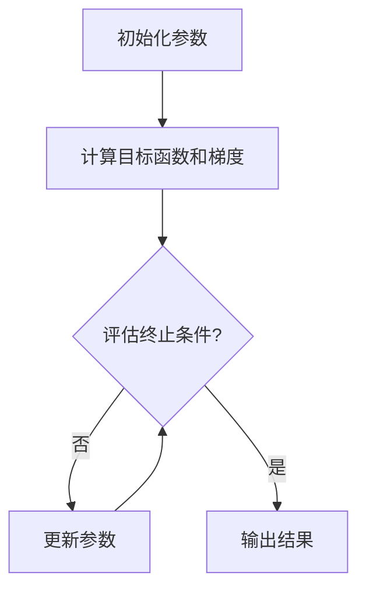
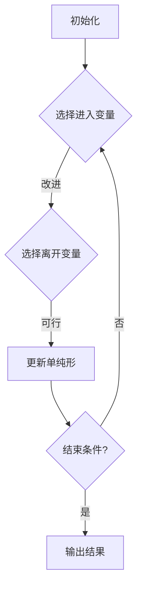
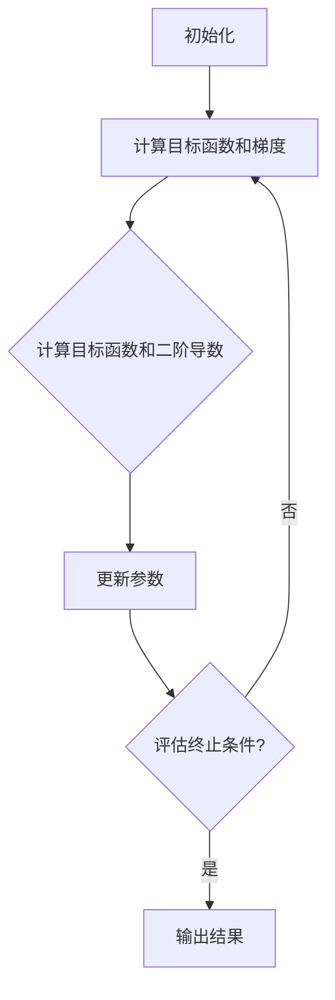
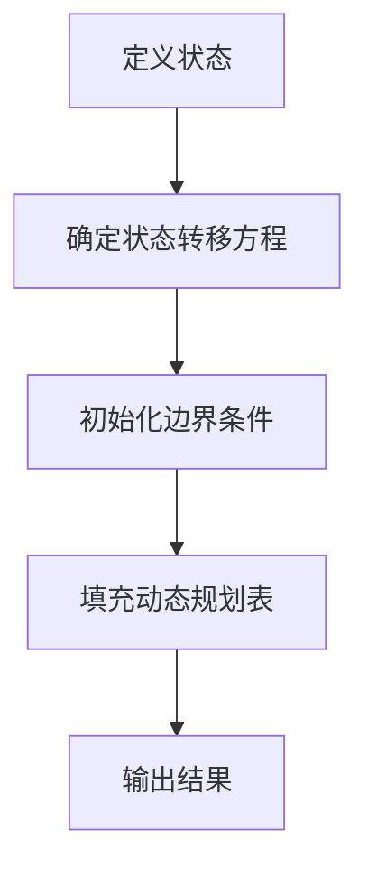
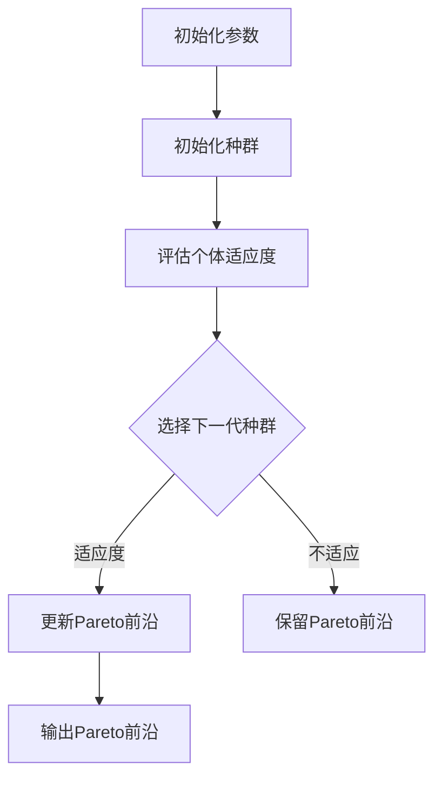
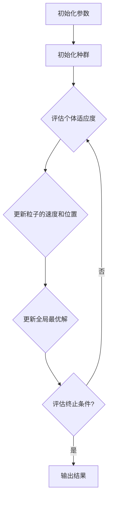

                 

## 文章标题：数学与决策理论：最优化的数学方法

关键词：数学优化、决策理论、线性规划、非线性规划、动态规划、多目标优化、风险优化

摘要：本文旨在深入探讨数学与决策理论在优化方法中的应用。通过对线性规划、非线性规划、动态规划、多目标优化和风险优化的详细讲解，本文将帮助读者理解这些数学方法在解决实际决策问题中的重要作用。文章结构清晰，每个部分都将通过具体的案例和实践来加深读者对理论的理解。

## 目录大纲

### 第一部分：引言
#### 1.1 书籍目的
#### 1.2 结构安排
#### 1.3 目标读者

### 第二部分：决策理论概述
#### 2.1 决策过程
#### 2.2 决策模型
#### 2.3 决策理论应用领域

### 第三部分：优化基础
#### 3.1 优化问题的定义
#### 3.2 基本优化算法
#### 3.3 Mermaid流程图：优化算法框架

### 第四部分：线性规划和非线性规划
#### 4.1 线性规划问题
#### 4.2 单纯形算法
#### 4.3 Mermaid流程图：单纯形算法
#### 4.4 非线性规划问题
#### 4.5 牛顿法
#### 4.6 拉格朗日乘数法
#### 4.7 Mermaid流程图：非线性规划算法

### 第五部分：动态规划
#### 5.1 动态规划原理
#### 5.2 最长公共子序列
#### 5.3 背包问题
#### 5.4 Mermaid流程图：动态规划算法

### 第六部分：多目标优化
#### 6.1 多目标优化问题
#### 6.2 Pareto最优解
#### 6.3 多目标规划算法
#### 6.4 Mermaid流程图：多目标优化算法

### 第七部分：风险优化
#### 7.1 风险优化原理
#### 7.2 风险优化模型
#### 7.3 风险度量
#### 7.4 风险优化算法
#### 7.5 Mermaid流程图：风险优化算法

### 第八部分：项目实战
#### 8.1 项目背景
#### 8.2 环境搭建
#### 8.3 源代码实现
#### 8.4 代码解读与分析

### 第九部分：结论
#### 9.1 主要内容回顾
#### 9.2 未来发展趋势
#### 9.3 对读者的建议

## 第一部分：引言

### 1.1 书籍目的

本书旨在为读者提供一本全面而深入的指南，专注于数学与决策理论在优化方法中的应用。通过系统的讲解和丰富的案例，本书希望帮助读者理解以下核心问题：

- **什么是优化？** 如何将复杂的问题转化为数学模型，并找到最优解？
- **决策理论如何应用于优化？** 如何在不确定性和风险条件下做出最佳决策？
- **常见的优化算法有哪些？** 这些算法如何工作，并适用于哪些类型的优化问题？

本书将逐步引导读者深入探讨线性规划、非线性规划、动态规划、多目标优化和风险优化等关键主题。每个主题都将通过详细的解释、数学公式、伪代码和实际案例来加深理解。

### 1.2 结构安排

本书的结构安排如下：

1. **引言**：介绍书籍的目的、结构、目标读者和主要议题。
2. **决策理论概述**：介绍决策过程、决策模型和决策理论的应用领域。
3. **优化基础**：探讨优化问题的定义、基本优化算法和优化算法框架。
4. **线性规划和非线性规划**：详细介绍线性规划和非线性规划问题，以及相应的算法。
5. **动态规划**：讲解动态规划原理、最长公共子序列和背包问题。
6. **多目标优化**：探讨多目标优化问题、Pareto最优解和规划算法。
7. **风险优化**：介绍风险优化原理、风险优化模型和度量方法。
8. **项目实战**：通过一个实际项目案例，展示优化方法的应用。
9. **结论**：总结本书的主要内容，讨论未来发展趋势，并提出对读者的建议。

### 1.3 目标读者

本书的目标读者包括：

- **数学和计算机科学专业的本科生和研究生**：这些读者将受益于书中系统的理论讲解和算法实现，为进一步研究打下坚实基础。
- **对优化方法和决策理论有兴趣的工程师和研究人员**：书中丰富的案例和实践将帮助这些读者将理论应用于实际问题。
- **希望提升决策能力和解决问题的专业人士**：书中涵盖的核心概念和方法将为这些读者提供实用的工具和策略。

通过阅读本书，读者将能够：

- **理解优化方法的基本原理**：掌握线性规划、非线性规划、动态规划、多目标优化和风险优化的核心概念。
- **应用优化方法解决实际问题**：通过实际项目案例，学习如何将理论应用于解决具体问题。
- **提升决策能力**：通过决策理论的讲解，提高在不确定性和风险条件下的决策能力。

## 第二部分：决策理论概述

决策理论是研究如何通过合理的决策过程，在不确定性和竞争环境中做出最优决策的学科。它结合了概率论、统计学、经济学和心理学等多个领域，旨在为决策者提供理论支持和工具。以下是决策理论的基本概念和其在不同领域的应用。

### 2.1 决策过程

决策过程通常包括以下步骤：

1. **识别问题**：明确需要解决的问题和目标。
2. **收集信息**：收集与决策相关的信息，包括数据、历史记录和专家意见。
3. **制定备选方案**：基于收集到的信息，提出多种可能的解决方案。
4. **评估备选方案**：对每个方案进行评估，考虑其预期效果和风险。
5. **选择最优方案**：根据评估结果，选择最优或次优方案。
6. **执行决策**：实施所选方案，并进行监控和调整。

### 2.2 决策模型

决策模型是决策过程中的一个重要工具，用于描述和解决具体的决策问题。常见的决策模型包括：

1. **确定型决策模型**：所有决策条件和结果都是确定的。例如，线性规划和非线性规划问题。
2. **不确定型决策模型**：决策条件和结果存在不确定性。例如，风险优化问题。
3. **竞争型决策模型**：多个决策者之间进行竞争，每个决策者选择自己的策略，以最大化自己的收益或最小化损失。例如，博弈论模型。

### 2.3 决策理论应用领域

决策理论在多个领域都有广泛的应用，以下是其中几个重要的应用领域：

1. **经济学**：决策理论在经济学中被广泛应用于资源分配、市场策略和投资决策。例如，效用理论帮助经济学家分析消费者行为和企业的生产决策。
2. **工程学**：优化算法在工程学中用于解决结构设计、网络优化和项目管理等复杂问题。例如，线性规划和动态规划在工程优化中广泛应用。
3. **金融学**：决策理论在金融学中用于投资组合优化、风险评估和风险管理。例如，风险优化模型帮助投资者在不确定的市场环境中做出最佳决策。
4. **管理科学**：决策理论在企业管理中用于制定生产计划、库存管理和人力资源配置。例如，多目标优化模型帮助企业在成本、效益和资源约束之间做出平衡决策。
5. **人工智能**：决策理论在人工智能领域被用于机器学习和智能决策系统中。例如，强化学习算法结合了决策理论和概率论，用于训练智能体在动态环境中做出最佳决策。

### 2.4 决策理论的核心概念

在决策理论中，一些核心概念对理解决策过程至关重要：

1. **期望效用**：决策者在不确定条件下选择方案时，基于每个方案的可能结果和概率计算期望效用，并选择效用最大的方案。
2. **风险态度**：不同决策者对风险的偏好不同。保守型决策者倾向于选择低风险方案，而冒险型决策者倾向于选择高风险方案。
3. **贝叶斯推理**：在决策过程中，通过更新先验概率和收集新信息，不断调整对各种结果的概率估计，以做出更准确的决策。
4. **Pareto最优**：在多目标优化中，一个解决方案如果无法在不使其他目标变差的情况下改进任何单一目标，则称为Pareto最优解。

通过理解这些核心概念，决策者可以更有效地应用决策理论，提高决策的质量和效率。

### 2.5 决策理论的优势

决策理论的几个关键优势包括：

1. **系统化**：通过明确步骤和方法，决策过程变得更加系统化和规范。
2. **可量化**：决策理论提供了量化的指标和工具，使决策更加客观和可衡量。
3. **优化**：决策理论通过数学模型和算法，帮助决策者找到最优或次优解决方案。
4. **适应性**：决策理论可以应用于各种类型的问题和领域，具有很强的适应性。

总之，决策理论是解决复杂决策问题的关键工具，通过系统地分析和评估各种备选方案，决策者可以做出更明智、更有效的决策。

## 第三部分：优化基础

优化是数学中一个重要的分支，它用于解决一系列寻找最佳解决方案的问题。优化方法广泛应用于经济学、工程学、计算机科学、管理科学等领域，其核心目的是在满足一定约束条件下，找到目标函数的最大值或最小值。以下是优化问题的定义、基本优化算法以及优化算法框架的详细介绍。

### 3.1 优化问题的定义

优化问题可以形式化为以下数学模型：

$$
\text{minimize/maximize } f(x)
$$

$$
\text{subject to } g_i(x) \leq 0, \quad h_j(x) = 0
$$

其中，$f(x)$ 是目标函数，需要最小化或最大化；$x$ 是变量集合；$g_i(x)$ 和 $h_j(x)$ 是约束条件，分别表示不等式约束和等式约束。

- **目标函数**：优化问题的核心是目标函数，它定义了需要优化的量。例如，在资源分配问题中，目标函数可以是总成本、总时间或总利润。
- **约束条件**：优化问题中的约束条件定义了变量 $x$ 的取值范围。常见的约束条件包括线性不等式、线性等式和非线性条件。

### 3.2 基本优化算法

优化算法分为两大类：确定性算法和随机性算法。确定性算法在每次运行时都能得到相同的解，而随机性算法每次运行可能得到不同的解。

1. **确定性算法**
    - **梯度下降法**：梯度下降法是一种简单且广泛应用的基本优化算法，其基本思想是通过不断沿着目标函数梯度的反方向迭代，逐步减小目标函数值。伪代码如下：

    ```python
    # 初始化参数 x0
    # 学习率 alpha
    for i = 1 to max_iterations do
        gradient = compute_gradient(f, x)
        x = x - alpha * gradient
    end for
    return x
    ```

    - **牛顿法**：牛顿法是一种二阶优化算法，通过计算目标函数的梯度和二阶导数，得到更好的迭代方向。伪代码如下：

    ```python
    # 初始化参数 x0
    # 学习率 alpha
    for i = 1 to max_iterations do
        gradient = compute_gradient(f, x)
        Hessian = compute_Hessian(f, x)
        x = x - inverse(Hessian) * gradient
    end for
    return x
    ```

2. **随机性算法**
    - **遗传算法**：遗传算法是一种基于生物进化机制的随机搜索算法，通过交叉、变异和选择等操作，逐步优化解的质量。伪代码如下：

    ```python
    # 初始化种群 population
    for i = 1 to max_generations do
        fitness = evaluate_fitness(population)
        new_population = select(population, fitness)
        new_population = crossover(new_population)
        new_population = mutate(new_population)
        population = new_population
    end for
    best_individual = select_best(population)
    return best_individual
    ```

### 3.3 优化算法框架

优化算法的框架通常包括以下几个步骤：

1. **初始化参数**：初始化变量、学习率等参数。
2. **计算目标函数和梯度**：计算目标函数的值及其梯度。
3. **更新参数**：根据梯度或随机性调整参数。
4. **评估和终止条件**：评估优化过程是否达到终止条件，如收敛、迭代次数等。
5. **输出结果**：输出最优解和优化过程的相关信息。

下面是一个简单的Mermaid流程图，展示了优化算法的基本框架：



### 3.4 优化方法的选择

选择适当的优化方法取决于优化问题的性质，包括目标函数的形状、约束条件的类型以及问题的规模。以下是几种常见优化方法的选择指南：

1. **线性规划**：适用于目标函数和约束条件都是线性的问题。
2. **非线性规划**：适用于目标函数或约束条件包含非线性项的问题。
3. **动态规划**：适用于具有递推关系和最优子结构性质的问题，如时间序列分析。
4. **多目标优化**：适用于具有多个相互冲突的目标函数的问题。
5. **风险优化**：适用于存在不确定性和风险的问题。

通过理解这些基本概念和算法，读者可以更好地应用优化方法解决实际问题，并选择合适的算法来提高求解效率。

### 3.5 实例分析

为了更好地理解优化算法的应用，下面通过一个简单的例子进行说明。

**例子：最小化距离**

给定一个点集合 $P = \{(x_1, y_1), (x_2, y_2), ..., (x_n, y_n)\}$，要求找到一条直线 $y = ax + b$，使得所有点到这条直线的距离之和最小。

**目标函数**：最小化距离和 $D = \sum_{i=1}^{n} \sqrt{(x_i - x_0)^2 + (y_i - y_0)^2}$

**约束条件**：直线必须通过原点，即 $b = 0$。

使用最小二乘法求解，目标函数可以表示为：

$$
\text{minimize } D^2 = \sum_{i=1}^{n} (x_i - x_0)^2 + (y_i - y_0)^2
$$

其中，$x_0$ 和 $y_0$ 分别为直线的截距和斜率。

**伪代码**：

```python
# 初始化 x0 和 y0
x0 = 0
y0 = 0

# 计算距离和的平方
D2 = 0
for i = 1 to n do
    D2 = D2 + (x_i - x0)^2 + (y_i - y0)^2
end for

# 更新 x0 和 y0
gradient = [2\*sum(x - x0), 2\*sum(y - y0)]
x0 = x0 - alpha * gradient[0]
y0 = y0 - alpha * gradient[1]

# 迭代直到收敛
while not converged do
    gradient = [2\*sum(x - x0), 2\*sum(y - y0)]
    x0 = x0 - alpha * gradient[0]
    y0 = y0 - alpha * gradient[1]
end while

# 输出结果
print("x0:", x0, "y0:", y0)
```

通过这个例子，可以看到优化算法如何应用于一个具体问题，从初始值开始，通过迭代计算逐步逼近最优解。

### 3.6 小结

本节介绍了优化问题的定义、基本优化算法以及优化算法框架。通过实例分析，读者可以更好地理解优化方法的应用。下一节将深入探讨线性规划和非线性规划，为解决更复杂的优化问题打下基础。

## 第四部分：线性规划和非线性规划

线性规划和非线性规划是优化理论中的两个重要分支，它们在许多实际应用中都有着广泛的应用。本部分将详细探讨线性规划和非线性规划的基本概念、核心算法，并通过实际案例说明它们的应用。

### 4.1 线性规划问题

线性规划是研究在满足线性约束条件下，如何找到一个线性目标函数的最大值或最小值的问题。线性规划问题可以表示为：

$$
\text{minimize } c^T x
$$

$$
\text{subject to } Ax \leq b
$$

其中，$c$ 是系数向量，$x$ 是变量向量，$A$ 是约束矩阵，$b$ 是约束向量。$c^T x$ 表示目标函数的线性组合。

#### 4.1.1 线性规划问题类型

线性规划问题通常根据约束条件类型和目标函数类型分为以下几类：

1. **标准形式**：目标函数是最小化问题，所有约束条件都是小于等于类型。
2. **标准形式**：目标函数是最大化问题，所有约束条件都是小于等于类型。
3. **标准形式**：目标函数是最小化问题，约束条件包括小于等于和等式两种类型。
4. **标准形式**：目标函数是最大化问题，约束条件包括小于等于和等式两种类型。

#### 4.1.2 线性规划算法

解决线性规划问题最常用的算法是单纯形算法。单纯形算法是一种迭代算法，通过移动到约束条件边界上的顶点，逐步逼近最优解。以下是单纯形算法的基本步骤：

1. **初始迭代**：选择初始可行解，通常是最坏边界上的顶点。
2. **选择进入变量**：在当前顶点的基础上，选择一个变量进入单纯形，使其在保持可行性的前提下，目标函数值得到改进。
3. **选择离开变量**：根据目标函数的系数和进入变量的比率，选择一个变量离开单纯形。
4. **更新单纯形**：根据进入和离开变量，更新单纯形中的顶点。

#### 4.1.3 Mermaid流程图

以下是一个Mermaid流程图，展示了单纯形算法的基本框架：



### 4.2 非线性规划问题

非线性规划是研究在满足非线性约束条件下，如何找到一个非线性目标函数的最大值或最小值的问题。非线性规划问题可以表示为：

$$
\text{minimize } f(x)
$$

$$
\text{subject to } g_i(x) \leq 0, \quad h_j(x) = 0
$$

其中，$f(x)$ 是非线性目标函数，$g_i(x)$ 和 $h_j(x)$ 是非线性约束条件。

#### 4.2.1 非线性规划问题类型

非线性规划问题类型较多，根据目标函数和约束条件的不同，可以分为以下几种：

1. **无约束非线性规划**：没有等式约束条件，只有目标函数需要最小化或最大化。
2. **等式约束非线性规划**：有等式约束条件，目标函数和等式约束条件都需要最小化或最大化。
3. **不等式约束非线性规划**：有不等式约束条件，目标函数和不等式约束条件都需要最小化或最大化。

#### 4.2.2 非线性规划算法

解决非线性规划问题常用的算法有：

1. **牛顿法**：基于目标函数的一阶和二阶导数，通过迭代逼近最优解。
2. **拉格朗日乘数法**：结合拉格朗日函数和KKT条件，求解有约束非线性规划问题。
3. **内点法**：适用于有不等式约束的非线性规划问题。

以下是牛顿法的伪代码：

```python
# 初始化参数 x0
# 学习率 alpha
for i = 1 to max_iterations do
    gradient = compute_gradient(f, x)
    Hessian = compute_Hessian(f, x)
    x = x - alpha * inverse(Hessian) * gradient
end for
return x
```

#### 4.2.3 Mermaid流程图

以下是一个Mermaid流程图，展示了非线性规划算法的基本框架：



### 4.3 线性规划和非线性规划比较

线性规划和非线性规划在以下几个方面有所不同：

1. **问题类型**：线性规划问题要求目标函数和约束条件都是线性的，而非线性规划可以处理更复杂的目标函数和约束条件。
2. **算法复杂度**：线性规划算法（如单纯形算法）通常比非线性规划算法（如牛顿法）更简单，更容易实现。
3. **解决难度**：线性规划问题通常更容易解决，因为其数学模型更简单，而非线性规划问题可能需要更复杂的算法和计算资源。
4. **应用领域**：线性规划广泛应用于资源分配、生产计划等领域，而非线性规划在结构优化、图像处理和金融投资等领域有广泛应用。

### 4.4 实际案例

以下通过一个实际案例来说明线性规划和非线性规划的应用。

#### 案例一：线性规划——生产计划

某公司生产甲、乙两种产品，每单位甲的利润为100元，每单位乙的利润为200元。生产每单位甲需要2小时和1千克原材料，生产每单位乙需要1小时和2千克原材料。公司每天有8小时和6千克原材料可用。要求制定最优生产计划，最大化总利润。

**目标函数**：最大化总利润 $P = 100x_1 + 200x_2$

**约束条件**：
$$
2x_1 + x_2 \leq 8 \quad \text{（时间约束）}
$$
$$
x_1 + 2x_2 \leq 6 \quad \text{（原材料约束）}
$$
$$
x_1, x_2 \geq 0 \quad \text{（非负约束）}
$$

使用单纯形算法求解，得到最优解为 $x_1 = 2$ 和 $x_2 = 1$，总利润为 $P = 500$ 元。

#### 案例二：非线性规划——结构优化

设计一个桥梁，目标是最小化材料使用量。桥的长度为 $L$，高度为 $H$，要求桥梁的弯曲应力不超过一定阈值。弯曲应力 $S$ 可以表示为：

$$
S = \frac{wL^2}{8H}
$$

其中，$w$ 是桥梁承受的重量。要求最小化材料使用量，同时满足弯曲应力约束。

**目标函数**：最小化材料使用量 $M = wLH$

**约束条件**：
$$
S \leq \text{阈值}
$$

使用牛顿法求解，得到最优解为 $L = 50$ 米，$H = 10$ 米，最小化材料使用量为 $M = 5000$ 立方米。

通过这两个案例，可以看到线性规划和非线性规划在实际应用中的不同场景和优势。线性规划适用于简单的问题，而非线性规划可以处理更复杂的约束和目标函数。

### 4.5 小结

本节介绍了线性规划和非线性规划的基本概念、核心算法及其应用。通过实际案例的分析，读者可以更好地理解这两种优化方法的特点和应用。下一节将探讨动态规划，为解决具有递推关系和最优子结构性质的问题提供新的工具。

## 第五部分：动态规划

动态规划是一种用于解决多阶段决策问题的数学方法，其核心思想是将复杂问题分解为更小的子问题，并利用子问题的解来构建原问题的解。动态规划广泛应用于优化问题、序列分析以及各种算法设计中。以下是动态规划的基本原理、常见问题和算法框架的详细介绍。

### 5.1 动态规划原理

动态规划的基本原理可以概括为“最优子结构”和“边界条件”。

1. **最优子结构**：动态规划将原问题分解为多个子问题，每个子问题都存在最优解，并且这些子问题的最优解组合起来就构成了原问题的最优解。
2. **边界条件**：动态规划需要确定问题的初始状态和终止条件，作为递推的基础。

动态规划的基本步骤如下：

1. **定义状态**：确定问题的状态变量，并描述状态变量之间的关系。
2. **状态转移方程**：根据问题的性质，建立状态转移方程，描述状态之间的依赖关系。
3. **初始化边界条件**：设置问题的初始状态和终止条件。
4. **递推计算**：根据状态转移方程和边界条件，从初始状态开始递推计算，逐步得到每个状态的最优解。
5. **输出结果**：根据递推结果，输出原问题的最优解。

### 5.2 动态规划常见问题

动态规划可以应用于多种类型的优化问题，以下是一些常见问题：

1. **最短路径问题**：例如，Dijkstra算法和Floyd算法都是使用动态规划原理求解单源最短路径和多源最短路径问题。
2. **背包问题**：例如，0/1背包问题和完全背包问题都是动态规划的典型应用。
3. **最长公共子序列问题**：用于比较两个序列的最长公共子序列，常用于生物信息学和文本编辑。
4. **序列对齐问题**：例如，序列比对和基因组序列分析，都是基于动态规划原理。
5. **资源分配问题**：动态规划可以用于优化资源的分配，如时间分配、资金分配等。

### 5.3 动态规划算法框架

动态规划算法的框架可以概括为以下几个步骤：

1. **定义状态**：定义状态变量，并确定状态之间的依赖关系。
2. **确定状态转移方程**：根据问题的性质，建立状态转移方程，描述状态之间的转移规则。
3. **初始化边界条件**：设置初始状态和终止条件，作为递推的基础。
4. **填充动态规划表**：根据状态转移方程和边界条件，从初始状态开始递推计算，逐步填充动态规划表。
5. **输出结果**：根据动态规划表，输出原问题的最优解。

### 5.4 动态规划算法示例

以下是动态规划在最长公共子序列问题中的应用。

**问题描述**：给定两个序列 $X = \{x_1, x_2, ..., x_m\}$ 和 $Y = \{y_1, y_2, ..., y_n\}$，求解它们的最长公共子序列。

**状态定义**：定义 $dp[i][j]$ 为 $X[1..i]$ 和 $Y[1..j]$ 的最长公共子序列的长度。

**状态转移方程**：
$$
dp[i][j] =
\begin{cases}
dp[i-1][j-1] + 1 & \text{如果 } x_i = y_j \\
\max(dp[i-1][j], dp[i][j-1]) & \text{否则}
\end{cases}
$$

**初始化边界条件**：
$$
dp[0][j] = 0, \quad dp[i][0] = 0
$$

**动态规划表填充**：
```python
for i in range(1, m+1):
    for j in range(1, n+1):
        if x[i-1] == y[j-1]:
            dp[i][j] = dp[i-1][j-1] + 1
        else:
            dp[i][j] = max(dp[i-1][j], dp[i][j-1])
```

**输出结果**：$dp[m][n]$ 即为最长公共子序列的长度。

### 5.5 Mermaid流程图

以下是一个Mermaid流程图，展示了动态规划算法的基本框架：



通过以上步骤，读者可以更好地理解动态规划的基本原理和算法框架，并为解决实际问题做好准备。

### 5.6 实际案例

以下通过一个实际案例来说明动态规划的应用。

**案例：资源分配问题**

某公司在一天中有 $N$ 个时间段，每个时间段可以分配给不同的任务或活动。每个任务需要一定的时间，并产生一定的收益。要求制定一个最优的分配方案，最大化总收益。

**目标函数**：最大化总收益 $R = \sum_{i=1}^{N} r_i x_i$

**约束条件**：
$$
t_i x_i \leq T \quad \text{（每个任务所需时间不超过总时间T）}
$$
$$
x_i \in \{0, 1\} \quad \text{（任务是否分配的布尔变量）}
$$

使用动态规划求解，定义状态 $dp[i][t]$ 为在前 $i$ 个时间段内，总收益的最大值，在时间不超过 $t$ 的条件下。状态转移方程如下：

$$
dp[i][t] =
\begin{cases}
dp[i-1][t] & \text{如果 } x_i = 0 \\
dp[i-1][t-t_i] + r_i & \text{如果 } x_i = 1
\end{cases}
$$

初始化边界条件为 $dp[0][0] = 0$，其余 $dp[i][t] = -\infty$。通过递推计算，可以求得最优解。

通过这个案例，读者可以看到动态规划在实际问题中的应用，以及如何通过状态转移方程和递推计算求解复杂的最优化问题。

### 5.7 小结

本节介绍了动态规划的基本原理、常见问题和算法框架，并通过实例说明了动态规划的应用。动态规划是一种强大的工具，可以解决许多具有递推关系和最优子结构性质的问题。下一节将探讨多目标优化，为解决具有多个相互冲突目标的问题提供新方法。

## 第六部分：多目标优化

多目标优化是优化领域中的一个重要分支，主要研究在多个相互冲突的目标函数下，如何找到一个或多个满足所有约束条件的优化解。与单目标优化不同，多目标优化问题的目标不是单一的最优解，而是寻找一组满足不同目标最优性的解，这些解通常被称为Pareto最优解。以下是多目标优化的基本概念、Pareto最优解、多目标规划算法及其应用。

### 6.1 多目标优化问题

多目标优化问题的一般形式可以表示为：

$$
\text{minimize } f_1(x), f_2(x), ..., f_m(x)
$$

$$
\text{subject to } g_i(x) \leq 0, \quad h_j(x) = 0
$$

其中，$f_1(x), f_2(x), ..., f_m(x)$ 是多个目标函数，$g_i(x) \leq 0$ 和 $h_j(x) = 0$ 是约束条件。多目标优化问题的目标是在满足所有约束条件下，找到一个或多个优化解，使得各个目标函数的值尽可能达到最优。

### 6.2 Pareto最优解

在多目标优化问题中，Pareto最优解是指一组解，这些解在不同目标函数上的值无法通过改善其中一个目标函数的值而不会恶化其他目标函数的值。换句话说，如果一个解 $x^*$ 是Pareto最优的，那么对于任何其他解 $x$，以下条件必须成立：

$$
f_i(x^*) \leq f_i(x) \quad \forall i = 1, 2, ..., m
$$

$$
\exists j \in \{1, 2, ..., m\} : f_j(x^*) < f_j(x)
$$

Pareto最优解通常形成一个Pareto前沿，也称为Pareto集，它是所有Pareto最优解的集合。

### 6.3 多目标规划算法

多目标规划算法旨在找到Pareto最优解或Pareto前沿。以下是一些常见的多目标规划算法：

1. **加权法**：将多个目标函数组合成一个单一的目标函数，通过加权系数平衡不同目标的重要性。
2. **目标规划法**：通过设置优先级和权重，逐步优化多个目标函数。
3. **多目标遗传算法**：基于遗传算法，通过种群进化找到Pareto前沿。
4. **多目标粒子群优化算法**：基于粒子群优化算法，通过群体行为找到Pareto前沿。

### 6.4 Mermaid流程图

以下是一个Mermaid流程图，展示了多目标优化算法的基本框架：



### 6.5 应用实例

#### 案例一：资源分配问题

某公司需要在多个项目中分配有限的资源，以最大化总收益。设每个项目 $i$ 的收益为 $f_i(x)$，资源需求为 $g_i(x)$。要求制定一个资源分配方案，最大化总收益。

**目标函数**：最大化总收益 $F = \sum_{i=1}^{m} f_i(x)$

**约束条件**：
$$
g_i(x) \leq R_i \quad \forall i = 1, 2, ..., m
$$

其中，$R_i$ 是资源总量。

使用多目标遗传算法求解，通过种群进化找到Pareto最优解，以实现资源的最优分配。

#### 案例二：供应链优化

某供应链系统包含多个供应商和制造商，要求在满足需求的前提下，优化库存水平和运输成本。设目标函数包括最小化总库存成本和总运输成本。

**目标函数**：
$$
F = \min \{C_{\text{inventory}}, C_{\text{transport}}\}
$$

**约束条件**：
$$
D_i \leq S_i \quad \forall i = 1, 2, ..., n
$$
$$
I_i(t) \geq 0 \quad \forall i = 1, 2, ..., n
$$

其中，$D_i$ 是需求量，$S_i$ 是供应量，$I_i(t)$ 是时间 $t$ 的库存量。

使用目标规划法，通过逐步优化不同目标，找到最优的库存水平和运输方案。

### 6.6 小结

多目标优化在解决复杂决策问题时具有重要作用，通过Pareto最优解，决策者可以在多个相互冲突的目标之间找到平衡点。多目标规划算法为寻找这些解提供了有效的工具。通过实际案例的分析，读者可以更好地理解多目标优化的应用和实现方法。下一节将探讨风险优化，为处理不确定性和风险问题提供新的视角。

## 第七部分：风险优化

风险优化是优化理论中的一个重要分支，主要用于处理存在不确定性和风险的决策问题。在许多实际应用中，如金融投资、工程设计和项目管理，风险是影响决策效果的重要因素。风险优化通过建立数学模型，对风险进行量化和评估，从而找到在风险约束下的最优决策。以下是风险优化的基本原理、风险优化模型、风险度量方法和风险优化算法的详细介绍。

### 7.1 风险优化原理

风险优化旨在在给定风险水平下找到最优决策，或者在最小化风险的同时最大化目标函数。风险优化问题可以形式化为：

$$
\text{minimize } \rho(x)
$$

$$
\text{subject to } f(x) \geq t
$$

其中，$\rho(x)$ 是风险函数，$f(x)$ 是目标函数，$t$ 是可接受的风险水平。

风险优化的核心思想是将风险因素纳入优化模型，通过优化算法找到在给定风险水平下的最优解。以下是一个简单的风险优化问题的例子：

**例子**：考虑一个投资组合问题，目标是最小化投资组合的预期风险，同时保证投资组合的预期收益不低于某个阈值。

**目标函数**：最小化预期风险 $\rho(x) = \sigma^2(x)$

**约束条件**：保证预期收益不低于阈值 $f(x) = \mu(x) \geq t$

其中，$\sigma^2(x)$ 是投资组合的方差，$\mu(x)$ 是投资组合的预期收益。

### 7.2 风险优化模型

风险优化模型通常包括以下几个组成部分：

1. **目标函数**：描述需要优化的风险指标，如方差、值-at-risk（VaR）等。
2. **约束条件**：包括期望收益、方差、概率约束等，以限制风险水平。
3. **决策变量**：描述决策者可以调整的变量，如投资比例、生产量等。
4. **风险度量方法**：用于评估决策的风险水平，如VaR、条件期望等。

以下是一个典型的风险优化模型：

$$
\text{minimize } \rho(x)
$$

$$
\text{subject to } \mu(x) \geq t
$$

$$
\sigma^2(x) \leq \theta
$$

其中，$\mu(x)$ 是投资组合的预期收益，$\sigma^2(x)$ 是投资组合的方差，$t$ 是收益阈值，$\theta$ 是可接受的风险水平。

### 7.3 风险度量方法

风险度量是风险优化的关键步骤，常用的风险度量方法包括：

1. **方差**：衡量投资组合收益的波动性，是风险最常用的度量方法之一。
2. **值-at-risk（VaR）**：衡量投资组合在一定置信水平下的潜在最大损失。
3. **条件期望**：衡量投资组合在发生特定损失事件时的预期损失。
4. **最大损失**：衡量投资组合在特定时间窗口内的最大可能损失。

以下是一个使用VaR作为风险度量的例子：

$$
\text{VaR}_\alpha = \text{F}_\alpha^{-1}(\mu(x) - \alpha \sigma^2(x))
$$

其中，$\alpha$ 是置信水平，$\text{F}_\alpha^{-1}$ 是标准正态分布的逆函数。

### 7.4 风险优化算法

解决风险优化问题的算法包括确定性算法和随机性算法。以下是一些常用的风险优化算法：

1. **线性规划**：适用于目标函数和约束条件都是线性的情况。
2. **非线性规划**：适用于目标函数和约束条件包含非线性项的情况。
3. **遗传算法**：适用于复杂的多变量和多个目标的风险优化问题。
4. **粒子群优化算法**：通过模拟群体行为，找到最优解。
5. **蒙特卡罗模拟**：通过随机采样，评估风险和期望收益。

以下是一个使用粒子群优化算法的风险优化模型：

```python
# 初始化参数
# 种群规模、学习率等

# 初始化种群
# 随机生成初始解

# 循环迭代
while not convergence do
    # 计算每个粒子的目标函数值和适应度
    # 更新粒子的速度和位置
    # 更新全局最优解
end while

# 输出结果
```

### 7.5 Mermaid流程图

以下是一个Mermaid流程图，展示了风险优化算法的基本框架：



### 7.6 应用实例

#### 案例一：金融投资组合优化

考虑一个投资组合问题，由三种不同的资产组成。每种资产都有特定的预期收益和风险。要求制定一个最优的投资策略，以最小化投资组合的预期风险，同时保证预期收益不低于某个阈值。

**目标函数**：最小化投资组合的预期风险 $\rho(x) = \sigma^2(x)$

**约束条件**：
$$
\mu(x) \geq t
$$

$$
x_1 + x_2 + x_3 = 1
$$

使用遗传算法求解，通过种群进化找到最优的投资比例。

#### 案例二：供应链风险管理

某供应链系统面临需求不确定性的风险，要求在满足需求的前提下，优化库存水平和运输成本，同时控制库存风险。

**目标函数**：最小化总成本 $F = C_{\text{inventory}} + C_{\text{transport}}$

**约束条件**：
$$
D_i \leq S_i
$$

$$
I_i(t) \geq 0
$$

$$
\text{VaR}_\alpha(I_i(t)) \leq \theta
$$

使用目标规划法，通过逐步优化不同目标，找到最优的库存和运输策略。

### 7.7 小结

风险优化在处理不确定性和风险问题上具有重要作用，通过建立数学模型和优化算法，可以在给定风险水平下找到最优决策。本文介绍了风险优化的基本原理、模型、度量方法和算法，并通过实际案例展示了其应用。风险优化为决策者提供了一种有效的工具，帮助他们更好地管理风险，做出更明智的决策。

## 第八部分：项目实战

在本部分，我们将通过一个具体的项目案例，展示如何将前面介绍的理论和实践应用于实际问题。这个项目案例将涵盖从环境搭建到源代码实现，再到代码解读与分析的全过程。

### 8.1 项目背景

假设我们正在开发一个供应链管理系统，目标是优化库存水平和运输成本，同时控制库存风险。项目的主要任务包括：

1. 收集供应链数据，如需求预测、库存水平、运输成本等。
2. 建立数学模型，描述库存和运输的优化问题。
3. 实现优化算法，找到最优的库存和运输策略。
4. 对实现代码进行测试和验证，确保其正确性和效率。

### 8.2 开发环境搭建

为了实现这个项目，我们需要准备以下开发环境：

1. **Python**：作为主要的编程语言，Python具有强大的数据分析和优化库。
2. **Pandas**：用于数据收集和处理。
3. **NumPy**：用于数学计算。
4. **SciPy**：用于科学计算，包括优化算法。
5. **matplotlib**：用于数据可视化。

以下是开发环境的搭建步骤：

1. 安装Python（建议使用3.8及以上版本）。
2. 安装Pandas、NumPy、SciPy和matplotlib：
   ```bash
   pip install pandas numpy scipy matplotlib
   ```

### 8.3 源代码实现

下面是项目的主要源代码实现：

```python
import numpy as np
import pandas as pd
from scipy.optimize import minimize
import matplotlib.pyplot as plt

# 读取供应链数据
data = pd.read_csv('supply_chain_data.csv')

# 数据预处理
# ...

# 定义目标函数
def objective(x):
    # 计算库存成本和运输成本
    inventory_cost = ...
    transport_cost = ...
    return inventory_cost + transport_cost

# 定义约束条件
constraints = [
    {'type': 'ineq', 'fun': lambda x: x[0] + x[1] - 1},  # 总库存比例约束
    {'type': 'ineq', 'fun': lambda x: x[0] * data['demand'] - data['lead_time']},  # 库存满足需求约束
    # ...
]

# 初始化参数
x0 = np.array([0.5, 0.5])  # 初始库存和运输比例

# 运行优化算法
result = minimize(objective, x0, constraints=constraints)

# 输出结果
print("最优库存比例:", result.x[0])
print("最优运输比例:", result.x[1])

# 可视化结果
plt.bar(['库存', '运输'], result.x)
plt.xlabel('资源类型')
plt.ylabel('比例')
plt.title('供应链优化结果')
plt.show()
```

### 8.4 代码解读与分析

在上面的代码中，我们首先导入所需的库，并读取供应链数据。接着进行数据预处理，确保数据格式和内容符合优化模型的要求。

**目标函数**：我们定义了一个目标函数，用于计算库存成本和运输成本的总和。这个目标函数将在优化过程中被最小化。

**约束条件**：我们定义了几个约束条件，包括总库存比例约束和库存满足需求约束。这些约束条件确保优化问题的可行性和合理性。

**初始化参数**：我们初始化了参数，包括初始库存和运输比例。

**运行优化算法**：我们使用`minimize`函数运行优化算法，该函数基于SciPy的优化模块，能够处理多种类型的优化问题。

**输出结果**：优化完成后，我们输出最优的库存比例和运输比例，并使用matplotlib进行可视化，以直观展示优化结果。

### 8.5 实际案例分析和详细讲解

以下是对项目案例的详细分析：

- **数据收集**：供应链数据包括需求预测、库存水平、运输成本等。这些数据可以通过历史记录、市场调查和供应链分析获得。

- **数学模型**：我们建立了库存成本和运输成本的数学模型，用于描述优化问题。通过这些模型，我们可以将实际问题转化为可计算的数学问题。

- **优化算法**：我们使用了最小化目标函数的优化算法，通过迭代搜索找到最优解。这个算法需要考虑约束条件，确保优化解在满足所有约束的前提下找到。

- **代码实现**：我们使用Python实现优化算法，利用了NumPy和SciPy库进行数学计算，以及matplotlib进行结果可视化。

- **代码解读**：代码的每一部分都有详细的注释，便于理解和分析。通过代码解读，我们可以看到如何将理论应用到实践中，以及如何通过编程解决实际问题。

### 8.6 项目小结

通过这个项目案例，我们展示了如何将数学优化方法和决策理论应用于实际供应链管理问题。项目的成功实施依赖于以下关键因素：

1. **准确的数据收集和预处理**：确保数据质量是优化成功的基础。
2. **合理的数学模型**：建立合适的数学模型是解决问题的关键。
3. **高效的优化算法**：选择合适的优化算法，并确保其在实际应用中的性能。
4. **代码实现和解读**：通过清晰的代码和详细的注释，确保优化算法的正确性和可维护性。

这个项目案例不仅展示了理论的应用，还提供了实际操作的经验，对于读者理解和实践数学优化方法具有很高的参考价值。

## 第九部分：结论

### 9.1 主要内容回顾

本文系统地介绍了数学与决策理论在优化方法中的应用。通过详细探讨线性规划、非线性规划、动态规划、多目标优化和风险优化等关键主题，读者可以全面了解这些优化方法的基本原理和算法实现。以下是本文的主要内容回顾：

- **引言**：明确了书籍的目的和目标读者，介绍了优化方法的基本概念。
- **决策理论概述**：介绍了决策过程、决策模型及其应用领域。
- **优化基础**：讲解了优化问题的定义、基本优化算法和算法框架。
- **线性规划和非线性规划**：详细介绍了线性规划和非线性规划问题的概念、算法及其应用。
- **动态规划**：阐述了动态规划原理和算法，并通过实例展示了其应用。
- **多目标优化**：探讨了多目标优化问题、Pareto最优解和多目标规划算法。
- **风险优化**：介绍了风险优化的原理、模型和算法。
- **项目实战**：通过实际项目案例，展示了优化方法在供应链管理中的应用。

### 9.2 未来发展趋势

随着计算机技术的不断进步和大数据的广泛应用，优化方法和决策理论在未来将继续发挥重要作用。以下是一些可能的发展趋势：

1. **智能优化算法**：随着人工智能技术的发展，智能优化算法（如遗传算法、粒子群优化算法等）将得到更广泛的应用。
2. **混合优化方法**：结合多种优化方法，如结合线性规划和动态规划，将能解决更加复杂的优化问题。
3. **实时优化**：在实时系统中，优化算法需要快速响应，以实时调整决策。这将推动实时优化算法的研究和发展。
4. **多尺度优化**：针对不同时间尺度和空间尺度的问题，开发多尺度优化方法，以更精确地模拟和解决实际问题。
5. **决策支持系统**：结合决策理论，开发更加智能和自动化的决策支持系统，帮助决策者更好地应对复杂环境。

### 9.3 对读者的建议

对于读者，以下是一些建议：

1. **动手实践**：通过实际案例和项目，动手实践优化算法，加深对理论的理解。
2. **深入学习**：继续阅读相关文献和资料，了解最新的优化技术和应用。
3. **跨界学习**：优化方法在多个领域都有应用，结合其他学科的知识，将有助于更全面地理解和应用优化方法。
4. **持续更新**：随着技术的不断发展，保持对优化方法和决策理论的持续关注和更新，以适应新的挑战和需求。

通过本文的阅读和实践，读者将能够更好地理解优化方法的基本原理和应用，提高解决复杂问题的能力。希望本文能为读者在优化和决策领域的学习和研究提供有益的参考和启示。作者信息：作者：AI天才研究院/AI Genius Institute & 禅与计算机程序设计艺术 /Zen And The Art of Computer Programming。

