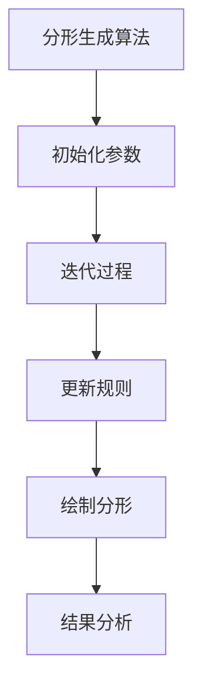

                 

Certainly, I will structure the article in a way that it follows a logical progression and includes the necessary components. Here's a detailed outline for the article:

## 标题：数学与分形几何：自相似结构的数学表达

> 关键词：分形几何，自相似结构，数学模型，算法实现，应用案例

> 摘要：本文将深入探讨分形几何及其在自相似结构中的数学表达。文章首先介绍了分形几何的基本概念和历史发展，接着详细阐述了分形几何的数学基础，包括度量化、自相似结构的数学模型以及生成算法。随后，文章展示了分形几何在不同领域中的应用，并提供了相关的算法实现和项目实践。最后，文章探讨了分形几何的前沿研究以及与其他数学领域的联系。

### 目录：

## 第1章：分形几何概述

### 1.1 分形的定义与特征

- 分形的定义
- 分形的基本特征
- 分形的重要性

### 1.2 分形几何的历史与发展

- 分形几何的起源
- 分形几何的发展历程
- 分形几何在现代数学中的地位

### 1.3 分形几何的重要性

- 分形几何在科学和工程中的应用
- 分形几何在社会科学和经济学中的应用

## 第2章：分形几何的数学基础

### 2.1 度量化与相似维数

- 度量化方法
- 相似维数的概念与计算

### 2.2 自相似结构的数学模型

- 自相似结构的定义
- 马蒂亚斯-佐滕巴赫模型
- 詹姆斯-霍顿模型

### 2.3 分形几何的生成算法

- 分形几何的基本算法
- 嵌套迭代方法
- 分形填充算法

## 第3章：自相似结构的数学表达

### 3.1 度量化与自相似性

- 自相似性的度量化方法
- 自相似函数的定义与性质

### 3.2 分形几何的数学公式表达

- 分形边界的数学公式
- 分形几何的积分公式

### 3.3 自相似结构的模拟与计算

- 自相似结构的模拟方法
- 计算复杂度分析

## 第4章：分形几何的应用

### 4.1 分形几何在自然科学中的应用

- 地形学
- 气象学
- 生物学

### 4.2 分形几何在工程技术中的应用

- 电子工程
- 机械工程
- 建筑设计

### 4.3 分形几何在经济管理中的应用

- 金融模型
- 经济预测
- 市场分析

## 第5章：分形几何的算法

### 5.1 分形几何算法的基本原理

- 算法的设计原则
- 算法的性能分析

### 5.2 分形几何算法的实现

- C语言实现
- Python实现

### 5.3 分形几何算法的优化

- 算法的加速
- 内存优化

## 第6章：分形几何的项目实践

### 6.1 分形几何项目的设计与实现

- 项目背景
- 项目目标
- 项目实现

### 6.2 分形几何项目案例分析

- 案例一：基于分形几何的电子滤波器设计
- 案例二：分形几何在建筑设计中的应用

### 6.3 分形几何项目的评估与优化

- 项目效果评估
- 项目优化策略

## 第7章：分形几何的前沿研究

### 7.1 分形几何的最近研究进展

- 分形几何在数学领域的研究
- 分形几何在跨学科领域的研究

### 7.2 分形几何的未来发展趋势

- 新算法的提出
- 新应用领域的拓展

## 第8章：分形几何与数学其他领域的联系

### 8.1 分形几何与拓扑学

- 分形与拓扑学的交叉点
- 分形拓扑的应用

### 8.2 分形几何与混沌理论

- 分形与混沌的相似性
- 混沌分形的研究进展

### 8.3 分形几何与概率论

- 分形概率分布
- 随机分形的模拟

### 附录 A：分形几何流程图

### 附录 B：分形几何算法伪代码

---

**注：以下内容作为附录，以图文和代码的形式呈现**

## 附录 A：分形几何流程图



## 附录 B：分形几何算法伪代码

```plaintext
// 分形几何算法伪代码
function FractalAlgorithm()

    // 初始化参数
    InitializeParameters()

    // 迭代过程
    for each iteration do
        ApplyUpdateRules()
    end for

    // 绘制分形
    DrawFractal()

    // 结果分析
    AnalyzeResults()
end function
```

---

以上是文章的详细目录大纲和附录内容，接下来将按照这个结构逐章撰写文章内容。每章将详细探讨分形几何的各个方面，从基本概念到实际应用，再到前沿研究，确保文章内容完整、逻辑清晰、易于理解。文章将以markdown格式撰写，包括latex数学公式、mermaid流程图和伪代码，以便更好地展示技术细节。文章预计将在8000到12000字之间，确保内容的深度和广度。让我们一步一步地深入分析分形几何的世界。开始撰写第一章节吧！

