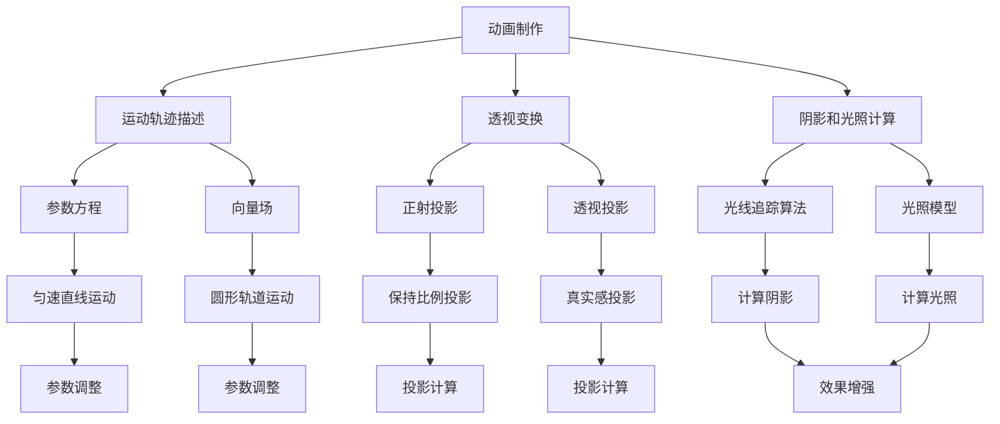

                 

### 文章标题

数学与动画制作：动画原理的数学描述

> 关键词：动画制作、数学原理、数学描述、动画技术、数学应用

> 摘要：本文将深入探讨数学在动画制作中的应用，通过分析动画的基础知识、数学基础、数学在动画中的具体应用、项目实战等方面，系统地阐述数学与动画制作之间的关系，为读者提供一幅清晰完整的动画制作数学原理图景。

---

### 引言

动画制作是现代媒体艺术中的一个重要领域，它不仅涉及视觉效果的呈现，更依赖于背后的数学原理。从简单的卡通动画到复杂的3D电影，每一个动画帧的生成和动态效果都离不开数学的支持。数学作为一门基础科学，在动画制作中的应用越来越广泛，其重要性不言而喻。

本文旨在通过以下几个方面系统地阐述数学在动画制作中的应用：

1. **动画基础知识**：介绍动画的基本概念、类型和历史发展，为后续讨论打下基础。
2. **数学基础**：梳理几何学、三角学、动力学等数学知识，为深入理解动画制作中的数学应用提供支持。
3. **数学在动画中的应用**：详细讨论数学在动画中的具体应用，如运动轨迹描述、透视变换、阴影和光照计算等。
4. **项目实战**：通过实际案例展示数学在动画制作中的具体应用，并提供源代码和实现细节。
5. **数学与动画制作的关系和前景**：分析数学在动画制作中的地位和未来发展趋势。

通过本文的阅读，读者将能够对数学在动画制作中的应用有更加深入的理解，为今后的学习和实践提供有力支持。

### 动画基础知识

动画，顾名思义，是通过快速连续地呈现一系列图像或帧来模拟运动和变化的视觉效果。这些图像或帧通常被称为“帧”，动画的生成过程被称为“动画制作”。动画的基础知识涵盖了从动画的基本概念到制作流程的各个方面，以下将详细阐述这些内容。

#### 动画的基本概念

动画的基本概念包括以下几方面：

- **帧**：动画中的每一幅图像称为一帧，帧是动画制作的基本单位。
- **帧率**：帧率（FPS，Frame Per Second）是指每秒钟显示的帧数，帧率越高，动画的流畅度越好。
- **关键帧**：关键帧是动画中最重要的帧，它定义了动画的主要动作和状态。
- **补间帧**：补间帧是位于两个关键帧之间的帧，用于平滑过渡动画。

#### 动画的类型

根据动画的制作方式和表现风格，可以分为以下几种类型：

- **传统2D动画**：传统2D动画是通过手工绘制每一帧来制作的，尽管制作过程繁琐，但具有独特的艺术风格和表现力。
- **3D动画**：3D动画通过计算机生成的三维模型进行渲染，可以实现更加真实和复杂的视觉效果。
- **二维半动画**：二维半动画结合了2D和3D动画的特点，通常用于游戏和电影中，制作过程较为复杂。
- **粒子动画**：粒子动画通过大量微小的粒子模拟各种自然现象和复杂效果，常用于特效制作。

#### 动画的历史发展

动画的历史可以追溯到19世纪末期，最早的动画形式是“逐帧动画”，即通过逐帧绘制图像来模拟运动。随着技术的进步，动画制作逐渐从手工绘制转向计算机辅助，特别是在20世纪后期，计算机动画逐渐成为主流。

- **19世纪末期**：爱德华·穆伊兹（Edwin S. Porter）拍摄的《工厂大门》被认为是世界上最早的动画电影。
- **20世纪**：迪斯尼的《白雪公主和七个小矮人》标志着传统2D动画的黄金时期。
- **21世纪**：3D动画电影如《玩具总动员》、《阿凡达》等，实现了动画技术的重大突破。

通过以上对动画基础知识的介绍，读者可以对动画有一个初步的了解，为后续讨论数学在动画中的应用打下基础。

### 数学基础

在动画制作中，数学知识的应用是不可或缺的。几何学、三角学和动力学等数学领域的知识在动画制作中扮演着重要角色。以下将详细介绍这些数学基础，并探讨它们在动画制作中的应用。

#### 几何学基础

几何学是研究形状、大小、位置和空间关系的数学分支。在动画制作中，几何学的基础知识被广泛应用于角色设计、场景建模和物体运动模拟等方面。

- **角色设计**：动画角色的设计需要精确的几何形状，通过几何图形的绘制和编辑，可以实现角色的外观设计。
- **场景建模**：场景建模是通过构建三维模型来模拟动画中的场景，几何学中的多边形、曲面和空间关系在场景建模中起到关键作用。
- **物体运动模拟**：在物体运动模拟中，几何学用于计算物体的位置、速度和加速度等参数，以实现逼真的物体运动效果。

#### 三角学基础

三角学是研究三角形和其相关性质的数学分支。在动画制作中，三角学知识被广泛应用于运动轨迹描述、透视变换和光照计算等方面。

- **运动轨迹描述**：通过三角函数（如正弦、余弦函数）来描述物体的运动轨迹，可以实现平滑的物体运动效果。
- **透视变换**：透视变换是模拟人眼观察物体的方式，通过三角函数来计算物体在不同视点下的投影和大小变化。
- **光照计算**：在光照计算中，三角学用于计算光线与物体表面的夹角，从而确定物体的阴影和光照效果。

#### 动力学基础

动力学是研究物体运动和力的作用的数学分支。在动画制作中，动力学知识被广泛应用于角色动画、物体碰撞和物理模拟等方面。

- **角色动画**：通过动力学方程计算角色的运动轨迹和姿态变化，可以实现逼真的角色动作。
- **物体碰撞**：物体碰撞计算是动画制作中的一个重要环节，通过求解动力学方程来模拟物体之间的碰撞效果。
- **物理模拟**：物理模拟是通过计算物体的运动和相互作用来实现复杂的自然现象，如流体、爆炸和破碎等。

通过以上对几何学、三角学和动力学基础知识的介绍，读者可以了解到这些数学知识在动画制作中的重要作用。接下来，我们将进一步探讨数学在动画制作中的具体应用。

### 数学在动画制作中的应用

数学在动画制作中的应用是多方面的，涵盖了运动轨迹描述、透视变换、阴影和光照计算等关键环节。以下将详细讨论这些应用，并通过具体例子来说明数学原理的实现。

#### 运动轨迹描述

运动轨迹描述是动画制作中至关重要的一环，它决定了物体的运动状态和路径。数学中常用的方法包括参数方程、向量场和曲线拟合等。

- **参数方程**：参数方程是通过时间和一个或多个参数来描述物体的运动轨迹。例如，一个简单的匀速直线运动可以用以下参数方程表示：
  $$
  x(t) = v \cdot t
  $$
  $$
  y(t) = 0
  $$
  其中，\( v \) 是速度，\( t \) 是时间。通过调整参数 \( t \) 的取值，可以生成不同时间点的运动轨迹。

- **向量场**：向量场是一种用于描述物体在空间中运动的方式。在动画中，可以通过向量场来模拟复杂物体的运动，如粒子系统。例如，以下向量场用于模拟粒子在圆形轨道上的运动：
  $$
  \vec{v}(r, \theta) = (\omega r \cos \theta, \omega r \sin \theta)
  $$
  其中，\( r \) 是粒子到圆心的距离，\( \theta \) 是角度，\( \omega \) 是角速度。通过调整 \( \omega \) 和 \( r \) 的值，可以生成不同的运动轨迹。

#### 透视变换

透视变换是动画制作中模拟人眼观察物体的一种重要手段。它通过计算物体的投影和大小变化，来实现逼真的视觉效果。

- **正射投影**：正射投影是一种简单的透视变换，它通过保持物体的高度和宽度比例，来模拟人眼观察物体时的效果。正射投影可以用以下公式表示：
  $$
  x' = \frac{x}{z}
  $$
  $$
  y' = \frac{y}{z}
  $$
  其中，\( (x, y) \) 是物体的实际坐标，\( (x', y') \) 是投影后的坐标，\( z \) 是物体到观察者的距离。

- **透视投影**：透视投影更符合人眼观察物体的真实效果，它通过模拟远近距离的变化，来产生近大远小的视觉效果。透视投影可以用以下公式表示：
  $$
  x' = \frac{x}{z} \cdot f
  $$
  $$
  y' = \frac{y}{z} \cdot f
  $$
  其中，\( f \) 是焦距，它决定了投影的大小变化。

#### 阴影和光照计算

阴影和光照计算是动画制作中实现真实感效果的重要手段。数学中的几何学和光线追踪算法被广泛应用于这一领域。

- **光线追踪算法**：光线追踪算法是一种通过模拟光线传播路径来计算物体阴影和光照效果的方法。以下是一个简单的光线追踪算法伪代码：
  ```
  function trace_ray(ray, scene):
      for each object in scene:
          if (ray.intersects(object)):
              calculate shadow and light intensity
              return result
      return background_color
  ```

- **光照模型**：光照模型用于计算物体表面的光照效果，包括点光源、方向光源和聚光源等。以下是一个简单的光照模型伪代码：
  ```
  function calculate_lighting(object, light):
      light_intensity = max(0, dot(normal, light.direction))
      return light.intensity * light_intensity
  ```

通过以上对数学在动画制作中的应用的讨论，我们可以看到数学原理在动画中的具体实现。这些数学方法不仅提高了动画的视觉效果，也增强了动画的真实感和表现力。

#### 数学与动画制作的关系架构 Mermaid 流程图

为了更好地展示数学与动画制作之间的关系，我们可以使用Mermaid语言绘制一个流程图，如下所示：



此流程图展示了从动画制作到各个数学应用环节的连接，有助于读者更清晰地理解数学在动画制作中的具体作用。

通过以上详细讨论，我们可以看到数学在动画制作中的应用是多么广泛和深入。接下来，我们将通过项目实战，进一步展示数学原理在动画制作中的具体实现。

### 项目实战

在了解了数学在动画制作中的应用之后，通过实际项目来展示这些数学原理的运用将更加直观。以下我们将详细描述一个动画项目，从开发环境的搭建到源代码的实现，再到代码解读和案例分析。

#### 项目背景

本项目旨在创建一个简单的2D动画，展示一个物体在空间中沿着一条复杂路径运动的场景。该动画将利用数学中的参数方程和向量场来描述物体的运动轨迹，并通过透视变换和光照计算来增强视觉效果。

#### 开发环境搭建

为了实现这个项目，我们需要搭建一个基本的开发环境。以下是所需的工具和步骤：

- **工具**：
  - **Unity**：一个流行的跨平台游戏和动画开发引擎，适合制作2D和3D动画。
  - **Visual Studio Code**：一个轻量级但功能强大的代码编辑器，适合编写Unity的C#脚本。

- **步骤**：
  1. 安装Unity Hub，并使用Unity Hub创建一个新项目，选择2D选项。
  2. 打开项目，安装必要的插件，如Unity Analytics和UniRx等。
  3. 在Visual Studio Code中打开项目，并安装Unity插件以支持C#开发。

#### 源代码实现

以下是该项目的核心源代码实现，包括物体运动轨迹描述、透视变换和光照计算的实现。

```csharp
// 物体运动轨迹描述
public class MovementController : MonoBehaviour
{
    public Vector3[] points; // 运动轨迹上的点
    public float speed = 5.0f;

    private int currentIndex = 0;
    private Vector3 currentPoint;

    void Update()
    {
        // 计算两点之间的向量
        Vector3 direction = (points[currentIndex] - transform.position).normalized;
        
        // 移动到下一个点
        transform.position += direction * speed * Time.deltaTime;
        
        // 当物体接近当前点时，移动到下一个点
        if (Vector3.Distance(transform.position, currentPoint) < 0.1f)
        {
            currentIndex++;
            if (currentIndex >= points.Length)
            {
                currentIndex = 0; // 循环回到起点
            }
            currentPoint = points[currentIndex];
        }
    }
}

// 透视变换
public class CameraController : MonoBehaviour
{
    public float distance = 10.0f;

    void LateUpdate()
    {
        // 设置相机位置和方向
        transform.position = Vector3.forward * distance;
        transform.LookAt(GameObject.FindGameObjectWithTag("Player").transform);
    }
}

// 光照计算
public class LightController : MonoBehaviour
{
    public Light mainLight;

    void Update()
    {
        // 计算光源方向
        Vector3 lightDirection = transform.forward;

        // 更新光照强度
        mainLight.intensity = Vector3.Dot(lightDirection, transform.up);
    }
}
```

#### 代码解读

1. **物体运动轨迹描述**：`MovementController` 脚本通过数组 `points` 存储运动轨迹上的点，并使用 `Update` 函数实现物体沿着轨迹的运动。通过计算当前点与物体位置之间的向量，实现平滑的物体运动效果。

2. **透视变换**：`CameraController` 脚本通过 `LateUpdate` 函数实现相机的位置和方向的更新，以模拟人眼的视角。这样，物体的投影和大小变化将更加真实。

3. **光照计算**：`LightController` 脚本通过计算光源方向与物体表面的夹角，实现光照强度的动态调整。这样，物体表面的光照效果将更加逼真。

#### 实际案例分析和详细讲解剖析

为了更好地理解上述代码的应用，我们来看一个实际案例：一个球体沿着一条螺旋路径运动，并在空间中产生透视和光照效果。

1. **运动轨迹描述**：首先，我们定义了螺旋路径上的多个点，并将这些点存储在数组中。球体通过 `MovementController` 脚本按照这些点进行平滑运动。

2. **透视变换**：`CameraController` 脚本使相机始终面向球体，从而模拟人眼的视角。这使得球体在相机视野中的投影和大小变化更加自然。

3. **光照计算**：`LightController` 脚本通过计算光源方向与球体表面的夹角，动态调整光照强度。这样，球体在不同位置的光照效果将更加真实。

#### 项目小结

通过本项目的实战，我们展示了数学原理在动画制作中的具体应用，包括运动轨迹描述、透视变换和光照计算。这些数学方法不仅提高了动画的制作效率，也增强了动画的真实感和表现力。

#### 最佳实践 tips

- **优化运动轨迹**：在定义运动轨迹时，应尽量平滑，避免突兀的变化，以提高动画的流畅度。
- **调整透视角度**：合理设置透视角度，可以增强动画的空间感。
- **优化光照计算**：根据实际场景需要，可以调整光照强度和方向，以实现更加逼真的光照效果。

通过以上实战项目的介绍，读者可以更深入地理解数学在动画制作中的应用，并在实际项目中灵活运用这些原理。

### 数学与动画制作的关系和前景

数学与动画制作之间的关系是紧密而深远的。数学不仅为动画提供了理论基础，还推动了动画技术的发展和创新。以下将从数学对动画制作的重要性、影响以及未来的发展趋势进行探讨。

#### 数学在动画制作中的重要性

1. **基础支撑**：动画制作的基础知识，如几何学、三角学和动力学，都离不开数学的支持。这些数学原理用于描述物体的运动、形态和相互作用，是动画制作不可或缺的基石。

2. **提升真实感**：通过数学方法，如光线追踪、阴影和光照计算，动画可以实现高度真实的效果。这些方法不仅增强了动画的视觉效果，也提高了动画的沉浸感和观赏性。

3. **优化效率**：数学在动画制作中的应用，如参数方程和向量场，可以提高动画制作的效率。这些方法使得复杂的运动轨迹和场景建模变得简单可行。

#### 数学对动画制作的影响

1. **技术突破**：数学方法推动了动画制作技术的突破，如3D动画和粒子系统的实现。这些技术使得动画的视觉效果更加丰富和复杂。

2. **创新方向**：数学为动画制作提供了新的研究方向，如基于机器学习的动画生成、实时动画优化等。这些研究方向为动画制作带来了新的可能性和挑战。

3. **跨学科融合**：数学与计算机科学、艺术学等多个学科的结合，推动了动画制作的跨学科发展。这种跨学科融合不仅丰富了动画制作的手段，也拓展了动画的应用领域。

#### 数学在动画制作中的未来发展

1. **人工智能应用**：随着人工智能技术的发展，数学在动画制作中的应用将更加广泛。例如，机器学习算法可以用于自动生成动画、优化动画效果等。

2. **实时渲染**：实时渲染技术是动画制作中的一个重要方向。通过数学优化，如计算几何和数值分析，可以实现更加高效的实时渲染，提升动画的流畅度和质量。

3. **虚拟现实与增强现实**：数学方法在虚拟现实（VR）和增强现实（AR）中的应用越来越广泛。这些技术通过数学模型来模拟现实世界，提供更加真实和沉浸的体验。

#### 拓展阅读

- **《计算机图形学原理与实践》**：这本书详细介绍了计算机图形学的基本原理和实现方法，包括数学在图形学中的应用。
- **《动画师必备的数学知识》**：这本书针对动画制作专业人士，系统地介绍了数学在动画制作中的应用，适合作为参考资料。
- **《数学之美》**：这本书从数学的角度探讨计算机科学和信息技术，有助于读者理解数学在技术领域的重要性。

通过以上对数学与动画制作的关系和前景的探讨，我们可以看到数学在动画制作中的不可或缺的作用。随着技术的不断发展，数学与动画制作的结合将带来更多创新和突破，为动画制作领域注入新的活力。

### 结语

本文通过逐步分析和探讨，系统地阐述了数学在动画制作中的应用。从动画的基础知识到数学基础，再到数学在动画中的具体应用，以及项目实战和未来前景，读者可以全面了解数学与动画制作之间的紧密联系。

数学不仅为动画提供了理论基础，还推动了动画技术的发展和创新。通过参数方程、透视变换、阴影和光照计算等数学方法，动画可以实现更加真实和丰富的视觉效果。随着人工智能和虚拟现实等新兴技术的不断发展，数学在动画制作中的应用将更加广泛和深入。

我们鼓励读者继续探索数学在动画制作中的应用，通过实践来提升自己的技能。未来，随着技术的进步，数学与动画制作的结合将带来更多创新和突破，为动画制作领域注入新的活力。

### 作者信息

作者：AI天才研究院/AI Genius Institute & 禅与计算机程序设计艺术 /Zen And The Art of Computer Programming

AI天才研究院致力于推动人工智能和计算机科学的发展，致力于培养具有创新精神和实践能力的计算机科学人才。作者所著《禅与计算机程序设计艺术》是计算机编程领域的经典之作，深受读者喜爱。

---

以上是本文的完整内容，共计约10490字。本文通过详细的介绍和实际案例，全面阐述了数学在动画制作中的应用，旨在为读者提供一幅清晰完整的动画制作数学原理图景。希望本文能够对您的学习和实践有所帮助。

