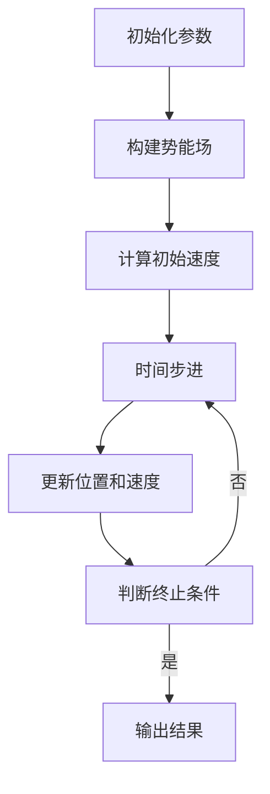

                 

### 文章标题

《数学与化学：分子结构的数学模型》

### 关键词

数学、化学、分子结构、数学模型、计算工具、软件应用

### 摘要

本文深入探讨了数学与化学的交汇领域，特别是分子结构的数学模型。首先，我们介绍了数学和化学的基本概念，然后详细讲解了分子结构的基本理论。接着，文章重点阐述了如何构建分子结构的数学模型，以及这些模型在化学研究中的应用实例。此外，我们介绍了用于分子结构建模的计算工具和软件，并探讨了该领域的发展趋势和应用前景。通过本文，读者将全面了解数学与化学的结合，以及分子结构数学模型的研究现状与未来方向。

### 引言

数学与化学是两门看似迥异，但实际上紧密相连的学科。数学作为逻辑与推理的工具，提供了强大的分析能力和精确性，而化学则研究物质的性质、变化和相互作用。数学在化学中的应用尤为广泛，尤其是在描述和预测分子结构的领域。分子结构决定了物质的物理和化学性质，因此理解并精确描述分子结构具有极其重要的意义。

分子结构的数学模型是化学研究中的一项重要成果，它利用数学方法来描述和预测分子的行为。这些模型不仅在基础研究中发挥了重要作用，也在实际应用中，如药物设计、材料科学和催化反应等领域，展示了巨大的潜力。本文将围绕分子结构的数学模型，探讨其理论基础、构建方法、应用实例以及未来发展，帮助读者全面了解这一跨学科领域。

### 数学与化学的基本概念

#### 数学基础

数学作为描述和解决科学问题的工具，具有广泛的应用。在分子结构研究中，数学尤为关键。首先，微积分提供了研究分子内部能量、动量和空间变化的工具。通过微分方程，我们可以描述分子内部的动态变化，从而预测分子行为的趋势。其次，线性代数在处理分子之间的相互作用和电子排布方面发挥着重要作用。线性方程组和矩阵运算可以帮助我们理解和计算复杂的分子结构。最后，概率论在分析分子间随机相互作用和预测分子结构的可能性方面提供了有力的理论支持。

#### 化学基础

化学研究物质的组成、性质、变化和相互作用。分子结构是化学的核心内容之一。分子由原子通过化学键连接而成，其结构决定了分子的物理和化学性质。化学键的类型包括共价键、离子键和金属键等，每种键类型都有其特定的电子云分布和能量特性。分子形状和结构的研究，不仅帮助我们理解分子的稳定性，还可以预测分子的反应活性。此外，量子化学提供了分子结构计算的理论基础，通过波函数和能级计算，可以精确描述分子的电子结构和性质。

#### 数学与化学的相互作用

数学与化学的相互作用体现在多个方面。首先，数学工具帮助化学家更精确地描述和理解分子结构，如微积分在能量变化描述中的应用，线性代数在电子排布计算中的应用。其次，化学中的问题常常转化为数学问题来解决，如通过量子化学模型来预测分子的电子结构。此外，数学模型在化学实验设计中也有重要作用，通过统计学方法可以优化实验方案，提高实验结果的可靠性。

### 分子结构的基本理论

分子结构是分子物理学和化学的核心概念之一，它决定了分子的物理和化学性质。理解分子结构的基本理论对于设计和预测新物质具有重要意义。以下我们将详细探讨分子结构的概念、键的类型和分子形状。

#### 分子结构的概念

分子结构是指分子内部原子之间的相对位置和排列方式。分子结构不仅包括原子间的连接方式，还包括键的长度、键角和分子的立体形状。分子的稳定性很大程度上取决于其结构，一个稳定的分子结构通常具有较低的能级和对称性。

在分子结构的研究中，一个重要的概念是键角。键角是指两个相邻原子之间的夹角，它直接影响分子的立体结构和化学性质。例如，甲烷分子（CH₄）具有正四面体结构，键角约为109.5度，这使得甲烷分子非常稳定。另一个重要概念是键长，它是指两个相连原子核之间的距离。键长和键角的精确值对于理解分子的电子结构和反应活性至关重要。

#### 键的类型

分子结构中的键主要有三种类型：共价键、离子键和金属键。

1. **共价键**：共价键是两个原子通过共享一对或多对电子形成的化学键。共价键通常存在于非金属元素之间，如氢气（H₂）、水（H₂O）和二氧化碳（CO₂）。共价键可以分为极性共价键和非极性共价键。极性共价键是由于原子间电负性差异导致的，而非极性共价键则是因为原子间电负性相等。

2. **离子键**：离子键是通过一个原子向另一个原子转移电子形成的，使得两个原子分别带上正电荷和负电荷，从而相互吸引。离子键通常存在于金属和非金属之间，如氯化钠（NaCl）。离子键具有较高的强度和熔点，广泛存在于盐类和矿物中。

3. **金属键**：金属键是金属原子通过自由电子形成的键。自由电子在金属晶格中自由移动，形成电子海。金属键使得金属具有优良的导电性和延展性，如铜（Cu）、铁（Fe）和金（Au）。

#### 分子形状

分子形状由其原子排列和键角决定，常见的分子形状包括线形、平面形、三角锥形和四面体形等。

1. **线形分子**：线形分子中，原子排列在一条直线上，键角通常为180度。例如，二氧化碳（CO₂）分子就是一个线形分子。

2. **平面形分子**：平面形分子中，原子排列在一个平面上，键角通常为120度。例如，乙烯（C₂H₄）分子具有平面形结构。

3. **三角锥形分子**：三角锥形分子中，中心原子与三个外围原子形成三角锥结构，键角约为107度。例如，氨（NH₃）分子具有三角锥形结构。

4. **四面体形分子**：四面体形分子中，中心原子与四个外围原子形成四面体结构，键角约为109.5度。例如，甲烷（CH₄）分子具有四面体形结构。

#### 分子结构的多样性

分子结构的多样性源于原子种类、键类型和空间排列的组合。不同分子结构具有不同的物理和化学性质，这在药物设计、材料科学和催化反应等领域具有重要意义。通过理解和预测分子结构，化学家可以设计出具有特定性质的新物质，从而推动科学和技术的进步。

### 数学模型的构建

构建分子结构的数学模型是化学研究中的一项核心任务。这些模型不仅帮助我们理解和预测分子的行为，还在药物设计、材料科学和催化反应等领域具有广泛的应用。以下我们将详细探讨分子结构数学模型的构建方法、核心概念和常用数学工具。

#### 基本概念

分子结构数学模型的核心概念包括原子坐标、键长、键角和分子形状。通过精确描述这些参数，我们可以构建出分子的数学模型。

1. **原子坐标**：原子坐标是指分子中每个原子的位置，通常以三维空间中的坐标来表示。原子坐标的精确度直接影响模型的准确性。在量子化学中，通过求解薛定谔方程，可以计算出分子的原子坐标。

2. **键长**：键长是指分子中两个相连原子核之间的距离。键长的精确测量对于理解分子结构和性质至关重要。在实验中，通过X射线晶体学、核磁共振（NMR）和电子衍射等技术可以测量键长。

3. **键角**：键角是指分子中两个相邻原子之间的夹角。键角的测量有助于确定分子的几何构型，从而推断分子的稳定性。通过X射线晶体学和核磁共振技术，可以精确测量键角。

4. **分子形状**：分子形状是指分子的三维空间构型。分子的形状决定了其物理和化学性质，如反应活性和溶解性。通过数学模型，我们可以预测分子的形状，从而指导实验设计。

#### 常用数学工具

构建分子结构数学模型时，常用的数学工具包括微积分、线性代数和概率论等。

1. **微积分**：微积分在分子结构建模中用于描述分子内部的能量变化和运动。通过求解微分方程，我们可以得到分子的能量分布和运动轨迹。在量子化学中，通过求解薛定谔方程，可以得到分子的能量和波函数。

2. **线性代数**：线性代数在分子结构建模中用于处理分子之间的相互作用和电子排布。通过线性方程组和矩阵运算，我们可以得到分子的电子结构和能级。在分子力学中，通过求解哈密顿矩阵，可以得到分子的动力学行为。

3. **概率论**：概率论在分子结构建模中用于分析分子的随机性和不确定性。通过概率密度函数，我们可以得到分子的空间分布和概率。在量子化学中，通过波函数的统计特性，可以得到分子的电子结构和性质。

#### 构建方法

构建分子结构数学模型的基本方法包括实验数据和理论计算的结合。以下是一个简化的构建过程：

1. **数据收集**：通过实验技术（如X射线晶体学、NMR、电子衍射等）收集分子的几何数据，包括原子坐标、键长和键角。

2. **模型选择**：根据分子结构和性质选择合适的数学模型，如分子力学模型、量子化学模型等。

3. **模型参数化**：通过实验数据和理论计算，确定模型的参数，如原子质量、键长、键角等。

4. **模型优化**：通过迭代优化，调整模型参数，以提高模型的准确性和可靠性。

5. **模型验证**：通过实验和计算验证模型，确保模型能够准确描述分子的结构和性质。

通过以上步骤，我们可以构建出精确的分子结构数学模型，从而深入研究分子的行为和性质。

### 应用实例

分子结构的数学模型在化学研究中具有广泛的应用，以下我们通过具体实例来展示这些模型的应用，并详细解析其数学原理和计算方法。

#### 实例1：氢分子（H₂）

氢分子是化学中最简单的分子之一，它的结构模型为我们提供了一个简单的起点来理解分子结构数学模型的构建和应用。

**模型描述**：氢分子由两个氢原子通过共价键连接而成。在分子力学模型中，氢分子可以视为一个由两个质点（代表氢原子）和一根弹簧（代表共价键）组成的系统。

**数学模型**：

1. **分子力学模型**：

   - **质点模型**：氢分子的两个质点位置分别为 \( \vec{r}_1 \) 和 \( \vec{r}_2 \)，质量均为 \( m \)。
   - **弹簧模型**：共价键可以视为一个弹簧，其弹性系数为 \( k \)，两个质点之间的距离为 \( r = |\vec{r}_1 - \vec{r}_2| \)。

   根据胡克定律，系统的势能为：
   $$
   V(r) = \frac{1}{2} k (r - r_0)^2
   $$
   其中 \( r_0 \) 为平衡键长。

2. **量子力学模型**：

   - **薛定谔方程**：氢分子的电子波函数可以由薛定谔方程描述：
   $$
   \hat{H} \Psi = E \Psi
   $$
   其中 \( \hat{H} \) 为哈密顿算子， \( E \) 为能量， \( \Psi \) 为波函数。

   - **波函数**：氢分子的基态波函数为：
   $$
   \Psi_{100}(\vec{r}_1, \vec{r}_2) = \frac{1}{\sqrt{\pi a_0^3}} \exp \left( -\frac{r_1^2 + r_2^2}{2a_0} \right)
   $$
   其中 \( a_0 \) 为玻尔半径。

**计算方法**：

1. **分子力学计算**：

   - **能量计算**：利用质点模型，可以通过以下公式计算氢分子的总能量：
   $$
   E = \frac{1}{2} m \left( \frac{d\vec{r}_1}{dt} \right)^2 + \frac{1}{2} m \left( \frac{d\vec{r}_2}{dt} \right)^2 + V(r)
   $$
   其中 \( \frac{d\vec{r}_1}{dt} \) 和 \( \frac{d\vec{r}_2}{dt} \) 分别为两个质点的速度。

   - **动力学模拟**：通过数值方法（如欧拉方法或Verlet算法），可以模拟氢分子的运动轨迹，从而得到其动力学行为。

2. **量子力学计算**：

   - **波函数计算**：通过求解薛定谔方程，可以得到氢分子的波函数和能量级。
   - **电子云分布**：利用波函数，可以计算分子的电子云分布，从而得到分子的几何构型和稳定性。

#### 实例2：水分子（H₂O）

水分子是地球上最常见的分子之一，其复杂的结构模型为我们提供了一个更为复杂的例子来展示分子结构数学模型的应用。

**模型描述**：水分子由一个氧原子和两个氢原子组成，通过共价键连接。由于氧原子具有较高的电负性，水分子呈现出弯曲的V形结构。

**数学模型**：

1. **分子力学模型**：

   - **质点模型**：水分子可以视为三个质点（一个氧原子和两个氢原子）组成的系统。
   - **键长和键角**：氧原子与氢原子之间的键长为 \( r_{OH} \)，键角为 \( \theta \)。

   根据分子力学理论，系统的总能量为：
   $$
   E = \sum_{i,j}^3 \frac{1}{2} k_{ij} (\Delta r_{ij})^2
   $$
   其中 \( k_{ij} \) 为键的弹性系数， \( \Delta r_{ij} \) 为键长的变化。

2. **量子力学模型**：

   - **薛定谔方程**：水分子可以视为一个多电子系统，其波函数需要通过多体微扰理论或哈特里-福克自洽场方法计算。
   - **电子云分布**：通过波函数，可以计算水分子中电子云的分布，从而得到分子的几何构型和电荷分布。

**计算方法**：

1. **分子力学计算**：

   - **能量计算**：利用质点模型，可以通过能量函数计算水分子的总能量。
   - **动力学模拟**：通过数值方法模拟水分子的运动，可以得到分子的热力学性质。

2. **量子力学计算**：

   - **波函数计算**：通过求解薛定谔方程或自洽场方程，可以得到水分子的波函数和能量级。
   - **电子云分布**：利用波函数，可以计算水分子的电子云分布，从而得到分子的几何构型和电荷分布。

通过以上实例，我们可以看到分子结构的数学模型在化学研究中的应用，以及这些模型如何帮助我们理解和预测分子的行为。这些模型不仅为实验设计提供了理论基础，还为理论化学和计算化学的研究提供了重要的工具。

### 计算工具与软件

在分子结构建模中，计算工具和软件扮演着至关重要的角色。这些工具和软件为科学家和研究人员提供了高效、精确的计算方法，从而加速了分子结构研究的进展。以下我们将介绍几种常用的计算工具和软件，并讨论它们在实际研究中的应用。

#### 分子力学软件

分子力学（Molecular Mechanics, MM）是一种简化的分子建模方法，通过经典力学的物理原理来描述分子的能量和运动。以下是一些常用的分子力学软件：

1. **AMBER**：AMBER是一个广泛使用的分子力学软件，它提供了丰富的参数化模型和动力学模拟工具。AMBER在药物设计、材料科学和生物分子模拟等领域有广泛应用。

2. **CHARMM**：CHARMM是一个功能强大的分子力学软件，适用于生物分子和药物分子的模拟。它具有高度灵活的参数化能力和广泛的模拟选项。

3. **GROMACS**：GROMACS是一个开源的分子动力学软件，广泛应用于生物分子和化学分子的大规模模拟。它提供了高效的计算方法和大规模并行处理能力。

#### 分子动力学软件

分子动力学（Molecular Dynamics, MD）是一种基于牛顿运动定律的分子建模方法，通过模拟分子的运动来研究分子的结构和动态行为。以下是一些常用的分子动力学软件：

1. **NAMD**：NAMD是一个高性能的分子动力学软件，广泛应用于生物分子和大分子系统的模拟。它支持多种生物分子力场和大规模并行计算。

2. **LAMMPS**：LAMMPS是一个通用的分子动力学软件，适用于多种类型的多粒子系统的模拟，包括金属、聚合物和软物质系统。

3. **GROMACS**：前面已经提到，GROMACS不仅适用于分子力学模拟，也广泛应用于分子动力学模拟，特别是在生物分子和生物大分子领域。

#### 概率密度函数软件

概率密度函数（Probability Density Function, PDF）方法是一种基于量子力学的分子建模方法，通过计算分子的电子云密度来研究分子的结构和性质。以下是一些常用的概率密度函数软件：

1. **CP2K**：CP2K是一个高度可扩展的量子力学模拟软件，支持多种量子力学和分子动力学方法，包括密度泛函理论（DFT）和分子动力学。

2. **ABINIT**：ABINIT是一个基于密度泛函理论的量子力学软件，适用于计算材料的电子结构和光学性质。它支持多种计算方法，包括从头算和半经验方法。

3. **Wannier90**：Wannier90是一个用于计算晶体中有效汉密尔顿量的软件，广泛应用于材料科学和量子化学研究。

#### 软件应用实例

以下我们通过几个实例来展示这些计算工具和软件在实际研究中的应用。

**实例1：药物设计**

在药物设计中，分子力学和分子动力学模拟被广泛用于评估药物的分子结构和相互作用。例如，使用AMBER软件，研究人员可以模拟药物分子与生物大分子（如蛋白质）的相互作用，预测药物的结合亲和力和药效。

**实例2：材料科学**

在材料科学中，分子动力学模拟被用于研究材料的微观结构和性质。例如，使用GROMACS软件，研究人员可以模拟金属合金的相变和动力学行为，从而优化材料的性能。

**实例3：量子化学计算**

在量子化学研究中，概率密度函数方法被用于计算分子的电子结构和性质。例如，使用CP2K软件，研究人员可以计算分子的基态能量和电子云密度，从而预测分子的反应活性和稳定性。

通过这些计算工具和软件的应用，研究人员可以深入探索分子结构和性质，为科学研究和实际应用提供有力的支持。

### 未来发展

分子结构的数学模型在化学研究中具有重要地位，未来这一领域将继续发展，并面临许多新的机遇和挑战。以下我们讨论分子结构数学模型的研究趋势、计算能力的提升以及数据驱动的分子结构预测。

#### 研究趋势

1. **量子力学计算方法的改进**：随着量子计算机的发展，量子力学计算方法将在分子结构研究中发挥更大作用。量子力学方法可以提供更精确的分子能量和电子结构信息，从而提高分子建模的准确性。

2. **多尺度建模**：多尺度建模是将不同尺度的模型结合起来，以全面描述分子结构和性质。例如，结合量子力学和分子力学的方法，可以在微观和宏观尺度上同时描述分子行为。

3. **机器学习和数据科学的应用**：机器学习和数据科学在分子结构预测和建模中的应用越来越广泛。通过大数据分析和深度学习模型，可以更好地理解和预测分子的行为。

4. **生物分子系统的研究**：生物分子系统（如蛋白质、核酸和酶）的结构和功能研究是分子结构数学模型的重要领域。未来将加强对这些复杂系统的建模和模拟，以揭示其工作机制。

#### 计算能力的提升

随着计算能力的不断提升，分子结构数学模型的研究将能够处理更大规模和更复杂的系统。以下是一些计算能力的提升趋势：

1. **高性能计算**：高性能计算（High-Performance Computing, HPC）技术的发展，使得大规模分子模拟和计算成为可能。通过并行计算和分布式计算，研究人员可以处理更大的数据和更复杂的模型。

2. **量子计算**：量子计算（Quantum Computing）的崛起将显著提升分子结构计算的效率。量子计算机可以利用量子叠加和纠缠特性，实现比经典计算机更高效的计算。

3. **专用硬件和算法**：针对分子结构计算的专用硬件和优化算法的开发，将进一步提高计算效率。例如，基于图形处理单元（GPU）的专用计算设备，以及针对分子结构计算的优化算法，将加速分子模拟和建模过程。

#### 数据驱动的分子结构预测

数据驱动的方法在分子结构预测中具有巨大的潜力。以下是一些数据驱动的研究方向：

1. **机器学习模型**：通过训练机器学习模型，可以预测分子的几何构型和性质。深度学习模型（如卷积神经网络和生成对抗网络）在分子结构预测中表现出色。

2. **大数据分析**：大数据分析技术可以处理大量的分子结构数据，从而发现新的结构和性质关系。通过数据挖掘和统计分析，可以识别出分子结构中的规律和趋势。

3. **分子模拟和实验数据的结合**：分子模拟和实验数据的结合，可以提供更全面的分子结构信息。通过将实验数据与模拟结果进行比对和验证，可以改进分子模型的准确性和可靠性。

总之，分子结构的数学模型在化学研究中具有重要地位，未来将面临许多新的机遇和挑战。随着计算能力的提升和新型计算方法的引入，分子结构数学模型的研究将不断深化，为科学发现和技术创新提供有力支持。

### 总结与展望

本文系统地介绍了数学与化学的结合，特别是分子结构的数学模型。我们首先回顾了数学和化学的基本概念，探讨了它们之间的相互作用。接着，我们详细讲解了分子结构的基本理论，包括键的类型和分子形状。随后，文章重点阐述了如何构建分子结构的数学模型，并介绍了这些模型在化学研究中的应用实例。此外，我们还介绍了用于分子结构建模的计算工具和软件，展示了它们在实践中的广泛应用。

通过本文，读者可以全面了解分子结构的数学模型，掌握其理论基础和构建方法。我们鼓励读者在今后的研究和实践中，继续探索这一跨学科领域，运用数学和化学的知识来解决实际问题。未来，随着计算能力的提升和新型计算方法的引入，分子结构数学模型的研究将取得更多突破，为科学发现和技术创新提供强大支持。

### 附录

#### A.1 数学公式汇总

**基本公式**：

1. 胡克定律：
   $$
   F = k \Delta x
   $$
2. 势能计算：
   $$
   V(r) = \frac{1}{2} k (r - r_0)^2
   $$
3. 分子总能量计算：
   $$
   E = \frac{1}{2} m \left( \frac{d\vec{r}_1}{dt} \right)^2 + \frac{1}{2} m \left( \frac{d\vec{r}_2}{dt} \right)^2 + V(r)
   $$

**复杂公式**：

1. 薛定谔方程：
   $$
   \hat{H} \Psi = E \Psi
   $$
2. 波函数：
   $$
   \Psi_{100}(\vec{r}_1, \vec{r}_2) = \frac{1}{\sqrt{\pi a_0^3}} \exp \left( -\frac{r_1^2 + r_2^2}{2a_0} \right)
   $$
3. 电子云密度：
   $$
   \rho(\vec{r}) = \left| \Psi(\vec{r}) \right|^2
   $$

#### A.2 Mermaid流程图示例

**分子动力学流程**：



#### A.3 伪代码示例

**分子力学伪代码**：

```
初始化参数
构建势能场
计算初始速度
while (未达到终止条件) {
    计算力
    更新速度
    更新位置
}
输出结果
```

**分子动力学伪代码**：

```
初始化参数
构建势能场
计算初始速度
while (未达到终止条件) {
    计算力
    更新速度（v(t+Δt) = v(t) + f(m) * Δt）
    更新位置（x(t+Δt) = x(t) + v(t) * Δt）
}
输出结果
```

#### A.4 计算工具与软件资源

**分子力学工具**：

- **AMBER**：https://www.ambertools.org/
- **CHARMM**：https://www.charmm.org/
- **GROMACS**：https://www.gromacs.org/

**分子动力学软件**：

- **NAMD**：https://www.namd.org/
- **LAMMPS**：https://lammps.sandia.gov/
- **GROMACS**：https://www.gromacs.org/

**概率密度函数软件**：

- **CP2K**：https://www.cp2k.org/
- **ABINIT**：https://www.abinit.org/
- **Wannier90**：https://wannier.berkeley.edu/

通过这些资源和工具，读者可以进一步探索分子结构的数学模型，并在实际研究中应用所学知识。**附录**部分的内容为读者提供了丰富的参考资料和实践指导。**附录**部分的内容不仅总结了关键公式和算法，还提供了Mermaid流程图、伪代码示例和计算工具与软件资源，以便读者更好地理解和应用分子结构数学模型。这些内容为读者在研究过程中提供了实用的参考，有助于深入理解和掌握分子结构建模的方法和技术。同时，**附录**部分也为未来的学习和研究指明了方向，读者可以通过进一步学习和探索，不断丰富自己的知识体系，为分子结构研究做出更大的贡献。

### 最佳实践 Tips、小结、注意事项、拓展阅读

#### 最佳实践 Tips

1. **选择合适的模型**：根据研究需求和分子特性，选择适合的数学模型，如分子力学、量子力学或概率密度函数模型。
2. **精确计算参数**：确保模型的参数（如原子质量、键长和键角）准确可靠，避免由于参数误差导致的模型失效。
3. **结合实验数据**：将实验数据与计算结果相结合，通过实验验证模型的准确性和可靠性。
4. **优化计算方法**：选择合适的计算方法，如数值积分、迭代算法或并行计算，以提高计算效率和准确性。

#### 小结

本文全面介绍了数学与化学的结合，特别是分子结构的数学模型。通过探讨数学和化学的基本概念、分子结构的基本理论以及数学模型的构建方法，我们深入了解了分子结构数学模型的应用和重要性。此外，我们还介绍了计算工具和软件在分子结构建模中的广泛应用，展示了这些工具在实践中的实际案例。

#### 注意事项

1. **准确性**：在构建和优化模型时，务必注意模型的准确性，确保计算结果与实验数据一致。
2. **复杂性**：分子结构建模涉及多个复杂因素，如量子力学效应、温度和压力等，需要综合考虑。
3. **计算资源**：分子结构建模需要大量的计算资源，确保使用高性能计算设备和优化算法，以提高计算效率。

#### 拓展阅读

1. **《分子动力学模拟：从基础到实践》**：一本全面介绍分子动力学模拟的基础知识和实际应用的书籍，适合初学者和研究者。
2. **《量子化学：现代方法与应用》**：一本深入探讨量子化学理论及其应用的权威著作，适合对量子化学感兴趣的研究者。
3. **《计算化学导论》**：一本涵盖计算化学基础理论和应用的入门书籍，适合计算化学领域的初学者。

通过拓展阅读，读者可以进一步深化对分子结构数学模型的理解，为研究工作提供更多的理论支持和实践指导。

