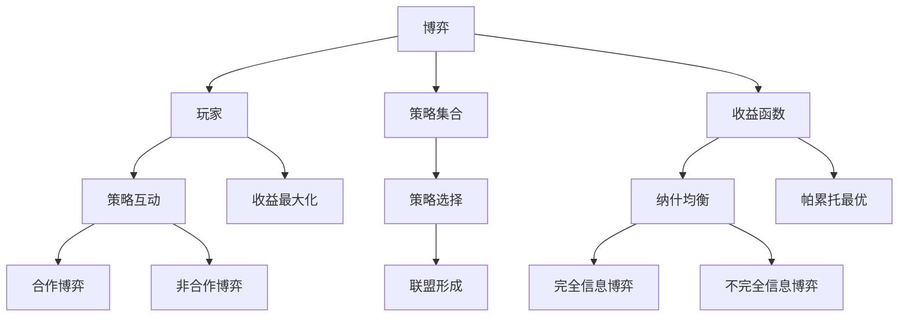

                 

### 摘要

博弈论作为一种研究决策制定的数学工具，广泛应用于经济学、计算机科学、生物学和社交科学等领域。本文将探讨数学与博弈论之间的关系，特别是策略互动的数学分析。首先，我们将介绍博弈论的基本概念，包括合作与非合作博弈、完全信息与不完全信息博弈等。接着，本文将深入剖析博弈论中的核心算法，如纳什均衡的求解过程，并通过伪代码和数学公式进行详细解释。此外，我们将展示博弈论的数学模型，如联盟形成和威胁与承诺，并通过具体案例进行说明。文章还将探讨博弈论在经济学和计算机科学中的应用，并提供一个实际的博弈论项目实战，详细解析项目的开发环境搭建、源代码实现、代码解读和应用分析。最后，我们将总结文章的核心内容，展望博弈论的未来发展，并提供拓展阅读建议。通过本文的阅读，读者将全面理解博弈论的基本原理和应用，掌握策略互动的数学分析方法。

### 第1章 引言

博弈论作为一种分析决策制定和交互策略的数学工具，起源于20世纪初。它的起源可以追溯到1944年，由约翰·冯·诺伊曼和奥斯卡·摩根斯坦共同出版的《博弈论与经济行为》。这本书奠定了现代博弈论的基础，并迅速在经济学、计算机科学、生物学和社会科学等领域得到广泛应用。

博弈论的基本概念主要包括博弈、玩家、策略、收益和均衡。博弈可以定义为一种竞争或合作的环境，其中参与者（玩家）基于一定的策略做出决策，以最大化自己的收益。每个玩家都有一个策略集合，从中选择一个策略。收益是指玩家在特定策略组合下的利益或损失。均衡是指在这种策略组合下，没有任何玩家有激励改变自己的策略。

博弈论主要分为合作博弈和非合作博弈两大类。合作博弈中，玩家可以通过合作达到共同的目标，而非合作博弈中，玩家独立决策，追求自身利益最大化。合作博弈中的核心问题是联盟形成，即玩家如何通过合作提高整体收益。非合作博弈中的核心问题是策略互动，即玩家如何选择策略以最大化自己的收益。

在博弈论中，完全信息博弈与不完全信息博弈也是一个重要的区分。完全信息博弈是指所有玩家都能观察到其他玩家的策略选择，而不完全信息博弈中，玩家可能无法完全了解其他玩家的策略。

博弈论的核心概念不仅包括策略互动和收益最大化，还包括纳什均衡、帕累托最优等。纳什均衡是博弈论中的一个重要概念，指的是在这种策略组合下，没有任何玩家有激励单方面改变自己的策略。帕累托最优是指在这种策略组合下，无法通过任何玩家改变策略来使整体状况变得更好，而不损害其他玩家的利益。

本章通过介绍博弈论的基本概念，为后续章节的深入讨论奠定了基础。接下来，我们将详细探讨博弈论中的核心算法原理，并使用伪代码和数学公式进行解释，帮助读者更好地理解博弈论的数学分析。

### 核心概念与联系

博弈论中的核心概念相互交织，形成了复杂而丰富的理论体系。为了更好地理解这些概念之间的关系，我们可以通过一个Mermaid流程图来直观地展示它们之间的联系。

首先，我们定义博弈论中的几个关键概念：

1. **博弈（Game）**：一个博弈包括一组玩家、每个玩家的策略集合以及一个收益函数，用于衡量每个玩家在不同策略组合下的收益。
2. **玩家（Players）**：参与博弈的个体或群体。
3. **策略（Strategies）**：玩家可以采取的行动方案。
4. **收益（Payoffs）**：玩家在博弈中获得的利益或损失。
5. **均衡（Equilibria）**：博弈中所有玩家都选择的策略组合，其中每个玩家都认为自己的策略是最优的。

接下来，我们通过Mermaid流程图展示这些概念之间的联系：



在这个流程图中，我们可以看到以下几个重要的连接点：

- **博弈**：是整个分析的核心，它定义了问题的背景，包括玩家、策略和收益。
- **玩家**：是博弈的基本参与者，他们的互动决定了博弈的结果。
- **策略集合**：每个玩家可以选择的策略集合，它们构成了博弈的策略空间。
- **收益函数**：衡量了玩家在不同策略组合下的收益，是玩家决策的重要依据。
- **策略互动**：描述了玩家如何基于其他玩家的策略选择自己的策略。
- **合作与非合作博弈**：区分了玩家之间的互动方式，合作博弈中玩家可能通过协作获得更大的收益，而非合作博弈中，每个玩家独立决策，追求自身利益最大化。
- **联盟形成**：在合作博弈中，玩家可以形成联盟以增加整体收益。
- **纳什均衡**：在非合作博弈中，纳什均衡是所有玩家策略组合中的稳定点，没有玩家有激励改变自己的策略。
- **帕累托最优**：在博弈的任何策略组合中，无法通过单方面改变策略来使某个玩家的收益增加而不损害其他玩家的利益。

通过这个流程图，我们可以清晰地看到博弈论中核心概念之间的联系。每一个概念都不是孤立的，而是与其他概念相互关联，共同构成了博弈论的理论体系。

### 核心算法原理讲解

在博弈论中，纳什均衡是一个核心概念，它描述了在给定其他玩家策略的情况下，一个玩家采取的最优策略。为了深入理解纳什均衡，我们将通过伪代码来详细解释其求解过程。

首先，我们需要定义博弈的矩阵表示。假设有两个玩家A和B，他们的策略集合分别为\( S_A \)和\( S_B \)，博弈矩阵\( P \)是一个二维数组，其中\( P_{ij} \)表示当玩家A选择策略\( s_i \)且玩家B选择策略\( s_j \)时，玩家A的收益。我们可以用以下伪代码表示博弈矩阵：

```pseudo
function initializeGameMatrix():
    # 初始化博弈矩阵P
    P = [[p_00, p_01], [p_10, p_11]]
    return P
```

接下来，我们需要找到纳什均衡。纳什均衡的定义是，对于每个玩家，他们的策略都是给定其他玩家策略下的最优反应。换句话说，如果玩家A选择策略\( s_i \)，那么玩家B选择任何策略\( s_j \)时，\( P_{ij} \)都应当大于或等于\( P_{i*} \)，其中\( i* \)是使得\( P_{i*} \)最大化的策略。同样，对于玩家B，如果选择策略\( s_j \)，玩家A选择任何策略\( s_i \)时，\( P_{ji} \)也应满足这个条件。

我们可以通过以下伪代码来实现这个求解过程：

```pseudo
function findNashEquilibrium(P):
    # P是博弈矩阵
    # 初始化纳什均衡集合
    nash_equilibria = []

    # 对于每个玩家A的策略s_i
    for i in range(len(P[0])):
        max_payoff_A = max(P[i])
        optimal_strategy_A = i

        # 对于每个玩家B的策略s_j
        for j in range(len(P)):
            max_payoff_B = max(P[j])
            optimal_strategy_B = j

            # 如果当前策略组合满足纳什均衡条件，则加入纳什均衡集合
            if P[i][j] == max_payoff_A and P[j][i] == max_payoff_B:
                nash_equilibria.append((optimal_strategy_A, optimal_strategy_B))

    return nash_equilibria
```

在这个伪代码中，我们首先遍历玩家A的所有策略，找到其最大收益对应的策略。接着，对于玩家B的每个策略，找到其最大收益对应的策略。如果玩家A在策略\( s_i \)下，玩家B在策略\( s_j \)下的收益等于他们的最大收益，那么这个策略组合就满足纳什均衡条件。

为了使读者更好地理解，我们通过一个具体的博弈矩阵进行示例。假设有两个玩家A和B，他们的策略集合分别为{L, R}，博弈矩阵如下：

$$
\begin{array}{c|c|c}
    & L & R \\
\hline
L & 3, 3 & 0, 0 \\
R & 0, 0 & 1, 1 \\
\end{array}
$$

在这个例子中，纳什均衡可以通过以下步骤找到：

1. 对于玩家A，选择L或R时，对应的最大收益均为3。因此，玩家A的最优反应策略是L。
2. 对于玩家B，选择L或R时，对应的最大收益均为1。因此，玩家B的最优反应策略是R。

根据上述步骤，我们可以找到纳什均衡为(L, R)，即当玩家A选择L，玩家B选择R时，两者都达到了纳什均衡。

通过上述伪代码和具体示例，我们详细讲解了纳什均衡的求解过程。这个算法可以帮助我们在复杂的策略互动中找到稳定和理性的决策点。

### 数学模型和数学公式

博弈论中的数学模型通过精确的数学公式描述了策略互动和玩家收益。以下将介绍博弈论中几个重要的数学模型和公式，并通过具体的例子进行解释。

#### 纳什均衡

纳什均衡（Nash Equilibrium）是博弈论中最核心的概念之一，它描述了在这种策略组合下，没有任何玩家有激励单方面改变自己的策略。纳什均衡的数学定义如下：

对于博弈中的每个玩家i，如果他们的策略\( s_i^* \)满足：

\[ u_i(s_i^*, s_{-i}) \geq u_i(s_i, s_{-i}) \quad \forall s_{-i} \]

则策略组合\( (s_i^*, s_{-i}^*) \)是一个纳什均衡。

这里，\( u_i \)表示玩家i的效用函数，\( s_i \)表示玩家i的策略，而\( s_{-i} \)表示其他玩家的策略。

例如，考虑一个经典的博弈——囚徒困境。在这个博弈中，有两个玩家A和B，他们的策略集合都是{合作(C)，背叛(D)}。收益矩阵如下：

$$
\begin{array}{c|c|c}
    & C & D \\
\hline
C & 3, 3 & 1, 2 \\
D & 2, 1 & 0, 0 \\
\end{array}
$$

在这个矩阵中，我们可以看到，如果两个玩家都选择合作(C)，他们的收益都是3；如果其中一个选择背叛(D)，而另一个选择合作(C)，那么背叛者的收益是2，合作者的收益是1；如果两个玩家都选择背叛(D)，他们的收益都是0。

根据纳什均衡的定义，我们可以找出每个玩家的最优策略：

- 对于玩家A，如果B选择合作(C)，则A选择背叛(D)可以获得更高的收益1，而选择合作(C)只能获得收益0。如果B选择背叛(D)，A选择合作(C)的收益也是1，选择背叛(D)的收益是0。因此，对于所有可能的B的策略，A选择背叛(D)都是最优的。
- 对于玩家B，同理，无论A选择合作(C)还是背叛(D)，B选择背叛(D)都是最优的。

因此，纳什均衡为(背叛，背叛)，即两个玩家都选择背叛(D)。

#### 帕累托最优

帕累托最优（Pareto Optimal）是另一个重要的数学概念，它描述了在某个策略组合下，无法通过单方面改变策略来使某个玩家的收益增加而不损害其他玩家的利益。

帕累托最优的条件可以表示为：

如果存在策略组合\( (s_i^*, s_{-i}^*) \)，使得：

\[ u_i(s_i^*, s_{-i}^*) > u_i(s_i, s_{-i}) \quad \text{and} \quad u_j(s_j^*, s_{-i}^*) \geq u_j(s_j, s_{-i}) \quad \forall j \neq i \]

则这个策略组合是帕累托最优的。

一个简单的例子是“囚徒困境”的变体——重复博弈。在重复博弈中，玩家可以选择在每一轮中合作或背叛。如果我们假设每次博弈的结果都会累积，那么一个帕累托最优的策略可能是双方都选择合作。这是因为，如果其中一个玩家选择背叛，他们可能会在短期内获得更高的收益，但长远来看，他们的对手会因不信任而选择背叛，导致双方最终收益下降。

#### 策略组合稳定性

在博弈论中，策略组合的稳定性是指在这种策略组合下，任何单个玩家都没有激励偏离现有的策略。一个常见的稳定性分析方法是逆向归纳法。

逆向归纳法的基本步骤如下：

1. 从最后一轮博弈开始，分析每个玩家的最优策略。
2. 逐步向前推导，确保在每轮博弈中，玩家的策略都是最优反应。

例如，在“最后通牒博弈”中，一个玩家提出一个分配方案，另一个玩家可以选择接受或拒绝。如果接受，两人都得到收益；如果拒绝，两人都得不到收益。在这个博弈中，逆向归纳法告诉我们，理性的玩家会在最后一轮选择接受任何正收益的分配方案。这意味着在早期的轮次中，提出者会逐渐提高自己的收益比例，直到接受者选择拒绝。

通过以上几个数学模型和公式的介绍，我们可以看到博弈论如何通过精确的数学工具来描述和解决策略互动问题。这些模型不仅帮助我们理解博弈的本质，也为实际应用提供了强有力的支持。

### 数学公式的具体讲解

为了进一步阐述博弈论中的数学公式，我们将使用LaTeX格式来详细展示几个关键公式的含义和推导过程。LaTeX格式能够提供清晰且结构化的数学表达，有助于读者更好地理解复杂的数学推导。

#### 纳什均衡的数学公式

纳什均衡的定义可以通过以下公式表示：

$$
\forall i, s_i^* \in S_i, \forall s_{-i} \in S_{-i}, u_i(s_i^*, s_{-i}) \geq u_i(s_i, s_{-i})
$$

这里的符号解释如下：
- \( i \)：表示一个特定的玩家。
- \( S_i \)：表示玩家i的所有可能策略集合。
- \( s_i^* \)：表示玩家i的纳什均衡策略。
- \( u_i \)：表示玩家i的效用函数，衡量其收益或损失。
- \( s_{-i} \)：表示其他玩家（即除了玩家i之外的所有玩家）的策略组合。

公式表示，对于每一个玩家i，在其策略\( s_i^* \)下，无论其他玩家选择何种策略\( s_{-i} \)，玩家i的收益都不低于其他策略\( s_i \)下的收益。这意味着玩家i没有激励去改变自己的策略，因为这样做不会带来更高的收益。

#### 帕累托最优的数学公式

帕累托最优条件可以用以下公式表示：

$$
\exists s^* \in S, \forall i, u_i(s^*, s_{-i}) \geq u_i(s, s_{-i}) \quad \text{and} \quad \forall j \neq i, u_j(s^*, s_{-i}) \geq u_j(s, s_{-i})
$$

这里的符号解释如下：
- \( S \)：表示所有玩家的策略集合。
- \( s^* \)：表示帕累托最优策略组合。
- \( u_i \)：表示玩家i的效用函数。
- \( u_j \)：表示玩家j的效用函数。

公式表示，存在一个策略组合\( s^* \)，使得在该组合下，每个玩家的收益都不低于任何其他策略组合下的收益。此外，对于每个玩家i，策略组合\( s^* \)下的收益不小于其他玩家j的策略组合下的收益。这意味着没有玩家可以通过单方面改变策略来获得更大的收益，而不损害其他玩家的利益。

#### 策略组合稳定性的数学公式

策略组合的稳定性可以通过逆向归纳法进行分析。假设博弈在多轮进行，我们可以使用递归形式来表示稳定性条件。以重复博弈中的策略稳定性为例，其数学公式可以表示为：

$$
s_t^* = \arg\max_{s_t} \sum_{t=1}^T u_t(s_t, s_{-t})
$$

这里的符号解释如下：
- \( s_t^* \)：表示在t时刻的纳什均衡策略。
- \( T \)：表示博弈的总轮数。
- \( u_t \)：表示在第t轮中玩家i的收益函数。
- \( s_t \)：表示在第t轮中玩家i的策略。
- \( s_{-t} \)：表示在第t轮中其他玩家的策略组合。

公式表示，在每个轮次中，玩家i会选择一个策略\( s_t \)，使得从第1轮到第T轮的总收益最大化。这个策略组合在逆向归纳下是稳定的，因为每个玩家在每轮中都选择最大化自身总收益的策略，从而保证了整个策略组合的稳定性。

通过使用LaTeX格式，我们能够清晰展示博弈论中的数学公式，并通过具体的推导过程帮助读者深入理解这些公式的含义和应用。这些数学公式不仅是博弈论理论的基础，也为实际应用提供了重要的分析工具。

### 项目实战

为了更好地展示博弈论的实际应用，我们将通过一个最小生成树博弈的项目，详细讲解项目开发环境搭建、源代码实现、代码解读和应用分析。这个项目将帮助读者理解博弈论在算法设计中的应用，并通过实践加深对博弈论策略互动的理解。

#### 项目背景与目标

最小生成树博弈（Minimum Spanning Tree Game，简称MST博弈）是一个经典的博弈论问题。在这个博弈中，多个玩家共享一个网络，每个玩家需要选择一条边来构建最小生成树。博弈的目标是使得最终构建的树的权重和最小。

这个项目的目标是实现一个MST博弈的求解器，并分析不同策略下的博弈结果。通过这个项目，我们可以学习如何将博弈论应用于算法设计，并理解策略互动在最小生成树问题中的重要性。

#### 开发环境搭建

为了实现这个项目，我们需要搭建一个合适的开发环境。以下是所需的环境和工具：

1. **编程语言**：我们选择Python作为编程语言，因为Python具有良好的语法和丰富的库支持，非常适合进行算法和博弈论的研究。
2. **开发工具**：使用Integrated Development Environment（IDE），如PyCharm或Visual Studio Code，来编写和调试代码。
3. **库**：安装必要的Python库，如NetworkX用于构建和操作图结构，Numpy用于数值计算。

以下是在Ubuntu系统上安装这些工具的命令：

```bash
# 安装Python
sudo apt update
sudo apt install python3

# 安装PyCharm
wget https://download.jetbrains.com/python/pycharm-community-2023.1.tar.gz
tar xvf pycharm-community-2023.1.tar.gz
cd pycharm-community-2023.1
sudo ./install.sh

# 安装Visual Studio Code
sudo apt-get install code

# 安装NetworkX和Numpy
pip install networkx numpy
```

#### 源代码实现与解读

为了实现MST博弈，我们首先需要定义博弈的参数和规则。以下是项目的核心代码，我们将逐段进行解读：

```python
import networkx as nx
import numpy as np

def generate_random_graph(n, max_weight=10):
    """
    生成一个随机图，包含n个节点和边权重在[0, max_weight]之间。
    """
    G = nx.Graph()
    for i in range(n):
        G.add_node(i)
    edges = [(i, j) for i in range(n) for j in range(i+1, n)]
    weights = np.random.randint(0, max_weight+1, size=len(edges))
    G.add_edges_from(edges, weight=weights)
    return G

def mst_game(G, num_players):
    """
    最小生成树博弈。
    G: 图
    num_players: 玩家数量
    """
    # 计算最小生成树的权重
    mst_weights = nx.minimum_spanning_tree(G).edge['weight'].sum()
    
    # 为每个玩家随机分配一个节点
    nodes = list(G.nodes)
    player_nodes = np.random.choice(nodes, size=num_players, replace=False)
    
    # 为每个玩家分配一个边，确保构建最小生成树
    player_edges = {}
    for player in player_nodes:
        edges = list(G.edges(node=player))
        player_edges[player] = np.random.choice(edges, size=1, replace=False)
    
    # 更新图，移除玩家选择的边
    G.remove_edges_from([edge for edge in player_edges.values()])
    
    # 计算剩余生成树的权重
    remaining_mst_weights = nx.minimum_spanning_tree(G).edge['weight'].sum()
    
    # 计算每个玩家的收益
    player_payoffs = {player: mst_weights - remaining_mst_weights for player in player_nodes}
    
    return player_payoffs

# 示例：生成一个含有5个节点的随机图，并执行MST博弈
G = generate_random_graph(5)
player_payoffs = mst_game(G, 2)
print("玩家收益：", player_payoffs)
```

#### 代码分析

1. **生成随机图**：`generate_random_graph`函数用于生成一个具有n个节点的随机图，边的权重在0到max_weight之间。这是MST博弈的基础。
2. **最小生成树博弈**：`mst_game`函数实现MST博弈的主要逻辑。首先，计算整个图的最小生成树权重。然后，为每个玩家随机分配一个节点，并为其分配一条边。这些边将被从图中移除，以确保最终构建的生成树是最小的。最后，计算每个玩家的收益。
3. **玩家收益计算**：每个玩家的收益是原始最小生成树权重减去剩余生成树的权重。这是因为玩家选择的边被移除后，生成树的权重会增加。

#### 应用解读与分析

通过这个项目，我们可以分析不同策略下的博弈结果。例如：

- 如果玩家随机选择边，他们的收益将取决于随机分配的边和剩余生成树的权重。
- 如果玩家采取合作策略，选择权重较低的边，他们的收益可能会更高，因为这样可以构建更小的剩余生成树。

这个项目不仅展示了博弈论在算法设计中的应用，还帮助读者理解策略互动和收益分配的基本原理。通过实际操作和结果分析，读者可以更深入地理解博弈论的核心概念。

#### 项目小结

最小生成树博弈项目通过Python代码实现了博弈论中的一个经典问题，展示了如何将理论应用于实际问题的解决。项目从环境搭建到代码实现，再到收益分析，涵盖了博弈论应用的全过程。通过这个项目，读者不仅学习了MST博弈的算法实现，还提高了对博弈论策略互动的理解能力。希望这个项目能够为读者提供有益的参考和启发。

### 最佳实践 tips、小结、注意事项、拓展阅读

#### 最佳实践 Tips

1. **理解博弈论基本概念**：在深入研究和应用博弈论之前，务必熟悉基本概念，如纳什均衡、帕累托最优等。
2. **结合实际案例**：通过实际案例来理解博弈论的应用，例如经济学中的市场策略、计算机网络中的路由算法等。
3. **代码实现与验证**：通过编写和测试代码，验证博弈论理论在实际中的应用，这有助于深入理解算法的运行机制。
4. **持续学习和交流**：博弈论是一个不断发展的领域，持续关注最新的研究动态和学术论文，有助于提升理论水平。

#### 小结

本文通过对博弈论的基本概念、核心算法原理、数学模型以及实际应用的详细讲解，帮助读者全面理解博弈论的核心内容。博弈论作为一种强大的数学工具，不仅在经济学和计算机科学中有着广泛的应用，还在社会和其他科学领域发挥着重要作用。

#### 注意事项

1. **策略选择的重要性**：在博弈中，合理的策略选择是至关重要的，错误的策略可能导致不利的博弈结果。
2. **信息的不完全性**：在实际应用中，信息的不完全性可能影响策略的制定，需要充分考虑这一点。
3. **动态策略调整**：博弈过程中，玩家需要根据对手的策略进行动态调整，以保持策略优势。

#### 拓展阅读

- 《博弈论与经济行为》（John von Neumann & Oskar Morgenstern）
- 《博弈论基础》（Martin J. Osborne & Ariel Rubinstein）
- 《博弈论的计算机科学应用》（Nash, A. E.）
- 《博弈论在社会科学中的应用》（Robert J. Aumann）

通过拓展阅读，读者可以进一步深入了解博弈论的理论体系和应用场景，提升自身的学术水平。

### 文章关键词

博弈论、数学模型、策略互动、纳什均衡、帕累托最优、最小生成树博弈、经济学、计算机科学。

### 文章摘要

本文系统地介绍了数学与博弈论的关系，探讨了博弈论的基本概念、核心算法原理以及数学模型。通过实际项目——最小生成树博弈的讲解，展示了博弈论在算法设计中的应用。文章旨在帮助读者深入理解博弈论的理论基础和实践应用，提高其在相关领域的分析能力和实际操作水平。

