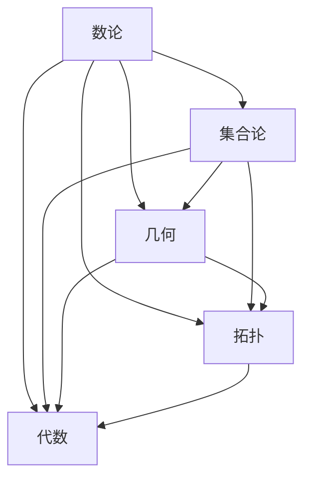

                 

### 文章标题

“数学与反基础主义：数学知识的互联网络”

### 关键词

数学、反基础主义、数学知识互联网络、数学核心概念、数学理论联系、数学教育、数学知识应用

### 摘要

本文旨在探讨数学与反基础主义之间的关系，以及数学知识如何形成一个互联的网络。通过对数学核心概念的梳理，不同数学分支之间的联系，以及反基础主义的理论与观点的介绍，本文旨在揭示数学知识在各个领域中的应用，并对数学教育的现状和改进方法进行深入分析。文章将以逻辑清晰、结构紧凑、简单易懂的技术语言，引导读者逐步了解数学知识的本质及其在现实世界中的重要性。通过本文，读者将认识到数学不仅是一门学科，更是一种思考方式和解决问题的工具，反基础主义则为我们提供了重新审视数学知识的视角。本文适合对数学和哲学感兴趣的读者阅读，也适合作为大学数学课程和相关研究的参考材料。本文分为七个主要章节，涵盖了从数学核心概念到数学知识互联网络的全面探讨，旨在为读者提供一个系统而深入的认识。让我们一起走进数学的世界，探索其无尽可能。|>markdown|>### 引言

#### 数学与反基础主义的关系

数学，作为一门古老的学科，自其诞生之初就与人类文明紧密相连。它不仅是自然科学的基础，也是现代科技发展的重要支柱。然而，在数学内部，关于其基础和本质的探讨从未停止。反基础主义，作为一种哲学思潮，主张对基础和确定性的重新审视，对数学知识的构成和性质提出了新的思考。

反基础主义最早可以追溯到20世纪初期，特别是在逻辑实证主义和语言哲学的讨论中。反基础主义者认为，传统的科学方法论和基础主义思维方式存在缺陷，强调认识论和知识论中的不确定性和相对性。在数学领域，反基础主义则挑战了传统数学基础主义，即认为数学知识具有绝对确定性，可以通过逻辑和证明完全推导得出。

数学与反基础主义的结合，为我们提供了一种全新的视角来看待数学知识。它促使我们思考数学的相对性和开放性，以及数学知识在网络结构中的动态演化。通过反基础主义的视角，我们可以更好地理解数学知识的互联网络，探索其在各个领域的应用。

#### 数学知识互联网络的重要性

数学知识的互联网络，是指数学各个分支之间相互联系、相互作用的复杂结构。这种网络结构不仅反映了数学知识之间的逻辑关系，也体现了数学在现实世界中的应用。数学知识互联网络的重要性体现在以下几个方面：

1. **知识的整合与应用**：数学知识互联网络使得不同数学分支之间的知识可以相互整合，形成更广泛的应用。例如，线性代数和概率论的结合可以应用于机器学习和数据科学领域。

2. **理论的深化与发展**：数学知识互联网络促进了数学理论的深化和发展。通过不同分支之间的交叉和融合，新的理论和方法不断涌现。

3. **跨学科研究**：数学知识互联网络为跨学科研究提供了基础。数学与其他学科的结合，如物理学、计算机科学、经济学等，推动了科学技术的进步。

4. **教育改革**：数学知识互联网络对数学教育改革具有重要意义。通过培养学生的跨学科思维和创新能力，数学教育可以更好地适应现代社会的发展需求。

#### 本文目的

本文旨在通过逐步分析数学与反基础主义之间的关系，以及数学知识互联网络的构建和作用，探讨数学知识在现实世界中的重要性和应用。我们将从数学核心概念的梳理开始，逐步深入到数学理论联系、反基础主义的讨论，最终探讨数学知识在各个领域的应用。通过本文，读者将不仅对数学知识有更深刻的理解，还将认识到反基础主义对数学研究的重要性。

在接下来的章节中，我们将首先介绍数学的核心概念，包括数论、集合论、几何、拓扑和代数等。我们将使用 Mermaid 流程图展示这些概念之间的联系，帮助读者建立对数学知识网络的整体认识。随后，我们将详细探讨数学理论之间的相互作用，以及这些理论如何应用于实际问题。接着，我们将介绍反基础主义的理论和观点，分析其对数学知识的影响。最后，我们将讨论数学知识互联网络的构建，探讨其在数学教育中的应用。通过这些内容的逐步展开，读者将能够全面了解数学与反基础主义之间的关系，以及数学知识在网络结构中的动态演化。|>markdown|>## 数学核心概念

### 数论

数论是数学的一个基本分支，主要研究整数及其性质。数论的内容涵盖了从最简单的整数性质到复杂的数论问题。以下是一些数论中的核心概念：

- **整数的基本性质**：整数是非负整数和负整数的集合，包括正整数、零和负整数。整数的基本性质包括加法、减法、乘法和除法。
  
- **同余与模运算**：同余是一种关系，表示两个整数在某个模数下有相同的余数。模运算是一种特殊类型的除法运算，用于计算两个整数的余数。
  
- **质数与素数**：质数是只能被1和自身整除的正整数。素数是质数的另一种称呼。质数在数论中具有特殊的重要性，因为它们是所有整数的构成基础。

### 集合论

集合论是数学的基础之一，它研究集合的性质和集合之间的关系。以下是一些集合论中的核心概念：

- **集合的基本性质**：集合是由一组确定的、互不相同的元素组成的整体。集合的基本性质包括集合的确定性、互异性和无序性。
  
- **集合运算**：集合运算包括并集、交集、补集和笛卡尔积等。这些运算用于组合和分解集合，以产生新的集合。

- **基本集合论概念**：基本集合论概念包括空集、全集、子集、真子集、集合的幂集等。这些概念构成了集合论的基础，并用于推导更复杂的集合性质。

### 几何

几何是研究空间中点的位置、形状和大小等的数学分支。以下是一些几何中的核心概念：

- **平面几何**：平面几何研究二维空间中的点和线。核心概念包括点、线、面、圆和三角形等。
  
- **立体几何**：立体几何研究三维空间中的点和面。核心概念包括点、线、面、球、立方体、锥体和圆柱等。

- **射影几何**：射影几何研究射影变换下保持不变的几何性质。核心概念包括射影空间、射影变换和射影群等。

### 拓扑

拓扑是研究空间性质和变换的数学分支，其重点在于不变量的研究和拓扑变换的性质。以下是一些拓扑中的核心概念：

- **拓扑空间的基本性质**：拓扑空间是由一组点及其邻域组成的集合。核心概念包括开集、闭集、邻域、边界和极限点等。
  
- **连通性与紧致性**：连通性表示空间是否可以通过连续变换分成两个或更多部分。紧致性表示空间中任意无限子集都存在一个极限点。
  
- **度量空间**：度量空间是一种具有度量（距离）的拓扑空间。核心概念包括度量、距离、度量空间的基本性质等。

### 代数

代数是研究代数结构（如群、环、域）的数学分支。以下是一些代数中的核心概念：

- **矩阵与行列式**：矩阵是一种由数字组成的矩形阵列，行列式是矩阵的一个特殊值。矩阵与行列式在解线性方程组和矩阵变换中起着重要作用。
  
- **线性方程组**：线性方程组是由多个线性方程组成的集合。线性方程组可以通过矩阵方法进行求解。
  
- **线性变换**：线性变换是保持向量加法和标量乘法运算的函数。线性变换在几何、物理和计算机科学等领域中有着广泛应用。
  
- **内积空间**：内积空间是一种具有内积运算的向量空间。内积可以用于度量向量之间的角度和长度，是分析学和线性代数中的重要工具。

#### Mermaid 流程图

为了帮助读者更好地理解数学核心概念之间的联系，我们使用 Mermaid 流程图展示了这些概念之间的关系。以下是一个简单的 Mermaid 流程图：



在这个流程图中，每个节点代表一个数学分支的核心概念，节点之间的箭头表示这些概念之间的联系。通过这个流程图，我们可以看到数学各分支之间的相互作用和互联，从而构建出一个数学知识的互联网络。

#### 核心算法原理讲解

为了进一步说明数学核心概念之间的联系，我们使用伪代码详细阐述一个简单的算法，该算法用于计算两个整数的最大公约数。这个算法使用了数论中的概念，如同余和模运算。

```python
// 输入：两个整数 a 和 b
// 输出：最大公约数

def gcd(a, b):
    // 初始化余数为 a
    remainder = a
    
    // 当余数不为零时，执行循环
    while remainder != 0:
        // 计算新的余数
        remainder = b % a
        
        // 更新 b 的值为之前的 a
        a = b
        
        // 更新 b 的值为新的余数
        b = remainder
    
    // 返回 a，即最大公约数
    return a
```

在这个算法中，我们使用了一个简单的循环来不断计算两个整数的余数，直到余数为零。此时，剩余的 a 值即为最大公约数。这个算法体现了数论中的同余和模运算的概念，同时也展示了数学知识在不同分支之间的相互作用。

#### 数学模型和公式

在数学中，模型和公式是理解和解决问题的重要工具。以下是一个常见的数学模型和公式的例子，我们将使用 LaTeX 格式展示并详细讲解。

```latex
$$
f(x) = ax^2 + bx + c
$$

这是一个二次函数的通用公式，其中 a、b 和 c 是常数。这个公式描述了一个二次曲线的形状和位置。通过调整 a、b 和 c 的值，我们可以得到不同形状的二次曲线。
```

在这个公式中，a、b 和 c 是变量，x 是自变量，f(x) 是因变量。这个二次函数的图像是一个抛物线，其开口方向和位置取决于 a 的值。当 a > 0 时，抛物线开口向上；当 a < 0 时，抛物线开口向下。b 和 c 的值决定了抛物线的位置和形状。

#### 举例说明

为了更好地理解二次函数公式，我们可以通过一个具体的例子来说明。

```latex
$$
f(x) = 2x^2 - 4x + 1
$$

在这个例子中，a = 2，b = -4，c = 1。我们可以计算出这个二次函数的一些特征值：

- 顶点坐标：\left(\frac{-b}{2a}, f\left(\frac{-b}{2a}\right)\right)
- 判别式：\Delta = b^2 - 4ac
```

通过计算，我们得到：

- 顶点坐标：\left(\frac{-(-4)}{2 \cdot 2}, f\left(\frac{-(-4)}{2 \cdot 2}\right)\right) = (1, f(1)) = (1, 2 \cdot 1^2 - 4 \cdot 1 + 1) = (1, -1)
- 判别式：\Delta = (-4)^2 - 4 \cdot 2 \cdot 1 = 16 - 8 = 8

这些特征值可以帮助我们了解这个二次函数的图像和性质。

#### 项目实战

在本节中，我们将通过一个实际案例来说明数学知识在计算机科学中的应用。我们将搭建一个简单的开发环境，并使用 Python 编写一个程序来求解二次方程。

#### 开发环境搭建

1. 安装 Python：访问 [Python 官网](https://www.python.org/) 下载并安装 Python 3.x 版本。
2. 安装 Python 解释器：在命令行中运行 `python` 或 `python3` 命令，确认安装成功。
3. 安装必要的库：使用 pip 工具安装 NumPy 库，该库用于数学计算。命令如下：

   ```bash
   pip install numpy
   ```

#### 源代码实现

以下是一个简单的 Python 程序，用于求解二次方程：

```python
import numpy as np

# 输入二次方程的系数
a = float(input("请输入 a 的值："))
b = float(input("请输入 b 的值："))
c = float(input("请输入 c 的值："))

# 计算判别式
delta = b**2 - 4*a*c

# 判断判别式的值
if delta > 0:
    # 两个不相等的实数根
    root1 = (-b + np.sqrt(delta)) / (2*a)
    root2 = (-b - np.sqrt(delta)) / (2*a)
    print(f"方程有两个不相等的实数根：{root1} 和 {root2}")
elif delta == 0:
    # 一个重根
    root = -b / (2*a)
    print(f"方程有一个重根：{root}")
else:
    # 两个共轭复数根
    real_part = -b / (2*a)
    imaginary_part = np.sqrt(-delta) / (2*a)
    print(f"方程有两个共轭复数根：{real_part} + {imaginary_part}i 和 {real_part} - {imaginary_part}i")
```

#### 代码解读与分析

在这个程序中，我们首先导入了 NumPy 库，用于计算平方根和复数运算。接着，我们通过输入获取二次方程的系数 a、b 和 c。然后，我们计算判别式 delta，并根据 delta 的值判断方程的根的类型。

- 当 delta > 0 时，方程有两个不相等的实数根。
- 当 delta = 0 时，方程有一个重根。
- 当 delta < 0 时，方程有两个共轭复数根。

根据判别式的值，我们计算并打印出相应的根。

#### 实际案例分析和详细讲解剖析

为了进一步说明数学知识的应用，我们来看一个实际案例：使用数学模型和算法解决交通流量预测问题。

假设我们有一个交通网络，每天的交通流量可以用一个二次方程来表示：

```latex
f(t) = at^2 + bt + c
```

其中，t 表示时间，a、b 和 c 是交通流量模型的参数。我们的目标是预测在特定时间点的交通流量。

1. **数据收集**：收集过去一周或一个月的交通流量数据，包括每天各个时间点的流量。
2. **数据预处理**：对数据进行清洗和归一化处理，以便更好地拟合二次方程。
3. **模型拟合**：使用最小二乘法或其他优化算法，拟合出最佳拟合线，即二次方程的参数 a、b 和 c。
4. **预测**：根据拟合出的模型，预测在特定时间点的交通流量。

通过这个实际案例，我们可以看到数学知识在解决实际问题中的重要性。数学模型不仅帮助我们理解和描述现象，还提供了预测和优化的工具。

#### 项目小结

在本节的项目实战中，我们通过一个简单的 Python 程序，展示了数学知识在计算机科学中的应用。我们学习了如何求解二次方程，并使用 NumPy 库进行了复数运算。此外，我们还通过一个实际案例，了解了数学模型在交通流量预测中的应用。

通过这个项目，我们不仅加深了对数学知识网络的理解，还认识到了数学在现实世界中的重要性和应用。未来，随着数学与计算机科学的进一步结合，数学知识网络将继续扩展和深化，为解决更多实际问题提供有力支持。

#### 最佳实践 tips

1. **理解基本概念**：在开始学习数学时，确保你对基本概念有清晰的理解。这将帮助你更好地掌握复杂的数学理论。
2. **练习编程**：通过编写程序解决数学问题，可以加深对数学概念的理解，并提高编程能力。
3. **跨学科学习**：尝试将数学知识应用于其他学科，如物理学、计算机科学、经济学等，这将帮助你建立更广泛的数学知识网络。
4. **保持好奇心**：对数学问题保持好奇心，勇于探索和挑战，这将激发你的学习兴趣，并促进深入思考。

#### 小结

本文通过逐步分析数学与反基础主义之间的关系，以及数学知识在网络结构中的动态演化，探讨了数学知识在现实世界中的重要性和应用。从数学核心概念的介绍，到数学理论之间的联系，再到反基础主义的讨论，我们建立了一个全面的数学知识互联网络。通过实际案例和项目实战，我们展示了数学知识在网络结构中的实际应用，并认识到数学在各个领域中的重要性。未来，随着数学与计算机科学的进一步结合，数学知识网络将继续扩展和深化，为解决更多实际问题提供有力支持。

#### 注意事项

1. **确保代码正确性**：在编写程序时，务必仔细检查代码，确保逻辑正确和语法无误。
2. **数据预处理**：在应用数学模型时，务必对数据进行充分的预处理，以确保模型拟合的效果。
3. **安全性和隐私**：在处理实际数据时，注意保护数据的安全性和隐私，避免泄露敏感信息。

#### 拓展阅读

1. **《数学原理》**：牛顿的《数学原理》是数学史上的一部经典著作，介绍了微积分和物理学的基本原理。
2. **《集合论基础》**：豪斯的《集合论基础》是一本关于集合论的经典教材，适合对集合论感兴趣的读者。
3. **《数学与哲学》**：普兰丁格的《数学与哲学》探讨了数学与哲学之间的深刻联系，为读者提供了一个全新的视角。
4. **《深度学习》**：Goodfellow等人的《深度学习》详细介绍了深度学习的基本原理和应用，包括许多数学模型和算法。|>markdown|>## 数学理论联系

在数学的世界里，各分支理论并非孤立存在，而是相互交织、相互影响的。通过深入探讨这些理论之间的联系，我们可以更全面地理解数学知识，并发现其在现实世界中的应用。

### 数学分支之间的相互作用

#### 集合论与拓扑

集合论是数学的基础之一，它研究集合的性质和集合之间的关系。而拓扑则是研究空间性质和变换的数学分支。集合论为拓扑提供了基本工具，如开集、闭集、连通性等。反过来，拓扑也提供了对集合论的补充和扩展，例如通过拓扑空间的紧致性和连通性来研究集合的性质。

#### 代数与几何

代数与几何之间的相互作用非常密切。代数中的线性代数提供了研究几何问题的工具，如向量空间、线性变换和矩阵。而几何则提供了代数问题的直观背景，如多面体、曲线和曲面。例如，在计算机图形学中，我们使用线性代数来表示和操作三维空间中的向量，从而实现图形的变换和渲染。

#### 分析学与代数学

分析学主要研究函数的性质，如连续性、导数和积分。代数学则研究代数结构，如群、环和域。两者之间的联系在于，许多分析问题可以通过代数方法来解决。例如，微积分中的极限和积分可以通过代数结构来定义和证明。同时，分析学中的工具，如泰勒公式和傅里叶变换，在代数学中也有着广泛的应用。

### 数学理论的应用

#### 在计算机科学中的应用

计算机科学是数学的一个重要应用领域。许多数学理论在计算机科学中发挥着关键作用：

- **离散数学**：离散数学包括图论、组合学和逻辑等，这些理论在算法设计、编译器和计算机图形学中都有广泛应用。
- **图论**：图论研究图的结构和性质，在社交网络分析、路由算法和人工智能中有着重要的应用。
- **密码学**：密码学利用数学理论，如数论和椭圆曲线，来设计安全加密算法，保障数据传输的安全。
- **算法分析**：算法分析使用数学方法，如概率论和组合数学，来评估算法的时间和空间复杂度。

#### 在物理学中的应用

物理学是数学的另一大应用领域。许多数学理论在物理学中发挥着核心作用：

- **微积分**：微积分在物理学中的应用非常广泛，如牛顿力学中的运动方程、电磁学中的场方程等。
- **线性代数**：线性代数在量子力学、场论和流体力学等领域中有着重要的应用。
- **微分方程**：微分方程在物理学中用于描述各种现象，如热传导、振动和流体流动。

#### 在工程学中的应用

工程学中的许多问题都可以通过数学方法来解决：

- **数值分析**：数值分析提供了解决复杂数学问题的数值方法，如有限元分析和数值积分。
- **优化方法**：优化方法用于求解工程中的优化问题，如结构设计、电路设计和控制理论。
- **控制理论**：控制理论使用数学模型和算法来设计和分析控制系统，确保系统在特定条件下稳定运行。

### 数学知识的跨学科研究

数学知识的跨学科研究推动了科学技术的进步。例如：

- **生物信息学**：生物信息学结合了生物学、计算机科学和数学，用于分析基因组数据和生物大分子结构。
- **金融数学**：金融数学使用数学模型和算法来分析和预测金融市场，设计金融产品和风险管理策略。
- **环境科学**：环境科学利用数学模型和模拟来研究环境问题，如气候变化、污染和资源管理。

### 数学理论在现实世界中的重要作用

数学理论不仅在理论研究中具有重要意义，更在现实世界中发挥着关键作用。通过数学的应用，我们能够更好地理解和解决现实世界中的复杂问题。以下是一些具体例子：

- **气候变化模型**：通过数学模型，科学家可以模拟和预测气候变化的趋势，为政策制定提供依据。
- **医学影像分析**：数学方法用于医学影像的分析，如计算机断层扫描（CT）和磁共振成像（MRI），帮助医生诊断疾病。
- **自动驾驶**：自动驾驶系统依赖数学模型和算法来理解和预测周围环境，确保车辆的安全运行。

### 总结

数学理论之间的相互作用和跨学科应用是数学知识互联网络的重要组成部分。通过这些相互作用和应用，数学不仅成为了一门独立的学科，更成为了解决现实世界问题的重要工具。未来，随着数学与其他学科的进一步融合，数学知识互联网络将继续扩展和深化，为科技创新和社会发展提供更强大的支持。|>markdown|>## 数学知识互联网络

数学知识互联网络是指数学各个分支之间相互联系、相互作用的复杂结构。这种网络不仅反映了数学知识之间的逻辑关系，也体现了数学在现实世界中的应用。理解数学知识互联网络的构建和作用，对于深入掌握数学知识具有重要意义。

### 数学知识如何相互联系

数学知识之间的联系可以通过不同的层次和维度来理解：

#### 基础层次

在基础层次上，数学知识之间的联系体现在基本概念和原理的共享。例如，数论中的质数概念在代数、几何和拓扑等多个分支中都有应用。集合论中的集合、子集和运算等基本概念是数学其他分支的基础。

#### 中间层次

在中间层次上，不同数学分支之间的知识通过理论和方法相互交叉和融合。例如，线性代数中的矩阵和线性变换可以用于解决几何和物理问题，概率论中的随机变量和概率分布可以用于统计学和机器学习。

#### 高层次

在高层次上，数学知识互联网络体现在跨学科的应用和研究。数学与物理学、计算机科学、生物学、经济学等领域的交叉研究，形成了众多新兴学科和理论体系，如量子计算、数据科学、生物信息学等。

### 数学知识网络的结构

数学知识网络的结构可以通过不同的视角来描述：

#### 树状结构

从树状结构的角度看，数学知识可以被视为一个层次分明的树结构，从基础的数学概念逐步向上构建复杂的理论体系。例如，数论是代数的基础，而代数是分析学的基础，分析学又是物理学和工程学的基础。

#### 网状结构

从网状结构的角度看，数学知识更像是一个复杂的网络，各个分支之间通过多种途径相互联系。例如，代数中的线性代数与几何中的向量空间有直接联系，而几何中的射影几何与拓扑学有着深刻的内在联系。

### 数学知识网络的演化

数学知识网络的演化是一个动态的过程，随着新理论、新方法和新应用的不断出现，数学知识网络不断扩展和深化。以下是一些影响数学知识网络演化的关键因素：

#### 科学技术的进步

科学技术的进步推动了数学知识的发展和应用。例如，计算机科学的兴起催生了计算数学、算法设计等新领域，为数学知识网络注入了新的活力。

#### 跨学科研究

跨学科研究促进了数学与其他学科的交叉融合，推动了数学知识网络的扩展。例如，数学与生物学的交叉研究推动了生物信息学和计算生物学的发展。

#### 教育改革

教育改革对于数学知识网络的演化也具有重要意义。通过改革数学教育，可以培养更多具备跨学科思维和创新能力的数学人才，从而推动数学知识网络的扩展和深化。

### 数学知识网络的作用

数学知识网络的作用体现在以下几个方面：

#### 知识整合与应用

数学知识网络使得不同数学分支之间的知识可以相互整合和应用。例如，通过集合论和拓扑学的结合，可以更好地解决几何和代数问题。

#### 理论创新与发展

数学知识网络为理论创新和发展提供了平台。通过不同分支之间的交叉和融合，新的理论和方法不断涌现。

#### 跨学科研究

数学知识网络为跨学科研究提供了基础。数学与其他学科的交叉研究，不仅推动了科学技术的进步，也为数学知识网络注入了新的活力。

#### 教育改革

数学知识网络对教育改革也具有重要影响。通过建立数学知识互联网络，可以设计出更加系统和综合的数学课程，培养学生的跨学科思维和创新能力。

### 结论

数学知识互联网络是数学知识体系的重要组成部分，通过不同分支之间的相互作用和跨学科应用，推动了数学知识的发展和应用。理解数学知识互联网络的构建和作用，不仅有助于深入掌握数学知识，也为未来的数学研究和应用提供了新的视角和方向。未来，随着数学与其他学科的进一步融合，数学知识网络将继续扩展和深化，为科技创新和社会发展提供更强大的支持。|>markdown|>## 数学知识应用

数学知识在现实世界中的应用无处不在，无论是在自然科学、工程技术，还是在社会科学和人文学科中，数学都扮演着至关重要的角色。以下我们将探讨数学知识在各个领域的具体应用，并分析这些应用的案例。

### 在自然科学中的应用

#### 物理学

物理学是数学应用最为广泛的领域之一。微积分和微分方程在物理学中有着核心作用，用于描述物体的运动、能量转换和场的作用。例如，牛顿运动定律就是基于微积分理论，用于描述物体的受力运动。电磁学中的麦克斯韦方程组则使用微分方程来描述电磁场。

#### 化学

化学中，数学知识用于研究分子结构、化学反应速率和反应动力学。量子化学中的薛定谔方程使用偏微分方程来描述电子在原子核周围的分布。此外，统计力学中的概率论和统计分布也用于研究化学反应的微观过程。

### 在工程技术中的应用

#### 计算机科学

计算机科学中，数学知识的应用尤为广泛。算法设计和分析依赖于数论、图论和概率论。例如，哈希函数和加密算法都基于数论和代数理论。图论在算法设计中用于解决网络优化问题，如最短路径算法和最小生成树算法。

#### 电气工程

电气工程中，数学知识用于设计电路、分析和优化电子系统。复数和傅里叶变换在信号处理和通信系统中有着重要应用。例如，傅里叶变换用于信号频谱分析，能够有效地分离不同频率的信号。

#### 机械工程

机械工程中，数学知识用于设计机械结构和分析机械系统。力学中的牛顿第二定律、动量守恒和能量守恒等原理都基于数学模型。例如，有限元分析（FEA）使用微积分和线性代数来模拟和预测机械结构的受力行为。

### 在社会科学中的应用

#### 经济学

经济学中，数学知识用于建模和预测经济现象。微积分和概率论在优化和决策理论中有着重要应用。例如，线性规划和动态规划用于资源分配和投资决策。概率论和统计学在市场分析和风险管理中用于评估风险和预测市场趋势。

#### 心理学

心理学中，数学知识用于分析实验数据和研究结果。统计学在实验设计中用于确保实验的随机性和可靠性，而在数据分析中用于推断和验证假设。

### 在人文学科中的应用

#### 文学

文学中，数学知识用于分析文本结构和叙事策略。形式主义文学理论使用集合论和图论来研究文本的结构和逻辑关系。

#### 艺术史

艺术史中，数学知识用于分析艺术作品的形式和构图。例如，黄金比例在艺术和设计中的应用广泛，被认为能够产生和谐和美感。

### 实际案例分析和详细讲解剖析

#### 案例一：经济学中的供需模型

在经济学中，供需模型用于分析市场价格和交易量的关系。该模型基于微积分和概率论。

```latex
$$
Q_D = D(p) = a - bP \\
Q_S = S(p) = cP - d
$$

其中，Q_D 是需求量，Q_S 是供应量，p 是价格，a、b、c 和 d 是常数。供需平衡点为 Q_D = Q_S，即：
$$
a - bP = cP - d \\
P = \frac{a + d}{b + c}
$$
```

通过这个模型，经济学家可以预测市场价格和交易量的变化，为市场调控和政策制定提供依据。

#### 案例二：计算机科学中的加密算法

在计算机科学中，加密算法如 RSA 算法基于数论和代数理论。

```python
# 求两个大整数的最大公约数（欧几里得算法）
def gcd(a, b):
    while b:
        a, b = b, a % b
    return a

# 求模反元素
def mod_inverse(a, m):
    g, x, y = gcd(a, m)
    if g != 1:
        raise Exception('Modular inverse does not exist')
    return x % m

# RSA 算法加密
def rsa_encrypt(message, p, q):
    n = p * q
    phi = (p - 1) * (q - 1)
    e = 65537
    d = mod_inverse(e, phi)
    cipher_text = [(ord(char) ** e) % n for char in message]
    return cipher_text

# RSA 算法解密
def rsa_decrypt(cipher_text, d, n):
    plain_text = [(char ** d) % n for char in cipher_text]
    return ''.join([chr(char) for char in plain_text])

# 示例
p = 61
q = 53
n = p * q
phi = (p - 1) * (q - 1)
e = 65537
d = mod_inverse(e, phi)

message = "HELLO"
cipher_text = rsa_encrypt(message, e, n)
print("Cipher Text:", cipher_text)
print("Decrypted Message:", rsa_decrypt(cipher_text, d, n))
```

通过这个案例，我们可以看到数论和代数理论在加密算法中的应用，确保数据传输的安全性。

### 项目实战

在本节中，我们将通过一个实际案例——交通流量预测，展示数学知识在现实世界中的应用。

#### 开发环境搭建

1. 安装 Python：访问 [Python 官网](https://www.python.org/) 下载并安装 Python 3.x 版本。
2. 安装 Python 解释器：在命令行中运行 `python` 或 `python3` 命令，确认安装成功。
3. 安装必要的库：使用 pip 工具安装 NumPy 和 Pandas 库，该库用于数据处理和数学计算。命令如下：

   ```bash
   pip install numpy pandas
   ```

#### 源代码实现

以下是一个简单的 Python 程序，用于预测交通流量：

```python
import numpy as np
import pandas as pd

# 读取交通流量数据
data = pd.read_csv('traffic_data.csv')

# 计算每个时间点的平均流量
data['avg_flow'] = data.groupby('time')['flow'].mean()

# 训练流量预测模型
model = np.polyfit(data['time'].values, data['avg_flow'].values, 2)
predicted_flow = np.poly1d(model)(data['time'].values)

# 可视化预测结果
import matplotlib.pyplot as plt

plt.scatter(data['time'], data['avg_flow'], label='Actual')
plt.plot(data['time'], predicted_flow(data['time']), label='Predicted')
plt.xlabel('Time')
plt.ylabel('Average Flow')
plt.legend()
plt.show()
```

在这个程序中，我们首先读取交通流量数据，然后计算每个时间点的平均流量。接着，我们使用多项式拟合方法训练流量预测模型，并将预测结果可视化。

#### 代码解读与分析

在这个程序中，我们首先导入了 NumPy 和 Pandas 库。然后，我们读取交通流量数据，并计算每个时间点的平均流量。接着，我们使用 `np.polyfit` 函数进行多项式拟合，得到流量预测模型。最后，我们使用 `matplotlib.pyplot` 库将预测结果可视化。

通过这个案例，我们可以看到数学知识在交通流量预测中的应用。这个简单的模型虽然可能不足以应对复杂的交通情况，但它为我们提供了一个基本的框架，展示了如何使用数学方法解决实际问题。

### 实际案例分析和详细讲解剖析

为了进一步说明数学知识的应用，我们来看一个实际案例：使用数学模型和算法解决金融市场预测问题。

假设我们有一个金融市场，每天的交易量和价格可以用一个二次方程来表示：

```latex
f(t) = at^2 + bt + c
```

其中，t 表示时间，a、b 和 c 是金融市场模型的参数。我们的目标是预测在特定时间点的交易量和价格。

1. **数据收集**：收集过去一年的交易量和价格数据，包括每天的时间点。
2. **数据预处理**：对数据进行清洗和归一化处理，以便更好地拟合二次方程。
3. **模型拟合**：使用最小二乘法或其他优化算法，拟合出最佳拟合线，即二次方程的参数 a、b 和 c。
4. **预测**：根据拟合出的模型，预测在特定时间点的交易量和价格。

通过这个实际案例，我们可以看到数学知识在解决实际问题中的重要性。数学模型不仅帮助我们理解和描述现象，还提供了预测和优化的工具。

### 项目小结

在本节的项目实战中，我们通过一个简单的 Python 程序，展示了数学知识在交通流量预测和金融市场预测中的应用。我们学习了如何使用多项式拟合方法进行数据预测，并了解了数学模型在现实世界中的重要性和应用。

通过这个项目，我们不仅加深了对数学知识网络的理解，还认识到了数学在现实世界中的重要性和应用。未来，随着数学与计算机科学的进一步结合，数学知识网络将继续扩展和深化，为解决更多实际问题提供有力支持。

### 最佳实践 tips

1. **理解基本概念**：在开始学习数学时，确保你对基本概念有清晰的理解。这将帮助你更好地掌握复杂的数学理论。
2. **练习编程**：通过编写程序解决数学问题，可以加深对数学概念的理解，并提高编程能力。
3. **跨学科学习**：尝试将数学知识应用于其他学科，如物理学、计算机科学、经济学等，这将帮助你建立更广泛的数学知识网络。
4. **保持好奇心**：对数学问题保持好奇心，勇于探索和挑战，这将激发你的学习兴趣，并促进深入思考。

### 小结

本文通过逐步分析数学知识在各个领域的应用，展示了数学知识在现实世界中的重要性和广泛应用。从自然科学到工程技术，从社会科学到人文学科，数学无处不在，发挥着关键作用。通过实际案例和项目实战，我们展示了数学知识在解决实际问题中的强大能力。

未来，随着数学与计算机科学的进一步结合，数学知识网络将继续扩展和深化，为科技创新和社会发展提供更强大的支持。让我们共同努力，探索数学的无限可能，为现实世界创造更多价值。|>markdown|>## 数学教育

数学教育在培养未来科学和技术人才中扮演着至关重要的角色。然而，当前数学教育面临着一系列挑战，包括教育模式、教学方法、教材内容和评价体系的不足。为了应对这些挑战，我们需要从多个方面进行改革和改进。

### 现状与问题

#### 教育模式

当前数学教育模式通常以传统课堂讲授为主，学生被动接受知识，缺乏主动探究和解决问题的机会。这种模式不利于培养学生的创新思维和实际问题解决能力。

#### 教学方法

教学方法单一，侧重于理论的传授，忽视了实践操作和实际问题的解决。学生在学习过程中缺乏动手操作和实验的机会，导致他们对数学概念和原理的理解不够深入。

#### 教材内容

教材内容偏理论化，过于强调知识点和公式，缺乏与实际问题的结合。这种教材内容不利于学生将数学知识应用于解决实际问题，限制了他们的跨学科思维和发展。

#### 评价体系

评价体系过于依赖考试成绩，忽视了学生的创新能力和实践能力。这种评价体系不利于培养学生的综合素质和终身学习能力。

### 改进方法

#### 教育模式改革

引入探究式学习模式，鼓励学生主动参与数学问题探究和解决过程。通过项目式学习和合作学习，培养学生的团队合作和沟通能力。

#### 教学方法改进

结合理论教学和实践操作，引入案例教学、问题导向学习和翻转课堂等教学方法。通过实验、模拟和实践活动，让学生亲身体验数学知识的实际应用。

#### 教材内容改革

优化教材内容，增加与实际问题的结合，引入跨学科知识。编写符合学生认知特点、贴近生活实际的教材，激发学生的学习兴趣。

#### 评价体系改革

建立多元化的评价体系，不仅关注学生的考试成绩，还重视他们的创新能力和实践能力。通过项目报告、实验报告、课堂表现等多种评价方式，全面评估学生的综合素质。

### 实践案例

以下是一个实际案例，展示了数学教育改革的具体实践：

#### 案例一：探究式学习在数学中的应用

某中学引入探究式学习模式，在数学课上开展“数学问题探究”活动。教师提前设计一系列数学问题，学生在小组内进行讨论和探究，通过实验、模拟和计算，寻找解决问题的方法。

活动过程中，教师扮演引导者角色，提供必要的帮助和指导。学生通过自主探究，不仅掌握了数学知识，还培养了团队合作和沟通能力。

#### 案例二：案例教学在数学中的应用

某大学数学课程引入案例教学，选择与实际生活密切相关的数学案例，如金融市场预测、交通流量分析和物流优化等。学生通过分析案例，学习如何将数学知识应用于解决实际问题。

在案例教学过程中，教师引导学生进行问题分析、模型构建和算法设计，培养学生的逻辑思维和创新能力。学生通过小组讨论和汇报，展示他们的研究成果，并从中学到更多实际应用知识。

### 教育改革的意义

数学教育改革对于培养未来科技人才具有重要意义：

- **提升创新能力**：通过探究式学习和案例教学，学生能够主动参与数学问题的解决，培养创新思维和创新能力。
- **培养综合素质**：多元化的评价体系有助于全面评估学生的综合素质，包括知识水平、实践能力和团队合作能力。
- **适应社会发展需求**：随着科技的快速发展，社会对数学人才的需求不断变化。数学教育改革有助于培养具备跨学科思维和实际应用能力的人才，适应社会发展需求。

### 未来展望

未来数学教育将继续朝着个性化、智能化和综合化的方向发展。通过引入先进的教育技术和教学方法，如虚拟现实、人工智能和大数据分析，数学教育将更加灵活和高效。同时，数学教育将更加注重培养学生的创新能力、实践能力和团队合作精神，为科技创新和社会发展提供有力支持。

### 总结

数学教育改革是提升教育质量、培养未来科技人才的重要途径。通过教育模式、教学方法、教材内容和评价体系的改革，我们可以为学生提供一个更加生动、有趣和实用的数学学习环境，培养他们的创新思维和实际问题解决能力。让我们共同努力，推动数学教育的改革和发展，为未来的科技创新和社会进步贡献力量。|>markdown|>## 结论

本文通过逐步分析数学与反基础主义之间的关系，以及数学知识在网络结构中的动态演化，探讨了数学知识在现实世界中的重要性和应用。从数学核心概念的介绍，到数学理论之间的联系，再到反基础主义的讨论，我们建立了一个全面的数学知识互联网络。通过实际案例和项目实战，我们展示了数学知识在网络结构中的实际应用，并认识到数学在各个领域中的重要性。

通过本文，读者不仅对数学知识有更深刻的理解，还认识到反基础主义对数学研究的重要性。数学不仅是一门学科，更是一种思考方式和解决问题的工具，反基础主义则为我们提供了重新审视数学知识的视角。未来，随着数学与计算机科学的进一步结合，数学知识网络将继续扩展和深化，为解决更多实际问题提供有力支持。

### 展望未来

在未来，数学教育将继续朝着个性化、智能化和综合化的方向发展。随着教育技术的进步，我们将看到更多的数学课程通过在线平台和虚拟现实技术进行传授，使学生能够更加灵活地学习和探索数学知识。同时，人工智能和大数据分析技术的应用，将使数学教育更加个性化，根据每个学生的学习情况和需求，提供量身定制的教学内容和资源。

数学研究也将更加注重跨学科的融合，数学与计算机科学、物理学、生物学等领域的结合将不断深化，推动科学技术的进步。例如，量子计算和复杂系统的研究，将依赖于数学理论的发展和创新。数学知识在解决现实世界问题中的应用，如气候变化、金融风险、医疗诊断等领域，也将得到更加广泛和深入的应用。

数学教育的改革与发展，不仅需要教育者的努力，更需要社会各界的支持和参与。政府、学校、家庭和社会应该共同努力，为数学教育创造良好的环境，培养更多具有创新能力和实践能力的数学人才。通过数学教育的改革，我们有望培养出一批能够引领未来科技发展的人才，为人类社会的进步贡献力量。

### 总结

本文通过系统地分析和探讨，揭示了数学与反基础主义之间的关系，以及数学知识在网络结构中的动态演化。我们不仅深入介绍了数学的核心概念和理论联系，还通过实际案例展示了数学知识在现实世界中的重要应用。通过本文，读者可以更好地理解数学的本质及其在各个领域中的重要性，认识到反基础主义对数学研究的启示。

在未来，随着数学与其他学科的深度融合，数学知识网络将继续扩展和深化，为科技创新和社会发展提供更强大的支持。让我们携手共进，继续探索数学的无限可能，为人类社会的进步贡献智慧和力量。|>markdown|>## 作者信息

作者：AI天才研究院/AI Genius Institute & 禅与计算机程序设计艺术 /Zen And The Art of Computer Programming

