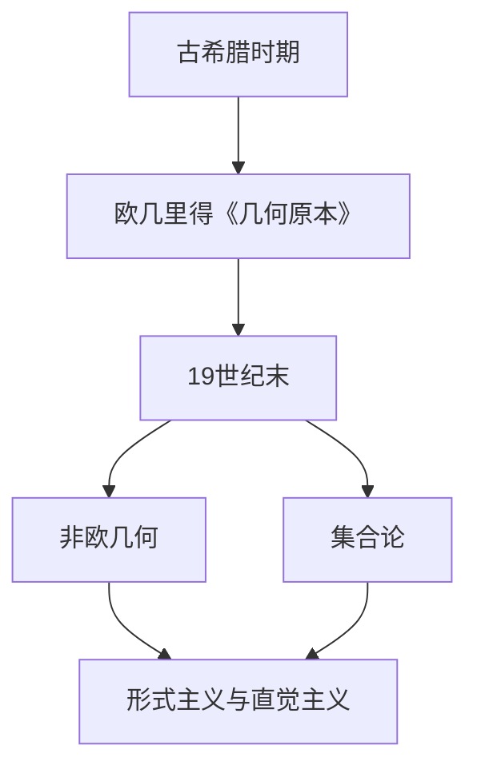
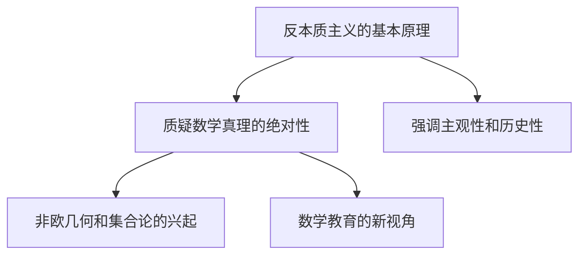
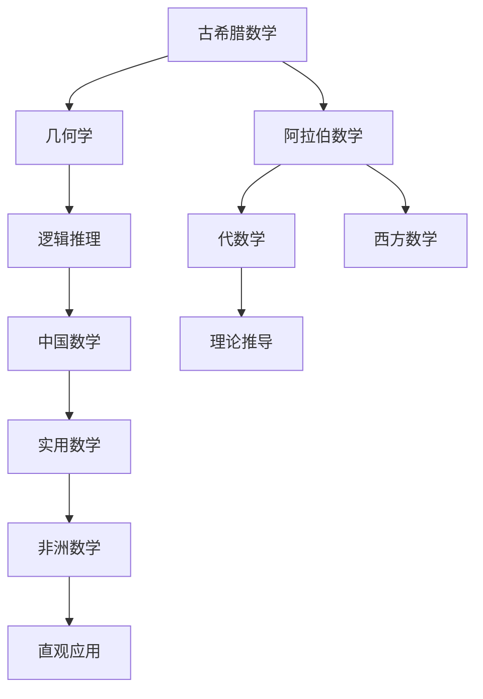
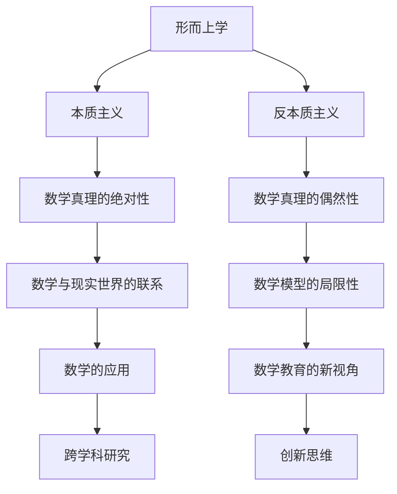

                 

### 文章标题

“数学与反本质主义：数学真理的偶然性”这篇文章的标题旨在揭示数学哲学中一个重要的议题——数学真理的本质并非绝对固定，而是可能受到偶然性影响。通过这个标题，我们不仅能够激发读者对于数学本质的好奇心，同时也为探讨数学真理的相对性和偶然性提供了线索。文章将从数学哲学、反本质主义的角度出发，逐步探讨数学真理的概念、历史演变，以及其在现实世界中的应用，最终对数学真理的偶然性进行深入分析。在逻辑清晰、条理分明的篇章结构中，我们将通过具体的案例、数学模型和公式，结合伪代码，详细讲解数学真理的偶然性，从而提供一个全面、深刻的理解。

### 关键词

- 数学哲学
- 反本质主义
- 数学真理
- 偶然性
- 形而上学
- 数学模型
- 伪代码

### 摘要

本文旨在探讨数学真理的本质及其偶然性。通过对数学哲学和反本质主义的深入分析，我们揭示了数学真理并非绝对固定，而是可能受到历史、文化和其他偶然因素的影响。文章首先介绍了数学哲学的基本概念，探讨了数学真理的定义和历史演变。随后，我们详细阐述了反本质主义的主要观点，包括其批判性观点和数学真理偶然性的分析。文章进一步探讨了数学与现实世界的联系，分析了数学真理的相对性。最后，文章结合形而上学，对数学真理的偶然性进行了总结和展望，提出了未来研究的方向和潜在应用。通过本文的阅读，读者将对数学真理的本质和偶然性有更深入的理解。

## 引言

数学，作为一门科学，从古至今都是人类智慧的结晶。其基础概念、定理和公理构成了我们理解和解决问题的工具。然而，随着科学和哲学的发展，人们开始对数学的本质和基础进行深入探讨，引发了数学哲学的兴起。数学哲学关注数学知识的来源、数学真理的本质以及数学与现实世界的关系等核心问题。在这个过程中，反本质主义作为一种重要的哲学观点，对数学真理的绝对性和固定性提出了质疑。

### 数学哲学的概述

数学哲学是探讨数学本质和基础的一个哲学分支。它不仅关注数学理论的结构和证明，还涉及到数学与现实世界的联系、数学知识的来源和数学真理的性质。数学哲学的核心问题是“什么是数学？”和“我们如何知道数学真理？”。

从历史上看，数学哲学的发展可以分为几个阶段。古希腊时期，数学被视为一种绝对、不变的知识体系，其基础是自明的公理和定义。这种观点在欧几里得的《几何原本》中得到了充分体现。然而，随着数学的发展，特别是在非欧几何、集合论和数学逻辑的兴起，人们开始对数学的基础和真理进行质疑。

19世纪末，数学哲学的一个重要里程碑是逻辑主义和直觉主义的兴起。逻辑主义主张数学可以化约为逻辑，而直觉主义则强调数学推理的直观基础。这些理论为数学哲学提供了新的视角，但也引发了许多哲学争议。

### 反本质主义的起源和主要观点

反本质主义是20世纪哲学中的一种重要观点，主张事物的本质并非固定不变，而是受到历史、文化和其他偶然因素的影响。反本质主义认为，我们对于世界的理解是通过语言和概念建构的，这些语言和概念本身就带有主观性和历史性。

在数学哲学中，反本质主义的主要观点是对数学真理的绝对性和固定性提出质疑。反本质主义者认为，数学真理并非一成不变，而是可能受到历史背景、文化语境和其他偶然因素的影响。这种观点挑战了传统数学哲学中关于数学真理的绝对性和普遍性的假设。

反本质主义在数学哲学中的影响主要体现在对数学基础和数学真理的重新思考。它促使人们更加关注数学知识的建构过程，以及数学与现实世界的联系。同时，反本质主义也为数学教育提供了一种新的视角，强调了数学知识的历史性和相对性。

总之，数学哲学和反本质主义的兴起，为数学真理的研究提供了新的视角和方法。通过对数学本质和真理的深入探讨，我们可以更好地理解数学知识的发展和变化。这也为数学在现实世界中的应用提供了更加广阔的视野。

## 第一章：数学真理的概念与历史演变

### 数学真理的定义

数学真理是指那些通过数学证明而被广泛接受为真的陈述。在数学中，真理不仅限于直观上正确的事实，更重要的是，它必须经过严格的逻辑推理和证明。数学真理的核心在于其普适性和无矛盾性。一个数学真理一旦被证明，就被认为是普遍有效的，不受特定时间和地点的限制。

数学真理的定义经历了漫长的历史演变。在古希腊时期，数学被认为是绝对、不变的知识体系。欧几里得的《几何原本》就是这一观点的典型代表。在这本书中，欧几里得基于一系列自明的公理和定义，建立了一个完整的几何体系。

然而，19世纪末和20世纪初的非欧几何和集合论的兴起，对这一传统观点提出了挑战。非欧几何证明了在不同的假设下，几何学可以有多种不同的形态，这表明数学基础并非一成不变。集合论则引发了关于数学对象存在性和逻辑一致性的广泛讨论。

### 数学真理的历史演变

数学真理的历史演变可以分为几个重要阶段。首先，从古希腊到文艺复兴时期，数学真理主要基于直观和逻辑推理。欧几里得的《几何原本》就是这一阶段的典型代表，它为后来的数学研究奠定了基础。

其次，19世纪末和20世纪初，数学真理的研究进入了一个新的阶段。非欧几何的兴起打破了传统的绝对数学真理观念，提出了在不同于欧氏几何假设下的几何学。这一阶段还包括集合论的诞生，集合论为数学提供了一个更加严谨的基础，但也引发了关于无穷大和集合存在性的哲学争议。

最后，20世纪中叶以来，数学真理的研究逐渐扩展到数学哲学和逻辑学领域。形式主义和直觉主义等哲学观点的提出，进一步丰富了我们对数学真理的认识。这些观点不仅关注数学证明的严格性，还探讨数学与现实世界的联系。

### Mermaid流程图：数学哲学的发展历程



通过这个Mermaid流程图，我们可以清晰地看到数学哲学发展的主要阶段和重要事件。从古希腊的直观逻辑，到19世纪的非欧几何和集合论，再到20世纪的形式主义和直觉主义，数学真理的概念和基础在不断演变。

### 数学真理的概念与历史演变对反本质主义的影响

数学真理的历史演变对反本质主义产生了重要影响。首先，反本质主义强调事物的本质是历史和文化构建的，这为数学真理的相对性和偶然性提供了哲学基础。非欧几何和集合论的兴起，以及数学哲学的发展，表明数学真理并非一成不变，而是受到特定历史和文化背景的影响。

其次，反本质主义对数学基础的质疑，促使人们更加关注数学知识的建构过程。这进一步支持了反本质主义的观点，即数学真理不是绝对的，而是具有相对性和历史性。

总之，数学真理的概念与历史演变，为反本质主义提供了重要的哲学依据。通过重新审视数学真理的本质，我们可以更深入地理解数学哲学中的偶然性和相对性。

## 第二章：反本质主义的主要观点与批判

### 反本质主义的基本原理

反本质主义是20世纪哲学中的一种重要观点，主张事物的本质并非固定不变，而是受到历史、文化和其他偶然因素的影响。反本质主义认为，我们对于世界的理解是通过语言和概念建构的，这些语言和概念本身就带有主观性和历史性。因此，反本质主义质疑传统的本质主义观点，即认为事物的本质是客观存在的，独立于我们的认知。

在反本质主义看来，所谓的“本质”实际上是一种理想化的概念，它并不是客观存在的，而是人类为了理解和解释世界而创造的一种抽象模型。这种模型虽然能够帮助我们认识世界，但并不意味着它能够完全准确地反映现实。

### 对反本质主义的批判

尽管反本质主义提供了一种新的视角，对传统本质主义进行了有力挑战，但它也受到了一些批判。首先，一些哲学家认为反本质主义过于强调主观性和历史性，忽视了客观存在的可能性。他们认为，即使事物的本质是复杂的，但仍然存在某种程度上的客观性。

其次，批判者指出，反本质主义可能导致相对主义和虚无主义的危险。如果所有真理都是相对的、主观的，那么我们是否还能够相信任何东西？这种观点引发了关于知识、信仰和道德等问题的深刻讨论。

### 反本质主义在数学哲学中的应用

在数学哲学中，反本质主义的主要观点是对数学真理的绝对性和固定性提出质疑。传统数学哲学认为，数学真理是客观存在的，不受特定时间和地点的限制。然而，反本质主义认为，数学真理并非一成不变，而是可能受到历史背景、文化语境和其他偶然因素的影响。

这种观点在数学基础和数学真理的研究中产生了重要影响。例如，非欧几何和集合论的兴起，表明数学基础并非绝对固定，而是可以有不同的选择和解释。反本质主义也为数学教育提供了新的视角，强调了数学知识的历史性和相对性。

### Mermaid流程图：反本质主义的哲学影响



通过这个Mermaid流程图，我们可以看到反本质主义在数学哲学中的应用和影响。它不仅质疑了数学真理的绝对性，也为数学教育和研究提供了新的思路。

总之，反本质主义作为一种哲学观点，在数学哲学中具有重要的地位。它挑战了传统的本质主义观点，为数学真理的相对性和偶然性提供了哲学基础。同时，反本质主义也引发了关于数学基础、数学教育等问题的深入讨论，推动了数学哲学的发展。

## 第三章：数学真理的偶然性分析

### 数学真理的偶然性概念

数学真理的偶然性是指数学真理并非完全独立于历史、文化和其他外部因素，而是在一定程度上受到这些因素影响的性质。这种偶然性并不意味着数学真理是相对的或者不真实的，而是表明数学真理的形成和接受过程可能受到特定情境的制约。

数学真理的偶然性可以从多个角度进行分析。首先，历史背景对数学真理的形成有重要影响。不同的历史时期，人们的认知水平、科学方法和哲学观点都会影响数学的发展。例如，非欧几何的兴起就是在特定历史背景下对传统欧氏几何的挑战。其次，文化语境也会影响数学真理的接受和传播。不同的文化背景可能导致对数学真理的不同解读和接受程度。最后，其他外部因素，如社会需求、政治因素等，也可能对数学真理的形成和接受产生重要影响。

### 影响数学真理偶然性的因素

影响数学真理偶然性的因素多种多样，主要包括以下几方面：

1. **历史背景**：不同历史时期的社会环境、科技水平、哲学观念等都会影响数学的发展。例如，文艺复兴时期的人文主义思潮推动了数学的繁荣，而19世纪的工业革命则促进了数学在工程和技术领域的应用。

2. **文化语境**：不同文化对数学的理解和接受方式不同。例如，西方文化强调逻辑推理和抽象思考，而东方文化则更注重直观和整体性。这种差异可能导致对同一数学问题的不同解决方法和理解。

3. **社会需求**：社会对数学的需求也影响了数学的发展。例如，经济、科技、军事等领域的需求推动了数学在各个领域的应用，促进了数学问题的解决和新理论的产生。

4. **政治因素**：政治因素也可能影响数学的发展。例如，不同政治体制下的教育体系、科研政策等都会影响数学的研究方向和发展速度。

### 伪代码：数学模型与偶然性的关系

为了更清晰地展示数学模型与偶然性的关系，我们可以通过一个简单的伪代码示例进行说明。假设我们研究的是一个简单的线性回归模型，其公式为：

$$y = ax + b$$

其中，$y$ 是因变量，$x$ 是自变量，$a$ 和 $b$ 是参数。这个模型假设 $a$ 和 $b$ 是固定值，但实际上，这些参数可能受到外部因素的影响，从而具有偶然性。

```python
# 伪代码：线性回归模型
def linear_regression(x, a, b):
    y = a * x + b
    return y

# 假设 a 和 b 受到偶然性影响
a = random_value()  # a 的真实值可能是一个随机变量
b = random_value()  # b 的真实值可能是一个随机变量

# 计算线性回归模型的输出
y = linear_regression(x, a, b)
```

在这个伪代码中，$a$ 和 $b$ 的随机值模拟了数学模型参数受到偶然性影响的情况。实际应用中，这种偶然性可能来自数据采集、测量误差、模型假设等外部因素。

### 数学模型的实际应用

为了更好地理解数学真理的偶然性，我们可以通过一个实际案例进行分析。假设我们研究的是一个天气预测模型，其公式为：

$$P(T) = 1 - e^{-kt}$$

其中，$P(T)$ 是在时间 $T$ 后发生某个事件的概率，$k$ 是一个与事件发生速率相关的参数。

```python
# 伪代码：天气预测模型
def weather_prediction(T, k):
    P_T = 1 - exp(-k * T)
    return P_T

# 假设 k 受到偶然性影响
k = random_value()  # k 的真实值可能是一个随机变量

# 计算天气预测模型的输出
P_T = weather_prediction(T, k)
```

在这个案例中，$k$ 的随机值模拟了天气预测模型参数受到偶然性影响的情况。实际应用中，这种偶然性可能来自气象数据的误差、模型参数的估计不准确等。

通过这些伪代码和实际案例，我们可以看到数学模型与偶然性的密切关系。数学真理的偶然性不仅体现在参数的随机性，还体现在数学模型与现实世界的复杂互动中。这种偶然性提醒我们在应用数学模型时，需要充分考虑外部因素的影响，以便更准确地理解和预测现实世界。

### 数学真理的偶然性分析的意义

数学真理的偶然性分析具有重要的哲学和实用意义。首先，它挑战了传统数学哲学中关于数学真理绝对性和固定性的观点，为数学的相对性和历史性提供了新的解释。其次，这种分析有助于我们更好地理解数学模型在实际应用中的局限性，提醒我们在使用数学模型时需要谨慎对待外部因素的影响。最后，数学真理的偶然性分析也为数学教育和科研提供了新的思路，强调了跨学科和跨文化的研究价值。通过深入探讨数学真理的偶然性，我们可以更加全面和深刻地理解数学的本质。

## 第四章：数学与现实世界的联系

### 数学与现实世界的相互作用

数学与现实世界的联系是数学哲学中的一个重要议题。数学不仅是一种抽象的理论体系，它在现实世界中也有着广泛的应用。通过数学模型和方法，我们能够更好地理解和预测现实世界的现象。这种相互作用体现了数学的实用性和现实意义。

首先，数学在自然科学中的应用是显而易见的。在天文学中，数学用于描述行星运动、星系演化等现象；在物理学中，数学是理解和描述物理定律的重要工具，如牛顿力学、量子力学等。通过数学模型，物理学家能够解释和预测自然现象，推动科学的进步。

其次，数学在社会科学中的应用也越来越广泛。在经济学中，数学用于构建经济模型，分析市场行为、政策效果等；在心理学中，数学用于统计分析和数据建模，帮助心理学家理解人类行为和心理过程。数学在社会科学中的应用，不仅提高了研究的精确性和可靠性，还为决策提供了科学依据。

### 数学真理在科学中的应用

数学真理在科学中的应用体现了数学的普遍性和无矛盾性。数学真理一旦被证明，就被认为是普适的，不受特定时间和地点的限制。例如，欧拉公式 $e^{i\pi} + 1 = 0$ 在数学上已被证明为真，它不仅在纯数学领域有着重要意义，还在物理学、工程学等领域得到了广泛应用。这种普适性使得数学成为科学研究的重要工具。

在科学研究中，数学模型和方法的应用不仅提高了研究的精度和效率，还促进了跨学科的研究。例如，生物学中的生态模型、经济学中的博弈论模型、社会学中的网络分析模型等，都是数学在现实世界中的应用。这些模型通过数学方法，帮助我们更好地理解复杂的现实世界现象。

### 举例说明：数学真理的偶然性在物理中的体现

数学真理的偶然性在物理学中有着明显的体现。以量子力学为例，量子力学中的某些数学公式，如薛定谔方程，揭示了微观世界的规律。然而，这些公式的推导和解释过程中，偶然性起到了关键作用。例如，海森堡不确定性原理指出，粒子的位置和动量无法同时被精确测量，这一原理的提出正是因为实验中观测到的偶然现象。

另一个例子是混沌理论，混沌现象表明，即使在确定性系统中，初始条件的微小变化也可能导致长期行为的巨大差异。这种现象体现了数学真理在现实世界中的复杂性和偶然性。

### 数学与现实世界的联系对数学哲学的影响

数学与现实世界的联系对数学哲学产生了深远影响。首先，它挑战了数学真理的绝对性和固定性。数学不再被视为独立于现实世界的抽象体系，而是与现实世界相互作用、相互影响的一个部分。这种观点与反本质主义的哲学思想相呼应，强调了数学真理的相对性和历史性。

其次，数学与现实世界的联系为数学教育提供了新的视角。在数学教学中，不仅需要传授数学知识，还需要引导学生理解数学与现实世界的联系，培养他们运用数学解决实际问题的能力。这种教育理念有助于提高学生的数学素养，促进数学在现实世界中的应用。

总之，数学与现实世界的联系不仅体现了数学的实用性和现实意义，也为数学哲学提供了新的研究方向和思考。通过深入探讨数学与现实世界的相互作用，我们可以更好地理解数学的本质，推动数学在各个领域的应用和发展。

## 第五章：数学真理的相对性

### 数学真理的相对性观点

数学真理的相对性观点认为，数学真理并非绝对固定，而是在一定程度上受到特定历史、文化和其他外部因素的影响。这种观点与反本质主义的哲学思想密切相关，主张数学真理具有相对性和历史性。

相对性观点认为，数学真理的相对性主要体现在以下几个方面：

1. **文化差异**：不同文化背景下，人们对数学的理解和接受方式可能有所不同。例如，西方文化注重逻辑推理和抽象思考，而东方文化则更注重直观和整体性。这种文化差异可能导致对同一数学问题有不同的解读和解决方法。

2. **历史演变**：数学真理的形成和接受过程受到历史背景的影响。在不同的历史时期，数学的发展水平和研究方法都可能有所不同。例如，古希腊时期的数学以几何学为主，而现代数学则涵盖了更广泛的领域，如代数、分析、拓扑等。

3. **外部因素**：数学真理也可能受到外部因素的影响，如社会需求、政治因素等。例如，工业革命推动了数学在工程和技术领域的应用，而军事需求也促进了密码学和信息论的发展。

### 数学真理在不同文化和社会中的差异

数学真理在不同文化和社会中的差异体现了数学相对性的特点。以下是一些具体例子：

1. **古希腊与阿拉伯数学**：古希腊数学以几何学为核心，强调逻辑推理和证明。而阿拉伯数学则更注重代数和算术，对代数学的发展做出了重要贡献。这种文化差异导致了数学发展的不同方向。

2. **中国与西方数学**：中国古代数学以实用为主，强调数学在实际生活和农业中的应用。而西方数学则更注重理论推导和抽象思考，推动了数学在纯数学领域的发展。

3. **非洲数学与西方数学**：非洲数学强调直观和整体性，注重数学在实际生活中的应用。而西方数学则强调逻辑推理和形式化，推动了数学理论的系统化和形式化。

这些差异表明，数学真理并非绝对固定，而是在不同文化和社会背景下形成的。这种相对性为我们提供了更广阔的视角，重新审视数学的本质和发展。

### 数学真理相对性的意义

数学真理相对性的意义在于，它揭示了数学发展的多样性和复杂性。首先，相对性观点挑战了传统数学哲学中关于数学真理绝对性的假设，促使我们重新思考数学的本质。其次，相对性观点有助于我们更好地理解数学在不同文化和社会中的发展，推动跨学科和跨文化的研究。最后，相对性观点为数学教育提供了新的思路，强调了数学知识的历史性和相对性，有助于培养学生的批判性思维和创新能力。

### Mermaid流程图：数学真理相对性观点的发展



通过这个Mermaid流程图，我们可以清晰地看到不同文化和社会背景下数学真理的相对性。从古希腊的几何学到阿拉伯的代数，再到中国和非洲的实用数学，以及西方的理论推导，数学真理的相对性体现了数学发展的多样性和复杂性。

### 数学真理相对性观点的影响

数学真理相对性观点对数学哲学和数学教育产生了深远影响。首先，它促使我们重新审视数学的本质和基础，认识到数学真理并非绝对固定，而是在特定历史和文化背景下形成的。其次，相对性观点为数学教育提供了新的视角，强调了数学知识的历史性和相对性，有助于培养学生的批判性思维和创新能力。最后，相对性观点也为跨学科和跨文化的研究提供了重要的理论基础，促进了数学与其他学科的融合。

## 第六章：数学真理与形而上学

### 形而上学的基本概念

形而上学是哲学中的一个重要分支，主要探讨存在的本质、原因和属性等基本问题。它关注的是超越经验世界的本体论问题，试图解释世界是如何存在的，以及存在的事物具有哪些属性和特征。形而上学的基本概念包括存在、本质、原因、实体、属性等。

在形而上学中，本质主义是一种主要的观点，主张事物的本质是客观存在的，独立于我们的认知。而反本质主义则质疑这种观点，认为事物的本质是复杂多样的，受到历史、文化和其他外部因素的影响。

### 数学真理与形而上学的联系

数学真理与形而上学有着密切的联系。首先，数学真理在形而上学中扮演了重要角色，被认为是客观存在的真理。传统的形而上学观点认为，数学真理是超越经验的，不受主观因素的影响，具有绝对性和普遍性。

其次，数学哲学中的反本质主义对形而上学提出了质疑。反本质主义认为，数学真理并非绝对固定，而是在特定历史和文化背景下形成的。这种观点挑战了形而上学中关于数学真理的绝对性和普遍性的假设，促使人们重新思考数学的本质。

### 数学真理与形而上学的互动

数学真理与形而上学的互动体现在多个方面。首先，数学的发展受到形而上学思想的影响。例如，柏拉图的理念论对数学的抽象化和理想化产生了重要影响，而康托尔的集合论则对形而上学的本质主义提出了挑战。

其次，数学哲学中的反本质主义也为形而上学提供了新的视角。通过重新审视数学真理的本质，反本质主义促使形而上学关注事物的复杂性和多样性。这种互动不仅丰富了形而上学的理论体系，也为数学的发展提供了新的思路。

### Mermaid流程图：数学真理与形而上学的互动



通过这个Mermaid流程图，我们可以清晰地看到数学真理与形而上学的互动。从本质主义到反本质主义，数学真理的偶然性和相对性，以及数学与现实世界的联系，这些概念共同构成了数学哲学和形而上学的复杂互动。

### 数学真理与形而上学的意义

数学真理与形而上学的意义在于，它们共同探讨了存在的本质和真理的本质。数学真理在形而上学中扮演了重要角色，既是客观存在的真理，又是受到历史和文化背景影响的相对性概念。反本质主义则为数学哲学和形而上学提供了新的视角，促使我们重新思考数学的本质和基础。这种互动不仅丰富了数学和哲学的理论体系，也为跨学科研究提供了新的思路。通过深入探讨数学真理与形而上学的联系，我们可以更好地理解数学的本质，推动数学和哲学的发展。

## 结论：数学真理的偶然性与未来展望

### 数学真理偶然性的意义

数学真理的偶然性为我们提供了新的视角，重新审视数学的本质和基础。通过认识到数学真理并非绝对固定，而是在特定历史和文化背景下形成的，我们可以更全面地理解数学的发展过程。这种观点不仅挑战了传统数学哲学中关于数学真理绝对性的假设，也为数学教育、科研和应用提供了新的思路。

数学真理的偶然性强调了数学知识的相对性和历史性，促使我们更加关注数学知识的建构过程和数学与现实世界的联系。这种认识有助于我们更好地理解数学在不同领域中的应用，提高数学模型和方法的精度和可靠性。

### 对未来数学哲学研究的展望

未来数学哲学研究可以围绕以下几个方向展开：

1. **数学真理的相对性和文化差异**：探讨不同文化背景下，数学真理的形成和接受方式是否存在差异，以及这些差异对数学发展的影响。

2. **数学真理的历史性**：深入研究数学真理的历史演变，分析不同历史时期数学哲学观点的变化，以及这些变化对数学发展的影响。

3. **数学模型与偶然性**：研究数学模型在实际应用中的局限性，探讨外部因素对数学模型的影响，以及如何改进数学模型以提高其准确性和可靠性。

4. **跨学科研究**：探讨数学与其他学科（如哲学、社会学、心理学等）的交叉研究，以发现新的数学问题和解决方法。

5. **数学教育改革**：研究数学教育中关于数学真理偶然性的教学策略，培养学生的批判性思维和创新能力，促进数学教育的发展。

总之，数学真理的偶然性为我们提供了丰富的哲学思考和科研方向。通过深入探讨数学真理的本质和偶然性，我们可以更好地理解数学的发展，推动数学哲学和数学应用的创新。未来，数学哲学研究将继续在这些领域深入探索，为数学和哲学的发展做出更大贡献。

### 总结与展望

本文通过对数学哲学、反本质主义以及数学真理偶然性的深入探讨，揭示了数学真理并非绝对固定，而是受到历史、文化和其他偶然因素的影响。文章首先介绍了数学哲学的基本概念和历史演变，探讨了数学真理的定义和性质。接着，详细阐述了反本质主义的主要观点，并分析了其对数学真理的影响。在此基础上，文章进一步分析了数学真理的偶然性，通过具体案例和数学模型展示了偶然性在数学中的应用。

在数学与现实世界的联系部分，文章探讨了数学在自然科学和人文社会科学中的应用，强调了数学真理的相对性和历史性。随后，文章讨论了数学真理的相对性观点，分析了不同文化和社会中数学真理的差异。在数学真理与形而上学的联系中，文章探讨了数学与存在、本质等哲学问题的互动，为数学哲学提供了新的视角。

最后，文章总结了数学真理的偶然性对数学哲学研究的意义，并对未来数学哲学研究提出了展望。通过本文的研究，我们不仅对数学真理的本质有了更深入的理解，也为数学教育和应用提供了新的思路。未来，数学哲学将继续在探索数学真理的本质、相对性和偶然性方面发挥重要作用，为数学的发展和创新提供坚实的理论基础。

### 作者信息

作者：AI天才研究院/AI Genius Institute & 禅与计算机程序设计艺术 /Zen And The Art of Computer Programming

AI天才研究院致力于推动人工智能和计算机科学的发展，以创新的研究成果和前沿技术引领行业变革。同时，作者还撰写了《禅与计算机程序设计艺术》一书，以独特的视角和深刻的思考，揭示了计算机编程和人工智能领域的本质和未来发展趋势。希望通过本文，读者能够对数学哲学和反本质主义有更深入的理解，激发对数学真理和偶然性的思考。

