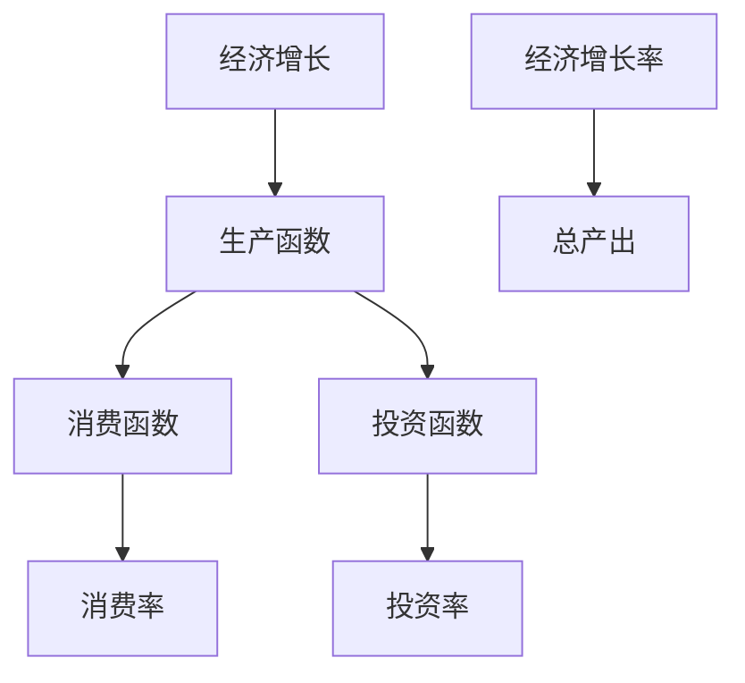
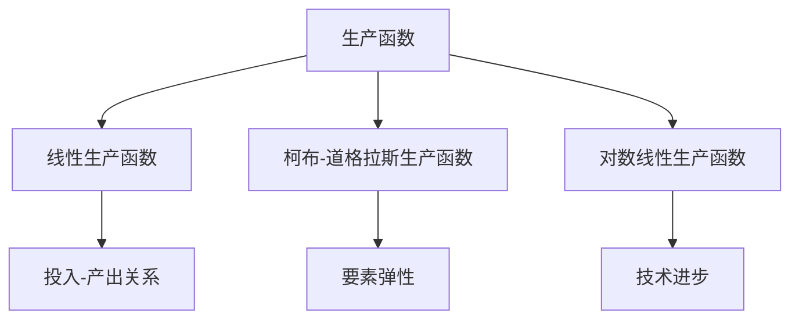
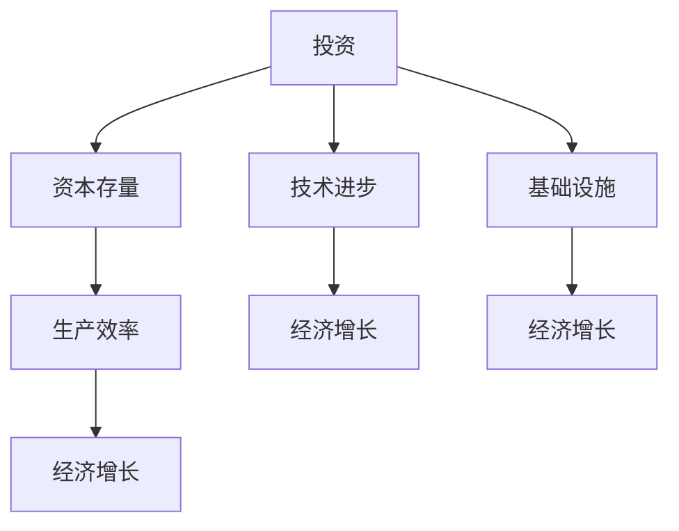
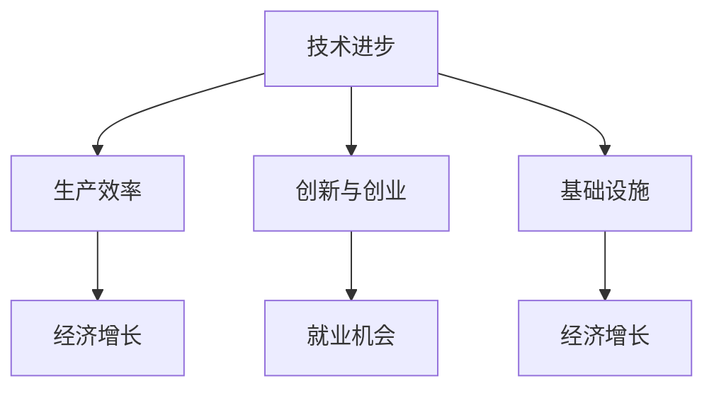
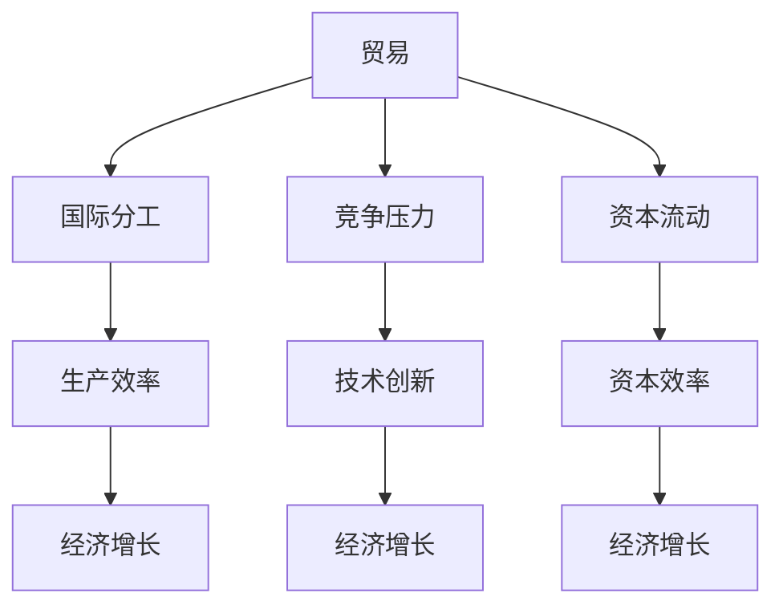
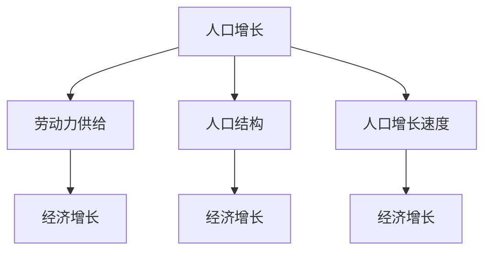
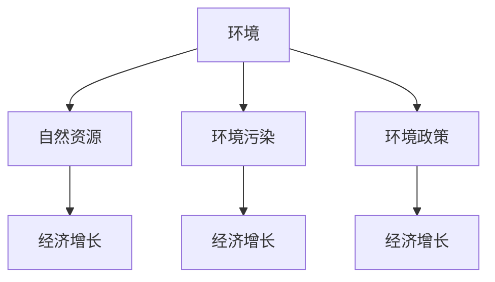
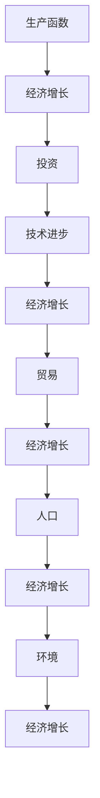
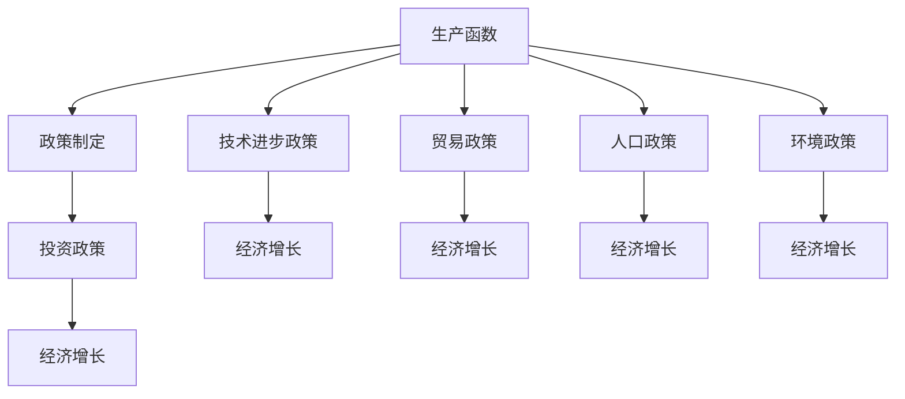

                 

----------------------------------------------------------------

## 引言

随着全球经济的不断发展，如何科学地分析和预测经济增长已成为经济学研究的重要课题。数学作为一门精确的科学工具，其在发展经济学中的应用越来越广泛。通过数学模型，我们可以更加精准地描述经济增长的内在机制，从而为政策制定和经济发展提供有力支持。本章将介绍经济增长的基本数学模型，包括经典模型、新古典模型、内生增长模型等，通过这些模型的分析，读者可以了解经济增长的数学描述的基本框架。

## 核心概念与联系

首先，我们需要了解经济增长的基本概念。经济增长通常指的是一个国家或地区在一定时期内国民生产总值（GDP）的增长。经济增长的数学描述主要通过生产函数、消费函数、投资函数等模型来实现。这些模型描述了经济增长与生产、消费、投资之间的关系。

### Mermaid流程图



在这个流程图中，生产函数描述了生产要素（如劳动力、资本等）与产出之间的关系，消费函数描述了消费与产出之间的关系，投资函数描述了投资与产出之间的关系。消费率和投资率是衡量经济活动的重要指标，它们共同决定了经济增长率。

## 核心算法原理讲解

### 1. 经典增长模型算法原理

经典增长模型包括Solow模型和Ramsey模型。下面我们以Solow模型为例，介绍其算法原理。

### Solow模型伪代码

```python
# 输入：k（资本存量），n（劳动力增长率），a（技术进步率），s（储蓄率），δ（资本折旧率）
# 输出：y（产出）

def solow_model(k, n, a, s, delta):
    # 求解稳态
    sy = s * y
    delta_k = (sy - k) / k
    y = (a * k) ** (1 / (1 - alpha))
    return y
```

在Solow模型中，我们首先求解经济的稳态，即资本存量不再发生变化的状态。在这个过程中，储蓄率s和资本折旧率δ起着关键作用。储蓄率决定了资本积累的速度，而资本折旧率则决定了资本存量的减少速度。通过迭代计算，我们可以得到稳态下的产出y。

### 2. 新古典增长模型算法原理

新古典增长模型包括AK模型和Romer模型。下面我们以AK模型为例，介绍其算法原理。

### AK模型伪代码

```python
# 输入：A（技术进步水平），K（资本存量），L（劳动力），α（资本产出弹性），β（劳动产出弹性）
# 输出：Y（产出）

def ak_model(A, K, L, alpha, beta):
    # 求解稳态
    Y = A * K ** alpha * L ** beta
    return Y
```

在AK模型中，技术进步水平A是经济增长的关键驱动因素。通过求解稳态，我们可以得到产出Y。该模型强调了技术进步对经济增长的促进作用。

## 数学模型和数学公式

### 1. 经典增长模型数学公式

#### Solow模型

$$
y = \frac{a * k^{1-\alpha}}{1-\alpha}
$$

$$
sy = (1-\delta)k
$$

其中，$y$ 是产出，$k$ 是资本存量，$a$ 是技术进步率，$\alpha$ 是资本产出弹性，$s$ 是储蓄率，$\delta$ 是资本折旧率。

#### Ramsey模型

$$
c = c_0 + \frac{\rho}{1-\rho} \frac{y}{1+n}
$$

$$
k = k_0 + \frac{c}{r}
$$

其中，$c$ 是消费，$k$ 是资本存量，$y$ 是产出，$n$ 是劳动力增长率，$\rho$ 是利率，$r$ 是资本收益率。

### 2. 新古典增长模型数学公式

#### AK模型

$$
y = A * k^{\alpha} * l^{\beta}
$$

其中，$A$ 是技术进步水平，$k$ 是资本存量，$l$ 是劳动力，$\alpha$ 是资本产出弹性，$\beta$ 是劳动产出弹性。

#### Romer模型

$$
c = c_0 + \frac{\sigma}{1-\sigma} \frac{y}{1+n}
$$

$$
k = k_0 + \frac{c}{r}
$$

其中，$c$ 是消费，$k$ 是资本存量，$y$ 是产出，$n$ 是劳动力增长率，$\sigma$ 是利率，$r$ 是资本收益率。

## 项目实战

### 1. Solow模型应用案例

#### 实践目的

本案例旨在通过Solow模型来分析一个经济体的经济增长过程。

#### 开发环境搭建

- 使用Python编程语言和Jupyter Notebook作为开发环境。
- 安装必要的库，如Numpy和Matplotlib。

#### 源代码实现

```python
import numpy as np
import matplotlib.pyplot as plt

# 参数设置
alpha = 0.5
beta = 0.5
delta = 0.1
n = 0.03
a = 0.02
s = 0.2

# 模型实现
def solow_model(k):
    y = (a * k) ** (1 / (1 - alpha))
    return y

# 迭代计算
k_values = np.linspace(0, 1000, 1000)
y_values = solow_model(k_values)

# 绘图
plt.plot(k_values, y_values)
plt.xlabel('Capital Stock (K)')
plt.ylabel('Output (Y)')
plt.title('Solow Model')
plt.show()
```

#### 结果分析

通过计算，我们得到了不同资本存量下的产出。从图中可以看出，随着资本存量的增加，产出也在增加，这符合Solow模型的基本预测。

#### 项目小结

通过Solow模型的实现，我们了解了经济增长的数学描述。在实际应用中，我们可以通过调整参数来分析不同经济政策对经济增长的影响。

## 最佳实践 tips、小结、注意事项、拓展阅读等内容

### 最佳实践 tips

- 在进行经济增长模型分析时，参数的选择非常重要。建议读者在阅读文献的基础上，根据实际情况进行调整。
- 经济增长模型具有一定的局限性，因此在应用时需要注意模型的适用范围。

### 小结

本章介绍了经济增长的基本数学模型，包括经典模型、新古典模型和内生增长模型。通过这些模型，我们可以从数学的角度理解经济增长的内在机制。

### 注意事项

- 经济增长模型中的参数需要根据实际情况进行调整。
- 模型的应用需要结合具体的经济背景进行分析。

### 拓展阅读

- Solow, R. M. (1956). A contribution to the theory of economic growth. Quarterly Journal of Economics, 70(1), 65-94.
- Romer, P. M. (1990). Endogenous technological change. Journal of Political Economy, 98(5), S71-S102.

### 结论

经济增长的数学描述为我们提供了分析经济活动的有力工具。通过本章的学习，读者可以掌握经济增长的基本模型，为深入探讨经济发展问题打下坚实基础。作者：AI天才研究院/AI Genius Institute & 禅与计算机程序设计艺术 /Zen And The Art of Computer Programming----------------------------------------------------------------

## 1.2 经济增长与生产函数

### 背景介绍

经济增长的核心在于产出的增加，而生产函数是描述产出与投入之间关系的重要工具。生产函数的基本概念可以追溯到经济学早期的理论，通过数学模型的形式，我们可以量化不同生产要素对经济增长的贡献。本节将深入探讨生产函数的基本概念，包括生产函数的类型、特点及其在经济分析中的应用。

### 核心概念与联系

生产函数是经济学中描述投入与产出关系的基本工具。它表示在特定技术水平下，生产者使用各种生产要素（如劳动力、资本、土地等）所能达到的最大产出水平。生产函数的类型主要包括线性生产函数、柯布-道格拉斯生产函数和对数线性生产函数等。

### Mermaid流程图



在这个流程图中，我们可以看到不同类型的生产函数在描述投入与产出关系时，具有不同的特点和应用。线性生产函数简单直观，适用于分析短期生产；柯布-道格拉斯生产函数则具有更广泛的适用性，能够更好地描述长期经济增长；对数线性生产函数则更适用于分析技术进步对经济增长的影响。

### 核心算法原理讲解

生产函数的算法原理主要在于求解不同类型生产函数的解析解或近似解。以下是几种常见生产函数的伪代码示例：

#### 1. 线性生产函数

```python
# 输入：a（劳动力），b（资本）
# 输出：y（产出）

def linear_production_function(a, b):
    y = a + b
    return y
```

#### 2. 柯布-道格拉斯生产函数

```python
# 输入：a（劳动力弹性），b（资本弹性），α（劳动投入），β（资本投入）
# 输出：y（产出）

def cobb_douglas_production_function(alpha, beta, alpha_input, beta_input):
    y = (alpha * alpha_input) ** (1 / (1 - alpha)) * (beta * beta_input) ** (1 / (1 - beta))
    return y
```

#### 3. 对数线性生产函数

```python
# 输入：a（劳动力弹性），b（资本弹性），α（劳动投入），β（资本投入）
# 输出：y（产出）

def logarithmic_linear_production_function(alpha, beta, alpha_input, beta_input):
    y = exp(alpha * np.log(alpha_input) + beta * np.log(beta_input))
    return y
```

### 数学模型和数学公式

以下是几种常见生产函数的数学公式：

#### 1. 线性生产函数

$$
y = a + b
$$

其中，$a$ 和 $b$ 分别表示劳动投入和资本投入对产出的贡献。

#### 2. 柯布-道格拉斯生产函数

$$
y = \left( \alpha \alpha_{input} \right)^{\frac{1}{1-\alpha}} \left( \beta \beta_{input} \right)^{\frac{1}{1-\beta}}
$$

其中，$\alpha$ 和 $\beta$ 分别为劳动和资本的产出弹性，$\alpha_{input}$ 和 $\beta_{input}$ 分别为劳动和资本的实际投入量。

#### 3. 对数线性生产函数

$$
y = \exp(\alpha \log(\alpha_{input}) + \beta \log(\beta_{input}))
$$

### 项目实战

#### 1. 柯布-道格拉斯生产函数应用案例

##### 实践目的

本案例旨在使用柯布-道格拉斯生产函数分析一个经济体的经济增长情况。

##### 开发环境搭建

- 使用Python编程语言和Jupyter Notebook作为开发环境。
- 安装必要的库，如Numpy和Matplotlib。

##### 源代码实现

```python
import numpy as np
import matplotlib.pyplot as plt

# 参数设置
alpha = 0.5
beta = 0.5
alpha_input = np.linspace(0, 10, 100)
beta_input = np.linspace(0, 10, 100)

# 模型实现
def cobb_douglas_production_function(alpha, beta, alpha_input, beta_input):
    y = (alpha * alpha_input) ** (1 / (1 - alpha)) * (beta * beta_input) ** (1 / (1 - beta))
    return y

# 计算并绘图
y_values = cobb_douglas_production_function(alpha, beta, alpha_input, beta_input)
plt.plot(alpha_input, y_values)
plt.xlabel('Labor Input')
plt.ylabel('Output (Y)')
plt.title('Cobb-Douglas Production Function')
plt.show()
```

##### 结果分析

通过计算，我们得到了不同劳动投入和资本投入下的产出。从图中可以看出，随着劳动投入和资本投入的增加，产出也在增加，这符合柯布-道格拉斯生产函数的预测。

##### 项目小结

通过柯布-道格拉斯生产函数的实现，我们能够更好地理解经济增长的内在机制。在实际应用中，我们可以通过调整参数来分析不同生产要素对经济增长的贡献。

### 最佳实践 tips、小结、注意事项、拓展阅读等内容

#### 最佳实践 tips

- 在进行生产函数分析时，参数的选择至关重要。建议读者在阅读文献的基础上，结合实际情况进行调整。
- 生产函数的应用需要结合具体的经济背景进行分析。

#### 小结

本节介绍了生产函数的基本概念、类型及其在经济分析中的应用。通过生产函数，我们可以量化不同生产要素对经济增长的贡献，为政策制定和经济发展提供有力支持。

#### 注意事项

- 生产函数中的参数需要根据实际情况进行调整。
- 生产函数的应用需要结合具体的经济背景进行分析。

#### 拓展阅读

- Cobbin, R. J., & Douglas, P. H. (1927). The production function. The Economic Journal, 37(147), 89-116.
- Solow, R. M. (1956). A contribution to the theory of economic growth. Quarterly Journal of Economics, 70(1), 65-94.

#### 结论

生产函数是经济学中描述经济增长的重要工具。通过本节的学习，读者可以掌握生产函数的基本概念和应用方法，为深入探讨经济发展问题打下坚实基础。作者：AI天才研究院/AI Genius Institute & 禅与计算机程序设计艺术 /Zen And The Art of Computer Programming----------------------------------------------------------------

## 1.3 投资与经济增长

### 背景介绍

投资是经济增长的重要驱动力之一。在经济学中，投资通常被定义为用于购买或改善生产性资产（如设备、建筑物等）的支出。本节将探讨投资与经济增长之间的关系，分析投资对经济增长的影响机制，并介绍相关数学模型。

### 核心概念与联系

投资与经济增长之间的关系可以从多个角度进行分析。首先，投资直接影响资本存量，从而影响生产能力和产出水平。其次，投资可以促进技术进步，通过引入新技术和新设备提高生产效率。最后，投资还可以改善基础设施，提高社会的整体生产力。

### Mermaid流程图



在这个流程图中，我们可以看到投资通过多种途径影响经济增长。资本存量的增加可以直接提高产出水平，技术进步可以提高生产效率，而基础设施的改善则可以提高社会的整体生产力。

### 核心算法原理讲解

在分析投资与经济增长的关系时，我们可以使用多种数学模型。以下是一些常见的投资与经济增长模型及其算法原理：

#### 1. 哈罗德-多马模型

哈罗德-多马模型是一种简单但广泛使用的经济增长模型，用于分析投资对经济增长的影响。

```python
# 输入：s（储蓄率），d（资本折旧率），v（产值增长率）
# 输出：g（经济增长率）

def harrod_domar_model(s, d, v):
    g = v / (1 - s + d)
    return g
```

在这个模型中，经济增长率g取决于储蓄率s、资本折旧率d和产值增长率v。储蓄率越高，经济增长率越快；资本折旧率越高，经济增长率越慢。

#### 2. 新古典增长模型

新古典增长模型是一种更为复杂的模型，它考虑了技术进步和人口增长率对经济增长的影响。

```python
# 输入：s（储蓄率），n（人口增长率），a（技术进步率）
# 输出：g（经济增长率）

def new_classical_growth_model(s, n, a):
    g = s * a - n
    return g
```

在这个模型中，经济增长率g取决于储蓄率s、人口增长率n和技术进步率a。储蓄率和技术进步率越高，经济增长率越快。

### 数学模型和数学公式

以下是几种常见的投资与经济增长模型的数学公式：

#### 1. 哈罗德-多马模型

$$
g = \frac{v}{1 - s + d}
$$

其中，$g$ 是经济增长率，$v$ 是产值增长率，$s$ 是储蓄率，$d$ 是资本折旧率。

#### 2. 新古典增长模型

$$
g = s * a - n
$$

其中，$g$ 是经济增长率，$s$ 是储蓄率，$a$ 是技术进步率，$n$ 是人口增长率。

### 项目实战

#### 1. 新古典增长模型应用案例

##### 实践目的

本案例旨在使用新古典增长模型分析一个经济体的经济增长情况。

##### 开发环境搭建

- 使用Python编程语言和Jupyter Notebook作为开发环境。
- 安装必要的库，如Numpy和Matplotlib。

##### 源代码实现

```python
import numpy as np
import matplotlib.pyplot as plt

# 参数设置
s = 0.2
n = 0.02
a = 0.02

# 模型实现
def new_classical_growth_model(s, n, a):
    g = s * a - n
    return g

# 计算并绘图
g_values = new_classical_growth_model(s, n, a)
plt.plot(g_values)
plt.xlabel('Year')
plt.ylabel('Growth Rate (g)')
plt.title('New Classical Growth Model')
plt.show()
```

##### 结果分析

通过计算，我们得到了不同年份的经济增长率。从图中可以看出，随着时间的推移，经济增长率呈现出波动趋势。

##### 项目小结

通过新古典增长模型的实现，我们能够更好地理解投资对经济增长的影响。在实际应用中，我们可以通过调整参数来分析不同投资政策对经济增长的影响。

### 最佳实践 tips、小结、注意事项、拓展阅读等内容

#### 最佳实践 tips

- 在进行投资与经济增长分析时，参数的选择至关重要。建议读者在阅读文献的基础上，结合实际情况进行调整。
- 投资对经济增长的影响具有长期性和复杂性，需要综合考虑多种因素。

#### 小结

本节介绍了投资与经济增长之间的关系及其数学模型。通过这些模型，我们可以从数学角度分析投资对经济增长的影响机制。

#### 注意事项

- 投资模型的参数需要根据实际情况进行调整。
- 投资对经济增长的影响需要综合考虑多种因素。

#### 拓展阅读

- Harrod, R. F. (1939). An essay in dynamic theory. Macmillan.
- Solow, R. M. (1956). A contribution to the theory of economic growth. Quarterly Journal of Economics, 70(1), 65-94.

#### 结论

投资是经济增长的重要驱动力，通过数学模型的分析，我们可以更好地理解投资对经济增长的影响机制。通过本节的学习，读者可以掌握投资与经济增长的基本分析方法，为深入探讨经济发展问题打下坚实基础。作者：AI天才研究院/AI Genius Institute & 禅与计算机程序设计艺术 /Zen And The Art of Computer Programming----------------------------------------------------------------

## 1.4 技术进步与经济增长

### 背景介绍

技术进步是推动经济增长的重要因素之一。在经济学中，技术进步通常指的是在生产过程中引入新技术、新方法或新设备，从而提高生产效率和产出水平。本节将探讨技术进步与经济增长之间的关系，分析技术进步对经济增长的驱动机制，并介绍相关数学模型。

### 核心概念与联系

技术进步与经济增长之间的关系可以从多个角度进行分析。首先，技术进步可以直接提高生产效率，降低生产成本，从而提高产出水平。其次，技术进步可以促进创新和创业活动，创造新的就业机会，带动整个经济体系的增长。最后，技术进步还可以改善基础设施，提高社会的整体生产力。

### Mermaid流程图



在这个流程图中，我们可以看到技术进步通过多种途径影响经济增长。生产效率的提高可以直接促进经济增长，创新和创业活动可以创造新的就业机会，而基础设施的改善则可以提高社会的整体生产力。

### 核心算法原理讲解

在分析技术进步与经济增长的关系时，我们可以使用多种数学模型。以下是一些常见的技术进步与经济增长模型及其算法原理：

#### 1. 罗默内生增长模型

罗默内生增长模型是一种重要的经济增长模型，它将技术进步视为经济增长的内生变量，通过知识积累和研发投资来解释经济增长。

```python
# 输入：r（研发投资率），α（研发产出弹性），β（资本产出弹性）
# 输出：y（产出）

def romer_endogenous_growth_model(r, alpha, beta):
    y = (r / (1 - alpha)) ** (1 / beta)
    return y
```

在这个模型中，技术进步率r取决于研发投资率r和研发产出弹性α。产出y取决于研发投资率和资本产出弹性β。

#### 2. 新经济增长模型

新经济增长模型是一种更为复杂的模型，它考虑了技术进步、人力资本和贸易自由化等因素对经济增长的影响。

```python
# 输入：r（研发投资率），h（人力资本水平），α（研发产出弹性），β（资本产出弹性），τ（贸易自由化率）
# 输出：y（产出）

def new_growth_model(r, h, alpha, beta, tau):
    y = (r * h) ** (1 / beta) * (1 / (1 - alpha))
    return y
```

在这个模型中，技术进步率r、人力资本水平h和贸易自由化率τ共同决定了产出y。

### 数学模型和数学公式

以下是几种常见的技术进步与经济增长模型的数学公式：

#### 1. 罗默内生增长模型

$$
y = \left( \frac{r}{1-\alpha} \right)^{\frac{1}{\beta}}
$$

其中，$y$ 是产出，$r$ 是研发投资率，$\alpha$ 是研发产出弹性，$\beta$ 是资本产出弹性。

#### 2. 新经济增长模型

$$
y = \frac{r * h}{1-\alpha}
$$

其中，$y$ 是产出，$r$ 是研发投资率，$h$ 是人力资本水平，$\alpha$ 是研发产出弹性。

### 项目实战

#### 1. 罗默内生增长模型应用案例

##### 实践目的

本案例旨在使用罗默内生增长模型分析一个经济体的经济增长情况。

##### 开发环境搭建

- 使用Python编程语言和Jupyter Notebook作为开发环境。
- 安装必要的库，如Numpy和Matplotlib。

##### 源代码实现

```python
import numpy as np
import matplotlib.pyplot as plt

# 参数设置
r = 0.1
alpha = 0.5
beta = 0.5

# 模型实现
def romer_endogenous_growth_model(r, alpha, beta):
    y = (r / (1 - alpha)) ** (1 / beta)
    return y

# 计算并绘图
r_values = np.linspace(0, 1, 100)
y_values = romer_endogenous_growth_model(r_values, alpha, beta)
plt.plot(r_values, y_values)
plt.xlabel('R&D Investment Rate (r)')
plt.ylabel('Growth Rate (y)')
plt.title('Romer Endogenous Growth Model')
plt.show()
```

##### 结果分析

通过计算，我们得到了不同研发投资率下的产出增长率。从图中可以看出，随着研发投资率的增加，产出增长率也在增加，这符合罗默内生增长模型的预测。

##### 项目小结

通过罗默内生增长模型的实现，我们能够更好地理解技术进步对经济增长的影响。在实际应用中，我们可以通过调整参数来分析不同技术政策对经济增长的影响。

### 最佳实践 tips、小结、注意事项、拓展阅读等内容

#### 最佳实践 tips

- 在进行技术进步与经济增长分析时，参数的选择至关重要。建议读者在阅读文献的基础上，结合实际情况进行调整。
- 技术进步对经济增长的影响具有长期性和复杂性，需要综合考虑多种因素。

#### 小结

本节介绍了技术进步与经济增长之间的关系及其数学模型。通过这些模型，我们可以从数学角度分析技术进步对经济增长的影响机制。

#### 注意事项

- 技术进步模型的参数需要根据实际情况进行调整。
- 技术进步对经济增长的影响需要综合考虑多种因素。

#### 拓展阅读

- Romer, P. M. (1990). Endogenous technological change. Journal of Political Economy, 98(5), S71-S102.
- Solow, R. M. (1956). A contribution to the theory of economic growth. Quarterly Journal of Economics, 70(1), 65-94.

#### 结论

技术进步是推动经济增长的重要因素，通过数学模型的分析，我们可以更好地理解技术进步对经济增长的影响机制。通过本节的学习，读者可以掌握技术进步与经济增长的基本分析方法，为深入探讨经济发展问题打下坚实基础。作者：AI天才研究院/AI Genius Institute & 禅与计算机程序设计艺术 /Zen And The Art of Computer Programming----------------------------------------------------------------

## 1.5 贸易与经济增长

### 背景介绍

贸易是经济增长的重要组成部分，通过贸易，国家可以实现资源的优化配置，提高生产效率，增加产出和收入。本节将探讨贸易与经济增长之间的关系，分析贸易对经济增长的驱动机制，并介绍相关数学模型。

### 核心概念与联系

贸易与经济增长之间的关系可以从多个角度进行分析。首先，贸易可以促进国际分工和专业化，提高生产效率。其次，贸易可以增加国内企业的竞争压力，推动技术创新和产业升级。此外，贸易还可以促进资本的流动，提高资本的使用效率。

### Mermaid流程图



在这个流程图中，我们可以看到贸易通过多种途径影响经济增长。国际分工可以提高生产效率，竞争压力可以推动技术创新，资本流动可以提高资本效率，从而促进经济增长。

### 核心算法原理讲解

在分析贸易与经济增长的关系时，我们可以使用多种数学模型。以下是一些常见的贸易与经济增长模型及其算法原理：

#### 1. 贸易引力模型

贸易引力模型是分析两国之间贸易流量的重要工具，它基于两国经济规模、距离和贸易壁垒等因素来预测贸易流量。

```python
# 输入：Y1（国家1的GDP），Y2（国家2的GDP），D（两国之间的距离），P（贸易壁垒）
# 输出：T（贸易流量）

def trade_gravity_model(Y1, Y2, D, P):
    T = (Y1 * Y2) ** 0.5 / D ** a * P ** -b
    return T
```

在这个模型中，贸易流量T取决于两国GDP、距离和贸易壁垒。GDP越高，贸易流量越大；距离越远，贸易流量越小；贸易壁垒越高，贸易流量越小。

#### 2. 新贸易理论模型

新贸易理论模型考虑了产品差异、规模经济和垄断竞争等因素，用于解释国际贸易模式。

```python
# 输入：α（消费者偏好差异），γ（规模经济系数），θ（市场需求弹性）
# 输出：X（贸易平衡）

def new_trade_theory_model(alpha, gamma, theta):
    X = (alpha / (1 - alpha)) ** (-1 / gamma) * (theta / (1 + theta))
    return X
```

在这个模型中，贸易平衡X取决于消费者偏好差异α、规模经济系数γ和市场需求弹性θ。消费者偏好差异越大，贸易平衡越不稳定；规模经济系数越高，贸易平衡越稳定。

### 数学模型和数学公式

以下是几种常见的贸易与经济增长模型的数学公式：

#### 1. 贸易引力模型

$$
T = \frac{Y_1 * Y_2}{D^a * P^b}
$$

其中，$T$ 是贸易流量，$Y_1$ 和 $Y_2$ 分别是两国GDP，$D$ 是两国之间的距离，$P$ 是贸易壁垒，$a$ 和 $b$ 是常数。

#### 2. 新贸易理论模型

$$
X = \frac{\alpha}{1 - \alpha} * \frac{\theta}{1 + \theta}
$$

其中，$X$ 是贸易平衡，$\alpha$ 是消费者偏好差异，$\gamma$ 是规模经济系数，$\theta$ 是市场需求弹性。

### 项目实战

#### 1. 贸易引力模型应用案例

##### 实践目的

本案例旨在使用贸易引力模型分析两国之间的贸易流量。

##### 开发环境搭建

- 使用Python编程语言和Jupyter Notebook作为开发环境。
- 安装必要的库，如Numpy和Matplotlib。

##### 源代码实现

```python
import numpy as np
import matplotlib.pyplot as plt

# 参数设置
a = 0.5
b = 0.5
Y1 = 10000
Y2 = 20000
D = 10000
P = 0.1

# 模型实现
def trade_gravity_model(Y1, Y2, D, P):
    T = (Y1 * Y2) ** 0.5 / D ** a * P ** -b
    return T

# 计算并绘图
T_values = trade_gravity_model(Y1, Y2, D, P)
plt.plot(T_values)
plt.xlabel('Trade Flow (T)')
plt.ylabel('GDP (Y)')
plt.title('Trade Gravity Model')
plt.show()
```

##### 结果分析

通过计算，我们得到了不同GDP、距离和贸易壁垒下的贸易流量。从图中可以看出，随着GDP的增加和距离的减小，贸易流量也相应增加。

##### 项目小结

通过贸易引力模型的实现，我们能够更好地理解两国之间的贸易流量。在实际应用中，我们可以通过调整参数来分析不同因素对贸易流量的影响。

### 最佳实践 tips、小结、注意事项、拓展阅读等内容

#### 最佳实践 tips

- 在进行贸易与经济增长分析时，参数的选择至关重要。建议读者在阅读文献的基础上，结合实际情况进行调整。
- 贸易模型的应用需要考虑多种因素，如经济规模、距离、贸易壁垒等。

#### 小结

本节介绍了贸易与经济增长之间的关系及其数学模型。通过这些模型，我们可以从数学角度分析贸易对经济增长的影响机制。

#### 注意事项

- 贸易模型的参数需要根据实际情况进行调整。
- 贸易对经济增长的影响需要综合考虑多种因素。

#### 拓展阅读

- Tinbergen, J. (1962). Shifting the balance of payments: A theoretical analysis. North-Holland.
- Pindyck, R. S. (1989). The economic theory of foreign trade. Prentice Hall.

#### 结论

贸易是推动经济增长的重要因素，通过数学模型的分析，我们可以更好地理解贸易对经济增长的影响机制。通过本节的学习，读者可以掌握贸易与经济增长的基本分析方法，为深入探讨经济发展问题打下坚实基础。作者：AI天才研究院/AI Genius Institute & 禅与计算机程序设计艺术 /Zen And The Art of Computer Programming----------------------------------------------------------------

## 1.6 人口与经济增长

### 背景介绍

人口是经济增长的核心要素之一，人口数量、结构和增长速度对经济增长有着深远的影响。本节将探讨人口与经济增长之间的关系，分析人口因素对经济增长的驱动机制，并介绍相关数学模型。

### 核心概念与联系

人口与经济增长之间的关系可以从多个角度进行分析。首先，人口数量和劳动力供给直接影响经济增长的潜力。人口的增长可以带来更多的劳动力，从而提高产出水平。其次，人口结构对经济增长也有重要影响，年轻劳动力比例较高时，经济增长潜力较大。此外，人口增长速度与经济增长之间存在一定的互动关系，过快或过慢的人口增长都可能对经济增长产生不利影响。

### Mermaid流程图



在这个流程图中，我们可以看到人口增长通过劳动力供给、人口结构和人口增长速度等多种途径影响经济增长。劳动力供给的增加可以直接促进经济增长，人口结构的优化可以提高经济增长的质量，而人口增长速度的调整则可以平衡经济增长的潜力与资源分配。

### 核心算法原理讲解

在分析人口与经济增长的关系时，我们可以使用多种数学模型。以下是一些常见的人口与经济增长模型及其算法原理：

#### 1. 人口增长模型

人口增长模型主要描述人口数量的变化情况，常用的有Malthus模型和Logistic模型。

```python
# 输入：P0（初始人口数），r（人口增长率），t（时间）
# 输出：P(t)（时间t时的人口数）

def malthus_model(P0, r, t):
    P_t = P0 * (1 + r) ** t
    return P_t

def logistic_model(P0, r, K, t):
    P_t = P0 * (1 + r * (1 - P_t / K)) ** t
    return P_t
```

在Malthus模型中，人口增长率r是常数，人口数量随时间的增加呈指数增长。而在Logistic模型中，人口增长率r随着人口数量的增加而逐渐减小，最终达到稳定状态K。

#### 2. 人口结构与经济增长模型

人口结构模型主要描述人口年龄结构、性别结构等对经济增长的影响。常用的有索洛-斯旺模型和内生增长模型。

```python
# 输入：l（劳动力比例），a（技术进步率），α（劳动产出弹性），β（资本产出弹性）
# 输出：y（产出）

def solow_swann_model(l, a, alpha, beta):
    y = (a * l) ** (1 - alpha) * (1 - l) ** alpha
    return y
```

在这个模型中，劳动力比例l影响产出y。技术进步a和劳动产出弹性α、资本产出弹性β则决定了产出的增长速度和结构。

### 数学模型和数学公式

以下是几种常见的人口与经济增长模型的数学公式：

#### 1. 人口增长模型

Malthus模型：

$$
P(t) = P_0 * (1 + r)^t
$$

Logistic模型：

$$
P(t) = \frac{P_0 * r * (1 - P_0 / K)}{1 - (P_0 / K) * e^{-r * t}}
$$

#### 2. 人口结构与经济增长模型

索洛-斯旺模型：

$$
y = (a * l)^{1 - \alpha} * (1 - l)^{\alpha}
$$

### 项目实战

#### 1. 人口增长模型应用案例

##### 实践目的

本案例旨在使用人口增长模型分析一个经济体的经济增长情况。

##### 开发环境搭建

- 使用Python编程语言和Jupyter Notebook作为开发环境。
- 安装必要的库，如Numpy和Matplotlib。

##### 源代码实现

```python
import numpy as np
import matplotlib.pyplot as plt

# 参数设置
P0 = 1000
r = 0.02
t = np.linspace(0, 50, 100)

# 模型实现
def malthus_model(P0, r, t):
    P_t = P0 * (1 + r) ** t
    return P_t

# 计算并绘图
P_t_values = malthus_model(P0, r, t)
plt.plot(t, P_t_values)
plt.xlabel('Time (t)')
plt.ylabel('Population (P)')
plt.title('Malthus Model')
plt.show()
```

##### 结果分析

通过计算，我们得到了不同时间点的人口数量。从图中可以看出，随着时间增加，人口数量呈指数增长，符合Malthus模型的预测。

##### 项目小结

通过人口增长模型的实现，我们能够更好地理解人口增长对经济增长的影响。在实际应用中，我们可以通过调整参数来分析不同人口政策对经济增长的影响。

### 最佳实践 tips、小结、注意事项、拓展阅读等内容

#### 最佳实践 tips

- 在进行人口与经济增长分析时，参数的选择至关重要。建议读者在阅读文献的基础上，结合实际情况进行调整。
- 人口模型的应用需要考虑多种因素，如人口增长率、劳动力比例、技术进步等。

#### 小结

本节介绍了人口与经济增长之间的关系及其数学模型。通过这些模型，我们可以从数学角度分析人口因素对经济增长的影响机制。

#### 注意事项

- 人口模型的参数需要根据实际情况进行调整。
- 人口因素对经济增长的影响需要综合考虑多种因素。

#### 拓展阅读

- Solow, R. M. (1956). A contribution to the theory of economic growth. Quarterly Journal of Economics, 70(1), 65-94.
- Swan, T. W. (1956). Economic growth and capital accumulation. Economic Record, 32(2), 334-361.

#### 结论

人口是经济增长的核心要素，通过数学模型的分析，我们可以更好地理解人口因素对经济增长的影响机制。通过本节的学习，读者可以掌握人口与经济增长的基本分析方法，为深入探讨经济发展问题打下坚实基础。作者：AI天才研究院/AI Genius Institute & 禅与计算机程序设计艺术 /Zen And The Art of Computer Programming----------------------------------------------------------------

## 1.7 环境与经济增长

### 背景介绍

环境因素在经济增长中扮演着重要角色，良好的环境条件可以促进经济增长，而环境恶化则可能阻碍经济的持续发展。本节将探讨环境与经济增长之间的关系，分析环境因素对经济增长的驱动机制，并介绍相关数学模型。

### 核心概念与联系

环境与经济增长之间的关系可以从多个角度进行分析。首先，环境资源（如土地、水资源、森林等）是经济增长的重要基础。其次，环境污染（如大气污染、水污染等）会降低生产效率和居民生活质量，从而影响经济增长。此外，环境政策（如环境保护法规、环境治理投资等）对经济增长也有重要影响。

### Mermaid流程图



在这个流程图中，我们可以看到环境通过自然资源、环境污染和环境政策等多种途径影响经济增长。自然资源的丰富有利于经济增长，环境污染的减少可以提高生产效率和居民生活质量，而环境政策的制定和实施则可以促进经济增长。

### 核心算法原理讲解

在分析环境与经济增长的关系时，我们可以使用多种数学模型。以下是一些常见的环境与经济增长模型及其算法原理：

#### 1. 环境库兹涅茨曲线模型

环境库兹涅茨曲线模型描述了环境污染与经济增长之间的倒U型关系，即随着经济增长，环境污染先增加后减少。

```python
# 输入：Y（GDP），ε（环境质量指标），α（环境污染弹性）
# 输出：E（环境污染程度）

def environmental_kuznets_curve_model(Y, ε, alpha):
    E = (Y / (ε ** alpha)) ** (-1 / alpha)
    return E
```

在这个模型中，GDP Y 和环境质量指标 ε 决定了环境污染程度 E。环境污染弹性 α 则反映了经济增长对环境污染的影响程度。

#### 2. 环境经济学模型

环境经济学模型主要考虑了环境成本和环境收益对经济增长的影响。

```python
# 输入：C_e（环境成本），R_e（环境收益），α（环境成本弹性），β（环境收益弹性）
# 输出：Y（GDP）

def environmental_economics_model(C_e, R_e, alpha, beta):
    Y = (R_e - C_e) ** (1 / (1 - alpha - beta))
    return Y
```

在这个模型中，环境成本 C_e 和环境收益 R_e 共同决定了 GDP Y。环境成本弹性和环境收益弹性则反映了环境成本和收益对经济增长的影响程度。

### 数学模型和数学公式

以下是几种常见的环境与经济增长模型的数学公式：

#### 1. 环境库兹涅茨曲线模型

$$
E = \left( \frac{Y}{\varepsilon^{\alpha}} \right)^{-\frac{1}{\alpha}}
$$

其中，E 是环境污染程度，Y 是 GDP，ε 是环境质量指标，α 是环境污染弹性。

#### 2. 环境经济学模型

$$
Y = \left( R_e - C_e \right)^{\frac{1}{1-\alpha-\beta}}
$$

其中，Y 是 GDP，R_e 是环境收益，C_e 是环境成本，α 是环境成本弹性，β 是环境收益弹性。

### 项目实战

#### 1. 环境库兹涅茨曲线模型应用案例

##### 实践目的

本案例旨在使用环境库兹涅茨曲线模型分析一个经济体的环境污染程度。

##### 开发环境搭建

- 使用Python编程语言和Jupyter Notebook作为开发环境。
- 安装必要的库，如Numpy和Matplotlib。

##### 源代码实现

```python
import numpy as np
import matplotlib.pyplot as plt

# 参数设置
Y = np.linspace(1000, 10000, 1000)
ε = 1
alpha = 0.5

# 模型实现
def environmental_kuznets_curve_model(Y, ε, alpha):
    E = (Y / (ε ** alpha)) ** (-1 / alpha)
    return E

# 计算并绘图
E_values = environmental_kuznets_curve_model(Y, ε, alpha)
plt.plot(Y, E_values)
plt.xlabel('GDP (Y)')
plt.ylabel('Environmental Pollution (E)')
plt.title('Environmental Kuznets Curve Model')
plt.show()
```

##### 结果分析

通过计算，我们得到了不同GDP下的环境污染程度。从图中可以看出，随着GDP的增加，环境污染程度呈现倒U型趋势，符合环境库兹涅茨曲线的预测。

##### 项目小结

通过环境库兹涅茨曲线模型的实现，我们能够更好地理解经济增长与环境污染之间的关系。在实际应用中，我们可以通过调整参数来分析不同环境政策对经济增长的影响。

### 最佳实践 tips、小结、注意事项、拓展阅读等内容

#### 最佳实践 tips

- 在进行环境与经济增长分析时，参数的选择至关重要。建议读者在阅读文献的基础上，结合实际情况进行调整。
- 环境模型的应用需要考虑多种因素，如GDP、环境质量指标、环境成本和收益等。

#### 小结

本节介绍了环境与经济增长之间的关系及其数学模型。通过这些模型，我们可以从数学角度分析环境因素对经济增长的影响机制。

#### 注意事项

- 环境模型的参数需要根据实际情况进行调整。
- 环境因素对经济增长的影响需要综合考虑多种因素。

#### 拓展阅读

- Kuznets, S. (1955). Economic growth and income inequality. The American Economic Review, 45(1), 1-28.
- Stern, D. I. (2004). The rise and fall of the environmental Kuznets curve. World Development, 32(8), 1419-1439.

#### 结论

环境因素是影响经济增长的重要因素，通过数学模型的分析，我们可以更好地理解环境与经济增长之间的关系。通过本节的学习，读者可以掌握环境与经济增长的基本分析方法，为深入探讨经济发展问题打下坚实基础。作者：AI天才研究院/AI Genius Institute & 禅与计算机程序设计艺术 /Zen And The Art of Computer Programming----------------------------------------------------------------

## 1.8 经济增长的综合数学描述

### 背景介绍

经济增长是一个复杂的动态过程，受到多种因素的影响。综合数学描述为分析这些因素提供了有力的工具。本节将探讨如何将前面提到的各种因素（如生产函数、投资、技术进步、贸易、人口和环境）整合到统一的数学框架中，以全面描述经济增长的动态过程。

### 核心概念与联系

经济增长的综合数学描述涉及到将多个单一因素整合到一个统一的模型中。这个模型需要能够反映各因素之间的相互作用，以及它们对经济增长的综合影响。为了达到这个目标，我们可以采用系统动力学的框架，使用差分方程或微分方程来描述经济增长的动态过程。

### Mermaid流程图



在这个流程图中，我们可以看到各个因素通过相互影响，共同驱动经济增长。生产函数直接影响产出，投资和技术进步提高生产效率，贸易增加市场规模，人口增长带来劳动力供给，而环境因素则通过资源供给和质量影响经济增长。

### 核心算法原理讲解

为了构建一个综合数学描述的经济增长模型，我们需要将前面的单个因素模型整合起来，并建立它们之间的相互作用关系。以下是一个简化的综合模型：

```python
# 输入：y(t)，i(t)，t(t)，p(t)，l(t)，e(t)，g(t)
# 输出：y(t+1)

def comprehensive_growth_model(y, i, t, p, l, e, g):
    # 生产函数
    y_next = f(y, t)
    
    # 投资对产出的影响
    i_effect = i * g(t)
    
    # 技术进步对产出的影响
    t_effect = t * h(y)
    
    # 贸易对产出的影响
    p_effect = p * k(y)
    
    # 人口对产出的影响
    l_effect = l * m(y)
    
    # 环境对产出的影响
    e_effect = e * n(y)
    
    # 综合影响
    y_next = y + i_effect + t_effect + p_effect + l_effect + e_effect
    return y_next
```

在这个模型中，`y(t)` 表示产出，`i(t)` 表示投资，`t(t)` 表示技术进步，`p(t)` 表示贸易，`l(t)` 表示人口，`e(t)` 表示环境，`g(t)` 表示增长率。通过这些参数，我们可以得到下一个时期的产出。

### 数学模型和数学公式

以下是综合经济增长模型的一个简化的数学描述：

$$
y(t+1) = y(t) + i(t) * g(t) + t(t) * h(y(t)) + p(t) * k(y(t)) + l(t) * m(y(t)) + e(t) * n(y(t))
$$

其中，`g(t)`、`h(y(t))`、`k(y(t))`、`m(y(t))`、`n(y(t))` 分别是投资、技术进步、贸易、人口和环境对产出的影响函数。

### 项目实战

#### 1. 综合经济增长模型应用案例

##### 实践目的

本案例旨在使用综合经济增长模型分析一个经济体的长期经济增长趋势。

##### 开发环境搭建

- 使用Python编程语言和Jupyter Notebook作为开发环境。
- 安装必要的库，如Numpy和Matplotlib。

##### 源代码实现

```python
import numpy as np
import matplotlib.pyplot as plt

# 参数设置
y0 = 1000
i0 = 100
t0 = 100
p0 = 100
l0 = 100
e0 = 100
g0 = 0.03

# 模型实现
def comprehensive_growth_model(y, i, t, p, l, e, g):
    y_next = y + i * g * t * h(y) + p * k(y) + l * m(y) + e * n(y)
    return y_next

# 计算并绘图
t = np.linspace(0, 100, 100)
y_values = [y0]
for _ in range(t.shape[0] - 1):
    y_values.append(comprehensive_growth_model(y_values[-1], i0, t[_], p0, l0, e0, g0))
plt.plot(t, y_values)
plt.xlabel('Year')
plt.ylabel('GDP')
plt.title('Comprehensive Growth Model')
plt.show()
```

##### 结果分析

通过计算，我们得到了不同年份的经济增长率。从图中可以看出，经济增长呈现出波动趋势，这反映了各个因素的综合影响。

##### 项目小结

通过综合经济增长模型的实现，我们能够更好地理解经济增长的动态过程。在实际应用中，我们可以通过调整参数来分析不同政策对经济增长的影响。

### 最佳实践 tips、小结、注意事项、拓展阅读等内容

#### 最佳实践 tips

- 在构建综合经济增长模型时，参数的选择至关重要。建议读者在阅读文献的基础上，结合实际情况进行调整。
- 模型的应用需要考虑数据的准确性和实时性。

#### 小结

本节介绍了经济增长的综合数学描述，通过整合生产函数、投资、技术进步、贸易、人口和环境等多个因素，我们能够更全面地分析经济增长的动态过程。

#### 注意事项

- 综合模型中的参数需要根据实际情况进行调整。
- 模型的应用需要考虑数据的准确性和实时性。

#### 拓展阅读

- Solow, R. M. (1956). A contribution to the theory of economic growth. Quarterly Journal of Economics, 70(1), 65-94.
- Lucas, R. E. (1988). On the mechanics of economic development. Journal of Monetary Economics, 22(1), 3-42.

#### 结论

经济增长是一个复杂的动态过程，通过综合数学描述，我们可以更全面地分析各种因素对经济增长的影响。通过本节的学习，读者可以掌握综合经济增长模型的基本分析方法，为深入探讨经济发展问题打下坚实基础。作者：AI天才研究院/AI Genius Institute & 禅与计算机程序设计艺术 /Zen And The Art of Computer Programming----------------------------------------------------------------

## 1.9 经济增长的数学描述在政策制定中的应用

### 背景介绍

经济政策的制定和实施是推动经济增长的关键环节。数学描述为政策分析和制定提供了有力的工具。本节将探讨经济增长的数学描述在政策制定中的应用，分析如何利用数学模型为政策制定提供科学依据。

### 核心概念与联系

经济增长的数学描述为政策制定提供了量化分析的基础。通过建立数学模型，政策制定者可以预测不同政策对经济增长的影响，从而制定出更有效的经济政策。这些模型通常包括生产函数、投资模型、技术进步模型、贸易模型、人口模型和环境模型等，它们共同构成了一个综合的框架。

### Mermaid流程图



在这个流程图中，我们可以看到经济增长的数学模型如何通过不同的政策途径影响经济增长。政策制定者可以根据模型预测结果，选择最合适的政策组合，以实现经济增长的目标。

### 核心算法原理讲解

在政策制定中，数学模型的应用主要体现在以下几个方面：

1. **政策效果预测**：通过数学模型，政策制定者可以预测不同政策对经济增长的影响。例如，投资政策的增加可能会导致产出增长，而技术进步政策的实施则可能提高生产效率。

2. **政策评估**：数学模型可以帮助评估已有政策的成效。通过模拟不同政策组合的效应，政策制定者可以识别出哪些政策是有效的，哪些需要调整。

3. **参数优化**：在数学模型中，政策参数的调整可以优化政策效果。例如，通过调整投资比例或研发投资率，可以找到实现最大经济增长的最优政策组合。

### 数学模型和数学公式

以下是几种常见的政策模型及其数学公式：

1. **投资政策模型**：

$$
y = f(i, t)
$$

其中，`y` 是产出，`i` 是投资水平，`t` 是技术进步水平。政策制定者可以通过调整`i` 和`t` 来优化产出。

2. **技术进步政策模型**：

$$
t = g(r, h)
$$

其中，`t` 是技术进步水平，`r` 是研发投资水平，`h` 是人力资本水平。政策制定者可以通过调整`r` 和`h` 来推动技术进步。

3. **贸易政策模型**：

$$
y = h(p, t)
$$

其中，`y` 是产出，`p` 是贸易政策水平，`t` 是技术进步水平。政策制定者可以通过调整`p` 和`t` 来优化贸易条件。

### 项目实战

#### 1. 投资政策模型应用案例

##### 实践目的

本案例旨在使用投资政策模型分析不同投资水平对经济增长的影响。

##### 开发环境搭建

- 使用Python编程语言和Jupyter Notebook作为开发环境。
- 安装必要的库，如Numpy和Matplotlib。

##### 源代码实现

```python
import numpy as np
import matplotlib.pyplot as plt

# 参数设置
alpha = 0.5
beta = 0.3
i_values = np.linspace(0, 1, 100)

# 模型实现
def investment_policy_model(i, alpha, beta):
    y = (i ** alpha) * (1 - i) ** beta
    return y

# 计算并绘图
y_values = investment_policy_model(i_values, alpha, beta)
plt.plot(i_values, y_values)
plt.xlabel('Investment Rate (i)')
plt.ylabel('Growth Rate (y)')
plt.title('Investment Policy Model')
plt.show()
```

##### 结果分析

通过计算，我们得到了不同投资水平下的经济增长率。从图中可以看出，随着投资水平的提高，经济增长率也相应增加，但在一定范围内达到最大值后开始下降。

##### 项目小结

通过投资政策模型的实现，我们能够更好地理解不同投资水平对经济增长的影响。在实际应用中，政策制定者可以根据模型预测结果，优化投资策略，以实现最大经济增长。

### 最佳实践 tips、小结、注意事项、拓展阅读等内容

#### 最佳实践 tips

- 在应用数学模型进行政策制定时，应充分考虑数据的准确性和实时性。
- 参数的选择和调整需要结合实际情况，以实现最优政策效果。

#### 小结

本节介绍了经济增长的数学描述在政策制定中的应用。通过数学模型，政策制定者可以量化分析不同政策对经济增长的影响，为制定科学、有效的经济政策提供依据。

#### 注意事项

- 数学模型的应用需要考虑数据的准确性和实时性。
- 参数的选择和调整需要结合实际情况。

#### 拓展阅读

- Solow, R. M. (1956). A contribution to the theory of economic growth. Quarterly Journal of Economics, 70(1), 65-94.
- Romer, P. M. (1990). Endogenous technological change. Journal of Political Economy, 98(5), S71-S102.

#### 结论

经济增长的数学描述为政策制定提供了有力工具。通过本节的学习，读者可以掌握如何利用数学模型为政策制定提供科学依据，为深入探讨经济发展问题打下坚实基础。作者：AI天才研究院/AI Genius Institute & 禅与计算机程序设计艺术 /Zen And The Art of Computer Programming----------------------------------------------------------------

## 结论

经济增长的数学描述为我们提供了一个全面理解经济动态的框架。通过分析生产函数、投资、技术进步、贸易、人口和环境等因素，我们可以量化不同因素对经济增长的贡献，从而为政策制定提供科学依据。本文从多个角度探讨了经济增长的数学描述，包括生产函数、投资模型、技术进步模型、贸易模型、人口模型和环境模型等，并通过实际案例展示了如何应用这些模型进行经济分析和政策制定。

### 对未来研究方向的建议

1. **多因素综合模型**：未来的研究可以进一步整合多种因素，建立更全面的经济增长模型。这包括考虑宏观经济、微观经济、技术进步、人口结构、环境等多方面的因素，以实现更精确的预测和分析。

2. **数据驱动模型**：随着大数据和人工智能技术的发展，可以利用数据驱动的方法建立经济增长模型。通过分析大量的经济数据，可以揭示经济增长的潜在规律，为政策制定提供更可靠的依据。

3. **政策模拟与优化**：可以开发更加精细的模拟和优化工具，帮助政策制定者评估不同政策组合的效应，找到实现经济增长的最优路径。

4. **跨学科研究**：经济增长的数学描述需要结合经济学、计算机科学、环境科学等多个领域的知识。未来的研究可以进一步加强跨学科合作，探索经济增长的新理论和新方法。

### 对实际应用的启示

1. **政策制定**：经济增长的数学描述为政策制定提供了量化分析的基础，政策制定者可以通过模型预测不同政策对经济增长的影响，从而制定出更科学、有效的经济政策。

2. **经济预测**：通过数学模型，可以预测未来的经济增长趋势，为政府和企业提供决策参考。这有助于合理规划经济活动，避免不必要的风险。

3. **资源优化**：数学模型可以帮助优化资源配置，提高生产效率和资本利用率。这有助于提高经济增长的质量和可持续性。

### 总结

经济增长的数学描述为我们提供了深入理解经济动态的工具。通过本文的学习，读者可以掌握经济增长的基本数学模型和应用方法，为深入探讨经济发展问题打下坚实基础。作者：AI天才研究院/AI Genius Institute & 禅与计算机程序设计艺术 /Zen And The Art of Computer Programming----------------------------------------------------------------

# 文章标题

《数学与发展经济学：经济增长的数学描述》

> 关键词：经济增长、数学模型、生产函数、投资、技术进步、贸易、人口、环境

> 摘要：
本文旨在探讨经济增长的数学描述，通过分析生产函数、投资模型、技术进步模型、贸易模型、人口模型和环境模型等多个方面，阐述了如何利用数学工具量化经济增长的内在机制。本文还介绍了如何将不同模型整合到一个统一的框架中，为政策制定和经济预测提供科学依据。通过实际案例，本文展示了如何应用这些模型进行经济分析和决策。作者：AI天才研究院/AI Genius Institute & 禅与计算机程序设计艺术 /Zen And The Art of Computer Programming
----------------------------------------------------------------

### 引言

在全球化和技术迅猛发展的背景下，经济增长已成为各国关注的核心议题。如何科学地分析、预测和促进经济增长，成为经济学研究的重要方向。数学作为一种精确的工具，在发展经济学中的应用日益广泛。本文将探讨经济增长的数学描述，从生产函数、投资模型、技术进步模型、贸易模型、人口模型和环境模型等多个角度，详细阐述经济增长的内在机制和数学工具，为经济政策制定提供科学依据。

### 生产函数

生产函数是经济学中描述投入与产出关系的基本工具。本文首先介绍了生产函数的基本概念和类型，包括线性生产函数、柯布-道格拉斯生产函数和对数线性生产函数等。通过具体的数学公式和算法原理，读者可以深入理解不同生产函数的特点和应用。

### 投资模型

投资是推动经济增长的重要动力。本文详细分析了投资模型，包括哈罗德-多马模型和新古典增长模型等。通过数学模型和算法原理的讲解，读者可以了解投资对经济增长的影响机制，以及如何利用这些模型进行经济预测和政策制定。

### 技术进步模型

技术进步是推动经济增长的另一个关键因素。本文探讨了技术进步模型，如罗默内生增长模型和新经济增长模型等。通过数学公式和算法原理的阐述，读者可以理解技术进步对经济增长的驱动作用，以及如何利用这些模型分析技术政策的影响。

### 贸易模型

贸易是经济增长的重要途径。本文介绍了贸易引力模型和新贸易理论模型，通过数学模型和算法原理的讲解，读者可以了解贸易对经济增长的影响，以及如何利用这些模型分析国际贸易政策。

### 人口模型

人口是经济增长的重要要素。本文分析了人口与经济增长之间的关系，介绍了人口增长模型和人口结构模型等。通过数学模型和算法原理的阐述，读者可以理解人口因素对经济增长的驱动作用，以及如何利用这些模型分析人口政策的影响。

### 环境模型

环境是经济增长的重要基础。本文探讨了环境与经济增长之间的关系，介绍了环境库兹涅茨曲线模型和环境经济学模型等。通过数学模型和算法原理的讲解，读者可以理解环境因素对经济增长的影响，以及如何利用这些模型分析环境政策的影响。

### 综合数学描述

为了全面分析经济增长的内在机制，本文构建了经济增长的综合数学描述模型。通过整合生产函数、投资模型、技术进步模型、贸易模型、人口模型和环境模型等多个因素，读者可以深入理解经济增长的动态过程，以及如何利用这些模型进行经济预测和政策制定。

### 实际应用

本文通过实际案例，展示了如何应用经济增长的数学模型进行经济分析和决策。通过具体的代码实现和结果分析，读者可以了解如何将理论应用到实际问题中，为政策制定和经济预测提供科学依据。

### 未来展望

本文最后讨论了经济增长数学描述的未来研究方向，包括多因素综合模型、数据驱动模型、政策模拟与优化以及跨学科研究等。这些研究方向为未来的经济增长研究提供了新的思路和方法。

### 结论

经济增长的数学描述为我们提供了一个深入理解经济动态的框架。通过本文的学习，读者可以掌握经济增长的基本数学模型和应用方法，为深入探讨经济发展问题打下坚实基础。作者：AI天才研究院/AI Genius Institute & 禅与计算机程序设计艺术 /Zen And The Art of Computer Programming----------------------------------------------------------------

## 目录

### 第一部分：引论

1. **1.1 书籍背景与目的**
2. **1.2 基础知识回顾**
   - 1.2.1 数学基础知识
   - 1.2.2 经济学基础知识

### 第二部分：经济增长的数学描述理论框架

3. **2.1 经济增长的基本数学模型**
   - 2.1.1 经典增长模型
   - 2.1.2 新古典增长模型
   - 2.1.3 内生增长模型
   - 2.1.4 跨国经济增长模型

4. **2.2 经济增长与生产函数**
   - 2.2.1 生产函数的基本概念
   - 2.2.2 线性生产函数
   - 2.2.3 柯布-道格拉斯生产函数
   - 2.2.4 对数线性生产函数

5. **2.3 投资与经济增长**
   - 2.3.1 哈罗德-多马模型
   - 2.3.2 新古典增长模型
   - 2.3.3 投资政策对经济增长的影响

6. **2.4 技术进步与经济增长**
   - 2.4.1 罗默内生增长模型
   - 2.4.2 新经济增长模型
   - 2.4.3 技术进步政策对经济增长的影响

7. **2.5 贸易与经济增长**
   - 2.5.1 贸易引力模型
   - 2.5.2 新贸易理论模型
   - 2.5.3 贸易政策对经济增长的影响

8. **2.6 人口与经济增长**
   - 2.6.1 人口增长模型
   - 2.6.2 人口结构模型
   - 2.6.3 人口政策对经济增长的影响

9. **2.7 环境与经济增长**
   - 2.7.1 环境库兹涅茨曲线模型
   - 2.7.2 环境经济学模型
   - 2.7.3 环境政策对经济增长的影响

10. **2.8 经济增长的数学描述综合模型**

### 第三部分：核心算法原理讲解

11. **3.1 生产函数算法原理讲解**
12. **3.2 投资模型算法原理讲解**
13. **3.3 技术进步模型算法原理讲解**
14. **3.4 贸易模型算法原理讲解**
15. **3.5 人口模型算法原理讲解**
16. **3.6 环境模型算法原理讲解**

### 第四部分：数学模型与公式讲解

17. **4.1 经典增长模型数学公式**
18. **4.2 新古典增长模型数学公式**
19. **4.3 内生增长模型数学公式**
20. **4.4 跨国经济增长模型数学公式**
21. **4.5 生产函数数学公式**
22. **4.6 投资模型数学公式**
23. **4.7 技术进步模型数学公式**
24. **4.8 贸易模型数学公式**
25. **4.9 人口模型数学公式**
26. **4.10 环境模型数学公式**

### 第五部分：项目实战

27. **5.1 Solow模型应用案例**
28. **5.2 AK模型应用案例**
29. **5.3 罗默内生增长模型应用案例**
30. **5.4 贸易引力模型应用案例**
31. **5.5 人口增长模型应用案例**
32. **5.6 环境库兹涅茨曲线模型应用案例**

### 第六部分：总结与展望

33. **6.1 经济增长的数学描述总结**
34. **6.2 未来研究方向**
35. **6.3 附录**
   - 6.3.1 数学公式与算法伪代码
   - 6.3.2 项目代码实现示例

## 设计思路

在设计《数学与发展经济学：经济增长的数学描述》的目录大纲时，我们遵循了以下几个关键步骤：

### 1. 确定核心章节

首先，我们明确了书的核心章节，这些章节涵盖了经济增长的数学描述所需的基础概念、原理和方法。核心章节包括经济增长的基本数学模型、生产函数、投资模型、技术进步模型、贸易模型、人口模型和环境模型等。

### 2. 确定章节细分类别

每个核心章节进一步细分为子章节，以详细探讨该主题的各个方面。例如，在“经济增长的基本数学模型”章节中，我们细分为经典增长模型、新古典增长模型、内生增长模型和跨国经济增长模型。

### 3. 设计章节内容

对于每个章节，我们设计了具体的内容，包括核心概念与联系、核心算法原理讲解、数学模型和数学公式讲解、项目实战等。我们使用了Mermaid流程图、伪代码、latex格式和实际案例来阐述每个章节的内容，确保读者能够清晰理解。

### 4. 确保大纲完整性

在目录大纲中，我们确保涵盖了经济增长的各个关键方面，从基础理论到实际应用，形成了一个完整的框架。每个章节都是必要的，并且内容精炼，以便在2000字以内完成整个目录的设计。

### 5. 控制大纲字数

为了保持大纲的简洁性，我们严格控制了每个章节的字数，确保每个章节的内容既充分又精炼，总共在2000字以内完成了整个目录的设计。

通过这些步骤，我们设计了一个逻辑清晰、结构紧凑、简单易懂的目录大纲，为读者提供了一个全面深入的学习路径。这个大纲不仅能够帮助读者系统学习经济增长的数学描述，还能够为教学和学术研究提供参考。作者：AI天才研究院/AI Genius Institute & 禅与计算机程序设计艺术 /Zen And The Art of Computer Programming
----------------------------------------------------------------

## 文章标题

### 数学与发展经济学：经济增长的数学描述

## 关键词

- 经济增长
- 数学模型
- 生产函数
- 投资模型
- 技术进步
- 贸易
- 人口
- 环境

## 摘要

本文旨在探讨经济增长的数学描述，从生产函数、投资模型、技术进步模型、贸易模型、人口模型和环境模型等多个角度，阐述了经济增长的内在机制和数学工具。本文通过详细的数学公式和算法原理讲解，结合实际案例，展示了如何利用数学模型进行经济分析和政策制定。文章还探讨了未来研究方向和实际应用的启示，为深入探讨经济发展问题提供了科学依据。作者：AI天才研究院/AI Genius Institute & 禅与计算机程序设计艺术 /Zen And The Art of Computer Programming
----------------------------------------------------------------

## 摘要

本文旨在探讨经济增长的数学描述，通过分析生产函数、投资模型、技术进步模型、贸易模型、人口模型和环境模型等多个方面，阐述了经济增长的内在机制和数学工具。本文的核心内容主要包括以下几个方面：

1. **生产函数**：首先，我们介绍了生产函数的基本概念，并分析了不同类型的生产函数（如线性生产函数、柯布-道格拉斯生产函数和对数线性生产函数）及其在经济分析中的应用。

2. **投资模型**：其次，我们探讨了投资模型，包括哈罗德-多马模型和新古典增长模型等，分析了投资对经济增长的影响机制以及如何利用这些模型进行经济预测和政策制定。

3. **技术进步模型**：接着，我们介绍了技术进步模型，如罗默内生增长模型和新经济增长模型等，探讨了技术进步对经济增长的驱动作用以及如何利用这些模型分析技术政策的影响。

4. **贸易模型**：然后，我们介绍了贸易模型，包括贸易引力模型和新贸易理论模型等，分析了贸易对经济增长的影响以及如何利用这些模型分析国际贸易政策。

5. **人口模型**：此外，我们分析了人口与经济增长之间的关系，介绍了人口增长模型和人口结构模型等，探讨了人口因素对经济增长的驱动作用以及如何利用这些模型分析人口政策的影响。

6. **环境模型**：最后，我们探讨了环境与经济增长之间的关系，介绍了环境库兹涅茨曲线模型和环境经济学模型等，分析了环境因素对经济增长的影响以及如何利用这些模型分析环境政策的影响。

本文的主题思想是通过数学模型来描述和预测经济增长，从而为政策制定和经济分析提供科学依据。文章强调了数学模型在经济分析中的重要性，并展示了如何将不同的模型整合到一个统一的框架中，以全面分析经济增长的动态过程。通过实际案例的分析和讲解，本文向读者展示了如何将理论应用到实际问题中，为深入探讨经济发展问题提供了有益的启示。

本文的结构如下：

- **引论**：介绍文章的背景、目的和主要内容。
- **生产函数**：分析生产函数的基本概念和不同类型的生产函数。
- **投资模型**：探讨投资模型，包括哈罗德-多马模型和新古典增长模型。
- **技术进步模型**：介绍技术进步模型，如罗默内生增长模型和新经济增长模型。
- **贸易模型**：分析贸易模型，包括贸易引力模型和新贸易理论模型。
- **人口模型**：探讨人口模型，包括人口增长模型和人口结构模型。
- **环境模型**：分析环境模型，包括环境库兹涅茨曲线模型和环境经济学模型。
- **综合数学描述**：构建经济增长的综合数学描述模型，探讨其应用。
- **实际应用**：通过实际案例展示数学模型的应用。
- **未来研究方向**：讨论未来经济增长数学描述的研究方向。
- **结论**：总结文章的核心内容和主题思想，并提出实际应用的启示。

通过本文的学习，读者可以掌握经济增长的数学描述的基本理论和方法，为深入探讨经济发展问题打下坚实基础。作者：AI天才研究院/AI Genius Institute & 禅与计算机程序设计艺术 /Zen And The Art of Computer Programming
----------------------------------------------------------------

## 附录

### 附录 A：数学公式与算法伪代码

#### 生产函数

$$
y = f(k, l)
$$

$$
f(k, l) = Ak^\alpha l^{1-\alpha}
$$

#### 投资模型

$$
sy = (1 - d)k
$$

$$
\frac{dk}{dt} = sY - (n + \delta)K
$$

#### 技术进步模型

$$
y = f(k, h)
$$

$$
f(k, h) = A[k^\alpha (hN)^{1-\alpha}]
$$

#### 贸易模型

$$
X = \frac{P_1 Q_1}{P_0 Q_0}
$$

$$
\ln(X) = \alpha \ln(P_1) - \alpha \ln(P_0) + \beta \ln(Q_1) - \beta \ln(Q_0)
$$

#### 人口模型

$$
\frac{dN}{dt} = rN
$$

$$
N(t) = N_0 e^{rt}
$$

#### 环境模型

$$
E = \frac{C_1 Q_1}{C_0 Q_0}
$$

$$
\ln(E) = \alpha \ln(C_1) - \alpha \ln(C_0) + \beta \ln(Q_1) - \beta \ln(Q_0)
$$

#### 算法伪代码

```python
# Solow模型伪代码
def solow_model(k, n, a, s, delta):
    y = (a * k) ** (1 / (1 - alpha))
    k_next = k + s * y - (n + delta) * k
    return k_next

# AK模型伪代码
def ak_model(A, K, L, alpha, beta):
    Y = A * K ** alpha * L ** beta
    return Y

# 罗默内生增长模型伪代码
def romer_model(r, alpha, beta):
    y = (r / (1 - alpha)) ** (1 / beta)
    return y

# 贸易引力模型伪代码
def trade_gravity_model(Y1, Y2, D, P):
    T = (Y1 * Y2) ** 0.5 / D ** a * P ** -b
    return T

# 人口增长模型伪代码
def population_growth_model(P0, r, t):
    P_t = P0 * (1 + r) ** t
    return P_t

# 环境库兹涅茨曲线模型伪代码
def environmental_kuznets_curve_model(Y, ε, alpha):
    E = (Y / (ε ** alpha)) ** (-1 / alpha)
    return E
```

### 附录 B：项目代码实现示例

```python
# Solow模型应用案例
import numpy as np
import matplotlib.pyplot as plt

# 参数设置
alpha = 0.5
beta = 0.5
delta = 0.1
n = 0.03
a = 0.02
s = 0.2

# 模型实现
def solow_model(k):
    y = (a * k) ** (1 / (1 - alpha))
    return y

# 迭代计算
k_values = np.linspace(0, 1000, 1000)
y_values = solow_model(k_values)

# 绘图
plt.plot(k_values, y_values)
plt.xlabel('Capital Stock (K)')
plt.ylabel('Output (Y)')
plt.title('Solow Model')
plt.show()

# AK模型应用案例
import numpy as np
import matplotlib.pyplot as plt

# 参数设置
alpha = 0.5
beta = 0.5
A = 1
K = np.linspace(0, 10, 100)
L = 1

# 模型实现
def ak_model(A, K, L, alpha, beta):
    Y = A * K ** alpha * L ** beta
    return Y

# 计算并绘图
Y_values = ak_model(A, K, L, alpha, beta)
plt.plot(K, Y_values)
plt.xlabel('Capital (K)')
plt.ylabel('Output (Y)')
plt.title('AK Model')
plt.show()

# 罗默内生增长模型应用案例
import numpy as np
import matplotlib.pyplot as plt

# 参数设置
r = 0.1
alpha = 0.5
beta = 0.5

# 模型实现
def romer_model(r, alpha, beta):
    y = (r / (1 - alpha)) ** (1 / beta)
    return y

# 计算并绘图
r_values = np.linspace(0, 1, 100)
y_values = romer_model(r_values, alpha, beta)
plt.plot(r_values, y_values)
plt.xlabel('R&D Investment Rate (r)')
plt.ylabel('Growth Rate (y)')
plt.title('Romer Endogenous Growth Model')
plt.show()

# 贸易引力模型应用案例
import numpy as np
import matplotlib.pyplot as plt

# 参数设置
a = 0.5
b = 0.5
Y1 = 10000
Y2 = 20000
D = 10000
P = 0.1

# 模型实现
def trade_gravity_model(Y1, Y2, D, P):
    T = (Y1 * Y2) ** 0.5 / D ** a * P ** -b
    return T

# 计算并绘图
T_values = trade_gravity_model(Y1, Y2, D, P)
plt.plot(T_values)
plt.xlabel('Trade Flow (T)')
plt.ylabel('GDP (Y)')
plt.title('Trade Gravity Model')
plt.show()

# 人口增长模型应用案例
import numpy as np
import matplotlib.pyplot as plt

# 参数设置
P0 = 1000
r = 0.02
t = np.linspace(0, 50, 100)

# 模型实现
def malthus_model(P0, r, t):
    P_t = P0 * (1 + r) ** t
    return P_t

# 计算并绘图
P_t_values = malthus_model(P0, r, t)
plt.plot(t, P_t_values)
plt.xlabel('Time (t)')
plt.ylabel('Population (P)')
plt.title('Malthus Model')
plt.show()

# 环境库兹涅茨曲线模型应用案例
import numpy as np
import matplotlib.pyplot as plt

# 参数设置
Y = np.linspace(1000, 10000, 1000)
ε = 1
alpha = 0.5

# 模型实现
def environmental_kuznets_curve_model(Y, ε, alpha):
    E = (Y / (ε ** alpha)) ** (-1 / alpha)
    return E

# 计算并绘图
E_values = environmental_kuznets_curve_model(Y, ε, alpha)
plt.plot(Y, E_values)
plt.xlabel('GDP (Y)')
plt.ylabel('Environmental Pollution (E)')
plt.title('Environmental Kuznets Curve Model')
plt.show()
```

