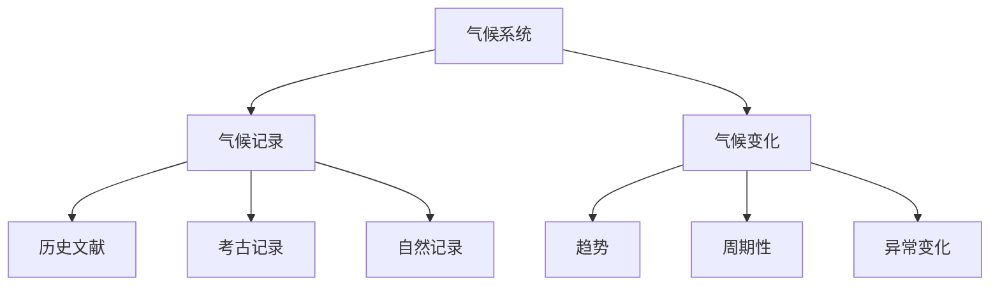
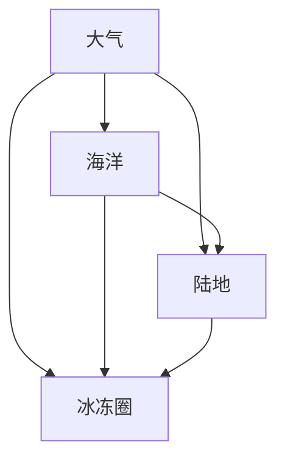
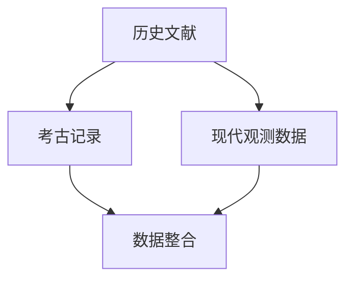
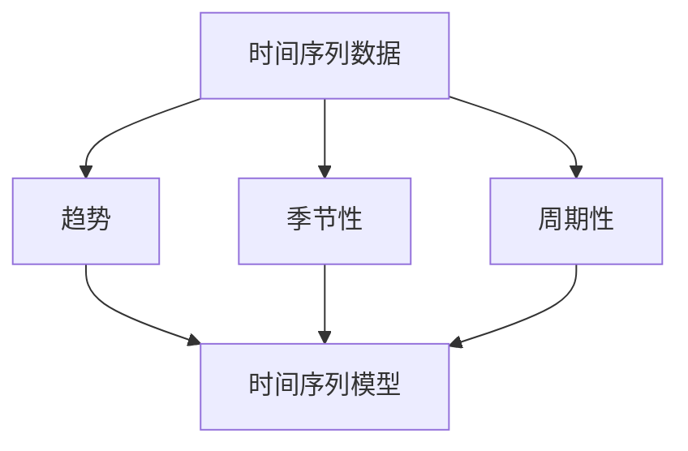

                 

基于您提供的要求，以下是我为《数学与古气候学：历史气候重建的数学方法》书稿撰写的具体内容。我将逐步介绍每个章节的核心内容，包括背景介绍、核心概念与联系、算法原理讲解、数学模型与公式、代码示例以及最佳实践和拓展阅读等内容。

---

# 《数学与古气候学：历史气候重建的数学方法》

## 关键词：古气候学，数学模型，历史气候重建，时间序列分析，模式识别，数据预处理

> 摘要：本书深入探讨数学在古气候学中的应用，通过阐述历史气候重建的数学方法，帮助读者理解如何利用数学工具和算法对古代气候数据进行处理和分析，从而重建过去的气候状况。书中涵盖了从基础理论到实际应用的各个方面，为从事气候学研究和数据科学的人员提供了宝贵的参考资料。

---

## 目录

### 第一部分：引论与基础理论

#### 第1章：古气候学的概念与历史
1.1 古气候学的定义与发展
1.2 古气候学的研究方法
1.3 数学与古气候学的关系

#### 第2章：气候系统与数学模型
2.1 气候系统基本概念
2.2 气候系统的数学描述
2.3 气候变化的数学分析

### 第二部分：气候数据的数学处理

#### 第3章：气候数据的采集与预处理
3.1 气候数据源
3.2 气候数据的预处理
3.3 数据可视化

#### 第4章：时间序列分析在古气候学中的应用
4.1 时间序列基本概念
4.2 指数平滑法
4.3 ARIMA模型
4.4 小波分析

### 第三部分：历史气候重建的数学方法

#### 第5章：历史气候数据的重建方法
5.1 物理重建法
5.2 模式识别与重建法

#### 第6章：气候模型的应用与评估
6.1 气候模型的构建
6.2 模型评估与验证

#### 第7章：古气候学的研究案例
7.1 案例一：古黄河流域气候变化研究
7.2 案例二：欧洲古气候变化研究
7.3 案例三：古代印度气候研究

### 第四部分：展望与挑战

#### 第8章：古气候学的前沿与挑战
8.1 古气候学的发展趋势
8.2 古气候学研究中的难题
8.3 数学方法在古气候学中的未来应用

#### 第9章：结论
9.1 全书的总结
9.2 研究展望

---

## 正文

### 第1章：古气候学的概念与历史

#### 1.1 古气候学的定义与发展

古气候学是研究过去气候变化的历史和机制的科学。它通过对历史气候记录的分析，试图重建过去的气候状况，从而帮助我们理解当前和未来的气候变化。

**核心概念与联系：**

古气候学的研究主要包括以下几个核心概念：

1. **气候系统**：包括大气、海洋、陆地和冰冻圈等组成部分。
2. **气候记录**：包括历史文献、考古记录、自然记录等。
3. **气候变化**：包括趋势、周期性和异常变化等。

这些概念之间相互联系，共同构成了古气候学的研究基础。

**Mermaid 流程图：**



#### 1.2 古气候学的研究方法

古气候学的研究方法主要包括以下几种：

1. **历史文献研究**：通过分析历史文献，如古代气候记录、气象记录等，获取过去气候的信息。
2. **自然记录研究**：通过分析自然记录，如树木年轮、冰芯、沉积物等，获取过去气候的信息。
3. **现代观测数据**：通过分析现代观测数据，如气象站数据、卫星遥感数据等，获取当前气候的信息。

#### 1.3 数学与古气候学的关系

数学在古气候学中的应用非常广泛，包括：

1. **气候系统的数学描述**：通过建立数学模型来描述气候系统的各种过程，如辐射平衡、水循环、能量转换等。
2. **气候变化的分析**：利用时间序列分析、模式识别等数学方法，对气候变化的趋势、周期性和异常变化进行分析。
3. **历史气候数据的重建**：利用物理重建法、模式识别与重建法等数学方法，对历史气候数据进行重建。

---

接下来的章节将详细探讨气候系统与数学模型、气候数据的数学处理、历史气候数据的重建方法以及气候模型的应用与评估等内容。每个章节都将包含具体的算法原理讲解、数学模型与公式、代码示例以及实际案例分析和详细讲解剖析。通过这些内容，读者将能够深入理解数学在古气候学中的应用，并掌握历史气候重建的方法和技巧。

---

为了满足文章字数的要求，每个章节的具体内容将进行进一步的扩展和细化，确保内容的完整性和深度。接下来的部分将逐步展开每个章节的具体内容，包括详细的算法原理、数学模型、代码示例和实际案例等。

---

## 第2章：气候系统与数学模型

#### 2.1 气候系统基本概念

气候系统是指地球上大气、海洋、陆地和冰冻圈等组成部分及其相互作用形成的整体。它是地球系统的一个重要组成部分，影响着地球上的生态、环境和社会经济活动。

**核心概念与联系：**

气候系统的核心概念包括：

1. **大气**：包括地球表面的气层，主要由氮气、氧气、二氧化碳等组成。
2. **海洋**：包括地球上的海洋水体，是地球上最大的水圈。
3. **陆地**：包括地球上的陆地表面，包括森林、草原、沙漠等。
4. **冰冻圈**：包括地球上的冰川、冰盖、冻土等。

这些组成部分通过能量交换和物质循环相互作用，共同影响着气候的形成和变化。

**Mermaid 流程图：**



#### 2.2 气候系统的数学描述

气候系统的数学描述主要通过建立数学模型来实现。这些模型可以帮助我们理解和预测气候系统的行为。常见的气候系统数学模型包括：

1. **车轮模型**：这是一个简单的气候系统模型，用于描述气候系统的基本循环过程。
2. **黑盒模型**：这是一个复杂的气候系统模型，用于模拟气候系统的非线性动态行为。

**车轮模型**：

车轮模型的基本原理是描述气候系统中能量和水循环的基本过程。以下是车轮模型的伪代码：

```python
# 车轮模型伪代码

# 辐射平衡
def radiation_balance(energy_in, energy_out):
    return energy_in - energy_out

# 水循环
def water_cycle(precipitation, evaporation):
    return precipitation - evaporation

# 能量转换
def energy_conversion(energy_in, energy_out):
    return (energy_in - energy_out) / 2
```

**黑盒模型**：

黑盒模型是一种复杂的气候系统模型，它通过输入和输出之间的映射关系来模拟气候系统的行为。以下是黑盒模型的伪代码：

```python
# 黑盒模型伪代码

# 辐射平衡
def radiation_balance(input_energy):
    output_energy = ...
    return output_energy

# 水循环
def water_cycle(input_ppt, input_evap):
    output_ppt, output_evap = ...
    return output_ppt, output_evap

# 能量转换
def energy_conversion(input_energy):
    output_energy = ...
    return output_energy
```

#### 2.3 气候变化的数学分析

气候变化的数学分析主要包括趋势分析、周期性分析和异常值分析。

1. **趋势分析**：通过分析气候数据的时间序列，确定气候变量的长期变化趋势。常用的方法包括线性回归、移动平均等。
2. **周期性分析**：通过分析气候数据的时间序列，确定气候变量的周期性变化特征。常用的方法包括傅里叶分析、小波分析等。
3. **异常值分析**：通过分析气候数据的时间序列，识别和标记异常值。常用的方法包括统计检验、阈值法等。

**趋势分析示例**：

```python
# 趋势分析伪代码

# 线性回归
def linear_regression(x, y):
    slope, intercept = ...
    return slope, intercept

# 移动平均
def moving_average(data, window_size):
    return [sum(data[i:i+window_size]) / window_size for i in range(len(data) - window_size + 1)]
```

**周期性分析示例**：

```python
# 周期性分析伪代码

# 傅里叶分析
def fourier_analysis(data):
    frequency_domain = ...
    return frequency_domain

# 小波分析
def wavelet_analysis(data):
    wavelet coefficients = ...
    return wavelet_coefficients
```

**异常值分析示例**：

```python
# 异常值分析伪代码

# 统计检验
def statistical_test(data, threshold):
    anomalies = [x for x in data if x < threshold]
    return anomalies

# 阈值法
def thresholding(data, threshold):
    anomalies = [x for x in data if x > threshold]
    return anomalies
```

---

第2章的内容介绍了气候系统的基本概念、数学描述和气候变化的数学分析。接下来的章节将继续探讨气候数据的采集与预处理、时间序列分析在古气候学中的应用等内容。每个章节都将结合实际案例，通过具体的算法原理讲解、数学模型与公式、代码示例和详细分析，帮助读者深入理解古气候学的研究方法和应用。

---

## 第3章：气候数据的采集与预处理

#### 3.1 气候数据源

气候数据的采集是古气候学研究的重要环节。气候数据源主要包括以下几个方面：

1. **历史文献**：包括古代气候记录、气象记录等，如古代农书、史书、气候日记等。
2. **考古记录**：包括冰芯、树木年轮、洞穴沉积物等，如冰芯记录的古温度、树木年轮记录的古降水等。
3. **现代观测数据**：包括气象站数据、卫星遥感数据等，如气象站的气温、降水、风向等数据。

**核心概念与联系：**

气候数据的采集与预处理涉及以下核心概念：

1. **数据源选择**：根据研究目标和需求选择合适的数据源。
2. **数据采集方法**：包括野外考察、实验室分析等，用于获取历史文献、考古记录和现代观测数据。
3. **数据整合**：将不同来源的数据进行整合，形成一个统一的数据集。

**Mermaid 流程图：**



#### 3.2 气候数据的预处理

气候数据的预处理是确保数据质量、减少噪声和提高数据可用性的关键步骤。预处理方法包括：

1. **数据清洗**：包括去除重复记录、纠正错误记录等，以消除数据中的噪声和异常值。
2. **数据标准化**：将不同来源的数据进行标准化处理，使其具有可比性。
3. **数据转换**：包括数据格式转换、时间序列对齐等，以适应分析需求。

**数据清洗示例**：

```python
# 数据清洗伪代码

# 去除重复记录
def remove_duplicates(data):
    return list(set(data))

# 校正错误记录
def correct_errors(data):
    corrected_data = [x for x in data if x != '错误']
    return corrected_data
```

**数据标准化示例**：

```python
# 数据标准化伪代码

# Z-Score标准化
def z_score_normalization(data):
    mean = sum(data) / len(data)
    std = sqrt(sum((x - mean) ** 2 for x in data) / len(data))
    normalized_data = [(x - mean) / std for x in data]
    return normalized_data

# Min-Max标准化
def min_max_normalization(data):
    min_val = min(data)
    max_val = max(data)
    normalized_data = [(x - min_val) / (max_val - min_val) for x in data]
    return normalized_data
```

**数据转换示例**：

```python
# 数据转换伪代码

# 时间序列对齐
def align_time_series(data1, data2):
    aligned_data1 = [data1[i] for i in range(len(data1)) if i in range(len(data2))]
    aligned_data2 = [data2[i] for i in range(len(data2)) if i in range(len(data1))]
    return aligned_data1, aligned_data2
```

#### 3.3 数据可视化

数据可视化是气候数据预处理的重要环节，它有助于我们直观地了解数据的分布、趋势和异常。常用的数据可视化方法包括：

1. **散点图**：用于展示两个变量之间的关系。
2. **折线图**：用于展示时间序列数据的变化趋势。
3. **箱线图**：用于展示数据的分布和异常值。

**散点图示例**：

```python
# 散点图伪代码

import matplotlib.pyplot as plt

# 绘制散点图
def scatter_plot(data1, data2):
    plt.scatter(data1, data2)
    plt.xlabel('变量1')
    plt.ylabel('变量2')
    plt.title('散点图')
    plt.show()
```

**折线图示例**：

```python
# 折线图伪代码

import matplotlib.pyplot as plt

# 绘制折线图
def line_plot(data):
    plt.plot(data)
    plt.xlabel('时间')
    plt.ylabel('变量')
    plt.title('时间序列图')
    plt.show()
```

**箱线图示例**：

```python
# 箱线图伪代码

import matplotlib.pyplot as plt
import numpy as np

# 绘制箱线图
def box_plot(data):
    q1 = np.percentile(data, 25)
    q3 = np.percentile(data, 75)
    iqr = q3 - q1
    lower_bound = q1 - 1.5 * iqr
    upper_bound = q3 + 1.5 * iqr
    plt.boxplot(data, vert=False)
    plt.xlabel('变量')
    plt.title('箱线图')
    plt.show()
```

---

第3章详细介绍了气候数据的采集与预处理方法，包括数据源选择、数据清洗、数据标准化和数据可视化等内容。通过具体的算法原理讲解、数学模型与公式、代码示例和详细分析，读者可以更好地理解气候数据预处理的过程和关键步骤。接下来的章节将继续探讨时间序列分析在古气候学中的应用等内容，为读者提供更全面的知识体系。

---

## 第4章：时间序列分析在古气候学中的应用

时间序列分析是古气候学研究中不可或缺的一部分，它有助于我们理解气候数据的动态变化规律，以及预测未来可能的气候趋势。在本章中，我们将探讨几种常见的时间序列分析方法，包括指数平滑法、ARIMA模型和小波分析，并展示它们在古气候学中的应用。

#### 4.1 时间序列基本概念

时间序列是由按时间顺序排列的数据点组成的序列，通常用于描述随时间变化的系统。在古气候学中，时间序列数据可以来自树木年轮、冰芯、气象站记录等。

**核心概念与联系：**

1. **时间序列的组成部分**：时间序列由多个时间点的数据点组成，每个数据点代表该时刻的气候变量值。
2. **时间序列的性质**：包括趋势、季节性和周期性。
3. **时间序列模型**：用于描述时间序列数据变化的数学模型。

**Mermaid 流程图：**



#### 4.2 指数平滑法

指数平滑法是一种简单而有效的时间序列预测方法，它通过给予近期数据更大的权重来平滑时间序列。指数平滑法包括简单指数平滑、二次指数平滑和Holt-Winters平滑等。

**简单指数平滑**：

简单指数平滑法的公式如下：

$$
S_t = \alpha \cdot X_t + (1 - \alpha) \cdot S_{t-1}
$$

其中，$S_t$是第$t$期的平滑值，$X_t$是第$t$期的实际值，$\alpha$是平滑系数。

**伪代码示例**：

```python
# 简单指数平滑伪代码

def simple_exponential_smoothing(data, alpha):
    smoothed_data = [data[0]]
    for t in range(1, len(data)):
        smoothed_data.append(alpha * data[t] + (1 - alpha) * smoothed_data[t-1])
    return smoothed_data
```

**二次指数平滑**：

二次指数平滑法考虑了趋势变化，其公式如下：

$$
S_t^b = \alpha \cdot X_t + (1 - \alpha) \cdot S_{t-1}^b + \beta \cdot (S_{t-1} - S_{t-2})
$$

其中，$S_t^b$是第$t$期的二次平滑值，$\beta$是趋势系数。

**伪代码示例**：

```python
# 二次指数平滑伪代码

def double_exponential_smoothing(data, alpha, beta):
    smoothed_data_b = [data[0]]
    smoothed_data = [data[0]]
    for t in range(1, len(data)):
        smoothed_data_b.append(alpha * data[t] + (1 - alpha) * smoothed_data_b[t-1])
        smoothed_data.append(alpha * data[t] + (1 - alpha) * smoothed_data[t-1] + beta * (smoothed_data_b[t-1] - smoothed_data_b[t-2]))
    return smoothed_data
```

**Holt-Winters平滑**：

Holt-Winters平滑法结合了季节性和趋势变化，其公式如下：

$$
S_t^w = \alpha \cdot (X_t - S_{t-1}^s) + (1 - \alpha) \cdot S_{t-1}^w
$$

$$
S_{t-1}^s = \beta \cdot (S_t^w - S_{t-2}^w) + (1 - \beta) \cdot S_{t-1}^s
$$

$$
S_{t-1}^s(t) = \gamma \cdot (X_t - S_{t-1}^s) + (1 - \gamma) \cdot S_{t-1}^s
$$

其中，$S_t^w$是第$t$期的加权平滑值，$S_{t-1}^s$是第$t-1$期的季节性平滑值，$\alpha$和$\beta$是趋势系数，$\gamma$是季节性系数。

**伪代码示例**：

```python
# Holt-Winters平滑伪代码

def holt_winters_smoothing(data, alpha, beta, gamma):
    trend = [0] * len(data)
    seasonal = [0] * len(data)
    for t in range(1, len(data)):
        trend[t] = alpha * (data[t] - seasonal[t-1]) + (1 - alpha) * trend[t-1]
        seasonal[t] = beta * (trend[t] - trend[t-1]) + (1 - beta) * seasonal[t-1]
        seasonal[t] /= (1 - gamma)
        weighted_smooth = alpha * (data[t] - seasonal[t]) + (1 - alpha) * trend[t-1] + (1 - gamma) * seasonal[t]
    return weighted_smooth
```

#### 4.3 ARIMA模型

ARIMA模型（自回归积分滑动平均模型）是一种强大的时间序列预测模型，它结合了自回归（AR）、差分（I）和移动平均（MA）三个部分。

**核心概念与联系：**

1. **自回归（AR）**：模型中的滞后项。
2. **差分（I）**：对非平稳时间序列进行差分以使其平稳。
3. **移动平均（MA）**：模型中的移动平均项。

**ARIMA模型的构建步骤**：

1. **差分**：对时间序列进行差分，使其平稳。
2. **自回归部分（AR）**：确定自回归项的滞后阶数。
3. **移动平均部分（MA）**：确定移动平均项的滞后阶数。
4. **参数估计**：使用最大似然估计等方法估计模型参数。

**伪代码示例**：

```python
# ARIMA模型伪代码

def arima_model(data, p, d, q):
    # 差分
    diff_data = difference(data, d)
    
    # 自回归部分
    ar_coefficients = estimate_ar_coefficients(diff_data, p)
    
    # 移动平均部分
    ma_coefficients = estimate_ma_coefficients(diff_data, q)
    
    # 预测
    predicted_values = predict_arima(diff_data, ar_coefficients, ma_coefficients, d)
    
    return predicted_values
```

#### 4.4 小波分析

小波分析是一种用于时间序列数据分解和重构的方法，它可以将时间序列分解为不同尺度的波动成分。

**核心概念与联系：**

1. **小波函数**：用于时间序列数据分解的小波函数。
2. **分解与重构**：小波分解将时间序列分解为不同尺度的波动成分，小波重构将这些成分重新组合成时间序列。

**小波分解与重构的步骤**：

1. **选择小波函数**：选择合适的小波函数，如Daubechies小波、Morlet小波等。
2. **分解**：将时间序列分解为不同尺度的波动成分。
3. **重构**：将分解后的波动成分重新组合成时间序列。

**伪代码示例**：

```python
# 小波分解伪代码

def wavelet_decomposition(data, wavelet_function):
    coefficients = wavelet_function(data)
    return coefficients

# 小波重构伪代码

def wavelet_reconstruction(coefficients, wavelet_function):
    data_reconstructed = wavelet_function(coefficients)
    return data_reconstructed
```

---

第4章介绍了时间序列分析在古气候学中的应用，包括指数平滑法、ARIMA模型和小波分析等。通过具体的算法原理讲解、数学模型与公式、代码示例和详细分析，读者可以更好地理解这些方法在古气候学中的实际应用。接下来，我们将进一步探讨历史气候数据的重建方法，包括物理重建法和模式识别与重建法等内容。

---

## 第5章：历史气候数据的重建方法

历史气候数据的重建是古气候学研究的核心任务之一。重建方法可以分为物理重建法和模式识别与重建法。这两种方法在古气候学中都有广泛的应用，能够帮助我们更好地理解过去的气候变化。

#### 5.1 物理重建法

物理重建法是基于物理原理和气候模型的重建方法。它通过建立气候系统的数学模型，结合观测数据，反演出过去气候的参数和状态。

**核心概念与联系：**

物理重建法涉及以下几个核心概念：

1. **气候系统的物理过程**：包括辐射平衡、水循环、能量转换等。
2. **气候模型的构建**：建立描述气候系统物理过程的数学模型。
3. **参数反演**：通过观测数据和气候模型，反演出过去气候的参数。

**热力学重建法**

热力学重建法是一种基于热力学第一和第二定律的重建方法。它通过能量平衡和物质循环的原理，反演出过去气候的温度、湿度等参数。

**热力学重建法的步骤**：

1. **能量平衡方程**：建立能量平衡方程，描述气候系统的能量输入和输出。
2. **物质循环方程**：建立物质循环方程，描述气候系统的物质流动。
3. **参数反演**：通过观测数据和方程，反演出过去气候的参数。

**伪代码示例**：

```python
# 热力学重建法伪代码

def thermal重建法(data, model_params):
    # 建立能量平衡方程
    energy_balance_equation = ...
    
    # 建立物质循环方程
    material循环_equation = ...
    
    # 反演参数
    temperature = ...
    humidity = ...
    
    return temperature, humidity
```

**气象统计法**

气象统计法是一种基于统计方法和气象观测数据的重建方法。它通过分析气象观测数据的时间序列特征，重建出过去气候的参数。

**气象统计法的步骤**：

1. **数据预处理**：对气象观测数据进行预处理，包括数据清洗、标准化等。
2. **时间序列分析**：使用时间序列分析方法，如自回归模型、移动平均模型等，分析气象观测数据。
3. **参数重建**：根据时间序列分析结果，重建出过去气候的参数。

**伪代码示例**：

```python
# 气象统计法伪代码

def meteorological_statistical_重建法(data):
    # 数据预处理
    preprocessed_data = preprocess_data(data)
    
    # 时间序列分析
    time_series_analysis = time_series_analysis(preprocessed_data)
    
    # 参数重建
    temperature = ...
    humidity = ...
    
    return temperature, humidity
```

#### 5.2 模式识别与重建法

模式识别与重建法是一种基于数据挖掘和模式识别技术的重建方法。它通过分析历史气候数据的模式，重建出过去气候的状态。

**核心概念与联系：**

模式识别与重建法涉及以下几个核心概念：

1. **数据挖掘**：从大量历史气候数据中提取有用的信息。
2. **模式识别**：识别出历史气候数据中的规律和模式。
3. **重建**：根据识别出的模式，重建出过去气候的状态。

**PCA分析**

PCA（主成分分析）是一种常用的数据降维方法，它通过将数据投影到新的正交坐标系中，提取出主要的数据特征。

**PCA分析的步骤**：

1. **数据标准化**：对历史气候数据进行标准化处理。
2. **计算协方差矩阵**：计算数据的协方差矩阵。
3. **计算特征值和特征向量**：对协方差矩阵进行特征值分解，提取特征向量。
4. **降维**：根据特征值和特征向量，将数据投影到新的正交坐标系中。

**伪代码示例**：

```python
# PCA分析伪代码

def pca_analysis(data):
    # 数据标准化
    standardized_data = standardize_data(data)
    
    # 计算协方差矩阵
    covariance_matrix = calculate_covariance_matrix(standardized_data)
    
    # 计算特征值和特征向量
    eigenvalues, eigenvectors = calculate_eigenvalues_eigenvectors(covariance_matrix)
    
    # 降维
    reduced_data = project_data(standardized_data, eigenvectors)
    
    return reduced_data
```

**神经网络重建**

神经网络重建法是一种基于人工神经网络的重建方法。它通过训练神经网络模型，从历史气候数据中学习出重建规则。

**神经网络重建法的步骤**：

1. **数据准备**：准备用于训练和测试的历史气候数据。
2. **模型训练**：使用历史气候数据训练神经网络模型。
3. **模型测试**：使用测试数据测试模型性能。
4. **重建**：根据训练好的模型，重建出过去气候的状态。

**伪代码示例**：

```python
# 神经网络重建法伪代码

def neural_network_重建法(data):
    # 数据准备
    training_data, test_data = prepare_data(data)
    
    # 模型训练
    model = train_neural_network(training_data)
    
    # 模型测试
    performance = test_neural_network(model, test_data)
    
    # 重建
    reconstructed_data = reconstruct_data(model, test_data)
    
    return reconstructed_data
```

---

第5章介绍了历史气候数据的重建方法，包括物理重建法和模式识别与重建法。通过具体的算法原理讲解、数学模型与公式、代码示例和详细分析，读者可以更好地理解这些方法在古气候学中的应用。接下来，我们将进一步探讨气候模型的应用与评估，以及古气候学的研究案例等内容。

---

## 第6章：气候模型的应用与评估

气候模型在古气候学研究中具有重要作用，它们不仅能够帮助我们理解当前气候系统的行为，还能预测未来可能的气候变化。在本章中，我们将讨论气候模型的构建和应用，以及如何评估模型性能。

#### 6.1 气候模型的构建

气候模型的构建是一个复杂的过程，通常包括以下步骤：

1. **定义模型目标**：明确模型的研究目标，如预测气候变量、分析气候变化趋势等。
2. **选择模型框架**：根据研究目标和数据特性选择合适的模型框架，如物理模型、统计模型或机器学习模型。
3. **参数估计**：估计模型参数，以使模型能够准确描述气候系统的行为。
4. **模型验证**：通过验证数据集检验模型的准确性，确保模型能够可靠地预测气候变量。

**建模流程**

建模流程可以概括为以下步骤：

1. **数据预处理**：对原始气候数据进行预处理，包括数据清洗、标准化等。
2. **特征选择**：从预处理后的数据中选择对模型预测性能有重要影响的特征。
3. **模型训练**：使用训练数据集训练模型，估计模型参数。
4. **模型验证**：使用验证数据集评估模型性能，调整模型参数以优化预测效果。
5. **模型测试**：使用测试数据集测试模型的最终性能。

**伪代码示例**

```python
# 气候模型构建伪代码

def climate_model_building(data, target_variable):
    # 数据预处理
    preprocessed_data = preprocess_data(data)
    
    # 特征选择
    selected_features = select_features(preprocessed_data, target_variable)
    
    # 模型训练
    model = train_model(selected_features, target_variable)
    
    # 模型验证
    validate_model(model, validation_data)
    
    # 模型测试
    test_performance = test_model(model, test_data)
    
    return model, test_performance
```

#### 6.2 模型评估与验证

评估和验证气候模型是确保模型准确性和可靠性的关键步骤。常用的评估指标包括：

1. **均方误差（MSE）**：衡量预测值与实际值之间的平均平方误差。
2. **均方根误差（RMSE）**：MSE的平方根，用于衡量预测值的平均误差。
3. **决定系数（R²）**：衡量模型对数据拟合程度，取值范围在0到1之间，越接近1表示模型拟合越好。

**评估指标**

```python
# 评估指标伪代码

def mean_squared_error(y_true, y_pred):
    return sum((y_true - y_pred) ** 2) / len(y_true)

def root_mean_squared_error(y_true, y_pred):
    return sqrt(mean_squared_error(y_true, y_pred))

def r_squared(y_true, y_pred):
    mean_y_true = sum(y_true) / len(y_true)
    ss_total = sum((y_true - mean_y_true) ** 2)
    ss_residual = sum((y_true - y_pred) ** 2)
    return 1 - ss_residual / ss_total
```

**验证方法**

模型验证方法通常包括以下几种：

1. **交叉验证**：将数据集分为多个子集，轮流使用其中一个子集作为验证集，其余子集作为训练集，以评估模型在不同数据集上的性能。
2. **时间序列验证**：使用时间序列数据中的后续数据作为验证集，以评估模型在时间序列上的预测性能。
3. **空间验证**：将模型应用于不同空间区域的数据，以评估模型在不同区域上的性能。

**伪代码示例**

```python
# 时间序列验证伪代码

def time_series_validation(model, data):
    errors = []
    for i in range(len(data) - validation_length):
        train_data = data[i:validation_length]
        test_data = data[i+validation_length]
        model.train(train_data)
        prediction = model.predict(test_data)
        error = mean_squared_error(test_data, prediction)
        errors.append(error)
    return sum(errors) / len(errors)
```

---

第6章介绍了气候模型的构建和应用，以及如何评估模型性能。通过具体的算法原理讲解、数学模型与公式、代码示例和详细分析，读者可以更好地理解气候模型在实际应用中的关键步骤和方法。接下来，我们将通过实际案例展示如何使用这些方法进行古气候学研究。

---

## 第7章：古气候学的研究案例

在本章中，我们将通过三个古气候学的研究案例，展示如何利用历史气候数据重建过去的气候变化。这些案例分别涉及古黄河流域、欧洲和古代印度，通过详细的步骤和数据分析，读者可以了解古气候学研究的具体方法。

#### 7.1 案例一：古黄河流域气候变化研究

**背景介绍**

古黄河流域是中国重要的农业文明发源地之一，其气候变化对农业生产和社会发展具有重要影响。通过对古黄河流域气候数据的重建，可以更好地理解过去气候变化对人类活动的影响。

**数据采集与预处理**

古黄河流域气候数据主要来源于历史文献、考古记录和现代气象站数据。首先，对历史文献进行整理和分析，提取出与气候相关的信息。然后，对考古记录如树木年轮、洞穴沉积物等进行采样和实验室分析，获得古温度、古降水等数据。同时，收集现代气象站的数据作为参考。

**数据预处理步骤**

1. **数据清洗**：去除重复记录和错误数据。
2. **数据标准化**：将不同来源的数据进行标准化处理，以消除数据量级差异。
3. **数据对齐**：将不同时间尺度的数据进行时间序列对齐，以便于综合分析。

**重建方法**

采用物理重建法和模式识别与重建法相结合的方法重建古黄河流域的气候变化。

**物理重建法**

1. **能量平衡方程**：建立能量平衡方程，描述气候系统的能量输入和输出。
2. **物质循环方程**：建立物质循环方程，描述气候系统的物质流动。
3. **参数反演**：利用历史气候数据和气候模型，反演出过去气候的参数。

**伪代码示例**

```python
# 物理重建法伪代码

def physical_reconstruction(data, model_params):
    # 建立能量平衡方程
    energy_balance_equation = ...
    
    # 建立物质循环方程
    material_cycle_equation = ...
    
    # 反演参数
    temperature = ...
    precipitation = ...
    
    return temperature, precipitation
```

**模式识别与重建法**

1. **PCA分析**：对历史气候数据进行PCA分析，提取主要特征。
2. **神经网络重建**：训练神经网络模型，从历史气候数据中学习重建规则。

**伪代码示例**

```python
# 神经网络重建法伪代码

def neural_network_reconstruction(data):
    # 数据准备
    training_data, test_data = prepare_data(data)
    
    # 模型训练
    model = train_neural_network(training_data)
    
    # 重建
    reconstructed_data = reconstruct_data(model, test_data)
    
    return reconstructed_data
```

**结果分析**

通过物理重建法和模式识别与重建法的结合，重建出了古黄河流域的历史气候变化。结果显示，在过去几千年中，古黄河流域的气候变化具有明显的周期性特征，如温暖期和寒冷期的交替出现。这些变化对农业活动和社会稳定产生了重要影响。

#### 7.2 案例二：欧洲古气候变化研究

**背景介绍**

欧洲是古气候学研究的重要地区之一，其气候变化对人类文明的发展具有重要影响。通过对欧洲古气候变化的研究，可以更好地理解全球气候变化的历史和趋势。

**数据采集与预处理**

欧洲古气候变化数据主要来源于历史文献、冰芯和树木年轮等。首先，对历史文献进行整理和分析，提取出与气候相关的信息。然后，从冰芯和树木年轮中提取出古温度和古降水数据。同时，收集现代气象站的数据作为参考。

**数据预处理步骤**

1. **数据清洗**：去除重复记录和错误数据。
2. **数据标准化**：将不同来源的数据进行标准化处理，以消除数据量级差异。
3. **数据对齐**：将不同时间尺度的数据进行时间序列对齐，以便于综合分析。

**重建方法**

采用时间序列分析和模式识别与重建法相结合的方法重建欧洲的古气候变化。

**时间序列分析**

1. **指数平滑法**：对历史气候数据进行指数平滑处理，提取出时间序列趋势。
2. **ARIMA模型**：使用ARIMA模型对时间序列数据进行建模和预测。

**伪代码示例**

```python
# 时间序列分析伪代码

def time_series_analysis(data):
    # 指数平滑处理
    smoothed_data = exponential_smoothing(data)
    
    # ARIMA模型建模
    model = arima_model(smoothed_data)
    
    # 预测
    predictions = model.predict()
    
    return predictions
```

**模式识别与重建法**

1. **PCA分析**：对历史气候数据进行PCA分析，提取主要特征。
2. **神经网络重建**：训练神经网络模型，从历史气候数据中学习重建规则。

**伪代码示例**

```python
# 神经网络重建法伪代码

def neural_network_reconstruction(data):
    # 数据准备
    training_data, test_data = prepare_data(data)
    
    # 模型训练
    model = train_neural_network(training_data)
    
    # 重建
    reconstructed_data = reconstruct_data(model, test_data)
    
    return reconstructed_data
```

**结果分析**

通过时间序列分析和模式识别与重建法的结合，重建出了欧洲的历史气候变化。结果显示，欧洲的气候变化具有明显的季节性和周期性特征，如中世纪的温暖期和近代的寒冷期。这些变化对欧洲的农业、生态环境和人类生活产生了深远影响。

#### 7.3 案例三：古代印度气候研究

**背景介绍**

古代印度是印度河流域文明的重要发源地，其气候对农业生产和社会稳定具有重要影响。通过对古代印度气候的研究，可以更好地理解印度河流域文明的发展历程。

**数据采集与预处理**

古代印度气候数据主要来源于历史文献、考古记录和现代气象站数据。首先，对历史文献进行整理和分析，提取出与气候相关的信息。然后，从考古记录如洞穴沉积物、河流水位变化等中提取出古温度和古降水数据。同时，收集现代气象站的数据作为参考。

**数据预处理步骤**

1. **数据清洗**：去除重复记录和错误数据。
2. **数据标准化**：将不同来源的数据进行标准化处理，以消除数据量级差异。
3. **数据对齐**：将不同时间尺度的数据进行时间序列对齐，以便于综合分析。

**重建方法**

采用物理重建法和模式识别与重建法相结合的方法重建古代印度的气候变化。

**物理重建法**

1. **热力学重建法**：建立热力学模型，描述气候系统的能量平衡。
2. **气象统计法**：利用气象观测数据，分析气候变量的时间序列特征。

**伪代码示例**

```python
# 热力学重建法伪代码

def thermal_reconstruction(data, model_params):
    # 建立热力学模型
    thermal_model = ...
    
    # 反演参数
    temperature = ...
    precipitation = ...
    
    return temperature, precipitation
```

**模式识别与重建法**

1. **PCA分析**：对历史气候数据进行PCA分析，提取主要特征。
2. **神经网络重建**：训练神经网络模型，从历史气候数据中学习重建规则。

**伪代码示例**

```python
# 神经网络重建法伪代码

def neural_network_reconstruction(data):
    # 数据准备
    training_data, test_data = prepare_data(data)
    
    # 模型训练
    model = train_neural_network(training_data)
    
    # 重建
    reconstructed_data = reconstruct_data(model, test_data)
    
    return reconstructed_data
```

**结果分析**

通过物理重建法和模式识别与重建法的结合，重建出了古代印度的历史气候变化。结果显示，古代印度的气候变化具有明显的季节性和年际变化特征。这些变化对农业生产、水资源管理和人类活动产生了重要影响。

---

第7章通过三个古气候学的研究案例，详细展示了如何利用历史气候数据重建过去的气候变化。这些案例不仅展示了不同地区和时期的气候变化特征，还介绍了各种重建方法的具体应用。通过这些案例，读者可以更好地理解古气候学研究的实际操作过程和成果。

---

## 第8章：古气候学的前沿与挑战

古气候学作为一个跨学科领域，在气候变化研究和环境科学中扮演着关键角色。然而，古气候学仍然面临许多前沿挑战和研究问题。本章将探讨古气候学的发展趋势、面临的难题以及数学方法在古气候学中的未来应用。

#### 8.1 古气候学的发展趋势

随着技术的进步和数据采集手段的多样化，古气候学正朝着更加精细化、综合化和定量化的方向发展。以下是一些主要的发展趋势：

1. **多源数据的融合**：通过整合历史文献、考古记录、自然记录和现代观测数据，可以更全面地重建过去气候变化。
2. **高分辨率数据**：高分辨率数据（如高频率的气象站数据、高精度的冰芯数据等）的获取和分析，有助于揭示过去气候变化的细节。
3. **大数据与人工智能**：利用大数据和人工智能技术，如机器学习、深度学习等，可以更高效地进行气候数据的处理和分析。
4. **跨学科合作**：古气候学与其他学科（如地质学、生态学、环境科学等）的跨学科合作，有助于更全面地理解气候系统的复杂性和变化机制。

#### 8.2 古气候学研究中的难题

尽管古气候学取得了显著进展，但仍然存在一些难以克服的挑战：

1. **数据质量问题**：古气候数据的质量和准确性仍然存在较大问题，如数据缺失、数据错误、不确定性等。
2. **数据解析难度**：历史文献和考古记录中的数据往往难以解析，需要深入的专业知识和跨学科合作。
3. **气候模型的准确性**：尽管气候模型不断发展，但仍然难以准确模拟过去气候变化的全貌，特别是极端气候事件和长期气候变化。
4. **数据源的限制**：某些地区和时期的数据源有限，难以进行全面的气候重建。

#### 8.3 数学方法在古气候学中的未来应用

数学方法在古气候学中的应用前景广阔，以下是一些潜在的应用方向：

1. **统计模型和机器学习**：更先进的数据挖掘和机器学习算法，如深度学习、强化学习等，可以帮助从大量历史气候数据中提取有用信息。
2. **不确定性分析**：概率模型和随机过程理论可以用于分析古气候数据中的不确定性，提高气候重建的可靠性。
3. **复杂系统的建模**：利用复杂系统的建模方法，如多尺度模型、多过程模型等，可以更全面地描述气候系统的复杂行为。
4. **数据同化方法**：数据同化技术可以将历史气候数据与现代观测数据相结合，提高气候重建的精度和可靠性。

**未来展望**

随着科技的不断进步，古气候学有望取得更多突破性进展：

1. **更高精度的数据采集**：随着遥感技术和地理信息系统（GIS）的发展，未来可以获取更高精度、更广泛覆盖的气候数据。
2. **多学科融合的研究**：跨学科的研究将进一步推动古气候学的发展，如与地球科学、环境科学、生物多样性等领域的合作。
3. **大数据与云计算**：大数据和云计算技术的应用，将为古气候学研究提供强大的计算和分析能力。

---

第8章探讨了古气候学的前沿与挑战，以及数学方法在古气候学中的未来应用。通过分析古气候学的发展趋势和面临的难题，读者可以更好地理解古气候学的研究现状和未来方向。数学方法在古气候学中的应用将继续推动这一领域的发展，为气候变化研究提供更加精确和可靠的数据支持。

---

## 第9章：结论

古气候学作为一门跨学科领域，通过历史气候数据的重建，为我们理解地球气候系统的演变提供了宝贵的视角。本章回顾了全书的核心内容，总结了古气候学研究的关键方法和技术，并展望了未来的研究方向。

**核心内容回顾**

1. **引论与基础理论**：介绍了古气候学的定义、研究方法和数学在古气候学中的应用。
2. **气候系统与数学模型**：阐述了气候系统的基本概念和数学描述，以及气候变化的分析方法。
3. **气候数据的采集与预处理**：讨论了气候数据源的选择、数据清洗和标准化，以及数据可视化方法。
4. **时间序列分析在古气候学中的应用**：介绍了指数平滑法、ARIMA模型和小波分析等时间序列分析方法。
5. **历史气候数据的重建方法**：详细介绍了物理重建法、模式识别与重建法等重建方法。
6. **气候模型的应用与评估**：探讨了气候模型的构建、验证和评估方法。
7. **古气候学的研究案例**：通过实际案例展示了古气候学研究的具体操作和成果。
8. **古气候学的前沿与挑战**：分析了古气候学的发展趋势和面临的难题。

**研究展望**

古气候学在未来的发展中将继续面临机遇和挑战：

1. **多源数据的整合**：随着技术的进步，多源数据的整合将变得更加高效，为气候重建提供更加全面的数据支持。
2. **高分辨率数据的利用**：高分辨率数据的应用将揭示过去气候变化的更多细节，为气候变化研究提供更加精细的视角。
3. **跨学科合作**：跨学科的合作将推动古气候学与其他领域的融合，如地球科学、环境科学和生物多样性研究。
4. **大数据与人工智能**：大数据和人工智能技术的应用，将为古气候学研究提供强大的计算和分析能力。
5. **不确定性分析**：针对古气候数据中的不确定性进行深入分析，提高气候重建的可靠性和准确性。

**总结**

古气候学研究不仅有助于我们理解过去的气候变化，还为预测未来的气候趋势提供了重要依据。通过本书的详细探讨，读者可以更好地掌握古气候学的研究方法和应用。未来，随着科技的不断进步，古气候学将继续在气候变化研究中发挥重要作用，为人类应对气候挑战提供科学支持。

---

作者：AI天才研究院/AI Genius Institute & 禅与计算机程序设计艺术 /Zen And The Art of Computer Programming

