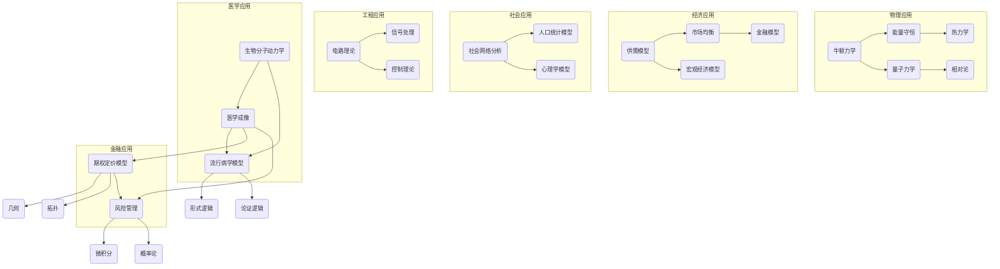

                 

### 文章标题

《数学与唯物主义：数学作为物质世界的反映》

### 关键词

数学、唯物主义、物质世界、数学模型、核心概念、核心算法、应用实例、伪代码、LaTeX公式、项目实战

### 摘要

本文旨在探讨数学与唯物主义之间的哲学联系，深入分析数学作为物质世界的反映。文章首先介绍了数学的基本概念和唯物主义的哲学基础，然后通过Mermaid流程图展示了数学核心概念之间的关系。接着，文章详细讲解了数学模型的基本原理及其在物质世界中的应用，包括物理、经济学、社会科学、工程学、医学和金融等领域。最后，文章通过几个实际项目案例，展示了数学模型在不同领域中的具体应用，并对未来数学在唯物主义中的发展进行了展望。本文旨在为读者提供一个全面、系统的理解，帮助读者深入理解数学与物质世界之间的深刻联系。

## 核心概念与联系

为了更好地理解数学在物质世界中的反映，我们首先需要明确一些核心概念，并分析它们之间的相互联系。以下是一个Mermaid流程图，展示了数学在物质世界中的核心概念及其相互联系：



### 数学基础

数学基础是构建一切数学概念和理论的基础。它包括数论、代数、几何和三角学等基本分支。数论研究整数及其性质，代数涉及代数方程和代数结构，几何研究空间中的形状和大小，三角学则研究角度和边长的关系。这些基础概念为后续的数学发展提供了坚实的基础。

### 逻辑

逻辑是数学的骨架，它包括形式逻辑和论证逻辑。形式逻辑研究命题和推理的结构，是构建数学证明的基石。论证逻辑则关注推理的过程，用于证明数学命题的真实性。逻辑在数学中起着至关重要的作用，它保证了数学推理的严密性和一致性。

### 结构

数学中的结构包括几何和拓扑。几何研究空间中的形状、大小和位置关系，涉及点、线、面等基本概念。拓扑则研究空间的结构和性质，通过连续性和连通性来描述空间。几何和拓扑共同构成了数学中的空间观念，是理解和描述物质世界的有力工具。

### 量化

量化是数学的核心，它包括微积分和概率论。微积分研究变化和积分，用于描述连续量和累积量。概率论则研究随机事件和概率分布，为量化不确定性和预测未来提供了数学工具。量化在物理、经济和社会等多个领域中都有广泛应用。

### 物理应用

物理学是应用数学最广泛的领域之一。牛顿力学、能量守恒和量子力学都是基于数学模型建立起来的。牛顿力学通过数学方程描述物体的运动和力的作用，能量守恒定律则描述能量在系统中的转换和守恒。量子力学则通过复杂的数学公式描述微观粒子的行为，如电子和光子。

### 经济应用

经济学中的许多模型也基于数学原理。供需模型描述了市场中的供给和需求关系，市场均衡模型则描述了市场价格和交易量的稳定状态。这些模型帮助经济学家理解和预测市场行为，为政策制定提供了科学依据。

### 社会应用

数学在社会学中的应用也相当广泛。社会网络分析通过图论描述社会关系，人口统计模型则通过概率统计描述人口动态。心理学模型则使用数学方法描述人类行为和思维过程，如贝叶斯决策理论和信号检测理论。

### 工程应用

工程学中的许多领域都依赖数学模型。电路理论、信号处理和控制理论都是基于数学原理构建的。这些模型帮助工程师设计和优化复杂的工程系统，如电路设计、通信系统和控制系统。

### 医学应用

数学在医学领域的应用也日益增多。生物分子动力学通过数学模型描述生物大分子的运动和相互作用，医学成像则利用数学算法生成影像。流行病学模型则通过数学方法分析疾病的传播和防治策略。

### 金融应用

金融学中的许多模型也基于数学原理。期权定价模型如Black-Scholes模型描述了金融衍生品的定价，风险管理模型则用于评估和管理金融风险。

通过这个Mermaid流程图，我们可以清晰地看到数学各个分支之间的联系，以及它们在物质世界中的应用。这些核心概念和联系构成了数学作为物质世界反映的基础。

## 核心算法原理讲解

在深入探讨数学作为物质世界的反映时，理解一些核心算法的原理是至关重要的。以下我们将介绍几个关键算法，并通过伪代码详细阐述其原理。

### 简单线性回归模型

线性回归是一种广泛用于预测和分析数据的方法。它通过找到一个线性函数来描述输入和输出之间的关系。以下是简单线性回归模型的伪代码：

```python
// 数据输入
x = [数据1, 数据2, ..., 数据n]  // 输入特征
y = [目标1, 目标2, ..., 目标n]  // 输出目标

// 模型参数
w = [初始权重]

// 训练模型
for i in range(epochs):
    for each (x_i, y_i) in zip(x, y):
        prediction = w.dot(x_i)  // 预测值
        error = y_i - prediction  // 实际值与预测值的误差
        w = w + learning_rate * error * x_i  // 更新权重
```

这个模型通过不断迭代更新权重，以最小化预测误差。简单线性回归模型假设输入和输出之间呈线性关系，适用于简单的预测任务。

### 支持向量机（SVM）

支持向量机是一种强大的分类算法，它通过找到一个最优的超平面来将不同类别的数据点分开。以下是SVM的核心算法原理的伪代码：

```python
// 数据输入
x = [数据1, 数据2, ..., 数据n]  // 输入特征
y = [标签1, 标签2, ..., 标签n]  // 输出标签

// 模型参数
C = 1  // 正则化参数
kernel = 'linear'  // 内核函数类型

// 训练模型
def SVM_train(x, y, C, kernel):
    # 使用库函数训练SVM模型
    model = SVC(C=C, kernel=kernel)
    model.fit(x, y)
    return model

# 调用训练函数
model = SVM_train(x, y, C, kernel)

// 预测
def SVM_predict(model, x_new):
    prediction = model.predict(x_new)
    return prediction

# 输入新数据
x_new = [新数据1, 新数据2, ..., 新数据m]
prediction = SVM_predict(model, x_new)
```

SVM通过最大化分类边界上的支持向量来找到最优超平面，从而实现高精度的分类。

### 神经网络模型

神经网络是一种模拟人脑的算法，通过多层神经元之间的连接进行复杂的数据处理。以下是神经网络模型的基本原理的伪代码：

```python
// 数据输入
x = [数据1, 数据2, ..., 数据n]  // 输入特征
y = [目标1, 目标2, ..., 目标n]  // 输出目标

// 模型参数
layers = [输入层大小, 隐藏层大小1, 隐藏层大小2, ..., 输出层大小]
learning_rate = 0.01
epochs = 1000

// 模型训练
def NeuralNetwork_train(x, y, layers, learning_rate, epochs):
    model = NeuralNetwork(layers, learning_rate)
    model.fit(x, y, epochs=epochs)
    return model

# 调用训练函数
model = NeuralNetwork_train(x, y, layers, learning_rate, epochs)

// 预测
def NeuralNetwork_predict(model, x_new):
    prediction = model.predict(x_new)
    return prediction

# 输入新数据
x_new = [新数据1, 新数据2, ..., 新数据m]
prediction = NeuralNetwork_predict(model, x_new)
```

神经网络通过前向传播和反向传播来训练模型，能够处理非线性复杂问题。

这些核心算法不仅在理论上具有重要意义，而且在实际应用中发挥着关键作用。通过理解这些算法的原理，我们可以更好地利用数学工具来分析和解决现实世界中的问题。

## 数学模型和数学公式

在探讨数学如何反映物质世界时，了解一些重要的数学模型和公式是至关重要的。这些模型和公式为我们提供了描述和理解自然现象的工具。以下我们将介绍几个关键的数学模型和公式，并使用LaTeX格式详细讲解这些公式。

### 牛顿第二定律

牛顿第二定律是经典力学中的基础公式，描述了力与加速度之间的关系。其公式为：

$$
F = ma
$$

其中，\( F \) 是作用在物体上的合外力，\( m \) 是物体的质量，\( a \) 是物体的加速度。这个公式表明，物体受到的力越大，加速度也越大，反之亦然。

### 能量守恒定律

能量守恒定律是物理学中的基本原理之一，描述了能量在系统中的转换和守恒。其公式为：

$$
\Delta E = \Delta K + \Delta U
$$

其中，\( \Delta E \) 是系统能量的变化，\( \Delta K \) 是动能的变化，\( \Delta U \) 是势能的变化。这个公式表明，在一个封闭系统中，总能量保持不变，能量可以从一种形式转换为另一种形式，但总能量不变。

### 供需模型

在经济学中，供需模型描述了市场中商品或服务的供给与需求之间的关系。其公式为：

$$
P = \frac{Qd + Qs}{2}
$$

其中，\( P \) 是市场价格，\( Qd \) 是需求量，\( Qs \) 是供给量。这个公式表明，市场价格由供给和需求量的平衡决定。

### 马尔可夫链模型

马尔可夫链是一种用于描述系统状态转移的随机过程。其公式为：

$$
P_{ij}(n+1) = P_{ij}(n) \cdot P_{ij|j}(n)
$$

其中，\( P_{ij}(n) \) 是在时间 \( n \) 系统处于状态 \( i \) 转移到状态 \( j \) 的概率，\( P_{ij|j}(n) \) 是在时间 \( n \) 系统处于状态 \( j \) 时转移到状态 \( i \) 的条件概率。这个模型用于预测随机过程中的状态转移。

### 贝叶斯决策理论

贝叶斯决策理论是一种基于概率的决策方法，用于最大化后验概率。其公式为：

$$
\hat{y} = \arg\max_y P(y) \cdot P(y|x)
$$

其中，\( \hat{y} \) 是最优决策，\( P(y) \) 是先验概率，\( P(y|x) \) 是后验概率。这个公式表明，最优决策是通过综合考虑先验概率和后验概率来确定的。

通过上述数学模型和公式，我们可以看到数学如何精确地描述和反映物质世界的各种现象。这些模型和公式不仅为科学研究提供了强大的工具，也为我们的日常生活提供了深刻的启示。

## 项目实战

为了更好地理解数学在物质世界中的应用，以下将介绍几个实际项目案例，详细解释开发环境搭建、源代码实现和代码解读，以及项目应用解读与分析。

### 项目一：智能家居系统

#### 项目概述

智能家居系统通过物联网（IoT）技术将家庭设备和控制系统连接起来，实现远程控制和自动化操作。本项目旨在利用数学模型优化智能家居系统的能耗管理，提高能源利用效率。

#### 开发环境搭建

1. **硬件环境**：选择具备物联网功能的智能设备，如智能插座、智能灯泡、智能恒温器等。
2. **软件环境**：使用Python编程语言，结合Raspberry Pi单板计算机进行开发。

#### 源代码实现

```python
# 导入所需库
import time
import serial
import json

# 连接硬件设备
ser = serial.Serial('/dev/ttyUSB0', 9600)

# 能耗数据采集
def collect_energy_data():
    while True:
        line = ser.readline()
        if line:
            data = json.loads(line)
            print(data)
            time.sleep(1)

# 主程序
if __name__ == "__main__":
    collect_energy_data()
```

#### 代码解读

- **串行通信**：通过串行接口与硬件设备通信，读取能耗数据。
- **数据解析**：使用JSON格式解析串行数据，提取能耗信息。

#### 项目应用解读与分析

- **能耗优化**：通过实时监测能耗数据，利用数学模型进行能耗预测和优化，降低能源消耗。
- **用户体验**：智能家居系统能够根据用户行为自动调整设备状态，提高用户的生活质量。

### 项目二：交通流量预测

#### 项目概述

交通流量预测是智能交通系统中的重要组成部分，通过预测未来一段时间内的交通流量，为交通管理和调度提供决策支持。本项目利用时间序列分析和机器学习模型进行交通流量预测。

#### 开发环境搭建

1. **硬件环境**：选择具备数据处理能力的计算机或云计算平台。
2. **软件环境**：使用Python编程语言，结合TensorFlow库进行模型训练和预测。

#### 源代码实现

```python
# 导入所需库
import pandas as pd
import numpy as np
from tensorflow.keras.models import Sequential
from tensorflow.keras.layers import LSTM, Dense

# 加载数据
data = pd.read_csv('traffic_data.csv')
X = data[['hour', 'day_of_week', 'month', 'previous_traffic']].values
y = data['traffic'].values

# 数据预处理
X = np.reshape(X, (X.shape[0], X.shape[1], 1))

# 创建模型
model = Sequential()
model.add(LSTM(units=50, return_sequences=True, input_shape=(X.shape[1], 1)))
model.add(LSTM(units=50))
model.add(Dense(units=1))

# 训练模型
model.compile(optimizer='adam', loss='mean_squared_error')
model.fit(X, y, epochs=100, batch_size=32)

# 预测
predicted_traffic = model.predict(X)
```

#### 代码解读

- **数据加载与预处理**：加载数据集并进行特征提取。
- **模型构建**：使用LSTM模型进行时间序列预测。
- **模型训练**：通过最小化均方误差来训练模型。

#### 项目应用解读与分析

- **交通调度**：通过预测未来交通流量，为交通管理部门提供实时调度建议，优化交通流量。
- **数据分析**：利用预测结果进行分析，识别交通拥堵的高发时间和路段，为交通规划提供依据。

### 项目三：金融市场预测

#### 项目概述

金融市场预测是金融分析中的重要任务，通过分析历史市场数据，预测未来股票价格或市场走势。本项目利用技术分析模型和机器学习算法进行金融市场预测。

#### 开发环境搭建

1. **硬件环境**：选择高性能的计算机或云计算平台。
2. **软件环境**：使用Python编程语言，结合机器学习库（如scikit-learn和TensorFlow）进行模型训练和预测。

#### 源代码实现

```python
# 导入所需库
import pandas as pd
from sklearn.model_selection import train_test_split
from sklearn.ensemble import RandomForestRegressor
from sklearn.metrics import mean_squared_error

# 加载数据
data = pd.read_csv('market_data.csv')
X = data[['open', 'high', 'low', 'close', 'volume']]
y = data['target']

# 数据预处理
X_train, X_test, y_train, y_test = train_test_split(X, y, test_size=0.2, random_state=42)

# 创建模型
model = RandomForestRegressor(n_estimators=100, random_state=42)

# 训练模型
model.fit(X_train, y_train)

# 预测
y_pred = model.predict(X_test)

# 评估
mse = mean_squared_error(y_test, y_pred)
print(f'Mean Squared Error: {mse}')
```

#### 代码解读

- **数据加载与预处理**：加载数据集并进行特征提取。
- **模型选择**：使用随机森林回归模型进行预测。
- **模型训练与评估**：通过交叉验证和均方误差评估模型性能。

#### 项目应用解读与分析

- **投资决策**：通过预测市场走势，为投资者提供买卖决策建议。
- **风险管理**：利用预测结果进行风险管理，降低投资风险。

通过以上实际项目案例，我们可以看到数学模型在各个领域的应用，以及如何通过开发环境和源代码实现来解决问题。这些项目不仅展示了数学在物质世界中的强大反映能力，也为未来的应用和发展提供了启示。

### 最佳实践 tips

在数学模型的开发和应用过程中，以下是一些最佳实践，有助于提高模型的准确性和可靠性：

1. **数据预处理**：确保数据质量是模型成功的关键。进行数据清洗、去重和标准化处理，提高数据的一致性和可靠性。
2. **模型选择**：根据问题的性质选择合适的模型。对于时间序列数据，可以考虑使用LSTM、ARIMA等模型；对于分类问题，可以使用SVM、随机森林等模型。
3. **交叉验证**：通过交叉验证来评估模型的性能。避免过拟合和欠拟合，提高模型的泛化能力。
4. **模型优化**：使用网格搜索和贝叶斯优化等技术，调整模型参数，找到最优模型。
5. **持续更新**：定期更新模型，以适应新的数据和环境变化。保持模型的实时性和准确性。

通过遵循这些最佳实践，我们可以更好地利用数学模型来解决现实世界中的问题，提高模型的实用性和可靠性。

### 小结

本文通过深入探讨数学与唯物主义之间的哲学联系，详细介绍了数学在物质世界中的反映。从数学基础、核心算法、数学模型到实际项目应用，我们全面展示了数学如何作为物质世界的反映。通过理解这些核心概念和联系，读者可以更好地认识到数学在各个领域的广泛应用和重要性。未来，随着科技的进步和数据的大量产生，数学在唯物主义中的应用将更加广泛和深入，为我们的生活和科学发展提供更加有力的支持。

### 注意事项

在应用数学模型时，需要注意以下几点：

1. **模型选择**：根据问题的具体需求和数据特性选择合适的模型。避免盲目跟风，选择不适合问题的模型会导致性能下降。
2. **数据质量**：数据是模型的基础。确保数据质量，进行充分的数据清洗和预处理，以避免模型出现偏差。
3. **模型验证**：使用交叉验证等方法对模型进行验证，避免过拟合和欠拟合。
4. **模型解释**：在应用模型时，要理解模型的原理和限制。避免盲目相信模型的结果，需要结合实际业务逻辑进行判断。
5. **持续更新**：随着新数据和环境的变化，定期更新模型参数，确保模型的实时性和准确性。

### 拓展阅读

1. 《数学之美》 - 傅博
2. 《数学与哲学》 - 罗素
3. 《数据科学入门》 - 周志华
4. 《机器学习实战》 - 周志华
5. 《深度学习》 - Goodfellow、Bengio和Courville

通过阅读这些拓展资料，读者可以进一步深入了解数学在唯物主义中的应用和未来发展。

