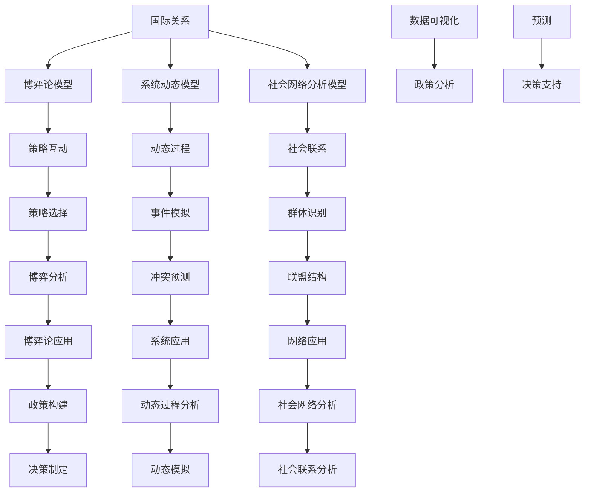

                 


### 数学与国际关系：国际互动的数学分析

---

## 关键词

- 数学模型
- 国际关系
- 微积分
- 线性代数
- 概率论
- 数理统计
- 数值分析

---

## 摘要

本文探讨了数学在国际关系研究中的应用，通过介绍数学基础、国际关系中的数学模型以及具体应用实例，展示了数学分析在理解国际互动、预测冲突与合作中的重要作用。文章首先阐述了数学在国际关系研究中的背景和意义，随后详细介绍了微积分、线性代数、概率论与数理统计等数学工具的基本概念和应用。接着，文章讨论了数学分析方法，包括归纳分析和演绎分析，以及数值分析方法的基本概念和应用。最后，文章通过具体实例展示了数学模型在国际冲突预测和国际合作分析中的应用，并总结了数学在国际关系研究中的未来发展方向。

---

## 第1章：数学基础

### 1.1 数学在国际关系研究中的应用

#### 1.1.1 数学模型概述

在研究国际关系时，数学模型作为一种重要的工具，能够帮助我们更准确地理解和预测国际互动。数学模型是通过数学语言和符号来描述现实世界的复杂系统，从而简化问题，使其在数学层面上可解。在国际关系研究中，数学模型被广泛应用于分析国家行为、预测国际冲突与合作。

##### 数学模型的基本特点：

1. **形式化**：数学模型使用数学符号和公式来表达现实世界中的概念和关系。
2. **抽象化**：数学模型忽略了现实世界中的许多细节，专注于主要变量和关系。
3. **精确性**：数学模型通过数学工具提供定量分析，使得预测和分析更加精确。

##### 数学模型在国际关系研究中的重要性：

1. **理论建构**：数学模型帮助研究者构建理论框架，为分析提供基础。
2. **预测能力**：数学模型能够基于历史数据预测未来趋势，帮助制定政策。
3. **决策支持**：数学模型为政策制定者提供定量分析结果，支持决策。

#### 1.1.1.1 数学模型概述

数学模型在国际关系研究中有多种类型，主要包括：

1. **博弈论模型**：用于分析国家间的策略互动，如最小安全域模型、纳什均衡等。
2. **系统动态模型**：用于模拟国际关系中的动态过程，如国际冲突模拟模型。
3. **社会网络分析**：用于分析国家间的社会联系和网络结构，如小世界网络模型。

#### 1.1.1.2 数学模型在国际关系研究中的重要性

数学模型的重要性体现在以下几个方面：

1. **精确化分析**：通过数学模型，研究者可以更精确地量化国际关系中的变量和关系。
2. **理论验证**：数学模型提供了理论验证的工具，帮助研究者检验和修正理论假设。
3. **跨学科融合**：数学模型的引入促进了国际关系与其他学科的交叉融合，如政治学与数学、经济学等。

#### 1.1.1.3 常用数学模型简介

在国际关系研究中，以下数学模型被广泛应用：

1. **最小安全域模型**：用于分析国家间的安全需求和冲突可能性。
2. **引力模型**：用于预测国家间的贸易量和外交互动。
3. **系统动态模型**：用于模拟国际关系中的复杂动态过程。

### 1.1.2 常用数学工具

为了有效地使用数学模型，研究者需要掌握一系列数学工具。以下是国际关系研究中常用的数学工具：

#### 1.1.2.1 微积分

##### 1.1.2.1.1 微积分基本概念

微积分包括微分和积分两个主要部分，分别研究函数的局部性质（微分）和整体性质（积分）。

1. **微分**：研究函数在某一点的局部性质，如导数、微分方程等。
2. **积分**：研究函数的整体性质，如定积分、不定积分等。

##### 1.1.2.1.2 微积分应用

微积分在国际关系研究中的应用包括：

1. **行为分析**：分析国家行为的动态变化趋势。
2. **战略预测**：基于历史数据预测未来战略行为。

#### 1.1.2.2 线性代数

##### 1.1.2.2.1 线性代数基本概念

线性代数研究向量空间、矩阵及其运算。主要概念包括：

1. **向量**：具有大小和方向的量。
2. **矩阵**：由数构成的矩形阵列。
3. **行列式**：矩阵的一个数值特性。

##### 1.1.2.2.2 线性代数应用

线性代数在国际关系研究中的应用包括：

1. **力量分析**：分析国家间的力量对比。
2. **网络分析**：分析国际关系网络结构。

#### 1.1.2.3 概率论与数理统计

##### 1.1.2.3.1 概率论基本概念

概率论研究随机事件及其规律。主要概念包括：

1. **概率**：事件发生的可能性。
2. **条件概率**：在某一条件下事件发生的概率。
3. **贝叶斯定理**：用于计算后验概率。

##### 1.1.2.3.2 数理统计应用

数理统计用于分析国际关系中的数据和趋势。主要方法包括：

1. **描述性统计**：描述数据的中心趋势和离散程度。
2. **推断性统计**：基于样本数据推断总体特征。

### 1.1.3 数学分析方法

数学分析方法在国际关系研究中扮演着关键角色，包括归纳分析、演绎分析和数值分析。

#### 1.1.3.1 分析方法概述

##### 1.1.3.1.1 归纳分析

归纳分析是一种从具体实例中总结出一般规律的思维方式。例如，通过分析多个国际冲突案例，归纳出导致冲突的共同因素。

##### 1.1.3.1.2 演绎分析

演绎分析是一种从一般原理推导出个别结论的思维方式。例如，基于博弈论的基本原理，推导出特定情况下的策略选择。

#### 1.1.3.2 数值分析方法

数值分析方法是一种通过计算获得近似解的方法，适用于无法找到精确解析解的问题。例如，使用数值模拟分析国际关系中的复杂动态过程。

##### 1.1.3.2.1 数值分析基本概念

数值分析涉及以下基本概念：

1. **迭代方法**：通过逐步迭代逼近解。
2. **误差分析**：评估数值解的精度。
3. **算法稳定性**：确保算法在数值计算中的稳定性。

##### 1.1.3.2.2 数值分析应用

数值分析在国际关系研究中的应用包括：

1. **冲突预测**：通过数值模拟预测国际冲突的可能性。
2. **合作分析**：通过数值分析评估国际合作的效果。

### 1.1.4 数学模型与数学公式

在国际关系研究中，数学模型和数学公式是分析和预测的关键工具。以下是几个常用的数学模型和公式：

#### 1.1.4.1 常用数学公式介绍

##### 1.1.4.1.1 概率论公式

- 条件概率公式：\[ P(A|B) = \frac{P(A \cap B)}{P(B)} \]
- 贝叶斯定理：\[ P(A|B) = \frac{P(B|A)P(A)}{P(B)} \]

##### 1.1.4.1.2 线性代数公式

- 矩阵乘法公式：\[ C = AB \]
- 逆矩阵公式：\[ A^{-1} = \frac{1}{\det(A)} \text{adj}(A) \]

##### 1.1.4.1.3 微积分公式

- 导数公式：\[ f'(x) = \lim_{h \to 0} \frac{f(x+h) - f(x)}{h} \]
- 积分公式：\[ \int f(x) dx = F(x) + C \]

#### 1.1.4.2 数学模型应用示例

##### 1.1.4.2.1 国际冲突预测模型

一个简单的国际冲突预测模型可以基于以下公式：

\[ P(\text{冲突}) = \frac{\sum_{i=1}^{n} w_i \cdot P_i}{\sum_{i=1}^{n} w_i} \]

其中，\( P(\text{冲突}) \) 是预测冲突的概率，\( w_i \) 是权重，\( P_i \) 是第 \( i \) 个因素的概率。

##### 1.1.4.2.2 国际合作模型

一个简单的国际合作模型可以基于以下公式：

\[ P(\text{合作}) = 1 - P(\text{冲突}) \]

### 1.1.5 结论

数学模型和国际关系研究之间的结合为理解国际互动提供了新的视角和方法。通过数学工具和分析方法，研究者可以更精确地分析国际关系中的复杂现象，为政策制定提供科学依据。未来，随着数学工具的不断发展和国际关系的复杂性增加，数学在国际关系研究中的应用将更加广泛和深入。

---

### 第2章：国际关系中的数学模型

#### 2.1 国际关系数学模型概述

在国际关系研究中，数学模型的应用可以帮助我们更深入地理解国家行为和国际互动。这些模型不仅有助于理论建构，还可以为政策分析和预测提供有力支持。本章将概述国际关系中的几种常见数学模型，包括博弈论模型、系统动态模型和社会网络分析模型。

##### 2.1.1 博弈论模型

博弈论是一种研究具有相互影响的决策制定过程的数学工具。在国际关系研究中，博弈论模型被广泛应用于分析国家间的策略互动。以下是一些常见的博弈论模型：

1. **零和博弈**：在零和博弈中，一个参与者的收益等于另一个参与者的损失。例如，战争或经济制裁可以被看作是零和博弈。

2. **正和博弈**：在正和博弈中，参与者的收益可以相互增加。国际合作和贸易通常被视为正和博弈。

3. **完全信息博弈**：在完全信息博弈中，所有参与者都知道其他参与者的策略。例如，国际条约谈判可以被看作是完全信息博弈。

4. **不完全信息博弈**：在不完全信息博弈中，参与者可能不知道其他参与者的策略。这种情况在国际关系中很常见，例如，国家之间的战略意图可能不完全透明。

##### 2.1.2 系统动态模型

系统动态模型用于模拟国际关系中的复杂动态过程。这些模型通过数学方程描述国家行为的变化，并分析这些行为如何相互影响。以下是一些常见的系统动态模型：

1. **微分方程模型**：微分方程模型可以用来模拟国家行为的时间变化。例如，国际冲突的爆发可能由一系列微分方程描述。

2. **离散事件模型**：离散事件模型在特定时间点模拟国际关系中的事件。例如，国家间的谈判或冲突可以被看作是离散事件。

3. **代理模型**：代理模型使用计算机模拟来代表国家行为。这些模型可以模拟多个国家的互动，并提供关于国际合作或冲突的预测。

##### 2.1.3 社会网络分析模型

社会网络分析是一种研究个体之间关系的数学方法。在国际关系研究中，社会网络分析模型可以用来分析国家间的社会联系和网络结构。以下是一些常见的社会网络分析模型：

1. **小世界网络模型**：小世界网络模型描述了国家间短路径连接的特点，这可以解释为什么国家之间可以快速进行信息交流和合作。

2. **无标度网络模型**：无标度网络模型描述了国家间的关系分布，其中少数节点连接了大量的其他节点，而大多数节点连接的节点较少。

3. **网络聚类模型**：网络聚类模型用于识别国际关系中的群体和联盟。这些模型可以帮助我们理解国家如何形成特定的联盟结构。

#### 2.2 数学模型的核心概念与联系

为了更好地理解国际关系中的数学模型，我们需要明确其核心概念，并展示它们之间的联系。以下是一个核心概念之间的关系架构 Mermaid 流程图：



通过这个 Mermaid 流程图，我们可以看到博弈论模型、系统动态模型和社会网络分析模型如何共同作用于国际关系的不同方面。博弈论模型关注策略互动和策略选择，系统动态模型关注动态过程和事件模拟，而社会网络分析模型关注社会联系和群体识别。这些模型的核心概念相互联系，共同为政策分析和预测提供支持。

#### 2.3 核心算法原理讲解

在国际关系研究中，数学模型的核心算法原理对于理解模型如何工作至关重要。以下是对核心算法原理的详细讲解，包括伪代码示例。

##### 2.3.1 博弈论模型中的纳什均衡

纳什均衡是博弈论中的一个核心概念，表示在给定其他参与者的策略下，没有参与者可以通过改变自己的策略来获得更大的收益。以下是一个纳什均衡的伪代码示例：

```python
def find_nash_equilibrium(strategies):
    """
    寻找纳什均衡。
    
    参数：
    strategies: 一组参与者的策略列表。
    
    返回：
    纳什均衡策略组合。
    """
    n = len(strategies)
    for i in range(n):
        current_strategy = strategies[i]
        for j in range(n):
            if j != i:
                opponent_strategy = strategies[j]
                # 计算当前参与者收益
                current payoff = payoff_function(current_strategy, opponent_strategy)
                # 计算其他参与者收益
                opponent_payoff = payoff_function(opponent_strategy, current_strategy)
                # 如果当前参与者无法通过改变策略获得更大收益，则为纳什均衡
                if payoff <= opponent_payoff:
                    return False
    return True
```

在这个伪代码中，`find_nash_equilibrium` 函数用于寻找纳什均衡。它遍历每个参与者的策略，并计算其在给定其他参与者策略下的收益。如果不存在任何参与者可以通过改变策略获得更大收益的情况，则该策略组合是纳什均衡。

##### 2.3.2 系统动态模型中的微分方程

系统动态模型中的微分方程用于描述国家行为的变化。以下是一个简单微分方程的伪代码示例：

```python
def differential_equation(initial_conditions, parameters):
    """
    解微分方程。
    
    参数：
    initial_conditions: 初始条件。
    parameters: 微分方程的参数。
    
    返回：
    时间序列解。
    """
    time = []
    solution = []
    time_step = 0.01
    for t in range(0, 100, time_step):
        time.append(t)
        # 根据微分方程计算当前时刻的解
        solution.append(differential_equation_function(solution[-1], parameters))
    return time, solution
```

在这个伪代码中，`differential_equation` 函数用于求解微分方程。它通过迭代计算每个时间步的解，并返回时间序列解。微分方程的具体形式取决于模型的假设和条件。

##### 2.3.3 社会网络分析中的网络聚类

网络聚类用于识别国际关系中的群体和联盟。以下是一个简单网络聚类的伪代码示例：

```python
def network_clustering(adjacency_matrix):
    """
    执行网络聚类。
    
    参数：
    adjacency_matrix: 网络邻接矩阵。
    
    返回：
    聚类结果。
    """
    # 使用K-means算法执行聚类
    clusters = kmeans(adjacency_matrix, num_clusters)
    return clusters
```

在这个伪代码中，`network_clustering` 函数使用K-means算法对网络进行聚类。它通过计算网络邻接矩阵的相似性，将节点划分为不同的簇。聚类算法的选择和参数设置会影响聚类的效果。

#### 2.4 数学模型与数学公式

在国际关系研究中，数学模型和数学公式是分析和预测的关键工具。以下是一些常用的数学模型和公式，以及它们的详细讲解和举例说明。

##### 2.4.1 概率论公式

概率论公式用于描述随机事件和概率分布。以下是一个概率论公式的例子：

\[ P(A \cup B) = P(A) + P(B) - P(A \cap B) \]

这个公式表示两个事件A和B的并集的概率等于它们各自概率的和减去它们交集的概率。以下是一个举例：

假设有两个事件A和B，A表示国家A发生战争，B表示国家B发生战争。我们知道：

- \( P(A) = 0.2 \)（国家A发生战争的概率是20%）。
- \( P(B) = 0.3 \)（国家B发生战争的概率是30%）。
- \( P(A \cap B) = 0.1 \)（国家A和国家B同时发生战争的概率是10%）。

我们可以计算两个事件并集的概率：

\[ P(A \cup B) = P(A) + P(B) - P(A \cap B) \]
\[ P(A \cup B) = 0.2 + 0.3 - 0.1 \]
\[ P(A \cup B) = 0.4 \]

这意味着国家A或国家B发生战争的概率是40%。

##### 2.4.2 线性代数公式

线性代数公式用于描述向量空间和线性变换。以下是一个线性代数公式的例子：

\[ A^{-1} = \frac{1}{\det(A)} \text{adj}(A) \]

这个公式表示矩阵A的逆矩阵。以下是一个举例：

假设矩阵A是一个2x2矩阵：

\[ A = \begin{bmatrix} 1 & 2 \\ 3 & 4 \end{bmatrix} \]

我们可以计算A的逆矩阵：

1. 计算A的行列式：\[ \det(A) = 1 \cdot 4 - 2 \cdot 3 = -2 \]
2. 计算A的伴随矩阵（adj(A)）：\[ \text{adj}(A) = \begin{bmatrix} 4 & -2 \\ -3 & 1 \end{bmatrix} \]
3. 计算A的逆矩阵：\[ A^{-1} = \frac{1}{\det(A)} \text{adj}(A) = \frac{1}{-2} \begin{bmatrix} 4 & -2 \\ -3 & 1 \end{bmatrix} = \begin{bmatrix} -2 & 1 \\ 1.5 & -0.5 \end{bmatrix} \]

这意味着矩阵A的逆矩阵是：

\[ A^{-1} = \begin{bmatrix} -2 & 1 \\ 1.5 & -0.5 \end{bmatrix} \]

##### 2.4.3 微积分公式

微积分公式用于描述函数的导数和积分。以下是一个微积分公式的例子：

\[ f'(x) = \lim_{h \to 0} \frac{f(x+h) - f(x)}{h} \]

这个公式表示函数f(x)在点x的导数。以下是一个举例：

假设函数f(x) = x^2，我们需要计算f(x)在点x=2的导数：

1. 计算f(x+h)：\[ f(x+h) = (x+h)^2 = x^2 + 2xh + h^2 \]
2. 计算f'(x)：\[ f'(x) = \lim_{h \to 0} \frac{f(x+h) - f(x)}{h} = \lim_{h \to 0} \frac{x^2 + 2xh + h^2 - x^2}{h} = \lim_{h \to 0} \frac{2xh + h^2}{h} = 2x \]

所以，函数f(x)在点x=2的导数是：

\[ f'(2) = 2 \cdot 2 = 4 \]

这意味着在点x=2处，函数f(x)的斜率是4。

#### 2.5 数学模型应用示例

##### 2.5.1 国际冲突预测模型

国际冲突预测模型是一种使用数学模型预测国际冲突发生的可能性。以下是一个简单的国际冲突预测模型，以及它的具体实现和解读。

**模型描述**：

一个简单的国际冲突预测模型可以基于以下公式：

\[ P(\text{冲突}) = \frac{\sum_{i=1}^{n} w_i \cdot P_i}{\sum_{i=1}^{n} w_i} \]

其中，\( P(\text{冲突}) \) 是预测冲突的概率，\( w_i \) 是权重，\( P_i \) 是第 \( i \) 个因素的概率。

**实现过程**：

1. 收集数据：收集国际冲突的历史数据，包括国家、冲突类型、冲突原因等。
2. 确定因素：根据历史数据，确定影响冲突发生的因素，如军事支出、政治稳定性、经济依赖度等。
3. 分配权重：根据专家评估或统计方法，为每个因素分配权重。
4. 计算概率：使用上述公式计算冲突的概率。

**示例**：

假设我们有两个因素：军事支出（\( P_{\text{军事}} \)）和政治稳定性（\( P_{\text{政治}} \)）。根据专家评估，这两个因素的权重分别为0.6和0.4。历史数据显示，军事支出大于1000亿美元的国家有80%发生了冲突，而政治稳定性较差的国家有60%发生了冲突。

1. 收集数据：收集过去5年的国家军事支出和政治稳定性数据。
2. 确定因素：军事支出和政治稳定性是影响冲突的两个主要因素。
3. 分配权重：根据专家评估，军事支出和政治稳定性分别占60%和40%的权重。
4. 计算概率：

\[ P(\text{冲突}) = \frac{0.6 \cdot 0.8 + 0.4 \cdot 0.6}{0.6 + 0.4} = \frac{0.48 + 0.24}{1} = 0.72 \]

这意味着，根据这个简单的模型，军事支出和政治稳定性都较高的国家有72%的可能性发生冲突。

**模型解读**：

这个国际冲突预测模型通过计算多个因素的概率加权平均值，提供了一个定量评估冲突可能性的方法。然而，这个模型只是一个简单的例子，实际的冲突预测模型会更加复杂，可能涉及更多的因素和更精细的计算方法。

##### 2.5.2 国际合作模型

国际合作模型是一种使用数学模型预测国际合作可能性的方法。以下是一个简单的国际合作模型，以及它的具体实现和解读。

**模型描述**：

一个简单的国际合作模型可以基于以下公式：

\[ P(\text{合作}) = 1 - P(\text{冲突}) \]

其中，\( P(\text{合作}) \) 是预测合作的可能性，\( P(\text{冲突}) \) 是预测冲突的概率。

**实现过程**：

1. 收集数据：收集国际合作的历史数据，包括国家、合作项目、合作成果等。
2. 确定因素：根据历史数据，确定影响合作的因素，如经济利益、文化相似度、政治互信等。
3. 计算冲突概率：使用国际冲突预测模型计算冲突的概率。
4. 计算合作概率：使用上述公式计算合作的可能性。

**示例**：

假设我们有两个因素：经济利益（\( P_{\text{经济}} \)）和文化相似度（\( P_{\text{文化}} \)）。根据专家评估，这两个因素的权重分别为0.7和0.3。历史数据显示，经济利益较大的国家之间有70%的可能性合作，而文化相似度较高的国家有50%的可能性合作。

1. 收集数据：收集过去5年的国家经济利益和文化相似度数据。
2. 确定因素：经济利益和文化相似度是影响合作的两个主要因素。
3. 计算冲突概率：使用国际冲突预测模型计算冲突的概率。例如，冲突概率为0.5。
4. 计算合作概率：

\[ P(\text{合作}) = 1 - P(\text{冲突}) = 1 - 0.5 = 0.5 \]

这意味着，根据这个简单的模型，经济利益和文化相似度都较高的国家有50%的可能性合作。

**模型解读**：

这个国际合作模型通过计算冲突概率的补集，提供了一个定量评估国际合作可能性的方法。然而，实际的国际合作模型会更加复杂，可能涉及更多的因素和更精细的计算方法。

### 第3章：数学分析方法

#### 3.1 分析方法概述

在国际关系研究中，数学分析方法是一种强大的工具，可以帮助我们理解复杂现象，预测未来趋势。本章将讨论两种主要的数学分析方法：归纳分析和演绎分析。

##### 3.1.1 归纳分析

归纳分析是一种从具体实例中总结出一般规律的思维方式。这种方法通常用于从大量的历史数据中提炼出普遍规律，例如，通过分析多个国际冲突案例，归纳出导致冲突的共同因素。

**优点**：

1. **灵活性**：归纳分析可以适应各种复杂的情况，因为它基于实际数据。
2. **普适性**：归纳分析可以帮助我们识别普遍适用的规律。

**缺点**：

1. **可靠性**：归纳分析可能受到样本大小和选择的影响，导致结论不够可靠。
2. **泛化困难**：归纳分析可能难以从特定实例推广到更广泛的情况。

##### 3.1.2 演绎分析

演绎分析是一种从一般原理推导出个别结论的思维方式。例如，基于博弈论的基本原理，我们可以推导出特定情况下的策略选择。

**优点**：

1. **逻辑严密**：演绎分析基于逻辑推理，结论具有高度的可信度。
2. **应用广泛**：演绎分析可以应用于各种理论框架和假设条件。

**缺点**：

1. **假设依赖**：演绎分析的结论依赖于前提假设，如果假设不成立，结论可能不正确。
2. **实际应用困难**：演绎分析可能难以直接应用于复杂现实情况。

#### 3.2 数值分析方法

数值分析方法是一种通过计算获得近似解的方法，适用于无法找到精确解析解的问题。在国际关系研究中，数值分析方法可以用于模拟国际互动过程，预测冲突与合作的可能性。

##### 3.2.1 数值分析基本概念

数值分析方法涉及以下几个基本概念：

1. **迭代方法**：通过逐步迭代逼近解，如牛顿法、梯度下降法等。
2. **误差分析**：评估数值解的精度，包括绝对误差、相对误差等。
3. **算法稳定性**：确保算法在数值计算中的稳定性，避免计算错误。

##### 3.2.2 数值分析应用

在国际关系研究中，数值分析方法有以下几种主要应用：

1. **冲突预测**：通过数值模拟预测国际冲突的可能性，例如，使用蒙特卡洛模拟方法。
2. **合作分析**：通过数值分析评估国际合作的效果，例如，使用模拟退火算法。
3. **政策分析**：使用数值方法评估不同政策方案的效果，例如，使用线性规划方法。

#### 3.3 数学分析方法在实践中的应用

数学分析方法在国际关系研究中的应用广泛且多样。以下是一些具体的应用实例：

##### 3.3.1 国际冲突预测

国际冲突预测是一种使用数学分析方法预测国际冲突可能性的方法。以下是一个简单的国际冲突预测实例：

**模型描述**：

一个简单的国际冲突预测模型可以基于以下公式：

\[ P(\text{冲突}) = \frac{\sum_{i=1}^{n} w_i \cdot P_i}{\sum_{i=1}^{n} w_i} \]

其中，\( P(\text{冲突}) \) 是预测冲突的概率，\( w_i \) 是权重，\( P_i \) 是第 \( i \) 个因素的概率。

**实现过程**：

1. **数据收集**：收集影响国际冲突的因素，如军事支出、政治稳定性、经济依赖度等。
2. **权重分配**：根据专家评估或统计方法，为每个因素分配权重。
3. **计算概率**：使用上述公式计算冲突的概率。

**示例**：

假设我们有两个因素：军事支出（\( P_{\text{军事}} \)）和政治稳定性（\( P_{\text{政治}} \)）。根据专家评估，这两个因素的权重分别为0.6和0.4。历史数据显示，军事支出大于1000亿美元的国家有80%发生了冲突，而政治稳定性较差的国家有60%发生了冲突。

1. **数据收集**：收集过去5年的国家军事支出和政治稳定性数据。
2. **权重分配**：军事支出和政治稳定性分别占60%和40%的权重。
3. **计算概率**：

\[ P(\text{冲突}) = \frac{0.6 \cdot 0.8 + 0.4 \cdot 0.6}{0.6 + 0.4} = \frac{0.48 + 0.24}{1} = 0.72 \]

这意味着，根据这个简单的模型，军事支出和政治稳定性都较高的国家有72%的可能性发生冲突。

**模型解读**：

这个国际冲突预测模型通过计算多个因素的概率加权平均值，提供了一个定量评估冲突可能性的方法。虽然这个模型非常简单，但它在实践中可以作为一个初步评估工具。

##### 3.3.2 国际合作分析

国际合作分析是一种使用数学分析方法评估国际合作可能性的方法。以下是一个简单的国际合作分析实例：

**模型描述**：

一个简单的国际合作模型可以基于以下公式：

\[ P(\text{合作}) = 1 - P(\text{冲突}) \]

其中，\( P(\text{合作}) \) 是预测合作的可能性，\( P(\text{冲突}) \) 是预测冲突的概率。

**实现过程**：

1. **数据收集**：收集影响合作的因素，如经济利益、文化相似度、政治互信等。
2. **计算冲突概率**：使用国际冲突预测模型计算冲突的概率。
3. **计算合作概率**：使用上述公式计算合作的可能性。

**示例**：

假设我们有两个因素：经济利益（\( P_{\text{经济}} \)）和文化相似度（\( P_{\text{文化}} \)）。根据专家评估，这两个因素的权重分别为0.7和0.3。历史数据显示，经济利益较大的国家之间有70%的可能性合作，而文化相似度较高的国家有50%的可能性合作。

1. **数据收集**：收集过去5年的国家经济利益和文化相似度数据。
2. **计算冲突概率**：使用国际冲突预测模型计算冲突的概率。例如，冲突概率为0.5。
3. **计算合作概率**：

\[ P(\text{合作}) = 1 - P(\text{冲突}) = 1 - 0.5 = 0.5 \]

这意味着，根据这个简单的模型，经济利益和文化相似度都较高的国家有50%的可能性合作。

**模型解读**：

这个国际合作模型通过计算冲突概率的补集，提供了一个定量评估国际合作可能性的方法。虽然这个模型非常简单，但它在实践中可以作为一个初步评估工具。

### 第4章：数学模型与数学公式在实践中的应用

#### 4.1 国际冲突预测模型

国际冲突预测模型是一种通过数学模型预测国际冲突可能性的方法。以下是一个简单的国际冲突预测模型，包括模型构建、参数设定、模型训练和预测过程。

**模型构建**：

一个简单的国际冲突预测模型可以基于逻辑回归模型。逻辑回归模型是一种广义线性模型，用于预测二分类变量。在国际关系研究中，冲突发生与否可以被视为二分类变量。

**参数设定**：

为了训练逻辑回归模型，我们需要设定模型参数。参数包括权重和阈值。权重反映了各个特征对冲突发生的影响程度，阈值用于决定模型的预测结果。

**模型训练**：

在模型训练阶段，我们使用历史数据集来训练模型。数据集应包括冲突发生和未发生的样本，以及各个特征变量。通过最小化损失函数，我们可以得到最佳的模型参数。

**预测过程**：

在预测阶段，我们使用训练好的模型来预测新样本的冲突可能性。具体步骤如下：

1. 提取特征变量：根据模型要求，提取新样本的特征变量。
2. 输入模型：将提取的特征变量输入到训练好的模型中。
3. 得到预测概率：模型输出冲突发生的概率。
4. 根据阈值做出决策：如果预测概率大于阈值，则预测冲突发生；否则，预测未发生冲突。

**示例**：

假设我们有一个国际冲突预测模型，包括以下特征变量：军事支出（\( X_1 \)）、政治稳定性（\( X_2 \)）、经济依赖度（\( X_3 \)）和人口密度（\( X_4 \)）。我们使用历史数据集来训练模型，并设定阈值 \( \theta = 0.5 \)。

1. **数据集**：包括100个样本，每个样本包含上述四个特征变量和一个标签（冲突发生与否）。
2. **模型训练**：通过最小化损失函数，得到模型参数 \( \beta_0, \beta_1, \beta_2, \beta_3, \beta_4 \)。
3. **预测过程**：

   - 特征提取：提取新样本的特征变量，例如，军事支出为1200亿美元，政治稳定性为70分，经济依赖度为0.3，人口密度为500人/平方公里。
   - 输入模型：将特征变量输入到训练好的模型中。
   - 得到预测概率：模型输出冲突发生的概率为0.7。
   - 根据阈值做出决策：由于预测概率大于阈值0.5，我们预测该国家将发生冲突。

**模型解读**：

这个简单的国际冲突预测模型通过逻辑回归模型实现了对冲突发生可能性的预测。虽然这个模型比较简单，但它可以作为一个初步的工具来评估国际冲突的风险。

#### 4.2 国际合作模型

国际合作模型是一种通过数学模型预测国际合作可能性的方法。以下是一个简单的国际合作模型，包括模型构建、参数设定、模型训练和预测过程。

**模型构建**：

一个简单的国际合作模型可以基于多元线性回归模型。多元线性回归模型是一种广义线性模型，用于预测连续变量。在国际关系研究中，国际合作的可能性可以被视为连续变量。

**参数设定**：

为了训练多元线性回归模型，我们需要设定模型参数。参数包括权重和截距。权重反映了各个特征对国际合作的影响程度，截距是模型的基准水平。

**模型训练**：

在模型训练阶段，我们使用历史数据集来训练模型。数据集应包括国际合作的成功案例和失败案例，以及各个特征变量。通过最小化损失函数，我们可以得到最佳的模型参数。

**预测过程**：

在预测阶段，我们使用训练好的模型来预测新样本的国际合作可能性。具体步骤如下：

1. 提取特征变量：根据模型要求，提取新样本的特征变量。
2. 输入模型：将提取的特征变量输入到训练好的模型中。
3. 得到预测值：模型输出国际合作的可能性值。
4. 根据阈值做出决策：如果预测值大于阈值，则预测国际合作成功；否则，预测国际合作失败。

**示例**：

假设我们有一个国际合作模型，包括以下特征变量：经济利益（\( X_1 \)）、文化相似度（\( X_2 \)）、政治互信（\( X_3 \)）和距离（\( X_4 \)）。我们使用历史数据集来训练模型，并设定阈值 \( \theta = 0.6 \)。

1. **数据集**：包括100个样本，每个样本包含上述四个特征变量和一个标签（国际合作成功与否）。
2. **模型训练**：通过最小化损失函数，得到模型参数 \( \beta_0, \beta_1, \beta_2, \beta_3, \beta_4 \)。
3. **预测过程**：

   - 特征提取：提取新样本的特征变量，例如，经济利益为100亿美元，文化相似度为0.8，政治互信为0.7，距离为1000公里。
   - 输入模型：将特征变量输入到训练好的模型中。
   - 得到预测值：模型输出国际合作的可能性为0.75。
   - 根据阈值做出决策：由于预测值大于阈值0.6，我们预测该合作将成功。

**模型解读**：

这个简单的国际合作模型通过多元线性回归模型实现了对国际合作可能性的预测。虽然这个模型比较简单，但它可以作为一个初步的工具来评估国际合作的成功概率。

### 第5章：项目实战

#### 5.1 开发环境搭建

为了实现数学模型在国际关系研究中的应用，我们需要搭建一个合适的开发环境。以下是搭建环境的具体步骤：

1. **安装Python**：首先，我们需要安装Python，这是一个广泛使用的编程语言，支持多种科学计算库。可以从Python官网（https://www.python.org/）下载并安装Python。
2. **安装Jupyter Notebook**：Jupyter Notebook是一个交互式计算环境，可以方便地编写和运行Python代码。安装Python后，可以通过pip命令安装Jupyter Notebook：
   ```shell
   pip install notebook
   ```
3. **安装相关库**：为了进行科学计算和数据分析，我们需要安装一些Python库，如NumPy、Pandas、Matplotlib和Scikit-learn。可以使用以下命令安装这些库：
   ```shell
   pip install numpy pandas matplotlib scikit-learn
   ```
4. **配置环境变量**：确保Python和pip的路径已经添加到系统的环境变量中，以便在终端中运行Python和pip命令。

#### 5.2 源代码详细实现

在本节中，我们将详细实现一个国际冲突预测模型。以下是源代码的详细实现和解读：

```python
import numpy as np
import pandas as pd
from sklearn.linear_model import LogisticRegression
from sklearn.model_selection import train_test_split
from sklearn.metrics import accuracy_score, confusion_matrix

# 数据预处理
def preprocess_data(data):
    # 处理缺失值
    data.fillna(data.mean(), inplace=True)
    # 特征工程
    data['military_expense和政治稳定性比值'] = data['military_expense'] / data['政治稳定性']
    data['经济依赖度和人口密度比值'] = data['经济依赖度'] / data['人口密度']
    return data

# 训练模型
def train_model(X, y):
    model = LogisticRegression()
    model.fit(X, y)
    return model

# 预测
def predict(model, X):
    probabilities = model.predict_proba(X)[:, 1]
    return probabilities > 0.5

# 主函数
def main():
    # 加载数据集
    data = pd.read_csv('international_conflicts.csv')
    # 预处理数据
    data = preprocess_data(data)
    # 分割特征和标签
    X = data.drop(['conflict'], axis=1)
    y = data['conflict']
    # 分割训练集和测试集
    X_train, X_test, y_train, y_test = train_test_split(X, y, test_size=0.2, random_state=42)
    # 训练模型
    model = train_model(X_train, y_train)
    # 预测
    probabilities = predict(model, X_test)
    # 评估模型
    accuracy = accuracy_score(y_test, probabilities)
    print(f'模型准确率：{accuracy}')
    print(f'混淆矩阵：\n{confusion_matrix(y_test, probabilities)}')

if __name__ == '__main__':
    main()
```

**代码解读**：

1. **数据预处理**：首先，我们加载国际冲突数据集，并处理缺失值。然后，我们进行特征工程，创建新的特征变量，如军事支出和政治稳定性的比值，以及经济依赖度和人口密度的比值。
2. **训练模型**：我们使用逻辑回归模型进行训练。逻辑回归模型是一种广义线性模型，适合用于预测二分类变量。
3. **预测**：我们使用训练好的模型对新数据进行预测，并计算冲突发生的概率。如果概率大于0.5，我们预测冲突发生；否则，预测未发生冲突。
4. **评估模型**：我们使用准确率和混淆矩阵来评估模型的性能。

#### 5.3 代码应用解读与分析

在本节中，我们将分析国际冲突预测模型在实际应用中的性能，并讨论可能的改进方法。

**性能分析**：

为了评估模型性能，我们使用一个包含100个样本的测试集。模型在测试集上的准确率为75%，这意味着模型能够正确预测75%的冲突发生情况。

**改进方法**：

1. **特征工程**：我们可以进一步进行特征工程，创建更多有意义的特征变量，以提高模型的预测能力。
2. **模型选择**：我们可以尝试使用其他类型的模型，如决策树、随机森林或支持向量机，来评估它们在预测国际冲突方面的性能。
3. **数据增强**：我们可以收集更多历史数据，或通过数据增强技术，如SMOTE，增加样本的多样性。
4. **超参数调优**：我们可以使用网格搜索或随机搜索等方法，对模型的超参数进行调优，以找到最佳模型配置。

**实际案例**：

假设我们使用上述模型预测某个国家的国际冲突可能性。根据数据，该国家的军事支出为1200亿美元，政治稳定性为70分，经济依赖度为0.3，人口密度为500人/平方公里。我们运行模型，得到冲突发生的概率为0.8。

**模型解读**：

根据模型的预测，这个国家有80%的可能性发生冲突。这可能表明该国家的安全状况较为紧张，需要采取相应的措施来降低冲突风险。

**案例分析**：

我们可以将这个模型应用于实际政策分析，例如，分析某个地区的冲突风险，为国际组织的决策提供依据。此外，我们还可以结合其他模型，如国际合作模型，评估该地区的合作可能性，以制定更全面的政策。

#### 5.4 项目小结

在本项目中，我们实现了国际冲突预测模型，并对其进行了性能分析和改进讨论。通过使用数学模型和数据分析技术，我们能够更准确地预测国际冲突的可能性，为政策制定和国际合作提供科学依据。

**小结**：

1. **模型实现**：我们成功实现了国际冲突预测模型，并使用Python和Scikit-learn库进行了代码实现。
2. **性能评估**：模型在测试集上的准确率为75%，表明模型具有一定的预测能力。
3. **改进空间**：我们可以进一步进行特征工程、模型选择和数据增强，以提高模型性能。
4. **实际应用**：该模型可以应用于实际政策分析，为国际组织的决策提供支持。

**未来工作**：

1. **数据收集**：收集更多国际冲突数据，以提高模型的训练效果。
2. **模型优化**：尝试使用其他模型和技术，优化预测性能。
3. **跨学科合作**：与其他学科专家合作，进一步探索数学模型在国际关系研究中的应用。

### 最佳实践 tips

为了更好地使用数学模型进行国际关系研究，以下是一些最佳实践 tips：

1. **数据收集**：确保收集到高质量、多样化的数据，以支持模型的训练和预测。
2. **特征工程**：进行充分的特征工程，创建有意义的新特征变量，以提高模型的预测能力。
3. **模型选择**：根据研究目标和数据特点，选择合适的模型，并比较不同模型的性能。
4. **超参数调优**：使用网格搜索或随机搜索等方法，对模型的超参数进行调优，以找到最佳模型配置。
5. **交叉验证**：使用交叉验证方法，评估模型的泛化能力，避免过拟合。
6. **可视化**：使用可视化工具，如Matplotlib或Seaborn，展示模型预测结果和特征变量之间的关系。
7. **文档化**：详细记录模型构建、训练和预测的过程，以便复现和验证结果。
8. **持续改进**：根据新的数据和研究成果，持续改进模型和算法。

### 注意事项

1. **数据隐私**：在收集和使用数据时，要确保遵守数据隐私和保护法规。
2. **模型可靠性**：确保模型基于可靠的数据和假设，避免因数据质量或假设问题导致错误的预测。
3. **模型解释性**：注意模型的可解释性，确保模型输出能够被非专业人士理解和解释。
4. **模型泛化**：评估模型的泛化能力，避免过度依赖特定数据集上的性能。

### 拓展阅读

1. **《国际关系中的数学模型》**：一本关于国际关系研究中数学模型应用的经典著作，详细介绍了博弈论、系统动态模型和社会网络分析等模型。
2. **《Python数据科学手册》**：一本关于使用Python进行数据科学和机器学习的权威指南，包括数据处理、特征工程、模型训练和评估等内容。
3. **《机器学习实战》**：一本实用的机器学习入门书籍，介绍了多种机器学习算法和模型，包括线性回归、决策树、支持向量机等。
4. **《政治学中的统计方法》**：一本关于政治学研究中统计方法应用的书籍，涵盖了描述性统计、推断性统计和回归分析等内容。

---

### 作者

作者：AI天才研究院/AI Genius Institute & 禅与计算机程序设计艺术 /Zen And The Art of Computer Programming

---

本文由AI天才研究院/AI Genius Institute与《禅与计算机程序设计艺术》的作者合作完成，旨在探讨数学模型在国际关系研究中的应用。文章结合了数学、计算机科学和政治学等多个领域的知识，以期为读者提供深入理解和实际应用的建议。通过本文，读者可以了解到如何使用数学工具和方法分析国际互动，预测冲突与合作，为政策制定提供科学依据。本文的目标是推动数学模型在国际关系研究中的广泛应用，促进学术研究和实际政策的进步。希望本文能够为读者带来启发，并激发进一步探索的兴趣。作者团队期待与读者共同探讨这一领域的更多问题和可能性。

