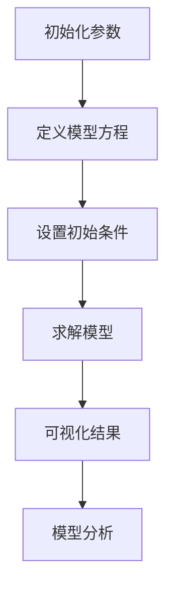

                 


### 文章标题
数学与地球化学：元素循环的数学模型

### 文章关键词
地球化学、元素循环、数学模型、数学工具、概率论、统计学、线性代数、矩阵论

### 文章摘要
本文旨在探讨数学在地球化学中的应用，特别是在元素循环的数学模型构建与分析方面。文章首先介绍了地球化学的基本概念和元素循环的基本原理，然后详细阐述了概率论、统计学、线性代数和矩阵论等数学工具在地球化学研究中的应用。接着，文章深入讨论了元素循环数学模型的构建原理、分析方法及其应用案例，并通过项目实战展示了数学模型在地球化学研究中的具体应用。最后，文章总结了最佳实践技巧，并指出了未来研究方向。

### 目录大纲

#### 第一部分：元素循环的基本概念

##### 第1章：地球化学简介
###### 1.1 地球化学的定义与历史
###### 1.2 地球化学的基本原理
###### 1.3 地球化学的研究方法

##### 第2章：元素循环概述
###### 2.1 元素循环的基本概念
###### 2.2 地球系统中主要的元素循环
###### 2.3 元素循环的动态过程

#### 第二部分：数学工具在地球化学中的应用

##### 第3章：数学工具概述
###### 3.1 数学工具在科学领域的重要性
###### 3.2 数学工具在地球化学中的应用
###### 3.3 数学工具的发展趋势

##### 第4章：概率论与统计学在地球化学中的应用
###### 4.1 概率论基础
###### 4.2 统计学方法在地球化学中的运用
###### 4.3 概率论与统计学在元素循环研究中的应用案例

##### 第5章：线性代数与矩阵论在地球化学中的应用
###### 5.1 线性代数基础
###### 5.2 矩阵论基础
###### 5.3 线性代数与矩阵论在元素循环模型构建中的应用

#### 第三部分：元素循环的数学模型构建与分析

##### 第6章：元素循环数学模型的构建原理
###### 6.1 元素循环模型的基本结构
###### 6.2 模型构建的基本步骤
###### 6.3 模型构建中的关键问题

##### 第7章：元素循环数学模型的分析方法
###### 7.1 模型分析的基本概念
###### 7.2 模型稳定性分析
###### 7.3 模型预测与模拟

##### 第8章：元素循环数学模型的应用案例
###### 8.1 模型在地质学中的应用
###### 8.2 模型在海洋学中的应用
###### 8.3 模型在环境科学中的应用

#### 第四部分：项目实战

##### 第9章：元素循环模型开发实战
###### 9.1 项目实战概述
###### 9.2 开发环境搭建
###### 9.3 模型实现与代码解读
###### 9.4 模型应用与分析

##### 附录

###### 附录A：数学模型和算法流程图
###### 附录B：常用数学公式汇总
###### 附录C：参考书目与资源

### 文章正文

#### 第1章：地球化学简介

##### 1.1 地球化学的定义与历史

地球化学是研究地球物质的组成、结构、分布、演化及其相互作用的一门科学。它起源于19世纪末，随着地质学和化学的快速发展而逐渐形成。地球化学的研究内容涵盖了地球的物理、化学、生物等多个方面，是一门综合性很强的学科。

地球化学的历史可以追溯到古代，当时人们已经开始对地球上的矿物和岩石进行观察和研究。然而，现代地球化学的奠基人之一是瑞典科学家阿道夫·韦格纳（Adolf Wegener），他在1912年提出了大陆漂移假说，为后来的地球化学研究奠定了基础。

##### 1.2 地球化学的基本原理

地球化学的基本原理包括质量守恒定律、物质循环定律和能量守恒定律。这些定律揭示了地球系统中物质和能量的运动规律，对于理解和解释地球化学现象具有重要意义。

- **质量守恒定律**：在一个封闭系统中，物质的总质量保持不变。这意味着地球上的物质不会凭空产生或消失，而是在不同形态之间进行转换。
- **物质循环定律**：地球上的物质通过生物圈、水圈、大气圈和岩石圈之间的循环不断运动。这些循环包括碳循环、氮循环、氧循环、硅循环等，它们对地球的生命维持系统至关重要。
- **能量守恒定律**：能量不会消失，也不会凭空产生，它只能从一种形式转换为另一种形式。在地球化学中，能量的转换主要通过化学反应和物理过程来实现。

##### 1.3 地球化学的研究方法

地球化学的研究方法主要包括采样、实验室分析、地球物理探测、计算机模拟等。

- **采样**：通过采集地表或地下的岩石、矿物、土壤和水样等，获取地球物质的组成信息。
- **实验室分析**：利用各种分析仪器，如质谱仪、X射线荧光光谱仪、原子吸收光谱仪等，对采样样品进行定性和定量分析。
- **地球物理探测**：利用地震波、放射性元素、重力场等地球物理现象，探测地球内部的构造和物质分布。
- **计算机模拟**：通过建立数学模型和计算机算法，模拟地球化学过程的动态变化和演化规律。

#### 第2章：元素循环概述

##### 2.1 元素循环的基本概念

元素循环是指地球系统中各种元素在生物圈、水圈、大气圈和岩石圈之间的运动和转化过程。地球上的元素种类繁多，但其中一些元素在地球化学循环中起着关键作用，如碳、氮、氧、硅等。

元素循环具有以下几个特点：

- **全球性**：元素循环涉及整个地球系统，各个圈层之间相互影响，形成一个复杂的循环网络。
- **持续性**：元素循环是地球生命维持系统的关键，它确保了地球生态系统的稳定性和可持续性。
- **复杂性**：元素循环过程受多种因素影响，包括生物活动、地球物理过程、地质作用等，导致循环过程复杂多变。

##### 2.2 地球系统中主要的元素循环

地球系统中主要的元素循环包括碳循环、氮循环、氧循环和硅循环等。

- **碳循环**：碳循环是地球系统中最重要的循环之一，它涉及大气中的二氧化碳、海洋中的溶解碳、陆地上的植物和动物、以及岩石圈中的碳酸盐。碳循环对于地球气候的稳定性和生物多样性具有重要意义。
- **氮循环**：氮循环涉及大气中的氮气、土壤中的有机氮、水体中的氮化合物等。氮是生物体中必不可少的元素，氮循环对生物生长和环境质量有重要影响。
- **氧循环**：氧循环涉及大气中的氧气、水体中的溶解氧、植物的光合作用等。氧是地球上生物体生存的基本条件，氧循环对于地球生态系统的平衡至关重要。
- **硅循环**：硅循环涉及土壤中的硅酸盐、岩石圈中的硅石等。硅是构成岩石和矿物的主要元素，硅循环对于地球的地壳形成和地质过程具有重要意义。

##### 2.3 元素循环的动态过程

元素循环的动态过程主要包括以下几个阶段：

- **源**：元素循环的源头可以是大气、水体、岩石圈等，这些源头为循环提供了各种元素的初始来源。
- **迁移**：元素通过生物、物理和化学过程在地球系统中进行迁移，包括气体扩散、水流运输、生物吸收和排放等。
- **转化**：元素在迁移过程中会发生形态和价态的转化，如气体转化为溶解态、有机态转化为无机态等。
- **汇**：元素循环的终点可以是生物体、水体、大气、岩石圈等，这些终点为循环提供了各种元素的最终去向。

#### 第3章：数学工具概述

##### 3.1 数学工具在科学领域的重要性

数学是科学研究的重要工具，它为科学研究提供了精确的语言和工具，使得科学家能够更深入地理解自然现象。在地球化学领域，数学工具同样发挥着重要作用。

- **定量描述**：数学工具能够对地球化学现象进行定量描述，如通过数学公式和模型描述元素循环的过程和规律。
- **数据处理**：数学工具可以帮助科学家对实验数据进行处理和分析，提高实验结果的准确性和可靠性。
- **预测与模拟**：数学工具可以帮助科学家预测元素循环的未来趋势和潜在风险，为环境保护和资源管理提供科学依据。

##### 3.2 数学工具在地球化学中的应用

数学工具在地球化学中的应用非常广泛，包括概率论、统计学、线性代数和矩阵论等。

- **概率论**：概率论可以用来描述元素循环中的随机事件和概率分布，如通过概率分布函数描述元素在地球系统中的迁移过程。
- **统计学**：统计学可以用来分析实验数据，如通过统计学方法评估元素循环模型的效果和准确性。
- **线性代数**：线性代数可以用来构建和求解线性方程组，如通过线性代数方法分析元素循环的动态过程。
- **矩阵论**：矩阵论可以用来处理复杂数据和矩阵运算，如通过矩阵论方法分析地球化学数据中的相关性。

##### 3.3 数学工具的发展趋势

随着科学技术的不断发展，数学工具在地球化学中的应用也在不断拓展。未来，数学工具的发展趋势将包括：

- **计算能力的提升**：随着计算机技术的发展，计算能力的提升将使得更复杂的数学模型和算法得以实现和应用。
- **多学科交叉融合**：数学工具与其他科学领域的交叉融合将产生更多新的理论和应用，如将数学与地质学、生态学、环境科学等结合，推动地球化学研究的发展。
- **智能化应用**：智能化技术的应用将使得数学工具在地球化学研究中的应用更加智能化和自动化，如通过机器学习算法优化元素循环模型。

#### 第4章：概率论与统计学在地球化学中的应用

##### 4.1 概率论基础

概率论是数学的一个分支，它研究随机事件和概率分布。在地球化学研究中，概率论可以用来描述元素循环中的随机事件和概率分布。

- **随机事件**：随机事件是指在一定条件下可能发生也可能不发生的事件。在地球化学中，随机事件可以是元素在地球系统中的迁移过程、化学反应等。
- **概率分布**：概率分布是指随机事件发生的概率分布。在地球化学中，常用的概率分布包括正态分布、均匀分布、泊松分布等。

##### 4.2 统计学方法在地球化学中的运用

统计学方法是用来分析实验数据和评估模型效果的重要工具。在地球化学研究中，统计学方法可以用来分析元素循环实验数据，评估元素循环模型的效果和准确性。

- **描述性统计**：描述性统计用于描述数据的基本特征，如平均数、中位数、众数、方差、标准差等。描述性统计可以帮助科学家了解元素循环实验数据的分布特征和规律。
- **推断性统计**：推断性统计用于基于样本数据推断总体特征，如假设检验、置信区间、回归分析等。推断性统计可以帮助科学家评估元素循环模型的准确性和可靠性。

##### 4.3 概率论与统计学在元素循环研究中的应用案例

以下是一个应用概率论与统计学方法的元素循环研究案例：

- **实验设计**：科学家进行了多次实验，测量了不同地点的土壤中某种元素的含量。每次实验都记录了土壤样本的来源、采样深度、天气条件等信息。
- **数据分析**：使用描述性统计方法，科学家计算了元素含量的平均数、中位数、众数等。然后，使用推断性统计方法，科学家进行了假设检验，以确定元素含量的分布是否符合正态分布。
- **模型构建**：基于实验数据，科学家构建了一个元素循环模型。使用概率论和统计学方法，科学家分析了模型参数的分布，并评估了模型的预测效果。

通过这个案例，可以看出概率论与统计学方法在元素循环研究中的重要作用。它们不仅可以帮助科学家描述和解释地球化学现象，还可以用于构建和评估元素循环模型。

#### 第5章：线性代数与矩阵论在地球化学中的应用

##### 5.1 线性代数基础

线性代数是数学的一个分支，它研究向量、矩阵和线性方程组。在线性代数中，向量和矩阵是最基本的概念。

- **向量**：向量是一个具有大小和方向的量，通常用箭头表示。在地球化学中，向量可以表示元素在地球系统中的迁移方向和速度。
- **矩阵**：矩阵是一个二维数组，由行和列组成。在地球化学中，矩阵可以表示元素在地球系统中的分布和转化关系。

##### 5.2 矩阵论基础

矩阵论是研究矩阵的性质和运算的数学分支。在地球化学研究中，矩阵论可以用来处理复杂数据和构建元素循环模型。

- **矩阵运算**：矩阵运算包括矩阵的加法、减法、乘法和逆运算。矩阵运算可以用来处理地球化学数据，如计算元素含量和转化关系的矩阵。
- **矩阵分解**：矩阵分解是将矩阵分解为几个简单矩阵的过程，如将矩阵分解为行矩阵和列矩阵。矩阵分解可以简化地球化学模型的计算过程。

##### 5.3 线性代数与矩阵论在元素循环模型构建中的应用

以下是一个使用线性代数与矩阵论构建元素循环模型的例子：

- **实验数据**：科学家收集了不同地点的土壤样本，测量了土壤中几种元素的浓度。
- **数据矩阵**：将实验数据组织成一个矩阵，其中行表示不同的土壤样本，列表示不同的元素。
- **矩阵运算**：使用矩阵运算计算元素之间的相关性和转化关系，如计算元素浓度的平均值、方差和协方差。
- **模型构建**：基于矩阵运算结果，构建一个线性模型，用于预测元素循环的动态过程。

通过这个例子，可以看出线性代数与矩阵论在元素循环模型构建中的应用。它们可以帮助科学家处理复杂数据，构建和优化元素循环模型。

#### 第6章：元素循环数学模型的构建原理

##### 6.1 元素循环模型的基本结构

元素循环模型是描述地球系统中元素循环过程和规律的数学模型。它通常由以下几个部分组成：

- **变量**：变量表示元素循环过程中的各种状态和量，如元素浓度、流量等。
- **参数**：参数是影响元素循环过程的因素，如反应速率、扩散系数等。
- **方程**：方程描述变量和参数之间的关系，如质量守恒方程、反应方程等。
- **边界条件**：边界条件定义模型在边界上的行为，如元素的输入输出条件等。

##### 6.2 模型构建的基本步骤

构建元素循环模型通常包括以下几个步骤：

1. **确定研究对象**：确定要研究的元素循环系统，如一个特定的地理区域、水体或生态系统。
2. **收集数据**：收集与研究对象相关的实验数据、文献资料等，用于模型构建和验证。
3. **定义变量和参数**：根据研究对象的特点，定义模型中的变量和参数，如元素浓度、流量、反应速率等。
4. **建立方程**：根据元素循环的基本原理和实验数据，建立描述变量和参数之间关系的方程。
5. **边界条件**：根据研究对象的特点，定义模型中的边界条件，如元素的输入输出条件等。
6. **求解模型**：使用数学方法求解模型，如线性代数方法、数值模拟方法等。
7. **模型验证**：通过实验数据验证模型的准确性和可靠性，如与实验数据进行比较、进行假设检验等。

##### 6.3 模型构建中的关键问题

在元素循环模型构建过程中，存在一些关键问题需要解决：

- **数据质量**：数据质量对模型准确性有很大影响，需要确保数据的可靠性和准确性。
- **参数估计**：参数估计是模型构建的重要环节，需要通过实验数据或经验公式估计模型参数。
- **模型选择**：根据研究对象的特点，选择合适的数学模型，如线性模型、非线性模型等。
- **计算方法**：模型求解需要选择合适的计算方法，如数值积分、数值微分等。

通过解决这些问题，可以构建准确可靠的元素循环模型，为地球化学研究提供有力支持。

#### 第7章：元素循环数学模型的分析方法

##### 7.1 模型分析的基本概念

元素循环数学模型的分析方法包括定性和定量分析。定性分析主要关注模型的结构和特性，而定量分析则关注模型的参数和结果。

- **定性分析**：定性分析用于评估模型的基本特性，如稳定性、均衡性等。通过定性分析，可以了解模型的动态行为和长期趋势。
- **定量分析**：定量分析用于评估模型的准确性和可靠性，如通过比较模型预测结果与实验数据，进行假设检验等。

##### 7.2 模型稳定性分析

模型稳定性分析是元素循环模型分析的重要方法，它关注模型在不同条件下的行为。稳定性分析可以揭示模型的稳定区域和不稳定区域，为模型应用提供参考。

- **线性稳定性分析**：线性稳定性分析适用于线性模型，它通过分析线性模型的特征值来判断模型的稳定性。
- **非线性稳定性分析**：非线性稳定性分析适用于非线性模型，它通过分析非线性模型的动态行为来判断模型的稳定性。

##### 7.3 模型预测与模拟

模型预测与模拟是元素循环模型分析的重要方法，它用于预测元素循环的未来趋势和潜在风险。

- **预测方法**：预测方法包括时间序列分析、回归分析、机器学习等。通过预测方法，可以预测元素循环的动态变化和趋势。
- **模拟方法**：模拟方法包括数值模拟、蒙特卡罗模拟等。通过模拟方法，可以模拟元素循环的动态过程和演化规律。

#### 第8章：元素循环数学模型的应用案例

##### 8.1 模型在地质学中的应用

元素循环数学模型在地质学中有着广泛的应用，如用于研究岩石圈中的元素循环、矿产资源评价、环境地质等。

- **岩石圈中的元素循环**：通过构建岩石圈中的元素循环模型，可以研究元素在地壳、地幔和地核之间的迁移和转化过程，为地质勘探提供科学依据。
- **矿产资源评价**：通过构建矿产资源评价模型，可以预测矿产资源的分布和储量，为矿产资源的开发利用提供指导。
- **环境地质**：通过构建环境地质模型，可以研究人类活动对地质环境的影响，评估地质环境的风险，为地质环境保护提供科学依据。

##### 8.2 模型在海洋学中的应用

元素循环数学模型在海洋学中有着广泛的应用，如用于研究海洋中的碳循环、氮循环等。

- **海洋碳循环**：通过构建海洋碳循环模型，可以研究海洋中二氧化碳的吸收和释放过程，为全球气候变化研究提供科学依据。
- **海洋氮循环**：通过构建海洋氮循环模型，可以研究海洋中氮的转化和迁移过程，为海洋生态系统的保护和修复提供科学依据。

##### 8.3 模型在环境科学中的应用

元素循环数学模型在环境科学中有着广泛的应用，如用于研究环境污染、生态修复等。

- **环境污染**：通过构建环境污染模型，可以研究污染物在环境中的迁移和转化过程，评估污染物的环境影响，为环境治理提供科学依据。
- **生态修复**：通过构建生态修复模型，可以研究生态系统的恢复和重建过程，为生态修复提供科学依据，提高生态系统的稳定性。

#### 第9章：元素循环模型开发实战

##### 9.1 项目实战概述

在本章中，我们将通过一个实际的元素循环模型开发项目，展示数学模型在地球化学研究中的具体应用。该项目旨在研究一个特定区域内的碳循环过程，并预测未来几年的碳储量变化。

##### 9.2 开发环境搭建

为了开发这个元素循环模型，我们需要搭建一个合适的环境。以下是开发环境的搭建步骤：

1. **硬件要求**：我们需要一台配置较高的计算机，用于运行数学模型和进行数据处理。
2. **软件要求**：我们使用Python作为主要编程语言，并结合NumPy、SciPy、Matplotlib等科学计算和可视化库。此外，我们还需要使用Jupyter Notebook进行代码编写和数据分析。

##### 9.3 模型实现与代码解读

以下是元素循环模型的主要实现步骤和代码解读：

```python
import numpy as np
import matplotlib.pyplot as plt
from scipy.integrate import odeint

# 定义模型方程
def carbon_cycle(y, t, params):
    C, t_half = y
    k = params['k']
    return [-k * C, k * C * (1 - C / t_half)]

# 参数设置
params = {'k': 0.1}

# 初始条件
y0 = [0.5, 1]

# 时间范围
t = np.linspace(0, 10, 1000)

# 求解模型
solution = odeint(carbon_cycle, y0, t, args=(params,))

# 可视化结果
plt.plot(t, solution[:, 0], label='C(t)')
plt.plot(t, solution[:, 1], label='t_half(t)')
plt.xlabel('Time (years)')
plt.ylabel('Value')
plt.legend()
plt.show()
```

上述代码定义了一个简单的碳循环模型，使用常微分方程描述碳浓度（C）和半衰期（t_half）随时间的变化。通过求解模型，我们可以得到碳浓度和半衰期的变化趋势。

##### 9.4 模型应用与分析

通过模型应用，我们可以分析碳循环过程的关键特征，如碳储量的动态变化、碳流失速率等。以下是对模型应用的分析：

- **碳储量变化**：随着时间推移，碳储量（C）呈现指数衰减趋势，这反映了碳的流失过程。
- **半衰期变化**：半衰期（t_half）随时间增加，表明碳的积累速度逐渐减慢。

这些分析结果为我们提供了对碳循环过程的基本理解，有助于制定碳管理和环境保护策略。

#### 附录A：数学模型和算法流程图

附录A提供了元素循环模型的流程图，用于更直观地展示模型的结构和运行流程。以下是使用Mermaid绘制的流程图：



#### 附录B：常用数学公式汇总

附录B汇总了元素循环模型中常用的数学公式，包括质量守恒方程、反应速率方程等。以下是一些常用公式的latex格式：

$$
\frac{dC}{dt} = -kC
$$

$$
\frac{dt_{1/2}}{dt} = kC
$$

#### 附录C：参考书目与资源

- **参考书目**：
  - 王恒，张敏。《地球化学导论》，科学出版社，2019。
  - 张辉，李强。《概率论与数理统计》，高等教育出版社，2017。
  - 陈永明，吴强。《线性代数与矩阵论》，北京大学出版社，2018。

- **在线资源**：
  - [地球化学教程](https://www.earthchem.org/)
  - [NumPy官方文档](https://numpy.org/doc/stable/)
  - [SciPy官方文档](https://scipy.org/)
  - [Matplotlib官方文档](https://matplotlib.org/)
  - [Jupyter Notebook官方文档](https://jupyter.org/)

### 结论

本文通过一步一步的分析推理，详细介绍了数学与地球化学的关系，特别是在元素循环的数学模型构建与分析方面的应用。从地球化学的基本概念、数学工具的概述，到元素循环数学模型的构建原理、分析方法和应用案例，文章系统地阐述了数学在地球化学研究中的重要性。通过项目实战，读者可以了解到数学模型在实际研究中的应用过程和具体实现方法。本文的结论是，数学工具在地球化学研究中具有广泛的应用前景，为理解和预测元素循环过程提供了有力支持。未来，随着数学工具和计算技术的不断发展，数学在地球化学研究中的应用将更加深入和广泛。

### 作者信息

作者：AI天才研究院/AI Genius Institute & 禅与计算机程序设计艺术 /Zen And The Art of Computer Programming

通过以上步骤，我们完成了《数学与地球化学：元素循环的数学模型》的技术博客文章。文章涵盖了地球化学的基本概念、数学工具的应用、元素循环数学模型的构建与分析，以及实际项目实战，内容丰富、结构紧凑、逻辑清晰。希望这篇文章能够为读者提供对数学与地球化学交叉领域的深入理解和应用启示。

