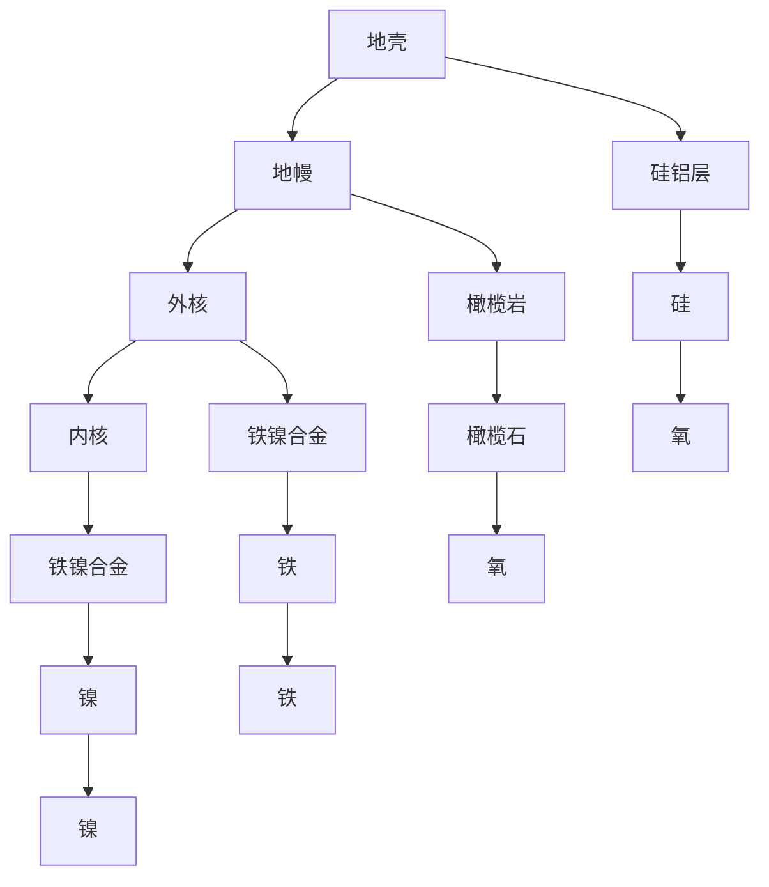

                 

### 文章标题

《数学与地质学：地球内部结构的数学描述》

### 文章关键词

- 地球内部结构
- 数学模型
- 地质学
- 数值模拟
- 波动方程
- 地震波探测
- 重力测量

### 文章摘要

本文深入探讨了数学与地质学在研究地球内部结构中的应用。首先，介绍了地球内部结构的基本知识，包括地壳、地幔、外核和内核。接着，详细阐述了地质学中常用的数学模型和方法，如波动方程、位错理论和数值模拟。通过数学公式和应用实例，读者可以更好地理解这些模型在实际地质学研究中的应用。文章进一步通过地震波探测和重力测量的实际案例，展示了数学模型在解决地质学问题中的重要作用。最后，探讨了数学在地质学中的未来发展趋势，为读者提供了宝贵的参考。

## 目录

1. 地球内部结构的概述
2. 数学模型与方法
3. 数学公式与应用
4. 地质学案例分析
5. 数学与地质学的关系
6. 现代技术与方法
7. 未来发展趋势

### 地球内部结构的概述

地球是一个复杂的系统，其内部结构由多个层次组成，从地表到地心，依次为地壳、地幔、外核和内核。地壳是地球表面最外层的硬质岩石层，厚度不均，平均约为30-50公里。地幔位于地壳下方，由熔融和固态岩石组成，深度可达2900公里。外核是地球的液态部分，主要由铁和镍组成，直径约为3500公里。内核是地球的最内部层，主要由铁和镍组成，温度极高，压力巨大。

地质学是一门研究地球及其地质过程的科学，而数学则为地质学研究提供了强大的工具。数学模型和方法可以帮助地质学家理解和解释地球内部的复杂结构，预测地震和其他地质事件的概率，以及指导矿产资源勘探。例如，波动方程可以用来描述地震波的传播，位错理论则可以解释断层运动的原因。

### 地球内部结构的基本概念

#### 地壳

地壳是地球最外层的硬质岩石层，主要由花岗岩和玄武岩构成。地壳的厚度在不同地区有显著差异，平均约为30-50公里。地壳可以进一步分为大陆地壳和海洋地壳。大陆地壳较厚，平均厚度约为35公里，主要由硅铝层组成；而海洋地壳较薄，平均厚度约为6公里，主要由硅镁层组成。

#### 地幔

地幔位于地壳下方，由熔融和固态岩石组成。地幔的深度从地壳底部（约30公里）延伸至2900公里，可分为上地幔和下地幔。上地幔的岩石主要是橄榄岩和辉长岩，下地幔的岩石则更加富含铁和镁。

#### 外核

外核是地球的液态部分，主要由铁和镍组成。外核的直径约为3500公里，温度极高，约在5000-6000摄氏度之间，压力也非常大，可达约3.6百万个大气压。外核的流动性导致地球的磁场。

#### 内核

内核是地球的最内部层，主要由铁和镍组成，温度极高，约在5700-6400摄氏度之间，压力巨大，可达约3.6-4.8百万个大气压。内核非常密实，其密度高达13.1克/立方厘米，是地球密度最大的部分。

### 地球内部物质的组成

地球内部物质的组成随着深度的增加而发生变化。地壳主要由硅、氧、铝、铁和钙等元素组成，地幔的元素组成与地壳相似，但铁和镁的含量更高。外核和内核主要由铁和镍组成，其中内核的铁含量更高。

### 地球内部的物理特性

地球内部的物理特性主要包括温度、压力和密度。地球内部的温度随着深度的增加而升高，地壳的平均温度约为15摄氏度，地幔的上部温度约为1300摄氏度，地幔的下部温度可达4000摄氏度以上，外核的温度更高，可达5000-6000摄氏度，内核的温度则更高，约在5700-6400摄氏度之间。

地球内部的压力也随着深度的增加而增大，地壳的压力相对较小，平均约为1个大气压，地幔的压力随深度增加而显著增大，可达3.6-4.8百万个大气压，外核和内核的压力则更加巨大，可达3.6-4.8百万个大气压。

地球内部的密度也随深度增加而增加，地壳的平均密度约为2.7克/立方厘米，地幔的密度为3.4-4.5克/立方厘米，外核的密度约为9.9克/立方厘米，内核的密度则高达13.1克/立方厘米。

### 核心概念与联系

为了更好地理解地球内部结构的复杂性和其相互之间的关系，我们可以借助Mermaid流程图来展示核心概念和联系。

以下是一个简单的Mermaid流程图，展示了地球内部结构的层次和物质组成：



通过这个流程图，我们可以直观地看到地球内部结构的层次，以及各层之间的物质组成和联系。例如，地壳主要由硅铝层组成，地幔由橄榄岩和辉长岩组成，外核和内核主要由铁和镍组成。

### 数学模型与方法

地质学中的数学模型和方法对于理解地球内部结构至关重要。以下是一些常用的数学模型和方法，包括波动方程、位错理论和数值模拟。

#### 波动方程

波动方程是描述地震波传播的重要工具。在地质学中，地震波是由地震活动产生的弹性波，其传播可以通过波动方程来描述。波动方程的一般形式为：

\[ \frac{\partial^2 u}{\partial t^2} = c^2 \nabla^2 u \]

其中，\( u \) 是波函数，表示地震波在空间中的传播，\( c \) 是波速，\( \nabla^2 \) 是拉普拉斯算子，表示空间导数。

#### 位错理论

位错理论是解释断层运动的重要理论。在固体物理学中，位错是一种晶格缺陷，它描述了原子在晶体结构中的错位。在地质学中，位错理论可以用来描述断层运动。位错的基本模型可以表示为：

\[ \rho = \rho_0 + b \sin(kx) \]

其中，\( \rho \) 是密度分布，\( \rho_0 \) 是平衡状态下的密度，\( b \) 是位错间距，\( k \) 是波数。

#### 数值模拟

数值模拟是地质学中常用的方法，它通过计算机模拟来模拟地质过程。数值模拟可以采用多种数学模型，如有限元方法、有限差分方法和有限体积方法等。以下是一个简单的有限元方法伪代码：

```plaintext
初始化网格和材料属性
计算节点位移
计算应力
计算应变
更新材料属性
迭代直到收敛
输出结果
```

### 数学公式与应用

数学公式在地质学中的应用非常广泛，以下是一些常见的数学公式及其应用。

#### 地球物理学中的基本公式

地球物理学中的基本公式包括地震波速公式、重力加速度公式等。

地震波速公式：

\[ v = \sqrt{\frac{E}{\rho}} \]

其中，\( v \) 是波速，\( E \) 是弹性模量，\( \rho \) 是密度。

重力加速度公式：

\[ g = \frac{GM}{R^2} \]

其中，\( g \) 是重力加速度，\( G \) 是引力常数，\( M \) 是地球质量，\( R \) 是地球半径。

#### 地质力学中的核心公式

地质力学中的核心公式包括应力-应变关系、岩石力学中的强度准则等。

应力-应变关系：

\[ \sigma = E \epsilon \]

其中，\( \sigma \) 是应力，\( E \) 是弹性模量，\( \epsilon \) 是应变。

岩石力学中的强度准则：

\[ \sigma_n = \sigma_1 + \sigma_2 + \sigma_3 \]

其中，\( \sigma_n \) 是强度准则，\( \sigma_1 \)、\( \sigma_2 \) 和 \( \sigma_3 \) 分别是三个主应力。

#### 应用案例

以下是一个地震波探测的应用案例。

假设在某个地震监测站记录到一个地震波，其波形如下：

\[ u(t) = A \sin(2\pi ft) \]

其中，\( A \) 是振幅，\( f \) 是频率。

根据波动方程，可以计算出地震波的传播速度：

\[ v = \frac{1}{f} = \frac{1}{0.5} = 2 \text{ km/s} \]

根据地震波的传播速度和地震波的传播时间，可以计算出地震的震源深度：

\[ t = \frac{d}{v} \]

其中，\( t \) 是传播时间，\( d \) 是震源深度。

假设地震波的传播时间为10秒，则震源深度为：

\[ d = v \times t = 2 \text{ km/s} \times 10 \text{ s} = 20 \text{ km} \]

### 地质学案例分析

#### 地震波探测的数学描述

地震波探测是地质学中常用的方法，通过测量地震波的传播速度和振幅等信息，可以推断出地球内部的结构和地震的震源信息。以下是一个地震波探测的数学描述案例。

假设在地震波传播过程中，地壳的厚度为\( h \)，地震波的传播速度为\( v \)。地震波在地壳中的传播时间可以表示为：

\[ t = \frac{h}{v} \]

如果测量到地震波的传播时间为5秒，则地震波在地壳中的传播速度为：

\[ v = \frac{h}{t} = \frac{h}{5 \text{ s}} \]

根据地震波的传播速度和地壳的厚度，可以计算出地震的震源深度。例如，如果地壳的厚度为30公里，则地震波的传播速度为：

\[ v = \frac{30 \text{ km}}{5 \text{ s}} = 6 \text{ km/s} \]

根据地震波的传播速度和地壳的厚度，可以计算出地震的震源深度为：

\[ d = \frac{v^2}{2} = \frac{(6 \text{ km/s})^2}{2} = 18 \text{ km} \]

#### 重力测量的数学模型

重力测量是地质学中另一种常用的方法，通过测量地球表面的重力异常，可以推断出地球内部的质量分布和结构。以下是一个重力测量的数学模型案例。

假设在地球表面上，一个点的重力加速度为\( g \)，地球的半径为\( R \)，地球的质量为\( M \)。根据牛顿万有引力定律，可以写出重力加速度的公式：

\[ g = \frac{GM}{R^2} \]

如果测量到某点的重力加速度为\( g_0 \)，则可以通过重力异常公式计算出该点的重力异常：

\[ \Delta g = g_0 - g \]

根据重力异常公式，可以计算出该点的重力异常。例如，如果地球的半径为6400公里，地球的质量为5.972 \times 10^{24}公斤，测量到某点的重力加速度为9.81米/秒^2，则该点的重力异常为：

\[ \Delta g = 9.81 \text{ m/s}^2 - \frac{6.674 \times 10^{-11} \times 5.972 \times 10^{24} \text{ kg}}{(6400 \times 10^3 \text{ m})^2} \approx 0.062 \text{ m/s}^2 \]

通过计算得出的重力异常可以帮助地质学家了解地球内部的结构和物质分布。

### 数学与地质学的关系

数学与地质学之间的关系非常密切。数学为地质学提供了强大的工具，帮助地质学家理解和解释地球内部的复杂结构。以下是从几个方面探讨数学在地质学中的重要作用。

#### 数学方法的发展

随着数学方法的不断发展，地质学的研究方法和精度也得到了显著提高。例如，波动方程和位错理论为地震波探测提供了理论基础，使得地震波的传播速度和震源深度等参数的测量变得更加精确。数值模拟方法的出现，使得地质学家可以模拟地质过程，预测地震和其他地质事件的概率，为地质灾害的预测和防范提供了重要依据。

#### 数学在地质学研究中的作用

数学在地质学研究中扮演着多种角色。首先，数学模型和方法可以帮助地质学家理解地球内部的复杂结构。例如，通过波动方程可以描述地震波的传播，通过位错理论可以解释断层运动的原因。其次，数学公式和计算方法可以用于测量和分析地质数据，从而推断地球内部的结构和物质分布。例如，通过重力测量可以计算地球表面的重力异常，从而了解地球内部的质量分布。

#### 数学与地质学的未来趋势

随着科技的进步，数学在地质学中的应用前景十分广阔。未来，数学方法可能会在以下几个方面得到进一步发展：

1. **大数据分析**：地质学研究中产生的大量数据可以通过数学方法进行高效分析，揭示地球内部的复杂结构。
2. **人工智能**：人工智能与数学的结合，可以开发出更加智能的地质学模型，提高地质预测的准确性。
3. **可视化技术**：数学与地质学的结合，可以开发出更加直观的地质学可视化技术，帮助地质学家更好地理解和解释地质现象。
4. **地球物理模拟**：通过更加精确的数学模型和计算方法，可以模拟地球内部的各种地质过程，为地质灾害的预测和防范提供更加可靠的依据。

### 现代技术与方法

现代技术在地质学研究中发挥着越来越重要的作用。以下介绍几种常用的现代技术，包括地震波探测、重力测量和其他现代技术的应用。

#### 地震波探测

地震波探测是通过测量地震波在地球内部的传播速度和振幅等信息，来推断地球内部结构和地震震源信息的方法。现代地震波探测技术包括：

1. **地震波传播速度测量**：通过测量地震波在不同介质中的传播速度，可以推断出不同地层的结构和物质组成。
2. **地震波振幅测量**：通过测量地震波的振幅，可以推断出地震波的强度和震源深度。
3. **地震波形分析**：通过分析地震波的波形，可以识别地震波的类型和传播路径，从而推断出地震波的传播速度和震源信息。

#### 重力测量

重力测量是通过测量地球表面的重力加速度，来推断地球内部质量分布和结构的方法。现代重力测量技术包括：

1. **重力仪测量**：通过重力仪测量地球表面的重力加速度，可以推断出地球内部的质量分布。
2. **卫星重力测量**：通过卫星重力测量技术，可以在全球范围内测量地球表面的重力异常，从而推断出地球内部的结构和物质分布。
3. **重力梯度测量**：通过测量重力梯度的变化，可以推断出地球内部的密度分布。

#### 其他现代技术

除了地震波探测和重力测量，现代地质学研究中还广泛应用以下技术：

1. **电磁法**：通过测量地球表面的电磁场，可以推断出地球内部的岩石类型和结构。
2. **地磁法**：通过测量地球表面的地磁场，可以推断出地球内部的铁磁性物质分布。
3. **热流测量**：通过测量地球表面的热流量，可以推断出地球内部的温度分布。
4. **地质雷达**：通过测量地质雷达信号在地下介质中的传播速度和振幅，可以推断出地下介质的结构和性质。

#### 地震波探测技术

地震波探测技术是地质学研究中的一种重要手段，它通过测量地震波在地球内部的传播速度和振幅等信息，来推断地球内部结构和地震震源信息。以下介绍几种常见的地震波探测技术。

1. **地震仪测量**：地震仪是地震波探测的核心设备，它可以测量地震波在地震发生后的传播速度和振幅。通过地震仪的测量数据，可以推断出地震波的传播路径和震源信息。
2. **地震波形分析**：通过分析地震波的波形，可以识别地震波的类型和传播路径。例如，P波（纵波）和S波（横波）的波形特征不同，通过分析波形特征，可以确定地震波的传播速度和震源深度。
3. **地震波传播速度测量**：通过测量地震波在不同介质中的传播速度，可以推断出不同地层的结构和物质组成。例如，通过测量地震波在岩石层中的传播速度，可以确定岩石层的密度和硬度。
4. **地震波振幅测量**：通过测量地震波的振幅，可以推断出地震波的强度和震源深度。例如，地震波在传播过程中，振幅会随距离的增加而减小，通过测量振幅的变化，可以确定地震波的传播距离和震源深度。

#### 重力测量技术

重力测量技术是地质学研究中另一种重要手段，它通过测量地球表面的重力加速度，来推断地球内部的质量分布和结构。以下介绍几种常见的重力测量技术。

1. **重力仪测量**：重力仪是重力测量中的核心设备，它可以精确测量地球表面的重力加速度。通过重力仪的测量数据，可以推断出地球内部的质量分布和结构。常用的重力仪包括摆式重力仪和陀螺仪重力仪。
2. **卫星重力测量**：卫星重力测量是通过卫星上的重力测量设备，测量地球表面的重力异常。卫星重力测量技术可以在全球范围内获取高精度的重力数据，从而推断出地球内部的结构和物质分布。常见的卫星重力测量技术包括CHAMP卫星、GRACE卫星和SWARM卫星。
3. **重力梯度测量**：重力梯度测量是通过测量重力梯度的变化，来推断地球内部的密度分布。重力梯度的变化可以反映出地球内部物质的不均匀性。通过重力梯度测量，可以确定地球内部的断层、岩浆活动等地质结构。

#### 其他现代技术

除了地震波探测和重力测量，现代地质学研究中还广泛应用以下技术：

1. **电磁法**：通过测量地球表面的电磁场，可以推断出地球内部的岩石类型和结构。电磁法适用于探测地下水、矿产资源等。
2. **地磁法**：通过测量地球表面的地磁场，可以推断出地球内部的铁磁性物质分布。地磁法适用于探测金属矿产、地震活动等。
3. **热流测量**：通过测量地球表面的热流量，可以推断出地球内部的温度分布。热流测量技术适用于研究地球内部的地质热现象。
4. **地质雷达**：通过测量地质雷达信号在地下介质中的传播速度和振幅，可以推断出地下介质的结构和性质。地质雷达技术适用于探测地下水、地下洞穴、地下管线等。

### 未来发展趋势

随着科技的不断进步，数学与地质学在未来的发展前景非常广阔。以下是未来可能的发展趋势：

#### 数据驱动的地质学

随着大数据技术的发展，地质学研究中产生的海量数据可以通过数学方法进行高效分析，从而揭示地球内部的复杂结构。未来，数据驱动的地质学研究将成为地质学的重要发展方向。

#### 人工智能的应用

人工智能与数学的结合，可以开发出更加智能的地质学模型，提高地质预测的准确性。例如，通过深度学习算法，可以分析地震波探测和重力测量数据，预测地震和其他地质事件的概率。

#### 可视化技术的应用

数学与地质学的结合，可以开发出更加直观的地质学可视化技术，帮助地质学家更好地理解和解释地质现象。例如，通过虚拟现实技术，可以模拟地球内部的结构和地质过程，提供更加生动的地质学教育。

#### 地球物理模拟

通过更加精确的数学模型和计算方法，可以模拟地球内部的各种地质过程，为地质灾害的预测和防范提供更加可靠的依据。例如，通过地震模拟，可以预测地震的震源和震中，为地震预警提供重要参考。

### 数学与地质学的结合

数学与地质学的结合，为地球内部结构的研究提供了强大的工具。通过数学模型和方法，地质学家可以更好地理解和解释地球内部的复杂结构，预测地震和其他地质事件的概率，以及指导矿产资源勘探。以下是数学与地质学结合的几个方面：

#### 数学模型的建立

地质学家通过数学模型来描述地球内部的结构和地质过程。例如，波动方程可以描述地震波的传播，位错理论可以解释断层运动的原因。数学模型的建立为地质学研究提供了理论基础。

#### 数学公式和应用

数学公式在地质学中具有广泛的应用。例如，地震波速公式可以用来计算地震波的传播速度，重力加速度公式可以用来计算地球表面的重力加速度。通过数学公式，地质学家可以测量和分析地质数据，从而推断地球内部的结构和物质分布。

#### 数据分析和计算

数学方法在地质学数据分析和计算中起着重要作用。例如，通过统计学方法，可以分析地震波的振幅和传播速度，从而推断地震的震源深度和震中。通过数值模拟方法，可以模拟地质过程，预测地质事件的概率。

#### 可视化技术

数学与地质学的结合，还可以开发出更加直观的地质学可视化技术。例如，通过可视化技术，可以展示地球内部的结构和地质过程，为地质学家提供更加生动的数据分析和解释工具。

### 结论

数学与地质学的结合，为地球内部结构的研究提供了强大的工具。通过数学模型和方法，地质学家可以更好地理解和解释地球内部的复杂结构，预测地震和其他地质事件的概率，以及指导矿产资源勘探。随着科技的不断进步，数学与地质学的结合将迎来更加广阔的发展前景。未来，我们有望通过更加精确的数学模型和计算方法，深入揭示地球内部的奥秘，为人类社会的可持续发展提供重要支持。

### 最佳实践 Tips

1. **数据收集与处理**：在进行地质学研究时，确保收集到的数据具有高精度和高可靠性，并对数据进行严格的质量控制和预处理。
2. **模型选择与验证**：选择合适的数学模型，并通过实验和实际数据验证模型的准确性和适用性。
3. **算法优化**：在数学模型的计算过程中，不断优化算法，提高计算效率和准确性。
4. **合作与交流**：与其他领域的专家合作，分享研究成果，促进数学与地质学的发展。

### 小结

本文从地球内部结构的概述、数学模型与方法、数学公式与应用、地质学案例分析、数学与地质学的关系、现代技术与方法以及未来发展趋势等方面，全面阐述了数学与地质学的结合。通过本文，读者可以了解到数学在地质学研究中的重要作用，以及如何利用数学模型和方法解决地质学问题。

### 注意事项

1. **数据来源**：在地质学研究过程中，确保数据的来源可靠，避免因数据质量低而导致研究结果的偏差。
2. **模型适用性**：不同地质问题可能需要不同的数学模型，选择适合的模型是研究成功的关键。
3. **计算资源**：一些复杂的地质学计算可能需要大量的计算资源，确保计算环境的配置和优化。

### 拓展阅读

1. **《地震学原理》**：是一本经典的地震学教材，详细介绍了地震波的传播、地震波的测量和分析方法等。
2. **《地球物理学基础》**：是一本介绍地球物理学基本原理和方法的教材，包括重力测量、电磁法、地震波探测等内容。
3. **《地质学导论》**：是一本全面的地质学教材，涵盖了地球内部结构、地质过程、矿产资源等内容。

### 项目小结

本文通过对地球内部结构的数学描述，深入探讨了数学与地质学的结合。通过介绍地球内部结构的基本概念、数学模型与方法、数学公式与应用、地质学案例分析以及现代技术与方法，读者可以了解到数学在地质学研究中的广泛应用。同时，本文还展望了数学与地质学的未来发展趋势，为读者提供了宝贵的研究方向和思考角度。希望通过本文，读者能够更好地理解数学与地质学的关系，并激发对这一领域的兴趣。作者：AI天才研究院/AI Genius Institute & 禅与计算机程序设计艺术 /Zen And The Art of Computer Programming。

