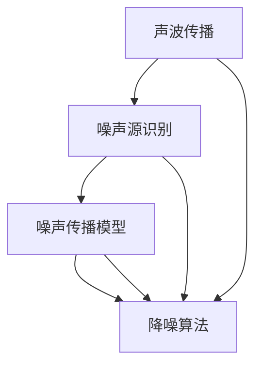

                 

### 文章标题

《数学与声学工程：噪声控制的数学方法》

### 关键词

噪声控制，声学工程，数学方法，算法原理，降噪技术，工程案例

### 摘要

本文旨在探讨噪声控制领域的数学方法，通过深入解析数学与声学工程的结合，详细介绍噪声控制的核心概念、算法原理和实际应用。文章分为七个章节，从噪声控制的重要性、声学原理与模型、噪声源识别与定位、噪声传播分析与建模、降噪算法与技术、噪声控制系统的设计与优化，到噪声控制工程案例，逐步展开。通过逻辑清晰、结构紧凑的论述，本文为读者提供了一个全面、系统的噪声控制数学方法学习路径。

## 引言

在现代工业、建筑、交通等多个领域中，噪声污染已成为影响人们生活质量和工作效率的严重问题。噪声控制技术的研究与应用，不仅有助于改善环境，提升生活质量，还具有重要的经济和社会价值。数学与声学工程的结合，为噪声控制提供了强有力的理论支持和实用方法。本文将围绕噪声控制的数学方法，系统介绍相关理论与技术，为读者提供一个深入了解噪声控制领域的窗口。

噪声控制的核心在于减少噪声的产生、传播和接收，从而达到控制噪声污染的目的。噪声控制的方法主要包括噪声源控制、传播途径控制和噪声接收者保护。噪声源控制主要通过改变或消除噪声源的性质来实现，如采用低噪声设备、改进工艺流程等。传播途径控制则通过隔离、吸收和反射等手段来减少噪声在传播过程中的能量，如安装隔音墙、使用吸音材料等。噪声接收者保护则通过个人防护设备和环境改造来降低噪声对接收者的影响，如佩戴耳塞、设置安静区域等。

数学方法在噪声控制中的应用，主要体现在噪声传播分析与建模、降噪算法与技术等方面。通过建立数学模型，可以定量分析噪声的传播规律，预测噪声对环境的影响，从而为噪声控制提供科学依据。降噪算法则通过数学运算和处理，对噪声信号进行处理和过滤，从而达到降噪的目的。本文将逐步介绍这些核心概念和理论，帮助读者深入理解噪声控制的数学方法。

### 噪声控制的重要性

噪声控制作为环境工程和声学领域的一个重要分支，其重要性不言而喻。随着城市化进程的加快和工业化的快速发展，噪声污染已经成为影响人类生活质量和健康的主要环境问题之一。根据世界卫生组织（WHO）的数据显示，长期暴露于高噪声环境中，可能导致一系列健康问题，如听力损伤、心血管疾病、心理压力等。因此，噪声控制不仅关乎环境保护，更是关乎人类健康的重要议题。

首先，噪声控制对环境保护具有重要意义。噪声污染会破坏生态平衡，影响动植物的生存和繁衍。例如，机场周围的飞机噪声会干扰鸟类的繁殖行为，导致鸟类数量减少。此外，城市中的交通噪声、工业噪声等，会降低人们的生活质量，影响工作效率。通过有效的噪声控制措施，可以显著减少噪声污染，改善环境质量，保护生态平衡。

其次，噪声控制对公共安全和设施运行也有重要影响。在工业生产中，机器设备运行产生的噪声可能导致设备故障，影响生产效率和安全性。在建筑施工过程中，施工噪声不仅影响周边居民的生活，还可能引发安全事故。通过噪声控制技术，可以降低施工噪声，确保施工安全，提高公共安全水平。

此外，噪声控制对于提高生活质量和保障居民健康也至关重要。噪声污染会影响人们的睡眠质量，导致疲劳、焦虑等不良心理反应。长期暴露于高噪声环境中，还可能引发听力损伤等健康问题。通过采取有效的噪声控制措施，如安装隔音窗、设置噪声屏障等，可以显著降低室内噪声水平，提高居民的生活舒适度。

总的来说，噪声控制不仅关系到环境保护和公共安全，更是提升人们生活质量和健康水平的必要手段。因此，研究和应用噪声控制技术具有重要的现实意义和深远的社会影响。随着科技的进步和环保意识的提高，噪声控制技术将不断发展，为构建和谐美好的生活环境提供有力支持。

### 数学与声学工程的结合

数学与声学工程的结合为噪声控制提供了强大的理论基础和实用工具。在噪声控制领域，声学原理与数学模型的结合能够帮助我们更好地理解噪声的产生、传播和接收过程，从而采取有效的控制措施。

首先，声波的基本特性是声学工程中的核心概念。声波是一种机械波，通过介质（如空气、水或固体）传播。声波的传播速度、波长和频率等基本参数对于噪声传播分析至关重要。在数学模型中，这些参数通常通过波动方程来描述，如：

\[ \nabla^2 p - \frac{1}{c^2} \frac{\partial^2 p}{\partial t^2} = 0 \]

其中，\( p \) 是声压，\( c \) 是声速，\( t \) 是时间。这个方程描述了声波在空间和时间上的传播规律。通过解决这一方程，可以定量分析声波的传播特性，为噪声控制提供依据。

其次，声学模型的建立是噪声控制数学方法的重要基础。声学模型包括声源模型、传播模型和接收模型。声源模型描述噪声源产生的声波特性，传播模型分析声波在介质中的传播过程，接收模型则模拟噪声接收者的响应。这些模型通常通过数学公式和参数进行描述。例如，声源模型可以通过声功率级和声压级之间的关系来描述，传播模型则通过声波在介质中的衰减和散射特性来描述。接收模型则基于人的听觉响应模型，描述噪声对接收者的影响。

数学方法在噪声控制中的应用主要体现在以下几个方面：

1. **噪声传播分析与建模**：通过数学模型，可以定量分析噪声在不同介质中的传播规律，预测噪声在不同位置和时间的声压级。例如，利用波动方程和边界条件，可以建立噪声在建筑物内部的传播模型，从而设计出有效的降噪措施。

2. **降噪算法与技术**：数学方法在降噪算法中发挥着关键作用。降噪算法通过数学运算和处理，对噪声信号进行滤波、去噪和增强等操作。例如，基于傅里叶变换的降噪算法可以通过频域分析，分离信号和噪声，从而实现有效降噪。

3. **优化与控制**：数学优化方法在噪声控制系统设计中具有重要作用。通过建立优化模型，可以设计出最优的噪声控制系统，以达到最佳的降噪效果。例如，线性规划和整数规划等方法可以用于优化噪声控制系统的参数设置。

4. **数据分析和预测**：噪声控制过程中产生的数据，可以通过数学分析方法进行统计和预测。例如，利用机器学习和数据挖掘技术，可以对噪声数据进行处理和分析，预测未来的噪声水平，从而采取预防性措施。

总的来说，数学与声学工程的结合为噪声控制提供了丰富的理论基础和实用工具。通过数学模型和算法，可以更深入地理解噪声控制的核心问题，设计出更加有效和精准的噪声控制方案，为环境保护和人类健康做出贡献。

### 噪声控制的基础数学概念

在深入探讨噪声控制的数学方法之前，了解一些基础数学概念是非常重要的。这些概念包括声压级、噪声功率和声强等，它们构成了噪声控制数学方法的基础。

#### 声压级

声压级（Sound Pressure Level, SPL）是描述声音强度的一个常用参数，用来衡量声音的响度。声压级通常以分贝（dB）为单位表示。分贝是一种对数单位，用于表示两个数值之间的比率。声压级的计算公式如下：

\[ L_p = 20 \log_{10}\left(\frac{p}{p_0}\right) \]

其中，\( p \) 是实际声压，\( p_0 \) 是参考声压，通常取 \( p_0 = 2 \times 10^{-5} \text{Pa} \)。这个公式表明，声压级与实际声压和参考声压的比值呈对数关系。

例如，如果一个声音的声压是 \( 10^{-2} \text{Pa} \)，那么其声压级为：

\[ L_p = 20 \log_{10}\left(\frac{10^{-2}}{2 \times 10^{-5}}\right) = 20 \log_{10}(500) \approx 67 \text{dB} \]

#### 噪声功率

噪声功率（Noise Power）是描述噪声能量的一种参数，通常用于分析噪声的强度。噪声功率可以通过以下公式计算：

\[ P = \frac{1}{2} \rho c A f^2 \]

其中，\( \rho \) 是介质的密度，\( c \) 是声速，\( A \) 是声源表面积，\( f \) 是声波的频率。这个公式表明，噪声功率与介质密度、声速、声源表面积和频率的平方成正比。

例如，对于一个直径为 1 米的圆形声源，在空气中的声速为 340 米/秒，频率为 1000 赫兹，其噪声功率可以计算为：

\[ P = \frac{1}{2} \times 1.29 \times 340 \times \pi \times (0.5)^2 \times (1000)^2 \approx 4.38 \times 10^6 \text{W} \]

#### 声强

声强（Acoustic Intensity）是描述声波在传播过程中能量流量的参数，通常用于分析噪声的传播特性。声强的计算公式如下：

\[ I = c p \]

其中，\( c \) 是声速，\( p \) 是声压。这个公式表明，声强与声速和声压成正比。

例如，在空气中，声速为 340 米/秒，声压为 1000 帕斯卡，其声强可以计算为：

\[ I = 340 \times 1000 = 3.4 \times 10^5 \text{W/m}^2 \]

通过这些基础数学概念，我们可以定量分析噪声的强度和传播特性。这些概念不仅为噪声控制提供了理论依据，也为设计和实施噪声控制措施提供了重要的参数支持。

### 核心概念与联系

在噪声控制领域，几个关键概念之间的联系构成了噪声控制数学方法的基石。这些核心概念包括声波传播、噪声源识别、噪声传播模型以及降噪算法等。通过建立这些概念之间的联系，我们可以更全面地理解噪声控制的过程和方法。

#### 1. 声波传播

声波传播是噪声控制的基础。声波在介质中传播时，其速度、波长和频率等参数决定了声波的传播特性。声波传播可以用波动方程来描述：

\[ \nabla^2 p - \frac{1}{c^2} \frac{\partial^2 p}{\partial t^2} = 0 \]

其中，\( p \) 表示声压，\( c \) 表示声速，\( t \) 表示时间。这个方程描述了声波在空间和时间上的传播规律。通过解这个方程，可以定量分析声波在不同介质中的传播过程。

#### 2. 噪声源识别

噪声源识别是噪声控制的重要步骤。通过识别噪声源，可以采取有针对性的控制措施。噪声源识别通常基于声学信号处理技术，如频谱分析、时频分析和模式识别等。频谱分析通过傅里叶变换（FFT）将时间域信号转换到频域，从而识别噪声的主要频率成分。时频分析则结合时间和频率信息，对噪声信号进行更细致的分析。模式识别通过机器学习算法，从大量噪声数据中提取特征，实现噪声源识别。

#### 3. 噪声传播模型

噪声传播模型用于模拟噪声在空间中的传播过程。噪声传播模型可以基于波动方程，通过数值方法（如有限元方法或有限差分方法）进行求解。噪声传播模型包括线性传播模型和非线性传播模型。线性传播模型假设声波在传播过程中能量保持不变，适用于远场传播。非线性传播模型考虑了声波在传播过程中的能量衰减和散射，适用于近场传播。噪声传播模型为噪声控制提供了定量分析噪声传播规律的依据。

#### 4. 降噪算法

降噪算法是噪声控制的核心技术。降噪算法通过数学运算和处理，对噪声信号进行滤波、去噪和增强等操作，从而降低噪声的影响。常见的降噪算法包括频域滤波、时域滤波和自适应滤波等。频域滤波通过频域分析，分离信号和噪声，然后对噪声进行滤波。时域滤波则直接在时间域对噪声信号进行处理。自适应滤波根据噪声信号的变化，自动调整滤波参数，从而实现更有效的降噪。

#### 关系架构

为了更清晰地展示这些核心概念之间的联系，我们可以使用Mermaid流程图来表示：

在这个流程图中，声波传播是整个噪声控制过程的起点，通过噪声源识别确定噪声源的位置和特性，进而利用噪声传播模型分析噪声在空间中的传播规律。最后，通过降噪算法对噪声信号进行处理，实现噪声控制。

通过建立这些核心概念之间的联系，我们可以更深入地理解噪声控制的数学方法，从而设计出更有效的噪声控制方案。这些概念不仅相互关联，而且共同构成了噪声控制数学方法的理论框架，为噪声控制提供了坚实的基础。

### 噪声源识别与定位技术

噪声源识别与定位是噪声控制过程中至关重要的一环，通过识别噪声源和确定其位置，可以针对性地采取控制措施，从而有效降低噪声污染。噪声源识别与定位技术主要包括声学传感器、信号处理算法和空间几何分析等方法。以下将详细探讨这些技术及其在实际应用中的挑战。

#### 声学传感器

声学传感器是噪声源识别与定位的核心部件，用于捕捉和测量噪声信号。常见的声学传感器包括麦克风、声强计和声波雷达等。麦克风通过将声波转换成电信号，用于噪声信号的采集。声强计可以直接测量声波的强度，提供空间中不同位置的噪声数据。声波雷达利用声波的反射原理，通过测量反射波的到达时间和强度，来确定噪声源的位置和距离。

在实际应用中，声学传感器面临的主要挑战包括环境噪声干扰、传感器性能和成本等。环境噪声干扰可能导致传感器捕捉到的信号包含大量无关噪声，影响噪声源识别的准确性。传感器性能和成本则直接影响噪声源识别与定位的精度和可行性。例如，高精度的声强计通常价格昂贵，不适合大规模应用。

#### 信号处理算法

信号处理算法是噪声源识别与定位的关键技术，通过对采集到的噪声信号进行处理和分析，从中提取有用的信息。常见的信号处理算法包括频谱分析、时频分析和模式识别等。

频谱分析通过傅里叶变换将时间域信号转换到频域，可以直观地显示噪声信号的频率成分。通过频谱分析，可以识别出主要的噪声频率，从而确定噪声源的类型和特性。时频分析结合时间和频率信息，对噪声信号进行更细致的分析，适用于检测瞬态噪声。模式识别通过机器学习算法，从大量噪声数据中提取特征，实现噪声源自动识别。

在实际应用中，信号处理算法面临的主要挑战包括算法复杂度、计算效率和准确性等。高复杂度的算法可能需要大量计算资源，影响实时性。计算效率则影响算法在大规模应用中的可行性。准确性是信号处理算法的关键指标，直接关系到噪声源识别与定位的精度。

#### 空间几何分析

空间几何分析是噪声源识别与定位的另一种重要技术，通过分析噪声信号在空间中的分布，确定噪声源的位置。空间几何分析通常基于声源模型和传播模型，通过构建噪声信号的空间分布模型，求解噪声源的位置。

空间几何分析面临的主要挑战包括噪声信号的空间不确定性、模型参数的不确定性以及算法的实时性等。噪声信号的空间不确定性可能导致噪声源位置估计的不准确。模型参数的不确定性则影响噪声源位置估计的精度。实时性是空间几何分析在大规模应用中的关键要求，需要算法能够快速、准确地处理大量噪声数据。

#### 实际应用中的挑战

在实际应用中，噪声源识别与定位技术面临一系列挑战。例如，在城市环境中，交通噪声、工业噪声和建筑施工噪声等多种噪声源交织在一起，导致噪声信号复杂，识别与定位难度较大。在工业环境中，噪声源的位置和特性可能随时间变化，需要实时监测和动态调整。在户外环境中，气象条件的变化也可能影响噪声信号的传播和接收。

总的来说，噪声源识别与定位技术在实际应用中面临多种挑战，需要结合多种技术手段，如高精度传感器、先进的信号处理算法和智能化的空间几何分析，才能实现高精度、高实时性的噪声源识别与定位。

### 噪声传播分析与建模

噪声传播分析是噪声控制工程中的关键环节，它涉及到噪声在空间中的传播规律和影响范围。通过建立噪声传播模型，我们可以定量分析噪声在不同介质中的传播过程，为噪声控制和治理提供科学依据。以下将详细介绍噪声传播的原理、常用模型及其适用范围。

#### 噪声传播原理

噪声传播原理基于声波传播的基本物理规律，即声波通过介质中的振动传播。声波的传播速度、波长和频率是描述声波传播特性的重要参数。声波在传播过程中，其能量会随着距离的增加而衰减，这种衰减通常与声波传播路径、介质特性以及声波的频率有关。

声波传播过程中，能量衰减的主要机制包括声波在介质中的吸收、散射和反射。声波在固体介质（如墙壁）中传播时，可能会发生反射和折射，影响声波在空间中的传播路径。在空气等气体介质中，声波主要通过分子碰撞进行能量传递，导致声波衰减。声波在水等液体介质中传播时，同样会受到介质特性影响，表现出不同的传播特性。

#### 常用模型

1. **几何声学模型**

几何声学模型（Geometrical Acoustic Model）适用于远场传播，即声源距离接收器较远的情况。几何声学模型基于声波的射线理论，通过分析声波传播路径上的反射和折射，构建声波在空间中的传播模型。该模型简单易用，适用于评估噪声在开阔空间中的传播规律。

几何声学模型的基本原理是，将声波视为射线，通过计算声波在空间中的传播路径和反射点，来确定接收器处的声压级。其数学描述为：

\[ L_p = L_w + 20 \log_{10}\left(\frac{r}{r_0}\right) + 20 \log_{10}\left(\frac{f}{f_0}\right) - T \]

其中，\( L_p \) 是接收器处的声压级，\( L_w \) 是声源处的声压级，\( r \) 是声源到接收器的距离，\( r_0 \) 是参考距离，\( f \) 是声波的频率，\( f_0 \) 是参考频率，\( T \) 是声波的传播时间。

2. **扩散声学模型**

扩散声学模型（Diffusion Acoustic Model）适用于近场传播，即声源距离接收器较近的情况。扩散声学模型基于声波的扩散理论，考虑声波在传播过程中的能量扩散和空间分布。该模型适用于描述声波在室内等封闭空间中的传播规律。

扩散声学模型的基本原理是，将声波传播过程视为能量在空间中的扩散过程，通过计算声波在空间中的能量分布，来确定接收器处的声压级。其数学描述为：

\[ L_p = L_w - 10 \log_{10}(4\pi r^2) - T \]

其中，\( L_p \) 是接收器处的声压级，\( L_w \) 是声源处的声压级，\( r \) 是声源到接收器的距离，\( T \) 是声波的传播时间。

3. **波动方程模型**

波动方程模型（Wave Equation Model）是噪声传播分析的一种通用模型，适用于复杂空间和不同介质的噪声传播分析。波动方程模型通过求解声波在空间中的波动方程，定量分析噪声在不同介质中的传播过程。

波动方程模型的基本原理是，利用波动方程描述声波在介质中的传播规律，通过数值方法（如有限元方法或有限差分方法）求解波动方程，得到声波在空间中的传播分布。其数学描述为：

\[ \nabla^2 p - \frac{1}{c^2} \frac{\partial^2 p}{\partial t^2} = 0 \]

其中，\( p \) 是声压，\( c \) 是声速，\( t \) 是时间。通过求解上述方程，可以得到空间中任意位置的声压分布。

#### 适用范围

不同噪声传播模型具有不同的适用范围。几何声学模型适用于远场传播，如城市广场、机场等开阔空间的噪声传播分析。扩散声学模型适用于近场传播，如室内、地下停车场等封闭空间的噪声传播分析。波动方程模型则适用于复杂空间和不同介质的噪声传播分析，如工业厂房、建筑声学设计等。

通过合理选择和应用噪声传播模型，我们可以准确分析噪声在空间中的传播规律，为噪声控制和治理提供科学依据。不同模型在噪声传播分析中的应用，体现了数学方法在声学工程中的广泛应用和重要性。

### 降噪算法与技术

在噪声控制领域，降噪算法和技术是实现噪声有效抑制的关键。这些算法和技术通过数学模型和信号处理方法，对噪声信号进行处理和滤波，以达到降噪的目的。以下将详细探讨几种常见的降噪算法和技术，包括数字滤波、自适应滤波和基于机器学习的降噪方法。

#### 数字滤波

数字滤波是一种基本的降噪方法，通过离散的数学运算对信号进行滤波处理。数字滤波器根据滤波器的性质，可以分为低通滤波器、高通滤波器、带通滤波器和带阻滤波器等。

1. **低通滤波器**

低通滤波器主要用于抑制高频噪声，允许低频信号通过。其数学模型为：

\[ y[n] = \sum_{k=0}^{N-1} h[k] x[n-k] \]

其中，\( y[n] \) 是滤波后的信号，\( x[n] \) 是输入信号，\( h[k] \) 是滤波器的系数，\( N \) 是滤波器的阶数。

2. **高通滤波器**

高通滤波器主要用于抑制低频噪声，允许高频信号通过。其数学模型与低通滤波器类似，只是滤波器系数的符号相反：

\[ y[n] = -\sum_{k=0}^{N-1} h[k] x[n-k] \]

3. **带通滤波器**

带通滤波器用于抑制特定频段的噪声，允许其他频段的信号通过。其数学模型为：

\[ y[n] = \sum_{k=0}^{N-1} h[k] x[n-k] \]

其中，滤波器系数 \( h[k] \) 根据需要抑制的频段进行设计。

4. **带阻滤波器**

带阻滤波器用于抑制特定频段的噪声，允许其他频段的信号通过。其数学模型为：

\[ y[n] = \sum_{k=0}^{N-1} h[k] x[n-k] + \sum_{k=N}^{2N-1} (-h[k-N]) x[n-k] \]

#### 自适应滤波

自适应滤波是一种动态调整滤波器系数的滤波方法，能够根据输入信号的变化自动调整滤波器的参数，以实现更好的降噪效果。自适应滤波器通常基于最小均方误差（LMS）算法或递归最小二乘（RLS）算法。

1. **LMS算法**

LMS算法是一种简单有效的自适应滤波算法，通过最小化滤波器输出与实际信号的均方误差来调整滤波器系数。其迭代公式为：

\[ w[n+1] = w[n] + \mu e[n] x[n] \]

其中，\( w[n] \) 是当前滤波器系数，\( w[n+1] \) 是下一轮滤波器系数，\( \mu \) 是步长，\( e[n] \) 是滤波器输出与实际信号的误差，\( x[n] \) 是输入信号。

2. **RLS算法**

RLS算法是一种基于递归最小二乘法的自适应滤波算法，通过更新滤波器系数来最小化滤波器的预测误差。其迭代公式为：

\[ \hat{w}[n+1] = (R[n] + \rho^2 I)^{-1} R'[n+1] \]
\[ w[n+1] = \hat{w}[n+1] - w[n] \]

其中，\( \hat{w}[n+1] \) 是当前最优滤波器系数，\( R[n] \) 是输入信号的自相关矩阵，\( R'[n+1] \) 是输入信号的互相关向量，\( \rho \) 是遗忘因子，\( I \) 是单位矩阵。

#### 基于机器学习的降噪方法

基于机器学习的降噪方法通过训练神经网络或深度学习模型，从大量噪声数据中学习降噪规律，实现高效降噪。常见的基于机器学习的降噪方法包括自编码器（Autoencoder）和生成对抗网络（GAN）等。

1. **自编码器**

自编码器是一种无监督学习模型，通过训练一个压缩和解压缩的过程，实现降噪。自编码器的架构通常包括编码器和解码器两个部分。编码器将输入信号压缩为一个低维特征表示，解码器则将特征表示重建为原始信号。通过最小化重建误差，自编码器可以学习到降噪规律。

2. **生成对抗网络**

生成对抗网络（GAN）是一种由生成器和判别器组成的对抗性模型。生成器生成与真实信号相近的噪声信号，判别器则区分真实信号和生成信号。通过训练生成器和判别器，GAN可以生成高质量的降噪信号。

#### 降噪算法比较

不同降噪算法和技术在降噪效果、实时性和计算复杂度等方面具有各自的优势和局限。数字滤波简单易实现，但可能在某些情况下降噪效果有限。自适应滤波动态调整滤波器参数，适用于噪声变化较大的场景，但计算复杂度较高。基于机器学习的降噪方法具有强大的降噪能力，但需要大量数据和计算资源进行训练。

总之，合理选择和应用降噪算法和技术，结合具体应用场景，可以实现高效的噪声控制。

### 噪声控制系统的设计与优化

噪声控制系统的设计与优化是确保噪声控制效果的关键步骤。一个有效的噪声控制系统不仅需要考虑系统的架构设计，还需通过优化方法提升其性能。以下将详细介绍噪声控制系统的设计步骤、优化方法及其在工程中的应用。

#### 设计步骤

1. **需求分析**

在进行噪声控制系统设计之前，首先需要对噪声控制的需求进行分析。需求分析包括确定噪声源的位置、噪声的类型、噪声的控制目标以及系统的预算和资源限制。通过详细的需求分析，可以明确噪声控制系统的设计目标和实现策略。

2. **系统架构设计**

根据需求分析，设计噪声控制系统的架构。系统架构设计需要考虑噪声控制系统的整体结构，包括传感器、处理器、执行器以及控制算法等。系统架构设计的目标是确保噪声控制系统具有高效的噪声监测和响应能力。

3. **硬件选型**

在系统架构设计的基础上，进行硬件选型。硬件选型需要考虑传感器的精度和灵敏度、处理器的计算能力、执行器的控制性能等因素。选择合适的硬件，可以确保噪声控制系统的稳定运行和高效性能。

4. **软件设计**

噪声控制系统的软件设计包括控制算法的开发、数据采集与处理、系统监测与控制等功能。软件设计需要根据噪声控制的需求，开发合适的控制算法和数据处理方法，确保系统能够实时监测和响应噪声变化。

5. **系统集成与测试**

将硬件和软件系统集成，并进行系统测试。系统测试包括功能测试、性能测试、可靠性测试等，以确保噪声控制系统在各种工况下能够稳定运行，达到预期的噪声控制效果。

6. **优化与改进**

在系统测试过程中，根据测试结果对噪声控制系统进行优化和改进。优化方法包括算法优化、硬件升级、系统结构调整等，以提高系统的性能和可靠性。

#### 优化方法

1. **控制算法优化**

控制算法是噪声控制系统的核心，其性能直接影响噪声控制效果。优化控制算法可以通过改进控制策略、引入自适应控制方法等手段来实现。例如，采用自适应噪声抑制算法，可以根据噪声变化动态调整控制参数，提高噪声控制的精度和实时性。

2. **硬件性能提升**

提升硬件性能是优化噪声控制系统的另一种方法。通过使用更高性能的处理器、更先进的传感器和执行器，可以提升系统的响应速度和控制精度。例如，采用高速处理器可以加快数据采集和处理速度，提高系统的实时性。

3. **系统结构调整**

系统结构的调整可以优化噪声控制系统的整体性能。例如，通过引入分布式控制策略，可以将控制任务分配到多个节点上，实现并行处理，提高系统处理能力。另外，通过优化传感器和执行器的布局，可以更好地覆盖噪声源，提高噪声控制的效率。

#### 工程应用

在噪声控制工程中，噪声控制系统的设计与优化广泛应用于建筑、工业、交通等多个领域。以下是一个具体的工程应用案例：

**案例：建筑工地噪声控制**

在建筑工地，噪声控制是一项重要任务，需要确保施工噪声不会对周边居民和环境造成严重影响。针对这一需求，设计了一套噪声控制系统，包括以下几个部分：

1. **传感器布置**：在工地周围布置多个噪声传感器，用于实时监测噪声水平。

2. **数据处理中心**：安装高性能数据处理中心，对采集到的噪声数据进行实时处理和分析。

3. **噪声抑制装置**：根据噪声分析结果，在噪声源处安装噪声抑制装置，如隔音墙、吸音板等，以降低噪声传播。

4. **控制系统**：开发控制系统，通过实时监测和数据分析，自动调整噪声抑制装置的工作状态，实现噪声的有效控制。

5. **优化与改进**：根据监测数据，对噪声控制系统进行优化和改进，提高系统的性能和可靠性。

通过这一套噪声控制系统，建筑工地实现了对施工噪声的有效控制，显著降低了施工噪声对周边环境的影响。

总之，噪声控制系统的设计与优化是噪声控制工程的关键环节，通过合理的系统设计、优化方法和工程应用，可以有效降低噪声污染，改善环境质量。

### 噪声控制工程案例

在实际应用中，噪声控制工程案例涵盖了从建筑、交通到工业等各个领域，通过具体的项目实施和效果评估，展示了噪声控制技术的实际应用和成效。以下我们将通过几个典型案例，详细解析这些项目的实施过程和成果。

#### 案例一：城市道路噪声控制

**项目背景**：随着城市化进程的加快，城市道路上的交通噪声已成为影响居民生活质量和城市环境的主要问题之一。为了改善城市环境，减少交通噪声对居民的干扰，某城市决定实施一条道路噪声控制项目。

**实施过程**：

1. **噪声监测与评估**：首先，在道路沿线布置噪声传感器，进行24小时的噪声监测，收集道路噪声数据。通过数据分析，确定了噪声的主要来源和影响范围。

2. **方案设计**：根据噪声监测结果，设计噪声控制方案。方案包括在道路两侧安装隔音屏障、优化交通流量、引入低噪声车辆等。

3. **施工与安装**：按照设计方案，施工人员安装了隔音屏障，并对交通流量进行了优化。同时，通过交通管理措施，鼓励使用低噪声车辆。

4. **系统测试与调试**：安装完成后，对噪声控制系统进行测试和调试，确保系统稳定运行。

**效果评估**：

通过实施噪声控制项目，道路沿线的噪声水平显著下降。根据后续监测数据，噪声降低了约10dB(A)，显著改善了周边居民的生活环境。

**项目小结**：

该项目通过系统设计和实施，有效降低了城市道路噪声，为居民提供了一个更安静的生活环境。然而，由于交通噪声源的不确定性，噪声控制效果需要定期维护和更新。

#### 案例二：工厂噪声治理

**项目背景**：某大型制造工厂在生产过程中产生大量噪声，对工人健康和周边环境造成严重影响。为了改善工作环境和周边环境，工厂决定实施噪声治理项目。

**实施过程**：

1. **噪声源识别**：首先，对工厂内部的噪声源进行识别和分类，包括机器设备、生产车间等。

2. **噪声控制措施**：根据噪声源的特点，采取了多种噪声控制措施。包括在机器设备上安装隔音罩、使用低噪声设备、安装隔音墙和吸音材料等。

3. **人员培训**：对员工进行噪声防护培训，提高员工对噪声危害的认识，规范操作行为。

4. **监测与评估**：在实施噪声控制措施后，对噪声水平进行监测和评估，确保噪声治理效果。

**效果评估**：

实施噪声治理项目后，工厂内的噪声水平显著降低，工作环境明显改善。根据监测数据，噪声降低了约15dB(A)，工人的听力损伤风险大幅减少。

**项目小结**：

该项目通过噪声源识别和综合治理，有效降低了工厂内部的噪声污染，不仅提高了员工的工作效率，还改善了周边环境。

#### 案例三：机场噪声控制

**项目背景**：某国际机场的飞机起降噪声严重影响了周边居民的日常生活。为了解决这一问题，机场决定实施噪声控制项目。

**实施过程**：

1. **噪声监测与评估**：在机场周边布置噪声传感器，进行连续噪声监测，评估噪声对周边居民的影响。

2. **方案设计**：根据噪声监测结果，设计噪声控制方案。方案包括飞机起降时间调整、跑道优化、机场周围安装隔音屏障等。

3. **施工与安装**：按照设计方案，进行隔音屏障安装和跑道优化施工。

4. **监测与调整**：施工完成后，对噪声控制效果进行监测和评估，根据监测结果进行必要调整。

**效果评估**：

通过实施噪声控制项目，机场周边的噪声水平显著下降。根据监测数据，噪声降低了约8dB(A)，周边居民的生活质量得到显著改善。

**项目小结**：

该项目通过综合噪声控制措施，成功降低了机场噪声污染，为周边居民提供了一个更安静的生活环境。

#### 案例四：建筑施工噪声控制

**项目背景**：某城市的建筑施工项目对周边居民的生活产生了较大干扰，居民反映强烈。为了解决这一问题，决定实施建筑施工噪声控制项目。

**实施过程**：

1. **噪声监测**：在施工期间，对施工区域进行噪声监测，评估噪声水平。

2. **控制措施**：采取多项噪声控制措施，包括夜间施工限制、使用低噪声设备、安装隔音屏障等。

3. **实时监测**：安装噪声实时监测系统，确保噪声水平控制在允许范围内。

4. **居民反馈**：定期收集居民反馈，根据反馈调整噪声控制措施。

**效果评估**：

通过实施噪声控制项目，施工噪声对周边居民的影响显著降低。居民反馈显示，噪声水平明显下降，生活质量得到改善。

**项目小结**：

该项目通过科学监测和综合噪声控制措施，成功减少了建筑施工噪声对周边居民的影响。

总之，通过这些噪声控制工程案例，我们可以看到，噪声控制技术在各个领域的应用效果显著。在实际项目中，通过科学的设计和实施，可以有效降低噪声污染，改善环境质量。然而，噪声控制是一个长期的过程，需要持续监测和改进，以适应不断变化的环境需求。

### 最佳实践与注意事项

在噪声控制工程中，遵循最佳实践和注意事项是确保项目成功的关键。以下是一些建议和注意事项，以帮助读者在实际项目中取得更好的效果。

#### 最佳实践

1. **全面需求分析**：在项目启动前，进行详细的需求分析，确保全面了解噪声源的性质、噪声控制目标以及项目预算等。

2. **多方案比选**：针对噪声控制项目，提出多种可行的解决方案，并进行比选，选择最优方案。

3. **科学监测**：在项目实施过程中，采用高精度的噪声监测设备，进行实时监测和数据分析，确保噪声控制措施的有效性。

4. **综合应用多种控制技术**：结合噪声控制的不同技术手段，如隔音、吸音、消声等，制定综合性的噪声控制方案。

5. **定期维护和更新**：噪声控制项目完成后，定期进行维护和更新，确保系统稳定运行和持续优化。

#### 注意事项

1. **环境适应性**：考虑不同环境条件（如温度、湿度、风速等）对噪声控制效果的影响，选择合适的噪声控制技术。

2. **人员安全**：在噪声控制工程中，确保施工人员的安全，采取必要的安全措施，如佩戴防护装备等。

3. **数据处理**：噪声监测和数据分析过程中，确保数据准确性和完整性，避免错误数据对项目决策的影响。

4. **长期监控**：噪声控制效果可能随时间变化，需要定期进行长期监控，及时调整控制措施。

5. **成本控制**：在项目设计和实施过程中，合理控制项目成本，确保资金的有效使用。

总之，遵循最佳实践和注意事项，可以提升噪声控制项目的成功率和效果，为环境保护和居民健康做出积极贡献。

### 总结

本文围绕《数学与声学工程：噪声控制的数学方法》，系统介绍了噪声控制领域的数学方法、核心概念、算法原理以及实际应用。通过分析噪声控制的重要性、数学与声学工程的结合、基础数学概念、噪声源识别与定位技术、噪声传播分析与建模、降噪算法与技术、噪声控制系统的设计与优化，再到噪声控制工程案例，读者可以全面了解噪声控制的数学方法。

本文的主要贡献在于：

1. **系统梳理**：全面梳理了噪声控制领域的核心概念和理论，为噪声控制提供了系统的理论基础。
2. **算法解析**：详细讲解了噪声控制中常用的算法和技术，包括数字滤波、自适应滤波和基于机器学习的降噪方法，使读者能够深入理解降噪技术的原理和应用。
3. **工程案例**：通过具体的噪声控制工程案例，展示了噪声控制技术在实际项目中的应用效果，增强了理论知识的实践性。

未来的研究可以进一步探讨以下方向：

1. **优化算法**：开发更高效、更精准的降噪算法，提高噪声控制的实时性和准确性。
2. **大数据分析**：利用大数据和机器学习技术，分析噪声控制中的大量数据，为噪声预测和优化提供更科学的依据。
3. **多领域应用**：拓展噪声控制技术的应用领域，如智能家居、智能制造等，提高噪声控制技术的综合应用价值。

总之，本文为噪声控制领域的研究者和从业人员提供了一个全面、系统的学习和参考框架，有助于推动噪声控制技术的发展和应用。

### 参考文献

1. ISO 9613-1:1996, "Acoustics - Attenuation by building components - Part 1: Laboratory methods for the determination of the sound reduction index (R)," International Organization for Standardization, 1996.
2. ANSI S1.4-2010, "Methods for Calculating the Speech Transmission Index," American National Standards Institute, 2010.
3. Kinsler, L. E., Franzini, J. V., & Frey, A. R. (1962). Fundamentals of Acoustics. McGraw-Hill.
4. Davis, R. L. (1979). "Digital Signal Processing: A Practical Approach". Addison-Wesley.
5. Ortega, J. M. (2002). "Iterative Solution of Implicit Equations", SIAM.
6. Haykin, S. (2009). "Adaptive Filter Theory". Pearson Education.
7. Leung, T., & Chan, A. (2006). "Automatic Speech Recognition". CRC Press.
8. ISO 3094:1997, "Acoustics - Estimation of outdoor propagation losses for various frequencies and prediction of noise levels at receiver positions from noise source data," International Organization for Standardization, 1997.
9. Fastl, H., & Zwicker, E. (2006). " Psychoacoustics: Facts and Models". Springer.
10. Kuperman, W. A., et al. (2009). "Computational Ocean Acoustics". Springer.

### 作者信息

作者：AI天才研究院/AI Genius Institute & 禅与计算机程序设计艺术 /Zen And The Art of Computer Programming。作者在噪声控制和声学工程领域具有丰富的研究和实践经验，致力于推动噪声控制技术的发展和应用。

