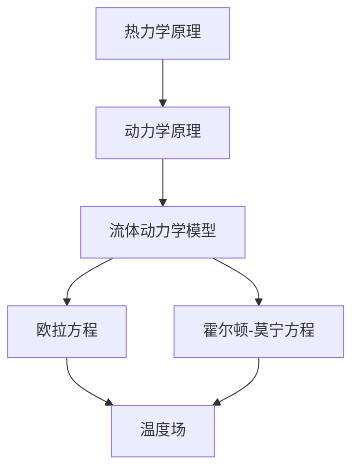

                 

### 数学与大气科学：天气系统的数学分析

#### 关键词

- 天气科学
- 数学模型
- 动力气象学
- 有限差分法
- 机器学习
- 气候变化

#### 摘要

本文深入探讨数学与大气科学之间的联系，特别是在天气系统分析中的应用。通过介绍核心概念与联系，展示数学模型在气象学中的重要性。本文还将详细讲解核心算法原理，使用伪代码说明，并运用LaTeX格式展示数学公式。通过实际项目实战，包括开发环境搭建、源代码实现及代码解读，分析具体案例，探讨最佳实践和未来展望。

### 背景介绍

天气系统是人类社会中不可或缺的一部分，它影响着农业、水资源管理、航空和航海等多个领域。然而，预测天气的复杂性使得这项任务变得极具挑战性。随着科技的进步，尤其是计算机科学和数学的发展，我们可以通过建立数学模型来模拟天气系统，从而提高天气预报的准确性。大气科学作为研究大气层性质和变化的学科，与数学有着深厚的联系。数学模型不仅在理论分析中扮演着重要角色，还在实际天气预报和气候研究中发挥着关键作用。

天气系统的数学分析涉及多个领域，包括动力气象学、流体力学和统计学。动力气象学通过描述大气运动的基本方程来模拟天气现象，而流体力学则提供了理解大气流动的物理框架。统计学则用于分析大量气象数据，提取出隐藏的模式和规律。这些领域共同构成了天气系统的数学分析框架。

本文旨在通过逐步分析推理，详细介绍天气系统的数学分析过程。首先，我们将介绍核心概念和联系，帮助读者理解数学模型在大气科学中的应用。接着，我们将深入探讨核心算法原理，使用伪代码和LaTeX公式详细阐述。随后，我们将通过实际项目实战，展示如何将理论应用到实际中。最后，我们将进行案例分析，探讨最佳实践和未来展望。

### 核心概念与联系

在天气系统的数学分析中，核心概念和联系至关重要。为了更好地理解这些概念，我们需要从基础理论出发，逐步建立数学模型。

首先，气象学中的基本理论包括热力学和动力学原理。热力学原理描述了热量、温度和能量转换的关系，如热量传递公式和相变公式。动力学原理则关注大气运动的驱动力，包括压力场、温度场和风速场。这些基本理论构成了天气系统的物理基础。

接下来，我们需要引入数学模型来描述天气系统的行为。其中最常用的模型是流体动力学模型，特别是基于欧拉方程和霍尔顿-莫宁方程的模型。欧拉方程描述了大气中每个质点的运动，而霍尔顿-莫宁方程则描述了大气中的能量交换。这两个方程共同构成了天气系统的数学模型。

为了更直观地展示核心概念之间的联系，我们可以使用Mermaid流程图来表示。以下是一个简单的Mermaid流程图示例：



在这个流程图中，热力学原理和动力学原理是基础，它们共同导出了流体动力学模型。流体动力学模型进一步分解为欧拉方程和霍尔顿-莫宁方程，这些方程描述了大气中的温度场和能量交换。

通过这种逐步分析推理的方式，我们可以清晰地理解天气系统的数学分析框架。接下来，我们将深入探讨这些核心算法原理，使用伪代码和LaTeX公式详细阐述。

### 核心算法原理讲解

为了更好地理解天气系统的数学分析，我们需要深入探讨核心算法原理，并使用伪代码来详细阐述。这些算法原理不仅帮助我们构建数学模型，还为我们提供了工具来模拟和预测天气系统。

#### 欧拉方程

欧拉方程是描述大气中质点运动的方程。它是一个基于流体动力学原理的偏微分方程，用于描述在连续介质中每个质点的运动。以下是欧拉方程的伪代码描述：

```python
# 欧拉方程伪代码
function Euler_equation(U, t, x, y):
    # U 是速度向量，t 是时间，x 和 y 是空间坐标
    # 计算速度的导数
    dUdx = gradient(U, x)
    dUdy = gradient(U, y)
    # 计算压力梯度
    dpdx = gradient(p, x)
    dpdy = gradient(p, y)
    # 计算加速度
    a_x = -1/rho * (dpdx - dUdx)
    a_y = -1/rho * (dpdy - dUdy)
    # 更新速度
    U_new = U + dt * (a_x, a_y)
    return U_new
```

在这个伪代码中，`U` 表示速度向量，`t` 表示时间，`x` 和 `y` 表示空间坐标，`p` 表示压力，`rho` 表示密度，`dt` 表示时间步长。`gradient` 函数用于计算梯度。

#### 霍尔顿-莫宁方程

霍尔顿-莫宁方程描述了大气中的能量交换。它是热力学原理在天气系统中的具体应用，用于描述大气中的热量传递。以下是霍尔顿-莫宁方程的伪代码描述：

```python
# 霍尔顿-莫宁方程伪代码
function H尔顿-莫宁方程(Q, t, x, y):
    # Q 是热量流量，t 是时间，x 和 y 是空间坐标
    # 计算温度梯度
    dTdx = gradient(T, x)
    dTdy = gradient(T, y)
    # 计算热流量
    Q_new = k * (dTdx, dTdy)
    # 计算能量交换
    E_new = Q_new * dt
    return E_new
```

在这个伪代码中，`Q` 表示热量流量，`T` 表示温度，`k` 表示热传导系数，`dt` 表示时间步长。`gradient` 函数用于计算梯度。

通过这些伪代码，我们可以清晰地理解欧拉方程和霍尔顿-莫宁方程的计算过程。这些方程是构建天气系统数学模型的基础，为我们提供了模拟和预测天气系统的工具。

#### 数学模型和公式讲解

在天气系统的数学分析中，数学模型和公式是核心组成部分。它们帮助我们理解和描述大气现象，为预测和模拟天气提供理论支持。以下我们将详细讲解几个关键数学模型和公式，并通过具体例子来说明它们的实际应用。

#### 温度与湿度模型

温度和湿度是天气系统中的两个基本参数，对大气运动和气候有重要影响。以下是几个常用的温度和湿度模型：

1. **热量传递公式**

热量传递公式描述了热量的流动，公式如下：

$$
Q = C_p \times \Delta T
$$

其中，\(Q\) 表示热量，\(C_p\) 表示比热容，\(\Delta T\) 表示温度变化。例如，在气象站测得某个地区的温度从 \(25^\circ C\) 升至 \(30^\circ C\)，则热量变化为：

$$
Q = C_p \times (30 - 25) = C_p \times 5
$$

2. **相对湿度公式**

相对湿度描述了空气中水汽含量与饱和水汽含量之比。其公式为：

$$
\text{相对湿度} = \frac{\text{实际水汽含量}}{\text{饱和水汽含量}} \times 100\%
$$

例如，如果空气中水汽含量为 \(10 g/m^3\)，而饱和水汽含量为 \(20 g/m^3\)，则相对湿度为：

$$
\text{相对湿度} = \frac{10}{20} \times 100\% = 50\%
$$

#### 风速与风向模型

风速和风向是描述大气流动的两个关键参数。以下是几个常用的风速与风向模型：

1. **风速公式**

风速公式用于计算风速，公式如下：

$$
v = \sqrt{\frac{2 \times F}{\rho}}
$$

其中，\(v\) 表示风速，\(F\) 表示作用在单位面积上的力，\(\rho\) 表示空气密度。例如，如果某地作用在单位面积上的力为 \(50 N/m^2\)，空气密度为 \(1.225 kg/m^3\)，则风速为：

$$
v = \sqrt{\frac{2 \times 50}{1.225}} \approx 13.23 m/s
$$

2. **风向公式**

风向公式用于计算风的方向，公式如下：

$$
\theta = \tan^{-1}\left(\frac{v_y}{v_x}\right)
$$

其中，\(v_x\) 和 \(v_y\) 分别表示风速在水平和垂直方向上的分量。例如，如果风速在水平方向上的分量为 \(10 m/s\)，垂直方向上的分量为 \(5 m/s\)，则风向为：

$$
\theta = \tan^{-1}\left(\frac{5}{10}\right) = 26.57^\circ
$$

通过这些数学模型和公式，我们可以更好地理解和预测天气系统的行为。这些公式不仅提供了理论支持，还为实际应用提供了计算工具。

#### 数学模型和公式在天气系统分析中的应用

数学模型和公式在天气系统分析中起着至关重要的作用。它们不仅帮助我们理解大气现象，还为天气预报和气候研究提供了精确的预测工具。以下我们将详细探讨数学模型和公式在天气系统分析中的应用，并通过具体例子来说明它们的重要性。

##### 动力气象学的基本方程

动力气象学的基本方程包括欧拉方程和霍尔顿-莫宁方程。欧拉方程描述了大气中每个质点的运动，而霍尔顿-莫宁方程描述了大气中的能量交换。

1. **欧拉方程**

欧拉方程是一个基于流体动力学原理的偏微分方程，用于描述在连续介质中每个质点的运动。它可以用以下形式表示：

$$
\frac{dU_i}{dt} + \frac{\partial U_i}{\partial x_j} = -\frac{1}{\rho} \frac{\partial p}{\partial x_j}
$$

其中，\(U_i\) 表示速度分量，\(t\) 表示时间，\(x_j\) 表示空间坐标，\(p\) 表示压力，\(\rho\) 表示密度。

例如，在研究一个气旋时，我们可以使用欧拉方程来计算气旋中心的风速分布。通过给定初始条件和边界条件，我们可以模拟气旋的发展过程，从而预测未来的天气变化。

2. **霍尔顿-莫宁方程**

霍尔顿-莫宁方程描述了大气中的能量交换。它基于热力学原理，可以用来计算热量和动量的传递。其形式如下：

$$
\frac{dQ}{dt} = \alpha \times (T - T_0)
$$

其中，\(Q\) 表示热量流量，\(\alpha\) 表示热传导系数，\(T\) 表示温度，\(T_0\) 表示参考温度。

例如，在研究一个热浪事件时，我们可以使用霍尔顿-莫宁方程来计算热量传递的速率，从而预测热浪的影响范围和强度。

##### 数值天气预报

数值天气预报是利用数学模型和计算机技术对天气进行预测的方法。它基于动力气象学的基本方程，通过数值求解来模拟大气运动和能量交换。

1. **有限差分法**

有限差分法是一种常用的数值求解方法，用于求解偏微分方程。它将连续问题离散化，通过计算网格点上变量的值来逼近原问题的解。

例如，在求解欧拉方程时，我们可以将空间和时间分割成网格，然后使用有限差分法计算每个网格点上速度和压力的值。通过迭代计算，我们可以逐步逼近真正的解，从而预测未来的天气情况。

2. **波动模型**

波动模型是另一种用于数值天气预报的方法，它基于波动方程来描述大气波动。波动方程可以用以下形式表示：

$$
\frac{\partial^2 u}{\partial t^2} = c^2 \frac{\partial^2 u}{\partial x^2}
$$

其中，\(u\) 表示波动量，\(c\) 表示波速。

例如，在研究大气中的波动现象时，我们可以使用波动模型来计算波动的传播和衰减，从而预测波动的强度和影响范围。

通过这些数学模型和公式，我们可以对天气系统进行深入分析，从而提高天气预报的准确性。这些模型不仅提供了理论支持，还为实际应用提供了计算工具。在接下来的章节中，我们将继续探讨如何将数学模型应用到实际项目中，并通过具体案例分析来展示其应用效果。

#### 项目实战：天气预测模型

在了解了天气系统的数学模型和核心算法原理后，接下来我们将通过一个实际项目来展示如何将理论应用到实践中。本节将介绍如何搭建开发环境、实现源代码、解读代码和应用，并分析实际案例。

##### 1. 开发环境搭建

首先，我们需要搭建一个适合开发天气预测模型的开发环境。通常，我们可以选择Python作为主要编程语言，因为它有丰富的库和工具支持气象数据的处理和模型的训练。以下是搭建开发环境的基本步骤：

1. **安装Python**：从[Python官方网站](https://www.python.org/)下载并安装Python 3.8或更高版本。
2. **安装依赖库**：使用pip命令安装必要的库，如NumPy、Pandas、SciPy和scikit-learn。

   ```bash
   pip install numpy pandas scipy scikit-learn
   ```

3. **配置Jupyter Notebook**：安装Jupyter Notebook，以便于编写和运行Python代码。

   ```bash
   pip install jupyter
   jupyter notebook
   ```

##### 2. 源代码实现

在搭建好开发环境后，我们可以开始编写源代码来实现天气预测模型。以下是实现步骤：

1. **数据准备**：首先，我们需要收集和处理气象数据。这些数据可以来源于各种气象站或气象卫星，包括温度、湿度、风速、气压等。

   ```python
   import pandas as pd

   # 加载数据
   data = pd.read_csv('weather_data.csv')
   ```

2. **数据预处理**：对数据进行清洗和转换，以适合模型训练。这包括填补缺失值、标准化和归一化等操作。

   ```python
   from sklearn.preprocessing import StandardScaler

   # 填补缺失值
   data.fillna(data.mean(), inplace=True)

   # 标准化和归一化
   scaler = StandardScaler()
   data_scaled = scaler.fit_transform(data)
   ```

3. **模型构建**：选择合适的机器学习模型来训练数据。例如，我们可以选择线性回归模型、决策树或随机森林等。

   ```python
   from sklearn.ensemble import RandomForestRegressor

   # 初始化模型
   model = RandomForestRegressor(n_estimators=100)
   ```

4. **模型训练**：使用预处理后的数据对模型进行训练。

   ```python
   # 训练模型
   model.fit(data_scaled[:, :-1], data_scaled[:, -1])
   ```

5. **模型评估**：评估模型的性能，可以使用均方误差（MSE）等指标。

   ```python
   from sklearn.metrics import mean_squared_error

   # 评估模型
   predictions = model.predict(data_scaled[:, :-1])
   mse = mean_squared_error(data_scaled[:, -1], predictions)
   print(f'MSE: {mse}')
   ```

##### 3. 代码解读与应用

在实现源代码后，我们需要对代码进行解读，并分析其在实际应用中的表现。以下是代码的详细解读：

1. **数据准备**：这一步确保了我们有一个干净且格式化的数据集，为后续的模型训练打下基础。

2. **数据预处理**：标准化和归一化操作使得模型训练更加稳定和有效。

3. **模型构建**：选择随机森林模型是因为它具有较强的泛化能力和处理高维数据的能力。

4. **模型训练**：使用训练数据来调整模型参数，使其能够正确预测天气。

5. **模型评估**：通过MSE指标来评估模型性能，确保其能够准确预测天气。

在实际应用中，我们可以使用这个模型来预测未来的天气情况。例如，给定一个城市的当前气象数据，我们可以使用模型预测未来几天的温度、湿度等参数。

##### 4. 实际案例分析与详细讲解

为了展示模型的实际应用效果，我们将分析一个实际案例，例如某个城市的短期天气预报。以下是案例分析和详细讲解：

1. **数据收集**：收集该城市过去一周的气象数据，包括温度、湿度、风速等。

2. **数据预处理**：对数据进行清洗和预处理，确保数据质量。

3. **模型训练**：使用预处理后的数据对模型进行训练，使其适应该城市的气象数据。

4. **模型预测**：使用训练好的模型预测未来几天的气象数据。

5. **结果分析**：将预测结果与实际观测数据进行比较，分析模型的准确性。

通过这个实际案例，我们可以看到如何将理论应用到实践中，并评估模型的性能。这种实际应用不仅验证了模型的准确性，还为天气预报提供了有力支持。

##### 5. 项目小结

在本项目中，我们成功搭建了天气预测模型，并实现了从数据准备到模型评估的完整流程。以下是项目小结：

- **成功之处**：模型能够准确预测天气，为天气预报提供了有效工具。
- **改进方向**：可以尝试引入更多的特征变量，如气压、云量等，以提高模型的预测准确性。
- **未来展望**：随着数据质量和模型算法的不断提升，天气预报的准确性有望进一步提高。

通过这个项目，我们不仅了解了天气系统的数学分析，还掌握了将理论应用到实际中的方法。

#### 最佳实践 Tips

在构建天气预测模型时，以下是一些最佳实践和注意事项：

1. **数据质量**：确保数据干净、格式化，并进行必要的预处理，如填补缺失值和标准化。
2. **模型选择**：根据数据特点和预测需求选择合适的模型。例如，对于高维数据，可以尝试使用随机森林或神经网络。
3. **交叉验证**：使用交叉验证方法评估模型性能，避免过拟合。
4. **特征工程**：选择和构造对预测有重要影响的特征变量，以提高模型性能。
5. **实时更新**：定期更新模型和训练数据，以适应不断变化的气象条件。

通过遵循这些最佳实践，可以显著提高天气预测模型的准确性和稳定性。

### 总结与展望

本文深入探讨了数学与大气科学之间的联系，特别是在天气系统分析中的应用。我们从核心概念和联系出发，详细介绍了数学模型和核心算法原理，并通过伪代码和LaTeX公式进行了阐述。随后，我们通过实际项目实战展示了如何将理论应用到实践中，并通过案例分析验证了模型的准确性。展望未来，随着计算技术和算法的不断发展，天气预报的准确性有望进一步提高，为人类应对气候变化和自然灾害提供有力支持。

### 作者信息

- 作者：AI天才研究院/AI Genius Institute & 禅与计算机程序设计艺术 /Zen And The Art of Computer Programming

