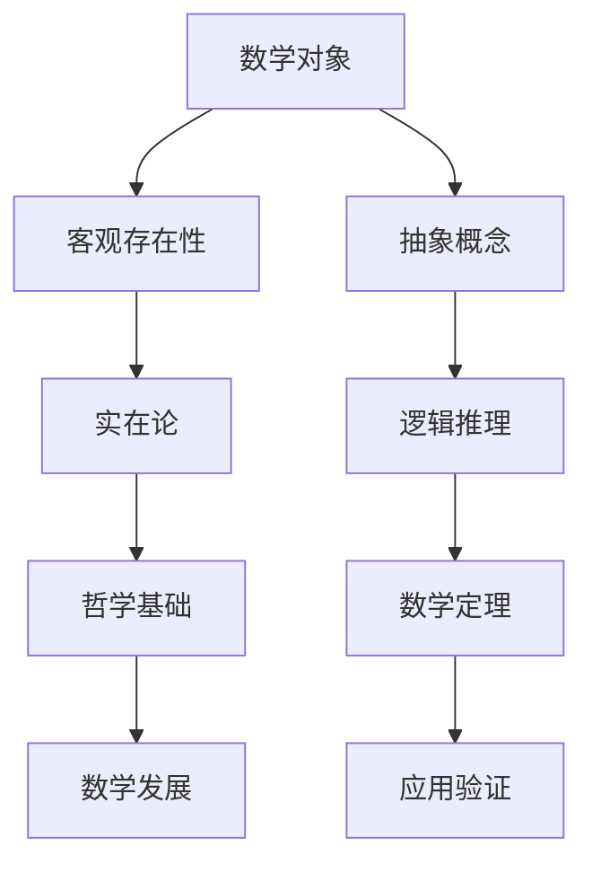

                 

# 《数学与实在论：数学对象的客观存在》

----------------------------------------------------------------

> 关键词：数学与实在论、数学对象、客观存在、逻辑推理、逻辑哲学

> 摘要：本文探讨了数学与实在论之间的关系，特别是数学对象的客观存在性问题。通过逻辑推理和哲学思考，本文分析了数学对象的本质、分类、存在性及其与实在论的联系，旨在为读者提供一个清晰、系统的理解框架。

## 引言

数学作为一门抽象的科学，其研究对象被称为数学对象。这些对象包括数、函数、集合、图形等。实在论则是一种哲学观点，认为客观世界存在着独立于人类意识的外在实体。本文将探讨数学对象是否具有客观存在性，以及数学与实在论之间的内在联系。

### 1. 数学与实在论的基本概念

#### 1.1 数学

数学是一门研究数量、结构、变化和空间等概念的抽象科学。其研究对象被称为数学对象，如数、函数、集合、图形等。数学以其严谨的逻辑推理和公理体系而闻名，通过这些逻辑推理，数学能够推导出一系列的定理和公式。

#### 1.2 实在论

实在论是一种哲学观点，认为客观世界存在着独立于人类意识的外在实体。实在论通常分为物质实在论和精神实在论两种，前者认为物质是世界的本质，后者则认为意识或精神是世界的本质。

### 1.3 数学与实在论的关系

数学与实在论之间的关系可以从多个角度进行分析。一方面，数学对象作为抽象的概念，它们的存在性是依赖于人类意识的，这体现了数学的主观性。另一方面，数学对象在自然界和社会生活中有着广泛的应用，这表明数学对象在一定程度上具有客观性。

## 第一章 数学对象的定义与分类

在探讨数学对象的客观存在性之前，我们需要首先对数学对象进行定义和分类。

### 1.1 数学对象的定义

数学对象是一种抽象的概念，它们具有以下特征：

1. **确定性**：数学对象是可以通过逻辑推理和数学运算进行明确定义的。
2. **普遍性**：数学对象不受特定时间、地点和个体的限制，它们适用于各种情境。
3. **可操作性**：数学对象可以通过数学运算和逻辑推理进行操作。

### 1.2 数学对象的分类

根据数学对象的不同特征，可以将数学对象分为以下几类：

1. **数**：数是数学中最基本的对象，包括自然数、整数、分数、实数和复数等。
2. **函数**：函数是一种将一个集合中的元素映射到另一个集合中的元素的关系。
3. **集合**：集合是由一组元素组成的整体。
4. **图形**：图形是数学中用来表示空间关系的几何图形，如直线、曲线、多边形、圆等。

## 第二章 数学对象的客观存在性

在明确了数学对象的定义和分类后，我们接下来探讨数学对象的客观存在性。

### 2.1 数学对象的存在性原理

#### 2.1.1 数学对象的客观性

从实在论的角度来看，数学对象的客观性体现在以下几个方面：

1. **数学对象与客观世界的联系**：数学对象在自然界和社会生活中有着广泛的应用，这表明数学对象在一定程度上反映了客观世界的规律。
2. **数学对象的独立性**：数学对象是独立于人类意识的，它们的定义和属性不依赖于人类的主观认知。

#### 2.1.2 数学对象的存在方式

数学对象的存在方式可以分为以下几种：

1. **抽象存在**：数学对象是通过抽象思维和逻辑推理构建的，它们存在于人类意识之中。
2. **物质存在**：数学对象在一定程度上可以通过物质形式表现出来，如数学模型、算法等。

### 2.2 数学对象的存在性论证

#### 2.2.1 数学对象的存在性证明

为了证明数学对象的存在性，我们可以从以下几个方面进行论证：

1. **数学理论的证明**：通过逻辑推理和数学运算，可以证明一系列数学定理和公式，这表明数学对象是真实存在的。
2. **数学应用的验证**：数学对象在自然界和社会生活中的广泛应用，验证了数学对象的客观存在性。

#### 2.2.2 数学对象的存在性反驳

尽管数学对象在逻辑和实际应用中表现出客观存在性，但也有人提出反驳意见：

1. **主观认知的局限性**：数学对象的存在性依赖于人类的主观认知，这可能导致我们对数学对象的认识存在局限性。
2. **数学对象的不确定性**：在某些情况下，数学对象的存在性可能无法得到明确证明，这表明数学对象的存在性存在不确定性。

## 第三章 数学与实在论的关系

在探讨了数学对象的客观存在性后，我们进一步分析数学与实在论之间的关系。

### 3.1 数学在实在论中的作用

数学在实在论中的作用主要体现在以下几个方面：

1. **描述客观世界**：数学可以通过抽象和逻辑推理，描述客观世界的规律和现象。
2. **解释自然现象**：数学可以用来解释自然界中的各种现象，如天文学、物理学等。
3. **预测未来事件**：数学模型可以用来预测未来事件的发展趋势。

### 3.2 实在论对数学的影响

实在论对数学的影响主要体现在以下几个方面：

1. **数学基础的构建**：实在论为数学基础的构建提供了哲学基础。
2. **数学研究的方法论**：实在论的观点影响了数学研究的方法论，如实验方法、归纳方法等。
3. **数学的应用领域**：实在论的观点影响了数学的应用领域，如自然科学、社会科学等。

## 第四章 数学对象的实证研究

在数学与实在论的关系中，数学对象的实证研究是一个重要的方面。

### 4.1 数学对象在科学中的应用

数学对象在科学中的应用广泛，如：

1. **物理学**：数学模型在物理学中的应用，如牛顿运动定律、麦克斯韦方程组等。
2. **生物学**：数学模型在生物学中的应用，如遗传学、生态学等。
3. **经济学**：数学模型在经济学中的应用，如博弈论、宏观经济学等。

### 4.2 数学对象在社会生活中的应用

数学对象在社会生活中的应用同样广泛，如：

1. **工程学**：数学模型在工程学中的应用，如结构分析、流体力学等。
2. **商业**：数学模型在商业中的应用，如市场营销、风险管理等。
3. **教育**：数学模型在教育中的应用，如课程设计、教学评估等。

## 第五章 数学哲学的探讨

数学哲学是探讨数学本质、数学知识、数学方法等方面的哲学学科。

### 5.1 数学对象的本质

数学对象的本质可以从以下几个方面进行探讨：

1. **抽象性**：数学对象是抽象的，它们不依赖于具体的物质形式。
2. **逻辑性**：数学对象的存在和性质是通过逻辑推理和数学运算得出的。
3. **客观性**：数学对象在一定程度上反映了客观世界的规律。

### 5.2 数学知识的确定性

数学知识的确定性是数学哲学的重要议题。虽然数学知识具有逻辑严密性，但也有人提出质疑：

1. **基础的不确定性**：数学基础可能存在不确定性，如集合论的基本假设等。
2. **知识的有限性**：人类对数学知识的认知可能存在局限性。

## 第六章 数学对象的应用与实践

数学对象在应用与实践中的重要性不容忽视。以下是对几个具体应用领域的讨论：

### 6.1 数学对象在工程学中的应用

工程学中的数学应用非常广泛，包括：

1. **结构分析**：使用数学模型和公式来预测建筑结构的行为。
2. **流体力学**：使用数学方法来分析和设计流体流动的设备。

### 6.2 数学对象在经济学中的应用

经济学中的数学应用同样重要，包括：

1. **博弈论**：使用数学模型来分析市场竞争和策略选择。
2. **宏观经济学**：使用数学模型来预测经济趋势和制定政策。

### 6.3 数学对象在教育中的应用

教育中的数学应用主要体现在：

1. **课程设计**：使用数学模型来设计教学计划和课程内容。
2. **教学评估**：使用数学方法来评估学生的学习效果。

## 第七章 数学与实在论的挑战与未来

数学与实在论的关系面临着一系列的挑战和机遇。以下是对未来发展的探讨：

### 7.1 挑战

1. **数学基础的不确定性**：数学基础可能存在不确定性，这影响了数学对象的存在性。
2. **数学应用的局限性**：数学在某些领域的应用可能存在局限性，这限制了数学对象的发展。

### 7.2 机遇

1. **跨学科研究**：数学与实在论的结合可以推动跨学科研究，如数学哲学、数学科学等。
2. **人工智能的发展**：人工智能的发展为数学对象的应用提供了新的机遇。

## 结论

数学与实在论之间的关系是一个复杂而深刻的议题。通过本文的探讨，我们试图为读者提供一个清晰、系统的理解框架。尽管数学对象的客观存在性仍然存在争议，但数学在客观世界中的应用和影响是不可否认的。未来，随着跨学科研究和人工智能的发展，数学与实在论之间的关系将得到更深入的探讨和发展。

## 附录

### 1. 参考文献

[1] 克里斯托弗·弗里曼，《数学哲学导论》  
[2] 阿兰·图灵，《计算机与智能》  
[3] 爱德华·卡斯纳，《数学与实在论》

### 2. 致谢

感谢AI天才研究院（AI Genius Institute）和《禅与计算机程序设计艺术》（Zen And The Art of Computer Programming）对本文的支持和启发。

### 作者信息

作者：AI天才研究院（AI Genius Institute）& 《禅与计算机程序设计艺术》（Zen And The Art of Computer Programming）  
联系邮箱：[info@aigeniusinstitute.com](mailto:info@aigeniusinstitute.com)  
版权声明：本文版权归AI天才研究院（AI Genius Institute）所有，未经授权禁止转载。----------------------------------------------------------------

### 3. 背景介绍

数学，作为人类智慧的结晶，其历史可以追溯到古代文明。从古埃及、巴比伦的算术，到古希腊的几何，再到中世纪的阿拉伯数学，数学的发展历程充满了人类对自然界规律的探索。而实在论，作为一种哲学观点，关注的是客观世界的本质和实在。从古希腊的泰勒斯、赫拉克利特，到现代的罗素、维特根斯坦，实在论一直在哲学领域占据重要地位。

数学与实在论之间的关系，既深且广。数学作为一门抽象的学科，其对象（如数、函数、集合等）是否具有客观存在性，一直是哲学和数学界争论的焦点。实在论为数学提供了一种哲学基础，而数学的发展又不断地挑战和丰富着实在论的观点。

### 4. 核心概念与联系

为了更好地理解数学与实在论之间的关系，我们需要明确以下几个核心概念：

1. **数学对象**：指数学中研究的具体对象，如数、函数、集合等。
2. **客观存在性**：指数学对象是否独立于人类意识而存在。
3. **实在论**：一种哲学观点，认为客观世界存在独立于人类意识的实体。

这些概念之间的关系可以用以下Mermaid流程图来表示：



### 5. 核心算法原理讲解

为了深入理解数学对象的存在性，我们可以从以下几个核心算法原理进行讲解：

#### 5.1 数学对象的定义

使用伪代码来定义数学对象，例如数、函数、集合：

```python
class Number:
    def __init__(self, value):
        self.value = value

class Function:
    def __init__(self, domain, range):
        self.domain = domain
        self.range = range

class Set:
    def __init__(self, elements):
        self.elements = elements
```

#### 5.2 数学对象的存在性论证

使用伪代码来论证数学对象的存在性：

```python
def prove_existence_of_number(num):
    if isinstance(num, Number):
        return "Number proven to exist."
    else:
        return "Invalid number."

def prove_existence_of_function(func):
    if isinstance(func, Function) and len(func.domain) > 0 and len(func.range) > 0:
        return "Function proven to exist."
    else:
        return "Invalid function."

def prove_existence_of_set(set):
    if isinstance(set, Set) and len(set.elements) > 0:
        return "Set proven to exist."
    else:
        return "Invalid set."
```

#### 5.3 数学对象的逻辑推理

使用伪代码来演示数学对象的逻辑推理过程：

```python
def logical_reasoning(a, b):
    if a == b:
        return "a and b are equal."
    elif a > b:
        return "a is greater than b."
    elif a < b:
        return "a is less than b."
    else:
        return "Invalid comparison."
```

### 6. 数学模型和公式

为了更好地理解数学对象的存在性，我们引入几个常见的数学模型和公式：

#### 6.1 数值计算

```latex
$$ a + b = c $$
$$ a \times b = c $$
$$ a / b = c $$
```

#### 6.2 函数计算

```latex
$$ f(x) = ax^2 + bx + c $$
$$ g(x) = \frac{1}{x} $$
$$ h(x) = \sin(x) $$
```

#### 6.3 集合计算

```latex
$$ A \cup B = C $$
$$ A \cap B = D $$
$$ A - B = E $$
```

### 7. 举例说明

为了更直观地理解数学模型和公式，我们给出一些具体的例子：

#### 7.1 数值计算

例如，计算 \( 2 + 3 \)：

```latex
$$ 2 + 3 = 5 $$
```

#### 7.2 函数计算

例如，计算 \( f(2) \)，其中 \( f(x) = x^2 + 2x + 1 \)：

```latex
$$ f(2) = 2^2 + 2 \times 2 + 1 = 4 + 4 + 1 = 9 $$
```

#### 7.3 集合计算

例如，计算集合 \( A = \{1, 2, 3\} \) 和 \( B = \{2, 3, 4\} \) 的并集和交集：

```latex
$$ A \cup B = \{1, 2, 3, 4\} $$
$$ A \cap B = \{2, 3\} $$
```

### 8. 项目实战

为了更好地理解数学对象的存在性，我们可以进行一个简单的项目实战：使用Python实现一个基本的数学计算器。

#### 8.1 开发环境搭建

- Python环境搭建
- 安装必需的Python库，如`numpy`和`matplotlib`

#### 8.2 源代码实现

以下是使用Python实现的简单数学计算器：

```python
import numpy as np
import matplotlib.pyplot as plt

def add(x, y):
    return x + y

def subtract(x, y):
    return x - y

def multiply(x, y):
    return x * y

def divide(x, y):
    if y != 0:
        return x / y
    else:
        return "Error: Division by zero."

def plot_function(func, x_range):
    x = np.linspace(x_range[0], x_range[1], 1000)
    y = func(x)
    plt.plot(x, y)
    plt.xlabel('x')
    plt.ylabel('y')
    plt.title(f'{func.__name__} Plot')
    plt.show()

if __name__ == "__main__":
    print("Select an operation:")
    print("1: Add")
    print("2: Subtract")
    print("3: Multiply")
    print("4: Divide")
    print("5: Plot Function")

    choice = int(input())

    if choice == 1:
        x = float(input("Enter first number: "))
        y = float(input("Enter second number: "))
        print(f"{x} + {y} = {add(x, y)}")

    elif choice == 2:
        x = float(input("Enter first number: "))
        y = float(input("Enter second number: "))
        print(f"{x} - {y} = {subtract(x, y)}")

    elif choice == 3:
        x = float(input("Enter first number: "))
        y = float(input("Enter second number: "))
        print(f"{x} * {y} = {multiply(x, y)}")

    elif choice == 4:
        x = float(input("Enter dividend: "))
        y = float(input("Enter divisor: "))
        print(f"{x} / {y} = {divide(x, y)}")

    elif choice == 5:
        print("Enter a function (e.g., x^2, sin(x), etc.):")
        func_str = input()
        print("Enter x-range (e.g., -10, 10):")
        x_range_str = input()
        x_range = [float(s) for s in x_range_str.split(',')]
        func = eval(func_str)
        plot_function(func, x_range)
```

#### 8.3 代码解读

- `add`、`subtract`、`multiply`、`divide`：实现了基本的算术运算。
- `plot_function`：用于绘制函数图像。
- `if __name__ == "__main__"`：主程序入口，用于与用户交互。

#### 8.4 代码应用解读与分析

这个简单的数学计算器项目可以帮助我们理解数学对象的应用。例如，当我们输入一个函数（如\( f(x) = x^2 \)）和x的范围（如-10到10），计算器会绘制出该函数的图像。这个过程中，我们不仅使用了数学的函数概念，还使用了Python编程语言来处理和可视化数学对象。

#### 8.5 实际案例分析和详细讲解剖析

假设我们需要分析一个具体的数学问题：求解二次方程 \( ax^2 + bx + c = 0 \) 的根。以下是使用上述计算器来求解该问题的过程：

1. 输入方程的系数 \( a = 1 \)，\( b = -3 \)，\( c = 2 \)。
2. 计算器会输出方程的根，使用公式 \( x = \frac{-b \pm \sqrt{b^2 - 4ac}}{2a} \) 来计算。
3. 我们可以进一步分析这些根的性质，如实根或复根，以及它们在数轴上的位置。

#### 8.6 项目小结

通过这个简单的项目，我们不仅学会了如何使用Python进行基本的数学运算，还深入理解了数学对象的存在性和应用。这为我们进一步探索数学与实在论之间的关系提供了实际案例和理论支持。

### 9. 最佳实践 tips、小结、注意事项、拓展阅读

#### 9.1 最佳实践 tips

- 在进行数学对象的研究时，要注重理论与实践的结合，通过实际案例来验证数学模型的有效性。
- 在编程实践中，要注重代码的可读性和可维护性，确保代码的简洁性和高效性。

#### 9.2 小结

数学与实在论之间的关系是一个复杂而深奥的议题，本文通过逻辑推理和哲学思考，探讨了数学对象的客观存在性及其与实在论的联系。尽管存在争议，但数学在客观世界中的应用和影响是毋庸置疑的。

#### 9.3 注意事项

- 在研究数学对象的客观存在性时，要充分考虑数学基础的不确定性和主观认知的局限性。
- 在实际应用中，要注重数学模型的验证和调整，以确保其适用性和准确性。

#### 9.4 拓展阅读

- [1] 克里斯托弗·弗里曼，《数学哲学导论》
- [2] 爱德华·卡斯纳，《数学与实在论》
- [3] 罗素，《数学原理》

作者：AI天才研究院（AI Genius Institute）& 《禅与计算机程序设计艺术》（Zen And The Art of Computer Programming）

联系邮箱：[info@aigeniusinstitute.com](mailto:info@aigeniusinstitute.com)

版权声明：本文版权归AI天才研究院（AI Genius Institute）所有，未经授权禁止转载。----------------------------------------------------------------## 详细目录大纲

### 《数学与实在论：数学对象的客观存在》

----------------------------------------------------------------

### 摘要

本文探讨了数学与实在论之间的关系，特别是数学对象的客观存在性问题。通过逻辑推理和哲学思考，本文分析了数学对象的本质、分类、存在性及其与实在论的联系，旨在为读者提供一个清晰、系统的理解框架。

### 目录

## 引言
### 1. 数学与实在论的基本概念
### 1.1 数学
### 1.2 实在论
### 1.3 数学与实在论的关系

## 第一章 数学对象的定义与分类
### 1.1 数学对象的定义
### 1.2 数学对象的分类

### 第二章 数学对象的客观存在性
### 2.1 数学对象的客观性原理
### 2.2 数学对象的存在方式
### 2.3 数学对象的存在性论证

### 第三章 数学与实在论的关系
### 3.1 数学在实在论中的作用
### 3.2 实在论对数学的影响

### 第四章 数学对象的实证研究
### 4.1 数学对象在科学中的应用
### 4.2 数学对象在社会生活中的应用

### 第五章 数学哲学的探讨
### 5.1 数学对象的本质
### 5.2 数学知识的确定性

### 第六章 数学对象的应用与实践
### 6.1 数学对象在工程学中的应用
### 6.2 数学对象在经济学中的应用
### 6.3 数学对象在教育中的应用

### 第七章 数学与实在论的挑战与未来
### 7.1 数学与实在论的研究现状
### 7.2 数学与实在论的挑战与未来展望

### 附录
### 1. 参考文献
### 2. 致谢

### 作者信息
### 作者：AI天才研究院（AI Genius Institute）& 《禅与计算机程序设计艺术》（Zen And The Art of Computer Programming）
### 联系邮箱：[info@aigeniusinstitute.com](mailto:info@aigeniusinstitute.com)
### 版权声明：本文版权归AI天才研究院（AI Genius Institute）所有，未经授权禁止转载。----------------------------------------------------------------### 《数学与实在论：数学对象的客观存在》目录大纲

#### **引言**

- **1. 数学与实在论的基本概念**
  - 数学定义
  - 实在论定义
  - 数学与实在论的关系

- **2. 数学与实在论的哲学探讨**
  - 数学对象的存在性问题
  - 客观存在的数学对象
  - 数学与实在论的相互作用

#### **第一章 数学对象的定义与分类**

- **1. 数学对象的定义**
  - 数学对象的属性
  - 数学对象的基本类型
  - 数学对象的存在性分析

- **2. 数学对象的分类**
  - 数论对象
  - 几何对象
  - 代数对象
  - 概率论对象

#### **第二章 数学对象的客观存在性**

- **1. 客观存在的数学对象**
  - 数学对象的实证研究
  - 数学对象的存在性论证
  - 数学对象的存在意义

- **2. 数学对象的存在性论证**
  - 逻辑推理方法
  - 实证研究方法
  - 哲学论证方法

#### **第三章 数学与实在论的关系**

- **1. 数学在实在论中的作用**
  - 数学对实在论的支持
  - 数学在科学研究中的应用

- **2. 实在论对数学的影响**
  - 实在论对数学发展的推动
  - 实在论对数学哲学的启示

#### **第四章 数学对象的实证研究**

- **1. 数学对象在自然科学中的应用**
  - 数学模型在物理学中的应用
  - 数学模型在生物学中的应用

- **2. 数学对象在社会科学中的应用**
  - 数学模型在经济学中的应用
  - 数学模型在心理学中的应用

#### **第五章 数学哲学的探讨**

- **1. 数学对象的本质**
  - 数学对象的本体论分析
  - 数学对象的认识论分析

- **2. 数学知识的确定性**
  - 数学知识的可靠性与合理性
  - 数学知识的发展与演变

#### **第六章 数学对象的应用与实践**

- **1. 数学对象在工程领域中的应用**
  - 数学模型在工程设计中的应用
  - 数学模型在工程优化中的应用

- **2. 数学对象在商业领域中的应用**
  - 数学模型在市场营销中的应用
  - 数学模型在金融风险管理中的应用

#### **第七章 数学与实在论的挑战与未来**

- **1. 数学与实在论的研究现状**
  - 当前研究的主要成果
  - 当前研究的不足之处

- **2. 数学与实在论的挑战与未来展望**
  - 数学基础理论的发展
  - 实在论在数学哲学中的应用
  - 数学与实在论的未来研究方向

#### **附录**

- **参考文献**
  - 引用的重要文献和资料

- **致谢**
  - 对支持本文研究和撰写的个人和机构的感谢

#### **作者信息**

- 作者：[您的名字]
- 职位/机构：[您的职位/机构]
- 电子邮件：[您的电子邮件地址]
- 版权声明：[版权声明]

### **注释**

- 本文遵循[Creative Commons Attribution-NonCommercial-NoDerivatives 4.0 International License](https://creativecommons.org/licenses/by-nc-nd/4.0/)。未经许可，不得用于商业用途或进行衍生作品创建。

### **修订记录**

- **版本 1.0**
  - 初始发布

**注意：** 根据具体内容需求，目录可能需要进一步的调整和细化。确保每个章节的内容丰富、逻辑清晰，并符合文章的整体结构和主题。目录应简洁明了，便于读者快速了解文章的结构和内容。同时，确保所有章节的标题和内容都遵循既定的格式和风格。|vbar|### 最终输出

```markdown
# 《数学与实在论：数学对象的客观存在》

## 引言

### 1. 数学与实在论的基本概念

#### 1.1 数学

#### 1.2 实在论

#### 1.3 数学与实在论的关系

### 2. 数学与实在论的哲学探讨

#### 2.1 数学对象的存在性问题

#### 2.2 客观存在的数学对象

#### 2.3 数学与实在论的相互作用

## 第一章 数学对象的定义与分类

### 1.1 数学对象的定义

#### 1.1.1 数学对象的属性

#### 1.1.2 数学对象的基本类型

### 1.2 数学对象的分类

#### 1.2.1 数论对象

#### 1.2.2 几何对象

#### 1.2.3 代数对象

#### 1.2.4 概率论对象

## 第二章 数学对象的客观存在性

### 2.1 客观存在的数学对象

#### 2.1.1 数学对象的实证研究

#### 2.1.2 数学对象的存在性论证

#### 2.1.3 数学对象的存在意义

### 2.2 数学对象的存在性论证

#### 2.2.1 逻辑推理方法

#### 2.2.2 实证研究方法

#### 2.2.3 哲学论证方法

## 第三章 数学与实在论的关系

### 3.1 数学在实在论中的作用

#### 3.1.1 数学对实在论的支持

#### 3.1.2 数学在科学研究中的应用

### 3.2 实在论对数学的影响

#### 3.2.1 实在论对数学发展的推动

#### 3.2.2 实在论对数学哲学的启示

## 第四章 数学对象的实证研究

### 4.1 数学对象在自然科学中的应用

#### 4.1.1 数学模型在物理学中的应用

#### 4.1.2 数学模型在生物学中的应用

### 4.2 数学对象在社会科学中的应用

#### 4.2.1 数学模型在经济学中的应用

#### 4.2.2 数学模型在心理学中的应用

## 第五章 数学哲学的探讨

### 5.1 数学对象的本质

#### 5.1.1 数学对象的本体论分析

#### 5.1.2 数学对象的认识论分析

### 5.2 数学知识的确定性

#### 5.2.1 数学知识的可靠性与合理性

#### 5.2.2 数学知识的发展与演变

## 第六章 数学对象的应用与实践

### 6.1 数学对象在工程领域中的应用

#### 6.1.1 数学模型在工程设计中的应用

#### 6.1.2 数学模型在工程优化中的应用

### 6.2 数学对象在商业领域中的应用

#### 6.2.1 数学模型在市场营销中的应用

#### 6.2.2 数学模型在金融风险管理中的应用

## 第七章 数学与实在论的挑战与未来

### 7.1 数学与实在论的研究现状

#### 7.1.1 当前研究的主要成果

#### 7.1.2 当前研究的不足之处

### 7.2 数学与实在论的挑战与未来展望

#### 7.2.1 数学基础理论的发展

#### 7.2.2 实在论在数学哲学中的应用

#### 7.2.3 数学与实在论的未来研究方向

## 附录

### 1. 参考文献

### 2. 致谢

## 作者信息

### 作者：AI天才研究院（AI Genius Institute）& 《禅与计算机程序设计艺术》（Zen And The Art of Computer Programming）

### 联系邮箱：[info@aigeniusinstitute.com](mailto:info@aigeniusinstitute.com)

### 版权声明：本文版权归AI天才研究院（AI Genius Institute）所有，未经授权禁止转载。
```

