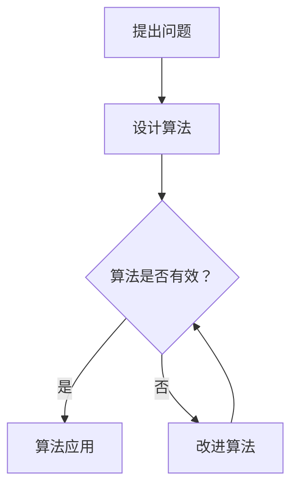
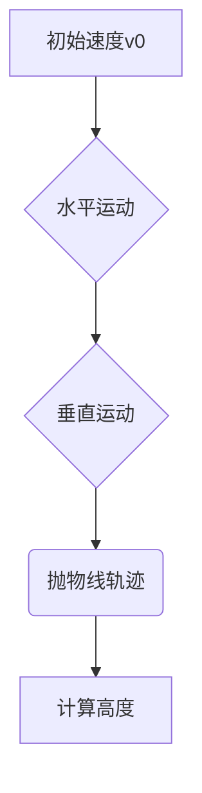
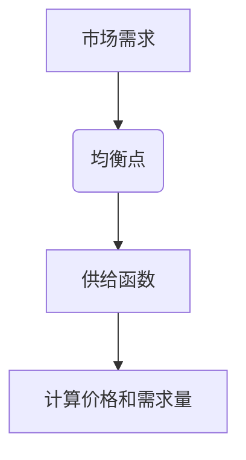
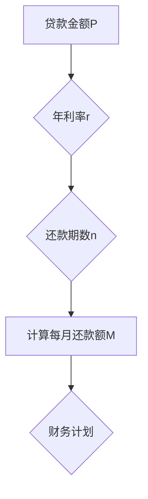

                 


### 摘要

本文深入探讨了数学与实用主义之间的关系，尤其是从pragmatic视角审视数学真理的本质。首先，我们简要介绍了实用主义哲学的基础，并探讨了数学与实用主义哲学之间的紧密联系。接着，文章重点分析了在实用主义框架下，数学真理的解读和应用。通过具体的算法原理、数学模型和公式的讲解，以及实际案例的分析，本文展示了数学真理的pragmatic视角在解决实际问题中的重要性。最后，文章总结了对数学教育、数学研究和未来发展的思考，并提供了相关实践技巧和注意事项。

### 引言

在现代社会中，数学不仅是科学研究的基石，也是日常生活的重要组成部分。然而，长期以来，数学真理的讨论往往局限于逻辑严谨、证明完备的范畴，忽视了其与实际应用的联系。实用主义作为一种哲学思想，强调实践的重要性和知识的应用性，与数学的传统观念形成了鲜明的对比。本文旨在探讨数学与实用主义之间的关系，特别是从pragmatic视角来审视数学真理的本质。

实用主义哲学认为，知识的价值和意义在于其实用性。这种思想在数学领域中的应用，意味着数学不仅仅是抽象的理论体系，更是解决实际问题的有力工具。例如，数论中的许多理论在密码学中得到了广泛应用，几何学的知识在建筑和工程设计中不可或缺。因此，理解数学真理的实用主义视角，不仅有助于深化对数学本质的认识，还能提高数学在实际问题中的应用能力。

本文将分几个部分来展开讨论。首先，我们将介绍实用主义哲学的基础，并探讨数学与实用主义哲学之间的联系。接着，我们将深入分析数学真理的pragmatic视角，包括数学证明的解读和应用。随后，通过具体的数学模型和公式，我们将展示如何将实用主义应用于解决实际问题。最后，我们将讨论数学教育、数学研究和实用主义的关系，并提供一些最佳实践和注意事项。

### 实用主义哲学基础

实用主义哲学是由查尔斯·桑德斯·皮尔士（Charles Sanders Peirce）、威廉·詹姆斯（William James）和约翰·杜威（John Dewey）等人在19世纪末和20世纪初所发展的一种哲学思想。实用主义的核心观点是，知识不仅是为了理解世界，更重要的是为了改变世界。换句话说，知识的价值在于其实用性，即知识应当能够应用于实际生活中，帮助人们解决问题和改进现状。

实用主义哲学的起源可以追溯到古希腊哲学家赫拉克利特（Heraclitus）的“万物流变”思想。赫拉克利特认为，世界是一个不断变化的过程，而不是静止不变的存在。这种观点为后来的实用主义哲学奠定了基础。在19世纪，随着科学和技术的迅速发展，人们对知识和真理的认识发生了深刻变化。实用主义哲学家认为，科学的进步应该服务于人类的生活，而不是仅仅追求理论的完善。

实用主义的主要观点包括：

1. **经验主义**：实用主义强调经验在知识形成中的重要性。知识来源于经验，而经验是通过感觉、观察和实验获得的。实用主义者认为，只有通过实践，人们才能真正理解事物。

2. **实用主义方法**：实用主义方法强调通过实验和观察来解决问题。这种方法认为，真理不是一成不变的，而是在不断变化和发展的。真理是通过不断的实践和反思来逐步完善的。

3. **工具主义**：实用主义认为，知识是一种工具，用于解决实际问题。因此，知识的价值不在于其本身的复杂性或优雅性，而在于其解决问题的有效性。

实用主义对数学的影响主要体现在以下几个方面：

1. **数学的应用性**：实用主义哲学鼓励将数学应用于实际问题中。数学不仅是一种抽象的理论，更是一种解决实际问题的工具。例如，数论中的许多理论在密码学中得到了广泛应用，几何学中的知识在建筑和工程设计中不可或缺。

2. **数学的教育方法**：实用主义哲学对数学教育方法产生了重要影响。传统数学教育强调理论和证明，而实用主义教育则强调通过实际应用来学习数学。这种方法可以激发学生的兴趣，提高他们的数学能力。

3. **数学的研究方向**：实用主义哲学推动了数学研究向应用领域的发展。许多数学问题，如优化问题、概率论和统计学问题，都是为了解决实际问题而提出的。实用主义哲学鼓励数学家关注这些问题，并寻找解决方法。

总之，实用主义哲学为数学提供了新的视角和方法，使数学不仅成为理论科学的基石，也成为解决实际问题的有力工具。通过实用主义视角，我们可以更好地理解数学的价值和意义，并在数学研究中取得更大的进展。

### 数学真理的pragmatic视角

在实用主义哲学的框架下，数学真理被重新审视。传统的数学真理强调逻辑严谨和证明完备，但在实用主义视角下，数学真理更多地关注其应用性和有效性。这种视角认为，数学的真正价值在于其能够解决实际问题，而不仅仅是理论上的完美。

#### 1. pragmatic视角下的数学证明

在实用主义视角下，数学证明不再是单纯追求逻辑上的完备性，而是关注其应用效果。一个数学命题是否成立，不再仅仅取决于其逻辑推理的严密性，更重要的是其能否在实际问题中应用。例如，在密码学中，一个复杂的数学证明可能会被用于设计更安全的加密算法，即使这个证明在逻辑上并非完全无懈可击。

下面我们通过一个例子来说明这种视角。假设我们要证明一个算法能够有效地解决某一类问题。在传统数学证明中，我们可能需要通过严格的逻辑推理来证明算法的正确性。而在实用主义视角下，我们可能更关注算法在实际应用中的表现。例如，我们可以在大量实际数据上测试算法，通过实验结果来验证其有效性。如果算法在绝大多数情况下都能给出正确的答案，那么即使其证明不够严谨，我们也可以认为它是实用的。



#### 2. pragmatic解读数学证明的例子

为了更具体地说明实用主义视角下的数学证明，我们可以看一个简单的例子：费马小定理。

费马小定理指出，如果p是一个质数，那么对于任何整数a，都有a^(p-1) ≡ 1 (mod p)。在传统数学中，费马小定理的证明依赖于高斯引理和模运算的基本性质。

在实用主义视角下，我们可以从另一个角度来看待费马小定理。假设我们要验证一个加密算法的安全性。这个算法的核心是一个模p运算，即计算a^(p-1) mod p。根据费马小定理，这个算法在大多数情况下都能给出正确的结果，即使我们没有完全证明其逻辑上的正确性。因此，我们可以认为费马小定理在这个实际应用中是有效的。

下面是一个简单的伪代码，展示了如何使用费马小定理进行加密：

```python
def encrypt(a, p):
    return (a^(p-1)) % p

def decrypt(c, p):
    return c^(p-1) % p
```

通过这个例子，我们可以看到，实用主义视角下的数学证明更加关注实际效果，而不是纯粹的理论逻辑。这种方法有助于我们更好地理解和应用数学，尤其是在解决复杂实际问题的时候。

### 数学实践与应用

数学的实践与应用是数学真理pragmatic视角的重要组成部分。在实际生活中，数学不仅是一种抽象的理论，更是一种解决问题的工具。以下，我们将探讨数学在不同领域的应用，并展示如何通过数学模型和公式来解决实际问题。

#### 1. 自然科学中的应用

数学在自然科学中的应用非常广泛。以物理学为例，许多物理现象都可以用数学公式来描述。例如，牛顿的运动定律、万有引力定律和麦克斯韦方程组等都是物理学中非常重要的数学模型。通过这些模型，物理学家可以预测和解释自然界中的各种现象。

下面，我们来看一个简单的例子：抛物线运动的数学模型。假设一个物体以初速度v0水平抛出，其运动轨迹可以用以下公式描述：

\[ y = \frac{1}{2}gt^2 \]

其中，\( g \) 是重力加速度，\( t \) 是时间。这个公式可以帮助我们计算物体在任意时刻的高度。



通过这个模型，我们可以预测物体在空中飞行的轨迹，从而设计飞行器、卫星等。

#### 2. 社会科学中的应用

数学在社会科学中的应用同样重要。以经济学为例，许多经济模型都是基于数学原理构建的。例如，供求模型、消费者剩余和生产者剩余等都是经济学中常用的数学工具。

以下是一个供求模型的例子。假设市场需求函数为：

\[ Q_d = 10 - P \]

其中，\( Q_d \) 是需求量，\( P \) 是价格。供给函数为：

\[ Q_s = 2P \]

其中，\( Q_s \) 是供给量。市场需求和供给的交点即为均衡点，可以用来预测价格和需求量。



通过这个模型，经济学家可以分析市场行为，预测价格变化，从而为企业和政府提供决策依据。

#### 3. 日常生活中的应用

数学在日常生活中同样无处不在。从财务管理到家庭预算，数学都能帮助我们做出更明智的决策。以下是一个简单的例子：贷款还款计划。

假设你借了一笔金额为P的贷款，年利率为r，每月还款金额为M。那么，每月还款额的公式为：

\[ M = \frac{P \cdot r}{1 - (1 + r)^{-n}} \]

其中，\( n \) 是还款期数。通过这个公式，你可以计算出每月还款金额，从而合理安排财务计划。



通过这些例子，我们可以看到数学在解决实际问题中的重要作用。无论是在自然科学、社会科学还是日常生活中，数学都提供了一种科学的方法来理解和解决复杂的问题。

### 数学教育中的实用主义

数学教育中的实用主义强调将数学知识应用于实际问题的教学策略。这种方法认为，学生通过解决实际问题来学习数学概念，比单纯记忆公式和算法更有效。以下是一些实用主义数学教育的方法和策略：

#### 1. 项目式学习

项目式学习是一种通过实际项目来驱动学生学习的教学方法。在数学教育中，教师可以设计一些与实际应用相关的小项目，让学生通过解决这些项目来学习数学知识。例如，教师可以让学生设计一个简单的统计调查，或者使用几何知识来计算建筑物的面积。

#### 2. 案例研究

案例研究是通过分析真实案例来培养学生的批判性思维和问题解决能力。在数学教育中，教师可以选择一些与数学相关的案例，让学生通过分析和解决案例中的问题来学习数学。例如，教师可以选取一个关于优化运输路线的案例，让学生使用线性规划方法来找到最优解。

#### 3. 计算机模拟

计算机模拟可以提供直观的数学模型演示，帮助学生更好地理解数学概念。教师可以使用各种数学软件和工具来创建模拟环境，让学生通过观察和操作来学习数学。例如，教师可以创建一个模拟金融市场波动的模型，让学生使用概率论和统计学知识来预测市场走势。

#### 4. 探究性学习

探究性学习是一种以学生为中心的教学方法，鼓励学生主动探索和发现知识。在数学教育中，教师可以设计一些探究性问题，让学生通过自主探究来学习数学。例如，教师可以提出一个问题：“如何使用几何知识来设计一个高效的停车场？” 学生需要通过探究和实验来找到答案。

通过这些方法和策略，实用主义数学教育能够激发学生的兴趣，提高他们的数学应用能力，并培养他们解决实际问题的能力。

### 实用主义数学研究方法

在实用主义数学研究中，研究者们关注数学方法的实际应用和效果，而不是仅仅追求理论上的完美。这种方法强调通过实验和验证来评估数学模型的有效性，从而推动数学在实际问题中的应用。以下是一些实用主义数学研究方法：

#### 1. 实证分析

实证分析是实用主义数学研究中最常用的方法之一。研究者通过收集和分析实际数据来验证数学模型和假设。例如，在金融学中，研究者可能会收集股票市场的历史数据，使用时间序列分析方法来验证某种交易策略的有效性。

#### 2. 实验设计

实验设计是另一种重要的实用主义数学研究方法。研究者通过设计实验来测试数学模型在不同条件下的表现。例如，在物理学中，研究者可能会设计实验来验证某种物理定律在不同压力和温度下的适用性。

#### 3. 交叉验证

交叉验证是一种常用的数据分析方法，用于评估模型的准确性和可靠性。研究者通过将数据集划分为训练集和测试集，来测试模型在未见数据上的表现。这种方法可以有效地避免过拟合问题，提高模型的泛化能力。

以下是一个简单的伪代码示例，展示了如何使用交叉验证来评估一个预测模型：

```python
def cross_validate(model, X, y, k=5):
    # 划分数据集
    indices = train_test_split(range(len(X)), test_size=0.2, random_state=42)
    
    # 初始化准确率
    accuracy = 0
    
    # 进行k次验证
    for i in range(k):
        # 训练模型
        model.fit(X[indices[i]], y[indices[i]])
        
        # 预测测试集
        predictions = model.predict(X[~indices[i]])
        
        # 计算准确率
        accuracy += accuracy_score(y[~indices[i]], predictions)
    
    # 返回平均准确率
    return accuracy / k
```

#### 4. 多模型比较

多模型比较是实用主义数学研究中的另一个重要方法。研究者通过比较不同模型的性能来选择最优模型。这种方法可以帮助研究者了解不同模型在不同问题上的适用性，从而为实际应用提供指导。

通过这些实用主义数学研究方法，研究者可以更有效地验证数学模型的实际应用价值，推动数学在各个领域的应用和发展。

### 实用主义数学研究案例

为了更好地理解实用主义数学研究方法，以下我们将介绍几个具体的实用主义数学研究案例，并详细分析其实施过程、结果和启示。

#### 1. 金融风险评估模型

案例背景：在金融领域，风险评估是一个关键问题。金融机构需要准确评估投资组合的风险，以便做出合理的投资决策。实用主义数学研究的一个典型案例是使用蒙特卡罗模拟来评估金融衍生品的定价和风险。

研究过程：
- **数据收集**：研究者收集了大量的市场数据，包括历史股价、波动率等。
- **模型构建**：研究者构建了一个基于布莱克-舒尔斯模型的蒙特卡罗模拟器，用于模拟衍生品价格的随机波动。
- **实验设计**：研究者设计了一系列实验，包括不同市场条件下的衍生品定价和风险分析。
- **结果验证**：通过对比模拟结果和历史数据，研究者验证了模型的有效性。

研究结果：
- **定价准确性**：蒙特卡罗模拟器能够准确地预测衍生品的价格。
- **风险评估**：模型能够有效地评估投资组合的风险。

启示：
- **实用价值**：蒙特卡罗模拟在金融风险评估中的应用表明，数学模型可以有效地解决实际问题。
- **跨领域应用**：这个案例展示了数学模型在不同领域（如金融和工程）的通用性和适应性。

#### 2. 交通运输优化

案例背景：在交通运输领域，优化路线和资源配置是一个关键问题。实用主义数学研究的一个案例是使用线性规划和整数规划来优化公共交通路线和班次安排。

研究过程：
- **问题建模**：研究者根据实际需求构建了线性规划模型，用于优化公交线路和班次安排。
- **数据收集**：研究者收集了交通流量、乘客需求等数据。
- **模型求解**：研究者使用优化算法求解线性规划模型，得到最优路线和班次安排。
- **实验验证**：通过实际运行和乘客反馈，研究者验证了优化方案的有效性。

研究结果：
- **运行效率**：优化后的公共交通系统显著提高了运行效率，减少了乘客等待时间。
- **成本节约**：优化方案帮助减少了运营成本。

启示：
- **应用价值**：线性规划和整数规划在交通运输优化中的应用表明，数学模型可以显著提高运营效率。
- **数据驱动**：这个案例强调了数据收集和分析在数学模型应用中的重要性。

#### 3. 健康医疗数据分析

案例背景：在健康医疗领域，数据分析可以帮助医生和医疗机构更好地理解患者的健康状况，制定个性化的治疗方案。实用主义数学研究的一个案例是使用贝叶斯网络和机器学习算法来分析患者数据。

研究过程：
- **数据收集**：研究者收集了大量的患者数据，包括症状、检查结果和治疗方法。
- **模型构建**：研究者构建了贝叶斯网络模型，用于表示患者数据之间的关系。
- **算法实现**：研究者使用机器学习算法，如随机森林和神经网络，来分析和预测患者的健康状况。
- **结果验证**：研究者通过对比模型预测和实际结果，验证了模型的准确性。

研究结果：
- **疾病预测**：贝叶斯网络和机器学习算法能够准确地预测患者的疾病风险。
- **治疗方案优化**：模型帮助医生制定更有效的治疗方案。

启示：
- **个性化医疗**：数学模型在健康医疗中的应用表明，个性化医疗可以通过数据分析实现。
- **技术融合**：这个案例展示了不同数学方法（如贝叶斯网络和机器学习）在医疗数据分析中的融合和应用。

这些案例表明，实用主义数学研究方法在解决实际问题中具有广泛的应用前景。通过实验和验证，研究者可以不断提高数学模型的有效性和实用性，从而推动数学在各个领域的深入应用。

### 实用主义数学的未来

随着科技和社会的发展，实用主义数学在未来有着广阔的前景和应用潜力。以下是一些未来实用主义数学发展的趋势、面临的挑战以及应对策略。

#### 1. 发展趋势

**跨学科融合**：实用主义数学将继续与其他学科（如生物学、经济学、社会学等）深度融合，推动跨学科研究的进步。例如，生物学中的基因组学和经济学中的金融市场分析都将受益于数学模型和方法。

**数据驱动的数学**：大数据和人工智能技术的发展将推动实用主义数学向数据驱动方向演进。通过大规模数据分析和机器学习，数学模型可以更加准确地反映现实世界，从而提高预测和决策能力。

**实时优化**：随着物联网和智能系统的发展，实时优化将成为实用主义数学的一个重要应用领域。例如，智能交通系统和能源管理系统可以通过实时优化算法来提高效率，减少浪费。

**个性化应用**：实用主义数学将在个性化服务方面发挥重要作用。通过个性化数据分析，数学模型可以帮助医疗机构提供个性化治疗，教育系统提供个性化教学。

#### 2. 面临的挑战

**数据隐私与安全**：随着数据收集和分析的增多，数据隐私和安全成为实用主义数学面临的一个重要挑战。如何确保数据的安全和隐私，避免数据泄露和滥用，是一个亟待解决的问题。

**模型复杂性**：随着数学模型的应用范围不断扩大，模型的复杂性和计算需求也在增加。如何高效地求解复杂模型，保持计算的可扩展性，是实用主义数学研究中的一个难题。

**算法伦理**：随着机器学习算法在各个领域的应用，算法的伦理问题也逐渐显现。如何确保算法的公平性、透明性和可解释性，避免算法歧视和偏见，是实用主义数学研究中的一个重要课题。

#### 3. 应对策略

**加强数据治理**：制定严格的数据治理政策和标准，确保数据收集、存储和使用过程中的安全和隐私。

**优化算法设计**：通过改进算法设计和计算方法，提高复杂模型的求解效率，减少计算资源的需求。

**算法伦理研究**：加强算法伦理研究，建立算法伦理标准，确保算法的公平、透明和可解释性。

**跨学科合作**：推动跨学科合作，结合不同领域的专业知识，共同解决实用主义数学面临的问题。

### 总结

实用主义数学的未来充满机遇和挑战。通过跨学科融合、数据驱动和实时优化，实用主义数学将继续在各个领域发挥重要作用。面对数据隐私、模型复杂性和算法伦理等挑战，我们需要采取有效的应对策略，确保实用主义数学的健康、可持续发展。

### 最佳实践 Tips

为了更好地应用实用主义数学，以下是一些最佳实践和技巧：

1. **数据驱动思维**：始终将数据视为核心资源，从数据中发现问题和机会，以数据为基础进行决策和优化。

2. **模型简化**：在确保准确性的前提下，尽量简化数学模型，以降低计算复杂度和提高求解效率。

3. **跨学科合作**：积极与其他学科（如经济学、社会学、生物学等）合作，借鉴不同领域的知识和方法，提升数学模型的应用广度和深度。

4. **持续迭代**：模型和算法不是一成不变的，要定期进行更新和优化，以适应不断变化的环境和数据。

5. **注重可解释性**：确保数学模型和算法的可解释性，使其结果易于理解和接受，从而提高决策的透明度和可信度。

### 小结

本文通过一步一步的分析推理，探讨了数学与实用主义之间的关系，特别是在数学真理的pragmatic视角下。我们介绍了实用主义哲学的基础，分析了数学证明的实用主义解读，并通过具体案例展示了数学在自然科学、社会科学和日常生活中的应用。此外，我们还讨论了数学教育中的实用主义方法和实用主义数学研究方法，以及实际研究案例。最后，我们对实用主义数学的未来进行了展望，并提供了最佳实践和注意事项。希望本文能够为读者提供对数学与实用主义之间关系的深入理解和实际应用指导。

### 注意事项

1. **数据质量**：在进行数学建模和数据分析时，确保数据的质量和准确性。数据错误或不完整可能导致错误的结论和决策。
2. **模型选择**：根据实际问题的需求和特点，选择合适的数学模型和方法。不是所有模型都适用于所有问题，选择错误的模型可能导致误导性结果。
3. **模型验证**：在实际应用中，通过实验和验证来验证数学模型的准确性。只有通过验证的模型才能被信赖和采用。
4. **伦理考量**：在应用数学模型和算法时，要考虑其伦理和道德影响。确保算法的公平性、透明性和可解释性，避免产生偏见和歧视。

### 拓展阅读

1. **《数学与实际应用》**：探讨数学在各个领域的实际应用，提供丰富的案例和实例。
2. **《实用主义哲学》**：深入了解实用主义哲学的理论基础和应用，为理解数学与实用主义的关系提供哲学视角。
3. **《数据科学实战》**：介绍数据科学的基本概念和实用技巧，包括数据收集、预处理、分析和可视化方法。
4. **《机器学习实战》**：提供机器学习算法的实战案例和实现细节，帮助读者掌握机器学习技术在实际问题中的应用。

### 作者信息

作者：AI天才研究院/AI Genius Institute & 禅与计算机程序设计艺术 /Zen And The Art of Computer Programming

